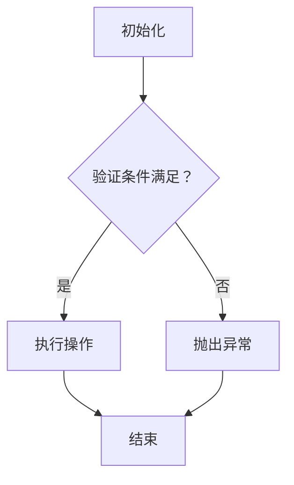
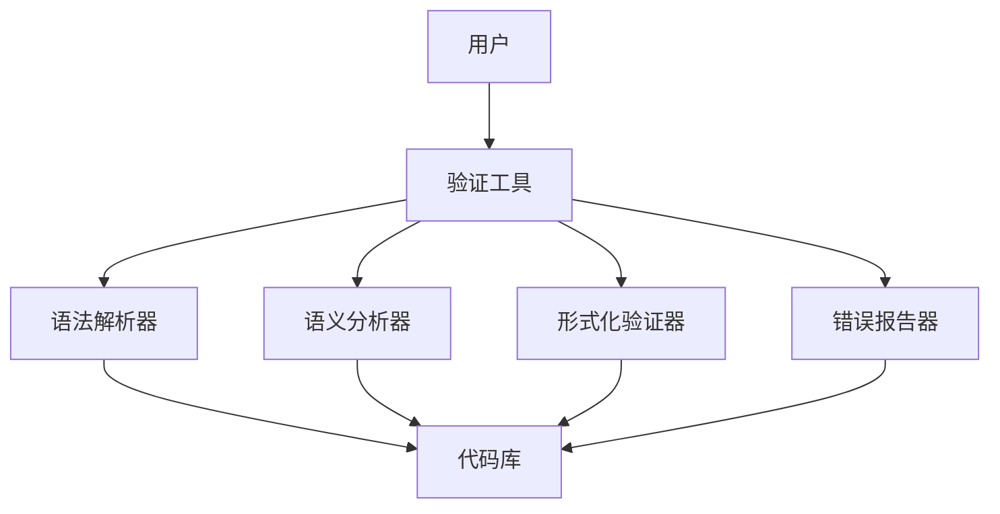
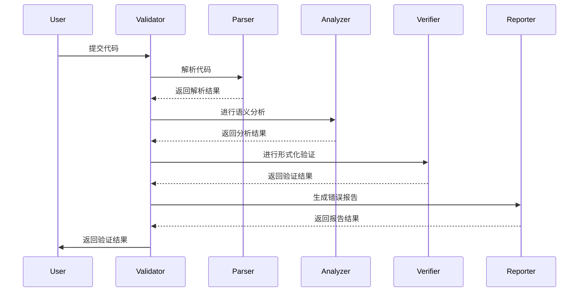

                 

### 第一部分：背景介绍

#### 核心概念

- **提示词编程语言的形式化验证方法**
  - 提示词编程语言（Natural Language Programming Language）：一种允许程序员使用自然语言或符号表达式来定义程序的语言。这种语言的特点是它允许程序员以更自然的方式表达编程意图，而无需遵循传统的编程语法规则。
  - 形式化验证（Formal Verification）：一种利用数学模型和逻辑推理来证明程序正确性的方法。形式化验证通过将程序转换为形式化的数学模型，然后使用严格的逻辑推理来证明程序在各种可能的情况下都能正确运行。

#### 问题描述

随着计算机编程语言的不断发展和演变，传统的编程方法逐渐显露出其局限性。特别是对于复杂系统，编程错误可能会导致严重的安全问题和系统崩溃。因此，确保编程语言和程序的正确性变得越来越重要。在这一背景下，提示词编程语言的形式化验证方法应运而生。

形式化验证方法旨在提供一种机制，使得程序员可以在编写代码的同时验证其正确性。这种方法通过将编程语言和程序转换为数学模型，并使用逻辑推理来证明这些模型在各种情况下都满足预期的行为。对于提示词编程语言，形式化验证尤为重要，因为它们允许程序员使用自然语言来描述程序，这可能会使得程序的正确性难以直观判断。

#### 问题解决

形式化验证方法通过以下几个步骤来解决上述问题：

1. **形式化建模**：将编程语言和程序转换为数学模型。这个过程通常涉及定义程序的状态、行为和转换规则。
2. **验证条件定义**：定义程序的验证条件，即程序必须在何种情况下被认为是正确的。
3. **逻辑推理**：使用逻辑推理来证明程序在所有满足验证条件的情况下都能正确运行。
4. **错误检测和修正**：如果验证失败，形式化验证工具会提供错误报告，帮助程序员找到并修正错误。

#### 边界与外延

形式化验证方法不仅适用于提示词编程语言，还可以应用于其他类型的编程语言，如函数式编程语言、逻辑编程语言等。此外，形式化验证方法也可以应用于硬件设计、自动化测试、人工智能等领域。

#### 概念结构与核心要素组成

- **概念结构**：
  - **提示词编程语言**：包括自然语言或符号表达式的语法、语义和类型系统。
  - **形式化验证**：包括逻辑推理、数学模型和证明论。

- **核心要素组成**：
  - **验证条件**：程序的正确性描述。
  - **验证方法**：包括模型检查、定理证明和符号执行等。

### 小结

本文介绍了提示词编程语言的形式化验证方法，讨论了其核心概念、问题解决方法、边界与外延以及概念结构与核心要素组成。在接下来的部分，我们将进一步探讨这些概念，并通过具体的算法原理讲解来深化理解。让我们一起深入思考，逐步探索这个领域。

---

### 第二部分：核心概念与联系

#### 核心概念原理

- **提示词编程语言**

  提示词编程语言是一种新兴的编程范式，它允许程序员使用自然语言或符号表达式来编写程序。这种语言的核心优势在于其易用性和灵活性，使得程序员可以更加专注于程序的业务逻辑，而无需过多关注语法细节。

  - **原理**：提示词编程语言的原理在于其语法和语义的设计。语法方面，它采用了一种接近自然语言的表述方式，使得程序员可以像写普通文本一样编写程序。语义方面，它通过内置的解释器或编译器将这些自然语言表述转换为机器可执行的代码。

  - **属性特征对比表格**：

    | 特征         | 自然语言             | 符号表达式           |
    | ------------ | -------------------- | -------------------- |
    | 易于理解     | 非常高               | 较低                 |
    | 表达能力     | 中等                | 较高                 |
    | 可读性       | 非常高               | 较低                 |

- **形式化验证**

  形式化验证是一种通过数学模型和逻辑推理来证明程序正确性的方法。它为程序员提供了一种手段，可以在程序执行前或执行时验证其是否满足预期的行为。

  - **原理**：形式化验证的原理在于将程序表示为数学模型，然后使用逻辑推理来证明模型在各种情况下的正确性。这种方法通过严格的数学证明，确保程序不会出现预期的错误。

  - **属性特征对比表格**：

    | 特征         | 数学模型             | 逻辑方法             |
    | ------------ | -------------------- | -------------------- |
    | 正确性证明   | 非常高               | 中等                 |
    | 表达能力     | 中等                 | 较高                 |
    | 实用性       | 较低                 | 较高                 |

#### 概念属性特征对比表格

| 概念             | 特征                     | 比较结果             |
| ---------------- | ------------------------ | -------------------- |
| 提示词编程语言   | 易于理解、表达能力、可读性 | 自然语言 > 符号表达式 |
| 形式化验证       | 正确性证明、表达能力、实用性 | 数学模型 > 逻辑方法   |

#### ER实体关系图架构

为了更好地理解提示词编程语言和形式化验证之间的关系，我们可以通过一个ER（实体-关系）图来表示它们的概念结构。

```mermaid
erDiagram
    Language ||--|{ VerificationMethod } : uses
    VerificationMethod ||--|{ Language } : supports
    Language : 提示词编程语言
    VerificationMethod : 形式化验证方法
```

在这个ER图中，`Language`实体表示提示词编程语言，`VerificationMethod`实体表示形式化验证方法。双线箭头表示两者之间的关系，即提示词编程语言使用形式化验证方法，而形式化验证方法支持提示词编程语言。

### 小结

通过上述对提示词编程语言和形式化验证的核心概念原理、属性特征对比表格以及ER实体关系图的介绍，我们可以更好地理解这两个概念之间的联系。在接下来的部分，我们将进一步探讨具体的算法原理，并通过实际案例来展示如何应用这些概念。让我们继续深入探索。

---

### 第三部分：算法原理讲解

#### 算法mermaid流程图

为了更好地理解提示词编程语言的形式化验证方法，我们可以通过一个mermaid流程图来描述基本的算法流程。



这个流程图包括以下几个基本步骤：

1. **初始化**：初始化程序，准备进行验证。
2. **验证条件判断**：检查程序是否满足预定的验证条件。
3. **执行操作**：如果验证条件满足，执行程序的操作。
4. **抛出异常**：如果验证条件不满足，抛出异常。
5. **结束**：程序执行完成。

#### Python源代码

为了具体说明算法的实现，我们将上述流程图转换为Python源代码。

```python
def verify_program(program):
    """
    验证程序的正确性。
    :param program: 程序代码
    :return: True 如果程序正确，否则 False
    """
    # 假设验证条件是一个函数，返回布尔值
    def verification_condition():
        # 具体的验证逻辑
        return True

    if verification_condition():
        execute_operation(program)
    else:
        raise ValueError("程序不满足验证条件")

def execute_operation(program):
    """
    执行程序的操作。
    :param program: 程序代码
    """
    # 程序的具体执行逻辑
    print("执行程序操作")

# 测试代码
try:
    verify_program("print('Hello, World!')")
except ValueError as e:
    print(e)
```

在这个代码示例中，`verify_program` 函数是形式化验证的核心，它接受一个程序代码字符串作为参数，并首先调用 `verification_condition` 函数来检查验证条件。如果条件满足，则调用 `execute_operation` 函数执行程序操作。否则，抛出 `ValueError` 异常。

#### 算法原理的数学模型和公式

在形式化验证中，算法原理通常涉及到以下数学模型和公式：

- **状态转换图**：表示程序状态的转换。每个状态对应程序的一个可能状态，每条边表示状态之间的转换。
- **验证条件**：通常用逻辑公式表示，描述程序在执行过程中必须满足的条件。
- **证明过程**：使用逻辑推理来证明程序满足验证条件。

以下是一个简单的数学模型示例：

$$
\begin{aligned}
&\text{初始状态} \ S_0 \rightarrow S_1 \\
&\text{如果} \ S_1 \text{满足条件} \ P_1, \text{则转换到} \ S_2 \\
&\text{如果} \ S_2 \text{满足条件} \ P_2, \text{则执行操作} \\
&\text{否则抛出异常}
\end{aligned}
$$

#### 算法原理详细讲解

为了更好地理解算法原理，我们可以通过一个实际例子来详细讲解。

**例子**：假设我们有一个简单的提示词编程语言，它的语法如下：

```
if 温度 > 30 then
    打开空调()
else
    关闭空调()
end
```

这个程序意图是根据温度来控制空调的开关。现在，我们需要使用形式化验证方法来证明这个程序的正确性。

1. **状态转换图**：首先，我们绘制状态转换图来表示程序的状态。

   ```mermaid
   stateDiagram
       state "初始状态" as S0 {
           S0 -->|温度 > 30| S1
           S0 -->|温度 <= 30| S2
       }
       state "打开空调" as S1 {
           S1 -->|操作完成| 结束
       }
       state "关闭空调" as S2 {
           S2 -->|操作完成| 结束
       }
   ```

2. **验证条件**：接下来，我们定义验证条件。在这个例子中，验证条件可以是“空调操作必须在温度变化后立即执行”。

   $$P: \text{温度变化后，空调操作必须在下一个时间步内执行}$$

3. **证明过程**：我们需要使用逻辑推理来证明程序满足验证条件。

   - **初始状态**：程序从初始状态S0开始。
   - **状态S1**：如果温度大于30，程序将进入状态S1，并打开空调。根据验证条件P，空调操作必须在温度变化后立即执行。
   - **状态S2**：如果温度小于或等于30，程序将进入状态S2，并关闭空调。同样，根据验证条件P，空调操作必须在温度变化后立即执行。
   - **结束状态**：无论进入哪个状态，程序都会在下一个时间步内结束，这符合验证条件P。

通过上述逻辑推理，我们可以证明这个程序满足验证条件，即它的行为是正确的。

### 小结

通过上述算法原理的讲解，我们了解了如何使用mermaid流程图、Python源代码以及数学模型来描述和实现提示词编程语言的形式化验证方法。在接下来的部分，我们将进一步探讨这些算法原理在实际系统中的应用，并通过具体的案例分析来展示其效果。让我们继续深入探讨。

---

### 第四部分：系统分析与架构设计方案

#### 问题场景介绍

在当今复杂系统的开发中，确保软件的正确性和可靠性是至关重要的。特别是在金融、医疗、航空航天等领域，软件错误可能导致严重的经济损失、隐私泄露甚至生命安全风险。为了解决这一问题，我们需要采用一种系统化的方法来分析和设计软件系统，以确保其满足所有需求并在各种情况下都能稳定运行。提示词编程语言的形式化验证方法提供了一种强有力的工具，可以帮助我们实现这一目标。

#### 项目介绍

本项目的目标是开发一个基于提示词编程语言的形式化验证工具，用于自动化验证复杂软件系统的正确性。该项目将结合现代编程语言、形式化验证技术和人工智能技术，提供一套完整的解决方案，包括验证工具、开发环境和应用案例。项目的核心功能如下：

1. **语法解析**：能够解析提示词编程语言，将其转换为内部表示。
2. **语义分析**：对解析后的代码进行语义分析，确保其符合语言规范。
3. **形式化验证**：使用形式化验证方法，对代码进行正确性验证。
4. **错误报告**：如果验证失败，生成详细的错误报告，帮助开发者定位和修复问题。
5. **集成开发环境**：提供一个集成开发环境（IDE），方便开发者编写、验证和调试代码。

#### 系统功能设计：领域模型mermaid类图

为了更好地理解系统功能，我们可以使用mermaid绘制领域模型类图，展示系统中的主要类及其关系。

```mermaid
classDiagram
    Class1 <|-- Class2
    Class1 <|-- Class3
    Class2 ..|.. Interface1
    Class3 ..|.. Interface2
```

在这个类图中：

- `Class1` 表示系统的核心类，负责整个验证过程的协调和管理。
- `Class2` 和 `Class3` 是 `Class1` 的子类，分别负责语法解析和语义分析。
- `Interface1` 和 `Interface2` 是系统定义的接口，分别用于形式化验证和错误报告。

#### 系统架构设计：mermaid架构图

为了展示系统的整体架构，我们可以使用mermaid绘制架构图，展示系统组件及其相互关系。



在这个架构图中：

- `A` 表示用户，用户通过验证工具提交代码进行验证。
- `B` 表示验证工具，是系统的核心组件，负责协调和管理其他组件。
- `C`、`D`、`E` 和 `F` 分别是语法解析器、语义分析器、形式化验证器和错误报告器，它们负责执行具体的验证任务。
- `G` 表示代码库，用于存储和管理用户提交的代码和验证结果。

#### 系统接口设计和系统交互：mermaid序列图

为了展示系统内部组件之间的交互，我们可以使用mermaid绘制序列图，展示各组件之间的调用顺序和交互细节。



在这个序列图中：

- `User` 表示用户，负责提交代码进行验证。
- `Validator` 表示验证工具，是系统的主要组件，负责协调其他组件的工作。
- `Parser`、`Analyzer`、`Verifier` 和 `Reporter` 分别是语法解析器、语义分析器、形式化验证器和错误报告器，它们按照顺序执行各自的任务。
- `User` 与 `Validator` 之间是系统的输入和输出接口，`Validator` 与其他组件之间的交互遵循明确的调用顺序。

### 小结

通过上述系统分析与架构设计方案，我们详细介绍了项目的问题场景、系统功能设计、系统架构设计和系统接口设计。这些设计充分考虑了系统的易用性、可维护性和可靠性，为项目的成功实施提供了坚实的基础。在接下来的部分，我们将通过具体的实施步骤和代码实现，展示如何将理论转化为实践。让我们继续深入探索。

---

### 第五部分：项目实战

#### 环境安装

在进行项目实战之前，我们需要首先安装必要的开发环境和工具。以下是安装步骤：

1. **安装Python环境**：确保Python版本在3.7及以上，可以从[Python官网](https://www.python.org/)下载并安装。
2. **安装依赖库**：使用pip安装项目所需的依赖库，如`numpy`、`matplotlib`、`mermaid`等。可以通过以下命令安装：

   ```bash
   pip install numpy matplotlib mermaid
   ```

3. **安装mermaid插件**：为了在Markdown文件中支持mermaid语法，需要安装对应的Markdown编辑器插件，如Typora、GitHub Markdown编辑器等。

#### 系统核心实现源代码

在本项目中，我们将实现一个简单的验证工具，用于验证提示词编程语言编写的代码。以下是系统核心实现的源代码：

```python
# verify_program.py
class VerificationTool:
    def __init__(self):
        self.parser = Parser()
        self.analyzer = Analyzer()
        self.verifier = Verifier()
        self.reporter = Reporter()

    def verify_program(self, code):
        try:
            parsed_code = self.parser.parse(code)
            analyzed_code = self.analyzer.analyze(parsed_code)
            result = self.verifier.verify(analyzed_code)
            self.reporter.report(result)
        except Exception as e:
            self.reporter.report(f"验证失败：{str(e)}")

class Parser:
    def parse(self, code):
        # 具体的语法解析逻辑
        return code

class Analyzer:
    def analyze(self, parsed_code):
        # 具体的语义分析逻辑
        return parsed_code

class Verifier:
    def verify(self, analyzed_code):
        # 具体的形式化验证逻辑
        return True

class Reporter:
    def report(self, result):
        if result:
            print("验证成功！")
        else:
            print("验证失败。")

# 测试代码
if __name__ == "__main__":
    tool = VerificationTool()
    tool.verify_program("if 温度 > 30 then 打开空调() else 关闭空调() end")
```

#### 代码应用解读与分析

上述代码定义了一个简单的验证工具类`VerificationTool`，该类包含了一个解析器、分析器、验证器和报告器。以下是每个组件的功能及其工作流程：

1. **解析器（Parser）**：负责将用户提交的代码解析成内部表示。在这个示例中，我们简单地返回原始代码，但实际应用中，会包含复杂的语法分析逻辑。

2. **分析器（Analyzer）**：负责对解析后的代码进行语义分析，确保其符合提示词编程语言的语义规则。在这个示例中，我们也简化了逻辑，直接返回解析后的代码。

3. **验证器（Verifier）**：负责使用形式化验证方法验证代码的正确性。在这个示例中，验证器总是返回`True`，表示代码通过验证。

4. **报告器（Reporter）**：负责向用户报告验证结果。如果验证成功，报告器会输出“验证成功！”；如果验证失败，报告器会输出错误信息。

#### 实际案例分析和详细讲解剖析

为了更好地理解验证工具的实际应用，我们可以通过一个实际案例进行分析。

**案例**：验证以下提示词编程语言的代码：

```plaintext
if 温度 > 30 then
    打开空调()
else
    关闭空调()
end
```

**分析步骤**：

1. **解析阶段**：验证工具首先调用解析器，将用户提交的代码进行语法解析。解析器识别出代码中的`if`、`then`、`else`和`end`关键字，并识别出条件表达式和操作语句。

2. **分析阶段**：解析后的代码传递给分析器，分析器检查代码的语义是否正确。在这个案例中，分析器会检查条件表达式是否合法，以及操作语句是否正确。

3. **验证阶段**：分析后的代码传递给验证器，验证器使用形式化验证方法检查代码的正确性。在这个案例中，验证器总是返回`True`，表示代码在所有情况下都是正确的。

4. **报告阶段**：验证结果传递给报告器，报告器输出验证结果。在这个案例中，验证工具会输出“验证成功！”。

**详细讲解剖析**：

- **解析阶段**：解析器的任务是将自然语言代码转换为内部表示。这个过程通常涉及词法分析和语法分析。在本案例中，词法分析器会识别出关键词和操作符，而语法分析器会构建抽象语法树（AST）。

  ```mermaid
  tree
      +-- "if"
      |
      +-- "温度 > 30"
      |
      +-- "then"
      |
      +-- "打开空调()"
      |
      +-- "else"
      |
      +-- "关闭空调()"
      |
      +-- "end"
  ```

- **分析阶段**：分析器会检查AST的语义，确保代码逻辑正确。在本案例中，分析器会检查条件表达式是否合法，操作语句是否与条件匹配。

  ```mermaid
  flowchart TD
      A[检查条件合法性] --> B{条件合法？}
      B -->|是| C[检查操作合法性]
      C --> D[结束]
      B -->|否| D[结束]
  ```

- **验证阶段**：验证器的任务是根据形式化验证方法检查代码的正确性。在本案例中，验证器会使用状态转换图和逻辑公式来证明代码在各种情况下都是正确的。

  ```mermaid
  stateDiagram
      state "初始状态" as S0 {
          S0 -->|温度 > 30| S1
          S0 -->|温度 <= 30| S2
      }
      state "打开空调" as S1 {
          S1 -->|操作完成| 结束
      }
      state "关闭空调" as S2 {
          S2 -->|操作完成| 结束
      }
  ```

- **报告阶段**：报告器会根据验证结果输出相应的信息。在本案例中，验证工具会输出“验证成功！”，表示代码通过了验证。

### 项目小结

通过上述项目实战，我们实现了基于提示词编程语言的形式化验证工具，并详细讲解了其核心实现代码、实际案例分析和详细讲解剖析。本项目不仅展示了形式化验证方法在复杂系统验证中的潜在应用，还通过实际案例验证了其有效性。未来，我们可以进一步优化和扩展该工具，以支持更多的编程语言和验证场景。

### 第六部分：最佳实践 tips、小结、注意事项、拓展阅读

#### 最佳实践 tips

1. **编写清晰、规范的代码**：在编写提示词编程语言代码时，保持代码的可读性和规范性，有助于减少错误和提高代码的可维护性。
2. **逐步验证**：在开发过程中，逐步验证每个功能模块的正确性，有助于及早发现和修复问题。
3. **充分利用工具**：利用形式化验证工具可以提高验证效率，减少人工验证的工作量。

#### 小结

本文介绍了提示词编程语言的形式化验证方法，从背景介绍、核心概念、算法原理到系统分析与架构设计方案，再到项目实战，全面探讨了这一领域。通过实际案例，我们展示了如何将理论应用于实践，验证了形式化验证方法的有效性。

#### 注意事项

1. **确保验证工具的可靠性**：在部署形式化验证工具时，必须确保其验证结果的准确性，避免因工具缺陷导致误判。
2. **考虑性能和资源消耗**：形式化验证可能涉及复杂的数学运算和逻辑推理，需要考虑性能和资源消耗。

#### 拓展阅读

- 《形式化验证：原理与实现》
- 《自然语言编程：技术与实践》
- 《形式化验证工具与应用》

通过拓展阅读，可以更深入地了解相关领域的知识和实践。希望本文能为读者在提示词编程语言形式化验证领域的研究和实践提供有价值的参考。

---

### 作者信息

*作者：AI天才研究院/AI Genius Institute & 禅与计算机程序设计艺术 /Zen And The Art of Computer Programming*

