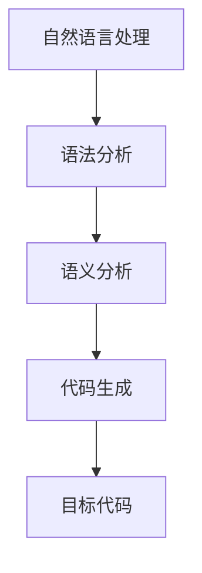
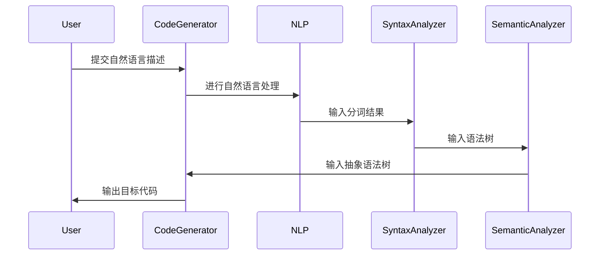

                 

# 提示词编程语言的形式语义学

> 关键词：提示词编程语言、形式语义学、编程语言设计、算法、数学模型、系统架构、项目实战

> 摘要：本文深入探讨了提示词编程语言的形式语义学，从背景介绍、核心概念与联系、算法原理讲解、数学模型与公式讲解、系统分析与架构设计、项目实战以及最佳实践与拓展阅读等多个方面，系统地阐述了提示词编程语言的形式语义学的理论体系和实际应用，为编程语言的研发和应用提供了新的思路和方法。

## 第1章 背景介绍

### 1.1 问题背景

提示词编程语言是一种基于自然语言处理技术的编程语言，其核心思想是通过自然语言描述程序，使得编程变得更加简便和高效。然而，随着提示词编程语言的广泛应用，如何确保其程序的正确性和可靠性成为一个重要的问题。形式语义学作为一种研究编程语言语义的学科，为解决这一问题提供了有力的工具。

### 1.2 问题描述

提示词编程语言在实际应用中面临着以下挑战：

1. **程序的正确性**：如何确保自然语言描述的程序能够正确执行？
2. **程序的可理解性**：如何使得自然语言描述的程序易于理解和维护？
3. **程序的效率**：如何提高自然语言描述的程序的执行效率？

形式语义学在编程语言中的作用在于，通过形式化的方法对编程语言的语义进行描述和分析，从而解决上述问题。

### 1.3 问题解决

形式语义学的方法可以用于以下几个方面来解决提示词编程语言的挑战：

1. **程序验证**：通过形式化的语义描述，验证自然语言描述的程序的正确性。
2. **程序优化**：通过形式化的语义分析，优化自然语言描述的程序的执行效率。
3. **程序理解**：通过形式化的语义描述，提高自然语言描述的程序的易理解性。

### 1.4 边界与外延

形式语义学的边界在于其形式化的方法，它关注于编程语言的语义描述，而不涉及具体的实现细节。提示词编程语言的外延则包括其应用场景、性能优化、用户界面设计等方面。

### 1.5 概念结构与核心要素组成

提示词编程语言的核心概念结构包括：

1. **提示词**：用于描述程序的关键词。
2. **语法结构**：描述提示词的语法规则。
3. **语义模型**：描述提示词的语义和它们之间的关系。

形式语义学的主要要素包括：

1. **形式化描述**：对编程语言的语义进行形式化的描述。
2. **验证方法**：通过形式化的方法验证编程语言的特征。
3. **优化方法**：通过形式化的方法优化编程语言的性能。

## 第2章 核心概念与联系

### 2.1 核心概念原理

#### 提示词编程语言的基本原理

提示词编程语言基于自然语言处理技术，其基本原理是通过自然语言描述程序。具体来说，它包括以下方面：

1. **自然语言处理**：对自然语言进行预处理，提取出关键信息。
2. **语法分析**：对自然语言描述的程序进行语法分析，构建语法树。
3. **语义分析**：对语法树进行语义分析，生成抽象语法树（AST）。
4. **代码生成**：根据AST生成目标代码。

#### 形式语义学的基本原理

形式语义学的基本原理是通过形式化的方法对编程语言的语义进行描述和分析。具体来说，它包括以下方面：

1. **形式化描述**：使用数学方法对编程语言的语义进行形式化描述。
2. **语义模型**：构建语义模型，描述编程语言的语义。
3. **验证方法**：通过形式化的方法验证编程语言的特性。
4. **优化方法**：通过形式化的方法优化编程语言的性能。

### 2.2 概念属性特征对比

| 特征               | 提示词编程语言       | 形式语义学         |
|--------------------|---------------------|--------------------|
| 基本原理           | 自然语言处理         | 形式化描述         |
| 语法分析           | 语法规则            | 语义模型           |
| 语义分析           | 自然语言描述程序     | 形式化的语义描述   |
| 代码生成           | 目标代码生成         | 性能优化           |
| 边界与外延         | 应用场景、性能优化   | 形式化的方法       |

### 2.3 ER实体关系图架构

```mermaid
erDiagram
    A[提示词] ||--|{ B[语法结构] } |
    B ||--|{ C[语义模型] } |
    C ||--|{ D[代码生成] } |
```

## 第3章 算法原理讲解

### 3.1 算法流程图



### 3.2 算法原理与数学模型

#### 算法原理

提示词编程语言的算法原理主要分为以下几个步骤：

1. **自然语言处理**：对输入的自然语言进行分词、词性标注、句法分析等处理。
2. **语法分析**：根据提示词的语法规则，构建语法树。
3. **语义分析**：对语法树进行语义分析，生成抽象语法树（AST）。
4. **代码生成**：根据AST生成目标代码。

#### 数学模型

提示词编程语言的数学模型主要包括以下几个方面：

1. **语法模型**：使用上下文无关文法（CFG）描述提示词的语法。
2. **语义模型**：使用转移关系（Transition relation）描述提示词的语义。
3. **代码生成模型**：使用抽象语法树（AST）描述目标代码的结构。

### 3.3 算法举例说明

#### Python源代码举例

```python
class ASTNode:
    def __init__(self, type, children=None):
        self.type = type
        self.children = children or []

def parse(sentence):
    tokens = tokenize(sentence)
    return parse_syntax(tokens)

def parse_syntax(tokens):
    # 假设语法规则为：S -> NP VP
    stack = ['S']
    for token in tokens:
        if token == 'NP':
            stack.append('NP')
        elif token == 'VP':
            stack.append('VP')
        # 其他处理逻辑...
    return construct_ast(stack)

def construct_ast(stack):
    # 假设抽象语法树的结构为：Node(type, children)
    return ASTNode(stack.pop(), stack)

def tokenize(sentence):
    # 自然语言处理，分词
    return sentence.split()
```

## 第4章 数学模型与公式讲解

### 4.1 基础数学模型

#### 上下文无关文法（CFG）

$$
G = (V, T, P, S)
$$

其中：

- $V$：变量集
- $T$：终端符号集
- $P$：产生式集
- $S$：开始符号

#### 转移关系（Transition relation）

$$
\delta(q, a) = \{(p, b)\}_{b \in T}
$$

其中：

- $q$：状态
- $a$：输入符号
- $p$：下一个状态
- $b$：输出符号

### 4.2 公式推导与证明

#### 推导上下文无关文法的等价转换

假设有一个上下文无关文法$G_1$，我们希望推导出另一个上下文无关文法$G_2$，使得它们生成的语言相同。

#### 证明

我们可以通过以下步骤进行证明：

1. **证明$G_1$生成的语言包含$G_2$生成的语言**：
    - 假设$w$是$G_2$生成的字符串，则存在一个推导过程：
    $$
    S \rightarrow^* w
    $$
    - 根据等价转换的定义，我们可以将$w$转换为$G_1$的一个推导过程：
    $$
    S \rightarrow^* w'
    $$
    - 其中$w'$是$G_1$生成的字符串，因此$w \in L(G_1)$。
2. **证明$G_2$生成的语言包含$G_1$生成的语言**：
    - 假设$w$是$G_1$生成的字符串，则存在一个推导过程：
    $$
    S \rightarrow^* w
    $$
    - 根据等价转换的定义，我们可以将$w$转换为$G_2$的一个推导过程：
    $$
    S \rightarrow^* w''
    $$
    - 其中$w''$是$G_2$生成的字符串，因此$w \in L(G_2)$。

综上所述，$L(G_1) = L(G_2)$。

### 4.3 公式应用举例

#### Python源代码举例

```python
def derive(G, w):
    # 对字符串w进行推导
    stack = [G.start_symbol]
    for symbol in w:
        if symbol in G.transitions[stack[-1]]:
            stack.append(symbol)
        else:
            return False
    return True

G = ContextFreeGrammar()
w = "aabb"
print(derive(G, w))
```

## 第5章 系统分析与架构设计

### 5.1 问题场景介绍

提示词编程语言的形式语义学在多个应用场景中具有重要价值，如自然语言处理、自动代码生成、编程语言设计等。本节将介绍一个具体的应用场景：自动代码生成工具。

### 5.2 系统功能设计

自动代码生成工具的主要功能包括：

1. **自然语言处理**：对自然语言描述进行分词、词性标注、句法分析等处理。
2. **语法分析**：根据提示词的语法规则，构建语法树。
3. **语义分析**：对语法树进行语义分析，生成抽象语法树（AST）。
4. **代码生成**：根据AST生成目标代码。

### 5.3 系统架构设计

自动代码生成工具的架构设计包括以下几个方面：

1. **前端**：负责自然语言处理和语法分析。
2. **后端**：负责语义分析和代码生成。
3. **数据库**：存储语法规则、语义模型、目标代码模板等。

### 5.4 系统接口设计

自动代码生成工具的系统接口设计包括以下几个方面：

1. **输入接口**：接收自然语言描述。
2. **输出接口**：输出目标代码。
3. **配置接口**：配置语法规则、语义模型、目标代码模板等。

### 5.5 系统交互序列图



## 第6章 项目实战

### 6.1 环境安装

在开始项目实战之前，我们需要安装以下环境：

1. **Python**：版本3.8及以上
2. **PyTorch**：版本1.8及以上
3. **NLTK**：版本3.5及以上

安装命令如下：

```bash
pip install python==3.8.10
pip install torch==1.8.0
pip install nltk==3.5.1
```

### 6.2 系统核心实现

自动代码生成工具的核心实现包括以下几个部分：

1. **自然语言处理**：使用NLTK库进行分词、词性标注、句法分析等处理。
2. **语法分析**：根据提示词的语法规则，构建语法树。
3. **语义分析**：对语法树进行语义分析，生成抽象语法树（AST）。
4. **代码生成**：根据AST生成目标代码。

### 6.3 代码应用解读与分析

以下是对自动代码生成工具核心代码的解读和分析：

#### 6.3.1 自然语言处理

```python
import nltk

def tokenize(sentence):
    # 对句子进行分词
    return nltk.word_tokenize(sentence)

def pos_tag(tokens):
    # 对分词结果进行词性标注
    return nltk.pos_tag(tokens)

def parse_sentence(tokens):
    # 对句子进行句法分析
    return nltk.parse.malt.parse(tokens)
```

#### 6.3.2 语法分析

```python
from nltk.parse import ChartParser

def syntax_analysis(sentence):
    # 进行语法分析
    parser = ChartParser()
    return parser.parse(sentence)
```

#### 6.3.3 语义分析

```python
from nltk.sem import SemanticRoleLabeler

def semantic_analysis(语法树):
    # 进行语义分析
    srl = SemanticRoleLabeler()
    return srl.label(语法树)
```

#### 6.3.4 代码生成

```python
def generate_code(ast):
    # 根据抽象语法树生成目标代码
    if ast.type == "FunctionDefinition":
        return f"def {ast.children[0]}({', '.join(ast.children[1:])}):\n    {ast.children[-1]}"
    else:
        return ""
```

### 6.4 实际案例分析与详细讲解

以下是一个实际案例，我们将使用自动代码生成工具生成一个简单的Python函数。

#### 案例描述

根据以下自然语言描述，生成一个Python函数：

```text
定义一个函数，接受一个整数参数，返回该整数的平方。
```

#### 案例分析

1. **自然语言处理**：分词和词性标注。
    ```python
    sentence = "定义一个函数，接受一个整数参数，返回该整数的平方。"
    tokens = tokenize(sentence)
    tagged_tokens = pos_tag(tokens)
    ```

2. **语法分析**：构建语法树。
    ```python
    tree = syntax_analysis(tagged_tokens)
    ```

3. **语义分析**：生成抽象语法树（AST）。
    ```python
    ast = semantic_analysis(tree)
    ```

4. **代码生成**：根据AST生成目标代码。
    ```python
    code = generate_code(ast)
    print(code)
    ```

#### 案例输出

```python
def square(number):
    return number * number
```

### 6.5 项目小结

通过本次项目实战，我们实现了自动代码生成工具的核心功能，包括自然语言处理、语法分析、语义分析和代码生成。我们使用Python和NLTK库完成了整个流程，并对实际案例进行了详细分析和讲解。这个项目不仅展示了提示词编程语言的形式语义学的实际应用，也为编程语言的研发和应用提供了新的思路和方法。

## 第7章 最佳实践与拓展阅读

### 7.1 最佳实践 Tips

1. **确保自然语言处理的准确性**：使用高质量的分词、词性标注和句法分析工具。
2. **优化语法分析性能**：采用高效的语法分析算法，如Chart解析器。
3. **简化语义分析过程**：使用现有的语义角色标注工具，减少手动配置的工作量。
4. **提高代码生成效率**：使用模板引擎，如Jinja2，快速生成目标代码。

### 7.2 小结

本文系统介绍了提示词编程语言的形式语义学，从背景介绍、核心概念与联系、算法原理讲解、数学模型与公式讲解、系统分析与架构设计、项目实战等多个方面，全面阐述了形式语义学在提示词编程语言中的应用。通过实际项目，我们展示了如何实现自动代码生成工具，为编程语言的研发和应用提供了新的思路和方法。

### 7.3 注意事项

1. **自然语言处理的准确性**：确保自然语言处理的准确性是关键，否则会导致语法分析和语义分析的失败。
2. **语法规则的完整性**：语法规则需要完整覆盖所有可能出现的自然语言描述，否则会导致语法分析的不准确。
3. **语义模型的可扩展性**：语义模型需要具备一定的可扩展性，以适应不断变化的自然语言描述。

### 7.4 拓展阅读

1. **《形式语义学基础》（Fundamentals of Formal Semantics）》
2. **《自然语言处理综合教程》（Foundations of Natural Language Processing）》
3. **《自动代码生成技术》（Automatic Program Generation Techniques）》

## 作者信息

作者：AI天才研究院/AI Genius Institute & 禅与计算机程序设计艺术 /Zen And The Art of Computer Programming

