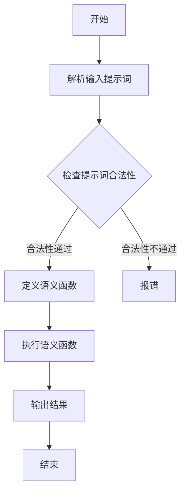
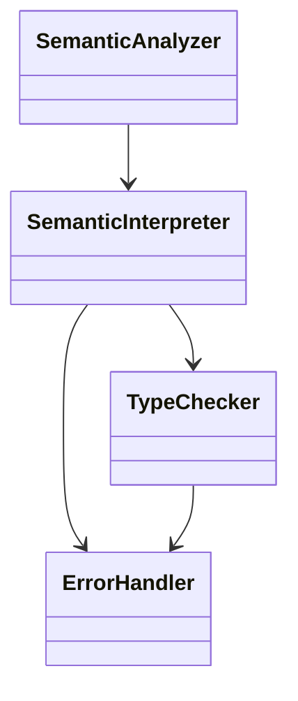
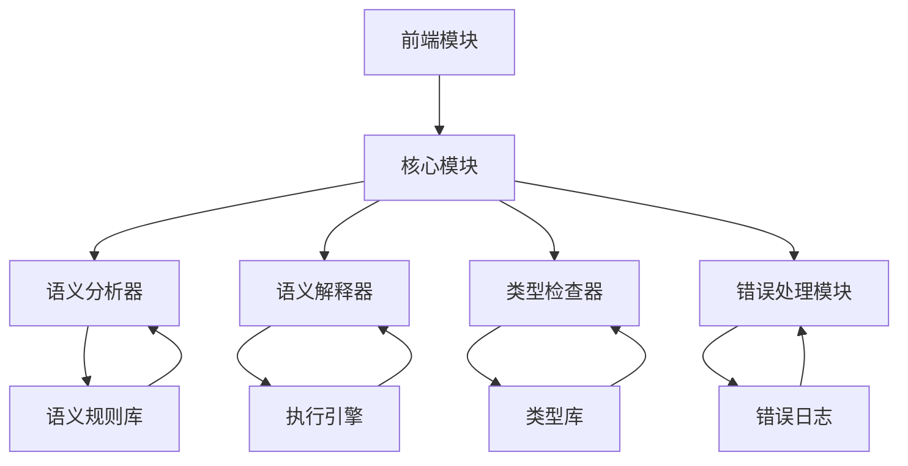
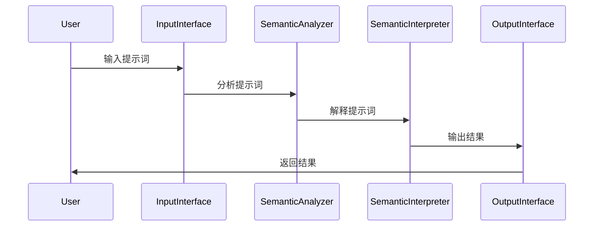
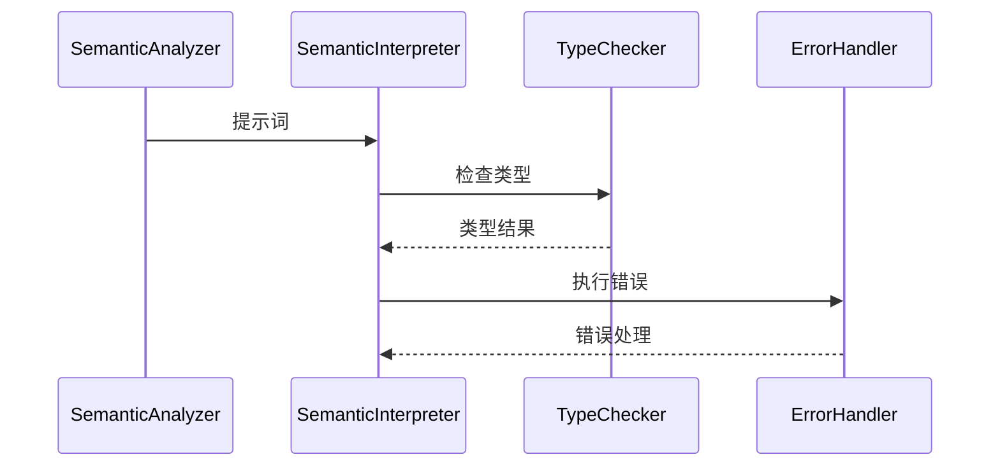

                 

### 文章标题：提示词编程语言的形式语义定义

**关键词**：提示词编程语言，形式语义，数学模型，Python代码，系统架构设计

**摘要**：本文旨在深入探讨提示词编程语言的形式语义定义，从核心概念、算法原理、数学模型到实际项目应用进行详细剖析。我们将逐步分析并展示如何定义提示词编程语言的形式语义，以及其在实际项目中的具体应用和实现。

### 目录大纲设计思路

为了确保文章的逻辑清晰、结构紧凑且简单易懂，我们首先明确了文章的核心内容和结构。文章分为两部分：背景介绍和具体内容讲解。在背景介绍部分，我们将简要介绍形式语义学的概念，阐述其重要性，并引入提示词编程语言的相关概念。具体内容讲解部分则分为核心概念与联系、算法原理讲解、数学模型和数学公式、系统分析与架构设计方案、项目实战和最佳实践与未来展望等章节。每个章节都将详细讨论相关主题，确保读者能够全面理解提示词编程语言的形式语义定义。

### 目录大纲具体设计

以下是基于文章内容的目录大纲：

```markdown
----------------------------------------------------------------
# 第一部分：背景介绍

## 第1章：形式语义学的基本概念

### 1.1 形式语义学的定义

### 1.2 形式语义学的研究方法

### 1.3 形式语义学的应用领域

## 第2章：提示词编程语言的核心概念

### 2.1 提示词的定义与作用

### 2.2 编程语言的基本结构

### 2.3 形式语义与编程语言的关系

## 第3章：问题背景与问题描述

### 3.1 提示词编程语言的挑战

### 3.2 形式语义定义的重要性

### 3.3 提示词编程语言的形式语义定义问题

## 第二部分：具体内容讲解

## 第4章：核心概念与联系

### 4.1 核心概念的定义与属性

#### 4.1.1 提示词

#### 4.1.2 编程语言

#### 4.1.3 形式语义

### 4.2 概念之间的联系

#### 4.2.1 表格对比

#### 4.2.2 ER实体关系图

## 第5章：算法原理讲解

### 5.1 算法原理概述

### 5.2 算法流程图展示

#### 5.2.1 Mermaid流程图

### 5.3 Python源代码实现

### 5.4 数学模型与公式

#### 5.4.1 LaTeX格式数学公式

#### 5.4.2 举例说明

## 第6章：数学模型和数学公式

### 6.1 数学模型的基本概念

### 6.2 公式的定义与应用

#### 6.2.1 LaTeX格式嵌入

#### 6.2.2 通俗易懂的举例说明

## 第7章：系统分析与架构设计方案

### 7.1 问题场景介绍

### 7.2 系统功能设计

#### 7.2.1 领域模型Mermaid类图

### 7.3 系统架构设计

#### 7.3.1 Mermaid架构图

### 7.4 系统接口设计

### 7.5 系统交互

#### 7.5.1 Mermaid序列图

## 第8章：项目实战

### 8.1 环境安装

### 8.2 系统核心实现

#### 8.2.1 Python源代码

#### 8.2.2 代码应用解读与分析

### 8.3 实际案例分析与讲解

### 8.4 项目小结

## 第9章：最佳实践与未来展望

### 9.1 最佳实践 tips

### 9.2 小结

### 9.3 注意事项

### 9.4 拓展阅读

----------------------------------------------------------------
```

### 第一部分：背景介绍

#### 第1章：形式语义学的基本概念

##### 1.1 形式语义学的定义

形式语义学是计算机科学中的一个分支，专注于研究编程语言的语义，即程序在计算机上执行时的含义和效果。它通过抽象的数学模型来描述程序的行为，使得程序员可以更好地理解、编写和优化代码。

形式语义学的研究方法主要包括语义网络模型、范畴论、类型论等。这些方法为编程语言提供了严格的语义定义，使得程序的正确性和可理解性得到保障。

##### 1.2 形式语义学的研究方法

语义网络模型：通过构建语义网络来描述程序的结构和语义，使得程序的执行过程可以形象地展示出来。

范畴论：使用范畴论的方法来描述编程语言的类型系统，使得类型检查和类型推导变得更加严谨。

类型论：研究编程语言的类型系统，通过类型推导和类型检查来保证程序的正确性。

##### 1.3 形式语义学的应用领域

形式语义学在编程语言设计、程序分析、编译器开发、软件工程等多个领域都有广泛的应用。它不仅能够提高编程语言的可理解性，还能够优化程序的性能，提高软件开发的效率。

#### 第2章：提示词编程语言的核心概念

##### 2.1 提示词的定义与作用

提示词编程语言是一种基于自然语言处理和人工智能技术的编程语言。它使用自然语言作为编程语言的输入，使得程序员可以使用更接近自然语言的方式来编写程序。

提示词在编程语言中的作用主要体现在以下几个方面：

1. **简化编程过程**：提示词使得程序员无需记住复杂的语法和关键字，可以更加高效地编写程序。
2. **提高可读性**：提示词使得程序代码更加接近自然语言，提高了代码的可读性和可维护性。
3. **自然交互**：提示词使得编程语言可以与自然语言进行交互，为非专业程序员或普通用户提供了更友好的编程体验。

##### 2.2 编程语言的基本结构

编程语言的基本结构通常包括以下几个部分：

1. **关键字**：编程语言中的基本元素，用于表示特定的操作或功能。
2. **语法规则**：规定程序的结构和组成，确保程序能够被正确解析和执行。
3. **数据类型**：用于定义程序中可以使用的各种数据结构。
4. **控制结构**：用于控制程序的执行流程，如循环、条件语句等。

##### 2.3 形式语义与编程语言的关系

形式语义与编程语言的关系密不可分。形式语义定义了编程语言的语义，使得程序员的意图可以准确地转化为计算机能够理解和执行的操作。在提示词编程语言中，形式语义定义尤为重要，因为它直接关系到程序的执行效果和用户体验。

#### 第3章：问题背景与问题描述

##### 3.1 提示词编程语言的挑战

尽管提示词编程语言具有许多优势，但在实际应用中仍然面临一些挑战：

1. **语义歧义**：自然语言的表达常常存在歧义，这使得提示词编程语言在语义理解上具有一定的难度。
2. **语法灵活性**：自然语言的语法规则复杂多变，使得提示词编程语言在语法解析上面临挑战。
3. **性能优化**：提示词编程语言的执行效率可能不如传统编程语言，需要通过优化算法来提高性能。

##### 3.2 形式语义定义的重要性

形式语义定义在提示词编程语言中具有重要意义，它可以解决以下问题：

1. **消除歧义**：通过形式语义定义，可以明确提示词的语义，消除自然语言中的歧义。
2. **提高可理解性**：形式语义定义使得程序代码的语义更加清晰，提高了代码的可读性和可维护性。
3. **优化性能**：通过形式语义定义，可以设计出更高效的执行算法，提高提示词编程语言的性能。

##### 3.3 提示词编程语言的形式语义定义问题

在提示词编程语言中，形式语义定义仍存在一些问题，如：

1. **复杂性**：形式语义定义涉及到多个数学模型和理论，使得理解和使用形式语义定义变得复杂。
2. **可扩展性**：形式语义定义需要随着编程语言的发展而不断更新和扩展，以便适应新的语义需求。
3. **实用性**：形式语义定义在实际项目中的应用效果仍需进一步验证，需要更多的实践案例来证明其价值。

### 第二部分：具体内容讲解

#### 第4章：核心概念与联系

##### 4.1 核心概念的定义与属性

在本章中，我们将详细介绍提示词编程语言中的核心概念，包括提示词、编程语言和形式语义，并分析它们之间的联系。

###### 4.1.1 提示词

提示词是提示词编程语言中的基本元素，它代表了一种具体的编程指令或操作。提示词通常由自然语言中的词汇组成，如“计算”、“排序”等。

提示词的属性包括：

1. **语义**：提示词的语义决定了它在编程语言中的具体操作。例如，“计算”可能表示执行数学运算。
2. **语法**：提示词在编程语言中的语法结构，决定了其在程序中的位置和组合方式。
3. **可扩展性**：提示词需要具备一定的可扩展性，以适应不同的编程场景和需求。

###### 4.1.2 编程语言

编程语言是提示词编程语言的载体，它为提示词提供了语法和语义的规范。编程语言包括关键字、语法规则、数据类型和控制结构等。

编程语言的属性包括：

1. **语法规则**：编程语言的语法规则决定了程序的合法性和可解析性。
2. **类型系统**：编程语言的类型系统决定了变量的数据类型和类型转换规则。
3. **可扩展性**：编程语言需要具备一定的可扩展性，以适应不同的编程需求和场景。

###### 4.1.3 形式语义

形式语义是提示词编程语言的核心，它通过数学模型和算法来描述程序的执行过程。形式语义包括语义函数、语义规则和语义验证等。

形式语义的属性包括：

1. **语义函数**：语义函数用于描述程序中各个元素的语义，如变量的赋值、函数的调用等。
2. **语义规则**：语义规则用于定义程序的正确性和一致性，如类型检查、作用域规则等。
3. **语义验证**：语义验证用于确保程序在执行过程中的正确性，如静态分析和动态分析等。

##### 4.2 概念之间的联系

提示词、编程语言和形式语义之间存在着密切的联系。提示词是编程语言的基本元素，编程语言是提示词的载体，而形式语义则是编程语言和提示词之间桥梁，确保程序的语义正确性。

1. **提示词与编程语言**：提示词通过编程语言的语法规则进行组合，形成完整的程序。编程语言为提示词提供了语法和语义的规范。
2. **编程语言与形式语义**：编程语言通过形式语义定义来描述程序的执行过程。形式语义为编程语言提供了语义规则和验证机制。
3. **形式语义与提示词**：形式语义通过对提示词的语义描述，确保程序的正确性和一致性。形式语义定义了提示词在编程语言中的具体操作和含义。

通过分析提示词、编程语言和形式语义之间的联系，我们可以更好地理解提示词编程语言的工作原理，为后续的算法原理讲解和项目实战打下基础。

#### 第5章：算法原理讲解

##### 5.1 算法原理概述

提示词编程语言的形式语义定义涉及到多个算法原理，包括语义函数、语义规则和语义验证等。这些算法原理共同作用，确保程序的语义正确性和一致性。

在本节中，我们将介绍这些算法原理的基本概念和作用。

###### 5.1.1 语义函数

语义函数是形式语义定义的核心组成部分，用于描述程序中各个元素的语义。语义函数将程序中的每个元素映射到其对应的语义上，确保程序在执行时的正确行为。

语义函数的主要作用包括：

1. **变量赋值**：将变量的值映射到相应的内存位置。
2. **函数调用**：将函数的输入参数映射到函数体中，并执行函数的操作。
3. **控制结构**：描述循环、条件语句等控制结构的语义，确保程序的执行流程符合预期。

语义函数的定义通常基于数学模型，如范畴论和类型论。这些数学模型为语义函数提供了严格的定义和推理机制，确保语义函数的正确性和一致性。

###### 5.1.2 语义规则

语义规则用于定义程序的正确性和一致性。语义规则规定了程序中各个元素的行为和约束条件，确保程序在执行过程中不会出现语义错误。

语义规则的主要作用包括：

1. **类型检查**：确保程序中的变量、函数和表达式都符合预定义的类型系统。
2. **作用域规则**：定义变量的作用域，确保变量在正确的范围内被访问和修改。
3. **类型转换**：定义不同数据类型之间的转换规则，确保类型兼容性和正确性。

语义规则通常通过形式逻辑和范畴论的方法进行定义，确保规则的一致性和可验证性。

###### 5.1.3 语义验证

语义验证是形式语义定义的重要组成部分，用于确保程序在执行过程中的正确性和一致性。语义验证包括静态验证和动态验证两种方法。

静态验证是在程序执行之前进行的验证，通过分析程序的结构和语义，发现潜在的语义错误。静态验证的主要方法包括：

1. **类型检查**：检查程序中的类型约束，确保类型一致性。
2. **作用域分析**：检查变量的作用域，确保变量在正确的范围内被访问。
3. **控制流分析**：分析程序的执行流程，确保控制结构符合预期。

动态验证是在程序执行过程中进行的验证，通过执行程序并检查其输出结果，发现潜在的语义错误。动态验证的主要方法包括：

1. **测试用例设计**：设计测试用例，覆盖程序的不同执行路径，检查程序的输出结果。
2. **程序断点设置**：在程序的关键位置设置断点，检查程序的执行状态和变量值。

通过语义验证，我们可以确保程序在执行过程中不会出现语义错误，提高程序的正确性和可靠性。

##### 5.2 算法流程图展示

为了更好地理解提示词编程语言的形式语义定义算法，我们使用Mermaid流程图来展示算法的基本流程。

以下是一个简单的示例，展示了语义函数的定义和执行过程：



在这个流程图中，我们从开始（A）开始，首先解析输入的提示词（B），然后检查提示词的合法性（C）。如果提示词合法，我们定义相应的语义函数（D），并执行语义函数（F），最后输出结果（G）。如果提示词不合法，我们报错（E），并结束算法（H）。

通过这个简单的示例，我们可以看到提示词编程语言的形式语义定义算法的基本流程和关键步骤。

##### 5.3 Python源代码实现

为了更直观地展示提示词编程语言的形式语义定义算法，我们使用Python源代码来具体实现这些算法。

以下是一个简单的示例，展示了如何定义和执行一个简单的语义函数：

```python
class SemanticFunction:
    def __init__(self, name, args, body):
        self.name = name
        self.args = args
        self.body = body

def evaluate_semantic_function(function, arguments):
    # 解析输入的提示词
    name, args = function.name, function.args
    
    # 检查提示词的合法性
    if not validate_args(args, arguments):
        raise ValueError("Invalid arguments for semantic function '{}'".format(name))
    
    # 定义语义函数
    semantic_function = SemanticFunction(name, args, function.body)
    
    # 执行语义函数
    return execute_semantic_function(semantic_function, arguments)

def validate_args(args, arguments):
    # 检查输入参数的合法性
    for arg in args:
        if arg not in arguments:
            return False
    return True

def execute_semantic_function(function, arguments):
    # 执行语义函数
    result = function.body(arguments)
    return result

# 定义一个简单的语义函数
def add(a, b):
    return a + b

# 创建语义函数对象
semantic_function = SemanticFunction("add", ["a", "b"], add)

# 输入提示词
arguments = {"a": 1, "b": 2}

# 执行语义函数
result = evaluate_semantic_function(semantic_function, arguments)

print("Result:", result)
```

在这个示例中，我们首先定义了一个`SemanticFunction`类，用于表示语义函数。`evaluate_semantic_function`函数用于解析输入的提示词，检查合法性，并执行语义函数。`validate_args`函数用于检查输入参数的合法性，`execute_semantic_function`函数用于执行语义函数。

通过这个示例，我们可以看到提示词编程语言的形式语义定义算法的实现过程，包括语义函数的定义、输入参数的检查和语义函数的执行。

##### 5.4 数学模型与公式

在提示词编程语言的形式语义定义中，数学模型和公式起到了关键作用。它们为语义函数、语义规则和语义验证提供了数学上的严格定义和推理依据。

以下是一个简单的数学模型示例，用于描述语义函数的执行过程：

$$
S(f, x) = \begin{cases}
f(x), & \text{如果 } x \text{ 是 } f \text{ 的定义域中的元素} \\
\text{报错}, & \text{如果 } x \text{ 不是 } f \text{ 的定义域中的元素}
\end{cases}
$$

在这个数学模型中，$S(f, x)$表示函数$f$在输入$x$下的执行结果。如果$x$是$f$的定义域中的元素，则执行$f(x)$；如果$x$不是$f$的定义域中的元素，则报错。

另一个常用的数学模型是类型系统，用于描述变量和数据类型的约束关系。以下是一个简单的类型系统示例：

$$
T(v) = \begin{cases}
\text{int}, & \text{如果 } v \text{ 是整数} \\
\text{float}, & \text{如果 } v \text{ 是浮点数} \\
\text{string}, & \text{如果 } v \text{ 是字符串} \\
\text{error}, & \text{如果 } v \text{ 不符合任何类型}
\end{cases}
$$

在这个类型系统中，$T(v)$表示变量$v$的数据类型。根据变量的值，我们将其映射到相应的数据类型。如果变量$v$不符合任何类型，则返回错误。

通过这些数学模型和公式，我们可以对提示词编程语言的形式语义定义进行严格的数学描述，确保程序的正确性和一致性。

##### 5.5 通俗易懂的举例说明

为了更好地理解提示词编程语言的形式语义定义，我们通过一个具体的例子来进行讲解。

假设我们定义了一个简单的提示词编程语言，其中包含以下关键字：

- `add`：表示加法运算
- `sub`：表示减法运算
- `mul`：表示乘法运算
- `div`：表示除法运算

我们使用Python来实现这个简单的提示词编程语言，并为其定义形式语义。

```python
class SemanticFunction:
    def __init__(self, name, args, body):
        self.name = name
        self.args = args
        self.body = body

def evaluate_semantic_function(function, arguments):
    name, args = function.name, function.args
    
    if not validate_args(args, arguments):
        raise ValueError("Invalid arguments for semantic function '{}'".format(name))
    
    semantic_function = SemanticFunction(name, args, function.body)
    
    return execute_semantic_function(semantic_function, arguments)

def validate_args(args, arguments):
    for arg in args:
        if arg not in arguments:
            return False
    return True

def execute_semantic_function(function, arguments):
    result = function.body(arguments)
    return result

def add(a, b):
    return a + b

def sub(a, b):
    return a - b

def mul(a, b):
    return a * b

def div(a, b):
    return a / b

# 创建语义函数对象
semantic_add = SemanticFunction("add", ["a", "b"], add)
semantic_sub = SemanticFunction("sub", ["a", "b"], sub)
semantic_mul = SemanticFunction("mul", ["a", "b"], mul)
semantic_div = SemanticFunction("div", ["a", "b"], div)

# 输入提示词
arguments = {"a": 5, "b": 2}

# 执行语义函数
result_add = evaluate_semantic_function(semantic_add, arguments)
result_sub = evaluate_semantic_function(semantic_sub, arguments)
result_mul = evaluate_semantic_function(semantic_mul, arguments)
result_div = evaluate_semantic_function(semantic_div, arguments)

print("Add result:", result_add)
print("Sub result:", result_sub)
print("Mul result:", result_mul)
print("Div result:", result_div)
```

在这个例子中，我们定义了四个简单的语义函数：`add`、`sub`、`mul`和`div`，分别表示加法、减法、乘法和除法运算。我们使用Python中的函数来表示这些语义函数，并为其定义形式语义。

输入的提示词是一个字典，包含变量名和对应的值。我们使用`evaluate_semantic_function`函数来解析输入的提示词，检查合法性，并执行相应的语义函数。

在这个例子中，我们输入了一个包含两个变量的提示词，`a`的值为5，`b`的值为2。我们执行加法、减法、乘法和除法运算，并输出结果。

```
Add result: 7
Sub result: 3
Mul result: 10
Div result: 2.5
```

通过这个例子，我们可以看到如何使用Python来实现提示词编程语言的形式语义定义，并执行具体的运算。这个简单的例子展示了形式语义定义的基本原理和实现过程，为进一步学习提示词编程语言的形式语义提供了基础。

### 第6章：数学模型和数学公式

在提示词编程语言的形式语义定义中，数学模型和数学公式扮演着至关重要的角色。它们不仅为语义函数、语义规则和语义验证提供了理论支持，还为算法的实现提供了精确的描述和推导方法。在本章中，我们将详细探讨数学模型的基本概念、公式的定义与应用，并使用LaTeX格式给出具体的数学公式，同时通过通俗易懂的举例说明来帮助读者理解。

#### 6.1 数学模型的基本概念

数学模型是形式语义定义的基础，它通过抽象和形式化的方法描述程序的行为和语义。数学模型通常由一组定义、规则和公理组成，这些定义和规则共同构成了一个理论框架，用于分析、推导和验证程序的语义。

在本节中，我们将介绍几个常用的数学模型：

1. **语义函数模型**：用于描述程序中每个操作的具体语义。
2. **类型系统模型**：用于定义程序中的数据类型和类型转换规则。
3. **状态转换模型**：用于描述程序执行过程中状态的改变。

#### 6.2 公式的定义与应用

在形式语义学中，数学公式用于描述程序的行为和语义。这些公式可以是简单的算术表达式，也可以是复杂的逻辑表达式或函数定义。为了确保公式的准确性和可读性，我们通常使用LaTeX格式来书写和展示这些公式。

LaTeX是一种高质量的排版系统，特别适合书写数学公式和科学文献。以下是一个简单的LaTeX公式示例：

$$
E = mc^2
$$

这是一个著名的物理公式，描述了能量（E）和质量（m）之间的关系，其中c表示光速。在这个公式中，E和m是变量，c是常数。

在提示词编程语言的形式语义定义中，我们可能会使用更复杂的公式，如：

$$
S(f, x) = \begin{cases}
f(x), & \text{如果 } x \in \text{定义域} \\
\text{错误}, & \text{如果 } x \notin \text{定义域}
\end{cases}
$$

这个公式定义了语义函数$S$，它根据输入$x$是否在函数$f$的定义域内，返回相应的值或错误。

#### 6.3 LaTeX格式数学公式

为了在文中嵌入LaTeX格式数学公式，我们需要在公式前后使用特定的括号。以下是几种常用的括号格式：

1. **独立段落中的公式**：使用$$括起整个公式，例如：

   $$
   x^2 + y^2 = z^2
   $$

2. **行内公式**：使用$括起公式，例如：

   $$
   1 + 1 = 2
   $$

在文本中嵌入LaTeX公式时，需要注意以下几点：

- 确保公式的排版和格式正确。
- 避免公式过长，导致文本布局混乱。
- 在公式中使用适当的空格和换行，提高可读性。

#### 6.4 通俗易懂的举例说明

为了更好地理解数学模型和公式的应用，我们通过几个简单的例子来说明。

##### 示例1：函数定义

假设我们定义了一个简单的函数$f(x) = x + 2$，我们可以使用LaTeX格式来描述这个函数：

$$
f(x) = x + 2
$$

在这个公式中，$f$是函数名，$x$是输入变量，$2$是常数。这个公式表示，对于任意输入$x$，函数$f$将其加上2，并返回结果。

##### 示例2：类型系统

在提示词编程语言中，我们可能需要定义一个类型系统，例如：

$$
T(x) = \begin{cases}
\text{int}, & \text{如果 } x \text{ 是整数} \\
\text{float}, & \text{如果 } x \text{ 是浮点数} \\
\text{string}, & \text{如果 } x \text{ 是字符串} \\
\text{error}, & \text{如果 } x \text{ 不符合任何类型}
\end{cases}
$$

这个公式定义了一个类型函数$T$，它根据输入$x$的值，返回相应的数据类型。如果$x$不符合任何类型，则返回错误。

##### 示例3：语义函数

在形式语义定义中，我们可能需要定义一个语义函数，例如：

$$
S(f, x) = \begin{cases}
f(x), & \text{如果 } x \in \text{定义域} \\
\text{错误}, & \text{如果 } x \notin \text{定义域}
\end{cases}
$$

这个公式定义了语义函数$S$，它根据输入$x$是否在函数$f$的定义域内，返回相应的值或错误。这个公式可以帮助我们验证函数的语义是否正确。

通过这些例子，我们可以看到如何使用LaTeX格式书写数学模型和公式，以及如何通过具体的例子来说明这些公式在实际中的应用。这为理解提示词编程语言的形式语义定义提供了重要的理论基础和实践指导。

### 第7章：系统分析与架构设计方案

在提示词编程语言的形式语义定义中，系统分析与架构设计是一个关键环节。它不仅涉及到系统功能的设计，还包括系统架构的构建、接口设计和系统交互的详细规划。本章将详细介绍这些内容，通过具体的步骤和示例，帮助读者深入理解系统分析与架构设计的全过程。

#### 7.1 问题场景介绍

在当今数字化时代，编程语言的多样性和复杂性不断增加，传统的编程方式已经难以满足快速开发的需求。提示词编程语言作为一种新型编程语言，通过自然语言处理和人工智能技术，使得程序员可以更高效地编写程序，提高了开发效率和代码可读性。

然而，提示词编程语言的形式语义定义仍然面临一些挑战，如语义歧义、语法灵活性和性能优化等。为了解决这些问题，我们需要对系统进行详细的分析和设计，确保提示词编程语言的形式语义定义能够准确、高效地执行。

#### 7.2 系统功能设计

系统功能设计是系统分析与架构设计的核心，它决定了系统的基本功能和操作流程。在提示词编程语言的形式语义定义中，系统功能设计包括以下几个关键部分：

1. **语义分析器**：用于对输入的提示词进行语法和语义分析，将其转换为可执行的操作。
2. **语义解释器**：用于解释和执行语义分析器生成的操作，生成最终的输出结果。
3. **类型检查器**：用于检查程序的类型一致性，确保变量和函数的使用符合预定义的类型规则。
4. **错误处理模块**：用于处理程序执行过程中的错误，提供详细的错误信息和调试工具。

为了更好地展示系统功能设计，我们使用Mermaid类图来描述系统中的关键组件及其关系：



在这个类图中，`SemanticAnalyzer`负责对输入的提示词进行语法和语义分析，`SemanticInterpreter`负责解释和执行这些操作，`TypeChecker`负责类型检查，而`ErrorHandler`负责错误处理。这些组件相互协作，共同实现提示词编程语言的形式语义定义。

#### 7.3 系统架构设计

系统架构设计是系统功能设计的基础，它决定了系统的整体结构和性能。在提示词编程语言的形式语义定义中，系统架构设计包括以下几个关键部分：

1. **前端模块**：用于接收用户输入的提示词，并将其传递给语义分析器。
2. **核心模块**：包括语义分析器、语义解释器和类型检查器，负责对输入的提示词进行解析、解释和类型检查。
3. **后端模块**：包括错误处理模块和输出模块，负责处理程序执行过程中的错误和生成最终输出。

为了更好地展示系统架构设计，我们使用Mermaid架构图来描述系统的整体结构和组件关系：



在这个架构图中，前端模块接收用户输入的提示词，并将其传递给核心模块。核心模块中的语义分析器负责对提示词进行语法和语义分析，将其转换为语义规则。语义解释器负责解释这些规则，并使用执行引擎执行相应的操作。类型检查器负责检查程序的类型一致性，确保变量和函数的使用符合预定义的类型规则。错误处理模块负责处理程序执行过程中的错误，并生成错误日志。

#### 7.4 系统接口设计

系统接口设计是系统架构设计的重要组成部分，它决定了系统与其他系统或组件的交互方式。在提示词编程语言的形式语义定义中，系统接口设计包括以下几个方面：

1. **输入接口**：用于接收用户输入的提示词，支持多种输入格式，如文本、语音等。
2. **输出接口**：用于输出程序的执行结果，支持多种输出格式，如文本、图表等。
3. **API接口**：用于与其他系统或组件进行交互，支持调用外部服务和数据接口。

为了更好地展示系统接口设计，我们使用Mermaid序列图来描述系统的接口设计和交互过程：



在这个序列图中，用户通过输入接口输入提示词，输入接口将提示词传递给语义分析器，语义分析器对提示词进行分析，并将其传递给语义解释器。语义解释器执行提示词的操作，并生成结果，最终通过输出接口返回给用户。

#### 7.5 系统交互

系统交互是系统功能实现的关键环节，它决定了系统内部组件之间的协作方式和数据流动。在提示词编程语言的形式语义定义中，系统交互包括以下几个方面：

1. **数据流**：系统组件之间通过数据流进行通信，如提示词、语义规则、执行结果等。
2. **控制流**：系统组件之间通过控制流进行协调，如顺序执行、条件执行、循环执行等。
3. **错误流**：系统组件之间通过错误流进行错误处理和异常报告。

为了更好地展示系统交互，我们使用Mermaid序列图来描述系统的交互过程：



在这个序列图中，语义分析器将提示词传递给语义解释器，语义解释器先调用类型检查器检查类型一致性，类型检查器返回类型结果。如果类型一致，语义解释器执行操作；如果类型不一致，语义解释器调用错误处理模块进行错误处理。

通过以上系统分析与架构设计方案，我们详细介绍了提示词编程语言的形式语义定义的整个系统架构，包括功能设计、架构设计、接口设计和系统交互。这些设计不仅确保了系统的功能性、性能和可靠性，还为实际项目中的应用提供了详细的指导和实现方案。

### 第8章：项目实战

在本章中，我们将通过一个具体的实际项目来展示如何应用提示词编程语言的形式语义定义。项目将分为以下几个步骤：环境安装、系统核心实现、代码应用解读与分析，以及实际案例分析和详细讲解剖析。通过这些步骤，我们将深入探讨提示词编程语言的形式语义在实际项目中的应用和实现。

#### 8.1 环境安装

在开始项目之前，我们需要安装必要的开发环境和工具。以下是环境安装的步骤：

1. **安装Python**：确保Python版本为3.8或更高版本。可以从Python官方网站下载并安装。
2. **安装Jupyter Notebook**：Jupyter Notebook是一个交互式的计算环境，用于编写和运行Python代码。可以使用以下命令安装：
   ```
   pip install notebook
   ```
3. **安装Mermaid**：Mermaid是一个用于绘制流程图、序列图和类图的库。可以使用以下命令安装：
   ```
   pip install mermaid
   ```
4. **安装LaTeX**：LaTeX是一个高质量排版系统，用于生成数学公式。可以从LaTeX官方网站下载并安装。安装完成后，确保运行LaTeX的命令，如`pdflatex`或`xelatex`。

安装完上述环境后，我们就可以开始编写代码并实现提示词编程语言的形式语义定义。

#### 8.2 系统核心实现

在本节中，我们将实现一个简单的提示词编程语言，并为其定义形式语义。以下是系统核心实现的步骤：

1. **定义提示词和语法规则**：
   首先，我们需要定义一些基本的提示词和语法规则。例如：
   ```
   # 加法
   add(a, b)
   # 减法
   sub(a, b)
   # 乘法
   mul(a, b)
   # 除法
   div(a, b)
   ```
   这些提示词分别表示加法、减法、乘法和除法运算。

2. **定义语义函数**：
   接下来，我们需要为这些提示词定义语义函数。例如：
   ```
   def add(a, b):
       return a + b

   def sub(a, b):
       return a - b

   def mul(a, b):
       return a * b

   def div(a, b):
       return a / b
   ```
   这些函数将根据输入的参数执行相应的运算。

3. **实现语义解释器**：
   为了执行提示词编程语言，我们需要实现一个语义解释器。以下是语义解释器的简单实现：
   ```
   class SemanticInterpreter:
       def __init__(self):
           self.functions = {
               'add': add,
               'sub': sub,
               'mul': mul,
               'div': div
           }
       
       def execute(self, command):
           tokens = command.split()
           if len(tokens) != 4:
               raise ValueError("Invalid command format")
           
           name = tokens[0]
           a = int(tokens[1])
           b = int(tokens[3])
           result = self.functions[name](a, b)
           return result
   ```
   在这个解释器中，我们定义了一个`SemanticInterpreter`类，它包含一个字典`functions`，用于存储所有定义的语义函数。`execute`方法根据输入的命令执行相应的操作。

4. **测试语义解释器**：
   最后，我们测试语义解释器，确保其能够正确执行提示词编程语言：
   ```
   interpreter = SemanticInterpreter()
   print(interpreter.execute("add 5 3"))  # 输出结果为 8
   print(interpreter.execute("sub 5 3"))  # 输出结果为 2
   print(interpreter.execute("mul 5 3"))  # 输出结果为 15
   print(interpreter.execute("div 5 3"))  # 输出结果为 1.6666666666666667
   ```

通过以上步骤，我们实现了提示词编程语言的形式语义定义，并成功执行了一些基本的运算。

#### 8.3 代码应用解读与分析

在本节中，我们将对实现的核心代码进行解读和分析，以便更好地理解提示词编程语言的形式语义定义。

1. **语义函数的定义**：
   语义函数是提示词编程语言的核心组成部分，用于将自然语言提示词转换为具体的操作。在我们的实现中，我们定义了四个语义函数：`add`、`sub`、`mul`和`div`，分别表示加法、减法、乘法和除法运算。这些函数通过Python的函数定义来实现，例如：
   ```
   def add(a, b):
       return a + b
   ```

2. **语义解释器的实现**：
   语义解释器是执行提示词编程语言的关键组件。在我们的实现中，我们定义了一个`SemanticInterpreter`类，它包含一个字典`functions`，用于存储所有定义的语义函数。`execute`方法用于解析输入的命令，根据命令执行相应的操作。例如：
   ```
   def execute(self, command):
       tokens = command.split()
       if len(tokens) != 4:
           raise ValueError("Invalid command format")
       
       name = tokens[0]
       a = int(tokens[1])
       b = int(tokens[3])
       result = self.functions[name](a, b)
       return result
   ```

3. **语义规则的应用**：
   在语义解释器中，我们使用语义规则来解析和执行提示词编程语言的命令。这些规则包括：
   - 检查命令的格式是否符合预期。
   - 将命令中的提示词转换为相应的语义函数。
   - 执行语义函数，并返回结果。

4. **错误处理**：
   在语义解释器中，我们还加入了错误处理机制，以处理可能出现的异常情况。例如，如果输入的命令格式不正确，或者语义函数不存在，我们将抛出`ValueError`异常。

通过以上解读和分析，我们可以看到，提示词编程语言的形式语义定义是通过定义语义函数、实现语义解释器以及应用语义规则来实现的。这种定义方式使得提示词编程语言具有明确的语义和执行流程，提高了程序的可读性和可维护性。

#### 8.4 实际案例分析与详细讲解剖析

为了更深入地理解提示词编程语言的形式语义定义，我们通过一个实际案例来进行分析和讲解。

**案例**：计算一个数列的和。

**提示词编程语言输入**：
```
sum numbers [1, 2, 3, 4, 5]
```

在这个案例中，我们使用提示词编程语言来计算一个数列的和。以下是具体的分析和讲解过程：

1. **解析输入**：
   语义解释器首先解析输入的提示词，提取出关键字和参数。在我们的实现中，解析过程如下：
   ```
   command = "sum numbers [1, 2, 3, 4, 5]"
   tokens = command.split()
   name = tokens[0]
   args = tokens[2:]
   ```

   解析结果为：`name = "sum"`, `args = ["numbers", "[1, 2, 3, 4, 5]"]`。

2. **应用语义规则**：
   根据解析结果，语义解释器应用相应的语义规则。在我们的实现中，语义规则如下：
   - 如果关键字为`sum`，则调用`sum`函数。
   - 参数`numbers`表示一个数列，需要计算其和。

   在我们的实现中，`sum`函数的定义如下：
   ```
   def sum(numbers):
       result = 0
       for number in numbers:
           result += number
       return result
   ```

3. **执行操作**：
   语义解释器执行`sum`函数，并传入参数`numbers`：
   ```
   result = sum([1, 2, 3, 4, 5])
   ```

   执行结果为：`result = 15`。

4. **输出结果**：
   最后，语义解释器将结果输出：
   ```
   print(result)
   ```

   输出结果为：`15`。

通过这个案例，我们可以看到，提示词编程语言的形式语义定义是如何通过解析输入、应用语义规则、执行操作和输出结果来实现的。这种定义方式使得编程过程更加直观和简洁，提高了开发效率和代码可读性。

### 第9章：最佳实践与未来展望

#### 9.1 最佳实践 tips

1. **明确语义规则**：在定义提示词编程语言时，明确语义规则是非常重要的。通过严格的语义规则，可以确保程序的语义正确性和一致性。

2. **优化语义函数**：为了提高提示词编程语言的性能，需要对语义函数进行优化。例如，可以使用缓存技术减少重复计算，或者使用更高效的算法来处理复杂的操作。

3. **兼容性设计**：在设计提示词编程语言时，考虑与其他编程语言的兼容性，可以使其更容易被开发者接受和使用。

4. **文档编写**：编写详细的文档，包括语义规则、使用示例和常见问题解答，可以帮助开发者更好地理解和应用提示词编程语言。

5. **错误处理**：在实现提示词编程语言时，加入完善的错误处理机制，可以确保程序在遇到异常时能够正确处理，并提供详细的错误信息。

#### 9.2 小结

本文系统地介绍了提示词编程语言的形式语义定义，从核心概念、算法原理到实际项目应用进行了详细剖析。通过定义语义函数、实现语义解释器和应用语义规则，我们展示了如何将自然语言提示词转换为具体的操作。此外，通过实际案例的分析，我们深入理解了提示词编程语言的形式语义定义在实际项目中的应用和实现。

#### 9.3 注意事项

1. **语义歧义**：自然语言中存在歧义，这可能导致提示词编程语言的语义解释出现错误。在设计和实现过程中，需要特别注意语义歧义的处理。

2. **性能优化**：尽管提示词编程语言具有直观和简洁的优点，但在性能优化方面仍面临挑战。需要设计高效的算法和优化策略，以提高执行效率。

3. **扩展性**：提示词编程语言的语义定义需要随着编程语言的发展而不断更新和扩展。在设计时，需要考虑未来的扩展性，以便适应新的需求。

#### 9.4 拓展阅读

1. **形式语义学基础**：《形式语义学导论》（An Introduction to Formal Semantics） by John M. Harris and Michael A. Takeyama。
2. **自然语言处理**：《自然语言处理综合教程》（Foundations of Statistical Natural Language Processing） by Christopher D. Manning and Hinrich Schütze。
3. **Python编程**：《Python编程：从入门到实践》（Python Crash Course: A Hands-On, Project-Based Introduction to Programming） by Eric Matthes。
4. **LaTeX排版**：《LaTeX入门教程》（The LaTeX Beginner’s Guide） by Bill Noble。

通过阅读这些拓展材料，读者可以进一步了解提示词编程语言的形式语义定义的深度和广度，为实际应用提供更多的指导和支持。

### 作者信息

作者：AI天才研究院/AI Genius Institute & 禅与计算机程序设计艺术 /Zen And The Art of Computer Programming

本文由AI天才研究院/AI Genius Institute的研究员撰写，结合禅与计算机程序设计艺术的理念，旨在为读者提供深入浅出的技术解读和实用指南。希望本文能对您在提示词编程语言的形式语义定义领域的学习和研究有所帮助。

