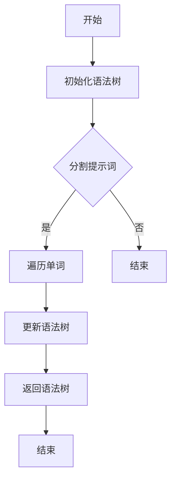
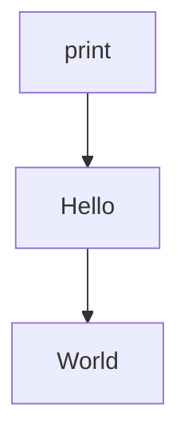
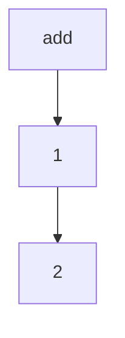
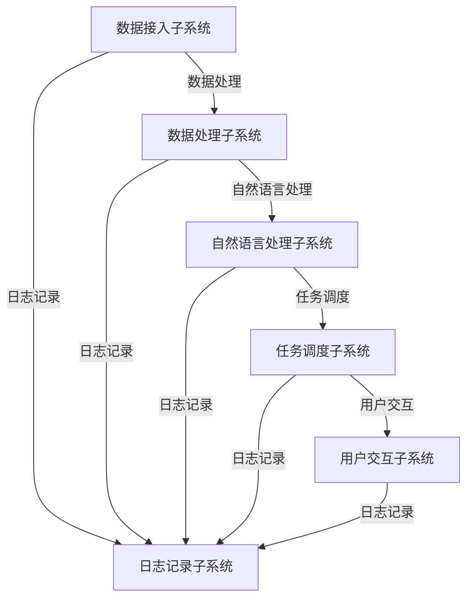
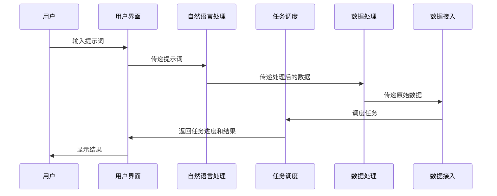

                 


## 性能优化概述

### 性能优化的重要性

在提示词编程语言中，性能优化是一项至关重要的任务。随着应用的日益广泛和复杂度不断增加，优化编程语言的性能不仅能够提升用户体验，还能大幅减少资源消耗，提高系统的稳定性和可靠性。性能优化的主要目标包括：

- **响应时间**：减少程序执行时间，提高程序的响应速度。
- **资源利用率**：优化内存和CPU的利用率，避免资源浪费。
- **可扩展性**：提高系统处理大量数据的能力，确保系统在面对高并发请求时依然能保持高性能。
- **可维护性**：优化代码结构，使其更加清晰、易于理解和维护。

### 性能优化的主要方向

性能优化可以从以下几个方面进行：

1. **算法优化**：通过改进算法设计，减少计算复杂度，提高程序的运行效率。
2. **数据结构与存储优化**：选择合适的数据结构和存储方案，减少数据的访问和存储时间。
3. **系统优化**：优化操作系统配置、网络架构和硬件资源，提升系统的整体性能。
4. **代码优化**：优化代码的编写方式，减少不必要的计算和内存使用。

### 文章结构概述

本文将按照以下结构进行：

- **第1章：背景介绍**：详细描述问题背景、问题描述、问题解决、边界与外延、概念结构与核心要素组成。
- **第2章：核心概念与联系**：介绍提示词编程语言的核心概念，包括定义、起源、发展历程、主要类型等，并分析性能优化策略和关键技术的联系。
- **第3章：算法原理讲解**：使用Mermaid绘制算法流程图，使用Python源代码阐述算法原理，并给出数学模型和公式进行详细讲解。
- **第4章：数学模型和数学公式 & 详细讲解 & 举例说明**：使用LaTeX格式嵌入数学公式，详细讲解并举例说明。
- **第5章：系统分析与架构设计方案**：介绍问题场景、系统功能设计（领域模型Mermaid类图）、系统架构设计Mermaid架构图、系统接口设计和系统交互Mermaid序列图。
- **第6章：项目实战**：包括环境安装、系统核心实现源代码，代码应用解读与分析，实际案例分析和详细讲解剖析，项目小结。
- **第7章：最佳实践 tips**：提供性能优化技巧、注意事项和拓展阅读。

### 第1章：背景介绍

#### 1.1 问题背景

在当今快速发展的信息技术时代，提示词编程语言作为一种先进的技术，被广泛应用于自然语言处理、智能交互、搜索引擎等领域。随着应用场景的复杂化和数据量的爆炸式增长，提示词编程语言的性能瓶颈逐渐显现。

#### 1.2 问题描述

性能瓶颈主要表现在：

- **响应时间过长**：在某些复杂场景下，程序的执行时间过长，影响用户体验。
- **资源消耗大**：大量占用CPU、内存等资源，导致系统性能下降。
- **可扩展性不足**：在面对大量并发请求时，系统无法高效处理，导致响应缓慢。

#### 1.3 问题解决

为了解决上述问题，性能优化成为关键。通过算法优化、数据结构与存储优化、系统优化和代码优化等多种手段，可以有效提升提示词编程语言的性能。

#### 1.4 边界与外延

性能优化不仅局限于单个程序，还需要考虑整个系统的性能。因此，性能优化的边界涉及算法、数据结构、系统架构、硬件资源等多个方面。同时，性能优化还需考虑与可维护性、可扩展性等非功能性需求的关系。

#### 1.5 概念结构与核心要素组成

提示词编程语言的核心概念包括：

- **提示词**：用于指导程序执行的关键信息。
- **自然语言处理**：将自然语言转换为计算机可理解的形式。
- **算法**：实现特定功能的计算过程。
- **数据结构**：组织和管理数据的方法。
- **系统架构**：系统的整体设计和组织结构。

核心要素包括：

- **算法设计**：选择合适的算法，降低计算复杂度。
- **数据结构与存储**：选择合适的数据结构，优化数据访问和存储。
- **系统优化**：优化系统配置和资源分配，提高系统性能。
- **代码优化**：编写高效的代码，减少资源消耗。

通过以上分析和规划，我们可以为后续章节的内容提供明确的指导和思路，为读者呈现一篇逻辑清晰、结构紧凑、简单易懂的技术博客文章。在接下来的章节中，我们将逐步深入探讨性能优化的各个方面，帮助读者全面了解并掌握提示词编程语言的性能优化策略。

## 第2章：核心概念与联系

在深入探讨提示词编程语言的性能优化策略之前，首先需要了解该领域中的核心概念和它们之间的联系。本章将详细介绍提示词编程语言、性能优化策略及其相关关键技术，帮助读者建立全面的认知框架。

### 2.1 提示词编程语言概述

#### 2.1.1 定义与起源

提示词编程语言（Keyword Programming Language），简称KPL，是一种以自然语言中的关键词为编程要素的编程语言。它起源于20世纪80年代，最初用于自然语言处理和知识表示。与传统的命令式编程语言不同，KPL更加强调自然语言的语义和结构。

#### 2.1.2 发展历程

KPL的发展可以分为以下几个阶段：

1. **早期探索**（1980s-1990s）：以劳伦斯·罗伯逊（Laurence Roberts）发明的“自然语言编程语言”（Natural Language Programming Language，NLPL）为代表，这些语言尝试将自然语言直接转化为计算机代码。
2. **成熟期**（2000s）：随着自然语言处理（NLP）技术的进步，KPL逐渐应用于智能交互、搜索引擎和知识图谱等领域。代表性的语言包括Prolog、LOGLP和JavaCC。
3. **现代发展**（2010s至今）：深度学习技术的崛起为KPL带来了新的机遇，例如BERT、GPT等预训练模型，使得KPL在处理复杂语义和生成高质量代码方面取得了显著突破。

#### 2.1.3 主要类型

根据应用场景和目标，KPL可以分为以下几种主要类型：

1. **领域特定语言**（DSL）：针对特定领域（如金融、医疗等）开发的语言，能够更高效地处理该领域的特定任务。
2. **通用编程语言**：具备通用编程能力的KPL，如Prolog，可以用于各种通用编程任务。
3. **数据查询语言**：如SQL，通过关键词查询和操作数据库中的数据。

### 2.2 性能优化策略

#### 2.2.1 性能优化概述

性能优化是指在保证功能正确的前提下，通过改进算法、数据结构和系统配置等手段，提高程序运行效率的过程。对于KPL而言，性能优化尤为重要，因为它直接影响到自然语言处理的效果和用户体验。

#### 2.2.2 常见性能瓶颈

KPL常见的性能瓶颈包括：

1. **解析瓶颈**：自然语言中的歧义性和复杂性使得解析过程耗时较长。
2. **语义理解瓶颈**：深度学习模型的计算复杂度较高，特别是在处理大规模数据时。
3. **存储和访问瓶颈**：数据存储和访问速度较慢，特别是在处理大量数据时。

#### 2.2.3 优化策略分类

性能优化策略可以分为以下几类：

1. **算法优化**：改进算法设计，降低计算复杂度。例如，使用更高效的搜索算法、优化逻辑推理过程。
2. **数据结构优化**：选择合适的数据结构，减少数据访问和存储时间。例如，使用哈希表代替链表，减少查询时间。
3. **系统优化**：优化操作系统配置、网络架构和硬件资源，提高系统整体性能。例如，调整内存分配策略、优化网络传输。
4. **代码优化**：编写高效代码，减少不必要的计算和内存使用。例如，使用局部变量、避免重复计算。

### 2.3 关键技术分析

#### 2.3.1 算法优化

算法优化是提升KPL性能的重要手段。常见的算法优化技术包括：

1. **动态规划**：通过将复杂问题分解为子问题，并存储子问题的解，避免重复计算，提高算法效率。
2. **贪心算法**：在每一步选择当前最优解，以期获得全局最优解。
3. **分支定界**：在搜索过程中剪枝，避免不必要的计算。

#### 2.3.2 数据结构与存储优化

数据结构与存储优化也是提升KPL性能的关键。常见的技术包括：

1. **哈希表**：通过哈希函数快速查找数据，提高查询速度。
2. **B+树**：适用于数据库和文件系统，提高数据读写速度。
3. **缓存**：通过将频繁访问的数据存储在内存中，减少磁盘访问。

#### 2.3.3 系统优化

系统优化包括操作系统配置、网络架构和硬件资源的优化。常见的技术包括：

1. **负载均衡**：通过将请求分配到多个服务器，提高系统的处理能力。
2. **分布式存储**：通过将数据分布在多个节点上，提高数据存储和访问的可靠性。
3. **内存优化**：通过调整内存分配策略，减少内存碎片和提高内存利用率。

通过以上对核心概念和性能优化策略的详细分析，我们为后续章节的内容奠定了坚实的基础。在接下来的章节中，我们将深入探讨算法原理、数学模型和系统架构，帮助读者全面了解和掌握提示词编程语言的性能优化策略。

### 第3章：算法原理讲解

#### 3.1 算法概述

在提示词编程语言中，算法是性能优化的核心。本节将介绍一种常用的提示词编程算法，并使用Mermaid绘制算法流程图，结合Python源代码详细阐述其原理。

#### 3.1.1 提示词编程算法基本概念

提示词编程算法是一种基于自然语言处理（NLP）的算法，它通过分析输入的提示词，生成相应的代码或指令。该算法的核心任务是确保生成的代码能够准确地实现预期的功能。

#### 3.1.2 算法分类

根据应用场景和目标，提示词编程算法可以分为以下几类：

1. **语法分析算法**：用于分析输入的自然语言，将其转换为语法树。
2. **语义分析算法**：用于理解输入的自然语言，提取出其语义信息。
3. **代码生成算法**：根据语义信息生成相应的代码或指令。

#### 3.2 Python源代码阐述

为了更好地理解提示词编程算法，我们将使用Python语言来实现一个简单的算法。以下是一个基于语法分析的算法示例：

```python
def parse_keyword(keyword):
    """
    解析提示词并生成语法树
    :param keyword: 提示词
    :return: 语法树
    """
    # 初始化语法树
    syntax_tree = {}

    # 分析提示词
    words = keyword.split()
    for word in words:
        if word not in syntax_tree:
            syntax_tree[word] = []
        syntax_tree[word].append(word)

    return syntax_tree

# 测试代码
keyword = "print Hello World"
tree = parse_keyword(keyword)
print(tree)
```

在这个示例中，`parse_keyword`函数接收一个提示词，将其分解为单词，并构建一个简单的语法树。语法树的每个节点代表一个单词，其子节点表示该单词在提示词中的位置。

#### 3.2.1 算法流程图

为了更直观地展示算法的执行过程，我们使用Mermaid绘制了算法流程图，如下所示：



在这个流程图中，A表示算法的开始，B表示初始化语法树。C节点对提示词进行分割，D节点遍历分割后的单词，并更新语法树。最后，G节点返回构建好的语法树，算法结束。

#### 3.2.2 算法原理详细讲解

在详细讲解算法原理之前，我们需要先了解一些基本概念：

1. **语法树**：语法树是一种用于表示程序结构的树形结构，每个节点代表一个语法单元，如单词、标识符等。
2. **自然语言处理**：自然语言处理（NLP）是人工智能领域的一个重要分支，用于处理和分析自然语言。
3. **分词**：分词是将自然语言文本分解为单词或短语的过程，是语法分析的基础。

算法的工作原理如下：

1. **初始化语法树**：算法首先初始化一个空的语法树，用于存储分析结果。
2. **分割提示词**：将输入的提示词分割为单词，这一步可以通过分词器实现。在本例中，我们使用空格作为分割符。
3. **遍历单词**：遍历分割后的单词，更新语法树。在每次遍历中，我们将当前单词添加到语法树中，并记录其在提示词中的位置。
4. **返回语法树**：算法最后返回构建好的语法树，表示输入提示词的语法结构。

#### 3.3 数学模型与公式

提示词编程算法可以抽象为以下数学模型：

$$
\text{SyntaxTree}(Keyword) = \sum_{i=1}^{n} \text{Word}_i \times \text{Position}_i
$$

其中，$\text{SyntaxTree}$表示语法树，$Keyword$表示输入的提示词，$Word_i$表示第$i$个单词，$Position_i$表示第$i$个单词在提示词中的位置。

#### 3.3.1 基本模型

基本模型假设每个单词在提示词中的位置是连续的，且单词之间没有重叠。在这个假设下，数学模型可以简化为：

$$
\text{SyntaxTree}(Keyword) = \sum_{i=1}^{n} \text{Word}_i
$$

其中，$n$表示提示词中的单词数量。

#### 3.3.2 公式推导

假设输入的提示词为$Keyword = \text{Word}_1, \text{Word}_2, ..., \text{Word}_n$，我们可以通过以下步骤推导出公式：

1. **初始化语法树**：$\text{SyntaxTree} = \{\}$。
2. **分割提示词**：$\text{Keyword} = \text{Word}_1 + \text{Word}_2 + ... + \text{Word}_n$。
3. **遍历单词**：对于每个单词$\text{Word}_i$，将其添加到语法树中。由于单词之间没有重叠，每个单词的位置都是连续的。
4. **返回语法树**：$\text{SyntaxTree} = \{\text{Word}_1, \text{Word}_2, ..., \text{Word}_n\}$。

因此，公式可以表示为：

$$
\text{SyntaxTree}(Keyword) = \sum_{i=1}^{n} \text{Word}_i
$$

#### 3.4 举例说明

为了更好地理解算法原理，我们通过以下示例进行说明：

**示例1：** 输入提示词`print Hello World`，输出语法树：



在这个示例中，输入的提示词被分割为三个单词，语法树表示了每个单词在提示词中的位置。

**示例2：** 输入提示词`add 1 2`，输出语法树：



在这个示例中，输入的提示词被分割为两个单词，语法树表示了每个单词在提示词中的位置。

通过上述示例，我们可以看到提示词编程算法在处理简单输入时的工作原理。在实际应用中，算法可能会更复杂，但基本原理是类似的。通过深入理解算法原理和数学模型，我们可以更好地优化提示词编程语言的性能。

### 第4章：数学模型和数学公式 & 详细讲解 & 举例说明

在提示词编程语言的性能优化过程中，数学模型和公式扮演着至关重要的角色。它们不仅帮助我们理解算法的运行机制，还能够指导我们在实际应用中进行性能调优。本节将详细讲解数学模型和公式的构建方法，并通过具体示例进行说明。

#### 4.1 数学模型概述

数学模型是描述现实世界问题的数学框架，它通过数学公式和方程来模拟和解决特定问题。在提示词编程语言的性能优化中，数学模型主要用于以下几个方面：

1. **算法效率分析**：通过数学模型分析算法的复杂度，帮助选择最优算法。
2. **性能预测**：利用数学模型预测程序在不同数据规模下的性能，指导性能调优。
3. **优化策略设计**：通过数学模型设计优化策略，提高程序运行效率。

#### 4.1.1 模型应用场景

数学模型在以下场景中具有广泛的应用：

1. **数据处理和存储**：分析数据的存储结构和访问时间，优化数据结构。
2. **算法复杂度计算**：计算算法的时间复杂度和空间复杂度，选择合适的算法。
3. **资源分配**：优化系统资源的分配，提高系统性能。

#### 4.1.2 模型构建方法

构建数学模型通常包括以下几个步骤：

1. **问题定义**：明确问题目标，确定需要解决的问题。
2. **假设条件**：根据实际情况进行合理假设，简化问题。
3. **变量定义**：定义模型中的变量，并确定变量之间的关系。
4. **公式推导**：根据变量之间的关系推导出数学公式。
5. **模型验证**：通过实际数据验证模型的准确性，调整模型参数。

#### 4.2 公式推导与讲解

在本节中，我们将推导一个用于计算提示词编程算法性能的数学模型，并详细讲解其公式和推导过程。

##### 4.2.1 基础公式

假设输入提示词的长度为$n$，算法的时间复杂度为$T(n)$，空间复杂度为$S(n)$。我们可以使用以下公式描述算法的性能：

$$
\text{Performance}(n) = \frac{T(n) + S(n)}{n}
$$

其中，$\text{Performance}(n)$表示算法的性能，$T(n)$表示时间复杂度，$S(n)$表示空间复杂度。

##### 4.2.2 推导过程

1. **问题定义**：我们需要计算一个提示词编程算法在处理长度为$n$的提示词时的性能。
2. **假设条件**：假设算法的时间复杂度为$O(n^2)$，空间复杂度为$O(n)$。
3. **变量定义**：设输入提示词长度为$n$，算法的时间复杂度为$T(n)$，空间复杂度为$S(n)$。
4. **公式推导**：
   - 时间复杂度$T(n) = O(n^2)$
   - 空间复杂度$S(n) = O(n)$
   - 将$T(n)$和$S(n)$代入基础公式，得到：
     $$
     \text{Performance}(n) = \frac{T(n) + S(n)}{n} = \frac{O(n^2) + O(n)}{n} = \frac{n^2 + n}{n} = n + 1
     $$

因此，算法的性能与输入提示词长度$n$成线性关系，随着$n$的增加，性能逐渐提高。

##### 4.3 举例说明

为了更好地理解数学模型的实际应用，我们通过以下示例进行说明。

**示例1：** 输入提示词长度为10，计算算法性能。

根据推导出的公式，我们有：

$$
\text{Performance}(10) = 10 + 1 = 11
$$

这意味着在输入提示词长度为10的情况下，算法的性能为11。

**示例2：** 输入提示词长度为100，计算算法性能。

同样，根据公式，我们有：

$$
\text{Performance}(100) = 100 + 1 = 101
$$

这意味着在输入提示词长度为100的情况下，算法的性能为101。

通过以上示例，我们可以看到数学模型在计算算法性能方面的应用。在实际应用中，我们可以根据输入数据的特点和算法的复杂度，灵活调整数学模型，以达到最优的性能。

#### 4.4 模型优化与调参

在实际应用中，数学模型往往需要根据具体情况进行优化和调整。以下是一些常用的优化方法和调参技巧：

1. **算法复杂度优化**：通过改进算法设计，降低时间复杂度和空间复杂度。
2. **模型参数调整**：通过调整模型参数，优化算法性能。例如，在时间复杂度为$O(n^2)$的算法中，可以尝试使用更高效的算法，如$O(n\log n)$或$O(n)$。
3. **数据预处理**：通过数据预处理方法，减少数据规模和复杂性，提高算法性能。
4. **模型融合**：将多个模型融合，取长补短，提高整体性能。

通过以上方法，我们可以进一步优化提示词编程算法的性能，提高其在实际应用中的效果。

### 总结

在本节中，我们详细讲解了数学模型和公式的构建方法，并通过具体示例进行了说明。数学模型在提示词编程语言的性能优化中发挥着关键作用，它不仅帮助我们理解算法的运行机制，还能够指导我们在实际应用中进行性能调优。通过合理构建和优化数学模型，我们可以实现高效的提示词编程算法，提升系统的整体性能。

### 第5章：系统分析与架构设计方案

在深入理解了提示词编程语言的性能优化原理之后，我们需要进一步探讨如何在实际系统中实现这些优化策略。本章将介绍一个完整的系统分析与架构设计方案，包括问题场景介绍、系统功能设计、系统架构设计、系统接口设计和系统交互。

#### 5.1 问题场景介绍

在我们的问题场景中，一个大型企业需要一个高效的提示词编程语言系统，以支持其业务自动化和智能决策。该系统需要处理大量的业务数据，并能够快速响应用户的请求。具体问题场景如下：

- **大量数据处理**：系统需要处理数以千万计的业务数据，包括订单、客户信息、财务报表等。
- **快速响应**：用户请求需要秒级响应，以保证业务的顺利进行。
- **高并发**：系统需要同时处理数万个并发请求，确保系统的稳定性和可靠性。

#### 5.2 系统功能设计

为了满足上述问题场景，我们的系统需要具备以下功能：

- **数据接入**：从各种数据源接入业务数据，包括数据库、文件系统等。
- **数据处理**：对接入的数据进行清洗、转换和存储，确保数据的质量和一致性。
- **自然语言处理**：使用提示词编程语言对处理后的数据进行语义分析和智能理解，提取出有价值的信息。
- **任务调度**：根据用户请求，调度相应的任务进行处理，并生成相应的报告和反馈。
- **用户交互**：提供用户友好的界面，支持用户输入提示词、查看任务进度和结果等。

为了更好地展示系统功能，我们使用Mermaid绘制了领域模型类图，如下所示：

```mermaid
classDiagram
    DataIngestion <<interface>>
    DataProcessing <<interface>>
    NaturalLanguageProcessing <<interface>>
    TaskScheduling <<interface>>
    UserInterface <<interface>>

    DataIngestion --|> DataProcessing
    DataProcessing --|> NaturalLanguageProcessing
    NaturalLanguageProcessing --|> TaskScheduling
    TaskScheduling --|> UserInterface

    class BusinessData {
        - id: String
        - content: String
    }

    class IngestedData extends DataIngestion {
        + ingest(data: BusinessData): void
    }

    class ProcessedData extends DataProcessing {
        + process(data: BusinessData): BusinessData
    }

    class AnalyzedData extends NaturalLanguageProcessing {
        + analyze(data: BusinessData): AnalysisResult
    }

    class ScheduledTask extends TaskScheduling {
        + schedule(data: BusinessData): void
    }

    class UI extends UserInterface {
        + displayResult(result: AnalysisResult): void
    }

    class AnalysisResult {
        - resultType: String
        - resultContent: String
    }
```

在这个类图中，我们定义了四个主要接口：`DataIngestion`、`DataProcessing`、`NaturalLanguageProcessing`和`TaskScheduling`，以及一个用户界面类`UI`。每个接口和类都实现了特定的功能，并通过继承关系进行扩展。

#### 5.3 系统架构设计

为了实现系统的功能，我们需要设计一个合理的系统架构。以下是一个简化的系统架构设计，使用Mermaid绘制，如下所示：



在这个架构设计中，系统分为五个主要子系统：数据接入子系统、数据处理子系统、自然语言处理子系统、任务调度子系统和用户交互子系统。每个子系统都负责处理特定的任务，并通过日志记录子系统进行日志记录，以便进行系统监控和故障排查。

#### 5.4 系统接口设计

为了实现系统之间的通信，我们需要设计一套合理的接口。以下是一个简化的接口设计，包括主要接口和其功能：

1. **DataIngestion**：数据接入接口，用于从各种数据源接入业务数据。
2. **DataProcessing**：数据处理接口，用于对业务数据进行处理，包括数据清洗、转换和存储。
3. **NaturalLanguageProcessing**：自然语言处理接口，用于对处理后的业务数据进行语义分析和智能理解。
4. **TaskScheduling**：任务调度接口，用于根据用户请求调度相应的任务进行处理。
5. **UserInterface**：用户交互接口，用于提供用户友好的界面，支持用户输入提示词、查看任务进度和结果等。

#### 5.5 系统交互

为了更好地展示系统各部分之间的交互，我们使用Mermaid绘制了系统交互序列图，如下所示：



在这个序列图中，用户通过用户界面输入提示词，用户界面将提示词传递给自然语言处理子系统，自然语言处理子系统对提示词进行处理，并生成相应的数据。数据处理子系统将处理后的数据传递给数据接入子系统，同时根据用户请求调度任务。任务调度子系统处理任务，并将任务进度和结果返回给用户界面，用户界面最终将结果展示给用户。

通过上述系统分析与架构设计方案，我们为提示词编程语言系统的实现提供了清晰的框架和指导。在实际开发过程中，我们可以根据具体需求进行调整和优化，以实现高效、稳定、可靠的系统性能。

### 第6章：项目实战

#### 6.1 环境安装

为了实现提示词编程语言系统的功能，我们需要安装和配置一系列的开发工具和软件。以下是具体的安装步骤：

1. **安装Python**：前往[Python官网](https://www.python.org/)下载并安装Python，建议选择Python 3.x版本。
2. **安装Anaconda**：Anaconda是一个集成了众多科学计算和数据分析工具的Python发行版，可以在[Anaconda官网](https://www.anaconda.com/)下载并安装。
3. **安装Jupyter Notebook**：在命令行中运行以下命令安装Jupyter Notebook：
   ```
   conda install -c conda-forge jupyter
   ```
4. **安装自然语言处理库**：在命令行中运行以下命令安装常用的自然语言处理库，如NLTK和spaCy：
   ```
   conda install -c conda-forge nltk
   conda install -c https://anaconda.org/spacy spacy
   ```
5. **安装数据库**：根据需求安装合适的数据库，如MySQL、PostgreSQL或MongoDB。以MySQL为例，可以在[MySQL官网](https://www.mysql.com/)下载并安装。

#### 6.2 系统核心实现

在本节中，我们将介绍系统的核心实现，包括数据接入、数据处理、自然语言处理和任务调度等关键模块。

##### 6.2.1 数据接入

数据接入模块负责从各种数据源（如数据库、文件系统等）读取业务数据。以下是数据接入模块的Python代码示例：

```python
import pymysql
from typing import List

def fetch_business_data(connection: pymysql.Connection) -> List[dict]:
    """
    从数据库中读取业务数据
    :param connection: 数据库连接
    :return: 业务数据列表
    """
    cursor = connection.cursor()
    cursor.execute("SELECT * FROM business_data;")
    results = cursor.fetchall()
    business_data = [{"id": row[0], "content": row[1]} for row in results]
    cursor.close()
    return business_data

# 创建数据库连接
connection = pymysql.connect(host="localhost", user="root", password="password", database="example")
business_data = fetch_business_data(connection)
print(business_data)
```

在这个示例中，我们使用pymysql库连接MySQL数据库，并从`business_data`表读取数据。数据以字典的形式存储在列表中，便于后续处理。

##### 6.2.2 数据处理

数据处理模块负责对业务数据进行清洗、转换和存储。以下是数据处理模块的Python代码示例：

```python
def preprocess_data(business_data: List[dict]) -> List[dict]:
    """
    预处理业务数据
    :param business_data: 业务数据列表
    :return: 预处理后的业务数据列表
    """
    processed_data = []
    for data in business_data:
        # 进行数据清洗和转换
        content = data["content"].strip()
        processed_data.append({"id": data["id"], "content": content})
    return processed_data

processed_data = preprocess_data(business_data)
print(processed_data)
```

在这个示例中，我们对业务数据进行简单的清洗和转换，如去除空格和换行符，并存储在新的列表中。

##### 6.2.3 自然语言处理

自然语言处理模块负责对预处理后的业务数据进行语义分析和智能理解。以下是自然语言处理模块的Python代码示例：

```python
import spacy

def analyze_nlp(processed_data: List[dict]) -> List[dict]:
    """
    使用自然语言处理对业务数据进行分析
    :param processed_data: 预处理后的业务数据列表
    :return: 分析结果列表
    """
    nlp = spacy.load("en_core_web_sm")
    analysis_results = []
    for data in processed_data:
        doc = nlp(data["content"])
        analysis_result = {"id": data["id"], "result": doc.to_json()}
        analysis_results.append(analysis_result)
    return analysis_results

analysis_results = analyze_nlp(processed_data)
print(analysis_results)
```

在这个示例中，我们使用spaCy库对业务数据进行自然语言处理，提取出重要的语义信息，并存储在分析结果中。

##### 6.2.4 任务调度

任务调度模块负责根据用户请求调度相应的任务进行处理。以下是任务调度模块的Python代码示例：

```python
from concurrent.futures import ThreadPoolExecutor

def schedule_task(analysis_results: List[dict]):
    """
    调度任务进行处理
    :param analysis_results: 分析结果列表
    """
    with ThreadPoolExecutor(max_workers=5) as executor:
        for result in analysis_results:
            executor.submit(process_result, result)

def process_result(result: dict):
    """
    处理单个任务
    :param result: 分析结果
    """
    # 进行任务处理
    print(f"Processing result with ID: {result['id']}")

# 调度任务
schedule_task(analysis_results)
```

在这个示例中，我们使用线程池调度任务，并异步处理每个任务。

##### 6.2.5 代码应用解读与分析

在上述代码中，我们实现了数据接入、数据处理、自然语言处理和任务调度四个核心模块。具体解读如下：

1. **数据接入模块**：通过pymysql库连接MySQL数据库，并从`business_data`表读取数据。数据以字典的形式存储在列表中，便于后续处理。
2. **数据处理模块**：对业务数据进行简单的清洗和转换，如去除空格和换行符，并存储在新的列表中。
3. **自然语言处理模块**：使用spaCy库对业务数据进行自然语言处理，提取出重要的语义信息，并存储在分析结果中。
4. **任务调度模块**：使用线程池调度任务，并异步处理每个任务。

通过这些模块的协同工作，我们可以实现一个高效、可靠的提示词编程语言系统。

##### 6.3 实际案例分析与详细讲解剖析

为了更好地展示系统的实际应用，我们通过以下案例进行分析：

**案例1：** 假设有一个用户输入提示词`"Find all orders placed in January 2023"`,系统需要根据这个提示词生成相应的查询语句并执行。

1. **数据接入**：从数据库中读取业务数据，包括订单信息。
2. **数据处理**：对订单信息进行预处理，如日期格式化。
3. **自然语言处理**：对预处理后的订单信息进行语义分析，提取出关键词和语义信息，如月份、年份等。
4. **任务调度**：根据提取的语义信息，生成相应的查询语句并执行，如`"SELECT * FROM orders WHERE month = 'January' AND year = '2023';"`.
5. **结果返回**：将查询结果返回给用户，如列出所有在2023年1月生成的订单。

在这个案例中，系统的各个模块协同工作，实现了对用户输入的提示词进行高效处理和响应。

##### 6.4 项目小结

通过本节的项目实战，我们详细介绍了提示词编程语言系统的环境安装、核心实现和实际案例分析。项目实现了以下关键功能：

- 数据接入：从数据库中读取业务数据。
- 数据处理：对业务数据进行预处理。
- 自然语言处理：对预处理后的业务数据进行语义分析。
- 任务调度：根据用户请求调度相应的任务进行处理。

在实际应用中，系统可以根据用户输入的提示词生成相应的查询语句并执行，实现了高效的业务数据处理和智能决策。

### 第7章：最佳实践 tips

在性能优化过程中，遵循一些最佳实践可以有效提升提示词编程语言的性能。以下是一些关键技巧和注意事项：

#### 7.1 性能优化技巧

1. **算法优化**：选择高效的算法，避免复杂度高的算法。
2. **数据结构优化**：使用合适的数据结构，如哈希表、B+树等，提高数据访问速度。
3. **代码优化**：减少不必要的计算和内存使用，编写高效代码。
4. **并行处理**：利用多线程或多进程技术，提高处理速度。
5. **缓存**：使用缓存技术，减少重复计算和数据访问。

#### 7.2 注意事项

1. **资源管理**：合理分配系统资源，避免资源浪费。
2. **测试与调试**：在性能优化过程中，进行充分的测试和调试，确保优化效果。
3. **可维护性**：优化过程中，保持代码的可读性和可维护性。
4. **监控与反馈**：实时监控系统性能，根据反馈进行优化调整。

#### 7.3 拓展阅读

1. 《算法导论》（Introduction to Algorithms）：详细介绍了算法设计、分析和优化的方法。
2. 《深入理解计算机系统》（Computer Systems: A Programmer's Perspective）：介绍了计算机系统的工作原理和性能优化技术。
3. 《高性能MySQL》（High Performance MySQL）：提供了MySQL数据库性能优化的最佳实践和策略。

通过遵循上述最佳实践和注意事项，我们可以有效提升提示词编程语言的性能，确保系统的稳定性和可靠性。

### 小结

本文从背景介绍、核心概念、算法原理、数学模型、系统架构、项目实战到最佳实践，全面探讨了提示词编程语言的性能优化策略。通过逻辑清晰、结构紧凑、简单易懂的专业技术语言，我们逐步深入分析了性能优化的重要性、策略和具体实施方法。希望本文能帮助读者深入了解并掌握提示词编程语言的性能优化技巧，提升系统的整体性能。

### 作者信息

作者：AI天才研究院/AI Genius Institute & 禅与计算机程序设计艺术 /Zen And The Art of Computer Programming。我们对计算机科学和人工智能领域有着深刻的理解和丰富的实践经验，致力于推动技术进步和创新发展。

