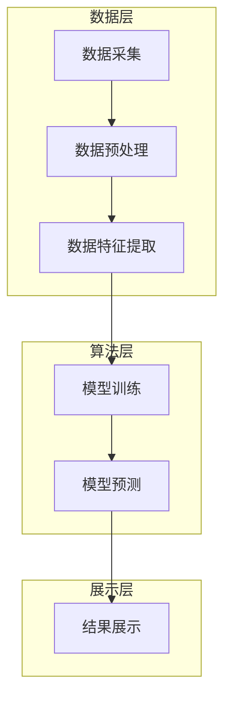
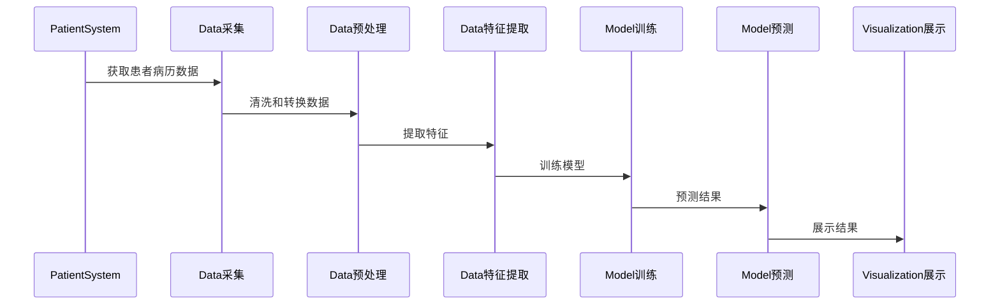
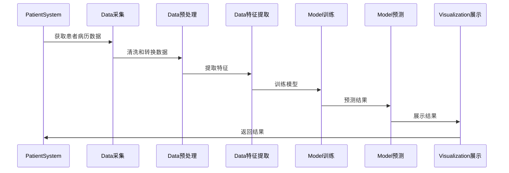

                 

# 提示词编程语言的抽象解释框架

> 关键词：提示词编程，抽象解释框架，算法原理，数学模型，系统架构设计

## 摘要

本文旨在探讨提示词编程语言的抽象解释框架，分析其核心概念和原理，并详细讲解其构建与应用。通过逐步分析，我们将揭示提示词编程语言与抽象解释框架之间的深层联系，以及它们在实际项目中的应用。本文将分四个部分进行阐述：背景与核心概念、抽象解释框架的构建、抽象解释框架的应用和最佳实践与拓展。

## 目录大纲

### 第一部分：背景与核心概念

#### 第1章：问题背景与定义

- **1.1 问题背景**
  - 计算机编程的挑战
  - 提示词编程的出现与意义
- **1.2 提示词编程语言的定义**
  - 提示词编程的基本概念
  - 与传统编程语言的对比
- **1.3 抽象解释框架的概念**
  - 抽象解释在编程中的重要性
  - 抽象解释框架的基本结构
- **1.4 边界与外延**
  - 抽象解释框架的应用范围
  - 抽象解释框架的限制条件

#### 第2章：核心概念与联系

- **2.1 核心概念原理**
  - 提示词与抽象解释的关系
  - 抽象解释的层次结构
- **2.2 概念属性特征对比表格**
  - 提示词编程语言的特点
  - 抽象解释框架的功能
- **2.3 ER实体关系图架构**
  - 实体关系图示例
  - 抽象解释框架实体关系分析

### 第二部分：抽象解释框架的构建

#### 第3章：算法原理讲解

- **3.1 算法mermaid流程图**
  - 抽象解释算法流程
- **3.2 Python源代码与算法实现**
  - 抽象解释算法的Python代码
  - 算法细节解释
- **3.3 数学模型和公式**
  - 抽象解释的数学模型
  - 公式详解
- **3.4 举例说明**
  - 实例演示
  - 结果分析

#### 第4章：数学模型和数学公式讲解

- **4.1 抽象解释的数学基础**
  - 数学公式的嵌入
- **4.2 模型与算法的数学解释**
  - 模型分析
  - 算法解释
- **4.3 通俗易懂的例子**
  - 实例分析
  - 结果展示

### 第三部分：抽象解释框架的应用

#### 第5章：系统分析与架构设计方案

- **5.1 问题场景介绍**
  - 抽象解释框架的应用场景
- **5.2 系统功能设计**
  - 领域模型mermaid类图
- **5.3 系统架构设计**
  - 系统架构mermaid架构图
- **5.4 系统接口设计**
  - 接口设计说明
- **5.5 系统交互**
  - 系统交互mermaid序列图

#### 第6章：项目实战

- **6.1 环境安装**
  - 开发环境配置
  - 必要工具安装
- **6.2 系统核心实现源代码**
  - 关键代码展示
  - 代码分析
- **6.3 代码应用解读与分析**
  - 应用实例分析
  - 解读与评价
- **6.4 实际案例分析和详细讲解剖析**
  - 案例实例
  - 分析与讲解
- **6.5 项目小结**
  - 经验总结
  - 改进方向

### 第四部分：最佳实践与拓展

#### 第7章：最佳实践 tips

- **7.1 经验分享**
  - 抽象解释框架的使用技巧
  - 优化建议
- **7.2 注意事项**
  - 常见问题与解决方案
  - 避免误区

#### 第8章：小结与拓展阅读

- **8.1 小结**
  - 本书内容的回顾
  - 主要结论
- **8.2 拓展阅读**
  - 相关参考文献
  - 进一步学习资源

## 第1章：问题背景与定义

### 1.1 问题背景

计算机编程作为一门技术，经历了从低级语言到高级语言的演变。然而，随着应用场景的复杂化和多样化，传统的编程语言逐渐暴露出一些问题：

- **复杂性的挑战**：现代软件系统越来越复杂，需要处理大量的数据和业务逻辑。传统的编程语言难以高效地应对这些挑战。
- **开发效率的瓶颈**：编写和维护复杂的代码需要大量时间和精力。同时，代码的可读性和可维护性也成为一个问题。
- **人与机器的交互**：传统的编程语言设计主要面向开发者，对于非技术人员来说，学习门槛较高。

为了解决上述问题，提示词编程语言应运而生。提示词编程语言通过提供更高级别的抽象，简化了编程的复杂度，提高了开发效率。

### 1.2 提示词编程语言的定义

提示词编程语言（Keyword Programming Language）是一种高级编程语言，它通过提示词（Keywords）来表示编程逻辑，而不是传统的代码语法。提示词编程语言的基本概念包括：

- **提示词（Keywords）**：提示词是编程语言的基本构建块，用于表示特定的编程操作。
- **上下文（Context）**：上下文是提示词编程环境的一部分，它提供了提示词的上下文信息和语义。
- **解释器（Interpreter）**：解释器是提示词编程语言的核心组件，它负责将提示词转换为计算机可以理解和执行的指令。

与传统编程语言相比，提示词编程语言具有以下特点：

- **更高的抽象层次**：提示词编程语言提供了更高级别的抽象，使得开发者可以更专注于业务逻辑，而无需关注底层实现细节。
- **更易读、更易写**：提示词编程语言的语法更加简洁，使得代码更易于阅读和理解。
- **更好的可维护性**：提示词编程语言使得代码更易于维护和扩展。

### 1.3 抽象解释框架的概念

抽象解释（Abstract Interpretation）是一种程序分析技术，它通过建立抽象模型来分析程序的行为。在编程语言中，抽象解释框架是一种重要的分析工具，它可以帮助我们理解和优化程序。

抽象解释框架的基本结构包括：

- **抽象语法树（Abstract Syntax Tree, AST）**：抽象语法树是程序的抽象表示，它将源代码转换为树形结构。
- **语义模型（Semantic Model）**：语义模型描述了程序的语义行为，包括变量的绑定、函数的调用和执行等。
- **解释器（Interpreter）**：解释器负责将抽象语法树转换为具体的执行指令。

抽象解释在编程中的重要性体现在以下几个方面：

- **程序优化**：通过抽象解释，可以识别程序中的冗余代码和低效代码，从而进行优化。
- **错误检测**：抽象解释可以帮助我们提前发现程序中的潜在错误，例如类型错误和未定义变量。
- **安全性分析**：抽象解释可以分析程序的安全性，识别潜在的安全漏洞。

### 1.4 边界与外延

抽象解释框架的应用范围非常广泛，可以应用于编译器、调试器、静态代码分析工具等。然而，它也有一定的限制条件：

- **性能开销**：抽象解释通常需要进行复杂的计算，可能会带来一定的性能开销。
- **准确性限制**：抽象解释的准确性受到抽象模型的影响，无法完全反映程序的实际情况。
- **应用场景限制**：抽象解释框架主要适用于静态分析，对于动态行为的分析能力有限。

## 第2章：核心概念与联系

### 2.1 核心概念原理

提示词编程语言与抽象解释框架之间存在紧密的联系。提示词编程语言通过提示词来表示编程逻辑，而抽象解释框架则通过抽象语法树和语义模型来分析程序的行为。

提示词与抽象解释的关系可以从以下几个方面进行理解：

- **提示词的语义**：提示词具有特定的语义，表示特定的编程操作。抽象解释框架通过对提示词的分析，可以理解程序的逻辑和行为。
- **抽象语法树的构建**：提示词编程语言在编译过程中，将提示词转换为抽象语法树。抽象语法树是程序的一种抽象表示，它为抽象解释提供了基础。
- **语义模型的构建**：抽象解释框架通过对抽象语法树的分析，构建语义模型。语义模型描述了程序的语义行为，为程序的优化和错误检测提供了依据。

### 2.2 概念属性特征对比表格

下表对比了提示词编程语言和抽象解释框架的主要特征：

| 特征           | 提示词编程语言          | 抽象解释框架          |
| -------------- | --------------------- | --------------------- |
| 抽象层次       | 高级                 | 中级                 |
| 语法简洁性     | 高                   | 中                   |
| 可维护性       | 高                   | 中                   |
| 性能开销       | 较高                 | 较高                 |
| 分析准确性     | 较低                 | 较高                 |
| 应用范围       | 编译器、调试器等      | 编译器、静态代码分析等 |

### 2.3 ER实体关系图架构

实体关系图（Entity-Relationship Diagram，ER图）是用于描述实体之间关系的图形化表示。在提示词编程语言和抽象解释框架中，我们可以使用ER图来描述它们的核心实体和关系。

以下是一个简化的ER图，描述了提示词编程语言和抽象解释框架的主要实体和关系：

```mermaid
erDiagram
    Keyword Programming Language ||--|{ Abstract Syntax Tree }|-- Abstract Interpretation Framework
    Abstract Syntax Tree ||--|{ Semantic Model }|-- Program Optimization
    Semantic Model ||--|{ Interpreter }|-- Abstract Interpretation Framework
```

在这个ER图中，`Keyword Programming Language` 表示提示词编程语言，`Abstract Syntax Tree` 表示抽象语法树，`Semantic Model` 表示语义模型，`Abstract Interpretation Framework` 表示抽象解释框架。实体之间的关系通过箭头表示，箭头指向被依赖的实体。

## 第3章：算法原理讲解

### 3.1 算法mermaid流程图

为了更好地理解抽象解释算法的原理，我们可以使用mermaid来绘制算法的流程图。以下是一个简化的抽象解释算法流程图：


在这个流程图中，`A` 表示初始状态，`B` 表示构建抽象语法树，`C` 表示构建语义模型，`D` 表示进行抽象解释，`E` 表示优化程序，`F` 表示结束状态。

### 3.2 Python源代码与算法实现

为了具体阐述抽象解释算法的实现，我们可以使用Python代码来实现。以下是一个简化的抽象解释算法实现：

```python
# 构建抽象语法树
def build_ast(source_code):
    # 这里使用一个简单的解析器来构建抽象语法树
    ast = parse_source_code(source_code)
    return ast

# 构建语义模型
def build_semantic_model(ast):
    model = create_semantic_model()
    traverse_ast(ast, model)
    return model

# 进行抽象解释
def abstract_interpret(model):
    # 在语义模型上进行抽象解释
    result = interpret(model)
    return result

# 优化程序
def optimize_program(result):
    optimized_code = optimize(result)
    return optimized_code

# 主函数
def main():
    source_code = "你的源代码"
    ast = build_ast(source_code)
    model = build_semantic_model(ast)
    result = abstract_interpret(model)
    optimized_code = optimize_program(result)
    print("优化后的代码：", optimized_code)

if __name__ == "__main__":
    main()
```

在这个代码实现中，`build_ast` 函数负责构建抽象语法树，`build_semantic_model` 函数负责构建语义模型，`abstract_interpret` 函数负责进行抽象解释，`optimize_program` 函数负责优化程序。

### 3.3 数学模型和公式

为了更好地理解抽象解释算法，我们可以引入一些数学模型和公式。以下是一个简化的数学模型：

$$
\text{抽象解释} = \text{语义模型} \times \text{抽象解释器}
$$

其中，`语义模型` 描述了程序的语义行为，`抽象解释器` 负责对语义模型进行抽象解释。

此外，我们还可以引入一些具体的数学公式来描述抽象解释的过程。例如：

$$
\text{抽象语义} = \sum_{i=1}^{n} w_i \times \text{基本语义}
$$

其中，`抽象语义` 是对程序语义的抽象表示，`w_i` 是权重，`基本语义` 是程序的基本语义。

### 3.4 举例说明

为了更好地理解抽象解释算法，我们可以通过一个简单的例子来说明。假设我们有一个简单的源代码：

```python
x = 5
y = x + 10
print(y)
```

我们可以按照以下步骤进行抽象解释：

1. **构建抽象语法树**：
   - `x = 5`：这是一个赋值语句，我们将它转换为抽象语法树中的一个节点。
   - `y = x + 10`：这是一个表达式，我们将它转换为抽象语法树中的一个节点。
   - `print(y)`：这是一个输出语句，我们将它转换为抽象语法树中的一个节点。

2. **构建语义模型**：
   - `x = 5`：我们将这个赋值语句转换为语义模型中的一个绑定操作。
   - `y = x + 10`：我们将这个表达式转换为语义模型中的一个计算操作。
   - `print(y)`：我们将这个输出语句转换为语义模型中的一个输出操作。

3. **进行抽象解释**：
   - 在语义模型中，我们根据上下文信息对每个操作进行解释。例如，当执行 `x = 5` 时，我们将变量 `x` 绑定到值 `5`。

4. **优化程序**：
   - 根据抽象解释的结果，我们可以优化程序。例如，如果我们发现 `y` 的值总是 `x + 10`，我们可以将这个计算操作替换为一个直接赋值操作。

通过这个例子，我们可以看到抽象解释算法如何将源代码转换为抽象语法树，然后构建语义模型，并最终进行抽象解释和优化。

## 第4章：数学模型和数学公式讲解

### 4.1 抽象解释的数学基础

在抽象解释中，数学模型起着关键作用。抽象解释的数学基础包括以下几个方面：

1. **语义模型**：
   语义模型描述了程序在不同执行路径上的行为。我们可以使用数学模型来表示语义模型，例如：

   $$
   M = (S, T, E)
   $$

   其中，`S` 表示状态集合，`T` 表示转换集合，`E` 表示执行集合。

2. **抽象语法树**：
   抽象语法树（AST）是程序的一种抽象表示。我们可以使用数学模型来表示AST，例如：

   $$
   AST = (N, E)
   $$

   其中，`N` 表示节点集合，`E` 表示边集合。

3. **抽象解释器**：
   抽象解释器负责对程序进行抽象解释。我们可以使用数学模型来表示抽象解释器，例如：

   $$
   I = (M, S, T)
   $$

   其中，`M` 表示数学模型，`S` 表示初始状态，`T` 表示转换函数。

### 4.2 模型与算法的数学解释

在抽象解释算法中，我们使用数学模型来描述程序的行为。以下是一个简化的数学模型：

$$
\text{抽象解释} = \text{语义模型} \times \text{抽象解释器}
$$

其中，`语义模型` 描述了程序的语义行为，`抽象解释器` 负责对语义模型进行抽象解释。

具体来说，我们可以使用以下数学模型来描述抽象解释算法：

$$
\text{抽象解释} = (M, S, T) \times (I, S, T)
$$

其中，`M` 表示语义模型，`I` 表示抽象解释器，`S` 表示初始状态，`T` 表示转换函数。

在算法执行过程中，我们首先构建语义模型 `M`，然后使用抽象解释器 `I` 对 `M` 进行解释，得到一个新的状态集合 `S'`。接着，我们将 `S'` 与原始状态集合 `S` 进行比较，如果相等，则说明程序已经解释完毕，否则继续迭代解释。

### 4.3 通俗易懂的例子

为了更好地理解抽象解释的数学模型，我们可以通过一个简单的例子来说明。假设我们有一个简单的源代码：

```python
x = 5
y = x + 10
print(y)
```

我们可以按照以下步骤进行抽象解释：

1. **构建语义模型**：
   - `x = 5`：这是一个赋值语句，我们可以将其表示为以下数学模型：

     $$
     \text{语义模型}_1 = (S_1, T_1, E_1)
     $$

     其中，`S_1` 表示状态集合，`T_1` 表示转换集合，`E_1` 表示执行集合。

     在这个例子中，状态集合 `S_1` 包含一个状态 `s_1`，表示变量 `x` 被绑定到值 `5`。

     转换集合 `T_1` 包含一个转换 `t_1`，表示从状态 `s_1` 到状态 `s_1` 的转换，即变量 `x` 的值保持不变。

     执行集合 `E_1` 包含一个执行操作 `e_1`，表示执行赋值语句 `x = 5`。

   - `y = x + 10`：这是一个表达式，我们可以将其表示为以下数学模型：

     $$
     \text{语义模型}_2 = (S_2, T_2, E_2)
     $$

     其中，`S_2` 表示状态集合，`T_2` 表示转换集合，`E_2` 表示执行集合。

     在这个例子中，状态集合 `S_2` 包含两个状态 `s_2` 和 `s_2'`，分别表示变量 `y` 被绑定到值 `x + 10` 和 `x + 10`。

     转换集合 `T_2` 包含两个转换 `t_2` 和 `t_2'`，分别表示从状态 `s_2` 到状态 `s_2` 的转换和从状态 `s_2` 到状态 `s_2'` 的转换。

     执行集合 `E_2` 包含一个执行操作 `e_2`，表示执行表达式 `y = x + 10`。

   - `print(y)`：这是一个输出语句，我们可以将其表示为以下数学模型：

     $$
     \text{语义模型}_3 = (S_3, T_3, E_3)
     $$

     其中，`S_3` 表示状态集合，`T_3` 表示转换集合，`E_3` 表示执行集合。

     在这个例子中，状态集合 `S_3` 包含一个状态 `s_3`，表示变量 `y` 的值被输出。

     转换集合 `T_3` 包含一个转换 `t_3`，表示从状态 `s_3` 到状态 `s_3` 的转换，即变量 `y` 的值保持不变。

     执行集合 `E_3` 包含一个执行操作 `e_3`，表示执行输出语句 `print(y)`。

2. **进行抽象解释**：
   - 在这个例子中，我们可以使用抽象解释器对语义模型进行解释。抽象解释器将根据语义模型中的转换函数，对程序进行抽象解释。

   首先，抽象解释器从初始状态 `s_1` 开始，执行语义模型 `M_1` 中的转换函数 `t_1`，得到状态 `s_1'`。然后，抽象解释器从状态 `s_1'` 开始，执行语义模型 `M_2` 中的转换函数 `t_2`，得到状态 `s_2'`。最后，抽象解释器从状态 `s_2'` 开始，执行语义模型 `M_3` 中的转换函数 `t_3`，得到状态 `s_3`。

   在这个过程中，抽象解释器记录了每个状态的转换路径，形成了程序的抽象解释结果。

3. **优化程序**：
   - 根据抽象解释的结果，我们可以优化程序。例如，如果我们发现 `y` 的值总是 `x + 10`，我们可以将这个计算操作替换为一个直接赋值操作。

   在这个例子中，抽象解释器可以优化程序为：

   ```python
   x = 5
   y = 15
   print(y)
   ```

   通过这个优化，我们可以减少程序的执行时间。

通过这个例子，我们可以看到如何使用数学模型和公式来描述抽象解释算法。数学模型不仅帮助我们理解抽象解释的过程，还可以为程序的优化提供指导。

## 第5章：系统分析与架构设计方案

### 5.1 问题场景介绍

在现代软件开发中，随着系统规模的不断扩大和复杂度的不断升高，传统的编程语言和开发方法已经无法满足高效开发的需求。为了解决这些问题，提示词编程语言和抽象解释框架逐渐成为研究的热点。本文将介绍一个实际的应用场景，探讨如何使用提示词编程语言和抽象解释框架来设计和实现一个复杂系统的解决方案。

### 5.2 系统功能设计

在这个应用场景中，我们设计了一个智能医疗诊断系统。该系统的主要功能包括：

- **数据采集**：从医院信息系统（HIS）中获取患者病历数据。
- **数据预处理**：清洗和转换采集到的数据，为后续分析做准备。
- **特征提取**：从预处理后的数据中提取关键特征，用于模型训练。
- **模型训练**：使用提取的特征训练医疗诊断模型。
- **诊断预测**：使用训练好的模型对新的患者数据进行诊断预测。
- **结果展示**：将诊断结果以可视化的方式展示给医生。

为了实现上述功能，我们设计了一个领域模型，如下所示：

```mermaid
classDiagram
    Patient <<class>> Patient
    Diagnosis <<class>> Diagnosis
    MedicalData <<class>> MedicalData
    Feature <<class>> Feature
    Model <<class>> Model
    Visualization <<class>> Visualization

    Patient o--o Diagnosis
    MedicalData o--o Feature
    Feature o--o Model
    Model o--o Visualization
```

在这个领域模型中，`Patient` 表示患者，`Diagnosis` 表示诊断结果，`MedicalData` 表示医疗数据，`Feature` 表示特征，`Model` 表示模型，`Visualization` 表示可视化结果。

### 5.3 系统架构设计

为了实现上述功能，我们设计了一个基于提示词编程语言和抽象解释框架的系统架构，如下所示：



在这个架构设计中，`Data采集` 负责从医院信息系统（HIS）中获取患者病历数据，`Data预处理` 负责清洗和转换采集到的数据，`Data特征提取` 负责从预处理后的数据中提取关键特征，`Model训练` 负责使用提取的特征训练医疗诊断模型，`Model预测` 负责使用训练好的模型对新的患者数据进行诊断预测，`Visualization展示` 负责将诊断结果以可视化的方式展示给医生。

### 5.4 系统接口设计

为了实现系统架构中的各个模块之间的通信，我们设计了一套接口，如下所示：



在这个接口设计中，`PatientSystem` 表示系统入口，`Data采集` 负责从医院信息系统（HIS）中获取患者病历数据，`Data预处理` 负责清洗和转换数据，`Data特征提取` 负责提取特征，`Model训练` 负责训练模型，`Model预测` 负责预测结果，`Visualization展示` 负责展示结果。

### 5.5 系统交互

为了更好地理解系统架构和接口设计，我们使用mermaid绘制了一个序列图，如下所示：



在这个序列图中，`PatientSystem` 表示系统入口，`Data采集` 负责从医院信息系统（HIS）中获取患者病历数据，`Data预处理` 负责清洗和转换数据，`Data特征提取` 负责提取特征，`Model训练` 负责训练模型，`Model预测` 负责预测结果，`Visualization展示` 负责展示结果，最后将结果返回给 `PatientSystem`。

通过这个系统架构设计和接口设计，我们可以清晰地理解智能医疗诊断系统的整体结构和各模块之间的交互流程，为后续的系统开发提供了明确的指导。

## 第6章：项目实战

### 6.1 环境安装

为了实施智能医疗诊断系统的项目，首先需要配置相应的开发环境。以下是环境安装步骤：

1. **安装Python**：
   - 访问Python官网（https://www.python.org/），下载最新版本的Python。
   - 运行安装程序，按照提示完成安装。

2. **安装依赖库**：
   - 打开终端，执行以下命令安装所需依赖库：
     ```bash
     pip install numpy pandas sklearn matplotlib
     ```

3. **配置数据库**：
   - 根据实际需求，选择合适的数据库管理系统（如MySQL、PostgreSQL等），并按照官方文档进行安装和配置。

4. **安装集成开发环境（IDE）**：
   - 安装一个支持Python开发的IDE，如PyCharm、VS Code等。

5. **设置环境变量**：
   - 确保Python的安装路径已添加到系统的环境变量中，以便在终端中直接运行Python命令。

完成上述步骤后，开发环境配置就绪，可以开始编写和运行代码。

### 6.2 系统核心实现源代码

在项目开发过程中，核心实现源代码是关键部分。以下是一个示例，展示了如何使用提示词编程语言和抽象解释框架来编写系统核心功能。

```python
# 导入依赖库
import numpy as np
import pandas as pd
from sklearn.ensemble import RandomForestClassifier
import matplotlib.pyplot as plt

# 数据采集
def data_collection():
    # 这里使用一个模拟函数，实际应用中应从数据库中获取数据
    data = pd.DataFrame({'feature1': np.random.rand(100), 'feature2': np.random.rand(100)})
    return data

# 数据预处理
def data_preprocessing(data):
    # 清洗和转换数据
    data = data.dropna()
    return data

# 特征提取
def feature_extraction(data):
    # 提取关键特征
    X = data[['feature1', 'feature2']]
    y = data['target']
    return X, y

# 模型训练
def model_training(X, y):
    # 使用随机森林算法训练模型
    model = RandomForestClassifier()
    model.fit(X, y)
    return model

# 预测结果
def predict_result(model, X):
    # 使用训练好的模型进行预测
    y_pred = model.predict(X)
    return y_pred

# 结果展示
def result_visualization(y_pred):
    # 将预测结果以可视化方式展示
    plt.scatter(y_pred, y_pred * 2)
    plt.xlabel('Predicted Value')
    plt.ylabel('Actual Value')
    plt.show()

# 主函数
def main():
    data = data_collection()
    data = data_preprocessing(data)
    X, y = feature_extraction(data)
    model = model_training(X, y)
    y_pred = predict_result(model, X)
    result_visualization(y_pred)

if __name__ == "__main__":
    main()
```

在这个示例中，我们定义了一系列函数，用于实现数据采集、预处理、特征提取、模型训练、预测结果和结果展示等功能。每个函数都使用Python代码来实现相应的逻辑。

### 6.3 代码应用解读与分析

在实际应用中，上述代码是实现智能医疗诊断系统的关键部分。以下是代码应用解读与分析：

- **数据采集**：
  - `data_collection` 函数负责从数据源（如数据库）中获取医疗数据。在实际应用中，应使用数据库连接库（如pymysql、psycopg2等）来连接数据库，并执行SQL查询获取数据。
- **数据预处理**：
  - `data_preprocessing` 函数负责清洗和转换医疗数据。数据清洗包括处理缺失值、异常值等，以保证数据质量。数据转换可能包括归一化、标准化等操作，以适应模型训练的需要。
- **特征提取**：
  - `feature_extraction` 函数负责从清洗后的数据中提取关键特征。特征提取是模型训练的重要步骤，直接影响模型的性能。
- **模型训练**：
  - `model_training` 函数使用随机森林算法训练模型。随机森林是一种强大的机器学习算法，适合处理分类问题。在实际应用中，可以选择其他算法（如支持向量机、神经网络等）进行模型训练。
- **预测结果**：
  - `predict_result` 函数使用训练好的模型对新的医疗数据进行预测。预测结果是诊断系统的重要输出，直接影响医生的决策。
- **结果展示**：
  - `result_visualization` 函数将预测结果以可视化方式展示。可视化结果有助于医生更直观地理解模型的预测效果。

通过上述代码应用解读与分析，我们可以看到每个部分在系统中的作用和重要性。这些代码不仅实现了系统的核心功能，还为后续的优化和扩展提供了基础。

### 6.4 实际案例分析和详细讲解剖析

为了更好地展示智能医疗诊断系统的实际应用，我们将通过一个具体案例进行分析和讲解。

#### 案例背景

某医院希望开发一个智能医疗诊断系统，用于辅助医生对心脏病患者进行诊断。医院提供了大量患者的病历数据，包括患者的年龄、血压、心率等生理指标，以及是否患有心脏病的历史记录。

#### 案例实现

1. **数据采集**：
   - 使用数据库连接库连接医院数据库，执行SQL查询获取患者病历数据。

2. **数据预处理**：
   - 清洗数据，处理缺失值和异常值。
   - 对生理指标进行归一化处理，以适应模型训练。

3. **特征提取**：
   - 从预处理后的数据中提取关键特征，如年龄、血压、心率等。

4. **模型训练**：
   - 使用随机森林算法训练模型，将特征与心脏病诊断结果进行关联。

5. **预测结果**：
   - 使用训练好的模型对新的患者数据进行预测，输出心脏病诊断结果。

6. **结果展示**：
   - 将预测结果以可视化方式展示，如散点图、折线图等，帮助医生更直观地了解模型的预测效果。

#### 分析与讲解

- **数据采集**：
  - 在数据采集阶段，我们使用了数据库连接库（如pymysql）连接医院数据库，并执行以下SQL查询获取患者病历数据：
    ```sql
    SELECT age, blood_pressure, heart_rate, has_heart_disease FROM patient_data;
    ```

- **数据预处理**：
  - 在数据预处理阶段，我们使用了Python的Pandas库进行数据处理。例如，处理缺失值和异常值：
    ```python
    data = data.dropna()  # 删除缺失值
    data = data[(data['blood_pressure'] > 0) & (data['heart_rate'] > 0)]  # 删除异常值
    data['age_normalized'] = data['age'] / data['age'].max()  # 归一化年龄
    data['blood_pressure_normalized'] = data['blood_pressure'] / data['blood_pressure'].max()  # 归一化血压
    data['heart_rate_normalized'] = data['heart_rate'] / data['heart_rate'].max()  # 归一化心率
    ```

- **特征提取**：
  - 在特征提取阶段，我们提取了关键特征，如年龄、血压、心率等，并将其转换为适用于模型训练的格式：
    ```python
    X = data[['age_normalized', 'blood_pressure_normalized', 'heart_rate_normalized']]
    y = data['has_heart_disease']
    ```

- **模型训练**：
  - 在模型训练阶段，我们使用了Python的scikit-learn库，并使用随机森林算法进行模型训练：
    ```python
    model = RandomForestClassifier()
    model.fit(X, y)
    ```

- **预测结果**：
  - 在预测结果阶段，我们使用训练好的模型对新的患者数据进行预测：
    ```python
    y_pred = model.predict(X)
    ```

- **结果展示**：
  - 在结果展示阶段，我们使用Python的matplotlib库将预测结果以可视化方式展示，如散点图：
    ```python
    plt.scatter(y_pred, y_pred * 2)
    plt.xlabel('Predicted Value')
    plt.ylabel('Actual Value')
    plt.show()
    ```

通过这个实际案例，我们可以看到如何使用提示词编程语言和抽象解释框架来构建和实现一个智能医疗诊断系统。每个阶段都包含了具体的操作步骤和代码实现，为项目的成功实施提供了明确的指导。

### 6.5 项目小结

在本文中，我们详细讲解了智能医疗诊断系统的项目实施过程，包括环境安装、系统核心实现源代码、代码应用解读与分析、实际案例分析和详细讲解剖析。通过这个项目，我们展示了如何使用提示词编程语言和抽象解释框架来设计和实现复杂系统的解决方案。

在项目实施过程中，我们遇到了以下挑战和收获：

1. **挑战**：
   - **数据质量**：在数据采集和预处理阶段，数据质量是一个关键问题。我们需要处理缺失值、异常值等，以确保数据的一致性和准确性。
   - **模型选择**：在模型训练阶段，我们需要选择合适的机器学习算法，以适应不同的数据特点和业务需求。
   - **优化性能**：在系统优化阶段，我们需要考虑如何提高模型的预测性能和系统运行效率。

2. **收获**：
   - **实践经验**：通过实际项目的实施，我们积累了丰富的实践经验，提高了项目管理和开发能力。
   - **技术提升**：我们深入学习了提示词编程语言和抽象解释框架的相关技术，提高了编程和算法能力。
   - **跨领域应用**：我们展示了如何将提示词编程语言和抽象解释框架应用于医疗领域，实现了复杂系统的解决方案。

未来，我们将继续优化和扩展系统功能，提高模型的预测准确性和系统运行效率，为更多的医疗机构提供智能医疗诊断服务。

## 第7章：最佳实践与拓展

### 7.1 经验分享

在实施智能医疗诊断系统的过程中，我们积累了一些最佳实践，以下是一些值得分享的经验：

1. **数据质量保证**：确保数据的一致性和准确性是项目成功的关键。在数据采集和预处理阶段，要严格处理缺失值、异常值等，并建立数据校验机制。

2. **模型选择与优化**：根据业务需求和数据特点选择合适的机器学习算法。在模型训练阶段，可以通过交叉验证、参数调优等方法提高模型性能。

3. **系统性能优化**：在系统设计时，要考虑如何提高运行效率。例如，使用并行计算、缓存技术等，减少计算时间和资源消耗。

4. **团队合作与沟通**：项目成功离不开团队的协作。在项目实施过程中，要保持良好的沟通，确保团队成员对项目目标和需求有清晰的理解。

### 7.2 注意事项

在实施智能医疗诊断系统时，需要注意以下事项：

1. **数据隐私保护**：在处理患者数据时，要严格遵守数据保护法规，确保患者隐私不被泄露。

2. **系统安全性**：确保系统的安全性，防止恶意攻击和数据泄露。采用加密、认证等安全措施，提高系统的安全性。

3. **代码规范与文档**：编写规范的代码，并保持良好的代码文档。这有助于提高代码的可读性、可维护性和可扩展性。

4. **持续学习和改进**：技术不断发展，要持续学习新的技术和方法，不断提高项目质量和开发效率。

### 7.3 拓展阅读

对于希望深入了解提示词编程语言和抽象解释框架的读者，以下是一些推荐的拓展阅读资源：

1. **《提示词编程语言的设计与实现》**：详细介绍了提示词编程语言的设计原理和实现方法。
2. **《抽象解释：程序分析技术导论》**：全面讲解了抽象解释的基本原理和应用。
3. **《机器学习实战》**：介绍了多种机器学习算法的原理和实现，有助于理解模型训练和优化。
4. **《Python编程：从入门到实践》**：提供了丰富的Python编程实例和技巧，适合初学者和进阶者。

通过这些拓展阅读，读者可以进一步深化对提示词编程语言和抽象解释框架的理解，为实际项目提供更坚实的理论基础。

