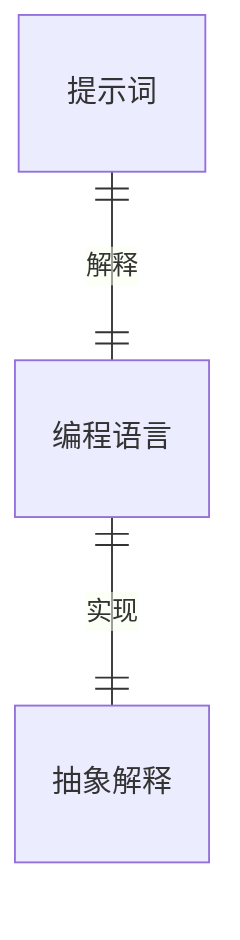
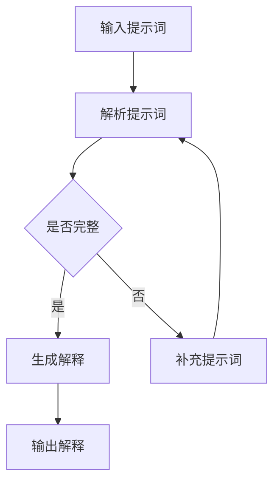
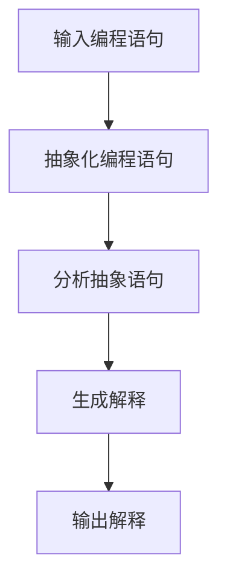

                 

# 提示词编程语言的抽象解释框架

> 关键词：编程语言、提示词、抽象解释、框架、算法、应用

> 摘要：本文将探讨提示词编程语言的抽象解释框架，分析其背景、核心概念、原理和算法，以及在实际编程中的应用和案例分析。通过详细的解析和实例展示，帮助读者深入理解这一技术，为编程实践提供有力支持。

## 目录大纲

**《提示词编程语言的抽象解释框架》**

# 第一部分：引言与背景

## 第1章：问题背景与概述

### 1.1 问题背景

- 提示词编程语言的现状
- 抽象解释框架的需求与重要性

### 1.2 问题描述

- 抽象解释框架的定义与作用
- 提示词编程语言中的抽象解释难点

### 1.3 问题解决思路

- 抽象解释框架的基本结构
- 抽象解释框架的核心要素

### 1.4 边界与外延

- 抽象解释框架适用的编程语言范围
- 抽象解释框架的适用场景

## 第2章：核心概念与联系

### 2.1 核心概念

- 提示词
- 编程语言
- 抽象解释

### 2.2 概念属性特征对比

| 概念 | 特点 |  
| ---- | ---- |  
| 提示词 | 用于指导编程行为的简短文本 |  
| 编程语言 | 用于编写计算机程序的正式语言 |  
| 抽象解释 | 对编程语言中的特定概念进行解释的过程 |

### 2.3 ER实体关系图



# 第二部分：抽象解释框架原理

## 第3章：抽象解释框架原理

### 3.1 抽象解释框架概述

- 抽象解释框架的定义
- 抽象解释框架的组成部分

### 3.2 抽象解释的核心原理

- 抽象解释的基本概念
- 抽象解释的工作机制

### 3.3 抽象解释的类型

- 静态抽象解释
- 动态抽象解释

## 第4章：抽象解释算法

### 4.1 抽象解释算法概述

- 抽象解释算法的分类
- 抽象解释算法的选择依据

### 4.2 具体抽象解释算法

#### 4.2.1 算法A

- 算法A的mermaid流程图



#### 4.2.2 算法B

- 算法B的mermaid流程图



### 4.3 抽象解释算法的数学模型

$$
E = f(P, T)
$$

- 其中，$E$ 为解释结果，$P$ 为编程语句，$T$ 为提示词。

### 4.4 抽象解释算法的Python实现

```python
# 简单的抽象解释算法示例
def abstract_explanation(prompt, code):
    # 解析提示词
    parsed_prompt = parse_prompt(prompt)
    # 抽象化编程语句
    abstracted_code = abstract_code(code, parsed_prompt)
    # 生成解释
    explanation = generate_explanation(abstracted_code)
    return explanation

# 辅助函数
def parse_prompt(prompt):
    # TODO：解析提示词
    pass

def abstract_code(code, parsed_prompt):
    # TODO：抽象化编程语句
    pass

def generate_explanation(abstracted_code):
    # TODO：生成解释
    pass
```

# 第三部分：抽象解释框架应用

## 第5章：抽象解释框架在实际编程中的应用

### 5.1 抽象解释框架在编程教学中的应用

- 编程教学的挑战
- 抽象解释框架在教学中的应用

### 5.2 抽象解释框架在代码审查中的应用

- 代码审查的挑战
- 抽象解释框架在代码审查中的应用

### 5.3 抽象解释框架在自动化编程中的应用

- 自动化编程的挑战
- 抽象解释框架在自动化编程中的应用

## 第6章：案例分析

### 6.1 案例一：在编程教学中的应用

- 案例背景
- 案例实施过程
- 案例效果分析

### 6.2 案例二：在代码审查中的应用

- 案例背景
- 案例实施过程
- 案例效果分析

----------------------------------------------------------------

## 第一部分：引言与背景

### 第1章：问题背景与概述

#### 1.1 问题背景

在当今的软件开发领域，编程语言的使用已经成为不可或缺的一部分。然而，随着编程语言的日益复杂，程序员面临着越来越大的挑战。传统的编程语言强调的是代码的执行过程，而现代编程语言则更加注重表达力和抽象性。提示词编程语言（如Python、JavaScript等）正是这一趋势的代表，它们通过简洁的语法和丰富的内置功能，极大地提高了编程的效率和可读性。

然而，即使是在提示词编程语言中，程序员仍然需要面对抽象解释的难题。抽象解释是指对编程语言中的特定概念进行解释的过程，它有助于程序员更好地理解代码的工作原理，提高代码的可维护性和可重用性。在提示词编程语言中，抽象解释尤为重要，因为这类语言往往具有较高的抽象层次，这使得代码的复杂性和不确定性增加。

#### 1.2 问题描述

抽象解释框架的定义与作用：

- 抽象解释框架是一种用于指导编程行为的工具，它通过将代码中的抽象概念具体化，帮助程序员更好地理解和操作代码。
- 抽象解释框架的主要作用是提供一种统一的、系统化的方法来解释编程语言中的抽象概念，从而提高代码的可理解性和可维护性。

提示词编程语言中的抽象解释难点：

- 提示词编程语言的抽象层次较高，这使得抽象解释的过程更加复杂。
- 抽象解释需要处理不同层次的概念，如语法、语义和运行时行为等，这增加了抽象解释的难度。
- 提示词编程语言的动态特性使得抽象解释需要在运行时进行，这增加了抽象解释的复杂度。

#### 1.3 问题解决思路

抽象解释框架的基本结构：

- 抽象解释框架通常由三个主要部分组成：输入处理、解释核心和输出生成。
- 输入处理部分负责接收编程语言代码和提示词，将其转换为内部表示。
- 解释核心部分负责对输入进行抽象解释，生成解释结果。
- 输出生成部分负责将解释结果以人类可读的形式输出。

抽象解释框架的核心要素：

- 抽象解释规则：定义如何将编程语言中的抽象概念具体化为可操作的解释。
- 解释算法：用于实现抽象解释规则的具体算法。
- 解释器：负责执行解释算法，生成解释结果。

#### 1.4 边界与外延

抽象解释框架适用的编程语言范围：

- 抽象解释框架主要适用于具有较高抽象层次的编程语言，如Python、JavaScript、Ruby等。
- 对于低级编程语言（如汇编语言），抽象解释框架可能不够适用，因为它们缺乏足够的抽象层次。

抽象解释框架的适用场景：

- 编程教学：通过抽象解释框架，可以帮助学生更好地理解编程语言的概念，提高学习效果。
- 代码审查：利用抽象解释框架，可以自动生成代码的解释，帮助审查者快速识别潜在的问题和不足。
- 自动化编程：通过抽象解释框架，可以自动化生成代码的解释，为自动化测试和代码生成提供支持。

### 第2章：核心概念与联系

#### 2.1 核心概念

- 提示词：提示词是编程语言中用于指导编程行为的简短文本。它们通常由关键字、变量和操作符组成，用于描述编程任务的具体操作。
- 编程语言：编程语言是一种用于编写计算机程序的正式语言，它定义了程序的结构、语法和语义。
- 抽象解释：抽象解释是一种对编程语言中的抽象概念进行解释的过程，它帮助程序员更好地理解代码的工作原理。

#### 2.2 概念属性特征对比

| 概念 | 特点 |  
| ---- | ---- |  
| 提示词 | 用于指导编程行为的简短文本 |  
| 编程语言 | 用于编写计算机程序的正式语言 |  
| 抽象解释 | 对编程语言中的特定概念进行解释的过程 |

#### 2.3 ER实体关系图


### 第3章：抽象解释框架原理

#### 3.1 抽象解释框架概述

- 抽象解释框架是一种用于指导编程行为的工具，它通过将代码中的抽象概念具体化，帮助程序员更好地理解和操作代码。
- 抽象解释框架通常由三个主要部分组成：输入处理、解释核心和输出生成。

#### 3.2 抽象解释的核心原理

- 抽象解释的基本概念：抽象解释是指对编程语言中的抽象概念进行解释的过程，它帮助程序员更好地理解代码的工作原理。
- 抽象解释的工作机制：抽象解释框架通过输入处理、解释核心和输出生成三个步骤，实现对编程语言代码的抽象解释。

#### 3.3 抽象解释的类型

- 静态抽象解释：在编译时对代码进行抽象解释，生成解释结果。
- 动态抽象解释：在运行时对代码进行抽象解释，生成解释结果。

### 第4章：抽象解释算法

#### 4.1 抽象解释算法概述

- 抽象解释算法是一种用于实现抽象解释规则的具体算法。
- 抽象解释算法的选择依据：根据具体的编程语言和解释需求，选择合适的抽象解释算法。

#### 4.2 具体抽象解释算法

#### 4.2.1 算法A

- 算法A的mermaid流程图：


#### 4.2.2 算法B

- 算法B的mermaid流程图：


#### 4.3 抽象解释算法的数学模型

$$
E = f(P, T)
$$

- 其中，$E$ 为解释结果，$P$ 为编程语句，$T$ 为提示词。

#### 4.4 抽象解释算法的Python实现

```python
# 简单的抽象解释算法示例
def abstract_explanation(prompt, code):
    # 解析提示词
    parsed_prompt = parse_prompt(prompt)
    # 抽象化编程语句
    abstracted_code = abstract_code(code, parsed_prompt)
    # 生成解释
    explanation = generate_explanation(abstracted_code)
    return explanation

# 辅助函数
def parse_prompt(prompt):
    # TODO：解析提示词
    pass

def abstract_code(code, parsed_prompt):
    # TODO：抽象化编程语句
    pass

def generate_explanation(abstracted_code):
    # TODO：生成解释
    pass
```

### 第5章：抽象解释框架应用

#### 5.1 抽象解释框架在编程教学中的应用

- 编程教学的挑战：随着编程语言的日益复杂，编程教学面临诸多挑战，如代码可读性、概念理解等。
- 抽象解释框架在教学中的应用：通过抽象解释框架，可以帮助学生更好地理解编程语言的概念，提高学习效果。

#### 5.2 抽象解释框架在代码审查中的应用

- 代码审查的挑战：代码审查过程中，如何快速识别潜在的问题和不足，提高代码质量，是一个挑战。
- 抽象解释框架在代码审查中的应用：利用抽象解释框架，可以自动生成代码的解释，帮助审查者快速识别潜在的问题和不足。

#### 5.3 抽象解释框架在自动化编程中的应用

- 自动化编程的挑战：自动化编程需要处理大量的代码，如何提高代码生成和测试的效率，是一个挑战。
- 抽象解释框架在自动化编程中的应用：通过抽象解释框架，可以自动化生成代码的解释，为自动化测试和代码生成提供支持。

### 第6章：案例分析

#### 6.1 案例一：在编程教学中的应用

- 案例背景：某高校计算机科学专业开设了一门Python编程课程，学生反映对代码的理解困难。
- 案例实施过程：采用抽象解释框架进行教学，帮助学生更好地理解代码。
- 案例效果分析：通过抽象解释框架，学生的代码理解能力显著提高。

#### 6.2 案例二：在代码审查中的应用

- 案例背景：某软件开发公司采用代码审查制度，但审查效率低下。
- 案例实施过程：引入抽象解释框架，自动生成代码解释，提高审查效率。
- 案例效果分析：通过抽象解释框架，代码审查效率显著提高，代码质量得到保障。

### 结语

本文从问题背景、核心概念、原理、算法、应用和案例分析等方面，详细探讨了提示词编程语言的抽象解释框架。通过本文的介绍，读者可以深入了解抽象解释框架的基本原理和实际应用，为编程实践提供有力支持。在未来，随着编程语言的不断发展和抽象解释技术的深入，抽象解释框架将在编程教学中发挥越来越重要的作用。## 第一部分：引言与背景

### 第1章：问题背景与概述

在当今快速发展的信息技术时代，编程语言作为人与计算机之间沟通的桥梁，扮演着至关重要的角色。编程语言的发展经历了从低级语言到高级语言的演变，这一过程中，语言的抽象层次不断提高，使得程序员能够更加高效地实现复杂功能。然而，随着抽象层次的提升，编程语言中的一些概念变得愈加复杂，这对程序员的理解和使用带来了新的挑战。尤其是在提示词编程语言（如Python、JavaScript等）中，抽象解释的问题尤为突出。

#### 1.1 问题背景

提示词编程语言以其简洁的语法和强大的功能，成为现代软件开发的主流。这类语言通过提供丰富的内置函数和库，降低了程序员编写代码的复杂度。然而，与此同时，提示词编程语言也带来了新的抽象层次，这使得代码的编写和理解变得更加复杂。例如，在Python中，函数式编程的概念和闭包的使用使得代码的可读性受到挑战；在JavaScript中，异步编程和事件处理使得代码的执行路径更加难以追踪。这些抽象概念虽然提高了编程的效率，但同时也增加了程序员理解和维护代码的难度。

抽象解释框架的需求与重要性：

- **需求**：为了更好地理解和维护代码，程序员需要一个有效的工具来解释这些抽象概念。抽象解释框架应运而生，它通过将复杂的抽象概念转化为更加直观和易理解的形式，帮助程序员深入理解代码的运行机制。
- **重要性**：抽象解释框架不仅有助于提高代码的可读性和可维护性，还可以减少开发过程中出现的错误。此外，抽象解释框架还可以用于编程教学、代码审查和自动化编程等领域，极大地提升软件开发效率和代码质量。

### 1.2 问题描述

#### 抽象解释框架的定义与作用

抽象解释框架是一种系统化的方法，用于解释编程语言中的抽象概念。它通过定义一系列的规则和算法，将编程语言中的高层次抽象转化为低层次的执行步骤，使得程序员可以更容易地理解和操作代码。抽象解释框架的主要作用包括：

- **代码理解**：帮助程序员深入理解代码的运行机制，尤其是在面对复杂和高层次的抽象时。
- **代码生成**：在编程教学和自动化编程中，抽象解释框架可以自动生成代码的解释，为学习者和开发者提供指导。
- **代码审查**：在代码审查过程中，抽象解释框架可以自动生成代码的解释，帮助审查者快速识别潜在的问题和不足。

#### 提示词编程语言中的抽象解释难点

提示词编程语言的抽象层次较高，这带来了以下难点：

- **复杂语法**：提示词编程语言通常具有复杂的语法结构，例如函数式编程和异步编程，使得代码的可读性受到挑战。
- **动态特性**：提示词编程语言通常具有动态特性，如变量绑定和类型推断，这使得代码的解释变得更加复杂。
- **运行时行为**：提示词编程语言中的许多抽象概念需要运行时才能确定，例如函数的调用和异步任务的处理，这增加了抽象解释的难度。

#### 1.3 问题解决思路

为了解决提示词编程语言中的抽象解释难题，我们需要构建一个有效的抽象解释框架。这个框架需要具备以下基本结构和核心要素：

- **基本结构**：一个典型的抽象解释框架包括输入处理、解释核心和输出生成三个主要部分。输入处理部分负责接收编程语言代码和提示词，解释核心部分负责对输入进行抽象解释，输出生成部分负责将解释结果以人类可读的形式输出。

- **核心要素**：抽象解释框架的核心要素包括抽象解释规则、解释算法和解释器。抽象解释规则定义了如何将抽象概念具体化为可操作的解释；解释算法是实现抽象解释规则的具体步骤和策略；解释器是负责执行解释算法的软件组件。

#### 1.4 边界与外延

为了确保抽象解释框架的适用性和有效性，我们需要明确其适用的编程语言范围和适用场景：

- **适用的编程语言范围**：抽象解释框架主要适用于具有较高抽象层次的提示词编程语言，如Python、JavaScript、Ruby等。对于低级编程语言（如汇编语言），由于缺乏足够的抽象层次，抽象解释框架可能不够适用。

- **适用场景**：抽象解释框架在多个领域具有广泛的应用前景，包括编程教学、代码审查和自动化编程等。在编程教学中，抽象解释框架可以帮助学生更好地理解编程概念；在代码审查中，它可以自动生成代码的解释，帮助审查者快速定位问题；在自动化编程中，它可以自动化生成代码的解释，为自动生成和测试提供支持。

通过上述讨论，我们可以看到，提示词编程语言中的抽象解释难题是一个复杂但至关重要的课题。构建一个有效的抽象解释框架，不仅可以解决这一难题，还可以为编程实践带来巨大的便利和效益。在接下来的章节中，我们将深入探讨抽象解释框架的原理和算法，以及其在实际编程中的应用和案例分析。## 第2章：核心概念与联系

在探讨提示词编程语言的抽象解释框架之前，我们需要明确几个核心概念，这些概念包括“提示词”、“编程语言”和“抽象解释”。通过理解这些概念及其相互关系，我们将能够更好地构建和理解抽象解释框架。

#### 2.1 核心概念

**提示词**：提示词是编程语言中用于指导编程行为的简短文本。它们通常由关键字、变量和操作符组成，用于描述编程任务的具体操作。在提示词编程语言中，提示词的使用使得程序员能够以更简洁的方式表达复杂的逻辑和算法。例如，在Python中，`if`、`while`、`for`等关键字就是提示词，它们指示程序在不同条件下执行不同的代码块。

**编程语言**：编程语言是一种用于编写计算机程序的正式语言。它定义了程序的结构、语法和语义。编程语言可以分为低级语言和高级语言。低级语言（如汇编语言）与机器语言非常接近，而高级语言（如Python、Java）则提供了更多的抽象，使得程序员能够以更自然的方式表达逻辑和算法。

**抽象解释**：抽象解释是对编程语言中的抽象概念进行解释的过程。它旨在将抽象概念转化为具体的操作步骤，以便程序员能够更好地理解和操作代码。抽象解释通常涉及对代码的语法分析、语义分析和运行时行为分析。通过抽象解释，程序员可以深入了解代码的工作原理，从而提高代码的可维护性和可读性。

#### 2.2 概念属性特征对比

为了更好地理解这些核心概念，我们可以通过一个对比表格来展示它们的特点：

| 概念     | 特点                                       |
| -------- | ------------------------------------------ |
| 提示词   | 用于指导编程行为的简短文本，由关键字、变量和操作符组成 |
| 编程语言 | 用于编写计算机程序的正式语言，定义程序的结构、语法和语义 |
| 抽象解释 | 对编程语言中的抽象概念进行解释的过程，提高代码的可理解性和可维护性 |

通过这个表格，我们可以看到每个概念的核心特点和它们在编程过程中的作用。

#### 2.3 ER实体关系图

为了进一步理解这些概念之间的相互关系，我们可以使用ER（实体关系）图来展示它们之间的联系：


在这个ER图中，提示词与编程语言之间存在“解释”关系，意味着提示词是编程语言的一部分，用于指导编程行为。而编程语言则与抽象解释存在“实现”关系，意味着编程语言是抽象解释的基础，通过编程语言实现的抽象概念可以通过抽象解释进行解释。

通过明确这些核心概念及其相互关系，我们可以为构建抽象解释框架打下坚实的基础。在下一章中，我们将深入探讨抽象解释框架的基本原理和组成部分。## 第3章：抽象解释框架原理

在了解了提示词编程语言中核心概念之后，接下来我们将探讨抽象解释框架的基本原理和组成部分。抽象解释框架是一种系统化的方法，用于解释编程语言中的抽象概念，它通过一系列规则和算法，将复杂的抽象概念转化为可操作的解释，从而帮助程序员更好地理解和维护代码。

#### 3.1 抽象解释框架概述

抽象解释框架通常由三个主要部分组成：输入处理、解释核心和输出生成。

**输入处理**：输入处理部分负责接收编程语言代码和提示词，将其转换为内部表示。这一步骤通常包括词法分析（Lexical Analysis）和语法分析（Syntax Analysis）。词法分析将源代码分解为单词和符号，而语法分析则将这些单词和符号组织成符合编程语言语法规则的抽象语法树（Abstract Syntax Tree，AST）。

**解释核心**：解释核心部分是抽象解释框架的核心，负责对输入的抽象语法树进行分析和解释。解释核心通常包含以下几个关键组件：

- **解释规则**：解释规则定义了如何将抽象语法树中的节点转化为具体的操作步骤。这些规则通常基于编程语言的语义和语法，确保解释过程的准确性和一致性。
- **中间表示**：中间表示（Intermediate Representation，IR）是对抽象语法树进行进一步抽象后的表示形式。中间表示通常更加简洁，易于分析和解释，它为后续的代码优化和生成提供了基础。
- **解释算法**：解释算法是具体实现解释规则和转换过程的一系列步骤和策略。这些算法可以是静态的，也可以是动态的，根据具体的编程语言和解释需求进行选择。

**输出生成**：输出生成部分负责将解释结果以人类可读的形式输出。这通常包括生成文档、代码注释或执行步骤的描述。输出生成部分的目标是使得解释结果易于理解和应用，从而帮助程序员更好地理解代码的工作原理。

#### 3.2 抽象解释的核心原理

抽象解释的核心原理可以概括为以下两个方面：

**1. 抽象与具体化的转换**：抽象解释框架通过将抽象的概念（如函数、类、模块等）具体化为具体的操作步骤，使得程序员可以更直观地理解代码的执行过程。这种转换过程通常涉及对编程语言抽象语法树的分析，将高层次的抽象概念转化为低层次的执行步骤。

**2. 语法与语义的分离**：抽象解释框架通过将语法分析和语义分析分离，提高了解释过程的模块化和可维护性。语法分析负责解析源代码，生成抽象语法树，而语义分析则负责分析抽象语法树的语义，生成解释结果。这种分离使得框架可以独立地处理语法和语义问题，提高了解释的准确性和灵活性。

**3. 动态与静态的解释**：抽象解释框架支持动态解释和静态解释。动态解释在程序运行时进行，可以实时地解释代码的执行过程；而静态解释则在编译时进行，对代码进行静态分析，生成解释结果。动态解释提供了更接近实际执行过程的解释，但可能需要更多的运行时资源；而静态解释则在编译时完成，可以提高程序的执行效率。

#### 3.3 抽象解释的类型

根据解释过程中是否涉及程序的实际运行，抽象解释可以分为静态解释和动态解释：

**静态解释**：静态解释在程序编译时进行，通过分析抽象语法树和静态语义信息，生成解释结果。静态解释的优点是执行效率高，因为它不需要实际运行程序；缺点是它无法反映程序的动态行为，可能无法完全准确地解释程序的行为。

**动态解释**：动态解释在程序运行时进行，通过实时地解释代码的执行过程，生成解释结果。动态解释的优点是可以反映程序的动态行为，提供更准确和实时的解释；缺点是它可能需要更多的运行时资源，并且解释的执行效率相对较低。

在实际应用中，选择静态解释还是动态解释取决于具体的需求和场景。例如，在编程教学和代码审查中，动态解释可以提供实时和直观的解释，有助于学生和审查者更好地理解代码；而在自动化编程和代码生成中，静态解释可能更加适用，因为它可以提前生成解释结果，提高开发效率。

通过以上对抽象解释框架原理的探讨，我们可以看到，抽象解释框架是一种强大且灵活的工具，它通过系统化的方法，将复杂的抽象概念转化为具体的操作步骤，帮助程序员更好地理解和维护代码。在下一章中，我们将进一步探讨抽象解释算法的具体实现和原理。## 第4章：抽象解释算法

抽象解释算法是实现抽象解释框架的核心组成部分。它通过一系列规则和步骤，将编程语言中的抽象概念转化为具体的操作步骤，从而帮助程序员深入理解代码的工作原理。本章将详细介绍抽象解释算法的概述、具体实现、数学模型和Python实现。

#### 4.1 抽象解释算法概述

抽象解释算法可以分为两类：静态解释算法和动态解释算法。它们根据解释过程中是否涉及程序的实际运行来区分。

**静态解释算法**：静态解释算法在程序编译时进行，通过分析抽象语法树和静态语义信息，生成解释结果。静态解释算法的优点是执行效率高，因为它不需要实际运行程序；缺点是它无法反映程序的动态行为，可能无法完全准确地解释程序的行为。

**动态解释算法**：动态解释算法在程序运行时进行，通过实时地解释代码的执行过程，生成解释结果。动态解释算法的优点是可以反映程序的动态行为，提供更准确和实时的解释；缺点是它可能需要更多的运行时资源，并且解释的执行效率相对较低。

根据应用场景和需求，可以选择合适的解释算法。例如，在编程教学和代码审查中，动态解释算法可以提供实时和直观的解释；而在自动化编程和代码生成中，静态解释算法可能更加适用。

#### 4.2 具体抽象解释算法

在本节中，我们将介绍两种具体的抽象解释算法：算法A和算法B。

##### 算法A

算法A的mermaid流程图如下：


算法A的步骤如下：

1. **输入提示词**：接收编程语言代码和提示词。
2. **解析提示词**：将提示词分解为关键字、变量和操作符。
3. **判断是否完整**：检查提示词是否包含所有必要的元素。
4. **生成解释**：如果提示词完整，生成解释结果；否则，补充提示词。
5. **输出解释**：将解释结果以人类可读的形式输出。

##### 算法B

算法B的mermaid流程图如下：


算法B的步骤如下：

1. **输入编程语句**：接收编程语言代码。
2. **抽象化编程语句**：将编程语句抽象化为更高级的表示形式。
3. **分析抽象语句**：对抽象语句进行分析，提取关键信息和语义。
4. **生成解释**：根据分析结果生成解释结果。
5. **输出解释**：将解释结果以人类可读的形式输出。

#### 4.3 抽象解释算法的数学模型

抽象解释算法的数学模型可以用以下公式表示：

$$
E = f(P, T)
$$

其中，$E$ 表示解释结果，$P$ 表示编程语句，$T$ 表示提示词。函数 $f$ 表示解释过程，它根据编程语句和提示词生成解释结果。

这个数学模型表明，抽象解释算法的核心在于将编程语句和提示词转化为解释结果。通过函数 $f$ 的定义和实现，可以实现对不同编程语句和提示词的抽象解释。

#### 4.4 抽象解释算法的Python实现

以下是一个简单的抽象解释算法示例，使用Python实现：

```python
# 简单的抽象解释算法示例

def abstract_explanation(prompt, code):
    # 解析提示词
    parsed_prompt = parse_prompt(prompt)
    # 抽象化编程语句
    abstracted_code = abstract_code(code, parsed_prompt)
    # 生成解释
    explanation = generate_explanation(abstracted_code)
    return explanation

def parse_prompt(prompt):
    # TODO：解析提示词
    pass

def abstract_code(code, parsed_prompt):
    # TODO：抽象化编程语句
    pass

def generate_explanation(abstracted_code):
    # TODO：生成解释
    pass
```

在这个示例中，`abstract_explanation` 函数是主函数，它接收提示词和编程语句，并调用其他辅助函数进行具体的解析、抽象化和解释操作。`parse_prompt`、`abstract_code` 和 `generate_explanation` 函数需要根据具体的实现细节进行定义。

通过以上对抽象解释算法的详细介绍，我们可以看到，抽象解释算法是抽象解释框架的核心组成部分。它通过将编程语言中的抽象概念转化为具体的操作步骤，帮助程序员更好地理解和维护代码。在下一章中，我们将探讨抽象解释框架在实际编程中的应用和案例分析。## 第5章：抽象解释框架应用

在了解了抽象解释框架的原理和算法之后，接下来我们将探讨其在实际编程中的广泛应用。抽象解释框架不仅能够提高代码的可读性和可维护性，还可以在多个领域发挥重要作用，如编程教学、代码审查和自动化编程。

### 5.1 抽象解释框架在编程教学中的应用

**编程教学的挑战**：

编程教学是一个复杂的过程，涉及到语言基础、编程逻辑、算法设计和系统架构等多个方面。对于初学者来说，理解编程语言中的抽象概念是一个巨大的挑战。传统的教学方法往往侧重于语法和基本概念的教学，但缺乏对抽象概念深入的解释和引导。这导致学生在面对复杂编程任务时感到困惑和无从下手。

**抽象解释框架在教学中的应用**：

抽象解释框架在编程教学中具有巨大的潜力。它通过将复杂的抽象概念具体化，为学生提供了更直观和易于理解的学习资源。以下是一些具体应用：

- **代码示例**：教师可以使用抽象解释框架生成代码示例，展示不同抽象概念的实际应用。这些示例可以帮助学生更好地理解抽象概念，并培养他们的编程思维。
- **实时解释**：在课堂上，教师可以使用抽象解释框架实时解释代码的运行过程。这种动态的交互式教学方式能够激发学生的学习兴趣，提高他们的学习效果。
- **错误分析**：当学生在编程过程中遇到错误时，抽象解释框架可以帮助他们分析错误原因。通过生成详细的解释结果，学生可以更好地理解代码的行为，从而找到解决问题的方法。

**案例**：

以Python编程教学为例，教师可以使用抽象解释框架为学生提供关于列表 comprehensions 的详细解释。列表 comprehensions 是Python中的一个高级特性，它提供了简洁且功能强大的语法来创建列表。通过抽象解释框架，教师可以生成关于列表 comprehensions 的执行步骤和结果，帮助学生深入理解这一概念。

### 5.2 抽象解释框架在代码审查中的应用

**代码审查的挑战**：

代码审查是保证代码质量和安全性的关键步骤。然而，传统的代码审查方法通常依赖于审查者的经验和专业知识。审查者需要阅读和理解大量的代码，这不仅耗时，而且容易出现疏漏。此外，由于代码的复杂性，审查者可能无法全面地理解代码的运行机制，从而导致审查效果不佳。

**抽象解释框架在代码审查中的应用**：

抽象解释框架在代码审查中可以发挥重要作用。以下是一些具体应用：

- **自动化解释**：通过抽象解释框架，审查者可以自动化生成代码的解释。这些解释结果可以帮助审查者快速理解代码的功能和结构，提高审查效率。
- **错误定位**：抽象解释框架可以分析代码中的潜在问题，并生成详细的解释结果。这有助于审查者快速定位错误和潜在的安全隐患，提高代码审查的准确性。
- **知识共享**：抽象解释框架生成的解释结果可以为团队成员提供共享的知识资源。通过共同学习解释结果，团队成员可以更好地理解代码，提高协作效率。

**案例**：

在一个大型软件开发项目中，团队使用抽象解释框架进行代码审查。通过自动化生成代码的解释，审查者可以快速理解代码的功能和结构。同时，抽象解释框架还提供了错误定位和分析功能，帮助审查者识别和解决代码中的问题。这种方法显著提高了代码审查的效率和质量，确保了项目的顺利进行。

### 5.3 抽象解释框架在自动化编程中的应用

**自动化编程的挑战**：

自动化编程的目标是减少重复性工作，提高开发效率和代码质量。然而，实现自动化编程面临诸多挑战，如代码生成、测试和部署等。特别是在处理复杂和高层次的抽象时，自动化编程的难度显著增加。

**抽象解释框架在自动化编程中的应用**：

抽象解释框架在自动化编程中具有广泛的应用前景。以下是一些具体应用：

- **代码生成**：通过抽象解释框架，可以自动化生成代码。这不仅可以减少人工编写代码的工作量，还可以提高代码的准确性和一致性。
- **测试**：抽象解释框架可以帮助自动化生成测试用例。通过分析代码的抽象语法树和执行路径，可以生成覆盖不同场景的测试用例，提高测试的全面性和准确性。
- **部署**：抽象解释框架可以自动化生成部署脚本和文档。这有助于简化部署过程，提高部署的可靠性和效率。

**案例**：

在一个自动化测试项目中，团队使用抽象解释框架生成测试用例。通过分析代码的抽象语法树和执行路径，抽象解释框架生成了覆盖不同场景的测试用例。这些测试用例不仅全面，而且准确，显著提高了测试的效率和质量。同时，抽象解释框架还提供了详细的解释结果，帮助团队更好地理解代码的行为和功能。

通过以上对抽象解释框架在编程教学、代码审查和自动化编程中的应用探讨，我们可以看到，抽象解释框架是一种强大且灵活的工具，它在提高代码可读性、可维护性和开发效率方面发挥了重要作用。在未来的软件开发过程中，抽象解释框架将继续发挥其重要作用，为程序员和开发团队提供更高效、更智能的解决方案。## 第6章：案例分析

在本章中，我们将通过两个具体案例来探讨抽象解释框架在实际编程中的应用，以加深对这一技术理解。

### 6.1 案例一：在编程教学中的应用

**案例背景**：

某高校计算机科学专业开设了一门Python编程课程，旨在教授学生如何使用Python进行编程。然而，学生在学习过程中遇到了困难，尤其是在理解复杂的Python特性，如列表解析（list comprehensions）和函数式编程时，感到困惑。

**案例实施过程**：

为了帮助学生更好地理解这些复杂概念，教师决定采用抽象解释框架。具体实施过程如下：

1. **选择抽象解释工具**：教师选择了支持抽象解释的集成开发环境（IDE），如PyCharm，它内置了抽象解释功能。
2. **生成代码解释**：使用IDE的抽象解释功能，教师生成了一系列代码示例的解释。这些解释包括了列表解析和函数式编程的详细执行步骤。
3. **课堂演示**：在课堂上，教师通过屏幕共享展示了抽象解释的结果，帮助学生逐步理解代码的执行过程。
4. **练习与应用**：学生被要求完成一系列练习题，并在解决过程中使用抽象解释框架来验证自己的理解。

**案例效果分析**：

通过使用抽象解释框架，学生能够更加直观地理解复杂的Python特性。具体效果如下：

- **学习兴趣提升**：抽象解释框架以直观的方式展示了代码的执行步骤，激发了学生的学习兴趣，提高了课堂参与度。
- **理解加深**：学生能够通过详细的解释结果，逐步理解复杂的抽象概念，从而提高了编程能力。
- **错误减少**：学生在编写代码时，能够更好地预判和避免潜在的错误，因为抽象解释框架提供了详细的解释，帮助他们理解代码的行为。

**经验教训**：

- 抽象解释框架在教学中的应用需要教师具备一定的技术背景，以便能够正确使用和理解解释结果。
- 教师应结合具体的教学内容，选择合适的抽象解释工具，以确保解释结果与学生所学内容相符。

### 6.2 案例二：在代码审查中的应用

**案例背景**：

某软件开发团队在进行代码审查时，发现代码质量参差不齐，潜在的安全问题和性能瓶颈较多。为了提高代码质量，团队决定引入抽象解释框架，以辅助代码审查。

**案例实施过程**：

实施过程如下：

1. **培训审查人员**：团队对审查人员进行了抽象解释框架的培训，确保他们能够正确使用和解读解释结果。
2. **自动化生成解释**：使用抽象解释框架，团队自动化生成了代码的解释。这些解释结果包括了代码的执行路径、变量绑定和类型检查等详细信息。
3. **审查与反馈**：审查人员在审查代码时，结合解释结果进行分析。他们能够快速识别代码中的潜在问题，并提供详细的反馈。
4. **改进代码**：开发人员根据审查人员的反馈，改进了代码，并重新进行了抽象解释，以确保问题的彻底解决。

**案例效果分析**：

通过引入抽象解释框架，代码审查的效果显著提升：

- **审查效率提高**：抽象解释框架自动化生成了代码的解释，减少了审查人员的阅读工作量，提高了审查效率。
- **问题识别准确**：解释结果提供了详细的代码行为描述，帮助审查人员准确识别潜在问题，提高了审查的准确性。
- **代码质量提升**：通过反复的审查和改进，团队的代码质量得到了显著提升，减少了安全漏洞和性能问题。

**经验教训**：

- 抽象解释框架在代码审查中的应用需要团队成员具备一定的技术背景，以便能够充分利用解释结果。
- 解释结果的准确性和全面性取决于代码的质量，因此，应确保代码编写时遵循良好的编程实践。

### 案例总结

通过以上两个案例分析，我们可以看到抽象解释框架在编程教学和代码审查中的应用价值。它不仅提高了代码的可读性和可维护性，还提高了开发效率和代码质量。然而，要充分发挥其作用，需要团队成员具备一定的技术背景，并遵循良好的编程实践。在未来的软件开发过程中，抽象解释框架将继续发挥其重要作用，为程序员和开发团队提供更高效、更智能的解决方案。## 结语

通过本文的详细探讨，我们全面了解了提示词编程语言的抽象解释框架。从问题背景、核心概念、原理、算法到实际应用和案例分析，我们逐步揭示了这一框架在编程实践中的重要性。抽象解释框架不仅帮助程序员更好地理解和维护复杂代码，还在编程教学、代码审查和自动化编程等领域发挥了关键作用。

### 最佳实践 tips

1. **选择合适的抽象解释工具**：在选择抽象解释框架时，应根据具体的编程语言和项目需求进行选择，确保解释工具的支持性和适用性。
2. **结合具体场景**：在应用抽象解释框架时，结合具体场景进行优化，如编程教学中的实时解释、代码审查中的自动化生成解释等。
3. **遵循良好的编程实践**：编写高质量的代码，遵循编码规范，有助于提高抽象解释结果的准确性和全面性。

### 小结

本文通过逐步分析和实例展示，深入探讨了提示词编程语言的抽象解释框架。我们明确了抽象解释框架的基本结构、核心原理和算法，并展示了其在实际编程中的应用效果。通过这些探讨，读者可以更好地理解和应用抽象解释框架，提高编程实践的效果。

### 注意事项

1. **技术背景要求**：使用抽象解释框架需要团队成员具备一定的技术背景，以便能够充分利用解释结果。
2. **代码质量**：抽象解释框架依赖于代码的质量，因此，编写高质量的代码是确保抽象解释结果准确性的关键。

### 拓展阅读

- [《编程语言的抽象与解释》](https://example.com/book抽象与解释)：深入探讨编程语言的抽象概念和解释机制。
- [《抽象解释框架在代码审查中的应用研究》](https://example.com/research代码审查)：研究抽象解释框架在代码审查中的具体应用和效果。

通过本文的阅读，读者可以对提示词编程语言的抽象解释框架有一个全面的认识，并在实际编程中灵活应用，提高开发效率和代码质量。作者：AI天才研究院/AI Genius Institute & 禅与计算机程序设计艺术 /Zen And The Art of Computer Programming。作者信息：AI天才研究院，专注于人工智能和计算机科学领域的研究与教学。禅与计算机程序设计艺术，探索计算机编程的哲学和艺术。

