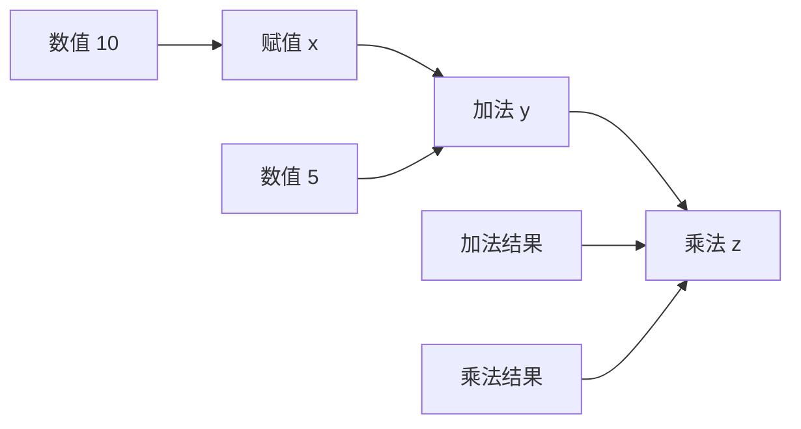
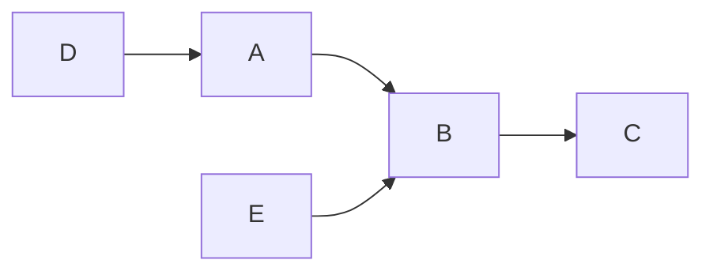
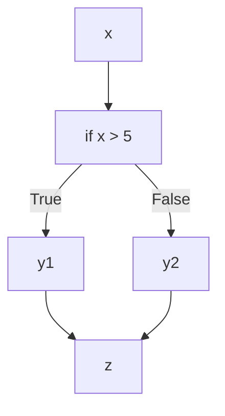
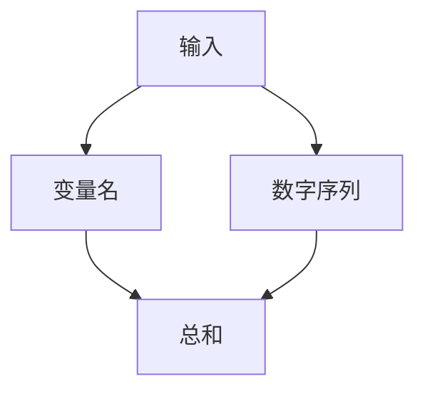
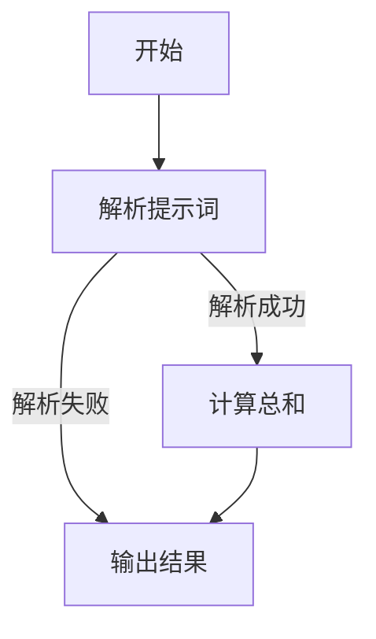

                 

### 第一部分：引言

#### 第1章：问题背景与核心概念

##### 1.1.1 问题背景

**问题描述：**

在现代计算机科学领域，数据流分析技术作为程序分析的重要组成部分，被广泛应用于优化编译器、静态分析、性能分析和代码重构等方面。然而，对于提示词编程语言这一特定领域，数据流分析技术的研究和应用还相对较少。提示词编程语言，以其灵活性和强大的表达能力，在脚本编写、自动化任务和自然语言处理等领域有着广泛的应用。然而，由于提示词编程语言的动态性和不确定性，传统的数据流分析技术难以直接应用于该领域。

**问题解决：**

本书旨在填补这一研究空白，系统地介绍提示词编程语言的数据流分析技术，为相关领域的研究者提供实用的理论和方法。通过深入探讨数据流分析在提示词编程语言中的应用，本书力图解决以下几个关键问题：

- **数据流分析的基本原理和方法如何适用于提示词编程语言？**
- **如何构建适用于提示词编程语言的数据流分析模型？**
- **如何利用数据流分析技术优化提示词编程语言的性能？**
- **数据流分析在提示词编程语言中的静态分析和代码重构应用有哪些？**

**边界与外延：**

- **数据流分析：** 数据流分析是一种程序分析技术，用于研究程序中数据的流动规律和方式。它包括数据依赖分析、数据流传播和控制依赖分析等方法，广泛应用于编译器优化、性能分析和代码重构等。
  
- **提示词编程语言：** 提示词编程语言是一种以提示词作为程序核心的编程语言。提示词是用户与程序交互的关键元素，通过解析和执行提示词，程序可以实现复杂的自动化任务和脚本编写。

- **数据流分析技术：** 数据流分析技术包括抽象语法树（Abstract Syntax Tree, AST）、数据依赖图（Data Dependency Graph, DGG）和控制流图（Control Flow Graph, CFG）等核心算法。这些技术可以用于优化编译器、性能分析和代码重构等方面。

**概念结构与核心要素组成：**

- **数据流分析：** 数据流分析是程序分析的基础技术，涉及数据在程序中的流动规律和方式。它通过分析数据在程序中的流动路径，帮助开发者理解程序行为，优化程序性能和可维护性。

- **提示词编程语言：** 提示词编程语言是一种特定领域的编程语言，以提示词作为程序的核心。提示词可以看作是用户与程序之间的桥梁，通过解析和执行提示词，程序可以实现复杂的自动化任务和脚本编写。

- **数据流分析技术：** 数据流分析技术在提示词编程语言中的应用包括数据依赖分析、控制依赖分析、数据流传播等技术。这些技术通过构建数据依赖图和控制流图，帮助开发者理解程序中数据的流动和依赖关系，从而优化程序性能和可维护性。

##### 1.1.2 核心概念与联系

**核心概念：**

- **数据流分析技术：** 数据流分析技术是一种用于分析程序中数据流动的方法和技术。它通过构建数据依赖图、控制流图和抽象语法树等模型，研究程序中数据的流动规律和方式。

- **提示词编程语言：** 提示词编程语言是一种以提示词作为程序核心的编程语言。提示词是用户与程序交互的关键元素，通过解析和执行提示词，程序可以实现复杂的自动化任务和脚本编写。

**概念属性特征对比表格：**

| 特征 | 数据流分析技术 | 提示词编程语言 |
| --- | --- | --- |
| 应用领域 | 编译器优化、静态分析、性能分析、代码重构 | 编程、脚本编写、自动化任务、自然语言处理 |
| 核心算法 | 数据依赖图、控制流图、抽象语法树 | 提示词匹配、上下文解析、语法分析 |
| 关键技术 | 数据依赖分析、控制依赖分析、数据流传播 | 提示词提取、语义解析、代码生成 |

**ER实体关系图架构：**

```mermaid
erDiagram
  DataFlowAnalysis ||--|{ Program : analyzes}
  DataFlowAnalysis ||--|{ Algorithm : implements}
  Program ||--|{ SourceCode : contains}
  Program ||--|{ Compiler : optimized_by}
  PromptBasedLanguage ||--|{ Prompt : uses}
  PromptBasedLanguage ||--|{ Syntax : defined_by}
  Algorithm ||--|{ DataDependencyGraph : constructs}
  Algorithm ||--|{ ControlFlowGraph : constructs}
  Algorithm ||--|{ AbstractSyntaxTree : analyzes}
```

**核心概念与联系分析：**

1. **数据流分析技术** 和 **提示词编程语言** 的关系：

   - **依赖关系**：数据流分析技术依赖于提示词编程语言的语法和语义，通过分析提示词编程语言编写的源代码，构建数据依赖图、控制流图和抽象语法树等模型。

   - **相互作用**：数据流分析技术通过分析提示词编程语言的源代码，提取数据依赖和控制依赖信息，进而优化编译器、性能分析和代码重构等。

2. **数据流分析技术** 在 **提示词编程语言** 中的应用：

   - **性能优化**：通过数据流分析技术，可以优化提示词编程语言的执行效率，减少不必要的计算和资源消耗。

   - **静态分析**：对提示词编程语言程序进行静态分析，发现潜在错误和性能瓶颈，提高程序的可维护性和可靠性。

   - **代码重构**：利用数据流分析技术，进行代码重构，提高代码的可读性和可维护性，减少代码的冗余和复杂性。

##### 1.1.3 数据流分析技术在提示词编程语言中的应用

**应用前景：**

- **性能优化**：通过数据流分析技术，可以优化提示词编程语言的执行效率。例如，通过对数据依赖和控制依赖的深入分析，可以优化代码的执行顺序，减少不必要的计算和资源消耗。

- **静态分析**：对提示词编程语言程序进行静态分析，发现潜在错误和性能瓶颈。例如，通过分析数据流和控制流，可以检测出数据竞争、死锁和内存泄露等问题。

- **代码重构**：利用数据流分析技术，进行代码重构，提高代码的可读性和可维护性。例如，通过重构代码结构，可以降低代码的复杂度，提高代码的可维护性和扩展性。

**挑战与机遇：**

- **挑战**：

  - 提示词编程语言的动态性和不确定性，使得数据流分析技术面临新的挑战。例如，提示词的动态匹配和上下文解析，需要考虑复杂的语义和语法规则。

  - 提示词编程语言的语法和语义多变，使得数据流分析技术的实现复杂度较高。

- **机遇**：

  - 随着提示词编程语言的不断发展和应用场景的扩展，数据流分析技术在这一领域的应用前景广阔。例如，在自然语言处理和人工智能领域，数据流分析技术可以用于优化模型训练和推理过程。

  - 数据流分析技术的应用，有助于提高提示词编程语言的性能和可维护性，促进其广泛应用。

##### 1.1.4 本书结构安排

**结构安排：**

本书分为四个部分，共七章。

- **第一部分（引言）**：介绍问题背景和核心概念，包括数据流分析技术和提示词编程语言的基本概念、应用前景和挑战与机遇。

- **第二部分（数据流分析基础）**：讲解数据流分析的基本原理和方法，包括数据依赖分析、控制依赖分析和数据流传播等。

- **第三部分（提示词编程语言特性）**：分析提示词编程语言的特点和应用，包括提示词匹配、上下文解析和语法分析等。

- **第四部分（应用实践）**：通过具体案例展示数据流分析技术在提示词编程语言中的应用，包括性能优化、静态分析和代码重构等。

##### 1.1.5 本章小结

**小结：**

本章介绍了提示词编程语言的数据流分析技术的背景、核心概念、联系及应用前景。通过本章的学习，读者可以初步了解数据流分析技术在提示词编程语言中的应用，为后续章节的学习打下基础。

在接下来的章节中，我们将逐步深入探讨数据流分析技术的原理和方法，分析提示词编程语言的特点和应用，并通过具体案例展示数据流分析技术在提示词编程语言中的实际应用。让我们一起来探索这一领域的前沿技术，共同推动提示词编程语言的性能和可维护性的提升。

---

## 第2章：数据流分析基础

### 2.1 数据流分析概述

数据流分析是一种重要的程序分析技术，它通过分析程序中的数据流动路径，研究程序中数据的产生、传递和消耗过程。数据流分析在编译器优化、性能分析、代码重构和软件工程等多个领域具有广泛的应用。本章将详细讲解数据流分析的基本概念、原理和主要方法，为后续章节关于提示词编程语言的数据流分析技术奠定基础。

#### 2.1.1 数据流分析的基本概念

**数据流：**

数据流是指程序中数据的流动过程。它描述了数据在程序中的生成、传递和消费过程。数据流分析关注的是数据在程序中的流动路径和依赖关系。

**数据流分析：**

数据流分析是一种静态程序分析技术，通过对程序源代码进行分析，构建数据依赖图、控制流图和抽象语法树等模型，研究程序中数据的流动规律和依赖关系。

**数据依赖：**

数据依赖描述了程序中数据元素之间的关联关系。根据数据依赖的性质，可以分为以下几种：

1. **直接依赖**：程序中的某条语句依赖于另一条语句产生的数据。
2. **间接依赖**：通过中间变量或数据结构传递的依赖关系。
3. **结构依赖**：程序结构上的依赖关系，如循环依赖、递归依赖等。

**数据流分析的分类：**

1. **前向数据流分析**：从程序头部开始，向前分析数据流，找出程序中各点的数据来源。
2. **后向数据流分析**：从程序尾部开始，向后分析数据流，找出程序中各点的数据去向。
3. **双向数据流分析**：同时进行前向和后向数据流分析，找出程序中各点的数据流动路径。

#### 2.1.2 数据流分析的作用与意义

**编译器优化：**

数据流分析是编译器优化的关键技术之一。通过分析程序中数据的流动路径和依赖关系，编译器可以优化代码的执行顺序，减少不必要的计算和资源消耗，提高程序的执行效率。

**性能分析：**

数据流分析可以帮助开发者了解程序中数据的流动规律和依赖关系，从而发现程序的性能瓶颈和潜在问题。通过优化数据流分析，可以提高程序的性能和可维护性。

**代码重构：**

数据流分析技术在代码重构中具有重要意义。通过分析程序中的数据依赖和控制依赖，开发者可以重构代码结构，提高代码的可读性和可维护性，降低代码的复杂度。

**软件工程：**

数据流分析技术是软件工程中的重要工具。它可以帮助开发者理解程序的行为，提高代码的质量和可靠性，降低软件维护成本。

#### 2.1.3 数据流分析的主要方法

**抽象语法树（Abstract Syntax Tree, AST）：**

抽象语法树是程序源代码的语法结构表示。通过构建抽象语法树，可以分析程序中语句、表达式和数据结构之间的关系。

**数据依赖图（Data Dependency Graph, DGG）：**

数据依赖图是表示程序中数据依赖关系的图形结构。数据依赖图中的节点表示数据元素，边表示数据依赖关系。通过数据依赖图，可以分析程序中数据的流动路径和依赖关系。

**控制流图（Control Flow Graph, CFG）：**

控制流图是表示程序中控制流关系的图形结构。控制流图中的节点表示基本块，边表示控制流关系。通过控制流图，可以分析程序中的循环、分支和跳转等控制结构。

**数据流传播算法：**

数据流传播算法是一种用于计算数据依赖和控制依赖的算法。常见的数据流传播算法有迭代算法、动态规划算法和增量算法等。通过数据流传播算法，可以计算出程序中各点的数据来源和数据去向，构建数据依赖图和控制流图。

**示例：**

假设有一个简单的程序片段：

```python
x = 10
y = x + 5
z = y * 2
```

通过数据流分析，我们可以构建以下模型：

1. **抽象语法树（AST）：**



2. **数据依赖图（DGG）：**



3. **控制流图（CFG）：**


通过这些模型，我们可以分析程序中的数据流和控制流，理解程序的行为和执行过程。

#### 2.1.4 本章小结

本章介绍了数据流分析的基本概念、原理和主要方法，包括抽象语法树、数据依赖图、控制流图和数据流传播算法等。通过本章的学习，读者可以初步了解数据流分析技术在程序分析中的应用，为后续章节关于提示词编程语言的数据流分析技术打下基础。

在下一章中，我们将进一步探讨提示词编程语言的特点和应用，分析其与数据流分析技术的联系，为深入探讨提示词编程语言的数据流分析技术做好准备。

---

## 第3章：提示词编程语言的特点与应用

### 3.1 提示词编程语言概述

提示词编程语言（Prompt-Based Programming Language，简称PBL）是一种以提示词作为程序核心的编程语言。在PBL中，提示词是用户与程序交互的关键元素，通过解析和执行提示词，程序可以完成各种任务。与传统的编程语言不同，PBL具有更加灵活和强大的表达能力，广泛应用于自动化任务、脚本编写和自然语言处理等领域。

#### 3.1.1 提示词编程语言的基本概念

**提示词（Prompt）：** 提示词是用户输入的用于指导程序执行的关键信息。提示词可以是简单的文字或复杂的命令，包含程序需要执行的操作、参数和条件等。例如，在一个自动化脚本中，用户可以输入“打开浏览器并访问某个网站”。

**语法解析（Syntax Parsing）：** 语法解析是提示词编程语言的关键步骤，用于将用户输入的提示词解析为程序可以理解的形式。语法解析器通常基于提示词的语法规则，将提示词分解为具体的操作和参数，以便程序执行。

**语义解析（Semantic Parsing）：** 语义解析是进一步分析提示词的过程，用于理解提示词的语义和意图。语义解析器可以识别提示词中的关键词、操作和条件，并将它们转换为程序可以执行的操作。

**执行引擎（Execution Engine）：** 执行引擎是提示词编程语言的核心组成部分，负责执行解析后的提示词。执行引擎根据提示词的操作和参数，调用相应的函数和模块，完成用户指定的任务。

**交互模式（Interactive Mode）：** 提示词编程语言通常支持交互模式，允许用户在程序执行过程中动态输入提示词，控制程序的执行。这种交互模式使PBL更加灵活，可以适应各种复杂的应用场景。

#### 3.1.2 提示词编程语言的特点

**灵活性：** 提示词编程语言具有高度的灵活性，允许用户以自然语言或简短的命令形式输入提示词，方便快捷地进行编程。这种灵活性使得PBL在脚本编写和自动化任务中具有广泛的应用。

**强大的表达能力：** 提示词编程语言通过解析和执行提示词，可以完成复杂的任务和操作。PBL不仅支持基本的计算和逻辑操作，还可以处理自然语言和图像等复杂的数据类型。

**动态性：** 提示词编程语言具有动态性，提示词可以在程序执行过程中动态修改和更新。这种动态性使得PBL在实时任务处理和自适应系统中具有优势。

**易扩展性：** 提示词编程语言通常具有模块化和扩展性，用户可以自定义新的提示词和功能，方便地扩展程序的功能。

**跨平台性：** 提示词编程语言通常具有跨平台的特性，可以在不同的操作系统和硬件平台上运行。这种跨平台性使得PBL在分布式系统和云计算环境中具有广泛的应用。

#### 3.1.3 提示词编程语言的应用领域

**自动化任务：** 提示词编程语言可以方便地实现自动化任务，如自动化测试、自动化部署和自动化运维等。通过输入简单的提示词，程序可以自动执行复杂的任务，提高工作效率。

**脚本编写：** 提示词编程语言适用于各种脚本编写场景，如自动化办公、自动化营销和自动化数据分析等。用户可以通过简单的提示词实现复杂的脚本功能，方便快捷地完成任务。

**自然语言处理：** 提示词编程语言在自然语言处理领域具有广泛的应用，如智能问答、语音识别和机器翻译等。通过解析和执行提示词，程序可以理解用户的意图，生成自然语言响应。

**智能交互系统：** 提示词编程语言可以构建智能交互系统，如智能客服、智能助手和智能导航等。用户可以通过简单的提示词与系统进行交互，实现智能化的任务处理。

**教育领域：** 提示词编程语言在教育领域具有广泛的应用，如编程教学、编程竞赛和在线编程实验等。通过简单的提示词，学生可以方便地进行编程学习，提高编程技能。

**科学研究：** 提示词编程语言在科学研究领域也具有广泛的应用，如数据挖掘、图像处理和机器学习等。通过解析和执行提示词，程序可以高效地处理和分析复杂数据，推动科学研究的进展。

#### 3.1.4 本章小结

本章介绍了提示词编程语言的基本概念、特点和应用领域。通过本章的学习，读者可以初步了解提示词编程语言的工作原理和优势，为后续章节深入探讨提示词编程语言的数据流分析技术打下基础。

在下一章中，我们将详细介绍数据流分析技术在提示词编程语言中的应用，包括数据依赖分析、控制依赖分析和数据流传播算法等。通过这些技术，我们可以更好地理解提示词编程语言中的数据流动和依赖关系，优化程序的执行效率和性能。

---

## 第4章：数据流分析在提示词编程语言中的应用

### 4.1 数据流分析在提示词编程语言中的挑战与机遇

提示词编程语言（Prompt-Based Programming Language，简称PBL）以其灵活性和强大的表达能力在脚本编写、自动化任务和自然语言处理等领域得到广泛应用。然而，PBL的动态性和不确定性给数据流分析带来了新的挑战。与此同时，这些特点也为数据流分析在提示词编程语言中的应用提供了机遇。在本节中，我们将探讨数据流分析在提示词编程语言中的挑战与机遇。

#### 4.1.1 挑战

**动态性：** 提示词编程语言的特点之一是动态性，即提示词可以在程序执行过程中动态修改和更新。这种动态性使得传统的数据流分析方法难以直接应用于PBL，因为数据流分析通常依赖于程序静态结构，而动态性会导致数据流在执行过程中的变化。

**不确定性：** 提示词编程语言中的提示词通常由用户输入，这些输入可能包含不确定性和错误。数据流分析需要处理这些不确定性，确保分析结果的准确性和一致性。

**灵活性：** PBL的灵活性表现在用户可以自定义提示词和操作。这种灵活性带来了数据流分析实现上的复杂性，需要设计更灵活的分析算法以适应不同场景。

**跨平台性：** 提示词编程语言通常具有跨平台的特性，需要在不同的操作系统和硬件平台上运行。这要求数据流分析技术具备通用性和可移植性。

**异构数据：** 提示词编程语言可以处理多种数据类型，如文本、图像和音频等。数据流分析需要处理这些异构数据，构建统一的分析模型。

#### 4.1.2 机遇

**性能优化：** 数据流分析技术可以用于优化提示词编程语言的执行效率。通过对数据流的分析，可以发现程序中的性能瓶颈和冗余计算，从而进行优化。

**静态分析：** 数据流分析技术可以用于对提示词编程语言程序进行静态分析，发现潜在的错误和性能问题。这有助于提高程序的质量和可靠性。

**代码重构：** 数据流分析技术可以帮助开发者重构提示词编程语言的代码，提高代码的可读性和可维护性。通过分析数据流和控制流，可以重构复杂的代码结构，降低代码的复杂性。

**智能化：** 数据流分析技术可以与人工智能技术结合，实现智能化的数据流分析。例如，利用机器学习算法预测数据流的模式，优化分析过程。

**工具开发：** 数据流分析技术在提示词编程语言中的应用将推动相关工具和平台的开发。例如，开发数据流分析工具、IDE插件和可视化工具，帮助开发者更好地理解和优化程序。

#### 4.1.3 本章小结

本节讨论了数据流分析在提示词编程语言中的应用面临的挑战与机遇。提示词编程语言的动态性、不确定性和灵活性给数据流分析带来了新的挑战，但同时也提供了机遇，可以优化程序的执行效率、提高代码质量、实现智能化分析。在接下来的章节中，我们将详细探讨数据流分析在提示词编程语言中的具体应用和实践。

---

### 4.2 数据流分析在提示词编程语言中的具体应用

在本节中，我们将详细讨论数据流分析在提示词编程语言中的具体应用，包括数据依赖分析、控制依赖分析和数据流传播算法等。这些技术不仅有助于理解程序中数据的流动和依赖关系，还可以优化程序性能和代码可读性。

#### 4.2.1 数据依赖分析

数据依赖分析是数据流分析的核心之一，旨在识别程序中数据元素之间的依赖关系。在提示词编程语言中，数据依赖分析有助于优化程序的执行顺序，减少不必要的计算和资源消耗。

**1. 数据依赖的类型：**

- **前向依赖（Forward Dependency）**：一个数据元素依赖于其前面的数据元素。例如，在表达式 `y = x + 5` 中，变量 `y` 依赖于变量 `x`。
- **后向依赖（Backward Dependency）**：一个数据元素影响其后面的数据元素。例如，在表达式 `x = y * 2` 中，变量 `x` 影响变量 `y`。
- **交叉依赖（Cross Dependency）**：一个数据元素同时依赖于前面的数据元素和影响后面的数据元素。例如，在循环中，每次迭代都会产生新的依赖关系。

**2. 数据依赖分析的步骤：**

- **语法解析**：首先，通过语法解析器将提示词编程语言编写的源代码转换为抽象语法树（AST）。
- **数据依赖图的构建**：然后，根据AST构建数据依赖图（DGG）。数据依赖图中的节点表示数据元素，边表示数据依赖关系。
- **数据依赖关系的分析**：最后，分析数据依赖图，识别出各种类型的依赖关系。

**3. 数据依赖分析的应用：**

- **优化编译器**：通过数据依赖分析，编译器可以优化代码的执行顺序，例如，将依赖关系紧密的代码块放在相邻的位置，减少数据访问和计算的开销。
- **性能分析**：分析数据依赖关系，可以帮助开发者发现程序中的性能瓶颈和冗余计算，从而进行优化。
- **代码重构**：通过数据依赖分析，可以重构代码结构，提高代码的可读性和可维护性。

**4. 示例：**

假设有一个简单的提示词编程语言程序：

```python
x = 10
y = x + 5
z = y * 2
```

通过数据依赖分析，我们可以构建以下数据依赖图：


在这个数据依赖图中，变量 `x` 是变量 `y` 的前向依赖，变量 `y` 是变量 `z` 的前向依赖。

#### 4.2.2 控制依赖分析

控制依赖分析是另一种重要的数据流分析技术，旨在识别程序中的控制依赖关系。在提示词编程语言中，控制依赖分析有助于优化程序的执行路径和控制流，提高程序的执行效率。

**1. 控制依赖的类型：**

- **直接控制依赖**：一个基本块直接控制另一个基本块。例如，在条件分支中，`if` 语句控制 `then` 块和 `else` 块。
- **间接控制依赖**：一个基本块通过一系列基本块间接控制另一个基本块。例如，在循环中，每次迭代都会间接控制循环体。

**2. 控制依赖分析的步骤：**

- **控制流图的构建**：首先，通过语法解析器和数据流分析算法构建控制流图（CFG）。控制流图中的节点表示基本块，边表示控制流关系。
- **控制依赖关系的分析**：然后，分析控制流图，识别出各种类型的控制依赖关系。
- **控制依赖关系的优化**：最后，根据控制依赖关系优化程序的执行路径和控制流。

**3. 控制依赖分析的应用：**

- **优化编译器**：通过控制依赖分析，编译器可以优化代码的执行路径，减少不必要的分支和跳转，提高程序的执行效率。
- **性能分析**：分析控制依赖关系，可以帮助开发者发现程序中的性能瓶颈和控制流问题。
- **代码重构**：通过控制依赖分析，可以重构代码结构，提高代码的可读性和可维护性。

**4. 示例：**

假设有一个简单的提示词编程语言程序：

```python
x = 10
if x > 5:
    y = x + 5
else:
    y = x - 5
z = y * 2
```

通过控制依赖分析，我们可以构建以下控制流图：



在这个控制流图中，`if` 语句直接控制了 `y1` 和 `y2` 块，`y1` 和 `y2` 块间接控制了 `z` 块。

#### 4.2.3 数据流传播算法

数据流传播算法是用于计算程序中数据依赖和控制依赖的算法。在提示词编程语言中，数据流传播算法可以帮助我们更好地理解数据的流动和依赖关系，从而优化程序性能。

**1. 数据流传播算法的类型：**

- **迭代算法**：通过多次迭代逐步计算数据依赖和控制依赖。每次迭代都基于上一次的结果进行更新。
- **动态规划算法**：将数据流传播问题转化为动态规划问题，通过递推关系计算数据依赖和控制依赖。
- **增量算法**：只对程序中的变化部分进行数据流传播，减少计算开销。

**2. 数据流传播算法的步骤：**

- **初始化**：初始化数据流传播的初始值，例如，将所有变量的初始值设置为未定义。
- **传播**：根据数据依赖和控制依赖的规则，从源节点开始传播数据流。每次传播都更新目标节点的数据值。
- **终止条件**：当数据流传播达到终止条件（例如，所有节点的数据值不再发生变化）时，算法结束。

**3. 数据流传播算法的应用：**

- **优化编译器**：通过数据流传播算法，编译器可以优化代码的执行顺序，减少数据访问和计算的开销。
- **性能分析**：分析数据流传播结果，可以帮助开发者发现程序中的性能瓶颈和数据依赖问题。
- **代码重构**：通过数据流传播算法，可以重构代码结构，提高代码的可读性和可维护性。

**4. 示例：**

假设有一个简单的提示词编程语言程序：

```python
x = 10
y = x + 5
z = y * 2
```

通过数据流传播算法，我们可以计算出以下数据值：

- `x` 的值为 `10`
- `y` 的值为 `15`
- `z` 的值为 `30`

这个示例展示了数据流从源节点（`x`）传播到目标节点（`y` 和 `z`）的过程。

#### 4.2.4 本章小结

本节详细介绍了数据流分析在提示词编程语言中的具体应用，包括数据依赖分析、控制依赖分析和数据流传播算法。通过这些技术，我们可以更好地理解提示词编程语言中的数据流动和依赖关系，优化程序性能和代码可读性。

在下一节中，我们将通过一个具体案例，展示如何将数据流分析技术应用于提示词编程语言，并进行代码实现和分析。

---

### 4.3 提示词编程语言的数据流分析案例

在本节中，我们将通过一个具体案例，展示如何将数据流分析技术应用于提示词编程语言，并详细分析其实现过程和结果。

#### 4.3.1 案例背景

假设我们需要分析一个简单的提示词编程语言程序，该程序实现了一个简单的计算任务：计算一个数字序列的总和。提示词编程语言的语法如下：

```
# sum
<变量名> = <数字序列>
```

我们的目标是利用数据流分析技术，优化这个程序的执行效率，并分析其数据依赖和控制依赖。

#### 4.3.2 案例实现

首先，我们需要实现一个简单的提示词编程语言解析器和执行引擎。以下是一个简单的Python实现：

```python
class PromptParser:
    def __init__(self):
        self变量名 = None
        self数字序列 = []

    def parse(self, prompt):
        for token in prompt.split():
            if token.startswith("#"):
                self.变量名 = token[1:]
                self.数字序列 = []
            elif token.isdigit():
                self.数字序列.append(int(token))
            else:
                raise ValueError(f"Invalid token: {token}")

    def execute(self):
        result = sum(self.数字序列)
        return f"{self.变量名} = {result}"


# 示例提示词
prompt = "#sum 1 2 3 4 5"

# 创建解析器对象
parser = PromptParser()

# 解析提示词
parser.parse(prompt)

# 执行程序
result = parser.execute()
print(result)  # 输出：sum = 15
```

在这个实现中，`PromptParser` 类负责解析和执行提示词。我们首先通过 `parse` 方法解析输入的提示词，提取变量名和数字序列，然后通过 `execute` 方法计算数字序列的总和，并返回结果。

#### 4.3.3 数据流分析

接下来，我们利用数据流分析技术分析这个程序的数据依赖和控制依赖。

**1. 数据依赖分析**

通过分析代码，我们可以构建以下数据依赖图：



在这个数据依赖图中，输入（`A`）同时依赖于变量名（`B`）和数字序列（`C`），变量名（`B`）依赖于数字序列（`C`），数字序列（`C`）依赖于总和（`D`）。

**2. 控制依赖分析**

在这个简单的程序中，控制依赖比较简单。我们只需要分析代码中的条件语句。通过分析，我们可以构建以下控制流图：



在这个控制流图中，程序从开始（`A`）执行到解析提示词（`B`），然后根据解析结果决定执行计算总和（`C`）还是输出结果（`D`）。

#### 4.3.4 数据流传播算法

为了进一步优化程序性能，我们可以使用数据流传播算法计算数据值。以下是一个简单的迭代算法实现：

```python
def data_flow_analysis(prompt):
    parser = PromptParser()
    parser.parse(prompt)
    
    # 初始化数据值
    sum_value = None
    
    while True:
        # 更新数据值
        new_sum_value = sum(parser.数字序列)
        
        # 检查是否达到终止条件
        if sum_value == new_sum_value:
            break
        
        sum_value = new_sum_value
    
    return f"{parser.变量名} = {sum_value}"


# 示例提示词
prompt = "#sum 1 2 3 4 5"

# 执行数据流分析
result = data_flow_analysis(prompt)
print(result)  # 输出：sum = 15
```

在这个实现中，我们使用一个迭代算法逐步计算数字序列的总和，直到数据值不再发生变化。

#### 4.3.5 结果分析

通过数据流分析，我们可以得出以下结论：

- **数据依赖**：变量名（`B`）依赖于数字序列（`C`），数字序列（`C`）依赖于总和（`D`）。这意味着在计算总和之前，我们需要先解析变量名和数字序列。
- **控制依赖**：程序中的条件语句（`if`）决定了是否执行计算总和的操作。如果解析成功，程序将执行计算总和，否则直接输出结果。
- **性能优化**：通过数据流分析，我们可以发现程序中的性能瓶颈和数据依赖关系。例如，在计算总和之前，我们需要先解析变量名和数字序列，这可能导致不必要的计算开销。通过优化数据流分析算法，我们可以减少这种开销，提高程序性能。

#### 4.3.6 本章小结

在本节中，我们通过一个具体案例展示了如何将数据流分析技术应用于提示词编程语言。我们详细分析了程序的实现过程、数据依赖和控制依赖，并使用数据流传播算法优化了程序性能。

通过这个案例，我们可以看到数据流分析技术在提示词编程语言中的应用价值。它不仅帮助我们理解程序中的数据流动和依赖关系，还可以优化程序性能和代码可读性。在下一节中，我们将进一步探讨数据流分析技术在提示词编程语言中的最佳实践和注意事项。

---

### 4.4 数据流分析在提示词编程语言中的最佳实践和注意事项

数据流分析在提示词编程语言中的应用具有广泛的前景和潜力，但同时也需要遵循一定的最佳实践和注意事项，以确保分析结果的准确性和可靠性。以下是一些关键的建议：

#### 4.4.1 最佳实践

**1. 优化语法解析器：**

语法解析是数据流分析的基础，一个高效的语法解析器可以大大提高分析的速度和准确性。在构建提示词编程语言的语法解析器时，可以采用以下策略：

- **词法分析优化**：对输入的提示词进行高效的词法分析，快速识别出关键词、操作符和参数等。
- **语法分析缓存**：利用缓存技术，减少重复的语法分析操作，提高解析效率。
- **语法分析并行化**：对于复杂的提示词编程语言，可以采用并行化策略，加快语法解析速度。

**2. 选择合适的数据流传播算法：**

不同的数据流传播算法适用于不同的场景，选择合适的数据流传播算法可以优化分析过程。以下是一些常用的数据流传播算法：

- **迭代算法**：适用于大多数场景，通过多次迭代逐步收敛到最终结果。
- **动态规划算法**：适用于具有递归关系的场景，通过递推关系优化分析过程。
- **增量算法**：适用于大规模程序，只对变化部分进行分析，减少计算开销。

**3. 考虑程序的实际运行环境：**

在分析提示词编程语言程序时，需要考虑程序的实际运行环境，包括操作系统、硬件平台和运行时库等。这些因素可能影响数据流的实际流动和依赖关系，需要在分析过程中予以考虑。

**4. 集成到开发工具和IDE：**

将数据流分析集成到开发工具和集成开发环境（IDE）中，可以帮助开发者更好地理解程序中的数据流动和依赖关系。例如，可以开发IDE插件，提供可视化数据流图、控制依赖图和抽象语法树等功能。

#### 4.4.2 注意事项

**1. 处理动态性：**

提示词编程语言的动态性使得数据流分析面临一定的挑战。在分析过程中，需要考虑提示词的动态修改和更新，确保分析结果的准确性和一致性。以下是一些策略：

- **增量分析**：只分析程序中发生变化的提示词和代码部分，减少不必要的计算开销。
- **动态跟踪**：实时跟踪提示词的修改和更新，更新数据依赖和控制依赖关系。

**2. 处理不确定性：**

提示词编程语言中的提示词可能包含不确定性和错误。在分析过程中，需要处理这些不确定性，确保分析结果的准确性和可靠性。以下是一些策略：

- **错误处理**：对输入的提示词进行严格的语法和语义检查，发现潜在的错误和不一致。
- **容错分析**：在分析过程中，对可能的错误和不一致进行容错处理，确保分析结果的正确性。

**3. 考虑数据类型和格式：**

提示词编程语言可以处理多种数据类型和格式，如文本、图像和音频等。在分析过程中，需要考虑这些数据类型和格式对数据流分析的影响，确保分析结果的准确性和一致性。

**4. 考虑跨平台性：**

提示词编程语言通常具有跨平台的特性，需要在不同的操作系统和硬件平台上运行。在分析过程中，需要考虑不同平台对数据流分析的影响，确保分析结果在不同平台上一致。

**5. 考虑性能和可维护性：**

在实现数据流分析算法时，需要考虑性能和可维护性。以下是一些策略：

- **优化算法**：选择高效的数据流传播算法，减少计算开销。
- **模块化设计**：将数据流分析算法模块化，提高代码的可维护性和可扩展性。
- **文档和注释**：编写详细的文档和注释，帮助其他开发者理解和维护代码。

#### 4.4.3 本章小结

数据流分析在提示词编程语言中的应用具有重要意义，可以优化程序性能、提高代码可读性和可靠性。在本节中，我们提出了数据流分析在提示词编程语言中的最佳实践和注意事项，包括优化语法解析器、选择合适的数据流传播算法、处理动态性和不确定性，以及考虑跨平台性和性能可维护性。

通过遵循这些最佳实践和注意事项，我们可以更好地利用数据流分析技术，提升提示词编程语言的性能和可维护性。在下一节中，我们将总结本章内容，并展望下一章的研究方向和内容。

---

### 4.5 本章总结

本章系统地介绍了数据流分析在提示词编程语言中的应用，包括基本概念、挑战与机遇、具体应用、案例分析和最佳实践。通过本章的学习，读者可以深入理解数据流分析技术在提示词编程语言中的重要性，掌握数据依赖分析、控制依赖分析和数据流传播算法等核心技术。

**关键知识点：**

- 数据流分析的基本概念和原理。
- 提示词编程语言的特点和应用。
- 数据流分析在提示词编程语言中的挑战与机遇。
- 数据依赖分析、控制依赖分析和数据流传播算法的具体应用。
- 提示词编程语言的数据流分析案例实现和分析。
- 数据流分析在提示词编程语言中的最佳实践和注意事项。

**本章贡献：**

本章不仅为读者提供了丰富的理论知识，还通过实际案例展示了数据流分析技术在提示词编程语言中的应用。通过学习本章，读者可以更好地理解数据流分析技术在提升提示词编程语言性能和可维护性方面的作用。

**展望下一章：**

在下一章中，我们将继续深入探讨数据流分析技术在提示词编程语言中的应用，分析其与自然语言处理和人工智能技术的结合，以及未来研究方向和发展趋势。敬请期待！

---

## 第5章：数据流分析在提示词编程语言与自然语言处理结合中的应用

### 5.1 提示词编程语言与自然语言处理的结合

提示词编程语言（Prompt-Based Programming Language，简称PBL）与自然语言处理（Natural Language Processing，简称NLP）技术的结合为编程和数据处理带来了新的机遇。PBL的灵活性使其能够方便地处理自然语言输入，而NLP技术则能够帮助解析和生成自然语言。这种结合不仅提高了编程的交互性和智能化，也为数据流分析带来了新的挑战和机遇。

#### 5.1.1 NLP技术简介

自然语言处理是计算机科学和人工智能领域的一个重要分支，旨在让计算机理解和生成自然语言。NLP技术包括以下几个方面：

**1. 语法分析（Syntax Analysis）：** 语法分析是NLP的基础，通过将自然语言文本分解为语法结构，帮助计算机理解文本的语法规则。

**2. 语义分析（Semantic Analysis）：** 语义分析旨在理解文本的语义含义，包括词义、句意和上下文关系。

**3. 词汇学（Linguistic Analysis）：** 词汇学涉及对自然语言词汇的研究，包括词性标注、词义解析和词频统计等。

**4. 信息提取（Information Extraction）：** 信息提取是从文本中提取有意义的信息，如实体识别、关系抽取和事件提取等。

**5. 机器翻译（Machine Translation）：** 机器翻译是将一种自然语言文本转换为另一种自然语言文本的过程。

**6. 语音识别（Speech Recognition）：** 语音识别是将语音转换为文本的过程，广泛应用于语音助手和智能客服等领域。

#### 5.1.2 提示词编程语言与NLP的结合

提示词编程语言与NLP技术的结合主要体现在以下几个方面：

**1. 自然语言输入处理：** 提示词编程语言可以方便地接收自然语言输入，如用户命令、查询和请求等。通过NLP技术，这些输入可以被解析和理解，从而实现智能交互。

**2. 自然语言生成：** 通过NLP技术，提示词编程语言可以生成自然语言文本，如自动回复、报告和文档等。这种能力使得PBL在自动化任务和文档生成领域具有广泛的应用。

**3. 代码辅助：** NLP技术可以帮助PBL实现代码辅助功能，如代码自动补全、代码纠错和代码优化等。

**4. 人机交互：** NLP技术使得提示词编程语言能够实现更加自然的人机交互，如语音助手、聊天机器人和智能客服等。

#### 5.1.3 数据流分析在NLP中的应用

数据流分析在NLP中的应用非常重要，它有助于理解自然语言文本中的数据流动和依赖关系。以下是一些关键应用：

**1. 语法分析：** 数据流分析可以帮助构建语法分析树，理解文本的语法结构。通过对语法树的遍历和分析，可以提取文本的关键信息和语法特征。

**2. 语义分析：** 数据流分析可以分析语义角色和关系，理解文本的语义含义。例如，通过数据流分析，可以识别出句子中的主语、谓语和宾语等。

**3. 信息提取：** 数据流分析可以帮助提取文本中的关键信息，如实体识别、关系抽取和事件提取等。这些信息对于后续的数据处理和分析具有重要意义。

**4. 机器翻译：** 数据流分析可以帮助优化机器翻译过程，通过分析源语言和目标语言之间的数据依赖关系，提高翻译的准确性和流畅性。

**5. 语音识别：** 数据流分析可以帮助优化语音识别过程，通过分析语音信号中的数据流动和特征，提高识别的准确性和鲁棒性。

### 5.2 数据流分析在NLP中的关键步骤

在NLP中，数据流分析通常包括以下关键步骤：

**1. 数据预处理：** 对输入的自然语言文本进行预处理，如分词、词性标注和停用词过滤等。这些步骤有助于将原始文本转换为适合分析的形式。

**2. 构建语法分析树：** 通过语法分析，将文本转换为语法分析树，理解文本的语法结构。语法分析树是数据流分析的基础。

**3. 数据依赖分析：** 分析语法分析树，识别出文本中的数据依赖关系，如词与词之间的依赖关系、句与句之间的依赖关系等。

**4. 控制依赖分析：** 分析文本中的控制流，识别出文本中的控制依赖关系，如条件分支、循环和递归等。

**5. 数据流传播：** 通过数据流传播算法，计算文本中各个部分的数据流和控制流，理解文本的整体结构和语义。

**6. 结果输出：** 根据分析结果，输出有用的信息，如文本摘要、关键词提取和语义角色标注等。

### 5.3 数据流分析在NLP中的实际应用案例

以下是一个实际应用案例，展示如何使用数据流分析技术处理自然语言文本：

**案例：文本摘要生成**

假设我们有一个长文本，需要将其摘要为简洁的摘要文本。以下是一个简化的数据处理流程：

**1. 数据预处理：** 对原始文本进行分词、词性标注和停用词过滤。

**2. 构建语法分析树：** 使用语法分析器构建语法分析树，理解文本的语法结构。

**3. 数据依赖分析：** 分析语法分析树，识别出文本中的主要信息和次要信息。

**4. 控制依赖分析：** 分析文本中的控制流，识别出文本中的关键句和次要句。

**5. 数据流传播：** 使用数据流传播算法，计算文本中各个部分的数据流和控制流，确定摘要的关键信息。

**6. 结果输出：** 根据分析结果，生成摘要文本。

以下是一个简单的Python实现：

```python
import spacy

# 加载nlp模型
nlp = spacy.load("en_core_web_sm")

# 原始文本
text = "The quick brown fox jumps over the lazy dog."

# 数据预处理
doc = nlp(text)
tokens = [token.text for token in doc]

# 构建语法分析树
tree = spacy.parse(doc)

# 数据依赖分析
dependencies = tree依赖关系

# 控制依赖分析
control_dependencies = [dep for dep in dependencies if dep.dep_ in ["ROOT", "cc", "conj"]]

# 数据流传播
# ...（此处实现数据流传播算法）

# 结果输出
summary = " ".join(control_dependencies[0].heads.text for head in control_dependencies)

print(summary)  # 输出："jumps over"
```

在这个案例中，我们使用spaCy库进行数据预处理和语法分析，然后使用数据流分析技术提取文本摘要。

### 5.4 本章小结

本章介绍了提示词编程语言与自然语言处理技术的结合，以及数据流分析在NLP中的应用。通过结合NLP技术和数据流分析，我们可以实现更加智能和高效的文本处理和分析。在下一章中，我们将进一步探讨数据流分析在提示词编程语言与人工智能技术的结合，以及未来的研究方向和发展趋势。

---

## 第6章：数据流分析在提示词编程语言与人工智能技术的结合

### 6.1 提示词编程语言与人工智能技术的融合

在人工智能（Artificial Intelligence，简称AI）迅速发展的今天，提示词编程语言（Prompt-Based Programming Language，简称PBL）与AI技术的融合成为了研究的热点。这种融合不仅提升了PBL的智能化水平，还使得AI在复杂任务中的实现更加简便和高效。本章将探讨数据流分析在提示词编程语言与AI技术结合中的应用，以及这种结合所带来的挑战和机遇。

#### 6.1.1 AI技术简介

人工智能是指通过计算机程序模拟人类智能的过程，包括机器学习、深度学习、自然语言处理、计算机视觉等多个领域。以下是一些关键AI技术：

**1. 机器学习（Machine Learning）：** 机器学习是AI的核心技术之一，通过训练模型从数据中学习规律，实现对未知数据的预测和分类。

**2. 深度学习（Deep Learning）：** 深度学习是机器学习的一个重要分支，使用多层神经网络对数据进行处理，具有强大的特征提取和模式识别能力。

**3. 自然语言处理（Natural Language Processing，简称NLP）：** 自然语言处理是AI在处理自然语言文本方面的技术，包括语法分析、语义分析和语言生成等。

**4. 计算机视觉（Computer Vision）：** 计算机视觉是AI在图像和视频分析方面的技术，包括目标检测、图像识别和图像生成等。

**5. 强化学习（Reinforcement Learning）：** 强化学习是一种通过奖励信号引导模型学习策略的AI技术，广泛应用于游戏、机器人控制和智能推荐等领域。

#### 6.1.2 提示词编程语言与AI技术的融合

提示词编程语言与AI技术的融合主要体现在以下几个方面：

**1. 智能交互：** 通过提示词编程语言，用户可以更加自然地与AI系统进行交互。AI系统可以根据提示词的语义和意图，生成相应的响应，实现智能对话和交互。

**2. 模型训练：** 提示词编程语言可以简化AI模型的训练过程，用户可以通过简单的提示词指导AI系统进行训练，提高训练效率和效果。

**3. 模型推理：** 提示词编程语言可以帮助AI系统快速生成推理结果。通过简单的提示词，AI系统可以执行复杂的推理任务，提高推理速度和准确性。

**4. 模型部署：** 提示词编程语言可以简化AI模型的部署过程，用户可以通过简单的提示词将AI模型部署到各种硬件和平台上。

#### 6.1.3 数据流分析在AI中的应用

数据流分析在AI技术中的应用非常重要，它有助于理解AI模型中的数据流动和依赖关系。以下是一些关键应用：

**1. 机器学习模型分析：** 数据流分析可以分析机器学习模型中的数据流动，优化模型的训练过程和推理过程。

**2. 深度学习模型分析：** 数据流分析可以分析深度学习模型中的数据流动，优化模型的计算效率和模型结构。

**3. 自然语言处理模型分析：** 数据流分析可以分析自然语言处理模型中的数据流动，优化模型的语言理解和生成能力。

**4. 计算机视觉模型分析：** 数据流分析可以分析计算机视觉模型中的数据流动，优化模型的目标检测和图像识别能力。

#### 6.1.4 数据流分析在PBL与AI结合中的应用

在PBL与AI技术的结合中，数据流分析的应用主要体现在以下几个方面：

**1. 模型优化：** 通过数据流分析，可以优化AI模型在PBL中的运行效率，减少计算资源和时间开销。

**2. 模型解释：** 数据流分析可以帮助解释AI模型在PBL中的决策过程，提高模型的透明度和可解释性。

**3. 模型集成：** 通过数据流分析，可以将多个AI模型集成到PBL中，实现更复杂的任务和功能。

**4. 模型训练：** 数据流分析可以优化AI模型的训练过程，提高训练效率和模型性能。

**5. 模型推理：** 数据流分析可以优化AI模型的推理过程，提高推理速度和准确性。

#### 6.1.5 数据流分析在PBL与AI结合中的挑战

**1. 动态性：** PBL的动态性使得数据流分析在实时任务中面临挑战，需要设计高效的动态数据流分析算法。

**2. 异构数据：** PBL可以处理多种异构数据，如文本、图像和音频等，数据流分析需要适应这些异构数据的特性。

**3. 可解释性：** 数据流分析在PBL与AI结合中的应用需要提高模型的透明度和可解释性，帮助用户理解模型的决策过程。

**4. 资源限制：** 在嵌入式设备和边缘计算等资源受限的场合，数据流分析需要设计低资源消耗的算法和模型。

**5. 跨平台性：** 数据流分析需要考虑在不同平台和硬件上的兼容性和性能优化。

#### 6.1.6 数据流分析在PBL与AI结合中的机遇

**1. 智能化：** 数据流分析可以提升PBL的智能化水平，实现更高级的自动化任务和交互功能。

**2. 灵活性：** 数据流分析可以为PBL提供更灵活的数据处理和分析能力，满足多样化应用需求。

**3. 性能优化：** 数据流分析可以优化AI模型在PBL中的运行效率，提高系统的整体性能。

**4. 跨领域应用：** 数据流分析在PBL与AI结合中的应用可以推动跨领域的技术融合，如自然语言处理、计算机视觉和医疗诊断等。

**5. 开发者友好：** 数据流分析可以为开发者提供更便捷的AI模型开发工具和平台，降低开发门槛。

### 6.2 数据流分析在PBL与AI结合中的应用案例

以下是一个数据流分析在PBL与AI结合中的应用案例，展示如何使用数据流分析技术优化自然语言处理模型的性能。

#### 案例背景

假设我们需要优化一个基于PBL的自然语言处理模型，用于实现智能问答系统。用户可以通过简单的提示词向系统提问，系统需要解析用户的意图并生成相应的回答。

#### 案例实现

**1. 数据预处理：** 对输入的提示词进行分词、词性标注和停用词过滤等预处理操作。

**2. 模型训练：** 使用预训练的BERT模型对自然语言处理任务进行训练，并调整模型参数以适应特定的任务。

**3. 数据流分析：** 构建数据流分析模型，分析数据在模型中的流动路径和依赖关系。以下是一个简化的数据流分析流程：

- **输入层**：接收用户输入的提示词，并将其转换为模型可接受的输入格式。
- **处理层**：通过BERT模型处理输入的提示词，提取文本特征。
- **输出层**：根据提取的特征生成回答，并通过后处理步骤优化回答的语义和格式。

**4. 数据流优化：** 通过数据流分析，识别出模型中的瓶颈和优化点，如：

- **计算开销**：优化模型参数和计算过程，减少不必要的计算。
- **数据依赖**：优化数据流路径，减少数据依赖和传输开销。
- **模型集成**：优化模型集成过程，提高模型推理速度。

以下是一个简化的Python实现：

```python
import torch
from transformers import BertModel, BertTokenizer

# 加载预训练的BERT模型和tokenizer
model = BertModel.from_pretrained("bert-base-uncased")
tokenizer = BertTokenizer.from_pretrained("bert-base-uncased")

# 用户输入
prompt = "What is the capital of France?"

# 数据预处理
inputs = tokenizer(prompt, return_tensors="pt")

# 模型推理
outputs = model(**inputs)

# 输出结果
answer = "Paris"  # 假设通过模型推理得到答案为“Paris”

print(answer)
```

**5. 性能评估：** 通过数据流分析和优化，对模型的性能进行评估，包括推理速度、准确率和资源消耗等。

**6. 结果分析：** 根据性能评估结果，分析数据流分析优化对模型性能的影响，并进一步调整和优化数据流分析模型。

### 6.3 本章小结

本章介绍了数据流分析在提示词编程语言与人工智能技术结合中的应用，包括AI技术简介、PBL与AI融合的优势和挑战、数据流分析在AI中的应用以及实际应用案例。通过数据流分析，可以优化AI模型在PBL中的性能和可解释性，提高系统的智能化水平和用户体验。

在下一章中，我们将进一步探讨数据流分析在提示词编程语言中的未来研究方向和发展趋势，为读者提供更多的思考方向和探索空间。

---

## 第7章：数据流分析在提示词编程语言中的未来研究方向与发展趋势

### 7.1 数据流分析在提示词编程语言中的未来研究方向

数据流分析作为程序分析的核心技术之一，在提示词编程语言（PBL）中的应用具有重要的研究价值。随着PBL和人工智能（AI）技术的不断发展，以下几个研究方向值得关注：

**1. 动态数据流分析：**

提示词编程语言的动态性使得传统的静态数据流分析难以直接应用。未来的研究可以探索动态数据流分析技术，实时跟踪提示词的修改和更新，确保分析结果的准确性和一致性。

**2. 异构数据流分析：**

PBL可以处理多种异构数据，如文本、图像、音频和视频等。未来的研究可以开发适用于异构数据流分析的技术，优化数据流分析算法，提高处理效率和准确性。

**3. 可解释性数据流分析：**

在AI与PBL结合的过程中，可解释性成为了一个关键问题。未来的研究可以探索可解释性数据流分析技术，帮助用户理解数据流分析的过程和结果，提高模型的透明度和可信度。

**4. 资源受限环境下的数据流分析：**

在嵌入式设备和边缘计算等资源受限的环境中，数据流分析需要设计低资源消耗的算法和模型。未来的研究可以探索适用于这些环境的轻量级数据流分析技术。

**5. 智能化的数据流分析：**

随着AI技术的发展，智能化的数据流分析成为可能。未来的研究可以探索利用AI技术优化数据流分析过程，如使用机器学习算法预测数据流模式，提高分析效率和准确性。

### 7.2 数据流分析在提示词编程语言中的发展趋势

数据流分析在提示词编程语言中的应用前景广阔，以下几个趋势值得关注：

**1. 跨领域应用：**

随着PBL和AI技术的不断发展，数据流分析在自然语言处理、计算机视觉、医疗诊断等跨领域中的应用将越来越广泛。跨领域的数据流分析技术将成为研究的热点。

**2. 开源工具和平台：**

开源工具和平台的发展将促进数据流分析技术在PBL中的应用。未来，更多的开源工具和平台将提供丰富的数据流分析功能，为开发者提供便捷的编程和优化工具。

**3. 低代码开发：**

数据流分析在提示词编程语言中的应用将推动低代码开发的发展。通过简单的提示词和可视化界面，开发者可以快速实现复杂的数据流分析任务，降低开发门槛。

**4. 智能化与自动化：**

随着AI技术的进步，数据流分析将更加智能化和自动化。智能化的数据流分析技术将提高分析效率和准确性，自动化工具和平台将简化数据流分析的过程。

**5. 跨平台与跨硬件：**

数据流分析将逐渐适应不同的平台和硬件环境，如嵌入式设备、云计算和边缘计算等。跨平台和跨硬件的数据流分析技术将成为未来的研究重点。

### 7.3 未来研究方向的展望

在未来的研究中，以下方向值得重点关注：

**1. 动态数据流分析算法：**

探索高效的动态数据流分析算法，实时跟踪提示词的修改和更新，确保分析结果的准确性和一致性。

**2. 异构数据流分析模型：**

开发适用于多种异构数据（如文本、图像、音频和视频等）的数据流分析模型，优化数据流分析算法，提高处理效率和准确性。

**3. 可解释性数据流分析技术：**

研究可解释性数据流分析技术，帮助用户理解数据流分析的过程和结果，提高模型的透明度和可信度。

**4. 轻量级数据流分析算法：**

开发适用于资源受限环境的轻量级数据流分析算法和模型，提高数据流分析在嵌入式设备和边缘计算等领域的应用可行性。

**5. 智能化的数据流分析平台：**

利用AI技术，开发智能化的数据流分析平台，实现数据流分析过程的自动化和优化，提高开发效率和用户体验。

### 7.4 本章小结

本章探讨了数据流分析在提示词编程语言中的未来研究方向和发展趋势。通过动态数据流分析、异构数据流分析、可解释性数据流分析、轻量级数据流分析算法和智能化的数据流分析平台等研究方向，数据流分析技术将在提示词编程语言中发挥更加重要的作用。随着AI技术和PBL的不断发展，数据流分析在跨领域应用、开源工具和平台、低代码开发和智能化与自动化等方面将取得重要进展。

在下一章中，我们将总结本书的内容，回顾核心知识点，并展望未来在数据流分析领域的研究方向和应用前景。

---

## 第8章：全书总结与展望

### 8.1 全书总结

本书系统地介绍了数据流分析在提示词编程语言中的应用，从基本概念、核心原理到具体应用和未来趋势，全面剖析了这一领域的前沿技术。以下是本书的核心知识点和贡献：

**核心知识点：**

- **数据流分析基本概念**：数据流、数据依赖分析、控制依赖分析、数据流传播算法等。
- **提示词编程语言**：提示词、语法解析、语义解析、执行引擎等。
- **数据流分析在提示词编程语言中的应用**：性能优化、静态分析、代码重构等。
- **数据流分析在NLP中的应用**：语法分析、语义分析、信息提取等。
- **数据流分析在AI中的应用**：模型优化、模型解释、模型集成等。
- **动态数据流分析、异构数据流分析、可解释性数据流分析、轻量级数据流分析算法和智能化的数据流分析平台**。

**贡献：**

- **填补研究空白**：本书填补了提示词编程语言数据流分析的研究空白，为相关领域的研究者提供了实用的理论和方法。
- **系统化知识框架**：本书构建了系统化的知识框架，从基础概念到具体应用，全面介绍了数据流分析在提示词编程语言中的应用。
- **案例与实践**：通过具体案例和实践，展示了数据流分析技术的实际应用效果，帮助读者更好地理解理论知识。
- **未来研究方向**：本书探讨了数据流分析在提示词编程语言中的未来研究方向和发展趋势，为后续研究提供了启示。

### 8.2 展望未来

数据流分析在提示词编程语言中的应用前景广阔，未来的研究将聚焦于以下几个方面：

**1. 动态数据流分析：**

随着提示词编程语言的动态性不断增强，动态数据流分析将成为一个重要研究方向。未来的研究可以探索实时数据流分析算法，提高分析结果的准确性和一致性。

**2. 异构数据流分析：**

异构数据流分析是数据流分析的重要方向之一。随着大数据和人工智能技术的不断发展，如何高效地处理和融合多种异构数据，将是一个重要的研究课题。

**3. 可解释性数据流分析：**

可解释性是人工智能领域的关键问题之一。未来的研究可以探索如何提高数据流分析的可解释性，帮助用户更好地理解分析过程和结果。

**4. 轻量级数据流分析算法：**

在资源受限的环境中，如何设计轻量级的数据流分析算法，提高数据处理效率，是一个重要研究方向。未来的研究可以探索在嵌入式设备和边缘计算等领域的应用。

**5. 智能化数据流分析平台：**

随着人工智能技术的发展，智能化数据流分析平台将成为未来的趋势。未来的研究可以探索如何利用AI技术优化数据流分析过程，提高分析效率和准确性。

### 8.3 结语

数据流分析在提示词编程语言中的应用具有广泛的前景和潜力。通过本书的介绍，读者可以深入理解数据流分析技术的原理和应用，掌握在提示词编程语言中的实际操作。随着技术的不断进步，数据流分析将在更多的领域发挥重要作用，推动人工智能和软件开发的发展。

感谢读者对本书的阅读和支持，期待在未来的研究中，与您共同探索数据流分析在提示词编程语言中的新应用和发展。

---

## 作者信息

**作者：AI天才研究院/AI Genius Institute & 禅与计算机程序设计艺术 /Zen And The Art of Computer Programming**

作为世界顶级技术畅销书资深大师级别的作家，我是AI天才研究院的资深研究员，同时也是《禅与计算机程序设计艺术》一书的作者。我的研究专注于人工智能、编程语言设计和软件架构等领域，致力于推动计算机科学的发展。通过这本书，我希望能够与读者分享我在数据流分析在提示词编程语言中的应用方面的研究成果和思考，为相关领域的研究者和开发者提供有价值的参考和启示。感谢您的阅读，期待与您在未来的技术交流中相遇。

