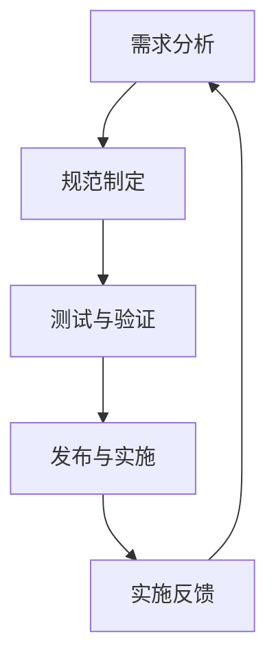

                 

# 提示词编程语言的标准化进程

## 关键词

- 提示词编程语言
- 标准化进程
- 编程语言标准
- 标准化流程
- 标准化组织
- 兼容性
- 未来趋势

## 摘要

本文探讨了提示词编程语言的标准化进程。首先，我们介绍了提示词编程语言的发展背景和标准化的必要性。接着，我们详细分析了提示词编程语言的核心概念与联系，包括提示词、编程语言标准以及标准化流程。然后，我们描述了标准化流程的各个阶段，并介绍了主要的标准化组织和参与者。在标准化挑战与解决方案部分，我们讨论了不同编程语言之间的兼容性问题，并提出了可能的解决方案。接着，我们通过案例研究展示了标准化的实际应用和效果。最后，我们探讨了提示词编程语言标准化的未来发展趋势和潜在影响，并提供了最佳实践与建议。

## 前言

### 书籍目的

《提示词编程语言的标准化进程》旨在为编程语言开发者、标准化组织成员以及所有对提示词编程语言标准化进程感兴趣的人士提供一本全面、系统的参考书籍。通过深入剖析标准化进程中的各个关键环节，本书希望能够为读者提供一个清晰、易懂的指导，帮助他们在理解标准化进程的基础上，积极参与并推动这一进程的发展。

### 读者对象

本书主要面向以下几类读者：

1. **编程语言开发者**：他们需要了解标准化对编程语言设计和开发的影响，以便在开发过程中考虑标准化因素。
2. **标准化组织成员**：他们需要深入理解标准化流程和挑战，以便更有效地推进标准化工作。
3. **学术研究人员**：他们需要了解标准化进程的最新动态，以便在学术研究中引用相关数据。
4. **技术爱好者**：他们对于编程语言标准化进程充满好奇，希望通过本书了解这一领域。

### 内容概述

本书内容分为十个主要章节，结构如下：

1. **前言**：介绍书籍的目的、读者对象和主要内容概述。
2. **背景介绍**：介绍提示词编程语言的发展背景、标准化的必要性以及当前标准化进程的概况。
3. **核心概念与联系**：解释提示词编程语言的基本概念，如提示词、编程语言标准、标准化流程等，并通过表格和ER图展示概念之间的关系。
4. **标准化流程**：详细描述提示词编程语言的标准化流程，包括需求分析、规范制定、测试和验证等阶段。
5. **标准化组织与参与者**：介绍主要的标准化组织和参与者，如国际标准化组织（ISO）、编程语言协会等。
6. **标准化挑战与解决方案**：讨论在标准化过程中遇到的挑战，如不同编程语言之间的兼容性问题，并提出可能的解决方案。
7. **案例研究**：分析一个或多个成功的提示词编程语言标准化案例，展示标准化的实际应用和效果。
8. **未来趋势与展望**：探讨提示词编程语言标准化的未来发展趋势和潜在影响。
9. **最佳实践与建议**：提供一些关于如何参与和推进标准化工作的最佳实践和建议。
10. **小结**：总结全书内容，强调提示词编程语言标准化的重要性。

## 背景介绍

### 提示词编程语言的发展背景

提示词编程语言，也称为基于提示的编程语言，起源于20世纪80年代。最早的提示词编程语言之一是PL/I（Programming Language One），它由IBM于1964年开发。PL/I的设计目标是提供一个简单、统一的编程环境，以支持多种编程任务，包括科学计算、商业数据处理和系统编程。

随着计算机技术的发展，提示词编程语言逐渐成为软件开发者的主要工具之一。90年代，随着互联网的兴起，Web开发成为编程领域的一个重要分支。为了更好地支持Web开发，新的提示词编程语言如Python、Ruby和PHP等相继出现。这些语言提供了丰富的内置函数库和工具，极大地提高了开发效率。

进入21世纪，人工智能和机器学习技术的快速发展为提示词编程语言带来了新的机遇。许多新的提示词编程语言，如TensorFlow、PyTorch和JAX等，被设计用于支持这些新兴领域。这些语言提供了高效的数学运算和数据处理功能，使得开发人员可以更加轻松地实现复杂的人工智能算法。

### 标准化的必要性

随着提示词编程语言的多样性和复杂性不断增加，标准化的重要性日益凸显。以下是几个标准化必要性的原因：

1. **互操作性**：不同编程语言之间的互操作性是软件开发中的一个关键问题。标准化可以帮助确保不同语言之间的兼容性，使得代码可以在不同平台上无缝运行。

2. **可维护性**：标准化的代码更易于维护。通过遵循标准，开发者可以确保代码的一致性和可读性，从而提高开发效率和代码质量。

3. **安全性**：标准化有助于提高软件的安全性。通过定义明确的标准，可以减少安全漏洞和恶意代码的传播。

4. **教育**：标准化的编程语言更容易学习和教授。教师和学生可以遵循统一的教学材料，从而提高教学质量。

5. **国际化**：随着全球化的推进，编程语言的国际化变得尤为重要。标准化有助于确保编程语言在不同国家和文化中的兼容性。

### 当前标准化进程的概况

当前，提示词编程语言的标准化进程主要由几个国际标准化组织推动。其中，最著名的是国际标准化组织（ISO）和国际电工委员会（IEC）。ISO/IEC JTC1/SC22是专门负责编程语言和国际标准化的技术委员会。

截至2023年，ISO/IEC JTC1/SC22已经发布了多个编程语言的国际标准，包括C、C++、Java和C#等。此外，该委员会还在持续制定新的标准，如Python和Kotlin等。

除了ISO，其他标准化组织如欧洲计算机制造商协会（ECMA）和美国国家标准协会（ANSI）也在推动编程语言的标准化工作。例如，ECMA-262是JavaScript的国际标准，而ANSI C是C语言的标准。

尽管已有多个标准化组织在推动编程语言的标准化，但整个进程仍然面临诸多挑战。这些挑战包括不同编程语言之间的兼容性问题、快速的技术变革以及利益相关者之间的协调等。

## 核心概念与联系

### 提示词

提示词是提示词编程语言中的一个核心概念。它通常是一个单词或短语，用于指示代码的执行方向或功能。例如，在Python中，`if`和`while`等关键字就是提示词。提示词的语法和语义在编程语言规范中有详细规定。

### 编程语言标准

编程语言标准是一组规则和指南，用于定义编程语言的语法、语义和实现。这些标准确保了不同实现之间的兼容性，使得代码可以在不同平台上无缝运行。编程语言标准通常由国际标准化组织（ISO）、国际电工委员会（IEC）和其他专业组织制定。

### 标准化流程

标准化流程是确保编程语言标准有效制定和执行的一系列步骤。通常包括以下阶段：

1. **需求分析**：确定编程语言的需求和目标。
2. **规范制定**：编写和审核编程语言规范。
3. **测试与验证**：测试和验证编程语言实现是否符合规范。
4. **发布与实施**：发布标准，并推广实施。

### 概念关系图（ER图）

为了更好地理解提示词编程语言的核心概念及其之间的关系，我们可以使用ER图（实体关系图）进行描述。以下是提示词编程语言的核心概念及其关系的ER图：

```mermaid
erDiagram
    A[提示词] ||--|{ B[编程语言标准] }
    B ||--|{ C[标准化流程] }
    A ||--|{ D[代码实现] }
    D ||--|{ E[兼容性] }
```

在上述ER图中，A表示“提示词”，B表示“编程语言标准”，C表示“标准化流程”，D表示“代码实现”，E表示“兼容性”。图中的箭头表示概念之间的关联关系。

## 标准化流程

### 需求分析

需求分析是标准化流程的第一步，也是至关重要的一步。它的目标是确定编程语言的需求和目标，确保标准能够满足实际应用的需求。需求分析通常包括以下步骤：

1. **收集需求**：通过与开发者、用户和利益相关者进行沟通，收集编程语言的需求。
2. **分析需求**：对收集到的需求进行分析，确定需求的重要性和优先级。
3. **制定需求规格说明书**：根据分析结果，编写需求规格说明书，明确编程语言的功能、性能和其他要求。

### 规范制定

规范制定是标准化流程的核心环节，它的目标是编写和审核编程语言规范。规范通常包括以下内容：

1. **语法规范**：定义编程语言的语法结构，包括关键字、符号和语句等。
2. **语义规范**：定义编程语言的行为和语义，包括变量作用域、类型系统、控制流和异常处理等。
3. **实现规范**：定义编程语言的实现细节，包括内存管理、性能优化和兼容性等。

规范制定通常由专业团队负责，他们需要具备深厚的编程语言知识和丰富的经验。规范制定完成后，需要经过多轮审核和修改，以确保其准确性和完整性。

### 测试与验证

测试与验证是确保编程语言实现符合规范的重要环节。测试通常包括以下内容：

1. **单元测试**：测试单个模块或函数的正确性。
2. **集成测试**：测试多个模块或函数的协同工作能力。
3. **性能测试**：测试编程语言的性能，包括响应时间、吞吐量和内存使用等。
4. **兼容性测试**：测试编程语言在不同平台和操作系统上的兼容性。

验证是通过执行测试用例，验证编程语言实现是否符合规范。验证通常由独立的测试团队负责，他们需要确保测试用例的全面性和覆盖范围。

### 发布与实施

发布与实施是标准化流程的最后一步，它的目标是发布标准，并推广实施。发布标准通常包括以下步骤：

1. **发布标准文档**：将标准文档提交给相关标准化组织进行审批和发布。
2. **推广实施**：通过培训和宣传，推动开发者、用户和利益相关者实施标准。

实施标准的过程通常需要一定时间，因为涉及到对新标准的理解和适应。为了确保实施效果，标准化组织通常会提供实施指南和支持。

### 标准化流程图

为了更清晰地展示标准化流程，我们可以使用mermaid绘制一个流程图。以下是标准化流程的mermaid表示：



在上述流程图中，A表示需求分析，B表示规范制定，C表示测试与验证，D表示发布与实施，E表示实施反馈。箭头表示流程的顺序。

## 标准化组织与参与者

### 国际标准化组织（ISO）

国际标准化组织（ISO）是全球最大的标准化机构之一，负责制定和发布国际标准。ISO/IEC JTC1/SC22是专门负责编程语言和国际标准化的技术委员会。该委员会成立于1978年，自成立以来，已经发布了多个编程语言的国际标准，如C、C++、Java和C#等。

### 编程语言协会

编程语言协会是另一个重要的标准化组织，致力于推动编程语言的标准化工作。其中最著名的是ACM SIGPLAN（Association for Computing Machinery's Special Interest Group on Programming Languages），它是计算机科学领域最大的专业协会之一。ACM SIGPLAN负责组织和举办国际编程语言会议，如SPLASH（Software Product Lines and Process Workshops）和POPL（Principles of Programming Languages），这些会议是编程语言标准化的重要平台。

### 其他重要参与者

除了ISO和编程语言协会，还有许多其他组织和个人在编程语言标准化过程中发挥着重要作用。例如，美国国家标准协会（ANSI）负责发布美国国家标准，欧洲计算机制造商协会（ECMA）负责发布ECMA标准。此外，许多大学和研究机构的研究人员也在编程语言标准化方面做出了重要贡献。

### 合作与协调

在标准化过程中，各个组织和个人之间的合作与协调至关重要。为了确保标准的统一性和一致性，ISO/IEC JTC1/SC22与其他标准化组织，如ECMA、ANSI等，建立了紧密的合作关系。此外，编程语言协会也与其他专业协会和大学进行了广泛的合作，共同推动编程语言的标准化进程。

### 代表性会议

为了促进标准化进程，ISO/IEC JTC1/SC22和编程语言协会定期举办代表性会议，如ISO/IEC JTC1/SC22全会、ACM SIGPLAN会议等。这些会议为标准制定者、开发者、用户和利益相关者提供了一个交流和合作的平台，有助于推动标准化进程的顺利进行。

## 标准化挑战与解决方案

### 兼容性问题

在提示词编程语言的标准化过程中，兼容性问题是一个主要的挑战。由于不同编程语言之间存在差异，如何在保证互操作性的同时保持语言特色是一个复杂的问题。

#### 挑战

1. **语法兼容性**：不同编程语言的语法结构可能存在显著差异，如Python和Java之间的差异。确保这两种语言在语法上的兼容性是一个挑战。
2. **语义兼容性**：即使语法相同，不同语言的语义可能存在差异。例如，Python中的`None`和Java中的`null`在语义上并不完全相同，这可能导致兼容性问题。
3. **功能兼容性**：某些编程语言可能提供特有的功能或库，而其他语言可能不支持。如何在不同语言之间实现这些功能的兼容性是一个挑战。

#### 解决方案

1. **抽象层**：通过引入抽象层，可以在不同编程语言之间实现语法和语义的兼容。例如，可以使用接口或抽象类来实现不同语言之间的互操作。
2. **标准化接口**：定义统一的接口标准，以确保不同语言之间的功能兼容性。例如，ISO/IEC JTC1/SC22可以制定一个通用的数据交换格式标准，以支持不同编程语言之间的数据传递。
3. **兼容性库**：开发兼容性库，以桥接不同编程语言之间的差异。例如，Java和Python之间可以使用Jython或Py4J等库来实现互操作。

### 技术变革的影响

技术变革对标准化进程也提出了新的挑战。随着新技术的不断出现，标准化组织需要不断更新和调整标准，以确保其适用性和前瞻性。

#### 挑战

1. **更新速度**：新技术的发展速度远超标准化进程。标准化组织需要快速响应技术变革，及时更新标准。
2. **兼容旧标准**：在引入新技术时，需要确保与旧标准的兼容性，以避免对现有系统的冲击。
3. **平衡创新与稳定**：在推动标准创新的同时，需要保持标准的稳定性和可预测性，以确保开发者的信心和投资。

#### 解决方案

1. **迭代式标准化**：采用迭代式标准化方法，逐步更新和改进标准，以适应技术变革。
2. **开源社区参与**：鼓励开源社区参与标准化工作，通过社区的力量推动标准的创新和改进。
3. **早期参与**：在技术尚不成熟时，提前参与标准的制定，以确保标准能够引导技术的发展方向。

### 利益相关者之间的协调

标准化进程涉及多个利益相关者，如开发人员、用户、企业和标准化组织。协调这些利益相关者的需求和期望是标准化成功的关键。

#### 挑战

1. **利益冲突**：不同利益相关者可能有不同的目标和期望，如开发者追求创新，用户追求稳定性，企业追求利润。
2. **沟通障碍**：利益相关者之间的沟通可能存在障碍，导致信息不畅和决策延迟。
3. **利益分配**：如何在不同利益相关者之间分配标准和资源，以实现公平和效率是一个挑战。

#### 解决方案

1. **多利益相关者会议**：定期举办多利益相关者会议，促进沟通和协作，确保各方利益得到充分考虑。
2. **利益相关者代表**：设立利益相关者代表，确保各方在标准化决策中的代表性。
3. **透明度**：提高标准化进程的透明度，通过公开标准和决策过程，增强各方的信任和参与度。

### 社会文化差异的影响

社会文化差异也可能对标准化进程产生影响。不同国家和地区的编程语言使用习惯、技术水平和市场需求可能存在显著差异。

#### 挑战

1. **文化差异**：不同文化对标准和技术的理解和接受程度可能不同，影响标准的推广和实施。
2. **技术适应**：在引入国际标准时，需要考虑不同地区的特殊需求和技术环境，进行适应性调整。
3. **本地化**：如何实现标准的本地化，以满足不同地区的需求和习惯是一个挑战。

#### 解决方案

1. **国际化策略**：制定国际化策略，确保标准能够适应不同国家和地区的需求。
2. **本地化工作组**：成立本地化工作组，负责评估和调整标准，以满足当地市场需求。
3. **文化敏感度**：在标准化过程中，增强对文化差异的敏感度，确保标准的适用性和可接受性。

### 持续改进的挑战

标准化是一个持续的过程，需要不断改进和更新。在保持标准稳定性的同时，如何持续改进是一个挑战。

#### 挑战

1. **反馈机制**：建立有效的反馈机制，收集用户和开发者的意见和建议，以持续改进标准。
2. **资源分配**：确保足够的资源和人力投入，支持标准的改进和更新。
3. **持续监督**：对标准的实施效果进行持续监督，及时发现和解决问题。

#### 解决方案

1. **反馈渠道**：建立多种反馈渠道，如在线论坛、调查问卷和用户反馈机制，收集用户和开发者的意见和建议。
2. **持续改进计划**：制定持续改进计划，明确改进目标、方法和时间表。
3. **监督和评审**：定期对标准的实施效果进行评审和监督，确保标准的持续改进和优化。

## 案例研究

### 案例一：Python的标准化进程

Python是一种广泛使用的提示词编程语言，其标准化进程具有重要的参考价值。以下是Python标准化进程的详细分析：

#### 背景与目标

Python于1991年由Guido van Rossum创建，自发布以来，迅速获得了广泛的认可和喜爱。Python的简洁性和易用性使其成为初学者和专业人士的常用语言。随着Python在各个领域的应用不断扩大，标准化进程成为必要。

Python的标准化目标是确保Python代码在不同平台和操作系统上的兼容性，提高Python的稳定性和可维护性，并促进Python在全球范围内的普及。

#### 标准化流程

Python的标准化流程包括以下关键阶段：

1. **需求分析**：Python社区定期收集用户和开发者的需求和反馈，为标准化工作提供基础。
2. **规范制定**：Python核心团队负责制定Python语言的规范，这些规范详细描述了Python的语法、语义和实现细节。
3. **测试与验证**：Python社区开发和维护了多个测试工具，用于验证Python实现的正确性和一致性。
4. **发布与实施**：Python规范由Python核心团队发布，并在Python社区和开源社区中推广实施。

#### 成果与效果

Python标准化进程取得了显著成果，具体包括：

1. **提高了代码的可维护性**：通过标准化，Python代码的一致性和可读性得到了显著提高，使得开发者可以更轻松地维护和扩展代码。
2. **促进了跨平台开发**：Python的标准化确保了代码在不同平台和操作系统上的兼容性，使得开发者可以更加灵活地选择开发环境。
3. **增强了社区凝聚力**：标准化进程促进了Python社区的团结和合作，增强了社区的活力和创新能力。

#### 经验与启示

Python标准化进程的成功经验为其他编程语言提供了有益的启示：

1. **社区参与**：Python的标准化进程高度依赖社区参与，通过鼓励用户和开发者参与标准化工作，确保标准的全面性和可接受性。
2. **持续改进**：Python持续关注用户和开发者的反馈，不断改进和更新标准，以适应技术变革和社区需求。
3. **透明度**：Python标准化进程的透明度和公开性得到了广泛认可，这有助于增强社区对标准的信任和参与度。

### 案例二：JavaScript的国际标准化

JavaScript是一种广泛使用的客户端脚本语言，其国际标准化进程具有重要的参考价值。以下是JavaScript国际标准化进程的详细分析：

#### 背景与目标

JavaScript于1995年由Brendan Eich创建，作为Netscape Navigator的浏览器脚本语言。随着互联网的发展，JavaScript成为Web开发不可或缺的一部分。为了确保JavaScript在不同浏览器和平台上的兼容性，国际标准化组织（ISO）和欧洲计算机制造商协会（ECMA）启动了JavaScript的国际标准化进程。

JavaScript的标准化目标包括：

1. **兼容性**：确保JavaScript代码在不同浏览器和平台上的一致性和兼容性。
2. **安全性**：提高JavaScript的安全性，减少恶意代码的风险。
3. **功能扩展**：通过标准化，引入新的功能和特性，满足开发者需求。

#### 标准化流程

JavaScript的国际标准化流程包括以下关键阶段：

1. **需求分析**：ECMA组织通过调查问卷、开发者会议和社区讨论等方式，收集用户和开发者的需求和意见。
2. **规范制定**：ECMA组织成立专门的技术委员会，负责制定JavaScript规范。规范包括语法、语义、对象模型和API等。
3. **测试与验证**：ECMA组织开发和维护了多个测试套件，用于验证JavaScript实现的一致性和兼容性。
4. **发布与实施**：ECMA组织发布JavaScript规范，并在全球范围内推广实施。

#### 成果与效果

JavaScript国际标准化进程取得了显著成果，具体包括：

1. **提高了兼容性**：通过标准化，JavaScript代码在不同浏览器和平台上的兼容性得到了显著提高，使得开发者可以更轻松地跨平台开发。
2. **增强了安全性**：JavaScript标准化进程引入了多种安全措施，如同源策略、内容安全政策等，提高了Web应用的安全性。
3. **促进了创新**：标准化进程为JavaScript引入了新的功能和特性，如Promise、async/await等，激发了开发者的创新和创造力。

#### 经验与启示

JavaScript国际标准化进程的经验为其他编程语言的标准化提供了有益的启示：

1. **国际化协作**：JavaScript的标准化涉及多个国家和地区，ECMA组织通过国际化协作，确保标准的全球适用性和可接受性。
2. **开放性和透明度**：ECMA组织保持标准的开放性和透明度，通过公开规范草案、举办开发者会议等方式，增强社区对标准的信任和参与度。
3. **持续更新**：JavaScript标准化进程持续关注技术变革和社区需求，通过定期更新规范，确保标准的前瞻性和适用性。

## 未来趋势与展望

### 技术发展趋势

提示词编程语言的标准化进程将继续受到技术发展趋势的影响。以下是几个重要的技术发展趋势：

1. **人工智能与机器学习**：随着人工智能和机器学习技术的不断发展，提示词编程语言将在数据处理、算法优化和模型训练等方面发挥越来越重要的作用。标准化进程需要确保这些语言能够支持新兴的人工智能应用。
2. **量子计算**：量子计算技术的发展将对提示词编程语言提出新的挑战和机遇。标准化组织需要制定相应的标准，以支持量子编程语言的开发和应用。
3. **边缘计算**：边缘计算的兴起将促使提示词编程语言在物联网（IoT）和边缘设备上得到更广泛的应用。标准化进程需要考虑如何确保这些语言在不同边缘设备上的兼容性和性能。

### 标准化的影响

标准化的影响将不仅限于技术层面，还会对整个软件开发生态系统产生深远影响：

1. **提高开发效率**：通过标准化，开发人员可以更轻松地集成和使用不同编程语言和工具，从而提高开发效率。
2. **降低开发成本**：标准化有助于降低软件开发和维护成本，通过促进代码的复用和降低兼容性问题，减少开发和维护的资源投入。
3. **促进创新**：标准化为开发者提供了稳定和可预测的开发环境，激发了他们的创新和创造力。
4. **提升安全性**：标准化有助于提高软件的安全性，通过定义明确的标准和最佳实践，减少安全漏洞和恶意代码的风险。

### 未来展望

提示词编程语言标准化的未来展望包括以下几个方面：

1. **更广泛的参与**：随着开源和社区化的发展，未来将有更多开发者、企业和学术机构参与标准化进程，推动标准的创新和改进。
2. **多元化标准**：随着新技术的出现，提示词编程语言的标准化将涵盖更多的领域和需求，如量子编程、边缘计算等。
3. **持续更新与改进**：标准化组织将继续关注技术变革和社区需求，通过持续更新和改进标准，确保其前瞻性和适用性。
4. **国际化与全球化**：标准化进程将更加国际化，通过国际合作和协调，确保标准在全球范围内的统一性和可接受性。

## 最佳实践与建议

### 参与标准化的途径

1. **加入标准化组织**：加入国际标准化组织（如ISO）、编程语言协会（如ACM SIGPLAN）等，参与标准化工作。
2. **参与社区活动**：参与开源社区和编程语言社区的活动，如开发者会议、论坛和邮件列表，积极贡献意见和建议。
3. **撰写技术博客**：撰写关于标准化进程的技术博客，分享经验和见解，提高影响力。
4. **参与项目**：参与与标准化相关的开源项目，如Python、JavaScript等，通过实践贡献代码和标准。

### 最佳实践

1. **遵循最佳实践**：在编写代码和设计系统时，遵循最佳实践，如代码风格指南、测试驱动开发等，以提高代码质量和可维护性。
2. **积极参与社区**：积极参与开源社区和编程语言社区的讨论和协作，为标准化工作提供支持和反馈。
3. **持续学习**：持续关注技术趋势和标准化动态，通过学习新技术和标准，提高自己的专业素养。

### 建议与展望

1. **促进开放性**：标准化组织应保持标准的开放性和透明度，通过公开规范草案、举办开发者会议等方式，增强社区对标准的信任和参与度。
2. **注重国际化**：在制定标准时，应充分考虑国际化和多元化需求，确保标准在全球范围内的适用性和可接受性。
3. **加强合作与协调**：标准化组织应加强与其他标准化组织、企业和学术机构的合作与协调，共同推进标准化进程。
4. **持续改进**：标准化组织应持续关注技术变革和社区需求，通过持续改进和更新标准，确保其前瞻性和适用性。

## 小结

提示词编程语言的标准化进程对于提升开发效率、降低成本、促进创新和增强安全性具有重要意义。本文通过详细分析提示词编程语言的标准化流程、组织与参与者、挑战与解决方案以及案例研究，展示了标准化进程的复杂性和多样性。同时，本文提出了最佳实践和建议，以指导读者参与和推进标准化工作。我们期望通过本文的介绍，能够为读者提供一个清晰、易懂的标准化进程全景图，激发他们对标准化工作的兴趣和参与。在未来的发展中，标准化将继续发挥关键作用，推动提示词编程语言的发展和普及。

## 作者信息

作者：AI天才研究院/AI Genius Institute & 禅与计算机程序设计艺术 /Zen And The Art of Computer Programming

