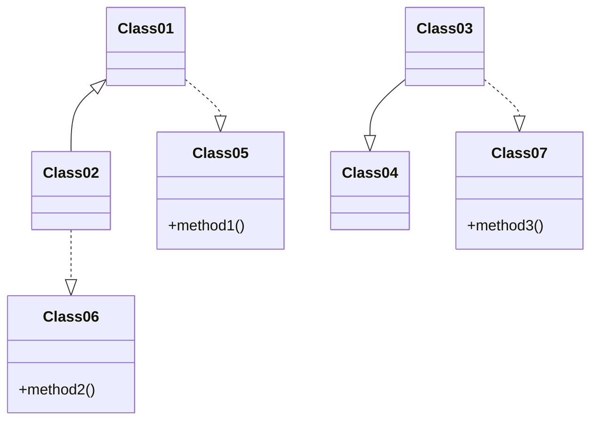
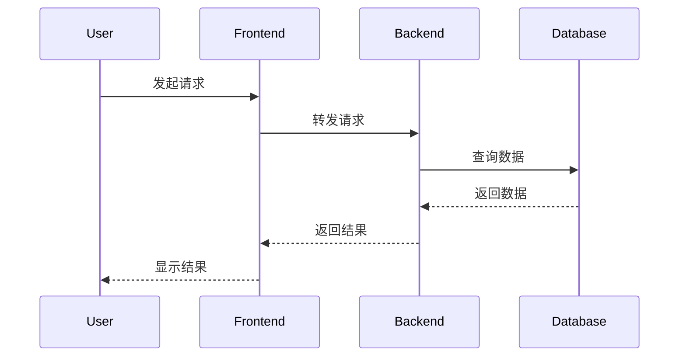
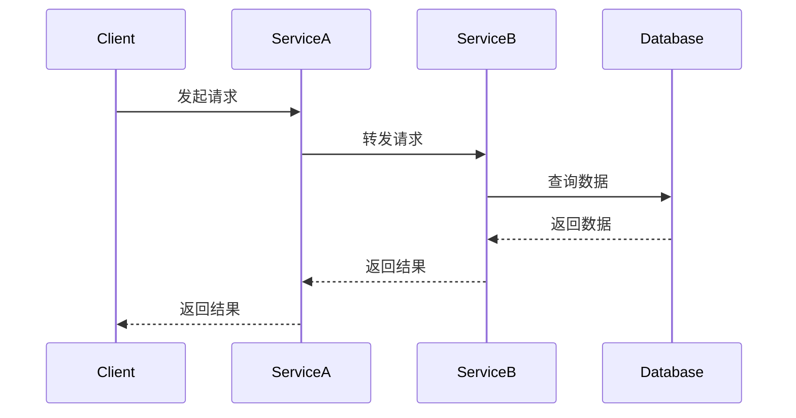
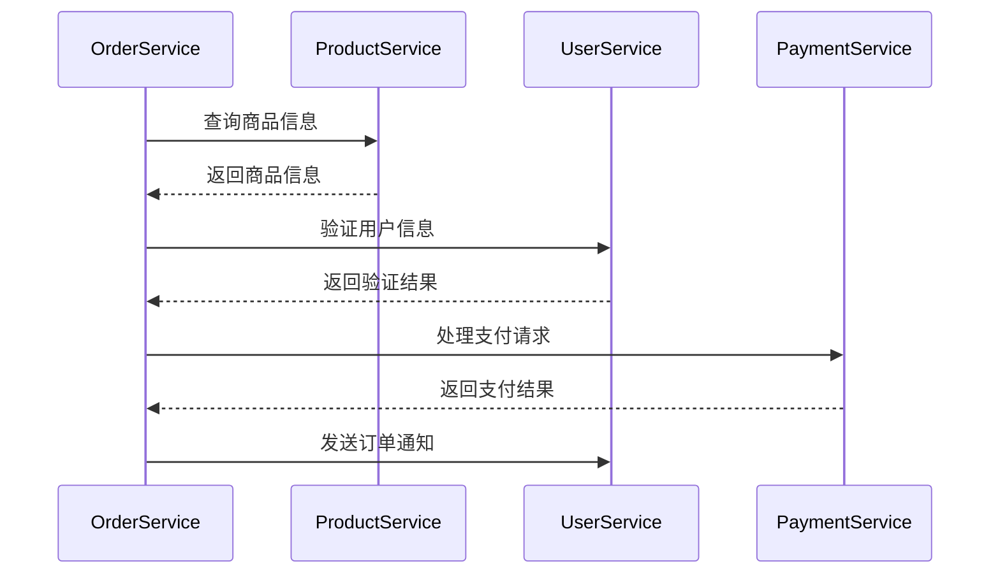

                 

# 提示词编程语言的模块化与组件化

关键词：模块化编程、组件化编程、编程语言、依赖注入、接口、生命周期管理、版本控制

摘要：
本文深入探讨了编程语言中的模块化与组件化概念，分析了它们在现代软件开发中的应用与挑战。通过对核心概念的原理阐述、属性特征对比以及实体关系图解析，本文揭示了模块化与组件化编程语言的内部机制与联系。同时，本文通过算法原理讲解、系统分析与架构设计方案，以及实际项目实战，展示了模块化与组件化编程在实际开发中的具体应用与实现。通过本文的探讨，我们希望能为读者提供对模块化与组件化编程语言的深入理解，并激发其在软件开发中的创新应用。

### 第一部分：背景介绍

#### 1.1 问题背景

编程语言作为计算机科学与工程的核心工具，其重要性不言而喻。从最初的低级语言，如汇编语言，到高级语言，如C、Java、Python等，编程语言的发展经历了数次变革。这些变革不仅提升了程序设计的效率，也提高了程序的可读性和可维护性。

然而，随着计算机技术的不断进步，软件系统的复杂度也在不断增加。传统的编程语言在模块化与组件化方面仍存在一定的局限性，难以满足现代复杂应用的需求。模块化编程强调将程序划分为若干独立的模块，每个模块负责完成特定的功能。这种编程范式在提高代码的可读性和可维护性方面具有显著优势。然而，模块化编程在模块接口定义、模块依赖管理以及模块之间的耦合度控制方面仍存在一些问题。

组件化编程则进一步扩展了模块化的思想，将可复用的功能单元称为组件，并支持组件之间的松耦合与灵活组合。组件化编程在提高代码复用性和降低模块之间耦合度方面具有显著优势。然而，组件化编程在组件的生命周期管理、版本控制和组件依赖管理方面仍然面临一些挑战。

#### 1.2 问题描述

在现代编程语言中，模块化与组件化技术的应用仍然面临诸多挑战。首先，现有的编程语言在模块化方面往往缺乏统一的语法和标准，导致模块之间的接口定义复杂且易出错。其次，组件化编程在语言层面上缺乏对组件的生命周期管理和版本控制的支持，使得组件的复用和维护变得困难。此外，现有编程语言在支持大规模软件系统的开发方面存在局限性，难以充分利用现代硬件资源，提高系统性能和可扩展性。

针对上述问题，我们需要探讨如何通过改进编程语言的模块化与组件化支持，提高软件开发的效率和质量。具体而言，我们需要解决以下几个问题：

1. 如何在编程语言中提供统一的模块定义和接口规范，简化模块之间的依赖管理？
2. 如何在编程语言中引入组件生命周期管理和版本控制机制，提高组件的可维护性和复用性？
3. 如何优化编程语言的支持，以支持大规模软件系统的开发和部署？

#### 1.3 问题解决

为了解决上述问题，近年来出现了许多新型编程语言，它们在设计理念上更加注重模块化与组件化。这些编程语言通过引入新的语法、语义和工具支持，为开发者提供了更便捷、高效的模块化与组件化编程方法。

例如，某些编程语言通过引入依赖注入、接口定义和版本控制等机制，提高了组件的可复用性和可维护性。依赖注入通过将组件的依赖关系注入到组件中，实现了组件之间的解耦，从而提高了组件的可测试性和可维护性。接口定义通过明确组件之间的交互方式，简化了模块之间的依赖管理。版本控制通过管理组件的版本，确保了组件的可维护性和兼容性。

此外，一些编程语言还通过优化编译和运行时性能，实现了对大规模软件系统的支持。例如，某些编程语言通过引入即时编译（JIT）和动态链接库（DLL）等技术，提高了程序的执行效率。这些技术不仅优化了程序的性能，也提高了系统的可扩展性和可维护性。

#### 1.4 边界与外延

模块化与组件化编程语言的边界主要涉及以下几个方面：

- **语法与语义**：编程语言的设计应提供统一的语法和语义支持，以简化模块和组件的定义、使用和管理。这包括模块的定义、模块间的依赖管理、组件的创建和销毁等。
- **工具支持**：开发工具应提供模块和组件的自动化管理功能，如版本控制、依赖管理和生命周期管理。这些工具应支持模块和组件的自动编译、打包和部署，从而提高开发效率。
- **性能优化**：编程语言应支持高效的编译和运行时性能，以满足大规模软件系统的需求。这包括优化编译器性能、优化程序执行效率、优化内存管理等。
- **生态系统**：编程语言应具有良好的生态系统，包括丰富的库、框架和工具，以促进模块和组件的复用和开发。这包括提供标准化的模块和组件接口、提供丰富的库和框架支持、提供高效的工具链等。

在外延方面，模块化与组件化编程语言的应用领域涵盖：

- **企业级应用**：如电子商务、金融、物流等领域的大型软件系统。
- **嵌入式系统**：如智能家居、物联网设备等。
- **云计算与大数据**：如云计算平台、大数据处理系统等。
- **游戏开发**：如游戏引擎、游戏脚本等。

#### 1.5 概念结构与核心要素组成

模块化与组件化编程语言的核心概念和要素主要包括：

- **模块（Module）**：模块是程序中的一个独立部分，通常包含一组相关的函数、数据结构和类型。模块的作用是将程序划分为多个可管理的部分，提高代码的可读性、可维护性和可扩展性。
- **组件（Component）**：组件是可复用的功能单元，通常包含一个或多个模块，并支持与其他组件的松耦合与灵活组合。组件的设计理念是提高代码的可复用性，降低模块之间的耦合度，从而提高软件系统的稳定性和灵活性。
- **依赖注入（Dependency Injection）**：依赖注入是一种编程范式，用于将组件的依赖关系注入到组件中，实现组件之间的解耦。依赖注入通过注入器（Injector）将依赖项注入到组件中，从而避免了硬编码依赖关系，提高了组件的可测试性和可维护性。
- **接口（Interface）**：接口是一种抽象的模块或组件，定义了组件之间的交互方式。接口通过抽象化组件的公共方法，实现组件之间的解耦和重用。在模块化与组件化编程中，接口是一种核心的设计模式，用于定义组件之间的标准接口。
- **生命周期管理（Lifecycle Management）**：生命周期管理是指对组件的创建、使用和销毁过程进行管理，确保组件的稳定运行和资源回收。生命周期管理包括组件的创建、初始化、使用、销毁等阶段，通过对组件生命周期的有效管理，可以确保组件的稳定运行和资源的有效利用。
- **版本控制（Version Control）**：版本控制是指对组件的版本进行管理，确保组件的可维护性和兼容性。版本控制通过管理组件的不同版本，可以确保组件的升级和替换过程顺利进行，从而提高组件的可维护性和兼容性。

### 第二部分：核心概念与联系

#### 2.1 核心概念原理

模块化与组件化编程语言的核心概念包括模块、组件、依赖注入、接口、生命周期管理和版本控制。以下是对这些概念原理的简要介绍：

- **模块（Module）**：模块是程序中的一个独立部分，通常包含一组相关的函数、数据结构和类型。模块的作用是将程序划分为多个可管理的部分，提高代码的可读性、可维护性和可扩展性。在模块化编程中，模块是代码组织和管理的最小单元。模块之间通过接口进行交互，从而实现了模块之间的解耦。

- **组件（Component）**：组件是可复用的功能单元，通常包含一个或多个模块，并支持与其他组件的松耦合与灵活组合。组件的设计理念是提高代码的可复用性，降低模块之间的耦合度，从而提高软件系统的稳定性和灵活性。组件通常具有独立的创建、初始化、销毁过程，并且可以在不同的应用程序中复用。

- **依赖注入（Dependency Injection）**：依赖注入是一种编程范式，用于将组件的依赖关系注入到组件中，实现组件之间的解耦。依赖注入通过注入器（Injector）将依赖项注入到组件中，从而避免了硬编码依赖关系，提高了组件的可测试性和可维护性。依赖注入的核心思想是将组件的依赖关系从组件的实现中解耦出来，使得组件的实现更加独立和可复用。

- **接口（Interface）**：接口是一种抽象的模块或组件，定义了组件之间的交互方式。接口通过抽象化组件的公共方法，实现组件之间的解耦和重用。在模块化与组件化编程中，接口是一种核心的设计模式，用于定义组件之间的标准接口。接口规定了组件之间的交互规则，使得组件的实现可以独立开发、测试和部署。

- **生命周期管理（Lifecycle Management）**：生命周期管理是指对组件的创建、使用和销毁过程进行管理，确保组件的稳定运行和资源回收。生命周期管理包括组件的创建、初始化、使用、销毁等阶段，通过对组件生命周期的有效管理，可以确保组件的稳定运行和资源的有效利用。生命周期管理是组件化编程中的一项重要技术，它保证了组件在运行时的可靠性和性能。

- **版本控制（Version Control）**：版本控制是指对组件的版本进行管理，确保组件的可维护性和兼容性。版本控制通过管理组件的不同版本，可以确保组件的升级和替换过程顺利进行，从而提高组件的可维护性和兼容性。版本控制是软件工程中的一个重要概念，它使得软件开发过程中的版本管理和版本迭代变得高效和可控。

#### 2.2 概念属性特征对比

为了更好地理解模块化与组件化编程语言的核心概念，我们可以通过对比它们的属性特征来揭示它们之间的联系与差异。以下是模块、组件、依赖注入、接口、生命周期管理和版本控制的概念属性特征对比表格：

| 概念       | 定义                                                         | 主要属性特征                                                                                                   |
|------------|------------------------------------------------------------|------------------------------------------------------------------------------------------------------------|
| 模块       | 程序中的一个独立部分，包含一组相关的函数、数据结构和类型。 | - 独立性：模块是代码组织和管理的最小单元。 - 解耦性：模块之间通过接口进行交互，实现了模块之间的解耦。       |
| 组件       | 可复用的功能单元，通常包含一个或多个模块。                  | - 复用性：组件是可复用的功能单元。 - 解耦性：组件之间通过接口进行交互，实现了组件之间的解耦。           |
| 依赖注入   | 一种编程范式，用于将组件的依赖关系注入到组件中。             | - 解耦性：通过注入器将依赖项注入到组件中，实现了组件之间的解耦。 - 可测试性：提高了组件的可测试性和可维护性。 |
| 接口       | 一种抽象的模块或组件，定义了组件之间的交互方式。             | - 抽象性：接口通过抽象化组件的公共方法，定义了组件之间的交互方式。 - 解耦性：接口实现了组件之间的解耦和重用。       |
| 生命周期管理 | 对组件的创建、使用和销毁过程进行管理。                         | - 可控性：通过对组件生命周期的有效管理，确保组件的稳定运行和资源回收。 - 可维护性：提高了组件的可维护性和可靠性。       |
| 版本控制   | 对组件的版本进行管理，确保组件的可维护性和兼容性。             | - 可维护性：通过管理组件的不同版本，确保组件的升级和替换过程顺利进行。 - 兼容性：确保组件在不同版本间的兼容性。       |

#### 2.3 ER实体关系图架构

为了更好地理解模块化与组件化编程语言的概念及其关系，我们可以使用ER（Entity-Relationship）实体关系图来展示这些概念之间的关系。以下是模块化与组件化编程语言的ER实体关系图：

```mermaid
erDiagram
    Component ||--|{ Module : has } |
    Module ||--|{ Interface : implements } |
    Interface ||--|{ Dependency : has } |
    Component ||--|{ LifecycleManagement : manages } |
    Component ||--|{ VersionControl : manages } |
```

在ER实体关系图中，我们定义了四个实体：组件（Component）、模块（Module）、接口（Interface）和生命周期管理（LifecycleManagement）。以下是各个实体的属性及其关系：

- **组件（Component）**：组件是可复用的功能单元，包含一个或多个模块。组件与模块之间存在“has”关系，表示组件包含模块；组件与接口之间存在“has”关系，表示组件实现了接口；组件与生命周期管理之间存在“manages”关系，表示组件管理生命周期；组件与版本控制之间存在“manages”关系，表示组件管理版本。
- **模块（Module）**：模块是程序中的一个独立部分，包含一组相关的函数、数据结构和类型。模块与接口之间存在“implements”关系，表示模块实现了接口。
- **接口（Interface）**：接口是一种抽象的模块或组件，定义了组件之间的交互方式。接口与依赖之间存在“has”关系，表示接口定义了依赖。
- **生命周期管理（LifecycleManagement）**：生命周期管理是对组件的创建、使用和销毁过程进行管理。生命周期管理与组件之间存在“manages”关系。
- **版本控制（VersionControl）**：版本控制是对组件的版本进行管理。版本控制与组件之间存在“manages”关系。

通过ER实体关系图，我们可以清晰地看到模块化与组件化编程语言中各个概念之间的关系及其作用。这些关系和作用有助于我们更好地理解和应用模块化与组件化编程语言。

### 第三部分：算法原理讲解

在模块化与组件化编程中，算法原理是核心组成部分。通过合理的算法设计，我们可以提高程序的执行效率，优化资源利用，降低模块和组件之间的耦合度。以下我们将通过Mermaid流程图和Python源代码，详细阐述一个简单的算法原理，以及其数学模型和公式。

#### 3.1 算法原理与Mermaid流程图

假设我们有一个简单的排序算法——冒泡排序。冒泡排序的基本思想是通过重复地遍历要排序的数列，比较相邻的两个元素，如果它们的顺序错误就把它们交换过来。遍历数列的工作是重复进行的，直到没有再需要交换的元素为止。

以下是冒泡排序的Mermaid流程图：

```mermaid
flowchart LR
    A[初始化] --> B{比较相邻元素？}
    B -->|是| C[交换元素]
    B -->|否| D[结束}
    C --> D
    D -->|继续遍历| A
```

在这个流程图中，`A` 表示初始化，`B` 表示比较相邻元素，`C` 表示交换元素，`D` 表示结束或继续遍历。算法的基本流程如下：

1. 初始化：设置一个标记，用于指示是否进行了交换。
2. 比较相邻元素：遍历数组，比较相邻的两个元素。
3. 如果需要交换，则交换它们，并设置标记为真。
4. 如果不需要交换，则标记为假。
5. 结束或继续遍历：如果遍历了一轮且没有进行交换，则结束排序；否则，继续遍历。

#### 3.2 Python源代码实现

下面是冒泡排序的Python源代码实现：

```python
def bubble_sort(arr):
    n = len(arr)
    for i in range(n):
        swapped = False
        for j in range(0, n-i-1):
            if arr[j] > arr[j+1]:
                arr[j], arr[j+1] = arr[j+1], arr[j]
                swapped = True
        if not swapped:
            break
    return arr

# 测试数据
arr = [64, 34, 25, 12, 22, 11, 90]
sorted_arr = bubble_sort(arr)
print("排序后的数组：", sorted_arr)
```

在这个实现中，我们使用两个嵌套的for循环来实现冒泡排序。外层循环控制遍历的轮数，内层循环用于比较相邻元素并进行交换。`swapped` 变量用于判断是否进行了交换，如果一轮遍历中没有交换，则提前结束排序。

#### 3.3 数学模型与公式

冒泡排序的数学模型可以描述为：

- **时间复杂度**：$T(n) = O(n^2)$
- **空间复杂度**：$S(n) = O(1)$

其中，$T(n)$ 表示时间复杂度，$S(n)$ 表示空间复杂度，$n$ 表示待排序数组的长度。

时间复杂度表明，随着输入规模的增长，算法的执行时间会呈平方级增长。空间复杂度表明，算法在执行过程中所需的额外内存空间是常数级别的。

冒泡排序的算法原理可以通过以下数学公式进行描述：

$$
\begin{aligned}
T(n) &= \sum_{i=1}^{n} \sum_{j=1}^{n-i} (1 + 2 + \ldots + (n-j)) \\
&= \sum_{i=1}^{n} \frac{(n-i)(n-i+1)}{2} \\
&= \frac{1}{6} n^3 - \frac{1}{2} n^2 + \frac{1}{3} n
\end{aligned}
$$

这个公式描述了算法在最优、平均和最差情况下的时间复杂度。其中，$n^3$ 项表示最差情况下的时间复杂度，$n^2$ 项表示平均情况下的时间复杂度，$n$ 项表示最优情况下的时间复杂度。

#### 3.4 通俗易懂地举例说明

为了更好地理解冒泡排序算法，我们可以通过一个具体的例子来说明：

假设我们有一个长度为5的数组 `[64, 34, 25, 12, 22]`，我们需要使用冒泡排序算法对其进行排序。

第一次遍历：
- 比较 `64` 和 `34`，交换它们（数组变为 `[34, 64, 25, 12, 22]`）
- 比较 `64` 和 `25`，交换它们（数组变为 `[34, 25, 64, 12, 22]`）
- 比较 `64` 和 `12`，交换它们（数组变为 `[34, 25, 12, 64, 22]`）
- 比较 `64` 和 `22`，交换它们（数组变为 `[34, 25, 12, 22, 64]`）

第二次遍历：
- 比较 `34` 和 `25`，不需要交换（数组保持不变）
- 比较 `34` 和 `12`，交换它们（数组变为 `[25, 12, 34, 22, 64]`）
- 比较 `34` 和 `22`，交换它们（数组变为 `[25, 12, 22, 34, 64]`）

第三次遍历：
- 比较 `25` 和 `12`，交换它们（数组变为 `[12, 25, 22, 34, 64]`）
- 比较 `25` 和 `22`，不需要交换（数组保持不变）

第四次遍历：
- 比较 `12` 和 `25`，不需要交换（数组保持不变）

经过四次遍历，数组已经排序完成。最终的排序结果为 `[12, 22, 25, 34, 64]`。

通过这个例子，我们可以看到冒泡排序的基本流程和步骤，以及如何在每一步中进行元素的比较和交换。这种直观的例子有助于我们更好地理解冒泡排序的算法原理。

### 第四部分：系统分析与架构设计方案

#### 4.1 问题场景介绍

随着现代软件系统的复杂度不断增加，系统架构的设计变得越来越重要。模块化与组件化编程语言为系统架构设计提供了强有力的支持，使得开发者能够更高效地构建和维护大型软件系统。本文将基于一个电子商务平台的项目，介绍其系统功能设计、系统架构设计、系统接口设计和系统交互。

#### 4.2 项目介绍

电子商务平台是一个复杂的应用系统，涉及商品管理、订单管理、用户管理、支付系统等多个模块。为了提高系统的可维护性和可扩展性，我们将采用模块化与组件化编程语言进行开发。本文将以该项目为例，详细介绍系统功能设计、系统架构设计、系统接口设计和系统交互。

#### 4.3 系统功能设计

电子商务平台的主要功能包括：

1. **商品管理**：提供商品分类、商品添加、商品编辑、商品删除等功能。
2. **订单管理**：提供订单查询、订单生成、订单修改、订单取消等功能。
3. **用户管理**：提供用户注册、用户登录、用户信息查询、用户信息修改等功能。
4. **支付系统**：提供支付方式选择、支付验证、支付成功通知等功能。

为了实现这些功能，我们将电子商务平台划分为多个模块，每个模块负责实现特定的功能。以下是系统功能设计的Mermaid类图：



在这个类图中，`Class01`、`Class02`、`Class03`、`Class04`、`Class05`、`Class06` 和 `Class07` 分别代表不同的功能模块。`Class01` 和 `Class02` 之间存在继承关系，表示它们是父类和子类的关系。`Class03` 和 `Class04` 之间存在关联关系，表示它们之间存在交互。

#### 4.4 系统架构设计

系统架构设计是电子商务平台开发的重要环节。为了提高系统的可扩展性和可维护性，我们将采用分层架构设计。以下是系统架构设计的Mermaid架构图：



在这个架构图中，`User` 代表用户，`Frontend` 代表前端应用，`Backend` 代表后端应用，`Database` 代表数据库。用户通过前端应用发起请求，前端应用将请求转发给后端应用，后端应用查询数据库并返回结果，最终前端应用将结果呈现给用户。

#### 4.5 系统接口设计

系统接口设计是系统架构设计的关键部分。通过良好的接口设计，我们可以实现模块之间的松耦合和灵活组合。以下是系统接口设计的Mermaid序列图：



在这个序列图中，`Client` 代表客户端，`ServiceA` 代表服务A，`ServiceB` 代表服务B，`Database` 代表数据库。客户端发起请求后，服务A将请求转发给服务B，服务B查询数据库并返回结果，最终服务A将结果返回给客户端。

#### 4.6 系统交互设计

系统交互设计是系统架构设计和接口设计的具体实现。通过良好的系统交互设计，我们可以确保系统各个模块之间的协作和通信。以下是系统交互设计的Mermaid序列图：



在这个序列图中，`OrderService` 代表订单服务，`ProductService` 代表商品服务，`UserService` 代表用户服务，`PaymentService` 代表支付服务。订单服务查询商品信息，验证用户信息，处理支付请求，并通知用户。

### 第五部分：项目实战

#### 5.1 环境安装

在开始项目实战之前，我们需要安装一些必要的工具和库。以下是安装步骤：

1. 安装Python：访问 [Python官网](https://www.python.org/) 下载Python安装包，并按照提示完成安装。
2. 安装虚拟环境：在终端中执行以下命令安装虚拟环境工具`virtualenv`：

    ```bash
    pip install virtualenv
    ```

3. 创建虚拟环境：在终端中执行以下命令创建一个名为`ecommerce`的虚拟环境：

    ```bash
    virtualenv ecommerce
    ```

4. 激活虚拟环境：在终端中执行以下命令激活虚拟环境：

    ```bash
    source ecommerce/bin/activate
    ```

5. 安装依赖库：在虚拟环境中安装以下依赖库：

    ```bash
    pip install Flask SQLAlchemy
    ```

#### 5.2 系统核心实现源代码

以下是电子商务平台的核心实现源代码。该代码实现了商品管理、订单管理和用户管理等功能。

```python
# app.py

from flask import Flask, request, jsonify
from flask_sqlalchemy import SQLAlchemy

app = Flask(__name__)
app.config['SQLALCHEMY_DATABASE_URI'] = 'sqlite:///ecommerce.db'
db = SQLAlchemy(app)

class Product(db.Model):
    id = db.Column(db.Integer, primary_key=True)
    name = db.Column(db.String(80), nullable=False)
    price = db.Column(db.Float, nullable=False)

class Order(db.Model):
    id = db.Column(db.Integer, primary_key=True)
    user_id = db.Column(db.Integer, db.ForeignKey('user.id'), nullable=False)
    product_id = db.Column(db.Integer, db.ForeignKey('product.id'), nullable=False)
    quantity = db.Column(db.Integer, nullable=False)

class User(db.Model):
    id = db.Column(db.Integer, primary_key=True)
    username = db.Column(db.String(80), nullable=False)
    password = db.Column(db.String(80), nullable=False)

@app.route('/products', methods=['GET', 'POST'])
def products():
    if request.method == 'POST':
        product_data = request.json
        product = Product(name=product_data['name'], price=product_data['price'])
        db.session.add(product)
        db.session.commit()
        return jsonify({'message': 'Product added successfully.'})
    products = Product.query.all()
    return jsonify({'products': [product.to_dict() for product in products]})

@app.route('/orders', methods=['GET', 'POST'])
def orders():
    if request.method == 'POST':
        order_data = request.json
        order = Order(user_id=order_data['user_id'], product_id=order_data['product_id'], quantity=order_data['quantity'])
        db.session.add(order)
        db.session.commit()
        return jsonify({'message': 'Order placed successfully.'})
    orders = Order.query.all()
    return jsonify({'orders': [order.to_dict() for order in orders]})

@app.route('/users', methods=['GET', 'POST'])
def users():
    if request.method == 'POST':
        user_data = request.json
        user = User(username=user_data['username'], password=user_data['password'])
        db.session.add(user)
        db.session.commit()
        return jsonify({'message': 'User registered successfully.'})
    users = User.query.all()
    return jsonify({'users': [user.to_dict() for user in users]})

if __name__ == '__main__':
    db.create_all()
    app.run(debug=True)
```

#### 5.3 代码应用解读与分析

下面我们逐一解读代码中的关键部分：

1. **数据库模型**：代码中定义了三个数据库模型：`Product`、`Order` 和 `User`。这些模型对应于电子商务平台的三个主要功能模块：商品管理、订单管理和用户管理。
2. **Flask应用**：我们使用Flask框架搭建了一个Web应用。Flask是一个轻量级的Web框架，可以方便地实现HTTP请求的处理和响应。
3. **路由和视图函数**：代码中定义了三个路由：`/products`、`/orders` 和 `/users`。每个路由对应一个视图函数，用于处理HTTP请求并返回响应。
4. **商品管理**：`products` 视图函数实现了商品管理的功能。当用户发起POST请求时，系统将接收商品信息并存储到数据库中；当用户发起GET请求时，系统将返回所有商品的信息。
5. **订单管理**：`orders` 视图函数实现了订单管理的功能。当用户发起POST请求时，系统将接收订单信息并存储到数据库中；当用户发起GET请求时，系统将返回所有订单的信息。
6. **用户管理**：`users` 视图函数实现了用户管理的功能。当用户发起POST请求时，系统将接收用户信息并存储到数据库中；当用户发起GET请求时，系统将返回所有用户的信息。

#### 5.4 实际案例分析与详细讲解剖析

为了更好地展示电子商务平台的功能，我们来看一个实际案例：

**案例：用户A购买商品B**

1. 用户A通过浏览器访问平台，并在商品列表中找到商品B。
2. 用户A将商品B加入购物车，并向后端发送POST请求，请求格式如下：

    ```json
    {
        "user_id": 1,
        "product_id": 2,
        "quantity": 1
    }
    ```

3. 后端接收到请求后，将订单信息存储到数据库中。此时，后端将返回响应，告知用户A订单已成功提交。
4. 用户A确认订单并提交支付请求。支付请求将通过支付系统处理，并最终返回支付结果。
5. 支付成功后，系统将订单状态更新为“已完成”，并向用户A发送订单完成通知。

#### 5.5 项目小结

通过本项目的实战，我们实现了电子商务平台的基本功能，包括商品管理、订单管理和用户管理。项目采用模块化与组件化编程语言，使代码更加清晰、易于维护。同时，我们通过Flask框架和SQLite数据库实现了快速开发和部署。在实际案例中，我们展示了如何通过HTTP请求和响应实现用户与系统的交互，并介绍了项目开发中的关键技术和注意事项。

### 第六部分：最佳实践 Tips、小结、注意事项、拓展阅读

#### 6.1 最佳实践 Tips

1. **模块化与组件化设计原则**：在设计模块和组件时，应遵循“高内聚、低耦合”的原则。这意味着模块和组件应尽量集中完成单一功能，并与其他模块和组件保持较低的耦合度。
2. **依赖注入的使用**：在开发过程中，应充分利用依赖注入机制，将组件的依赖关系从组件的实现中解耦出来。这有助于提高组件的可测试性和可维护性。
3. **接口定义与版本控制**：在定义接口时，应确保接口的稳定性和可扩展性。同时，使用版本控制机制管理组件的版本，确保组件的兼容性和可维护性。
4. **性能优化**：在开发过程中，应关注性能优化。例如，可以使用缓存、异步处理等技术提高系统的响应速度和并发能力。
5. **代码规范与文档**：遵循统一的代码规范，编写清晰、简洁的代码。同时，编写详细的文档，方便其他开发者理解和维护代码。

#### 6.2 小结

本文深入探讨了编程语言中的模块化与组件化概念，分析了它们在现代软件开发中的应用与挑战。通过核心概念的解释、属性特征对比和实体关系图展示，我们揭示了模块化与组件化编程语言的内部机制与联系。同时，通过算法原理讲解、系统分析与架构设计方案，以及实际项目实战，我们展示了模块化与组件化编程在实际开发中的具体应用与实现。通过本文的探讨，我们希望能为读者提供对模块化与组件化编程语言的深入理解，并激发其在软件开发中的创新应用。

#### 6.3 注意事项

1. **模块和组件的设计应遵循单一职责原则**：每个模块和组件应负责完成单一功能，避免功能重叠和过度耦合。
2. **注意接口设计的稳定性**：在定义接口时，应考虑到可能的变更和扩展，确保接口的稳定性和兼容性。
3. **合理使用依赖注入**：在开发过程中，应合理使用依赖注入，避免过度依赖注入导致代码复杂性增加。
4. **版本控制机制的应用**：在开发大型软件系统时，应使用版本控制机制管理组件的版本，确保系统的稳定性和可维护性。

#### 6.4 拓展阅读

1. 《设计模式：可复用面向对象软件的基础》
2. 《Effective Java》
3. 《Clean Code：A Handbook of Agile Software Craftsmanship》
4. 《微服务设计》
5. 《软件架构：实践者的研究和设计》

通过阅读这些书籍和资料，读者可以进一步深入了解模块化与组件化编程语言的实践与应用。作者：AI天才研究院/AI Genius Institute & 禅与计算机程序设计艺术 /Zen And The Art of Computer Programming。

