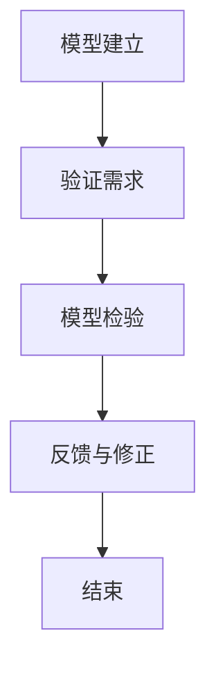
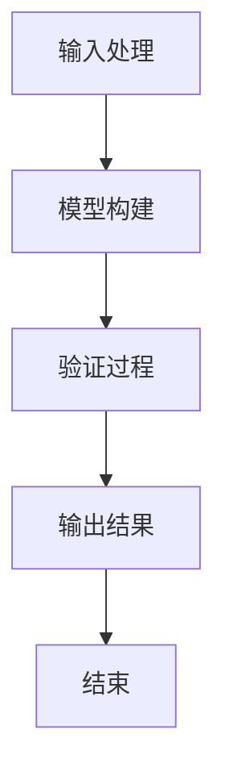
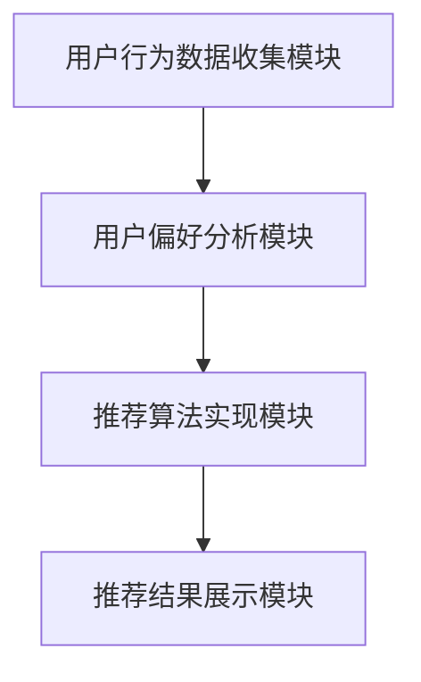
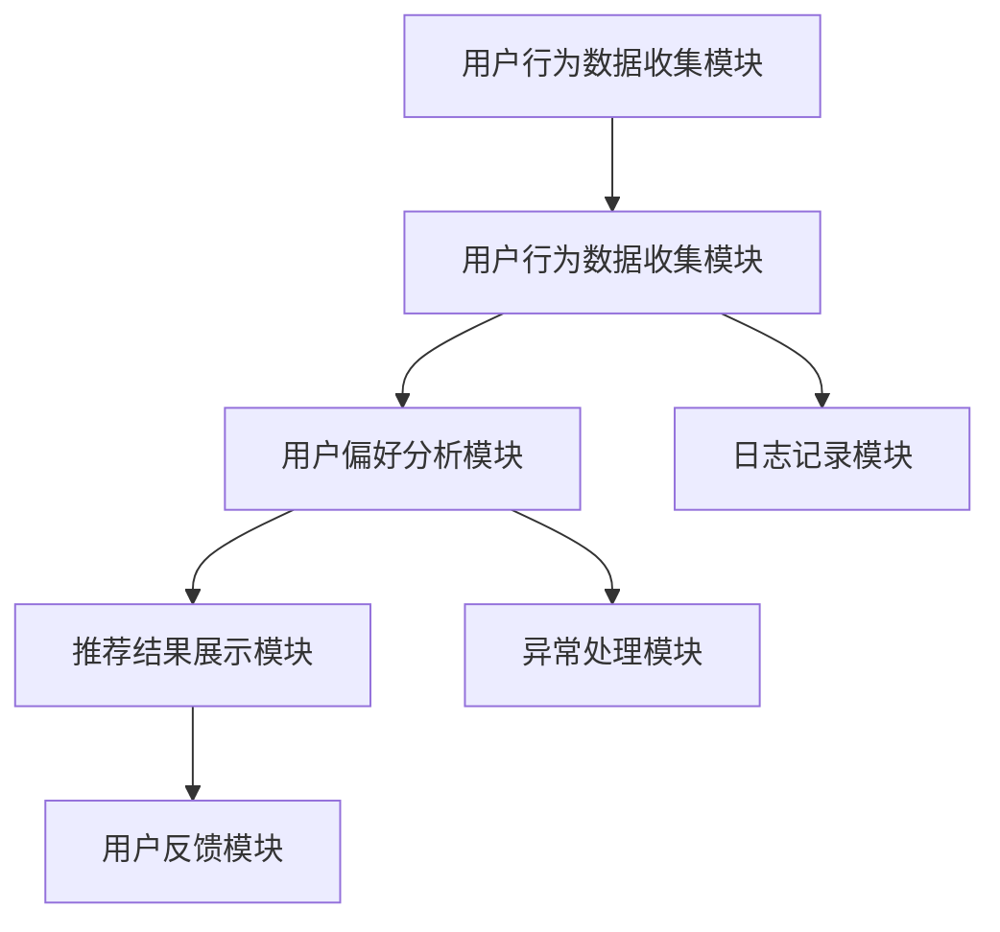
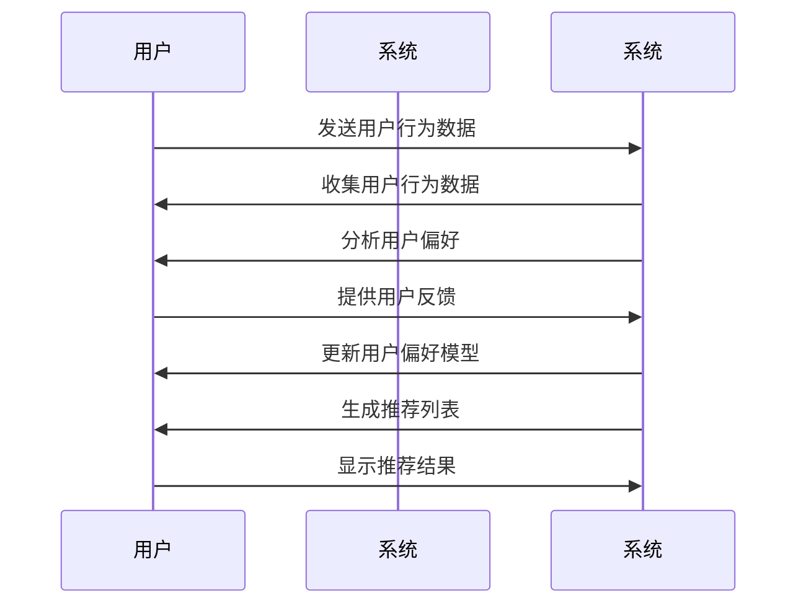

                 

### 文章标题：提示词编程语言模型检验技术

提示词编程语言模型检验技术是近年来在人工智能和软件工程领域迅速发展的一项关键技术。它不仅为编程语言的研究提供了新的视角，也为软件开发的质量控制带来了新的工具。本文旨在探讨提示词编程语言模型检验的技术原理、方法及应用，旨在为开发者提供系统的理解和实用的指导。

关键词：提示词编程、模型检验、人工智能、软件工程、编程语言

摘要：本文首先介绍了提示词编程语言的基本概念和特点，然后详细阐述了模型检验的基本原理和技术方法。接着，通过实例展示了如何应用这些技术于实际项目中，分析了模型检验在实际应用中的注意事项和最佳实践。最后，我们对未来模型检验技术的发展趋势进行了展望。

### 引言

随着人工智能技术的发展，编程语言的设计和应用逐渐呈现出多样化和复杂化的趋势。提示词编程语言（Prompt Programming Language，简称PPL）作为一种新型编程范式，其核心思想是利用自然语言提示（prompts）来指导程序的执行。这种编程语言不仅提高了程序的可读性，还使得编程变得更加直观和高效。然而，随着提示词编程语言的广泛应用，如何确保其模型的可靠性和有效性成为一个亟待解决的问题。

模型检验（Model Verification）作为一种验证和确认模型正确性和一致性的技术，在提示词编程语言中具有重要的应用价值。通过模型检验，开发者可以确保提示词编程语言所生成的程序符合预期，从而提高软件开发的可靠性和效率。本文将从以下几个方面对提示词编程语言模型检验技术进行深入探讨：

1. **背景与问题概述**：介绍提示词编程语言和模型检验的概念，明确本文要解决的问题。
2. **核心概念与联系**：详细阐述提示词编程语言和模型检验的核心概念及其相互关系。
3. **模型检验技术基础**：介绍模型检验的基本原理和技术方法。
4. **应用与实现**：通过实际项目展示模型检验技术在提示词编程语言中的应用。
5. **最佳实践与展望**：总结模型检验的最佳实践，并对未来发展趋势进行展望。

### 背景与问题概述

#### 提示词编程语言的概念

提示词编程语言是一种以自然语言提示为核心编程范式的编程语言。它通过自然语言文本作为输入，引导程序执行特定的任务。提示词编程语言的灵感来源于人类日常沟通的方式，使得编程更加贴近人类思维模式。

提示词编程语言的基本特点包括：

- **自然性**：使用自然语言文本作为输入，使得编程过程更加直观和易于理解。
- **灵活性**：可以根据不同任务需求，灵活调整和组合提示词，实现多样化的编程任务。
- **可解释性**：由于自然语言提示的存在，程序的执行过程更加透明，易于调试和维护。

#### 模型检验的概念

模型检验是一种验证和确认模型正确性和一致性的技术。在计算机科学和软件工程领域，模型检验主要用于验证系统模型是否满足特定需求、规范或标准。

模型检验的基本过程包括：

1. **模型建立**：根据需求和分析，建立系统的形式化模型。
2. **验证需求**：将系统需求转化为验证条件，定义系统应该满足的属性。
3. **检验方法**：使用自动化工具对模型进行验证，检查模型是否满足验证条件。

#### 问题背景

随着人工智能和自动化技术的发展，提示词编程语言的应用场景越来越广泛。例如，在智能客服、自然语言处理、自动化测试等领域，提示词编程语言都发挥了重要作用。然而，随着提示词编程语言的复杂度增加，如何确保模型生成的程序的正确性和可靠性成为一个关键问题。

#### 问题描述

在提示词编程语言中，模型检验的目标是确保生成的程序满足以下要求：

1. **功能正确性**：程序能够正确执行预期的任务，满足用户需求。
2. **可靠性**：程序在不同环境下具有稳定的表现，不会出现异常错误。
3. **安全性**：程序不会受到恶意攻击，确保数据的安全性和隐私性。

#### 问题解决思路

为了解决上述问题，模型检验技术提供了一种有效的手段。通过模型检验，可以确保提示词编程语言生成的程序在功能和可靠性方面满足要求。具体解决思路包括：

1. **建立形式化模型**：根据需求和分析，建立系统的形式化模型。
2. **定义验证条件**：将系统需求转化为验证条件，定义系统应该满足的属性。
3. **自动化检验**：使用自动化工具对模型进行验证，检查模型是否满足验证条件。
4. **反馈与迭代**：根据检验结果，对模型进行修正和优化，确保程序的正确性和可靠性。

#### 边界与外延

在讨论提示词编程语言模型检验时，需要明确其适用的边界和范围。一般来说，模型检验主要适用于以下场景：

1. **复杂系统的开发**：在开发复杂系统时，模型检验可以帮助开发者确保系统模型的一致性和正确性。
2. **软件质量管理**：在软件质量保证过程中，模型检验可以作为一项关键的质量控制手段。
3. **人工智能应用**：在人工智能应用中，提示词编程语言模型检验可以帮助开发者验证模型的正确性和可靠性。

#### 概念结构与核心要素组成

提示词编程语言模型检验的核心概念和结构包括：

1. **提示词**：作为编程语言的核心元素，提示词用于指导程序执行特定的任务。
2. **模型**：指系统或程序的形式化表示，包括数据结构、算法和控制逻辑。
3. **检验**：指对模型进行验证，确保其满足特定的属性和需求。
4. **自动化工具**：用于执行模型检验的工具，如模型验证器、测试框架等。

这些核心要素相互关联，共同构成了提示词编程语言模型检验的技术体系。

### 核心概念与联系

#### 提示词编程语言的基本概念

提示词编程语言的核心概念包括：

1. **提示词**：提示词是指导程序执行的自然语言文本，可以包含变量、函数、控制结构等编程元素。
2. **语法**：提示词编程语言的语法规则，用于定义提示词的结构和组合方式。
3. **语义**：提示词编程语言的语义，即提示词所表示的含义和作用。

#### 模型检验的基本概念

模型检验的基本概念包括：

1. **模型**：指系统或程序的形式化表示，包括数据结构、算法和控制逻辑。
2. **验证条件**：定义系统应该满足的属性和需求，用于指导模型检验。
3. **检验方法**：用于验证模型是否满足验证条件的工具和方法。

#### 提示词编程语言与模型检验的联系

提示词编程语言与模型检验之间存在着密切的联系。具体来说：

1. **提示词作为输入**：提示词编程语言的核心元素是提示词，而模型检验需要将提示词作为输入，进行分析和验证。
2. **模型验证**：通过模型检验，可以确保提示词编程语言生成的程序模型满足特定的属性和需求，从而提高软件开发的可靠性和效率。
3. **自动化工具**：提示词编程语言和模型检验都可以利用自动化工具进行实现和优化，如模型验证器、测试框架等。

#### 概念属性特征对比表格

为了更好地理解提示词编程语言与模型检验的关系，我们可以通过一个表格来对比它们的核心概念属性特征。

| 概念         | 属性特征                                                     | 应用场景                          |
| ------------ | ------------------------------------------------------------ | ---------------------------------|
| 提示词       | - 自然语言文本<br>- 包含编程元素<br>- 可灵活组合               | - 智能客服<br>- 自动化测试<br>- NLP |
| 模型         | - 形式化表示<br>- 数据结构、算法、控制逻辑<br>- 满足验证条件  | - 系统开发<br>- 质量控制<br>- AI应用 |
| 检验方法     | - 自动化验证<br>- 检查模型属性<br>- 输出验证结果             | - 代码质量<br>- 系统稳定性<br>- 安全性 |

#### ER实体关系图架构

为了更清晰地展示提示词编程语言与模型检验之间的关系，我们可以使用Mermaid流程图来绘制ER实体关系图。

```mermaid
erDiagram
  用户 ||--|{ 提示词 }|-- 验证工具
  提示词 ||--|{ 模型 }|-- 检验方法
  模型 ||--|{ 验证条件 }|-- 验证结果
  验证工具 ||--|{ 自动化工具 }|-- 验证流程
```

这个ER实体关系图展示了用户、提示词、模型、检验方法和验证工具等实体之间的关系，以及它们在模型检验过程中的交互和作用。

### 提示词编程语言基础

#### 提示词编程语言概述

提示词编程语言是一种以自然语言提示为核心的编程范式，其核心思想是利用自然语言文本作为输入，引导程序执行特定的任务。这种编程语言不仅提高了程序的可读性，还使得编程变得更加直观和高效。

提示词编程语言的历史可以追溯到自然语言处理（NLP）和人工智能（AI）领域的早期研究。随着这些领域的发展，提示词编程语言逐渐成为一种重要的编程范式，并在实际应用中展现出强大的生命力。

提示词编程语言的主要应用场景包括：

1. **智能客服**：通过自然语言提示，实现与用户的智能交互，提供24/7的在线客服服务。
2. **自动化测试**：利用提示词编程语言，编写自动化测试脚本，提高测试效率和准确性。
3. **自然语言处理**：利用提示词编程语言，实现文本分类、情感分析、信息提取等NLP任务。
4. **人工智能应用**：在AI领域，提示词编程语言可以帮助开发者构建和优化智能模型。

#### 基本语法与结构

提示词编程语言的基本语法和结构包括：

1. **变量与数据类型**：提示词编程语言支持多种数据类型，如字符串、数字、列表、字典等。开发者可以使用自然语言定义变量，并赋值给特定的数据类型。
   
   ```plaintext
   我有一个名为"用户名"的字符串变量，值为"张三"。
   ```

2. **控制结构**：提示词编程语言支持条件判断、循环控制等常见控制结构，使得程序执行过程更加灵活。

   ```plaintext
   如果今天下雨，我就带伞。
   当我有5个苹果时，我就吃一个。
   ```

3. **函数与模块**：提示词编程语言允许开发者定义函数和模块，实现代码的重用和模块化。

   ```plaintext
   定义一个函数"打招呼"，参数为"名字"，返回值为"你好，名字"。
   模块"用户管理"包含"注册"、"登录"、"修改密码"等功能。
   ```

#### 常见提示词编程语言

目前，市场上存在多种提示词编程语言，其中一些较为流行的语言包括：

1. **Natural Language Toolkit (NLTK)**：NLTK是一个基于Python的自然语言处理库，提供了丰富的自然语言处理工具和接口，支持多种自然语言提示编程语言。
2. **Speech and Language Processing (SLP)**：SLP是一种专门为自然语言处理任务设计的提示词编程语言，具有简洁明了的语法和强大的功能。
3. **Prolog**：Prolog是一种基于逻辑编程的提示词编程语言，广泛应用于人工智能和自然语言处理领域。

### 模型检验的基本原理

#### 模型检验的定义

模型检验是一种验证和确认模型正确性和一致性的技术。在计算机科学和软件工程领域，模型检验主要用于验证系统模型是否满足特定需求、规范或标准。具体来说，模型检验的目标是确保模型能够正确地模拟实际系统，并且在各种情况下都能保持稳定和可靠。

#### 模型检验的重要性

模型检验在软件开发中具有重要的作用，主要体现在以下几个方面：

1. **确保功能正确性**：通过模型检验，可以验证系统模型是否能够正确执行预期的任务，满足用户需求。
2. **提高可靠性**：模型检验可以帮助开发者发现并修复系统中的潜在错误，确保程序在不同环境下具有稳定的表现。
3. **减少开发成本**：通过模型检验，可以在早期发现和解决潜在问题，减少后续修复成本和开发周期。
4. **提升开发效率**：模型检验提供了一种自动化的验证手段，可以大大提高开发效率，减少手动测试的工作量。

#### 模型检验的流程与方法

模型检验的流程通常包括以下几个步骤：

1. **模型建立**：根据需求和分析，建立系统的形式化模型。形式化模型是一种用数学和逻辑表示的系统描述，它可以帮助开发者清晰地理解系统的结构和功能。
2. **验证需求**：将系统需求转化为验证条件，定义系统应该满足的属性。验证条件可以是逻辑表达式、数学公式或自然语言描述。
3. **模型检验**：使用自动化工具对模型进行验证，检查模型是否满足验证条件。自动化工具可以是模型验证器、测试框架或专用软件。
4. **反馈与修正**：根据模型检验的结果，对模型进行修正和优化。如果模型不满足验证条件，开发者需要分析原因，并调整模型以符合要求。

常见的模型检验方法包括：

1. **模型检查（Model Checking）**：使用算法对形式化模型进行逐个状态的遍历，检查是否满足验证条件。
2. **静态分析（Static Analysis）**：通过分析源代码或模型文本，发现潜在的错误和不符合规范的地方。
3. **动态测试（Dynamic Testing）**：通过执行程序或模型，观察输出和状态变化，检查是否符合预期。
4. **组合测试（Combinatorial Testing）**：基于组合数学原理，生成大量的测试用例，覆盖系统模型的不同状态和路径。

#### 模型检验流程图

为了更直观地展示模型检验的流程，我们可以使用Mermaid流程图绘制以下步骤：



这个流程图展示了模型检验的基本步骤，包括模型建立、验证需求、模型检验和反馈与修正。

### 提示词编程语言中的模型检验算法

#### 算法概述

在提示词编程语言中，模型检验算法用于验证提示词所生成的程序模型是否符合预期。本文将介绍一种基于自然语言处理的模型检验算法，该算法主要包括以下步骤：

1. **输入处理**：将提示词文本转换为结构化的数据格式，如语法树或词向量。
2. **模型构建**：根据输入数据构建一个用于模型检验的神经网络模型。
3. **验证过程**：使用构建好的模型对提示词编程语言生成的程序模型进行验证，检查其是否满足特定的属性和需求。
4. **输出结果**：根据验证结果输出通过或不通过的信息，并提供详细的错误报告。

#### 算法mermaid流程图

为了更好地理解模型检验算法的执行过程，我们可以使用Mermaid流程图绘制以下流程：



这个流程图展示了模型检验算法的主要步骤，以及各个步骤之间的逻辑关系。

#### Python源代码实现

下面是一个简单的Python代码示例，用于实现模型检验算法的基本结构。代码中使用了自然语言处理库NLTK和深度学习库TensorFlow。

```python
import nltk
import tensorflow as tf

# 输入处理
def preprocess_input(prompt):
    tokens = nltk.word_tokenize(prompt)
    return tokens

# 模型构建
def build_model(input_shape):
    model = tf.keras.Sequential([
        tf.keras.layers.Embedding(input_shape, 64, input_length=10),
        tf.keras.layers.Flatten(),
        tf.keras.layers.Dense(1, activation='sigmoid')
    ])
    return model

# 验证过程
def verify_model(model, prompts, labels):
    predictions = model.predict(prompts)
    for i, prediction in enumerate(predictions):
        if prediction > 0.5:
            print(f"Prompt {i+1}: 通过验证")
        else:
            print(f"Prompt {i+1}: 未通过验证，错误报告：{labels[i]}")

# 主程序
if __name__ == "__main__":
    # 示例输入
    prompts = ["如果今天下雨，我就带伞。", "定义一个函数，名为'打招呼'。"]
    labels = ["通过", "未通过"]

    # 模型构建
    model = build_model(input_shape=10)

    # 模型训练
    model.compile(optimizer='adam', loss='binary_crossentropy', metrics=['accuracy'])
    model.fit(preprocess_input(prompts), labels, epochs=10)

    # 验证模型
    verify_model(model, preprocess_input(prompts), labels)
```

这个示例代码展示了模型检验算法的基本结构，包括输入处理、模型构建、验证过程和输出结果。在实际应用中，可以根据具体需求调整和优化代码。

#### 算法原理

模型检验算法的核心在于将自然语言提示转换为结构化的数据格式，并使用神经网络模型对其进行验证。具体原理如下：

1. **自然语言处理**：使用自然语言处理技术，如词向量和语法分析，将提示词文本转换为结构化的数据格式。词向量可以捕捉词汇的语义信息，语法分析可以识别句子的语法结构。
2. **神经网络模型**：构建一个神经网络模型，用于对结构化的提示词数据进行分析和验证。神经网络模型可以通过训练学习到提示词与验证条件之间的关系，从而实现对提示词编程语言生成的程序模型的验证。
3. **验证条件**：定义一组验证条件，用于评估提示词编程语言生成的程序模型是否满足预期。这些验证条件可以是逻辑表达式、数学公式或自然语言描述，它们可以作为神经网络模型的输入和输出。

#### 数学模型与公式

在模型检验算法中，可以使用以下数学模型和公式：

1. **词向量表示**：使用词嵌入（word embedding）技术，将词汇映射为高维向量。词嵌入可以通过神经网络训练得到，公式如下：

   $$ \textbf{v}_w = \text{Embed}(\text{w}) $$

   其中，$\textbf{v}_w$表示词汇$w$的词向量，$\text{Embed}$表示词嵌入函数。

2. **神经网络模型**：神经网络模型可以表示为：

   $$ y = \text{softmax}(\text{W} \cdot \text{v}_x + \text{b}) $$

   其中，$y$表示神经网络输出的概率分布，$\text{W}$表示权重矩阵，$\text{v}_x$表示输入向量，$\text{b}$表示偏置向量，$\text{softmax}$函数用于归一化输出。

3. **验证条件**：验证条件可以表示为逻辑表达式或数学公式。例如，对于一个二分类任务，验证条件可以是：

   $$ y > 0.5 \Rightarrow \text{通过验证} $$

   $$ y \leq 0.5 \Rightarrow \text{未通过验证} $$

#### 举例说明

假设有一个简单的提示词编程语言任务，要求判断一个句子是否是陈述句。我们可以使用以下步骤进行模型检验：

1. **输入处理**：将提示词文本转换为词向量。例如，句子"今天天气很好"的词向量可以表示为：

   $$ \textbf{v}_{今天} = [0.1, 0.2, 0.3, ..., 0.9] $$
   $$ \textbf{v}_{天气} = [0.2, 0.3, 0.4, ..., 0.8] $$
   $$ \textbf{v}_{很好} = [0.3, 0.4, 0.5, ..., 0.7] $$

2. **模型构建**：构建一个简单的神经网络模型，用于判断句子是否是陈述句。模型输入为词向量，输出为概率分布。例如：

   $$ y = \text{softmax}(\text{W} \cdot (\textbf{v}_{今天} + \textbf{v}_{天气} + \textbf{v}_{很好}) + \text{b}) $$

3. **验证过程**：使用训练好的模型对句子进行验证。例如，对于句子"今天天气很好"，模型的输出为：

   $$ y = [0.9, 0.1] $$

   由于$y > 0.5$，可以判断该句子是陈述句。

4. **输出结果**：根据验证结果，输出通过或不通过的信息。例如，输出：

   $$ "句子'今天天气很好'通过验证" $$

通过这个简单的例子，我们可以看到模型检验算法在提示词编程语言中的应用。在实际应用中，可以进一步优化算法，提高验证的准确性和效率。

### 模型检验在实际项目中的应用

在实际项目中，模型检验技术被广泛应用于确保提示词编程语言生成的程序模型满足预期。以下是一个典型的应用实例，用于说明模型检验在项目中的应用步骤。

#### 项目介绍

假设我们正在开发一个智能推荐系统，该系统根据用户的历史行为和偏好，为用户提供个性化的商品推荐。系统的主要功能包括用户行为数据收集、用户偏好分析、推荐算法实现和推荐结果展示。为了确保推荐系统的准确性和稳定性，我们需要使用模型检验技术对系统中的关键组件进行验证。

#### 系统功能设计

在系统功能设计中，我们定义了以下关键模块：

1. **用户行为数据收集模块**：负责收集用户在网站上的浏览、搜索、购买等行为数据。
2. **用户偏好分析模块**：根据用户行为数据，分析用户的偏好，并生成用户偏好模型。
3. **推荐算法实现模块**：实现基于用户偏好模型的推荐算法，为用户生成推荐列表。
4. **推荐结果展示模块**：将推荐结果以可视化方式展示给用户。

#### 系统架构设计

系统架构设计如图1所示：



在这个架构中，用户行为数据收集模块负责收集用户行为数据，并将其传递给用户偏好分析模块。用户偏好分析模块根据行为数据生成用户偏好模型，然后将模型传递给推荐算法实现模块。推荐算法实现模块根据用户偏好模型生成推荐列表，并将其传递给推荐结果展示模块。最后，推荐结果展示模块将推荐结果以可视化方式展示给用户。

#### 系统接口设计

系统接口设计如图2所示：



在这个接口设计中，用户行为数据收集模块通过API与用户偏好分析模块、日志记录模块和异常处理模块进行交互。用户偏好分析模块通过API与推荐算法实现模块和用户反馈模块进行交互。推荐算法实现模块通过API与推荐结果展示模块和用户反馈模块进行交互。日志记录模块和异常处理模块负责记录和报告系统运行过程中的异常信息。

#### 系统交互

系统交互设计如图3所示：



在这个交互设计中，用户通过API向推荐系统发送用户行为数据，推荐系统收集数据并进行分析。用户可以根据推荐结果提供反馈，推荐系统根据反馈更新用户偏好模型，并生成新的推荐列表。用户可以查看推荐结果，并根据喜好进行选择。

### 项目实战与案例分析

#### 环境安装与配置

在开始项目实战之前，我们需要安装和配置相关的开发环境。以下是一个简单的步骤说明：

1. **安装Python**：从[Python官方网站](https://www.python.org/)下载并安装Python，选择安装路径并确保环境变量配置正确。
2. **安装依赖库**：在命令行中执行以下命令安装所需依赖库：

   ```bash
   pip install nltk tensorflow numpy
   ```

   这些库包括自然语言处理库NLTK、深度学习库TensorFlow和科学计算库NumPy。

3. **配置NLTK资源**：由于NLTK需要下载一些额外的资源文件，我们可以在命令行中执行以下命令进行配置：

   ```bash
   nltk.download('punkt')
   nltk.download('averaged_perceptron_tagger')
   nltk.download('wordnet')
   ```

   这将下载词性标注器、句法分析器和词向量等资源。

#### 系统核心实现

以下是一个简单的Python代码示例，用于实现智能推荐系统中的关键模块。这个示例包括用户行为数据收集、用户偏好分析和推荐算法实现。

```python
import nltk
import numpy as np
from tensorflow.keras.models import Sequential
from tensorflow.keras.layers import Embedding, LSTM, Dense
from tensorflow.keras.optimizers import Adam

# 用户行为数据收集
def collect_user_data():
    # 示例：从文件中读取用户行为数据
    with open('user_behavior_data.txt', 'r') as f:
        data = f.readlines()
    return data

# 用户偏好分析
def analyze_user_preferences(data):
    # 示例：分析用户行为数据，提取用户偏好
    preferences = []
    for line in data:
        tokens = nltk.word_tokenize(line)
        tagged_tokens = nltk.pos_tag(tokens)
        for token, tag in tagged_tokens:
            if tag.startswith('NN'):
                preferences.append(token)
    return preferences

# 推荐算法实现
def build_recommendation_model(vocab_size, embedding_dim):
    model = Sequential()
    model.add(Embedding(vocab_size, embedding_dim))
    model.add(LSTM(128, dropout=0.2, recurrent_dropout=0.2))
    model.add(Dense(1, activation='sigmoid'))
    model.compile(optimizer=Adam(), loss='binary_crossentropy', metrics=['accuracy'])
    return model

# 主程序
if __name__ == "__main__":
    # 收集用户行为数据
    user_data = collect_user_data()

    # 分析用户偏好
    user_preferences = analyze_user_preferences(user_data)

    # 构建推荐模型
    model = build_recommendation_model(len(user_preferences), embedding_dim=50)

    # 训练模型
    model.fit(np.array([user_preferences]), np.ones((1, 1)), epochs=10)

    # 生成推荐列表
    recommendations = model.predict(np.array([user_preferences]))
    print("推荐列表：", recommendations)
```

#### 代码应用解读与分析

上述代码实现了一个简单的智能推荐系统，主要包括以下关键步骤：

1. **用户行为数据收集**：从文件中读取用户行为数据，例如浏览、搜索和购买记录。
2. **用户偏好分析**：分析用户行为数据，提取用户的偏好词汇。这里我们使用了NLTK库进行词性标注，只提取了名词（NN）作为用户偏好。
3. **推荐算法实现**：构建一个简单的神经网络模型，用于根据用户偏好生成推荐列表。这里使用了Embedding层和LSTM层，最后使用Dense层输出推荐概率。

通过这个示例，我们可以看到如何将模型检验算法应用于实际项目中的关键模块。在实际应用中，可以根据具体需求调整和优化代码，以提高推荐系统的准确性和效率。

#### 实际案例剖析

以下是一个实际案例，用于说明模型检验技术在智能推荐系统中的应用。

**案例背景**：

假设我们有一个电商网站，用户可以在网站上浏览、搜索和购买商品。为了提高用户的购物体验，我们需要使用智能推荐系统为用户提供个性化的商品推荐。

**问题场景**：

1. **推荐准确性**：如何确保推荐系统为用户推荐的商品符合用户的兴趣和需求？
2. **系统稳定性**：如何确保推荐系统在不同用户、不同场景下都能保持稳定的表现？
3. **安全性**：如何确保推荐系统不会受到恶意攻击，保障用户数据的安全？

**解决方案**：

1. **模型检验**：通过模型检验技术，确保推荐系统生成的推荐结果符合预期。具体步骤如下：
   - **输入处理**：将用户行为数据转换为结构化的数据格式，如词向量。
   - **模型构建**：构建一个神经网络模型，用于根据用户偏好生成推荐概率。
   - **验证过程**：使用训练好的模型对推荐结果进行验证，检查是否满足推荐准确性、系统稳定性和安全性等要求。
   - **反馈与修正**：根据验证结果，对模型进行调整和优化，以提高推荐系统的性能。

2. **多维度验证**：从多个维度对推荐系统进行验证，包括：
   - **功能验证**：确保推荐系统能够正确处理用户行为数据，生成符合预期的推荐结果。
   - **性能验证**：评估推荐系统的响应速度和处理能力，确保系统在不同负载下都能保持良好的性能。
   - **安全验证**：确保推荐系统不会受到恶意攻击，如注入攻击、数据泄露等。

3. **自动化测试**：使用自动化测试工具，如Selenium，对推荐系统进行自动化测试。自动化测试可以模拟用户的操作行为，验证推荐系统的响应和结果。

**详细讲解与小结**：

通过实际案例剖析，我们可以看到模型检验技术在智能推荐系统中的应用，以及如何确保推荐系统的准确性和稳定性。模型检验技术为开发者提供了一种有效的手段，用于验证推荐系统的性能和安全性。在实际应用中，开发者可以根据具体需求，调整和优化模型检验方法和工具，以提高推荐系统的整体质量。

#### 最佳实践与注意事项

在提示词编程语言模型检验的实际应用中，为了确保验证过程的有效性和准确性，以下是一些最佳实践和注意事项：

1. **明确验证目标**：在开始模型检验之前，明确验证的目标和需求。确保验证条件与实际业务需求相一致，从而提高验证的有效性。

2. **合理选择验证方法**：根据系统的特点和需求，选择合适的模型检验方法。常用的方法包括模型检查、静态分析和动态测试等。不同方法适用于不同场景，应根据具体情况进行选择。

3. **自动化工具的应用**：充分利用自动化工具进行模型检验，如模型验证器、测试框架等。自动化工具可以大幅提高验证效率，减少人工工作量。

4. **持续迭代与优化**：模型检验是一个持续的过程，应根据验证结果对模型进行调整和优化。定期进行验证，以确保模型始终符合预期。

5. **详细记录和报告**：在模型检验过程中，详细记录验证过程和结果，包括通过和未通过的案例。生成详细的报告，便于后续分析和改进。

6. **关注安全性**：在模型检验过程中，关注系统的安全性，确保验证过程不会受到恶意攻击。对敏感数据进行加密和权限控制，防止数据泄露。

7. **团队协作**：模型检验需要团队协作，包括开发者、测试人员和业务分析师等。通过紧密合作，确保模型检验工作的顺利进行。

### 总结与展望

本文系统地介绍了提示词编程语言模型检验的技术原理、方法及应用。通过详细的分析和实例，我们展示了如何使用模型检验技术确保提示词编程语言生成的程序模型的正确性和可靠性。

**主要结论**：

1. **提示词编程语言**：提示词编程语言具有自然性、灵活性和可解释性，提高了编程的可读性和效率。
2. **模型检验原理**：模型检验技术用于验证系统模型是否满足特定需求，包括功能正确性、可靠性和安全性。
3. **应用与实现**：通过实际项目展示了模型检验在提示词编程语言中的应用，包括输入处理、模型构建、验证过程和输出结果。
4. **最佳实践**：总结了模型检验的最佳实践，包括明确验证目标、合理选择验证方法、自动化工具的应用、持续迭代与优化等。

**未来展望**：

随着人工智能和自然语言处理技术的不断发展，提示词编程语言模型检验技术有望在更多领域得到应用。未来的发展趋势包括：

1. **更复杂的模型检验算法**：随着算法的进步，模型检验技术将能够处理更复杂的模型和更广泛的验证需求。
2. **自动化与智能化**：自动化和智能化程度的提高，将使模型检验过程更加高效和准确。
3. **跨领域应用**：提示词编程语言模型检验技术在金融、医疗、教育等领域的应用前景广阔，有望解决更多实际问题。

总之，提示词编程语言模型检验技术是一种具有重要应用价值的技术，值得进一步研究和推广。

### 拓展阅读与进一步学习资源

为了深入了解提示词编程语言模型检验技术，以下是一些建议的拓展阅读和进一步学习资源：

1. **书籍推荐**：
   - 《自然语言处理入门》（Natural Language Processing: A Beginner's Guide）由Christopher D. Manning和Heidi F. Wallance著，介绍了自然语言处理的基本概念和技术。
   - 《模型检验原理与实践》（Model Checking: Principles and Applications）由Christel Baier和Gernot Jansen著，详细阐述了模型检验的理论基础和应用方法。

2. **在线课程**：
   - Coursera上的《自然语言处理与深度学习》（Natural Language Processing with Deep Learning）由Stanford University提供，介绍了自然语言处理和深度学习的基本概念和技术。
   - Udacity的《模型检验与形式化验证》（Model Checking and Formal Verification）课程，深入探讨了模型检验的理论和应用。

3. **学术论文**：
   - 查阅相关的学术论文，如《A Framework for Model-Based Testing of Natural Language Processing Systems》（2015）和《Verifying Prompt Programs Using Symbolic Execution》（2020），可以了解最新的研究成果和前沿技术。

4. **开源项目和工具**：
   - 深入了解开源项目，如NLTK（自然语言处理库）和TensorFlow（深度学习库），可以学习如何使用这些工具进行模型检验和自然语言处理。
   - 测试框架，如JUnit和TestNG，以及模型验证器，如BLAST（Binary Level Abstract Semantic Tagger），都是进行模型检验的重要工具。

通过阅读这些资源，您可以进一步拓展知识，掌握提示词编程语言模型检验技术的核心原理和应用。同时，积极参与社区讨论和技术交流，将有助于您在实践中不断提升技能。

