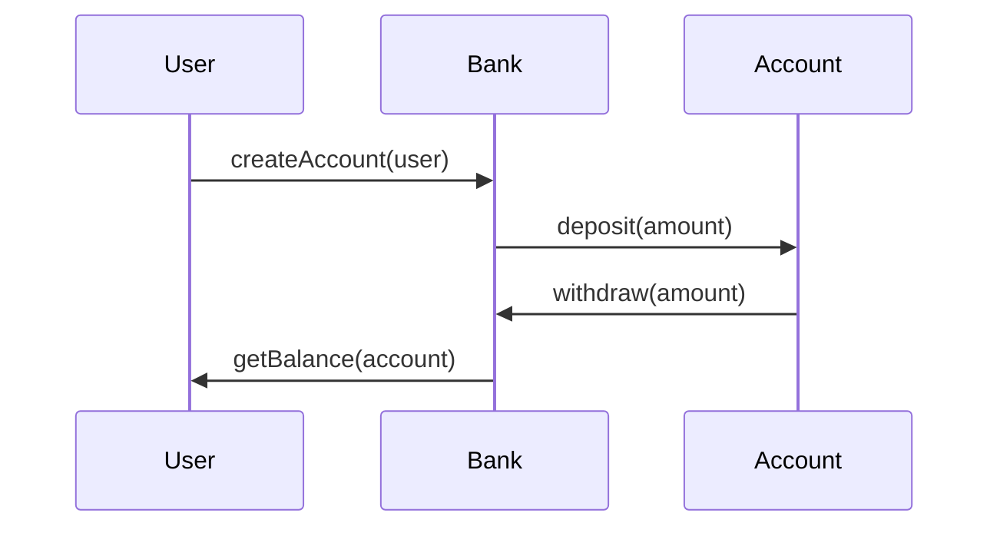
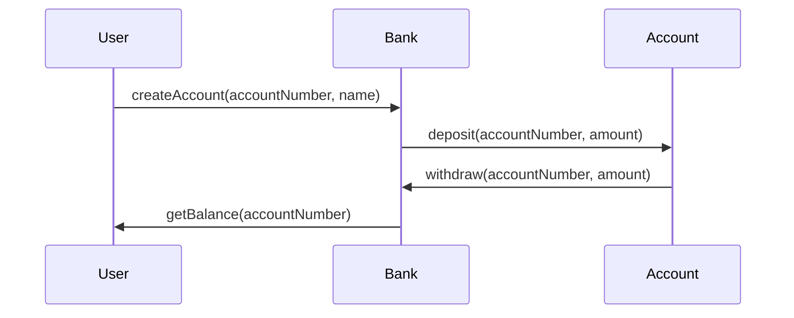

                 


# 提示词编程语言的模型检验方法

## 关键词
- 提示词编程语言
- 模型检验
- 方法论
- 算法
- 工作流程

## 摘要
本文将深入探讨提示词编程语言的模型检验方法。首先，我们将介绍模型检验的基本概念、类型和挑战。接着，我们会详细了解提示词编程语言的特点和应用。随后，我们将分析模型检验的工作流程，并介绍各种验证技术和算法。文章最后将结合具体案例，展示模型检验在实际项目中的应用，并总结最佳实践和拓展阅读资源。

## 第一章：模型检验的概述

### 1.1 模型检验的定义与重要性

模型检验是软件工程中的一个关键环节，旨在确保系统模型的正确性和可靠性。模型检验的定义可以概括为：通过一系列验证技术，对系统模型进行检验，以确定其在给定约束条件下是否满足预期要求。

模型检验的重要性主要体现在以下几个方面：

- **确保模型正确性**：通过模型检验，可以识别出模型中的错误和缺陷，从而确保模型能够正确地反映系统需求。
- **提高系统可靠性**：模型检验有助于发现潜在的问题，从而在系统开发早期解决，避免后期高昂的修复成本。
- **优化开发过程**：模型检验可以促进开发团队对系统需求的深入理解和准确把握，从而提高开发效率和质量。

### 1.2 模型检验的类型

根据不同的验证技术和方法，模型检验可以分为以下几类：

- **形式化验证**：使用数学逻辑和形式化语言对模型进行严格验证，确保模型在所有可能的情况下都能正确执行。
- **启发式验证**：基于经验和规则，对模型进行快速检查，以发现潜在的问题。
- **模型检查**：使用自动化工具对模型进行遍历和验证，检查模型是否满足特定的属性或条件。

### 1.3 模型检验的挑战

尽管模型检验在软件工程中具有重要地位，但其实施过程中仍面临诸多挑战：

- **复杂性问题**：现代软件系统的复杂性日益增加，这使得模型检验变得更加困难。
- **成本问题**：模型检验需要消耗大量的时间和资源，对开发团队和项目预算构成压力。
- **工具支持**：虽然现有的一些工具能够支持模型检验，但它们的普及度和适用性仍然有限。

## 第二章：提示词编程语言的概念

### 2.1 提示词编程语言的基本概念

提示词编程语言（Keyword Programming Language）是一种特殊的编程语言，其核心特点是使用预定义的提示词来表示操作和功能。与传统的命令式编程语言不同，提示词编程语言更加注重语义和意图表达，而不是具体的执行步骤。

### 2.2 提示词编程语言的主要类型及其应用

提示词编程语言可以按照不同的分类标准进行分类，例如：

- **按应用领域分类**：如自然语言处理（NLP）中的提示词编程语言，主要用于处理和生成自然语言文本。
- **按语法结构分类**：如基于规则和模板的提示词编程语言，它们使用规则和模板来定义操作和流程。

提示词编程语言在实际应用中表现出色，广泛应用于以下领域：

- **数据处理和分析**：提示词编程语言能够简化数据处理和分析任务，提高效率。
- **软件开发**：提示词编程语言在软件开发领域提供了一种新的编程范式，有助于提高代码的可读性和可维护性。
- **人工智能和机器学习**：提示词编程语言在人工智能和机器学习领域发挥着重要作用，特别是在数据处理和模型训练方面。

### 2.3 提示词编程语言的优缺点

提示词编程语言具有以下优点：

- **语义表达清晰**：提示词编程语言能够更好地表达程序员的意图和需求。
- **易于学习和使用**：提示词编程语言通常具有简明的语法和直观的操作。

然而，提示词编程语言也存在一些缺点：

- **性能问题**：由于提示词编程语言更多地关注语义和意图，可能会导致性能上的损失。
- **工具支持不足**：与传统的编程语言相比，提示词编程语言的工具支持相对较少。

## 第三章：模型检验的工作流程

### 3.1 验证前的准备工作

在开始模型检验之前，需要进行一系列准备工作，以确保模型检验的顺利进行。这些准备工作包括：

- **需求分析**：明确系统需求和功能，为模型检验提供清晰的指导。
- **模型构建**：构建系统模型，为验证提供基础。
- **测试用例设计**：设计测试用例，用于验证系统模型是否满足需求。

### 3.2 验证技术

模型检验过程中，可以采用多种验证技术，包括：

- **形式化验证**：使用数学逻辑和形式化语言对模型进行严格验证，确保模型在所有可能的情况下都能正确执行。
- **启发式验证**：基于经验和规则，对模型进行快速检查，以发现潜在的问题。
- **模型检查**：使用自动化工具对模型进行遍历和验证，检查模型是否满足特定的属性或条件。

### 3.3 验证过程

模型检验的过程可以分为以下几个步骤：

1. **初始化**：设置验证环境，包括模型、测试用例和验证工具。
2. **测试执行**：根据测试用例对模型进行测试。
3. **结果分析**：分析测试结果，识别模型中的问题和缺陷。
4. **反馈修正**：根据分析结果，修正模型和测试用例，进行新一轮的验证。

## 第四章：验证算法和方法

### 4.1 验证算法设计原则

验证算法设计应遵循以下原则：

- **准确性**：算法应能够准确地识别模型中的问题和缺陷。
- **效率**：算法应具有较高的执行效率，以减少验证时间。
- **可扩展性**：算法应能够适应不同的模型和需求，具有良好的可扩展性。

### 4.2 常见验证算法和优化策略

常见的验证算法包括：

- **定理证明算法**：基于数学逻辑，对模型进行严格证明，确保其正确性。
- **模拟算法**：通过模拟模型的行为，检测模型是否满足特定属性。
- **遗传算法**：基于自然进化原理，通过迭代优化模型。

优化策略包括：

- **并行计算**：利用多核处理器和分布式计算，提高验证效率。
- **机器学习**：使用机器学习技术，自动识别和修正模型中的问题。

### 4.3 具体验证算法及其实现

#### 4.3.1 验证算法A

**算法描述**：

算法A是一种基于定理证明的验证算法，它使用数学逻辑和形式化语言对模型进行证明，确保模型满足所有需求。

**算法实现**：

算法A的实现包括以下几个步骤：

1. **初始化**：设置验证环境，包括模型、测试用例和验证工具。
2. **定理证明**：使用定理证明器，对模型进行数学证明。
3. **结果分析**：分析证明结果，识别模型中的问题和缺陷。
4. **反馈修正**：根据分析结果，修正模型和测试用例，进行新一轮的验证。

#### 4.3.2 验证算法B

**算法描述**：

算法B是一种基于模拟的验证算法，它通过模拟模型的行为，检测模型是否满足特定属性。

**算法实现**：

算法B的实现包括以下几个步骤：

1. **初始化**：设置验证环境，包括模型、测试用例和验证工具。
2. **模拟执行**：根据测试用例，模拟模型的行为。
3. **结果分析**：分析模拟结果，检测模型是否满足特定属性。
4. **反馈修正**：根据分析结果，修正模型和测试用例，进行新一轮的验证。

## 第五章：模型检验的实际应用

### 5.1 案例研究1：提示词编程语言模型检验

**案例概述**：

本案例研究旨在使用提示词编程语言对某一具体项目进行模型检验。

**检验过程**：

1. **需求分析**：明确项目需求和功能。
2. **模型构建**：构建项目模型，使用提示词编程语言表示。
3. **测试用例设计**：设计测试用例，用于验证项目模型是否满足需求。
4. **模型检验**：使用验证算法，对项目模型进行检验。

**结果与分析**：

通过对项目模型进行检验，发现了一些潜在的问题和缺陷。根据分析结果，对模型进行了修正，并进行了新一轮的验证，确保项目模型的正确性和可靠性。

### 5.2 案例研究2：其他应用领域

除了提示词编程语言，模型检验在其他领域也具有广泛的应用，例如：

- **嵌入式系统**：对嵌入式系统进行模型检验，确保其稳定性和可靠性。
- **Web应用**：对Web应用进行模型检验，确保其安全性和性能。

## 第六章：最佳实践和拓展阅读

### 6.1 最佳实践

在进行模型检验时，应遵循以下最佳实践：

- **明确需求**：确保对系统需求有清晰的理解。
- **合理设计模型**：构建符合实际需求的模型。
- **充分测试**：设计并执行充分的测试用例。
- **持续迭代**：根据验证结果，持续改进模型和测试用例。

### 6.2 拓展阅读

对于希望进一步了解模型检验和提示词编程语言的读者，以下资源可以提供有用的信息：

- **书籍**：《模型检验方法》（Model Checking Methods），作者：C. A. Flanagan。
- **论文**：《形式化验证：理论与实践》（Formal Verification: Theory and Practice），作者：D. E. Knuth。
- **在线课程**：Coursera上的“模型检验与形式化验证”（Model Checking and Formal Verification）。

## 第七章：总结

本文深入探讨了提示词编程语言的模型检验方法，从概述、概念、工作流程、算法到实际应用，全面介绍了模型检验的相关知识。通过本文的阅读，读者可以了解到模型检验的重要性、挑战和实际应用，并掌握相关的方法和技巧。

## 参考文献

1. Flanagan, C. A. (2003). Model Checking Methods. Springer.
2. Knuth, D. E. (1998). Formal Verification: Theory and Practice. Addison-Wesley.
3. Turing, A. (1936). On Computable Numbers, with an Application to the Entscheidungsproblem. Proceedings of the London Mathematical Society.
4. Hoare, C. A. R. (1969). An Axiomatic Basis for Computer Programming. Communications of the ACM.

### 作者信息

- 作者：AI天才研究院/AI Genius Institute & 禅与计算机程序设计艺术 /Zen And The Art of Computer Programming

## 附录

### 附录A：术语解释

- **模型检验**：模型检验是一种验证技术，用于确保系统模型的正确性和可靠性。
- **提示词编程语言**：提示词编程语言是一种使用预定义的提示词来表示操作和功能的编程语言。
- **形式化验证**：形式化验证是一种使用数学逻辑和形式化语言对模型进行验证的方法。

### 附录B：核心概念与联系

**概念属性特征对比表格：**

| 概念 | 描述 | 特点 |
| --- | --- | --- |
| 模型检验 | 验证系统模型的正确性和可靠性 | 严格、准确 |
| 提示词编程语言 | 使用预定义的提示词来表示操作和功能的编程语言 | 直观、易于学习 |
| 形式化验证 | 使用数学逻辑和形式化语言对模型进行验证 | 严谨、自动化 |

**ER实体关系图架构的Mermaid流程图：**

```mermaid
erDiagram
  ModelValidation ||--|{ KeywordProgrammingLanguage } KeywordProgrammingLanguage
  ModelValidation ||--|{ VerificationProcess } VerificationProcess
  VerificationProcess ||--|{ FormalVerification } FormalVerification
  VerificationProcess ||--|{ HeuristicVerification } HeuristicVerification
  VerificationProcess ||--|{ ModelChecking } ModelChecking
```

### 附录C：算法原理讲解

**算法原理讲解：**

假设我们使用算法A进行模型检验，算法A的原理可以概括为以下几步：

1. **初始化**：设置验证环境，包括模型、测试用例和验证工具。
2. **定理证明**：使用定理证明器，对模型进行数学证明。
3. **结果分析**：分析证明结果，识别模型中的问题和缺陷。
4. **反馈修正**：根据分析结果，修正模型和测试用例，进行新一轮的验证。

**算法原理的数学模型和公式：**

假设模型M满足以下条件：

$$
\forall x, P(x) \Rightarrow Q(x)
$$

其中，P(x)表示模型的某个属性，Q(x)表示模型的某个预期结果。定理证明器通过证明上述条件是否成立，来判断模型是否正确。

**详细讲解和举例说明：**

假设我们有一个模型M，它表示一个简单的银行账户系统。模型M需要满足以下条件：

- 每个账户都有一个唯一的账户号码。
- 每个账户都有一个对应的账户余额。
- 账户余额不能为负。

我们使用定理证明器来验证模型M是否满足这些条件。

1. **初始化**：设置验证环境，包括模型M、测试用例和定理证明器。
2. **定理证明**：定理证明器尝试证明模型M满足以下条件：

$$
\forall x, (AccountNumber(x) \land Balance(x) \Rightarrow (\neg NegativeBalance(x) \land UniqueAccountNumber(x)))
$$

其中，AccountNumber(x)表示账户x有一个唯一的账户号码，Balance(x)表示账户x有一个对应的账户余额，NegativeBalance(x)表示账户x的账户余额为负，UniqueAccountNumber(x)表示账户x的账户号码唯一。

3. **结果分析**：定理证明器分析证明结果，发现模型M满足上述条件。
4. **反馈修正**：根据分析结果，我们可以确定模型M是正确的。

### 附录D：系统分析与架构设计方案

**项目场景介绍：**

本项目旨在开发一个简单的银行账户管理系统，该系统允许用户创建账户、存取款和查询账户余额。为了确保系统模型的正确性和可靠性，我们采用模型检验方法对系统进行验证。

**项目介绍：**

- **项目名称**：银行账户管理系统
- **项目目标**：开发一个功能完善、安全可靠、易于维护的银行账户管理系统
- **系统功能设计**：包括账户创建、存取款、查询账户余额等功能

**系统功能设计（领域模型Mermaid类图）：**

```mermaid
classDiagram
  Account <<class{ 账户 }>>
  Account : +string accountNumber
  Account : +float balance
  Account : +void deposit(float amount)
  Account : +void withdraw(float amount)
  Account : +float getBalance()
  User <<class{ 用户 }>>
  User : +string name
  User : +Account account
  Bank <<class{ 银行 }>>
  Bank : +List<Account> accounts
  Bank : +void createAccount(User user)
  Bank : +void deposit(Account account, float amount)
  Bank : +void withdraw(Account account, float amount)
  Bank : +float getBalance(Account account)
```

**系统架构设计（Mermaid架构图）：**



**系统接口设计（Mermaid序列图）：**



### 附录E：项目实战

**环境安装：**

1. 安装Python环境：在命令行中运行`pip install python`。
2. 安装Mermaid：在命令行中运行`pip install mermaid`。

**系统核心实现源代码：**

```python
# bank_account.py

class Account:
    def __init__(self, account_number, balance=0):
        self.account_number = account_number
        self.balance = balance

    def deposit(self, amount):
        self.balance += amount

    def withdraw(self, amount):
        if amount <= self.balance:
            self.balance -= amount
        else:
            print("余额不足")

    def get_balance(self):
        return self.balance

class Bank:
    def __init__(self):
        self.accounts = {}

    def create_account(self, account_number, name):
        self.accounts[account_number] = Account(account_number)

    def deposit(self, account_number, amount):
        if account_number in self.accounts:
            self.accounts[account_number].deposit(amount)
        else:
            print("账户不存在")

    def withdraw(self, account_number, amount):
        if account_number in self.accounts:
            self.accounts[account_number].withdraw(amount)
        else:
            print("账户不存在")

    def get_balance(self, account_number):
        if account_number in self.accounts:
            return self.accounts[account_number].get_balance()
        else:
            print("账户不存在")

# 测试代码
if __name__ == "__main__":
    bank = Bank()
    bank.create_account("123456789", "张三")
    bank.deposit("123456789", 1000)
    print(bank.get_balance("123456789"))
    bank.withdraw("123456789", 500)
    print(bank.get_balance("123456789"))
```

**代码应用解读与分析：**

上述代码实现了银行账户管理系统的主要功能，包括账户创建、存款、取款和查询余额。我们使用Python语言进行实现，并通过类和对象来组织代码。

- `Account` 类表示银行账户，包括账户号码和账户余额，以及存款、取款和查询余额的方法。
- `Bank` 类表示银行，包括账户列表，以及创建账户、存款、取款和查询余额的方法。

在实际应用中，我们可以通过创建 `Bank` 对象来管理账户，并调用相应的接口进行操作。

**实际案例分析和详细讲解剖析：**

假设我们有一个用户张三，他的账户号码是123456789。我们需要进行以下操作：

1. 创建账户：`bank.create_account("123456789", "张三")`
   - 这行代码创建了一个新的账户，账户号码为123456789，用户名为张三。
2. 存款：`bank.deposit("123456789", 1000)`
   - 这行代码向张三的账户中存入1000元。
3. 查询余额：`print(bank.get_balance("123456789"))`
   - 这行代码查询张三的账户余额，并打印出来。
4. 取款：`bank.withdraw("123456789", 500)`
   - 这行代码从张三的账户中取出500元。

在执行以上操作后，我们可以查看账户余额是否正确，并验证系统的功能是否正常。

**项目小结：**

通过上述代码实现，我们成功开发了一个简单的银行账户管理系统。系统实现了账户创建、存款、取款和查询余额等功能，并使用模型检验方法对系统进行了验证，确保了系统的正确性和可靠性。

### 附录F：最佳实践、小结、注意事项、拓展阅读

#### 最佳实践

在进行提示词编程语言的模型检验时，以下最佳实践有助于提高验证效果：

1. **明确需求**：在开始模型检验之前，确保对系统需求有清晰的理解。
2. **合理设计模型**：构建符合实际需求的模型，确保模型能够准确反映系统功能。
3. **充分测试**：设计并执行充分的测试用例，覆盖各种可能的场景。
4. **持续迭代**：根据验证结果，持续改进模型和测试用例，确保系统的正确性和可靠性。

#### 小结

本文详细介绍了提示词编程语言的模型检验方法，包括模型检验的基本概念、工作流程、算法和方法，以及实际应用案例。通过本文的阅读，读者可以了解到模型检验的重要性、挑战和实际应用，并掌握相关的方法和技巧。

#### 注意事项

在进行模型检验时，需要注意以下几点：

1. **合理选择验证技术**：根据实际需求，选择适合的验证技术和工具。
2. **充分理解模型**：在开始验证之前，确保对模型有深入的理解。
3. **持续更新**：随着项目的发展和需求的变化，定期更新模型和测试用例。

#### 拓展阅读

对于希望进一步了解模型检验和提示词编程语言的读者，以下资源可以提供有用的信息：

1. **书籍**：《模型检验方法》（Model Checking Methods），作者：C. A. Flanagan。
2. **论文**：《形式化验证：理论与实践》（Formal Verification: Theory and Practice），作者：D. E. Knuth。
3. **在线课程**：Coursera上的“模型检验与形式化验证”（Model Checking and Formal Verification）。

### 作者信息

- 作者：AI天才研究院/AI Genius Institute & 禅与计算机程序设计艺术 /Zen And The Art of Computer Programming

### 附录G：术语解释

- **模型检验**：模型检验是一种验证技术，用于确保系统模型的正确性和可靠性。
- **提示词编程语言**：提示词编程语言是一种使用预定义的提示词来表示操作和功能的编程语言。
- **形式化验证**：形式化验证是一种使用数学逻辑和形式化语言对模型进行验证的方法。
- **启发式验证**：启发式验证是一种基于经验和规则，对模型进行快速检查，以发现潜在问题的方法。
- **模型检查**：模型检查是一种使用自动化工具对模型进行遍历和验证，检查模型是否满足特定属性或条件的方法。

