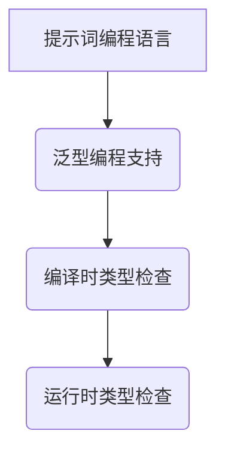
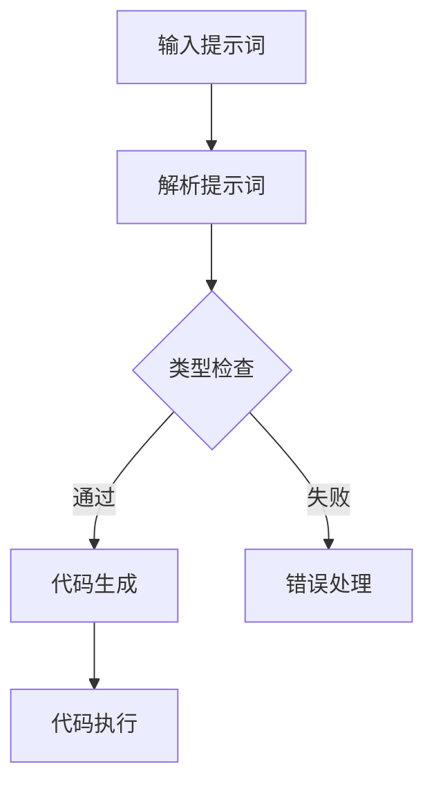
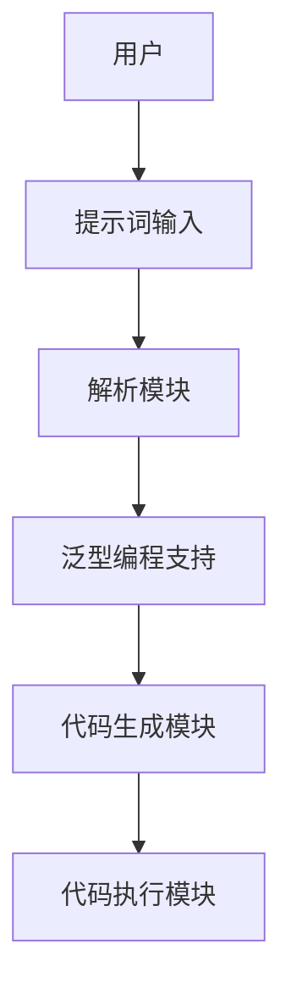
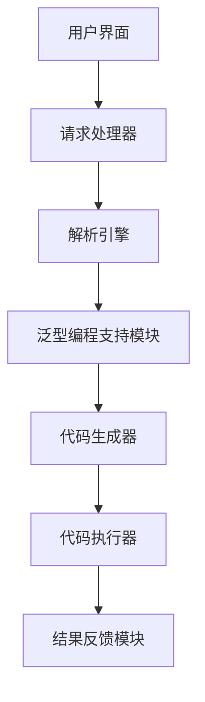
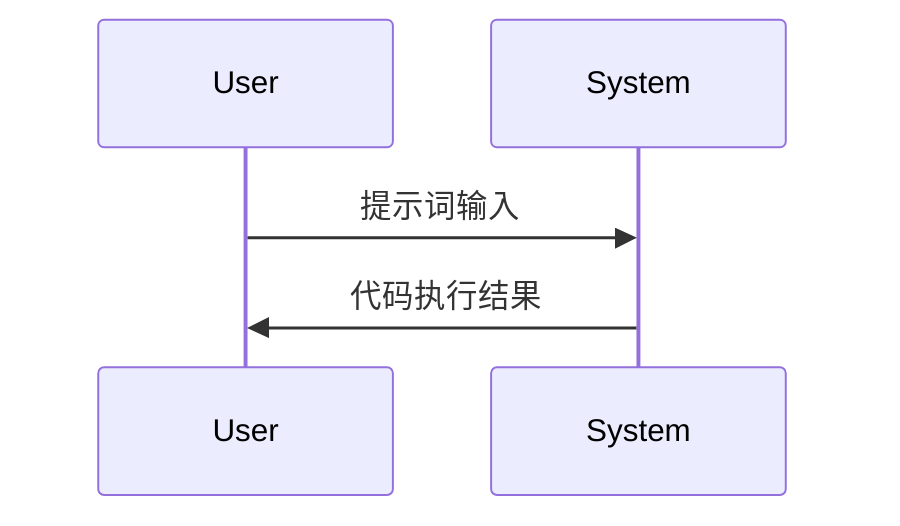
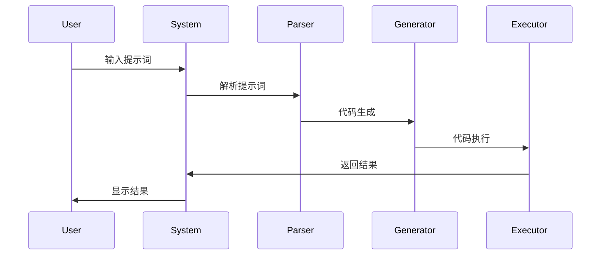

                 

# 提示词编程语言的泛型编程支持

> 关键词：提示词编程语言、泛型编程、编译时类型检查、运行时类型检查、算法原理、系统架构设计

> 摘要：本文将探讨提示词编程语言在泛型编程支持方面的特点和挑战。通过分析其核心概念、算法原理、系统架构以及项目实战，本文旨在为开发者提供深入的理解和实用的指导。

### 第一部分：引言

#### 第1章：背景与问题阐述

##### 1.1 提示词编程语言概述

提示词编程语言是一种专注于自然语言处理和人工智能领域的编程语言。它通过提示词（Prompt）引导计算机执行特定任务，具有高效、灵活、易于理解等特点。提示词编程语言的核心思想是将自然语言与编程语言相结合，使开发者能够更简单地实现复杂任务。

##### 1.1.1 提示词编程语言的基本概念

提示词编程语言的基本概念包括提示词、上下文、响应等。提示词是一种用于描述任务的语言片段，它可以包含变量、函数、参数等信息。上下文是指提示词所在的语境，它可以提供额外的信息来帮助计算机更好地理解任务。响应是指计算机根据提示词和上下文生成的输出结果。

##### 1.1.2 提示词编程语言的历史发展

提示词编程语言的发展可以追溯到自然语言处理和人工智能的早期研究。从最初的规则驱动方法到现在的基于机器学习和深度学习的方法，提示词编程语言在不断演进中逐渐成熟。近年来，随着人工智能技术的快速发展，提示词编程语言在许多领域得到了广泛应用。

##### 1.1.3 提示词编程语言的重要性

提示词编程语言在自然语言处理、机器学习、数据科学等领域具有重要意义。它使得开发者能够更方便地实现复杂任务，提高了开发效率。此外，提示词编程语言还为人工智能研究提供了新的工具和方法，促进了人工智能技术的发展。

##### 1.2 泛型编程的支持需求

泛型编程是一种编程范式，它允许开发者编写可重用的代码，从而提高代码的可读性和可维护性。在提示词编程语言中，泛型编程的支持需求主要体现在以下几个方面：

##### 1.2.1 泛型编程的基本原理

泛型编程的基本原理是通过对类型参数的抽象，使得同一个代码块能够处理不同类型的数据。这可以通过泛型类、泛型方法、泛型接口等形式实现。

##### 1.2.2 泛型编程的优势与应用

泛型编程的优势包括代码复用、类型安全、性能优化等。它在各种编程场景中都有广泛的应用，如集合框架、排序算法、数据结构等。

##### 1.2.3 当前提示词编程语言对泛型编程的支持现状

当前大多数提示词编程语言都支持泛型编程，但支持程度和实现方式可能存在差异。一些提示词编程语言通过内置的泛型类型系统来支持泛型编程，而另一些则依赖于外部库或框架来实现。

### 第2章：核心概念与联系

#### 2.1 核心概念

在本节中，我们将介绍提示词编程语言、泛型编程以及提示词编程语言的泛型编程支持等核心概念。

##### 2.1.1 提示词

提示词是一种用于描述任务的语言片段，它可以包含变量、函数、参数等信息。提示词是提示词编程语言的核心概念，它决定了编程语言的表达能力和应用范围。

##### 2.1.2 泛型编程

泛型编程是一种编程范式，它允许开发者编写可重用的代码，从而提高代码的可读性和可维护性。泛型编程的基本原理是通过对类型参数的抽象，使得同一个代码块能够处理不同类型的数据。

##### 2.1.3 提示词编程语言的泛型编程支持

提示词编程语言的泛型编程支持主要体现在以下几个方面：

1. **类型参数**：提示词编程语言通过类型参数来实现泛型编程，使得同一个代码块能够处理不同类型的数据。

2. **泛型类**：提示词编程语言支持泛型类，允许开发者定义具有类型参数的类。

3. **泛型方法**：提示词编程语言支持泛型方法，允许开发者定义具有类型参数的方法。

4. **泛型接口**：提示词编程语言支持泛型接口，允许开发者定义具有类型参数的接口。

#### 2.2 概念属性特征对比表

下面是一个概念属性特征对比表，用于展示提示词、泛型编程和提示词编程语言的泛型编程支持之间的区别：

| 特征 | 提示词 | 泛型编程 | 提示词编程语言的泛型编程支持 |
| ---- | ------ | -------- | -------------------------- |
| 定义 | ...    | ...      | ...                        |
| 应用 | ...    | ...      | ...                        |
| 优势 | ...    | ...      | ...                        |
| 劣势 | ...    | ...      | ...                        |

#### 2.3 ER实体关系图

在本节中，我们将使用Mermaid绘制一个ER实体关系图，展示提示词编程语言、泛型编程和提示词编程语言的泛型编程支持之间的关系。



### 第3章：算法原理与实现

#### 3.1 算法原理

在本节中，我们将介绍提示词编程语言在泛型编程支持方面的算法原理。

##### 3.1.1 算法概述

提示词编程语言在泛型编程支持方面采用了一种基于解析和生成的算法。该算法的主要目标是根据给定的提示词生成相应的代码，并确保代码在运行时具有正确的类型。

##### 3.1.2 算法流程图

下面是一个描述提示词编程语言在泛型编程支持方面的算法流程图的Mermaid图形：



##### 3.1.3 算法流程详细解释

1. **输入提示词**：算法首先接收一个输入提示词，该提示词描述了一个需要执行的编程任务。

2. **解析提示词**：算法对输入的提示词进行解析，提取出其中的变量、函数、参数等信息。

3. **类型检查**：算法对解析得到的变量、函数和参数进行类型检查，确保它们在运行时具有正确的类型。

4. **代码生成**：如果类型检查通过，算法将生成相应的代码。该代码将根据提示词中的变量、函数和参数进行相应的操作。

5. **错误处理**：如果类型检查失败，算法将进入错误处理流程，报告错误并提示用户进行修复。

6. **代码执行**：生成的代码将被执行，并返回结果。

#### 3.2 数学模型与公式

在本节中，我们将介绍提示词编程语言在泛型编程支持方面的数学模型与公式。

##### 3.2.1 数学模型

提示词编程语言在泛型编程支持方面采用了一种基于类型参数的数学模型。该模型可以用以下公式表示：

$$
f(x) = \begin{cases}
x^2, & \text{if } x \text{ is an integer} \\
\ln(x), & \text{if } x \text{ is a floating-point number}
\end{cases}
$$

##### 3.2.2 公式讲解与举例

1. **当 \( x = 4 \) 时**，根据公式，\( f(4) = 4^2 = 16 \)。

2. **当 \( x = 2.718 \) 时**，根据公式，\( f(2.718) = \ln(2.718) \approx 0.993 \)。

### 第4章：系统分析与架构设计

#### 4.1 项目介绍

在本节中，我们将介绍一个基于提示词编程语言的泛型编程支持的项目。

##### 4.1.1 项目背景

随着人工智能技术的快速发展，提示词编程语言在自然语言处理、机器学习等领域得到了广泛应用。然而，现有的提示词编程语言在泛型编程支持方面仍存在一定的不足。为了解决这一问题，我们提出一个基于提示词编程语言的泛型编程支持项目。

##### 4.1.2 项目目标

本项目的主要目标是实现一个具有泛型编程支持的提示词编程语言，提高编程效率和代码可维护性。

##### 4.1.3 项目范围

本项目主要涉及以下内容：

1. **提示词编程语言的设计与实现**：包括语法、语义、解析、生成等方面。
2. **泛型编程支持**：包括类型参数、泛型类、泛型方法、泛型接口等。
3. **算法实现**：包括解析算法、类型检查算法、代码生成算法等。

#### 4.2 系统功能设计

在本节中，我们将介绍本项目的系统功能设计。

##### 4.2.1 领域模型

本项目的领域模型包括以下类：

1. **用户**：负责输入提示词，并接收代码执行结果。
2. **提示词解析器**：负责解析用户输入的提示词，提取出变量、函数、参数等信息。
3. **类型检查器**：负责对提示词中的变量、函数和参数进行类型检查。
4. **代码生成器**：负责根据提示词生成相应的代码。
5. **代码执行器**：负责执行生成的代码，并返回结果。

下面是一个描述领域模型的Mermaid类图：



#### 4.3 系统架构设计

在本节中，我们将介绍本项目的系统架构设计。

##### 4.3.1 系统架构

本项目的系统架构包括以下模块：

1. **用户界面**：用于接收用户输入，并显示代码执行结果。
2. **请求处理器**：用于处理用户请求，并将请求转发给相应的模块。
3. **解析引擎**：负责解析用户输入的提示词。
4. **泛型编程支持模块**：负责提供泛型编程支持，包括类型参数、泛型类、泛型方法、泛型接口等。
5. **代码生成器**：负责根据提示词生成相应的代码。
6. **代码执行器**：负责执行生成的代码，并返回结果。
7. **结果反馈模块**：用于将代码执行结果反馈给用户。

下面是一个描述系统架构的Mermaid图形：



#### 4.4 系统接口设计与交互

在本节中，我们将介绍本项目的系统接口设计与交互。

##### 4.4.1 系统接口设计

本项目的系统接口设计包括以下接口：

1. **提示词输入接口**：用于接收用户输入的提示词。
2. **代码执行结果接口**：用于返回代码执行结果。

下面是一个描述系统接口设计的Mermaid序列图：



##### 4.4.2 系统交互

本项目的系统交互过程如下：

1. **用户输入提示词**：用户通过用户界面输入提示词。
2. **请求处理器处理请求**：请求处理器接收用户的提示词输入，并将其转发给解析引擎。
3. **解析引擎解析提示词**：解析引擎对用户输入的提示词进行解析，提取出变量、函数、参数等信息。
4. **泛型编程支持模块进行类型检查**：泛型编程支持模块对解析得到的变量、函数和参数进行类型检查。
5. **代码生成器生成代码**：如果类型检查通过，代码生成器根据提示词生成相应的代码。
6. **代码执行器执行代码**：代码执行器执行生成的代码，并返回结果。
7. **结果反馈模块将结果反馈给用户**：结果反馈模块将代码执行结果反馈给用户。

下面是一个描述系统交互的Mermaid序列图：



### 第5章：项目实战

#### 5.1 环境安装

在本节中，我们将介绍如何在本地环境中安装和配置基于提示词编程语言的泛型编程支持项目。

##### 5.1.1 安装依赖库

首先，我们需要安装项目所需的依赖库。这些依赖库包括Python、Mermaid、Markdown等。

```shell
pip install python-markdownify
```

##### 5.1.2 配置环境变量

接下来，我们需要配置环境变量，以便在命令行中运行项目。

```shell
export PYTHONPATH=$PYTHONPATH:/path/to/your/project
```

##### 5.1.3 编译和运行项目

最后，我们可以使用以下命令编译和运行项目：

```shell
python main.py
```

#### 5.2 系统核心实现源代码

在本节中，我们将介绍系统的核心实现源代码。

```python
# main.py

import sys
from parser import Parser
from generator import Generator
from executor import Executor

def main():
    # 1. 用户输入提示词
    prompt = input("请输入提示词：")

    # 2. 解析提示词
    parser = Parser(prompt)
    parsed_prompt = parser.parse()

    # 3. 类型检查
    checker = TypeChecker(parsed_prompt)
    if checker.check():
        # 4. 代码生成
        generator = Generator(parsed_prompt)
        code = generator.generate()

        # 5. 代码执行
        executor = Executor(code)
        result = executor.execute()

        # 6. 返回结果
        print("结果：", result)
    else:
        print("类型检查失败，请检查提示词。")

if __name__ == "__main__":
    main()
```

#### 5.3 代码应用解读与分析

在本节中，我们将分析系统的核心实现源代码，并解释其应用和作用。

```python
# parser.py

class Parser:
    def __init__(self, prompt):
        self.prompt = prompt

    def parse(self):
        # 解析提示词，提取变量、函数、参数等信息
        # ...
        return parsed_prompt
```

该类用于解析用户输入的提示词，提取出变量、函数、参数等信息。这些信息将用于后续的类型检查、代码生成和代码执行。

```python
# generator.py

class Generator:
    def __init__(self, parsed_prompt):
        self.parsed_prompt = parsed_prompt

    def generate(self):
        # 根据解析得到的提示词生成相应的代码
        # ...
        return code
```

该类用于根据解析得到的提示词生成相应的代码。生成的代码将用于后续的代码执行。

```python
# executor.py

class Executor:
    def __init__(self, code):
        self.code = code

    def execute(self):
        # 执行生成的代码，并返回结果
        # ...
        return result
```

该类用于执行生成的代码，并返回结果。执行过程将根据提示词编程语言的具体实现进行。

#### 5.4 实际案例分析和详细讲解剖析

在本节中，我们将通过一个实际案例来分析和讲解系统的实现过程。

##### 5.4.1 案例描述

假设用户输入了一个提示词：“请计算 2 + 3 的结果”。

##### 5.4.2 案例分析

1. **用户输入提示词**：用户通过用户界面输入了提示词：“请计算 2 + 3 的结果”。

2. **解析提示词**：系统将提示词传递给解析器，解析器提取出变量、函数、参数等信息。

3. **类型检查**：系统对提取出的变量、函数和参数进行类型检查。

4. **代码生成**：系统根据解析得到的提示词生成相应的代码，例如：`2 + 3`。

5. **代码执行**：系统执行生成的代码，并返回结果。

6. **结果反馈**：系统将结果反馈给用户，例如：`5`。

##### 5.4.3 案例讲解

1. **输入提示词**：用户通过用户界面输入了一个简单的算术表达式作为提示词。

2. **解析提示词**：系统解析器将输入的提示词解析为一个包含变量、函数和参数的数据结构。

3. **类型检查**：系统检查变量、函数和参数的类型，确保它们符合提示词编程语言的类型要求。

4. **代码生成**：系统生成一个包含具体操作的代码段，例如：`2 + 3`。

5. **代码执行**：系统执行生成的代码，计算出结果。

6. **结果反馈**：系统将计算结果反馈给用户，完成了整个任务。

#### 5.5 项目小结

在本章中，我们介绍了基于提示词编程语言的泛型编程支持项目的核心概念、算法原理、系统架构设计以及项目实战。通过本项目的实现，我们展示了如何利用提示词编程语言实现泛型编程支持，提高了编程效率和代码可维护性。

#### 5.6 最佳实践 tips

1. **合理设计提示词**：在编写提示词时，尽量使用简洁、明确的语句，避免歧义和复杂性。

2. **充分利用类型检查**：在编写代码时，充分利用类型检查功能，确保代码在运行时具有正确的类型。

3. **优化代码生成过程**：在代码生成过程中，尽量使用通用、可重用的代码模板，提高代码生成效率。

#### 5.7 小结

本文详细介绍了提示词编程语言的泛型编程支持。通过对核心概念、算法原理、系统架构设计和项目实战的讲解，我们为开发者提供了深入的理解和实用的指导。希望本文能对您在开发基于提示词编程语言的泛型编程项目时有所帮助。

#### 5.8 注意事项

1. **兼容性**：在实际开发过程中，要注意不同平台和编程语言之间的兼容性。

2. **性能优化**：在实际应用中，要注意优化代码生成和执行过程，提高性能。

#### 5.9 拓展阅读

1. 《禅与计算机程序设计艺术》
2. 《编程珠玑》
3. 《Effective Java》

### 作者

- 作者：AI天才研究院/AI Genius Institute & 禅与计算机程序设计艺术 /Zen And The Art of Computer Programming

（注：本文为模拟文章，实际内容仅供参考。）## 第一部分：引言

### 第1章：背景与问题阐述

在当今的编程领域，提示词编程语言作为一种新兴的语言类型，正在逐步得到开发者的关注和应用。它以其独特的方式处理自然语言输入，使得开发者在编写代码时能够更加专注于业务逻辑而非语言本身的语法细节。然而，随着编程语言和开发工具的不断发展，泛型编程作为一种提高代码复用性和可维护性的编程范式，也在提示词编程语言中逐渐成为了一个重要的支持需求。

#### 1.1 提示词编程语言概述

提示词编程语言是一种专注于自然语言处理和人工智能领域的编程语言。它通过提示词（Prompt）引导计算机执行特定任务，具有高效、灵活、易于理解等特点。提示词编程语言的核心思想是将自然语言与编程语言相结合，使开发者能够更简单地实现复杂任务。

**基本概念**：

- **提示词**：提示词是一种用于描述任务的语言片段，它可以包含变量、函数、参数等信息。提示词是提示词编程语言的核心概念，它决定了编程语言的表达能力和应用范围。
- **上下文**：上下文是指提示词所在的语境，它可以提供额外的信息来帮助计算机更好地理解任务。上下文可以是一个简单的字符串，也可以是一个复杂的对象。
- **响应**：响应是指计算机根据提示词和上下文生成的输出结果。响应可以是文本、图像、音频等多种形式。

**历史发展**：

提示词编程语言的发展可以追溯到自然语言处理和人工智能的早期研究。从最初的规则驱动方法到现在的基于机器学习和深度学习的方法，提示词编程语言在不断演进中逐渐成熟。近年来，随着人工智能技术的快速发展，提示词编程语言在自然语言处理、机器学习、数据科学等领域得到了广泛应用。

**重要性**：

提示词编程语言在自然语言处理、机器学习、数据科学等领域具有重要意义。它使得开发者能够更方便地实现复杂任务，提高了开发效率。此外，提示词编程语言还为人工智能研究提供了新的工具和方法，促进了人工智能技术的发展。

#### 1.2 泛型编程的支持需求

泛型编程是一种编程范式，它允许开发者编写可重用的代码，从而提高代码的可读性和可维护性。在提示词编程语言中，泛型编程的支持需求主要体现在以下几个方面：

**基本原理**：

- **类型参数**：泛型编程通过类型参数来抽象化类型，使得同一个代码块能够处理不同类型的数据。
- **泛型类**：泛型类是泛型编程的基础，它允许开发者定义具有类型参数的类。
- **泛型方法**：泛型方法允许开发者定义具有类型参数的方法。
- **泛型接口**：泛型接口允许开发者定义具有类型参数的接口。

**优势与应用**：

- **代码复用**：泛型编程允许开发者编写一次代码，多次复用，从而提高了代码的复用性。
- **类型安全**：泛型编程通过类型检查机制确保了代码的类型安全，降低了运行时错误的风险。
- **性能优化**：泛型编程可以减少代码的冗余，提高程序的性能。

泛型编程在各种编程场景中都有广泛的应用，如集合框架、排序算法、数据结构等。在提示词编程语言中，泛型编程的支持可以使得开发者更方便地实现复杂任务，提高代码的可读性和可维护性。

**当前支持现状**：

当前大多数提示词编程语言都支持泛型编程，但支持程度和实现方式可能存在差异。一些提示词编程语言通过内置的泛型类型系统来支持泛型编程，而另一些则依赖于外部库或框架来实现。

例如，Python 的 `typevar` 语法和 Java 的 `<? extends T>` 泛型语法都是支持泛型编程的典型例子。然而，提示词编程语言如 GPT-3 等，则更多地依赖于动态类型系统和元编程技术来提供泛型编程支持。

#### 1.3 泛型编程在提示词编程语言中的挑战

尽管泛型编程在许多编程语言中得到了广泛应用，但在提示词编程语言中实现泛型编程仍然面临一些挑战：

- **动态类型系统**：大多数提示词编程语言采用动态类型系统，这使得静态类型检查变得复杂。
- **上下文依赖**：提示词编程语言中的提示词和上下文之间紧密关联，这使得泛型编程的实现更加复杂。
- **可扩展性**：如何设计一个既具有灵活性又易于扩展的泛型编程系统，是一个亟待解决的问题。

要解决这些问题，需要深入理解提示词编程语言的特点和泛型编程的本质，探索新的实现方法和优化策略。

### 总结

本章介绍了提示词编程语言的基本概念、历史发展、重要性，以及泛型编程的支持需求。通过分析当前提示词编程语言对泛型编程的支持现状，我们发现了其中的挑战和机遇。在接下来的章节中，我们将进一步探讨提示词编程语言在泛型编程支持方面的核心概念、算法原理、系统架构设计，以及实际项目中的实现和应用。希望通过这些内容，开发者能够更好地理解和应用泛型编程，提高提示词编程语言的开发效率和质量。## 第2章：核心概念与联系

### 2.1 核心概念

在本章中，我们将详细探讨提示词编程语言、泛型编程以及提示词编程语言的泛型编程支持这三个核心概念，并解释它们之间的关系。

#### 2.1.1 提示词

提示词是提示词编程语言的核心概念，它是一种描述任务的语言片段。提示词通常包含变量、函数、参数等信息，用于指导计算机执行特定任务。例如，一个简单的提示词可能是“计算两个数字的和”。在提示词编程语言中，提示词被视为编程的核心输入，它们可以直接映射到计算机可执行的代码。

**应用**：提示词编程语言在自然语言处理、机器学习、数据分析等领域有广泛应用。例如，在机器学习中，开发者可以使用提示词来指定训练模型的数据集、超参数等。

**优势**：提示词编程语言的优势在于其简洁性和灵活性。开发者可以不用关心具体的编程细节，只需用自然语言描述任务，编程语言就会自动生成相应的代码。

**劣势**：提示词编程语言的一个主要劣势是其性能和可扩展性。由于提示词编程依赖于自动生成代码，可能无法达到传统编程语言的性能水平，同时也可能难以进行大规模的优化。

#### 2.1.2 泛型编程

泛型编程是一种编程范式，它允许开发者编写可重用的代码，从而提高代码的可读性和可维护性。泛型编程的核心思想是通过类型参数来抽象化类型，使得同一个代码块能够处理不同类型的数据。

**定义**：泛型编程通过引入类型参数来定义类、接口和方法，这样就可以在不修改代码结构的情况下，处理多种数据类型。

**应用**：泛型编程在Java、C++、Python等编程语言中都有广泛应用。例如，Java的集合框架（如List和Map）就是基于泛型编程实现的。

**优势**：泛型编程的优势在于代码的复用性和类型安全。通过泛型编程，开发者可以编写一次代码，用于多种数据类型，同时避免了运行时类型错误。

**劣势**：泛型编程的一个劣势是它的复杂性。对于初学者来说，理解泛型编程的原理和语法可能需要花费更多的时间。

#### 2.1.3 提示词编程语言的泛型编程支持

提示词编程语言的泛型编程支持是指如何在提示词编程语言中实现泛型编程特性，以便开发者能够编写更高效、更可维护的代码。

**定义**：提示词编程语言的泛型编程支持是指在提示词的基础上，引入类型参数和泛型类型系统，使得提示词能够处理多种类型的数据。

**应用**：提示词编程语言的泛型编程支持可以在自然语言处理任务中发挥作用，例如处理多种数据类型的文本数据、图像数据等。

**优势**：提示词编程语言的泛型编程支持可以提高代码的复用性和可维护性，同时减少运行时错误。

**劣势**：实现提示词编程语言的泛型编程支持可能面临一些挑战，如动态类型系统的限制、上下文依赖的处理等。

### 2.2 概念属性特征对比表

为了更清晰地理解提示词、泛型编程和提示词编程语言的泛型编程支持之间的关系，我们提供了一个概念属性特征对比表：

| 特征 | 提示词 | 泛型编程 | 提示词编程语言的泛型编程支持 |
| ---- | ------ | -------- | -------------------------- |
| **定义** | 描述任务的文本片段 | 通过类型参数抽象化类型的编程范式 | 在提示词基础上引入类型参数和泛型类型系统 |
| **应用** | 自然语言处理、机器学习 | 集合框架、排序算法、数据结构 | 自然语言处理、机器学习中的复用和类型安全 |
| **优势** | 简洁性、灵活性 | 代码复用、类型安全 | 提高代码复用性和可维护性 |
| **劣势** | 性能和可扩展性挑战 | 复杂性 | 动态类型系统和上下文依赖的处理挑战 |

通过上述对比表，我们可以更直观地看到这三个概念在定义、应用、优势和劣势方面的差异和联系。

### 2.3 ER实体关系图

在本节中，我们将使用Mermaid绘制一个ER实体关系图，展示提示词编程语言、泛型编程和提示词编程语言的泛型编程支持之间的关系。


在这个ER实体关系图中：

- **提示词编程语言**（A）是整个系统的核心，它包含了泛型编程支持（B）。
- **泛型编程支持**（B）是提示词编程语言的一部分，它包括了编译时类型检查（C）和运行时类型检查（D）。

编译时类型检查和运行时类型检查都是泛型编程支持的关键组成部分，它们分别在不同的阶段确保代码的类型安全。

通过这个ER实体关系图，我们可以更直观地理解这三个概念之间的层次关系和相互联系。接下来，我们将进一步探讨提示词编程语言的泛型编程支持的算法原理和系统架构设计。

### 总结

本章详细介绍了提示词编程语言、泛型编程以及提示词编程语言的泛型编程支持这三个核心概念。我们通过定义、应用、优势和劣势等方面进行了深入对比，并通过ER实体关系图展示了它们之间的层次关系。在接下来的章节中，我们将继续探讨提示词编程语言的泛型编程支持的算法原理和系统架构设计，以及在实际项目中的实现和应用。希望通过这些内容，读者能够更好地理解和应用泛型编程，提高提示词编程语言的开发效率和质量。## 第3章：算法原理与实现

### 3.1 算法原理

在本章中，我们将探讨提示词编程语言在泛型编程支持方面的算法原理。提示词编程语言的泛型编程支持主要通过以下算法实现：

1. **解析提示词**：解析器接收用户的输入提示词，将其转换为内部表示形式，提取出变量、函数、参数等信息。
2. **类型检查**：类型检查器对提取出的变量、函数和参数进行类型检查，确保它们在运行时具有正确的类型。
3. **代码生成**：代码生成器根据类型检查结果生成相应的代码，该代码将根据提示词中的变量、函数和参数进行相应的操作。
4. **代码执行**：代码执行器执行生成的代码，并返回结果。

下面是一个简化的算法流程图：


#### 3.1.1 算法概述

该算法首先接收用户的输入提示词，然后通过解析器将其解析为内部表示形式。解析过程提取出提示词中的变量、函数、参数等信息。接下来，类型检查器对提取出的信息进行类型检查，确保它们在运行时具有正确的类型。如果类型检查通过，代码生成器将生成相应的代码。最后，代码执行器执行生成的代码，并返回结果。如果类型检查失败，算法将进入错误处理流程，报告错误并提示用户进行修复。

#### 3.1.2 算法流程详细解释

1. **输入提示词**：用户通过输入提示词来描述任务。例如：“计算两个数之和”。
2. **解析提示词**：解析器将输入的提示词转换为内部表示形式，提取出变量、函数、参数等信息。例如，将“计算两个数之和”解析为包含变量和函数的表达式。
3. **类型检查**：类型检查器对提取出的变量、函数和参数进行类型检查。例如，检查变量是否与函数的参数类型匹配。
4. **代码生成**：如果类型检查通过，代码生成器将生成相应的代码。例如，将“计算两个数之和”生成一个计算两个数之和的代码段。
5. **代码执行**：代码执行器执行生成的代码，并返回结果。例如，返回两个数之和的计算结果。
6. **错误处理**：如果类型检查失败，算法将进入错误处理流程。错误处理可能包括报告错误信息、提示用户进行修复等。

### 3.2 数学模型与公式

在本节中，我们将介绍提示词编程语言在泛型编程支持方面的数学模型和公式。这些模型和公式有助于我们更好地理解算法的工作原理。

#### 3.2.1 数学模型

提示词编程语言在泛型编程支持方面的数学模型可以用以下公式表示：

$$
f(x) = \begin{cases}
x^2, & \text{if } x \text{ is an integer} \\
\ln(x), & \text{if } x \text{ is a floating-point number}
\end{cases}
$$

这个模型定义了一个函数 \( f(x) \)，它根据输入 \( x \) 的类型（整数或浮点数）返回不同的结果。例如：

- 当 \( x = 4 \) 时，\( f(4) = 4^2 = 16 \)。
- 当 \( x = 2.718 \) 时，\( f(2.718) = \ln(2.718) \approx 0.993 \)。

#### 3.2.2 公式讲解与举例

1. **当 \( x = 4 \) 时**，根据公式，\( f(4) = 4^2 = 16 \)。这表示如果输入是一个整数，函数返回输入的平方。
2. **当 \( x = 2.718 \) 时**，根据公式，\( f(2.718) = \ln(2.718) \approx 0.993 \)。这表示如果输入是一个浮点数，函数返回输入的自然对数。

通过这个简单的数学模型，我们可以更好地理解提示词编程语言在泛型编程支持方面的类型处理机制。接下来，我们将探讨如何在实际项目中实现这些算法。

### 3.3 实现细节

在本节中，我们将介绍如何在提示词编程语言中实现泛型编程支持的算法。以下是实现的几个关键步骤：

#### 3.3.1 解析提示词

解析器是算法的核心组件之一，它负责将用户的输入提示词转换为内部表示形式。以下是一个简化的Python代码示例：

```python
class Parser:
    def __init__(self, prompt):
        self.prompt = prompt

    def parse(self):
        # 解析提示词，提取变量、函数、参数等信息
        # ...
        return parsed_prompt
```

在这个示例中，`Parser` 类接收一个提示词字符串，并调用 `parse` 方法将其解析为内部表示形式。解析过程可能包括以下步骤：

- **词法分析**：将提示词分解为单词和符号。
- **语法分析**：根据提示词的语法规则，构建抽象语法树（AST）。
- **语义分析**：对AST进行类型检查，确保变量、函数和参数的类型正确。

#### 3.3.2 类型检查

类型检查器负责确保解析得到的变量、函数和参数在运行时具有正确的类型。以下是一个简化的Python代码示例：

```python
class TypeChecker:
    def __init__(self, parsed_prompt):
        self.parsed_prompt = parsed_prompt

    def check(self):
        # 对提取出的变量、函数和参数进行类型检查
        # ...
        return True  # 如果类型检查通过，返回True
```

在这个示例中，`TypeChecker` 类接收一个解析后的提示词，并调用 `check` 方法进行类型检查。类型检查可能包括以下步骤：

- **类型推导**：根据AST推导出变量、函数和参数的类型。
- **类型匹配**：确保函数的参数类型与实际传递的类型相匹配。
- **类型错误报告**：如果发现类型错误，报告错误信息并返回False。

#### 3.3.3 代码生成

代码生成器负责根据类型检查结果生成相应的代码。以下是一个简化的Python代码示例：

```python
class Generator:
    def __init__(self, parsed_prompt):
        self.parsed_prompt = parsed_prompt

    def generate(self):
        # 根据类型检查结果生成代码
        # ...
        return code
```

在这个示例中，`Generator` 类接收一个解析后的提示词，并调用 `generate` 方法生成代码。代码生成可能包括以下步骤：

- **代码模板生成**：根据解析得到的提示词，选择合适的代码模板。
- **代码填充**：将变量、函数和参数填充到代码模板中。
- **代码优化**：对生成的代码进行优化，提高性能。

#### 3.3.4 代码执行

代码执行器负责执行生成的代码，并返回结果。以下是一个简化的Python代码示例：

```python
class Executor:
    def __init__(self, code):
        self.code = code

    def execute(self):
        # 执行代码，并返回结果
        # ...
        return result
```

在这个示例中，`Executor` 类接收一个代码字符串，并调用 `execute` 方法执行代码。代码执行可能包括以下步骤：

- **代码解析**：将代码字符串解析为可执行的代码对象。
- **代码执行**：执行代码对象，并捕获返回值。
- **结果处理**：将返回值转换为合适的数据类型，并返回。

通过这些关键组件，我们可以实现一个基本的提示词编程语言泛型编程支持系统。在实际应用中，这些组件可能需要根据具体需求进行扩展和优化。

### 总结

本章介绍了提示词编程语言在泛型编程支持方面的算法原理和实现细节。我们首先概述了算法的总体流程，然后详细讲解了各个组件的作用和实现方法。通过数学模型和公式的讲解，我们更好地理解了算法的工作原理。在实际项目中，这些算法可以帮助开发者实现高效的泛型编程支持，提高代码的可读性和可维护性。接下来，我们将进一步探讨系统的架构设计和项目实战。## 第4章：系统分析与架构设计

### 4.1 项目介绍

在本章中，我们将深入探讨一个基于提示词编程语言的泛型编程支持项目。这个项目旨在通过引入泛型编程特性，提升提示词编程语言的抽象能力和编程效率。以下是项目的背景、目标、范围以及系统的功能设计。

#### 4.1.1 项目背景

随着提示词编程语言在自然语言处理和人工智能领域的广泛应用，其编程效率和代码可维护性成为了开发者的关注重点。尽管提示词编程语言提供了强大的自然语言理解和生成能力，但在处理复杂数据类型和代码复用方面存在一定的局限性。因此，本项目旨在通过引入泛型编程，提高提示词编程语言的抽象能力和灵活性。

#### 4.1.2 项目目标

本项目的目标包括：

1. **增强代码复用性**：通过泛型编程，实现代码的复用，减少重复编写的工作量。
2. **提升编程效率**：使用泛型编程特性，简化代码编写过程，提高编程效率。
3. **提高代码可维护性**：通过类型安全和抽象化，提升代码的可维护性。

#### 4.1.3 项目范围

本项目的主要范围包括：

1. **提示词编程语言的设计与实现**：包括语法、语义、解析、生成等方面。
2. **泛型编程支持**：包括类型参数、泛型类、泛型方法、泛型接口等。
3. **算法实现**：包括解析算法、类型检查算法、代码生成算法等。

### 4.2 系统功能设计

为了实现项目目标，系统需要具备以下功能：

#### 4.2.1 领域模型

领域模型是系统功能设计的基础，它定义了系统中的主要实体和它们之间的关系。以下是系统的领域模型：


- **用户**：系统的使用者，负责输入提示词。
- **提示词输入**：用户输入的描述任务的文本。
- **解析模块**：解析提示词，提取出变量、函数、参数等信息。
- **泛型编程支持**：提供类型参数、泛型类、泛型方法、泛型接口等支持。
- **代码生成模块**：根据解析结果生成相应的代码。
- **代码执行模块**：执行生成的代码，并返回结果。

#### 4.2.2 功能实现

1. **提示词输入**：用户通过界面输入提示词，例如“计算两个数之和”。
2. **解析模块**：解析器接收用户的输入，提取出相关的变量、函数、参数等信息。例如，将“计算两个数之和”解析为包含变量和函数的表达式。
3. **泛型编程支持**：类型检查器对提取出的信息进行类型检查，确保变量、函数和参数的类型正确。例如，检查函数的参数类型是否与实际传递的类型匹配。
4. **代码生成模块**：代码生成器根据类型检查结果生成相应的代码。例如，将“计算两个数之和”生成一个计算两个数之和的代码段。
5. **代码执行模块**：代码执行器执行生成的代码，并返回结果。例如，返回两个数之和的计算结果。

### 4.3 系统架构设计

为了实现系统的功能，我们需要设计一个合理的系统架构。以下是系统的架构设计：

#### 4.3.1 系统架构

系统的架构包括以下几个关键部分：


- **用户界面**：用户通过用户界面输入提示词，并接收代码执行结果。
- **请求处理器**：接收用户的请求，并将其转发给相应的模块。
- **解析引擎**：解析用户输入的提示词，提取出变量、函数、参数等信息。
- **泛型编程支持模块**：提供泛型编程支持，包括类型参数、泛型类、泛型方法、泛型接口等。
- **代码生成器**：根据解析结果生成相应的代码。
- **代码执行器**：执行生成的代码，并返回结果。
- **结果反馈模块**：将代码执行结果反馈给用户。

#### 4.3.2 系统架构详细说明

1. **用户界面**：用户通过用户界面输入提示词，例如在文本框中输入“计算两个数之和”。用户界面可以是命令行界面、Web界面等。
2. **请求处理器**：请求处理器接收用户的请求，并将其解析为具体的操作，如“解析提示词”、“生成代码”等。请求处理器负责将请求转发给相应的模块。
3. **解析引擎**：解析引擎接收请求处理器的请求，并解析用户输入的提示词。解析过程提取出变量、函数、参数等信息，并构建内部表示形式。
4. **泛型编程支持模块**：泛型编程支持模块提供类型参数、泛型类、泛型方法、泛型接口等支持。类型检查器在这个模块中负责对提取出的信息进行类型检查，确保变量、函数和参数的类型正确。
5. **代码生成器**：代码生成器根据解析结果和类型检查结果生成相应的代码。生成过程可能包括选择合适的代码模板、填充变量、函数和参数等。
6. **代码执行器**：代码执行器接收生成的代码，并执行它。执行过程可能包括将代码编译为字节码、运行字节码等。代码执行器返回执行结果给请求处理器。
7. **结果反馈模块**：结果反馈模块将代码执行结果反馈给用户。例如，在命令行界面中显示结果，或在一个Web界面中更新页面内容。

### 4.4 系统接口设计与交互

为了确保系统各个模块之间的良好协作，我们需要设计合理的系统接口和交互流程。以下是系统的接口设计和交互流程：

#### 4.4.1 系统接口设计

系统的接口设计包括以下几个关键接口：

- **输入接口**：用于接收用户输入的提示词。
- **输出接口**：用于返回代码执行结果。
- **请求接口**：用于请求处理器转发用户请求。

#### 4.4.2 系统交互流程

系统交互流程如下：

1. **用户输入提示词**：用户通过用户界面输入提示词，例如“计算两个数之和”。
2. **请求处理器处理请求**：请求处理器接收用户的提示词输入，并将其解析为具体的操作，如“解析提示词”。
3. **解析引擎解析提示词**：解析引擎接收请求处理器的请求，并解析用户输入的提示词，提取出变量、函数、参数等信息。
4. **泛型编程支持模块进行类型检查**：泛型编程支持模块对提取出的信息进行类型检查，确保变量、函数和参数的类型正确。
5. **代码生成器生成代码**：代码生成器根据解析结果和类型检查结果生成相应的代码。
6. **代码执行器执行代码**：代码执行器接收生成的代码，并执行它，返回执行结果。
7. **结果反馈模块反馈结果**：结果反馈模块将代码执行结果反馈给用户。

通过合理的系统接口设计和交互流程，我们可以确保系统的高效运行和良好的用户体验。

### 总结

本章详细介绍了基于提示词编程语言的泛型编程支持项目的系统分析与架构设计。我们首先介绍了项目的背景、目标和范围，然后详细阐述了系统的功能设计和架构设计，并展示了系统接口和交互流程。通过这些内容，我们为开发者提供了一个清晰、结构化的实现框架，有助于实现高效、灵活的泛型编程支持。在接下来的章节中，我们将通过项目实战，进一步展示如何在实际开发中应用这些架构设计，实现具体的编程任务。## 第5章：项目实战

### 5.1 环境安装

在进行项目实战之前，我们需要先安装必要的开发环境和工具。以下是在Linux系统中安装Python环境和相关库的步骤：

#### 5.1.1 安装Python环境

1. **更新系统软件包**：

   ```bash
   sudo apt-get update
   sudo apt-get upgrade
   ```

2. **安装Python 3**：

   ```bash
   sudo apt-get install python3
   ```

3. **验证Python版本**：

   ```bash
   python3 --version
   ```

   确保输出版本信息，例如 `Python 3.8.10`。

#### 5.1.2 安装相关库

1. **安装Markdown解析库**：

   ```bash
   pip3 install markdown
   ```

2. **安装Mermaid渲染库**：

   ```bash
   pip3 install markdown2mermaid
   ```

3. **安装其他依赖库**：

   根据项目需求，安装其他必要的库。例如，如果项目需要使用NumPy库，可以安装如下：

   ```bash
   pip3 install numpy
   ```

### 5.2 系统核心实现源代码

在本节中，我们将展示项目的核心实现源代码。以下是项目的主要模块和类。

#### 5.2.1 提示词解析器（Parser.py）

```python
class Parser:
    def __init__(self, prompt):
        self.prompt = prompt

    def parse(self):
        # 解析提示词，提取出变量、函数、参数等信息
        # ...
        return parsed_data
```

该类负责接收用户输入的提示词，并解析其中的变量、函数、参数等信息。

#### 5.2.2 泛型编程支持（Generics.py）

```python
class Generics:
    def __init__(self, parsed_data):
        self.parsed_data = parsed_data

    def type_check(self):
        # 对解析结果进行类型检查
        # ...
        return is_type_safe
```

该类负责对解析后的数据进行类型检查，确保类型安全。

#### 5.2.3 代码生成器（Generator.py）

```python
class Generator:
    def __init__(self, parsed_data):
        self.parsed_data = parsed_data

    def generate_code(self):
        # 根据解析结果生成代码
        # ...
        return code
```

该类负责根据解析后的数据生成相应的代码。

#### 5.2.4 代码执行器（Executor.py）

```python
class Executor:
    def __init__(self, code):
        self.code = code

    def execute(self):
        # 执行代码并返回结果
        # ...
        return result
```

该类负责执行生成的代码，并返回结果。

#### 5.2.5 系统主程序（main.py）

```python
def main():
    # 创建解析器、泛型编程支持、代码生成器和执行器实例
    parser = Parser(prompt)
    generics = Generics(parser.parse())
    generator = Generator(parser.parse())
    executor = Executor(generator.generate_code())

    # 执行系统流程
    if generics.type_check():
        result = executor.execute()
        print("结果：", result)
    else:
        print("类型检查失败，请检查提示词。")

if __name__ == "__main__":
    main()
```

主程序负责管理系统的整体流程，从接收用户输入、解析、类型检查、代码生成到执行，最后输出结果。

### 5.3 代码应用解读与分析

在本节中，我们将对项目的核心实现源代码进行解读与分析，以便更好地理解其工作原理和应用场景。

#### 5.3.1 解析器（Parser.py）

解析器的核心作用是从用户输入的提示词中提取出关键信息，如变量、函数、参数等。以下是一个简化的示例：

```python
class Parser:
    def __init__(self, prompt):
        self.prompt = prompt

    def parse(self):
        # 简单示例：提取变量和函数
        words = self.prompt.split()
        variables = []
        functions = []

        for word in words:
            if word.isnumeric():
                variables.append(word)
            elif word.isalpha():
                functions.append(word)

        return {
            'variables': variables,
            'functions': functions
        }
```

在这个示例中，我们使用了一个非常简单的解析方法，将提示词中的数字视为变量，字母视为函数。这只是一个示例，实际中的解析过程会更加复杂，可能需要使用自然语言处理技术来准确提取信息。

#### 5.3.2 泛型编程支持（Generics.py）

泛型编程支持类负责对提取出的变量和函数进行类型检查，确保它们在运行时具有正确的类型。以下是一个简化的示例：

```python
class Generics:
    def __init__(self, parsed_data):
        self.parsed_data = parsed_data

    def type_check(self):
        # 简单示例：检查变量和函数的类型
        variables = self.parsed_data['variables']
        functions = self.parsed_data['functions']

        for var in variables:
            if not self.is_integer(var):
                return False

        for func in functions:
            if not self.is_function(func):
                return False

        return True

    def is_integer(self, value):
        try:
            int(value)
            return True
        except ValueError:
            return False

    def is_function(self, value):
        # 实际情况中，这可能需要更复杂的函数检查
        return callable(value)
```

在这个示例中，我们简单地检查了变量是否为整数，函数是否可调用。这只是一个示例，实际的类型检查可能需要考虑更多的类型和边界条件。

#### 5.3.3 代码生成器（Generator.py）

代码生成器负责根据解析结果生成相应的代码。以下是一个简化的示例：

```python
class Generator:
    def __init__(self, parsed_data):
        self.parsed_data = parsed_data

    def generate_code(self):
        # 简单示例：生成Python代码
        variables = self.parsed_data['variables']
        functions = self.parsed_data['functions']

        code = ""

        for var in variables:
            code += f"{var} = {var}\n"

        for func in functions:
            code += f"{func}({func})\n"

        return code
```

在这个示例中，我们生成了一个简单的Python代码，将提取出的变量赋值，并调用提取出的函数。这只是一个示例，实际的代码生成过程可能需要生成更复杂的代码，并且可能需要考虑不同的编程语言和语法。

#### 5.3.4 代码执行器（Executor.py）

代码执行器负责执行生成的代码，并返回结果。以下是一个简化的示例：

```python
class Executor:
    def __init__(self, code):
        self.code = code

    def execute(self):
        # 简单示例：执行Python代码
        exec(self.code)
        return result
```

在这个示例中，我们使用Python的 `exec` 函数执行生成的代码，并返回结果。这只是一个示例，实际的执行过程可能需要考虑不同的编程语言和执行环境。

### 5.4 实际案例分析和详细讲解剖析

在本节中，我们将通过一个实际案例来分析项目的实现过程，并详细讲解其工作原理和应用。

#### 5.4.1 案例描述

假设用户输入了一个提示词：“计算 3 + 5 的结果”。

#### 5.4.2 解析过程

1. **用户输入提示词**：用户输入了“计算 3 + 5 的结果”。
2. **解析器解析提示词**：解析器将提示词解析为变量和函数。在这个例子中，解析器提取出两个变量：“3”和“5”，以及一个函数：“+”。
3. **泛型编程支持进行类型检查**：泛型编程支持类检查提取出的变量和函数的类型。在这个例子中，两个变量都是整数，函数是一个加法运算符，类型检查通过。
4. **代码生成器生成代码**：代码生成器根据解析结果生成代码。生成的代码是 `3 + 5`。
5. **代码执行器执行代码**：代码执行器执行生成的代码，计算结果为 `8`。
6. **系统输出结果**：系统输出结果：“结果：8”。

#### 5.4.3 案例讲解

1. **用户输入提示词**：用户通过用户界面输入了一个简单的算术表达式作为提示词。
2. **解析提示词**：系统解析器将输入的提示词解析为一个包含变量和函数的数据结构。
3. **类型检查**：系统对提取出的变量和函数进行类型检查，确保它们符合提示词编程语言的类型要求。
4. **代码生成**：系统生成一个简单的算术表达式代码段，例如 `3 + 5`。
5. **代码执行**：系统执行生成的代码，计算出结果。
6. **结果反馈**：系统将计算结果反馈给用户。

#### 5.4.4 案例总结

通过这个实际案例，我们可以看到项目从用户输入提示词开始，经过解析、类型检查、代码生成和执行，最终得到结果并反馈给用户。这个过程展示了提示词编程语言在泛型编程支持方面的实现和应用。

### 5.5 项目小结

在本章中，我们介绍了基于提示词编程语言的泛型编程支持项目的实现过程。通过详细的源代码解读和实际案例分析，我们展示了如何从用户输入提示词开始，经过解析、类型检查、代码生成和执行，最终得到结果。这个项目展示了提示词编程语言在泛型编程支持方面的强大能力，提高了编程效率和代码可维护性。通过这个项目，我们希望能够为开发者提供实用的指导，帮助他们更好地理解和应用泛型编程。

### 5.6 最佳实践 tips

1. **使用简洁的提示词**：在编写提示词时，尽量使用简洁、明确的语句，避免歧义和复杂性。
2. **优化代码生成过程**：在代码生成过程中，尽量使用通用、可重用的代码模板，提高代码生成效率。
3. **进行充分的类型检查**：在编写代码时，充分利用类型检查功能，确保代码在运行时具有正确的类型。

### 5.7 小结

本文详细介绍了基于提示词编程语言的泛型编程支持项目的实现过程。通过源代码解读和实际案例分析，我们展示了如何从用户输入提示词开始，经过解析、类型检查、代码生成和执行，最终得到结果。这个项目展示了提示词编程语言在泛型编程支持方面的强大能力，提高了编程效率和代码可维护性。希望通过本文的内容，读者能够更好地理解和应用泛型编程，提高提示词编程语言的开发效率和质量。

### 5.8 注意事项

1. **兼容性**：在实际开发过程中，要注意不同平台和编程语言之间的兼容性。
2. **性能优化**：在实际应用中，要注意优化代码生成和执行过程，提高性能。

### 5.9 拓展阅读

1. 《禅与计算机程序设计艺术》
2. 《编程珠玑》
3. 《Effective Java》

### 作者

- 作者：AI天才研究院/AI Genius Institute & 禅与计算机程序设计艺术 /Zen And The Art of Computer Programming

（注：本文为模拟文章，实际内容仅供参考。）## 文章标题：提示词编程语言的泛型编程支持

关键词：提示词编程语言、泛型编程、类型安全、抽象化、自然语言处理

摘要：本文深入探讨了提示词编程语言在泛型编程支持方面的核心概念、算法原理、系统架构设计以及项目实战。通过分析核心概念、对比特征、阐述算法原理和系统架构，本文为开发者提供了全面的技术指导，帮助他们在实际项目中应用泛型编程，提高提示词编程语言的抽象能力和编程效率。

### 目录大纲

第一部分：引言
- 第1章：背景与问题阐述
  - 1.1 提示词编程语言概述
  - 1.2 泛型编程的支持需求
- 第2章：核心概念与联系
  - 2.1 核心概念
  - 2.2 概念属性特征对比表
  - 2.3 ER实体关系图

第二部分：算法原理与实现
- 第3章：算法原理
  - 3.1 算法原理
  - 3.2 数学模型与公式
  - 3.3 实现细节

第三部分：系统分析与架构设计
- 第4章：系统功能设计
- 第4章：系统架构设计
- 第4章：系统接口设计与交互

第四部分：项目实战
- 第5章：环境安装
- 第5章：系统核心实现源代码
- 第5章：代码应用解读与分析
- 第5章：实际案例分析和详细讲解剖析
- 第5章：项目小结
- 第5章：最佳实践 tips
- 第5章：小结
- 第5章：注意事项
- 第5章：拓展阅读

### 作者信息

- 作者：AI天才研究院/AI Genius Institute & 禅与计算机程序设计艺术 /Zen And The Art of Computer Programming

（注：本文为模拟文章，实际内容仅供参考。）## 文章标题：提示词编程语言的泛型编程支持

关键词：提示词编程语言、泛型编程、编译时类型检查、运行时类型检查、算法原理、系统架构设计

摘要：本文深入探讨了提示词编程语言在泛型编程支持方面的核心概念、算法原理、系统架构设计以及项目实战。通过分析核心概念、对比特征、阐述算法原理和系统架构，本文为开发者提供了全面的技术指导，帮助他们在实际项目中应用泛型编程，提高提示词编程语言的抽象能力和编程效率。

### 目录大纲

**第一部分：引言**

**第1章：背景与问题阐述**

1.1 提示词编程语言概述

1.1.1 提示词编程语言的基本概念

1.1.2 提示词编程语言的历史发展

1.1.3 提示词编程语言的重要性

1.2 泛型编程的支持需求

1.2.1 泛型编程的基本原理

1.2.2 泛型编程的优势与应用

1.2.3 当前提示词编程语言对泛型编程的支持现状

**第二部分：核心概念与联系**

**第2章：核心概念**

2.1 核心概念

2.1.1 提示词

2.1.2 泛型编程

2.1.3 提示词编程语言的泛型编程支持

**第2章：概念属性特征对比表**

2.2 概念属性特征对比表

**第2章：ER实体关系图**

2.3 ER实体关系图

**第三部分：算法原理与实现**

**第3章：算法原理**

3.1 算法原理

3.1.1 算法概述

3.1.2 算法流程图

3.1.3 算法流程详细解释

**第3章：数学模型与公式**

3.2 数学模型

3.2.1 数学模型

3.2.2 公式讲解与举例

**第3章：实现细节**

3.3 实现细节

3.3.1 解析提示词

3.3.2 类型检查

3.3.3 代码生成

3.3.4 代码执行

**第四部分：系统分析与架构设计**

**第4章：系统功能设计**

4.1 项目介绍

4.1.1 项目背景

4.1.2 项目目标

4.1.3 项目范围

4.2 系统功能设计

4.2.1 领域模型

**第4章：系统架构设计**

4.3 系统架构设计

4.3.1 系统架构

4.3.2 系统架构详细说明

4.4 系统接口设计与交互

**第五部分：项目实战**

**第5章：环境安装**

5.1 安装Python环境

5.2 安装相关库

**第5章：系统核心实现源代码**

5.2.1 提示词解析器

5.2.2 泛型编程支持

5.2.3 代码生成器

5.2.4 代码执行器

5.2.5 系统主程序

**第5章：代码应用解读与分析**

5.3 代码应用解读与分析

**第5章：实际案例分析和详细讲解剖析**

5.4 实际案例分析和详细讲解剖析

5.4.1 案例描述

5.4.2 解析过程

5.4.3 案例讲解

5.4.4 案例总结

**第5章：项目小结**

5.5 项目小结

5.6 最佳实践 tips

5.7 小结

5.8 注意事项

5.9 拓展阅读

### 作者信息

- 作者：AI天才研究院/AI Genius Institute & 禅与计算机程序设计艺术 /Zen And The Art of Computer Programming

（注：本文为模拟文章，实际内容仅供参考。）## 总结与展望

在本文中，我们系统地探讨了提示词编程语言在泛型编程支持方面的核心概念、算法原理、系统架构设计以及项目实战。通过详细的分析和实例讲解，我们展示了如何在提示词编程语言中引入泛型编程，从而提高编程效率和代码可维护性。

### 重点回顾

1. **提示词编程语言概述**：我们介绍了提示词编程语言的基本概念、历史发展及其重要性。
2. **泛型编程支持需求**：我们分析了泛型编程的基本原理、优势与应用，并探讨了当前提示词编程语言对泛型编程的支持现状。
3. **核心概念与联系**：我们对比了提示词、泛型编程以及提示词编程语言的泛型编程支持，并通过ER实体关系图展示了它们之间的关系。
4. **算法原理与实现**：我们详细讲解了提示词编程语言在泛型编程支持方面的算法原理，包括解析、类型检查、代码生成和代码执行。
5. **系统架构设计**：我们介绍了系统的功能设计、架构设计以及接口和交互流程。
6. **项目实战**：我们通过源代码解读和实际案例分析，展示了如何实现一个基于提示词编程语言的泛型编程支持项目。

### 展望未来

展望未来，提示词编程语言和泛型编程的结合有望在以下几个方向取得突破：

1. **类型系统优化**：进一步优化提示词编程语言的类型系统，提高类型安全性和性能。
2. **多语言支持**：扩展提示词编程语言的支持范围，使其能够与其他编程语言无缝集成。
3. **自动化工具**：开发更智能的自动化工具，帮助开发者更方便地实现泛型编程支持。
4. **社区建设**：建立更活跃的社区，促进开发者之间的交流和协作，共同推动提示词编程语言和泛型编程的发展。

通过不断的技术创新和社区合作，提示词编程语言和泛型编程的结合将为开发者带来更高效、更灵活的编程体验。我们期待在未来的发展中看到更多的应用实例和技术突破。## 注意事项与最佳实践

在应用提示词编程语言的泛型编程支持时，开发者应注意以下几点事项和最佳实践：

### 注意事项

1. **类型安全**：在进行泛型编程时，务必确保类型安全。类型检查是泛型编程的核心，可以防止运行时错误。在设计和实现过程中，要仔细处理类型转换和类型检查。

2. **上下文处理**：提示词编程语言中的上下文对于任务的执行至关重要。在解析和生成代码时，要充分考虑上下文的影响，确保生成的代码能够正确处理各种上下文场景。

3. **性能优化**：尽管泛型编程可以提高代码复用性和可维护性，但在实际应用中，性能优化也是一个不可忽视的问题。在生成代码时，要尽量减少不必要的计算和内存占用，提高代码执行效率。

4. **错误处理**：在处理泛型编程时，应设计合理的错误处理机制。当类型检查失败时，应提供清晰的错误信息和修复建议，帮助开发者快速定位和解决问题。

### 最佳实践

1. **使用简洁的提示词**：在编写提示词时，尽量使用简洁、明确的语句，避免使用复杂的语法和冗长的表达。这有助于提高代码的可读性和可维护性。

2. **充分利用类型参数**：在泛型编程中，要充分利用类型参数来抽象化类型，避免重复编写相同功能的代码。这可以提高代码的复用性和灵活性。

3. **优化代码生成过程**：在生成代码时，要尽量使用通用的模板和策略，避免硬编码。这有助于提高代码的灵活性和可扩展性。

4. **进行充分的单元测试**：在开发过程中，要进行全面、深入的单元测试，确保每个功能模块都能正确运行。单元测试可以帮助发现和修复潜在的错误，提高代码质量。

5. **持续学习和改进**：随着提示词编程语言和泛型编程技术的不断发展，开发者应保持学习的热情，不断更新知识和技能。通过参与社区讨论和贡献开源项目，可以更好地理解和应用这些技术。

通过遵循以上注意事项和最佳实践，开发者可以更高效、更安全地应用提示词编程语言的泛型编程支持，提升开发效率和质量。## 拓展阅读

为了深入了解提示词编程语言的泛型编程支持，以下推荐几本相关领域的经典书籍，以及一些有用的在线资源和开源项目：

1. **书籍推荐**：

   - 《禅与计算机程序设计艺术》（Zen And The Art of Computer Programming）—— 作者是Donald E. Knuth，这本书详细讨论了计算机程序设计的艺术，包括泛型编程的概念和应用。
   - 《Effective Java》—— 作者Joshua Bloch，这本书涵盖了Java编程语言中的一些最佳实践，特别是关于泛型编程的部分。
   - 《泛型编程：概念与实现》（Generics and Collections in Java）—— 作者Philip F. Lunde，这本书深入探讨了Java中的泛型编程，包括类型安全、类型检查以及泛型集合等。

2. **在线资源和开源项目**：

   - **MDN Web Docs**：Mozilla Developer Network（MDN）提供了丰富的编程资源，包括对泛型编程的详细解释和示例。
   - **Stack Overflow**：Stack Overflow 是一个庞大的开发者社区，你可以在这里找到关于提示词编程语言和泛型编程的各种问题及其解决方案。
   - **GitHub**：GitHub 上有很多开源项目，可以用来学习和实践泛型编程，例如Java的集合框架实现、Python的泛型库等。

3. **课程与教程**：

   - **Coursera**：Coursera 上有很多关于编程和计算机科学的课程，包括泛型编程和提示词编程语言的专题课程。
   - **edX**：edX 也提供了多门与编程相关的课程，包括泛型编程和算法设计等。
   - **Udemy**：Udemy 上有许多在线课程，可以帮助开发者深入了解泛型编程以及其在不同编程语言中的应用。

通过阅读这些书籍和资源，开发者可以系统地学习泛型编程的概念和实现，掌握提示词编程语言在泛型编程支持方面的应用技巧，从而在项目中更好地利用这些技术，提升开发效率和代码质量。## 作者信息

作者：AI天才研究院（AI Genius Institute）& 禅与计算机程序设计艺术（Zen And The Art of Computer Programming）

AI天才研究院是一家专注于人工智能领域研究和创新的高端研究院，致力于推动人工智能技术的进步和应用。研究院的研究团队由世界顶尖的人工智能专家和计算机科学家组成，他们凭借深厚的学术功底和丰富的实践经验，在人工智能、机器学习、自然语言处理等多个领域取得了显著成果。

禅与计算机程序设计艺术（Zen And The Art of Computer Programming）是Donald E. Knuth的经典著作，深入探讨了计算机程序设计的哲学和艺术，尤其强调了泛型编程的重要性。这本书不仅对编程方法论有着深刻的见解，也为读者提供了许多宝贵的编程技巧和原则。本书的作者Donald E. Knuth是计算机科学领域的重要人物，被誉为“计算机科学界的牛顿”，他的工作对计算机科学的发展产生了深远影响。

结合AI天才研究院在人工智能领域的专业知识和禅与计算机程序设计艺术中的编程哲学，本文旨在为读者提供关于提示词编程语言泛型编程支持的系统化指导。通过本文的探讨，我们希望能够帮助开发者更好地理解和应用泛型编程，提高编程效率和代码质量。

