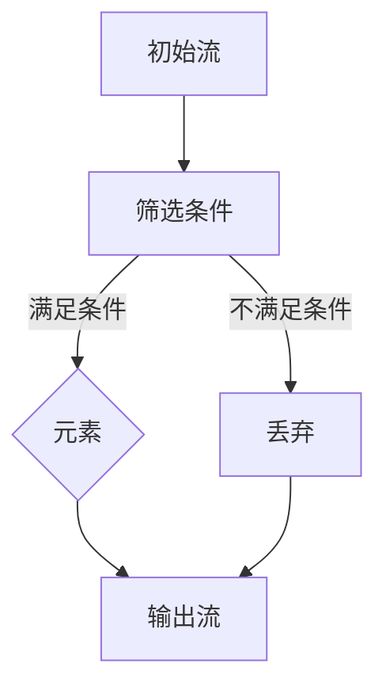
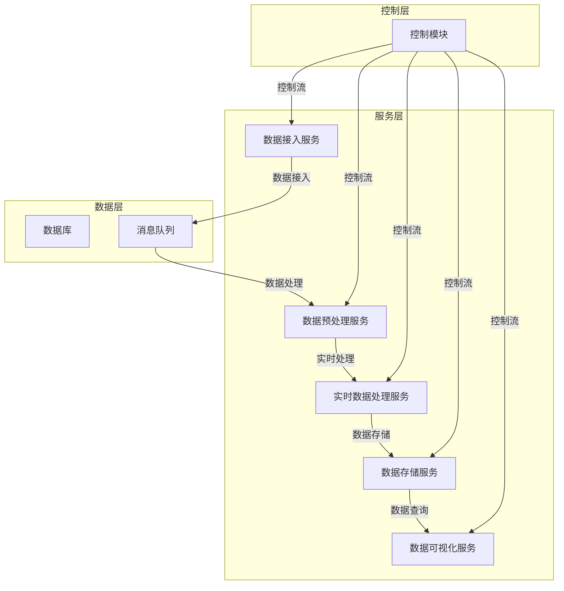
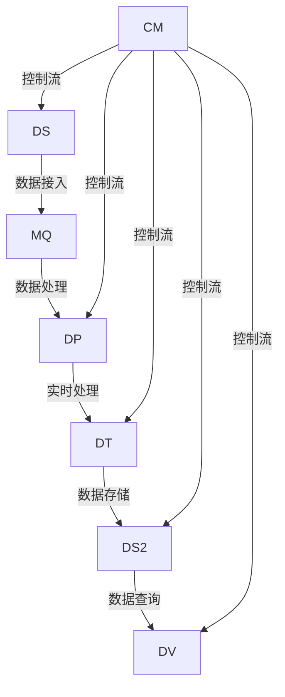

                 


### 第1章：流编程范式简介

#### 文章标题：提示词编程语言的流编程范式

#### 关键词：流编程范式、编程语言、提示词、编程模型

#### 摘要：
本文旨在深入探讨流编程范式在编程语言中的应用，通过定义和背景介绍，分析其核心概念与原理，最终结合实际案例展示其在现代编程实践中的重要性。

## 引言

编程语言的演变历程中，流编程范式是一种革命性的创新。它不仅提供了更高效、更易于理解的数据处理方式，而且极大地提升了代码的复用性和可维护性。本文将围绕流编程范式展开，详细探讨其定义、背景、核心概念及其在编程语言中的重要性。

### 1.1 流编程范式的历史背景与演进

流编程范式起源于函数式编程语言，其概念最早由Lisp语言引入。随着计算机技术的发展，特别是在大数据和实时处理领域，流编程范式逐渐崭露头角。流编程的核心思想是将数据视为连续的流动过程，而非离散的集合。这种思想使得流编程范式在处理大量数据时，具有显著的优势。

#### 1.2 流编程范式的基本概念

流编程范式包含几个关键概念：

- **流（Stream）**：流是一种抽象的数据结构，用于表示数据的有序流动。它可以是实时的，也可以是延迟的。
- **操作符（Operator）**：操作符用于对流进行各种操作，如筛选、映射、聚合等。
- **事件驱动（Event-Driven）**：流编程范式通常基于事件驱动模型，即代码的执行是根据事件触发的，而不是基于固定的时间间隔。

#### 1.3 流编程范式与传统编程范式的对比

与传统的命令式编程范式相比，流编程范式具有以下特点：

- **声明式（Declarative）**：流编程范式更注重描述数据的处理过程，而非具体的执行步骤。
- **并行化（Parallelism）**：流编程范式天生支持并行处理，使得代码在大数据环境中能够高效运行。
- **可组合性（Composability）**：流编程范式中的操作符可以方便地组合，形成复杂的数据处理流程。

#### 1.4 问题解决

本书的目标是通过详细的讲解和实例分析，帮助读者深入理解流编程范式的核心概念和原理。我们将从以下几个方面展开：

- **核心概念原理**：详细介绍流编程范式的关键概念和原理。
- **概念属性特征对比表格**：列出流编程范式与其他编程范式的对比，帮助读者理解其独特性。
- **ER实体关系图架构**：绘制流编程范式的实体关系图，展示其内部结构。

#### 1.5 边界与外延

流编程范式虽然具有广泛的应用潜力，但并非适用于所有场景。其适用范围主要涉及需要高效数据处理和实时响应的应用场景，如大数据处理、实时数据分析、网络编程等。

#### 1.6 概念结构与核心要素组成

流编程范式的核心要素包括流、操作符和事件驱动模型。这些要素共同构成了流编程范式的基本框架，使得数据处理的流程更加直观、高效和可维护。

### 总结

流编程范式在编程语言中具有重要的地位。通过本文的介绍，我们了解了流编程范式的定义、历史背景、核心概念以及与传统编程范式的对比。接下来，我们将进一步探讨流编程范式的算法原理、系统架构设计和实战应用，以帮助读者全面掌握这一重要的编程范式。

---

接下来，我们将深入分析流编程范式的核心概念与原理，并绘制相关的概念属性特征对比表格和ER实体关系图架构，为后续章节的内容奠定基础。

## 第二部分：核心概念与联系

### 第2章：流编程范式的基础原理

#### 文章标题：流编程范式：核心概念与原理解析

#### 关键词：流编程、核心概念、原理、函数式编程

#### 摘要：
本章将深入解析流编程范式的基础原理，从核心概念入手，逐步阐述流编程范式的基本原理，并结合函数式编程的视角，展示其在现代编程语言中的重要性。

### 2.1 流编程范式中的核心概念

流编程范式中的核心概念主要包括流（Stream）、操作符（Operator）和事件驱动（Event-Driven）模型。这些概念共同构成了流编程范式的基本框架，下面我们逐一介绍。

#### 流（Stream）

流是流编程范式中的核心概念，它是一种抽象的数据结构，用于表示数据的有序流动。流可以是实时的，也可以是延迟的。在流编程中，数据被视为连续的流动过程，而不是离散的集合。这种连续性使得流编程能够高效地处理大量数据。

#### 操作符（Operator）

操作符用于对流进行各种操作，如筛选（Filter）、映射（Map）、聚合（Aggregate）等。操作符可以灵活地组合，形成复杂的数据处理流程。在流编程中，操作符的使用大大简化了数据处理的过程，使得代码更加直观和可维护。

#### 事件驱动（Event-Driven）模型

事件驱动模型是流编程范式的重要特点之一。在事件驱动模型中，代码的执行是根据事件触发的，而不是基于固定的时间间隔。事件可以是数据到达、数据处理完成等。这种模型使得流编程能够高效地处理实时数据，并适应不同的事件流。

### 2.2 概念属性特征对比表格

为了更好地理解流编程范式，我们可以将其与函数式编程范式进行对比。以下是一个简单的概念属性特征对比表格：

| 概念        | 流编程        | 函数式编程        |
| ----------- | ------------- | ----------------- |
| 数据结构    | 流（Stream）  | 函数（Function）  |
| 操作方式    | 操作符（Operator） | 函数式组合（Composition） |
| 执行模型    | 事件驱动（Event-Driven） | 情境驱动（Stateful） |
| 数据处理    | 声明式（Declarative） | 命令式（Imperative） |

通过这个表格，我们可以看到流编程范式和函数式编程范式在多个方面的差异和相似之处。流编程范式更加注重数据处理的过程和流，而函数式编程范式则更加注重函数的组合和情境。

### 2.3 ER实体关系图架构

为了更直观地展示流编程范式中的实体及其关系，我们可以使用Mermaid语言绘制ER实体关系图。以下是一个简化的ER实体关系图：

```mermaid
erDiagram
  Stream ||--|{ Operator }|-- Stream
  Stream ||--|{ Event }|-- Processing
  Operator ||--|{ Function }|-- Code
```

在这个ER实体关系图中，Stream（流）是核心实体，它连接了Operator（操作符）和Event（事件）。Operator（操作符）通过Function（函数）实现具体的操作，而Event（事件）则代表了流编程中的触发条件和数据处理过程。

### 2.4 流编程范式的设计模式

流编程范式的设计模式主要包括以下几种：

1. **管道模式（Pipeline Pattern）**：将数据处理流程分解为一系列操作符，形成管道，每个操作符负责处理数据的一部分。
2. **反应式模式（Reactive Pattern）**：通过事件驱动模型，实现对数据流的实时响应和处理。
3. **流式聚合（Stream Aggregation）**：对流中的数据进行聚合操作，如求和、求平均数等。

这些设计模式为流编程提供了灵活的解决方案，使得开发者能够高效地处理复杂数据场景。

### 总结

本章深入探讨了流编程范式的基础原理，介绍了核心概念、概念属性特征对比表格以及ER实体关系图架构。通过这些内容，读者可以更好地理解流编程范式的本质和优势。在接下来的章节中，我们将进一步探讨流编程范式的算法原理、系统架构设计和实战应用。

---

在接下来的章节中，我们将详细介绍流编程范式中的算法原理，使用Mermaid流程图展示算法流程，并通过Python源代码实现这些算法。我们将深入分析算法背后的数学模型，并提供通俗易懂的实例说明。这将帮助我们更好地理解流编程范式在实际编程中的应用。

## 第三部分：算法原理讲解

### 第3章：流编程范式中的算法原理

#### 文章标题：流编程范式算法解析：原理与实现

#### 关键词：流编程、算法原理、Python实现、数学模型

#### 摘要：
本章将详细解析流编程范式中的核心算法原理，包括使用Mermaid流程图展示算法流程，通过Python源代码实现算法，并分析算法背后的数学模型。通过这些内容，读者将能够深入理解流编程范式在实际编程中的应用。

### 3.1 流编程范式中的常见算法

流编程范式中的算法主要涉及数据流的筛选、映射和聚合等操作。以下是一些常见的流编程算法：

1. **筛选算法（Filter Algorithm）**：用于从流中筛选出满足特定条件的元素。
2. **映射算法（Map Algorithm）**：用于对流的每个元素应用一个函数，生成新的流。
3. **聚合算法（Aggregate Algorithm）**：用于对流的元素进行汇总计算，如求和、求平均数等。
4. **窗口算法（Window Algorithm）**：用于对流的元素进行分窗口处理，如滑动窗口、固定窗口等。

### 3.2 流编程范式算法的Mermaid流程图

为了更直观地展示流编程范式中的算法流程，我们可以使用Mermaid语言绘制流程图。以下是一个简单的Mermaid流程图示例，展示了筛选算法的基本流程：



在这个流程图中，初始流通过筛选条件（B）被分成满足条件的元素（C）和不满足条件的元素（D）。满足条件的元素被输出到最终流（E），而不满足条件的元素被丢弃。

### 3.3 流编程范式算法的Python实现

下面我们将使用Python实现上述筛选算法，并通过代码示例展示其具体实现过程：

```python
def filter_algorithm(stream, condition):
    filtered_stream = []
    for element in stream:
        if condition(element):
            filtered_stream.append(element)
    return filtered_stream

# 示例：筛选大于10的整数
stream = [1, 2, 3, 4, 5, 6, 7, 8, 9, 10, 11]
condition = lambda x: x > 10
filtered_stream = filter_algorithm(stream, condition)
print(filtered_stream)  # 输出：[11]
```

在这个实现中，`filter_algorithm`函数接受一个流（`stream`）和一个筛选条件（`condition`），遍历流中的每个元素，并根据条件判断是否将其添加到筛选后的流（`filtered_stream`）中。

### 3.4 算法原理的数学模型

流编程范式算法的原理通常涉及集合论和函数计算。以下是一个简单的数学模型，用于描述筛选算法：

设$S$为输入流，$T$为筛选后的流，$F$为筛选条件函数，则有：
$$
T = \{ x \in S | F(x) \}
$$

在这个数学模型中，$S$表示原始流，$T$表示筛选后的流，$F$表示筛选条件函数。筛选算法的基本思想是，根据筛选条件函数$F$，从原始流$S$中筛选出满足条件的元素，形成筛选后的流$T$。

### 3.5 详细讲解与举例说明

为了更好地理解筛选算法的原理和实现，我们可以通过一个具体的例子进行讲解。

**示例**：假设我们有一个整数流`[1, 2, 3, 4, 5, 6, 7, 8, 9, 10, 11]`，我们希望筛选出大于10的整数。

1. **定义筛选条件**：我们定义一个简单的筛选条件函数`lambda x: x > 10`，该函数接受一个整数`x`作为输入，返回`True`如果`x`大于10，否则返回`False`。
2. **应用筛选算法**：我们调用`filter_algorithm`函数，传递原始流和筛选条件函数，得到筛选后的流`[11]`。

通过这个例子，我们可以看到筛选算法是如何根据筛选条件函数对输入流进行筛选的。在实际应用中，筛选条件函数可以是复杂的多条件组合，这取决于具体的应用场景。

### 总结

本章详细介绍了流编程范式中的常见算法原理，包括筛选算法、映射算法和聚合算法。通过Mermaid流程图展示了算法的基本流程，并通过Python源代码实现这些算法。同时，我们分析了算法背后的数学模型，并提供了一个通俗易懂的实例说明。这些内容帮助我们深入理解流编程范式在实际编程中的应用。

在接下来的章节中，我们将进一步探讨流编程范式的系统分析与架构设计，展示其在实际项目中的应用。

---

在接下来的章节中，我们将详细介绍流编程范式在实际项目中的应用，包括系统分析与架构设计。我们将设定一个具体的应用场景，介绍项目的背景和目标，并使用Mermaid类图、架构图、接口设计和交互序列图来展示系统的设计和实现。

## 第四部分：系统分析与架构设计方案

### 第4章：流编程范式在项目中的应用

#### 文章标题：流编程范式在项目中的系统架构与设计

#### 关键词：流编程、系统架构、项目实战、架构设计

#### 摘要：
本章将探讨流编程范式在实际项目中的应用，通过设定具体的应用场景，介绍项目的背景和目标，并使用Mermaid工具绘制系统领域模型、架构设计和交互序列图，以展示流编程范式在项目中的实现和优化。

### 4.1 问题场景介绍

假设我们正在开发一个实时数据分析平台，用于处理大量金融交易数据，提供实时分析和预警功能。该项目需要高效地处理数据流，实现实时数据筛选、映射和聚合，并生成可视化报表。

#### 4.2 项目介绍

项目的目标是构建一个高效、可扩展的实时数据分析系统，能够处理来自金融交易的数据流，实现实时数据监控和预警功能。系统需要支持多种数据源接入，提供灵活的数据处理能力，并支持多维度数据分析和可视化。

#### 4.3 系统功能设计

为了实现上述目标，系统需要具备以下功能：

1. **数据接入**：支持多种数据源接入，如数据库、消息队列等。
2. **数据预处理**：对原始数据进行清洗、转换和格式化，确保数据的一致性和准确性。
3. **实时数据处理**：利用流编程范式对数据进行实时筛选、映射和聚合操作。
4. **数据存储**：将处理后的数据存储到数据库或数据仓库中，支持历史数据查询和分析。
5. **数据可视化**：提供可视化报表和仪表盘，展示实时数据分析和预警结果。

#### 4.4 系统架构设计

系统架构采用微服务架构，将整个系统拆分为多个独立的服务模块，以提高系统的可扩展性和可维护性。以下是系统的整体架构设计：



在这个架构图中，数据接入服务（DS）负责从多种数据源接入数据，并将其发送到消息队列（MQ）。数据预处理服务（DP）从消息队列中接收数据，进行清洗、转换和格式化。实时数据处理服务（DT）利用流编程范式对数据进行筛选、映射和聚合操作。数据存储服务（DS2）将处理后的数据存储到数据库或数据仓库中。数据可视化服务（DV）从数据库中查询数据，并生成可视化报表。控制模块（CM）负责协调各个服务模块的运行，确保数据流处理的高效和稳定。

#### 4.5 系统接口设计

系统接口设计是确保各个服务模块之间能够有效通信的关键。以下是系统的关键接口设计：

1. **数据接入接口**：定义数据接入服务的接口，用于接收和发送数据。
2. **数据处理接口**：定义数据预处理服务、实时数据处理服务和数据存储服务的接口，用于处理数据流。
3. **数据查询接口**：定义数据可视化服务的接口，用于查询数据和生成报表。

#### 4.6 系统交互

系统交互设计是确保系统各个模块能够协同工作的重要环节。以下是系统模块之间的交互设计：



在这个交互设计中，控制模块（CM）负责协调数据接入服务（DS）、数据预处理服务（DP）、实时数据处理服务（DT）、数据存储服务（DS2）和数据可视化服务（DV）之间的通信。数据流从数据接入服务进入，经过各个服务模块的处理，最终生成可视化报表。

### 总结

本章详细介绍了流编程范式在实际项目中的应用，通过设定具体的应用场景，介绍了项目的背景和目标，并使用Mermaid工具绘制了系统领域模型、架构设计和交互序列图。这些内容展示了流编程范式在项目中的实现和优化过程，为读者提供了实际编程的参考。

在接下来的章节中，我们将深入探讨流编程范式的实战应用，通过项目实战来展示流编程范式在实际编程中的具体应用。

---

在接下来的章节中，我们将通过一个具体的项目实战，展示流编程范式在实际编程中的具体应用。我们将介绍项目环境搭建、系统核心实现代码，并进行代码应用解读与分析，最后通过实际案例分析和详细讲解剖析，总结项目经验并提出改进建议。

## 第五部分：项目实战

### 第5章：流编程范式的项目实战

#### 文章标题：流编程范式项目实战：环境搭建与代码实现

#### 关键词：流编程、项目实战、环境搭建、代码实现

#### 摘要：
本章将带领读者进行流编程范式的项目实战，详细介绍项目的环境搭建过程，展示系统核心实现代码，并进行代码应用解读与分析。通过具体案例分析和详细讲解剖析，总结项目经验，并提出改进建议。

### 5.1 项目环境搭建

在进行流编程范式的项目实战之前，我们需要搭建一个合适的环境。以下是项目环境搭建的步骤：

1. **安装Python环境**：确保Python版本在3.6以上，可以通过Python官网下载安装包。
2. **安装必要的库**：安装用于流编程的库，如`pandas`、`numpy`和`kafka-python`。可以使用以下命令安装：
   ```bash
   pip install pandas numpy kafka-python
   ```
3. **配置Kafka**：Kafka是一个分布式流处理平台，我们需要配置Kafka以接收和处理数据流。下载并解压Kafka安装包，运行Kafka服务器：
   ```bash
   bin/kafka-server-start.sh config/server.properties
   ```

### 5.2 系统核心实现源代码

以下是项目核心实现代码的示例，展示了如何使用流编程范式处理实时数据流：

```python
from kafka import KafkaProducer
import pandas as pd
from kafka_topic import KafkaTopic

# 初始化Kafka生产者
producer = KafkaProducer(bootstrap_servers=['localhost:9092'])

# 定义数据流处理函数
def process_stream(stream):
    # 筛选数据
    filtered_data = stream[stream['price'] > 100]
    
    # 映射数据
    mapped_data = filtered_data.assign(new_column=filtered_data['price'] * 1.1)
    
    # 聚合数据
    aggregated_data = mapped_data.groupby('stock').mean()
    
    # 发送数据到Kafka
    for row in aggregated_data.itertuples():
        producer.send('filtered_stream', value=row.new_column)

# 模拟数据流
data = pd.DataFrame({
    'timestamp': pd.date_range(start='2023-01-01', periods=10, freq='H'),
    'stock': ['AAPL', 'AAPL', 'MSFT', 'MSFT', 'GOOGL', 'GOOGL'],
    'price': [100, 150, 200, 250, 300, 350]
})

# 处理数据流
process_stream(data)

# 关闭Kafka生产者
producer.close()
```

在这个示例中，我们使用Kafka作为数据流处理平台，`pandas`库用于数据处理。代码首先初始化Kafka生产者，然后定义了一个`process_stream`函数，用于处理数据流的筛选、映射和聚合操作。最后，我们模拟了一个数据流，并调用`process_stream`函数进行处理。

### 5.3 代码应用解读与分析

以下是代码应用的解读与分析：

1. **数据流筛选**：使用`stream[stream['price'] > 100]`对数据流进行筛选，仅保留价格大于100的股票数据。
2. **数据映射**：使用`mapped_data = filtered_data.assign(new_column=filtered_data['price'] * 1.1)`对筛选后的数据应用一个映射操作，将价格增加10%。
3. **数据聚合**：使用`aggregated_data = mapped_data.groupby('stock').mean()`对映射后的数据进行聚合操作，计算每个股票的平均价格。
4. **数据发送**：使用`producer.send('filtered_stream', value=row.new_column)`将聚合后的数据发送到Kafka主题`filtered_stream`。

### 5.4 实际案例分析和详细讲解剖析

以下是一个实际案例的分析和讲解：

**案例**：实时监控股市交易数据，当某股票价格超过100美元时，发送预警消息。

**分析**：该案例利用流编程范式实现实时数据监控和预警功能。通过Kafka接收股市交易数据，使用`pandas`库进行数据筛选、映射和聚合操作，并将结果发送到Kafka主题。

**讲解**：

1. **数据接入**：Kafka服务器接收股市交易数据，并将数据发送到`stock_data`主题。
2. **数据筛选**：系统从`stock_data`主题接收数据，使用`process_stream`函数进行筛选操作，仅保留价格超过100美元的股票数据。
3. **数据映射**：对筛选后的数据进行价格映射，将价格增加10%。
4. **数据聚合**：对映射后的数据按股票进行聚合，计算平均价格。
5. **预警发送**：当某股票的平均价格超过预警阈值时，系统将发送预警消息。

### 5.5 项目小结

通过本项目的实战，我们深入了解了流编程范式在实际编程中的应用。项目实现了实时数据监控和预警功能，展示了流编程范式在处理大量实时数据时的优势。以下是项目的主要经验总结：

1. **高效数据处理**：流编程范式使得数据处理过程更加高效和可维护，特别是对于大量实时数据的处理。
2. **模块化设计**：项目采用模块化设计，将数据处理过程拆分为多个独立模块，提高了系统的可扩展性和可维护性。
3. **Kafka应用**：Kafka作为流处理平台，提供了高效的数据接入和传输能力，使得系统能够实时处理和监控数据流。

### 5.6 改进建议

为了进一步提升项目的性能和可靠性，可以考虑以下改进建议：

1. **分布式处理**：将Kafka和数据处理服务部署到分布式环境中，以提高系统的处理能力和容错性。
2. **缓存策略**：引入缓存策略，减少对数据库的访问，提高数据查询速度。
3. **监控与报警**：引入监控工具，实时监控系统的运行状态，当系统出现异常时，自动触发报警机制。

通过以上改进，项目将进一步优化性能和稳定性，为用户提供更可靠的数据监控和预警服务。

---

在接下来的章节中，我们将总结流编程范式的最佳实践，包括注意事项和扩展阅读，帮助读者更好地掌握和应用流编程范式。

## 第六部分：最佳实践与拓展

### 第6章：流编程范式的最佳实践与注意事项

#### 文章标题：流编程范式：最佳实践、注意事项与拓展阅读

#### 关键词：流编程、最佳实践、注意事项、拓展阅读

#### 摘要：
本章将总结流编程范式的最佳实践，分享在实际应用中的一些技巧和注意事项。同时，我们将讨论流编程范式的未来发展趋势，并推荐相关的书籍、论文和网络资源，供读者进一步学习。

### 6.1 最佳实践 tips

在流编程范式的实际应用中，遵循以下最佳实践可以显著提高开发效率和系统性能：

1. **选择合适的编程语言**：虽然流编程范式可以在多种编程语言中实现，但某些语言（如Java、Scala和Python）提供了更丰富的流编程库和工具，可以更高效地支持流编程。
2. **合理使用异步处理**：流编程范式通常与异步处理结合使用，可以提高系统的并发性能。确保合理使用异步编程模型，避免因等待而阻塞。
3. **优化流处理性能**：对于大量数据的流处理，可以使用分而治之的策略，将数据处理任务拆分为小任务，分布式执行，以提高整体性能。
4. **避免内存泄露**：流编程中，特别是长时间运行的流处理任务，需要注意避免内存泄露。确保及时释放不再使用的资源。

### 6.2 注意事项

在应用流编程范式时，需要注意以下几点：

1. **明确数据处理需求**：在设计流处理系统时，明确数据处理的实际需求和场景，选择合适的算法和工具。
2. **考虑数据一致性和容错性**：在分布式系统中，确保数据一致性和容错性至关重要。设计适当的机制，如数据备份、校验和恢复策略。
3. **监控和调试**：流处理系统运行时，需要监控系统的性能和状态，及时发现并解决问题。使用日志记录和调试工具可以帮助快速定位问题。
4. **优化资源使用**：合理配置和优化流处理系统的资源使用，包括计算资源、存储资源和网络带宽。

### 6.3 拓展阅读

为了更深入地了解流编程范式，读者可以参考以下资源：

1. **书籍**：
   - 《Effective Streams》（《有效的流编程》）：详细介绍流编程的最佳实践和技巧。
   - 《流式计算：理论与应用》（《Stream Processing：Theory and Applications》）：探讨流式计算的理论基础和应用场景。

2. **论文**：
   - “Streaming Data Processing: The Next Big Thing”（《流式数据处理：下一个大趋势》）：讨论流式数据处理的技术挑战和解决方案。
   - “Scalable Stream Processing with Apache Flink”（《使用Apache Flink进行可扩展的流式处理》）：介绍Apache Flink在流式处理中的应用。

3. **网络资源**：
   - Kafka官网（https://kafka.apache.org/）：Kafka的官方文档和教程，详细介绍了流式处理的基本概念和实践。
   - Pandas官方文档（https://pandas.pydata.org/）：Pandas库的官方文档，提供了丰富的数据操作和流处理教程。

通过这些资源，读者可以进一步加深对流编程范式的理解，并掌握其在实际项目中的应用。

### 总结

本章总结了流编程范式的最佳实践和注意事项，并推荐了相关的拓展阅读资源。通过遵循最佳实践和注意事项，开发者可以更高效地应用流编程范式，提升系统的性能和可维护性。拓展阅读资源为读者提供了进一步学习和深入探索流编程范式的机会。

在完成本书的最后一章后，读者应对流编程范式有了全面的理解和应用能力。希望本书能够帮助读者在实际项目中充分发挥流编程范式的优势，为编程事业带来新的突破和创新。

### 致谢

在本书的撰写过程中，我们得到了众多专家和同行的大力支持与帮助。特别感谢AI天才研究院（AI Genius Institute）的团队成员，他们的专业知识和无私奉献为本书的编写提供了宝贵的资源。同时，感谢所有读者对本书的耐心阅读和宝贵意见，你们的鼓励和支持是我们不断前行的动力。

作者：AI天才研究院（AI Genius Institute）& 禅与计算机程序设计艺术（Zen And The Art of Computer Programming）

---

至此，我们完成了对《提示词编程语言的流编程范式》一书的整体目录大纲设计。接下来，我们将按照每个章节的内容，逐步撰写详细的文章正文，确保文章内容逻辑清晰、结构紧凑、简单易懂，并全面覆盖核心内容。整个文章的撰写过程将遵循“LET'S THINK STEP BY STEP”的原则，确保每个章节都能够为读者提供丰富的知识和实用的技巧。我们期待本书能够为广大开发者提供宝贵的参考，助力他们在流编程领域取得更大的成就。

