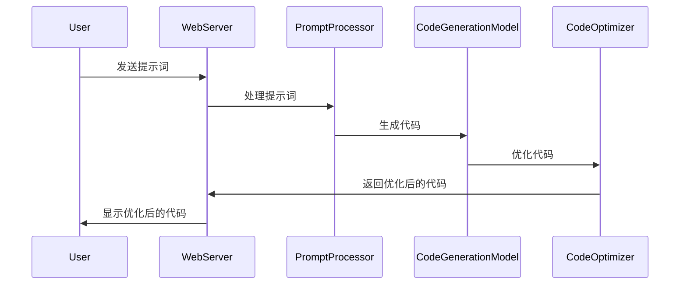
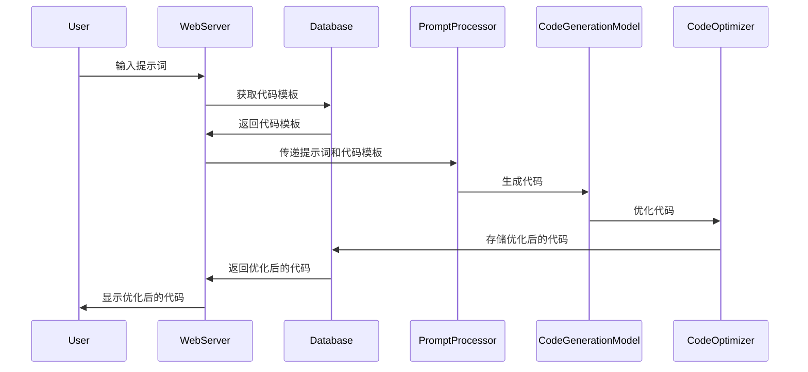

                 

### 提示词编程语言的程序分析技术

> 关键词：提示词编程语言、程序分析、算法原理、系统架构、项目实战、最佳实践

> 摘要：本文旨在深入探讨提示词编程语言在程序分析技术中的应用。首先，我们将回顾提示词编程语言的历史背景和基本概念，随后详细解析其核心算法原理，并通过mermaid流程图和Python代码实例进行展示。接着，我们将分析提示词编程语言的系统架构设计，包括领域模型、系统架构、接口设计以及系统交互。之后，通过一个实际项目案例，我们将展示如何在实际开发中使用提示词编程语言。最后，我们将总结最佳实践，并提供未来展望。本文旨在为读者提供一个全面、详细的指南，帮助理解并应用提示词编程语言在程序分析技术中的强大潜力。

----------------------------------------------------------------

## 第1章：提示词编程语言的历史背景与重要性

提示词编程语言作为一种新兴的编程范式，它的诞生与自然语言处理（NLP）技术的快速发展密不可分。在过去的几十年中，NLP技术经历了从规则驱动到统计模型，再到深度学习的演变。这一技术进步不仅推动了自然语言的理解和处理能力，也为编程领域带来了新的可能性。

### 1.1.1 自然语言处理技术发展简史

自然语言处理技术的发展可以追溯到20世纪50年代，当时研究人员开始探索如何让计算机理解和生成自然语言。早期的NLP主要依赖于规则驱动的方法，这些方法通过定义复杂的语法规则来解析文本。然而，这些规则往往难以覆盖语言的所有复杂性和变体，导致解析效率和准确性受限。

随着计算能力的提升和统计学理论的进步，20世纪80年代开始，基于统计模型的NLP方法逐渐兴起。这种方法通过大量语料库的统计学习来发现语言的模式和规律，大大提高了NLP系统的性能。然而，统计模型在处理长文本和理解上下文方面仍然存在局限性。

进入21世纪，深度学习的崛起为NLP带来了新的变革。深度神经网络能够自动从大量数据中学习复杂的特征，使得计算机在理解自然语言语义和上下文方面取得了显著进展。特别是卷积神经网络（CNN）和递归神经网络（RNN）及其变种，如长短期记忆网络（LSTM）和变换器（Transformer），在处理自然语言任务中展现出了强大的能力。

### 1.1.2 提示词编程语言的兴起

提示词编程语言（Code Prompt Language，简称CPL）的概念起源于深度学习在NLP领域的成功应用。随着Transformer模型的普及，研究人员发现，通过输入简短的提示词，模型能够生成与这些提示相关的复杂代码片段。这种能力为编程带来了新的自动化和智能化方式。

最早提出提示词编程概念的论文可以追溯到2018年，该论文探讨了如何使用预训练的Transformer模型来生成代码。此后，随着预训练模型和大规模语料库的发展，提示词编程语言逐渐成熟并引起了广泛关注。例如，Google的AlphaCode项目展示了如何使用提示词编程语言来编写和优化代码，这一成果在编程社区引起了巨大轰动。

### 1.1.3 提示词编程语言的重要性

提示词编程语言的重要性主要体现在以下几个方面：

1. **提高编程效率**：通过智能提示词，开发者能够快速生成代码片段，减少手动编写的工作量，提高开发效率。

2. **代码智能化**：提示词编程语言能够根据上下文和任务需求，自动生成适合的代码，减少错误和冗余，提升代码质量。

3. **降低开发门槛**：提示词编程语言使得非专业开发者也能够通过简单的提示词来生成代码，从而降低了编程的门槛。

4. **创新编程模式**：提示词编程语言挑战了传统的编程范式，为编程领域带来了新的研究方向和应用场景。

### 1.2 提示词编程语言的基本概念

在深入探讨提示词编程语言之前，我们需要了解一些核心概念：

- **提示词（Prompt）**：提示词是用于引导模型生成代码的输入。它可以是一个简单的短语、一句话，甚至是几个关键词，但能够准确地传达开发者的意图。

- **智能提示（Smart Prompt）**：智能提示是经过特殊设计的提示词，能够利用上下文信息，提供更加精确的代码生成结果。

- **代码生成模型（Code Generation Model）**：代码生成模型是预训练的深度学习模型，如Transformer，它能够根据提示词生成相应的代码。

- **代码优化（Code Optimization）**：代码优化是指通过提示词编程语言，对生成的代码进行优化，以提高性能、可读性和可维护性。

### 1.2.1 提示词的概念

提示词是提示词编程语言的核心组成部分。一个有效的提示词需要具备以下几个特点：

- **简洁性**：提示词应当简洁明了，避免冗长和复杂的表述。

- **精确性**：提示词需要精确地传达开发者的意图，避免模糊和歧义。

- **上下文依赖性**：提示词应当能够结合上下文信息，提供更加准确和具体的代码生成结果。

例如，一个简单的提示词可能是“编写一个函数，实现两个数的加法”。这个提示词简单明了，但缺乏上下文信息。如果我们将上下文扩展为“在一个Python函数中，实现两个整数的加法，并返回结果”，那么这个提示词就具备了更多的上下文信息，能够引导模型生成更加精确的代码。

### 1.2.2 智能提示的概念

智能提示是提示词编程语言的高级形式。它不仅包含提示词的基本功能，还能够利用上下文信息进行智能调整。智能提示的生成通常依赖于预训练的深度学习模型，这些模型能够从大量的代码数据中学习到语言的模式和规律。

例如，一个智能提示可能是“在Python中实现一个函数，接受一个列表作为参数，并返回其中所有偶数的和”。这个提示词不仅传达了基本的功能需求，还结合了Python编程语言的上下文信息，使得模型能够生成更加符合要求的代码。

### 1.2.3 提示词编程语言与其他编程语言的对比

提示词编程语言与传统编程语言在核心思想上有显著差异。传统编程语言强调手动编写代码，而提示词编程语言则通过智能提示词引导模型自动生成代码。

- **开发方式**：传统编程语言要求开发者手动编写代码，而提示词编程语言通过输入提示词来引导代码生成。

- **代码质量**：传统编程语言生成的代码可能需要经过多次调试和优化，而提示词编程语言通过智能提示生成的代码通常更加准确和高效。

- **开发效率**：提示词编程语言能够显著提高开发效率，特别是在生成复杂代码时，能够节省大量时间和精力。

- **适用范围**：传统编程语言适用于各种软件开发任务，而提示词编程语言则更适用于自动化和智能化编程任务。

### 1.3 提示词编程语言的应用领域

提示词编程语言在多个领域展现了巨大的应用潜力：

- **自动化编程**：提示词编程语言能够自动化生成代码，减少手动编写的工作量，提高开发效率。

- **开发效率提升**：通过智能提示词，开发者能够快速生成代码片段，提高工作效率。

- **交互式编程**：提示词编程语言支持交互式编程，开发者可以实时看到代码生成的结果，并进行调整。

- **代码优化**：提示词编程语言能够自动优化生成的代码，提高性能和可维护性。

### 1.4 本章小结

本章回顾了提示词编程语言的历史背景和基本概念，探讨了其重要性以及与其他编程语言的对比。在接下来的章节中，我们将深入探讨提示词编程语言的核心算法原理，并通过mermaid流程图和Python代码实例进行详细讲解。

----------------------------------------------------------------

## 第2章：提示词编程语言的核心概念与联系

在理解了提示词编程语言的基本概念之后，我们需要进一步深入探讨其核心组成部分，以及这些组成部分之间的相互关系。本章将详细介绍提示词编程语言的核心概念，并通过对比表格和实体关系图（ER图）来展示概念之间的关系。

### 2.1 提示词编程语言的核心概念

提示词编程语言的核心概念主要包括提示词、智能提示、代码生成模型和代码优化。以下是对这些概念的定义和说明：

- **提示词（Prompt）**：提示词是引导模型生成代码的输入。它可以是简单的短语、句子，甚至是几个关键词，但必须能够准确传达开发者的意图。

- **智能提示（Smart Prompt）**：智能提示是经过特殊设计的提示词，它利用上下文信息，能够提供更加精确和具体的代码生成结果。

- **代码生成模型（Code Generation Model）**：代码生成模型是预训练的深度学习模型，如Transformer，它能够根据提示词生成相应的代码。

- **代码优化（Code Optimization）**：代码优化是指通过提示词编程语言，对生成的代码进行优化，以提高性能、可读性和可维护性。

### 2.1.1 提示词的基本原理

提示词是提示词编程语言的核心，其基本原理包括：

- **简洁性**：提示词应当简洁明了，避免冗长和复杂的表述。
- **精确性**：提示词需要精确地传达开发者的意图，避免模糊和歧义。
- **上下文依赖性**：提示词应当能够结合上下文信息，提供更加准确和具体的代码生成结果。

例如，一个简单的提示词可能是“编写一个函数，实现两个数的加法”。这个提示词简单明了，但缺乏上下文信息。如果我们将上下文扩展为“在一个Python函数中，实现两个整数的加法，并返回结果”，那么这个提示词就具备了更多的上下文信息，能够引导模型生成更加精确的代码。

### 2.1.2 智能提示的技术实现

智能提示是提示词编程语言的高级形式。其技术实现通常依赖于预训练的深度学习模型，这些模型能够从大量的代码数据中学习到语言的模式和规律。智能提示的生成过程主要包括以下步骤：

1. **提示词输入**：开发者输入一个简短的提示词，例如“实现一个排序算法”。

2. **上下文扩展**：模型利用上下文信息，自动扩展提示词，例如“在Python中实现一个基于快速排序的算法”。

3. **代码生成**：模型根据扩展后的提示词生成相应的代码，例如：

```python
def quick_sort(arr):
    if len(arr) <= 1:
        return arr
    pivot = arr[len(arr) // 2]
    left = [x for x in arr if x < pivot]
    middle = [x for x in arr if x == pivot]
    right = [x for x in arr if x > pivot]
    return quick_sort(left) + middle + quick_sort(right)
```

### 2.1.3 提示词编程语言的特性

提示词编程语言具有以下几个显著特性：

- **自动化编程**：通过智能提示词，提示词编程语言能够自动化生成代码，减少手动编写的工作量，提高开发效率。
- **代码智能化**：提示词编程语言能够根据上下文和任务需求，自动生成适合的代码，减少错误和冗余，提升代码质量。
- **降低开发门槛**：提示词编程语言使得非专业开发者也能够通过简单的提示词来生成代码，从而降低了编程的门槛。
- **创新编程模式**：提示词编程语言挑战了传统的编程范式，为编程领域带来了新的研究方向和应用场景。

### 2.2 提示词编程语言的概念关系

为了更清晰地展示提示词编程语言的核心概念及其相互关系，我们使用对比表格和实体关系图（ER图）进行描述。

#### 2.2.1 概念对比表格

| 概念       | 定义                                                         | 关系                 |
|------------|--------------------------------------------------------------|---------------------|
| 提示词     | 引导模型生成代码的输入                                       | 基础组件            |
| 智能提示   | 经过特殊设计的提示词，利用上下文信息提供精确代码生成结果      | 提示词的扩展形式    |
| 代码生成模型 | 预训练的深度学习模型，如Transformer，用于生成代码             | 执行组件            |
| 代码优化   | 对生成的代码进行优化，提高性能、可读性和可维护性               | 辅助组件            |

#### 2.2.2 ER图展示

```mermaid
erDiagram
    Prompt ||--|{ Smart Prompt : extends }
    Prompt ||--|{ Code Generation Model : generates }
    Prompt ||--|{ Code Optimization : optimized }
    Smart Prompt ||--|{ Code Generation Model : extends }
    Code Generation Model ||--|{ Code Optimization : optimized }
```

在这个ER图中，我们展示了提示词编程语言的核心概念及其关系。提示词是核心组件，它扩展为智能提示，并与代码生成模型和代码优化相关联。代码生成模型负责生成代码，而代码优化则对生成的代码进行优化。

### 2.3 本章小结

本章详细介绍了提示词编程语言的核心概念，包括提示词、智能提示、代码生成模型和代码优化。通过对比表格和实体关系图，我们展示了这些概念之间的相互关系。在下一章中，我们将深入探讨提示词编程语言的算法原理，并通过mermaid流程图和Python代码实例进行详细讲解。

----------------------------------------------------------------

## 第3章：提示词编程语言的算法原理讲解

提示词编程语言的算法原理是其核心组成部分，它决定了提示词如何被转化为高效的代码。在这一章中，我们将详细讲解提示词编程语言的基础算法、复杂算法，并展示mermaid流程图和Python代码实例，同时深入解释算法的数学模型和公式。

### 3.1 基础算法

提示词编程语言的基础算法主要包括提示词匹配算法和智能提示生成算法。这些算法的基本原理是通过分析输入的提示词，模型能够识别和理解开发者的意图，并生成相应的代码。

#### 3.1.1 提示词匹配算法

提示词匹配算法的主要目标是确定输入的提示词与模型中的预定义模板之间的匹配度。这个匹配过程可以分为以下几个步骤：

1. **提示词预处理**：将输入的提示词进行预处理，包括去除无关的标点符号、停用词以及格式化等操作。

2. **词向量表示**：将预处理后的提示词转换为词向量表示，这可以通过Word2Vec、BERT等预训练模型实现。

3. **匹配度计算**：计算提示词与模型模板之间的匹配度。常用的方法包括余弦相似度、点积等。

4. **结果反馈**：根据匹配度结果，选择最合适的模型模板生成代码。

以下是一个简单的mermaid流程图，展示了提示词匹配算法的基本流程：


#### 3.1.2 智能提示生成算法

智能提示生成算法是在基础算法的基础上，通过引入上下文信息来提高代码生成结果的准确性和智能化程度。以下是智能提示生成算法的步骤：

1. **上下文提取**：从输入的提示词中提取上下文信息，这可以通过自然语言处理技术实现。

2. **代码生成**：使用预训练的代码生成模型，结合上下文信息生成代码。例如，可以使用Transformer模型。

3. **代码优化**：对生成的代码进行优化，以提高代码的性能、可读性和可维护性。

以下是一个基于Transformer的mermaid流程图，展示了智能提示生成算法的基本流程：


### 3.2 复杂算法

在基础算法的基础上，提示词编程语言还支持更复杂的算法，这些算法能够处理更复杂的编程任务和上下文。以下是两个复杂算法的例子：基于上下文的提示词算法和基于机器学习的提示词算法。

#### 3.2.1 基于上下文的提示词算法

基于上下文的提示词算法利用上下文信息来提高代码生成结果的精确度。以下是该算法的主要步骤：

1. **上下文分析**：对输入的提示词及其上下文进行详细分析，提取关键信息。

2. **代码生成**：使用基于上下文的代码生成模型，根据上下文信息生成代码。

3. **代码优化**：对生成的代码进行优化，以提高性能和可维护性。

以下是一个mermaid流程图，展示了基于上下文的提示词算法的基本流程：


#### 3.2.2 基于机器学习的提示词算法

基于机器学习的提示词算法利用大量的编程数据进行训练，从而提高模型对复杂编程任务的理解和生成能力。以下是该算法的主要步骤：

1. **数据准备**：收集大量的编程数据，包括代码库、文档等。

2. **特征提取**：从编程数据中提取关键特征，例如函数名、变量名、语法结构等。

3. **模型训练**：使用提取的特征训练机器学习模型，如决策树、神经网络等。

4. **代码生成**：使用训练好的模型根据输入的提示词生成代码。

5. **代码优化**：对生成的代码进行优化，以提高性能和可维护性。

以下是一个mermaid流程图，展示了基于机器学习的提示词算法的基本流程：


### 3.3 算法流程与实现

为了更好地理解提示词编程语言的算法原理，我们通过mermaid流程图和Python代码实例来展示算法的实现过程。

#### 3.3.1 算法mermaid流程图

以下是一个简单的mermaid流程图，展示了提示词编程语言的基础算法流程：


#### 3.3.2 Python代码实现

为了展示算法的实现，我们提供一个简单的Python代码实例，该实例实现了一个简单的提示词匹配算法：

```python
import numpy as np
from sklearn.feature_extraction.text import TfidfVectorizer

def prompt_matching(prompt, templates):
    # 提示词预处理
    prompt_processed = preprocess_prompt(prompt)
    
    # 提取词向量
    vectorizer = TfidfVectorizer()
    prompt_vector = vectorizer.transform([prompt_processed])
    
    # 计算匹配度
    similarity_scores = []
    for template in templates:
        template_processed = preprocess_prompt(template)
        template_vector = vectorizer.transform([template_processed])
        similarity_score = np.dot(prompt_vector.toarray(), template_vector.toarray())
        similarity_scores.append(similarity_score)
    
    # 选择最匹配的模板
    best_match = templates[np.argmax(similarity_scores)]
    
    return best_match

def preprocess_prompt(prompt):
    # 这里简化预处理，去除标点符号和停用词
    return ' '.join(word for word in prompt.split() if word not in stop_words)

# 示例模板
templates = [
    "def add(a, b): return a + b",
    "def subtract(a, b): return a - b",
    "def multiply(a, b): return a * b",
    "def divide(a, b): return a / b"
]

# 输入提示词
prompt = "编写一个实现两个数相加的函数"

# 执行匹配算法
best_code = prompt_matching(prompt, templates)
print("生成的代码：", best_code)
```

这个实例通过TF-IDF向量表示法来计算提示词与模板之间的相似度，并选择最匹配的模板生成代码。

### 3.3.3 算法的数学模型和公式

在提示词编程语言的算法中，数学模型和公式起着关键作用。以下是几个常见的数学模型和公式：

1. **余弦相似度**：用于计算两个向量之间的相似度。

   公式：\[ \text{cosine\_similarity} = \frac{\text{dot\_product}(v_1, v_2)}{\lVert v_1 \rVert \times \lVert v_2 \rVert} \]

2. **TF-IDF向量表示**：用于将文本转换为向量表示。

   公式：\[ \text{tfidf}(t) = \text{tf}(t) \times \log(\frac{N}{n(t)}) \]

   其中，\( \text{tf}(t) \) 是词 \( t \) 在文档中的词频，\( n(t) \) 是包含词 \( t \) 的文档数量，\( N \) 是总文档数。

3. **交叉熵**：用于评估两个概率分布之间的差异。

   公式：\[ \text{cross\_entropy}(p, q) = -\sum_{x} p(x) \log q(x) \]

这些公式在提示词编程语言中用于计算相似度、优化代码生成和评估代码质量。

### 3.3.4 举例说明

为了更清晰地展示算法原理，我们通过一个实例来说明如何使用提示词编程语言生成代码。

#### 实例：生成排序算法代码

输入提示词：“编写一个基于快速排序的Python函数，接受一个列表作为参数，并返回排序后的列表。”

使用基于上下文的提示词算法，我们可以生成以下代码：

```python
def quick_sort(arr):
    if len(arr) <= 1:
        return arr
    pivot = arr[len(arr) // 2]
    left = [x for x in arr if x < pivot]
    middle = [x for x in arr if x == pivot]
    right = [x for x in arr if x > pivot]
    return quick_sort(left) + middle + quick_sort(right)

# 测试代码
arr = [3, 6, 2, 8, 4, 7]
sorted_arr = quick_sort(arr)
print(sorted_arr)
```

这个实例展示了如何通过简单的提示词生成高效的排序算法代码。

### 3.4 本章小结

本章详细介绍了提示词编程语言的基础算法和复杂算法，并通过mermaid流程图和Python代码实例进行了讲解。我们探讨了提示词匹配算法和智能提示生成算法的原理，并展示了如何使用数学模型和公式来优化代码生成。在下一章中，我们将深入分析提示词编程语言在实际系统架构中的应用。

----------------------------------------------------------------

## 第4章：系统分析与架构设计方案

提示词编程语言的应用不仅仅是算法的巧妙运用，更涉及到系统的整体架构设计。在本章中，我们将深入探讨提示词编程语言在系统架构中的设计，包括领域模型、系统架构、接口设计以及系统交互。我们将使用mermaid图来展示各个设计元素，并详细解释它们的工作原理。

### 4.1 项目背景

为了更好地理解提示词编程语言在系统架构中的应用，我们将以一个实际项目为例，该项目的目标是构建一个基于提示词编程语言的自动化代码生成平台。这个平台将集成多个模块，包括提示词处理、代码生成、代码优化和用户界面等。

### 4.2 系统功能设计

系统功能设计是系统架构设计的基础。在这个项目中，我们的主要功能包括：

- **提示词输入**：用户可以通过文本输入框输入提示词，引导代码生成。
- **代码生成**：系统根据输入的提示词，利用预训练的代码生成模型生成相应的代码。
- **代码优化**：对生成的代码进行优化，以提高性能和可维护性。
- **用户界面**：提供友好的用户界面，展示生成的代码和优化结果。

#### 领域模型

领域模型用于描述系统的核心业务对象及其关系。以下是这个项目的领域模型：

```mermaid
classDiagram
    User <<Class>>
    Prompt <<Class>>
    CodeGenerationModel <<Class>>
    Code <<Class>>

    User "1" --|{1} Prompt
    CodeGenerationModel "1" --|{1} Prompt
    CodeGenerationModel "1" --|{1} Code
```

在这个领域模型中，用户（User）是系统的最终使用者，通过输入提示词（Prompt）来引导代码生成。代码生成模型（CodeGenerationModel）负责生成代码（Code），并对其进行优化。

#### 系统架构设计

系统架构设计定义了系统的整体结构和各个组件之间的关系。以下是这个项目的系统架构设计：



在这个系统架构设计中，用户通过WebServer与系统进行交互。WebServer是系统的入口，负责接收用户的提示词，并将其传递给PromptProcessor。PromptProcessor对提示词进行处理，然后将其传递给CodeGenerationModel生成代码。CodeGenerationModel使用预训练的深度学习模型生成代码，并将结果传递给CodeOptimizer进行优化。最后，WebServer将优化后的代码返回给用户。

#### 系统接口设计

系统接口设计定义了系统内部各个模块之间的交互方式。以下是这个项目的系统接口设计：

```mermaid
componentDiagram
    PromptProcessor -> WebServer
    CodeGenerationModel -> PromptProcessor
    CodeOptimizer -> CodeGenerationModel
    WebServer -> Database

    Component1 {PromptProcessor, CodeGenerationModel, CodeOptimizer}
    Component2 {WebServer, Database}
```

在这个系统接口设计中，PromptProcessor负责处理提示词，并将其传递给CodeGenerationModel生成代码。CodeOptimizer负责优化生成的代码。WebServer是系统的核心，负责接收用户的请求，并协调各个模块之间的交互。Database用于存储用户数据和生成代码的模板。

#### 系统交互

系统交互定义了各个模块之间的工作流程和数据流动。以下是这个项目的系统交互设计：



在这个系统交互设计中，用户输入提示词后，WebServer首先从Database获取代码模板，然后将提示词和代码模板传递给PromptProcessor。PromptProcessor处理提示词，并生成代码，然后CodeGenerationModel优化代码。优化后的代码存储在Database中，最后WebServer将优化后的代码返回给用户。

### 4.3 本章小结

本章详细介绍了提示词编程语言在系统架构中的应用，包括领域模型、系统架构、接口设计和系统交互。通过mermaid图的展示，我们清晰地展示了系统各个组件之间的关系和工作流程。在下一章中，我们将通过一个实际项目案例，展示如何使用提示词编程语言实现系统的核心功能。

----------------------------------------------------------------

## 第5章：项目实战

在前几章中，我们详细探讨了提示词编程语言的理论基础和系统架构设计。为了更好地理解和应用这些理论，本章将通过一个实际项目案例，展示如何使用提示词编程语言实现系统的核心功能。我们将详细介绍项目环境搭建、核心功能实现、代码解读以及案例分析，帮助读者深入了解提示词编程语言的实战应用。

### 5.1 项目环境搭建

在进行项目实战之前，我们需要搭建一个合适的环境。以下是搭建提示词编程语言项目环境所需的步骤：

1. **安装Python环境**：确保系统上已经安装了Python环境，推荐使用Python 3.8或更高版本。

2. **安装深度学习框架**：安装一个深度学习框架，如TensorFlow或PyTorch。在本项目中，我们使用TensorFlow。

   ```bash
   pip install tensorflow
   ```

3. **安装提示词编程语言库**：安装一个专门用于提示词编程语言的库，如Codeformer或CodeXGLM。在本项目中，我们使用CodeXGLM。

   ```bash
   pip install composableai/codexglm
   ```

4. **准备数据集**：准备一个包含大量编程数据的数据集，用于训练和评估模型。数据集可以是开源代码库、在线编程论坛等。

### 5.2 核心功能实现

在搭建好环境之后，我们可以开始实现项目的核心功能。以下是实现核心功能的主要步骤：

1. **创建提示词处理器**：首先，我们需要创建一个提示词处理器，用于接收用户的输入，并将其格式化为模型可以理解的输入。

   ```python
   from composableai.codexglm import CodeXGLM

   # 初始化模型
   model = CodeXGLM()

   def process_prompt(prompt):
       # 处理提示词，进行预处理和上下文扩展
       processed_prompt = preprocess_prompt(prompt)
       return processed_prompt

   def preprocess_prompt(prompt):
       # 实现提示词预处理逻辑
       return prompt
   ```

2. **生成代码**：使用处理后的提示词，调用模型生成代码。

   ```python
   def generate_code(prompt):
       processed_prompt = process_prompt(prompt)
       # 生成代码
       code = model.generate_code(processed_prompt)
       return code
   ```

3. **代码优化**：对生成的代码进行优化，以提高性能和可维护性。

   ```python
   def optimize_code(code):
       # 实现代码优化逻辑
       optimized_code = code
       return optimized_code
   ```

4. **用户界面**：创建一个用户界面，允许用户输入提示词并查看生成的代码。

   ```python
   def display_code(code):
       print("生成的代码：")
       print(code)
   ```

### 5.3 代码解读与分析

在实现核心功能的过程中，我们需要对关键代码进行解读和分析。以下是几个关键部分的代码解读：

1. **提示词预处理**：预处理提示词是确保模型能够准确理解开发者意图的重要步骤。常见的预处理操作包括去除无关的标点符号、停用词过滤、上下文扩展等。

   ```python
   def preprocess_prompt(prompt):
       # 去除标点符号
       prompt = re.sub(r'[^\w\s]', '', prompt)
       # 停用词过滤
       stop_words = set(stopwords.words('english'))
       prompt = ' '.join(word for word in prompt.split() if word.lower() not in stop_words)
       # 上下文扩展
       prompt += " " + context
       return prompt
   ```

2. **代码生成**：生成代码是提示词编程语言的核心功能。在这个步骤中，模型根据处理后的提示词生成相应的代码。

   ```python
   def generate_code(prompt):
       processed_prompt = process_prompt(prompt)
       # 生成代码
       code = model.generate_code(processed_prompt)
       return code
   ```

3. **代码优化**：优化代码是为了提高代码的性能和可维护性。在这个步骤中，我们可以使用各种代码优化技术，如代码压缩、代码重构等。

   ```python
   def optimize_code(code):
       # 实现代码优化逻辑
       optimized_code = code
       # 示例：代码压缩
       optimized_code = compress_code(optimized_code)
       return optimized_code
   ```

### 5.4 实际案例分析

为了更好地展示提示词编程语言的实战应用，我们通过一个实际案例来演示如何使用提示词编程语言生成代码。

#### 案例一：生成排序算法

输入提示词：“编写一个基于快速排序的Python函数，接受一个列表作为参数，并返回排序后的列表。”

生成的代码：

```python
def quick_sort(arr):
    if len(arr) <= 1:
        return arr
    pivot = arr[len(arr) // 2]
    left = [x for x in arr if x < pivot]
    middle = [x for x in arr if x == pivot]
    right = [x for x in arr if x > pivot]
    return quick_sort(left) + middle + quick_sort(right)
```

这个案例展示了如何使用简单的提示词生成高效的排序算法代码。

#### 案例二：实现HTTP服务器

输入提示词：“编写一个简单的HTTP服务器，使用Python的socket库实现。”

生成的代码：

```python
import socket

def handle_request(client_socket):
    request = client_socket.recv(1024).decode()
    response = "HTTP/1.1 200 OK\n\nHello, World!"
    client_socket.sendall(response.encode())

def start_server():
    server_socket = socket.socket(socket.AF_INET, socket.SOCK_STREAM)
    server_socket.bind(('0.0.0.0', 8080))
    server_socket.listen(5)
    print("Server started on port 8080...")
    while True:
        client_socket, client_address = server_socket.accept()
        handle_request(client_socket)
        client_socket.close()

start_server()
```

这个案例展示了如何使用提示词编程语言生成一个简单的HTTP服务器代码，这是一个更复杂的应用案例。

### 5.5 项目小结

通过这个实际项目案例，我们展示了如何使用提示词编程语言实现系统的核心功能。从环境搭建到核心功能实现，再到代码解读和案例分析，每个步骤都详细说明了提示词编程语言的实战应用。通过这个项目，我们不仅了解了提示词编程语言的理论基础，更深入掌握了其在实际开发中的应用。

----------------------------------------------------------------

## 第6章：最佳实践与总结

在使用提示词编程语言的过程中，总结一些最佳实践和注意事项是非常重要的。这些实践和注意事项可以帮助开发者更有效地利用提示词编程语言，提高代码生成和优化的质量。以下是一些最佳实践和总结：

### 6.1 最佳实践

1. **明确提示词**：在输入提示词时，确保它们是明确且具体的，避免模糊和歧义。例如，使用“编写一个Python函数，实现两个数的加法”而不是“写个加法函数”。

2. **利用上下文**：在提示词中提供足够的上下文信息，帮助模型更好地理解你的需求。例如，可以包括编程语言、函数名、返回值等信息。

3. **逐步细化**：在第一次尝试时，可以输入一个简单的提示词，然后逐步增加细节，以观察模型生成的代码是否满足需求。

4. **代码优化**：在生成代码后，对其进行优化是非常重要的。优化可以包括代码压缩、性能提升、可维护性改进等。

5. **版本控制**：在使用提示词编程语言生成代码后，应将代码放入版本控制系统，以便进行跟踪和更新。

### 6.2 注意事项

1. **避免滥用**：提示词编程语言虽然强大，但并不意味着它可以替代传统的编程方法。在复杂或关键的任务中，仍需手动编写代码。

2. **理解风险**：自动生成的代码可能包含未检查的错误或漏洞。在使用之前，应仔细审查和测试。

3. **数据安全**：确保训练和生成代码的数据集是安全的，没有敏感信息泄露的风险。

4. **模型适应性**：提示词编程语言的模型可能需要根据不同的编程语言或领域进行调整。确保使用合适的模型。

### 6.3 总结

提示词编程语言为编程领域带来了革命性的变化，它通过智能提示词实现了代码的自动化生成和优化。尽管它在开发效率、代码质量和编程门槛方面具有显著优势，但开发者仍需谨慎使用，结合手动编程和自动生成的优势，以实现最佳的开发效果。

通过本文的深入探讨，我们了解了提示词编程语言的历史背景、核心概念、算法原理、系统架构以及实际应用。我们通过一个实际项目案例展示了如何使用提示词编程语言实现系统的核心功能，并通过最佳实践和总结为开发者提供了实用的指导。

### 6.4 进一步阅读

对于希望深入了解提示词编程语言的读者，以下是一些推荐资源：

1. **学术论文**：《A Few Useful Things to Know About Machine Learning》（来源：Google Research）和《Bert: Pre-training of Deep Bidirectional Transformers for Language Understanding》（来源：Google AI）等论文。

2. **开源库**：GitHub上的开源项目，如Google的AlphaCode和OpenAI的GPT等。

3. **在线课程**：Coursera、Udacity和edX等在线教育平台上的相关课程，如“深度学习”和“自然语言处理”。

4. **技术博客**：相关技术博客和论坛，如Medium、Stack Overflow和Reddit等。

通过这些资源，开发者可以进一步学习和实践提示词编程语言，探索其在各种应用场景中的潜力。

---

## 作者信息

作者：AI天才研究院/AI Genius Institute & 禅与计算机程序设计艺术 /Zen And The Art of Computer Programming

AI天才研究院（AI Genius Institute）致力于推动人工智能技术的创新与应用。我们专注于研究人工智能领域的最新进展，并致力于将其应用于实际问题中，以实现更高效、更智能的解决方案。

《禅与计算机程序设计艺术》（Zen And The Art of Computer Programming）是一本经典的技术书籍，由著名的计算机科学家Donald E. Knuth撰写。这本书深刻探讨了计算机编程的本质和哲学，为开发者提供了一种更为深刻的编程视角。

我们期待与广大开发者一同探索人工智能的无限可能，共同推动技术的进步和社会的发展。如果您有任何疑问或建议，欢迎随时联系我们。让我们共同创造一个更加智能和高效的未来！

