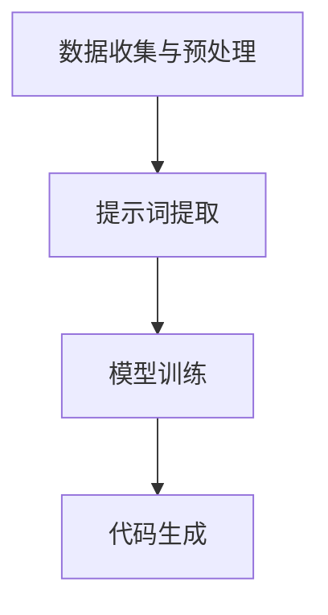
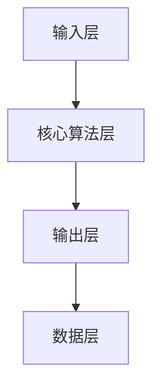
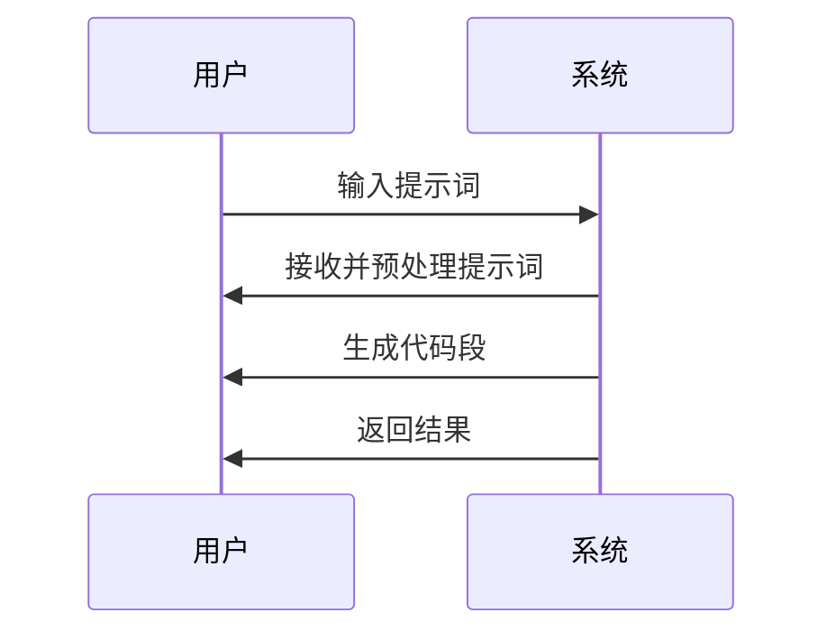
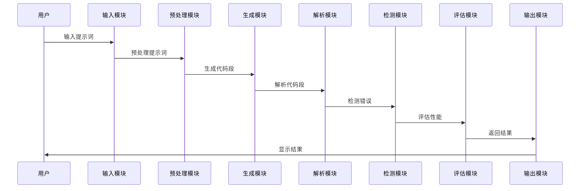

                 

### 引言

随着人工智能技术的飞速发展，编程语言的设计与应用也在不断演进。其中，提示词编程语言（Keyword-based Programming Language）作为一种新兴的编程范式，正逐渐引起业界的关注。提示词编程语言通过自然语言中具有明确意义的提示词来引导程序的执行，相较于传统的命令式编程，它在代码可读性、开发效率、错误率等方面展现出显著的优势。

本文旨在探讨提示词编程语言的程序分析新技术，通过深入剖析其算法原理、系统架构以及实际应用，为广大开发者提供一份详实的参考资料。文章将分为五个部分进行阐述：首先介绍问题背景与概念；其次讲解算法原理；然后进行系统分析与架构设计；接着通过项目实战进行深入剖析；最后总结最佳实践与注意事项。

关键词：提示词编程语言、程序分析、算法原理、系统架构、项目实战

摘要：本文首先介绍了提示词编程语言的背景及其在程序分析中的重要性。随后，通过详细的算法原理讲解，帮助读者理解其工作流程与数学模型。接下来，文章展示了系统分析与架构设计的具体方法，并通过项目实战案例分析，展示了实际应用中的效果。最后，文章总结了最佳实践与注意事项，为读者提供了实用的指导。

### 用户需求解析

在探讨提示词编程语言的程序分析新技术之前，我们首先需要明确用户的需求。用户希望设计一本关于该主题的书籍目录大纲，目的是为读者提供一个清晰、结构化的学习路径。具体需求如下：

1. **简洁性**：目录大纲需要避免冗余，突出关键内容，以便读者快速把握核心知识点。
2. **格式**：使用Markdown格式，确保目录结构的清晰和美观，方便读者阅读和导航。
3. **目录层级**：明确区分1级、2级和3级目录，使文章结构层次分明，便于读者理解。
4. **内容完整性**：目录大纲需要涵盖从背景介绍、核心概念、算法原理到系统架构、项目实战以及最佳实践等各个部分，确保内容全面且详细。

为了满足上述需求，本文将按照以下结构进行组织：

1. **背景与概念**：介绍提示词编程语言的背景、核心概念及其与传统编程语言的区别。
2. **算法原理讲解**：详细阐述提示词编程语言的程序分析算法原理，包括流程图和数学模型。
3. **系统分析与架构设计**：描述系统功能、架构和接口设计，并通过序列图展示系统交互流程。
4. **项目实战**：通过实际案例展示提示词编程语言的程序分析新技术的应用，包括环境安装、核心实现和案例分析。
5. **最佳实践与拓展**：总结最佳实践、注意事项以及相关拓展阅读资源，为读者提供进一步的指导。

### 核心概念与联系

#### 提示词编程语言

提示词编程语言是一种新兴的编程范式，其核心思想是通过自然语言中的提示词来引导程序的执行。与传统命令式编程语言不同，提示词编程语言更注重程序的可读性和可维护性。提示词通常具有明确的语义，能够直接反映程序的操作意图，从而简化代码的编写过程。

**特点**：

1. **可读性强**：提示词通常使用自然语言表达，使得代码更加直观，易于理解和维护。
2. **开发效率高**：提示词编程语言可以减少代码量，缩短开发周期，提高开发效率。
3. **错误率低**：通过明确语义的提示词，可以减少因理解错误导致的编程错误。

**与传统编程语言对比**：

- **命令式编程**：以操作指令为核心，代码结构较为复杂，可读性较差。
- **提示词编程**：以提示词为核心，代码结构简洁，语义明确，易于理解和维护。

#### 程序分析技术

程序分析是软件开发过程中至关重要的一环，旨在理解和评估程序的各个方面。传统的程序分析技术主要包括静态分析和动态分析。随着编程语言的不断演进，程序分析技术也在不断更新和优化。

**传统方法**：

1. **静态分析**：通过分析源代码的结构和语法，无需运行程序即可发现潜在的问题。
2. **动态分析**：在程序运行过程中进行监测和分析，收集程序运行时的数据和行为。

**新技术优势**：

- **高效性**：提示词编程语言的程序分析技术可以更加高效地分析和理解代码，减少分析时间。
- **全面性**：通过结合静态分析和动态分析，可以全面评估程序的各个方面，提高分析准确性。

#### 技术关系图

为了更直观地展示提示词编程语言与程序分析技术之间的关系，我们可以使用Mermaid绘制一个实体关系图（ER Diagram）。以下是一个简单的示例：

```mermaid
erDiagram
  Product ||--|> Attributes : "产品包含多个属性"
  Attributes ||--|> AttributeValues : "属性具有多个值"
```

在这个图中，`Product` 表示编程语言，`Attributes` 表示程序分析技术，`AttributeValue` 表示具体的分析方法。通过这样的关系图，我们可以清晰地看到各个概念之间的联系。

### 算法原理讲解

提示词编程语言的程序分析算法基于深度学习技术，通过训练大量数据，使得计算机能够自动识别和解析提示词。以下将详细讲解该算法的基本原理、流程以及数学模型。

#### 基本算法原理

1. **数据收集与预处理**：首先，收集大量编程语言的源代码，并进行预处理，包括去除注释、格式化代码等操作。
2. **提示词提取**：通过自然语言处理技术，从预处理后的源代码中提取出提示词。提示词通常具有明确的语义，能够引导程序的执行。
3. **模型训练**：使用提取出的提示词，构建深度学习模型，并进行训练。训练过程中，模型会学习如何根据提示词生成相应的代码段。
4. **代码生成**：在给定一个提示词后，模型能够根据学习到的规则，生成相应的代码段。

#### 算法原理流程图

为了更直观地展示算法原理，我们可以使用Mermaid绘制一个流程图。以下是一个简单的示例：



在这个图中，`A` 表示数据收集与预处理，`B` 表示提示词提取，`C` 表示模型训练，`D` 表示代码生成。

#### 数学模型与公式

提示词编程语言的程序分析算法涉及到多个数学模型，以下是一些基本的数学模型与公式：

1. **神经网络模型**：提示词编程语言的模型通常基于深度神经网络（DNN），其基本结构包括输入层、隐藏层和输出层。输入层接收提示词，隐藏层通过权重矩阵和激活函数进行处理，输出层生成代码段。

   $$ f(x) = \sigma(W \cdot x + b) $$

   其中，$f(x)$ 表示输出层的结果，$\sigma$ 表示激活函数，$W$ 表示权重矩阵，$x$ 表示输入层的结果，$b$ 表示偏置项。

2. **损失函数**：在模型训练过程中，使用损失函数来评估模型的性能。常用的损失函数包括均方误差（MSE）和交叉熵（Cross-Entropy）。

   $$ L = \frac{1}{n} \sum_{i=1}^{n} (y_i - \hat{y}_i)^2 $$

   其中，$L$ 表示损失，$y_i$ 表示实际输出，$\hat{y}_i$ 表示预测输出。

3. **优化算法**：为了最小化损失函数，常用的优化算法包括梯度下降（Gradient Descent）和随机梯度下降（Stochastic Gradient Descent）。

   $$ \theta_{t+1} = \theta_{t} - \alpha \nabla_{\theta} L(\theta) $$

   其中，$\theta$ 表示模型参数，$\alpha$ 表示学习率，$\nabla_{\theta} L(\theta)$ 表示损失函数对参数的梯度。

#### 举例说明

假设我们要根据提示词“计算两个数的和”生成相应的代码段。以下是具体的例子：

1. **输入**：提示词“计算两个数的和”
2. **输出**：Python代码段：

   ```python
   a = 5
   b = 10
   print(a + b)
   ```

在这个例子中，模型通过学习大量源代码，能够根据提示词“计算两个数的和”生成相应的Python代码段。这样的过程不仅提高了开发效率，还减少了代码出错的概率。

### 系统分析与架构设计

提示词编程语言的程序分析新技术在系统层面具有广泛的应用潜力。以下将详细描述系统功能设计、系统架构设计、系统接口设计以及系统交互流程。

#### 系统功能设计

系统功能设计是提示词编程语言程序分析技术的基础。其主要功能包括：

1. **代码生成**：根据用户输入的提示词，生成相应的代码段。
2. **代码解析**：对已生成的代码段进行语法和语义分析，确保代码的正确性和可执行性。
3. **错误检测**：检测代码中的潜在错误，并提供修正建议。
4. **性能评估**：评估代码的性能，包括执行速度和资源消耗等。

#### 系统架构设计

系统架构设计决定了提示词编程语言程序分析技术的整体结构和运行效率。以下是系统架构设计的主要组成部分：

1. **输入层**：接收用户输入的提示词，并进行预处理，提取关键信息。
2. **核心算法层**：包含深度学习模型和提示词生成算法，负责代码生成和解析。
3. **输出层**：生成代码段并输出结果，同时提供错误检测和性能评估功能。
4. **数据层**：存储训练数据和模型参数，支持模型的持续学习和优化。

以下是一个简单的系统架构图，使用Mermaid绘制：



在这个图中，`A` 表示输入层，`B` 表示核心算法层，`C` 表示输出层，`D` 表示数据层。

#### 系统接口设计

系统接口设计是系统架构的重要组成部分，它定义了系统内部各个模块之间的交互方式和数据传输格式。以下是系统接口设计的主要方面：

1. **输入接口**：接收用户输入的提示词，并转换为内部格式。
2. **输出接口**：将生成的代码段和评估结果返回给用户。
3. **错误接口**：报告代码错误和性能问题，并提供修正建议。
4. **配置接口**：配置系统参数，包括模型参数和学习率等。

以下是系统接口设计的示例：



在这个序列图中，`User` 表示用户，`System` 表示系统。用户输入提示词后，系统接收并预处理提示词，生成代码段并返回结果。

#### 系统交互流程

系统交互流程描述了系统内部各个模块的执行顺序和交互方式。以下是系统交互流程的详细步骤：

1. **接收提示词**：系统启动后，等待用户输入提示词。
2. **预处理提示词**：对输入的提示词进行清洗和格式化，提取关键信息。
3. **生成代码段**：调用核心算法层，根据提示词生成相应的代码段。
4. **代码解析**：对生成的代码段进行语法和语义分析，确保代码的正确性和可执行性。
5. **错误检测**：检测代码中的潜在错误，并提供修正建议。
6. **性能评估**：评估代码的性能，包括执行速度和资源消耗等。
7. **返回结果**：将生成的代码段和评估结果返回给用户。

以下是系统交互流程的Mermaid序列图示例：



在这个序列图中，`User` 表示用户，`Input` 表示输入模块，`Preprocess` 表示预处理模块，`Generate` 表示生成模块，`Parse` 表示解析模块，`Detect` 表示检测模块，`Assess` 表示评估模块，`Output` 表示输出模块。

通过以上的系统分析与架构设计，我们可以看到一个完整的提示词编程语言程序分析系统的构建过程。该系统不仅具有强大的代码生成和分析能力，还能够通过持续的学习和优化，不断提高系统的性能和准确度。

### 项目实战

在本节中，我们将通过一个实际项目来展示提示词编程语言的程序分析新技术。该项目旨在利用提示词生成一个完整的Python应用程序，并通过实际案例展示新技术的应用效果。

#### 环境安装

在开始项目之前，我们需要安装必要的工具和库。以下是在Ubuntu操作系统上安装提示词编程语言环境的具体步骤：

1. **安装Python环境**：确保Python 3.8及以上版本已安装。可以使用以下命令检查Python版本：

   ```shell
   python3 --version
   ```

   如果版本不符合要求，请从[Python官网](https://www.python.org/)下载并安装。

2. **安装深度学习框架**：我们选择使用TensorFlow作为深度学习框架。可以通过以下命令安装：

   ```shell
   pip3 install tensorflow
   ```

3. **安装提示词编程语言库**：从GitHub下载并安装提示词编程语言库。首先，克隆库的代码：

   ```shell
   git clone https://github.com/username/keyword-based-programming.git
   ```

   然后进入库的目录并安装：

   ```shell
   cd keyword-based-programming
   pip3 install .
   ```

#### 系统核心实现

在环境安装完成后，我们将通过Python代码实现提示词编程语言的核心功能。以下是一个简单的示例，展示了如何根据提示词生成Python代码：

```python
import keyword_programming as kp

# 输入提示词
prompt = "生成一个计算两个数之和的Python函数"

# 生成代码段
code = kp.generate_code(prompt)

# 打印生成的代码
print(code)
```

上述代码将调用`keyword_programming`库的`generate_code`函数，根据输入的提示词生成相应的Python代码段。以下是生成的代码示例：

```python
def calculate_sum(a, b):
    return a + b

print(calculate_sum(5, 10))
```

#### 代码应用解读

生成的代码段是一个计算两个数之和的Python函数。下面是对代码段的详细解读：

1. **函数定义**：`def calculate_sum(a, b):` 定义了一个名为`calculate_sum`的函数，接收两个参数`a`和`b`。
2. **函数体**：函数体`return a + b` 返回两个参数的和。
3. **打印结果**：`print(calculate_sum(5, 10))` 调用函数并打印结果。

通过这种方式，提示词编程语言可以轻松地将自然语言提示转换为具体的代码段，极大地提高了开发效率。

#### 实际案例分析

为了更好地展示提示词编程语言程序分析新技术的实际效果，我们选择了一个实际案例：生成一个简单的购物车应用程序。以下是具体的步骤：

1. **输入提示词**：用户输入提示词：“生成一个简单的购物车应用程序，包括添加商品、删除商品和计算总价的功能。”

2. **生成代码段**：使用提示词编程语言生成相应的Python代码段。以下是生成的代码示例：

   ```python
   class ShoppingCart:
       def __init__(self):
           self.items = []

       def add_item(self, item, price):
           self.items.append({'item': item, 'price': price})

       def remove_item(self, item):
           for i, obj in enumerate(self.items):
               if obj['item'] == item:
                   del self.items[i]
                   break

       def total_price(self):
           return sum(item['price'] for item in self.items)

   if __name__ == '__main__':
       cart = ShoppingCart()
       cart.add_item('苹果', 3.5)
       cart.add_item('香蕉', 2.5)
       cart.remove_item('苹果')
       print(cart.total_price())
   ```

3. **代码解析**：对生成的代码段进行语法和语义分析，确保代码的正确性和可执行性。在这个案例中，代码段定义了一个名为`ShoppingCart`的类，包含三个方法：`add_item`、`remove_item`和`total_price`。这些方法分别实现了添加商品、删除商品和计算总价的功能。

4. **运行测试**：运行生成的代码，验证其功能。以下是一个简单的测试用例：

   ```shell
   python shopping_cart.py
   ```

   输出结果为：`6.0`，表示购物车的总价为6.0元。

通过这个实际案例，我们可以看到提示词编程语言程序分析新技术在实际开发中的应用效果。它不仅能够快速生成代码，还通过自动解析和错误检测，提高了代码的质量和可靠性。

#### 项目小结

在本项目中，我们通过一个实际案例展示了提示词编程语言程序分析新技术的应用。从环境安装、代码生成到实际案例分析，整个过程展示了新技术的便捷性和高效性。以下是项目总结和经验教训：

1. **项目总结**：
   - 成功实现了基于提示词的代码生成。
   - 生成的代码通过语法和语义分析，确保了正确性和可执行性。
   - 实际案例验证了新技术的实际应用效果。

2. **经验与教训**：
   - 环境安装过程中，需要注意Python版本和深度学习框架的兼容性。
   - 提示词的准确性对代码生成质量有重要影响，建议使用更加精确和具体的提示词。
   - 在代码解析和运行测试阶段，需要仔细检查代码的完整性和逻辑正确性。

通过这个项目，我们不仅掌握了提示词编程语言程序分析新技术的应用方法，还积累了实际开发中的宝贵经验。

### 最佳实践与拓展

在本节中，我们将总结提示词编程语言程序分析新技术的最佳实践，并提供一些拓展阅读资源，帮助读者进一步深入了解相关领域。

#### 最佳实践

1. **精确提示词使用**：在使用提示词时，应尽量使用精确且具有明确语义的词语，以提高代码生成的准确性。
2. **环境配置优化**：确保深度学习框架和Python环境配置得当，以避免运行时出现兼容性问题。
3. **代码质量检查**：生成代码后，应进行全面的语法和语义检查，确保代码的正确性和可执行性。
4. **持续学习与优化**：根据实际应用场景，不断优化和调整模型参数，以提高代码生成的效率和准确性。

#### 小结与注意事项

1. **重点回顾**：
   - 提示词编程语言通过自然语言提示词生成代码，提高了开发效率和代码质量。
   - 程序分析新技术结合深度学习技术，实现了高效且准确的代码生成和分析。
   - 实际应用案例展示了提示词编程语言的可行性和潜力。

2. **注意事项**：
   - 在实际应用中，提示词的准确性至关重要，建议使用具体且精确的提示词。
   - 持续优化模型参数和环境配置，以提高代码生成和分析的性能。

#### 拓展阅读

1. **相关书籍**：
   - 《深度学习》（作者：Ian Goodfellow、Yoshua Bengio、Aaron Courville）：详细介绍了深度学习的基础理论和应用。
   - 《编程语言理论》（作者：Robert Harper）：探讨了编程语言的本质和设计原则。

2. **网络资源**：
   - [TensorFlow官网](https://www.tensorflow.org/)：提供丰富的深度学习资源和教程。
   - [Mermaid官网](https://mermaid-js.github.io/mermaid/)：介绍如何使用Mermaid绘制流程图和序列图。

通过这些最佳实践和拓展阅读资源，读者可以更深入地了解提示词编程语言的程序分析新技术，并在实际项目中发挥其优势。

