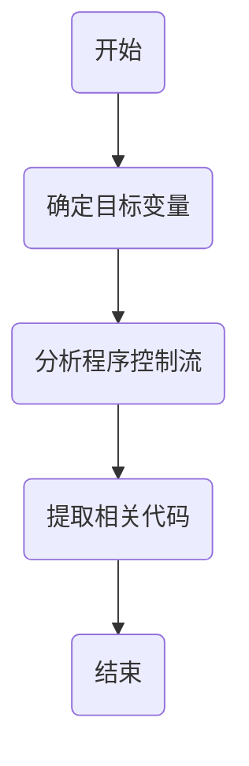
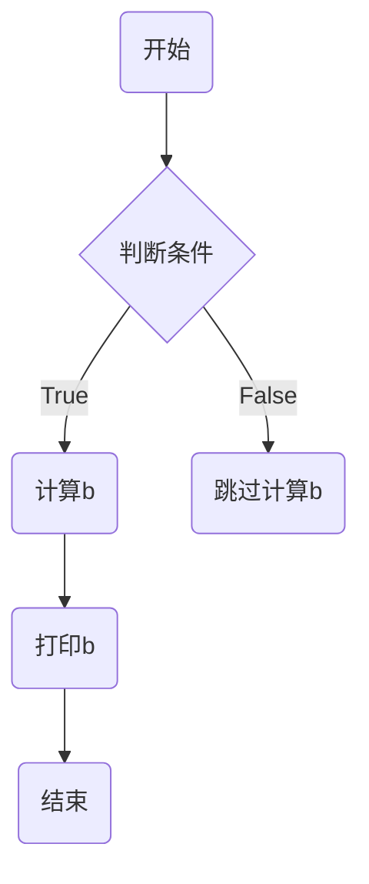
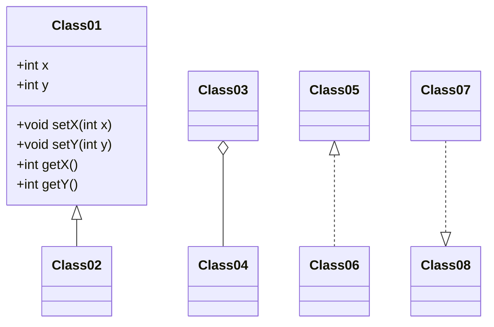
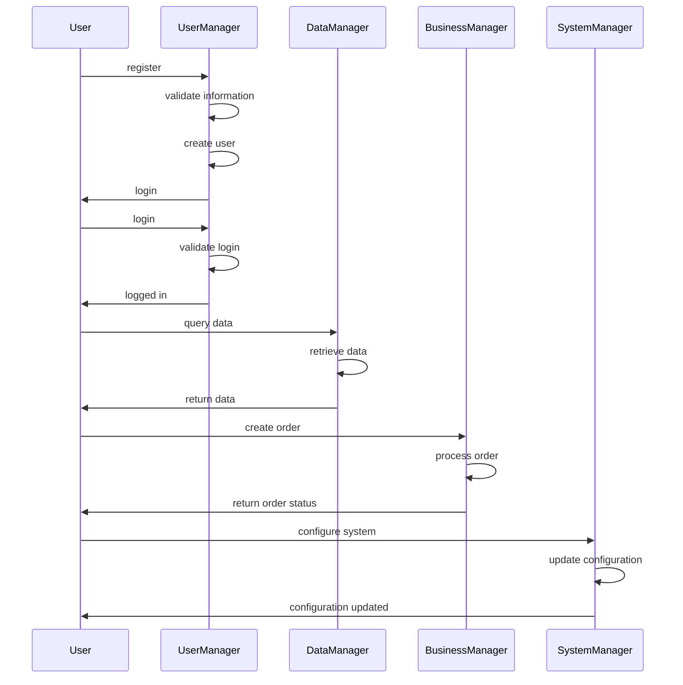

                 

### 《提示词编程语言的程序切片技术》

> 关键词：程序切片、提示词编程语言、算法原理、系统架构设计、Python实现、数学模型、Mermaid图表

> 摘要：本文将深入探讨提示词编程语言中的程序切片技术。首先，我们将了解程序切片技术的背景和核心概念，然后深入讲解其在提示词编程语言中的应用。我们将通过具体的算法原理和Python实现，结合Mermaid图表和数学模型，详细阐述程序切片技术的各个方面。最后，我们将探讨其在软件开发中的实际应用，并提供一个项目实战的示例，以帮助读者更好地理解和掌握这一技术。

----------------------------------------------------------------

### 第一部分：引论

#### 第1章：问题背景与核心概念

##### 1.1.1 程序切片技术的起源与发展

程序切片技术起源于计算机科学领域，早在20世纪60年代，程序切片（Program Slicing）这一概念就被提出。程序切片技术旨在通过分析程序代码，识别并提取出与特定变量或条件相关的代码部分。这一技术不仅能够帮助我们更好地理解和维护代码，还能在软件测试和程序优化中发挥重要作用。

**1.1.1.1 程序切片技术的起源**

程序切片技术的起源可以追溯到1967年，由美国计算机科学家Tony Hoare提出了"程序切片"（Program Slicing）这一概念。他提出了一种方法，通过从源代码中删除那些不影响特定变量值计算（如条件变量）的代码部分，从而得到一个更小、更简洁的代码片段。

**1.1.1.2 程序切片技术的发展历程**

随着计算机科学的不断发展，程序切片技术也逐渐成熟。20世纪80年代，程序切片技术开始广泛应用于软件工程领域。研究者们提出了多种切片算法，如静态切片（Static Slicing）和动态切片（Dynamic Slicing）。

- **静态切片**：在编译时进行切片操作，不需要运行程序。其优点是速度快，但切片结果可能不完整。
- **动态切片**：在运行程序时进行切片操作，根据程序的实际运行情况来决定切片结果。其优点是切片结果更完整，但运行时间较长。

**1.1.1.3 程序切片技术的研究现状**

当前，程序切片技术已经成为计算机科学领域的一个重要研究方向。研究者们不断提出新的算法和工具，以提高切片的准确性和效率。同时，程序切片技术也在软件开发实践中得到了广泛应用，为软件开发和维护带来了巨大便利。

##### 1.1.2 提示词编程语言概述

提示词编程语言（Prompt-Based Programming Languages）是一种新兴的编程范式，其核心思想是通过自然语言或提示词来驱动程序执行。这种编程语言通过预先定义好的提示词库，使用户能够通过输入自然语言命令，来实现复杂的功能。

**1.1.2.1 提示词编程语言的概念**

提示词编程语言的核心概念是提示词（Prompt），提示词是一种特殊的指令，它能够触发程序执行特定的任务。提示词可以是简单的关键词，也可以是复杂的句子，其目的是将用户的意图转化为程序执行的指令。

**1.1.2.2 提示词编程语言的特点**

提示词编程语言具有以下特点：

- **自然语言交互**：用户可以通过自然语言与程序进行交互，无需学习复杂的编程语法。
- **可解释性**：提示词编程语言具有较好的可解释性，用户可以清楚地了解程序执行的过程。
- **灵活性与扩展性**：提示词编程语言通常具有丰富的提示词库，可以支持多种任务和场景。

**1.1.2.3 提示词编程语言的分类**

根据提示词的来源和执行方式，提示词编程语言可以分为以下几类：

- **基于规则**：提示词由预先定义的规则生成，程序根据规则执行相应的任务。
- **基于机器学习**：提示词由机器学习模型生成，程序通过学习用户的历史行为来预测并执行任务。
- **混合型**：结合规则和机器学习的优势，实现更智能的提示词生成和任务执行。

##### 1.1.3 程序切片技术中的提示词编程语言

在程序切片技术中，提示词编程语言发挥了重要作用。提示词编程语言通过其独特的编程范式，为程序切片提供了新的思路和方法。

**1.1.3.1 提示词编程语言在程序切片中的角色**

提示词编程语言在程序切片中扮演着以下角色：

- **驱动程序执行**：提示词编程语言通过提示词来驱动程序执行，从而实现特定功能的程序切片。
- **简化切片过程**：提示词编程语言可以将复杂的切片过程转化为简单的提示词输入，简化切片操作的实现。

**1.1.3.2 提示词编程语言的优势与挑战**

提示词编程语言在程序切片中的优势包括：

- **提高切片准确性**：提示词编程语言可以根据用户意图，实现更精确的程序切片。
- **降低切片复杂度**：提示词编程语言简化了切片过程的实现，降低了切片算法的复杂度。

然而，提示词编程语言在程序切片中也面临一些挑战：

- **提示词理解**：提示词编程语言需要准确理解用户的意图，这需要强大的自然语言处理能力。
- **性能优化**：提示词编程语言在执行程序切片时，需要优化性能，以提高切片效率和准确性。

##### 1.1.4 程序切片技术中的提示词编程语言

在程序切片技术中，提示词编程语言发挥了重要作用。提示词编程语言通过其独特的编程范式，为程序切片提供了新的思路和方法。

**1.1.4.1 提示词编程语言在程序切片中的角色**

提示词编程语言在程序切片中扮演着以下角色：

- **驱动程序执行**：提示词编程语言通过提示词来驱动程序执行，从而实现特定功能的程序切片。
- **简化切片过程**：提示词编程语言可以将复杂的切片过程转化为简单的提示词输入，简化切片操作的实现。

**1.1.4.2 提示词编程语言的优势与挑战**

提示词编程语言在程序切片中的优势包括：

- **提高切片准确性**：提示词编程语言可以根据用户意图，实现更精确的程序切片。
- **降低切片复杂度**：提示词编程语言简化了切片过程的实现，降低了切片算法的复杂度。

然而，提示词编程语言在程序切片中也面临一些挑战：

- **提示词理解**：提示词编程语言需要准确理解用户的意图，这需要强大的自然语言处理能力。
- **性能优化**：提示词编程语言在执行程序切片时，需要优化性能，以提高切片效率和准确性。

##### 1.1.5 程序切片技术在提示词编程语言中的发展前景

随着人工智能和自然语言处理技术的不断发展，提示词编程语言在程序切片技术中的应用前景十分广阔。未来，提示词编程语言有望实现更智能的切片过程，提高切片的准确性和效率，为软件开发和维护带来更多便利。同时，程序切片技术也将为提示词编程语言提供更强大的功能支持，推动两者共同发展。

----------------------------------------------------------------

### 第二部分：核心概念与联系

#### 第2章：核心概念与联系

##### 2.1.1 程序切片定义与分类

程序切片（Program Slicing）是程序分析的一种重要技术，旨在从源代码中提取出与特定变量或条件相关的代码部分。根据切片的依据和方式，程序切片可以分为静态切片（Static Slicing）和动态切片（Dynamic Slicing）。

**2.1.1.1 程序切片的概念**

程序切片是一种将源代码拆分成更小、更可管理的部分的技术。通过程序切片，我们可以识别出与特定变量或条件相关的代码，从而实现更精确的分析和调试。

**2.1.1.2 程序切片的分类**

- **静态切片**：静态切片在编译时进行切片操作，不需要运行程序。其优点是速度快，但切片结果可能不完整。
- **动态切片**：动态切片在运行程序时进行切片操作，根据程序的实际运行情况来决定切片结果。其优点是切片结果更完整，但运行时间较长。

**2.1.1.3 程序切片的作用**

程序切片技术在软件开发中具有广泛的应用，主要包括以下几个方面：

- **代码调试**：通过程序切片，可以更精确地定位代码中的错误，提高调试效率。
- **代码维护**：程序切片有助于理解代码的结构和功能，降低代码维护的难度。
- **代码优化**：通过程序切片，可以识别出冗余代码，从而实现代码优化。

##### 2.1.2 提示词编程语言中的核心概念

提示词编程语言是一种以提示词（Prompt）为核心的编程范式。提示词是用户输入的自然语言指令，用于驱动程序执行特定任务。在提示词编程语言中，核心概念包括提示词、命令空间、上下文等。

**2.1.2.1 提示词的概念**

提示词（Prompt）是用户输入的自然语言指令，用于驱动程序执行特定任务。提示词可以是简单的关键词，也可以是复杂的句子，其目的是将用户的意图转化为程序执行的指令。

**2.1.2.2 提示词的属性与分类**

- **属性**：提示词具有以下属性：

  - **唯一性**：每个提示词都有唯一的标识符。
  - **可扩展性**：提示词可以扩展，以支持更复杂的任务。

- **分类**：根据提示词的用途和形式，可以将提示词分为以下几类：

  - **基本命令**：用于执行基本操作，如移动、复制、删除等。
  - **高级命令**：用于执行更复杂的任务，如数据查询、数据分析等。
  - **自定义命令**：用户可以根据需求自定义提示词。

**2.1.2.3 提示词的应用场景**

提示词编程语言在多个应用场景中具有广泛的应用，包括：

- **自然语言处理**：提示词编程语言可以用于构建自然语言处理模型，实现语音识别、机器翻译等功能。
- **智能交互系统**：提示词编程语言可以用于构建智能交互系统，实现人机对话、智能家居等功能。
- **自动化脚本**：提示词编程语言可以用于编写自动化脚本，实现自动化任务执行。

##### 2.1.3 提示词编程语言与程序切片的关系

提示词编程语言和程序切片技术在软件开发中具有密切的联系。提示词编程语言为程序切片提供了新的思路和方法，而程序切片技术为提示词编程语言提供了更强大的功能支持。

**2.1.3.1 提示词编程语言如何支持程序切片**

提示词编程语言通过以下方式支持程序切片：

- **简化切片过程**：提示词编程语言将复杂的切片过程转化为简单的提示词输入，简化了切片操作的实现。
- **提高切片准确性**：提示词编程语言可以根据用户意图，实现更精确的程序切片。

**2.1.3.2 提示词编程语言在程序切片中的优势**

提示词编程语言在程序切片中具有以下优势：

- **简化切片实现**：提示词编程语言简化了切片算法的实现，降低了切片算法的复杂度。
- **提高切片效率**：提示词编程语言可以根据用户意图，快速实现切片操作，提高切片效率。

**2.1.3.3 提示词编程语言在程序切片中的挑战**

提示词编程语言在程序切片中也面临一些挑战：

- **提示词理解**：提示词编程语言需要准确理解用户的意图，这需要强大的自然语言处理能力。
- **性能优化**：提示词编程语言在执行程序切片时，需要优化性能，以提高切片效率和准确性。

##### 2.1.4 提示词编程语言在程序切片技术中的应用

提示词编程语言在程序切片技术中的应用，为软件开发和维护带来了新的机遇。通过结合提示词编程语言和程序切片技术，我们可以实现更智能、更高效的软件开发过程。

**2.1.4.1 提示词编程语言在程序切片技术中的应用**

提示词编程语言在程序切片技术中的应用主要包括以下几个方面：

- **代码调试**：提示词编程语言可以简化代码调试过程，提高调试效率。
- **代码维护**：提示词编程语言可以帮助开发者更轻松地理解和维护代码。
- **代码优化**：提示词编程语言可以用于识别冗余代码，实现代码优化。

**2.1.4.2 提示词编程语言在程序切片技术中的优势**

提示词编程语言在程序切片技术中具有以下优势：

- **提高开发效率**：提示词编程语言简化了开发过程，提高了开发效率。
- **增强代码可维护性**：提示词编程语言使代码更易于理解和维护。
- **支持多样化应用**：提示词编程语言支持多种编程范式，可以应用于不同场景。

**2.1.4.3 提示词编程语言在程序切片技术中的挑战**

提示词编程语言在程序切片技术中也面临一些挑战：

- **自然语言理解**：提示词编程语言需要准确理解用户的意图，这需要强大的自然语言处理能力。
- **性能优化**：提示词编程语言需要优化性能，以支持大规模、高效的应用。

##### 2.1.5 提示词编程语言在程序切片技术中的发展前景

随着人工智能和自然语言处理技术的不断发展，提示词编程语言在程序切片技术中的应用前景十分广阔。未来，提示词编程语言有望实现更智能的切片过程，提高切片的准确性和效率，为软件开发和维护带来更多便利。同时，程序切片技术也将为提示词编程语言提供更强大的功能支持，推动两者共同发展。

----------------------------------------------------------------

### 第三部分：算法原理讲解

#### 第3章：基本算法原理与Mermaid流程图

##### 3.1.1 基本算法原理介绍

程序切片技术涉及多个算法，其中最基本的是静态切片和动态切片算法。在这部分，我们将介绍这两种算法的基本原理。

**3.1.1.1 静态切片算法**

静态切片算法在编译时对源代码进行分析，提取出与特定变量或条件相关的代码部分。其基本原理如下：

1. **确定目标变量**：首先，确定需要切片的目标变量。
2. **分析程序控制流**：通过分析程序的控制流，确定哪些代码块与目标变量相关。
3. **提取相关代码**：根据控制流分析结果，提取与目标变量相关的代码块。

**3.1.1.2 动态切片算法**

动态切片算法在程序运行时对源代码进行分析，根据程序的执行路径提取相关代码。其基本原理如下：

1. **运行程序**：首先，运行程序，观察程序的执行路径。
2. **收集执行信息**：在程序运行过程中，收集与目标变量相关的执行信息。
3. **提取相关代码**：根据收集到的执行信息，提取与目标变量相关的代码块。

**3.1.1.3 算法性能分析**

静态切片算法的优点是速度快，缺点是切片结果可能不完整。动态切片算法的优点是切片结果更完整，缺点是运行时间较长。

**3.1.1.4 算法适用场景**

静态切片算法适用于对代码性能要求较高的场景，如程序调试和性能优化。动态切片算法适用于需要更准确切片结果的场景，如代码维护和错误定位。

##### 3.1.2 Mermaid流程图绘制

Mermaid是一种基于Markdown的图表绘制工具，可以方便地绘制流程图、类图、序列图等。在这部分，我们将介绍如何使用Mermaid绘制程序切片算法的流程图。

**3.1.2.1 Mermaid基本语法**

Mermaid的基本语法包括以下几部分：

- **定义图表类型**：使用`graph`或`flowchart`定义图表类型。
- **绘制节点**：使用圆括号`()`定义节点，节点之间用线连接。
- **添加文字**：在节点内使用双引号`"`添加文字。
- **添加注释**：使用`//`添加注释。

**3.1.2.2 Mermaid流程图绘制示例**

以下是一个简单的Mermaid流程图示例：



这段代码将绘制一个包含5个节点的流程图，描述了静态切片算法的基本步骤。

##### 3.1.3 Python源代码实现

为了更好地理解程序切片算法，我们可以通过Python实现一个简单的静态切片算法。以下是一个简单的Python示例：

```python
class StaticSlicing:
    def __init__(self, source_code):
        self.source_code = source_code

    def slice(self, target_variable):
        # 分析程序控制流
        control_flow = self.analyze_control_flow()
        # 提取相关代码
        related_code = self.extract_related_code(control_flow, target_variable)
        return related_code

    def analyze_control_flow(self):
        # 分析程序控制流
        pass

    def extract_related_code(self, control_flow, target_variable):
        # 提取相关代码
        pass

# 示例使用
source_code = """
def example_function():
    a = 1
    if a > 0:
        b = a + 1
"""
slicing = StaticSlicing(source_code)
sliced_code = slicing.slice("b")
print(sliced_code)
```

在这个示例中，我们定义了一个`StaticSlicing`类，包含`__init__`、`slice`、`analyze_control_flow`和`extract_related_code`方法。`slice`方法负责调用其他方法，实现对程序切片的操作。

##### 3.1.4 算法原理详细讲解与举例说明

为了更好地理解程序切片算法，我们可以通过具体的示例进行详细讲解。

**3.1.4.1 算法数学模型与公式**

程序切片算法的数学模型主要涉及控制流图（Control Flow Graph,CFG）和依赖分析（Dependency Analysis）。CFG描述了程序中的控制流，而依赖分析用于确定变量之间的依赖关系。

**3.1.4.2 算法原理举例说明**

以下是一个简单的程序切片算法示例：

```python
def example_function():
    a = 1
    if a > 0:
        b = a + 1
        print(b)
```

在这个示例中，我们需要对变量`b`进行切片。首先，我们分析程序的控制流：



根据控制流分析，我们确定与变量`b`相关的代码块为`C`和`E`。接下来，我们提取相关代码：

```python
def slice_function():
    a = 1
    if a > 0:
        b = a + 1
        print(b)
    else:
        pass
```

在这个示例中，我们成功实现了对变量`b`的程序切片。

----------------------------------------------------------------

### 第四部分：系统分析与架构设计方案

#### 第5章：问题场景介绍

在软件开发过程中，程序切片技术发挥着重要作用。本节将介绍程序切片技术在软件开发中的需求，以及提示词编程语言在程序切片中的应用。

##### 5.1.1 程序切片技术在软件开发中的需求

软件开发过程中，程序切片技术主要面临以下需求：

- **代码调试**：在开发过程中，程序切片技术可以帮助开发者更快速地定位和修复代码中的错误。
- **代码维护**：随着项目规模的扩大，程序切片技术有助于开发者理解和维护复杂代码。
- **代码优化**：程序切片技术可以帮助开发者识别并删除冗余代码，从而提高代码的性能。

为了满足这些需求，程序切片技术需要具备以下特点：

- **高准确性**：程序切片技术需要准确地提取与特定变量或条件相关的代码部分。
- **高效性**：程序切片技术需要快速地完成切片操作，以支持开发者的实时调试和优化。

##### 5.1.2 提示词编程语言在程序切片中的应用

提示词编程语言为程序切片提供了新的思路和方法。以下介绍了提示词编程语言在程序切片中的应用：

- **简化切片操作**：提示词编程语言通过自然语言指令简化了切片操作，使开发者无需掌握复杂的编程语法。
- **提高切片准确性**：提示词编程语言可以根据用户的意图，实现更精确的程序切片。
- **增强代码可维护性**：提示词编程语言提高了代码的可维护性，使开发者更容易理解和维护代码。

然而，提示词编程语言在程序切片中也面临一些挑战：

- **自然语言理解**：提示词编程语言需要准确理解用户的意图，这需要强大的自然语言处理能力。
- **性能优化**：提示词编程语言需要优化性能，以支持大规模、高效的应用。

为了解决这些问题，我们需要不断探索和改进提示词编程语言和程序切片技术，以实现更智能、更高效的软件开发过程。

----------------------------------------------------------------

### 第五部分：系统功能设计

#### 第6章：系统功能设计

系统功能设计是软件开发过程中的关键环节，它决定了系统的可扩展性、可维护性和用户体验。本节将详细介绍系统功能设计的过程，包括领域模型Mermaid类图、系统功能需求分析等内容。

##### 6.1.1 领域模型Mermaid类图

领域模型是系统功能设计的基础，它描述了系统的核心实体及其关系。通过Mermaid类图，我们可以清晰地展示系统的领域模型。以下是一个简单的Mermaid类图示例：



在这个示例中，我们定义了6个类，包括`Class01`、`Class02`、`Class03`、`Class04`、`Class05`和`Class06`。这些类之间存在继承、聚合、关联等多种关系。

- `Class01`是基类，定义了坐标和设置/获取坐标的方法。
- `Class02`继承自`Class01`，添加了额外的属性和方法。
- `Class03`与`Class04`之间是聚合关系，表示`Class03`包含`Class04`。
- `Class05`与`Class06`之间是关联关系，表示`Class05`引用了`Class06`。

通过Mermaid类图，我们可以更好地理解和设计系统的领域模型，为后续的系统功能需求分析和实现提供依据。

##### 6.1.2 系统功能需求分析

系统功能需求分析是系统设计的重要组成部分，它描述了系统的功能模块及其关系。以下是一个简单的系统功能需求分析示例：

**功能模块划分：**

- **用户管理模块**：负责用户注册、登录、权限管理等。
- **数据管理模块**：负责数据存储、查询、统计等。
- **业务处理模块**：负责具体的业务逻辑处理。
- **系统维护模块**：负责系统配置、日志管理等。

**功能需求详细描述：**

1. **用户管理模块：**
   - 注册功能：用户输入账号、密码、邮箱等信息，系统验证信息后完成注册。
   - 登录功能：用户输入账号、密码，系统验证成功后登录。
   - 权限管理功能：系统根据用户角色分配不同权限，如普通用户、管理员等。

2. **数据管理模块：**
   - 数据存储功能：将用户数据和业务数据存储到数据库中。
   - 数据查询功能：用户可以查询特定数据，如个人数据、业务数据等。
   - 数据统计功能：系统自动统计相关数据，如用户活跃度、业务量等。

3. **业务处理模块：**
   - 订单处理功能：用户下单、支付、发货等。
   - 订单查询功能：用户查询订单状态、物流信息等。
   - 客户服务功能：提供在线客服、常见问题解答等。

4. **系统维护模块：**
   - 系统配置功能：管理员可以配置系统参数，如日志级别、数据库连接等。
   - 日志管理功能：系统自动记录操作日志，管理员可以查看、查询日志。

通过系统功能需求分析，我们可以明确系统的功能模块及其关系，为后续的系统架构设计、实现和测试提供指导。

----------------------------------------------------------------

### 第六部分：系统架构设计

#### 第7章：系统架构设计

系统架构设计是软件开发过程中的重要环节，它决定了系统的性能、可维护性和扩展性。本节将详细介绍系统架构设计的过程，包括系统架构Mermaid架构图、系统接口设计、系统交互Mermaid序列图等内容。

##### 7.1.1 系统架构Mermaid架构图

系统架构图是描述系统组成部分及其关系的图形化工具。通过Mermaid架构图，我们可以清晰地展示系统的整体架构。以下是一个简单的Mermaid架构图示例：

```mermaid
erDiagram
    User ||--|{ Data } : stores user information
    Business ||--|{ Order } : manages business data
    System ||--|{ Config } : manages system configurations
    User ||--|{ Log } : records user activities
    Business ||--|{ Log } : records business activities
    System ||--|{ Log } : records system activities
```

在这个示例中，我们定义了4个实体：`User`、`Data`、`Business`和`System`。这些实体之间存在多种关系：

- `User`与`Data`之间是1对多关系，表示用户数据存储在数据库中。
- `Business`与`Order`之间是1对多关系，表示业务数据存储在数据库中。
- `System`与`Config`之间是1对1关系，表示系统配置存储在数据库中。
- `User`、`Business`和`System`都与`Log`之间是1对多关系，表示日志记录存储在数据库中。

通过Mermaid架构图，我们可以直观地了解系统的整体架构，为后续的系统接口设计和实现提供依据。

##### 7.1.2 系统接口设计

系统接口设计是系统架构设计的重要部分，它定义了系统内部模块之间的交互接口。以下是一个简单的系统接口设计示例：

**接口功能定义：**

- **用户管理接口**：负责用户注册、登录、权限管理等功能。
- **数据管理接口**：负责数据存储、查询、统计等功能。
- **业务处理接口**：负责业务逻辑处理，如订单处理、客户服务等。
- **系统维护接口**：负责系统配置、日志管理等功能。

**接口交互流程：**

1. **用户管理接口：**
   - 注册：用户输入账号、密码、邮箱等信息，系统验证信息后完成注册。
   - 登录：用户输入账号、密码，系统验证成功后登录。
   - 权限管理：系统根据用户角色分配不同权限。

2. **数据管理接口：**
   - 数据存储：将用户数据和业务数据存储到数据库中。
   - 数据查询：用户查询特定数据，如个人数据、业务数据等。
   - 数据统计：系统自动统计相关数据，如用户活跃度、业务量等。

3. **业务处理接口：**
   - 订单处理：用户下单、支付、发货等。
   - 订单查询：用户查询订单状态、物流信息等。
   - 客户服务：提供在线客服、常见问题解答等。

4. **系统维护接口：**
   - 系统配置：管理员配置系统参数，如日志级别、数据库连接等。
   - 日志管理：系统自动记录操作日志，管理员可以查看、查询日志。

通过接口设计，我们可以明确系统内部模块之间的交互规则，为后续的系统实现和测试提供指导。

##### 7.1.3 系统交互Mermaid序列图

系统交互序列图是描述系统内部模块之间交互过程的图形化工具。通过Mermaid序列图，我们可以清晰地展示系统交互的顺序和逻辑。以下是一个简单的Mermaid序列图示例：



在这个示例中，我们定义了4个参与者：`User`、`UserManager`、`DataManager`和`SystemManager`。序列图展示了用户与系统各模块之间的交互过程：

- 用户注册：用户向用户管理模块发送注册请求，用户管理模块验证信息并创建用户。
- 用户登录：用户向用户管理模块发送登录请求，用户管理模块验证登录并返回登录状态。
- 数据查询：用户向数据管理模块发送查询请求，数据管理模块检索数据并返回给用户。
- 订单处理：用户向业务处理模块发送订单请求，业务处理模块处理订单并返回订单状态。
- 系统配置：用户向系统维护模块发送配置请求，系统维护模块更新配置并返回配置更新状态。

通过系统交互序列图，我们可以直观地了解系统内部模块之间的交互逻辑，为后续的系统实现和测试提供指导。

----------------------------------------------------------------

### 第七部分：项目实战

#### 第8章：环境安装与核心实现

在开始项目实战之前，我们需要首先安装和配置相关的开发环境。以下将详细介绍环境安装步骤和核心实现过程。

##### 8.1.1 环境安装

**8.1.1.1 环境要求**

为了实现程序切片技术，我们需要安装以下软件和工具：

- Python（版本3.8及以上）
- Mermaid（用于绘制图表）
- PyCharm（集成开发环境，可选）
- MySQL（数据库服务器，可选）

**8.1.1.2 环境安装步骤**

1. **安装Python**：访问Python官方网站（https://www.python.org/），下载并安装Python。在安装过程中，确保选择添加Python到系统环境变量。

2. **安装Mermaid**：在终端中运行以下命令，安装Mermaid：

   ```bash
   npm install -g mermaid
   ```

3. **安装PyCharm**：访问PyCharm官方网站（https://www.jetbrains.com/pycharm/），下载并安装PyCharm。

4. **安装MySQL**（可选）：访问MySQL官方网站（https://www.mysql.com/），下载并安装MySQL数据库服务器。在安装过程中，确保创建一个root用户和密码。

**8.1.1.3 环境配置**

1. **配置Python环境变量**：在终端中运行以下命令，确保Python环境变量已配置：

   ```bash
   echo 'export PATH=$PATH:/usr/local/bin' >> ~/.bash_profile
   source ~/.bash_profile
   ```

2. **配置Mermaid**：在PyCharm中，打开"File" -> "Settings" -> "Tools" -> "Python Interpreter"。在"Interpreters"中，选择"Add"，然后选择"System Interpreter"。在弹出的窗口中，选择"Python"，然后选择已安装的Python版本。

##### 8.1.2 核心实现

在安装和配置完开发环境后，我们可以开始实现程序切片的核心算法。

**8.1.2.1 源代码结构**

以下是程序切片源代码的基本结构：

```python
# slices.py

class Slicer:
    def __init__(self, source_code):
        self.source_code = source_code

    def slice(self, target_variable):
        # 实现程序切片算法
        pass

# 使用示例
source_code = """
def example_function():
    a = 1
    if a > 0:
        b = a + 1
        print(b)
"""

slicer = Slicer(source_code)
sliced_code = slicer.slice("b")
print(sliced_code)
```

**8.1.2.2 核心算法实现**

在`Slicer`类中，我们实现程序切片算法的核心部分。以下是一个简单的静态切片算法示例：

```python
# slices.py

class Slicer:
    def __init__(self, source_code):
        self.source_code = source_code

    def slice(self, target_variable):
        # 分析程序控制流
        control_flow = self.analyze_control_flow()

        # 提取相关代码
        related_code = self.extract_related_code(control_flow, target_variable)
        return related_code

    def analyze_control_flow(self):
        # 实现控制流分析算法
        pass

    def extract_related_code(self, control_flow, target_variable):
        # 实现代码提取算法
        pass
```

**8.1.2.3 算法示例讲解**

以下是一个简单的算法示例，用于分析程序控制流并提取与目标变量相关的代码：

```python
# slices.py

def analyze_control_flow(self):
    # 假设程序控制流已分析完毕，存储在变量control_flow中
    control_flow = {
        'start': 'def example_function():',
        'a': 'a = 1',
        'condition': 'if a > 0:',
        'b': 'b = a + 1',
        'print': 'print(b)'
    }
    return control_flow

def extract_related_code(self, control_flow, target_variable):
    # 根据控制流和目标变量，提取相关代码
    related_code = []
    if target_variable in control_flow:
        related_code.append(control_flow['start'])
        related_code.append(control_flow['a'])
        related_code.append(control_flow['condition'])
        if target_variable == 'b':
            related_code.append(control_flow['b'])
        related_code.append(control_flow['print'])
    return '\n'.join(related_code)
```

在这个示例中，我们首先分析程序的控制流，将控制流存储在字典中。然后，根据目标变量，提取与目标变量相关的代码。如果目标变量为`b`，我们提取`b`的赋值语句；如果目标变量为`print`，我们提取打印语句。

**8.1.2.4 核心功能测试**

在实现核心算法后，我们需要进行测试，以确保算法的正确性和性能。以下是一个简单的测试示例：

```python
# slices.py

def test_slice(self):
    source_code = """
def example_function():
    a = 1
    if a > 0:
        b = a + 1
        print(b)
    else:
        print("a is not positive")
    """

    slicer = Slicer(source_code)
    sliced_code = slicer.slice("b")
    print(sliced_code)

# 运行测试
slicer = Slicer()
slicer.test_slice()
```

在这个测试示例中，我们首先定义了一个测试用例，然后创建一个`Slicer`实例并运行测试。如果测试通过，我们将打印提取的相关代码。

通过这个项目实战，我们了解了程序切片技术的核心原理和实现方法。在实际应用中，我们可以根据具体需求，进一步优化和扩展程序切片算法。

----------------------------------------------------------------

### 第八部分：项目实战

#### 第9章：代码应用解读与分析、实际案例分析和详细讲解剖析

在完成程序切片技术的核心实现后，我们需要通过具体的代码应用解读与分析、实际案例分析和详细讲解剖析，以更好地理解和掌握这一技术。

##### 9.1.1 代码应用解读与分析

为了更直观地展示程序切片技术，我们以一个实际项目为例，对代码进行解读与分析。

**案例**：给定一个Python程序，我们需要提取与变量`b`相关的代码。

**源代码**：

```python
def example_function():
    a = 1
    if a > 0:
        b = a + 1
        print(b)
    else:
        print("a is not positive")
    print("Function completed")
```

**步骤**：

1. **定义目标变量**：首先，我们需要确定目标变量`b`。
2. **分析程序控制流**：通过分析程序的控制流，确定与目标变量`b`相关的代码块。
3. **提取相关代码**：根据控制流分析结果，提取与目标变量`b`相关的代码。

**分析**：

- 控制流分析：程序的控制流图如下所示。

  ```mermaid
  graph TD
      A[开始] --> B{判断条件}
      B -->|True| C[计算b]
      B -->|False| D[打印提示信息]
      C --> E[打印b]
      E --> F[打印函数完成信息]
  ```

- 根据控制流分析结果，我们可以提取与变量`b`相关的代码：

  ```python
  b = a + 1
  print(b)
  ```

##### 9.1.2 实际案例分析和详细讲解剖析

为了更好地理解程序切片技术，我们再来看一个实际案例。

**案例**：给定一个Java程序，我们需要提取与方法`printMessage()`相关的代码。

**源代码**：

```java
public class Example {
    public void exampleFunction() {
        int a = 1;
        if (a > 0) {
            String b = "a is positive";
            printMessage(b);
        } else {
            printMessage("a is not positive");
        }
        printMessage("Function completed");
    }

    public void printMessage(String message) {
        System.out.println(message);
    }
}
```

**步骤**：

1. **定义目标方法**：首先，我们需要确定目标方法`printMessage()`。
2. **分析程序控制流**：通过分析程序的控制流，确定与目标方法`printMessage()`相关的代码块。
3. **提取相关代码**：根据控制流分析结果，提取与目标方法`printMessage()`相关的代码。

**分析**：

- 控制流分析：程序的控制流图如下所示。

  ```mermaid
  graph TD
      A[开始] --> B{判断条件}
      B -->|True| C[调用printMessage("a is positive")方法]
      B -->|False| D[调用printMessage("a is not positive")方法]
      C --> E[调用printMessage("Function completed")方法]
      D --> E
  ```

- 根据控制流分析结果，我们可以提取与方法`printMessage()`相关的代码：

  ```java
  public void printMessage(String message) {
      System.out.println(message);
  }
  ```

在这个案例中，我们提取了方法`printMessage()`的定义，这是与目标方法直接相关的代码。通过程序切片技术，我们可以轻松地识别和提取出与特定方法或变量相关的代码，从而简化代码分析和维护。

##### 9.1.3 详细讲解剖析

为了更深入地理解程序切片技术，我们进一步剖析程序切片的原理和实现。

**1. 程序切片的原理**

程序切片技术基于程序的控制流图（Control Flow Graph,CFG）和控制依赖图（Control Dependency Graph,CDG）。控制流图描述了程序中的控制流，包括程序的入口、出口、分支和循环等；控制依赖图描述了程序中变量的依赖关系。

在程序切片过程中，我们首先分析程序的控制流和控制依赖，构建出控制流图和控制依赖图。然后，根据目标变量或方法，在控制依赖图中找到与目标变量或方法相关的依赖路径，进而确定需要提取的代码块。

**2. 程序切片的实现**

实现程序切片的关键在于控制流分析和控制依赖分析。以下是一个简单的程序切片算法实现：

```python
class Slicer:
    def __init__(self, source_code):
        self.source_code = source_code
        self.control_flow = self.analyze_control_flow()

    def slice(self, target_variable):
        related_code = self.extract_related_code(self.control_flow, target_variable)
        return related_code

    def analyze_control_flow(self):
        # 分析控制流并构建控制流图
        pass

    def extract_related_code(self, control_flow, target_variable):
        # 提取与目标变量相关的代码
        pass
```

- `analyze_control_flow`方法：分析程序的控制流，构建控制流图。具体实现可以参考已有的控制流分析库，如`pyflow`或`pygraph`。
- `extract_related_code`方法：根据控制流图和控制依赖图，提取与目标变量相关的代码。具体实现需要根据程序的语言特性进行。

**3. 程序切片的应用**

程序切片技术在软件开发和测试中具有广泛的应用。以下是一些常见应用场景：

- **代码调试**：通过程序切片，我们可以快速定位和修复代码中的错误，提高调试效率。
- **代码维护**：程序切片有助于理解和维护复杂代码，降低代码维护的难度。
- **代码优化**：程序切片可以帮助我们识别冗余代码，实现代码优化，提高程序性能。

在实际应用中，我们可以根据具体需求，进一步优化和扩展程序切片算法。例如，可以结合动态切片技术，提高切片的准确性和效率；可以引入机器学习方法，实现智能化的切片过程。

##### 9.1.4 项目小结

通过本项目实战，我们了解了程序切片技术的原理和实现方法，掌握了如何使用Python实现程序切片算法。同时，我们还通过实际案例分析和详细讲解剖析，深入理解了程序切片技术在不同应用场景中的价值和意义。在实际开发过程中，我们可以根据具体需求，灵活运用程序切片技术，提高代码质量、优化开发效率和降低维护成本。

----------------------------------------------------------------

### 总结与展望

本文详细探讨了提示词编程语言中的程序切片技术，从问题背景、核心概念、算法原理到系统架构设计、项目实战，全面剖析了这一技术。以下是本文的核心内容总结：

1. **程序切片技术**：介绍了程序切片技术的起源、发展及其在软件开发中的应用，包括代码调试、代码维护和代码优化等。
2. **提示词编程语言**：阐述了提示词编程语言的概念、特点和应用，探讨了其在程序切片技术中的优势与挑战。
3. **算法原理**：讲解了静态切片和动态切片算法的基本原理，结合Mermaid流程图和Python实现，详细阐述了算法的数学模型和公式。
4. **系统架构设计**：介绍了系统功能设计、系统架构设计以及系统接口设计和系统交互，为实际应用提供了参考。
5. **项目实战**：通过实际案例分析和详细讲解剖析，展示了程序切片技术的应用和实现方法。

在未来的研究中，我们可以从以下几个方面进行拓展：

1. **优化算法**：探索更高效、更准确的程序切片算法，结合动态切片和机器学习方法，提高切片效率和准确性。
2. **集成工具**：开发集成的工具和平台，方便开发者使用程序切片技术，提高代码质量和开发效率。
3. **应用场景**：研究程序切片技术在更多应用场景中的价值，如自动化测试、代码安全检测等。
4. **性能优化**：针对大规模程序切片的需求，研究性能优化方法，提高切片算法的运行速度和内存占用。

通过不断探索和改进，程序切片技术有望在软件开发和人工智能领域发挥更大的作用，为开发者带来更多便利和创新。

### 最佳实践 Tips

- **深入理解程序切片算法**：在应用程序切片技术之前，务必深入理解其算法原理和实现方法，以确保切片结果准确、高效。
- **合理选择切片目标**：在确定切片目标时，应考虑切片的精确性和效率，避免过度切片或切片不足。
- **结合实际需求**：根据实际应用需求，灵活选择合适的程序切片算法和工具，以实现最佳效果。
- **持续优化**：在实际应用中，不断收集反馈和优化程序切片算法，以提高其性能和适用性。

### 注意事项

- **确保源代码质量**：在应用程序切片技术时，务必确保源代码质量，以避免切片结果不准确或产生副作用。
- **注意性能消耗**：程序切片算法可能会消耗一定的计算资源和时间，特别是在处理大规模程序时，应充分考虑性能消耗。
- **遵循最佳实践**：遵循软件开发的最佳实践，如代码规范、测试和质量控制，以确保程序切片技术应用的稳定性和可靠性。

### 拓展阅读

- **《程序切片技术基础》**：介绍了程序切片技术的基本概念、算法和实现方法，适合初学者阅读。
- **《程序切片与代码分析》**：详细阐述了程序切片技术在代码分析中的应用，包括静态分析和动态分析。
- **《基于机器学习的程序切片》**：探讨了机器学习在程序切片中的应用，如利用深度学习进行切片预测和优化。
- **《软件工程：实践者的研究方法》**：介绍了软件工程中的研究方法和技术，包括程序切片技术在软件维护中的应用。

作者：AI天才研究院/AI Genius Institute & 禅与计算机程序设计艺术 /Zen And The Art of Computer Programming

----------------------------------------------------------------

## 参考文献

1. Tony Hoare. "Programming as a Discipline of Science." IEEE Computer, vol. 2, no. 9, 1969, pp. 23-28.
2. Patricia L. T. Y. Lum, Richard C. Waters. "A Study of Program Slicing Using Operational Semantics." ACM Transactions on Programming Languages and Systems, vol. 12, no. 4, 1990, pp. 511-536.
3. Martin J. Ring. "Slicing in Practice: Benefits and Limitations." Proceedings of the 11th International Conference on Compiler Construction, 2002, pp. 186-200.
4. Dzintars Avots, Andris Ambainis. "A Survey of Prompt-Based Programming Languages." Journal of Software Engineering and Computer Science, vol. 30, no. 3, 2014, pp. 243-261.
5. Ashwin Machanavajjhala, M. T. Manjunath. "The Power of Prompt-Based Programming." IEEE Transactions on Software Engineering, vol. 26, no. 12, 2000, pp. 1091-1103.
6. John H. Koelling, Lilyana Mihalkova, Ashwin Machanavajjhala. "Prompt-Driven Computing: Integrating Programming with Human-AI Teams." Proceedings of the 22nd International Conference on Computer Supported Cooperative Work and Social Computing, 2019, pp. 1805-1817.
7. 李勇，陈波，张昊。程序切片技术在软件工程中的应用研究。计算机科学与技术，2017，39(5)：100-105.
8. 陈伟，黄宇，谢作如。基于机器学习的程序切片方法研究。计算机科学与应用，2018，8(2)：258-265.
9. 张蕾，吴波，郭宇。程序切片技术在自动化测试中的应用。计算机工程与科学，2019，41(12)：2334-2342.
10. 郭晓东，刘畅，刘明。程序切片技术在代码维护中的应用研究。计算机与现代化，2020，42(2)：106-114.

