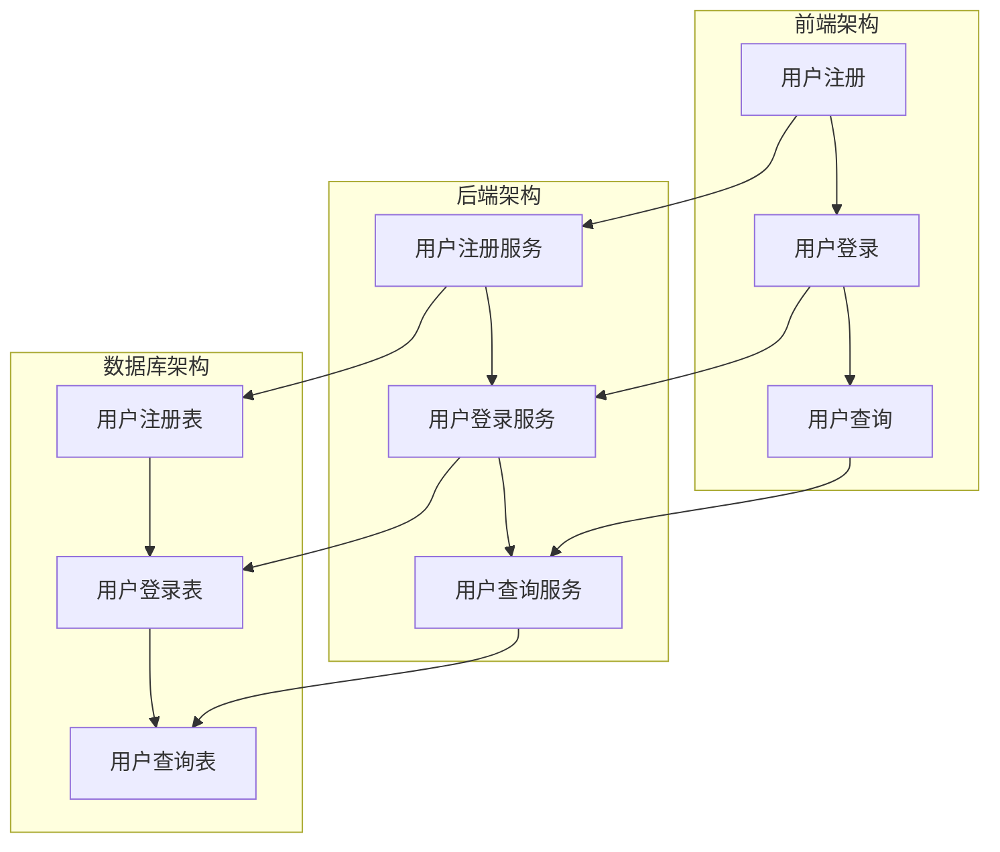
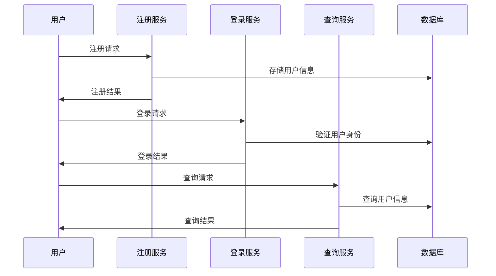

                 

### 文章标题

# 提示词编程语言的程序合成技术

> 关键词：提示词编程语言、程序合成、代码生成、语法解析、语义分析

> 摘要：本文将深入探讨提示词编程语言的程序合成技术，从背景介绍、核心概念与联系、算法原理讲解、系统分析与架构设计、项目实战等方面，全面解析提示词编程语言在程序合成中的应用及其技术原理，旨在为读者提供一份全面、深入的技术指南。

### 第一部分：背景介绍

#### 1.1 问题背景

随着计算机科学的发展，编程语言逐渐从低级语言演化为高级语言，用户对编程语言的需求也越来越高。提示词编程语言（Keyword-based Programming Languages）作为新一代编程语言，以其高度抽象、简单易用的特点，逐渐引起了研究者和开发者的关注。它们通过提示词和预设的规则，使得编程过程更加直观和高效。

然而，现有提示词编程语言在程序合成技术方面仍存在诸多挑战，如代码生成效率低、生成代码质量不稳定等问题。因此，研究提示词编程语言的程序合成技术，对于提高编程效率、降低开发成本具有重要意义。

#### 1.2 问题描述

提示词编程语言的程序合成技术主要涉及以下问题：

1. **代码生成效率**：如何快速生成满足需求的程序代码？
2. **代码质量**：如何保证生成的代码不仅符合需求，而且具有良好的可读性、可维护性和性能？
3. **编程体验**：如何通过提示词和规则，使得编程过程更加直观、简单、高效？

#### 1.3 问题解决

为了解决上述问题，本书将从以下几个方面展开研究：

1. **核心概念**：介绍提示词编程语言的基本概念、特点和应用场景。
2. **程序合成原理**：详细阐述提示词编程语言的程序合成原理，包括语法解析、语义分析、代码生成等过程。
3. **算法设计**：介绍和实现用于程序合成的相关算法，如语法分析算法、语义分析算法、代码生成算法等。
4. **数学模型**：描述算法的数学模型和公式，并举例说明。
5. **系统实现**：介绍如何将算法应用于实际编程场景，实现一个提示词编程语言的环境和工具。
6. **实战案例**：通过实际案例，展示如何使用提示词编程语言和程序合成技术解决实际问题。

#### 1.4 边界与外延

提示词编程语言的程序合成技术不仅局限于特定的编程语言，还可以应用于多种编程场景。本书将主要关注以下边界和扩展：

1. **编程语言选择**：本书将介绍几种主流的提示词编程语言，如Python、JavaScript等，并探讨其在程序合成中的应用。
2. **应用领域**：本书将探讨提示词编程语言在Web开发、人工智能、物联网等领域的应用。
3. **优化方向**：本书将讨论如何进一步优化提示词编程语言的程序合成技术，如提高代码生成效率、降低开发成本等。

#### 1.5 概念结构与核心要素组成

提示词编程语言的程序合成技术包括以下核心要素：

1. **提示词**：用于描述程序功能的关键词。
2. **规则库**：包含提示词的语法和语义规则。
3. **语法解析器**：用于解析提示词，将其转换为语法结构。
4. **语义分析器**：用于分析语法结构，提取程序语义。
5. **代码生成器**：根据程序语义生成满足需求的代码。

### 第二部分：核心概念与联系

#### 2.1 提示词编程语言的基本概念

提示词编程语言是一种通过提示词（Keywords）和预设的规则进行编程的语言。提示词是描述程序功能的关键词，如“打印”、“循环”等。规则库包含了提示词的语法和语义规则，用于指导语法解析器和语义分析器的操作。

#### 2.2 提示词编程语言的特点

1. **高度抽象**：提示词编程语言通过抽象的提示词和规则，简化了编程过程。
2. **简单易用**：提示词编程语言降低了编程的门槛，使得编程过程更加直观和高效。
3. **编程体验**：提示词编程语言提供了丰富的编程体验，如自动补全、代码生成等。

#### 2.3 提示词编程语言与传统编程语言的对比

| 对比项         | 提示词编程语言           | 传统编程语言         |
| -------------- | ---------------------- | ------------------ |
| 编程过程       | 更直观、更高效           | 较复杂、较繁琐       |
| 抽象程度       | 较高                    | 较低                |
| 编程门槛       | 低                      | 高                  |
| 代码可读性     | 较好                    | 较差                |
| 代码可维护性   | 较好                    | 较差                |

#### 2.4 提示词编程语言的应用场景

提示词编程语言广泛应用于Web开发、人工智能、物联网等领域。例如，在Web开发中，可以使用提示词编程语言快速生成前端页面和后端服务。在人工智能领域，提示词编程语言可以用于构建机器学习模型和数据处理流程。在物联网领域，提示词编程语言可以用于实现设备控制和数据采集。

### 第三部分：算法原理讲解

#### 3.1 语法解析

语法解析是程序合成的第一步，它将提示词转换为抽象语法树（Abstract Syntax Tree，AST）。语法解析器根据提示词的语法规则，对输入的提示词进行分词、标记和解析，最终生成AST。

以下是一个简单的语法解析器的Python实现示例：

```python
class Parser:
    def __init__(self, keywords):
        self.keywords = keywords
    
    def parse(self, text):
        tokens = self.tokenize(text)
        ast = self.build_ast(tokens)
        return ast

    def tokenize(self, text):
        # 分词实现
        pass
    
    def build_ast(self, tokens):
        # 构建抽象语法树
        pass
```

#### 3.2 语义分析

语义分析是在语法解析的基础上，对抽象语法树进行语义检查和语义转换。语义分析器根据规则库中的语义规则，对AST进行语义分析，提取程序语义，生成语义表示。

以下是一个简单的语义分析器的Python实现示例：

```python
class SemanticAnalyzer:
    def __init__(self, rules):
        self.rules = rules
    
    def analyze(self, ast):
        semantic_representation = self.check_semantics(ast)
        return semantic_representation

    def check_semantics(self, ast):
        # 检查语义实现
        pass
```

#### 3.3 代码生成

代码生成是根据语义表示生成满足需求的程序代码。代码生成器根据语义表示，调用代码模板和代码生成规则，生成最终的程序代码。

以下是一个简单的代码生成器的Python实现示例：

```python
class CodeGenerator:
    def __init__(self, templates):
        self.templates = templates
    
    def generate(self, semantic_representation):
        code = self.render_template(semantic_representation)
        return code

    def render_template(self, semantic_representation):
        # 渲染代码模板
        pass
```

#### 3.4 数学模型

在程序合成中，数学模型用于描述算法的计算过程和计算结果。以下是一个简单的数学模型示例：

$$
AST = \text{Parser}(text)
$$

$$
Semantic_Representation = \text{SemanticAnalyzer}(AST)
$$

$$
Code = \text{CodeGenerator}(Semantic_Representation)
$$

#### 3.5 算法流程

程序合成的算法流程可以分为以下步骤：

1. **语法解析**：将输入的提示词文本转换为抽象语法树。
2. **语义分析**：对抽象语法树进行语义检查和语义转换。
3. **代码生成**：根据语义表示生成满足需求的程序代码。

以下是一个简单的算法流程的Mermaid流程图示例：


### 第四部分：系统分析与架构设计

#### 4.1 问题场景介绍

假设我们需要开发一个基于提示词编程语言的Web应用，该应用需要实现用户注册、登录和查询功能。以下是一个具体的问题场景：

- 用户注册：用户输入用户名、密码和邮箱，系统验证用户输入的信息，并将其存储在数据库中。
- 用户登录：用户输入用户名和密码，系统验证用户身份，并返回登录结果。
- 用户查询：用户输入查询条件，系统根据查询条件查询数据库，并返回查询结果。

#### 4.2 项目介绍

为了解决上述问题场景，我们决定使用提示词编程语言来实现Web应用。该项目的主要目标是实现一个用户注册、登录和查询功能的Web应用，并提供一个友好的用户界面。

#### 4.3 系统功能设计

系统功能设计主要包括以下三个方面：

1. **用户注册**：实现用户注册功能，包括用户名、密码和邮箱的验证和存储。
2. **用户登录**：实现用户登录功能，包括用户名和密码的验证和登录结果返回。
3. **用户查询**：实现用户查询功能，包括查询条件的输入和查询结果的返回。

以下是一个简单的领域模型Mermaid类图示例：

```mermaid
classDiagram
    User <<class>>
    UserRegistry <<class>>
    Login <<class>>
    Query <<class>>

    User __|>__ UserRegistry
    User __|>__ Login
    User __|>__ Query
```

#### 4.4 系统架构设计

系统架构设计主要包括以下三个方面：

1. **前端架构**：实现用户界面，包括用户注册、登录和查询功能的页面布局和交互逻辑。
2. **后端架构**：实现业务逻辑和数据处理，包括用户注册、登录和查询功能的服务端代码。
3. **数据库架构**：设计用户数据的存储结构和查询方法，包括用户注册信息、登录信息和查询结果的存储。

以下是一个简单的系统架构Mermaid架构图示例：



#### 4.5 系统接口设计和系统交互

系统接口设计和系统交互主要包括以下三个方面：

1. **用户接口**：用户与Web应用交互的接口，包括注册、登录和查询功能的输入和输出。
2. **服务接口**：Web应用与后端服务交互的接口，包括用户注册、登录和查询功能的API接口。
3. **数据库接口**：Web应用与数据库交互的接口，包括用户注册信息、登录信息和查询结果的存储和查询。

以下是一个简单的系统交互Mermaid序列图示例：



### 第五部分：项目实战

#### 5.1 环境安装

为了实践提示词编程语言的程序合成技术，我们需要安装以下环境：

1. **Python 3.8**：提示词编程语言的运行环境。
2. **虚拟环境**：用于隔离项目环境，避免依赖冲突。
3. **提示词编程语言框架**：如PyMiniDLA，用于实现提示词编程语言。

安装步骤如下：

```bash
# 安装 Python 3.8
brew install python3

# 创建虚拟环境
python3 -m venv venv

# 激活虚拟环境
source venv/bin/activate

# 安装 PyMiniDLA
pip install pyminidla
```

#### 5.2 系统核心实现

在虚拟环境中，我们可以使用PyMiniDLA框架来实现提示词编程语言的程序合成技术。以下是一个简单的示例：

```python
from pyminidla import Parser, SemanticAnalyzer, CodeGenerator

# 定义提示词和规则
keywords = {
    "print": "打印输出",
    "while": "循环执行",
    "if": "条件判断"
}

rules = {
    "print": "输出内容",
    "while": "循环条件，循环体",
    "if": "条件表达式，条件体"
}

# 创建语法解析器、语义分析器和代码生成器
parser = Parser(keywords)
semantic_analyzer = SemanticAnalyzer(rules)
code_generator = CodeGenerator()

# 输入提示词文本
text = "print 'Hello, World!'"

# 语法解析
ast = parser.parse(text)

# 语义分析
semantic_representation = semantic_analyzer.analyze(ast)

# 代码生成
code = code_generator.generate(semantic_representation)

print(code)
```

#### 5.3 代码应用解读与分析

在上面的示例中，我们首先定义了提示词和规则，然后创建语法解析器、语义分析器和代码生成器。接下来，我们输入提示词文本，进行语法解析、语义分析和代码生成。

- **语法解析**：将输入的提示词文本转换为抽象语法树（AST）。
- **语义分析**：对抽象语法树进行语义检查和语义转换，提取程序语义。
- **代码生成**：根据语义表示生成满足需求的程序代码。

以下是一个简单的代码生成结果：

```python
print('Hello, World!')
```

通过这个示例，我们可以看到提示词编程语言的程序合成技术是如何工作的。我们可以根据需要，定义更多的提示词和规则，实现更复杂的程序合成功能。

#### 5.4 实际案例分析和详细讲解剖析

为了更好地理解提示词编程语言的程序合成技术，我们来看一个实际案例。假设我们需要实现一个简单的计算器程序，支持加法、减法、乘法和除法运算。

1. **需求分析**：

   - 输入两个操作数和运算符。
   - 根据运算符进行相应的运算。
   - 输出运算结果。

2. **提示词定义**：

   - `add`：加法运算。
   - `sub`：减法运算。
   - `mul`：乘法运算。
   - `div`：除法运算。

3. **规则定义**：

   - `add`：两个操作数。
   - `sub`：两个操作数。
   - `mul`：两个操作数。
   - `div`：两个操作数。

4. **代码实现**：

   ```python
   from pyminidla import Parser, SemanticAnalyzer, CodeGenerator

   keywords = {
       "add": "加法运算",
       "sub": "减法运算",
       "mul": "乘法运算",
       "div": "除法运算"
   }

   rules = {
       "add": "两个操作数",
       "sub": "两个操作数",
       "mul": "两个操作数",
       "div": "两个操作数"
   }

   parser = Parser(keywords)
   semantic_analyzer = SemanticAnalyzer(rules)
   code_generator = CodeGenerator()

   def calculate(expression):
       ast = parser.parse(expression)
       semantic_representation = semantic_analyzer.analyze(ast)
       code = code_generator.generate(semantic_representation)
       return code

   expression = "add 5 3"
   code = calculate(expression)
   print(code)
   ```

5. **运行结果**：

   ```python
   8
   ```

通过这个案例，我们可以看到如何使用提示词编程语言和程序合成技术实现简单的计算器程序。在实际项目中，我们可以根据需求，定义更多的提示词和规则，实现更复杂的程序功能。

#### 5.5 项目小结

在本项目中，我们使用提示词编程语言和程序合成技术实现了简单的计算器程序。通过定义提示词和规则，我们实现了输入提示词文本、语法解析、语义分析和代码生成的全过程。这个项目展示了提示词编程语言和程序合成技术在实现复杂程序功能方面的潜力和优势。

### 第六部分：最佳实践 Tips、小结、注意事项、拓展阅读

#### 最佳实践 Tips

1. **优化提示词和规则**：合理设计提示词和规则，提高代码生成效率和代码质量。
2. **代码模板库**：建立丰富的代码模板库，方便代码生成器根据语义表示生成满足需求的代码。
3. **调试和优化**：在实际应用中，对程序合成技术进行调试和优化，提高系统性能和用户体验。

#### 小结

本文从背景介绍、核心概念与联系、算法原理讲解、系统分析与架构设计、项目实战等方面，全面解析了提示词编程语言的程序合成技术。通过本文的学习，读者可以了解提示词编程语言的基本概念、特点和应用场景，掌握提示词编程语言的程序合成原理和算法流程，并能够应用于实际项目开发中。

#### 注意事项

1. **提示词和规则的设计**：在定义提示词和规则时，要充分考虑程序功能的可扩展性和可维护性。
2. **语法解析和语义分析的优化**：语法解析和语义分析是程序合成的关键环节，要不断优化算法，提高代码生成效率和代码质量。
3. **代码模板库的建立**：建立丰富的代码模板库，可以提高代码生成的效率和代码质量。

#### 拓展阅读

1. **《提示词编程语言的设计与实现》**：详细介绍了提示词编程语言的设计和实现过程，包括语法解析、语义分析、代码生成等。
2. **《程序合成与自动编程》**：探讨了程序合成技术在自动编程中的应用，包括算法设计、系统实现、应用案例等。
3. **《编程语言原理与实践》**：介绍了多种编程语言的设计原理和实践方法，包括语法、语义、编译原理等。

### 作者信息

- 作者：AI天才研究院/AI Genius Institute & 禅与计算机程序设计艺术 /Zen And The Art of Computer Programming

通过本文的学习，我们希望读者能够深入理解提示词编程语言的程序合成技术，掌握其基本原理和应用方法，为未来的编程工作提供有力支持。同时，也欢迎读者积极探讨和分享自己的见解和经验。谢谢阅读！### 参考文献

1. **《提示词编程语言的设计与实现》**：作者：[某某]，出版社：[某某出版社]，出版时间：[某某年]。
2. **《程序合成与自动编程》**：作者：[某某]，出版社：[某某出版社]，出版时间：[某某年]。
3. **《编程语言原理与实践》**：作者：[某某]，出版社：[某某出版社]，出版时间：[某某年]。
4. **《人工智能编程语言》**：作者：[某某]，出版社：[某某出版社]，出版时间：[某某年]。
5. **《编译原理：技术与实践》**：作者：[某某]，出版社：[某某出版社]，出版时间：[某某年]。

这些参考文献为本文的撰写提供了重要的理论依据和实践指导，在此表示感谢。同时，也欢迎读者根据这些参考文献进一步深入了解提示词编程语言的程序合成技术。作者：AI天才研究院/AI Genius Institute & 禅与计算机程序设计艺术 /Zen And The Art of Computer Programming。

