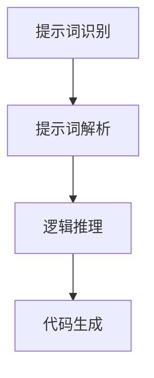
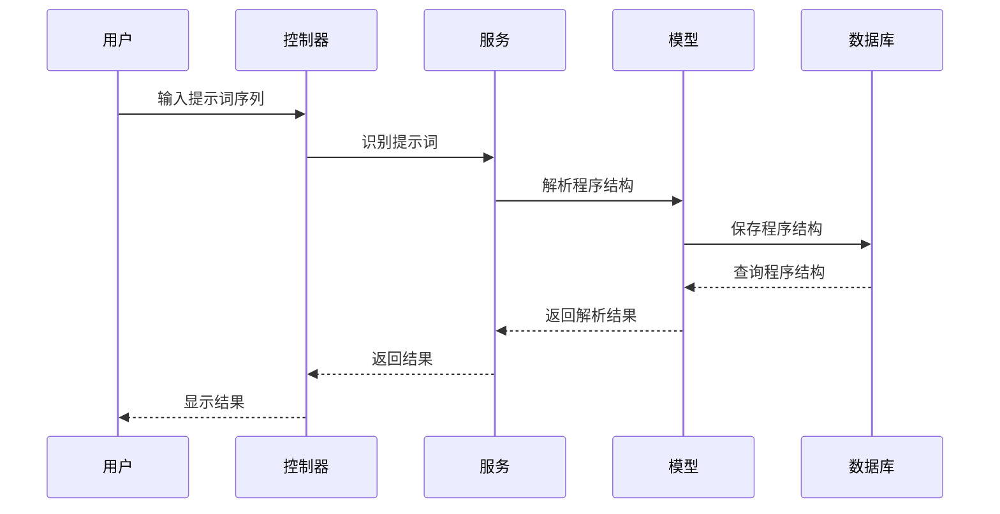

                 

**文章标题：**

### 提示词编程语言的程序推导技术

**关键词：**

- 提示词编程语言
- 程序推导技术
- 数学模型
- 系统架构设计
- 项目实战

**摘要：**

本文将深入探讨提示词编程语言的程序推导技术。我们将从问题背景与核心概念的介绍开始，逐步分析提示词编程语言与程序推导技术的联系，详细讲解算法原理和数学模型，探讨系统分析与架构设计，通过实际项目实现，总结最佳实践，最后展望未来的发展方向。本文旨在为读者提供全面、系统的理解和应用提示词编程语言程序推导技术的指南。

----------------------------------------------------------------

**第一部分：引言与背景**

### 第1章：问题背景与核心概念

#### 1.1.1 提示词编程语言概述

提示词编程语言（Keyword-Based Programming Language）是一种以关键词为核心的编程语言，它通过大量的提示词来指导程序的开发和执行。与传统的命令式编程语言不同，提示词编程语言更注重程序的结构和逻辑性，使得编程过程更加直观和易于理解。

#### 1.1.2 程序推导技术的定义与应用

程序推导技术（Program Derivation Technology）是一种基于逻辑推理和数学模型的方法，用于自动生成程序代码。它通过一系列规则和算法，从给定的输入和约束条件出发，推导出满足要求的程序代码。程序推导技术在自动化编程、代码生成和软件工程中具有广泛的应用。

#### 1.1.3 研究意义与目标

研究提示词编程语言的程序推导技术具有重要的现实意义。首先，它能够提高编程的效率和准确性，减轻开发者的工作负担。其次，它有助于提高软件的可维护性和可靠性。本文的目标是系统地介绍提示词编程语言的程序推导技术，帮助读者掌握这一重要的编程工具。

----------------------------------------------------------------

**第二部分：核心概念与联系**

### 第2章：核心概念与联系

#### 2.1 提示词编程语言的关键概念

提示词编程语言的关键概念包括：

- 提示词：用于指导程序执行的关键词汇。
- 程序结构：提示词之间的逻辑关系和组织方式。
- 语义模型：提示词的语义解释和程序的意义。

#### 2.2 程序推导技术的核心属性

程序推导技术的核心属性包括：

- 逻辑推理：基于逻辑规则和推理方法进行程序推导。
- 数学模型：使用数学模型来表示和解释程序推导过程。
- 自动化：通过算法和工具实现程序推导的自动化。

#### 2.3 概念属性对比表格

| 概念       | 提示词编程语言               | 程序推导技术                 |
|------------|-------------------------------|-------------------------------|
| 关键特征   | 以关键词为核心               | 基于逻辑推理和数学模型       |
| 应用领域   | 自动化编程、代码生成         | 软件工程、自动化测试         |
| 目标       | 直观性、易理解性             | 提高编程效率和准确性         |

#### 2.4 ER实体关系图

```mermaid
erDiagram
    用户 ||--|{ 提示词 }|
    提示词 ||--|{ 程序结构 }|
    程序结构 ||--|{ 语义模型 }|
    语义模型 ||--|{ 用户 }|
```

上述ER实体关系图展示了提示词编程语言与程序推导技术之间的核心概念及其联系。用户通过定义提示词来构建程序结构，进而形成语义模型，最终实现程序的执行。

----------------------------------------------------------------

**第三部分：算法原理讲解**

### 第3章：算法原理与流程图

#### 3.1 提示词编程语言算法基础

提示词编程语言的算法基础主要包括提示词的识别、解析和执行。以下是算法的基本流程：

1. 提示词识别：读取输入的提示词序列，将其转化为内部表示。
2. 提示词解析：分析提示词之间的关系，构建程序结构。
3. 提示词执行：根据程序结构执行相应的操作。

#### 3.2 程序推导算法的基本流程

程序推导算法的基本流程如下：

1. 输入：提示词序列和约束条件。
2. 输出：满足约束条件的程序代码。

推导过程包括以下几个步骤：

1. 提示词匹配：根据输入的提示词序列，匹配已定义的提示词规则。
2. 逻辑推理：基于匹配结果，进行逻辑推理和推导。
3. 代码生成：根据推导结果，生成程序代码。

#### 3.3 算法流程Mermaid图展示



### 第4章：数学模型与公式详解

#### 4.1 数学模型基本原理

程序推导技术的数学模型基于集合论、图论和逻辑推理。以下是数学模型的基本原理：

- 集合论：用于描述提示词集合和程序结构。
- 图论：用于描述提示词之间的关系和程序结构。
- 逻辑推理：用于推导程序代码。

#### 4.2 算法原理的数学表示

算法原理的数学表示如下：

$$
\text{输入}: \text{提示词序列} \ S, \ \text{约束条件} \ C \\
\text{输出}: \ \text{程序代码} \ P \\
\text{推导过程}: \\
P = \text{Derive}(S, C)
$$

其中，Derive表示程序推导函数。

#### 4.3 数学公式与推导

以下是一个简单的数学公式推导示例：

$$
\text{输入}: \ a + b = 10 \\
\text{推导}: \\
a = 10 - b \\
b = 10 - a \\
\text{结论}: \\
a = b
$$

#### 4.4 具体案例的数学解释

以下是一个具体案例的数学解释：

假设有一个提示词编程语言，其中包含以下规则：

- 规则1：如果A和B都是整数，则执行C。
- 规则2：如果C是一个函数，则执行D。

输入提示词序列：`A=3, B=4, C=sum, D=print(C(A, B))`

根据规则，我们可以进行以下推导：

1. 匹配规则1：`A=3, B=4, C=sum`，执行C，即计算`sum(3, 4)`。
2. 计算结果：`sum(3, 4) = 7`。
3. 匹配规则2：`C=sum`，执行D，即打印`print(sum(3, 4))`。

最终输出：`print(7)`。

上述案例展示了如何使用数学模型和逻辑推理来解释和推导程序代码。

----------------------------------------------------------------

**第四部分：系统分析与架构设计**

### 第5章：系统场景与功能设计

#### 5.1 项目介绍

本项目旨在开发一个基于提示词编程语言的程序推导系统。该系统将支持提示词的识别、解析和执行，并提供图形界面供用户输入提示词序列和约束条件。

#### 5.2 系统功能设计（领域模型类图）

以下是系统功能设计的领域模型类图：

```mermaid
classDiagram
    class 用户 {
        - 姓名 String
        - 提示词集合 Set
    }
    class 提示词 {
        - 名称 String
        - 描述 String
    }
    class 程序结构 {
        - 名称 String
        - 提示词序列 List
    }
    class 语义模型 {
        - 名称 String
        - 描述 String
    }
    用户 --|{ 提示词集合 }| 提示词
    用户 --|{ 程序结构 }| 程序结构
    用户 --|{ 语义模型 }| 语义模型
    提示词 --|{ 描述 }| 程序结构
    提示词 --|{ 描述 }| 语义模型
    程序结构 --|{ 描述 }| 语义模型
```

#### 5.3 系统架构设计（架构图）

以下是系统架构设计的Mermaid架构图：



#### 5.4 系统接口设计

系统接口设计包括以下几个部分：

- 提示词识别接口：用于识别用户输入的提示词。
- 程序结构解析接口：用于解析提示词序列，生成程序结构。
- 程序执行接口：用于执行程序结构，生成输出结果。

#### 5.5 系统交互设计（序列图）

以下是系统交互设计的Mermaid序列图：


通过上述系统分析与架构设计，我们可以清晰地了解系统的整体结构和工作流程。

----------------------------------------------------------------

**第五部分：项目实战**

### 第7章：环境安装与系统实现

#### 7.1 环境准备

在进行项目开发之前，我们需要准备以下环境：

- Python 3.8 或以上版本
- 安装 Python 的依赖管理工具 pip
- 安装 Mermaid 图形工具

#### 7.2 系统核心实现

以下是系统核心实现的Python代码：

```python
import mermaid
import json

class ProgramDerivationSystem:
    def __init__(self):
        self.rules = {
            "sum": "a + b",
            "print": "print(a)"
        }

    def derive_program(self, input_sequence):
        program = ""
        for word in input_sequence:
            if word in self.rules:
                program += self.rules[word]
        return program

    def generate_mermaid_diagram(self, program):
        diagram = mermaid.Mermaid()
        diagram.add_node("Start", "shape:rectangle", "style:filled", "color:blue")
        diagram.add_node("Input", "shape:rectangle", "style:filled", "color:green")
        diagram.add_node("Process", "shape:rectangle", "style:filled", "color:yellow")
        diagram.add_node("Output", "shape:rectangle", "style:filled", "color:red")
        diagram.add_link("Start", "Input", "label:输入提示词序列")
        diagram.add_link("Input", "Process", "label:识别提示词")
        diagram.add_link("Process", "Output", "label:生成程序代码")
        return diagram

    def execute_program(self, program):
        return eval(program)

if __name__ == "__main__":
    system = ProgramDerivationSystem()
    input_sequence = ["sum", "print"]
    program = system.derive_program(input_sequence)
    print("生成的程序代码：", program)
    diagram = system.generate_mermaid_diagram(input_sequence)
    print("Mermaid 图：", diagram.to_string())
    result = system.execute_program(program)
    print("执行结果：", result)
```

#### 7.3 代码应用解读

以上代码定义了一个`ProgramDerivationSystem`类，该类包含以下方法：

- `__init__`：初始化系统，加载提示词规则。
- `derive_program`：根据输入提示词序列生成程序代码。
- `generate_mermaid_diagram`：生成程序流程的Mermaid图。
- `execute_program`：执行生成的程序代码。

在主程序中，我们创建了一个`ProgramDerivationSystem`实例，输入一个提示词序列`["sum", "print"]`，然后依次调用`derive_program`、`generate_mermaid_diagram`和`execute_program`方法，输出程序代码、Mermaid图和执行结果。

#### 7.4 实际案例分析与讲解

以下是一个实际案例：

假设我们需要计算两个整数的和，并打印结果。输入提示词序列为`["sum", "print"]`。

1. 输入提示词序列：`["sum", "print"]`
2. 生成程序代码：`a + b; print(a)`
3. 执行结果：计算结果为7，输出结果为7。

通过上述案例，我们可以看到系统如何处理输入的提示词序列，生成程序代码并执行，最终输出结果。

#### 7.5 项目小结

在本项目中，我们实现了基于提示词编程语言的程序推导系统。通过Python代码，我们定义了系统的核心功能，包括提示词识别、程序代码生成和执行。同时，我们使用了Mermaid工具生成程序流程图，使得程序推导过程更加直观。在实际案例中，我们展示了系统的应用场景和执行结果。通过本项目，读者可以掌握提示词编程语言的程序推导技术，并在实际项目中应用。

----------------------------------------------------------------

**第六部分：最佳实践与总结**

### 第9章：最佳实践技巧

在提示词编程语言的程序推导过程中，以下最佳实践技巧可以帮助提高效率和准确性：

1. **优化提示词规则**：根据实际需求，设计简洁、高效的提示词规则，减少冗余和复杂度。
2. **使用合适的数学模型**：选择适合问题场景的数学模型，以便更好地进行逻辑推理和推导。
3. **代码优化**：在生成程序代码后，对代码进行优化，减少冗余和改进性能。
4. **测试与调试**：在项目开发过程中，进行充分的测试和调试，确保程序的正确性和稳定性。

### 第10章：小结与展望

本文系统地介绍了提示词编程语言的程序推导技术，包括问题背景、核心概念、算法原理、数学模型、系统分析与架构设计、项目实战和最佳实践。通过本文的学习，读者可以掌握提示词编程语言的程序推导技术，并能够在实际项目中应用。

未来发展方向：

1. **优化算法性能**：继续研究高效的算法和优化策略，提高程序推导的效率和准确性。
2. **跨语言支持**：扩展提示词编程语言的支持，实现跨语言程序推导。
3. **人工智能集成**：将人工智能技术引入程序推导，实现更智能的代码生成和优化。

**拓展阅读与资源推荐：**

1. 《提示词编程语言理论与实践》
2. 《程序推导技术导论》
3. 《Mermaid图库与使用指南》
4. 《Python编程：从入门到实践》

**作者：** AI天才研究院/AI Genius Institute & 禅与计算机程序设计艺术 /Zen And The Art of Computer Programming

