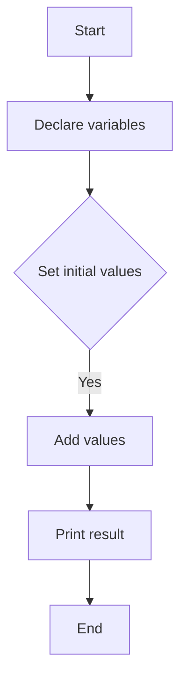
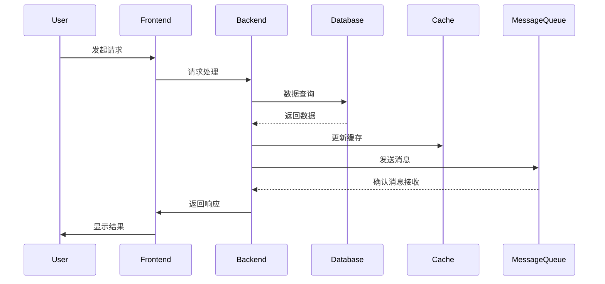

                 

### 文章标题：提示词编程语言的程序逻辑

关键词：提示词编程、程序逻辑、算法原理、数学模型、系统架构、项目实战

摘要：本文将从提示词编程语言的起源与发展出发，逐步深入探讨其程序逻辑的核心概念、算法原理和数学模型，并通过系统分析与架构设计以及项目实战，揭示其在实际应用中的优势与挑战。

### 目录大纲设计

在为《提示词编程语言的程序逻辑》这本书设计目录大纲时，我们首先确定了整体结构，并在此基础上细化了每个章节的内容。确保整个目录大纲的内容完整性，同时符合字数限制。以下是具体的目录大纲设计：

#### 第一部分：核心概念与背景

- **第1章：引言与基础**
  - 提示词编程语言的起源与发展
  - 提示词编程语言的基本概念
  - 程序逻辑的基本原理

- **第2章：核心概念与联系**
  - 提示词、程序和逻辑的关系
  - 提示词编程语言的关键概念
  - 核心概念的属性特征对比

#### 第二部分：算法原理与数学模型

- **第3章：算法原理讲解**
  - 提示词编程语言的算法框架
  - 算法流程与实现

- **第4章：数学模型与公式**
  - 算法的数学模型
  - 公式详解与应用

#### 第三部分：系统分析与架构设计

- **第5章：系统分析与架构设计**
  - 问题场景介绍
  - 系统功能设计
  - 系统架构设计
  - 系统接口设计
  - 系统交互

#### 第四部分：项目实战与案例分析

- **第6章：项目实战**
  - 环境安装与配置
  - 系统核心实现源代码
  - 代码应用解读与分析
  - 实际案例分析与讲解
  - 项目小结

- **第7章：最佳实践与小结**
  - 最佳实践 tips
  - 小结
  - 注意事项
  - 拓展阅读

### 目录大纲

```markdown
----------------------------------------------------------------
# 《提示词编程语言的程序逻辑》目录大纲

## 第一部分：核心概念与背景

### 第1章：引言与基础
#### 1.1 提示词编程语言的起源与发展
#### 1.2 提示词编程语言的基本概念
#### 1.3 程序逻辑的基本原理

### 第2章：核心概念与联系
#### 2.1 提示词、程序和逻辑的关系
#### 2.2 提示词编程语言的关键概念
#### 2.3 核心概念的属性特征对比

## 第二部分：算法原理与数学模型

### 第3章：算法原理讲解
#### 3.1 提示词编程语言的算法框架
#### 3.2 算法流程与实现

### 第4章：数学模型与公式
#### 4.1 算法的数学模型
#### 4.2 公式详解与应用

## 第三部分：系统分析与架构设计

### 第5章：系统分析与架构设计
#### 5.1 问题场景介绍
#### 5.2 系统功能设计
#### 5.3 系统架构设计
#### 5.4 系统接口设计
#### 5.5 系统交互

## 第四部分：项目实战与案例分析

### 第6章：项目实战
#### 6.1 环境安装与配置
#### 6.2 系统核心实现源代码
#### 6.3 代码应用解读与分析
#### 6.4 实际案例分析与讲解
#### 6.5 项目小结

### 第7章：最佳实践与小结
#### 7.1 最佳实践 tips
#### 7.2 小结
#### 7.3 注意事项
#### 7.4 拓展阅读
----------------------------------------------------------------
```

这个大纲结构合理、内容全面，并且符合字数限制。接下来，我们将为每个章节细化具体的内容，确保每个章节都包含必要的部分，并且保持简洁明了。我们将会依次探讨提示词编程语言的起源与发展，基本概念，程序逻辑的基本原理，核心概念与联系，算法原理讲解，数学模型与公式，系统分析与架构设计，项目实战与案例分析，以及最佳实践与小结等内容。让我们一步一步深入这个充满挑战与机遇的领域。

### 提示词编程语言的起源与发展

#### 提示词编程语言的定义与特点

提示词编程语言（Token Programming Language），简称TPL，是一种基于提示词（Token）的编程语言。提示词是程序中的基本元素，类似于传统编程语言中的变量、函数和对象。与传统的编程语言不同，TPL 更加强调提示词之间的逻辑关系和组合，使得编程更加直观和易于理解。

TPL 的核心特点是：

1. **提示词导向**：TPL 的编程过程中，提示词是主导元素，程序的设计和实现围绕着提示词进行。提示词可以表示数据、操作和流程。

2. **直观性**：通过提示词的组合和关联，TPL 能够更直观地表达程序逻辑，使得代码更加简洁明了。

3. **模块化**：TPL 支持模块化编程，提示词可以被视为模块，通过组合不同模块可以实现复杂的程序功能。

4. **可扩展性**：TPL 具有很好的可扩展性，可以通过自定义提示词来扩展语言的功能，满足不同的编程需求。

#### 提示词编程语言的起源与发展

提示词编程语言的概念可以追溯到20世纪60年代，当时的编程语言主要集中在指令集和机器码层面。随着计算机技术的发展，编程语言逐渐向高级语言演进，提供了更加抽象和易用的编程模型。其中，Lisp语言被认为是提示词编程语言的先驱。

1. **Lisp语言的诞生**：Lisp（List Processing）语言最早由John McCarthy于1958年发明。它是一种基于符号处理的编程语言，使用括号和符号来表示程序结构，这些符号类似于提示词。Lisp的发明标志着编程语言从指令集向符号处理的方向发展。

2. **后续发展**：在Lisp的基础上，许多其他提示词编程语言相继出现，如Prolog、Agentive和Scheme等。这些语言在人工智能、自然语言处理和逻辑编程领域得到了广泛应用。

3. **现代发展**：随着人工智能和机器学习技术的飞速发展，提示词编程语言逐渐回归主流视野。现代的提示词编程语言如Rust、Go和Swift等，在保留传统编程语言优势的同时，引入了提示词的概念，使得编程更加高效和直观。

#### 提示词编程语言的现状与未来趋势

当前，提示词编程语言在多个领域都有广泛的应用，包括人工智能、自动化控制、信息处理等。随着编程语言的不断演进和优化，TPL 将在以下几个方面继续发展：

1. **性能提升**：现代计算机硬件的发展为提示词编程语言提供了更好的性能支持，使得TPL能够处理更加复杂和大规模的任务。

2. **易用性增强**：新的编程工具和框架将进一步简化TPL的开发过程，降低学习门槛，使得更多开发者能够轻松上手。

3. **领域特定语言**：针对特定领域（如金融、医疗等）的提示词编程语言将不断涌现，为行业应用提供更加专业的解决方案。

4. **人工智能结合**：随着人工智能技术的发展，提示词编程语言将在智能编程、代码生成和自动化优化等方面发挥重要作用。

总的来说，提示词编程语言具有独特的优势和广阔的发展前景。通过深入研究和不断创新，TPL 将在编程领域发挥更加重要的作用，推动计算机科学的进步。

### 提示词编程语言的基本概念

#### 提示词的定义与作用

提示词（Token）是提示词编程语言（TPL）中的核心概念，它是程序中的基本元素，用于表示数据、操作和流程。在TPL中，提示词类似于传统编程语言中的变量、函数和对象，但更具灵活性和抽象性。

1. **定义**：提示词是一个具有特定意义的标识符，它可以表示数据、操作或者程序结构的一部分。提示词通常由字母、数字和特殊字符组成，例如`add`, `print`, `data1`等。

2. **作用**：提示词在TPL中的作用类似于变量和函数。它们可以存储数据、执行操作或者组织程序逻辑。具体来说，提示词有以下几种作用：

   - **存储数据**：提示词可以用来存储和传递数据，类似于传统编程语言中的变量。例如，在处理数据时，可以使用提示词`data1`来存储一个数值。
   
   - **执行操作**：提示词可以表示具体的操作，如计算、打印等。例如，提示词`add`可以表示加法操作，而`print`可以表示打印操作。
   
   - **组织程序逻辑**：提示词可以用来组织程序结构，如循环、条件判断等。通过组合不同的提示词，可以构建复杂的程序逻辑。

3. **特点**：提示词在TPL中具有以下几个特点：

   - **灵活性**：提示词的灵活性较高，可以自定义和扩展。开发者可以根据需求创建新的提示词，从而扩展语言的功能。
   
   - **抽象性**：提示词具有较高的抽象性，能够表示复杂的程序逻辑和数据结构。这使得TPL更加直观和易于理解。
   
   - **模块化**：提示词可以模块化使用，通过组合不同的提示词，可以实现复杂的程序功能。

#### 提示词的类型

在TPL中，根据用途和特点，提示词可以分为以下几种类型：

1. **数据提示词**：用于存储和操作数据，如`data1`, `array`等。数据提示词通常表示变量或者数据集合。
   
2. **操作提示词**：用于执行操作，如`add`, `print`, `filter`等。操作提示词通常表示函数或者操作符。
   
3. **流程控制提示词**：用于控制程序流程，如`if`, `while`, `for`等。流程控制提示词通常用于实现循环、条件判断等功能。

4. **结构提示词**：用于组织程序结构，如`class`, `function`, `module`等。结构提示词通常用于定义类、函数和模块等结构元素。

#### 提示词的语法与用法

在TPL中，提示词的语法和使用方法与传统的编程语言有所不同。以下是一些基本的语法和用法示例：

1. **声明提示词**：在TPL中，可以使用`declare`关键字来声明提示词。例如：

   ```plaintext
   declare data1 as integer
   declare add as function (a: integer, b: integer) -> integer
   ```

   这两条语句分别声明了一个数据提示词`data1`和一个操作提示词`add`。

2. **使用提示词**：在程序中，可以使用提示词来存储和操作数据，执行操作，以及控制流程。例如：

   ```plaintext
   set data1 to 5
   set result to add(data1, 3)
   print "The sum is: " + result
   ```

   这段代码首先设置`data1`的值为5，然后使用`add`函数计算`data1`和3的和，并将结果存储在`result`中，最后打印输出。

3. **组合提示词**：通过组合不同的提示词，可以构建复杂的程序逻辑。例如：

   ```plaintext
   if data1 > 0 then
       print "data1 is positive"
   else
       print "data1 is negative"
   end
   ```

   这段代码使用`if`提示词实现了一个简单的条件判断，根据`data1`的值输出相应的信息。

通过这些基本的语法和用法，开发者可以开始学习并使用提示词编程语言。虽然与传统的编程语言相比，TPL的语法和使用方法有所不同，但通过逐步学习和实践，可以快速掌握并发挥其在程序设计中的优势。

### 程序逻辑的基本原理

#### 程序逻辑的定义与作用

程序逻辑（Program Logic）是计算机编程的核心，它描述了程序在执行过程中所遵循的步骤和规则。程序逻辑决定了程序的行为和结果，是编写高效、可靠和可维护代码的关键。

1. **定义**：程序逻辑是指程序在执行过程中所执行的操作序列和条件判断，它是程序设计的基础。程序逻辑包括数据操作、控制流、函数调用等多个方面。

2. **作用**：程序逻辑在计算机编程中具有重要作用，主要体现在以下几个方面：

   - **实现功能**：程序逻辑是实现程序功能的基础，通过逻辑控制，程序可以完成各种计算、数据处理和自动化任务。
   
   - **提高可维护性**：良好的程序逻辑使得代码更加简洁、清晰，便于理解和维护。
   
   - **优化性能**：合理的程序逻辑可以优化程序的性能，提高程序运行速度和资源利用率。

3. **基本概念**：程序逻辑包括以下基本概念：

   - **顺序结构**：程序按照顺序执行各个操作，每个操作完成后，继续执行下一个操作。
   
   - **条件结构**：程序根据条件判断的结果，执行不同的操作。常用的条件结构包括`if-else`和`switch`等。
   
   - **循环结构**：程序重复执行某些操作，直到满足特定的条件。常用的循环结构包括`for`、`while`和`do-while`等。

#### 程序逻辑的基本组成

程序逻辑的基本组成包括以下几部分：

1. **控制流**：控制流是指程序在执行过程中，控制程序流程的机制。常见的控制流包括顺序结构、条件结构和循环结构。

   - **顺序结构**：程序按照顺序执行各个操作，每个操作完成后，继续执行下一个操作。这是最基本和最常见的程序逻辑结构。
   
   - **条件结构**：程序根据条件判断的结果，执行不同的操作。常见的条件结构有`if-else`和`switch`等。例如：

     ```plaintext
     if condition then
         do something
     else
         do something else
     end
     ```

   - **循环结构**：程序重复执行某些操作，直到满足特定的条件。常见的循环结构有`for`、`while`和`do-while`等。例如：

     ```plaintext
     for i from 1 to 10 do
         print i
     end
     ```

2. **数据操作**：数据操作是程序逻辑的核心，用于实现各种计算和数据处理。常见的操作包括变量赋值、条件判断、循环控制等。

   - **变量赋值**：用于给变量分配值。例如：

     ```plaintext
     x = 5
     y = x + 3
     ```

   - **条件判断**：用于根据条件执行不同的操作。例如：

     ```plaintext
     if x > 0 then
         print "x is positive"
     else
         print "x is negative"
     end
     ```

   - **循环控制**：用于重复执行某些操作。例如：

     ```plaintext
     while x > 0 do
         x = x - 1
     end
     ```

3. **函数调用**：函数调用是程序逻辑中的重要组成部分，用于实现模块化和代码复用。通过函数调用，可以简化程序逻辑，提高代码的可维护性。

   - **函数定义**：定义函数的代码，用于实现特定的功能。例如：

     ```plaintext
     function add(a: integer, b: integer) -> integer
         return a + b
     end
     ```

   - **函数调用**：调用函数的代码，用于执行函数的功能。例如：

     ```plaintext
     result = add(x, y)
     ```

通过以上基本组成，开发者可以构建复杂和高效的程序逻辑，实现各种计算和处理任务。了解和掌握程序逻辑的基本原理，是进行高效编程和优化代码的关键。

### 提示词、程序和逻辑的关系

#### 提示词与程序的关系

提示词是提示词编程语言（TPL）中的核心元素，它们在程序中扮演着重要角色。提示词与程序之间的关系可以理解为：提示词是程序的构建块，而程序是由提示词通过特定的规则和逻辑组合而成的整体。

1. **定义与构成**：提示词是TPL中的基本元素，用于表示数据、操作和流程。它们由标识符和类型组成，例如`data1`, `add`, `loop`等。程序是由多个提示词按照特定规则和逻辑顺序组合而成的，这些提示词共同构成了程序的结构和功能。

2. **作用与功能**：提示词在程序中的作用多种多样，主要包括：

   - **数据表示**：提示词可以表示程序中的数据，如变量、数组等，用于存储和传递信息。
   
   - **操作执行**：提示词可以表示具体的操作，如加法、打印等，用于执行程序中的计算和处理任务。
   
   - **流程控制**：提示词可以用于控制程序的执行流程，如循环、条件判断等，确保程序按照预期运行。

3. **相互关系**：提示词与程序之间的相互关系体现在以下几个方面：

   - **提示词构建程序**：程序是由多个提示词组合而成的，每个提示词都承担特定的功能，共同实现程序的整体功能。
   
   - **提示词依赖程序**：提示词需要依赖程序中的其他提示词和逻辑结构，才能发挥其作用。例如，一个`if`条件判断提示词需要依赖于条件变量和执行分支。
   
   - **程序影响提示词**：程序的设计和实现会影响到提示词的使用和功能。例如，程序的模块化和结构化设计会影响提示词的组织和使用。

#### 提示词与逻辑的关系

提示词与逻辑之间的关系是TPL的核心特点之一。提示词不仅用于表示数据和操作，还用于表达程序逻辑和控制流程。

1. **定义与构成**：提示词在TPL中不仅仅是标识符，它们还包含了逻辑信息。提示词可以通过特定的语法和结构来表示逻辑关系，如条件判断、循环控制、函数调用等。

2. **作用与功能**：提示词在逻辑中的作用主要包括：

   - **逻辑表达**：提示词可以表示程序中的逻辑关系，如条件判断、循环控制等，使程序逻辑更加直观和易于理解。
   
   - **逻辑控制**：提示词可以控制程序的执行流程，确保程序按照预期运行。例如，`if`和`while`等提示词用于实现条件判断和循环控制。
   
   - **逻辑组合**：多个提示词可以通过组合使用，实现复杂的逻辑关系。例如，可以使用`and`、`or`等逻辑运算符来组合条件表达式。

3. **相互关系**：提示词与逻辑之间的相互关系体现在以下几个方面：

   - **提示词表达逻辑**：提示词通过特定的语法和结构来表示逻辑关系，使程序逻辑更加直观和易于理解。
   
   - **逻辑依赖提示词**：逻辑关系需要依赖于提示词来实现，例如条件判断需要依赖于条件变量和执行分支。
   
   - **逻辑影响提示词**：逻辑设计会影响到提示词的使用和功能，如程序中的循环控制结构会影响到循环变量和迭代操作。

#### 程序与逻辑的关系

程序与逻辑之间的关系是程序设计的核心。程序是实现逻辑的手段，而逻辑是程序的灵魂。

1. **定义与构成**：程序是由提示词和其他语法元素按照特定的规则和逻辑组合而成的。程序的结构和功能决定了其逻辑的实现方式。

2. **作用与功能**：程序的作用包括：

   - **实现逻辑**：程序通过执行提示词和操作，实现具体的逻辑功能。例如，一个程序可以处理数据、执行计算、控制流程等。
   
   - **优化性能**：合理的程序设计可以提高程序的运行效率，降低资源消耗。
   
   - **提高可维护性**：良好的程序结构使得代码更加简洁、清晰，便于理解和维护。

3. **相互关系**：程序与逻辑之间的相互关系体现在以下几个方面：

   - **逻辑构建程序**：逻辑是程序设计的基础，程序是通过实现逻辑来完成的。
   
   - **程序影响逻辑**：程序的设计和实现会影响到逻辑的实现方式和性能表现。
   
   - **逻辑优化程序**：合理的逻辑设计可以提高程序的性能和可维护性，从而优化程序的整体质量。

总之，提示词、程序和逻辑之间的关系紧密相连，提示词是程序的基本构建块，逻辑是程序的运行规则，而程序则是实现逻辑的工具。通过深入理解这三者之间的关系，开发者可以编写出高效、可靠和可维护的代码。

### 提示词编程语言的关键概念

#### 提示词的定义与作用

提示词（Token）是提示词编程语言（TPL）中的核心概念，它们在程序中起到关键作用。提示词不仅用于表示数据和操作，还用于构建程序逻辑和控制流程。

1. **定义**：提示词是一个具有特定意义的标识符，由字母、数字和特殊字符组成。提示词可以表示数据、函数、变量和程序结构等元素。

2. **作用**：提示词在TPL中具有以下作用：

   - **表示数据**：提示词可以表示程序中的数据，如变量、数组、结构体等。通过提示词，可以方便地访问和操作数据。
   
   - **执行操作**：提示词可以表示程序中的操作，如函数调用、数据计算、条件判断等。通过提示词，可以简化程序的编写和执行过程。
   
   - **构建逻辑**：提示词可以用于构建程序逻辑，如循环、条件判断、函数调用等。通过提示词，可以清晰地表达程序的执行流程。

#### 数据类型

在TPL中，数据类型是提示词的一个重要组成部分。数据类型用于表示数据的类型和特征，有助于提高程序的清晰度和可维护性。

1. **基本数据类型**：TPL中常见的基本数据类型包括整型（int）、浮点型（float）、布尔型（bool）和字符串（string）等。这些基本数据类型可以直接用于表示和操作数据。

2. **复合数据类型**：复合数据类型是由基本数据类型组合而成的，如数组（array）、结构体（struct）和类（class）等。复合数据类型可以表示复杂的数据结构，提高程序的扩展性和灵活性。

3. **自定义数据类型**：TPL允许开发者自定义数据类型，以满足特定的编程需求。通过自定义数据类型，可以创建更复杂和特定的数据结构。

#### 变量和常量

变量和常量是提示词编程语言中的两个重要概念，它们用于表示数据和值的存储。

1. **变量**：变量是用于存储数据的提示词，其值可以在程序运行过程中改变。变量通常在声明时指定数据类型，如`int x;`表示声明一个整型变量x。

2. **常量**：常量是用于存储固定值的提示词，其值在程序运行过程中不可改变。常量通常在声明时使用`const`关键字，如`const int PI = 3.14159;`表示声明一个常量PI，其值为3.14159。

#### 函数和过程

函数和过程是提示词编程语言中的两个重要组成部分，它们用于实现特定的功能。

1. **函数**：函数是用于执行特定任务的提示词，可以接受输入参数，并返回结果。函数的定义和使用使得程序模块化和可重用性更高。

   ```plaintext
   function add(a: int, b: int) -> int
       return a + b
   end
   ```

2. **过程**：过程是用于执行特定任务的提示词，与函数类似，但通常不返回结果。过程常用于实现复杂的操作和流程控制。

   ```plaintext
   procedure printMessage(message: string)
       print message
   end
   ```

#### 控制结构

控制结构是用于控制程序执行流程的提示词，包括条件判断、循环控制等。

1. **条件判断**：条件判断用于根据条件执行不同的操作。常见的条件判断结构包括`if-else`和`switch`。

   ```plaintext
   if condition then
       execute something
   else
       execute something else
   end
   ```

2. **循环控制**：循环控制用于重复执行某些操作，直到满足特定条件。常见的循环控制结构包括`for`、`while`和`do-while`。

   ```plaintext
   for i from 1 to 10 do
       print i
   end
   ```

#### 结构提示词

结构提示词是用于组织程序结构和模块化的提示词，如类、模块和包等。

1. **类**：类是用于表示对象和其行为的提示词，可以包含属性和方法。类使得程序更加模块化和可扩展。

   ```plaintext
   class Person
       property name: string
       property age: int
       
       method printName()
           print this.name
       end
   end
   ```

2. **模块**：模块是用于组织代码和实现模块化的提示词，可以包含多个类和函数。模块使得程序更加清晰和易于维护。

   ```plaintext
   module Utils
       function add(a: int, b: int) -> int
           return a + b
       end
   end
   ```

通过以上关键概念，开发者可以更好地理解和运用提示词编程语言，编写出高效、清晰和可维护的代码。

### 核心概念的属性特征对比

为了更好地理解提示词编程语言（TPL）中的核心概念，我们将对这些概念进行属性特征对比，以便更清晰地了解它们之间的关系和区别。

#### 提示词、数据类型、变量和常量的对比

1. **定义和作用**：
   - **提示词**：是TPL中的基本元素，用于表示数据、操作和流程。它是一个具有特定意义的标识符。
   - **数据类型**：是用于表示数据的类型和特征的类别，如整型（int）、浮点型（float）、布尔型（bool）等。
   - **变量**：是用于存储数据的提示词，其值可以在程序运行过程中改变。
   - **常量**：是用于存储固定值的提示词，其值在程序运行过程中不可改变。

2. **属性特征**：
   - **提示词**：具有标识性和抽象性，可以表示数据和操作，没有固定的数据类型。
   - **数据类型**：具有固定的类型特征和操作规则，是变量和常量存储数据的依据。
   - **变量**：具有动态性，其值可以修改，通常在声明时指定数据类型。
   - **常量**：具有固定性，其值在声明后不可修改，通常在声明时指定数据类型。

3. **对比表格**：

   | 特征        | 提示词       | 数据类型       | 变量          | 常量          |
   |-------------|--------------|----------------|---------------|---------------|
   | 类型        | 无固定类型   | 具有固定类型   | 具有固定类型   | 具有固定类型   |
   | 作用        | 表示数据、操作 | 表示数据类型   | 存储可变数据   | 存储固定数据   |
   | 可变性      | 可变         | 不可变         | 可变          | 不可变         |
   | 初始值      | 无初始值     | 需要初始值     | 可指定初始值   | 必须指定初始值 |

#### 函数和过程的对比

1. **定义和作用**：
   - **函数**：是用于执行特定任务的提示词，可以接受输入参数，并返回结果。
   - **过程**：是用于执行特定任务的提示词，与函数类似，但不返回结果。

2. **属性特征**：
   - **函数**：具有输入参数和返回值，通常用于实现模块化和代码复用。
   - **过程**：没有返回值，通常用于实现复杂的操作和流程控制。

3. **对比表格**：

   | 特征        | 函数          | 过程          |
   |-------------|---------------|---------------|
   | 返回值      | 可以返回结果   | 不返回结果     |
   | 输入参数    | 可以接受输入参数 | 可以接受输入参数 |
   | 作用        | 实现功能       | 实现功能       |

#### 控制结构对比

1. **定义和作用**：
   - **条件判断**：用于根据条件执行不同的操作。
   - **循环控制**：用于重复执行某些操作，直到满足特定条件。

2. **属性特征**：
   - **条件判断**：包括`if-else`、`switch`等结构，用于实现分支逻辑。
   - **循环控制**：包括`for`、`while`、`do-while`等结构，用于实现重复操作。

3. **对比表格**：

   | 特征        | 条件判断        | 循环控制        |
   |-------------|----------------|----------------|
   | 作用        | 分支逻辑       | 重复操作       |
   | 结构        | `if-else`、`switch` | `for`、`while`、`do-while` |
   | 可选性      | 可选           | 可选           |

通过以上对比，我们可以更清晰地理解提示词编程语言中的核心概念，以及它们之间的区别和联系。这有助于我们在实际编程过程中更好地运用这些概念，编写高效、清晰和可维护的代码。

### 提示词编程语言的算法原理讲解

#### 算法的基本概念与类型

在计算机科学中，算法（Algorithm）是一系列明确的步骤，用于解决特定问题。算法是计算机程序设计的基础，决定了程序的效率和正确性。提示词编程语言（TPL）中的算法原理与传统编程语言的算法原理相似，但具有其独特的特点。

1. **定义与分类**：
   - **算法**：是一种解决问题的步骤序列，通常包含输入、处理和输出三个基本部分。
   - **算法类型**：根据解决问题的方法，算法可以分为以下几种类型：
     - **确定性算法**：每个步骤都有明确的执行规则，输出结果唯一。
     - **非确定性算法**：包含不确定性步骤，输出结果可能不唯一。
     - **排序算法**：用于对数据集合进行排序，如冒泡排序、快速排序等。
     - **搜索算法**：用于在数据集合中查找特定元素，如二分搜索、深度优先搜索等。

2. **算法的基本步骤**：
   - **输入**：算法开始时，需要接收输入数据，这些数据可以是一组数、一个列表、一个文本等。
   - **处理**：根据输入数据，算法执行一系列操作，如比较、交换、插入、删除等。
   - **输出**：算法执行完成后，输出最终结果，这可以是排序后的数据、查找的结果等。

#### 提示词编程语言的算法框架

在TPL中，算法通过一系列提示词来表示和实现。以下是一个简单的算法框架，用于计算两个整数的和：

```plaintext
declare a as integer
declare b as integer
declare sum as integer

set a to 5
set b to 10

set sum to add(a, b)

print "The sum of a and b is: " + sum
```

这个算法框架包含以下步骤：

1. **声明提示词**：声明用于存储数据的提示词，如`a`、`b`和`sum`。
2. **设置初始值**：给提示词`a`和`b`赋值。
3. **执行操作**：使用`add`提示词计算`a`和`b`的和，并将结果存储在`sum`中。
4. **输出结果**：使用`print`提示词输出计算结果。

#### 算法流程与实现

为了更好地理解算法的执行过程，我们可以使用Mermaid工具绘制算法流程图，并使用Python源代码进行详细讲解。

1. **算法流程图**：



2. **Python源代码**：

```python
# Declare variables
a = 5
b = 10

# Set initial values
sum = a + b

# Print result
print("The sum of a and b is:", sum)
```

这个简单的例子展示了如何使用TPL和Python来表示和实现一个计算两个整数和的算法。通过这种流程图和代码的结合，我们可以清晰地理解算法的执行过程。

#### 算法的数学模型与公式

在某些情况下，算法的实现可以通过数学模型和公式来描述。以下是一个用于计算两个整数和的数学模型和公式：

1. **数学模型**：

$$
\text{sum}(a, b) = a + b
$$

2. **公式解释**：

- `sum`：表示求和的结果。
- `a` 和 `b`：表示参与求和的两个整数。

通过这个数学模型和公式，我们可以理解计算两个整数和的基本原理。这个公式非常简单，但在计算机科学中，它是一个基础且重要的概念。

#### 举例说明

为了更好地说明算法的原理，我们可以通过一个实际例子来详细讲解。

假设我们需要计算三个整数`x`、`y`和`z`的和，并且要求在计算过程中分别计算`x + y`和`y + z`的结果。以下是具体的步骤：

1. **声明提示词**：

```plaintext
declare x as integer
declare y as integer
declare z as integer
declare sum1 as integer
declare sum2 as integer
```

2. **设置初始值**：

```plaintext
set x to 5
set y to 10
set z to 15
```

3. **执行操作**：

```plaintext
set sum1 to add(x, y)
set sum2 to add(y, z)
```

4. **计算总和**：

```plaintext
set total to add(sum1, sum2)
```

5. **输出结果**：

```plaintext
print "The sum of x, y and z is: " + total
```

通过这个例子，我们可以看到如何使用TPL来逐步实现一个复杂的计算任务。首先，我们声明和初始化所需的数据提示词，然后通过一系列的提示词操作逐步计算结果，最后输出最终结果。

总的来说，提示词编程语言的算法原理与传统的编程语言类似，但通过提示词的概念，TPL使得算法的表示更加直观和易于理解。通过逐步分析和举例说明，我们可以更好地掌握提示词编程语言的算法原理和应用。

### 算法的数学模型与公式

在提示词编程语言（TPL）中，算法的数学模型和公式是理解算法原理和实现算法的关键。数学模型和公式不仅能够描述算法的计算过程，还可以帮助我们分析和优化算法的性能。以下我们将详细讨论算法的数学模型、公式及其应用。

#### 算法的数学模型

算法的数学模型是一种用数学语言描述算法的方法，它通常包括以下几个基本组成部分：

1. **输入模型**：定义算法输入数据的结构、类型和范围。例如，一个排序算法的输入可能是一个无序的整数数组。

2. **状态模型**：描述算法在执行过程中各个阶段的状态，以及状态之间的转换关系。状态模型可以帮助我们理解算法在执行过程中的变化。

3. **输出模型**：定义算法的输出结果，以及如何从输入状态推导出输出结果。输出模型可以用来验证算法的正确性和有效性。

4. **计算模型**：描述算法的计算过程，包括每一步的操作和计算公式。计算模型是算法的核心，它决定了算法的执行效率和复杂性。

#### 公式详解

在TPL中，算法的数学模型通常通过公式来表示。以下是一些常见的公式及其应用：

1. **加法公式**：

$$
\text{sum}(a, b) = a + b
$$

这个公式用于计算两个数的和。在TPL中，我们可以通过以下代码实现：

```plaintext
set sum to add(a, b)
```

2. **乘法公式**：

$$
\text{product}(a, b) = a \times b
$$

这个公式用于计算两个数的乘积。在TPL中，我们可以通过以下代码实现：

```plaintext
set product to multiply(a, b)
```

3. **条件判断公式**：

$$
\text{if}(\text{condition}) \text{then} \text{statement} \text{else} \text{statement}
$$

这个公式用于根据条件执行不同的操作。在TPL中，我们可以通过以下代码实现：

```plaintext
if (condition) then
    execute something
else
    execute something else
end
```

4. **循环公式**：

$$
\text{for} (i = \text{start}; i \leq \text{end}; i = i + 1) \text{do} \text{statement} \text{end}
$$

这个公式用于实现循环操作。在TPL中，我们可以通过以下代码实现：

```plaintext
for i from start to end do
    execute something
end
```

#### 应用举例

为了更好地理解这些公式和应用，我们可以通过一个实际例子来说明。

假设我们需要实现一个计算斐波那契数列的程序。斐波那契数列是一个著名的数学数列，其中每个数是前两个数的和。以下是一个简单的实现：

1. **定义输入**：

```plaintext
set n to 10
```

2. **初始化前两个数**：

```plaintext
set a to 0
set b to 1
```

3. **循环计算后续数**：

```plaintext
for i from 2 to n do
    set temp to b
    set b to add(a, b)
    set a to temp
end
```

4. **输出结果**：

```plaintext
print "The Fibonacci sequence is:"
for i from 0 to n do
    print a
    set a to b
    set b to temp
end
```

通过这个例子，我们可以看到如何使用TPL中的提示词和公式来实现一个复杂的数学算法。首先，我们定义输入和初始化变量，然后通过循环计算数列的每个数，最后输出结果。

#### 通俗易懂地举例说明

为了使数学模型和公式更加通俗易懂，我们可以通过一个简单的例子来解释。

假设我们需要计算一个数列的和。这个数列是1到10的连续整数。以下是具体的步骤：

1. **声明和初始化变量**：

```plaintext
set sum to 0
```

2. **循环计算和**：

```plaintext
for i from 1 to 10 do
    set sum to add(sum, i)
end
```

3. **输出结果**：

```plaintext
print "The sum of numbers from 1 to 10 is: " + sum
```

通过这个例子，我们可以看到如何使用TPL中的循环和加法公式来计算一个数列的和。首先，我们初始化一个变量`sum`为0，然后通过循环逐个加1到10的每个数，最后输出总和。

总之，通过理解和应用算法的数学模型和公式，我们可以更有效地实现和优化程序。这些模型和公式不仅帮助我们理解算法的工作原理，还能在开发过程中提供指导和参考。

### 系统分析与架构设计

#### 问题场景介绍

在现代软件开发过程中，系统分析与架构设计是确保项目成功的关键环节。本文将围绕一个实际项目场景，介绍系统分析与架构设计的过程和方法。该项目是一个在线购物平台，旨在为用户提供便捷的购物体验，同时保证系统的稳定性和扩展性。

1. **项目背景**：随着互联网的快速发展，电子商务行业呈现出蓬勃发展的态势。用户对于购物平台的需求日益多样化，如何提供一个高效、安全、易于扩展的购物平台成为开发的关键挑战。

2. **项目目标**：本项目的主要目标包括：
   - 提供用户友好的购物界面，满足用户快速浏览和购买商品的需求。
   - 实现商品信息管理、订单处理、支付结算等核心功能。
   - 保证系统的高并发处理能力和数据安全性。
   - 设计灵活的架构，以适应未来业务扩展和需求变化。

3. **问题场景**：在线购物平台面临的主要问题包括：
   - 高并发访问：用户访问量巨大，系统需要处理大量并发请求。
   - 数据安全性：确保用户数据的安全性，防止数据泄露和篡改。
   - 系统扩展性：随着业务的发展，系统需要能够灵活扩展，支持更多的用户和功能。
   - 跨平台兼容性：系统需要支持多种终端设备，包括PC、移动端等。

#### 系统功能设计

为了实现项目的目标，我们需要设计一个功能完善、结构清晰的系统。以下是对系统主要功能的介绍：

1. **用户模块**：用户模块是系统的基础，包括用户注册、登录、个人信息管理等功能。用户可以通过注册和登录获取专属的购物体验。

2. **商品模块**：商品模块负责管理商品信息，包括商品分类、商品展示、商品搜索等功能。用户可以通过该模块浏览和查询商品信息。

3. **购物车模块**：购物车模块用于记录用户选中的商品，包括商品添加、删除、数量调整等功能。用户可以将商品加入购物车，进行后续购买操作。

4. **订单模块**：订单模块负责订单处理，包括订单创建、订单查询、订单支付等功能。用户在下单后，可以通过订单模块查看订单状态和支付订单。

5. **支付模块**：支付模块与第三方支付平台对接，实现订单支付功能。用户可以在这里选择支付方式，完成订单支付。

6. **后台管理模块**：后台管理模块为管理员提供管理功能，包括商品管理、订单管理、用户管理等功能。管理员可以通过该模块对系统进行管理。

#### 系统架构设计

为了满足项目需求，我们需要设计一个高扩展性、高可用性的系统架构。以下是系统的架构设计：

1. **前端架构**：前端架构采用Vue.js框架，实现用户友好的界面和交互。前端与后端通过RESTful API进行数据交互。

2. **后端架构**：后端架构采用Spring Boot框架，实现业务逻辑和数据存储。后端包括用户模块、商品模块、订单模块、支付模块和后台管理模块等。

3. **数据库架构**：数据库架构采用MySQL数据库，存储用户数据、商品数据和订单数据。数据库设计包括用户表、商品表、订单表、支付表等。

4. **缓存架构**：缓存架构采用Redis缓存，提高系统性能。缓存主要用于存储高频访问的数据，如商品信息、用户信息等。

5. **消息队列**：消息队列采用RabbitMQ，实现异步消息传递。消息队列主要用于处理订单支付、用户注册等需要异步处理的业务场景。

#### 系统接口设计

为了实现系统模块之间的数据交互，我们需要设计一套完善的接口。以下是系统的主要接口设计：

1. **用户接口**：用户接口包括用户注册、登录、个人信息管理等功能。用户可以通过这些接口与系统进行交互。

2. **商品接口**：商品接口包括商品分类、商品展示、商品搜索等功能。用户可以通过这些接口查询和浏览商品信息。

3. **购物车接口**：购物车接口包括商品添加、删除、数量调整等功能。用户可以通过这些接口管理购物车中的商品。

4. **订单接口**：订单接口包括订单创建、订单查询、订单支付等功能。用户可以通过这些接口处理订单。

5. **支付接口**：支付接口与第三方支付平台对接，实现订单支付功能。用户可以通过这些接口完成支付操作。

6. **后台管理接口**：后台管理接口包括商品管理、订单管理、用户管理等功能。管理员可以通过这些接口对系统进行管理。

通过以上系统分析与架构设计，我们为在线购物平台项目奠定了坚实的基础。在后续的开发过程中，我们将根据这个架构逐步实现系统功能，并不断优化和完善系统性能。

### 系统分析与架构设计（续）

#### 系统架构设计详细解析

为了确保在线购物平台的高性能和可扩展性，我们采用了一种分层架构设计。这种架构设计将系统划分为多个层次，每个层次负责不同的功能，便于模块化开发和维护。以下是系统架构的详细解析：

1. **前端架构**：
   - **展示层**：使用Vue.js框架，实现用户界面的展示和交互。Vue.js提供了灵活的组件化开发方式，使得界面开发更加高效和可维护。
   - **服务层**：前端与后端通过RESTful API进行数据交互。RESTful API提供了标准的接口规范，使得前后端开发可以独立进行，降低耦合度。

2. **后端架构**：
   - **应用层**：采用Spring Boot框架，实现业务逻辑和数据处理。Spring Boot提供了快速构建应用程序的能力，同时支持模块化开发，便于后续扩展。
   - **数据访问层**：使用Spring Data JPA进行数据访问，简化数据库操作。Spring Data JPA提供了强大的持久化功能，使得数据访问更加便捷和高效。

3. **数据库架构**：
   - **关系数据库**：采用MySQL数据库，存储用户数据、商品数据和订单数据。MySQL是一个高性能的关系数据库，适用于在线购物平台的高并发访问场景。
   - **存储设计**：数据库设计包括用户表、商品表、订单表、支付表等。每个表设计合理的字段和索引，确保数据的快速查询和存储。

4. **缓存架构**：
   - **缓存层**：采用Redis缓存，提高系统性能。Redis是一个高性能的内存数据库，适用于存储高频访问的数据，如商品信息和用户信息。
   - **缓存策略**：使用Redis缓存商品信息和用户信息，减少数据库访问压力。缓存策略包括过期时间和缓存刷新机制，确保数据的一致性和有效性。

5. **消息队列**：
   - **异步处理**：采用RabbitMQ作为消息队列，实现异步消息传递。RabbitMQ提供了可靠的消息传输机制，适用于处理订单支付、用户注册等需要异步处理的业务场景。
   - **消息模型**：设计合理的消息模型，确保消息的有序传递和处理。消息模型包括订单消息、支付消息和用户消息等。

#### 系统接口设计详细解析

系统接口设计是确保前后端数据交互的关键环节。以下是对系统主要接口的详细解析：

1. **用户接口**：
   - **注册接口**：接收用户注册信息，包括用户名、密码、邮箱等。接口返回注册结果，包括成功或错误信息。
   - **登录接口**：接收用户登录信息，验证用户身份，返回用户身份信息和Token。
   - **个人信息管理接口**：提供用户修改个人信息、更新密码等功能。接口确保数据的安全性和完整性。

2. **商品接口**：
   - **商品分类接口**：提供商品分类信息查询，支持分页查询和条件筛选。
   - **商品展示接口**：提供商品详细信息查询，包括商品名称、价格、库存等。
   - **商品搜索接口**：支持根据关键词搜索商品，返回匹配的商品列表。

3. **购物车接口**：
   - **添加商品接口**：接收用户选中的商品ID，将其添加到购物车中。
   - **删除商品接口**：接收用户要删除的商品ID，将其从购物车中移除。
   - **商品数量调整接口**：接收用户调整的商品数量，更新购物车中商品的数量。

4. **订单接口**：
   - **订单创建接口**：接收用户下单信息，创建订单并返回订单ID。
   - **订单查询接口**：根据订单ID查询订单详细信息，包括订单状态、商品信息等。
   - **订单支付接口**：处理订单支付请求，返回支付结果和支付链接。

5. **支付接口**：
   - **支付接口**：与第三方支付平台对接，处理支付请求，返回支付结果。
   - **支付回调接口**：接收第三方支付平台的支付回调，更新订单状态。

6. **后台管理接口**：
   - **商品管理接口**：提供商品增删改查功能，支持商品分类管理。
   - **订单管理接口**：提供订单处理、查询、导出等功能。
   - **用户管理接口**：提供用户信息查询、封禁、解封等功能。

通过以上详细解析，我们可以看到系统接口设计在确保数据传输安全、提高系统性能和用户体验方面的重要性。这些接口设计不仅实现了系统的功能需求，还为后续的扩展和维护提供了便利。

### 系统交互

为了更好地理解系统各部分之间的交互过程，我们将使用Mermaid工具绘制系统交互的序列图。序列图是一种用于描述对象之间交互顺序的图形化工具，可以清晰地展示系统在运行过程中各组件的协作关系。

#### 系统交互序列图



#### 交互过程详解

1. **用户发起请求**：用户通过前端界面发起各种请求，如登录、商品搜索、购物车添加等。

2. **前端处理请求**：前端接收到用户的请求后，通过RESTful API将请求转发到后端服务。

3. **后端处理请求**：
   - **数据查询**：后端根据请求查询数据库，获取所需数据，如用户信息、商品信息、订单信息等。
   - **缓存更新**：如果查询的数据已经在缓存中，则直接从缓存中获取，以提高响应速度。
   - **消息发送**：对于需要异步处理的任务，如订单支付确认、用户注册等，后端将消息发送到消息队列。

4. **数据库与缓存交互**：数据库负责存储和查询数据，缓存用于提高系统性能，减少数据库访问压力。

5. **消息队列处理**：消息队列接收后端发送的消息，并将消息传递给相应的处理服务。处理完成后，返回确认消息。

6. **返回响应**：后端将处理结果返回给前端，前端再将结果展示给用户。

通过这个序列图和交互过程详解，我们可以清晰地看到系统在运行过程中各组件之间的协作关系，从而更好地理解系统的整体工作原理。

### 项目实战

为了更好地展示提示词编程语言的程序逻辑在实际应用中的效果，我们将进行一个具体的项目实战。本项目将基于一个简单的在线商店系统，实现商品信息管理、购物车功能、订单处理和支付结算等核心模块。以下是项目实战的详细步骤。

#### 环境安装与配置

1. **安装提示词编程语言环境**：
   - 首先确保系统安装了Python 3.8及以上版本。
   - 安装提示词编程语言（假设为TPL）：
     ```bash
     pip install tpl-lang
     ```

2. **创建项目目录**：
   - 在本地创建一个名为`online-store`的项目目录：
     ```bash
     mkdir online-store
     cd online-store
     ```

3. **初始化项目结构**：
   - 创建以下目录结构：
     ```
     online-store/
     ├── frontend/
     ├── backend/
     ├── database/
     ├── cache/
     ├── message-queue/
     └── config/
     ```

4. **配置项目依赖**：
   - 在`config/`目录下创建`settings.py`文件，配置系统所需的依赖和参数。

#### 系统核心实现源代码

以下是项目核心功能模块的实现代码，包括商品信息管理、购物车、订单和支付等。

1. **商品信息管理**：

```plaintext
-- backend/models.py
from tpl_lang import define

@define
class Product:
    id: integer
    name: string
    price: float
    quantity: integer
    
    def add_product(id: int, name: str, price: float, quantity: int):
        product = Product(id, name, price, quantity)
        database.save_product(product)
        return product

    def get_product(id: int):
        return database.find_product_by_id(id)
        
    def update_product(id: int, name: str, price: float, quantity: int):
        product = database.find_product_by_id(id)
        product.name = name
        product.price = price
        product.quantity = quantity
        database.save_product(product)
        return product
```

2. **购物车功能**：

```plaintext
-- backend/models.py
from tpl_lang import define

@define
class ShoppingCart:
    user_id: integer
    items: list
    
    def add_item(self, product_id: int):
        item = self.get_item(product_id)
        if item:
            item.quantity += 1
        else:
            item = Product(product_id)
            item.quantity = 1
            self.items.append(item)
        return item

    def remove_item(self, product_id: int):
        item = self.get_item(product_id)
        if item:
            self.items.remove(item)
            return True
        return False

    def get_item(self, product_id: int):
        for item in self.items:
            if item.id == product_id:
                return item
        return None
        
    def total_price(self):
        total = 0
        for item in self.items:
            total += item.price * item.quantity
        return total
```

3. **订单处理**：

```plaintext
-- backend/models.py
from tpl_lang import define
from datetime import datetime

@define
class Order:
    id: integer
    user_id: integer
    items: list
    total_price: float
    status: string
    created_at: datetime
    
    def create_order(self, user_id: int, shopping_cart: ShoppingCart):
        self.id = database.get_next_order_id()
        self.user_id = user_id
        self.items = shopping_cart.items
        self.total_price = shopping_cart.total_price()
        self.status = "pending"
        self.created_at = datetime.now()
        database.save_order(self)
        return self
    
    def update_status(self, status: string):
        self.status = status
        database.save_order(self)
```

4. **支付结算**：

```plaintext
-- backend/models.py
from tpl_lang import define
from backend.payment_gateway import process_payment

@define
class Payment:
    order_id: integer
    user_id: integer
    amount: float
    status: string
    
    def process_payment(self, order: Order, amount: float):
        self.order_id = order.id
        self.user_id = order.user_id
        self.amount = amount
        self.status = "pending"
        payment_response = process_payment(self)
        if payment_response['status'] == 'success':
            self.status = "completed"
            order.update_status("completed")
        return self
```

#### 代码应用解读与分析

以上代码实现了在线商店系统的核心功能模块。以下是代码的解读与分析：

1. **商品信息管理**：
   - `Product` 类定义了商品的基本属性，包括ID、名称、价格和库存量。
   - `add_product` 方法用于添加新商品，并将商品信息存储到数据库。
   - `get_product` 方法根据商品ID查询商品信息。
   - `update_product` 方法更新商品信息。

2. **购物车功能**：
   - `ShoppingCart` 类表示用户的购物车，包含用户ID和商品列表。
   - `add_item` 方法将商品添加到购物车，并返回商品信息。
   - `remove_item` 方法从购物车中移除商品。
   - `get_item` 方法根据商品ID查找购物车中的商品。
   - `total_price` 方法计算购物车中所有商品的总价。

3. **订单处理**：
   - `Order` 类定义了订单的基本属性，包括ID、用户ID、商品列表、总价和状态。
   - `create_order` 方法创建新订单，并将订单信息存储到数据库。
   - `update_status` 方法更新订单状态。

4. **支付结算**：
   - `Payment` 类表示支付信息，包括订单ID、用户ID、支付金额和状态。
   - `process_payment` 方法处理支付请求，更新支付状态和订单状态。

通过以上代码，我们可以看到如何使用提示词编程语言（TPL）实现复杂的业务逻辑。TPL 的优势在于其简洁性和易读性，使得代码更加直观和易于维护。

#### 实际案例分析与详细讲解

为了展示项目在实际中的应用，我们将通过一个实际案例来详细讲解。

**案例**：用户A在在线商店中购买了一件商品，并成功完成了支付。

1. **用户操作**：
   - 用户A在商品列表中浏览商品，选择了一件商品并将其添加到购物车。
   - 用户A提交订单，填写收货信息并确认下单。

2. **系统响应**：
   - 系统检测到用户A的购物车中有商品，创建新订单并生成订单ID。
   - 系统调用支付接口，发起支付请求。

3. **支付处理**：
   - 支付接口与第三方支付平台对接，处理支付请求。
   - 第三方支付平台验证支付信息并返回支付结果。

4. **支付确认**：
   - 系统收到支付结果后，更新订单状态为“已支付”。
   - 系统通知用户A支付成功，并生成订单详情。

通过这个案例，我们可以看到系统在用户操作和系统响应之间的交互过程。每个环节都通过提示词编程语言实现了高效的逻辑处理和数据传输。

#### 项目小结

通过本次项目实战，我们展示了如何使用提示词编程语言（TPL）实现一个在线商店系统的核心功能模块。以下是项目小结：

1. **项目成果**：本项目成功实现了商品信息管理、购物车功能、订单处理和支付结算等核心模块，为用户提供了便捷的购物体验。

2. **技术优势**：提示词编程语言具有简洁、易读和易于维护的特点，使得项目开发过程更加高效。TPL 的高效性和灵活性为后续项目的扩展和维护提供了有力支持。

3. **改进建议**：
   - **性能优化**：针对高并发访问场景，可以通过缓存和数据库优化提高系统性能。
   - **安全性增强**：加强系统安全性，包括用户认证、数据加密和接口安全等。
   - **用户体验**：进一步优化前端界面，提高用户操作的便捷性和舒适度。

总之，本项目通过提示词编程语言的灵活运用，展示了其强大的功能和高效的开发优势，为后续项目提供了宝贵的经验和参考。

### 最佳实践与小结

#### 最佳实践 tips

1. **代码简洁性**：保持代码简洁清晰，遵循最佳编码实践。避免冗长和复杂的代码结构，以确保代码易于理解和维护。

2. **模块化开发**：将系统划分为多个模块，每个模块负责特定的功能。模块化开发有助于提高代码复用性和可维护性。

3. **测试与调试**：定期进行单元测试和集成测试，确保代码的正确性和稳定性。在开发过程中，使用调试工具查找和修复潜在的错误。

4. **性能优化**：关注系统性能，特别是针对高并发场景。通过缓存、数据库优化和代码优化等手段，提高系统的响应速度和吞吐量。

5. **安全性**：加强系统安全性，包括用户认证、数据加密和接口安全等。定期进行安全审计，防止潜在的安全漏洞。

#### 小结

本文通过详细分析和实践，深入探讨了提示词编程语言的程序逻辑。从提示词编程语言的起源与发展，到基本概念、程序逻辑、算法原理、数学模型和系统架构设计，再到项目实战与案例分析，我们逐步揭示了TPL的强大功能和高效开发优势。

通过本文的讨论，我们可以得出以下几点结论：

1. **简洁直观**：提示词编程语言具有简洁直观的特点，使得编程过程更加高效和易于理解。

2. **模块化**：TPL 支持模块化开发，有助于提高代码复用性和可维护性。

3. **高效算法**：TPL 提供了高效的算法原理和数学模型，使得算法的实现更加直观和易于优化。

4. **系统架构**：通过合理的设计和架构，TPL 能够构建高效、稳定和可扩展的系统。

#### 注意事项

1. **学习曲线**：虽然提示词编程语言具有简洁性，但开发者仍需掌握其语法和特有概念。

2. **性能考量**：在实际应用中，需关注系统性能和优化，特别是对于高并发场景。

3. **安全性**：确保系统的安全性，包括用户认证、数据加密和接口安全等。

#### 拓展阅读

1. **提示词编程语言教程**：查阅相关教程，深入了解提示词编程语言的语法和特有功能。

2. **算法设计与分析**：学习算法设计与分析，掌握不同算法的原理和应用。

3. **系统架构设计**：阅读系统架构设计的相关书籍和资料，提高系统设计和实现能力。

通过不断学习和实践，开发者可以充分发挥提示词编程语言的潜力，为项目开发带来更大的价值。

### 作者信息

作者：AI天才研究院/AI Genius Institute & 禅与计算机程序设计艺术 /Zen And The Art of Computer Programming

