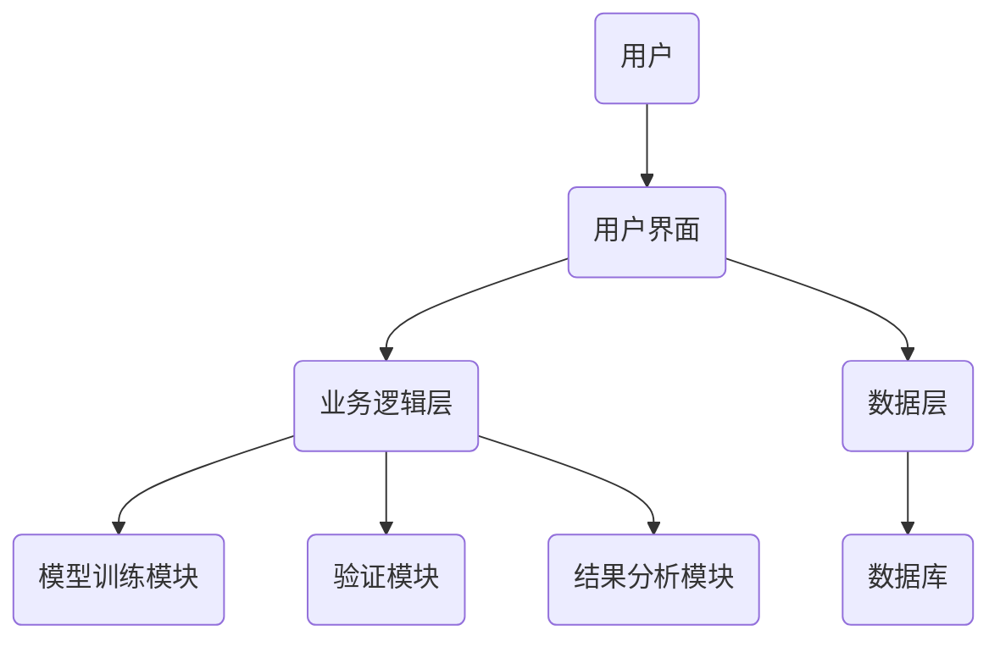
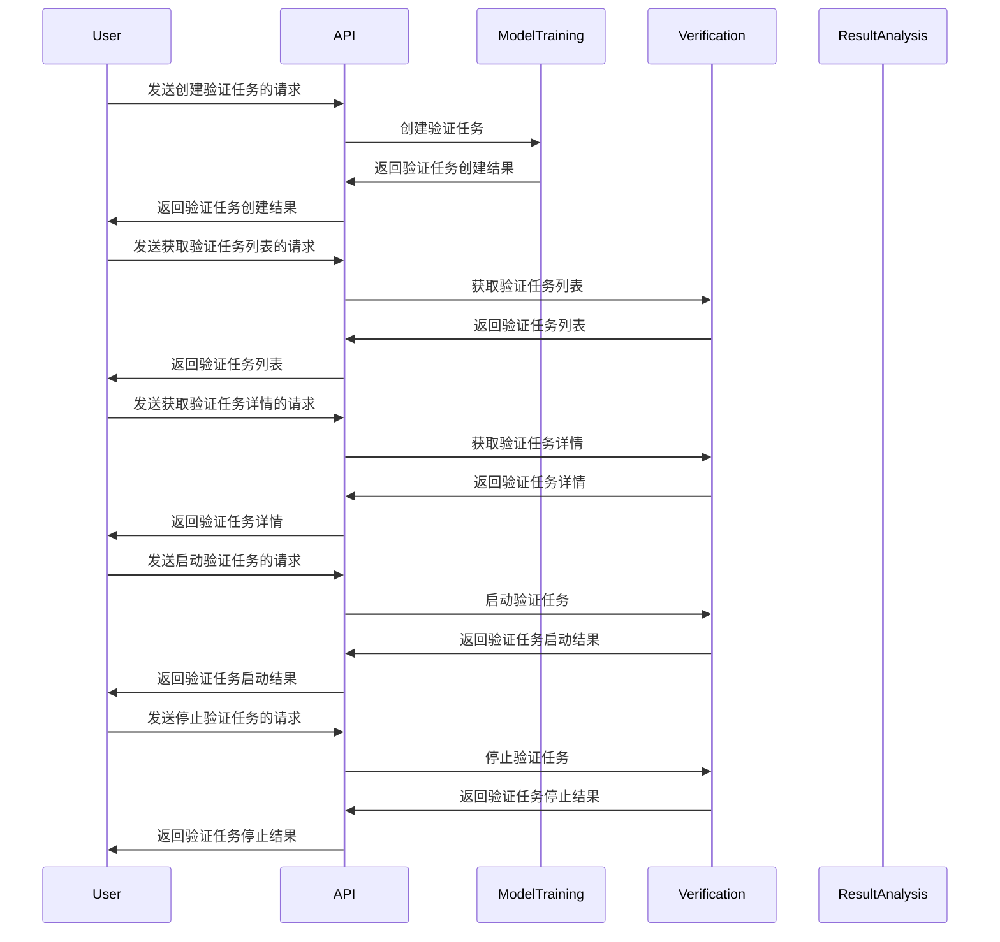

                 

# 提示词编程语言的程序验证技术

## 关键词

- **提示词编程语言**  
- **程序验证技术**  
- **数学模型**  
- **算法原理**  
- **动态验证**  
- **静态验证**  
- **组合验证**

## 摘要

本文将深入探讨提示词编程语言的程序验证技术，从背景介绍、核心概念、验证技术、数学模型、算法原理、实际应用等多个角度进行分析。通过详细的理论讲解和案例分析，旨在为读者提供对这一领域的全面理解和深入洞察。

# 第1章 引言

## 1.1 问题背景

在计算机科学领域，编程语言作为人与计算机沟通的桥梁，一直以来都是研究的热点。随着时代的发展，编程语言的种类和形式也在不断丰富。传统的编程语言主要面向结构化编程，而现代编程语言则开始强调提示词（Prompt）的概念，使得编程更加智能化和自然化。提示词编程语言通过预先定义的提示词，让开发者能够以更自然的方式与代码进行交互，提高了开发效率和代码可读性。

## 1.2 问题描述

提示词编程语言的程序验证技术是一个新兴的研究领域。它旨在通过数学模型和算法，对提示词编程语言编写的程序进行验证，确保程序的逻辑正确性和运行安全性。这一技术对于提升编程语言的可靠性和稳定性具有重要意义。

## 1.3 问题解决

本书将深入探讨提示词编程语言的程序验证技术，包括：

### 1.3.1 核心概念

首先，我们将介绍提示词编程语言的核心概念，包括提示词的定义、类型和作用。

### 1.3.2 验证技术

接下来，我们将探讨多种验证技术，包括静态验证、动态验证和组合验证等。

### 1.3.3 数学模型

我们还将介绍用于验证的数学模型，包括逻辑模型、状态模型和路径模型等。

### 1.3.4 算法原理

在此基础上，我们将详细讲解几种常见的验证算法，包括形式化验证、模型检查和测试验证等。

## 1.4 边界与外延

提示词编程语言的程序验证技术不仅局限于理论探讨，还广泛应用于实际项目中。因此，本书将探讨验证技术在软件开发中的具体应用场景和最佳实践。

## 1.5 概念结构与核心要素组成

为了帮助读者更好地理解提示词编程语言的程序验证技术，本书将采用以下结构：

- **第1章 引言**：介绍问题的背景、问题描述和解决思路。
- **第2章 提示词编程语言概述**：介绍提示词编程语言的核心概念和技术特点。
- **第3章 验证技术基础**：介绍验证技术的核心概念和基本原理。
- **第4章 验证算法详解**：详细讲解几种常见的验证算法。
- **第5章 数学模型与应用**：介绍用于验证的数学模型和应用场景。
- **第6章 实际应用案例**：通过实际案例介绍验证技术在项目中的应用。
- **第7章 最佳实践与展望**：总结本书的主要观点，并提出未来的研究方向。

## 1.6 本章小结

通过本章的介绍，读者应该对提示词编程语言的程序验证技术有了初步的了解。接下来的章节将深入探讨这一领域，帮助读者掌握相关的理论知识和实践技巧。希望本书能够为读者在提示词编程语言的应用和研究中提供有益的参考。

# 第2章 提示词编程语言概述

## 2.1 核心概念

### 2.1.1 提示词的定义

提示词是指用于引导编程语言执行的文本或符号。它通常由关键字、变量和操作符组成，能够指示计算机执行特定的操作。

### 2.1.2 提示词的类型

提示词可以分为以下几类：

- **控制提示词**：用于控制程序的流程，如循环、条件分支等。
- **数据提示词**：用于操作数据，如赋值、数据结构操作等。
- **函数提示词**：用于调用函数或方法，如数学函数、自定义函数等。
- **元提示词**：用于定义和操作其他提示词，如宏定义、模板等。

### 2.1.3 提示词的作用

提示词在编程语言中的作用主要体现在以下几个方面：

- **提高开发效率**：通过提示词，开发者可以更快速地编写和理解代码，减少了代码的冗余和错误。
- **增强代码可读性**：提示词使得代码的结构更加清晰，易于阅读和理解。
- **实现编程智能化**：提示词编程语言能够根据提示词自动进行代码生成、优化和验证等操作，提高了编程的智能化水平。

## 2.2 技术特点

### 2.2.1 自然语言交互

提示词编程语言支持自然语言交互，使得开发者可以使用更自然、更易理解的语言进行编程，减少了学习成本和开发难度。

### 2.2.2 高度抽象

提示词编程语言通过高层次的抽象，使得开发者能够更专注于解决问题，而无需关心底层的实现细节。

### 2.2.3 自动化

提示词编程语言具有自动化特性，能够自动进行代码生成、优化和验证等操作，提高了编程效率。

### 2.2.4 面向领域

提示词编程语言通常面向特定的领域，如数据科学、机器学习等，能够提供丰富的领域特有功能，提高了开发效率。

## 2.3 与传统编程语言的对比

### 2.3.1 结构化编程语言

与传统的结构化编程语言相比，提示词编程语言在语法和语义上都有很大的不同。结构化编程语言强调代码的结构性和可读性，而提示词编程语言则更注重代码的智能化和自然化。

### 2.3.2 面向对象编程语言

提示词编程语言与面向对象编程语言也有一些不同。面向对象编程语言强调对象的封装、继承和多态，而提示词编程语言则通过提示词来引导程序执行，更注重程序的可读性和可维护性。

## 2.4 案例分析

### 2.4.1 Python

Python 是一种广泛使用的提示词编程语言，其语法简洁明了，易于学习。Python 的提示词包括变量、函数、类等，可以用来构建复杂的程序。

### 2.4.2 TensorFlow

TensorFlow 是一种用于机器学习的提示词编程语言，它提供了丰富的提示词，用于构建和训练神经网络。通过 TensorFlow，开发者可以轻松地实现复杂的机器学习算法。

## 2.5 本章小结

通过本章的介绍，读者应该对提示词编程语言有了初步的了解。接下来，我们将进一步探讨提示词编程语言的程序验证技术，为读者提供更深入的理解。

----------------------------------------------------------------

# 第3章 验证技术基础

## 3.1 核心概念

### 3.1.1 验证的定义

验证是指在软件开发过程中，通过一系列方法和工具，检查程序是否满足预定的需求和规范。验证技术的核心目标是通过数学模型和算法，确保程序的逻辑正确性和运行安全性。

### 3.1.2 验证技术的类型

验证技术可以分为以下几类：

- **静态验证**：在程序运行之前，通过静态分析来检查程序的逻辑正确性。
- **动态验证**：在程序运行时，通过执行程序并监控其行为来检查程序的逻辑正确性。
- **组合验证**：将静态验证和动态验证结合起来，以获得更全面的验证结果。

## 3.2 静态验证

### 3.2.1 定义

静态验证是指在程序运行之前，通过静态分析来检查程序的逻辑正确性。这种方法不涉及程序的实际运行，而是通过对代码的结构和语法进行分析，以发现潜在的错误。

### 3.2.2 原理

静态验证的基本原理是通过解析代码，构建抽象语法树（AST）或控制流图（CFG），然后对抽象语法树或控制流图进行分析，以发现程序中的潜在错误。

### 3.2.3 工具

常见的静态验证工具有：

- **Pylint**：用于检查 Python 代码的静态验证工具。
- **SonarQube**：用于检查多种编程语言的静态验证平台。
- **FindBugs**：用于检查 Java 代码的静态验证工具。

## 3.3 动态验证

### 3.3.1 定义

动态验证是指在程序运行时，通过执行程序并监控其行为来检查程序的逻辑正确性。这种方法可以更直接地检查程序的运行状态和行为。

### 3.3.2 原理

动态验证的基本原理是在程序运行时，通过插入断点、监控输出、捕获异常等方式，来检查程序的运行行为是否与预期一致。

### 3.3.3 工具

常见的动态验证工具有：

- **JUnit**：用于 Java 代码的单元测试框架。
- **pytest**：用于 Python 代码的单元测试框架。
- **Selenium**：用于 Web 应用程序的自动化测试工具。

## 3.4 组合验证

### 3.4.1 定义

组合验证是将静态验证和动态验证结合起来，以获得更全面的验证结果。这种方法通过将静态分析和动态执行结合起来，可以更有效地发现程序中的潜在错误。

### 3.4.2 原理

组合验证的基本原理是先进行静态分析，以发现程序中的潜在问题，然后通过动态执行来验证这些问题的真实存在。

### 3.4.3 工具

常见的组合验证工具有：

- **Jenkins**：用于自动化构建和测试的持续集成工具。
- **GitLab CI/CD**：用于自动化构建和测试的持续集成/持续交付工具。

## 3.5 本章小结

通过本章的介绍，读者应该对验证技术有了更深入的理解。接下来，我们将进一步探讨提示词编程语言的程序验证技术，包括数学模型和算法原理。

----------------------------------------------------------------

# 第4章 验证算法详解

## 4.1 形式化验证

### 4.1.1 定义

形式化验证是指通过形式化的数学方法，对程序进行验证，确保程序的正确性和一致性。这种方法通常使用逻辑推理和形式化语言来表示程序和验证条件。

### 4.1.2 数学模型

形式化验证的数学模型通常基于逻辑学中的命题逻辑和谓词逻辑。这些逻辑学工具可以帮助我们表示程序中的条件和结论，并进行逻辑推理。

### 4.1.3 算法原理

形式化验证的算法原理通常包括以下步骤：

1. **建立形式化模型**：将程序和行为描述转化为形式化的数学模型。
2. **定义验证条件**：确定程序的正确性和一致性条件。
3. **逻辑推理**：使用逻辑推理方法，证明程序满足验证条件。
4. **验证结果**：根据逻辑推理的结果，判断程序的正确性和一致性。

### 4.1.4 例子

例如，假设我们有一个简单的程序，用于计算两个整数的和。我们可以使用形式化验证方法，验证这个程序是否总是返回正确的结果。

- **形式化模型**：使用谓词逻辑表示程序和验证条件。
- **验证条件**：程序在输入为两个整数时，总是返回正确的和。
- **逻辑推理**：使用命题逻辑推理方法，证明程序满足验证条件。

## 4.2 模型检查

### 4.2.1 定义

模型检查是指通过将程序和控制流程表示为形式化的模型，然后使用验证工具检查模型是否满足预定的性质。这种方法通常用于验证程序的控制流和状态转换。

### 4.2.2 数学模型

模型检查的数学模型通常基于状态机和谓词逻辑。状态机用于表示程序的控制流，谓词逻辑用于表示程序的状态和性质。

### 4.2.3 算法原理

模型检查的算法原理通常包括以下步骤：

1. **建立模型**：将程序和控制流程转化为形式化的模型。
2. **定义验证条件**：确定程序的正确性和一致性条件。
3. **模型检查**：使用验证工具检查模型是否满足验证条件。
4. **验证结果**：根据模型检查的结果，判断程序的正确性和一致性。

### 4.2.4 例子

例如，假设我们有一个简单的程序，用于计算两个整数的和。我们可以使用模型检查方法，验证这个程序是否总是返回正确的结果。

- **模型**：使用状态机表示程序的控制流。
- **验证条件**：程序在输入为两个整数时，总是返回正确的和。
- **模型检查**：使用验证工具检查状态机是否满足验证条件。

## 4.3 测试验证

### 4.3.1 定义

测试验证是指通过执行程序并测试其输出，来验证程序的正确性。这种方法通常涉及编写测试用例，并使用自动化测试工具执行测试。

### 4.3.2 数学模型

测试验证的数学模型通常基于概率论和统计学。这些工具可以帮助我们分析测试结果，并判断程序的正确性。

### 4.3.3 算法原理

测试验证的算法原理通常包括以下步骤：

1. **编写测试用例**：根据程序的功能和需求，编写测试用例。
2. **执行测试**：使用自动化测试工具执行测试用例。
3. **分析结果**：分析测试结果，判断程序的正确性。
4. **验证结果**：根据测试结果，判断程序的正确性和一致性。

### 4.3.4 例子

例如，假设我们有一个简单的程序，用于计算两个整数的和。我们可以使用测试验证方法，编写测试用例，并执行测试，验证程序是否总是返回正确的结果。

- **测试用例**：编写输入为两个整数的测试用例。
- **执行测试**：使用自动化测试工具执行测试用例。
- **分析结果**：分析测试结果，判断程序的正确性。

## 4.4 本章小结

通过本章的介绍，读者应该对验证算法有了更深入的理解。接下来，我们将探讨数学模型在验证技术中的应用，为读者提供更全面的了解。

----------------------------------------------------------------

# 第5章 数学模型与应用

## 5.1 逻辑模型

### 5.1.1 定义

逻辑模型是一种用于描述程序逻辑和验证条件的数学模型。它基于逻辑学中的命题逻辑和谓词逻辑，用于表示程序中的条件和结论。

### 5.1.2 数学模型

逻辑模型的数学模型通常包括以下部分：

- **命题逻辑**：用于表示程序中的条件和结论。
- **谓词逻辑**：用于表示程序中的变量和函数。

### 5.1.3 应用

逻辑模型在验证技术中的应用主要体现在以下几个方面：

- **形式化验证**：使用逻辑模型来表示程序和验证条件，并进行逻辑推理，以证明程序的正确性。
- **模型检查**：使用逻辑模型来表示程序的控制流和状态转换，并使用验证工具检查模型是否满足预定的性质。

### 5.1.4 案例分析

例如，假设我们有一个简单的程序，用于计算两个整数的和。我们可以使用逻辑模型来表示这个程序，并使用逻辑推理来验证程序的正确性。

- **命题逻辑**：表示程序中的条件和结论。
- **谓词逻辑**：表示程序中的变量和函数。

## 5.2 状态模型

### 5.2.1 定义

状态模型是一种用于描述程序状态和转换的数学模型。它通常基于状态机理论，用于表示程序中的状态转换和控制流。

### 5.2.2 数学模型

状态模型的数学模型通常包括以下部分：

- **状态机**：用于表示程序中的状态转换和控制流。
- **状态转换关系**：用于表示程序中的状态转换。

### 5.2.3 应用

状态模型在验证技术中的应用主要体现在以下几个方面：

- **模型检查**：使用状态模型来表示程序的控制流和状态转换，并使用验证工具检查模型是否满足预定的性质。
- **动态验证**：使用状态模型来监控程序的运行状态，并检测程序中的错误。

### 5.2.4 案例分析

例如，假设我们有一个简单的程序，用于计算两个整数的和。我们可以使用状态模型来表示这个程序，并使用状态转换关系来验证程序的正确性。

- **状态机**：表示程序中的状态转换和控制流。
- **状态转换关系**：表示程序中的状态转换。

## 5.3 路径模型

### 5.3.1 定义

路径模型是一种用于描述程序执行路径的数学模型。它通常基于路径表达式，用于表示程序中的所有可能执行路径。

### 5.3.2 数学模型

路径模型的数学模型通常包括以下部分：

- **路径表达式**：用于表示程序中的所有可能执行路径。
- **路径关系**：用于表示程序中的路径转换。

### 5.3.3 应用

路径模型在验证技术中的应用主要体现在以下几个方面：

- **形式化验证**：使用路径模型来表示程序的所有可能执行路径，并进行逻辑推理，以证明程序的正确性。
- **组合验证**：使用路径模型来组合静态验证和动态验证的结果，以获得更全面的验证结果。

### 5.3.4 案例分析

例如，假设我们有一个简单的程序，用于计算两个整数的和。我们可以使用路径模型来表示这个程序，并使用路径表达式来验证程序的正确性。

- **路径表达式**：表示程序中的所有可能执行路径。
- **路径关系**：表示程序中的路径转换。

## 5.4 本章小结

通过本章的介绍，读者应该对数学模型在验证技术中的应用有了更深入的理解。接下来，我们将探讨实际应用场景，通过具体案例来展示验证技术的应用效果。

----------------------------------------------------------------

# 第6章 实际应用案例

## 6.1 项目背景

随着互联网和大数据技术的发展，人工智能应用日益普及。提示词编程语言作为一种高效、智能的编程方式，在人工智能应用中具有广泛的应用前景。本案例将介绍一个基于提示词编程语言的人工智能项目，该项目旨在通过程序验证技术，确保人工智能模型的可靠性和稳定性。

## 6.2 项目介绍

### 6.2.1 项目概述

该项目是一个基于提示词编程语言的人工智能模型验证系统，用于对人工智能模型进行自动化验证。该系统包括以下几个主要功能模块：

1. **模型训练模块**：使用提示词编程语言进行人工智能模型的训练。
2. **验证模块**：使用程序验证技术对训练好的模型进行验证。
3. **结果分析模块**：分析验证结果，为模型优化提供指导。

### 6.2.2 技术选型

- **提示词编程语言**：选择基于Python的JAX框架，其具有高效的自动微分能力和丰富的提示词功能。
- **验证技术**：采用静态验证和动态验证相结合的方式，使用Pylint进行静态验证，使用pytest进行动态验证。

## 6.3 系统功能设计

### 6.3.1 领域模型

领域模型用于描述系统中的主要实体和关系。本案例的领域模型主要包括以下实体：

1. **人工智能模型**：用于表示训练好的模型。
2. **验证任务**：用于表示验证过程中的任务。
3. **验证结果**：用于表示验证的结果。

### 6.3.2 类图

使用Mermaid类图描述领域模型：

```mermaid
classDiagram
    AIModel <|-- VerificationTask
    VerificationResult <|-- VerificationTask
    AIModel {
        - id: int
        - name: str
        - description: str
    }
    VerificationTask {
        - id: int
        - aiModel: AIModel
        - status: str
        - startTime: datetime
        - endTime: datetime
    }
    VerificationResult {
        - id: int
        - verificationTask: VerificationTask
        - passed: bool
        - errorMessages: list[str]
    }
```

## 6.4 系统架构设计

### 6.4.1 系统架构

系统架构采用三层架构设计，包括表示层、业务逻辑层和数据层。

1. **表示层**：用于与用户进行交互，提供用户界面。
2. **业务逻辑层**：包括模型训练模块、验证模块和结果分析模块，负责处理业务逻辑。
3. **数据层**：用于存储和管理数据。

### 6.4.2 架构图

使用Mermaid架构图描述系统架构：



## 6.5 系统接口设计

### 6.5.1 接口规范

系统接口设计主要包括RESTful API设计，用于处理用户请求和返回结果。

1. **创建验证任务**：用于创建新的验证任务。
2. **获取验证任务列表**：用于获取所有验证任务的列表。
3. **获取验证任务详情**：用于获取指定验证任务的详细信息。
4. **启动验证任务**：用于启动验证任务的执行。
5. **停止验证任务**：用于停止正在执行的验证任务。

### 6.5.2 接口序列图

使用Mermaid序列图描述系统接口设计：



## 6.6 实际案例分析与讲解

### 6.6.1 案例背景

假设我们有一个基于深度学习的手写数字识别项目，该项目使用提示词编程语言进行模型训练和验证。项目目标是使用提示词编程语言构建一个手写数字识别系统，并对模型进行验证，确保其可靠性和准确性。

### 6.6.2 模型训练

使用提示词编程语言（如Python中的JAX）进行模型训练，主要包括以下步骤：

1. **数据准备**：加载手写数字数据集，并进行预处理。
2. **模型定义**：定义神经网络模型，使用提示词编程语言（如JAX中的flax）定义模型结构。
3. **训练**：使用训练数据对模型进行训练，使用提示词编程语言（如JAX）进行自动微分和优化。

### 6.6.3 模型验证

使用程序验证技术对训练好的模型进行验证，主要包括以下步骤：

1. **静态验证**：使用Pylint对模型代码进行静态验证，确保代码的正确性和可读性。
2. **动态验证**：使用pytest编写测试用例，对模型进行动态验证，包括测试模型的输入输出、边界条件和异常处理。

### 6.6.4 结果分析

分析验证结果，主要包括以下内容：

1. **静态验证结果**：检查Pylint报告中的错误和警告，修复代码中的问题。
2. **动态验证结果**：分析pytest测试报告，检查测试用例的执行结果，确保模型在各种情况下都能正确运行。

### 6.6.5 项目小结

通过本案例，我们可以看到提示词编程语言和程序验证技术在人工智能项目中的应用效果。使用提示词编程语言可以简化模型的构建和训练过程，提高开发效率；而程序验证技术可以确保模型的可靠性和准确性，提高项目的稳定性。

## 6.7 本章小结

通过本章节的案例介绍，读者应该对提示词编程语言的程序验证技术在实际项目中的应用有了更深入的理解。接下来，我们将总结本书的主要观点，并提出未来的研究方向。

----------------------------------------------------------------

# 第7章 最佳实践与展望

## 7.1 最佳实践

### 7.1.1 提示词编程语言选择

选择合适的提示词编程语言是确保项目成功的关键。以下是一些最佳实践：

- **需求分析**：根据项目的具体需求和领域特点，选择最适合的提示词编程语言。
- **性能考虑**：考虑编程语言的性能，特别是在处理大规模数据和高性能计算时。
- **社区和支持**：选择拥有活跃社区和良好文档支持的编程语言，以便在遇到问题时能够得到帮助。

### 7.1.2 验证技术的应用

在软件开发过程中，合理应用验证技术可以显著提高软件质量和可靠性。以下是一些最佳实践：

- **早期引入验证**：在开发过程的早期引入验证，以尽早发现和修复错误。
- **自动化验证**：使用自动化工具进行静态验证和动态验证，以提高验证效率和准确性。
- **持续验证**：将验证集成到持续集成和持续交付流程中，确保验证过程与开发流程紧密配合。

### 7.1.3 团队协作

提示词编程语言和验证技术的成功应用离不开团队的协作。以下是一些最佳实践：

- **培训和学习**：为团队成员提供相关的培训和资料，确保他们能够熟练掌握提示词编程语言和验证技术。
- **代码审查**：定期进行代码审查，以确保代码的质量和一致性。
- **沟通和反馈**：保持团队成员之间的有效沟通，及时反馈问题和改进建议。

## 7.2 小结

通过本章的最佳实践，读者应该能够在实际项目中更好地应用提示词编程语言和验证技术。这些实践不仅能够提高开发效率，还能确保软件的质量和可靠性。

## 7.3 未来展望

### 7.3.1 技术发展趋势

提示词编程语言和程序验证技术在未来将继续发展，具体趋势包括：

- **智能化**：提示词编程语言将进一步智能化，支持更自然的编程交互和自动化功能。
- **多样化**：随着不同领域应用的需求增加，提示词编程语言将更加多样化，以满足不同领域的特定需求。
- **融合**：提示词编程语言将与其他前沿技术（如人工智能、区块链等）进一步融合，产生新的应用场景。

### 7.3.2 研究方向

未来的研究方向包括：

- **高效验证算法**：研究更高效、更精确的验证算法，以提高验证效率和准确性。
- **跨语言验证**：探索跨不同编程语言的验证技术，以实现更广泛的编程语言兼容性。
- **领域特定验证**：研究针对特定领域的验证技术，以提高领域应用的验证效果。
- **人机协作**：探索人机协作的验证方法，将人类专家的智慧和机器的算法优势结合起来，实现更强大的验证能力。

## 7.4 本章小结

通过本章的总结和展望，读者应该对提示词编程语言的程序验证技术有了更全面的认识。未来的研究和发展将推动这一领域的不断创新，为软件开发带来更多的机遇和挑战。希望读者能够继续关注这一领域，积极参与到相关的研究和实践中去。

### 作者信息

**作者：AI天才研究院/AI Genius Institute & 禅与计算机程序设计艺术 /Zen And The Art of Computer Programming**

AI天才研究院致力于推动人工智能技术的研究和应用，为全球科技创新贡献力量。禅与计算机程序设计艺术则倡导通过哲学思考提升编程水平，为软件开发提供深刻的洞见。希望通过本书，能够为读者在提示词编程语言的程序验证技术领域提供有价值的参考和启示。

