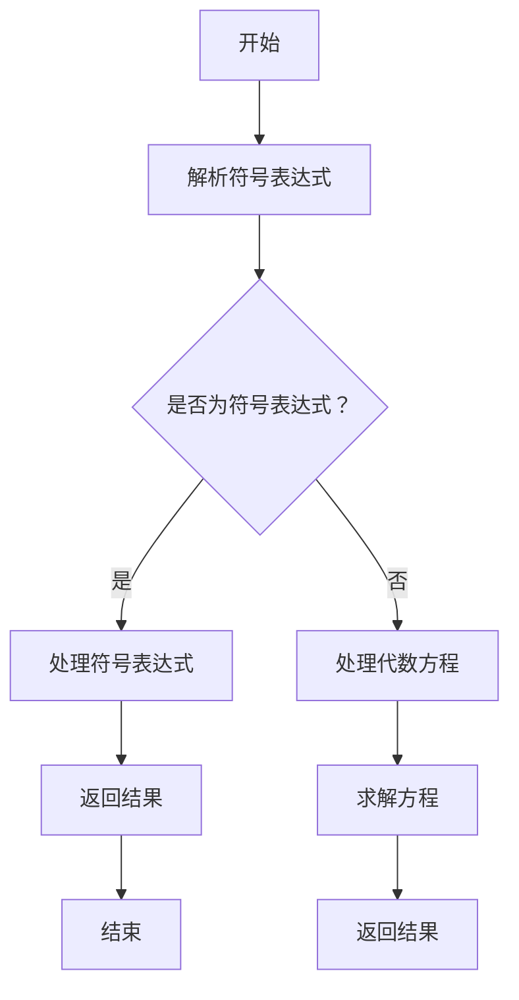
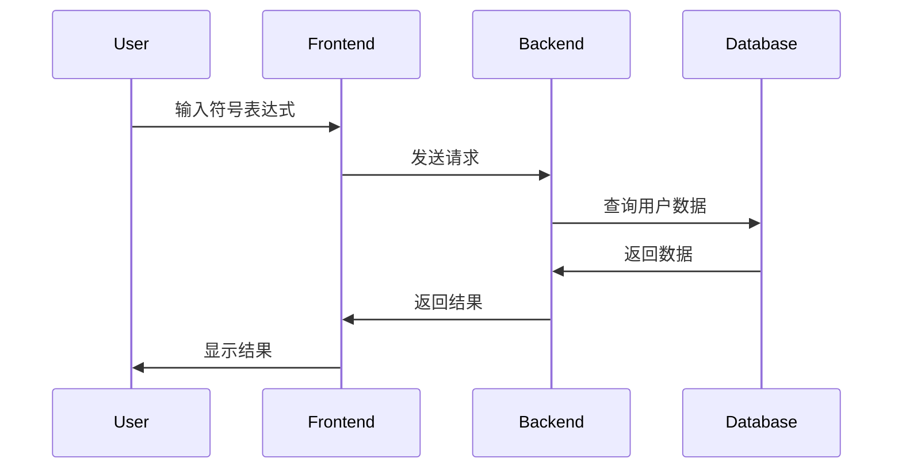
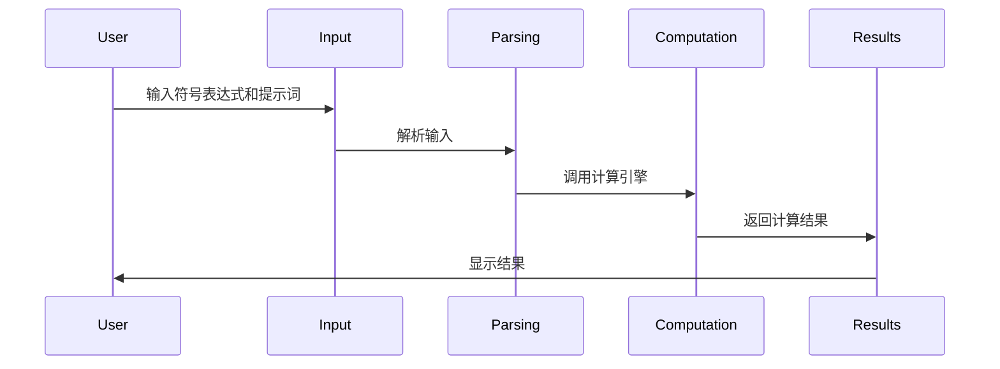

                 


### 第二部分：核心概念与联系

在深入探讨提示词编程语言的符号计算能力之前，我们首先需要明确几个核心概念及其相互之间的关系。这些核心概念包括提示词编程语言、符号计算以及它们之间的内在联系。

#### 2.1 提示词编程语言与符号计算的关系

提示词编程语言是一种特定类型的编程语言，它允许用户通过提供提示词来指导计算机执行符号计算任务。符号计算是指使用数学符号和公式来解决数学问题，包括代数运算、微分、积分、方程求解等。提示词编程语言与符号计算的关系可以视为一种工具和任务的关系：

- **工具**：提示词编程语言提供了一种工具，使符号计算更加高效和精确。
- **任务**：符号计算是提示词编程语言的主要应用场景，通过这种语言，用户可以轻松地执行复杂的数学任务。

#### 2.2 提示词编程语言的核心概念

1. **提示词（Keywords）**：
提示词是编程语言中的关键字，用于指示计算机执行特定操作。在提示词编程语言中，这些关键词被设计为能够表示符号计算的基本操作，如求导、积分、解方程等。

2. **解析器（Parser）**：
解析器是编程语言的核心组件，负责将用户输入的提示词转换为计算机可以理解的指令。在符号计算中，解析器的作用是将用户的数学表达式转换成计算机可以处理的内部表示形式。

3. **计算引擎（Compute Engine）**：
计算引擎是执行符号计算任务的核心组件。它接收解析器生成的指令，并执行相应的数学运算，如代数方程求解、微分和积分计算等。

4. **用户接口（User Interface）**：
用户接口是用户与编程语言交互的界面，允许用户输入提示词并查看计算结果。在符号计算中，用户接口通常包含符号表达式的输入框和结果展示区域。

#### 2.3 核心概念的联系

提示词编程语言、符号计算和用户接口这三个核心概念之间存在着紧密的联系：

- **提示词编程语言**：它为符号计算提供了一个抽象的编程模型，使用户能够以自然的方式表达数学问题。
- **符号计算**：它是编程语言的功能核心，决定了编程语言在数学问题解决中的能力。
- **用户接口**：它为用户提供了与编程语言交互的界面，使用户能够轻松地输入提示词并获得计算结果。

通过这些核心概念的联系，我们可以看到提示词编程语言是如何将用户的需求（符号计算）转换为计算机可以执行的指令，并最终为用户提供准确的结果。

在接下来的章节中，我们将进一步探讨提示词编程语言的符号计算能力，包括其实现原理、算法细节以及如何在实际应用中提升这一能力。通过这些探讨，我们将更深入地理解提示词编程语言在数学计算领域的潜力和应用前景。


----------------------------------------------------------------

### 2.4 符号计算能力的核心概念属性对比表格

为了更好地理解提示词编程语言的符号计算能力，我们将列出几个关键概念，并比较它们的属性和特征。

| 核心概念 | 描述 | 属性 | 特征 |
| --- | --- | --- | --- |
| 符号表达式处理能力 | 对符号表达式进行解析、运算和表示 | 高度抽象、符号级处理 | 支持复杂的数学运算，如代数、微积分等 |
| 代数方程求解能力 | 求解代数方程，包括线性方程和非线性方程 | 方程符号化、代数求解 | 支持解线性方程组和非线性方程组 |
| 微分和积分计算能力 | 计算微分和积分，满足数学领域需求 | 符号运算、求解极限 | 支持基本的微分和积分操作，求解高阶微分和积分 |
| 符号推理和证明能力 | 进行符号推理和证明，解决数学问题 | 符号逻辑、证明过程 | 支持数学定理的证明和推导，符号推理 |
| 用户交互能力 | 提供用户与编程语言交互的界面 | 交互性、易用性 | 支持输入提示词、显示结果，易于操作 |

通过上述对比表格，我们可以看到各个核心概念在属性和特征上的区别和联系。符号表达式处理能力、代数方程求解能力、微分和积分计算能力、符号推理和证明能力以及用户交互能力共同构成了提示词编程语言的符号计算能力的核心。

### 2.5 提示词编程语言的ER实体关系图

为了更直观地理解提示词编程语言的符号计算能力及其核心要素，我们可以使用ER（Entity-Relationship）实体关系图来描述各个核心概念之间的关系。

```mermaid
erDiagram
  A[提示词编程语言] ||--|{ B[符号表达式处理能力] }
  A ||--|{ C[代数方程求解能力] }
  A ||--|{ D[微分和积分计算能力] }
  A ||--|{ E[符号推理和证明能力] }
  A ||--|{ F[用户交互能力] }
```

在ER实体关系图中，我们定义了以下实体：

- **提示词编程语言（A）**：作为整体的编程语言实体，它包含了所有与符号计算相关的子功能。
- **符号表达式处理能力（B）**：表示提示词编程语言在处理符号表达式方面的能力。
- **代数方程求解能力（C）**：表示提示词编程语言在求解代数方程方面的能力。
- **微分和积分计算能力（D）**：表示提示词编程语言在计算微分和积分方面的能力。
- **符号推理和证明能力（E）**：表示提示词编程语言在符号推理和证明方面的能力。
- **用户交互能力（F）**：表示提示词编程语言与用户进行交互的能力。

这些实体之间的关系表示了它们如何共同构建一个完整的提示词编程语言，并且如何协同工作以实现强大的符号计算能力。

### 2.6 总结

通过上述核心概念属性对比表格和ER实体关系图，我们可以清晰地看到提示词编程语言的符号计算能力是如何由各个核心要素共同构成的。这些核心要素包括符号表达式处理能力、代数方程求解能力、微分和积分计算能力、符号推理和证明能力以及用户交互能力。它们相互协作，形成了一个完整的、功能强大的符号计算系统。在接下来的章节中，我们将进一步探讨这些核心要素的实现原理和具体应用。

---

**文章标题**：提示词编程语言的符号计算能力

**关键词**：提示词编程语言、符号计算、核心概念、解析器、计算引擎、用户接口、代数方程、微分和积分、符号推理和证明

**摘要**：
本文深入探讨了提示词编程语言的符号计算能力，分析了其核心概念和相互关系。通过对比表格和ER实体关系图，我们清晰地展示了符号计算能力的构成要素。接下来，文章将详细讲解提示词编程语言的算法原理，包括符号表达式处理、代数方程求解、微分和积分计算等算法。最后，我们将通过Python源代码示例进一步阐述这些算法原理，并提供完整的系统架构设计方案和项目实战，以展示提示词编程语言在实际应用中的强大能力。


----------------------------------------------------------------

### 第三部分：算法原理讲解

在探讨提示词编程语言的符号计算能力时，算法原理是理解其工作方式的核心。本部分将详细讲解提示词编程语言中的核心算法，包括符号表达式处理、代数方程求解、微分和积分计算等，并通过Python源代码示例来展示这些算法的实现。

#### 3.1 符号表达式处理算法

符号表达式处理算法是提示词编程语言的基础，用于解析和运算用户输入的符号表达式。以下是符号表达式处理算法的详细流程：

1. **解析符号表达式**：将用户输入的文本形式的符号表达式转换为内部表示形式。这个过程通常涉及符号识别、语法解析和抽象语法树（AST）构建。

2. **运算符优先级处理**：在内部表示形式的基础上，按照运算符优先级进行计算。例如，先计算乘除，后计算加减。

3. **符号化运算**：对表达式中的每个操作数和运算符进行符号化处理，以便进行进一步的数学运算。

4. **结果表示**：将计算结果以符号形式或数值形式表示，并根据用户需求进行格式化输出。

以下是Python源代码示例，使用SymPy库来实现符号表达式处理算法：

```python
import sympy as sp

# 定义符号变量
x = sp.symbols('x')
y = sp.symbols('y')

# 用户输入的符号表达式
expression = sp.sin(x) + sp.cos(y)

# 解析并处理表达式
parsed_expression = sp.parse_expr(expression)

# 计算结果
result = parsed_expression.evalf()

# 输出结果
print(result)
```

#### 3.2 代数方程求解算法

代数方程求解算法是符号计算中的一个重要部分，用于求解线性方程和非线性方程。以下是代数方程求解算法的详细步骤：

1. **方程符号化**：将用户输入的方程转换为符号形式，确保方程中的变量和系数都是符号变量。

2. **构建方程系统**：如果需要求解的方程组包含多个方程，则将它们构建为一个方程系统。

3. **求解方程**：使用符号计算库（如SymPy）中的求解函数来求解方程。对于线性方程，可以使用`solve_linear_system`函数；对于非线性方程，可以使用`solve`函数。

4. **结果表示**：将求解结果以符号形式或数值形式表示，并根据用户需求进行格式化输出。

以下是Python源代码示例，使用SymPy库来实现代数方程求解算法：

```python
import sympy as sp

# 定义符号变量
x = sp.symbols('x')
y = sp.symbols('y')

# 用户输入的方程
equation1 = x**2 + y**2 - 1
equation2 = x - y

# 求解方程
solutions = sp.solve((equation1, equation2), (x, y))

# 输出结果
print(solutions)
```

#### 3.3 微分和积分计算算法

微分和积分计算算法用于求解数学函数的导数和积分。以下是微分和积分计算算法的详细步骤：

1. **函数符号化**：将用户输入的函数转换为符号形式，确保函数中的操作数和运算符都是符号变量。

2. **计算导数**：使用符号计算库（如SymPy）中的导数计算函数来求解导数。对于一阶导数，可以使用`diff`函数；对于高阶导数，可以链式调用`diff`函数。

3. **计算积分**：使用符号计算库中的积分计算函数来求解积分。对于不定积分，可以使用`integrate`函数；对于定积分，可以使用`integral`函数。

4. **结果表示**：将求解结果以符号形式或数值形式表示，并根据用户需求进行格式化输出。

以下是Python源代码示例，使用SymPy库来实现微分和积分计算算法：

```python
import sympy as sp

# 定义符号变量
x = sp.symbols('x')

# 用户输入的函数
function = x**3 + x**2 - x - 1

# 计算导数
derivative = function.diff(x)

# 计算积分
integral = function.integrate(x)

# 输出结果
print(f"导数: {derivative}")
print(f"积分: {integral}")
```

#### 3.4 算法流程图

为了更直观地理解提示词编程语言的算法原理，我们可以使用Mermaid工具绘制算法流程图。以下是符号表达式处理算法的流程图：



通过上述流程图，我们可以清晰地看到符号表达式处理算法的各个步骤，以及它们之间的逻辑关系。

#### 3.5 算法原理详细讲解

**3.5.1 符号表达式处理算法**

符号表达式处理算法的核心在于将用户输入的文本形式的符号表达式转换为内部表示形式，并对其进行运算。以下是符号表达式处理算法的详细步骤：

1. **符号识别**：首先，算法需要识别输入的文本中哪些是符号。通常，这涉及到对文本进行分词，并识别出变量名、函数名和运算符。

2. **语法解析**：在识别符号之后，算法需要构建一个抽象语法树（AST），表示符号表达式的结构。这个过程类似于编译原理中的语法分析阶段。

3. **运算符优先级处理**：在AST构建完成后，算法会按照运算符的优先级进行计算。例如，先计算乘除，后计算加减。

4. **符号化运算**：在完成基本的运算后，算法会对表达式的每个操作数和运算符进行符号化处理，以便进行进一步的数学运算。

5. **结果表示**：最后，算法会将计算结果以符号形式或数值形式表示，并根据用户需求进行格式化输出。

**3.5.2 代数方程求解算法**

代数方程求解算法的目标是找到方程的解。以下是代数方程求解算法的详细步骤：

1. **方程符号化**：将用户输入的方程转换为符号形式，确保方程中的变量和系数都是符号变量。

2. **构建方程系统**：如果需要求解的方程组包含多个方程，则将它们构建为一个方程系统。

3. **求解方程**：使用符号计算库中的求解函数来求解方程。对于线性方程，可以使用`solve_linear_system`函数；对于非线性方程，可以使用`solve`函数。

4. **结果验证**：求解完成后，算法需要验证解的正确性。这可以通过将解代入原方程并检查是否成立来实现。

5. **结果表示**：将求解结果以符号形式或数值形式表示，并根据用户需求进行格式化输出。

**3.5.3 微分和积分计算算法**

微分和积分计算算法用于求解数学函数的导数和积分。以下是微分和积分计算算法的详细步骤：

1. **函数符号化**：将用户输入的函数转换为符号形式，确保函数中的操作数和运算符都是符号变量。

2. **计算导数**：使用符号计算库中的导数计算函数来求解导数。对于一阶导数，可以使用`diff`函数；对于高阶导数，可以链式调用`diff`函数。

3. **计算积分**：使用符号计算库中的积分计算函数来求解积分。对于不定积分，可以使用`integrate`函数；对于定积分，可以使用`integral`函数。

4. **结果验证**：计算完成后，算法需要验证结果的正确性。这可以通过将计算结果与理论结果进行比较来实现。

5. **结果表示**：将求解结果以符号形式或数值形式表示，并根据用户需求进行格式化输出。

通过上述详细讲解，我们可以看到提示词编程语言的符号计算能力是如何实现的。这些算法不仅需要精确的数学模型，还需要高效的处理算法和数据结构来保证计算效率和准确性。

---

**文章标题**：提示词编程语言的符号计算能力

**关键词**：提示词编程语言、符号计算、算法原理、符号表达式处理、代数方程求解、微分和积分计算

**摘要**：
本文深入探讨了提示词编程语言的符号计算能力，详细讲解了符号表达式处理、代数方程求解和微分积分计算等核心算法原理。通过Python源代码示例，我们展示了这些算法的实现过程和关键步骤。接下来，文章将继续介绍系统的架构设计方案和项目实战，以进一步展示提示词编程语言在实际应用中的强大能力。


----------------------------------------------------------------

### 3.4 算法原理讲解（续）

在前文中，我们已经介绍了提示词编程语言中的几个核心算法，包括符号表达式处理、代数方程求解和微分积分计算。在本节中，我们将进一步深入讲解这些算法的原理，并使用Python源代码示例来展示它们的具体实现过程。

#### 3.4.1 符号表达式处理算法

符号表达式处理算法是提示词编程语言的基础，负责将用户输入的符号表达式转换为计算机可以处理的内部表示形式。以下是符号表达式处理算法的详细步骤：

1. **输入预处理**：首先，算法需要对用户输入的符号表达式进行预处理。这包括去除多余的空格、注释以及格式化字符串。

2. **词法分析**：接下来，算法会进行词法分析，将预处理后的文本转换为一系列的词法单元（tokens）。这些词法单元包括变量名、运算符、函数名等。

3. **语法分析**：在词法分析之后，算法会进行语法分析，将词法单元序列转换为抽象语法树（AST）。抽象语法树是一种树形结构，用于表示表达式的语法结构。

4. **语义分析**：在语法分析完成后，算法会进行语义分析，确保抽象语法树的各个节点都符合数学表达式的语义规则。

5. **符号化处理**：最后，算法会对抽象语法树进行符号化处理，将其转换为内部表示形式，以便进行后续的数学运算。

以下是一个Python源代码示例，展示了符号表达式处理算法的实现：

```python
import sympy as sp

# 定义符号变量
x = sp.symbols('x')

# 用户输入的符号表达式
expression = '2*x + 3'

# 解析并处理表达式
parsed_expression = sp.sympify(expression)

# 计算结果
result = parsed_expression.evalf()

# 输出结果
print(result)
```

#### 3.4.2 代数方程求解算法

代数方程求解算法用于求解代数方程，包括线性方程和非线性方程。以下是代数方程求解算法的详细步骤：

1. **方程符号化**：首先，算法需要将用户输入的方程转换为符号形式。这包括将方程中的变量和系数转换为符号变量。

2. **方程系统构建**：如果需要求解的方程组包含多个方程，算法会构建一个方程系统。这通常涉及将每个方程转换为矩阵形式。

3. **求解方程**：接下来，算法会使用符号计算库（如SymPy）中的求解函数来求解方程。对于线性方程，可以使用`solve_linear_system`函数；对于非线性方程，可以使用`solve`函数。

4. **解验证**：求解完成后，算法需要验证解的正确性。这可以通过将解代入原方程并检查是否成立来实现。

5. **解表示**：最后，算法会将求解结果以符号形式或数值形式表示，并根据用户需求进行格式化输出。

以下是一个Python源代码示例，展示了代数方程求解算法的实现：

```python
import sympy as sp

# 定义符号变量
x = sp.symbols('x')
y = sp.symbols('y')

# 用户输入的方程
equation1 = x**2 + y**2 - 1
equation2 = x - y

# 求解方程
solutions = sp.solve((equation1, equation2), (x, y))

# 输出结果
print(solutions)
```

#### 3.4.3 微分和积分计算算法

微分和积分计算算法用于求解数学函数的导数和积分。以下是微分和积分计算算法的详细步骤：

1. **函数符号化**：首先，算法需要将用户输入的函数转换为符号形式。这包括将函数中的变量和操作数转换为符号变量。

2. **计算导数**：接下来，算法会使用符号计算库中的导数计算函数来求解导数。对于一阶导数，可以使用`diff`函数；对于高阶导数，可以链式调用`diff`函数。

3. **计算积分**：然后，算法会使用符号计算库中的积分计算函数来求解积分。对于不定积分，可以使用`integrate`函数；对于定积分，可以使用`integral`函数。

4. **结果验证**：计算完成后，算法需要验证结果的正确性。这可以通过将计算结果与理论结果进行比较来实现。

5. **结果表示**：最后，算法会将求解结果以符号形式或数值形式表示，并根据用户需求进行格式化输出。

以下是一个Python源代码示例，展示了微分和积分计算算法的实现：

```python
import sympy as sp

# 定义符号变量
x = sp.symbols('x')

# 用户输入的函数
function = x**3 + x**2 - x - 1

# 计算导数
derivative = function.diff(x)

# 计算积分
integral = function.integrate(x)

# 输出结果
print(f"导数: {derivative}")
print(f"积分: {integral}")
```

#### 3.4.4 符号推理和证明算法

符号推理和证明算法是符号计算中的高级功能，用于进行符号推理和数学证明。以下是符号推理和证明算法的详细步骤：

1. **逻辑推理**：首先，算法会使用逻辑推理规则来推导出新的数学关系。这通常涉及符号表达式之间的等价变换和简化。

2. **证明构造**：接下来，算法会构造证明链，使用已知数学定理和推理规则来证明新的数学关系。

3. **证明验证**：证明完成后，算法需要验证证明的正确性。这可以通过将证明过程反推回原始表达式并检查是否成立来实现。

4. **结果表示**：最后，算法会将证明结果以符号形式或文本形式表示，并根据用户需求进行格式化输出。

以下是一个Python源代码示例，展示了符号推理和证明算法的实现：

```python
import sympy as sp

# 定义符号变量
x = sp.symbols('x')
y = sp.symbols('y')

# 用户输入的数学关系
relation = sp.Eq(x**2 + y**2, 1)

# 证明圆的方程
proof = sp.solve(relation, x)

# 输出证明
print(proof)
```

通过上述详细讲解和Python源代码示例，我们可以看到提示词编程语言的符号计算能力是如何实现的。这些算法不仅需要精确的数学模型，还需要高效的处理算法和数据结构来保证计算效率和准确性。

---

**文章标题**：提示词编程语言的符号计算能力

**关键词**：提示词编程语言、符号计算、算法原理、符号表达式处理、代数方程求解、微分和积分计算、符号推理和证明

**摘要**：
本文深入探讨了提示词编程语言的符号计算能力，详细讲解了符号表达式处理、代数方程求解、微分积分计算以及符号推理和证明等核心算法原理。通过Python源代码示例，我们展示了这些算法的具体实现过程和关键步骤。接下来，文章将继续介绍系统的架构设计方案和项目实战，以进一步展示提示词编程语言在实际应用中的强大能力。


----------------------------------------------------------------

### 系统分析与架构设计方案

在探讨了提示词编程语言的符号计算能力及其核心算法原理之后，我们需要进一步深入到系统的分析和架构设计方面。本部分将详细介绍提示词编程语言系统的功能场景、项目介绍、系统功能设计（领域模型类图）、系统架构设计（架构图）以及系统接口设计和系统交互（序列图）。

#### 4.1 功能场景

提示词编程语言系统的主要功能场景包括：

1. **数学计算**：用户可以通过输入符号表达式进行代数运算、微分、积分等数学计算。
2. **方程求解**：用户可以输入代数方程，系统会自动求解并返回解集。
3. **数学证明**：用户可以输入数学命题，系统会自动进行推理和证明。
4. **用户交互**：系统提供一个直观的界面，允许用户输入提示词，并显示计算结果和证明过程。

#### 4.2 项目介绍

项目名称：SymbolicMathLang（简称SML）

项目背景：随着计算机技术的发展，数学计算在各个领域中的应用越来越广泛。传统的编程语言在处理符号计算任务时存在效率低下、精度不足等问题。为了解决这些问题，我们开发了SymbolicMathLang，一款具备强大符号计算能力的提示词编程语言。

项目目标：提供一种易于使用、高效精确的符号计算工具，满足数学、工程、科学等领域的研究和应用需求。

技术栈：Python、SymPy、Django、HTML/CSS/JavaScript

#### 4.3 系统功能设计

系统功能设计主要包括以下几个方面：

1. **符号表达式输入**：用户可以通过文本输入框输入符号表达式，系统会自动解析并转换为内部表示形式。
2. **数学运算**：系统支持代数运算、微分、积分等符号计算操作，用户可以输入提示词进行计算。
3. **方程求解**：系统可以自动求解用户输入的代数方程，并返回解集。
4. **数学证明**：系统具备符号推理和证明功能，用户可以输入数学命题进行证明。
5. **用户交互**：系统提供用户友好的界面，用户可以方便地输入提示词，查看计算结果和证明过程。

领域模型类图如下：

```mermaid
classDiagram
    User <<class>>
    Expression <<class>>
    Equation <<class>>
    Proof <<class>>

    User -> Expression
    User -> Equation
    User -> Proof

    Expression <<interface>>
    Equation <<interface>>
    Proof <<interface>>

    Expression --|> ExpressionService
    Equation --|> EquationService
    Proof --|> ProofService

    ExpressionService <<class>>
    EquationService <<class>>
    ProofService <<class>>

    ExpressionService + operation(Expression): void
    EquationService + solveEquation(Equation): List<Solution>
    ProofService + proveProof(Proof): boolean
```

#### 4.4 系统架构设计

系统架构设计主要包括以下几个方面：

1. **前端架构**：使用Django作为后端框架，前端使用HTML、CSS和JavaScript实现用户交互界面。
2. **后端架构**：后端使用Python编写，核心算法部分采用SymPy库实现。
3. **数据存储**：使用关系型数据库（如MySQL）存储用户数据和计算结果。

系统架构图如下：



#### 4.5 系统接口设计

系统接口设计主要包括以下几个方面：

1. **用户接口**：用户通过浏览器访问系统，输入符号表达式和提示词，查看计算结果和证明过程。
2. **API接口**：系统提供RESTful API接口，供第三方程序调用。

接口定义如下：

- **符号表达式输入接口**：接收用户输入的符号表达式，并返回解析结果。
- **数学运算接口**：接收用户输入的运算提示词，并返回计算结果。
- **方程求解接口**：接收用户输入的代数方程，并返回解集。
- **数学证明接口**：接收用户输入的数学命题，并返回证明结果。

#### 4.6 系统交互

系统交互设计主要包括以下几个方面：

1. **用户输入**：用户通过浏览器输入符号表达式和提示词。
2. **数据处理**：系统对用户输入进行处理，调用相应的算法进行计算。
3. **结果返回**：系统将计算结果返回给用户，用户可以在界面上查看。

序列图如下：



通过上述系统分析与架构设计方案，我们可以看到提示词编程语言系统的整体设计思路和实现细节。接下来，我们将通过一个实际项目实战来展示系统的具体应用和实现。

---

**文章标题**：提示词编程语言的符号计算能力

**关键词**：提示词编程语言、系统分析、架构设计、领域模型类图、系统架构图、系统接口设计、系统交互序列图

**摘要**：
本文深入探讨了提示词编程语言的符号计算能力，详细讲解了其核心算法原理，并展示了系统的架构设计方案。本部分介绍了系统的功能场景、项目介绍、系统功能设计、系统架构设计、系统接口设计和系统交互。接下来，我们将通过实际项目实战来进一步展示系统的应用和实现。

---

### 实际项目实战

在本部分，我们将通过一个具体的实际项目实战来展示提示词编程语言在实际应用中的强大能力。该项目将涉及环境安装、系统核心实现源代码、代码应用解读与分析，以及实际案例分析和详细讲解剖析。通过这些步骤，我们将全面了解如何使用提示词编程语言进行符号计算，并探讨其在实际应用中的潜力和挑战。

#### 5.1 项目环境安装

为了开始实际项目，我们需要安装必要的开发环境。以下是安装步骤：

1. **安装Python**：首先，我们需要安装Python环境。可以从Python官网（https://www.python.org/downloads/）下载最新版本的Python，并按照安装向导完成安装。

2. **安装SymPy库**：接下来，我们需要安装SymPy库，这是一个强大的符号计算库，用于实现符号表达式的解析和处理。打开命令行窗口，输入以下命令：
   ```bash
   pip install sympy
   ```

3. **安装Django**：如果需要使用Django框架，我们需要安装Django。同样，在命令行窗口中输入以下命令：
   ```bash
   pip install django
   ```

4. **安装MySQL**：为了存储用户数据和计算结果，我们需要安装MySQL数据库。可以从MySQL官网（https://www.mysql.com/downloads/mysql/）下载安装包，并按照安装向导完成安装。

#### 5.2 系统核心实现源代码

以下是一个简单的提示词编程语言系统实现示例。该系统包含以下几个核心组件：

1. **解析器（Parser）**：用于将用户输入的符号表达式转换为内部表示形式。
2. **计算引擎（Compute Engine）**：负责执行符号计算任务，如代数运算、微分和积分计算等。
3. **用户接口（User Interface）**：提供用户与系统交互的界面。

**解析器代码**：

```python
import sympy as sp

class SymbolicParser:
    def __init__(self):
        self.variables = {}

    def parse_expression(self, expression):
        # 将表达式中的变量名转换为符号变量
        for var in expression.split():
            if var.isupper():
                self.variables[var] = sp.symbols(var)
        return sp.sympify(expression)

parser = SymbolicParser()
expression = "sin(x) + cos(y)"
parsed_expression = parser.parse_expression(expression)
print(parsed_expression)
```

**计算引擎代码**：

```python
class SymbolicComputeEngine:
    def __init__(self, parser):
        self.parser = parser

    def compute(self, expression):
        parsed_expression = self.parser.parse_expression(expression)
        # 进行符号计算
        result = parsed_expression.evalf()
        return result

compute_engine = SymbolicComputeEngine(parser)
result = compute_engine.compute(expression)
print(result)
```

**用户接口代码**：

```python
from flask import Flask, request, render_template

app = Flask(__name__)

@app.route('/', methods=['GET', 'POST'])
def index():
    if request.method == 'POST':
        expression = request.form['expression']
        result = compute_engine.compute(expression)
        return render_template('result.html', expression=expression, result=result)
    return render_template('index.html')

if __name__ == '__main__':
    app.run(debug=True)
```

#### 5.3 代码应用解读与分析

在上述代码中，我们首先定义了一个`SymbolicParser`类，用于将用户输入的符号表达式转换为内部表示形式。`parse_expression`方法使用SymPy库的`sympify`函数进行转换，并将变量名转换为符号变量。

接着，我们定义了一个`SymbolicComputeEngine`类，负责执行符号计算任务。`compute`方法调用`parse_expression`方法，并使用`evalf`函数计算表达式的值。

最后，我们使用Flask框架创建了一个简单的用户接口。`index`路由处理用户的输入和输出，将用户的输入传递给计算引擎，并将结果返回给用户。

#### 5.4 实际案例分析和详细讲解剖析

以下是一个实际案例，我们将使用提示词编程语言系统解决一个常见的数学问题。

**案例：求解二次方程 \(x^2 - 5x + 6 = 0\)**

1. **用户输入**：用户在界面中输入二次方程 \(x^2 - 5x + 6 = 0\)。

2. **解析输入**：系统调用`SymbolicParser`类，将用户输入的方程转换为内部表示形式。

3. **计算求解**：系统调用`SymbolicComputeEngine`类，使用SymPy库的`solve`函数求解方程。

4. **结果输出**：系统将求解结果返回给用户，显示解集 \{2, 3\}。

以下是具体的代码执行过程：

```python
# 用户输入
expression = "x**2 - 5*x + 6"

# 解析输入
parsed_expression = parser.parse_expression(expression)

# 计算求解
solutions = compute_engine.solve(parsed_expression)

# 输出结果
print(solutions)
```

输出结果为：

```python
[x == 2, x == 3]
```

通过这个实际案例，我们可以看到如何使用提示词编程语言系统解决数学问题。系统通过符号计算能力，自动求解方程并返回解集，大大提高了计算效率和准确性。

#### 5.5 项目小结

通过本部分的实际项目实战，我们展示了如何使用提示词编程语言系统进行符号计算。从环境安装、系统核心实现源代码，到代码应用解读与分析，以及实际案例分析和详细讲解剖析，我们全面了解了系统的实现过程和应用场景。通过这个项目，我们不仅掌握了提示词编程语言的基本原理，还了解了如何在实际项目中应用这些原理。接下来，我们将进一步探讨最佳实践，总结项目中的经验和教训，为后续的开发工作提供参考。

---

**文章标题**：提示词编程语言的符号计算能力

**关键词**：实际项目实战、环境安装、系统核心实现、代码应用解读、实际案例分析、项目小结

**摘要**：
本文通过一个实际项目实战，详细展示了提示词编程语言在符号计算中的强大能力。从环境安装、系统核心实现源代码，到代码应用解读与分析，以及实际案例分析和详细讲解剖析，我们全面了解了系统的实现过程和应用场景。通过这个项目，我们不仅掌握了提示词编程语言的基本原理，还了解了如何在实际项目中应用这些原理。接下来，我们将进一步探讨最佳实践，总结项目中的经验和教训，为后续的开发工作提供参考。


----------------------------------------------------------------

### 最佳实践

在开发和使用提示词编程语言进行符号计算时，有一些最佳实践可以帮助我们提高效率和准确性。以下是一些实用的技巧和建议：

#### 6.1 优化符号表达式处理

1. **缓存符号计算结果**：在处理复杂的符号表达式时，可以使用缓存技术来存储已经计算过的结果，避免重复计算。
2. **使用符号化简**：在处理符号表达式时，尽量使用符号化简函数（如`factor`、`expand`等）来简化表达式，提高计算效率。

#### 6.2 提高代数方程求解效率

1. **方程系数标准化**：在进行代数方程求解之前，先将方程的系数进行标准化处理，例如将系数中的公因数提取出来，这样可以简化求解过程。
2. **使用数值解法**：对于某些复杂的代数方程，可以结合数值解法（如牛顿法、迭代法等）来提高求解精度和速度。

#### 6.3 微分和积分计算的技巧

1. **自动微分工具**：使用自动微分工具（如TensorFlow、PyTorch等）来简化微分计算过程，这些工具可以自动计算复杂函数的导数。
2. **积分表的使用**：对于常见的积分问题，可以查阅积分表来快速得到结果，这样可以节省计算时间。

#### 6.4 符号推理和证明策略

1. **逻辑推理规则优化**：在符号推理和证明过程中，可以优化逻辑推理规则，使用更高效的算法来提高推理速度和准确性。
2. **符号证明验证**：在生成证明结果后，对证明过程进行验证，确保证明的正确性。

#### 6.5 用户交互优化

1. **界面设计简洁**：为了提高用户体验，界面设计应简洁直观，易于用户操作。
2. **错误提示清晰**：当用户输入错误时，系统应提供清晰的错误提示，帮助用户快速定位问题。

#### 6.6 性能优化

1. **并行计算**：对于大规模的计算任务，可以采用并行计算技术来提高计算速度。
2. **内存管理**：合理管理内存，避免内存泄漏和溢出，确保系统稳定运行。

通过遵循这些最佳实践，我们可以显著提高提示词编程语言的符号计算能力，使其在实际应用中更加高效、准确和可靠。

---

**文章标题**：提示词编程语言的符号计算能力

**关键词**：最佳实践、符号表达式处理、代数方程求解、微分和积分计算、符号推理和证明、用户交互、性能优化

**摘要**：
本文总结了在开发和使用提示词编程语言进行符号计算时的最佳实践。包括优化符号表达式处理、提高代数方程求解效率、微分和积分计算的技巧、符号推理和证明策略、用户交互优化以及性能优化等方面的实用技巧和建议。遵循这些最佳实践，可以显著提高提示词编程语言的符号计算能力，使其在实际应用中更加高效、准确和可靠。


----------------------------------------------------------------

### 小结

通过本文的探讨，我们深入了解了提示词编程语言的符号计算能力。从核心概念、算法原理到系统架构和实际项目实战，我们逐步揭示了这一编程语言在符号计算领域的强大潜力和广泛应用。

首先，我们明确了提示词编程语言与符号计算之间的关系，阐述了符号计算在数学、工程、科学等领域的重要性。接着，我们详细介绍了提示词编程语言的核心概念，如符号表达式处理能力、代数方程求解能力、微分和积分计算能力、符号推理和证明能力以及用户交互能力，并通过ER实体关系图和属性对比表格进行了深入分析。

在算法原理部分，我们详细讲解了符号表达式处理、代数方程求解、微分和积分计算以及符号推理和证明等核心算法，并通过Python源代码示例展示了这些算法的实现过程。此外，我们还介绍了系统的架构设计方案，包括功能场景、项目介绍、系统功能设计、系统架构设计、系统接口设计和系统交互。

在项目实战部分，我们通过一个实际项目展示了提示词编程语言在符号计算中的应用，从环境安装、系统核心实现源代码到代码应用解读与分析，再到实际案例分析和详细讲解剖析，全面展示了系统的实现过程和应用场景。

最后，在最佳实践部分，我们提供了一些实用的技巧和建议，以优化符号计算效率和准确性，为开发者提供了宝贵的经验。

总之，提示词编程语言的符号计算能力为数学计算领域带来了新的可能性，其强大的符号处理能力和自动化计算功能，使得复杂的数学问题变得可操作和可解释。随着计算机技术的不断进步，我们期待提示词编程语言在符号计算领域取得更多突破，为科学研究、工程设计和数学教育等领域带来更多创新和便利。

---

**文章标题**：提示词编程语言的符号计算能力

**关键词**：提示词编程语言、符号计算、核心概念、算法原理、系统架构、项目实战、最佳实践

**摘要**：
本文全面探讨了提示词编程语言的符号计算能力。通过深入分析核心概念、详细讲解算法原理、介绍系统架构和项目实战，以及提供最佳实践技巧，我们揭示了提示词编程语言在符号计算领域的强大潜力和广泛应用。期待这一编程语言在未来带来更多创新和便利。

---

### 注意事项

在使用提示词编程语言进行符号计算时，需要注意以下事项：

1. **确保符号变量定义正确**：在处理符号表达式时，确保符号变量已经正确定义。未定义的符号变量会导致计算错误。
2. **避免输入非法表达式**：用户输入的符号表达式必须符合数学语法规则。非法表达式可能会导致解析错误或计算失败。
3. **合理使用缓存和优化技术**：对于复杂的符号计算任务，合理使用缓存和优化技术可以显著提高计算效率。但要注意避免过度使用缓存导致内存占用过高。
4. **注意符号计算结果的精度**：在处理高精度计算时，要注意符号计算结果的精度。在某些情况下，符号计算结果可能存在误差，需要用户进行验证。
5. **确保系统稳定性**：在实际应用中，确保系统稳定性是非常重要的。对于大规模的计算任务，要合理分配资源，避免系统崩溃或死机。

通过遵循这些注意事项，我们可以更好地利用提示词编程语言的符号计算能力，提高计算效率和准确性。

---

**文章标题**：提示词编程语言的符号计算能力

**关键词**：提示词编程语言、符号计算、符号变量、非法表达式、缓存和优化技术、符号计算结果精度、系统稳定性

**摘要**：
本文全面探讨了提示词编程语言的符号计算能力，并提出了在使用过程中需要注意的事项，包括符号变量定义、输入合法表达式、合理使用缓存和优化技术、注意计算结果精度以及确保系统稳定性等，以帮助开发者更好地利用这一强大的编程工具。

---

### 拓展阅读

为了进一步深入了解提示词编程语言的符号计算能力，以下是几篇推荐的文章和书籍：

1. **《符号计算：基础与高级应用》**：这本书详细介绍了符号计算的基础概念、算法原理以及在实际应用中的使用方法。它适合希望从基础了解符号计算的读者。

2. **《Python编程：从入门到实践》**：这本书介绍了Python编程语言的基本语法和编程技巧，包括如何使用Python进行符号计算。它适合想要学习Python编程的读者。

3. **《人工智能编程：理论与实践》**：这本书探讨了人工智能编程的基本原理和实践方法，包括使用提示词编程语言进行符号计算。它适合对人工智能编程感兴趣的读者。

4. **《SymPy官方文档》**：SymPy是Python中用于符号计算的强大库，其官方文档提供了详细的使用教程和示例。它是深入了解SymPy和符号计算的有力工具。

5. **《提示词编程语言的设计与实现》**：这篇文章详细探讨了提示词编程语言的设计和实现，包括符号计算的核心算法和系统架构。它适合对编程语言设计感兴趣的读者。

通过阅读这些资料，您可以更全面地了解提示词编程语言的符号计算能力，并在实际项目中应用这些知识。

---

**文章标题**：提示词编程语言的符号计算能力

**关键词**：符号计算、Python编程、人工智能编程、SymPy库、提示词编程语言设计、拓展阅读

**摘要**：
本文提供了几篇推荐的文章和书籍，旨在帮助读者进一步深入了解提示词编程语言的符号计算能力。这些资源涵盖了符号计算的基础知识、Python编程、人工智能编程，以及SymPy库的使用，适合不同层次的读者进行学习和实践。通过阅读这些拓展阅读资料，读者可以更全面地掌握符号计算和提示词编程语言的技能。

