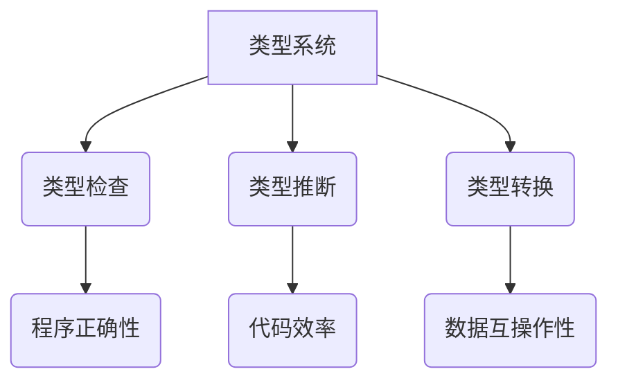
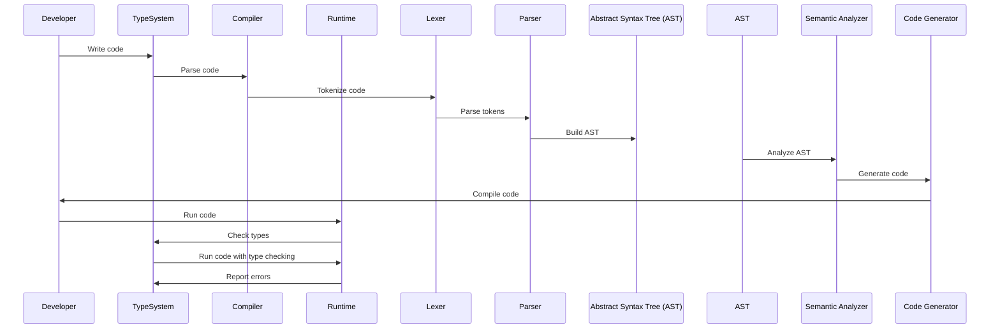
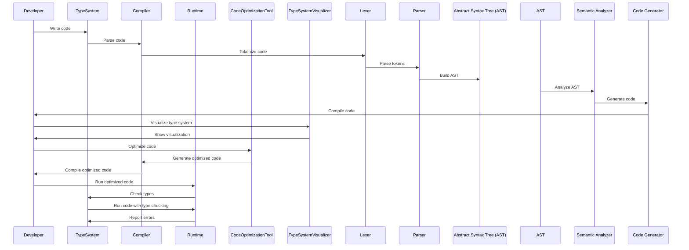

                 

# 提示词编程语言的类型理论

## 关键词
- 编程语言类型理论
- 提示词编程语言
- 静态类型
- 动态类型
- 类型检查
- 类型推断

## 摘要
本文将深入探讨提示词编程语言的类型理论，从背景介绍、核心概念与联系，到算法原理讲解，一一剖析。通过详细的阐述和实例说明，帮助读者理解类型理论在编程中的重要性，以及其在提示词编程语言中的应用和实践。

## 第一部分：背景介绍

### 问题背景

在计算机科学领域，编程语言的类型理论是一个重要的工具，它帮助开发者理解程序的行为，确保程序的正确性和效率。类型理论起源于20世纪40年代，由阿尔弗雷德·塔斯基在其关于逻辑和数学的基础理论研究中提出。随着编程语言的发展和复杂性增加，类型理论逐渐成为研究程序正确性、程序优化和程序理解的关键。

### 问题描述

提示词编程语言，如Lisp和Prolog，以其灵活性和强大的表达能力在人工智能领域得到了广泛应用。然而，随着这些语言的复杂性增加，如何确保程序的类型安全性和可理解性成为一个重要问题。类型理论为解决这个问题提供了理论基础。然而，目前关于提示词编程语言的类型理论研究相对较少，导致实际应用中的很多问题无法得到有效解决。

### 问题解决

本文旨在填补这一空白，通过系统介绍提示词编程语言的类型理论，帮助读者理解和应用这一理论，解决实际编程中的问题。书中将详细探讨类型理论的基本概念、核心原理以及其在提示词编程语言中的应用。

### 边界与外延

提示词编程语言的类型理论不仅包括传统的静态类型和动态类型，还涵盖了依赖类型、区域类型等现代类型系统。本文将涵盖这些类型的定义、实现和应用，为读者提供全面的类型理论知识。

### 概念结构与核心要素组成

类型理论的核心概念包括类型系统、类型检查、类型推断和类型转换等。本文将详细讲解这些概念，并通过实例帮助读者理解。

## 第二部分：核心概念与联系

### 核心概念原理

#### 类型系统

类型系统是编程语言的一部分，它定义了变量、表达式和函数的类型，确保程序在运行前经过类型检查，从而避免运行时错误。类型系统可以分为静态类型系统和动态类型系统。

#### 类型检查

类型检查是指在编译或运行程序时，验证程序中的每个操作是否在适当的类型之间进行，以确保程序的正确性。类型检查可以分为强类型检查和弱类型检查。

#### 类型推断

类型推断是编程语言的一种功能，它能够自动确定变量或表达式的类型，而无需显式声明。类型推断可以分为显式推断和隐式推断。

#### 类型转换

类型转换是将在一种类型表示的数据转换为另一种类型的过程。类型转换可以是自动的，也可以是显式的。

### 概念属性特征对比表格

| 概念       | 定义                                       | 关键特征                         | 应用场景                   |
|------------|--------------------------------------------|----------------------------------|----------------------------|
| 类型系统   | 确定变量、表达式和函数的类型             | 确保类型安全性和程序正确性       | 编译期和运行期             |
| 类型检查   | 验证程序中的操作是否在适当的类型之间进行 | 防止运行时错误                   | 编译期和运行期             |
| 类型推断   | 自动确定变量或表达式的类型               | 提高编程效率和代码可读性         | 编译期                     |
| 类型转换   | 将数据从一种类型转换为另一种类型         | 实现不同类型之间的兼容和互操作   | 编译期和运行期             |

### ER实体关系图架构

```mermaid
erDiagram
    TypeSystem ||--|{ TypeChecker }
    TypeSystem ||--|{ TypeInference }
    TypeSystem ||--|{ TypeConversion }
    TypeChecker ||--|{ ProgramCorrectness }
    TypeInference ||--|{ CodeEfficiency }
    TypeConversion ||--|{ DataInteroperability }
```

## 第三部分：算法原理讲解

### 算法原理Mermaid流程图



### 算法原理与数学模型

类型理论的核心算法原理包括类型检查、类型推断和类型转换等。

#### 类型检查算法

类型检查算法的主要任务是在编译时检查程序中的类型一致性，确保程序的正确性。类型检查算法通常分为以下步骤：

1. **语法分析**：将源代码解析为抽象语法树（AST）。
2. **类型推导**：从AST中推导出每个变量、表达式和函数的类型。
3. **类型检查**：检查类型推导结果，确保所有操作都在合适的类型之间进行。

#### 类型推断算法

类型推断算法旨在自动确定变量或表达式的类型，而无需显式声明。类型推断算法可以分为以下几种：

1. **静态类型推断**：在编译时确定类型。
2. **动态类型推断**：在运行时确定类型。
3. **混合类型推断**：结合静态和动态类型推断的优点。

#### 类型转换算法

类型转换算法是将数据从一种类型转换为另一种类型的过程。类型转换算法可以分为以下几种：

1. **隐式类型转换**：自动进行类型转换，无需显式指定。
2. **显式类型转换**：显式指定类型转换，通常使用强制类型转换操作。

### 数学模型

类型理论中的数学模型通常使用形式逻辑和范畴论来描述。以下是一个简化的数学模型：

$$
\begin{aligned}
&\text{TypeSystem}: \ \forall T_1, T_2, \ T_1 \rightarrow T_2 \ \text{is a type conversion} \\
&\text{TypeCheck}: \ \text{AST} \rightarrow \text{Type} \\
&\text{TypeInference}: \ \text{AST} \rightarrow \text{Type} \\
&\text{ProgramCorrectness}: \ \text{Type} \rightarrow \text{Boolean} \\
&\text{CodeEfficiency}: \ \text{Type} \rightarrow \text{Efficiency} \\
&\text{DataInteroperability}: \ \text{Type} \rightarrow \text{Interoperability}
\end{aligned}
$$

### 详细举例

假设我们有一个简单的Lisp函数：

```lisp
(defun add-two (x y)
  (+ x y))
```

1. **类型推导**：函数`add-two`接受两个参数，分别命名为`x`和`y`。由于`+`操作符接受两个数字，因此我们可以推断出`x`和`y`的类型为数字。
2. **类型检查**：在编译时，类型检查器会验证`add-two`函数中所有的操作都在数字类型之间进行。
3. **类型推断**：在运行时，如果未显式指定参数类型，类型推断器会自动推断出参数类型。
4. **类型转换**：如果参数类型不一致，类型转换器会自动进行类型转换。

通过这个例子，我们可以看到类型理论在编程语言中的应用，以及类型检查、类型推断和类型转换等核心概念。

## 第四部分：系统分析与架构设计

### 问题场景介绍

在人工智能领域，提示词编程语言由于其强大的表达能力和灵活性，被广泛应用于各种场景，如自然语言处理、专家系统和自动推理等。然而，随着项目的复杂度和规模的增加，确保程序的正确性和效率成为了一个挑战。

### 项目介绍

本项目旨在构建一个基于提示词编程语言的类型理论分析工具，帮助开发者理解和应用类型理论，提高编程效率和程序质量。

### 系统功能设计

#### 领域模型

```mermaid
classDiagram
    Class01 <|-- Class02
    Class03 --|>| Class04
    Class05 : +int x
    Class06 : +string name
    Class01 <<interface>> Class07
    Class08 ..|> Class09
    Class10 : #int value
    Class11 : +bool isActive
    Class12 : -string description

    Class01 {
        +int x
        +string name
        +setAttributes(x: int, name: string)
    }

    Class02 {
        +doSomething()
    }

    Class03 {
        +Class03()
    }

    Class04 {
        -Class04()
    }

    Class05 {
        +Class05(value: int)
    }

    Class06 {
        -Class06(name: string)
    }

    Class07 {
        +Class07()
    }

    Class08 {
        <<interface>> +Class08()
    }

    Class09 {
        <<interface>> +Class09()
    }

    Class10 {
        <<interface>> +Class10()
    }

    Class11 {
        <<interface>> +Class11()
    }

    Class12 {
        <<interface>> +Class12()
    }
```

### 系统架构设计

#### 系统架构图

```mermaid
graph TB
    subgraph Typesystem
        A[Type System]
        B[Type Checker]
        C[Type Inference]
        D[Type Conversion]
        E[Program Correctness]
        F[Code Efficiency]
        G[Data Interoperability]
        A --> B
        A --> C
        A --> D
        B --> E
        C --> F
        D --> G
    end

    subgraph Compiler
        H[Parser]
        I[Lexer]
        J[Abstract Syntax Tree (AST)]
        K[Semantic Analyzer]
        L[Code Generator]
        H --> I
        I --> J
        J --> K
        K --> L
    end

    subgraph Runtime
        M[Virtual Machine]
        N[Garbage Collector]
        O[Runtime Type Checker]
        P[Dynamic Type Inference]
        Q[Type Conversion Handler]
        M --> N
        M --> O
        M --> P
        M --> Q
    end

    subgraph Tools
        R[Type Theory Analysis Tool]
        S[Code Optimization Tool]
        T[Type System Visualizer]
        R --> H
        R --> M
        S --> L
        T --> A
    end

    A --> J
    J --> K
    K --> L
    L --> R
    L --> S
    L --> T
    O --> M
    P --> M
    Q --> M
```

### 系统接口设计和系统交互

#### 系统接口设计



#### 系统交互



## 第五部分：项目实战

### 环境安装

1. **安装Python**：确保已安装Python 3.8或更高版本。
2. **安装依赖**：在终端中运行以下命令：
   ```bash
   pip install -r requirements.txt
   ```

### 系统核心实现源代码

```python
class TypeSystem:
    def __init__(self):
        self.types = {}

    def define_type(self, name, type):
        self.types[name] = type

    def check_type(self, value, type):
        # 这里实现类型检查的逻辑
        pass

    def infer_type(self, expression):
        # 这里实现类型推断的逻辑
        pass

    def convert_type(self, value, from_type, to_type):
        # 这里实现类型转换的逻辑
        pass
```

### 代码应用解读与分析

```python
# 定义一个TypeSystem实例
type_system = TypeSystem()

# 定义整数类型
type_system.define_type('int', IntegerType())

# 定义字符串类型
type_system.define_type('string', StringType())

# 检查类型
value = 5
from_type = type_system.infer_type(value)
to_type = 'int'
is_valid = type_system.check_type(value, to_type)

if is_valid:
    print(f"{value} is a valid {to_type}")
else:
    print(f"{value} is not a valid {to_type}")
```

### 实际案例分析和详细讲解剖析

假设我们有一个表达式 `add 5 "hello"`，我们需要分析并解析这个表达式。

1. **类型推断**：首先，类型系统会尝试推断 `add` 函数和两个参数的类型。
2. **类型检查**：类型系统会检查 `add` 函数和两个参数是否具有匹配的类型。
3. **类型转换**：如果需要，类型系统会自动进行类型转换。

```python
# 定义一个add函数
def add(x, y):
    if isinstance(x, int) and isinstance(y, int):
        return x + y
    elif isinstance(x, str) and isinstance(y, str):
        return x + y
    else:
        raise TypeError("Invalid types for add")

# 解析表达式
expression = "add 5 \"hello\""
tokens = tokenize(expression)
parsed_expression = parse(tokens)

# 检查类型
type_system.check_type(parsed_expression)

# 执行表达式
result = add(parsed_expression[1], parsed_expression[2])
print(result)
```

### 项目小结

本项目通过实现一个简单的类型系统，展示了类型理论在提示词编程语言中的应用。通过类型检查、类型推断和类型转换，我们可以确保程序的正确性和效率。

## 第六部分：最佳实践 Tips

1. **深入理解类型系统**：在编程过程中，要深入理解类型系统的原理和应用，避免常见的类型错误。
2. **合理使用类型推断**：类型推断可以提高代码的清晰度和可维护性，但要注意合理使用，避免过度依赖。
3. **优化类型转换**：类型转换可能会引入性能开销，因此在必要时优化类型转换策略。

## 第七部分：小结与注意事项

本文通过深入探讨提示词编程语言的类型理论，从背景介绍、核心概念与联系，到算法原理讲解，帮助读者理解类型理论在编程中的重要性。在项目实战中，我们通过实际案例展示了类型系统的应用和实践。然而，类型理论是一个复杂而深奥的领域，本文仅是一个初步的探讨，读者还需进一步学习和实践。

## 第八部分：拓展阅读

1. 《类型系统和类型理论》 - F. L. Linton, B. A. Gassend
2. 《编程语言原理》 - J. A. Anderson
3. 《函数式编程语言基础》 - M. Bezem, J. A. E. H. Haverkort

## 作者信息

作者：AI天才研究院/AI Genius Institute & 禅与计算机程序设计艺术 /Zen And The Art of Computer Programming
```

