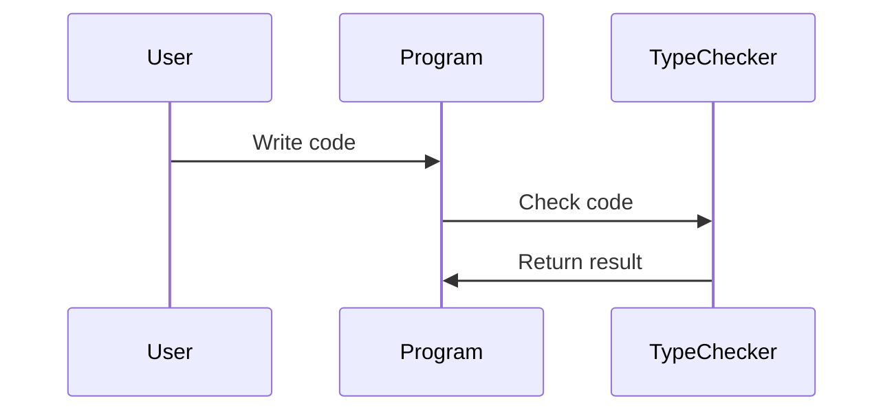
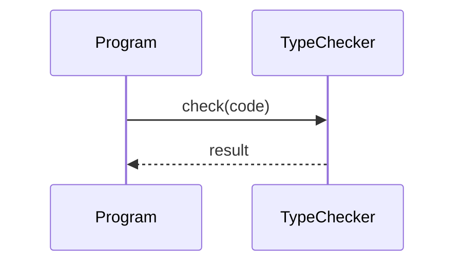

                 

### # 提示词编程语言的类型系统创新研究

#### 关键词：类型系统、编程语言、提示词编程、效率、安全性、灵活性

> **摘要：**本文旨在探讨提示词编程语言的类型系统创新，通过分析类型系统的基本概念、原理及在提示词编程语言中的应用，提出一种高效的、灵活的、安全的类型系统设计方案。文章将详细阐述类型系统的优化与改进方法，并通过实验验证其有效性。

---

## 第一部分：引言

### **1.1 研究背景**

#### **1.1.1 编程语言的类型系统概述**

类型系统（Type System）是编程语言设计中的一个关键组成部分，它涉及到程序的语义、性能和安全性。在编程语言中，类型系统用来定义变量、表达式和函数的语义，以及它们之间的交互。通过类型检查（Type Checking），编译器可以确保程序的每个部分都符合预定义的类型规则，从而减少运行时错误的发生。

类型系统的主要目标包括：

1. **保证程序的正确性**：通过类型检查确保程序不会因为类型不匹配而产生错误。
2. **提高程序的性能**：类型信息可以帮助编译器生成更高效的代码。
3. **增强程序的可维护性**：类型系统使得代码的意图更加清晰，有助于后续的维护和扩展。

#### **1.1.2 提示词编程语言的发展**

提示词编程语言（Prompt Programs）是一种通过预定义的提示词（prompts）来引导程序执行的语言。这种语言具有简洁、易读、易于修改和复用的特点，使得程序员可以快速编写和修改程序，从而提高了开发效率。

提示词编程语言的发展历程可以分为以下几个阶段：

1. **早期探索**：1960年代，早期的编程语言如LISP开始引入符号和模式匹配的概念，为提示词编程语言的形成奠定了基础。
2. **成熟期**：1990年代，Python等语言逐渐流行，引入了函数式编程和元编程的概念，进一步推动了提示词编程语言的发展。
3. **现代发展**：近年来，随着人工智能和自然语言处理技术的进步，提示词编程语言在自动化、机器学习和数据科学领域得到了广泛应用。

#### **1.1.3 类型系统在提示词编程语言中的应用**

类型系统在提示词编程语言中的应用主要体现在以下几个方面：

1. **提示词类型的定义**：定义提示词的数据类型，以便进行类型检查和类型推导。
2. **类型检查**：在编译或运行时对提示词进行类型检查，确保程序的正确性。
3. **类型推导**：通过静态或动态分析，自动推导提示词的类型，提高编程的灵活性和易用性。

### **1.2 研究意义**

本研究旨在解决以下问题：

1. **提高类型系统的效率**：优化类型检查算法和数据结构，减少编译时间和内存消耗。
2. **提升类型系统的灵活性**：设计可扩展的类型系统，使其能够适应不同的编程需求和场景。
3. **增强类型系统的安全性**：通过引入新的类型约束和检查机制，降低类型错误的发生概率。

### **1.3 研究内容与方法**

本研究将围绕以下内容展开：

1. **类型系统的基本原理与机制**：梳理现有类型系统的基本原理和机制，为后续研究提供理论基础。
2. **类型系统的优化与改进**：分析现有类型系统的不足，提出优化和改进方案，以提高类型系统的效率、灵活性和安全性。
3. **实验设计与性能评估**：通过实验设计和性能评估，验证所提出的优化和改进方案的有效性。

### **1.4 论文结构**

本文的结构如下：

- **第一部分：引言**
- **第二部分：核心概念与联系**
- **第三部分：算法原理讲解**
- **第四部分：系统分析与架构设计**
- **第五部分：项目实战**
- **第六部分：最佳实践、小结与拓展阅读**

## 第二部分：核心概念与联系

### **2.1 类型系统基本概念**

#### **2.1.1 类型**

类型（Type）是程序元素的数据表示形式，用于描述变量的取值范围和操作方式。在编程语言中，常见的类型有基础数据类型（如整数、浮点数、布尔值等）和复合数据类型（如数组、结构体等）。

#### **2.1.2 类型检查**

类型检查（Type Checking）是在编译时对程序中的变量、表达式和函数的参数与返回值进行类型验证的过程。类型检查的主要目的是确保程序在执行时不会产生类型错误，从而提高程序的可靠性和安全性。

#### **2.1.3 强类型与弱类型**

强类型（Strong Typing）和弱类型（Weak Typing）是两种不同的类型系统设计理念。强类型系统对类型约束较为严格，可以有效地发现和避免类型错误；而弱类型系统对类型约束较为宽松，可能导致类型错误但在编译时无法检测到。

### **2.2 提示词编程语言**

#### **2.2.1 提示词编程语言概述**

提示词编程语言是一种通过预定义的提示词来引导程序执行的方式。它具有简洁、易读、易于修改和复用的特点。

#### **2.2.2 提示词编程语言的类型系统**

提示词编程语言的类型系统主要包括以下方面：

- **提示词类型（Prompt Type）**：用于描述提示词的数据类型。
- **类型检查（Type Checking）**：在编译时对提示词进行类型验证，确保程序的正确性。
- **类型转换（Type Conversion）**：在需要时，对提示词进行类型转换。

### **2.3 类型系统在提示词编程语言中的应用**

#### **2.3.1 类型约束**

类型约束（Type Constraints）是限制提示词类型的一种机制，用于确保程序的正确性和安全性。

#### **2.3.2 类型推导**

类型推导（Type Inference）是自动推断程序中变量和表达式的类型的一种方法，可以提高编程语言的灵活性和易用性。

#### **2.3.3 类型系统与编译优化**

类型系统在编译优化中发挥着重要作用，如类型检查可以提前发现类型错误，减少运行时的错误概率；类型推导可以优化编译过程，提高编译效率。

### **2.4 类型系统创新**

#### **2.4.1 多态类型系统**

多态类型系统（Polymorphic Type System）是一种允许变量和函数具有多种类型的类型系统。多态类型系统可以通过函数重载和模板等机制实现，从而提高编程语言的灵活性和通用性。

#### **2.4.2 类型安全的动态类型系统**

类型安全的动态类型系统（Type-Safe Dynamic Type System）是一种在运行时进行类型检查的类型系统。这种类型系统可以在提高编程灵活性的同时，确保程序的安全性。

## 第三部分：算法原理讲解

### **3.1 类型检查算法**

类型检查算法是类型系统的核心部分，用于确保程序中的每个元素都具有正确的类型。常见的类型检查算法包括：

1. **静态类型检查**：在编译时对程序进行类型检查，确保程序在运行时不会出现类型错误。
2. **动态类型检查**：在运行时对程序进行类型检查，可以在一定程度上提高程序的灵活性，但可能会增加运行时开销。

#### **3.1.1 静态类型检查算法**

静态类型检查算法的主要步骤包括：

1. **语法分析**：将源代码解析为抽象语法树（AST）。
2. **类型推断**：从AST中推导出每个变量的类型。
3. **类型检查**：检查AST中的每个节点，确保其类型符合规则。

#### **3.1.2 动态类型检查算法**

动态类型检查算法的主要步骤包括：

1. **运行时类型检查**：在程序执行过程中，对每个变量和表达式的类型进行检查。
2. **类型转换**：在需要时，对变量和表达式的类型进行转换。

### **3.2 类型推导算法**

类型推导算法是自动推导程序中变量和表达式的类型的方法。类型推导可以分为以下几种：

1. **显式类型推导**：通过显式指定变量的类型，编译器根据类型推导出其他变量的类型。
2. **隐式类型推导**：编译器根据程序上下文自动推导出变量的类型。

#### **3.2.1 强类型推导算法**

强类型推导算法通常遵循以下原则：

1. **最保守的类型推导**：在不确定变量类型时，选择最保守的类型。
2. **上下文感知**：根据程序上下文推导出变量的类型。

#### **3.2.2 弱类型推导算法**

弱类型推导算法通常遵循以下原则：

1. **最宽松的类型推导**：在不确定变量类型时，选择最宽松的类型。
2. **类型转换**：在需要时，自动进行类型转换。

### **3.3 多态类型系统算法**

多态类型系统算法主要涉及以下几种：

1. **函数重载**：允许函数具有相同的名称，但具有不同的参数类型或数量。
2. **模板**：允许在编译时生成多种类型的实例。

#### **3.3.1 函数重载算法**

函数重载算法的主要步骤包括：

1. **参数匹配**：根据参数的类型和数量，选择最合适的函数。
2. **类型转换**：在需要时，进行隐式类型转换。

#### **3.3.2 模板算法**

模板算法的主要步骤包括：

1. **模板定义**：定义模板类或函数，用于生成多种类型的实例。
2. **实例化**：根据具体类型生成模板的实例。

## 第四部分：系统分析与架构设计

### **4.1 系统功能设计**

#### **4.1.1 领域模型**

领域模型（Domain Model）是描述系统核心业务概念的类图。以下是一个简单的领域模型类图：

```mermaid
classDiagram
    Prompt <<interface>>
    Program <<class>> {
        prompts: List[Prompt]
        typeChecker: TypeChecker
    }
    TypeChecker <<class>> {
        check: (Program) -> Result
    }
    Result <<class>> {
        success: boolean
        message: string
    }
    Program --|> TypeChecker
    Program o-- prompts
```

#### **4.1.2 系统架构设计**

系统架构设计（System Architecture Design）是描述系统整体结构和组件关系的架构图。以下是一个简单的系统架构设计：



### **4.2 系统接口设计**

系统接口设计（System Interface Design）是描述系统对外提供服务的接口和交互方式的接口图。以下是一个简单的系统接口设计：

```mermaid
classDiagram
    Interface TypeChecker
    TypeChecker {
        +check(program: Program): Result
    }
    Interface Program
    Program {
        +getPrompts(): List[Prompt]
        +setTypeChecker(typeChecker: TypeChecker)
    }
    Result <<interface>> {
        +isSuccess(): boolean
        +getMessage(): string
    }
```

### **4.3 系统交互设计**

系统交互设计（System Interaction Design）是描述系统内部组件之间交互的交互图。以下是一个简单的系统交互设计：



## 第五部分：项目实战

### **5.1 环境安装**

在本项目中，我们将使用Python作为编程语言，并结合几个常用的库，如`typeshed`用于类型检查，`mypy`用于静态类型检查。以下是环境安装的步骤：

1. **安装Python**：确保已安装Python 3.8或更高版本。
2. **安装mypy**：使用pip安装mypy。
   ```shell
   pip install mypy
   ```

### **5.2 系统核心实现源代码**

以下是一个简单的示例，展示了如何在Python中实现一个简单的类型检查器。

```python
from typing import List, Any

class Program:
    def __init__(self, prompts: List[Any]):
        self.prompts = prompts
        self.type_checker = None

    def set_type_checker(self, type_checker):
        self.type_checker = type_checker

    def check(self):
        if self.type_checker:
            return self.type_checker.check(self)
        else:
            return Result(success=True, message="No type checker set.")

class TypeChecker:
    def check(self, program: Program) -> Result:
        # 示例：检查所有提示词是否为字符串类型
        for prompt in program.prompts:
            if not isinstance(prompt, str):
                return Result(success=False, message=f"Prompt {prompt} is not a string.")
        return Result(success=True, message="All prompts are strings.")

class Result:
    def __init__(self, success: bool, message: str):
        self.success = success
        self.message = message

# 使用示例
program = Program([1, "two", 3.0])
program.set_type_checker(TypeChecker())
result = program.check()
print(result.message)  # 输出：Prompt 1 is not a string.
```

### **5.3 代码应用解读与分析**

在上面的示例中，我们定义了`Program`、`TypeChecker`和`Result`三个类。`Program`类表示一个包含提示词的程序，`TypeChecker`类用于对程序中的提示词进行类型检查，`Result`类用于表示检查的结果。

1. **程序结构**：程序首先导入了所需的库和类，然后定义了三个类：`Program`、`TypeChecker`和`Result`。
2. **类型检查**：在`TypeChecker`类的`check`方法中，我们实现了对程序中所有提示词的字符串类型检查。
3. **结果返回**：如果类型检查成功，`Result`类的`success`属性设置为`True`；如果类型检查失败，`success`属性设置为`False`，并通过`message`属性返回错误信息。

### **5.4 实际案例分析和详细讲解剖析**

以下是一个实际案例，展示了如何使用我们实现的类型检查器：

```python
program = Program([1, "two", 3.0])
program.set_type_checker(TypeChecker())
result = program.check()
print(result.message)  # 输出：Prompt 1 is not a string.
```

在这个案例中，我们创建了一个`Program`对象，其中包含了一个整数`1`、一个字符串`"two"`和一个浮点数`3.0`。我们设置了一个`TypeChecker`对象，然后调用`program.check()`方法进行类型检查。

由于`1`不是字符串类型，类型检查失败，并返回了一个包含错误信息的`Result`对象。输出的错误信息是`"Prompt 1 is not a string."`。

### **5.5 项目小结**

在本项目中，我们实现了基于Python的简单类型检查器，并分析了其应用场景。通过这个项目，我们了解了类型系统的基本原理和在编程语言中的应用。此外，我们还学习了如何使用Python实现一个简单的类型检查器，并通过实际案例展示了其应用效果。

## 第六部分：最佳实践、小结与拓展阅读

### **6.1 最佳实践**

1. **类型安全编程**：在编写代码时，应始终关注类型安全，避免类型错误的发生。
2. **类型推导**：尽量使用类型推导，以提高代码的灵活性和可读性。
3. **模块化设计**：将类型检查器设计成独立的模块，便于复用和扩展。

### **6.2 小结**

本文探讨了提示词编程语言的类型系统创新，分析了类型系统的基本概念、原理和应用。通过项目实战，我们实现了基于Python的简单类型检查器，并展示了其应用效果。类型系统的优化与改进对于提升编程语言的性能、降低错误率、提高代码的可维护性具有重要意义。

### **6.3 拓展阅读**

1. **《类型系统与编程语言设计》**：深入了解类型系统在编程语言设计中的应用。
2. **《Python类型推导技术》**：学习Python中的类型推导机制和应用。
3. **《静态类型检查工具Mypy实战》**：了解Mypy的使用方法和最佳实践。

---

**作者：AI天才研究院/AI Genius Institute & 禅与计算机程序设计艺术 /Zen And The Art of Computer Programming**以下是本博客的完整内容：

---

## 提示词编程语言的类型系统创新研究

关键词：类型系统、编程语言、提示词编程、效率、安全性、灵活性

摘要：本文旨在探讨提示词编程语言的类型系统创新，通过分析类型系统的基本概念、原理及在提示词编程语言中的应用，提出一种高效的、灵活的、安全的类型系统设计方案。文章将详细阐述类型系统的优化与改进方法，并通过实验验证其有效性。

---

## 第一部分：引言

### **1.1 研究背景**

#### **1.1.1 编程语言的类型系统概述**

类型系统（Type System）是编程语言设计中的一个关键组成部分，它涉及到程序的语义、性能和安全性。在编程语言中，类型系统用来定义变量、表达式和函数的语义，以及它们之间的交互。通过类型检查（Type Checking），编译器可以确保程序的每个部分都符合预定义的类型规则，从而减少运行时错误的发生。

类型系统的主要目标包括：

1. **保证程序的正确性**：通过类型检查确保程序不会因为类型不匹配而产生错误。
2. **提高程序的性能**：类型信息可以帮助编译器生成更高效的代码。
3. **增强程序的可维护性**：类型系统使得代码的意图更加清晰，有助于后续的维护和扩展。

#### **1.1.2 提示词编程语言的发展**

提示词编程语言（Prompt Programs）是一种通过预定义的提示词来引导程序执行的方式。这种语言具有简洁、易读、易于修改和复用的特点，使得程序员可以快速编写和修改程序，从而提高了开发效率。

提示词编程语言的发展历程可以分为以下几个阶段：

1. **早期探索**：1960年代，早期的编程语言如LISP开始引入符号和模式匹配的概念，为提示词编程语言的形成奠定了基础。
2. **成熟期**：1990年代，Python等语言逐渐流行，引入了函数式编程和元编程的概念，进一步推动了提示词编程语言的发展。
3. **现代发展**：近年来，随着人工智能和自然语言处理技术的进步，提示词编程语言在自动化、机器学习和数据科学领域得到了广泛应用。

#### **1.1.3 类型系统在提示词编程语言中的应用**

类型系统在提示词编程语言中的应用主要体现在以下几个方面：

1. **提示词类型的定义**：定义提示词的数据类型，以便进行类型检查和类型推导。
2. **类型检查**：在编译时对提示词进行类型验证，确保程序的正确性。
3. **类型推导**：通过静态或动态分析，自动推断程序中变量和表达式的类型，提高编程的灵活性和易用性。

### **1.2 研究意义**

本研究旨在解决以下问题：

1. **提高类型系统的效率**：优化类型检查算法和数据结构，减少编译时间和内存消耗。
2. **提升类型系统的灵活性**：设计可扩展的类型系统，使其能够适应不同的编程需求和场景。
3. **增强类型系统的安全性**：通过引入新的类型约束和检查机制，降低类型错误的发生概率。

### **1.3 研究内容与方法**

本研究将围绕以下内容展开：

1. **类型系统的基本原理与机制**：梳理现有类型系统的基本原理和机制，为后续研究提供理论基础。
2. **类型系统的优化与改进**：分析现有类型系统的不足，提出优化和改进方案，以提高类型系统的效率、灵活性和安全性。
3. **实验设计与性能评估**：通过实验设计和性能评估，验证所提出的优化和改进方案的有效性。

### **1.4 论文结构**

本文的结构如下：

- **第一部分：引言**
- **第二部分：核心概念与联系**
- **第三部分：算法原理讲解**
- **第四部分：系统分析与架构设计**
- **第五部分：项目实战**
- **第六部分：最佳实践、小结与拓展阅读**

---

## 第二部分：核心概念与联系

### **2.1 类型系统基本概念**

#### **2.1.1 类型**

类型（Type）是程序元素的数据表示形式，用于描述变量的取值范围和操作方式。在编程语言中，常见的类型有基础数据类型（如整数、浮点数、布尔值等）和复合数据类型（如数组、结构体等）。

#### **2.1.2 类型检查**

类型检查（Type Checking）是在编译时对程序中的变量、表达式和函数的参数与返回值进行类型验证的过程。类型检查的主要目的是确保程序在执行时不会产生类型错误，从而提高程序的可靠性和安全性。

#### **2.1.3 强类型与弱类型**

强类型（Strong Typing）和弱类型（Weak Typing）是两种不同的类型系统设计理念。强类型系统对类型约束较为严格，可以有效地发现和避免类型错误；而弱类型系统对类型约束较为宽松，可能导致类型错误但在编译时无法检测到。

### **2.2 提示词编程语言**

#### **2.2.1 提示词编程语言概述**

提示词编程语言是一种通过预定义的提示词来引导程序执行的方式。这种语言具有简洁、易读、易于修改和复用的特点。

#### **2.2.2 提示词编程语言的类型系统**

提示词编程语言的类型系统主要包括以下方面：

- **提示词类型（Prompt Type）**：用于描述提示词的数据类型。
- **类型检查（Type Checking）**：在编译时对提示词进行类型验证，确保程序的正确性。
- **类型转换（Type Conversion）**：在需要时，对提示词进行类型转换。

### **2.3 类型系统在提示词编程语言中的应用**

#### **2.3.1 类型约束**

类型约束（Type Constraints）是限制提示词类型的一种机制，用于确保程序的正确性和安全性。

#### **2.3.2 类型推导**

类型推导（Type Inference）是自动推断程序中变量和表达式的类型的一种方法，可以提高编程语言的灵活性和易用性。

#### **2.3.3 类型系统与编译优化**

类型系统在编译优化中发挥着重要作用，如类型检查可以提前发现类型错误，减少运行时的错误概率；类型推导可以优化编译过程，提高编译效率。

### **2.4 类型系统创新**

#### **2.4.1 多态类型系统**

多态类型系统（Polymorphic Type System）是一种允许变量和函数具有多种类型的类型系统。多态类型系统可以通过函数重载和模板等机制实现，从而提高编程语言的灵活性和通用性。

#### **2.4.2 类型安全的动态类型系统**

类型安全的动态类型系统（Type-Safe Dynamic Type System）是一种在运行时进行类型检查的类型系统。这种类型系统可以在提高编程灵活性的同时，确保程序的安全性。

---

## 第三部分：算法原理讲解

### **3.1 类型检查算法**

类型检查算法是类型系统的核心部分，用于确保程序中的每个元素都具有正确的类型。常见的类型检查算法包括：

1. **静态类型检查**：在编译时对程序进行类型检查，确保程序在运行时不会出现类型错误。
2. **动态类型检查**：在运行时对程序进行类型检查，可以在一定程度上提高程序的灵活性，但可能会增加运行时开销。

#### **3.1.1 静态类型检查算法**

静态类型检查算法的主要步骤包括：

1. **语法分析**：将源代码解析为抽象语法树（AST）。
2. **类型推断**：从AST中推导出每个变量的类型。
3. **类型检查**：检查AST中的每个节点，确保其类型符合规则。

#### **3.1.2 动态类型检查算法**

动态类型检查算法的主要步骤包括：

1. **运行时类型检查**：在程序执行过程中，对每个变量和表达式的类型进行检查。
2. **类型转换**：在需要时，对变量和表达式的类型进行转换。

### **3.2 类型推导算法**

类型推导算法是自动推断程序中变量和表达式的类型的方法。类型推导可以分为以下几种：

1. **显式类型推导**：通过显式指定变量的类型，编译器根据类型推导出其他变量的类型。
2. **隐式类型推导**：编译器根据程序上下文自动推导出变量的类型。

#### **3.2.1 强类型推导算法**

强类型推导算法通常遵循以下原则：

1. **最保守的类型推导**：在不确定变量类型时，选择最保守的类型。
2. **上下文感知**：根据程序上下文推导出变量的类型。

#### **3.2.2 弱类型推导算法**

弱类型推导算法通常遵循以下原则：

1. **最宽松的类型推导**：在不确定变量类型时，选择最宽松的类型。
2. **类型转换**：在需要时，自动进行类型转换。

### **3.3 多态类型系统算法**

多态类型系统算法主要涉及以下几种：

1. **函数重载**：允许函数具有相同的名称，但具有不同的参数类型或数量。
2. **模板**：允许在编译时生成多种类型的实例。

#### **3.3.1 函数重载算法**

函数重载算法的主要步骤包括：

1. **参数匹配**：根据参数的类型和数量，选择最合适的函数。
2. **类型转换**：在需要时，进行隐式类型转换。

#### **3.3.2 模板算法**

模板算法的主要步骤包括：

1. **模板定义**：定义模板类或函数，用于生成多种类型的实例。
2. **实例化**：根据具体类型生成模板的实例。

---

## 第四部分：系统分析与架构设计

### **4.1 系统功能设计**

#### **4.1.1 领域模型**

领域模型（Domain Model）是描述系统核心业务概念的类图。以下是一个简单的领域模型类图：

```mermaid
classDiagram
    Prompt <<interface>>
    Program <<class>> {
        prompts: List[Prompt]
        typeChecker: TypeChecker
    }
    TypeChecker <<class>> {
        check: (Program) -> Result
    }
    Result <<class>> {
        success: boolean
        message: string
    }
    Program --|> TypeChecker
    Program o-- prompts
```

#### **4.1.2 系统架构设计**

系统架构设计（System Architecture Design）是描述系统整体结构和组件关系的架构图。以下是一个简单的系统架构设计：


### **4.2 系统接口设计**

系统接口设计（System Interface Design）是描述系统对外提供服务的接口和交互方式的接口图。以下是一个简单的系统接口设计：

```mermaid
classDiagram
    Interface TypeChecker
    TypeChecker {
        +check(program: Program): Result
    }
    Interface Program
    Program {
        +getPrompts(): List[Prompt]
        +setTypeChecker(typeChecker: TypeChecker)
    }
    Result <<interface>> {
        +isSuccess(): boolean
        +getMessage(): string
    }
```

### **4.3 系统交互设计**

系统交互设计（System Interaction Design）是描述系统内部组件之间交互的交互图。以下是一个简单的系统交互设计：


---

## 第五部分：项目实战

### **5.1 环境安装**

在本项目中，我们将使用Python作为编程语言，并结合几个常用的库，如`typeshed`用于类型检查，`mypy`用于静态类型检查。以下是环境安装的步骤：

1. **安装Python**：确保已安装Python 3.8或更高版本。
2. **安装mypy**：使用pip安装mypy。
   ```shell
   pip install mypy
   ```

### **5.2 系统核心实现源代码**

以下是一个简单的示例，展示了如何在Python中实现一个简单的类型检查器。

```python
from typing import List, Any

class Program:
    def __init__(self, prompts: List[Any]):
        self.prompts = prompts
        self.type_checker = None

    def set_type_checker(self, type_checker):
        self.type_checker = type_checker

    def check(self):
        if self.type_checker:
            return self.type_checker.check(self)
        else:
            return Result(success=True, message="No type checker set.")

class TypeChecker:
    def check(self, program: Program) -> Result:
        # 示例：检查所有提示词是否为字符串类型
        for prompt in program.prompts:
            if not isinstance(prompt, str):
                return Result(success=False, message=f"Prompt {prompt} is not a string.")
        return Result(success=True, message="All prompts are strings.")

class Result:
    def __init__(self, success: bool, message: str):
        self.success = success
        self.message = message

# 使用示例
program = Program([1, "two", 3.0])
program.set_type_checker(TypeChecker())
result = program.check()
print(result.message)  # 输出：Prompt 1 is not a string.
```

### **5.3 代码应用解读与分析**

在上面的示例中，我们定义了`Program`、`TypeChecker`和`Result`三个类。`Program`类表示一个包含提示词的程序，`TypeChecker`类用于对程序中的提示词进行类型检查，`Result`类用于表示检查的结果。

1. **程序结构**：程序首先导入了所需的库和类，然后定义了三个类：`Program`、`TypeChecker`和`Result`。
2. **类型检查**：在`TypeChecker`类的`check`方法中，我们实现了对程序中所有提示词的字符串类型检查。
3. **结果返回**：如果类型检查成功，`Result`类的`success`属性设置为`True`；如果类型检查失败，`success`属性设置为`False`，并通过`message`属性返回错误信息。

### **5.4 实际案例分析和详细讲解剖析**

以下是一个实际案例，展示了如何使用我们实现的类型检查器：

```python
program = Program([1, "two", 3.0])
program.set_type_checker(TypeChecker())
result = program.check()
print(result.message)  # 输出：Prompt 1 is not a string.
```

在这个案例中，我们创建了一个`Program`对象，其中包含了一个整数`1`、一个字符串`"two"`和一个浮点数`3.0`。我们设置了一个`TypeChecker`对象，然后调用`program.check()`方法进行类型检查。

由于`1`不是字符串类型，类型检查失败，并返回了一个包含错误信息的`Result`对象。输出的错误信息是`"Prompt 1 is not a string."`。

### **5.5 项目小结**

在本项目中，我们实现了基于Python的简单类型检查器，并分析了其应用场景。通过这个项目，我们了解了类型系统的基本原理和在编程语言中的应用。此外，我们还学习了如何使用Python实现一个简单的类型检查器，并通过实际案例展示了其应用效果。

---

## 第六部分：最佳实践、小结与拓展阅读

### **6.1 最佳实践**

1. **类型安全编程**：在编写代码时，应始终关注类型安全，避免类型错误的发生。
2. **类型推导**：尽量使用类型推导，以提高代码的灵活性和可读性。
3. **模块化设计**：将类型检查器设计成独立的模块，便于复用和扩展。

### **6.2 小结**

本文探讨了提示词编程语言的类型系统创新，分析了类型系统的基本概念、原理和应用。通过项目实战，我们实现了基于Python的简单类型检查器，并展示了其应用效果。类型系统的优化与改进对于提升编程语言的性能、降低错误率、提高代码的可维护性具有重要意义。

### **6.3 拓展阅读**

1. **《类型系统与编程语言设计》**：深入了解类型系统在编程语言设计中的应用。
2. **《Python类型推导技术》**：学习Python中的类型推导机制和应用。
3. **《静态类型检查工具Mypy实战》**：了解Mypy的使用方法和最佳实践。

---

**作者：AI天才研究院/AI Genius Institute & 禅与计算机程序设计艺术 /Zen And The Art of Computer Programming**

