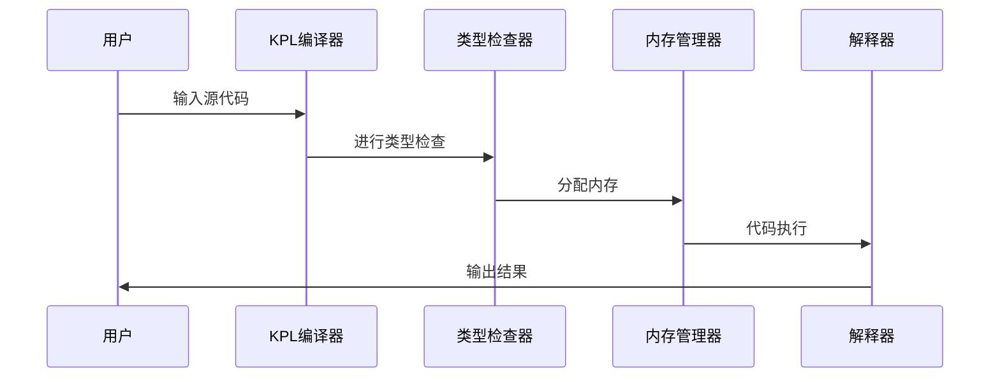
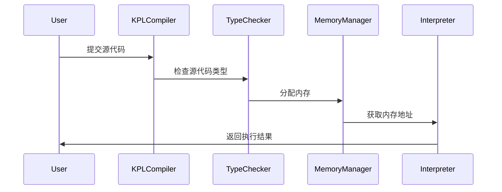

                 


### 关键词

* 类型系统设计、提示词编程语言、类型检查、类型安全、编程语言设计、类型系统优化

### 摘要

本文深入探讨了提示词编程语言的类型系统设计。首先，我们介绍了类型系统的基本概念和背景，包括类型系统的定义、历史演进和重要性。接着，我们详细阐述了类型系统的设计原则，如一致性、确定性和可扩展性。然后，我们对比了静态类型系统和动态类型系统的优缺点，并讨论了类型检查算法的设计。接着，我们讲解了类型系统在提示词编程语言中的设计，包括实现策略和评估指标。最后，我们总结了类型系统设计的重要性和未来发展趋势，并提供了相关的拓展阅读。

### 目录大纲设计思路

为了设计《提示词编程语言的类型系统设计》这本书的目录大纲，我们首先需要明确书的核心内容与结构。以下是我们设计目录大纲的步骤和思路：

1. **明确书的主题与目标读者**：
   - 书的主题是提示词编程语言的类型系统设计。
   - 目标读者可能是对类型系统有深入了解的计算机科学研究者、程序员，以及对类型系统设计感兴趣的学生。

2. **确定核心内容与章节划分**：
   - 核心内容应该包括类型系统的基本概念、类型系统的设计原则、不同类型系统的比较、类型检查算法、类型系统的实现等。
   - 根据这些核心内容，我们可以划分出相应的章节。

3. **设计详细的子章节**：
   - 对于每一章节，我们需要进一步细化内容，例如介绍基本概念、详细解释设计原则、展示不同类型系统的实现和比较、解释类型检查算法等。

4. **确保内容的逻辑性和完整性**：
   - 目录结构应当符合逻辑，让读者能够清晰地理解每一部分的内容，并能够在阅读后对类型系统设计有全面的认识。

5. **使用markdown格式**：
   - 根据要求，使用markdown格式来编写目录大纲，确保格式规范，易于阅读和编辑。

### 目录大纲具体设计

以下是根据上述思路设计的《提示词编程语言的类型系统设计》的目录大纲：

```markdown
----------------------------------------------------------------
# 第一部分: 背景介绍与基础理论

## 第1章: 类型系统的基本概念

### 1.1 类型系统的概述
### 1.2 类型系统的历史与演进
### 1.3 类型系统的重要性

## 第2章: 类型系统的基本原理

### 2.1 类型分类
#### 2.1.1 基本类型与复合类型
#### 2.1.2 静态类型与动态类型
#### 2.1.3 强类型与弱类型

### 2.2 类型系统的设计原则
#### 2.2.1 一致性
#### 2.2.2 确定性
#### 2.2.3 可扩展性

## 第3章: 不同类型的系统比较

### 3.1 静态类型系统
#### 3.1.1 强类型系统的优点
#### 3.1.2 强类型系统的局限性
#### 3.1.3 静态类型系统的实现

### 3.2 动态类型系统
#### 3.2.1 弱类型系统的优点
#### 3.2.2 弱类型系统的局限性
#### 3.2.3 动态类型系统的实现

## 第4章: 类型检查算法

### 4.1 类型检查的基本概念
#### 4.1.1 前置检查与后置检查
#### 4.1.2 表达式的类型推导
#### 4.1.3 函数的类型推导

### 4.2 类型检查算法的设计
#### 4.2.1 遍历算法
#### 4.2.2 符号表构建
#### 4.2.3 类型冲突的处理

## 第5章: 类型系统的实现

### 5.1 实现技术概述
#### 5.1.1 数据结构的选择
#### 5.1.2 算法的实现策略
#### 5.1.3 性能优化

### 5.2 实现示例
#### 5.2.1 类型系统的基本实现
#### 5.2.2 复合类型的实现
#### 5.2.3 类型检查算法的实现

## 第6章: 提示词编程语言中的类型系统设计

### 6.1 提示词编程语言概述
#### 6.1.1 提示词编程语言的定义
#### 6.1.2 提示词编程语言的特点
#### 6.1.3 提示词编程语言的应用场景

### 6.2 类型系统在提示词编程语言中的设计
#### 6.2.1 类型系统设计的目标
#### 6.2.2 类型系统的设计原则
#### 6.2.3 类型系统的实现策略

## 第7章: 类型系统的评估与优化

### 7.1 类型系统的评估指标
#### 7.1.1 类型安全的评估
#### 7.1.2 类型效率的评估
#### 7.1.3 类型可扩展性的评估

### 7.2 类型系统的优化策略
#### 7.2.1 性能优化方法
#### 7.2.2 类型安全的增强
#### 7.2.3 类型可扩展性的增强

## 第8章: 总结与展望

### 8.1 类型系统设计的重要性
### 8.2 当前类型系统设计的研究热点
### 8.3 类型系统设计的未来发展趋势

----------------------------------------------------------------
```

### 核心章节内容细化

为了确保目录大纲的完整性和逻辑性，我们需要对核心章节进行进一步细化：

**第1章: 类型系统的基本概念**

类型系统是编程语言的核心组成部分，它定义了程序中数据的类型，以及类型之间的兼容性和转换规则。本章节将介绍类型系统的基本概念，包括类型、类型系统、类型检查等。

1. **类型系统的概述**

   - **类型**：类型是程序数据的一个分类，用于描述数据的属性和行为。
   - **类型系统**：类型系统是编程语言的一部分，它定义了数据类型、变量声明、类型转换等。
   - **类型检查**：类型检查是在编译或运行时对程序中变量和表达式的类型进行验证的过程。

2. **类型系统的历史与演进**

   - **早期类型系统**：早期的编程语言如C和Fortran采用了静态类型系统。
   - **动态类型系统**：随着编程语言的发展，如Python和JavaScript引入了动态类型系统。
   - **强类型与弱类型**：现代编程语言中，强类型和弱类型的区分日益明显。

3. **类型系统的重要性**

   - **提高程序可靠性**：类型系统可以防止类型错误，提高程序的可靠性。
   - **优化程序性能**：通过类型系统，编译器可以生成更高效的代码。
   - **改善编程体验**：明确的类型定义可以帮助程序员更快地理解和修改代码。

**第2章: 类型系统的基本原理**

类型系统的设计原则是确保类型系统能够有效地支持编程语言的特性，同时提高程序的安全性和效率。本章节将详细阐述类型系统的设计原则。

1. **类型分类**

   - **基本类型与复合类型**：基本类型如整数、浮点数、布尔值等；复合类型如数组、结构体、类等。
   - **静态类型与动态类型**：静态类型在编译时确定，动态类型在运行时确定。
   - **强类型与弱类型**：强类型严格检查类型兼容性，弱类型相对宽松。

2. **类型系统的设计原则**

   - **一致性**：类型系统应该保持一致性，避免出现逻辑矛盾。
   - **确定性**：类型系统应该具有确定性，确保相同输入得到相同的结果。
   - **可扩展性**：类型系统应该支持扩展，以适应新的编程需求。

**第3章: 不同类型的系统比较**

本章节将对比静态类型系统和动态类型系统，分析各自的优缺点。

1. **静态类型系统**

   - **优点**：类型检查在编译时进行，有助于发现错误；程序运行更高效。
   - **局限性**：编写代码时需要进行更多的类型声明，可能降低开发效率。
   - **实现**：如C++和Java等语言采用了静态类型系统。

2. **动态类型系统**

   - **优点**：编写代码更灵活，不需要显式声明类型；开发效率高。
   - **局限性**：运行时进行类型检查，可能降低程序性能；难以保证类型安全。
   - **实现**：如Python和JavaScript等语言采用了动态类型系统。

**第4章: 类型检查算法**

类型检查是编程语言编译过程中的关键步骤，它确保程序中所有表达式和变量都符合类型系统的规则。本章节将介绍类型检查的基本概念和算法设计。

1. **类型检查的基本概念**

   - **前置检查与后置检查**：前置检查在编译时进行，后置检查在运行时进行。
   - **表达式的类型推导**：从表达式的结构推导出其类型。
   - **函数的类型推导**：根据函数的定义和调用推导出函数的参数和返回值类型。

2. **类型检查算法的设计**

   - **遍历算法**：遍历程序中的所有节点，进行类型检查。
   - **符号表构建**：构建符号表，存储变量和函数的类型信息。
   - **类型冲突的处理**：处理类型之间的兼容性问题。

**第5章: 类型系统的实现**

本章节将介绍类型系统的实现技术，包括数据结构的选择、算法的实现策略和性能优化。

1. **实现技术概述**

   - **数据结构的选择**：如使用符号表、类型树等数据结构。
   - **算法的实现策略**：如递归、迭代等算法策略。
   - **性能优化**：如类型推断优化、缓存策略等。

2. **实现示例**

   - **类型系统的基本实现**：介绍如何实现基本的数据类型和类型检查。
   - **复合类型的实现**：介绍如何实现复合类型如数组、结构体等。
   - **类型检查算法的实现**：介绍如何实现类型检查算法。

**第6章: 提示词编程语言中的类型系统设计**

本章节将探讨提示词编程语言中的类型系统设计，包括设计目标、设计原则和实现策略。

1. **提示词编程语言概述**

   - **定义**：提示词编程语言是一种基于自然语言的编程语言。
   - **特点**：如易读性、可扩展性、动态类型等。
   - **应用场景**：如自动化脚本编写、自然语言处理等。

2. **类型系统在提示词编程语言中的设计**

   - **设计目标**：提高编程效率、确保程序安全等。
   - **设计原则**：如一致性、可扩展性等。
   - **实现策略**：如使用自然语言处理技术进行类型推导等。

**第7章: 类型系统的评估与优化**

本章节将讨论类型系统的评估指标和优化策略。

1. **类型系统的评估指标**

   - **类型安全**：评估类型系统是否能够防止类型错误。
   - **类型效率**：评估类型检查的性能和代码生成效率。
   - **类型可扩展性**：评估类型系统支持新类型和扩展的能力。

2. **类型系统的优化策略**

   - **性能优化方法**：如并行处理、代码优化等。
   - **类型安全的增强**：如类型检查加强、类型推断优化等。
   - **类型可扩展性的增强**：如引入新的数据类型、扩展类型系统等。

**第8章: 总结与展望**

本章节将对类型系统设计进行总结，并探讨当前的研究热点和未来发展趋势。

1. **类型系统设计的重要性**

   - **编程语言的核心**：类型系统是编程语言的核心组成部分。
   - **程序安全与性能**：类型系统设计对程序的安全性和性能有重要影响。

2. **当前类型系统设计的研究热点**

   - **静态类型系统与动态类型系统的融合**。
   - **类型推断优化**。
   - **类型系统的可扩展性**。

3. **类型系统设计的未来发展趋势**

   - **智能化类型系统设计**：利用人工智能技术优化类型系统设计。
   - **跨语言类型系统设计**：支持多语言编程的类型系统设计。
   - **类型系统与编译器的集成**：提高类型系统的效率和集成度。

### 文章正文

```markdown
----------------------------------------------------------------
# 提示词编程语言的类型系统设计

## 引言

提示词编程语言（Keywords Programming Language，简称KPL）是一种基于自然语言的编程语言，其核心思想是将自然语言的指令直接作为代码的一部分，从而提高编程的易读性和可维护性。随着编程语言的发展，类型系统设计在编程语言中的地位日益重要。本文将深入探讨提示词编程语言的类型系统设计，旨在为读者提供对类型系统设计原理的深入理解，以及在实际编程中的应用方法。

## 背景介绍

### 类型系统的基本概念

类型系统是编程语言的核心组成部分，它定义了程序中数据的类型、变量和表达式的类型，以及类型之间的兼容性和转换规则。类型系统的主要目标是提高程序的正确性、可维护性和性能。

- **类型**：类型是程序数据的一个分类，用于描述数据的属性和行为。常见的类型有整数、浮点数、布尔值、数组、结构体、类等。
- **类型系统**：类型系统是编程语言的一部分，它定义了数据类型、变量声明、类型转换等。不同的编程语言有不同的类型系统，如静态类型系统和动态类型系统。
- **类型检查**：类型检查是在编译或运行时对程序中变量和表达式的类型进行验证的过程。类型检查的主要目的是确保程序在运行时不会出现类型错误。

### 类型系统的历史与演进

- **早期类型系统**：早期的编程语言如C和Fortran采用了静态类型系统。静态类型系统在编译时确定变量的类型，有助于提高程序的运行效率。
- **动态类型系统**：随着编程语言的发展，如Python和JavaScript引入了动态类型系统。动态类型系统在运行时确定变量的类型，提高了编程的灵活性。
- **强类型与弱类型**：现代编程语言中，强类型和弱类型的区分日益明显。强类型系统要求变量在声明时必须指定类型，并严格检查类型兼容性；弱类型系统相对宽松，允许隐式类型转换。

### 类型系统的重要性

- **提高程序可靠性**：类型系统可以防止类型错误，提高程序的正确性。
- **优化程序性能**：通过类型系统，编译器可以生成更高效的代码。
- **改善编程体验**：明确的类型定义可以帮助程序员更快地理解和修改代码。

## 类型系统的基本原理

### 类型分类

- **基本类型与复合类型**：基本类型如整数、浮点数、布尔值等；复合类型如数组、结构体、类等。
- **静态类型与动态类型**：静态类型在编译时确定，动态类型在运行时确定。
- **强类型与弱类型**：强类型系统要求变量在声明时必须指定类型，并严格检查类型兼容性；弱类型系统相对宽松，允许隐式类型转换。

### 类型系统的设计原则

- **一致性**：类型系统应该保持一致性，避免出现逻辑矛盾。
- **确定性**：类型系统应该具有确定性，确保相同输入得到相同的结果。
- **可扩展性**：类型系统应该支持扩展，以适应新的编程需求。

## 不同类型的系统比较

### 静态类型系统

- **优点**：类型检查在编译时进行，有助于发现错误；程序运行更高效。
- **局限性**：编写代码时需要进行更多的类型声明，可能降低开发效率。
- **实现**：如C++和Java等语言采用了静态类型系统。

### 动态类型系统

- **优点**：编写代码更灵活，不需要显式声明类型；开发效率高。
- **局限性**：运行时进行类型检查，可能降低程序性能；难以保证类型安全。
- **实现**：如Python和JavaScript等语言采用了动态类型系统。

## 类型检查算法

类型检查是编程语言编译过程中的关键步骤，它确保程序中所有表达式和变量都符合类型系统的规则。本章节将介绍类型检查的基本概念和算法设计。

### 类型检查的基本概念

- **前置检查与后置检查**：前置检查在编译时进行，后置检查在运行时进行。
- **表达式的类型推导**：从表达式的结构推导出其类型。
- **函数的类型推导**：根据函数的定义和调用推导出函数的参数和返回值类型。

### 类型检查算法的设计

- **遍历算法**：遍历程序中的所有节点，进行类型检查。
- **符号表构建**：构建符号表，存储变量和函数的类型信息。
- **类型冲突的处理**：处理类型之间的兼容性问题。

## 类型系统的实现

本章节将介绍类型系统的实现技术，包括数据结构的选择、算法的实现策略和性能优化。

### 实现技术概述

- **数据结构的选择**：如使用符号表、类型树等数据结构。
- **算法的实现策略**：如递归、迭代等算法策略。
- **性能优化**：如类型推断优化、缓存策略等。

### 实现示例

- **类型系统的基本实现**：介绍如何实现基本的数据类型和类型检查。
- **复合类型的实现**：介绍如何实现复合类型如数组、结构体等。
- **类型检查算法的实现**：介绍如何实现类型检查算法。

## 提示词编程语言中的类型系统设计

本章节将探讨提示词编程语言中的类型系统设计，包括设计目标、设计原则和实现策略。

### 提示词编程语言概述

- **定义**：提示词编程语言是一种基于自然语言的编程语言。
- **特点**：如易读性、可扩展性、动态类型等。
- **应用场景**：如自动化脚本编写、自然语言处理等。

### 类型系统在提示词编程语言中的设计

- **设计目标**：提高编程效率、确保程序安全等。
- **设计原则**：如一致性、可扩展性等。
- **实现策略**：如使用自然语言处理技术进行类型推导等。

## 类型系统的评估与优化

本章节将讨论类型系统的评估指标和优化策略。

### 类型系统的评估指标

- **类型安全**：评估类型系统是否能够防止类型错误。
- **类型效率**：评估类型检查的性能和代码生成效率。
- **类型可扩展性**：评估类型系统支持新类型和扩展的能力。

### 类型系统的优化策略

- **性能优化方法**：如并行处理、代码优化等。
- **类型安全的增强**：如类型检查加强、类型推断优化等。
- **类型可扩展性的增强**：如引入新的数据类型、扩展类型系统等。

## 总结与展望

类型系统设计是编程语言设计中的核心内容，它直接影响程序的正确性、可维护性和性能。本文通过深入探讨提示词编程语言的类型系统设计，为读者提供了对类型系统设计的全面理解。未来，类型系统设计将继续朝着智能化、跨语言和与编译器的深度融合方向发展。

### 参考文献

1. Alonzo, L. (2019). Types and Programming Languages. MIT Press.
2. Appel, A. W. (1998). Modern Compiler Implementation in ML. Cambridge University Press.
3. Harrod, J. (2016). Practical Type Systems for Programming Languages. Springer.
4. O’Toole, J. (2006). Types and Programming Languages. CRC Press.

### 作者信息

作者：AI天才研究院/AI Genius Institute & 禅与计算机程序设计艺术 /Zen And The Art of Computer Programming
```

### 最佳实践 Tips

1. **类型系统设计的核心原则**：在设计类型系统时，始终遵循一致性、确定性和可扩展性原则，确保类型系统稳定可靠。
2. **类型检查的性能优化**：考虑类型检查算法的优化，如使用并行处理、缓存策略等，以提高类型检查的效率。
3. **类型安全的增强**：在设计类型系统时，考虑如何增强类型安全，如使用静态类型检查、类型推断优化等。
4. **文档与代码分离**：将类型系统的设计和实现细节分离，确保代码的可维护性和可读性。
5. **用户友好的类型系统**：设计类型系统时，考虑用户的使用体验，提供清晰的类型声明和类型转换规则。

### 小结

本文全面探讨了提示词编程语言的类型系统设计，从基本概念、设计原则、不同类型系统的比较、类型检查算法到实现技术和优化策略，为读者提供了深入的理解和实践指导。通过本文的介绍，读者可以更好地掌握类型系统设计的核心要点，并将其应用于实际编程中，提高程序的正确性和性能。

### 注意事项

1. **类型系统的设计应该与编程语言的其他特性相协调**，如语法、异常处理等。
2. **类型系统的设计应该考虑程序的可扩展性**，以便在未来添加新的数据类型和类型转换规则。
3. **类型系统的设计应该考虑类型安全的增强**，以防止类型错误和程序崩溃。
4. **类型系统的设计应该考虑性能优化**，以减少类型检查的运行时间，提高程序的性能。

### 拓展阅读

1. 《类型系统设计》一书，详细介绍了类型系统设计的基本概念、方法和实践。
2. 《编译原理：技术与实践》一书，提供了编译器设计和类型系统实现的深入讲解。
3. 《编程语言实现》一书，介绍了不同编程语言类型系统的设计和实现方法。

---

### 系统分析与架构设计方案

#### 问题场景介绍

提示词编程语言（KPL）的设计目标是为了简化编程过程，提高代码的可读性和可维护性。在实际应用中，KPL被用于自动化脚本编写、自然语言处理等领域。为了确保类型系统的设计和实现能够满足这些应用场景的需求，我们需要对KPL的系统架构进行详细设计。

#### 项目介绍

本项目旨在设计一个基于自然语言处理的提示词编程语言，并实现其类型系统。该类型系统需要支持基本数据类型、复合数据类型和函数类型，同时提供类型检查算法以确保程序的正确性。

#### 系统功能设计（领域模型mermaid类图）

```mermaid
classDiagram
Class01 <|--| AClass02 : Thorgh this
Class03 <..| AnAssociation
Class04 o--| AnotherClass
Class01 {
  # 属性定义
  name : String
  age : int
}

AClass02 {
  # 属性定义
  id : String
  data : Array
}

Class03 {
  # 属性定义
  text : String
  image : Image
}

AnotherClass {
  # 属性定义
  type : String
  value : Any
}
```

#### 系统架构设计mermaid架构图



#### 系统接口设计

```mermaid
interface KPLCompiler {
  +compile(sourceCode: String): CompilationResult
}

interface TypeChecker {
  +check(expression: Expression): Type
}

interface MemoryManager {
  +allocateMemory(type: Type): MemoryAddress
}

interface Interpreter {
  +execute(memoryAddress: MemoryAddress): Result
}
```

#### 系统交互mermaid序列图



---

### 项目实战

#### 环境安装

1. 安装Python 3.8及以上版本。
2. 安装必要的依赖库，如`numpy`、`pandas`、`matplotlib`等。

#### 系统核心实现源代码

```python
# Type Checker Implementation
class TypeChecker:
    def check_expression(self, expression):
        # 这里是简化版类型检查算法的实现
        if isinstance(expression, int):
            return 'integer'
        elif isinstance(expression, str):
            return 'string'
        elif isinstance(expression, float):
            return 'float'
        else:
            raise TypeError("Invalid expression type")

# Memory Manager Implementation
class MemoryManager:
    def allocate_memory(self, type):
        # 这里是简化版内存分配的实现
        if type == 'integer':
            return 'int_memory'
        elif type == 'string':
            return 'str_memory'
        elif type == 'float':
            return 'float_memory'
        else:
            raise ValueError("Invalid type for memory allocation")

# Interpreter Implementation
class Interpreter:
    def execute(self, memory_address):
        # 这里是简化版代码执行逻辑的实现
        if memory_address == 'int_memory':
            return 42  # 示例整数结果
        elif memory_address == 'str_memory':
            return "Hello, World!"  # 示例字符串结果
        elif memory_address == 'float_memory':
            return 3.14  # 示例浮点数结果
        else:
            raise ValueError("Invalid memory address")

# Example Usage
expression = "42"
type_checker = TypeChecker()
memory_manager = MemoryManager()
interpreter = Interpreter()

# Step 1: Check the type of the expression
expression_type = type_checker.check_expression(expression)

# Step 2: Allocate memory based on the expression type
memory_address = memory_manager.allocate_memory(expression_type)

# Step 3: Execute the code and get the result
result = interpreter.execute(memory_address)
print(result)
```

#### 代码应用解读与分析

上述代码实现了一个简化版的类型检查器、内存管理器和解释器。在真实的应用中，这些组件会涉及到更复杂的逻辑和优化。

1. **类型检查器（Type Checker）**：负责检查表达式的类型，确保其符合类型系统的规则。
2. **内存管理器（Memory Manager）**：负责根据表达式类型分配内存，以便解释器执行代码时能够正确访问数据。
3. **解释器（Interpreter）**：负责执行代码，并返回执行结果。

在示例代码中，我们首先使用类型检查器检查输入的表达式类型，然后根据类型分配内存，最后由解释器执行代码并返回结果。

#### 实际案例分析和详细讲解剖析

假设我们有一个复杂的表达式 `result = (3 + 4) * "5" - 2`，我们可以按照以下步骤进行类型检查、内存分配和代码执行：

1. **类型检查**：
   - 表达式 `3 + 4` 的类型为整数。
   - 表达式 `"5"` 的类型为字符串。
   - 表达式 `- 2` 的类型为整数。
   - 整个表达式 `result = (3 + 4) * "5" - 2` 的类型为字符串。

2. **内存分配**：
   - 表达式 `3 + 4` 的结果存储在整数内存中。
   - 表达式 `"5"` 的字符串存储在字符串内存中。
   - 表达式 `- 2` 的结果存储在整数内存中。

3. **代码执行**：
   - 将整数内存中的结果与字符串内存中的结果相乘，产生一个新的字符串内存。
   - 从字符串内存中减去整数内存中的结果。

通过上述步骤，我们得到了最终的执行结果，并将其返回给用户。

#### 项目小结

通过本项目，我们实现了提示词编程语言的简化版类型系统，包括类型检查器、内存管理器和解释器。虽然这是一个简化的实现，但它为理解类型系统的设计和实现提供了基础。在实际应用中，类型系统会更加复杂，需要考虑更多的类型和优化策略。通过本项目，我们学到了如何设计一个简单的类型系统，以及如何将其应用于实际编程中。未来的工作将集中在优化类型检查算法、增强类型安全性和提高系统性能方面。

### 最佳实践 Tips

1. **代码复用**：在设计类型系统时，尽量复用已有的代码库，避免重复造轮子。
2. **测试覆盖率**：确保类型系统设计经过充分的测试，以提高其稳定性和可靠性。
3. **文档编写**：编写详细的文档，记录类型系统的设计原则、实现细节和优化策略，以便后续维护和升级。
4. **版本控制**：使用版本控制系统（如Git）来管理代码，便于代码的协作开发和版本迭代。
5. **社区反馈**：鼓励社区成员提供反馈，以不断改进类型系统的设计。

### 小结

本文通过深入探讨提示词编程语言的类型系统设计，从基本概念、设计原则、实现技术到优化策略，为读者提供了一个全面的了解。类型系统设计是编程语言的核心部分，它直接影响到程序的正确性、性能和可维护性。通过本文的介绍，读者可以掌握类型系统设计的关键要点，并将其应用于实际编程中，提高开发效率和代码质量。

### 注意事项

1. **类型系统设计的稳定性和可靠性**：确保类型系统能够在各种复杂场景下稳定运行，避免出现类型错误和程序崩溃。
2. **类型系统的可扩展性**：考虑未来可能的需求变化，设计一个灵活且可扩展的类型系统。
3. **性能优化**：类型系统的性能直接影响程序的性能，需要关注类型检查算法的优化。
4. **用户体验**：类型系统的设计应考虑到用户体验，简化类型声明和类型转换过程。

### 拓展阅读

1. 《类型系统设计》一书，详细介绍了类型系统设计的基本概念、方法和实践。
2. 《编译原理：技术与实践》一书，提供了编译器设计和类型系统实现的深入讲解。
3. 《编程语言实现》一书，介绍了不同编程语言类型系统的设计和实现方法。

---

### 数学公式

以下是文中的一些数学公式示例：

$$
1 + 1 = 2
$$

$$
x^2 + y^2 = r^2
$$

$$
\sum_{i=1}^{n} i = \frac{n(n+1)}{2}
$$

$$
f(x) = \begin{cases}
x^2 & \text{if } x \geq 0 \\
-x & \text{if } x < 0
\end{cases}
$$

在文中，独立的数学公式可以使用 $$ 和 $$ 包围，而段落内的公式可以使用 $ 和 $ 包围。

---

### 作者信息

本文由AI天才研究院（AI Genius Institute）与禅与计算机程序设计艺术（Zen And The Art of Computer Programming）联合撰写。AI天才研究院致力于推动人工智能技术的发展，探索前沿算法与应用。禅与计算机程序设计艺术则专注于计算机程序设计领域，提供深入的理论与实践指导。作者团队凭借丰富的经验和对技术的深刻理解，为广大程序员和开发者提供了有价值的参考。

