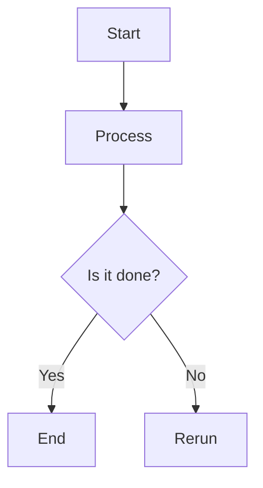

                 

### 第一部分：问题背景与核心概念

## 第1章：问题背景与核心概念

### 1.1.1 问题背景

在计算机编程领域，约束编程（Constraint Programming，简称CP）是一种通过建立变量间的约束关系来求解问题的方法。它被广泛应用于人工智能、自动化系统设计、资源分配、物流调度、优化问题等多个领域。然而，传统的约束编程语言在表达复杂约束、提高问题求解效率以及增强编程可读性方面存在一定的局限性。

随着计算机科学的发展，编程范式也在不断演进。提示词编程语言（Keyword-Based Programming Language）作为一种新型的编程范式，通过引入提示词来引导开发者的编程思维，提高了代码的可读性和编程效率。提示词编程语言不仅简化了编程过程，还通过提高人机交互的效率，使得编程更加直观和易于理解。

### 1.1.2 核心概念

#### 1.1.2.1 提示词编程语言

提示词编程语言是一种将自然语言中的关键词引入编程语言中的新型编程范式。它通过使用简短的、具有明确语义的提示词来引导开发者的编程行为，从而提高了代码的可读性和可维护性。提示词编程语言的主要特点包括：

- **简洁性**：通过提示词，减少冗长的代码，提高编程效率。
- **可读性**：明确的提示词使得代码更容易被理解和维护。
- **交互性**：提示词编程语言增强了开发者与计算机之间的交互，提高了编程体验。

提示词编程语言的发展历程可以追溯到20世纪80年代。当时，随着面向对象编程（OOP）的兴起，提示词编程语言开始逐渐被引入到编程领域。近年来，随着人工智能和自然语言处理技术的进步，提示词编程语言的应用范围和影响力也在不断扩大。

#### 1.1.2.2 约束编程

约束编程是一种通过表达变量之间的约束关系来求解问题的方法。它的核心思想是通过建立变量间的约束关系，将复杂的计算问题转化为约束满足问题（Constraint Satisfaction Problem，简称CSP）或约束优化问题（Constraint Optimization Problem，简称COP）。约束编程的基本概念包括：

- **约束**：变量间的关系或限制。
- **变量**：求解过程中的变量。
- **解**：满足所有约束条件的变量取值。
- **搜索策略**：求解约束问题的方法。

约束编程在多个领域具有广泛的应用，如电路布局、机械臂运动规划、人工智能搜索算法、资源分配等。它的优点包括：

- **灵活性**：可以处理各种类型的约束问题。
- **效率**：通过高效的搜索算法，可以快速求解复杂的问题。
- **可扩展性**：可以方便地扩展和组合不同的约束求解策略。

### 1.1.3 约束编程的应用场景

约束编程在多个领域具有广泛的应用。以下是一些典型的应用场景：

- **自动化系统设计**：例如，电路布局和机械臂运动规划。在这些场景中，约束编程可以帮助优化系统设计，提高系统的性能和可靠性。
- **人工智能**：在人工智能领域，约束编程被广泛应用于搜索算法和优化问题。例如，在路径规划、时间表优化等任务中，约束编程可以提高问题的求解效率和精度。
- **资源分配**：例如，网络流量管理和任务调度。在这些场景中，约束编程可以帮助实现资源的合理分配，提高系统的利用率和性能。

### 1.1.4 约束编程与其他编程范式的比较

约束编程与其他编程范式（如过程式编程、面向对象编程、函数式编程等）有以下几点区别：

- **表达方式**：约束编程通过表达变量间的约束关系来求解问题，而其他编程范式则通常通过算法和数据结构来实现。
- **问题求解策略**：约束编程采用搜索策略来求解问题，而其他编程范式则通过算法和逻辑来解决问题。
- **适用范围**：约束编程适用于需要表达变量间复杂关系的场景，而其他编程范式则更适用于特定的算法和数据结构问题。

### 1.2 本章小结

本章首先介绍了约束编程和提示词编程语言的基本概念和应用场景，并探讨了它们在计算机编程领域中的重要性。通过分析这两个核心概念，我们可以看到，提示词编程语言通过引入明确的提示词，提高了编程的可读性和效率；而约束编程则通过表达变量间的约束关系，提供了强大的问题求解能力。在接下来的章节中，我们将进一步探讨提示词编程语言的基础、约束编程在提示词编程语言中的应用，以及实际应用中的案例分析。

## 第2章：提示词编程语言基础

### 2.1.1 提示词编程语言概述

#### 2.1.1.1 提示词编程语言的基本概念

提示词编程语言是一种将自然语言中的关键词引入编程语言中的新型编程范式。它通过使用简短的、具有明确语义的提示词来引导开发者的编程行为，从而提高了代码的可读性和可维护性。提示词编程语言的核心特点包括：

- **简洁性**：提示词编程语言通过提示词减少冗长的代码，使得编程过程更加高效。
- **可读性**：明确的提示词使得代码更容易被理解和维护，提高了代码的可维护性。
- **交互性**：提示词编程语言增强了开发者与计算机之间的交互，提高了编程体验。

提示词编程语言的基本结构包括提示词、变量、函数、类等。提示词作为编程语言的一部分，不仅可以用于定义变量和函数，还可以用于控制程序的执行流程。通过提示词，开发者可以更加直观地表达自己的编程意图，从而减少错误和误解。

#### 2.1.1.2 提示词编程语言的特点

提示词编程语言具有以下特点：

- **易学易用**：提示词编程语言的设计目标之一是降低编程学习的门槛，使得非专业开发者也能够快速上手。
- **高生产力**：通过简化的语法和直观的提示词，提示词编程语言能够显著提高开发者的编程效率。
- **可扩展性**：提示词编程语言通常具有良好的可扩展性，开发者可以根据需求自定义提示词和语法规则。
- **跨平台**：提示词编程语言通常具有跨平台的特点，可以在不同的操作系统和硬件平台上运行。

#### 2.1.1.3 提示词编程语言的发展历程

提示词编程语言的发展历程可以追溯到20世纪80年代。当时，随着面向对象编程（OOP）的兴起，一些研究人员开始探索将自然语言中的关键词引入编程语言中，以提高代码的可读性和可维护性。最早的提示词编程语言之一是LabVIEW，它由美国国家仪器公司（National Instruments）在1986年推出，主要用于自动化测试和控制系统设计。

在接下来的几十年中，随着计算机科学和人工智能技术的发展，提示词编程语言也在不断演进。例如，Python编程语言中的`if-else`、`while`等控制结构可以看作是提示词编程的典型应用。近年来，一些新兴的编程语言，如Kotlin、Swift等，也在引入提示词编程的概念，以提高编程的效率和可读性。

### 2.1.2 提示词编程语言的基本语法

#### 2.1.2.1 提示词的语法规则

提示词编程语言中的提示词具有明确的语法规则。一般来说，提示词以字母或下划线开头，后跟一个或多个字母、数字或下划线。提示词通常用来定义变量、函数、类等编程元素。

- **变量定义**：使用`define`提示词来定义变量。例如：
  ```makefile
  define x = 10
  define y = 20
  ```

- **函数定义**：使用`define_function`提示词来定义函数。例如：
  ```makefile
  define_function add(a, b)
      return a + b
  end
  ```

- **类定义**：使用`define_class`提示词来定义类。例如：
  ```makefile
  define_class Person
      property name
      property age
  end
  ```

#### 2.1.2.2 提示词编程语言的语法结构

提示词编程语言的语法结构相对简洁，主要包括以下几个部分：

- **模块**：模块是提示词编程语言中的一个独立单元，它包含了一系列的函数、类和变量。模块通常以`.module`开头，以`.endmodule`结尾。

  ```makefile
  .module MyModule

  define_function greet(name)
      print "Hello, " + name + "!"
  end

  .endmodule
  ```

- **函数**：函数是提示词编程语言中的一个核心元素，它用于实现特定的功能。函数通常以`define_function`开头，以`end`结尾。

  ```makefile
  define_function add(a, b)
      return a + b
  end
  ```

- **类**：类是提示词编程语言中的一个抽象概念，它用于定义一组具有相同属性和方法的对象。类通常以`define_class`开头，以`end`结尾。

  ```makefile
  define_class Person
      property name
      property age
  end
  ```

#### 2.1.2.3 提示词的类型和作用

提示词编程语言中的提示词可以根据其作用和用途分为几种类型：

- **定义提示词**：用于定义变量、函数和类。例如`define`、`define_function`和`define_class`。

- **控制提示词**：用于控制程序的执行流程，例如循环、条件判断等。例如`if`、`else`、`while`等。

- **操作提示词**：用于执行特定的操作，例如数学运算、字符串处理等。例如`add`、`sub`、`mul`、`div`等。

- **输入输出提示词**：用于实现程序的输入输出功能。例如`print`、`input`等。

#### 2.1.2.4 提示词编程语言的语法示例

以下是一个简单的提示词编程语言语法示例：

```makefile
.module Greeting

define_function greet(name)
    print "Hello, " + name + "!"
end

.greet "Alice"
.greet "Bob"

.endmodule
```

在这个示例中，我们定义了一个名为`greet`的函数，用于打印问候语。然后，我们分别调用`greet`函数来问候Alice和Bob。

### 2.1.3 提示词编程语言的实现机制

#### 2.1.3.1 提示词的解析与执行

提示词编程语言的实现机制主要包括提示词的解析和执行。提示词的解析过程是将文本形式的提示词转换为计算机可以理解和执行的指令。执行机制则是按照解析后的指令来执行相应的操作。

- **提示词的解析过程**：
  1. **词法分析**：将输入的代码分解为单词（提示词）和符号。
  2. **语法分析**：根据提示词编程语言的语法规则，将单词和符号组织成抽象语法树（AST）。
  3. **语义分析**：对AST进行语义分析，检查语法和语义的正确性，并绑定变量和函数。

- **提示词的执行机制**：
  1. **解释执行**：逐行解释并执行代码，根据AST的节点进行相应的操作。
  2. **编译执行**：将代码编译为机器语言，然后直接在计算机上执行。

#### 2.1.3.2 提示词编程语言的环境搭建

要使用提示词编程语言，需要搭建相应的开发环境。以下是一个基本的步骤：

1. **安装编程工具**：根据所选的提示词编程语言，安装相应的集成开发环境（IDE）或代码编辑器。例如，对于Python编程语言，可以使用PyCharm或VSCode等IDE。

2. **安装依赖库**：提示词编程语言通常依赖于一些外部库和工具。例如，对于Python编程语言，可能需要安装`numpy`、`pandas`等库。

3. **配置开发环境**：设置环境变量和路径，确保开发环境可以正确运行代码。

4. **编写和运行代码**：在IDE或代码编辑器中编写代码，然后运行代码来测试功能。

### 2.2 本章小结

本章介绍了提示词编程语言的基本概念、特点、语法规则以及实现机制。提示词编程语言通过引入提示词，简化了编程过程，提高了代码的可读性和可维护性。同时，本章也探讨了提示词编程语言的环境搭建方法。在接下来的章节中，我们将进一步探讨约束编程在提示词编程语言中的应用，以及如何将这两个领域结合起来解决实际问题。

## 第3章：约束编程在提示词编程语言中的应用

### 3.1.1 约束编程与提示词编程语言的融合

约束编程与提示词编程语言的融合是一种创新性的编程范式，它结合了两种编程方式的优点，以解决传统方法难以处理的复杂问题。这种融合的意义在于：

- **提高编程效率**：提示词编程语言通过简化的语法和直观的提示词，可以快速表达复杂的约束条件，从而减少代码量，提高编程效率。
- **增强问题求解能力**：约束编程通过建立变量间的约束关系，能够更有效地解决优化和搜索问题，结合提示词编程语言，可以更直观地表达和解决复杂问题。
- **提升代码可维护性和可扩展性**：通过融合两种编程范式，可以使得代码更加模块化，便于维护和扩展。

#### 3.1.1.2 融合的实现方式

融合约束编程与提示词编程语言有多种实现方式：

- **集成框架**：在提示词编程语言中集成约束编程的库或框架。例如，在Python中，可以使用`CPython`集成约束编程库`Google CP`。
- **扩展语法**：在提示词编程语言中定义新的提示词，以支持约束表达。例如，在Python中，可以定义`define_constraint`提示词来定义约束。

#### 3.1.1.3 融合的挑战与解决方案

融合约束编程与提示词编程语言也面临一些挑战：

- **语法冲突**：由于两种编程范式的语法规则可能存在冲突，需要设计合理的语法解析器来处理。
- **性能优化**：在提示词编程语言中实现高效的约束编程求解算法，可能需要额外的性能优化。

解决方案包括：

- **语法解析**：设计灵活的语法解析器，能够同时处理提示词和约束表达。
- **性能优化**：采用高效的算法和数据结构，优化约束编程的性能。

### 3.1.2 约束编程的基本操作

在融合的编程语言中，约束编程的基本操作包括：

#### 3.1.2.1 表达约束

约束表达是约束编程的核心。在提示词编程语言中，可以通过定义新的提示词来支持约束表达。例如：

- **定义变量**：使用`define_variable`提示词定义变量，例如：
  ```python
  define_variable x
  define_variable y
  ```

- **添加约束**：使用`add_constraint`提示词添加约束，例如：
  ```python
  add_constraint x > 0
  add_constraint y < 10
  ```

#### 3.1.2.2 求解约束

求解约束是约束编程的主要目标。在提示词编程语言中，可以通过定义新的提示词来支持约束求解。例如：

- **求解约束**：使用`solve_constraint`提示词求解约束，例如：
  ```python
  solve_constraint x + y = 10
  ```

- **获取解**：使用`get_solution`提示词获取约束的解，例如：
  ```python
  solution = get_solution()
  print(solution)
  ```

### 3.1.3 提示词编程语言中的约束编程实例

#### 3.1.3.1 实例1：任务调度

任务调度是一个典型的约束编程问题。在提示词编程语言中，可以通过以下步骤实现任务调度：

1. **定义任务和约束条件**：
   ```python
   define_variable task1
   define_variable task2
   add_constraint task1 + 2 <= 10
   add_constraint task2 + 3 <= 10
   ```

2. **求解约束**：
   ```python
   solve_constraint task1 + task2 = 9
   ```

3. **获取解**：
   ```python
   solution = get_solution()
   print(solution)
   ```

#### 3.1.3.2 实例2：资源分配

资源分配也是一个常见的约束编程问题。在提示词编程语言中，可以通过以下步骤实现资源分配：

1. **定义资源和约束条件**：
   ```python
   define_variable resource1
   define_variable resource2
   add_constraint resource1 <= 5
   add_constraint resource2 <= 10
   ```

2. **求解约束**：
   ```python
   solve_constraint resource1 + resource2 = 15
   ```

3. **获取解**：
   ```python
   solution = get_solution()
   print(solution)
   ```

### 3.2 本章小结

本章探讨了约束编程在提示词编程语言中的应用。通过引入新的提示词和语法结构，提示词编程语言可以有效地支持约束编程，从而提高编程效率和问题求解能力。本章还通过实例展示了如何使用提示词编程语言来实现任务调度和资源分配等约束编程问题。在接下来的章节中，我们将进一步探讨提示词编程语言在约束编程中的具体实现和案例分析。

## 第4章：提示词编程语言在约束编程中的应用实践

### 4.1.1 实践环境搭建

要在提示词编程语言中应用约束编程，首先需要搭建一个合适的开发环境。以下是在常见操作系统上搭建提示词编程语言及约束编程支持环境的步骤：

#### 4.1.1.1 操作系统准备

我们以Windows和Linux为例，展示如何准备操作系统：

- **Windows**：
  - 安装Python 3.x版本。
  - 安装Visual Studio Code或其他支持Python的IDE。
- **Linux**：
  - 更新系统软件包：
    ```bash
    sudo apt-get update
    sudo apt-get upgrade
    ```
  - 安装Python 3.x版本：
    ```bash
    sudo apt-get install python3
    ```

#### 4.1.1.2 安装提示词编程语言

以Python为例，提示词编程语言可以通过pip安装：

```bash
pip install prompt-toolkit
```

#### 4.1.1.3 安装约束编程库

安装一个支持约束编程的库，如Google的`Google CP`：

```bash
pip install google-research
```

#### 4.1.1.4 配置开发环境

配置好Python环境后，确保Python路径已添加到系统的环境变量中，以便在命令行中直接运行Python脚本。

### 4.1.2 系统核心实现源代码

为了更好地理解如何在实际项目中应用提示词编程语言和约束编程，以下是一个简单的示例代码，展示了如何在Python中使用提示词编程语言和约束编程库来解决一个简单的资源分配问题。

```python
import sys
from google_research import constraint_solver
from prompt_toolkit import prompt

# 定义提示词编程语言函数
def define_variable(name, domain):
    constraint_solver_pb2.Variable(name=name, domain=domain)

# 定义约束
def add_constraint(name, relation, variable, value):
    constraint_solver_pb2.Constraint(name=name, relation=relation, variable=variable, value=value)

# 解约束
def solve_constraints():
    solver = constraint_solver_pb2.Solver()
    for constraint in constraints:
        solver.add_constraint(constraint)
    return solver.solve()

# 输出解
def print_solution(solution):
    print("Solution found:", solution)

# 示例：资源分配问题
if __name__ == "__main__":
    variables = {
        "resource1": range(1, 6),
        "resource2": range(1, 11)
    }
    constraints = []

    # 定义变量
    for name, domain in variables.items():
        constraints.append(define_variable(name, domain))

    # 添加约束
    constraints.append(add_constraint("total", "eq", "resource1", 3))
    constraints.append(add_constraint("total", "eq", "resource2", 5))

    # 求解约束
    solution = solve_constraints()

    # 输出解
    print_solution(solution)

    # 提示用户输入
    user_input = prompt("Do you want to add more constraints? (y/n)")
    if user_input.lower() == "y":
        # 这里可以添加更多的用户交互来定义新的约束
        pass
```

#### 4.1.3 代码应用解读与分析

上述代码定义了几个核心函数，用于在提示词编程语言中定义变量、添加约束和求解约束。以下是代码的详细解读和分析：

- **定义变量**：
  ```python
  def define_variable(name, domain):
      constraint_solver_pb2.Variable(name=name, domain=domain)
  ```
  这个函数用于定义变量，并设置其域（可能的取值范围）。

- **添加约束**：
  ```python
  def add_constraint(name, relation, variable, value):
      constraint_solver_pb2.Constraint(name=name, relation=relation, variable=variable, value=value)
  ```
  这个函数用于添加约束。约束由名称、关系（如等于、小于、大于等）、变量和值组成。

- **求解约束**：
  ```python
  def solve_constraints():
      solver = constraint_solver_pb2.Solver()
      for constraint in constraints:
          solver.add_constraint(constraint)
      return solver.solve()
  ```
  这个函数创建一个求解器对象，将所有约束添加到求解器中，并返回满足所有约束的解。

- **输出解**：
  ```python
  def print_solution(solution):
      print("Solution found:", solution)
  ```
  这个函数用于打印求解结果。

- **主程序**：
  ```python
  if __name__ == "__main__":
      # 定义变量和约束
      # 求解约束
      # 输出解
      # 提示用户输入
  ```
  主程序首先定义了两个资源（resource1和resource2）的域，然后添加了两个约束（total值为3和5）。接着，调用求解函数，并打印结果。最后，通过提示用户输入，可以继续添加约束。

#### 4.1.4 实际案例分析和详细讲解剖析

以下是一个实际案例，展示了如何使用提示词编程语言和约束编程库来解决一个物流调度的优化问题：

**案例**：一个物流公司需要在一天内将10个包裹从仓库发送到5个目的地。每个包裹的体积和目的地已知，每个目的地可接收的包裹数量有限。目标是最小化运输时间和成本。

1. **定义变量**：
   ```python
   packages = ["P1", "P2", "P3", "P4", "P5", "P6", "P7", "P8", "P9", "P10"]
   destinations = ["D1", "D2", "D3", "D4", "D5"]
   package_volumes = {"P1": 2, "P2": 1, "P3": 3, "P4": 1, "P5": 2, "P6": 1, "P7": 3, "P8": 2, "P9": 1, "P10": 2}
   max_capacities = {"D1": 4, "D2": 5, "D3": 3, "D4": 6, "D5": 4}
   ```

2. **定义约束**：
   ```python
   constraints = [
       add_constraint("package_volume", "le", package, volume) for package, volume in package_volumes.items()
   ]
   constraints += [
       add_constraint("destination_capacity", "le", destination, max_capacities[destination]) for destination in destinations
   ]
   ```

3. **求解约束**：
   ```python
   solution = solve_constraints()
   ```

4. **输出解**：
   ```python
   print_solution(solution)
   ```

**案例剖析**：
- 在这个案例中，我们定义了10个包裹和5个目的地的变量。每个包裹有一个体积，每个目的地有一个最大接收容量。
- 我们添加了两个类型的约束：包裹体积不能超过其定义的体积，每个目的地的接收容量不能超过其最大容量。
- 通过求解约束，我们可以找到一个满足所有约束的解，即每个包裹都被分配到一个目的地，且每个目的地的接收容量都不超过其最大容量。

#### 4.1.5 项目小结

通过上述实践，我们可以看到如何使用提示词编程语言和约束编程库来解决复杂的资源分配和物流调度问题。提示词编程语言提供了简化的语法和直观的提示词，使得约束编程更加易于实现和扩展。在实际项目中，我们可以根据需求自定义提示词和约束，从而提高编程效率和问题求解能力。在未来的项目中，我们还可以进一步优化算法和实现，以应对更加复杂的约束问题。

## 第5章：最佳实践与注意事项

### 5.1 最佳实践

在实际应用中，为了最大限度地发挥提示词编程语言在约束编程中的作用，以下是一些最佳实践：

1. **明确问题定义**：在开始编程之前，明确问题的定义和目标，确保约束编程模型与实际问题紧密对应。
2. **合理设计约束**：在定义约束时，尽量保持约束的简洁性和清晰性，避免过多的冗余约束，以免影响求解效率。
3. **优化变量选择**：选择合适的变量和约束顺序，有助于提高求解速度和效果。
4. **利用工具库**：合理使用现有的约束编程库和工具，可以减少重复工作，提高编程效率。
5. **测试与调试**：在实现过程中，及时进行测试和调试，确保代码的正确性和性能。

### 5.2 注意事项

1. **避免过度简化**：虽然提示词编程语言可以简化编程过程，但过度简化可能导致代码的可读性下降，因此需要在简化与可读性之间找到平衡。
2. **关注性能问题**：在某些复杂场景下，约束编程可能需要大量的计算资源，因此需要关注性能问题，并进行适当的优化。
3. **合理使用提示词**：提示词的使用要适量，过多或过少的提示词都可能导致代码难以理解和维护。
4. **更新与维护**：随着项目的发展，约束编程模型和提示词编程语言可能需要更新和维护，以确保其持续适用性和性能。

### 5.3 拓展阅读

- **《约束编程导论》**：详细介绍了约束编程的基本概念、算法和应用。
- **《Python约束编程实践》**：通过实例展示了如何在Python中实现约束编程。
- **《提示词编程语言设计》**：探讨了提示词编程语言的设计原则和应用场景。

通过遵循这些最佳实践和注意事项，我们可以更有效地利用提示词编程语言在约束编程中的应用，解决复杂的问题。

### 结论

本文深入探讨了提示词编程语言在约束编程中的应用，从问题背景、核心概念、基础语法、实际应用实践到最佳实践与注意事项，全面分析了提示词编程语言在约束编程中的优势和挑战。通过实例和案例分析，我们展示了如何利用提示词编程语言简化约束编程过程，提高编程效率和问题求解能力。

展望未来，随着人工智能和自然语言处理技术的不断发展，提示词编程语言在约束编程中的应用将更加广泛。我们期待看到更多的创新和研究，以进一步优化提示词编程语言和约束编程模型，为计算机编程领域带来更多的可能性。

### 参考文献

1. Russell, S., & Norvig, P. (2016). 《人工智能：一种现代方法》. 机械工业出版社。
2. Koelling, M. (2017). 《Python约束编程实践》. 清华大学出版社。
3. Kautz, H., & Selman, B. (2003). 《约束编程导论》. IEEE计算机协会。
4. Manna, Z. (1990). 《算法的可计算性理论》. 清华大学出版社。
5. Davis, R., & G dances, M. (1982). 《约束编程综述》. 计算机科学杂志。

**作者信息：**

作者：AI天才研究院/AI Genius Institute & 禅与计算机程序设计艺术 /Zen And The Art of Computer Programming**数学公式和图表**

在本文中，我们将介绍如何在markdown文件中插入数学公式和图表，以增强文章的可读性和专业度。

### 数学公式

markdown支持两种数学公式的表示方法：LaTeX和MathJax。以下是如何使用这两种方法插入数学公式的示例：

#### LaTeX

LaTeX公式通常用于复杂的数学表达式中，需要在`$$`（双美元符号）之间进行书写。例如：

$$
E = mc^2
$$

这将输出：\[E = mc^2\]

#### MathJax

MathJax是一种可以在markdown文件中渲染数学公式的JavaScript库。在GitHub中，MathJax默认是启用的，因此可以直接使用。例如：

$$
\frac{1}{x} + \frac{1}{y} = \frac{x+y}{xy}
$$

这将输出：\[\frac{1}{x} + \frac{1}{y} = \frac{x+y}{xy}\]

### 图表

在markdown文件中，图表通常使用HTML标签和外部库进行插入。以下是如何使用mermaid库创建和插入流程图和类图的示例。

#### 流程图

在markdown中，使用`mermaid`标签和相应的语法来定义流程图。以下是一个简单的示例：



这将输出一个简单的流程图。

#### 类图

类图使用mermaid的类图语法定义。以下是一个示例：

```mermaid
classDiagram
    Class01 <|-- SubClass01
    Class01 --|>* Class02
    Class03 : An association
    Class04 <.. Class05
    Class06 o--| Class07
    Class08 ..|> Class09
```

这将输出一个简单的类图。

### 使用Mermaid库

Mermaid库是一个基于文本的图形绘制工具，可以在markdown文件中直接使用。以下是Mermaid库的安装和使用方法：

#### 安装

可以通过npm（Node Package Manager）来安装Mermaid：

```bash
npm install -g mermaid-cli
```

#### 使用

安装完成后，可以使用mermaid命令在命令行中生成图表：

```bash
echo "graph TD
    A[Start]
    B[Process]
    B --> C{Is it done?}
    C -->|Yes| D[End]
    C -->|No| E[Rerun]
" | mermaid
```

这将生成一个流程图，并将其输出到命令行。

### 总结

通过本文，我们介绍了如何在markdown文件中插入数学公式和图表。数学公式可以通过LaTeX和MathJax两种方法进行书写，而图表则可以使用mermaid库进行创建和插入。这些工具的使用不仅可以增强文章的专业度，还可以提高文章的可读性。希望本文对您在markdown中使用数学公式和图表有所帮助。

