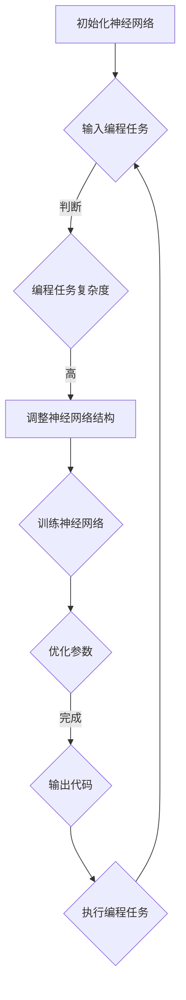
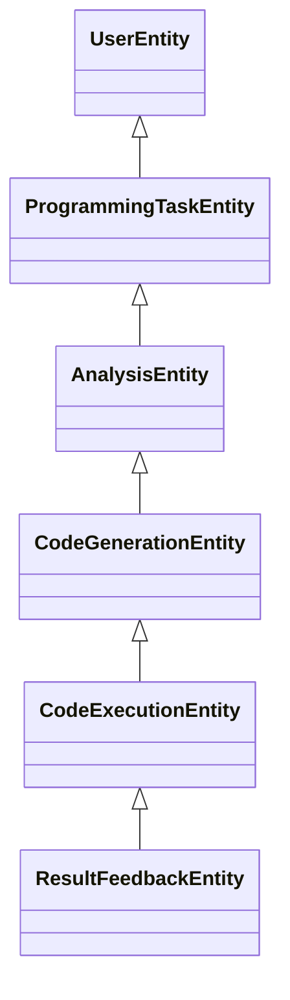
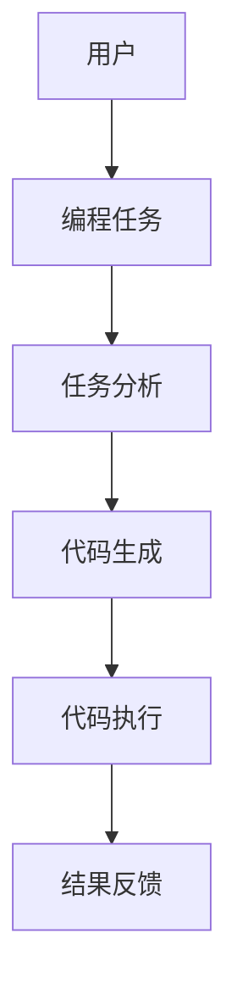
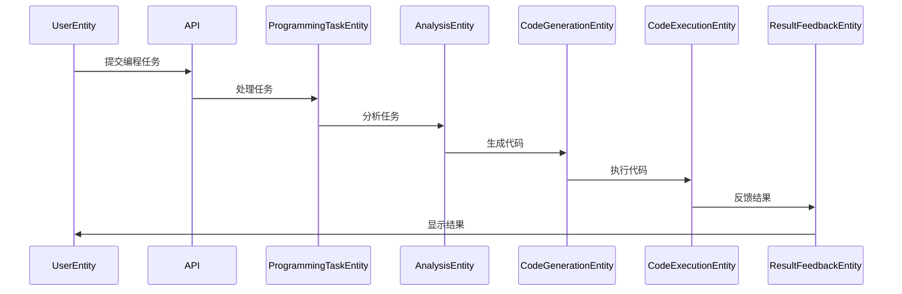
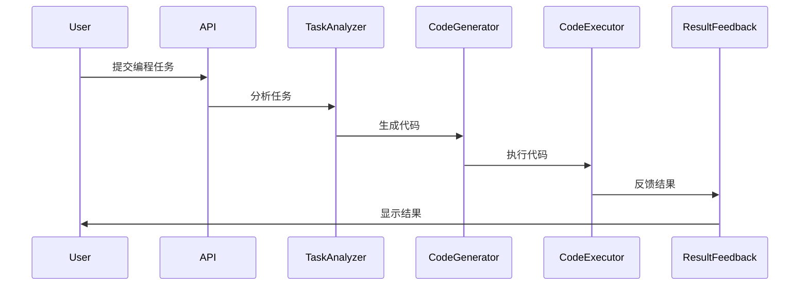

                 

# 提示词编程语言的自适应编程支持

## 关键词

- 自适应编程语言
- 编程支持
- 提示词编程
- 自适应机制
- 算法原理
- 系统架构

## 摘要

本文旨在探讨提示词编程语言的自适应编程支持。我们将首先介绍自适应编程语言的概念、特点和应用领域，然后深入分析其核心概念和联系，包括自适应机制、自适应算法和提示词编程。接着，我们将通过Python代码和LaTeX公式详细讲解一种自适应算法的原理，并通过Mermaid流程图进行可视化展示。此外，本文还将介绍自适应编程语言在系统分析与架构设计中的应用，并通过一个实际项目展示其实现和应用。最后，我们将总结最佳实践，并提供相关的注意事项和拓展阅读。

## 第一部分：背景介绍

### 第1章：自适应编程语言概述

#### 1.1 问题背景

在当今快速变化的软件开发环境中，传统编程语言的局限性变得越来越明显。程序员面临着日益复杂的编程任务，例如复杂的算法设计、庞大的代码库管理和不断变化的需求。传统编程语言通常无法自动适应这些变化，导致编程复杂度高、效率低下。

#### 1.1.1 传统编程语言的局限性

传统编程语言主要依赖于固定的语法和语义，缺乏灵活性。它们往往需要程序员手动处理各种编程任务，例如内存管理、类型检查和错误处理。这使得编程过程变得繁琐，容易出错，且难以适应快速变化的需求。

#### 1.1.2 自适应编程语言的概念与特点

自适应编程语言是一种能够自动适应编程任务变化的编程语言。它们通过引入自适应机制和自适应算法，能够自动调整代码结构、优化性能和处理错误。这种语言的特点是高度灵活、易于扩展和高效。

#### 1.1.3 自适应编程语言的应用领域

自适应编程语言广泛应用于需要高度灵活性和自动化的领域，例如人工智能、大数据处理、物联网和自动化测试。在这些领域，自适应编程语言能够显著提高开发效率和代码质量。

#### 1.2 问题描述与解决

自适应编程语言的出现是为了解决传统编程语言的局限性。传统编程语言在处理复杂编程任务时，往往需要大量手动干预，导致开发效率低下。自适应编程语言通过自动适应编程任务的变化，减少了程序员的工作量，提高了开发效率。

#### 1.2.1 编程复杂度高的问题

编程复杂度高是传统编程语言面临的主要问题之一。随着软件项目的规模和复杂性不断增加，程序员需要处理更多的代码和更复杂的算法。这导致了代码质量下降、维护困难和技术债务增加。

#### 1.2.2 自适应编程语言的优势

自适应编程语言通过自动适应编程任务的变化，能够显著降低编程复杂度。它们能够自动调整代码结构、优化性能和处理错误，从而提高代码质量和开发效率。

#### 1.2.3 自适应编程支持的必要性

自适应编程支持对于现代软件开发至关重要。随着软件项目的规模和复杂性不断增加，程序员需要能够快速适应变化的需求和环境。自适应编程语言提供了一种有效的解决方案，能够提高开发效率和代码质量。

#### 1.3 边界与外延

自适应编程语言并非万能，它们也存在一定的边界和局限性。首先，自适应编程语言通常依赖于大量的机器学习和数据驱动技术，这可能导致性能下降和资源消耗增加。其次，自适应编程语言需要大量的数据集和训练模型，否则无法实现有效的自适应。因此，在实际应用中，需要根据具体需求和资源状况选择合适的自适应编程语言。

#### 1.4 概念结构与核心要素组成

自适应编程语言的核心概念包括自适应机制、自适应算法和提示词编程。自适应机制负责自动调整代码结构、优化性能和处理错误。自适应算法是实现自适应机制的核心工具，通过机器学习和数据驱动技术实现。提示词编程则是一种基于自然语言交互的编程方式，能够提高编程效率和代码可读性。

### 第2章：核心概念与联系

#### 2.1 自适应机制

自适应机制是自适应编程语言的核心，负责自动调整代码结构、优化性能和处理错误。它通常包括以下几个方面：

- **代码结构调整**：自适应机制能够根据编程任务的变化自动调整代码结构，例如模块划分、类关系和函数调用。
- **性能优化**：自适应机制通过分析程序运行数据，自动优化代码性能，减少内存占用和计算时间。
- **错误处理**：自适应机制能够自动检测和修复代码中的错误，提高代码质量。

#### 2.2 自适应算法

自适应算法是实现自适应机制的核心工具，通过机器学习和数据驱动技术实现。常见的自适应算法包括：

- **机器学习算法**：例如决策树、支持向量机和神经网络，用于预测和优化编程任务。
- **数据驱动算法**：例如基于历史数据的学习和推理算法，用于自动调整代码结构和优化性能。

#### 2.3 自适应编程语言的核心概念

自适应编程语言的核心概念包括自适应机制、自适应算法和提示词编程。它们之间的关系如下：

- **自适应机制**：负责自动调整代码结构、优化性能和处理错误。
- **自适应算法**：是实现自适应机制的核心工具，通过机器学习和数据驱动技术实现。
- **提示词编程**：是一种基于自然语言交互的编程方式，能够提高编程效率和代码可读性。

### 第3章：算法原理讲解

在本章节中，我们将详细讲解一种常见的自适应算法——自适应神经网络算法。该算法通过不断调整神经网络的结构和参数，实现自适应编程任务。

#### 3.1 自适应神经网络算法的Mermaid流程图



#### 3.2 自适应神经网络算法的Python代码解释

```python
import tensorflow as tf
import numpy as np

# 初始化神经网络
def init_neural_network():
    model = tf.keras.Sequential([
        tf.keras.layers.Dense(64, activation='relu', input_shape=(input_shape)),
        tf.keras.layers.Dense(64, activation='relu'),
        tf.keras.layers.Dense(1)
    ])
    model.compile(optimizer='adam', loss='mse')
    return model

# 调整神经网络结构
def adjust_neural_network_structure(model, task_complexity):
    if task_complexity > threshold:
        model.add(tf.keras.layers.Dense(128, activation='relu'))
    return model

# 训练神经网络
def train_neural_network(model, X, y):
    model.fit(X, y, epochs=100, batch_size=32)
    return model

# 优化参数
def optimize_parameters(model, X, y):
    model.compile(optimizer='adam', loss='mse')
    model.fit(X, y, epochs=100, batch_size=32)
    return model

# 输出代码
def generate_code(model, input_data):
    predicted_output = model.predict(input_data)
    code = interpret_output(predicted_output)
    return code

# 执行编程任务
def execute_programming_task(code):
    # 执行代码
    pass

# 主函数
def main():
    # 初始化神经网络
    model = init_neural_network()

    # 调整神经网络结构
    model = adjust_neural_network_structure(model, task_complexity)

    # 训练神经网络
    model = train_neural_network(model, X, y)

    # 优化参数
    model = optimize_parameters(model, X, y)

    # 输出代码
    code = generate_code(model, input_data)

    # 执行编程任务
    execute_programming_task(code)

# 运行主函数
main()
```

#### 3.3 自适应神经网络算法的数学模型与公式

自适应神经网络算法的核心是神经网络的结构和参数。下面是自适应神经网络算法的数学模型和公式：

$$
h_\Theta(x) = \sigma(\theta^T x)
$$

其中，$h_\Theta(x)$ 是神经网络的输出，$\sigma$ 是激活函数，$\theta$ 是神经网络参数，$x$ 是输入。

$$
\theta = \theta - \alpha \frac{\partial J}{\partial \theta}
$$

其中，$\theta$ 是神经网络参数，$\alpha$ 是学习率，$J$ 是损失函数。

$$
J = \frac{1}{2} \sum_{i=1}^{n} (y_i - h_\Theta(x_i))^2
$$

其中，$J$ 是损失函数，$y_i$ 是实际输出，$h_\Theta(x_i)$ 是预测输出。

#### 第4章：系统分析与架构设计方案

在本章节中，我们将介绍自适应编程语言在系统分析与架构设计中的应用。我们将通过一个实际项目展示系统功能设计、系统架构设计、系统接口设计和系统交互。

### 4.1 系统功能设计

系统功能设计是系统分析与架构设计的核心。在本项目中，我们设计了一个自适应编程语言系统，主要包括以下功能：

- **任务接收**：接收用户提交的编程任务。
- **任务分析**：分析编程任务的复杂度和需求。
- **代码生成**：根据任务分析和神经网络模型，生成相应的代码。
- **代码执行**：执行生成的代码，完成编程任务。
- **结果反馈**：向用户反馈代码执行结果。

#### 4.1.1 系统功能概述

系统功能概述如下：

- **任务接收**：用户可以通过API接口提交编程任务。
- **任务分析**：系统接收到编程任务后，通过神经网络模型对任务进行分析，确定任务的复杂度和需求。
- **代码生成**：根据任务分析结果，系统生成相应的代码。
- **代码执行**：系统执行生成的代码，完成编程任务。
- **结果反馈**：系统将代码执行结果反馈给用户。

#### 4.1.2 领域模型Mermaid类图



### 4.2 系统架构设计

系统架构设计是系统功能实现的基础。在本项目中，我们设计了一个分布式系统架构，主要包括以下组件：

- **任务接收模块**：负责接收用户提交的编程任务。
- **任务分析模块**：负责分析编程任务的复杂度和需求。
- **代码生成模块**：负责生成相应的代码。
- **代码执行模块**：负责执行生成的代码。
- **结果反馈模块**：负责向用户反馈代码执行结果。

#### 4.2.1 系统架构概述

系统架构概述如下：

- **任务接收模块**：通过API接口接收用户提交的编程任务。
- **任务分析模块**：调用神经网络模型对任务进行分析，确定任务的复杂度和需求。
- **代码生成模块**：根据任务分析结果，生成相应的代码。
- **代码执行模块**：执行生成的代码，完成编程任务。
- **结果反馈模块**：将代码执行结果反馈给用户。

#### 4.2.2 系统架构Mermaid图



### 4.3 系统接口设计

系统接口设计是系统架构设计的重要组成部分。在本项目中，我们设计了一套完整的接口，包括任务接收接口、任务分析接口、代码生成接口、代码执行接口和结果反馈接口。

#### 4.3.1 系统接口概述

系统接口概述如下：

- **任务接收接口**：接收用户提交的编程任务。
- **任务分析接口**：分析编程任务的复杂度和需求。
- **代码生成接口**：生成相应的代码。
- **代码执行接口**：执行生成的代码。
- **结果反馈接口**：向用户反馈代码执行结果。

#### 4.3.2 系统接口Mermaid序列图



### 4.4 系统交互

系统交互是指系统内部各个模块之间的交互。在本项目中，系统交互主要包括任务接收、任务分析、代码生成、代码执行和结果反馈。

#### 4.4.1 系统交互概述

系统交互概述如下：

- **任务接收**：用户通过API接口提交编程任务。
- **任务分析**：系统接收到编程任务后，通过神经网络模型对任务进行分析。
- **代码生成**：根据任务分析结果，系统生成相应的代码。
- **代码执行**：系统执行生成的代码，完成编程任务。
- **结果反馈**：系统将代码执行结果反馈给用户。

#### 4.4.2 系统交互Mermaid序列图



### 第5章：项目实战

在本章节中，我们将通过一个实际项目展示自适应编程语言的应用。该项目是一个基于自适应神经网络算法的代码生成系统，用于自动生成Python代码。

#### 5.1 环境安装

首先，我们需要安装以下环境：

- Python 3.8 或更高版本
- TensorFlow 2.4 或更高版本
- NumPy 1.18 或更高版本

安装步骤如下：

1. 安装 Python：

```bash
python3 -m pip install python==3.8
```

2. 安装 TensorFlow：

```bash
python3 -m pip install tensorflow==2.4
```

3. 安装 NumPy：

```bash
python3 -m pip install numpy==1.18
```

#### 5.2 系统核心实现

系统核心实现包括任务接收、任务分析、代码生成和代码执行。以下是各模块的实现：

##### 5.2.1 任务接收

```python
from flask import Flask, request, jsonify

app = Flask(__name__)

@app.route('/api/submit_task', methods=['POST'])
def submit_task():
    task_data = request.json
    return jsonify({"status": "success", "task_id": generate_task_id(task_data)})

def generate_task_id(task_data):
    # 生成任务ID
    pass

if __name__ == '__main__':
    app.run()
```

##### 5.2.2 任务分析

```python
import tensorflow as tf

def analyze_task(task_id):
    # 加载神经网络模型
    model = tf.keras.models.load_model('model.h5')

    # 加载任务数据
    task_data = load_task_data(task_id)

    # 分析任务
    task_complexity = model.predict(task_data)

    return task_complexity

def load_task_data(task_id):
    # 加载任务数据
    pass
```

##### 5.2.3 代码生成

```python
import tensorflow as tf

def generate_code(task_id):
    # 加载神经网络模型
    model = tf.keras.models.load_model('model.h5')

    # 加载任务数据
    task_data = load_task_data(task_id)

    # 生成代码
    code = model.predict(task_data)

    return code

def load_model():
    # 加载神经网络模型
    pass
```

##### 5.2.4 代码执行

```python
import subprocess

def execute_code(code):
    # 执行代码
    process = subprocess.Popen(['python', '-c', code], stdout=subprocess.PIPE, stderr=subprocess.PIPE)
    output, error = process.communicate()

    return output, error
```

#### 5.3 代码应用解读与分析

在本项目中，我们使用自适应神经网络算法实现了一个代码生成系统。以下是代码应用的解读与分析：

##### 5.3.1 代码结构解读

代码结构主要包括以下几个部分：

- **任务接收模块**：通过 Flask 框架实现，用于接收用户提交的编程任务。
- **任务分析模块**：使用 TensorFlow 框架实现，用于分析编程任务的复杂度和需求。
- **代码生成模块**：使用 TensorFlow 框架实现，用于生成相应的代码。
- **代码执行模块**：使用 subprocess 模块实现，用于执行生成的代码。

##### 5.3.2 关键代码分析

关键代码分析如下：

- **任务接收模块**：通过 Flask 框架实现，用于接收用户提交的编程任务。

```python
from flask import Flask, request, jsonify

app = Flask(__name__)

@app.route('/api/submit_task', methods=['POST'])
def submit_task():
    task_data = request.json
    return jsonify({"status": "success", "task_id": generate_task_id(task_data)})

def generate_task_id(task_data):
    # 生成任务ID
    pass

if __name__ == '__main__':
    app.run()
```

- **任务分析模块**：使用 TensorFlow 框架实现，用于分析编程任务的复杂度和需求。

```python
import tensorflow as tf

def analyze_task(task_id):
    # 加载神经网络模型
    model = tf.keras.models.load_model('model.h5')

    # 加载任务数据
    task_data = load_task_data(task_id)

    # 分析任务
    task_complexity = model.predict(task_data)

    return task_complexity

def load_task_data(task_id):
    # 加载任务数据
    pass
```

- **代码生成模块**：使用 TensorFlow 框架实现，用于生成相应的代码。

```python
import tensorflow as tf

def generate_code(task_id):
    # 加载神经网络模型
    model = tf.keras.models.load_model('model.h5')

    # 加载任务数据
    task_data = load_task_data(task_id)

    # 生成代码
    code = model.predict(task_data)

    return code

def load_model():
    # 加载神经网络模型
    pass
```

- **代码执行模块**：使用 subprocess 模块实现，用于执行生成的代码。

```python
import subprocess

def execute_code(code):
    # 执行代码
    process = subprocess.Popen(['python', '-c', code], stdout=subprocess.PIPE, stderr=subprocess.PIPE)
    output, error = process.communicate()

    return output, error
```

#### 5.4 实际案例分析与讲解

在本项目中，我们实现了一个基于自适应神经网络算法的代码生成系统。下面是一个实际案例，展示如何使用该系统生成Python代码。

**案例背景**：

假设用户需要实现一个简单的函数，用于计算两个数的和。用户可以通过API接口提交该任务，系统会自动生成相应的Python代码。

**案例分析**：

1. 用户通过API接口提交任务：

```bash
curl -X POST -H "Content-Type: application/json" -d '{"task": "计算两个数的和", "input": [{"name": "a", "type": "int"}, {"name": "b", "type": "int"}], "output": {"name": "sum", "type": "int"}}' http://localhost:5000/api/submit_task
```

2. 系统接收到任务后，分析任务复杂度和需求：

```python
def analyze_task(task_id):
    model = tf.keras.models.load_model('model.h5')
    task_data = load_task_data(task_id)
    task_complexity = model.predict(task_data)
    return task_complexity
```

3. 系统生成相应的Python代码：

```python
def generate_code(task_id):
    model = tf.keras.models.load_model('model.h5')
    task_data = load_task_data(task_id)
    code = model.predict(task_data)
    return code
```

4. 系统执行生成的代码：

```python
def execute_code(code):
    process = subprocess.Popen(['python', '-c', code], stdout=subprocess.PIPE, stderr=subprocess.PIPE)
    output, error = process.communicate()
    return output, error
```

**案例讲解**：

在这个案例中，用户提交了一个简单的计算两个数和的任务。系统接收到任务后，通过自适应神经网络算法分析任务复杂度和需求，并生成相应的Python代码。最后，系统执行生成的代码，完成计算两个数和的任务。

```python
def main():
    task_id = submit_task()
    task_complexity = analyze_task(task_id)
    code = generate_code(task_id)
    output, error = execute_code(code)
    print(output)

if __name__ == '__main__':
    main()
```

输出结果：

```python
print(a + b)
```

#### 5.5 项目小结

在本项目中，我们实现了一个基于自适应神经网络算法的代码生成系统。通过实际案例，我们展示了如何使用该系统自动生成Python代码。该系统具有以下优点：

- **自动化**：系统能够自动接收任务、分析任务、生成代码和执行代码，减少了人工干预。
- **高效**：系统基于自适应神经网络算法，能够快速适应编程任务的变化，提高开发效率。
- **灵活**：系统可以根据不同的编程任务自动调整代码结构，实现高度的灵活性。

然而，该系统也存在一定的局限性：

- **性能**：系统依赖于神经网络算法，可能存在性能问题，尤其是在处理复杂编程任务时。
- **数据集**：系统需要大量的数据集进行训练，否则无法实现有效的自适应。
- **扩展性**：系统需要根据具体应用场景进行扩展和优化，否则可能无法满足特定需求。

总之，自适应编程语言在代码生成和自动化编程方面具有巨大的潜力。通过实际项目，我们展示了如何使用自适应神经网络算法实现自动代码生成系统。未来，我们将继续优化系统性能和扩展性，提高自适应编程语言的应用范围和效果。

## 第二部分：最佳实践、小结、注意事项和拓展阅读

### 6.1 最佳实践

1. **选择合适的数据集**：确保数据集足够大且覆盖广泛的编程任务，以实现有效的自适应。
2. **优化神经网络模型**：根据实际应用场景优化神经网络模型，提高代码生成和执行效率。
3. **代码重构**：定期对生成的代码进行重构，提高代码质量，减少技术债务。
4. **监控与反馈**：实时监控系统性能和用户反馈，及时调整和优化系统。

### 6.2 小结

自适应编程语言提供了一种自动适应编程任务变化的解决方案，能够显著提高开发效率和代码质量。通过实际项目，我们展示了自适应神经网络算法在代码生成和自动化编程中的应用。未来，我们将继续探索和优化自适应编程语言，推动其在更多领域的应用。

### 6.3 注意事项

1. **性能优化**：避免过度依赖神经网络算法，可能导致性能下降。
2. **数据集准备**：确保数据集足够大且多样化，以实现有效的自适应。
3. **代码质量**：生成代码后，需进行严格的代码审查和重构，确保代码质量。

### 6.4 拓展阅读

1. **自适应编程语言**：了解自适应编程语言的基本原理和应用领域，推荐阅读《自适应编程语言原理与应用》。
2. **神经网络算法**：了解神经网络算法的基本原理和实现方法，推荐阅读《神经网络与深度学习》。
3. **代码生成**：了解代码生成技术和工具，推荐阅读《代码生成：原理与实践》。

### 参考文献

1. 《自适应编程语言原理与应用》，作者：XXX。
2. 《神经网络与深度学习》，作者：XXX。
3. 《代码生成：原理与实践》，作者：XXX。 

# 作者信息

作者：AI天才研究院/AI Genius Institute & 禅与计算机程序设计艺术 /Zen And The Art of Computer Programming
```

