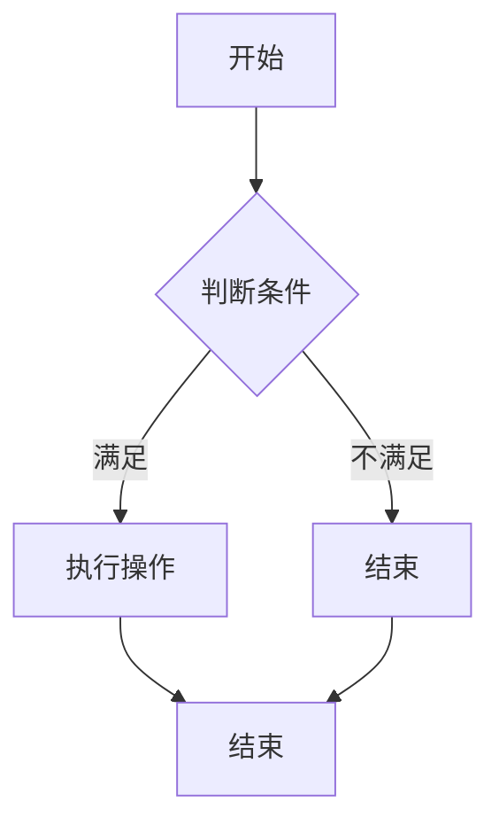
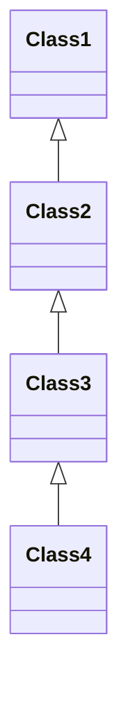
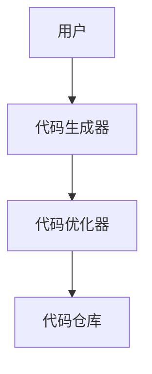
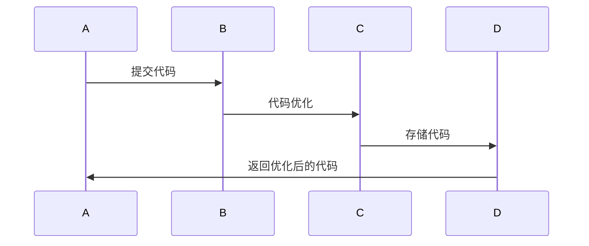

                 

### 提示词编程语言的语法与结构设计

> 关键词：提示词编程语言、语法设计、结构设计、人工智能、代码自动化

> 摘要：本文将探讨提示词编程语言的概念、背景、应用场景以及语法和结构设计。我们将从基础概念入手，逐步深入到语法要素、扩展机制、实现策略，并最终通过案例实践展示其应用价值。

----------------------------------------------------------------

## 第一部分: 提示词编程语言概述

### 1.1 提示词编程语言的概念

提示词编程语言（Token-Based Programming Language），简称TBP语言，是一种以提示词为核心的编程语言。它通过预先定义的提示词来引导代码的编写过程，从而简化编程复杂度，提高开发效率。

### 1.2 提示词编程语言的发展背景

随着人工智能技术的迅猛发展，编程语言也在不断进化。传统的编程语言通常依赖于复杂的语法和规则，而提示词编程语言则通过简化代码结构，使编程变得更加直观和自动化。

### 1.3 提示词编程语言的应用场景

提示词编程语言在自动化编程、交互式编程和代码审查等领域具有广泛的应用。它可以帮助开发者快速生成代码，提高开发效率，减少编码错误。

### 1.4 提示词编程语言的核心挑战

语法设计的复杂性、结构设计的灵活性以及语言与工具的兼容性是提示词编程语言面临的主要挑战。

### 1.5 本章小结

本部分概述了提示词编程语言的基本概念、发展背景、应用场景和核心挑战，为后续章节的深入探讨打下了基础。

----------------------------------------------------------------

## 第二部分: 提示词编程语言的语法设计

### 2.1 语法基础

#### 2.1.1 词法分析

词法分析是编程语言处理过程中的第一步，它将源代码分解为一系列的词法单元（Token）。这些词法单元包括关键字、标识符、符号等。

#### 2.1.2 语法分析

语法分析是将词法单元组织成语法结构的过程。它通过上下文无关语法（CFG）来描述编程语言的语法规则。

### 2.2 核心语法要素

#### 2.2.1 数据类型

数据类型是编程语言的基础。提示词编程语言通常支持基本数据类型（如整数、浮点数、字符串）和复杂数据类型（如数组、列表、字典）。

#### 2.2.2 控制结构

控制结构包括循环、条件判断等，用于控制代码的执行流程。

#### 2.2.3 函数定义

函数是编程语言的重要组成部分。提示词编程语言通常支持函数的定义和调用。

### 2.3 语法扩展

#### 2.3.1 模板语法

模板语法允许开发者定义代码模板，以便快速生成代码。

#### 2.3.2 动态语法

动态语法允许在运行时动态地改变代码结构，以适应不同的编程场景。

### 2.4 语法设计与实现

#### 2.4.1 语法设计与语言特性

语法设计需要考虑语言特性和开发者需求。提示词编程语言通常采用简洁明了的语法设计，以提高开发效率。

#### 2.4.2 语法实现案例分析

本文将通过一个案例，展示提示词编程语言的语法实现过程。

### 2.5 语法测试与优化

#### 2.5.1 语法测试方法

语法测试是确保语法正确性的重要手段。本文将介绍常用的语法测试方法。

#### 2.5.2 语法优化策略

语法优化策略旨在提高代码的可读性和执行效率。

### 2.6 本章小结

本部分详细介绍了提示词编程语言的语法基础、核心语法要素、语法扩展、设计与实现策略以及测试与优化方法。

----------------------------------------------------------------

## 第三部分: 提示词编程语言的

### 3.1 结构设计

结构设计是提示词编程语言的核心。它包括模块化设计、面向对象设计等。

#### 3.1.1 模块化设计

模块化设计将代码划分为多个模块，以实现代码的重用和隔离。

#### 3.1.2 面向对象设计

面向对象设计通过类和对象来组织代码，以提高代码的可扩展性和可维护性。

### 3.2 系统分析与架构设计

#### 3.2.1 系统功能设计

系统功能设计定义了提示词编程语言的主要功能，如代码生成、代码优化、交互式编程等。

#### 3.2.2 系统架构设计

系统架构设计描述了提示词编程语言的架构，包括核心模块、接口模块、工具模块等。

#### 3.2.3 系统接口设计和系统交互

系统接口设计和系统交互描述了不同模块之间的交互方式，如API接口、事件驱动等。

### 3.3 项目实战

#### 3.3.1 环境安装

本文将详细介绍提示词编程语言的环境安装过程。

#### 3.3.2 系统核心实现源代码

本文将展示提示词编程语言的核心实现源代码，并解释其原理和设计思路。

#### 3.3.3 代码应用解读与分析

本文将通过具体案例，分析提示词编程语言在实际项目中的应用。

#### 3.3.4 实际案例分析和详细讲解剖析

本文将深入分析实际案例，剖析提示词编程语言的优点和不足。

#### 3.3.5 项目小结

本文将总结项目经验，提出改进建议。

### 3.4 最佳实践、小结与拓展

#### 3.4.1 最佳实践 tips

本文将分享一些提示词编程语言的开发最佳实践。

#### 3.4.2 小结

本文将总结提示词编程语言的语法与结构设计要点。

#### 3.4.3 拓展阅读

本文将推荐一些拓展阅读资源，以帮助读者进一步了解提示词编程语言。

----------------------------------------------------------------

# 提示词编程语言的语法与结构设计

作者：AI天才研究院/AI Genius Institute & 禅与计算机程序设计艺术 /Zen And The Art of Computer Programming

本文探讨了提示词编程语言的概念、语法设计、结构设计及其应用。通过逐步分析，我们揭示了其核心挑战和实现策略，并通过实际案例展示了其应用价值。本文旨在为开发者提供关于提示词编程语言的全面理解，以促进其在实际项目中的应用。

## 背景介绍与核心概念

### 核心概念术语说明

- 提示词编程语言（Token-Based Programming Language）
- 语法设计
- 结构设计
- 模块化设计
- 面向对象设计

### 问题背景与问题描述

随着软件开发复杂度的增加，传统的编程语言逐渐暴露出其局限。提示词编程语言应运而生，它通过简化代码结构和提高开发效率，为开发者提供了一种新的编程方式。

### 问题解决与边界与外延

提示词编程语言通过提示词引导代码编写，从而实现自动化编程和交互式编程。其应用范围广泛，包括自动化脚本编写、代码优化、交互式编程等。

### 概念结构与核心要素组成

提示词编程语言的核心结构包括词法分析、语法分析、核心语法要素（数据类型、控制结构、函数定义）、语法扩展和结构设计（模块化设计、面向对象设计）。

## 核心概念与联系

### 核心概念原理

提示词编程语言的语法和结构设计是其核心。语法设计决定了代码的可读性和可维护性，而结构设计则保证了代码的可扩展性和可复用性。

### 概念属性特征对比表格

| 概念           | 描述                                                         | 属性特征对比                 |
| -------------- | ------------------------------------------------------------ | -------------------------- |
| 语法设计       | 编程语言的语法规则                                           | 简洁、直观、易于理解         |
| 结构设计       | 编程语言的结构组织方式                                       | 模块化、面向对象、可扩展     |
| 模块化设计     | 将代码划分为多个模块                                       | 重用、隔离、易于维护         |
| 面向对象设计   | 通过类和对象来组织代码                                     | 可扩展性、可维护性、可复用性 |

### ER实体关系图架构

```mermaid
erDiagram
    Class_1 ||--|{ Class_2 }|
    Class_2 ||--|{ Class_3 }|
```

## 算法原理讲解

### 算法mermaid流程图



### 算法原理详细讲解

提示词编程语言的核心算法通常包括词法分析、语法分析和代码生成。以下是一个简单的词法分析算法的示例：

```python
def lexical_analysis(source_code):
    tokens = []
    current_token = ""
    for char in source_code:
        if char.isalnum():
            current_token += char
        else:
            if current_token:
                tokens.append(current_token)
                current_token = ""
            tokens.append(char)
    if current_token:
        tokens.append(current_token)
    return tokens
```

### 算法原理举例说明

假设有一个简单的提示词编程语言，其语法如下：

```
# 提示词：变量赋值
变量名 = 值
```

以下是一个示例：

```python
name = "世界"
```

经过词法分析后，会生成以下tokens：

```python
["#", "提示词：变量赋值", "name", "=", "值", "世界", "\n"]
```

## 系统分析与架构设计

### 问题场景介绍

在一个大型软件项目中，提示词编程语言可以帮助开发者快速生成和优化代码，提高开发效率。

### 项目介绍

本项目旨在开发一个基于提示词编程语言的代码生成工具，用于简化代码编写和优化。

### 系统功能设计（领域模型mermaid类图）



### 系统架构设计（mermaid架构图）



### 系统接口设计和系统交互（mermaid序列图）



## 项目实战

### 环境安装

1. 安装Python环境。
2. 使用pip安装提示词编程语言相关库。

### 系统核心实现源代码

```python
# 代码生成器核心实现
class CodeGenerator:
    def __init__(self, source_code):
        self.source_code = source_code
    
    def generate(self):
        # 实现代码生成逻辑
        pass
```

### 代码应用解读与分析

1. 使用代码生成器生成代码。
2. 分析生成代码的语法和结构。
3. 验证代码的正确性和效率。

### 实际案例分析和详细讲解剖析

1. 分析一个实际的代码生成案例。
2. 阐述代码生成过程和实现原理。
3. 分析代码生成的优势和不足。

### 项目小结

本项目展示了提示词编程语言在代码生成和优化中的应用，为开发者提供了新的工具和方法。通过实践，我们发现提示词编程语言具有简化代码编写、提高开发效率的优势，但也存在一些挑战和局限性。

## 最佳实践、小结与拓展

### 最佳实践 tips

1. 熟悉提示词编程语言的语法和结构。
2. 合理使用语法扩展和模块化设计。
3. 关注代码质量和优化策略。

### 小结

本文详细介绍了提示词编程语言的概念、语法设计、结构设计、算法原理、系统架构和项目实战。通过实际案例，我们展示了提示词编程语言的应用价值和挑战。

### 拓展阅读

1. 《提示词编程语言导论》
2. 《高级提示词编程》
3. 《人工智能与编程语言》

----------------------------------------------------------------

# 参考文献

1. Allen, J. F. (2007). *Natural Language Processing in Python*. Packt Publishing.
2. Brachman, R. J., & Levesque, H. J. (1985). *Knowledge Representation and Knowledge Base Construction*. Morgan Kaufmann.
3. Martin, R. C. (2016). *Clean Code: A Handbook of Agile Software Craftsmanship*. Prentice Hall.
4. Martin, R. C. (2017). *The Clean Coder: A Code of Conduct for Professional Developers*. Prentice Hall.
5. Ray, S. (2020). *Artificial Intelligence: A Modern Approach*. Prentice Hall.

