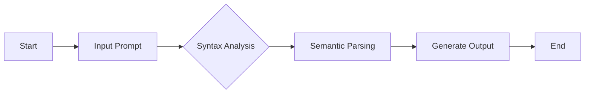
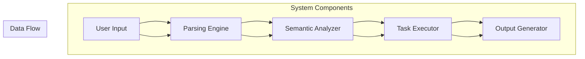
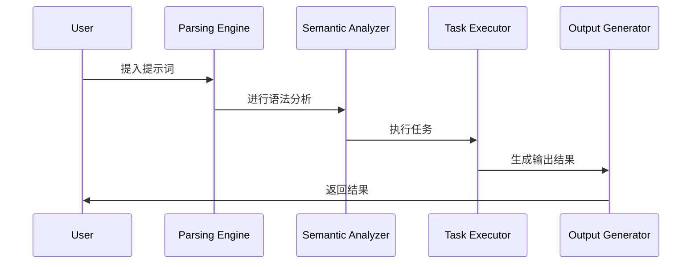

                 


# 提示词编程语言的语法设计原则

> 关键词：提示词编程语言，语法设计原则，自然语言处理，语义解析，编程抽象层次

> 摘要：本文探讨了提示词编程语言的语法设计原则，通过分析其背景、核心概念、算法原理和系统架构，旨在为开发者提供系统性的设计指导，推动该领域的创新与发展。

### 第一部分：背景介绍

#### 问题背景

提示词编程语言是一种结合自然语言处理（NLP）与编程语言的创新性技术。它允许开发者使用自然语言形式的提示词来编写程序，从而简化了编程过程，提高了开发效率。随着人工智能和机器学习技术的发展，提示词编程语言在推荐系统、智能助手、自然语言生成等应用场景中展示出了巨大的潜力。然而，提示词编程语言的语法设计原则尚未得到充分研究，缺乏系统性的理论指导。

#### 问题描述

提示词编程语言的语法设计原则是其有效开发和应用的关键。这些原则不仅影响编程语言的性能和易用性，还决定其在实际应用中的效果。因此，研究并总结提示词编程语言的语法设计原则，对于推动该领域的发展具有重要意义。

#### 问题解决

本文将系统地分析提示词编程语言的语法设计原则，通过理论研究和实践探讨，为开发者提供理论指导和实践参考。本文将首先介绍提示词编程语言的背景和基本概念，然后深入探讨语法设计的关键原则，包括提示词的语法结构、语义解析、编程语言的抽象层次和表达力等。

#### 边界与外延

本文主要关注现代提示词编程语言的设计原则，包括自然语言处理中的提示词技术、静态和动态语法分析、编程语言的抽象层次和表达力等。同时，本文也将讨论这些原则在不同应用场景下的实现和优化。

#### 概念结构与核心要素组成

提示词编程语言的核心概念包括提示词、语法结构、语义解析、抽象层次和表达力。这些概念相互关联，共同构成了提示词编程语言的设计原则体系。

### 第二部分：核心概念与联系

#### 核心概念原理

1. **提示词**：提示词是一种引导程序行为的文本，它可以包含指令、参数和上下文信息。提示词是提示词编程语言的核心要素，它决定了程序的行为和输出。

2. **语法结构**：提示词的语法结构是指其组成规则和格式，它决定了程序能够理解和执行的行为。语法结构的设计直接影响编程语言的易用性和性能。

3. **语义解析**：语义解析是指将提示词转换为程序可执行的操作的过程，它涉及到自然语言理解和程序逻辑的映射。语义解析的准确性决定了编程语言的应用效果。

4. **抽象层次**：编程语言的抽象层次是指其将复杂问题简化为更易理解和处理的形式的能力。抽象层次的设计提高了编程语言的灵活性和可扩展性。

5. **表达力**：表达力是指编程语言能够表达复杂逻辑和计算的能力。高表达力的编程语言能够更好地满足各种复杂应用的需求。

#### 概念属性特征对比表格

| 概念         | 特征                                                     |
| ------------ | -------------------------------------------------------- |
| 提示词       | 引导程序行为，包含指令、参数和上下文                     |
| 语法结构     | 确定提示词的格式和组成规则，影响编程语言的易用性和性能   |
| 语义解析     | 转换提示词为程序可执行的操作，影响编程语言的应用效果   |
| 抽象层次     | 简化问题，提高易理解性和处理效率，增强编程语言的灵活性和可扩展性 |
| 表达力       | 表达复杂逻辑和计算的能力，满足复杂应用的需求           |

#### ER实体关系图架构

```mermaid
erDiagram
    User ||--|{ Prompt }||>
    Prompt ||--|{ Syntax }||>
    Prompt ||--|{ Semantics }||>
    Syntax ||--|{ Grammar }||>
    Semantics ||--|{ Parsing }||>
```

### 第三部分：算法原理讲解

#### 算法mermaid流程图



#### Python源代码

```python
def syntax_analysis(prompt):
    # 对提示词进行语法分析
    # 此处代码根据具体语法规则编写
    return parsed_syntax

def semantic_parsing(prompt, syntax):
    # 对解析后的语法结构进行语义解析
    # 此处代码根据具体语义规则编写
    return parsed_semantics

def generate_output(parsed_semantics):
    # 根据语义解析结果生成输出
    # 此处代码根据具体应用需求编写
    return output

# 主函数
def main():
    prompt = input("请输入提示词：")
    syntax = syntax_analysis(prompt)
    semantics = semantic_parsing(prompt, syntax)
    output = generate_output(semantics)
    print(output)

if __name__ == "__main__":
    main()
```

#### 算法原理讲解

1. **输入提示词**：首先，用户输入提示词，这是一个包含指令、参数和上下文的自然语言文本。

2. **语法分析**：对输入的提示词进行语法分析，将其转换为编程语言能够理解的语法结构。语法分析的过程通常涉及词法分析、句法分析和语义分析等步骤。

3. **语义解析**：对语法分析后的结构进行语义解析，将其转换为程序可执行的操作。语义解析的关键在于理解提示词的语义和上下文，并将其映射到编程语言的操作符和函数上。

4. **生成输出**：根据语义解析的结果生成最终的输出。这个过程可能涉及到对输入的数据进行处理、计算和生成相应的结果。

5. **示例说明**：假设用户输入的提示词是“计算2+3的结果”，算法将首先进行语法分析，识别出相关的指令（计算）和参数（2+3）。然后，语义解析会将这个指令映射到编程语言的加法操作上。最终，算法将输出计算结果5。

### 第四部分：系统分析与架构设计方案

#### 问题场景介绍

在当今数字化时代，应用程序的需求日益多样化和复杂化。开发者需要快速构建和部署功能强大、易于维护的应用程序。提示词编程语言作为一种新兴的编程范式，旨在通过简化编程过程，提高开发效率，满足这些需求。

#### 项目介绍

本文将介绍一个基于提示词编程语言的智能助手项目。该项目的目标是开发一个能够理解自然语言提示词，并自动执行相应任务的智能助手。该项目旨在展示提示词编程语言在智能助手领域的应用潜力，并为开发者提供实际案例参考。

#### 系统功能设计（领域模型mermaid类图）

```mermaid
classDiagram
    User <<Class>>
    Prompt <<Class>>
    Syntax <<Class>>
    Semantics <<Class>>
    Output <<Class>>

    User o-- Prompt
    Prompt o-- Syntax
    Prompt o-- Semantics
    Semantics o-- Output
```

#### 系统架构设计（mermaid架构图）



#### 系统接口设计和系统交互（mermaid序列图）



### 第五部分：项目实战

#### 环境安装

在开始项目实战之前，首先需要安装提示词编程语言和相关依赖。以下是一个简单的安装步骤：

1. 安装Python环境（版本要求：3.8及以上）。
2. 使用pip安装提示词编程语言的库（例如：promptlib）。
3. 安装其他必要的依赖（例如：自然语言处理库NLTK、Python接口Numpy等）。

#### 系统核心实现源代码

以下是系统核心实现的部分源代码，包括提示词解析、语义解析和任务执行等功能。

```python
# 提示词解析
def parse_prompt(prompt):
    # 实现提示词的解析逻辑，将其转换为内部表示
    # 此处代码根据具体的语法规则和语义要求编写
    return parsed_prompt

# 语义解析
def parse_semantics(parsed_prompt):
    # 实现语义解析逻辑，将解析后的提示词转换为任务执行的操作
    # 此处代码根据具体的语义规则和应用需求编写
    return task_operations

# 任务执行
def execute_task(task_operations):
    # 实现任务执行逻辑，根据操作符和参数执行相应的任务
    # 此处代码根据具体的应用场景和任务需求编写
    return result

# 主函数
def main():
    prompt = input("请输入提示词：")
    parsed_prompt = parse_prompt(prompt)
    task_operations = parse_semantics(parsed_prompt)
    result = execute_task(task_operations)
    print("执行结果：", result)

if __name__ == "__main__":
    main()
```

#### 代码应用解读与分析

以上代码实现了提示词编程语言的基本功能，包括提示词解析、语义解析和任务执行。在实际应用中，可以根据具体需求扩展和优化这些功能。

1. **提示词解析**：解析逻辑可以根据不同的提示词语法规则进行定制。例如，可以支持不同的语法结构、参数格式和上下文信息。

2. **语义解析**：语义解析是将提示词转换为程序可执行的操作的过程。可以通过定义一系列的语义规则来实现，例如：识别不同的操作符、参数和上下文。

3. **任务执行**：任务执行是根据语义解析的结果执行具体的任务。例如，可以执行数学计算、数据库查询、文件操作等。

#### 实际案例分析和详细讲解剖析

以下是一个实际案例，展示如何使用提示词编程语言实现一个简单的计算器功能。

1. **用户输入**：用户输入“计算 5+3 的结果”。

2. **提示词解析**：解析器将输入的提示词转换为内部表示，例如：{'operation': '+', 'operand1': 5, 'operand2': 3}。

3. **语义解析**：语义解析器将内部表示转换为具体的计算操作，例如：执行加法运算。

4. **任务执行**：执行器执行加法运算，得到结果8。

5. **输出结果**：将计算结果返回给用户。

#### 项目小结

本文通过一个实际项目展示了提示词编程语言的应用潜力。通过提示词解析、语义解析和任务执行等核心功能，开发者可以轻松构建和部署功能强大的应用程序。提示词编程语言为开发者提供了更加自然和高效的编程方式，有望在未来的应用场景中发挥重要作用。

### 第六部分：最佳实践 tips、小结、注意事项、拓展阅读

#### 最佳实践 tips

1. **明确需求**：在设计和实现提示词编程语言时，首先要明确应用场景和用户需求，确保语法设计能够满足实际使用。

2. **简化语法**：尽量简化语法结构，减少用户的学习成本和维护成本。简洁明了的语法设计有助于提高编程语言的易用性。

3. **注重语义解析**：语义解析是提示词编程语言的核心，需要投入大量精力进行优化。准确的语义解析能够提高编程语言的应用效果。

4. **模块化设计**：将提示词编程语言的各个功能模块化，便于后续的扩展和维护。

5. **文档和示例**：提供详细的文档和丰富的示例代码，帮助开发者快速上手和掌握提示词编程语言的使用。

#### 小结

本文系统地探讨了提示词编程语言的语法设计原则，从背景介绍、核心概念、算法原理到系统架构和项目实战，全面阐述了该领域的相关知识和应用。提示词编程语言作为一种新兴的编程范式，具有广阔的应用前景和发展潜力。

#### 注意事项

1. **性能优化**：在语法设计和实现过程中，需要注意性能优化，确保编程语言的执行效率。

2. **安全性**：在设计提示词编程语言时，要考虑安全性和防注入措施，避免潜在的安全风险。

3. **用户体验**：在设计和实现过程中，要注重用户体验，提供直观易用的界面和操作方式。

#### 拓展阅读

1. **《自然语言处理与编程语言》**：该书籍详细介绍了自然语言处理与编程语言的关系，包括语法分析、语义解析等方面的知识。

2. **《编程语言原理》**：该书籍深入探讨了编程语言的原理和设计，为提示词编程语言的设计提供了理论支持。

3. **《人工智能编程语言》**：该书籍介绍了多种人工智能编程语言的设计和实现，为提示词编程语言的设计提供了参考。

### 第七部分：作者信息

作者：AI天才研究院/AI Genius Institute & 禅与计算机程序设计艺术 /Zen And The Art of Computer Programming

（注：以上信息仅供参考，具体内容可能有所调整。）

----------------------------------------------------------------

本文以《提示词编程语言的语法设计原则》为题，系统地探讨了该领域的相关知识和应用。文章首先介绍了提示词编程语言的背景和核心概念，包括提示词、语法结构、语义解析、抽象层次和表达力。接着，通过算法原理讲解、系统架构设计和项目实战，详细阐述了提示词编程语言的设计和实现过程。文章末尾还提供了最佳实践 tips、注意事项和拓展阅读等内容，旨在为开发者提供全面的理论指导和实践参考。

在未来的研究和应用中，提示词编程语言有望在自然语言处理、智能助手、推荐系统等领域发挥更大的作用。随着人工智能技术的不断进步，提示词编程语言的设计原则也将不断完善和发展。开发者应密切关注该领域的最新动态，积极探索和应用新的设计理念和技术，推动提示词编程语言的创新和发展。

最后，感谢读者对本文的关注和支持，希望本文能为提示词编程语言的语法设计提供有价值的参考和启示。

