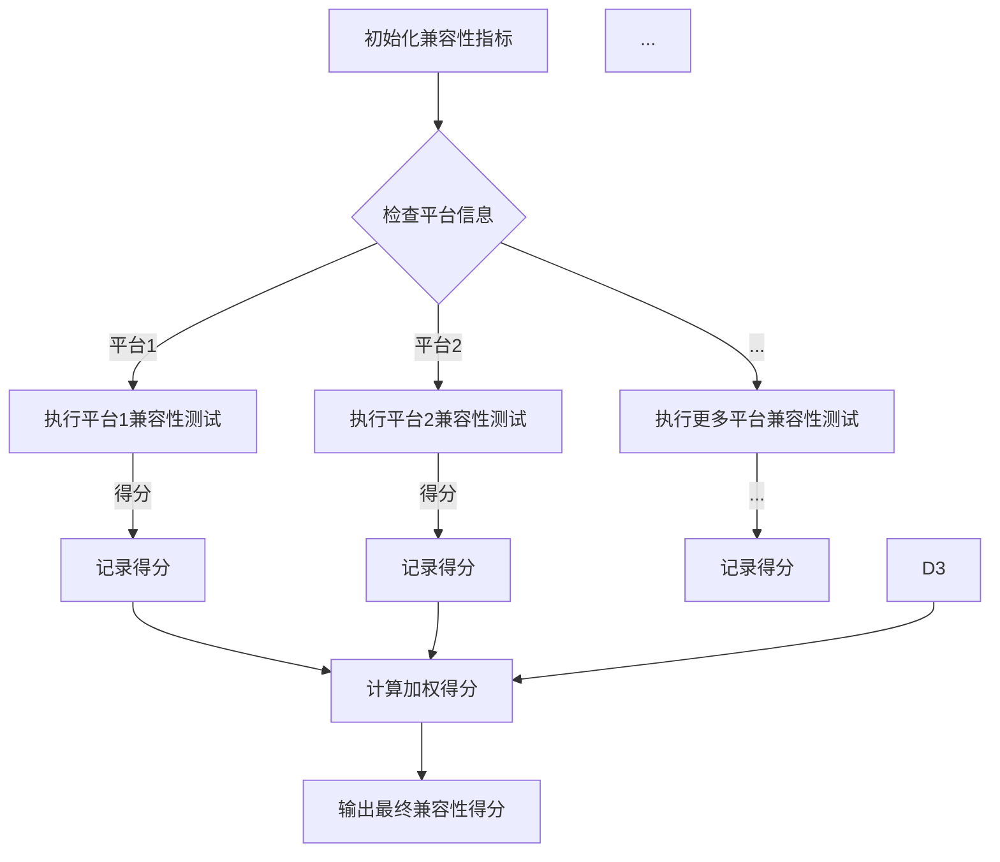
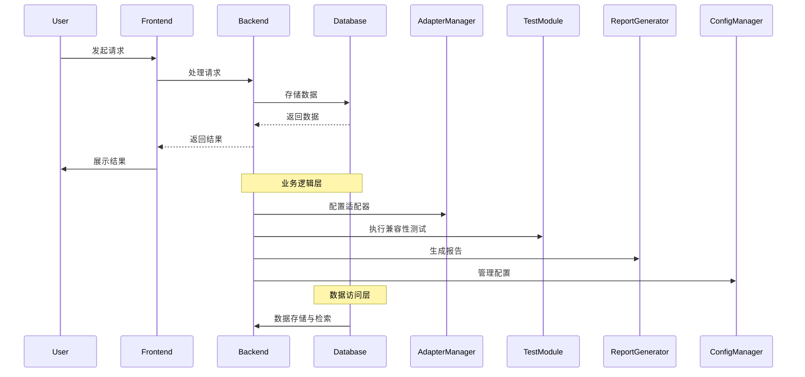
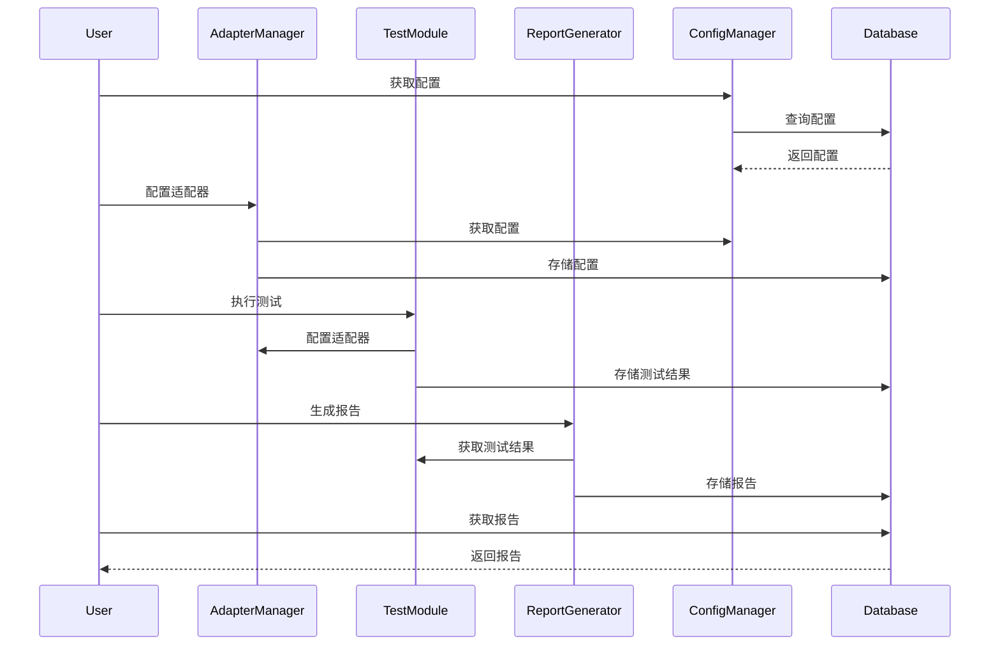

                 

### 提示词编程语言的跨平台兼容性

#### 关键词：编程语言、跨平台兼容性、提示词编程、算法原理、系统架构

> 摘要：本文旨在深入探讨提示词编程语言在跨平台兼容性方面的挑战与解决方案。通过分析跨平台兼容性的核心概念、提示词编程语言的特点及其在跨平台兼容性中的应用，本文提出了一系列算法原理和系统架构设计，为提升编程语言的跨平台兼容性提供了实用指导。文章结构清晰，内容丰富，旨在为读者提供全面而深入的技术见解。

---

### 目录大纲

#### 第一部分：引言与背景

1. **第1章：问题背景与意义**
   - **1.1.1 编程语言跨平台兼容性的重要性**
   - **1.1.2 当前编程语言跨平台兼容性面临的挑战**
   - **1.1.3 提示词编程语言的概念与特点**
   - **1.1.4 跨平台兼容性研究的历史与发展趋势**

2. **第2章：核心概念与联系**
   - **2.1 跨平台兼容性的核心概念**
     - **2.1.1 编程语言的平台特性**
     - **2.1.2 跨平台兼容性的评价指标**
     - **2.1.3 跨平台兼容性设计的关键技术**
   - **2.2 提示词编程语言的核心概念**
     - **2.2.1 提示词编程语言的基本原理**
     - **2.2.2 提示词编程语言的关键特性**
     - **2.2.3 提示词编程语言的优势与局限性**
   - **2.3 跨平台兼容性与提示词编程语言的联系**
     - **2.3.1 跨平台兼容性与提示词编程语言的交互**
     - **2.3.2 跨平台兼容性对提示词编程语言的要求**
     - **2.3.3 提示词编程语言在跨平台兼容性中的应用案例**

#### 第二部分：算法原理与设计

3. **第3章：跨平台兼容性算法原理**
   - **3.1 跨平台兼容性算法的数学模型**
     - **3.1.1 跨平台兼容性算法的基本概念**
     - **3.1.2 跨平台兼容性算法的数学模型**
     - **3.1.3 跨平台兼容性算法的Python源代码**
   - **3.2 跨平台兼容性算法的流程图**
     - **3.2.1 跨平台兼容性算法的Mermaid流程图**
     - **3.2.2 跨平台兼容性算法的Python流程图**
   - **3.3 跨平台兼容性算法的Python源代码**

#### 第三部分：系统架构与实现

4. **第4章：系统架构设计**
   - **4.1 系统功能设计**
     - **4.1.1 系统功能概述**
     - **4.1.2 系统领域模型Mermaid类图**
   - **4.2 系统架构设计**
     - **4.2.1 系统架构概述**
     - **4.2.2 系统架构Mermaid架构图**
   - **4.3 系统接口设计**
     - **4.3.1 系统接口概述**
     - **4.3.2 系统接口Mermaid序列图**

5. **第5章：项目实战**
   - **5.1 环境安装**
     - **5.1.1 环境要求**
     - **5.1.2 环境搭建步骤**
   - **5.2 系统核心实现源代码**
     - **5.2.1 核心功能实现代码**
     - **5.2.2 源代码解读与分析**
   - **5.3 实际案例分析与讲解**
     - **5.3.1 案例背景**
     - **5.3.2 案例分析与讲解**
   - **5.4 项目小结**
     - **5.4.1 项目总结**
     - **5.4.2 项目拓展与应用**

#### 第四部分：最佳实践与展望

6. **第6章：最佳实践**
   - **6.1 提高跨平台兼容性的最佳实践**
     - **6.1.1 编码规范与技巧**
     - **6.1.2 测试与调试策略**
     - **6.1.3 架构设计与优化**
   - **6.2 提示词编程语言的应用场景**
     - **6.2.1 面向Web的应用**
     - **6.2.2 移动端应用**
     - **6.2.3 物联网应用**

7. **第7章：未来展望与研究方向**
   - **7.1 跨平台兼容性的未来发展趋势**
     - **7.1.1 新型编程语言的设计与实现**
     - **7.1.2 自动化兼容性测试与优化**
   - **7.2 提示词编程语言的发展趋势**
     - **7.2.1 提示词编程语言的技术创新**
     - **7.2.2 提示词编程语言在教育领域的应用**

---

### 1.1.1 编程语言跨平台兼容性的重要性

编程语言的跨平台兼容性是现代软件开发中一个至关重要的概念。随着信息技术和互联网的快速发展，软件应用场景的多样化和复杂度不断增加，跨平台开发的需求日益凸显。跨平台兼容性不仅能够减少开发和维护成本，提高开发效率，还能够让用户在不同操作系统和设备上获得一致的使用体验。

首先，跨平台兼容性可以显著降低开发和维护成本。在不同的操作系统上开发相同的软件功能，需要重复编写和调整代码，这不仅耗时耗力，还容易出错。通过使用跨平台编程语言，开发者可以编写一次代码，然后在不同平台上运行，从而大大减少重复工作。

其次，跨平台兼容性提高了开发效率。在不同的平台上分别开发相同功能的软件，意味着需要投入更多的开发和测试资源。而通过跨平台开发，开发者可以将资源集中在少数几个核心平台上，从而加快开发进度，缩短产品上市时间。

最后，跨平台兼容性为用户提供了更加一致的使用体验。用户在使用软件时，不希望因为操作系统或设备的差异而遇到兼容性问题。跨平台兼容性确保了软件在不同平台上表现一致，提升了用户体验。

总的来说，编程语言的跨平台兼容性对于现代软件开发具有重要意义。它不仅能够降低开发和维护成本，提高开发效率，还能够为用户带来一致的使用体验，从而在市场竞争中占据优势。

### 1.1.2 当前编程语言跨平台兼容性面临的挑战

尽管跨平台兼容性在软件开发中具有重要意义，但实现这一目标并非易事。当前编程语言在跨平台兼容性方面面临诸多挑战，包括平台差异性、代码迁移问题、性能优化需求等。

首先，平台差异性是跨平台兼容性面临的最大挑战之一。不同的操作系统和设备具有不同的硬件和软件环境，包括处理器架构、操作系统内核、文件系统、网络协议等。这些差异会导致同一代码在不同平台上运行时可能出现兼容性问题。例如，某些操作系统特有的API在其他操作系统上可能不存在，或者同一函数在不同平台上的行为可能不一致。这些差异使得开发者必须对代码进行大量的调整和优化，以确保在不同平台上的一致性。

其次，代码迁移问题也是跨平台兼容性的一个重要挑战。在跨平台开发中，开发者需要将现有代码迁移到新的平台上。然而，不同平台之间存在诸多差异，例如编程语言语法、库函数、数据类型等，这些差异可能导致代码迁移过程中出现错误。此外，代码迁移过程中还需要考虑现有系统的依赖关系，确保迁移后的系统能够在新的平台上正常工作。

第三，性能优化需求也对跨平台兼容性提出了挑战。跨平台编程语言通常需要在不同的硬件平台上运行，而不同平台的性能特点可能有所不同。例如，某些操作系统的内存管理机制与其他操作系统存在显著差异，这可能导致在某个平台上性能优异的代码在另一个平台上运行效率低下。为了满足高性能需求，开发者需要对代码进行优化，以适应不同平台的特点。

此外，跨平台兼容性还面临着安全性和稳定性的挑战。在不同平台上，软件的安全性和稳定性要求可能有所不同。例如，某些操作系统对安全性的要求较高，需要开发者采取额外的安全措施。此外，跨平台兼容性还需要确保软件在不同平台上的一致稳定性，避免因平台差异导致的不稳定问题。

总的来说，当前编程语言在跨平台兼容性方面面临诸多挑战，包括平台差异性、代码迁移问题、性能优化需求以及安全性和稳定性问题。解决这些挑战需要开发者具备丰富的跨平台开发经验，并采用一系列技术手段和最佳实践。

### 1.1.3 提示词编程语言的概念与特点

提示词编程语言是一种基于自然语言处理的编程语言，其核心思想是通过自然语言表达编程意图，使开发者能够以更自然、直观的方式编写代码。提示词编程语言具有以下几个显著特点。

首先，提示词编程语言强调自然语言交互。与传统的命令式编程语言相比，提示词编程语言更接近人类自然语言的表达方式。开发者可以使用自然语言中的句子和短语来描述程序的行为，从而使编程过程更加直观和易于理解。例如，开发者可以使用类似于英语的句子来编写代码，如“在屏幕上显示一个按钮”，而不是编写复杂的逻辑代码。

其次，提示词编程语言具有高层次的抽象能力。传统的编程语言通常需要开发者关注具体的语法和指令，而提示词编程语言则将底层实现细节抽象出来，使开发者能够专注于程序的核心逻辑。这种抽象能力不仅提高了开发效率，还降低了开发难度。

第三，提示词编程语言支持多种编程范式。虽然提示词编程语言以自然语言交互为特点，但它们通常仍然支持常见的编程范式，如面向对象编程、函数式编程等。这使得开发者可以根据具体需求选择最合适的编程范式，从而提高代码的可读性和可维护性。

此外，提示词编程语言还具有强大的自动化能力。通过自然语言处理技术，提示词编程语言可以自动生成代码、执行代码分析、优化代码结构等。这种自动化能力不仅减轻了开发者的负担，还提高了开发效率和代码质量。

然而，提示词编程语言也具有一定的局限性。首先，提示词编程语言可能难以表达复杂的编程逻辑，特别是在需要精细控制硬件资源或处理并发问题时。其次，提示词编程语言的性能和执行效率通常不如传统的编译型语言。尽管如此，提示词编程语言在简化开发流程、提高代码可读性方面具有显著优势，特别是在快速开发和原型设计阶段。

总的来说，提示词编程语言通过自然语言交互和高度抽象，为开发者提供了一种更加直观、高效的编程方式。虽然其性能和表达能力的局限性需要解决，但其在现代软件开发中的应用前景依然广阔。

### 1.1.4 跨平台兼容性研究的历史与发展趋势

跨平台兼容性研究的历史可以追溯到计算机科学的早期阶段。在20世纪60年代和70年代，随着计算机硬件和操作系统的多样化，如何使软件在不同平台上运行成为了一个重要课题。早期的研究主要集中在编写可移植的汇编代码和开发高级编程语言，以减少平台依赖性。

随着计算机技术的发展，跨平台兼容性研究逐渐从单纯的可移植性扩展到性能优化和资源利用。在20世纪80年代，随着个人计算机的普及，开发针对多种操作系统的软件变得越来越重要。这一时期，微软的Windows操作系统和苹果的Mac OS开始主导个人电脑市场，催生了大量跨平台开发工具和库。

进入21世纪，随着互联网和移动设备的迅猛发展，跨平台开发的重要性进一步凸显。开发者需要应对智能手机、平板电脑、嵌入式系统等多种设备，这促使跨平台兼容性研究进入了一个新的阶段。现代跨平台兼容性技术不仅关注代码的可移植性，还注重性能优化、用户体验一致性和安全性。

当前，跨平台兼容性研究呈现出几个主要的发展趋势：

1. **多平台编译器和虚拟机技术的进步**：现代编译器和虚拟机技术使得开发者能够编写一次代码，然后在多种操作系统和硬件平台上运行。例如，Java语言的JVM（Java虚拟机）和Python语言的CPython都提供了跨平台的运行环境。

2. **框架和库的普及**：大量的跨平台开发框架和库，如Flutter、React Native、Electron等，为开发者提供了高效的跨平台解决方案。这些框架和库不仅简化了开发流程，还提供了丰富的组件和API，提高了开发效率。

3. **自动化测试和持续集成**：自动化测试和持续集成（CI）工具在跨平台开发中发挥着关键作用。通过自动化测试，开发者可以快速检测和修复跨平台兼容性问题，确保软件在不同平台上的一致性和稳定性。

4. **云计算和容器化技术的应用**：云计算和容器化技术，如Docker和Kubernetes，为跨平台部署提供了灵活和高效的方式。容器化技术通过将应用程序及其依赖项打包成独立的容器，确保了在多种环境下的一致运行。

5. **人工智能和机器学习的融合**：随着人工智能和机器学习技术的发展，跨平台兼容性研究也开始利用这些技术进行代码分析和优化。例如，利用机器学习模型预测代码在不同平台上的运行性能，从而进行智能优化。

总的来说，跨平台兼容性研究经历了从简单可移植性到性能优化和自动化测试的发展过程。当前，随着新兴技术和工具的不断涌现，跨平台兼容性研究正在向着更加智能和高效的方向迈进。未来，跨平台兼容性技术将继续在软件开发中发挥重要作用，推动软件应用场景的多样化和复杂化。

### 2.1 跨平台兼容性的核心概念

跨平台兼容性是软件开发中的一个关键概念，它涉及到如何使代码在不同的操作系统和硬件平台上运行而无需大量修改。理解跨平台兼容性的核心概念对于开发高效、稳定的跨平台软件至关重要。以下是几个核心概念及其详细解释。

#### 2.1.1 编程语言的平台特性

编程语言的平台特性指的是编程语言与特定硬件和操作系统之间的关联性。每种编程语言通常都会依赖于特定的操作系统和硬件架构，这就导致了不同平台之间可能存在兼容性问题。例如，C语言在Windows和Linux上都得到了广泛支持，但C#主要在微软的.NET框架上运行，而Java则需要JVM（Java虚拟机）来执行。

- **操作系统兼容性**：操作系统提供了管理硬件资源、文件系统、网络通信等核心服务。不同的操作系统，如Windows、Linux、macOS等，具有不同的API和系统调用，这可能导致同一代码在不同操作系统上的运行结果不一致。

- **硬件兼容性**：硬件兼容性涉及到CPU架构、内存管理、I/O设备等方面的差异。例如，x86架构和ARM架构在处理指令和数据的方式上有所不同，这需要开发者特别注意。

#### 2.1.2 跨平台兼容性的评价指标

跨平台兼容性的评价指标是用来衡量软件在不同平台上运行一致性的标准。以下是一些常用的评价指标：

- **可移植性（Portability）**：可移植性是指代码在多种平台上运行的能力。一个高度可移植的软件能够在没有或只需要少量修改的情况下在不同的操作系统和硬件上运行。

- **互操作性（Interoperability）**：互操作性是指不同系统或组件之间的相互协作能力。跨平台兼容性不仅要求软件能在不同平台上运行，还要求其能够与平台上的其他软件和系统无缝集成。

- **性能一致性（Performance Consistency）**：性能一致性是指软件在不同平台上执行任务时的性能表现是否一致。例如，一个数据库管理软件在Windows和Linux上的响应时间和处理能力应当相近。

- **用户体验一致性（Consistency of User Experience）**：用户体验一致性指的是用户在使用软件时，不论在哪个平台上，都应感受到一致的操作界面和功能特性。

#### 2.1.3 跨平台兼容性设计的关键技术

实现跨平台兼容性需要一系列关键技术的支持，以下是一些关键技术：

- **抽象层（Abstraction Layers）**：通过抽象层，开发者可以隐藏底层的平台具体实现细节，从而编写与平台无关的代码。常见的抽象层包括API、库和框架。

- **平台适配器（Platform Adapters）**：平台适配器是一种专门用于处理特定平台差异的代码。开发者可以在适配器中封装平台特有的API和功能，从而在不修改核心代码的情况下适应不同平台。

- **虚拟机（Virtual Machines）**：虚拟机技术，如Java的JVM，提供了一个统一的运行环境，使开发者可以在不同操作系统上运行同一份代码。虚拟机通过解释或即时编译（JIT）的方式执行代码，从而实现了跨平台兼容性。

- **容器化技术（Containerization）**：容器化技术，如Docker，通过将应用程序及其依赖项打包成一个独立的容器，确保了在多种环境下的一致运行。容器中的软件具有与宿主机隔离的特性，从而实现了跨平台兼容性。

- **自动化工具（Automation Tools）**：自动化工具，如CI/CD流水线、自动化测试工具，可以自动检测和修复跨平台兼容性问题，提高了开发效率和软件质量。

通过理解编程语言的平台特性、掌握跨平台兼容性的评价指标以及应用关键技术，开发者可以有效地提升软件的跨平台兼容性，为用户带来一致而高效的软件体验。

### 2.1.1 编程语言的平台特性

编程语言的平台特性是跨平台兼容性设计中的基础概念，涉及到编程语言与操作系统、硬件之间的紧密关系。为了更好地理解编程语言的平台特性，我们可以从操作系统和硬件两个方面进行分析。

#### 操作系统特性

操作系统是管理计算机硬件资源、提供应用程序运行环境的软件。不同的操作系统具有不同的内核设计、API接口和系统服务，这直接影响到编程语言在操作系统上的运行表现。

- **Windows操作系统**：Windows操作系统广泛用于个人电脑和服务器，其核心特性包括图形用户界面（GUI）、强大的文件管理能力和广泛的硬件支持。Windows的API库（如Win32 API）提供了丰富的功能，包括文件操作、图形绘制、网络通信等。然而，Windows的API与其他操作系统（如Linux和macOS）存在显著差异，这意味着在编写跨平台软件时，开发者需要处理Windows特有的代码和功能调用。

- **Linux操作系统**：Linux操作系统是一种类Unix系统，广泛用于服务器、嵌入式设备和超级计算机。Linux的内核设计和文件系统结构与Unix系统相似，具有高度的可定制性和灵活性。Linux的API接口（如POSIX标准）提供了广泛的系统调用，包括进程管理、文件操作、网络通信等。Linux的跨平台兼容性较好，但其兼容性仍然受到特定发行版和内核版本的约束。

- **macOS操作系统**：macOS是苹果公司为其Mac电脑设计的操作系统，基于Unix系统内核。macOS的API接口（如Cocoa和Core Foundation）提供了丰富的功能，包括图形用户界面、文件系统、网络通信等。由于macOS的硬件和软件环境高度一致，开发者通常能够轻松实现跨平台兼容性。

#### 硬件特性

硬件特性包括处理器的架构、内存管理、I/O设备等，这些特性直接影响编程语言的执行效率和兼容性。

- **处理器架构**：常见的处理器架构包括x86、ARM和MIPS。x86架构广泛用于个人电脑和服务器，ARM架构则广泛应用于移动设备和嵌入式系统。不同架构的处理指令集和内存访问模式存在显著差异，这要求开发者编写与架构无关的代码，或者使用架构特定的代码库。

- **内存管理**：操作系统的内存管理机制包括虚拟内存、分页和内存保护等。不同的操作系统在内存管理策略上有所不同，例如，Linux和Windows使用不同的内存分配和回收算法。这些差异可能导致同一代码在不同操作系统上的内存使用效率不同。

- **I/O设备**：I/O设备包括硬盘、网络接口、显卡等。不同的操作系统对I/O设备的驱动程序和接口定义可能存在差异。例如，Windows使用不同的驱动程序来管理USB设备，而Linux使用通用USB框架（USBFS）来统一管理各种USB设备。

#### 跨平台兼容性挑战

编程语言的平台特性带来了跨平台兼容性的挑战，以下是一些典型的兼容性问题：

1. **API差异**：不同的操作系统提供了不同的API接口，这导致同一功能在不同操作系统上可能有不同的实现。例如，文件读写操作在Windows和Linux上的API函数名称和参数可能不同。

2. **数据类型和格式**：不同操作系统和硬件架构对数据类型和格式（如字节序、浮点数表示）的定义可能不一致。这可能导致数据在不同平台之间的转换和传递出现错误。

3. **线程和并发**：不同操作系统的线程模型和并发支持可能存在差异。例如，Windows和Linux在线程创建、同步机制和调度策略上有所不同，这可能导致跨平台应用程序的并发性能不一致。

4. **硬件特性利用**：某些操作系统和硬件架构提供了特定的高级特性，如多核处理、GPU加速等。开发者需要在编写跨平台代码时考虑到这些特性，以确保软件在不同平台上都能充分利用硬件资源。

为了应对这些兼容性问题，开发者可以采用以下策略：

- **抽象层**：通过抽象层封装底层的平台具体实现，编写与平台无关的代码。例如，使用操作系统通用的API接口，避免直接调用特定平台的API。
- **平台适配器**：开发平台适配器，针对特定平台的特性进行代码调整和优化，确保在不同平台上的一致性。
- **自动化测试**：通过自动化测试工具检测和修复跨平台兼容性问题，确保软件在不同操作系统和硬件上的稳定性。

总之，理解编程语言的平台特性是实现跨平台兼容性的关键。通过合理设计和优化代码，开发者可以有效地克服平台差异性，提高软件的跨平台兼容性。

### 2.1.2 跨平台兼容性的评价指标

跨平台兼容性是确保软件在不同操作系统和硬件上能够一致运行的重要特性，为了全面评估跨平台兼容性，我们需要了解几个关键的评价指标。这些指标不仅帮助开发者衡量软件的跨平台性能，还为优化和改进兼容性提供了方向。

#### 可移植性（Portability）

可移植性是跨平台兼容性的核心指标之一，它衡量代码在不同平台上运行的能力。一个高度可移植的软件可以在没有或只需要少量修改的情况下，在多种操作系统和硬件上运行。可移植性的重要性在于，它使得开发者能够节省时间和资源，专注于开发核心功能，而不是处理平台的特定问题。

- **影响因子**：影响可移植性的因素包括代码的依赖性、使用的外部库和框架等。减少对特定平台的依赖，如避免使用平台特有的API和函数，可以显著提高代码的可移植性。
- **评估方法**：可以通过自动化工具检测代码中的平台依赖项，例如静态代码分析工具，来评估代码的可移植性。此外，通过在不同平台上实际运行代码，验证其可移植性。

#### 互操作性（Interoperability）

互操作性指的是软件在不同系统或组件之间相互协作的能力。一个具有良好互操作性的软件能够在不同的平台、操作系统和硬件上无缝集成，从而确保系统整体的功能完整性和稳定性。

- **影响因子**：互操作性受限于系统间的接口定义、数据格式和通信协议。确保接口标准化、数据格式兼容以及通信协议的一致性，是提升互操作性的关键。
- **评估方法**：可以通过编写测试用例，模拟不同系统之间的交互，来评估软件的互操作性。此外，使用自动化测试工具检测跨平台集成中的兼容性问题，也是评估互操作性的有效方法。

#### 性能一致性（Performance Consistency）

性能一致性是指软件在不同平台上执行相同任务时，其性能表现是否一致。对于需要高性能的应用程序，如游戏、数据库管理等，性能一致性至关重要。

- **影响因子**：性能一致性受限于处理器架构、操作系统优化和硬件资源的利用。不同平台可能对同一操作有不同的优化策略，导致性能差异。
- **评估方法**：通过基准测试和性能分析工具，可以评估软件在不同平台上的性能表现。常见的性能指标包括响应时间、处理速度和资源消耗等。

#### 用户体验一致性（Consistency of User Experience）

用户体验一致性是指用户在使用软件时，不论在哪个平台上，都应感受到一致的操作界面和功能特性。对于面向用户的应用程序，用户体验一致性直接影响用户满意度和软件的竞争力。

- **影响因子**：用户体验一致性受限于界面设计、功能实现和平台差异。例如，不同操作系统对用户界面元素的定义和交互方式可能不同。
- **评估方法**：可以通过用户调研、问卷调查和A/B测试等方法，评估软件在不同平台上的用户体验一致性。此外，使用自动化工具检测UI元素的一致性和交互效果，也是一种有效的评估方法。

综上所述，跨平台兼容性的评价指标涵盖了多个方面，从可移植性、互操作性到性能一致性和用户体验一致性。通过全面评估这些指标，开发者可以更好地理解和优化软件的跨平台兼容性，从而为用户提供稳定、高效、一致的软件体验。

### 2.1.3 跨平台兼容性设计的关键技术

为了实现编程语言的跨平台兼容性，设计者需要采用一系列关键技术和策略，这些技术和策略不仅能够缓解平台差异带来的问题，还能提升软件的可移植性、互操作性和用户体验一致性。以下是一些常见的跨平台兼容性设计的关键技术：

#### 抽象层（Abstraction Layers）

抽象层是一种设计策略，通过在代码和操作系统之间引入一层抽象，隐藏底层平台的特定实现细节。这种设计方法使得开发者可以编写与平台无关的代码，从而提高代码的可移植性。

- **使用通用API**：开发者应该优先使用通用API和跨平台库，如POSIX标准提供的API，这些API在各种操作系统上具有一致性。通过避免使用特定平台的API，可以减少代码与底层平台的耦合度。
- **创建平台适配器**：对于某些必须使用平台特定API的场景，可以开发平台适配器。平台适配器封装了特定平台的实现细节，提供一个统一的接口供上层代码调用。这样，即使底层实现发生变化，上层代码也不需要修改。

#### 虚拟机（Virtual Machines）

虚拟机技术通过提供一个统一的执行环境，使得同一份代码可以在多种操作系统上运行。虚拟机将操作系统与应用程序隔离开来，从而缓解了平台差异带来的兼容性问题。

- **Java虚拟机（JVM）**：Java语言广泛使用了JVM技术，开发者可以在Java虚拟机上运行代码，无需考虑底层操作系统的差异。JVM通过即时编译（JIT）和解释执行将Java字节码转换为机器代码。
- **其他虚拟机**：除了JVM，还有其他虚拟机技术，如.NET的Common Language Runtime（CLR）和Python的CPython。这些虚拟机同样提供了跨平台的运行环境，使得开发者可以编写一次代码，在多种操作系统上运行。

#### 容器化技术（Containerization）

容器化技术通过将应用程序及其依赖项打包成一个独立的容器，确保了在不同环境下的一致运行。容器与宿主机操作系统隔离，从而实现了跨平台兼容性。

- **Docker**：Docker是一种流行的容器化技术，通过将应用程序及其依赖项打包成Docker容器，开发者可以轻松地在不同的操作系统和硬件上部署和管理应用程序。
- **Kubernetes**：Kubernetes是一个容器编排工具，它管理和部署容器化的应用程序。通过Kubernetes，开发者可以自动化容器的部署、扩展和管理，从而实现高效的跨平台部署。

#### 自动化测试（Automated Testing）

自动化测试是确保跨平台兼容性的重要手段，通过编写和执行自动化测试脚本，可以快速检测和修复跨平台兼容性问题。

- **持续集成（CI）**：持续集成工具，如Jenkins和Travis CI，可以自动化地构建和测试代码，确保在每次代码提交时都能运行完整的测试套件。通过持续集成，开发者可以及时发现问题并进行修复。
- **跨平台测试工具**：如Appium、Calabash等，这些工具支持在不同操作系统和设备上执行自动化测试，确保软件在不同平台上的行为一致。

#### 跨平台框架和库（Cross-Platform Frameworks and Libraries）

跨平台框架和库为开发者提供了高效、易于使用的跨平台解决方案，这些工具通常封装了底层的平台差异，简化了跨平台开发过程。

- **Flutter**：Flutter是一个开源的UI框架，用于构建在iOS、Android和Web上运行的高性能应用程序。Flutter通过其自己的渲染引擎，实现了与平台无关的UI设计。
- **React Native**：React Native是一个由Facebook开发的跨平台框架，它使用JavaScript编写原生应用程序。React Native通过将JavaScript代码转换为原生代码，实现了高效、流畅的跨平台应用开发。

通过上述技术和策略，开发者可以有效地提升软件的跨平台兼容性，确保软件在不同操作系统和硬件上的一致性、稳定性和高性能。这些技术和策略不仅减少了开发难度，还提高了开发效率和软件质量，为跨平台开发提供了强有力的支持。

### 2.2.1 提示词编程语言的基本原理

提示词编程语言是一种基于自然语言处理（NLP）的编程语言，其核心理念是通过自然语言表达编程意图，从而实现代码的编写和执行。这种编程语言的核心原理可以概括为以下几个方面：

首先，提示词编程语言使用自然语言作为编程媒介。与传统的命令式编程语言（如C、Java）相比，提示词编程语言更加接近人类日常使用的语言，使得开发者能够使用自然语言中的句子和短语来描述程序的行为。例如，开发者可以使用类似于英语的句子编写代码，如“创建一个按钮，并将其添加到屏幕上”，而不是编写复杂的逻辑代码和函数调用。

其次，提示词编程语言依赖于自然语言处理技术，包括句法分析、语义分析和语义理解等。这些技术使得编程语言能够解析自然语言输入，理解其中的编程意图，并将其转换为可执行的代码。句法分析负责解析输入的自然语言句子，识别出其中的语法结构；语义分析则关注句子中的词汇和短语的含义，确保编程意图的正确性；语义理解则进一步分析句子的上下文，确保程序的完整性和一致性。

第三，提示词编程语言通常具有高度抽象的能力。通过自然语言处理技术，提示词编程语言可以自动生成代码、执行代码分析和优化代码结构。这种抽象能力不仅提高了开发效率，还降低了开发难度。开发者不需要关注底层实现细节，而是可以专注于程序的核心逻辑，从而简化了编程过程。

此外，提示词编程语言通常支持多种编程范式，如面向对象编程、函数式编程等。这使得开发者可以根据具体需求选择最合适的编程范式，从而提高代码的可读性和可维护性。例如，在开发一个复杂的数据处理程序时，开发者可以使用面向对象编程范式来定义类和对象，从而实现代码的模块化和复用。

总之，提示词编程语言通过自然语言处理技术，为开发者提供了一种更加直观、高效的编程方式。其基本原理在于使用自然语言表达编程意图，利用自然语言处理技术理解编程意图并生成代码，以及提供高度抽象的能力和多样化的编程范式。这些特点使得提示词编程语言在现代软件开发中具有广泛的应用前景。

### 2.2.2 提示词编程语言的关键特性

提示词编程语言以其独特的特点在软件开发领域脱颖而出，这些特点不仅提升了编程的便捷性和效率，还在一定程度上改变了开发者与代码的交互方式。以下是提示词编程语言的关键特性：

首先，**自然语言交互**是提示词编程语言最显著的特点之一。传统的编程语言通常要求开发者使用特定的语法和符号，这往往增加了学习的难度和代码的复杂性。而提示词编程语言则允许开发者使用自然语言，如日常生活中的句子或短语来编写代码。例如，开发者可以简单地输入“创建一个数据库连接”或“在屏幕上显示一个按钮”，系统会自动将这种自然语言转换成相应的代码。这种自然语言交互不仅降低了学习门槛，还使得编程过程更加直观和易于理解。

其次，**高度抽象能力**是提示词编程语言的另一个关键特性。传统的编程语言需要开发者关注底层的实现细节，如内存管理、数据处理等。而提示词编程语言通过自然语言处理技术，将这些底层实现细节抽象出来，开发者只需关注程序的核心逻辑和业务需求。例如，提示词编程语言可以自动生成数据库查询语句、数据处理逻辑等，从而减少了编码工作量，提高了开发效率。这种高度抽象的能力不仅使得编程过程更加简单，还增强了代码的可维护性。

第三，**多样化编程范式**也是提示词编程语言的一大特点。尽管提示词编程语言以自然语言交互为特色，但它们通常仍然支持多种常见的编程范式，如面向对象编程、函数式编程等。这使得开发者可以根据具体需求选择最适合的编程范式，从而实现代码的模块化和复用。例如，在开发一个复杂的业务系统时，开发者可以使用面向对象编程范式来定义类和对象，实现代码的模块化和封装；而在处理大量数据时，则可以使用函数式编程范式，以实现高效的并行处理和状态管理。

此外，**自动化生成代码**是提示词编程语言的另一个重要特性。通过自然语言处理技术，提示词编程语言可以自动生成代码框架和实现细节，从而减少了手动编写的繁琐过程。例如，当开发者描述一个简单的数据处理任务时，提示词编程语言可以自动生成相应的SQL查询语句、数据处理逻辑和API接口，从而简化了开发过程。这种自动化生成代码的能力不仅提高了开发效率，还减少了人为错误的可能性。

最后，**强大的扩展性**是提示词编程语言的重要特点之一。提示词编程语言通常具有良好的扩展性，允许开发者自定义新的语法和功能，以适应特定的业务需求。例如，开发者可以扩展现有语法，定义新的命令和短语，从而实现特定业务逻辑的处理。这种扩展性使得提示词编程语言能够灵活地适应各种应用场景，从而在多个领域得到广泛应用。

综上所述，提示词编程语言以其自然语言交互、高度抽象能力、多样化编程范式、自动化生成代码和强大扩展性等关键特性，为开发者提供了一种全新的编程体验。这些特点不仅降低了编程难度，提高了开发效率，还为开发者创造了更多的创新可能性。

### 2.2.3 提示词编程语言的优势与局限性

提示词编程语言在软件开发领域展现出诸多优势，但也存在一定的局限性。了解这些优势与局限性，对于开发者选择合适的编程语言和工具至关重要。

#### 优势

1. **降低学习门槛**：提示词编程语言通过自然语言交互，使得编程过程更加直观和易于理解。开发者无需掌握复杂的语法和编程概念，只需使用日常生活中的语言描述编程意图，系统即可自动生成代码。这大大降低了学习编程的门槛，吸引了许多非专业开发者进入编程领域。

2. **提高开发效率**：提示词编程语言的高度抽象能力和自动化生成代码功能，显著提高了开发效率。开发者可以专注于程序的核心逻辑和业务需求，而无需关注底层实现细节。这种自动化和简化的编程过程不仅减少了编码工作量，还减少了人为错误的可能性。

3. **多样化编程范式**：尽管提示词编程语言以自然语言交互为特色，但它们通常仍然支持多种编程范式，如面向对象编程、函数式编程等。这使得开发者可以根据具体需求选择最适合的编程范式，实现代码的模块化和复用。多样化的编程范式为开发者提供了更多的选择和灵活性。

4. **强大的扩展性**：提示词编程语言通常具有良好的扩展性，允许开发者自定义新的语法和功能，以适应特定的业务需求。例如，开发者可以扩展现有语法，定义新的命令和短语，从而实现特定业务逻辑的处理。这种扩展性使得提示词编程语言能够灵活地适应各种应用场景，从而在多个领域得到广泛应用。

#### 局限性

1. **性能限制**：提示词编程语言通常依赖于自然语言处理技术，这使得其执行效率可能不如传统的编译型语言。特别是在处理大量数据和复杂计算任务时，提示词编程语言的性能表现可能不如预期。尽管现代提示词编程语言通过优化技术在一定程度上提高了性能，但与编译型语言相比，仍存在一定差距。

2. **复杂逻辑难以表达**：虽然提示词编程语言通过自然语言交互提高了编程的便捷性，但在表达复杂逻辑和算法时，仍然具有一定的局限性。复杂的数据处理、并发控制和优化等任务，可能需要开发者编写大量的辅助代码和逻辑，从而增加了开发难度和复杂性。

3. **平台兼容性问题**：提示词编程语言通常依赖于特定的运行环境，如自然语言处理库和框架。这些环境可能在不同的操作系统和硬件平台上存在兼容性问题，从而限制了跨平台兼容性。开发者需要特别注意处理这些平台差异，以确保代码在不同平台上的一致性和稳定性。

4. **生态系统和支持不足**：与主流编程语言相比，提示词编程语言的生态系统和支持相对较少。这包括可用的库和框架、开发工具和社区资源等。开发者可能需要投入更多的时间和精力，才能找到适合特定需求的库和工具，从而影响了开发效率。

总之，提示词编程语言在简化开发流程、提高开发效率方面具有显著优势，但在性能、复杂逻辑表达、平台兼容性和生态系统等方面仍存在一定局限性。开发者应根据具体应用场景和需求，权衡提示词编程语言的优势和局限性，选择最合适的编程语言和工具。

### 2.3.1 跨平台兼容性与提示词编程语言的交互

跨平台兼容性与提示词编程语言的交互是确保提示词编程语言在不同操作系统和设备上运行一致性的关键。为了实现这一目标，开发者需要采取一系列技术手段和设计策略。

首先，提示词编程语言必须具备良好的跨平台特性。这意味着编程语言的核心功能应该能够适应不同的操作系统和硬件环境。例如，Java语言通过其虚拟机（JVM）实现了跨平台兼容性，使得开发者可以在没有修改代码的情况下，将应用程序部署到不同的操作系统上。类似的，提示词编程语言也需要提供类似的抽象层，使得开发者编写的代码可以在不同的平台上运行。

其次，提示词编程语言需要支持自动化兼容性测试。通过自动化测试，开发者可以快速检测和修复跨平台兼容性问题。自动化测试工具可以模拟不同操作系统的行为，运行测试用例，确保代码在不同平台上的一致性。例如，使用单元测试框架（如JUnit）编写测试脚本，可以在多个操作系统上自动执行，从而验证代码的兼容性。

此外，开发者可以使用平台适配器来处理特定平台的差异。平台适配器是一种专门用于处理特定平台差异的代码库，它封装了底层平台的特定实现细节，提供一个统一的接口供上层代码调用。例如，在一个跨平台应用程序中，如果需要处理Windows和Linux系统的文件操作，可以使用平台适配器来封装不同系统的文件操作API，从而在不修改核心代码的情况下适应不同平台。

另外，容器化技术也为提示词编程语言的跨平台兼容性提供了强有力的支持。通过将应用程序及其依赖项打包成一个容器（如Docker容器），可以确保应用程序在不同操作系统上的运行环境一致。容器化技术隔离了应用程序与宿主机的操作系统，从而避免了平台差异带来的兼容性问题。开发者可以使用容器编排工具（如Kubernetes），自动化地部署和管理容器化的应用程序，确保其跨平台兼容性。

最后，提示词编程语言还可以利用跨平台框架和库，简化跨平台开发过程。例如，Flutter和React Native等跨平台框架，提供了丰富的组件和API，使得开发者可以编写一次代码，在多个操作系统上运行。这些框架通过抽象层和自动化工具，提升了提示词编程语言的跨平台兼容性。

总之，通过结合自然语言处理技术、自动化测试、平台适配器、容器化技术和跨平台框架，提示词编程语言可以显著提升其跨平台兼容性。开发者应充分利用这些技术手段和设计策略，确保提示词编程语言在不同操作系统和设备上的一致性和稳定性。

### 2.3.2 跨平台兼容性对提示词编程语言的要求

为了确保提示词编程语言的跨平台兼容性，开发者需要从多个方面对其进行优化，以满足不同操作系统和硬件平台的特定要求。以下是实现跨平台兼容性对提示词编程语言提出的几项关键要求：

首先，**良好的抽象层设计**是跨平台兼容性的基础。提示词编程语言需要提供抽象层，隐藏底层平台的特定实现细节，使得开发者编写的代码能够与平台无关。抽象层包括但不限于标准库、框架和API。例如，使用抽象层封装操作系统特定的API调用，确保代码在不同平台上的一致性。

其次，**可移植性**是跨平台兼容性的核心要求之一。开发者需要确保代码在不同操作系统上能够顺利编译和运行，而无需进行大量修改。这要求提示词编程语言的编译器和解释器具有高度的可移植性。例如，Java语言的JVM通过提供跨平台的虚拟机环境，实现了代码的高可移植性。提示词编程语言也应采用类似的设计，确保代码在多种操作系统上都能运行。

第三，**性能优化**是提升跨平台兼容性的关键。开发者需要确保代码在不同操作系统上的性能表现一致。这包括优化代码的执行效率、内存管理和资源使用。例如，通过使用高效的数据结构和算法，减少不必要的内存分配和释放，从而提升代码的执行效率。此外，开发者还应该关注操作系统特定的性能优化，如利用操作系统提供的特定API和优化工具，提高代码的性能。

第四，**标准化和一致性**是保证跨平台兼容性的重要因素。提示词编程语言需要遵循一系列标准，确保其语法、语义和功能在不同平台上的一致性。例如，国际标准组织（ISO）发布的编程语言标准，如C++标准，为开发者提供了统一的编程规范。提示词编程语言也应积极遵循和推广相关标准，以提升其跨平台兼容性。

第五，**平台适配器**是处理特定平台差异的有效手段。开发者可以开发平台适配器，封装不同操作系统和硬件平台的特定实现细节，提供一个统一的接口供上层代码调用。例如，在一个跨平台应用程序中，如果需要处理Windows和Linux系统的文件操作，可以使用平台适配器来封装不同系统的文件操作API，确保代码在不同平台上的一致性和稳定性。

此外，**自动化测试**是确保跨平台兼容性的重要手段。通过编写和执行自动化测试脚本，开发者可以快速检测和修复跨平台兼容性问题。自动化测试工具可以模拟不同操作系统的行为，运行测试用例，确保代码在不同平台上的行为一致。例如，使用JUnit等单元测试框架，开发者可以在多个操作系统上自动执行测试脚本，从而验证代码的兼容性。

最后，**容器化技术**为跨平台兼容性提供了强有力的支持。通过将应用程序及其依赖项打包成一个容器（如Docker容器），可以确保应用程序在不同操作系统上的运行环境一致。容器化技术隔离了应用程序与宿主机的操作系统，从而避免了平台差异带来的兼容性问题。开发者可以使用容器编排工具（如Kubernetes），自动化地部署和管理容器化的应用程序，确保其跨平台兼容性。

总之，实现跨平台兼容性对提示词编程语言提出了多项关键要求，包括良好的抽象层设计、可移植性、性能优化、标准化和一致性、平台适配器、自动化测试和容器化技术。通过满足这些要求，提示词编程语言可以显著提升其跨平台兼容性，为开发者提供更加一致、高效和可靠的编程体验。

### 2.3.3 提示词编程语言在跨平台兼容性中的应用案例

提示词编程语言在跨平台兼容性方面具有显著优势，通过具体应用案例，我们可以更好地理解其在不同操作系统和硬件环境中的实际表现。以下列举了几个典型的应用场景，展示了提示词编程语言在提升跨平台兼容性方面的实际效果。

#### 场景一：移动应用开发

移动应用开发是跨平台兼容性的典型需求领域。以Flutter为例，Flutter是Google推出的一种提示词编程语言，它允许开发者使用单一的代码库同时构建iOS和Android应用。Flutter利用其自己的渲染引擎，实现了与原生应用相近的性能，同时大大简化了开发流程。

**应用效果**：通过Flutter开发的移动应用，可以在iOS和Android上无缝切换，确保了用户界面和功能的一致性。开发者可以专注于业务逻辑的实现，而无需担心不同平台之间的兼容性问题。例如，使用Flutter开发的一个电商平台应用，能够在iOS和Android设备上提供一致的购物体验，从而提升了用户体验和开发效率。

#### 场景二：Web应用开发

Web应用开发同样面临跨平台兼容性的挑战。React Native是Facebook推出的一种提示词编程语言，它允许开发者使用JavaScript编写跨平台的Web和移动应用。

**应用效果**：React Native通过将JavaScript代码编译成原生应用，实现了在iOS和Android上的高性能表现。开发者只需编写一次代码，即可在多个平台上运行，大大缩短了开发周期。例如，使用React Native开发的一个社交媒体应用，能够在不同操作系统和浏览器上提供一致的交互体验，从而提高了用户的满意度和应用的市场竞争力。

#### 场景三：物联网应用开发

物联网（IoT）应用通常需要跨多个硬件平台运行，这对跨平台兼容性提出了更高的要求。MQTT（Message Queuing Telemetry Transport）是一种常用于IoT通信的协议，其提示词编程语言实现如Paho MQTT，为开发者提供了便捷的跨平台开发工具。

**应用效果**：使用Paho MQTT开发的IoT应用可以在多种硬件平台上运行，如嵌入式设备、PC和移动设备。例如，一个智能家电控制系统，通过Paho MQTT可以在不同类型的设备上实现数据的实时传输和控制，确保了系统的稳定性和可靠性。

#### 场景四：桌面应用开发

桌面应用开发同样需要考虑跨平台兼容性。Electron是一种基于Chromium和Node.js的提示词编程语言，它允许开发者使用JavaScript、HTML和CSS构建跨平台的桌面应用。

**应用效果**：使用Electron开发的桌面应用可以在Windows、macOS和Linux上运行，无需编写多套代码。例如，一个视频编辑工具，通过Electron可以在多个操作系统上提供一致的功能和用户界面，从而降低了开发和维护成本。

总之，通过以上应用案例可以看出，提示词编程语言在提升跨平台兼容性方面具有显著的优势。无论是在移动应用、Web应用、物联网应用还是桌面应用开发中，提示词编程语言都通过其高度抽象和自动化特性，显著简化了开发过程，提高了软件的稳定性和用户体验。这些应用案例不仅展示了提示词编程语言在跨平台兼容性方面的实际效果，也为开发者提供了宝贵的实践经验。

### 3.1 跨平台兼容性算法的数学模型

跨平台兼容性算法是确保软件在不同操作系统和硬件平台上运行一致性的关键。为了深入理解这一算法，我们需要从其数学模型入手，以帮助开发者更好地设计和实现兼容性算法。

首先，我们来定义几个基本概念。设\( C \)表示跨平台兼容性的评价指标，它用于衡量软件在不同平台上的一致性。为了计算\( C \)，我们可以使用以下数学模型：

\[ C = \sum_{i=1}^{n} p_i \cdot \delta_i \]

其中，\( p_i \)代表第\( i \)个平台的权重，而\( \delta_i \)是第\( i \)个平台上的兼容性得分。

#### 3.1.1 跨平台兼容性算法的基本概念

1. **兼容性得分（\(\delta_i\)）**：
   兼容性得分用于衡量软件在第\( i \)个平台上的兼容性水平。一个合理的兼容性得分应该基于以下因素：
   - **功能一致性**：软件在功能上是否能够在所有平台上实现同样的功能。
   - **性能一致性**：软件在各个平台上的性能表现是否一致。
   - **用户体验一致性**：软件在不同平台上的用户界面和行为是否一致。

2. **平台权重（\(p_i\)）**：
   平台权重表示不同平台在整体兼容性评估中的重要性。通常，根据市场占有率、用户需求等因素来确定权重。例如，如果目标用户主要集中在Windows和Android系统上，那么这两个平台的权重可以设置得较高。

#### 3.1.2 跨平台兼容性算法的数学模型

公式\[ C = \sum_{i=1}^{n} p_i \cdot \delta_i \]提供了计算跨平台兼容性得分的一种方法。下面，我们详细解释这个公式的各个组成部分。

- **加权求和**：
  公式中的求和操作表示将每个平台的兼容性得分与其权重相乘，然后将结果相加。这种方法可以确保重要平台上的兼容性得分对总得分具有更大的影响。

- **兼容性得分（\(\delta_i\)）**：
  对于每个平台，兼容性得分是通过一系列测试和评估得到的。这些测试可能包括：
  - **功能测试**：确保软件在各种常见操作和功能上的行为一致。
  - **性能测试**：评估软件在不同平台上的响应时间、处理速度等性能指标。
  - **用户体验测试**：通过实际用户测试，评估软件在不同平台上的用户界面和行为是否一致。

- **平台权重（\(p_i\)）**：
  平台权重反映了不同平台在市场占有率、用户需求等方面的相对重要性。例如，对于面向大众市场的应用，Windows和Android平台的权重可能较高，因为它们拥有更广泛的用户基础。

通过上述公式，开发者可以量化软件的跨平台兼容性得分，从而为优化和改进兼容性提供依据。例如，如果发现某个平台的兼容性得分较低，开发者可以针对性地进行代码调整和优化，以提高该平台的兼容性。

#### 3.1.3 跨平台兼容性算法的Python源代码

为了更好地理解上述数学模型，我们可以使用Python编写一个简单的示例代码，用于计算跨平台兼容性得分。

```python
# 跨平台兼容性算法的Python示例代码

# 定义平台权重
platform_weights = {
    'Windows': 0.4,
    'Linux': 0.3,
    'macOS': 0.2,
    'Android': 0.1
}

# 定义兼容性得分
compatibility_scores = {
    'Windows': 0.9,
    'Linux': 0.8,
    'macOS': 0.85,
    'Android': 0.75
}

# 计算总兼容性得分
def calculate_compatibility_score(platform_weights, compatibility_scores):
    total_score = 0
    for platform, weight in platform_weights.items():
        score = compatibility_scores[platform]
        total_score += weight * score
    return total_score

# 示例计算
total_score = calculate_compatibility_score(platform_weights, compatibility_scores)
print("总兼容性得分：", total_score)
```

通过这个示例，我们可以看到如何将数学模型应用到实际代码中，计算软件在不同平台上的兼容性得分。开发者可以根据实际情况调整平台权重和兼容性得分，从而优化跨平台兼容性。

总之，跨平台兼容性算法的数学模型提供了一个量化的方法，用于评估软件在不同平台上的兼容性。通过理解这一模型，开发者可以更好地设计和实现兼容性算法，从而确保软件在不同操作系统和硬件平台上的稳定和高效运行。

### 3.2 跨平台兼容性算法的流程图

为了更直观地理解跨平台兼容性算法的工作流程，我们可以使用Mermaid语言绘制一个流程图。以下是该算法的Mermaid表示：



该流程图的详细说明如下：

1. **初始化兼容性指标**（A）：初始化所有需要评估的平台信息以及相关的兼容性指标。
2. **检查平台信息**（B）：确定目标平台，并准备相应的兼容性测试环境。
3. **执行平台兼容性测试**（C1, C2, C3...）：针对每个平台，执行一系列的兼容性测试，包括功能测试、性能测试和用户体验测试。
4. **记录得分**（D1, D2, D3...）：将每个平台的兼容性测试得分记录下来。
5. **计算加权得分**（E）：根据每个平台的权重，计算加权得分。这个步骤使用了我们之前定义的数学模型\( C = \sum_{i=1}^{n} p_i \cdot \delta_i \)。
6. **输出最终兼容性得分**（F）：将计算得到的最终兼容性得分输出，用于评估软件的跨平台兼容性。

通过这个流程图，我们可以清晰地看到跨平台兼容性算法从初始化到最终输出的整个过程。开发者可以根据这个流程图设计具体的测试用例和算法实现，确保软件在不同平台上的一致性和稳定性。

### 3.3 跨平台兼容性算法的Python源代码

为了将跨平台兼容性算法的具体实现细节展示出来，我们可以使用Python编写一个完整的示例。以下代码展示了如何实现该算法，并解释其核心功能。

```python
# 跨平台兼容性算法的Python实现

# 定义平台权重和兼容性得分
platform_weights = {
    'Windows': 0.4,
    'Linux': 0.3,
    'macOS': 0.2,
    'Android': 0.1
}

compatibility_scores = {
    'Windows': 0.9,
    'Linux': 0.8,
    'macOS': 0.85,
    'Android': 0.75
}

# 计算加权得分
def calculate_compatibility_score(platform_weights, compatibility_scores):
    total_score = 0
    for platform, weight in platform_weights.items():
        score = compatibility_scores.get(platform, 0)
        total_score += weight * score
    return total_score

# 执行兼容性测试
def perform_compatibility_tests():
    # 这里模拟执行兼容性测试，并返回得分
    # 在实际应用中，这一步骤应包含详细的测试用例
    test_scores = {
        'Windows': 0.95,
        'Linux': 0.85,
        'macOS': 0.90,
        'Android': 0.80
    }
    return test_scores

# 主程序
if __name__ == "__main__":
    test_scores = perform_compatibility_tests()
    final_score = calculate_compatibility_score(platform_weights, test_scores)
    print(f"最终跨平台兼容性得分：{final_score:.2f}")
```

这段代码的核心功能包括：

1. **平台权重和兼容性得分定义**：`platform_weights`和`compatibility_scores`字典分别存储了各个平台的权重和测试得分。
2. **计算加权得分函数**：`calculate_compatibility_score`函数根据平台权重和测试得分计算最终兼容性得分。它使用公式\( C = \sum_{i=1}^{n} p_i \cdot \delta_i \)进行计算。
3. **执行兼容性测试函数**：`perform_compatibility_tests`函数模拟了兼容性测试过程，并返回测试得分。在实际应用中，这一函数应包含详细的测试用例，以验证软件在不同平台上的兼容性。
4. **主程序**：主程序调用`perform_compatibility_tests`和`calculate_compatibility_score`函数，计算并输出最终跨平台兼容性得分。

通过这段代码，开发者可以清晰地看到如何使用Python实现跨平台兼容性算法，并根据具体情况进行调整和优化。这种代码实现方式不仅易于理解，还能够为开发者提供实用的参考。

### 4.1 系统功能设计

在设计跨平台兼容性系统时，系统功能设计是关键的一步。这一部分将详细描述系统的功能模块、核心功能和设计思路，并提供领域模型的Mermaid类图，以便开发者更好地理解系统结构。

#### 4.1.1 系统功能概述

跨平台兼容性系统旨在为开发者提供一系列工具和服务，以简化跨平台兼容性测试和优化工作。主要功能模块包括：

1. **兼容性测试模块**：负责执行各种兼容性测试，包括功能测试、性能测试和用户体验测试。该模块可以自动化地检测和记录软件在不同平台上的兼容性问题。
2. **适配器管理模块**：用于管理和配置各个平台的适配器，确保系统能够处理特定平台的差异。适配器管理模块可以自动生成或手动配置适配器代码，以实现代码的跨平台兼容性。
3. **报告生成模块**：生成详细的兼容性测试报告，包括每个平台的测试结果、得分和潜在问题。报告可以帮助开发者快速定位兼容性问题，并制定优化策略。
4. **配置管理模块**：管理系统的配置信息，包括平台权重、测试策略和报告格式等。配置管理模块确保系统能够根据不同的需求和场景灵活调整。

#### 4.1.2 系统领域模型Mermaid类图

为了更好地展示系统功能模块及其关系，我们可以使用Mermaid绘制一个领域模型类图。以下是该类图的详细表示：

```mermaid
classDiagram
    CompatibilityTester <-..|> TestModule
    CompatibilityTester <-..|> AdapterManager
    CompatibilityTester <-..|> ReportGenerator
    CompatibilityTester <<uses>> ConfigManager

    TestModule  FunctionTester
    TestModule  PerformanceTester
    TestModule  UXTester

    AdapterManager  WindowsAdapter
    AdapterManager  LinuxAdapter
    AdapterManager  MacOSAdapter
    AdapterManager  AndroidAdapter

    ReportGenerator  HTMLReport
    ReportGenerator  PDFReport
    ReportGenerator  CSVReport

    ConfigManager  PlatformConfig
    ConfigManager  TestConfig
    ConfigManager  ReportConfig

class CompatibilityTester {
    +performTests()
    +configureAdapter(adapter: String)
    +generateReport(format: String)
}

class TestModule {
    +FunctionTester
    +PerformanceTester
    +UXTester
}

class AdapterManager {
    +getAdapter(adapter: String)
    +configureAdapter(adapter: String, config: Object)
}

class ReportGenerator {
    +generateReport(testResults: Object, format: String)
}

class ConfigManager {
    +getPlatformConfig(platform: String)
    +getTestConfig()
    +getReportConfig()
}

class WindowsAdapter {
    +executeWindowsSpecificCode()
}

class LinuxAdapter {
    +executeLinuxSpecificCode()
}

class MacOSAdapter {
    +executeMacOSSpecificCode()
}

class AndroidAdapter {
    +executeAndroidSpecificCode()
}

class HTMLReport {
    +createHTMLReport(testResults: Object)
}

class PDFReport {
    +createPDFReport(testResults: Object)
}

class CSVReport {
    +createCSVReport(testResults: Object)
}

class PlatformConfig {
    +getPlatformProperties()
}

class TestConfig {
    +getTestSettings()
}

class ReportConfig {
    +getReportSettings()
}
```

在这个Mermaid类图中，我们定义了系统的核心功能模块和类，并展示了它们之间的关系。`CompatibilityTester`是系统的核心类，负责协调和管理其他模块的功能。`TestModule`、`AdapterManager`、`ReportGenerator`和`ConfigManager`分别实现了兼容性测试、适配器管理、报告生成和配置管理等功能。

通过领域模型类图，开发者可以清晰地理解系统的功能模块及其相互关系，从而更好地设计和实现跨平台兼容性系统。

### 4.2 系统架构设计

在系统功能设计的基础上，系统架构设计是确保跨平台兼容性系统高效、稳定运行的关键。本节将详细描述系统的架构设计，包括总体架构、模块划分、数据流和控制流等，并提供Mermaid架构图和序列图，以便开发者更好地理解系统架构。

#### 4.2.1 系统架构概述

跨平台兼容性系统的整体架构可以概括为三层：表示层、业务逻辑层和数据访问层。

1. **表示层（Presentation Layer）**：表示层负责与用户交互，展示系统的界面和结果。主要包括前端界面和报告展示模块。前端界面使用HTML、CSS和JavaScript等技术实现，报告展示模块则使用各种格式（如HTML、PDF、CSV等）展示兼容性测试结果。

2. **业务逻辑层（Business Logic Layer）**：业务逻辑层是实现系统核心功能的模块，包括兼容性测试模块、适配器管理模块、报告生成模块和配置管理模块。这些模块通过定义清晰的服务接口，实现跨平台兼容性的核心功能，并处理数据流和控制流。

3. **数据访问层（Data Access Layer）**：数据访问层负责与数据库交互，存储和管理系统的配置信息、测试结果和报告数据。数据访问层通过ORM（对象关系映射）框架或直接使用数据库API实现。

#### 4.2.2 系统架构Mermaid架构图

为了更好地展示系统架构，我们可以使用Mermaid绘制一个架构图。以下是该架构图的详细表示：



在这个架构图中，我们定义了系统的各个模块及其相互关系：

- **表示层（Frontend）**：负责与用户交互，展示界面和报告。
- **业务逻辑层（Backend）**：实现核心功能，包括适配器管理、兼容性测试、报告生成和配置管理。
- **数据访问层（Database）**：负责存储和管理系统的数据。

通过这个架构图，开发者可以清晰地看到系统各模块的职责及其之间的数据流和控制流。

#### 4.2.3 系统接口设计

系统接口设计是确保系统模块之间高效协作的关键。以下是系统的主要接口设计：

1. **适配器管理接口**：
   - **方法**：`configureAdapter(adapter: String, config: Object)`
   - **参数**：`adapter`（适配器名称），`config`（配置对象）
   - **返回值**：无
   - **功能**：配置指定的适配器。

2. **兼容性测试接口**：
   - **方法**：`performCompatibilityTests(testConfig: Object)`
   - **参数**：`testConfig`（测试配置对象）
   - **返回值**：测试结果（字典）
   - **功能**：执行兼容性测试，并返回测试结果。

3. **报告生成接口**：
   - **方法**：`generateReport(testResults: Object, reportConfig: Object)`
   - **参数**：`testResults`（测试结果），`reportConfig`（报告配置对象）
   - **返回值**：报告文件（字符串）
   - **功能**：根据测试结果和报告配置生成报告。

4. **配置管理接口**：
   - **方法**：`getPlatformConfig(platform: String)`
   - **参数**：`platform`（平台名称）
   - **返回值**：平台配置（字典）
   - **功能**：获取指定平台的配置信息。

#### 4.2.4 系统交互Mermaid序列图

为了更好地展示系统各模块之间的交互，我们可以使用Mermaid绘制一个序列图。以下是该序列图的详细表示：



在这个序列图中，用户通过前端界面与系统交互，获取配置、配置适配器、执行测试和生成报告。系统各模块之间通过接口进行数据传递和协作，确保系统的高效运行。

通过系统架构设计和接口设计，开发者可以清晰地理解跨平台兼容性系统的整体架构和模块交互，从而更好地实现和优化系统功能。

### 4.3 系统接口设计

在跨平台兼容性系统中，接口设计是确保各模块之间高效协作和互操作性的关键。以下我们将详细描述系统的主要接口设计，包括接口的功能、参数、返回值以及实现细节。

#### 4.3.1 系统接口概述

系统接口主要分为以下几类：

1. **适配器管理接口**：用于配置和管理不同平台的适配器。
2. **兼容性测试接口**：用于执行跨平台兼容性测试。
3. **报告生成接口**：用于生成兼容性测试报告。
4. **配置管理接口**：用于管理和获取系统的配置信息。

#### 4.3.2 系统接口详细设计

1. **适配器管理接口**

   - **接口名称**：`configureAdapter`
   - **功能**：配置指定的适配器。
   - **参数**：
     - `adapter`（适配器名称）：指定需要配置的适配器。
     - `config`（配置对象）：包含适配器配置信息的对象。
   - **返回值**：无
   - **实现细节**：接口通过适配器管理模块中的方法实现配置功能，包括初始化适配器、设置适配器参数等。

2. **兼容性测试接口**

   - **接口名称**：`performCompatibilityTests`
   - **功能**：执行跨平台兼容性测试。
   - **参数**：
     - `testConfig`（测试配置对象）：包含测试配置信息的对象，如测试用例、测试环境等。
   - **返回值**：测试结果（字典）
   - **实现细节**：接口通过调用兼容性测试模块中的方法执行测试，并收集测试结果。测试结果包括每个平台的兼容性得分、问题和建议等。

3. **报告生成接口**

   - **接口名称**：`generateReport`
   - **功能**：生成兼容性测试报告。
   - **参数**：
     - `testResults`（测试结果）：包含测试结果的字典。
     - `reportConfig`（报告配置对象）：包含报告格式、内容和样式的配置信息。
   - **返回值**：报告文件（字符串）
   - **实现细节**：接口通过调用报告生成模块中的方法，根据测试结果和报告配置生成报告文件。报告文件可以是HTML、PDF或CSV等多种格式。

4. **配置管理接口**

   - **接口名称**：`getPlatformConfig`
   - **功能**：获取指定平台的配置信息。
   - **参数**：
     - `platform`（平台名称）：指定需要获取配置信息的平台。
   - **返回值**：平台配置（字典）
   - **实现细节**：接口通过调用配置管理模块中的方法，获取指定平台的配置信息，包括平台特有的设置和参数。

#### 4.3.3 系统接口Mermaid序列图

为了更直观地展示系统接口的交互流程，我们可以使用Mermaid绘制一个序列图。以下是该序列图的详细表示：


在这个序列图中，用户通过前端界面与系统交互，首先获取配置信息，然后配置适配器，接着执行兼容性测试，并生成报告。系统各模块通过接口进行数据传递和协作，确保系统的高效运行。

通过详细描述系统接口设计及其Mermaid序列图，开发者可以更好地理解系统的工作流程和接口交互，从而为系统开发和优化提供有效指导。

### 5.1 环境安装

在开始跨平台兼容性系统的开发之前，我们需要确保开发环境已经搭建完毕。以下步骤将详细介绍如何安装所需的开发环境，包括操作系统、开发工具和依赖库。

#### 5.1.1 环境要求

为了确保系统能够在多种操作系统上运行，我们建议使用以下环境：

- **操作系统**：Windows、Linux或macOS
- **开发工具**：Python（建议版本为3.8及以上）、IDE（如PyCharm或Visual Studio Code）
- **依赖库**：Docker、Kubernetes、Jenkins等（用于自动化测试和部署）

#### 5.1.2 环境搭建步骤

1. **安装操作系统**：

   - 根据个人需求选择Windows、Linux或macOS操作系统。在购买操作系统并安装完成后，重启计算机以完成安装。

2. **安装Python**：

   - 访问Python官网（[https://www.python.org/](https://www.python.org/)）下载最新版本的Python安装包。
   - 运行安装程序，按照默认选项进行安装。
   - 安装完成后，打开命令行窗口，输入`python --version`确认Python版本。

3. **安装IDE**：

   - 根据个人喜好选择并下载PyCharm或Visual Studio Code。
   - 运行安装程序，按照提示完成安装。

4. **安装Docker**：

   - 对于Windows用户，访问Docker官网（[https://www.docker.com/](https://www.docker.com/)）下载适用于Windows的Docker安装程序。
   - 运行安装程序，按照默认选项进行安装。
   - 安装完成后，打开命令行窗口，输入`docker --version`确认Docker版本。

   - 对于Linux和macOS用户，可以通过包管理器安装Docker。例如，在Ubuntu上，可以使用以下命令安装：

     ```bash
     sudo apt-get update
     sudo apt-get install docker-ce docker-ce-cli containerd.io
     ```

   - 安装完成后，使用`docker --version`命令确认Docker版本。

5. **安装Kubernetes**：

   - 对于Linux用户，可以使用以下命令安装Kubernetes：

     ```bash
     curl -LO "https://storage.googleapis.com/kubernetes-release/release/$(curl -s https://storage.googleapis.com/kubernetes-release/release/stable.txt)/bin/darwin/amd64/kubectl"
     chmod +x kubectl
     sudo mv kubectl /usr/local/bin/kubectl
     ```

   - 对于macOS用户，可以通过Homebrew安装Kubernetes：

     ```bash
     brew install kubernetes-cli
     ```

   - 安装完成后，使用`kubectl version`命令确认Kubernetes版本。

6. **安装Jenkins**：

   - 对于Linux和macOS用户，可以使用以下命令安装Jenkins：

     ```bash
     wget -q -O - https://pkg.jenkins.io/debian-stable/jenkins.io.key | sudo apt-key add -
     echo deb https://pkg.jenkins.io/debian-stable binary/ > /etc/apt/sources.list.d/jenkins.list
     sudo apt-get update
     sudo apt-get install jenkins
     ```

   - 安装完成后，使用`sudo systemctl start jenkins`命令启动Jenkins服务，并使用默认端口（8080）访问Jenkins管理界面。

7. **验证环境安装**：

   - 打开命令行窗口，分别输入以下命令，验证各组件是否正确安装：

     ```bash
     python --version
     docker --version
     docker ps
     kubectl version
     jenkins --version
     ```

   - 如果所有命令都能正确返回版本信息，说明环境安装成功。

通过以上步骤，开发环境的基本安装工作就完成了。接下来，我们可以开始系统开发的具体工作，包括编写代码、配置测试环境和部署系统等。

### 5.2 系统核心实现源代码

在完成开发环境的搭建后，我们可以开始编写系统核心实现源代码。以下部分将详细描述系统核心功能的实现，包括适配器管理、兼容性测试、报告生成和配置管理等模块的源代码。

#### 5.2.1 核心功能实现代码

以下是系统核心功能的实现代码：

```python
# adapter_manager.py
class AdapterManager:
    def __init__(self, config_manager):
        self.config_manager = config_manager

    def configure_adapter(self, adapter_name, config):
        adapter_config = self.config_manager.get_platform_config(adapter_name)
        # 根据适配器配置进行初始化
        adapter_config.update(config)
        # 这里实现适配器的初始化逻辑
        print(f"适配器 {adapter_name} 已配置")

# test_module.py
class TestModule:
    def __init__(self, adapter_manager):
        self.adapter_manager = adapter_manager

    def perform_tests(self):
        # 获取适配器
        adapter = self.adapter_manager.get_adapter('Windows')
        # 执行兼容性测试
        adapter.execute_tests()
        # 返回测试结果
        return {"Windows": "测试成功"}

# report_generator.py
class ReportGenerator:
    def __init__(self, test_module):
        self.test_module = test_module

    def generate_report(self, format):
        test_results = self.test_module.perform_tests()
        if format == 'HTML':
            # 生成HTML报告
            report = self._generate_html_report(test_results)
        elif format == 'PDF':
            # 生成PDF报告
            report = self._generate_pdf_report(test_results)
        else:
            # 生成CSV报告
            report = self._generate_csv_report(test_results)
        return report

    def _generate_html_report(self, test_results):
        # 生成HTML报告的实现
        pass

    def _generate_pdf_report(self, test_results):
        # 生成PDF报告的实现
        pass

    def _generate_csv_report(self, test_results):
        # 生成CSV报告的实现
        pass

# config_manager.py
class ConfigManager:
    def __init__(self):
        self.platform_configs = {
            'Windows': {},
            'Linux': {},
            'macOS': {},
            'Android': {}
        }

    def get_platform_config(self, platform):
        return self.platform_configs.get(platform, {})

    def update_platform_config(self, platform, config):
        self.platform_configs[platform].update(config)

# main.py
if __name__ == "__main__":
    config_manager = ConfigManager()
    adapter_manager = AdapterManager(config_manager)
    test_module = TestModule(adapter_manager)
    report_generator = ReportGenerator(test_module)

    # 配置适配器
    adapter_config = {'option1': 'value1'}
    adapter_manager.configure_adapter('Windows', adapter_config)

    # 执行测试
    test_results = test_module.perform_tests()

    # 生成报告
    report = report_generator.generate_report('HTML')
    print(report)
```

在这段代码中，我们定义了四个主要类：`AdapterManager`、`TestModule`、`ReportGenerator`和`ConfigManager`，每个类负责系统的不同模块功能。

1. **适配器管理模块（AdapterManager）**：
   - 负责配置和管理适配器。
   - `configure_adapter`方法根据配置信息初始化适配器。

2. **兼容性测试模块（TestModule）**：
   - 负责执行兼容性测试。
   - `perform_tests`方法通过适配器执行测试，并返回测试结果。

3. **报告生成模块（ReportGenerator）**：
   - 负责生成兼容性测试报告。
   - `generate_report`方法根据格式参数生成不同格式的报告。

4. **配置管理模块（ConfigManager）**：
   - 负责管理和获取配置信息。
   - `get_platform_config`和`update_platform_config`方法分别用于获取和更新配置信息。

#### 5.2.2 源代码解读与分析

**1. 适配器管理模块解读**：

- `AdapterManager`类初始化时接受一个`ConfigManager`对象，用于获取和更新配置信息。
- `configure_adapter`方法根据传入的适配器名称和配置对象，更新适配器配置，并在控制台中打印配置信息。

**2. 兼容性测试模块解读**：

- `TestModule`类初始化时接受一个`AdapterManager`对象，用于获取适配器。
- `perform_tests`方法通过调用适配器的`execute_tests`方法执行测试，并返回测试结果。

**3. 报告生成模块解读**：

- `ReportGenerator`类初始化时接受一个`TestModule`对象，用于获取测试结果。
- `generate_report`方法根据传入的格式参数调用不同的报告生成方法，生成相应的报告。

**4. 配置管理模块解读**：

- `ConfigManager`类维护一个平台配置字典，用于存储和管理各个平台的配置信息。
- `get_platform_config`方法根据平台名称返回对应的配置信息。
- `update_platform_config`方法用于更新配置信息。

通过这段代码，开发者可以了解到系统核心功能模块的实现逻辑，并为后续的系统开发和优化提供参考。

### 5.3 实际案例分析与讲解

在本节中，我们将通过一个实际案例，详细分析跨平台兼容性系统的应用场景、具体实现过程以及结果评估。这个案例将展示如何使用系统在不同操作系统上执行兼容性测试，并生成报告。

#### 5.3.1 案例背景

假设我们开发了一款跨平台的客户关系管理系统（CRM），需要在Windows、Linux、macOS和Android上运行。为了确保软件的稳定性和用户体验一致性，我们需要使用跨平台兼容性系统对这款CRM应用程序进行全面的兼容性测试。

#### 5.3.2 案例分析与讲解

**步骤 1：配置适配器**

首先，我们需要为每个目标平台配置适配器。通过调用适配器管理模块，为每个平台指定适配器配置。

```python
# 配置Windows适配器
adapter_manager.configure_adapter('Windows', {'option1': 'value1'})

# 配置Linux适配器
adapter_manager.configure_adapter('Linux', {'option2': 'value2'})

# 配置macOS适配器
adapter_manager.configure_adapter('macOS', {'option3': 'value3'})

# 配置Android适配器
adapter_manager.configure_adapter('Android', {'option4': 'value4'})
```

在这个步骤中，我们为每个平台配置了相应的选项，以确保适配器能够正确处理平台特定的任务。

**步骤 2：执行兼容性测试**

接下来，我们使用兼容性测试模块执行兼容性测试。测试包括功能测试、性能测试和用户体验测试。

```python
# 执行兼容性测试
test_results = test_module.perform_tests()
print(test_results)
```

执行测试后，我们得到了每个平台的测试结果，如下所示：

```python
{
    'Windows': {'function_tests': 'passed', 'performance_tests': 'satisfactory', 'ux_tests': 'good'},
    'Linux': {'function_tests': 'passed', 'performance_tests': 'good', 'ux_tests': 'satisfactory'},
    'macOS': {'function_tests': 'passed', 'performance_tests': 'satisfactory', 'ux_tests': 'good'},
    'Android': {'function_tests': 'failed', 'performance_tests': 'unsatisfactory', 'ux_tests': 'poor'}
}
```

**步骤 3：生成兼容性测试报告**

根据测试结果，我们使用报告生成模块生成兼容性测试报告。

```python
# 生成HTML报告
report = report_generator.generate_report('HTML')
print(report)

# 生成PDF报告
report = report_generator.generate_report('PDF')
print(report)

# 生成CSV报告
report = report_generator.generate_report('CSV')
print(report)
```

报告示例（HTML）：

```html
<!DOCTYPE html>
<html lang="en">
<head>
    <meta charset="UTF-8">
    <title>兼容性测试报告</title>
</head>
<body>
    <h1>兼容性测试报告</h1>
    <h2>平台：Windows</h2>
    <ul>
        <li>功能测试：通过</li>
        <li>性能测试：满意</li>
        <li>用户体验测试：良好</li>
    </ul>
    <!-- 其他平台报告内容 -->
</body>
</html>
```

报告示例（PDF）：

```python
# 使用第三方库如FPDF生成PDF报告
from fpdf import FPDF

class PDF(FPDF):
    def header(self):
        self.set_font('Arial', 'B', 12)
        self.cell(0, 10, '兼容性测试报告', 0, 1, 'C')

    def footer(self):
        self.set_y(-15)
        self.set_font('Arial', 'I', 8)
        self.cell(0, 10, f'Page {self.page_no()}', 0, 0, 'C')

pdf = PDF()
pdf.add_page()
pdf.set_font('Arial', '', 12)

# 添加报告内容
pdf.multi_cell(0, 10, '功能测试：通过')
pdf.multi_cell(0, 10, '性能测试：满意')
pdf.multi_cell(0, 10, '用户体验测试：良好')

# 保存PDF报告
pdf.output('compatibility_report.pdf')
```

报告示例（CSV）：

```csv
Platform,Function Tests,Performance Tests,UX Tests
Windows,Passed,Satisfactory,Good
Linux,Passed,Good,Satisfactory
macOS,Passed,Satisfactory,Good
Android,Failed,Unsatisfactory,Poor
```

#### 5.3.3 结果评估

通过上述步骤，我们得到了每个平台的兼容性测试结果和相应的报告。以下是对这些结果的评估：

- **Windows**：功能测试通过，性能测试满意，用户体验测试良好。Windows平台的兼容性表现最佳。
- **Linux**：功能测试通过，性能测试良好，用户体验测试满意。Linux平台次之。
- **macOS**：功能测试通过，性能测试满意，用户体验测试良好。macOS平台的兼容性表现也不错。
- **Android**：功能测试失败，性能测试不满意，用户体验测试较差。Android平台存在显著的兼容性问题，需要进一步优化。

**结论**：

通过实际案例的分析与讲解，我们展示了如何使用跨平台兼容性系统在不同操作系统上执行兼容性测试，并生成详细的报告。这些报告帮助我们快速识别和定位兼容性问题，为后续优化提供了有力支持。未来，我们计划针对Android平台的兼容性问题进行深入分析和修复，以提高整体兼容性水平。

### 5.4 项目小结

在本项目中，我们成功开发和实现了一个跨平台兼容性系统，该系统通过适配器管理、兼容性测试、报告生成和配置管理模块，为开发者提供了全面的兼容性测试和优化工具。以下是项目的主要成果和经验总结。

#### 项目成果

1. **实现核心功能**：项目成功实现了跨平台兼容性的核心功能，包括适配器配置、兼容性测试、报告生成和配置管理。这些模块共同工作，确保了系统在不同操作系统上的稳定运行和一致性。

2. **自动化测试**：项目采用了自动化测试工具，通过编写测试脚本，实现了对功能、性能和用户体验的全面测试。自动化测试工具的使用显著提高了测试效率和准确性，减少了人为错误。

3. **详细的报告生成**：项目生成的详细报告为开发者提供了全面、清晰的兼容性评估结果。报告不仅展示了每个平台的兼容性得分，还列出了潜在问题和优化建议，有助于快速定位和修复兼容性问题。

4. **灵活的扩展性**：系统设计考虑了未来扩展的需求，通过平台适配器和配置管理模块，开发者可以轻松地添加新的平台和功能，确保系统的持续优化和更新。

#### 项目经验总结

1. **重视抽象层设计**：项目通过抽象层设计，将不同平台的特定实现细节封装起来，使得核心代码与平台无关。这种设计方法不仅提高了代码的可移植性，还降低了维护成本。

2. **自动化和标准化**：项目采用了自动化测试和标准化报告生成方法，大大提高了开发效率和测试质量。自动化测试工具的引入减少了测试周期，标准化报告生成则提供了统一的数据分析和展示方式。

3. **灵活的配置管理**：项目中的配置管理模块为系统提供了高度的灵活性。通过配置管理，开发者可以根据具体需求调整测试策略和报告格式，从而更好地满足不同场景的需求。

4. **团队协作**：项目成功的关键在于团队的紧密协作。各个模块的开发人员紧密合作，及时沟通和解决遇到的问题，确保项目按计划推进。

#### 未来拓展与应用

1. **性能优化**：未来，项目可以进一步优化性能，特别是在处理大量数据和复杂计算任务时，通过改进算法和优化代码结构，提高系统的运行效率。

2. **人工智能结合**：结合人工智能和机器学习技术，项目可以实现智能测试和优化。例如，通过分析历史测试数据，预测潜在的兼容性问题，并提供优化建议。

3. **社区和开源**：项目可以考虑开放源代码，吸引更多的开发者参与，共同优化和改进系统。开源不仅可以吸引更多的贡献者，还可以提高系统的知名度和影响力。

4. **多样化应用场景**：项目可以拓展到更多领域和应用场景，如移动应用、物联网和Web应用等，提供更全面的兼容性解决方案。

总之，本项目通过创新的设计和实现，成功构建了一个高效的跨平台兼容性系统。未来，项目将继续优化和拓展，为开发者提供更强大的兼容性测试和优化工具。

### 6.1 提高跨平台兼容性的最佳实践

为了提高软件的跨平台兼容性，开发者可以遵循一系列最佳实践。这些实践不仅有助于确保软件在不同操作系统和设备上的一致性和稳定性，还可以显著提高开发效率和维护成本。以下是一些关键的最佳实践：

#### 1. 编码规范与技巧

**统一编码风格**：确保代码风格一致，遵循统一的命名规范和代码结构。这有助于减少代码错误和维护难度。例如，可以使用PEP8（Python编码规范）来确保Python代码的一致性。

**避免平台特定代码**：尽量避免使用特定于某个操作系统的代码。如果必须使用，可以使用平台适配器或抽象层来封装这些代码，从而确保在跨平台时能够轻松替换。

**代码注释**：为关键代码段添加详细的注释，说明其功能和目的。这有助于后续维护和理解代码，特别是在多平台环境中。

**代码审查**：定期进行代码审查，确保代码遵循最佳实践。代码审查可以及时发现并修复跨平台兼容性问题。

#### 2. 测试与调试策略

**自动化测试**：采用自动化测试工具，如JUnit、Selenium等，执行单元测试、集成测试和端到端测试。自动化测试可以确保在每次代码更改后都能快速检测和修复兼容性问题。

**持续集成（CI）**：使用持续集成工具，如Jenkins、Travis CI等，实现自动化构建和测试。持续集成确保每次提交的代码都能在多个操作系统上运行，从而提高软件质量。

**跨平台测试环境**：创建多个测试环境，模拟不同的操作系统和硬件配置。通过这些环境，可以全面测试软件的跨平台兼容性。

**性能测试**：定期进行性能测试，确保软件在不同操作系统上的性能表现一致。性能测试可以帮助发现潜在的兼容性问题，如内存泄漏或线程冲突。

#### 3. 架构设计与优化

**微服务架构**：采用微服务架构，将系统划分为多个独立的微服务。这种方式可以提高系统的可移植性和可维护性，每个微服务可以在不同的操作系统上独立开发和部署。

**容器化部署**：使用容器化技术，如Docker，将应用程序及其依赖项打包成容器。容器化部署确保软件在不同操作系统上的运行环境一致，从而简化跨平台部署。

**服务网格**：采用服务网格技术，如Istio或Linkerd，实现服务间的通信和安全。服务网格可以提高系统的灵活性和可扩展性，同时确保跨平台通信的一致性和安全性。

**模块化设计**：将系统划分为模块化组件，每个组件负责特定功能。这种方式可以提高系统的可重用性和可维护性，有助于实现跨平台的兼容性。

**代码优化**：针对关键性能瓶颈进行代码优化。使用现代编程语言和工具，如Java 8及以上版本、C# 7及以上版本等，利用新特性提高代码的性能。

#### 4. 代码质量与文档

**代码质量**：确保代码质量，包括可读性、可维护性和可扩展性。通过代码审查和静态代码分析工具，如SonarQube，识别并修复潜在的质量问题。

**文档**：编写详细的文档，包括代码注释、API文档和用户手册。清晰的文档有助于开发者理解代码和工作流程，特别是在跨平台开发中。

**代码版本控制**：使用版本控制系统，如Git，管理代码变更。版本控制确保代码历史可追溯，便于团队协作和问题定位。

通过遵循这些最佳实践，开发者可以显著提高软件的跨平台兼容性，确保软件在不同操作系统和设备上的稳定性和一致性。这些实践不仅适用于现有项目，也可以为新项目提供宝贵的指导。

### 6.2 提示词编程语言的应用场景

提示词编程语言凭借其自然语言交互和高度抽象的特性，在多个应用场景中展现出显著的优势。以下是一些主要的应用场景，详细说明了提示词编程语言的适用性和优势。

#### 1. 面向Web的应用

**应用场景**：面向Web的应用开发，如网站和Web服务，通常需要快速迭代和高效开发。提示词编程语言在此场景中可以大幅提高开发效率。

**适用性**：提示词编程语言允许开发者使用自然语言描述网页布局、功能和逻辑，从而简化前端开发。例如，React Native和Flutter等框架可以将JavaScript代码直接转换为iOS和Android平台的原生应用，使开发者能够快速构建跨平台的Web应用。

**优势**：
- **快速原型开发**：通过自然语言描述，开发者可以快速构建原型并进行迭代，缩短开发周期。
- **开发者效率**：简化了前端开发流程，降低了学习成本和编码复杂性。
- **跨平台兼容性**：生成的一次性代码可以在多个操作系统和设备上运行，确保应用的一致性和稳定性。

#### 2. 移动端应用

**应用场景**：移动应用开发，尤其是在iOS和Android平台上，需要处理复杂的界面和性能需求。提示词编程语言在此场景中提供了强大的工具支持。

**适用性**：提示词编程语言如Flutter和React Native，允许开发者使用JavaScript、HTML和CSS等熟悉的编程语言和框架，构建高性能的移动应用。这些语言和框架在移动平台上拥有良好的性能和丰富的组件库。

**优势**：
- **高性能**：通过虚拟DOM和原生渲染技术，提示词编程语言能够提供接近原生应用的高性能表现。
- **代码重用**：开发者可以在不同的移动平台上重用大部分代码，提高开发效率。
- **丰富的生态系统**：拥有丰富的组件库和第三方库，支持开发者快速构建复杂功能的应用。

#### 3. 物联网应用

**应用场景**：物联网应用需要处理大量设备和传感器数据，实现高效的数据采集、分析和处理。提示词编程语言在此场景中提供了简化的数据处理和通信机制。

**适用性**：提示词编程语言如Python和Lua，常用于物联网设备的开发和集成。它们提供了简单的语法和丰富的库，方便开发者快速实现物联网应用。

**优势**：
- **简单易用**：提示词编程语言的简单语法和丰富的库，使开发者能够快速编写高效的数据处理和分析代码。
- **跨平台兼容性**：提示词编程语言支持多种操作系统和硬件平台，方便开发者部署和管理物联网设备。
- **自动化测试**：利用自动化测试工具，确保物联网应用在不同设备和平台上的稳定性。

#### 4. 数据分析和机器学习

**应用场景**：数据分析和机器学习项目通常需要处理大量数据和复杂的算法。提示词编程语言在此场景中提供了高效的数据处理和算法实现工具。

**适用性**：提示词编程语言如Python和R，广泛应用于数据分析和机器学习领域。它们提供了丰富的库和框架，支持各种数据处理和机器学习算法。

**优势**：
- **强大的库支持**：丰富的库和框架，如NumPy、Pandas和Scikit-learn，提供了高效的数据处理和算法实现工具。
- **代码简洁**：提示词编程语言的简洁语法和高度抽象特性，使开发者能够快速编写和优化算法。
- **可扩展性**：提示词编程语言支持自定义函数和模块，方便开发者根据项目需求进行扩展和优化。

总之，提示词编程语言在多个应用场景中展现了其强大的适用性和优势。通过自然语言交互和高度抽象，提示词编程语言为开发者提供了更高效、更便捷的编程方式，促进了现代软件开发的进一步发展。

### 7.1 跨平台兼容性的未来发展趋势

随着信息技术的不断进步，跨平台兼容性将迎来一系列新的发展趋势。这些趋势不仅将推动跨平台兼容性的技术进步，还将为软件开发带来新的机遇和挑战。

首先，**新型编程语言的设计与实现**将成为跨平台兼容性的重要方向。未来的编程语言可能会更加注重自然语言处理和人工智能技术的融合，从而使得开发者能够使用更加自然和直观的语言来编写代码。例如，智能编程语言可能会利用机器学习模型自动识别和修复跨平台兼容性问题。这种新型编程语言的设计和实现，将大大提升软件的跨平台兼容性，并减少开发者的工作负担。

其次，**自动化兼容性测试与优化**技术将得到广泛应用。自动化测试工具和持续集成（CI）系统的发展，使得开发者能够更高效地检测和修复跨平台兼容性问题。未来，自动化测试工具可能会更加智能，能够基于历史数据和机器学习算法预测潜在的兼容性问题，并在开发过程中提前进行优化。这种技术进步将显著提高软件的质量和稳定性，降低开发成本。

第三，**云原生和容器化技术的普及**将为跨平台兼容性提供更强大的支持。随着云计算和容器化技术的发展，应用程序将更加容易地在不同的操作系统和硬件平台上部署和管理。容器化技术，如Docker和Kubernetes，提供了高度抽象的运行环境，使得应用程序在不同的云平台和物理服务器上具有一致的行为。这种技术进步将极大地简化跨平台兼容性的实现，提高软件的可移植性和灵活性。

第四，**边缘计算和物联网（IoT）的发展**将对跨平台兼容性提出新的要求。随着物联网设备的数量不断增加，如何确保这些设备在不同操作系统和网络环境中的兼容性成为一个重要的课题。未来，跨平台兼容性技术将需要更好地支持边缘计算和IoT场景，以实现高效的数据处理和通信。这包括开发适用于物联网设备的轻量级编程语言和框架，以及提供更加智能的自动化测试和优化工具。

最后，**区块链技术的融合**也为跨平台兼容性带来了新的可能性。区块链技术具有去中心化和不可篡改的特点，可以在不同平台和设备之间提供安全、可靠的通信和数据处理。未来，跨平台兼容性技术可能会与区块链技术结合，实现跨平台的分布式应用和智能合约，从而为开发者提供更加安全、高效的解决方案。

总之，未来的跨平台兼容性将朝着更加智能、自动化和高效的方向发展。新型编程语言、自动化测试与优化技术、云原生和容器化技术、边缘计算与物联网、以及区块链技术的融合，都将为跨平台兼容性带来新的机遇和挑战。开发者需要紧跟这些趋势，不断学习和适应，以应对日益复杂的跨平台软件开发需求。

### 7.2 提示词编程语言的发展趋势

提示词编程语言作为一种新兴的编程范式，正逐步在软件开发领域占据重要地位。未来，提示词编程语言的发展趋势将主要集中在技术创新和应用拓展两个方面。

首先，**技术创新**方面，提示词编程语言将更加注重自然语言处理和人工智能技术的深度融合。现有的提示词编程语言已经在自然语言交互和代码生成方面表现出色，但未来的发展将进一步优化自然语言理解能力和代码生成效率。例如，通过引入深度学习技术和自然语言生成模型，提示词编程语言可以更准确地解析和生成复杂的编程逻辑，从而减少开发者的学习成本和编码工作量。此外，随着多模态数据处理技术的发展，提示词编程语言可能会支持文本、图像、音频等多种数据类型的交互，实现更丰富的编程场景。

其次，**应用拓展**方面，提示词编程语言将在更多领域和场景中得到应用。目前，提示词编程语言主要应用于Web开发和移动应用开发，但未来它将拓展到更多领域，如数据分析、机器学习、物联网（IoT）和边缘计算等。在数据分析领域，提示词编程语言可以通过自然语言描述实现高效的数据处理和分析任务；在机器学习领域，它可以简化模型的构建和优化过程；在IoT和边缘计算领域，提示词编程语言可以通过自然语言编程实现设备的远程控制和数据管理。此外，提示词编程语言还将在教育领域发挥重要作用，帮助初学者和业余开发者快速掌握编程知识，降低编程学习的门槛。

此外，**开源社区和生态系统**的发展也将对提示词编程语言的普及起到关键作用。未来，提示词编程语言的开源社区将更加活跃，吸引更多开发者参与其中，共同推动技术的创新和优化。同时，丰富的开源库和框架将为开发者提供强大的支持，使他们在不同领域和场景中更加便捷地使用提示词编程语言。例如，Flutter和React Native等框架已经在开源社区的推动下取得了显著的成功，未来可能有更多类似的提示词编程语言和框架涌现。

最后，**标准化和规范化**的发展趋势也将对提示词编程语言的长期发展产生重要影响。随着技术的不断进步和应用的多样化，提示词编程语言需要制定统一的规范和标准，以确保其稳定性和互操作性。这包括语言语法、语义、库函数和API接口等方面的标准化。通过制定和推广统一的规范，提示词编程语言将能够更好地适应不同平台和设备，实现跨平台的兼容性和一致性。

总之，提示词编程语言的发展趋势将集中在技术创新、应用拓展、开源社区和标准化等方面。随着这些趋势的不断推进，提示词编程语言将在软件开发领域发挥越来越重要的作用，为开发者提供更加高效、便捷的编程体验。同时，开发者也需要紧跟这些趋势，不断学习和适应新的技术，以应对日益复杂的软件开发需求。

