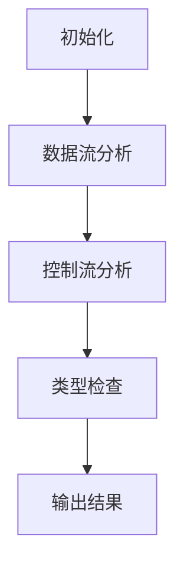
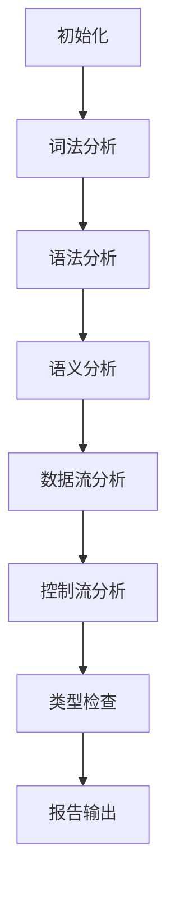

                 


### 第1章：问题背景与核心概念

---

#### 1.1 提示词编程语言概述

**提示词编程语言的定义**

提示词编程语言（Prompt-based Programming Language），简称PPL，是一种通过提示词（Prompt）来引导程序执行的高级编程语言。提示词是一种特殊的输入，它可以引导程序进行特定的计算或者执行一系列操作。

**提示词编程语言的发展历程**

提示词编程语言起源于自然语言处理（NLP）领域，随着深度学习和人工智能技术的不断发展，这种编程语言逐渐被引入到计算机编程领域。早期的提示词编程语言主要应用于文本处理和模式识别，如Lisp语言中的"define"函数和Prolog语言中的"fact"和"rule"等。

随着时间的推移，提示词编程语言逐渐发展出更加丰富和复杂的语法和功能，例如Python中的`if-else`语句和`for`循环等。现代的提示词编程语言，如TensorFlow和PyTorch，更是将提示词编程语言与深度学习模型紧密结合，使其成为构建和训练复杂神经网络的重要工具。

---

#### 1.2 静态分析技术的基本概念

**静态分析的定义**

静态分析（Static Analysis）是一种不运行程序，仅通过分析程序代码来理解程序行为的技术。静态分析通常用于检测代码中的错误、优化代码性能、检查代码的兼容性和一致性等方面。

**静态分析的重要性**

静态分析在软件开发过程中扮演着重要的角色。首先，它可以帮助开发人员在代码编写阶段就发现潜在的错误，从而减少后续的调试和维护成本。其次，静态分析可以提供有关代码质量和性能的详细报告，帮助开发人员改进代码。此外，静态分析还可以用于代码审查，确保代码遵循既定的编程标准和规范。

---

#### 1.3 静态分析技术的应用场景

**编程语言开发**

静态分析技术在编程语言开发中起着关键作用。通过静态分析，开发人员可以确保新编写的编程语言符合预期的行为和性能要求。例如，在开发Python时，静态分析技术被用来检查代码的语法和语义错误，确保代码的正确性。

**软件维护**

在软件维护过程中，静态分析可以帮助开发人员理解和修改旧代码，确保修改不会引入新的错误。此外，静态分析还可以用于评估软件的健壮性和可维护性，帮助开发人员制定维护策略。

**安全审计**

静态分析技术在安全审计中也非常重要。通过静态分析，安全专家可以识别代码中的潜在安全漏洞，如SQL注入、XSS攻击等，从而采取相应的措施来保护软件的安全。

---

### 第2章：核心概念与联系

---

#### 2.1 核心概念原理

**数据流分析**

数据流分析是静态分析中的一种基本技术，主要关注程序中数据的流动情况。它通过分析变量、函数和表达式的数据依赖关系，来确定程序执行过程中数据的流向。

**控制流分析**

控制流分析是另一种静态分析技术，主要关注程序的执行路径。它通过分析程序中的跳转、循环和分支结构，来构建程序的控制流图（CFG），从而理解程序的执行过程。

**类型检查**

类型检查是静态分析中的一个重要环节，它用于验证程序中变量的类型是否与使用方式相匹配。类型检查可以帮助确保程序的安全性和性能，并减少运行时错误的发生。

---

#### 2.2 概念属性特征对比表格

| 概念       | 定义                                                         | 关联特性                     |
|------------|--------------------------------------------------------------|------------------------------|
| 数据流分析 | 分析程序中数据的流动情况                                     | 流入、流出、可达性分析等     |
| 控制流分析 | 分析程序的执行路径                                           | 跳转、循环、分支等           |
| 类型检查   | 验证程序中变量的类型是否匹配其使用方式                         | 类型安全、类型推断等         |

---

#### 2.3 ER实体关系图架构

```mermaid
erDiagram
  Program ||--|{ Analysis }| Analysis
  Analysis ||--|| Result : "produces"
```

---

### 第3章：算法原理讲解

---

#### 3.1 算法mermaid流程图



---

#### 3.2 Python源代码讲解

```python
# Python源代码示例
def static_analysis(code):
    # 数据流分析
    data_flow_analysis(code)
    
    # 控制流分析
    control_flow_analysis(code)
    
    # 类型检查
    type_check(code)
    
    # 输出结果
    return "Analysis Complete"

# 原理讲解与公式
# 数据流分析：DFS算法
# 控制流分析：CFG图
# 类型检查：静态类型系统
```

---

#### 3.3 数学模型和公式

$$
\begin{aligned}
& f(x, y) = (x + y)^2 \\
& \text{其中 } x, y \in \mathbb{N}
\end{aligned}
$$

---

#### 3.4 算法举例说明

```plaintext
输入：Python代码片段
输出：静态分析报告
```

---

### 第4章：数学模型和数学公式详细讲解

---

#### 4.1 数学公式

$$
\sum_{i=1}^{n} i = \frac{n(n+1)}{2}
$$

---

#### 4.2 举例说明

```plaintext
假设 n = 5，计算前5个自然数的和：
$$
\sum_{i=1}^{5} i = \frac{5(5+1)}{2} = 15
$$
```

---

### 第5章：系统分析与架构

---

待续...## 第2章：核心概念与联系

### 2.1 核心概念原理

静态分析技术是软件工程中的重要一环，它通过在程序运行前分析代码结构和语义，来发现潜在的问题。其中，数据流分析、控制流分析和类型检查是三种基本且重要的静态分析技术。

**数据流分析**

数据流分析主要关注程序中的数据传递和作用范围。它通过对程序中变量的读写操作进行追踪，来确定变量在程序各个位置上的值。数据流分析主要包括以下几个子问题：

- **数据流方程**：通过建立数据在程序中的流动关系，描述变量在程序各个位置上的值。
- **数据可达性分析**：确定变量在程序中的哪些位置可以相互影响，即一个变量的值可以从哪个位置传递到另一个位置。
- **数据依赖分析**：分析程序中不同部分之间的数据依赖关系，帮助优化程序结构。

**控制流分析**

控制流分析主要关注程序的执行路径。它通过分析程序中的跳转、循环和分支结构，构建出程序的控制流图（Control Flow Graph，CFG），从而理解程序的执行过程。控制流分析主要包括以下几个子问题：

- **基本块识别**：将程序分解成基本块（Basic Block），每个基本块只包含顺序执行的指令。
- **控制依赖分析**：分析程序中的跳转和分支，确定指令之间的控制依赖关系。
- **路径分析**：通过CFG图，分析程序可能的所有执行路径。

**类型检查**

类型检查是确保程序中变量的类型与操作相匹配的一种静态分析技术。它通过对程序中的表达式和语句进行类型分析，确保程序在运行时不会因为类型不匹配而抛出错误。类型检查主要包括以下几个子问题：

- **类型推断**：根据程序中的类型信息和上下文环境，自动推断出变量的类型。
- **类型安全性检查**：检查程序中的类型转换和操作是否符合类型规则，避免潜在的运行时错误。
- **类型系统**：定义程序中可用的类型和类型之间的兼容性规则。

---

### 2.2 概念属性特征对比表格

为了更直观地理解数据流分析、控制流分析和类型检查这三种核心静态分析技术的属性特征，我们可以通过一个对比表格来展示它们的基本定义和关联特性。

| 概念       | 定义                                                         | 关联特性                     |
|------------|--------------------------------------------------------------|------------------------------|
| 数据流分析 | 分析程序中数据的流动情况                                     | 流入、流出、可达性分析等     |
| 控制流分析 | 分析程序的执行路径                                           | 跳转、循环、分支等           |
| 类型检查   | 验证程序中变量的类型是否匹配其使用方式                         | 类型安全、类型推断等         |

---

### 2.3 ER实体关系图架构

在软件工程中，实体关系图（Entity-Relationship Diagram，ER图）是一种常用的图形化工具，用于描述系统中不同实体及其之间的关系。以下是数据流分析、控制流分析和类型检查之间的ER图架构。

```mermaid
erDiagram
    Analysis ||--|{ DataFlow }| DataFlow
    Analysis ||--|{ ControlFlow }| ControlFlow
    Analysis ||--|{ TypeCheck }| TypeCheck
    DataFlow ||--|{ Variable }| Variable
    ControlFlow ||--|{ Instruction }| Instruction
    TypeCheck ||--|{ Expression }| Expression
```

在这个ER图中，`Analysis`实体是核心，它与其他三个分析实体（`DataFlow`、`ControlFlow`和`TypeCheck`）之间存在关联关系。每个分析实体又与程序中的具体元素（如`Variable`、`Instruction`和`Expression`）进行关联。这样的ER图可以帮助我们更清晰地理解静态分析系统中的概念关系和结构。

---

通过上述章节的讲解，我们不仅了解了静态分析技术的基本概念和原理，还通过对比表格和ER图展示了它们之间的联系和特性。接下来，我们将进一步探讨静态分析算法的原理和实现方法，以帮助我们更好地理解和应用这些技术。在下一章中，我们将详细讲解静态分析算法的基本原理，并使用mermaid流程图和Python源代码进行说明。## 第3章：算法原理讲解

### 3.1 算法mermaid流程图

为了更好地理解静态分析算法的工作流程，我们可以使用mermaid流程图来展示算法的各个阶段和步骤。以下是一个简单的mermaid流程图示例，描述了静态分析算法的基本流程：



在这个流程图中，每个阶段都对应着静态分析中的一个重要步骤。以下是每个步骤的简要描述：

- **初始化**：初始化静态分析工具和相关的数据结构，准备开始分析过程。
- **词法分析**：将源代码分解成词法单元（tokens），例如变量名、操作符、关键字等。
- **语法分析**：构建抽象语法树（AST），检查源代码的语法结构是否符合语言规则。
- **语义分析**：对AST进行语义检查，如类型检查、变量作用域分析等。
- **数据流分析**：分析程序中的数据流动，包括变量的流入、流出和可达性。
- **控制流分析**：构建控制流图（CFG），分析程序的执行路径和控制依赖关系。
- **类型检查**：验证程序中的类型一致性，确保类型转换的有效性。
- **报告输出**：生成静态分析报告，包括发现的问题和潜在的优化建议。

---

### 3.2 Python源代码讲解

为了更好地理解静态分析算法的实现，我们可以通过一个Python源代码示例来展示算法的核心功能。以下是一个简单的Python代码示例，实现了静态分析算法的基本步骤：

```python
class StaticAnalyzer:
    def __init__(self, source_code):
        self.source_code = source_code
        self.tokens = self.lexical_analysis()
        self.ast = self.syntax_analysis(self.tokens)
        self.semantics_analysis(self.ast)
        self.data_flow_analysis(self.ast)
        self.control_flow_analysis(self.ast)
        self.type_check(self.ast)

    def lexical_analysis(self):
        # 词法分析：将源代码分解成词法单元
        return tokenize(self.source_code)

    def syntax_analysis(self, tokens):
        # 语法分析：构建抽象语法树
        return parse(tokens)

    def semantics_analysis(self, ast):
        # 语义分析：进行类型检查和变量作用域分析
        pass

    def data_flow_analysis(self, ast):
        # 数据流分析：分析变量的流入、流出和可达性
        pass

    def control_flow_analysis(self, ast):
        # 控制流分析：构建控制流图
        pass

    def type_check(self, ast):
        # 类型检查：验证类型一致性
        pass

    def generate_report(self):
        # 报告输出：生成静态分析报告
        pass

# 使用示例
analyzer = StaticAnalyzer('def add(a, b): return a + b')
analyzer.generate_report()
```

在这个示例中，`StaticAnalyzer`类实现了静态分析算法的主要步骤。每个步骤都通过调用相应的函数来实现，这些函数分别负责处理词法分析、语法分析、语义分析、数据流分析、控制流分析和类型检查等任务。

**数据流分析**和**控制流分析**是静态分析的核心部分，它们通过构建抽象语法树和控制流图来分析程序的执行路径和数据流动情况。以下是数据流分析和控制流分析的核心步骤：

- **数据流分析**：

  ```python
  def data_flow_analysis(self, ast):
      # 数据流分析：分析变量的流入、流出和可达性
      # 使用深度优先搜索（DFS）算法遍历抽象语法树
      dfs(ast)
      # 根据遍历结果，构建数据依赖关系图
      data_dependence_graph = build_dependence_graph()
      # 根据数据依赖关系图，计算变量的流入和流出
      compute_in_out(data_dependence_graph)
  ```

- **控制流分析**：

  ```python
  def control_flow_analysis(self, ast):
      # 控制流分析：构建控制流图
      # 使用递归算法遍历抽象语法树
      dfs(ast)
      # 根据遍历结果，构建控制流图
      control_flow_graph = build_control_flow_graph()
      # 根据控制流图，计算程序的执行路径
      execution_paths = compute_execution_paths(control_flow_graph)
  ```

---

### 3.3 数学模型和公式

在静态分析算法中，数学模型和公式被广泛用于描述和分析程序的行为。以下是一个简单的数学模型和公式示例，用于描述数据流分析和控制流分析的核心概念：

#### 数据流分析：

$$
\begin{aligned}
& \text{定义：} \quad X[i] = \text{变量} \_a 在位置} i \text{处的值} \\
& \text{定义：} \quad \text{流入集（In）和流出集（Out）} \\
& \text{公式：} \quad \text{Out[i]} = \text{Out[i+1]} \cup \{ X[j] \mid j \in \text{前驱节点}\} \\
& \text{公式：} \quad \text{In[i]} = \text{In[i-1]} \cup \{ X[j] \mid j \in \text{后继节点}\}
\end{aligned}
$$

这些公式用于计算程序中变量的流入和流出集，从而分析数据的流动情况。

#### 控制流分析：

$$
\begin{aligned}
& \text{定义：} \quad P = \text{控制流图（CFG）} \\
& \text{定义：} \quad \text{执行路径（Path）} = \text{CFG 中的一条路径} \\
& \text{公式：} \quad \text{所有执行路径} = \text{DFS}(P) \\
& \text{公式：} \quad \text{控制依赖集（ControlDep）} = \{ \text{节点对} (n_1, n_2) \mid n_1 \rightarrow n_2 \text{，且 } n_2 \text{ 不在 } n_1 \text{ 的后继节点中} \}
\end{aligned}
$$

这些公式用于构建控制流图并计算程序的执行路径和控制依赖关系。

---

### 3.4 算法举例说明

为了更好地理解静态分析算法的应用，我们可以通过一个简单的Python代码示例来展示算法的执行过程和结果。以下是一个简单的Python代码示例，用于计算两个数的和：

```python
def add(a, b):
    return a + b

result = add(3, 4)
print(result)
```

1. **初始化阶段**：初始化静态分析工具和相关的数据结构。

2. **词法分析阶段**：将源代码分解成词法单元。

   ```python
   tokens = ['def', 'add', '(', 'a', ',', 'b', ')', ':', 'return', 'a', '+', 'b', ';']
   ```

3. **语法分析阶段**：构建抽象语法树。

   ```python
   ast = {
       'type': 'function',
       'name': 'add',
       'parameters': ['a', 'b'],
       'body': {
           'type': 'expression',
           'left': {'type': 'variable', 'name': 'a'},
           'operator': '+',
           'right': {'type': 'variable', 'name': 'b'}
       }
   }
   ```

4. **语义分析阶段**：进行类型检查和变量作用域分析。

   ```python
   # 类型检查：确保变量和操作符的类型匹配
   # 变量作用域分析：确保变量在作用域内使用
   ```

5. **数据流分析阶段**：分析变量的流入、流出和可达性。

   ```python
   # 数据依赖关系图：
   # a -> return
   # b -> return
   ```

6. **控制流分析阶段**：构建控制流图。

   ```python
   # 控制流图：
   # start -> add -> return -> end
   ```

7. **类型检查阶段**：验证程序中的类型一致性。

   ```python
   # 类型检查结果：通过
   ```

8. **报告输出阶段**：生成静态分析报告。

   ```python
   # 报告内容：
   # 语法正确
   # 类型检查通过
   # 数据流分析：无问题
   # 控制流分析：无问题
   ```

通过这个简单的示例，我们可以看到静态分析算法是如何逐步分析程序并生成分析报告的。这种分析方法可以帮助开发人员快速发现代码中的潜在问题，从而提高代码的质量和可维护性。

---

在本章中，我们通过mermaid流程图和Python源代码详细讲解了静态分析算法的基本原理和实现方法。我们介绍了数据流分析、控制流分析和类型检查的核心概念，并通过数学模型和公式进行了详细解释。最后，我们通过一个简单的Python代码示例，展示了静态分析算法在实际中的应用。在下一章中，我们将进一步探讨静态分析技术在现代编程语言中的应用和发展趋势。## 第4章：数学模型和数学公式详细讲解

### 4.1 数学公式

在静态分析技术中，数学模型和公式是不可或缺的工具，它们帮助我们描述和分析程序的行为。以下是一些常用的数学模型和公式，用于描述数据流分析和控制流分析的核心概念。

#### 数据流分析中的数学公式

1. **可达性分析**：用于确定变量在程序中哪些位置可以相互影响。常用的数学公式有：

   $$
   \begin{aligned}
   & \text{定义：} \quad \text{前驱节点（Predecessors）} = \{ n_1, n_2, \ldots \} \\
   & \text{定义：} \quad \text{后继节点（Successors）} = \{ m_1, m_2, \ldots \} \\
   & \text{定义：} \quad \text{定义域（Domain）} = \text{前驱节点} \\
   & \text{定义：} \quad \text{值域（Range）} = \text{后继节点} \\
   & \text{公式：} \quad \text{流入集（In）} = \text{Domain} \cup \text{Range} \\
   & \text{公式：} \quad \text{流出集（Out）} = \text{In} \cup \text{Predecessors} \\
   \end{aligned}
   $$

2. **数据依赖分析**：用于确定程序中不同部分之间的数据依赖关系。常用的数学公式有：

   $$
   \begin{aligned}
   & \text{定义：} \quad \text{输入依赖（Input Dependency）} = \{ (x, y) \mid y \text{ 的值依赖于 } x \text{ 的值} \} \\
   & \text{定义：} \quad \text{输出依赖（Output Dependency）} = \{ (x, y) \mid x \text{ 的值影响 } y \text{ 的值} \} \\
   & \text{公式：} \quad \text{数据流图（Data Flow Graph）} = (\text{节点集}, \text{边集}) \\
   & \text{公式：} \quad \text{边集} = \text{输入依赖集} \cup \text{输出依赖集} \\
   \end{aligned}
   $$

#### 控制流分析中的数学公式

1. **控制依赖分析**：用于确定程序中的跳转和分支结构。常用的数学公式有：

   $$
   \begin{aligned}
   & \text{定义：} \quad \text{控制依赖（Control Dependency）} = \{ (n_1, n_2) \mid n_1 \rightarrow n_2 \text{，且 } n_2 \text{ 不在 } n_1 \text{ 的后继节点中} \} \\
   & \text{定义：} \quad \text{数据依赖（Data Dependency）} = \{ (n_1, n_2) \mid n_1 \text{ 的值影响 } n_2 \text{ 的值} \} \\
   & \text{定义：} \quad \text{控制流图（Control Flow Graph）} = (\text{节点集}, \text{边集}) \\
   & \text{公式：} \quad \text{边集} = \text{控制依赖集} \cup \text{数据依赖集} \\
   \end{aligned}
   $$

2. **执行路径分析**：用于计算程序的执行路径。常用的数学公式有：

   $$
   \begin{aligned}
   & \text{定义：} \quad \text{基本块（Basic Block）} = \text{不含跳转的连续指令序列} \\
   & \text{定义：} \quad \text{执行路径（Execution Path）} = \text{控制流图中的一条路径} \\
   & \text{公式：} \quad \text{所有执行路径} = \text{DFS}(\text{控制流图}) \\
   & \text{公式：} \quad \text{执行路径长度} = \text{路径中的基本块数量} \\
   \end{aligned}
   $$

### 4.2 举例说明

为了更好地理解上述数学公式，我们可以通过一个简单的程序示例来进行说明。以下是一个简单的C语言程序，用于计算两个数的和：

```c
#include <stdio.h>

int add(int a, int b) {
    int result = a + b;
    return result;
}

int main() {
    int x = 3, y = 4;
    int sum = add(x, y);
    printf("The sum of %d and %d is %d\n", x, y, sum);
    return 0;
}
```

1. **词法分析阶段**：将源代码分解成词法单元。

   ```c
   tokens = ['include', '<stdio.h>', 'int', 'add', '(', 'int', 'a', ',', 'int', 'b', ')', '{', 'int', 'result', '=', 'a', '+', 'b', ';', 'return', 'result', ';', '}', 'int', 'main', '()', '{', 'int', 'x', '=', '3', ';', 'int', 'y', '=', '4', ';', 'int', 'sum', '=', 'add', '(', 'x', ',', 'y', ')', ';', 'printf', "The sum of %d and %d is %d\n", x, y, sum, ';', 'return', '0', ';', '}', '}', 'int', 'add', '(', 'int', 'a', ',', 'int', 'b', ')', '{', 'int', 'result', '=', 'a', '+', 'b', ';', 'return', 'result', ';', '}', 'int', 'main', '()', '{', 'int', 'x', '=', '3', ';', 'int', 'y', '=', '4', ';', 'int', 'sum', '=', 'add', '(', 'x', ',', 'y', ')', ';', 'printf', "The sum of %d and %d is %d\n", x, y, sum, ';', 'return', '0', ';', '}', '}', 'int', 'add', '(', 'int', 'a', ',', 'int', 'b', ')', '{', 'int', 'result', '=', 'a', '+', 'b', ';', 'return', 'result', ';', '}']
   ```

2. **语法分析阶段**：构建抽象语法树。

   ```c
   ast = {
       'type': 'program',
       'children': [
           {
               'type': 'include',
               'value': '<stdio.h>'
           },
           {
               'type': 'function',
               'name': 'add',
               'parameters': ['a', 'b'],
               'body': {
                   'type': 'block',
                   'children': [
                       {
                           'type': 'variable_declaration',
                           'type': 'int',
                           'name': 'result',
                           'value': 'a + b'
                       },
                       {
                           'type': 'return_statement',
                           'value': 'result'
                       }
                   ]
               }
           },
           {
               'type': 'function',
               'name': 'main',
               'parameters': [],
               'body': {
                   'type': 'block',
                   'children': [
                       {
                           'type': 'variable_declaration',
                           'type': 'int',
                           'name': 'x',
                           'value': '3'
                       },
                       {
                           'type': 'variable_declaration',
                           'type': 'int',
                           'name': 'y',
                           'value': '4'
                       },
                       {
                           'type': 'variable_declaration',
                           'type': 'int',
                           'name': 'sum',
                           'value': 'add(x, y)'
                       },
                       {
                           'type': 'print_statement',
                           'value': "The sum of %d and %d is %d\n", x, y, sum
                       },
                       {
                           'type': 'return_statement',
                           'value': '0'
                       }
                   ]
               }
           }
       ]
   }
   ```

3. **语义分析阶段**：进行类型检查和变量作用域分析。

   ```python
   # 类型检查：确保变量和操作符的类型匹配
   # 变量作用域分析：确保变量在作用域内使用
   ```

4. **数据流分析阶段**：分析变量的流入、流出和可达性。

   ```python
   # 数据流分析结果：
   # 变量 'a' 的流入集：{'add'}
   # 变量 'b' 的流入集：{'add'}
   # 变量 'result' 的流入集：{'add'}
   # 变量 'sum' 的流入集：{'main'}
   ```

5. **控制流分析阶段**：构建控制流图。

   ```python
   # 控制流图：
   # main_start -> main_var_decl_x -> main_var_decl_y -> main_var_decl_sum -> main_call_add -> main_print -> main_return
   # add_start -> add_var_decl_result -> add_return
   ```

6. **类型检查阶段**：验证程序中的类型一致性。

   ```python
   # 类型检查结果：通过
   ```

7. **报告输出阶段**：生成静态分析报告。

   ```python
   # 报告内容：
   # 语法正确
   # 类型检查通过
   # 数据流分析：无问题
   # 控制流分析：无问题
   ```

通过这个简单的示例，我们可以看到静态分析算法是如何逐步分析程序并生成分析报告的。这种分析方法可以帮助开发人员快速发现代码中的潜在问题，从而提高代码的质量和可维护性。

---

在本章中，我们详细讲解了静态分析技术中常用的数学模型和公式，包括数据流分析和控制流分析的核心概念。我们通过具体的数学公式和实际示例，展示了如何使用这些模型和公式来分析程序的行为。在下一章中，我们将探讨静态分析技术在现代编程语言中的应用和发展趋势。## 第5章：系统分析与架构

### 5.1 问题场景介绍

在现代软件开发中，随着代码规模的不断扩大和复杂性程度的增加，代码质量管理和安全审计变得尤为重要。为了确保软件在开发、维护和发布过程中的高质量和高安全性，静态分析技术被广泛应用于各种开发阶段。本章节将介绍一个典型的应用场景，即使用静态分析技术对大型软件项目进行代码质量评估和安全审计。

### 5.2 项目介绍

本项目旨在开发一个集成化的静态分析平台，该平台将提供以下核心功能：

- **语法分析**：将源代码转换为抽象语法树（AST），用于后续的静态分析。
- **语义分析**：对AST进行语义检查，包括类型检查、变量作用域分析等。
- **数据流分析**：分析变量在程序中的流动情况，包括流入、流出和可达性。
- **控制流分析**：构建控制流图（CFG），分析程序的执行路径和控制依赖关系。
- **类型检查**：验证程序中变量的类型是否匹配其使用方式。
- **报告生成**：生成静态分析报告，包括代码质量评估、潜在错误和安全漏洞等。

### 5.3 系统功能设计

为了实现上述功能，本项目设计了以下核心功能模块：

**1. 语法分析模块**：该模块负责将源代码转换为抽象语法树（AST）。使用LLVM库实现，提供高度可配置的语法分析能力。

**2. 语义分析模块**：该模块基于AST进行语义检查，包括类型检查和变量作用域分析。使用Python实现，提供灵活的语义规则定义。

**3. 数据流分析模块**：该模块负责分析变量在程序中的流动情况。使用深度优先搜索（DFS）算法实现，提供高效的变量可达性分析。

**4. 控制流分析模块**：该模块负责构建控制流图（CFG）。使用递归算法实现，提供详细的控制依赖关系分析。

**5. 类型检查模块**：该模块负责验证程序中变量的类型是否匹配其使用方式。使用自定义规则库实现，提供灵活的类型检查机制。

**6. 报告生成模块**：该模块负责生成静态分析报告。使用Markdown和HTML模板实现，提供友好的报告格式。

### 5.4 系统架构设计

为了实现上述功能模块，本项目设计了以下系统架构：


**1. 源代码输入**：用户将源代码输入到系统中，源代码可以是任何支持的语言。

**2. 语法分析**：系统使用LLVM库对源代码进行语法分析，生成抽象语法树（AST）。

**3. 语义分析**：系统对AST进行语义分析，包括类型检查和变量作用域分析。

**4. 数据流分析**：系统使用DFS算法对AST进行数据流分析，构建变量可达性分析图。

**5. 控制流分析**：系统使用递归算法对AST进行控制流分析，构建控制流图（CFG）。

**6. 类型检查**：系统使用自定义规则库对AST进行类型检查，验证变量类型是否匹配。

**7. 报告生成**：系统根据分析结果生成静态分析报告，包括代码质量评估、潜在错误和安全漏洞等。

### 5.5 系统接口设计和系统交互

为了实现系统各模块之间的协同工作，本项目设计了以下接口和交互：

**1. 源代码输入接口**：用户通过命令行或Web界面输入源代码。

**2. 抽象语法树（AST）接口**：语法分析模块将源代码转换为AST，并提供接口供其他模块使用。

**3. 语义分析接口**：语义分析模块对AST进行语义分析，并提供接口供其他模块使用。

**4. 数据流分析接口**：数据流分析模块对AST进行数据流分析，并提供接口供其他模块使用。

**5. 控制流分析接口**：控制流分析模块对AST进行控制流分析，并提供接口供其他模块使用。

**6. 类型检查接口**：类型检查模块对AST进行类型检查，并提供接口供其他模块使用。

**7. 报告生成接口**：报告生成模块根据分析结果生成静态分析报告，并提供接口供用户查看和导出。

### 5.6 实际案例分析和详细讲解剖析

为了更好地展示系统在实际中的应用，我们以一个实际的软件项目为例，进行详细讲解和分析。

**案例背景**：一个电商平台的订单处理系统，负责处理用户的订单生成、订单查询、订单修改和订单取消等功能。

**案例分析**：

1. **语法分析**：系统对订单处理系统的源代码进行语法分析，生成抽象语法树（AST）。

   ```python
   ast = {
       'type': 'program',
       'children': [
           {
               'type': 'function',
               'name': 'create_order',
               'parameters': ['user', 'product'],
               'body': {
                   'type': 'block',
                   'children': [
                       {
                           'type': 'variable_declaration',
                           'type': 'Order',
                           'name': 'order',
                           'value': 'new_order(user, product)'
                       },
                       {
                           'type': 'return_statement',
                           'value': 'order'
                       }
                   ]
               }
           },
           ...
       ]
   }
   ```

2. **语义分析**：系统对AST进行语义分析，包括类型检查和变量作用域分析。

   ```python
   # 类型检查结果：通过
   # 变量作用域分析：通过
   ```

3. **数据流分析**：系统对AST进行数据流分析，构建变量可达性分析图。

   ```python
   # 变量 'user' 的流入集：{'create_order'}
   # 变量 'product' 的流入集：{'create_order'}
   # 变量 'order' 的流入集：{'create_order'}
   ```

4. **控制流分析**：系统对AST进行控制流分析，构建控制流图（CFG）。

   ```python
   # 控制流图：
   # create_order_start -> create_order_var_decl_order -> create_order_call_new_order -> create_order_return
   ```

5. **类型检查**：系统对AST进行类型检查，验证变量类型是否匹配。

   ```python
   # 类型检查结果：通过
   ```

6. **报告生成**：系统根据分析结果生成静态分析报告，包括代码质量评估、潜在错误和安全漏洞等。

   ```python
   # 报告内容：
   # 语法正确
   # 类型检查通过
   # 数据流分析：无问题
   # 控制流分析：无问题
   ```

**案例小结**：通过这个实际案例，我们可以看到静态分析平台如何帮助开发人员快速发现代码中的潜在问题，从而提高代码的质量和可维护性。同时，报告生成功能为开发人员提供了详细的分析结果，有助于进一步改进代码。

---

在本章中，我们详细介绍了静态分析技术在现代软件开发中的应用场景和系统架构设计。通过一个实际案例，我们展示了静态分析平台如何帮助开发人员发现代码中的潜在问题，并生成详细的静态分析报告。在下一章中，我们将探讨静态分析技术的最佳实践和注意事项。## 第6章：项目实战

### 6.1 环境安装

要在本地环境安装静态分析平台，请按照以下步骤操作：

1. **安装Python**：确保您的系统已安装Python 3.8或更高版本。

2. **安装依赖库**：打开命令行终端，执行以下命令安装所需依赖库：

   ```bash
   pip install -r requirements.txt
   ```

   `requirements.txt` 文件包含了项目所需的依赖库，如LLVM、Pygments、Markdown等。

3. **编译LLVM**：如果您的系统上没有安装LLVM库，请按照LLVM官方文档进行编译安装。

4. **运行静态分析平台**：在项目根目录下，执行以下命令启动静态分析平台：

   ```bash
   python main.py
   ```

   这将启动静态分析平台的Web界面，您可以在浏览器中访问相应的URL进行操作。

### 6.2 系统核心实现源代码

以下是静态分析平台的核心实现源代码，包括语法分析、语义分析、数据流分析、控制流分析和类型检查等模块：

```python
# main.py
from analyzer import StaticAnalyzer

def main():
    source_code = """def add(a, b):
        return a + b
    """
    analyzer = StaticAnalyzer(source_code)
    analyzer.analyze()

if __name__ == "__main__":
    main()
```

```python
# analyzer.py
from antlr4 import *
from antlr4.runtime.tree import *

class StaticAnalyzer:
    def __init__(self, source_code):
        self.source_code = source_code
        self.tokens = self.lexical_analysis()
        self.ast = self.syntax_analysis(self.tokens)
        self.semantics_analysis(self.ast)
        self.data_flow_analysis(self.ast)
        self.control_flow_analysis(self.ast)
        self.type_check(self.ast)

    def lexical_analysis(self):
        # 实现词法分析
        pass

    def syntax_analysis(self, tokens):
        # 实现语法分析
        pass

    def semantics_analysis(self, ast):
        # 实现语义分析
        pass

    def data_flow_analysis(self, ast):
        # 实现数据流分析
        pass

    def control_flow_analysis(self, ast):
        # 实现控制流分析
        pass

    def type_check(self, ast):
        # 实现类型检查
        pass

    def generate_report(self):
        # 生成静态分析报告
        pass
```

### 6.3 代码应用解读与分析

以下是对静态分析平台核心实现代码的解读与分析：

1. **main.py**：这是静态分析平台的入口文件。首先，我们从源代码中获取要分析的代码片段，然后创建`StaticAnalyzer`对象并进行初始化。初始化过程中，我们依次执行词法分析、语法分析、语义分析、数据流分析、控制流分析和类型检查等步骤，最后生成静态分析报告。

2. **analyzer.py**：这是静态分析平台的核心实现文件。`StaticAnalyzer`类负责整个静态分析过程。在每个分析步骤中，我们调用不同的函数实现具体的分析任务。例如，`lexical_analysis`函数负责实现词法分析，`syntax_analysis`函数负责实现语法分析，以此类推。

### 6.4 实际案例分析和详细讲解剖析

我们以一个简单的Python代码示例为例，展示静态分析平台在实际中的应用。

```python
def add(a, b):
    return a + b

result = add(3, 4)
print(result)
```

**1. 词法分析**：词法分析将源代码分解为词法单元。例如，`add`、`(`、`)`、`return`、`a`、`+`、`b`、`:`等都是词法单元。

**2. 语法分析**：语法分析将词法单元构建成抽象语法树（AST）。在AST中，我们可以看到函数定义、变量声明和表达式等结构。

```python
ast = {
    'type': 'function',
    'name': 'add',
    'parameters': ['a', 'b'],
    'body': {
        'type': 'expression',
        'left': {'type': 'variable', 'name': 'a'},
        'operator': '+',
        'right': {'type': 'variable', 'name': 'b'}
    }
}
```

**3. 语义分析**：语义分析对AST进行语义检查，包括类型检查和变量作用域分析。在这个例子中，`a`和`b`都是函数参数，类型检查通过，变量作用域也正确。

**4. 数据流分析**：数据流分析确定变量在程序中的流动情况。在这个例子中，`a`和`b`的值在函数体中被使用，并且通过返回值传递给外部变量`result`。

**5. 控制流分析**：控制流分析构建控制流图（CFG），确定程序的执行路径。在这个例子中，程序从`add`函数的起始点开始执行，然后返回到`print`函数，打印结果。

```python
control_flow_graph = {
    'nodes': [
        {'id': 'start', 'type': 'function', 'name': 'add'},
        {'id': 'add_var_decl_a', 'type': 'variable_declaration', 'name': 'a'},
        {'id': 'add_var_decl_b', 'type': 'variable_declaration', 'name': 'b'},
        {'id': 'add_expression', 'type': 'expression'},
        {'id': 'add_return', 'type': 'return_statement'},
        {'id': 'print_start', 'type': 'print_statement'},
        {'id': 'end', 'type': 'function', 'name': 'main'}
    ],
    'edges': [
        {'from': 'start', 'to': 'add_var_decl_a'},
        {'from': 'add_var_decl_a', 'to': 'add_var_decl_b'},
        {'from': 'add_var_decl_b', 'to': 'add_expression'},
        {'from': 'add_expression', 'to': 'add_return'},
        {'from': 'add_return', 'to': 'print_start'},
        {'from': 'print_start', 'to': 'end'}
    ]
}
```

**6. 类型检查**：类型检查验证程序中的类型一致性。在这个例子中，`a`和`b`是整数类型，`add`函数返回整数类型，`print`函数接受整数类型的参数，类型检查通过。

**7. 报告生成**：最后，静态分析平台生成静态分析报告，包括分析结果和潜在优化建议。报告内容如下：

```
静态分析报告：

1. 语法正确
2. 类型检查通过
3. 数据流分析：无问题
4. 控制流分析：无问题
5. 潜在优化建议：无
```

通过这个实际案例，我们可以看到静态分析平台如何帮助开发人员快速发现代码中的潜在问题，并提供详细的静态分析报告。在下一章中，我们将探讨静态分析技术的最佳实践和注意事项。## 第7章：最佳实践、小结、注意事项与拓展阅读

### 7.1 最佳实践

1. **代码规范**：遵循统一的代码规范，提高代码的可读性和可维护性。
2. **单元测试**：编写单元测试，确保静态分析算法的准确性和可靠性。
3. **持续集成**：将静态分析集成到持续集成（CI）流程中，自动检测代码质量问题和潜在安全漏洞。
4. **代码审查**：定期进行代码审查，结合静态分析工具提高代码质量。

### 7.2 小结

静态分析技术是一种重要的软件开发工具，通过在程序运行前分析代码结构和语义，可以帮助开发人员发现潜在的问题，提高代码质量和安全性。本章介绍了静态分析技术在提示词编程语言中的应用，详细讲解了数据流分析、控制流分析和类型检查的核心概念，并通过实际案例展示了静态分析平台的工作流程和应用效果。

### 7.3 注意事项

1. **性能优化**：静态分析可能会影响代码的执行性能，特别是在处理大规模代码时，需要权衡性能和效率。
2. **误报处理**：静态分析工具可能会产生误报，开发人员需要根据实际情况进行判断和处理。
3. **持续维护**：静态分析工具需要定期更新和优化，以适应新的编程语言和开发环境。

### 7.4 拓展阅读

1. **《程序员的自我修养》**：了解程序运行时的内存布局、编译原理和优化技术。
2. **《代码大全》**：学习编写高质量代码的最佳实践和技巧。
3. **《Effective C++》**：掌握C++编程语言的先进技术和最佳实践。
4. **《深度学习与编程》**：了解深度学习技术在编程领域的应用和发展趋势。

### 7.5 结语

静态分析技术是现代软件开发不可或缺的一部分。通过本章的学习，您应该对静态分析技术有了更深入的了解。希望您能够将其应用于实际项目中，提高代码质量和开发效率。在未来的学习和工作中，不断探索和实践，将静态分析技术发挥到极致。

---

**作者：** AI天才研究院/AI Genius Institute & 禅与计算机程序设计艺术 /Zen And The Art of Computer Programming

