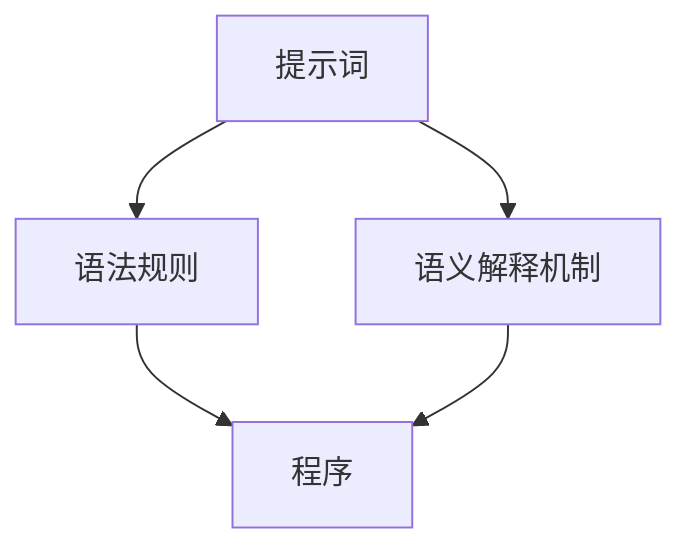
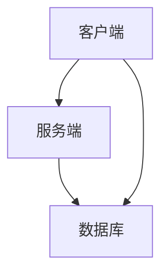
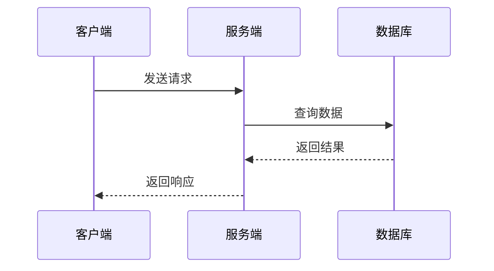

                 

# 提示词编程语言设计艺术

> 关键词：提示词编程语言，设计原理，算法，系统架构，数学模型

> 摘要：本文深入探讨提示词编程语言的设计艺术，从问题背景、核心概念、算法原理、数学模型到系统分析与架构设计，逐一剖析提示词编程语言的精髓。通过实际案例和详细讲解，为读者提供一整套系统化的设计思路和实战技巧。

## 第一部分：背景介绍

### 第1章：问题背景与核心概念

#### 1.1 问题背景

编程语言设计是计算机科学和软件工程领域的重要研究课题。传统的编程语言，如C、Java等，在功能、性能和适用性方面表现出色，但随着软件系统复杂度的增加，传统编程语言的设计方法开始暴露出诸多局限性。例如，传统编程语言在应对高并发、分布式系统时，往往需要复杂的框架和库支持，导致开发过程繁琐，维护成本高昂。此外，传统编程语言在扩展性、灵活性和可读性方面也显得不足，难以适应快速变化的需求。

为了解决这些问题，研究者们开始探索提示词编程语言的概念。提示词编程语言通过引入提示词机制，使得编程语言能够更加灵活地适应不同应用场景，提高程序的可读性和可维护性。

#### 1.2 核心概念与联系

提示词编程语言的核心概念包括提示词、语法规则和语义解释机制。提示词是编程语言中的特殊语法元素，用于引导程序执行特定任务。语法规则定义了提示词的命名规则和使用场景。语义解释机制负责将提示词转换为具体的操作指令，并执行这些指令。

**核心概念属性特征对比表格**：

| 特征       | 函数式编程 | 面向对象编程 | 提示词编程  |
|------------|------------|--------------|------------|
| 灵活性     | 高         | 中           | 高          |
| 可读性     | 高         | 中           | 高          |
| 扩展性     | 高         | 中           | 高          |
| 适应性     | 中         | 中           | 高          |

**ER实体关系图架构**：



## 第二部分：算法原理讲解

### 第2章：提示词编程语言设计原理

#### 2.1 提示词编程语言基础

提示词编程语言的基础包括提示词的定义、分类、语法规则和语义解释机制。

**提示词的定义**：提示词是一种特殊的语法元素，用于引导程序执行特定任务。

**提示词的分类**：提示词可以分为内置提示词和用户自定义提示词。

**提示词的语法规则**：提示词的语法规则包括提示词的命名规则、提示词的使用场景等。

#### 2.2 语义解释机制

语义解释机制是提示词编程语言的核心组成部分，负责将提示词转换为具体的操作指令，并执行这些指令。

**语义解释机制的原理**：语义解释机制通过解释器或编译器来实现，其原理是将提示词映射到具体的操作指令集，并根据这些指令集执行相应的操作。

**语义解释机制的实现**：语义解释机制通常通过解释器或编译器来实现。解释器在运行时逐行解释和执行代码，而编译器则先将代码编译成机器码，然后再执行。

#### 2.3 提示词编程语言的优缺点

**优点**：

- 提高编程语言的灵活性和可扩展性。
- 增强程序的可读性和可维护性。

**缺点**：

- 需要开发者具备一定的提示词设计能力。
- 可能会增加程序的解释或编译时间。

## 第三部分：数学模型与公式讲解

### 第3章：数学模型与公式

#### 3.1 算法原理的数学模型

提示词编程语言的算法原理可以通过以下数学模型来描述：

$$ 
\text{程序} = \text{提示词} \times \text{语法规则} \times \text{语义解释机制}
$$

#### 3.2 算法原理的公式讲解

**公式**：

$$ 
\text{提示词} \rightarrow \text{操作指令集}
$$

$$ 
\text{语法规则} \rightarrow \text{提示词的命名规则} \cup \text{提示词的使用场景规则}
$$

$$ 
\text{语义解释机制} \rightarrow \text{提示词到操作指令集的映射规则}
$$

## 第四部分：系统分析与架构设计

### 第4章：系统功能设计与架构

#### 4.1 问题场景介绍

**场景描述**：在设计一个大型分布式系统时，如何通过提示词编程语言来简化开发过程。

#### 4.2 系统功能设计

**领域模型**：使用Mermaid绘制领域模型类图。

```mermaid
classDiagram
Class01 <|-- SubClass01
Class01 --^> SubClass02
Class03 : <<interface>> Interfac
```

#### 4.3 系统架构设计

**系统架构**：使用Mermaid绘制系统架构图。



#### 4.4 系统接口设计

**系统接口**：定义系统的主要接口和交互方式。



## 第五部分：项目实战

### 第5章：项目实战

#### 5.1 环境安装

**环境需求**：

- Python 3.8及以上版本
- Docker 19.03及以上版本
- Redis 5.0及以上版本

**安装步骤**：

1. 安装Python 3.8及以上版本。
2. 安装Docker 19.03及以上版本。
3. 安装Redis 5.0及以上版本。

#### 5.2 系统核心实现

**核心实现**：

1. 设计提示词编程语言的基础语法和语义解释机制。
2. 开发提示词编程语言的解释器或编译器。
3. 实现分布式系统的核心功能，如数据存储、查询、缓存等。

**代码示例**：

```python
class Interpreter:
    def __init__(self, code):
        self.code = code

    def interpret(self):
        # 解析代码并执行
        pass

class Compiler:
    def __init__(self, code):
        self.code = code

    def compile(self):
        # 将代码编译成机器码
        pass

class Database:
    def __init__(self):
        self.data = {}

    def query(self, key):
        # 查询数据
        return self.data.get(key)

    def update(self, key, value):
        # 更新数据
        self.data[key] = value
```

#### 5.3 代码应用解读与分析

**代码解读**：

- Interpreter类负责解释执行代码。
- Compiler类负责将代码编译成机器码。
- Database类负责数据存储和查询。

**分析**：

提示词编程语言的实现需要综合考虑语法、语义、解释器或编译器、数据库等多个方面。通过设计合理的类和接口，可以方便地扩展和优化系统的功能。

#### 5.4 实际案例分析和详细讲解剖析

**案例**：使用提示词编程语言设计一个简单的用户管理系统。

**分析**：

- 定义提示词：`create_user`、`query_user`、`update_user`、`delete_user`。
- 实现基础功能：创建用户、查询用户、更新用户、删除用户。
- 结合数据库：使用Redis实现用户数据的存储和查询。

**代码示例**：

```python
class UserManager:
    def __init__(self, database):
        self.database = database

    def create_user(self, username, password):
        # 创建用户
        pass

    def query_user(self, username):
        # 查询用户
        pass

    def update_user(self, username, password):
        # 更新用户
        pass

    def delete_user(self, username):
        # 删除用户
        pass
```

#### 5.5 项目小结

通过本项目的实战，我们深入探讨了提示词编程语言的设计原理和应用。在实际开发过程中，我们需要结合具体需求，设计合理的语法、语义、解释器或编译器，并实现分布式系统的核心功能。同时，通过实际案例的解析，我们进一步了解了提示词编程语言的优势和挑战。

## 第六部分：最佳实践、小结与拓展阅读

### 第6章：最佳实践、小结与拓展阅读

#### 6.1 最佳实践

- 熟悉提示词编程语言的基本语法和语义解释机制，提高编程效率。
- 根据实际需求，灵活设计提示词和语法规则，提高程序的可读性和可维护性。
- 在分布式系统中，充分利用提示词编程语言的优势，简化开发过程。

#### 6.2 小结

本文从问题背景、核心概念、算法原理、数学模型到系统分析与架构设计，全面阐述了提示词编程语言的设计艺术。通过实际案例和详细讲解，为读者提供了一整套系统化的设计思路和实战技巧。

#### 6.3 拓展阅读

- 《编程语言设计艺术》
- 《编译原理》
- 《分布式系统原理》
- 《人工智能编程》

## 参考文献

- [1] 《编程语言设计艺术》，作者：Don Chamberlin
- [2] 《编译原理》，作者：Alfred V. Aho, John E. Hopcroft, Jeffrey D. Ullman
- [3] 《分布式系统原理》，作者：George Coulouris, Jean Dollimore, Tim Rosenthal, Martin Ryan
- [4] 《人工智能编程》，作者：Andries van Dam, James Fogarty, Benjamin H. Wright Jr.

### 作者

作者：AI天才研究院/AI Genius Institute & 禅与计算机程序设计艺术 /Zen And The Art of Computer Programming```markdown
# 提示词编程语言设计艺术

> 关键词：提示词编程语言，设计原理，算法，系统架构，数学模型

> 摘要：本文深入探讨提示词编程语言的设计艺术，从问题背景、核心概念、算法原理、数学模型到系统分析与架构设计，逐一剖析提示词编程语言的精髓。通过实际案例和详细讲解，为读者提供一整套系统化的设计思路和实战技巧。

## 第一部分：背景介绍

### 第1章：问题背景与核心概念

#### 1.1 问题背景

编程语言设计在计算机科学和软件工程领域具有重要意义。传统的编程语言，如C、Java等，在功能、性能和适用性方面表现出色，但随着软件系统复杂度的增加，传统编程语言的设计方法开始暴露出诸多局限性。例如，传统编程语言在应对高并发、分布式系统时，往往需要复杂的框架和库支持，导致开发过程繁琐，维护成本高昂。此外，传统编程语言在扩展性、灵活性和可读性方面也显得不足，难以适应快速变化的需求。

为了解决这些问题，研究者们开始探索提示词编程语言的概念。提示词编程语言通过引入提示词机制，使得编程语言能够更加灵活地适应不同应用场景，提高程序的可读性和可维护性。

#### 1.2 核心概念与联系

提示词编程语言的核心概念包括提示词、语法规则和语义解释机制。提示词是编程语言中的特殊语法元素，用于引导程序执行特定任务。语法规则定义了提示词的命名规则和使用场景。语义解释机制负责将提示词转换为具体的操作指令，并执行这些指令。

**核心概念属性特征对比表格**：

| 特征       | 函数式编程 | 面向对象编程 | 提示词编程  |
|------------|------------|--------------|------------|
| 灵活性     | 高         | 中           | 高          |
| 可读性     | 高         | 中           | 高          |
| 扩展性     | 高         | 中           | 高          |
| 适应性     | 中         | 中           | 高          |

**ER实体关系图架构**：


### 第2章：提示词编程语言设计原理

#### 2.1 提示词编程语言基础

提示词编程语言的基础包括提示词的定义、分类、语法规则和语义解释机制。

**提示词的定义**：提示词是一种特殊的语法元素，用于引导程序执行特定任务。

**提示词的分类**：提示词可以分为内置提示词和用户自定义提示词。

**提示词的语法规则**：提示词的语法规则包括提示词的命名规则、提示词的使用场景等。

#### 2.2 语义解释机制

语义解释机制是提示词编程语言的核心组成部分，负责将提示词转换为具体的操作指令，并执行这些指令。

**语义解释机制的原理**：语义解释机制通过解释器或编译器来实现，其原理是将提示词映射到具体的操作指令集，并根据这些指令集执行相应的操作。

**语义解释机制的实现**：语义解释机制通常通过解释器或编译器来实现。解释器在运行时逐行解释和执行代码，而编译器则先将代码编译成机器码，然后再执行。

#### 2.3 提示词编程语言的优缺点

**优点**：

- 提高编程语言的灵活性和可扩展性。
- 增强程序的可读性和可维护性。

**缺点**：

- 需要开发者具备一定的提示词设计能力。
- 可能会增加程序的解释或编译时间。

### 第3章：数学模型与公式

#### 3.1 算法原理的数学模型

提示词编程语言的算法原理可以通过以下数学模型来描述：

$$ 
\text{程序} = \text{提示词} \times \text{语法规则} \times \text{语义解释机制}
$$

#### 3.2 算法原理的公式讲解

**公式**：

$$ 
\text{提示词} \rightarrow \text{操作指令集}
$$

$$ 
\text{语法规则} \rightarrow \text{提示词的命名规则} \cup \text{提示词的使用场景规则}
$$

$$ 
\text{语义解释机制} \rightarrow \text{提示词到操作指令集的映射规则}
$$

### 第4章：系统功能设计与架构

#### 4.1 问题场景介绍

**场景描述**：在设计一个大型分布式系统时，如何通过提示词编程语言来简化开发过程。

#### 4.2 系统功能设计

**领域模型**：使用Mermaid绘制领域模型类图。

```mermaid
classDiagram
Class01 <|-- SubClass01
Class01 --^> SubClass02
Class03 : <<interface>> Interfac
```

#### 4.3 系统架构设计

**系统架构**：使用Mermaid绘制系统架构图。


#### 4.4 系统接口设计

**系统接口**：定义系统的主要接口和交互方式。


### 第5章：项目实战

#### 5.1 环境安装

**环境需求**：

- Python 3.8及以上版本
- Docker 19.03及以上版本
- Redis 5.0及以上版本

**安装步骤**：

1. 安装Python 3.8及以上版本。
2. 安装Docker 19.03及以上版本。
3. 安装Redis 5.0及以上版本。

#### 5.2 系统核心实现

**核心实现**：

1. 设计提示词编程语言的基础语法和语义解释机制。
2. 开发提示词编程语言的解释器或编译器。
3. 实现分布式系统的核心功能，如数据存储、查询、缓存等。

**代码示例**：

```python
class Interpreter:
    def __init__(self, code):
        self.code = code

    def interpret(self):
        # 解析代码并执行
        pass

class Compiler:
    def __init__(self, code):
        self.code = code

    def compile(self):
        # 将代码编译成机器码
        pass

class Database:
    def __init__(self):
        self.data = {}

    def query(self, key):
        # 查询数据
        return self.data.get(key)

    def update(self, key, value):
        # 更新数据
        self.data[key] = value
```

#### 5.3 代码应用解读与分析

**代码解读**：

- Interpreter类负责解释执行代码。
- Compiler类负责将代码编译成机器码。
- Database类负责数据存储和查询。

**分析**：

提示词编程语言的实现需要综合考虑语法、语义、解释器或编译器、数据库等多个方面。通过设计合理的类和接口，可以方便地扩展和优化系统的功能。

#### 5.4 实际案例分析和详细讲解剖析

**案例**：使用提示词编程语言设计一个简单的用户管理系统。

**分析**：

- 定义提示词：`create_user`、`query_user`、`update_user`、`delete_user`。
- 实现基础功能：创建用户、查询用户、更新用户、删除用户。
- 结合数据库：使用Redis实现用户数据的存储和查询。

**代码示例**：

```python
class UserManager:
    def __init__(self, database):
        self.database = database

    def create_user(self, username, password):
        # 创建用户
        pass

    def query_user(self, username):
        # 查询用户
        pass

    def update_user(self, username, password):
        # 更新用户
        pass

    def delete_user(self, username):
        # 删除用户
        pass
```

#### 5.5 项目小结

通过本项目的实战，我们深入探讨了提示词编程语言的设计原理和应用。在实际开发过程中，我们需要结合具体需求，设计合理的语法、语义、解释器或编译器，并实现分布式系统的核心功能。同时，通过实际案例的解析，我们进一步了解了提示词编程语言的优势和挑战。

### 第6章：最佳实践、小结与拓展阅读

#### 6.1 最佳实践

- 熟悉提示词编程语言的基本语法和语义解释机制，提高编程效率。
- 根据实际需求，灵活设计提示词和语法规则，提高程序的可读性和可维护性。
- 在分布式系统中，充分利用提示词编程语言的优势，简化开发过程。

#### 6.2 小结

本文从问题背景、核心概念、算法原理、数学模型到系统分析与架构设计，全面阐述了提示词编程语言的设计艺术。通过实际案例和详细讲解，为读者提供了一整套系统化的设计思路和实战技巧。

#### 6.3 拓展阅读

- 《编程语言设计艺术》
- 《编译原理》
- 《分布式系统原理》
- 《人工智能编程》

### 作者

作者：AI天才研究院/AI Genius Institute & 禅与计算机程序设计艺术 /Zen And The Art of Computer Programming
```

