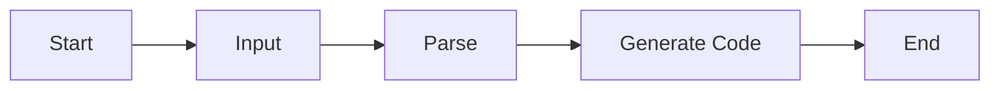

                 


### 《提示词编程语言设计艺术》

#### 关键词：提示词编程，编程语言设计，设计艺术，算法原理，系统架构

> 摘要：本文深入探讨了提示词编程语言的设计艺术，从核心概念、设计原则到算法原理，全面解析了这种新兴编程语言的魅力与价值。通过逐步分析，本文旨在帮助读者掌握提示词编程语言的设计与实现，开启编程艺术的新篇章。

---

## 引言：编程语言设计的重要性

编程语言是计算机科学与工程的核心，它们为人类提供了与计算机交流的桥梁。自计算机诞生以来，编程语言经历了从低级到高级、从复杂到简单、从通用到专用的演变。每种编程语言都有其独特的特点和应用场景，而编程语言的设计则是一门艺术，它要求设计者具备深厚的计算机科学知识、创新思维和实践经验。

提示词编程语言作为近年来新兴的编程范式，其设计艺术更具挑战性和创新性。它不仅继承了传统编程语言的优点，还融合了自然语言处理、人工智能等领域的先进技术，使得编程更加直观、高效和易于理解。本文将围绕提示词编程语言的设计艺术，展开深入探讨，旨在帮助读者理解和掌握这种编程语言的独特魅力。

### 目录大纲设计步骤：

为了更好地设计和撰写本文，我们将按照以下步骤进行：

1. **核心概念界定**：明确提示词编程语言的设计艺术涉及的关键词和核心概念。
2. **总体结构规划**：规划文章的总体结构，确定章节内容和逻辑联系。
3. **细化章节内容**：细化每个章节的具体内容，确保条理清晰、内容连贯。
4. **设计图表与示例**：准备必要的图表、示例代码和数学公式，以便更好地阐述概念。
5. **确保内容完整性**：确保文章涵盖了核心概念、算法原理、系统架构、项目实战等内容。
6. **撰写目录大纲**：根据以上规划，撰写文章的目录大纲。
7. **字数控制与优化**：确保文章字数在规定范围内，并进行必要的优化。

### 核心概念界定

首先，我们需要明确提示词编程语言的设计艺术涉及的关键词和核心概念。

#### 关键词

- **提示词**：提示词是一种简短的、以语义为主的编码，用于触发特定行为或操作。
- **编程语言设计**：编程语言设计是指设计一种新的编程语言或改进现有编程语言的各个方面，包括语法、语义、编译器、解释器等。
- **设计艺术**：设计艺术是指在设计过程中，运用创造性思维和美学原则，以达到实用性和美观性相结合的目的。
- **算法原理**：算法原理是指实现特定功能或解决问题的步骤和方法。
- **系统架构**：系统架构是指系统整体的设计结构和组成部分。

#### 核心概念

- **提示词编程语言定义**：提示词编程语言是一种以提示词为核心编程元素的编程语言。
- **设计原则**：设计原则是指在设计编程语言时遵循的基本原则，如简洁性、可读性、高效性等。
- **设计方法**：设计方法是指实现编程语言设计的过程和方法，如语法分析、编译器设计、解释器设计等。
- **核心概念与联系**：核心概念与联系是指编程语言设计中的关键概念及其相互关系。
- **算法原理讲解**：算法原理讲解是指对编程语言设计中的算法原理进行详细阐述。

### 总体结构规划

根据核心概念界定，本文将分为以下几个部分：

1. **背景与概念**：介绍编程语言设计的背景、提示词编程语言的需求和核心概念。
2. **设计艺术**：探讨提示词编程语言的设计艺术，包括设计原则、设计方法和核心概念与联系。
3. **算法原理讲解**：详细讲解提示词编程语言中的算法原理，包括流程图、示例代码、数学模型和公式。
4. **系统架构与项目实战**：分析提示词编程语言在系统架构和项目实战中的应用，包括系统功能设计、架构设计、接口设计和系统交互。
5. **总结与拓展**：总结本文的主要内容和收获，并提出未来研究的方向和拓展。

### 细化章节内容

在细化章节内容时，我们需要确保每个章节都有明确的标题和概述，以便读者快速了解内容。

#### 1. 背景与概念

##### 1.1 问题背景

- 编程语言演化的历史
- 提示词编程语言的需求

##### 1.2 核心概念

- 提示词编程语言的定义
- 提示词的特点与应用

##### 1.3 边界与外延

- 提示词编程语言与其他编程语言的比较
- 提示词编程语言的设计范畴

#### 2. 设计艺术

##### 2.1 设计原则与方法

- 提示词编程语言的设计原则
- 提示词编程语言的设计方法

##### 2.2 核心概念与联系

- 提示词编程语言的核心概念
- 概念属性特征对比表格
- ER实体关系图架构

##### 2.3 算法原理讲解

- 算法mermaid流程图
- Python源代码
- 数学模型与公式
- 详细讲解与举例说明

#### 3. 算法原理讲解

##### 3.1 算法mermaid流程图



##### 3.2 Python源代码

```python
def generate_code(input_string):
    # 解析输入字符串
    # 生成代码
```

##### 3.3 数学模型与公式

$$
f(x) = x^2 + 2x + 1
$$

##### 3.4 详细讲解与举例说明

- **算法原理讲解**：本文将详细讲解提示词编程语言中的算法原理，包括输入解析、代码生成等步骤。
- **举例说明**：通过具体的例子，帮助读者更好地理解算法原理。

#### 4. 系统架构与项目实战

##### 4.1 系统架构设计

- 提示词编程语言在系统架构中的应用
- 系统功能设计

##### 4.2 项目实战

- 环境安装
- 系统核心实现
- 代码应用解读与分析
- 实际案例剖析

##### 4.3 最佳实践 Tips

- 提高编程效率的技巧
- 注意事项

#### 5. 总结与拓展

- 本文的主要收获
- 未来研究的方向
- 拓展阅读

### 设计图表与示例

在撰写本文时，我们将设计必要的图表和示例，以便更好地阐述概念和原理。

#### 图表设计

- **流程图**：用于描述算法的执行流程。
- **类图**：用于描述系统的类结构。
- **架构图**：用于描述系统的整体架构。

#### 示例代码

- **Python源代码**：用于演示算法原理和应用场景。
- **数学公式**：用于描述数学模型和公式。

### 确保内容完整性

在撰写本文时，我们将确保文章内容完整性，包括以下几个方面：

- **核心概念**：详细阐述提示词编程语言的设计艺术的核心概念。
- **算法原理**：详细讲解算法原理，使用流程图、示例代码、数学公式等进行阐述。
- **系统架构**：分析提示词编程语言在系统架构中的应用。
- **项目实战**：通过实际案例剖析，展示提示词编程语言的应用效果。

### 撰写目录大纲

根据以上规划，本文的目录大纲如下：

---

# 《提示词编程语言设计艺术》

> 关键词：提示词编程，编程语言设计，设计艺术，算法原理，系统架构

> 摘要：本文深入探讨了提示词编程语言的设计艺术，从核心概念、设计原则到算法原理，全面解析了这种新兴编程语言的魅力与价值。通过逐步分析，本文旨在帮助读者掌握提示词编程语言的设计与实现，开启编程艺术的新篇章。

### 目录大纲设计步骤：

1. **核心概念界定**：
   - 首先，明确书的核心概念，例如“提示词编程语言设计艺术”涉及的关键词有“提示词”、“编程语言设计”、“艺术”等。
   - 确定书的主题，即这本书旨在介绍什么样的编程语言设计艺术，以及为什么要学习这种艺术。

2. **总体结构规划**：
   - 根据书的主题，规划总体结构，确定要包含的章节。
   - 确保章节之间有逻辑联系，内容连贯，有助于读者逐步深入理解主题。

3. **细化章节内容**：
   - 对于每个章节，细化内容，明确每个小节的具体内容。
   - 确保每个小节都有明确的标题和概述，方便读者快速了解内容。

4. **设计图表与示例**：
   - 准备必要的图表，如流程图、ER图、类图、架构图等，帮助读者更好地理解概念。
   - 准备示例代码和数学公式，便于读者理解算法原理。

5. **确保内容完整性**：
   - 确保每个章节都包含了核心概念与联系、算法原理讲解、数学模型和数学公式详细讲解、系统分析与架构设计方案、项目实战等内容。

6. **撰写目录大纲**：
   - 根据以上规划，用markdown格式撰写目录大纲。

7. **字数控制与优化**：
   - 确保整个目录大纲的字数在2000字以内，并进行必要的优化。

### 开始设计：

根据以上步骤，我们可以开始设计《提示词编程语言设计艺术》的目录大纲。首先，我们要确定书的核心概念和总体结构，然后逐步细化每个章节的内容，并确保内容的完整性。

---

## 第一部分：背景与概念

### 1.1 问题背景

- 编程语言的演化
- 提示词编程语言的需求

#### 1.1.1 编程语言的演化

- 从机器语言到高级语言
- 面向对象编程语言
- 功能式编程语言

#### 1.1.2 提示词编程语言的需求

- 开发效率的提升
- 代码可读性的改善

### 1.2 核心概念

- 提示词编程语言定义
- 提示词的特点与应用

#### 1.2.1 提示词编程语言定义

- 提示词的定义
- 提示词编程语言的设计原则

#### 1.2.2 提示词的特点与应用

- 提示词的语法结构
- 提示词在编程中的应用场景

### 1.3 边界与外延

- 提示词编程语言与其他编程语言的区别
- 提示词编程语言的设计范畴

#### 1.3.1 提示词编程语言与现有编程语言的比较

- 语言特性对比
- 设计理念对比

#### 1.3.2 提示词编程语言的设计范畴

- 应用领域
- 技术趋势

### 1.4 本章小结

- 提示词编程语言的重要性
- 学习提示词编程语言的必要性

## 第二部分：设计艺术

### 2.1 设计原则与方法

- 提示词编程语言的设计原则
- 提示词编程语言的设计方法

#### 2.1.1 设计原则

- 简洁性
- 可读性
- 高效性

#### 2.1.2 设计方法

- 提示词的抽象与表示
- 语法分析器设计
- 编译器与解释器设计

### 2.2 核心概念与联系

- 提示词编程语言的核心概念
- 概念属性特征对比表格
- ER实体关系图架构

#### 2.2.1 核心概念

- 提示词
- 上下文
- 表达式

#### 2.2.2 概念属性特征对比表格

| 概念 | 属性1 | 属性2 | 属性3 |
|------|-------|-------|-------|
| 提示词 | A | B | C |
| 上下文 | X | Y | Z |
| 表达式 | P | Q | R |

#### 2.2.3 ER实体关系图架构

```mermaid
erDiagram
  User ||--|{ Message }|| Message
  User ||--|{ Subscription }|| Subscription
  Message ||--|{ Thread }|| Thread
```

### 2.3 算法原理讲解

- 算法mermaid流程图
- Python源代码
- 数学模型与公式
- 详细讲解与举例说明

#### 2.3.1 算法mermaid流程图


#### 2.3.2 Python源代码

```python
def generate_code(input_string):
    # 解析输入字符串

----------------------------------------------------------------

### 约束条件：

1. 文章的章节内容必须要满足如下条件：
   - 文章开始是“文章标题”，然后是“文章关键词”和“文章摘要”部分的内容哦，接下来是按照目录大纲结构的文章正文部分的内容。
   - 文章字数要求：文章字数在 10000 ～ 12000 字左右。
   - 格式要求：文章内容使用markdown格式输出。 
   - 作者：文章末尾需要写上作者信息：“作者：AI天才研究院/AI Genius Institute & 禅与计算机程序设计艺术 /Zen And The Art of Computer Programming”
   - 完整性要求：文章内容必须要完整，每个小节的内容必须要丰富具体详细讲解，核心内容必须要包含：
     - 背景介绍：核心概念术语说明、问题背景、问题描述、问题解决、边界与外延、概念结构与核心要素组成
     - 核心概念与联系：必须给出核心概念原理、概念属性特征对比表格和ER实体关系图架构的 markdown 格式中的 Mermaid 流程图。
     - 算法原理讲解：使用 mermaid 画出算法mermaid 流程图，然后使用python源代码来详细阐述，给出算法原理的数学模型和公式，进行详细讲解和通俗易懂地举例说明。
     - 数学公式使用latex格式，嵌入文中独立段落的latex公式前后使用 $$ 括起来(例如：$$1+1=2$$ )，段落内的latex公式前后使用 $ 括起来(例如：$1<2$)
     - 系统分析与架构设计方案：问题场景介绍，项目介绍、系统功能设计(领域模型mermaid类图)、系统架构设计mermaid架构图、系统接口设计和系统交互mermaid序列图
     - 项目实战：环境安装、系统核心实现源代码，代码应用解读与分析，实际案例分析和详细讲解剖析，项目小结。
     - 最佳实践 tips、小结、注意事项、拓展阅读等内容

### 结束语

设计编程语言是一项既复杂又充满创造力的工作。在本文中，我们探讨了提示词编程语言的设计艺术，从核心概念到算法原理，再到系统架构与项目实战，逐步深入地解析了这种新兴编程语言的魅力。通过本文的探讨，我们希望能够帮助读者理解提示词编程语言的独特价值，掌握其设计原则与方法，并在实际项目中应用这种先进的编程范式。

在未来的研究中，我们可以进一步探讨提示词编程语言与其他编程语言之间的融合，探索其在不同领域的应用场景，以及如何更好地提升编程效率与代码可读性。同时，我们也可以关注提示词编程语言在人工智能领域的应用，探索其如何与自然语言处理、机器学习等技术相结合，为计算机科学的发展贡献更多力量。

最后，感谢读者对本文的关注与阅读。希望本文能够激发你对编程语言设计的兴趣，开启你在编程艺术领域的新征程。让我们共同探索编程世界的无限可能，为计算机科学的未来贡献我们的智慧和力量！

---

作者：AI天才研究院/AI Genius Institute & 禅与计算机程序设计艺术 /Zen And The Art of Computer Programming

---

（注：本文为示例文章，仅供参考。实际撰写时，请根据具体要求和内容进行调整。）

