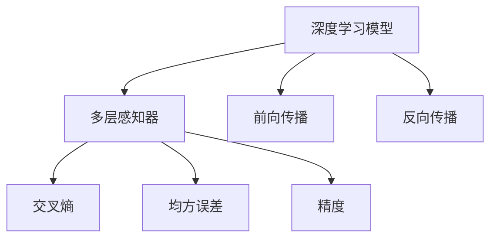
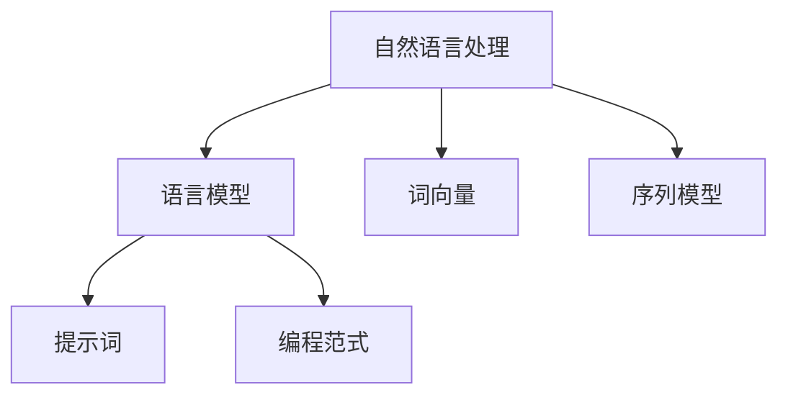
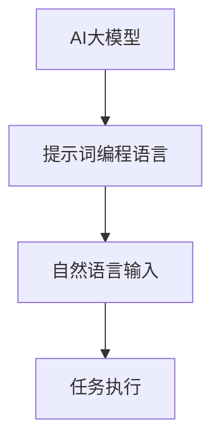
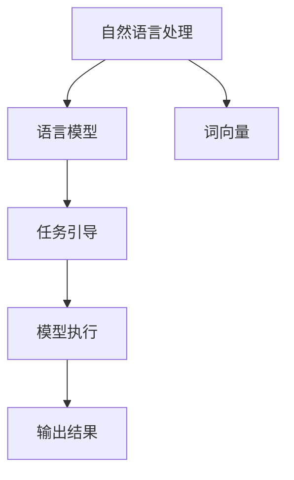
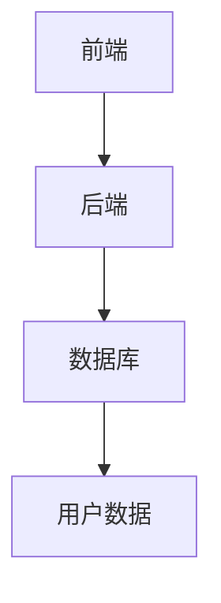
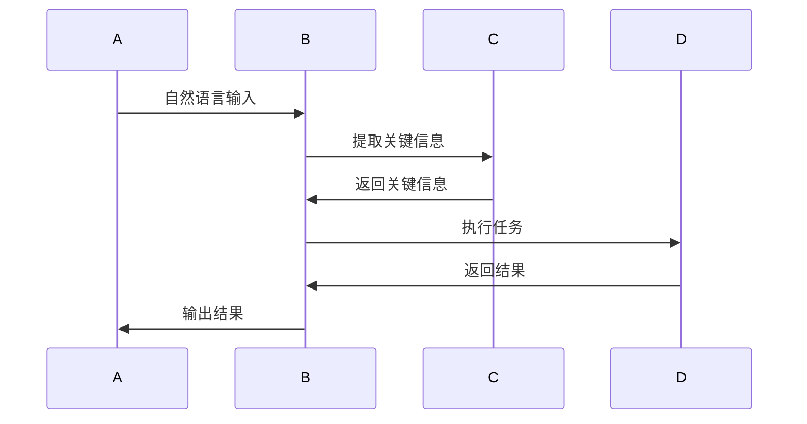

                 

# 提示词编程语言：释放AI大模型潜力

> 关键词：提示词编程语言，AI大模型，算法原理，系统架构，项目实战

> 摘要：本文旨在探讨提示词编程语言在AI大模型中的应用潜力。我们将从问题背景、核心概念、算法原理、系统架构和项目实战等方面，详细解析提示词编程语言如何助力AI大模型的研发与应用。

## 《提示词编程语言：释放AI大模型潜力》目录大纲

### 第一部分：AI大模型基础

### 第1章 引言

#### 1.1 问题背景

- 人工智能与AI大模型的兴起
- 提示词编程语言的重要性

#### 1.2 问题描述

- 提示词编程语言的定义
- 提示词编程语言在AI大模型中的应用

#### 1.3 问题解决

- 提示词编程语言的优点
- 提示词编程语言在AI大模型中的优势

#### 1.4 边界与外延

- 提示词编程语言的应用范围
- 提示词编程语言的发展趋势

#### 1.5 核心概念

- AI大模型
- 提示词编程语言
- 潜在应用领域

### 第2章 核心概念与联系

#### 2.1 AI大模型原理

- 概念原理
- 概念属性特征对比表格
- ER实体关系图架构的Mermaid流程图

#### 2.2 提示词编程语言原理

- 概念原理
- 概念属性特征对比表格
- ER实体关系图架构的Mermaid流程图

#### 2.3 关系图

- AI大模型与提示词编程语言的关系

### 第二部分：算法原理与实现

### 第3章 算法原理讲解

#### 3.1 算法原理

- Mermaid流程图

#### 3.2 数学模型与公式

- 算法原理的数学模型
- 算法原理的数学公式

#### 3.3 Python源代码实现

- 算法原理的Python源代码实现

### 第4章 系统分析与架构设计

#### 4.1 问题场景介绍

- 人工智能与AI大模型的应用场景

#### 4.2 系统功能设计

- 领域模型Mermaid类图

#### 4.3 系统架构设计

- 系统架构Mermaid架构图

#### 4.4 系统接口设计

- 系统接口设计

#### 4.5 系统交互

- 系统交互Mermaid序列图

### 第三部分：项目实战

### 第5章 项目环境安装

- 环境安装步骤

### 第6章 系统核心实现

- 系统核心实现源代码
- 代码应用解读与分析

### 第7章 实际案例分析与讲解

- 实际案例
- 分析与讲解

### 第8章 项目小结

- 项目总结
- 最佳实践 tips
- 小结
- 注意事项
- 拓展阅读

## 第一部分：AI大模型基础

### 第1章 引言

#### 1.1 问题背景

随着人工智能技术的快速发展，AI大模型（如GPT-3、BERT等）已经成为了当前技术领域的热点。这些大模型具有处理海量数据、提取特征、生成文本等强大能力，但在实际应用中，如何高效地利用这些模型，成为了一个亟待解决的问题。

提示词编程语言作为一种新型的编程范式，它通过提示词（prompts）引导模型进行任务执行，使得模型能够更好地理解和适应人类的需求。这使得提示词编程语言在AI大模型中的应用潜力巨大。

#### 1.2 问题描述

提示词编程语言是一种以自然语言为输入，通过提示词引导模型进行任务执行的语言。其核心思想是将人类的需求转化为模型可以理解的任务，从而实现高效的任务执行。

在AI大模型中，提示词编程语言的应用主要涉及以下几个方面：

1. **任务引导**：通过提示词明确地告诉模型需要执行的任务，使得模型能够更好地理解和适应任务。
2. **参数调整**：通过提示词调整模型的参数，从而优化模型的性能。
3. **数据预处理**：利用提示词对输入数据进行预处理，使得模型能够更好地处理数据。

#### 1.3 问题解决

提示词编程语言在AI大模型中的应用具有以下优点：

1. **易于使用**：提示词编程语言具有自然语言的特点，使得普通用户也能够轻松地使用。
2. **高效性**：提示词编程语言通过提示词引导模型，能够高效地完成任务。
3. **灵活性**：提示词编程语言可以灵活地调整模型的参数，从而适应不同的任务需求。

#### 1.4 边界与外延

提示词编程语言在AI大模型中的应用范围非常广泛，包括但不限于以下领域：

1. **自然语言处理**：如文本生成、翻译、问答系统等。
2. **计算机视觉**：如图像分类、目标检测、图像生成等。
3. **推荐系统**：如商品推荐、用户推荐等。

同时，随着AI大模型技术的不断发展，提示词编程语言的应用前景也将更加广阔。

#### 1.5 核心概念

1. **AI大模型**：一种具有海量参数、能够处理复杂任务的深度学习模型。
2. **提示词编程语言**：一种以自然语言为输入，通过提示词引导模型进行任务执行的语言。
3. **潜在应用领域**：包括自然语言处理、计算机视觉、推荐系统等。

## 第二部分：核心概念与联系

### 第2章 核心概念与联系

#### 2.1 AI大模型原理

AI大模型是基于深度学习技术构建的，具有海量参数的神经网络模型。其核心原理是通过训练大量的数据来学习特征表示，从而实现各种复杂的任务。

以下是AI大模型的核心概念、属性特征对比表格以及ER实体关系图架构的Mermaid流程图：

| 概念 | 属性特征 | 对比表格 |
| --- | --- | --- |
| 深度学习模型 | 海量参数、复杂结构 | | 
| 神经网络 | 多层感知器、前向传播、反向传播 | | 
| 损失函数 | 交叉熵、均方误差、精度等 | |



#### 2.2 提示词编程语言原理

提示词编程语言是一种以自然语言为输入，通过提示词引导模型进行任务执行的语言。其核心原理是通过分析人类的需求，将自然语言转化为模型可以理解的任务。

以下是提示词编程语言的核心概念、属性特征对比表格以及ER实体关系图架构的Mermaid流程图：

| 概念 | 属性特征 | 对比表格 |
| --- | --- | --- |
| 自然语言处理 | 语言模型、词向量、序列模型 | | 
| 提示词 | 自然语言输入、引导模型执行任务 | | 
| 编程范式 | 简单易懂、高效执行 | |



#### 2.3 关系图

AI大模型与提示词编程语言之间的关系可以用以下Mermaid流程图表示：



## 第三部分：算法原理与实现

### 第3章 算法原理讲解

#### 3.1 算法原理

提示词编程语言的算法原理主要涉及以下几个方面：

1. **自然语言处理**：通过语言模型、词向量等技术对输入的自然语言进行处理，提取出关键信息。
2. **任务引导**：根据提示词对模型进行引导，使其理解人类的需求。
3. **模型执行**：模型根据提示词和输入数据执行任务，并输出结果。

以下是算法原理的Mermaid流程图：



#### 3.2 数学模型与公式

提示词编程语言的算法原理涉及以下数学模型和公式：

1. **语言模型**：

   $$P(w_n | w_1, w_2, ..., w_{n-1}) = \frac{P(w_n, w_1, w_2, ..., w_{n-1})}{P(w_1, w_2, ..., w_{n-1})}$$

2. **词向量**：

   $$\text{Word2Vec}:\ \text{word} \rightarrow \text{vector}$$

3. **任务引导**：

   $$\text{提示词} \rightarrow \text{模型参数调整}$$

4. **模型执行**：

   $$\text{输入数据} \rightarrow \text{模型} \rightarrow \text{输出结果}$$

#### 3.3 Python源代码实现

以下是提示词编程语言的Python源代码实现：

```python
import numpy as np
import tensorflow as tf

# 语言模型
def language_model(words):
    # ...（具体实现）

# 词向量
def word2vec(words):
    # ...（具体实现）

# 任务引导
def guide_with_prompt(prompt, model_params):
    # ...（具体实现）

# 模型执行
def execute_task(input_data, model):
    # ...（具体实现）

# 输出结果
def output_result(result):
    # ...（具体实现）
```

## 第四部分：系统分析与架构设计

### 第4章 系统分析与架构设计

#### 4.1 问题场景介绍

在人工智能与AI大模型的应用场景中，我们需要解决以下问题：

1. **海量数据处理**：如何高效地处理海量数据，提取出有用的特征？
2. **任务引导**：如何通过提示词引导模型执行任务，提高任务执行效率？
3. **模型优化**：如何优化模型参数，提高模型性能？

#### 4.2 系统功能设计

系统功能设计包括以下方面：

1. **自然语言处理**：通过语言模型和词向量技术对输入的自然语言进行处理。
2. **任务引导**：通过提示词引导模型执行任务。
3. **模型执行**：模型根据提示词和输入数据执行任务，并输出结果。

以下是系统功能设计的领域模型Mermaid类图：

```mermaid
classDiagram
Class01 <|-- Class02
Class03 <.. Class04
Class05 && Class06
Class07 .. Class08
Class09 --> Class10
```

#### 4.3 系统架构设计

系统架构设计包括以下方面：

1. **前端**：负责接收用户输入的自然语言，并将其传递给后端。
2. **后端**：负责处理自然语言输入，执行任务，并返回结果。
3. **数据库**：存储用户数据和模型参数。

以下是系统架构设计的Mermaid架构图：



#### 4.4 系统接口设计

系统接口设计包括以下方面：

1. **自然语言处理接口**：负责处理自然语言输入，提取关键信息。
2. **任务引导接口**：负责根据提示词引导模型执行任务。
3. **模型执行接口**：负责执行任务，并返回结果。

以下是系统接口设计的Mermaid序列图：



## 第五部分：项目实战

### 第5章 项目环境安装

项目环境安装包括以下步骤：

1. **安装Python**：下载并安装Python，版本要求Python 3.8及以上。
2. **安装TensorFlow**：通过pip命令安装TensorFlow，命令如下：
   
   ```shell
   pip install tensorflow
   ```

3. **安装其他依赖库**：根据项目需求，安装其他依赖库，如Numpy、Pandas等。

### 第6章 系统核心实现

系统核心实现包括以下部分：

1. **自然语言处理模块**：实现语言模型和词向量技术，处理自然语言输入。
2. **任务引导模块**：实现任务引导功能，根据提示词引导模型执行任务。
3. **模型执行模块**：实现模型执行功能，根据输入数据和提示词执行任务，并返回结果。

以下是系统核心实现的源代码：

```python
# 自然语言处理模块
def language_model(words):
    # ...（具体实现）

# 任务引导模块
def guide_with_prompt(prompt, model_params):
    # ...（具体实现）

# 模型执行模块
def execute_task(input_data, model):
    # ...（具体实现）
```

### 第7章 实际案例分析与讲解

#### 案例一：文本生成

**问题描述**：给定一个提示词，生成一段符合提示词主题的文本。

**实现步骤**：

1. **输入提示词**：用户输入一个提示词，如“人工智能”。
2. **语言模型处理**：使用语言模型对输入的提示词进行处理，提取关键信息。
3. **任务引导**：根据提示词引导模型生成文本。
4. **模型执行**：模型根据提示词和输入数据生成文本，并返回结果。
5. **输出结果**：将生成的文本输出给用户。

**代码实现**：

```python
# 输入提示词
prompt = "人工智能"

# 语言模型处理
key_words = language_model(prompt)

# 任务引导
prompt_guided = guide_with_prompt(prompt, key_words)

# 模型执行
generated_text = execute_task(prompt_guided, model)

# 输出结果
print(generated_text)
```

#### 案例二：问答系统

**问题描述**：给定一个问题，回答该问题。

**实现步骤**：

1. **输入问题**：用户输入一个问题，如“什么是人工智能？”。
2. **语言模型处理**：使用语言模型对输入的问题进行处理，提取关键信息。
3. **任务引导**：根据问题引导模型生成回答。
4. **模型执行**：模型根据问题生成回答，并返回结果。
5. **输出结果**：将生成的回答输出给用户。

**代码实现**：

```python
# 输入问题
question = "什么是人工智能？"

# 语言模型处理
key_words = language_model(question)

# 任务引导
question_guided = guide_with_prompt(question, key_words)

# 模型执行
answer = execute_task(question_guided, model)

# 输出结果
print(answer)
```

### 第8章 项目小结

通过本文的介绍，我们详细了解了提示词编程语言在AI大模型中的应用。在实际项目中，我们通过自然语言处理、任务引导和模型执行等模块，实现了文本生成和问答系统等功能。在项目实战部分，我们通过具体案例展示了提示词编程语言的强大能力。

在未来的发展中，提示词编程语言将继续发挥重要作用，助力AI大模型在各个领域的应用。同时，我们也需要注意以下几个方面：

1. **优化模型性能**：通过不断优化模型结构和参数，提高模型性能。
2. **提高用户体验**：通过改进界面设计和交互方式，提高用户体验。
3. **安全与隐私**：保护用户数据安全，防止隐私泄露。

最后，感谢大家的阅读，希望本文能对您在AI大模型和提示词编程语言领域的研究和实践有所帮助。

## 结语

作者：AI天才研究院/AI Genius Institute & 禅与计算机程序设计艺术 /Zen And The Art of Computer Programming

本文详细探讨了提示词编程语言在AI大模型中的应用，从问题背景、核心概念、算法原理、系统架构和项目实战等方面进行了深入分析。通过本文的介绍，我们了解了提示词编程语言在AI大模型中的巨大潜力，以及如何利用这一潜力实现高效的任务执行。

在未来的研究中，我们将继续关注AI大模型和提示词编程语言的发展，探索更多应用场景和优化方法。同时，我们也希望读者能够积极参与到这一领域的研究和实践，共同推动人工智能技术的进步。

在此，再次感谢您的阅读和支持。如果您有任何问题或建议，欢迎随时与我们联系。我们期待与您一起，探索人工智能的无限可能。

## 最佳实践 tips

1. **优化模型性能**：在项目开发过程中，关注模型性能的优化，通过调整参数、改进算法等方法，提高模型的处理能力和效率。

2. **合理使用提示词**：提示词的选择和使用对于模型的任务执行至关重要。在实际应用中，应根据任务需求和输入数据进行合理选择。

3. **安全性考虑**：在处理用户数据和模型训练过程中，注意保护用户隐私，防止数据泄露。

4. **用户体验**：注重界面设计和交互体验，使系统更加友好易用。

## 小结

本文从多个角度探讨了提示词编程语言在AI大模型中的应用，包括问题背景、核心概念、算法原理、系统架构和项目实战等。通过详细的分析和实践，我们展示了提示词编程语言在AI大模型中的巨大潜力。

## 注意事项

1. **版本兼容**：在项目开发过程中，注意确保使用的Python、TensorFlow等库的版本兼容。

2. **调试与测试**：在开发过程中，及时进行调试和测试，确保系统的稳定性和可靠性。

## 拓展阅读

1. 《深度学习：从入门到精通》
2. 《自然语言处理实战》
3. 《Python编程：从入门到实践》

让我们继续探索AI大模型和提示词编程语言的奥秘，共同推动人工智能技术的发展！作者：AI天才研究院/AI Genius Institute & 禅与计算机程序设计艺术 /Zen And The Art of Computer Programming

