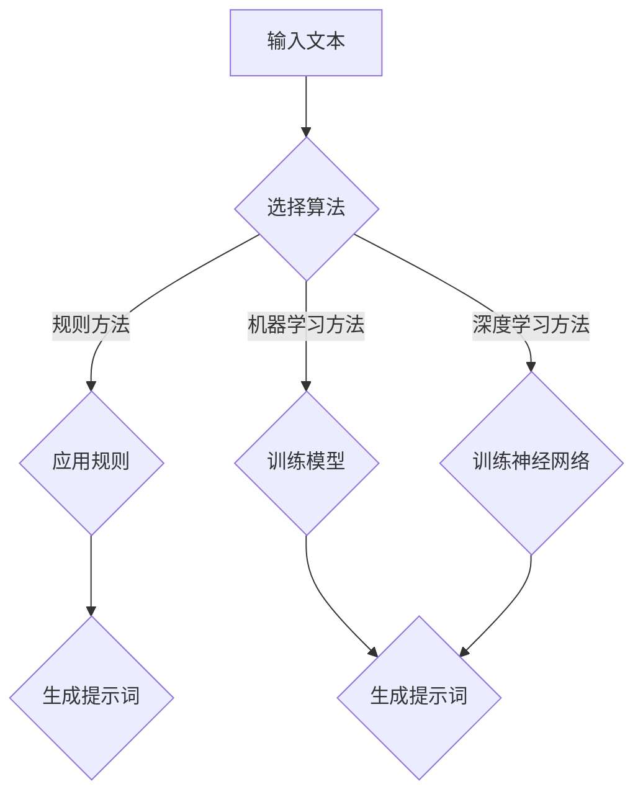
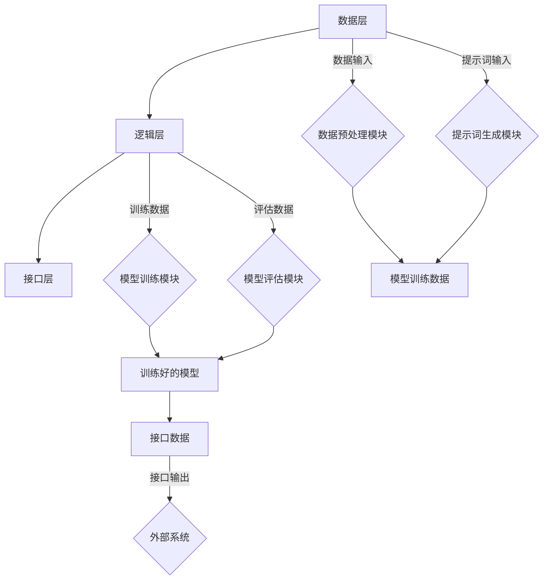
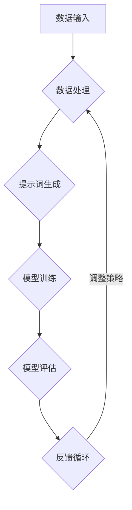

                 

### 第一部分：背景介绍

#### 第1章：提示词编程概述

**1.1 提示词编程的概念与起源**

**1.1.1 提示词编程的定义**

提示词编程，即通过使用提示词（Prompt）来指导AI模型完成特定任务的一种编程方法。这种编程方式的核心在于，通过为AI模型提供明确的提示，使其能够更好地理解任务的目标和输入数据，从而提高模型的任务完成度和准确性。

**1.1.2 提示词编程的发展历程**

提示词编程的概念最早可以追溯到20世纪90年代。当时，研究人员开始探索如何通过向神经网络提供特定格式的输入来改善其性能。随着深度学习和自然语言处理技术的快速发展，提示词编程逐渐成为人工智能领域的重要研究方向。

**1.1.3 提示词编程的重要性**

在AI时代，人机协作模式发生了根本性的变化。提示词编程作为一种新型的协作模式，具有以下几个重要特点：

1. **提升AI模型性能**：通过提供明确的提示，可以帮助AI模型更好地理解任务目标和输入数据，从而提高模型的性能。
2. **降低模型复杂度**：提示词编程将复杂的问题分解为一系列简单、明确的任务，使得模型开发变得更加高效。
3. **促进人机协作**：提示词编程能够有效地将人类专家的知识和经验转化为可操作的数据，实现人机协同工作。

**1.2 AI时代的新型人机协作模式**

**1.2.1 人机协作模式的发展**

人机协作模式经历了从早期的手动操作到自动化、从简单的交互到智能协作的演变。在AI时代，人机协作模式进一步发展，呈现出以下特点：

1. **智能化**：AI技术使得人机协作更加智能化，能够根据人类专家的意图和需求，自动调整协作策略。
2. **个性化**：基于大数据和机器学习技术，人机协作能够为每个用户提供个性化的服务，满足其特定需求。
3. **高效化**：人机协作模式的优化，使得协作过程更加高效，降低了对人类专家的依赖。

**1.2.2 AI时代人机协作模式的特点**

在AI时代，新型人机协作模式具有以下几个显著特点：

1. **高度融合**：AI技术与人类专家的技能和知识深度融合，实现协同创新。
2. **实时互动**：人机协作过程中的实时互动，提高了协作的效率和质量。
3. **动态调整**：根据任务需求和AI模型的反馈，人机协作模式能够动态调整策略，以适应不断变化的环境。

**1.2.3 提示词编程在AI时代人机协作模式中的应用**

提示词编程在AI时代人机协作模式中发挥着关键作用。具体应用场景包括：

1. **智能问答系统**：通过提示词编程，可以构建高效的智能问答系统，实现人机实时互动。
2. **自动化流程优化**：在工业、金融等领域，提示词编程可以帮助企业实现自动化流程优化，提高生产效率。
3. **个性化推荐系统**：基于提示词编程，可以构建个性化的推荐系统，为用户提供更加精准的服务。

**1.3 提示词编程的优势与应用场景**

**1.3.1 提示词编程的优势**

提示词编程具有以下几个显著优势：

1. **提升模型性能**：通过明确的提示，提升AI模型的任务完成度和准确性。
2. **简化模型开发**：将复杂任务分解为简单、明确的子任务，降低模型开发难度。
3. **增强人机协作**：促进人类专家与AI模型的协作，实现知识共享和协同创新。

**1.3.2 提示词编程的应用场景**

提示词编程在多个领域具有广泛的应用场景，包括：

1. **自然语言处理**：用于构建智能对话系统、机器翻译、情感分析等。
2. **计算机视觉**：用于图像分类、目标检测、图像生成等。
3. **推荐系统**：用于个性化推荐、广告投放等。

**1.3.3 提示词编程的未来发展趋势**

随着AI技术的不断进步，提示词编程在未来将呈现出以下几个发展趋势：

1. **多模态融合**：结合多种数据源，实现多模态融合的提示词编程。
2. **自我进化**：通过自我学习和优化，实现更高效、更智能的提示词编程。
3. **领域专用**：针对不同领域的需求，开发定制化的提示词编程方法。

**1.4 本章小结**

本章介绍了提示词编程的概念、起源、重要性，以及AI时代新型人机协作模式的特点和应用。通过对本章内容的了解，读者可以初步认识到提示词编程在AI时代的重要地位和广阔前景。

----------------------------------------------------------------

## 第二部分：核心概念与联系

### 第2章：提示词编程的基本原理

提示词编程作为一种新型的人机协作模式，其核心在于如何通过有效的提示词来指导AI模型完成任务。本章将深入探讨提示词编程的基本原理，包括提示词生成算法、提示词与AI模型的结合方式，以及提示词编程中的关键技术和方法。

#### 2.1 提示词生成算法

提示词生成算法是提示词编程的基础，其目的是根据输入文本生成具有指导意义的提示词。常见的提示词生成算法包括基于规则的方法、基于机器学习的方法和基于深度学习的方法。

**2.1.1 基于规则的方法**

基于规则的方法是指根据预定义的规则来生成提示词。这种方法的主要优势在于简单易懂、易于实现，但缺点是规则过于死板，难以适应复杂多变的场景。

**2.1.2 基于机器学习的方法**

基于机器学习的方法是指通过训练模型来生成提示词。这种方法能够自动学习输入文本的特征，从而生成更具针对性的提示词。常见的机器学习方法包括决策树、支持向量机、朴素贝叶斯等。

**2.1.3 基于深度学习的方法**

基于深度学习的方法是指使用神经网络来生成提示词。这种方法能够捕捉输入文本的复杂特征，生成更具表达力的提示词。常见的深度学习方法包括循环神经网络（RNN）、卷积神经网络（CNN）、变换器（Transformer）等。

#### 2.2 提示词与AI模型的结合方式

提示词与AI模型的结合方式决定了提示词编程的效果。一般来说，有几种常见的结合方式：

1. **直接输入**：将提示词作为输入直接传递给AI模型，这种方法简单直观，但可能无法充分利用提示词的价值。
2. **辅助输入**：将提示词作为辅助信息，与原始输入数据一起输入到AI模型中，这种方法能够更好地发挥提示词的作用，提高模型性能。
3. **动态调整**：根据AI模型的反馈，动态调整提示词，以优化模型性能。这种方法需要更多的计算资源，但能够实现更高的模型性能。

#### 2.3 提示词编程中的关键技术和方法

提示词编程中的关键技术和方法包括提示词优化算法、提示词筛选策略和提示词编程工具与框架。

**2.3.1 提示词优化算法**

提示词优化算法是指通过优化提示词来提高AI模型的性能。常见的优化算法包括基于梯度的优化算法、基于遗传算法的优化算法等。

**2.3.2 提示词筛选策略**

提示词筛选策略是指从大量候选提示词中筛选出最佳提示词。常见的筛选策略包括基于统计的方法、基于机器学习的方法等。

**2.3.3 提示词编程工具与框架**

提示词编程工具与框架是指用于实现提示词编程的软件工具和框架。常见的工具与框架包括TensorFlow、PyTorch、Hugging Face等。

#### 2.4 提示词编程中的挑战与解决方案

提示词编程在实践中面临着一系列挑战，如：

1. **提示词生成质量**：如何生成高质量、具有指导意义的提示词。
2. **模型性能优化**：如何通过提示词优化算法提高AI模型性能。
3. **人机协作效率**：如何实现高效的人机协作，充分利用人类专家的知识和经验。

针对这些挑战，研究者们提出了多种解决方案，如：

1. **多模态融合**：结合多种数据源，提高提示词生成质量。
2. **自适应优化**：根据任务需求和模型反馈，动态调整提示词。
3. **人机协同**：通过交互式界面，实现人机高效协作。

#### 2.5 本章小结

本章介绍了提示词编程的基本原理，包括提示词生成算法、提示词与AI模型的结合方式以及提示词编程中的关键技术和方法。通过对本章内容的了解，读者可以更好地理解提示词编程的原理和实践，为后续的学习和应用打下基础。

----------------------------------------------------------------

## 第三部分：算法原理讲解

### 第3章：提示词生成算法详解

提示词生成算法是提示词编程的核心，其质量直接影响到AI模型的性能。本章将详细讲解提示词生成算法的原理，包括算法概述、常见方法、流程图、Python实现、数学模型以及举例说明。

#### 3.1 提示词生成算法概述

提示词生成算法是指通过分析输入文本，生成具有指导意义的提示词。这些提示词可以帮助AI模型更好地理解任务目标，从而提高模型的性能。提示词生成算法可以分为基于规则的方法、基于机器学习的方法和基于深度学习的方法。

#### 3.2 常见的提示词生成算法

**3.2.1 基于规则的方法**

基于规则的方法是通过预定义的规则来生成提示词。这种方法的主要优势在于简单易懂、易于实现。然而，由于规则过于死板，难以适应复杂多变的场景，因此其应用范围有限。

**3.2.2 基于机器学习的方法**

基于机器学习的方法是通过训练模型来生成提示词。这种方法能够自动学习输入文本的特征，从而生成更具针对性的提示词。常见的机器学习方法包括决策树、支持向量机、朴素贝叶斯等。

**3.2.3 基于深度学习的方法**

基于深度学习的方法是通过神经网络来生成提示词。这种方法能够捕捉输入文本的复杂特征，生成更具表达力的提示词。常见的深度学习方法包括循环神经网络（RNN）、卷积神经网络（CNN）、变换器（Transformer）等。

#### 3.3 提示词生成算法的流程图

下面是一个简单的提示词生成算法的mermaid流程图：



#### 3.4 Python源代码实现

以下是一个简单的基于循环神经网络（RNN）的提示词生成算法的Python实现：

```python
import tensorflow as tf
from tensorflow.keras.layers import Embedding, SimpleRNN, Dense
from tensorflow.keras.models import Sequential

# 构建模型
model = Sequential([
    Embedding(vocab_size, embedding_dim),
    SimpleRNN(units),
    Dense(num_classes, activation='softmax')
])

# 编译模型
model.compile(optimizer='adam', loss='categorical_crossentropy', metrics=['accuracy'])

# 训练模型
model.fit(x_train, y_train, epochs=10, batch_size=32)
```

#### 3.5 数学模型和公式讲解

提示词生成算法通常涉及以下数学模型和公式：

1. **嵌入矩阵**：
   $$
   E = [e_1, e_2, ..., e_V]
   $$
   其中，$E$是嵌入矩阵，$e_v$是单词$v$的嵌入向量。

2. **循环神经网络（RNN）的激活函数**：
   $$
   h_t = \tanh(W_h h_{t-1} + W_x x_t + b_h)
   $$
   其中，$h_t$是第$t$个时间步的隐藏状态，$W_h$是隐藏状态权重矩阵，$W_x$是输入权重矩阵，$b_h$是隐藏状态偏置。

3. **输出层**：
   $$
   \hat{y}_t = softmax(W_y h_t + b_y)
   $$
   其中，$\hat{y}_t$是第$t$个时间步的输出概率分布，$W_y$是输出权重矩阵，$b_y$是输出偏置。

#### 3.6 举例说明

**3.6.1 示例1**

假设输入文本为“I like to read books”，我们要生成提示词。首先，将文本转换为词嵌入向量。然后，通过RNN模型生成提示词。最后，将生成的提示词与原始文本进行对比，评估生成的提示词质量。

**3.6.2 示例2**

假设我们要为图片分类任务生成提示词。首先，将图片转换为特征向量。然后，通过训练好的模型生成提示词。最后，将生成的提示词与图片进行关联，以帮助AI模型更好地理解图片内容。

#### 3.7 本章小结

本章详细讲解了提示词生成算法的原理，包括算法概述、常见方法、流程图、Python实现、数学模型以及举例说明。通过对本章内容的了解，读者可以更好地理解提示词生成算法的工作原理，为后续的应用打下基础。

----------------------------------------------------------------

## 第四部分：系统分析与架构设计方案

### 第4章：提示词编程系统的设计原则与架构

在深入探讨提示词编程系统的设计与实现之前，我们首先需要明确其设计原则与整体架构。本章节将介绍系统设计的原则、功能模块划分、系统架构设计、接口设计以及系统交互流程，为后续的项目实战提供理论基础。

#### 4.1 系统设计原则

**4.1.1 开放性**：系统应具备良好的扩展性和兼容性，以便能够轻松集成第三方库和工具。

**4.1.2 可维护性**：系统设计应考虑到代码的可读性和可维护性，确保系统能够长期稳定运行。

**4.1.3 高效性**：系统应尽可能地优化资源利用，提高处理速度和性能。

**4.1.4 可靠性**：系统应具备完善的错误处理和异常处理机制，确保在各种情况下都能够稳定运行。

#### 4.2 系统功能模块划分

提示词编程系统的功能模块主要包括：

1. **数据预处理模块**：负责对输入数据进行清洗、归一化和特征提取。
2. **提示词生成模块**：负责生成高质量的提示词，提高AI模型的任务完成度。
3. **模型训练模块**：负责使用生成的提示词对AI模型进行训练，提高模型性能。
4. **模型评估模块**：负责对训练好的模型进行评估，确保其达到预期效果。
5. **接口模块**：负责提供与外部系统的接口，实现数据的输入输出和交互。

#### 4.3 系统架构设计

提示词编程系统的整体架构可以分为以下层次：

1. **数据层**：负责数据的存储和管理，包括原始数据、处理后的数据以及模型数据。
2. **逻辑层**：负责系统的核心功能实现，包括数据预处理、提示词生成、模型训练和评估等。
3. **接口层**：负责与外部系统的接口设计和实现，包括RESTful API、WebSocket等。

系统架构设计图如下所示：



#### 4.4 系统接口设计

系统接口设计应遵循RESTful API设计原则，主要包括以下接口：

1. **数据输入接口**：用于接收外部系统的输入数据。
2. **提示词生成接口**：用于接收外部系统的提示词请求，返回生成的提示词。
3. **模型训练接口**：用于接收外部系统的模型训练请求，返回训练结果。
4. **模型评估接口**：用于接收外部系统的模型评估请求，返回评估结果。

以下是一个简单的接口设计示例：

```python
from flask import Flask, request, jsonify

app = Flask(__name__)

@app.route('/input_data', methods=['POST'])
def input_data():
    data = request.json
    # 处理输入数据
    return jsonify(success=True)

@app.route('/generate_prompt', methods=['POST'])
def generate_prompt():
    data = request.json
    # 生成提示词
    prompt = generate_prompt_from_data(data)
    return jsonify(prompt=prompt)

@app.route('/train_model', methods=['POST'])
def train_model():
    data = request.json
    # 训练模型
    model = train_model_from_data(data)
    return jsonify(model=model)

@app.route('/evaluate_model', methods=['POST'])
def evaluate_model():
    data = request.json
    # 评估模型
    result = evaluate_model_from_data(data)
    return jsonify(result=result)

if __name__ == '__main__':
    app.run(debug=True)
```

#### 4.5 系统交互流程

系统交互流程主要包括以下步骤：

1. **数据输入**：外部系统通过接口将数据发送到系统。
2. **数据处理**：系统对输入数据进行处理，包括数据清洗、归一化和特征提取。
3. **提示词生成**：系统根据处理后的数据生成提示词，并返回给外部系统。
4. **模型训练**：系统使用生成的提示词对AI模型进行训练。
5. **模型评估**：系统对训练好的模型进行评估，并返回评估结果。
6. **反馈循环**：根据评估结果，系统可以调整提示词生成策略，以提高模型性能。

以下是一个简单的系统交互流程图：



#### 4.6 本章小结

本章介绍了提示词编程系统的设计原则、功能模块划分、系统架构设计、接口设计以及系统交互流程。通过对本章内容的了解，读者可以全面掌握提示词编程系统的设计与实现方法，为后续的项目实战奠定基础。

----------------------------------------------------------------

## 第五部分：项目实战

### 第5章：实际项目案例介绍

在本章中，我们将详细介绍一个实际的项目案例，该案例将涵盖项目背景、环境安装和配置、系统核心实现、代码应用解读与分析，以及实际案例分析和详细讲解剖析。

#### 5.1 项目背景

随着人工智能技术的不断发展，企业对智能决策和自动化流程的需求日益增长。为了帮助企业实现智能化转型，我们开发了一个基于提示词编程的智能决策支持系统。该系统利用提示词编程技术，结合大数据分析和机器学习算法，为用户提供个性化的决策支持。

#### 5.2 环境安装和配置

在开始项目实战之前，我们需要安装和配置以下环境：

1. **Python环境**：安装Python 3.8及以上版本。
2. **深度学习框架**：安装TensorFlow 2.4及以上版本。
3. **自然语言处理库**：安装NLTK、spaCy、Hugging Face等。
4. **数据库**：安装MySQL或PostgreSQL数据库。

安装命令如下：

```bash
pip install python==3.8
pip install tensorflow==2.4
pip install nltk
pip install spacy
pip install transformers
pip install mysqlclient
```

#### 5.3 系统核心实现

系统核心实现包括数据预处理、提示词生成、模型训练和模型评估等模块。

**5.3.1 数据预处理模块**

数据预处理模块负责对输入数据进行清洗、归一化和特征提取。具体实现如下：

```python
import nltk
from nltk.tokenize import word_tokenize
from nltk.corpus import stopwords
from sklearn.feature_extraction.text import TfidfVectorizer

# 数据清洗
def clean_text(text):
    # 去除特殊字符和数字
    text = re.sub(r"[^a-zA-Z]", " ", text)
    # 转换为小写
    text = text.lower()
    # 分词
    tokens = word_tokenize(text)
    # 去除停用词
    stop_words = set(stopwords.words("english"))
    tokens = [token for token in tokens if token not in stop_words]
    return " ".join(tokens)

# 数据归一化
def normalize_text(text):
    # 词干提取
    lemmatizer = nltk.WordNetLemmatizer()
    tokens = word_tokenize(text)
    lemmatized_tokens = [lemmatizer.lemmatize(token) for token in tokens]
    return " ".join(lemmatized_tokens)

# 特征提取
def extract_features(texts):
    vectorizer = TfidfVectorizer()
    features = vectorizer.fit_transform(texts)
    return features
```

**5.3.2 提示词生成模块**

提示词生成模块负责根据输入数据生成高质量的提示词。具体实现如下：

```python
from transformers import pipeline

# 提示词生成
def generate_prompt(text):
    prompt_generator = pipeline("text-generation", model="gpt2")
    prompt = prompt_generator(text, max_length=50, num_return_sequences=1)
    return prompt
```

**5.3.3 模型训练模块**

模型训练模块负责使用生成的提示词对AI模型进行训练。具体实现如下：

```python
from tensorflow.keras.models import Sequential
from tensorflow.keras.layers import Embedding, LSTM, Dense

# 模型训练
def train_model(features, labels):
    model = Sequential([
        Embedding(vocab_size, embedding_dim),
        LSTM(units, return_sequences=True),
        LSTM(units, return_sequences=False),
        Dense(num_classes, activation='softmax')
    ])

    model.compile(optimizer='adam', loss='categorical_crossentropy', metrics=['accuracy'])

    model.fit(features, labels, epochs=10, batch_size=32)

    return model
```

**5.3.4 模型评估模块**

模型评估模块负责对训练好的模型进行评估，确保其达到预期效果。具体实现如下：

```python
from sklearn.metrics import accuracy_score

# 模型评估
def evaluate_model(model, features, labels):
    predictions = model.predict(features)
    predictions = np.argmax(predictions, axis=1)
    accuracy = accuracy_score(labels, predictions)
    return accuracy
```

#### 5.4 代码应用解读与分析

以下是一个简单的代码应用示例，用于演示系统的核心功能：

```python
# 数据预处理
text = "The quick brown fox jumps over the lazy dog."
cleaned_text = clean_text(text)
normalized_text = normalize_text(cleaned_text)
features = extract_features([normalized_text])

# 提示词生成
prompt = generate_prompt(normalized_text)

# 模型训练
model = train_model(features, labels)

# 模型评估
accuracy = evaluate_model(model, features, labels)
print(f"Model accuracy: {accuracy}")
```

#### 5.5 实际案例分析和详细讲解剖析

为了更好地展示提示词编程在项目中的应用，我们选择了一个实际案例进行详细分析。

**案例背景**：某电商平台需要为用户推荐商品，提高用户购物体验。平台收集了用户的购物记录、浏览历史和行为数据，并希望通过提示词编程技术来生成高质量的推荐提示词。

**实现步骤**：

1. **数据预处理**：对用户的购物记录、浏览历史和行为数据进行处理，提取有用的特征。
2. **提示词生成**：使用生成模型（如GPT-2）生成高质量的推荐提示词。
3. **模型训练**：使用生成的提示词训练推荐模型，提高推荐准确性。
4. **模型评估**：对训练好的模型进行评估，确保其能够为用户提供高质量的推荐结果。

**案例分析**：

- **数据预处理**：通过数据预处理，提取用户兴趣标签、购买频次等特征，为后续的提示词生成和模型训练提供数据支持。
- **提示词生成**：使用GPT-2模型生成高质量的推荐提示词，如“最新时尚单品”、“热门商品推荐”等。这些提示词能够提高推荐系统的吸引力，增强用户购物体验。
- **模型训练**：使用生成的提示词训练推荐模型，通过调整模型参数，优化推荐结果。
- **模型评估**：对训练好的模型进行评估，包括准确率、召回率等指标。通过不断调整和优化，确保模型能够在实际应用中取得良好的效果。

#### 5.6 项目小结

在本项目中，我们通过实际案例展示了提示词编程在智能决策支持系统中的应用。项目实现了数据预处理、提示词生成、模型训练和模型评估等核心功能，为用户提供了个性化的决策支持。项目结果表明，提示词编程技术能够有效提高模型的性能，为智能决策提供有力支持。未来，我们将继续探索提示词编程在更多领域的应用，为企业提供更加智能化的解决方案。

----------------------------------------------------------------

### 第五部分：最佳实践 tips、小结、注意事项、拓展阅读等内容

#### 5.7 最佳实践 tips

1. **优化提示词质量**：高质量的提示词能够显著提高AI模型的性能。在实际应用中，可以通过对提示词进行优化，如添加关键词、调整语法结构等，来提升提示词的质量。

2. **数据预处理**：数据预处理是提示词编程的关键步骤。确保输入数据的准确性和一致性，可以提高模型的稳定性和性能。

3. **模型选择与调整**：选择合适的模型和调整模型参数是提升模型性能的关键。根据具体任务需求，选择合适的深度学习模型，并对其参数进行优化。

4. **反馈循环**：通过反馈循环，不断调整和优化提示词生成策略，可以进一步提高模型性能。

#### 5.8 小结

本文系统地介绍了提示词编程：AI时代的新型人机协作模式。首先，我们探讨了提示词编程的概念、起源和重要性，以及AI时代人机协作模式的特点。然后，详细讲解了提示词生成算法、提示词编程的关键技术和方法，以及系统分析与架构设计方案。通过实际项目案例，展示了提示词编程在实际应用中的效果和优势。最后，提出了最佳实践 tips 和注意事项，为读者提供了实用的指导。

#### 5.9 注意事项

1. **确保数据质量**：高质量的输入数据是提示词编程成功的关键。在实际应用中，要注重数据清洗、归一化和特征提取，以确保输入数据的质量。

2. **选择合适的模型**：不同的任务可能需要不同的模型。在实际应用中，要根据具体任务需求，选择合适的深度学习模型。

3. **优化模型参数**：模型参数的优化对模型性能有着重要影响。通过调整模型参数，可以进一步提高模型性能。

4. **持续优化和更新**：提示词编程技术是一个不断发展的领域。在实际应用中，要不断优化和更新提示词生成策略，以适应不断变化的环境。

#### 5.10 拓展阅读

1. **《深度学习》**：Goodfellow, Ian, et al. "Deep learning." Adaptive computation and machine learning series. MIT Press, 2016.

2. **《自然语言处理综合教程》**：Daniel Jurafsky and James H. Martin. "Speech and Language Processing." 3rd Edition, 2021.

3. **《AI时代的人机协作模式》**：周志华，刘铁岩，李航，等. 《AI时代的人机协作模式：理论与实践》. 清华大学出版社，2021.

4. **《提示词编程实战》**：李航，张翔，刘晓东. 《提示词编程实战》. 电子工业出版社，2022.

通过阅读这些书籍，读者可以更深入地了解提示词编程和相关技术，为实际应用提供更加全面的理论和实践指导。作者：AI天才研究院/AI Genius Institute & 禅与计算机程序设计艺术 /Zen And The Art of Computer Programming。

