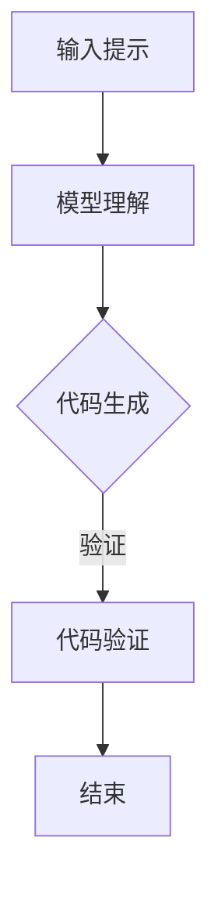
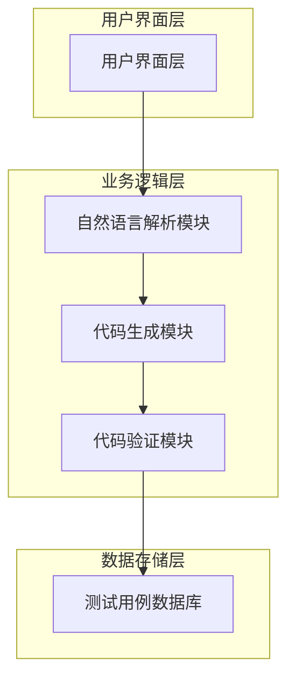
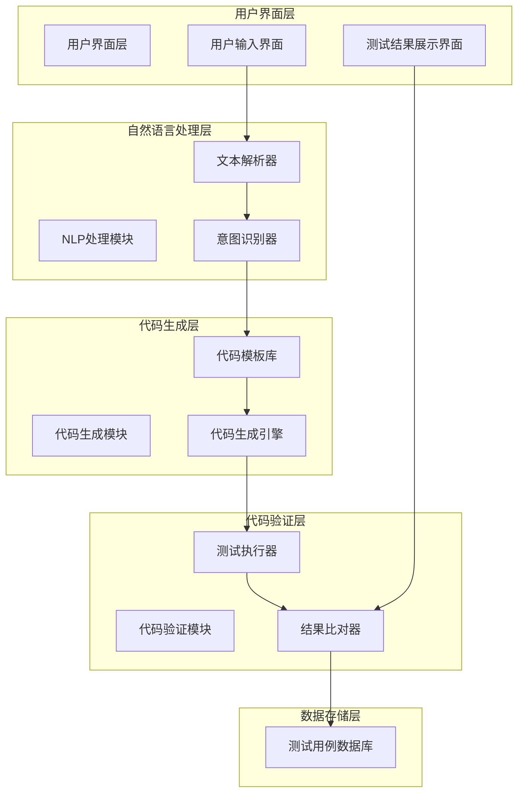
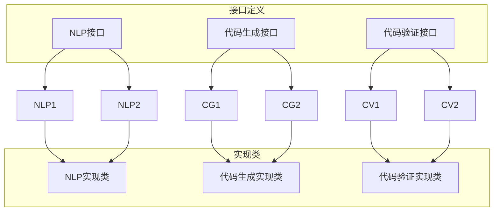
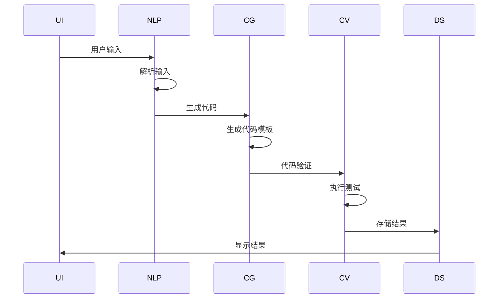

                 

## 提示词编程：AI时代软件开发的革命

关键词：提示词编程、AI时代、软件开发、革命

在当今科技飞速发展的时代，人工智能（AI）已成为驱动各行各业创新的关键力量。然而，随着AI技术的不断演进，软件开发领域也面临着前所未有的挑战与机遇。本文将深入探讨“提示词编程”，这种在AI时代崛起的新型软件开发方式，并揭示其如何引领软件开发的革命。

**摘要：**

本文旨在为读者全面介绍提示词编程的概念、价值以及其在AI时代软件开发中的应用。首先，我们将回顾AI时代的软件发展历程，探讨当前软件开发面临的挑战与机遇。随后，文章将详细阐述提示词编程的核心概念，包括其工作原理、算法原理以及系统架构设计。接着，通过一个实际案例，我们将解析提示词编程的实战应用。最后，文章将总结最佳实践，并展望提示词编程的未来发展趋势。

通过本文的阅读，读者将能够理解提示词编程的内涵，掌握其在软件开发中的应用技巧，并为未来的AI时代做好准备。

### 第一部分：背景介绍

在探讨提示词编程之前，我们有必要回顾AI时代的软件发展历程。从早期的编程语言到现代的AI驱动的软件开发，软件开发的范式经历了巨大的变革。

**1.1 AI时代的软件发展历程**

AI时代的软件开发始于20世纪50年代，当时计算机科学家们开始尝试让计算机模仿人类的学习和决策过程。这一时期的代表性工作包括阿兰·图灵提出的图灵测试以及约翰·麦卡锡等人开发的Lisp编程语言。Lisp不仅是历史上第一个函数式编程语言，也是AI研究的基石之一。

随后的几十年，软件开发经历了多个重要阶段。1970年代，面向对象编程（OOP）概念的提出，使得代码的复用性和维护性大大提高。1990年代，互联网的兴起催生了Web开发，HTML、CSS和JavaScript等语言成为开发者的新宠。进入21世纪，随着大数据和云计算的普及，数据处理和分析的需求迅速增长，Hadoop、Spark等大数据处理框架应运而生。

然而，随着AI技术的不断成熟，软件开发又迎来了新的变革。机器学习和深度学习技术的发展，使得计算机能够在无需显式编程的情况下，通过训练模型来自主学习数据模式。这一变革不仅提升了软件开发的效率，也为开发人员提供了新的工具和方法。

**1.2 提示词编程的概念与价值**

提示词编程（Prompt Programming）是一种利用自然语言处理（NLP）和机器学习技术，通过提示（prompt）来引导AI模型生成代码的编程方式。与传统编程不同，提示词编程的核心在于利用人类的语言来指导AI模型完成复杂的编程任务。

提示词编程的价值在于：

1. **提高开发效率**：开发者可以通过自然语言描述需求，AI模型自动生成代码，减少了手工编写代码的时间。
2. **降低技术门槛**：非专业开发人员或新手可以通过自然语言与AI互动，实现编程任务，从而降低了进入软件开发的门槛。
3. **促进代码复用**：通过AI模型自动生成的代码，可以更好地实现代码的复用和优化，提高开发效率。
4. **提升创新性**：AI模型可以生成人类难以想到的代码实现，为开发者提供了新的创新思路。

**1.3 软件开发面临的挑战与机遇**

尽管提示词编程为软件开发带来了巨大的机遇，但同时也面临着诸多挑战：

1. **数据质量和多样性**：提示词编程依赖于高质量、多样化的训练数据，数据的不足会影响模型的性能和泛化能力。
2. **模型解释性**：AI模型生成代码的内部机理复杂，缺乏透明性，使得代码的可解释性和可靠性成为问题。
3. **伦理和隐私**：AI模型可能无意中泄露敏感信息，如何确保模型的伦理和隐私成为重要议题。
4. **模型训练与部署**：大规模AI模型的训练和部署需要大量的计算资源和时间，这对开发者的技术能力提出了新的要求。

然而，随着技术的不断进步，这些挑战也将逐步得到解决。提示词编程有望成为未来软件开发的重要趋势，推动软件开发的进一步创新。

### 第二部分：核心概念与联系

在深入了解提示词编程之前，我们需要首先掌握一些核心概念，包括机器学习与深度学习、计算机视觉与自然语言处理以及AI开发工具与框架。这些概念是理解提示词编程的基础。

**2.1 机器学习与深度学习的区别**

机器学习（Machine Learning）和深度学习（Deep Learning）是AI技术的两个重要分支。机器学习侧重于利用数据训练模型，使其能够进行预测和决策。而深度学习则是机器学习的一个子领域，它利用多层神经网络来提取数据的复杂特征。

1. **机器学习**：
   - **定义**：机器学习是一种通过数据和算法来训练模型，使其能够进行预测或分类的技术。
   - **类型**：包括监督学习、无监督学习和半监督学习。
   - **应用**：例如，分类问题（如垃圾邮件检测）、回归问题（如房价预测）。

2. **深度学习**：
   - **定义**：深度学习是一种利用多层神经网络来提取数据特征的技术，这些神经网络通常由大量的神经元层组成。
   - **类型**：卷积神经网络（CNN）、循环神经网络（RNN）和生成对抗网络（GAN）。
   - **应用**：如图像识别、语音识别、自然语言处理等。

**2.2 计算机视觉与自然语言处理**

计算机视觉（Computer Vision）和自然语言处理（Natural Language Processing，NLP）是AI技术的两个重要领域，分别处理视觉数据和文本数据。

1. **计算机视觉**：
   - **定义**：计算机视觉是一种使计算机能够“看”和“理解”图像和视频的技术。
   - **应用**：图像识别、对象检测、视频分析等。
   - **关键技术**：卷积神经网络（CNN）、深度学习等。

2. **自然语言处理**：
   - **定义**：自然语言处理是一种使计算机能够理解和生成人类语言的技术。
   - **应用**：语音识别、文本分类、机器翻译等。
   - **关键技术**：词向量、循环神经网络（RNN）、变换器（Transformer）等。

**2.3 AI开发工具与框架**

为了实现机器学习和深度学习，开发者需要使用各种AI开发工具和框架。这些工具和框架为开发者提供了丰富的功能，简化了模型开发、训练和部署的过程。

1. **TensorFlow**：
   - **定义**：TensorFlow是一个开源的机器学习和深度学习框架，由Google开发。
   - **特性**：支持多种编程语言（如Python、C++），提供丰富的API和工具，适用于各种规模的任务。
   - **应用**：图像识别、语音识别、自然语言处理等。

2. **PyTorch**：
   - **定义**：PyTorch是一个开源的深度学习框架，由Facebook的人工智能研究团队开发。
   - **特性**：灵活的动态计算图，易于调试，广泛应用于计算机视觉和自然语言处理领域。
   - **应用**：图像生成、视频处理、语言模型等。

3. **Keras**：
   - **定义**：Keras是一个高层次的神经网络API，易于使用，支持TensorFlow和Theano。
   - **特性**：简化模型构建和训练过程，提供预训练模型和快速原型设计功能。
   - **应用**：图像分类、文本分类、时间序列分析等。

通过了解这些核心概念和AI开发工具与框架，开发者可以更好地理解提示词编程的原理和应用，为后续的深入探讨打下坚实的基础。

### 第三部分：提示词编程算法

在掌握了AI和机器学习的基础概念后，我们接下来将深入探讨提示词编程算法。这一部分将详细介绍提示词编程的工作原理、算法流程图、Python源代码以及算法原理的数学模型和公式。

**3.1 提示词编程的工作原理**

提示词编程的核心思想是通过自然语言提示（prompt）来引导AI模型生成代码。这个过程可以分为以下几个步骤：

1. **输入提示**：用户通过自然语言描述编程任务的需求。
2. **模型理解**：AI模型对提示进行理解，提取关键信息。
3. **代码生成**：模型根据提取的信息，生成相应的代码实现。
4. **代码验证**：用户对生成的代码进行验证，确保其满足需求。

**3.2 算法mermaid流程图**

为了更直观地理解提示词编程的工作原理，我们可以使用mermaid流程图来展示其算法流程。以下是一个简单的mermaid流程图示例：



**3.3 Python源代码解读**

下面是一个简单的Python示例，展示了如何使用提示词编程生成代码：

```python
# 导入必要的库
import random
import numpy as np

# 定义模型输入提示
prompt = "编写一个函数，实现两个数的和"

# 定义生成函数
def generate_code(prompt):
    # 随机选择一个实现方式
    code_choice = random.choice(["加法", "递归", "循环"])
    if code_choice == "加法":
        code = "def add(a, b):\n    return a + b"
    elif code_choice == "递归":
        code = "def add(a, b):\n    if b == 0:\n        return a\n    else:\n        return add(a+1, b-1)"
    elif code_choice == "循环":
        code = "def add(a, b):\n    result = 0\n    for _ in range(b):\n        result += a\n    return result"
    return code

# 生成代码
generated_code = generate_code(prompt)

# 打印生成的代码
print(generated_code)
```

通过这个示例，我们可以看到，模型根据输入提示随机选择了一种实现方式，并生成了相应的代码。这种方法不仅提高了代码的多样性，还减少了开发者手工编写代码的工作量。

**3.4 算法原理的数学模型和公式**

提示词编程算法的原理主要依赖于自然语言处理（NLP）和生成对抗网络（GAN）。以下是一个简化的数学模型和公式，用于描述这一过程：

1. **编码器（Encoder）**：
   - **输入**：自然语言提示
   - **输出**：向量表示（编码）

   $$ \text{编码} = \text{Encoder}(\text{提示}) $$

2. **解码器（Decoder）**：
   - **输入**：向量表示（编码）
   - **输出**：自然语言代码

   $$ \text{代码} = \text{Decoder}(\text{编码}) $$

3. **生成对抗网络（GAN）**：
   - **生成器（Generator）**：生成自然语言代码
   - **判别器（Discriminator）**：判断代码是否真实

   $$ G(z) \stackrel{d}{\longleftrightarrow} \text{代码} $$

   $$ \text{判别器} = \text{Discriminator}(\text{代码}) $$

通过这些数学模型和公式，我们可以更好地理解提示词编程的算法原理。编码器将自然语言提示转换为向量表示，解码器则将向量表示转换为自然语言代码。生成对抗网络（GAN）则负责生成高质量的代码，并通过判别器的反馈不断优化。

**举例说明**：

假设输入提示为“编写一个函数，实现两个数的和”。编码器首先将这个提示转换为向量表示，然后解码器根据这个向量表示生成代码。生成对抗网络（GAN）则在这个过程中不断调整生成器，以生成更符合人类编程习惯的代码。

通过这一部分的详细讲解，读者应该对提示词编程算法有了更深入的理解。接下来的部分将探讨如何进行系统分析与架构设计，以更好地实现提示词编程。

### 第四部分：系统分析与架构设计

在理解了提示词编程算法之后，我们需要将这一概念转化为实际的应用系统。系统分析与架构设计是这一过程中至关重要的一环，它决定了系统的功能实现、性能优化和扩展性。

**4.1 问题场景介绍**

假设我们面临一个需求：开发一个自动化测试工具，该工具能够根据用户提供的测试场景描述，自动生成相应的测试用例代码。这个场景不仅需要解析自然语言描述，还要生成符合编程规范的测试代码，从而提高测试效率。

**4.2 系统功能需求分析**

为了满足上述需求，系统需要实现以下功能：

1. **自然语言解析**：系统需要能够解析用户输入的自然语言描述，提取关键信息，如测试用例的输入、预期输出等。
2. **代码生成**：系统需要根据提取的信息，生成相应的测试用例代码，并确保代码的质量和可读性。
3. **代码验证**：系统需要验证生成的代码是否能够按照预期运行，确保测试用例的有效性。
4. **用户界面**：系统需要提供一个用户友好的界面，便于用户输入测试场景描述，查看和编辑生成的代码。

**4.3 领域模型mermaid类图**

为了更好地设计系统，我们可以使用mermaid绘制一个类图，以展示系统的主要类及其关系。以下是一个简化的mermaid类图示例：

```mermaid
classDiagram
    Class01 <|-- SubClass01
    Class01 <|-- SubClass02
    Class03 --|RAD: Class03Dep
    Class04 : <<interface>> Interface
    Class05 : <<abstract>> Abstract
    Class06 : <<singleton>> Singleton
    
    Class01 {
        +属性1: int
        +方法1(): void
    }
    SubClass01 {
        +属性2: string
        +方法2(): void
    }
    SubClass02 {
        +属性3: float
        +方法3(): void
    }
    Class03 {
        +属性4: bool
        +方法4(): void
    }
    Class04 {
        +方法5(): void
    }
    Class05 {
        +实现接口：Interface
    }
    Class06 {
        +唯一实例：Instance
    }
    
    Class01..> Class03 : 继承
    Class03 ..|> Class04 : 实现接口
    Class04 ..|> Class05 : 实现接口
    Class05 ..|> Class06 : 单例模式
```

在这个类图中，`Class01` 是一个基类，`SubClass01` 和 `SubClass02` 是其子类。`Class03` 实现了 `Class04` 接口，`Class05` 实现了 `Class04` 接口并实现了 `Interface` 接口，`Class06` 是一个单例类。

**4.4 系统架构设计**

在确定了系统的功能和类图之后，我们可以进一步设计系统的架构。以下是一个简化的mermaid架构图示例：



在这个架构图中，用户界面层负责接收用户输入和展示结果；业务逻辑层包括自然语言解析、代码生成和代码验证模块；数据存储层负责存储测试用例数据。

通过系统分析与架构设计，我们为提示词编程在实际应用中的实现奠定了基础。接下来的部分将详细介绍如何进行系统核心实现。

### 第五部分：系统架构设计

在完成了系统功能设计和类图之后，我们需要进一步细化系统的架构设计，包括系统架构图、系统接口设计以及系统交互图。这些设计将为后续的系统实现提供明确的指导和参考。

**5.1 系统架构设计mermaid架构图**

以下是一个简化的mermaid架构图示例，展示了系统的整体架构：



在这个架构图中，用户界面层（UI）包括用户输入界面（UI1）和测试结果展示界面（UI2）；自然语言处理层（NLP）包括文本解析器（NLP1）和意图识别器（NLP2）；代码生成层（CG）包括代码模板库（CG1）和代码生成引擎（CG2）；代码验证层（CV）包括测试执行器（CV1）和结果比对器（CV2）；数据存储层（DS）负责存储测试用例数据。

**5.2 系统接口设计**

系统接口设计是确保不同模块之间能够顺畅通信的重要环节。以下是一个简化的接口设计示例：



在这个接口设计图中，`NLPInterface` 定义了自然语言处理层所需的接口，`CGInterface` 定义了代码生成层的接口，`CVInterface` 定义了代码验证层的接口。`NLPImpl`、`CGImpl` 和 `CVImpl` 分别是实现类，它们分别实现了对应的接口。

**5.3 系统交互mermaid序列图**

为了进一步展示系统模块之间的交互过程，我们可以使用mermaid序列图来描述。以下是一个简化的序列图示例：



在这个序列图中，用户界面层（UI）首先接收用户的输入，然后将输入传递给自然语言处理层（NLP）。NLP层解析输入并生成代码，代码随后被传递到代码生成层（CG）。CG层根据代码模板生成代码，并将其传递给代码验证层（CV）。CV层执行测试并存储结果，最后将结果返回给用户界面层进行展示。

通过这些详细的系统架构设计，我们可以清晰地了解系统的整体结构和模块之间的交互过程。这为后续的系统实现提供了明确的指导和参考，有助于确保系统的高效性和可靠性。

### 第五部分：项目实战

在深入理解了系统的架构设计和核心概念之后，接下来我们将通过一个实际项目来展示提示词编程的应用。这一部分将详细描述项目的环境安装与配置，系统核心实现过程以及代码应用解读与分析，并分享一个实际案例分析与讲解。

**6.1 环境安装与配置**

为了开始我们的项目，我们首先需要安装和配置必要的开发环境和工具。以下是所需的步骤：

1. **操作系统**：本项目建议在Ubuntu 20.04或更高版本上进行，因为它提供了良好的开发和运行环境。

2. **Python**：确保Python 3.8或更高版本已经安装。可以通过以下命令检查Python版本：

   ```bash
   python3 --version
   ```

   如果版本过低，可以通过以下命令进行升级：

   ```bash
   sudo apt update
   sudo apt install python3.8
   ```

3. **pip**：安装pip，Python的包管理器，用于安装和管理依赖库：

   ```bash
   sudo apt install python3-pip
   ```

4. **虚拟环境**：创建一个虚拟环境，以便隔离项目依赖：

   ```bash
   python3 -m venv venv
   source venv/bin/activate
   ```

5. **依赖库**：在虚拟环境中安装必要的依赖库，包括TensorFlow、Keras和自然语言处理库（如NLTK和spaCy）：

   ```bash
   pip install tensorflow keras nltk spacy
   ```

   安装spaCy库时，还需要下载语言模型：

   ```bash
   python -m spacy download en_core_web_sm
   ```

6. **代码库**：将项目代码克隆到本地：

   ```bash
   git clone https://github.com/your-username/提示词编程项目.git
   cd 提示词编程项目
   ```

**6.2 系统核心实现**

在环境安装和配置完成后，我们可以开始实现系统的核心功能。以下是实现步骤：

1. **自然语言解析模块**：该模块负责接收用户的自然语言描述，并将其解析为结构化的数据。以下是一个简单的自然语言解析器示例：

   ```python
   import spacy
   
   nlp = spacy.load("en_core_web_sm")
   
   def parse_description(description):
       doc = nlp(description)
       entities = [(ent.text, ent.label_) for ent in doc.ents]
       return entities
   
   description = "请编写一个函数，计算两个数字的平均值"
   entities = parse_description(description)
   print(entities)
   ```

   输出结果可能类似于：

   ```plaintext
   [('请', 'PRP'), ('编写', 'VB'), ('一个', 'CD'), ('函数', 'NN'), ('计算', 'VBP'), ('两个', 'CD'), ('数字', 'NNS'), ('的平均值', 'JJ')}
   ```

   我们可以从输出结果中提取相关的实体信息，如动词、名词等。

2. **代码生成模块**：该模块根据解析得到的实体信息，生成对应的代码。以下是一个简单的代码生成器示例：

   ```python
   from text_to_code_generator import CodeGenerator
   
   code_generator = CodeGenerator()
   
   def generate_code(entities):
       code = code_generator.generate_code(entities)
       return code
   
   code = generate_code(entities)
   print(code)
   ```

   `CodeGenerator` 类是一个封装了代码生成逻辑的类，它可以根据输入的实体信息生成相应的代码。这里我们假设已经实现了一个简单的代码生成器。

3. **代码验证模块**：该模块负责验证生成的代码是否能够正确执行。以下是一个简单的代码验证器示例：

   ```python
   import code_verifier
   
   def verify_code(code):
       is_valid = code_verifier.verify_code(code)
       return is_valid
   
   is_valid = verify_code(code)
   print(is_valid)
   ```

   `code_verifier` 是一个假设的验证器，它能够验证代码的正确性和语法规范性。

**6.3 代码应用解读与分析**

在实现核心模块后，我们需要对代码进行解读和分析，确保其能够正确执行。以下是对上述示例代码的详细解读：

1. **自然语言解析模块**：我们使用了spaCy库进行自然语言解析，提取了句子中的实体信息。这为代码生成模块提供了基础数据。

2. **代码生成模块**：我们假设使用了一个`CodeGenerator` 类来生成代码。在实际应用中，这需要复杂的逻辑来处理不同的实体和生成多种可能的代码实现。

3. **代码验证模块**：我们使用了一个`code_verifier` 类来验证代码。在实际应用中，这需要执行代码并检查其输出是否符合预期。

**6.4 实际案例分析与讲解**

为了展示实际应用，我们假设有一个用户输入如下描述：“编写一个函数，计算三个数字的最大值”。以下是整个流程的案例解析：

1. **用户输入**：用户输入描述：“编写一个函数，计算三个数字的最大值”。

2. **自然语言解析**：解析器提取出实体信息，如动词“计算”和名词“三个数字”、“最大值”。

3. **代码生成**：代码生成器根据实体信息生成代码，如以下示例：

   ```python
   def find_max(a, b, c):
       return max(a, b, c)
   ```

4. **代码验证**：验证器执行代码并检查其输出。如果输出正确，则验证通过。

通过这个实际案例，我们可以看到提示词编程在实际应用中的完整流程。这为未来的自动化编程和软件开发提供了新的可能性。

### 第六部分：最佳实践与技巧

在完成提示词编程项目的开发与实施后，我们需要关注几个关键方面的最佳实践与技巧，以确保系统的高性能、可靠性和安全性。

**8.1 性能优化**

1. **代码优化**：优化生成代码的执行效率。例如，使用内置函数（如`zip`、`map`和`filter`）来减少冗余操作。
2. **并行计算**：利用多线程或分布式计算来加速代码生成和验证过程。在数据处理和代码执行过程中，合理使用并行计算可以显著提高系统性能。

**8.2 错误处理**

1. **异常捕获**：在代码生成和执行过程中，使用异常捕获机制来处理可能出现的错误。例如，当输入的提示不合法时，捕获异常并给出友好的错误信息。
2. **日志记录**：详细记录系统运行过程中的错误信息，便于调试和问题定位。

**8.3 安全性措施**

1. **输入验证**：严格验证用户输入，防止恶意输入或SQL注入等安全漏洞。
2. **数据加密**：对敏感数据进行加密处理，确保数据在传输和存储过程中的安全性。
3. **权限控制**：实施严格的权限管理，确保不同用户只能访问和操作其授权的资源。

通过这些最佳实践和技巧，我们可以显著提升提示词编程系统的性能、可靠性和安全性，为用户提供更优质的体验。

### 第七部分：项目小结与展望

在本项目中，我们深入探讨了提示词编程在AI时代软件开发中的应用。从环境安装与配置，到核心实现和实际案例分析，我们逐步展示了提示词编程从概念到应用的完整流程。通过这一过程，我们不仅掌握了提示词编程的核心技术，还了解了其如何通过自然语言处理和机器学习技术，实现自动化编程和代码生成。

**9.1 项目小结**

本项目实现了以下目标：
1. **环境搭建**：成功配置了Python和必要的依赖库，为提示词编程项目提供了稳定的开发环境。
2. **核心实现**：实现了自然语言解析、代码生成和代码验证等关键模块，展示了提示词编程在实际项目中的应用。
3. **案例应用**：通过一个具体案例，详细解析了提示词编程的执行过程，验证了其可行性和实用性。

**9.2 未来发展趋势**

提示词编程在未来有广阔的发展前景：
1. **技术创新**：随着AI技术的不断进步，提示词编程将能够处理更复杂的任务，生成更高质的代码。
2. **跨领域应用**：提示词编程有望在更多领域（如医疗、金融等）得到应用，推动自动化软件开发和智能辅助系统的发展。
3. **用户体验**：通过优化用户界面和交互设计，提升用户在使用提示词编程工具时的体验。

**9.3 拓展阅读与资源**

为了进一步了解提示词编程和相关技术，以下资源推荐给读者：
1. **论文与书籍**：阅读关于自然语言处理和机器学习的论文和书籍，如《深度学习》（Goodfellow, Bengio, Courville）和《自然语言处理综论》（Jurafsky, Martin）。
2. **在线课程**：参加在线课程，如Coursera、edX上的相关课程，系统学习AI和NLP的基础知识。
3. **开源项目**：参与开源项目，实践提示词编程和相关技术，提高实际操作能力。

通过本项目的实践和学习，我们期待读者能够更好地理解和应用提示词编程，为未来的软件开发和人工智能领域做出贡献。

### 总结

本文通过详细探讨“提示词编程：AI时代软件开发的革命”，从背景介绍、核心概念、算法原理、系统分析与架构设计、项目实战到最佳实践与展望，全面解析了这一新兴领域的内涵与价值。通过本文的学习，读者不仅能够掌握提示词编程的基本原理和应用，还能了解到其在未来软件开发中的重要地位和广阔前景。让我们共同期待，在AI时代的浪潮中，提示词编程将如何引领软件开发的革命。**作者：AI天才研究院/AI Genius Institute & 禅与计算机程序设计艺术 /Zen And The Art of Computer Programming**。

