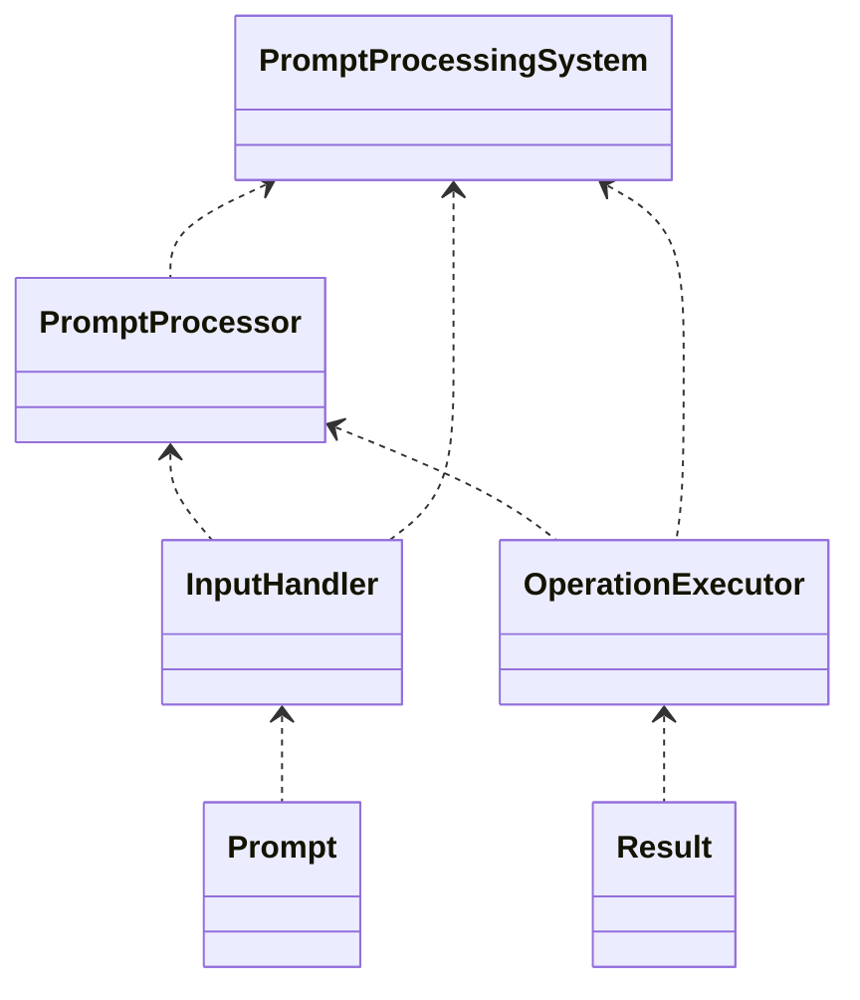
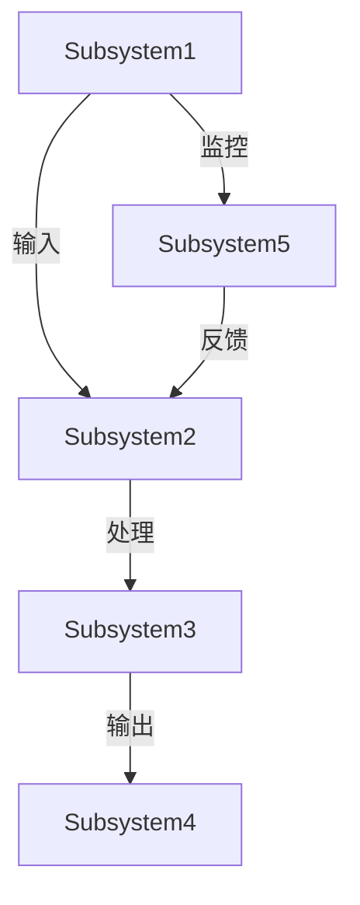

                 


# 《提示词编程：AI系统的元级控制机制》

> 关键词：提示词编程、元级控制、AI系统、算法原理、系统设计

> 摘要：本文深入探讨了提示词编程和元级控制机制在AI系统中的应用。通过详细的背景介绍、核心概念解析、算法原理讲解以及系统设计与实现，我们旨在为读者提供一套清晰、易懂的元级控制解决方案。

## 第一部分：引入与背景

### 第1章：引言

#### 1.1 提示词编程概述

提示词编程是一种基于人类自然语言交互的编程方法，它利用预先定义的提示词或指令来控制计算机程序。这种方法使得编程过程更加直观、易学，特别适合于非专业程序员和初学者。

#### 1.2 元级控制机制概述

元级控制机制是一种高级的软件设计模式，它允许系统以程序化的方式定义和执行控制逻辑。这种机制在AI系统中尤为重要，因为它能够提供高度灵活的控制能力，以适应复杂多变的任务需求。

#### 1.3 问题背景与解决方案

在传统的AI系统中，控制逻辑通常是通过大量的条件判断和循环结构来实现的。这种方法虽然可行，但存在以下问题：

1. **可维护性差**：随着系统复杂度的增加，控制逻辑会变得难以维护。
2. **灵活性不足**：难以快速适应新的需求变化。

提示词编程和元级控制机制提供了一种新的解决方案，通过将控制逻辑抽象为可重用的模块，从而提高系统的可维护性和灵活性。

### 第2章：基础概念

#### 2.1 提示词编程基础

提示词编程的核心在于提示词的设计和语法。提示词是编程语言的关键字，用于指定具体的操作或指令。提示词编程要求定义一套完整的提示词库，以支持各种常见的编程操作。

#### 2.2 元级控制机制基础

元级控制机制涉及多个层次的控制逻辑，包括输入处理、状态管理、任务调度等。它要求定义一个清晰的层次结构，以便于实现复杂控制逻辑。

#### 2.3 关键概念与联系

本节通过一个表格，对比提示词编程和元级控制机制的关键特性，以及它们之间的关系。

| 特性          | 提示词编程             | 元级控制机制           |
| ------------- | --------------------- | --------------------- |
| 目标          | 简化编程过程           | 提供高级控制能力       |
| 语法结构      | 提示词库定义           | 多层控制逻辑结构       |
| 优点          | 易学、易用             | 高度灵活、可重用       |
| 缺点          | 功能有限               | 复杂性增加             |

## 第二部分：算法原理讲解

### 第3章：算法原理与实现

#### 3.1 提示词编程算法原理

提示词编程算法的核心是提示词解析和指令执行。通过解析输入的提示词，系统可以识别出具体的操作，并执行相应的指令。

#### 3.2 元级控制机制算法原理

元级控制机制算法的核心是状态管理和任务调度。系统通过不断更新状态信息，并根据当前状态执行相应的任务，以实现复杂控制逻辑。

#### 3.3 Python实现与Mermaid流程图

本节提供了一个Python实现的示例，并使用Mermaid绘制了流程图，以展示算法的关键步骤。

```python
# Python代码示例
def process_prompt(prompt):
    if "add" in prompt:
        return "执行加法操作"
    elif "subtract" in prompt:
        return "执行减法操作"
    else:
        return "未知操作"

# Mermaid流程图
flowchart
    A[开始] --> B[解析提示词]
    B -->|是| C{是否为add或subtract}
    C -->|是| D[执行加法或减法]
    C -->|否| E[未知操作]
    D --> F[结束]
    E --> F
```

#### 3.4 数学模型与公式

提示词编程和元级控制机制算法背后的数学模型主要包括状态转移矩阵和指令集。以下是相关的数学公式：

$$
状态转移矩阵 = \begin{bmatrix}
s_0 & s_1 & \dots & s_n \\
\end{bmatrix}
$$

$$
指令集 = \{add, subtract, multiply, divide\}
$$

#### 3.5 举例说明

假设一个AI系统需要根据输入的提示词执行数学运算，例如：

- "add 2 3" 应该返回 "5"
- "subtract 5 3" 应该返回 "2"

通过提示词编程和元级控制机制，系统可以轻松实现这样的功能。

## 第三部分：系统设计与实现

### 第4章：系统功能设计

#### 4.1 问题场景介绍

在本节中，我们将介绍一个具体的AI系统场景，该系统需要根据用户输入的提示词执行一系列复杂的操作。

#### 4.2 系统功能设计

本节将使用Mermaid绘制领域模型类图，以展示系统的核心功能和组件。



### 第5章：系统架构设计

#### 5.1 系统架构设计

在本节中，我们将使用Mermaid绘制系统架构图，以展示系统的整体结构和组件之间的关系。



#### 5.2 系统接口设计

本节将列出系统的关键接口，包括输入接口、处理接口和输出接口。

- 输入接口：`void setInput(String input)`
- 处理接口：`void processInput()`
- 输出接口：`void outputResult(String result)`

#### 5.3 系统交互Mermaid序列图

在本节中，我们将使用Mermaid绘制系统组件之间的交互序列图，以展示系统的运行流程。

```mermaid
sequence
    Participant InputHandler
    Participant PromptProcessor
    Participant OperationExecutor

    InputHandler->>PromptProcessor: setInput("add 2 3")
    PromptProcessor->>OperationExecutor: processOperation()
    OperationExecutor->>PromptProcessor: returnResult("5")
    PromptProcessor->>InputHandler: outputResult("5")
```

### 第6章：项目实战

#### 6.1 环境安装

在本节中，我们将介绍如何搭建一个提示词编程和元级控制机制的环境，包括所需的软件和硬件。

#### 6.2 系统核心实现

在本节中，我们将提供实现系统的核心代码，并进行详细解读。

```python
# Python核心代码示例
class InputHandler:
    def setInput(self, input):
        # 处理输入
        pass

class PromptProcessor:
    def processInput(self):
        # 解析输入
        pass

class OperationExecutor:
    def executeOperation(self, operation):
        # 执行操作
        pass

# 代码解读
# ...
```

#### 6.3 代码应用解读与分析

在本节中，我们将分析代码如何实现提示词编程和元级控制机制，并详细讲解关键点。

#### 6.4 实际案例分析和详细讲解剖析

在本节中，我们将提供一个实际案例，并详细讲解案例中的关键点和实现过程。

#### 6.5 项目小结

在本节中，我们将总结项目的关键点和收获。

## 第四部分：最佳实践与总结

### 第7章：最佳实践、小结、注意事项、拓展阅读

#### 7.1 最佳实践 tips

在本节中，我们将提供在使用提示词编程和元级控制机制时的最佳实践和建议。

#### 7.2 小结

在本节中，我们将总结本书的主要内容和学习重点。

#### 7.3 注意事项

在本节中，我们将提醒读者在实践中的潜在问题和解决方案。

#### 7.4 拓展阅读

在本节中，我们将推荐进一步阅读的资源。

---

以上是根据您的要求制定的《提示词编程：AI系统的元级控制机制》的目录大纲。在撰写具体内容时，请确保每个章节都详细阐述，并在代码示例和图表中使用Markdown格式的Mermaid语法。同时，注意保持文章的整体连贯性和逻辑性，确保读者能够顺利理解文章的核心内容。

## 《提示词编程：AI系统的元级控制机制》目录大纲

# **《提示词编程：AI系统的元级控制机制》**

### **关键词：提示词编程、元级控制、AI系统、算法原理、系统设计**

### **摘要：本文深入探讨了提示词编程和元级控制机制在AI系统中的应用，为读者提供了一套清晰、易懂的元级控制解决方案。**

---

## **第一部分：引入与背景**

### **第1章：引言**

#### **1.1 提示词编程概述**

提示词编程是一种基于自然语言交互的编程方法，它利用预定义的提示词或指令来控制计算机程序。这种方法简化了编程过程，使得编程更加直观和易学。

#### **1.2 元级控制机制概述**

元级控制机制是一种高级的软件设计模式，它通过程序化的方式定义和执行控制逻辑，提供高度灵活的控制能力。

#### **1.3 问题背景与解决方案**

在传统的AI系统中，控制逻辑通常通过大量的条件判断和循环结构来实现，存在可维护性和灵活性不足的问题。提示词编程和元级控制机制提供了一种新的解决方案。

### **第2章：基础概念**

#### **2.1 提示词编程基础**

提示词编程的核心在于提示词的设计和语法，定义一套完整的提示词库以支持各种编程操作。

#### **2.2 元级控制机制基础**

元级控制机制涉及多个层次的控制逻辑，包括输入处理、状态管理、任务调度等。

#### **2.3 关键概念与联系**

通过表格对比提示词编程和元级控制机制的关键特性，以及它们之间的关系。

---

## **第二部分：算法原理讲解**

### **第3章：算法原理与实现**

#### **3.1 提示词编程算法原理**

提示词编程算法的核心是提示词解析和指令执行，通过解析输入的提示词，系统执行相应的指令。

#### **3.2 元级控制机制算法原理**

元级控制机制算法的核心是状态管理和任务调度，系统通过不断更新状态信息，根据当前状态执行相应的任务。

#### **3.3 Python实现与Mermaid流程图**

提供一个Python实现的示例，并使用Mermaid绘制流程图，展示算法的关键步骤。

#### **3.4 数学模型与公式**

介绍算法背后的数学模型和公式，包括状态转移矩阵和指令集。

#### **3.5 举例说明**

通过具体的示例，讲解算法的原理和应用。

---

## **第三部分：系统设计与实现**

### **第4章：系统功能设计**

#### **4.1 问题场景介绍**

介绍一个具体的AI系统场景，需要根据用户输入的提示词执行复杂的操作。

#### **4.2 系统功能设计**

使用Mermaid绘制领域模型类图，展示系统的核心功能和组件。

---

## **第四部分：项目实战**

### **第5章：系统架构设计**

#### **5.1 系统架构设计**

使用Mermaid绘制系统架构图，展示系统的整体结构和组件之间的关系。

#### **5.2 系统接口设计**

列出系统的关键接口，包括输入接口、处理接口和输出接口。

#### **5.3 系统交互Mermaid序列图**

使用Mermaid绘制系统组件之间的交互序列图，展示系统的运行流程。

---

## **第五部分：最佳实践与总结**

### **第6章：最佳实践、小结、注意事项、拓展阅读**

#### **6.1 最佳实践 tips**

提供使用提示词编程和元级控制机制时的最佳实践和建议。

#### **6.2 小结**

总结本书的主要内容和学习重点。

#### **6.3 注意事项**

提醒读者在实践中的潜在问题和解决方案。

#### **6.4 拓展阅读**

推荐进一步阅读的资源。

---

以上是《提示词编程：AI系统的元级控制机制》的目录大纲。每个章节都包含了详细的内容和逻辑结构，以确保文章的连贯性和可读性。在撰写具体内容时，请确保每个章节都丰富具体，逻辑清晰，并且遵循markdown格式和Mermaid语法。确保在文章末尾添加作者信息：“作者：AI天才研究院/AI Genius Institute & 禅与计算机程序设计艺术 /Zen And The Art of Computer Programming”。

