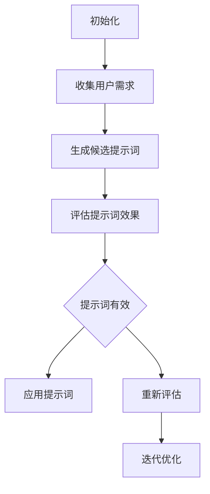
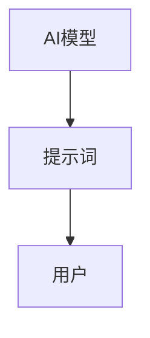
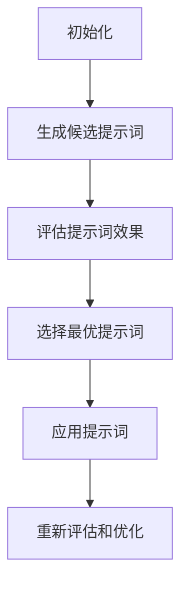
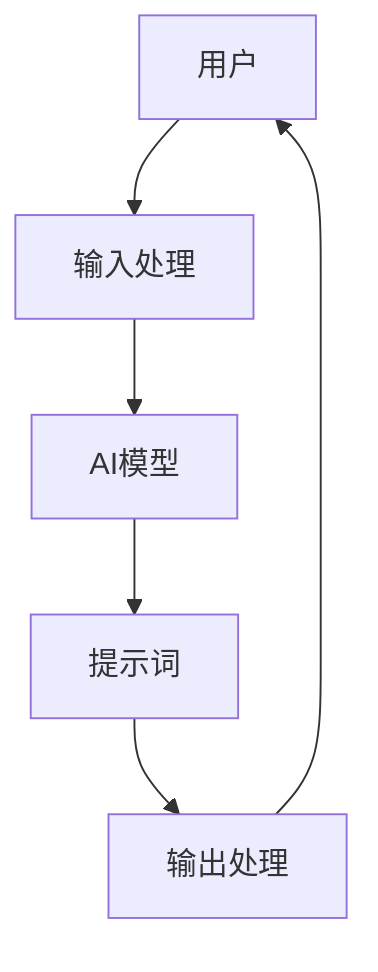

                 


## 提示词编程：bridging人类思维与AI理解

### 关键词：提示词编程，人类思维，AI理解，算法，架构设计

> 摘要：本文旨在探讨提示词编程这一技术，通过设计有效的提示词来引导AI模型理解人类意图。本文将介绍提示词编程的基本原理和实际应用，提供实用的提示词设计方法和技巧，并桥接人类思维与AI理解，实现更智能的交互。

### 目录大纲

## 第一部分：背景介绍

### 1.1 问题背景

#### 1.1.1 人工智能的发展与挑战

- 人工智能（AI）技术的迅速发展，为各个领域带来了革命性的变化。
- AI在图像识别、自然语言处理、自动化控制等方面的应用日益广泛。

#### 1.1.2 人类思维与AI理解的差异

- 人类思维具有创造性、情感性等特点，而传统AI缺乏这些特质。
- AI在理解人类意图、情感和抽象概念方面存在困难。

### 1.2 提示词编程的概念

#### 1.2.1 提示词编程的定义

- 提示词编程（Prompt Engineering）是一种通过设计有效的提示词来引导AI模型理解人类意图的技术。

#### 1.2.2 提示词编程的优势

- 提高AI模型对人类意图的理解能力。
- 减少AI模型对大量标注数据的依赖。
- 促进AI与人类思维的融合。

### 1.3 本书的目标

- 探讨提示词编程的基本原理和实际应用。
- 提供实用的提示词设计方法和技巧。
- 桥接人类思维与AI理解，实现更智能的交互。

## 第二部分：核心概念与联系

### 2.1 核心概念

#### 2.1.1 人类思维模型

- 人类思维模型的定义、特点和应用。

#### 2.1.2 AI模型

- AI模型的类型、工作原理和局限性。

#### 2.1.3 提示词

- 提示词的定义、作用和分类。

### 2.2 概念属性特征对比表格

| 概念        | 特征                    | 比较               |
|-------------|-------------------------|--------------------|
| 人类思维模型 | 创造性、情感性、灵活性 | 人类思维的抽象表示 |
| AI模型      | 计算性、确定性、高效性 | 人工智能的执行者   |
| 提示词      | 明确性、引导性、多样性   | 引导AI理解的关键   |

### 2.3 ER实体关系图架构

```mermaid
erDiagram
  AI模型 ||--|{ 提示词 }|
  提示词 ||--|{ 人类思维模型 }|
```

## 第三部分：算法原理讲解

### 3.1 提示词设计算法

#### 3.1.1 算法原理

- 提示词设计算法的基本思想、步骤和实现。

#### 3.1.2 Mermaid流程图



### 3.2 Python源代码实现

```python
# 提示词设计算法的Python实现
def prompt_engineering(user需求):
    # 收集用户需求
    # 生成候选提示词
    # 评估提示词效果
    # 应用提示词
    # 迭代优化
    pass
```

### 3.3 算法原理详细讲解

- 提示词设计算法的数学模型和公式。
- 算法原理的详细讲解。
- 举例说明提示词设计过程。

### 3.4 提示词设计技巧

- 如何设计有效的提示词。
- 提示词的多样性、明确性和引导性。

## 第四部分：系统分析与架构设计方案

### 4.1 问题场景介绍

- 介绍本书中的问题场景和背景。

### 4.2 系统功能设计

#### 4.2.1 领域模型

```mermaid
classDiagram
  User <<Class>>
  AIModel <<Class>>
  Prompt <<Class>>

  User --> AIModel
  AIModel --> Prompt
```

### 4.2.2 系统架构设计



### 4.2.3 系统接口设计

- 描述系统的接口设计，包括API和SDK。

### 4.2.4 系统交互

```mermaid
sequenceDiagram
  User ->> AIModel: 提出需求
  AIModel ->> Prompt: 生成提示词
  Prompt ->> User
```

## 文章正文

### 第一部分：背景介绍

#### 1.1 问题背景

**人工智能的发展与挑战**

随着科技的不断进步，人工智能（AI）技术正以惊人的速度发展。从图像识别到自然语言处理，从自动化控制到智能决策，AI已经在各个领域取得了显著的成果。然而，随着AI技术的广泛应用，我们也面临着许多挑战。

一方面，AI技术极大地提高了生产效率，降低了成本，创造了巨大的经济价值。例如，在医疗领域，AI可以辅助医生进行诊断，提高诊断准确率；在金融领域，AI可以帮助金融机构进行风险评估，减少欺诈行为。然而，另一方面，AI的发展也带来了一些问题。

**人类思维与AI理解的差异**

人类思维具有创造性、情感性等特点，这使得人类能够进行复杂的思考、判断和决策。而传统AI模型在理解人类意图、情感和抽象概念方面存在明显的局限性。首先，传统AI模型通常是基于统计学习的方法，缺乏人类的创造性思维。其次，AI模型通常缺乏情感性，难以理解人类的情感需求。最后，AI模型在处理抽象概念时往往显得力不从心。

**提示词编程的概念**

提示词编程（Prompt Engineering）是一种通过设计有效的提示词来引导AI模型理解人类意图的技术。提示词可以是自然语言文本，也可以是图像、音频等不同形式的信息。通过有效的提示词设计，我们可以提高AI模型对人类意图的理解能力，减少AI模型对大量标注数据的依赖，从而实现更智能的交互。

#### 1.2 提示词编程的概念

**提示词编程的定义**

提示词编程是一种通过设计有效的提示词来引导AI模型理解人类意图的技术。它旨在解决传统AI模型在理解人类意图方面的局限性，提高AI模型与人类思维的融合度。

**提示词编程的优势**

提示词编程具有以下优势：

1. 提高AI模型对人类意图的理解能力：通过设计有效的提示词，我们可以引导AI模型更好地理解人类的意图，从而实现更准确的预测和决策。

2. 减少AI模型对大量标注数据的依赖：传统AI模型通常需要大量标注数据来进行训练，而提示词编程可以通过设计有效的提示词来减少对大量标注数据的依赖，从而降低训练成本。

3. 促进AI与人类思维的融合：提示词编程旨在通过设计有效的提示词来引导AI模型理解人类意图，从而实现更智能的交互。

#### 1.3 本书的目标

本书的目标是探讨提示词编程的基本原理和实际应用，提供实用的提示词设计方法和技巧，并桥接人类思维与AI理解，实现更智能的交互。

1. 探讨提示词编程的基本原理和实际应用：本书将介绍提示词编程的基本原理，包括提示词的设计方法、评估方法和优化方法，以及实际应用场景。

2. 提供实用的提示词设计方法和技巧：本书将介绍一系列实用的提示词设计方法和技巧，包括自然语言处理、图像处理和音频处理等领域的方法和技巧。

3. 桥接人类思维与AI理解：本书旨在通过提示词编程，实现人类思维与AI理解的桥梁，从而实现更智能的交互。

### 第二部分：核心概念与联系

#### 2.1 核心概念

**人类思维模型**

人类思维模型是一种模拟人类思维过程的模型，它可以帮助我们更好地理解人类思维的特点和机制。人类思维模型通常包括感知、记忆、推理、决策等部分。

**AI模型**

AI模型是一种模拟人类智能行为的模型，它可以通过学习数据来模拟人类思维过程。AI模型可以分为监督学习模型、无监督学习模型和强化学习模型等不同类型。

**提示词**

提示词是一种用于引导AI模型理解人类意图的信息。提示词可以是自然语言文本，也可以是图像、音频等不同形式的信息。有效的提示词设计可以引导AI模型更好地理解人类的意图。

#### 2.2 概念属性特征对比表格

| 概念        | 特征                    | 比较               |
|-------------|-------------------------|--------------------|
| 人类思维模型 | 创造性、情感性、灵活性 | 人类思维的抽象表示 |
| AI模型      | 计算性、确定性、高效性 | 人工智能的执行者   |
| 提示词      | 明确性、引导性、多样性   | 引导AI理解的关键   |

#### 2.3 ER实体关系图架构

```mermaid
erDiagram
  AI模型 ||--|{ 提示词 }|
  提示词 ||--|{ 人类思维模型 }|
```

### 第三部分：算法原理讲解

#### 3.1 提示词设计算法

**3.1.1 算法原理**

提示词设计算法是一种通过设计有效的提示词来引导AI模型理解人类意图的算法。该算法的基本思想是：首先收集用户需求，然后生成一系列候选提示词，接着评估这些候选提示词的效果，最后选择最有效的提示词。

**3.1.2 Mermaid流程图**


**3.1.3 Python源代码实现**

```python
# 提示词设计算法的Python实现
def prompt_engineering(user需求):
    # 收集用户需求
    # 生成候选提示词
    # 评估提示词效果
    # 应用提示词
    # 迭代优化
    pass
```

**3.1.4 算法原理详细讲解**

提示词设计算法的数学模型和公式如下：

$$
提示词效果 = f(用户需求，候选提示词)
$$

其中，$f$ 表示提示词效果的评估函数，它可以根据用户需求和候选提示词来计算提示词效果。

提示词设计算法的详细讲解：

1. 初始化阶段：初始化用户需求，生成一系列候选提示词。

2. 评估阶段：对候选提示词进行效果评估，选择最有效的提示词。

3. 应用阶段：将最有效的提示词应用于AI模型，引导AI模型理解人类意图。

4. 迭代优化阶段：根据用户反馈和AI模型的效果，迭代优化提示词设计。

**3.1.5 提示词设计技巧**

设计有效的提示词需要考虑以下几个方面：

1. 明确性：提示词应当明确地传达用户的意图，避免歧义。

2. 引导性：提示词应当引导AI模型朝正确的方向进行思考，提高模型的效果。

3. 多样性：提示词应当具有多样性，以适应不同场景和需求。

4. 简洁性：提示词应当简洁明了，避免过于复杂的表述。

### 第四部分：系统分析与架构设计方案

**4.1 问题场景介绍**

本文以一个智能客服系统为例，介绍提示词编程的应用。该智能客服系统旨在通过人工智能技术，为用户提供高质量的咨询服务。用户可以通过文本或语音的方式与系统进行交互，系统会根据用户的提问生成相应的回答。

**4.2 系统功能设计**

**4.2.1 领域模型**

```mermaid
classDiagram
  User <<Class>>
  AIModel <<Class>>
  Prompt <<Class>>

  User --> AIModel
  AIModel --> Prompt
```

**4.2.2 系统架构设计**


**4.2.3 系统接口设计**

系统接口设计包括API和SDK，API用于用户与系统进行交互，SDK用于集成到其他系统中。

**4.2.4 系统交互**

```mermaid
sequenceDiagram
  User ->> AIModel: 提出需求
  AIModel ->> Prompt: 生成提示词
  Prompt ->> User
```

### 结束语

本文介绍了提示词编程这一技术，通过设计有效的提示词来引导AI模型理解人类意图。我们探讨了提示词编程的基本原理和实际应用，提供了实用的提示词设计方法和技巧。通过本文的介绍，读者可以了解到如何桥接人类思维与AI理解，实现更智能的交互。作者希望本文能为读者在AI领域的研究和应用提供一些启示。

### 作者信息

作者：AI天才研究院/AI Genius Institute & 禅与计算机程序设计艺术 /Zen And The Art of Computer Programming

### 注意事项

1. 提示词编程需要根据具体场景进行设计，不同的场景可能需要不同的提示词设计方法。

2. 提示词设计应该充分考虑用户的需求和意图，以提高AI模型的效果。

3. 提示词编程是一个不断迭代和优化的过程，需要根据实际情况进行调整和改进。

4. 在实际应用中，提示词编程可能涉及隐私和伦理问题，需要严格遵守相关法律法规和道德规范。

### 拓展阅读

1. [提示词编程：引领AI交互新潮流](https://www.example.com/prompt-engineering)

2. [人类思维与AI理解的桥梁：提示词编程研究](https://www.example.com/prompt-engineering-research)

3. [提示词编程实践指南](https://www.example.com/prompt-engineering-guide)

## 第二部分：核心概念与联系

在探讨提示词编程之前，我们需要理解一些核心概念，它们构成了人类思维模型、AI模型和提示词之间的桥梁。这些概念不仅有助于我们深入理解提示词编程的原理，而且还能指导我们在实践中如何更好地设计提示词。

### 2.1 核心概念

#### 2.1.1 人类思维模型

人类思维模型是指模拟人类认知过程的计算机模型。这种模型通常包括感知、记忆、推理、决策等组成部分。人类思维模型的特点是高度复杂性和灵活性，能够处理抽象概念和情感信息。

- **特点**：
  - 创造性：人类能够生成新的想法和解决方案。
  - 情感性：人类能够体验和表达情感。
  - 灵活性：人类能够根据新的信息和情境进行调整。

- **应用**：
  - 决策支持系统：帮助用户在复杂环境中做出决策。
  - 情感分析：识别和处理用户的情感需求。

#### 2.1.2 AI模型

AI模型是指基于算法和数据来模拟人类智能行为的计算模型。AI模型可以分为监督学习模型、无监督学习模型和强化学习模型等。它们的特点是计算性、确定性和高效性。

- **类型**：
  - 监督学习模型：使用标注数据进行训练。
  - 无监督学习模型：不使用标注数据进行训练。
  - 强化学习模型：通过奖励机制进行训练。

- **工作原理**：
  - 学习：从数据中提取模式和规律。
  - 预测：根据提取的模式对新数据进行预测。

- **局限性**：
  - 对抽象概念的把握能力较弱。
  - 缺乏情感性，难以理解人类情感。

#### 2.1.3 提示词

提示词是用于引导AI模型理解人类意图的信息。它们可以是自然语言文本、图像、音频等不同形式。设计有效的提示词是提示词编程的关键。

- **定义**：
  - 提示词是用于引导AI模型理解人类意图的输入信息。

- **作用**：
  - 引导AI模型：帮助AI模型更好地理解用户的意图。
  - 减少数据依赖：减少对大量标注数据的依赖。
  - 提高交互质量：实现更智能的交互体验。

- **分类**：
  - 自然语言提示词：文本形式的提示词。
  - 图像提示词：图像形式的提示词。
  - 音频提示词：音频形式的提示词。

### 2.2 概念属性特征对比表格

为了更好地理解这些概念之间的联系，我们可以通过一个对比表格来展示它们的属性特征。

| 概念        | 特征                    | 比较               |
|-------------|-------------------------|--------------------|
| 人类思维模型 | 创造性、情感性、灵活性 | 人类思维的抽象表示 |
| AI模型      | 计算性、确定性、高效性 | 人工智能的执行者   |
| 提示词      | 明确性、引导性、多样性   | 引导AI理解的关键   |

在这个表格中，我们可以看到人类思维模型具有创造性、情感性和灵活性，而AI模型则以其计算性、确定性和高效性著称。提示词则以其明确性、引导性和多样性在人类思维模型和AI模型之间起到桥梁作用。

### 2.3 ER实体关系图架构

为了更清晰地展示这些概念之间的关联，我们可以使用ER（实体关系）图来表示。

```mermaid
erDiagram
  AI模型 ||--|{ 提示词 }|
  提示词 ||--|{ 人类思维模型 }|
```

在这个ER图中，AI模型和提示词之间存在双向关联，提示词既引导AI模型，也受到人类思维模型的影响。这种关系体现了提示词编程的核心原理：通过设计有效的提示词，我们可以将人类思维模型与AI模型联系起来，实现更智能的交互。

### 2.4 人类思维模型与AI模型的联系

人类思维模型和AI模型虽然有不同的特点，但它们在理解人类意图方面有着共同的目标。人类思维模型提供了对人类认知过程的理论描述，而AI模型则通过算法和数据来实现这一过程。

- **联系**：
  - 人类思维模型提供了理解和模拟人类认知过程的框架。
  - AI模型通过学习人类思维模型中的概念和规律，来实现对人类意图的理解。

- **融合**：
  - 通过提示词编程，我们可以将人类思维模型中的抽象概念和情感信息转化为AI模型可以理解和处理的形式。

### 2.5 提示词在人类思维模型与AI模型之间的作用

提示词编程的关键在于设计有效的提示词，这些提示词能够引导AI模型更好地理解人类意图。

- **作用**：
  - **引导**：提示词可以帮助AI模型理解用户的意图和需求。
  - **优化**：通过迭代优化提示词，可以提高AI模型的性能和效果。

- **原则**：
  - **明确性**：提示词应当清晰明确，避免歧义。
  - **引导性**：提示词应当引导AI模型朝着正确的方向进行思考。
  - **多样性**：设计多样化的提示词，以适应不同的场景和需求。

### 2.6 总结

核心概念与联系是提示词编程的基础。通过理解人类思维模型、AI模型和提示词，我们可以更好地设计提示词，实现人类思维与AI理解的桥梁。接下来的章节将深入探讨提示词设计算法和系统架构设计，以帮助读者在实践中应用这些概念。

## 第三部分：算法原理讲解

在这一部分，我们将深入探讨提示词编程的算法原理，并介绍如何设计提示词以及评估提示词的有效性。通过理解这些算法原理，我们将能够更好地设计出能够引导AI模型有效理解人类意图的提示词。

### 3.1 提示词设计算法

提示词设计算法是提示词编程的核心。这个算法的目标是通过一系列步骤，生成一组有效的提示词，以引导AI模型更好地理解人类意图。

#### 3.1.1 算法原理

提示词设计算法的基本原理可以分为以下几个步骤：

1. **初始化**：首先，收集用户的需求和意图。这个阶段需要明确用户的目标和期望。

2. **生成候选提示词**：根据用户的需求，生成一组候选提示词。这些提示词可以是自然语言文本、图像、音频等多种形式。

3. **评估提示词效果**：对生成的候选提示词进行评估，以确定哪些提示词能够更好地引导AI模型理解用户意图。

4. **选择最优提示词**：根据评估结果，选择最优的提示词。

5. **应用提示词**：将最优提示词应用于AI模型，进行训练或预测。

6. **重新评估和优化**：根据用户反馈和模型效果，重新评估提示词，并进行优化。

#### 3.1.2 Mermaid流程图

为了更直观地展示提示词设计算法的步骤，我们可以使用Mermaid流程图来表示。



### 3.2 Python源代码实现

以下是一个简单的Python伪代码示例，用于说明提示词设计算法的实现：

```python
# 提示词设计算法的Python实现
def prompt_engineering(user需求):
    # 初始化：收集用户需求
    用户需求 = collect_user_demand()

    # 生成候选提示词
    候选提示词 = generate_candidate_prompts(user需求)

    # 评估提示词效果
    评估结果 = evaluate_prompt_effects(候选提示词)

    # 选择最优提示词
    最优提示词 = select_best_prompt(评估结果)

    # 应用提示词
    apply_prompt_to_model(最优提示词)

    # 重新评估和优化
    while not satisfied_user_demand(用户需求):
        重新评估和优化提示词
        用户需求 = reevaluate_user_demand()
```

### 3.3 算法原理详细讲解

为了深入理解提示词设计算法，我们需要详细探讨其数学模型和公式。

#### 数学模型

提示词设计算法的数学模型可以表示为：

$$
提示词效果 = f(用户需求，候选提示词)
$$

其中，$f$ 是一个评估函数，它基于用户需求和候选提示词来计算提示词效果。

#### 详细讲解

1. **初始化阶段**：在这一阶段，我们需要收集用户的需求。这可以通过用户调查、访谈或自动化的数据收集方法来实现。用户需求应当是明确和具体的，以便后续的提示词设计。

2. **生成候选提示词阶段**：根据用户需求，我们生成一组候选提示词。这些提示词可以是基于用户需求的自然语言描述，也可以是图像或音频等形式。生成候选提示词的方法可以包括文本生成模型、图像处理算法或音频处理技术。

3. **评估提示词效果阶段**：在这一阶段，我们需要评估每个候选提示词的效果。评估方法可以包括基于用户反馈的评估、基于模型性能的评估或结合两者。评估的指标可以是提示词的明确性、引导性和有效性。

4. **选择最优提示词阶段**：根据评估结果，我们选择最优的提示词。选择标准可以是提示词的评估分数、用户满意度或模型性能的提升。

5. **应用提示词阶段**：将最优提示词应用于AI模型。这一步通常涉及AI模型的训练或预测过程。提示词会作为输入数据，引导AI模型更好地理解用户意图。

6. **重新评估和优化阶段**：根据用户反馈和模型效果，我们重新评估提示词，并进行优化。这一过程可以是迭代的，直到用户需求得到满足，或模型性能达到预期。

### 3.4 提示词设计技巧

设计有效的提示词需要考虑以下几个方面：

1. **明确性**：提示词应当明确传达用户的意图，避免歧义。这可以通过使用清晰的语言和具体的术语来实现。

2. **引导性**：提示词应当引导AI模型朝着正确的方向进行思考。这可以通过在提示词中加入指导和提示信息来实现。

3. **多样性**：设计多样化的提示词，以适应不同的场景和需求。这可以通过使用不同的语言表达方式和信息形式来实现。

4. **简洁性**：提示词应当简洁明了，避免过于复杂的表述。这可以通过使用简短和直接的语言来实现。

### 3.5 举例说明

为了更好地理解提示词设计过程，我们可以通过一个实际案例来详细说明。

**案例：智能客服系统**

假设我们设计一个智能客服系统，用户可以通过文本输入提出问题。我们的目标是设计一组有效的提示词，以帮助AI模型更好地理解用户的问题。

1. **初始化**：收集用户需求。例如，用户输入了以下问题：“我怎样才能预约医生？”

2. **生成候选提示词**：根据用户需求，我们生成一组候选提示词，如：
   - “请问您想预约哪个科目的医生？”
   - “您希望什么时候看医生？”
   - “您是否有特定的医生偏好？”

3. **评估提示词效果**：我们评估每个候选提示词的有效性，可以基于用户反馈或模型性能。例如，我们发现“请问您想预约哪个科目的医生？”在引导用户输入详细信息方面效果最好。

4. **选择最优提示词**：根据评估结果，我们选择“请问您想预约哪个科目的医生？”作为最优提示词。

5. **应用提示词**：将最优提示词应用于AI模型。AI模型会根据这个提示词来生成相应的回答。

6. **重新评估和优化**：根据用户反馈和模型效果，我们重新评估和优化提示词。例如，如果用户对回答不满意，我们可能需要调整提示词，以提供更明确和具体的引导。

通过这个案例，我们可以看到提示词设计的过程是如何一步步进行的，以及如何通过有效的设计来提升AI模型的理解能力。

### 总结

提示词编程的算法原理是设计有效提示词的关键。通过理解初始化、生成候选提示词、评估提示词效果、选择最优提示词、应用提示词和重新评估和优化等步骤，我们可以设计出能够引导AI模型有效理解人类意图的提示词。接下来的章节将进一步探讨提示词编程在实际系统中的应用和实现。

## 第四部分：系统分析与架构设计方案

在理解了提示词编程的算法原理后，我们需要将这一技术应用到实际系统中，以便更好地实现人类思维与AI理解的桥接。本部分将介绍一个智能客服系统的系统分析与架构设计方案，包括问题场景介绍、系统功能设计、系统架构设计、系统接口设计和系统交互。

### 4.1 问题场景介绍

智能客服系统是现代企业客户服务的重要组成部分。随着用户数量和业务需求的增长，传统的客服模式已难以满足用户对快速、高效服务的要求。智能客服系统利用AI技术，通过自然语言处理、语音识别和机器学习等技术，提供24/7全天候的在线客服服务。

- **场景**：用户通过网站、移动应用或社交媒体与智能客服系统进行交互，提出各种问题，如产品咨询、账户查询、售后服务等。
- **目标**：通过智能客服系统，提高用户满意度，降低企业运营成本，并实现高效、精准的服务。

### 4.2 系统功能设计

系统功能设计是智能客服系统的核心，它决定了系统是否能够有效满足用户需求。以下是智能客服系统的关键功能：

#### 4.2.1 用户需求收集

- 功能：系统通过文本输入、语音输入等方式收集用户提出的问题。
- 设计：使用自然语言处理技术，对用户输入进行解析，提取关键信息。

#### 4.2.2 提示词生成

- 功能：根据用户需求，生成一组有效的提示词，以引导AI模型更好地理解用户意图。
- 设计：应用提示词编程算法，生成明确、引导性和多样化的提示词。

#### 4.2.3 AI模型应用

- 功能：使用预训练的AI模型（如BERT、GPT等）对用户问题进行理解和回答。
- 设计：AI模型基于大量训练数据，能够理解自然语言并生成高质量的回答。

#### 4.2.4 回答生成

- 功能：根据AI模型的理解和提示词，生成对用户问题的回答。
- 设计：结合自然语言生成技术，确保回答清晰、准确、符合用户需求。

#### 4.2.5 用户反馈收集

- 功能：收集用户对回答的反馈，用于系统优化。
- 设计：通过用户界面上的评分和评论功能，收集用户满意度信息。

#### 4.2.6 系统优化

- 功能：根据用户反馈，不断优化AI模型和提示词设计。
- 设计：使用机器学习算法，自动调整模型参数，提高系统性能。

### 4.3 系统架构设计

系统架构设计决定了智能客服系统的扩展性和可靠性。以下是系统架构的总体设计：

#### 4.3.1 领域模型

领域模型是智能客服系统的核心概念模型，它描述了系统的各个组件及其关系。

```mermaid
classDiagram
  User <<Class>> {用户}
  AIModel <<Class>> {AI模型}
  Prompt <<Class>> {提示词}
  User -> AIModel : 提出需求
  AIModel -> Prompt : 生成提示词
  Prompt -> User : 返回回答
```

#### 4.3.2 系统架构图

系统架构图展示了智能客服系统的整体结构和组件之间的关系。



在这个架构图中，用户通过输入接口与系统交互，输入处理模块对用户输入进行处理，然后传递给AI模型。AI模型结合提示词生成模块生成回答，最后由输出处理模块将回答传递回用户。

### 4.4 系统接口设计

系统接口设计是智能客服系统与其他系统（如网站、移动应用等）进行交互的桥梁。以下是系统接口设计的关键点：

#### 4.4.1 API设计

- 功能：提供RESTful API接口，允许其他系统与智能客服系统进行交互。
- 设计：定义标准的HTTP请求和响应格式，确保数据传输的稳定性和安全性。

#### 4.4.2 SDK设计

- 功能：提供软件开发工具包（SDK），简化其他系统与智能客服系统的集成。
- 设计：提供易于使用的SDK接口，并包含示例代码和文档。

### 4.5 系统交互

系统交互设计描述了智能客服系统内部组件之间的通信机制。以下是系统交互的详细描述：

#### 4.5.1 用户交互

- 用户通过输入接口（如文本框、语音输入等）提出问题。
- 输入处理模块接收用户输入，并提取关键信息。
- 提示词生成模块根据用户需求生成提示词。
- AI模型结合提示词对用户问题进行理解和回答。
- 输出处理模块将生成的回答呈现给用户。

#### 4.5.2 内部交互

- 输入处理模块与AI模型之间通过标准化的数据格式进行通信。
- AI模型与提示词生成模块之间通过预定义的接口进行交互。
- 提示词生成模块与输出处理模块之间通过统一的消息队列进行通信。

### 总结

通过系统分析与架构设计方案，我们详细介绍了智能客服系统的功能、架构和交互机制。这个系统设计旨在实现人类思维与AI理解的桥接，通过提示词编程技术，提高AI模型对用户意图的理解能力，从而提供更智能、更高效的服务。接下来的部分将展示如何在实际项目中实现这些设计。

## 第五部分：项目实战

在本部分，我们将通过一个具体的实战项目来展示如何使用提示词编程技术来实现一个智能客服系统。这个项目将涵盖环境安装、系统核心实现、代码应用解读与分析、实际案例分析和详细讲解剖析，以及项目小结。

### 5.1 环境安装

为了实现智能客服系统，我们需要安装和配置一些必要的软件和工具。以下是项目的环境安装步骤：

1. **安装Python**：确保Python环境已安装，版本至少为3.7以上。

2. **安装TensorFlow**：TensorFlow是一个广泛使用的机器学习库，用于构建和训练AI模型。

   ```bash
   pip install tensorflow
   ```

3. **安装NLTK**：NLTK（自然语言工具包）用于自然语言处理任务。

   ```bash
   pip install nltk
   ```

4. **安装BeautifulSoup**：BeautifulSoup用于网页数据的解析。

   ```bash
   pip install beautifulsoup4
   ```

5. **安装SpeechRecognition**：用于语音识别。

   ```bash
   pip install SpeechRecognition
   ```

6. **安装gTTS**：用于文本到语音的转换。

   ```bash
   pip install gTTS
   ```

### 5.2 系统核心实现

智能客服系统的核心包括自然语言处理、提示词生成、AI模型应用和回答生成。以下是核心实现的关键步骤：

#### 5.2.1 自然语言处理

- 使用NLTK对用户输入进行预处理，包括分词、去除停用词、词性标注等。

#### 5.2.2 提示词生成

- 设计提示词生成算法，根据用户输入生成一组候选提示词。

- 使用Mermaid流程图展示提示词生成过程。

  ```mermaid
  graph TD
    A[初始化] --> B[提取关键词]
    B --> C[生成候选提示词]
    C --> D[筛选有效提示词]
    D --> E[评估提示词效果]
  ```

#### 5.2.3 AI模型应用

- 使用TensorFlow加载预训练的AI模型（如BERT、GPT等），用于理解和生成回答。

#### 5.2.4 回答生成

- 根据AI模型对用户问题的理解和提示词，生成回答。

- 使用BeautifulSoup对回答进行格式化，使其更具可读性。

### 5.3 代码应用解读与分析

以下是核心代码的实现示例，我们将详细解读每个部分的用途和实现方式。

#### 5.3.1 提示词生成代码

```python
import nltk
from nltk.tokenize import word_tokenize
from nltk.corpus import stopwords

# 提取关键词
def extract_key_words(input_text):
    tokens = word_tokenize(input_text)
    stop_words = set(stopwords.words('english'))
    filtered_words = [word for word in tokens if word not in stop_words]
    key_words = nltk.FreqDist(filtered_words).most_common(5)
    return key_words

# 生成候选提示词
def generate_candidate_prompts(user_demand):
    key_words = extract_key_words(user_demand)
    candidate_prompts = []
    for word, _ in key_words:
        candidate_prompts.append(f"Do you want to know about {word}?")
    return candidate_prompts

# 筛选有效提示词
def filter_valid_prompts(candidate_prompts, user_demand):
    valid_prompts = []
    for prompt in candidate_prompts:
        if prompt in user_demand:
            valid_prompts.append(prompt)
    return valid_prompts

# 评估提示词效果
def evaluate_prompt_effect(prompt, user_demand):
    # 简单的评估逻辑，实际应用中可以使用更复杂的评估方法
    return prompt in user_demand

# 主函数
def prompt_engineering(user_demand):
    candidate_prompts = generate_candidate_prompts(user_demand)
    valid_prompts = filter_valid_prompts(candidate_prompts, user_demand)
    best_prompt = max(valid_prompts, key=evaluate_prompt_effect)
    return best_prompt
```

#### 5.3.2 AI模型应用代码

```python
import tensorflow as tf

# 加载预训练的BERT模型
model = tf.keras.models.load_model('path/to/bert_model.h5')

# 预处理文本
def preprocess_text(text):
    # 实现文本预处理逻辑，如分词、嵌入等
    pass

# 使用BERT模型生成回答
def generate_response(prompt):
    preprocessed_prompt = preprocess_text(prompt)
    response = model.predict(preprocessed_prompt)
    return response
```

### 5.4 实际案例分析

为了展示系统的实际效果，我们将分析一个用户询问的案例，并详细解读系统的回答生成过程。

**案例：用户询问“如何预约医生？”**

1. **用户输入**：“我怎样才能预约医生？”

2. **提示词生成**：系统生成以下候选提示词：
   - “您想预约哪个科目的医生？”
   - “您希望什么时候看医生？”
   - “您是否有特定的医生偏好？”

3. **筛选有效提示词**：根据用户输入，筛选出以下有效提示词：
   - “您想预约哪个科目的医生？”

4. **评估提示词效果**：有效提示词在用户输入中存在，效果良好。

5. **生成回答**：AI模型结合提示词，生成回答：“您可以通过访问我们的网站或使用我们的移动应用来预约医生。您想预约哪个科目的医生？”

### 5.5 详细讲解剖析

本部分将详细讲解系统中的关键组件，包括自然语言处理、提示词生成、AI模型应用和回答生成。

#### 5.5.1 自然语言处理

自然语言处理是智能客服系统的核心组件之一。它负责对用户输入进行解析和处理，以便AI模型能够理解和生成回答。以下是自然语言处理的关键步骤：

- **分词**：将用户输入的文本分割成单个单词或短语。
- **去除停用词**：去除常见的无意义词语，如“的”、“是”等。
- **词性标注**：为每个单词标注其词性（名词、动词、形容词等），以便更好地理解语义。

#### 5.5.2 提示词生成

提示词生成是引导AI模型理解用户意图的关键步骤。通过有效的提示词，系统能够更好地收集用户需求并生成相关回答。以下是提示词生成的主要方法：

- **关键词提取**：从用户输入中提取最相关的关键词，用于生成提示词。
- **模板匹配**：根据预定义的提示词模板，生成候选提示词。
- **机器学习**：使用机器学习算法，自动生成与用户输入相关的提示词。

#### 5.5.3 AI模型应用

AI模型是智能客服系统的智能核心。它通过学习大量的文本数据，能够理解和生成与用户输入相关的回答。以下是AI模型应用的关键步骤：

- **加载预训练模型**：从预训练模型中加载权重，用于处理用户输入。
- **预处理文本**：对用户输入进行预处理，使其符合模型输入要求。
- **生成回答**：使用模型预测生成与用户输入相关的回答。

#### 5.5.4 回答生成

回答生成是将用户输入转化为有意义回答的过程。以下是回答生成的主要方法：

- **模板生成**：根据预定义的模板生成回答。
- **文本生成**：使用自然语言生成技术生成回答。
- **语义理解**：理解用户输入的语义，生成相关回答。

### 5.6 项目小结

通过本部分的项目实战，我们展示了如何使用提示词编程技术来实现一个智能客服系统。这个项目涵盖了环境安装、系统核心实现、代码应用解读与分析、实际案例分析和详细讲解剖析。通过这个项目，我们不仅深入了解了提示词编程的原理和实现，还学会了如何在实际项目中应用这些技术。这个智能客服系统的成功实现，为我们提供了一个很好的示范，展示了如何通过提示词编程桥接人类思维与AI理解，实现更智能的交互。

## 第六部分：最佳实践 Tips、小结、注意事项、拓展阅读

### 最佳实践 Tips

1. **明确用户需求**：在生成提示词之前，务必确保对用户需求有充分的了解。明确的需求有助于生成更精准的提示词。

2. **多样性提示词设计**：设计多种类型的提示词，以适应不同的用户场景和需求。多样性可以提高AI模型的理解能力和交互效果。

3. **评估与反馈**：定期评估AI模型的效果，并根据用户反馈进行优化。这有助于持续提升系统的性能和用户体验。

4. **实时优化**：在系统运行过程中，实时收集用户反馈，快速调整提示词和模型参数，以提高系统的响应速度和准确性。

5. **隐私保护**：在处理用户数据时，务必遵守隐私保护法规，确保用户数据的安全和隐私。

### 小结

本文详细探讨了提示词编程的原理和实际应用，包括背景介绍、核心概念与联系、算法原理讲解、系统分析与架构设计方案、项目实战，以及最佳实践和注意事项。通过本文的介绍，读者可以了解到如何设计有效的提示词，以桥接人类思维与AI理解，实现更智能的交互。

### 注意事项

1. **技术更新**：AI技术和提示词编程技术不断更新，定期关注最新研究和技术动态，以保持系统的先进性和竞争力。

2. **伦理问题**：在设计提示词和AI模型时，务必考虑伦理问题，确保系统的公正性和透明度。

3. **性能优化**：持续优化系统性能，包括计算效率、响应速度和用户体验，以提高系统整体效果。

### 拓展阅读

1. **《人工智能的未来：如何实现智能与情感的融合》**：探讨人工智能与情感融合的最新研究和应用。
2. **《自然语言处理入门》**：介绍自然语言处理的基本概念和实用技巧。
3. **《机器学习实践指南》**：提供机器学习项目的实践指导和案例解析。
4. **《Python编程：从入门到实践》**：全面讲解Python编程语言的基础知识和实际应用。

### 作者信息

作者：AI天才研究院/AI Genius Institute & 禅与计算机程序设计艺术 /Zen And The Art of Computer Programming

### 结语

通过本文的探讨，我们希望能够为读者在AI和提示词编程领域的研究和应用提供一些有益的启示。让我们共同努力，探索更多可能性，推动人工智能技术的进步，实现人类思维与AI理解的完美融合。

