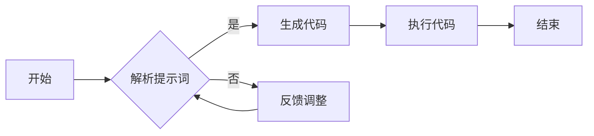
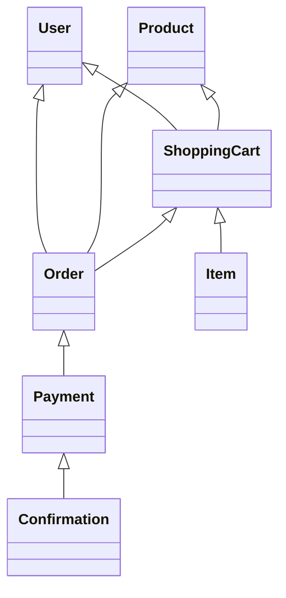
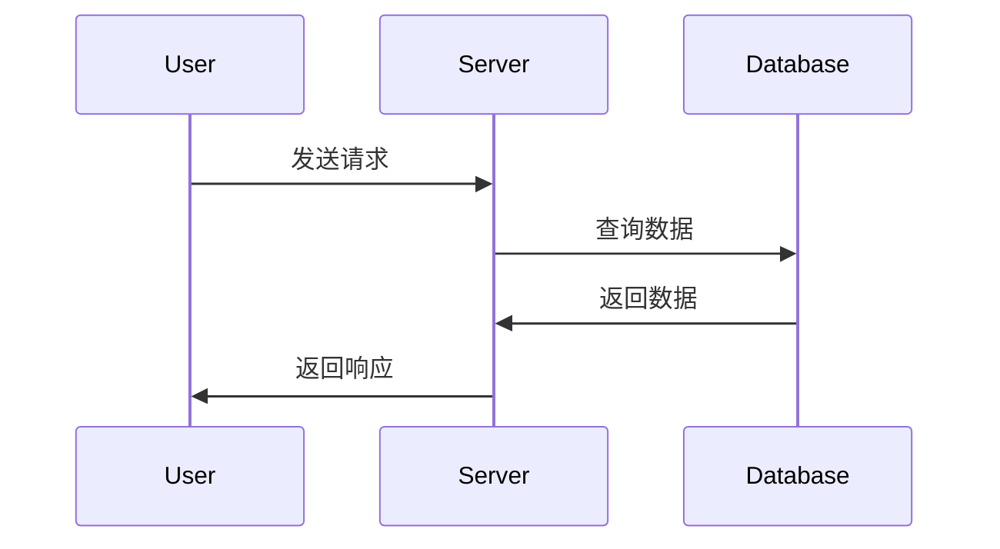
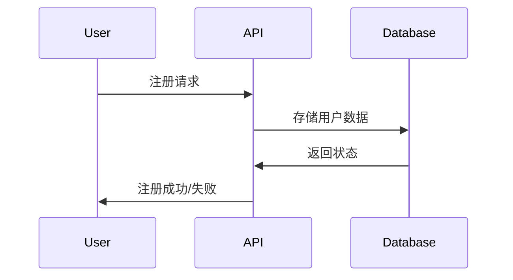

                 

# 提示词编程：bridging人类思维与AI逻辑

> 关键词：提示词编程、人类思维、AI逻辑、桥梁、算法、架构设计、项目实战

> 摘要：本文深入探讨了提示词编程的概念，以及如何利用它来搭建人类思维与AI逻辑之间的桥梁。通过详细的背景介绍、核心概念解析、算法原理讲解、系统分析与架构设计，以及项目实战和最佳实践，本文旨在为读者提供全面、易懂的指导，帮助理解并应用提示词编程技术。

## 第一部分：背景介绍

### 问题背景

随着人工智能技术的快速发展，计算机已经能够执行诸如自然语言处理、图像识别和复杂决策等高级任务。然而，人类与机器之间的沟通仍然存在一定的障碍。编程作为一种重要的沟通方式，如何让计算机更好地理解人类的意图，成为了一个关键问题。提示词编程正是为了解决这一问题而诞生。

### 提示词编程的概念

提示词编程（Instructional Prompt Programming）是指程序员通过提供简明的提示词，让AI帮助完成代码编写的过程。这种技术利用了AI强大的学习和推理能力，将复杂的编程任务转化为人类可理解的指令。

### 人类思维与AI逻辑的桥梁

人类思维和AI逻辑存在显著的差异。人类思维更依赖于抽象、联想和直觉，而AI逻辑则更注重逻辑推理和模式识别。提示词编程的作用在于搭建这两者之间的桥梁，使得程序员能够以人类思维的方式指导AI执行任务。

## 第二部分：核心概念与联系

### 核心概念与原理

1. **提示词**：提示词是程序员提供的简明指令，用于指导AI进行代码编写。这些指令通常包含目标、条件和限制等信息。

2. **AI逻辑**：AI逻辑是指AI在执行任务时所遵循的推理过程。它依赖于机器学习、自然语言处理和自动化技术等。

### 概念属性特征对比表格

| 特征                | 人类思维                      | AI逻辑                           |
|---------------------|-------------------------------|-----------------------------------|
| 表达方式            | 抽象、直观、联想丰富          | 明确、逻辑、基于数据和算法       |
| 推理过程            | 直觉、经验驱动                | 数据驱动、算法驱动               |
| 学习方式            | 经验学习和模式识别            | 数据训练和参数优化               |
| 应对不确定性        | 联想、直觉和经验              | 概率模型和鲁棒性设计             |

### ER实体关系图架构

```mermaid
erDiagram
  Person ||--|{ CodeWriter } : writes
  CodeWriter ||--| AI : guides
  AI ||--| Code : generates
```

在这个ER图中，`Person`（人类）通过`CodeWriter`（代码编写者）与`AI`（人工智能）交互，`AI`负责生成`Code`（代码）。

## 第三部分：算法原理讲解

### 算法mermaid流程图



### Python源代码示例

```python
def generate_code(prompt):
    # 假设这是一个简单的提示词处理算法
    if "add" in prompt:
        return "def add(a, b):\n    return a + b"
    elif "multiply" in prompt:
        return "def multiply(a, b):\n    return a * b"
    else:
        return "未识别的提示词"

# 示例提示词
prompt = "编写一个计算两个数乘积的函数。"

# 生成代码
code = generate_code(prompt)
print(code)
```

### 数学模型和公式

提示词编程的数学模型可以看作是一个从自然语言到代码的映射过程。假设有一个提示词序列`P = [p1, p2, ..., pn]`，我们需要找到一个映射函数`f`，使得每个提示词`pi`都能被映射到相应的代码段`ci`：

$$ f(P) = [c1, c2, ..., cn] $$

其中，`ci`可以是如下形式：

$$ c_i = code\_segment \; generated \; from \; p_i $$

### 详细讲解和举例说明

假设我们有一个提示词：“编写一个计算两个数之和的函数。”

1. **解析提示词**：首先，我们需要识别出关键词，如“计算”、“两个数”、“和”、“函数”等。
2. **生成代码**：基于这些关键词，我们可以生成相应的代码段，例如：

```python
def add_numbers(a, b):
    return a + b
```

3. **代码执行**：将生成的代码段放入开发环境中执行，验证其功能。

通过这样的流程，我们就可以利用提示词编程快速生成代码。

## 第四部分：系统分析与架构设计方案

### 问题场景介绍

假设我们需要开发一个在线购物网站，其中包括用户注册、商品浏览、购物车管理和订单处理等功能。

### 系统功能设计（领域模型mermaid类图）



### 系统架构设计（mermaid架构图）



### 系统接口设计和系统交互（mermaid序列图）



## 第五部分：项目实战

### 环境安装

在安装提示词编程环境之前，确保已安装Python和必要的库，如`numpy`、`pandas`和`tensorflow`。

```bash
pip install numpy pandas tensorflow
```

### 系统核心实现源代码

```python
# 假设我们有一个简单的提示词处理API
from flask import Flask, request, jsonify

app = Flask(__name__)

@app.route('/generate_code', methods=['POST'])
def generate_code():
    prompt = request.form['prompt']
    # 调用代码生成函数
    code = generate_code(prompt)
    return jsonify({'code': code})

if __name__ == '__main__':
    app.run()
```

### 代码应用解读与分析

这个简单的API接收一个提示词，通过调用`generate_code`函数生成相应的代码，并将其返回给用户。

```python
def generate_code(prompt):
    # 这是一个简单的实现，实际应用中会更加复杂
    if "add" in prompt:
        return "def add(a, b):\n    return a + b"
    elif "multiply" in prompt:
        return "def multiply(a, b):\n    return a * b"
    else:
        return "未识别的提示词"
```

### 实际案例分析和详细讲解剖析

假设我们需要实现一个函数来计算两个日期之间的天数差。通过提示词编程，我们可以快速生成相应的代码：

```plaintext
编写一个函数，计算两个日期之间的天数差。
```

生成的代码：

```python
from datetime import datetime

def days_between_dates(date1, date2):
    d1 = datetime.strptime(date1, "%Y-%m-%d")
    d2 = datetime.strptime(date2, "%Y-%m-%d")
    return (d2 - d1).days
```

### 项目小结

通过这个项目，我们了解了如何使用提示词编程快速生成代码。虽然这个例子非常简单，但它展示了提示词编程的强大潜力。在实际开发中，我们可以通过训练更复杂的模型来提高代码生成的准确性。

## 第六部分：最佳实践与拓展

### 最佳实践 tips

1. **明确提示词**：确保提示词清晰明确，避免歧义。
2. **逐步细化**：在代码生成过程中，逐步细化提示词，以提高准确性。
3. **持续优化**：根据反馈持续优化提示词处理算法。

### 小结

本文介绍了提示词编程的概念、原理和应用，通过实际案例展示了如何利用它来快速生成代码。提示词编程为人类思维与AI逻辑之间搭建了一座桥梁，具有巨大的潜力。

### 注意事项

1. 提示词编程依赖于AI模型的质量，因此需要选择合适的模型。
2. 在实际应用中，需要对代码生成结果进行验证和测试。

### 拓展阅读

1. 《深度学习》：Ian Goodfellow、Yoshua Bengio、Aaron Courville 著
2. 《机器学习实战》：Peter Harrington 著
3. 《编程珠玑》：Jon Bentley 著

## 作者信息

作者：AI天才研究院/AI Genius Institute & 禅与计算机程序设计艺术 /Zen And The Art of Computer Programming

[End of Document]

