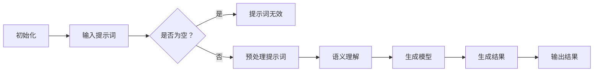
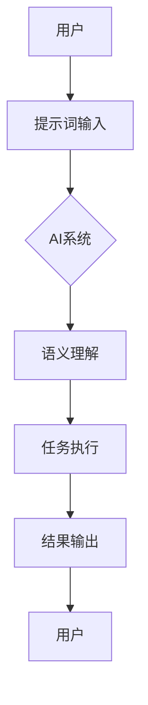
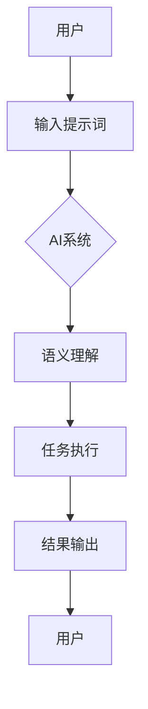
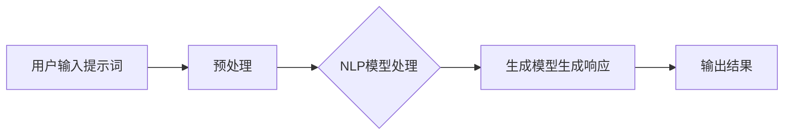
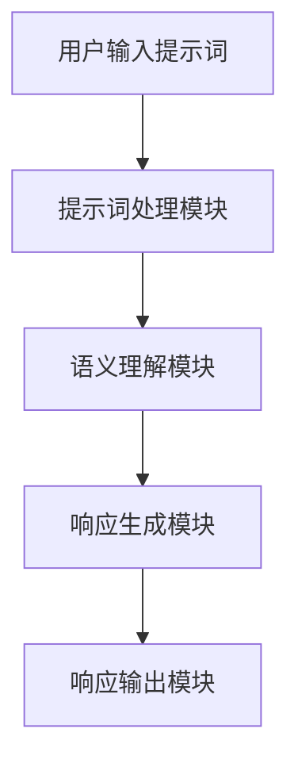
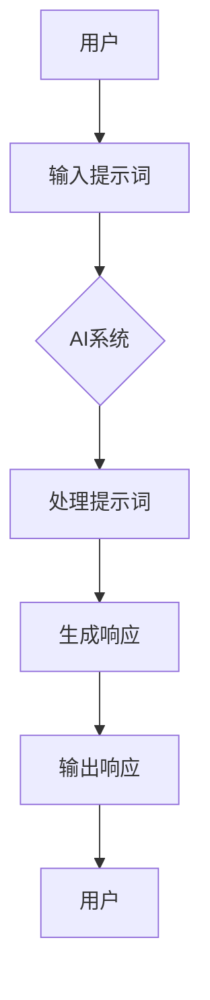

                 

### 文章标题：提示词编程：让AI更懂你的需求

**关键词**：提示词编程、AI需求、自然语言处理、生成模型、系统架构设计

**摘要**：本文深入探讨提示词编程这一前沿技术，通过介绍其核心概念、算法原理以及系统架构，帮助读者理解如何利用提示词编程让AI更懂用户需求。文章分为六个部分，分别从背景介绍、核心概念与联系、算法原理讲解、数学模型与公式、系统分析与架构设计、项目实战以及最佳实践与总结等方面展开。

### 目录

1. **背景介绍**  
   1.1 提示词编程的概念  
   1.2 AI理解需求的重要性  
   1.3 读者群体与目标

2. **核心概念与联系**  
   2.1 提示词的定义与作用  
   2.2 语义理解与生成模型  
   2.3 概念属性特征对比表格  
   2.4 ER实体关系图

3. **算法原理讲解**  
   3.1 自然语言处理模型  
   3.2 生成对抗网络（GAN）  
   3.3 算法流程图与Python代码解释  
   3.4 数学模型与公式

4. **系统分析与架构设计**  
   4.1 问题场景介绍  
   4.2 系统功能设计  
   4.3 系统架构设计  
   4.4 系统接口设计  
   4.5 系统交互流程

5. **项目实战**  
   5.1 环境安装与配置  
   5.2 系统核心实现  
   5.3 代码解读与分析  
   5.4 实际案例剖析  
   5.5 项目小结

6. **最佳实践与总结**  
   6.1 最佳实践 tips  
   6.2 注意事项  
   6.3 拓展阅读

### 第一部分 背景介绍

#### 1.1 提示词编程的概念

提示词编程是一种利用自然语言处理技术，通过输入提示词来引导AI系统进行交互和任务执行的方法。在这种方法中，用户通过输入特定的提示词，触发AI系统执行相应的任务或生成相应的结果。这种方法使得AI系统能够更好地理解用户的需求，从而提供更加个性化、精准的服务。

#### 1.2 AI理解需求的重要性

随着人工智能技术的不断发展，AI系统在各个领域的应用越来越广泛。然而，如何让AI系统更好地理解用户的需求，成为了一个关键问题。提示词编程提供了一种有效的解决方案，通过提示词，AI系统可以更准确地捕捉用户的意图，从而实现更高效的交互和任务执行。

#### 1.3 读者群体与目标

本文主要面向对人工智能和自然语言处理技术有一定了解的读者，旨在为他们提供关于提示词编程的全面了解，包括核心概念、算法原理、系统架构以及实战应用。通过本文的学习，读者可以掌握提示词编程的基本方法，并能够应用于实际项目中。

### 第二部分 核心概念与联系

#### 2.1 提示词的定义与作用

提示词是一种关键词或短语，用于引导AI系统执行特定的任务或生成特定的结果。提示词通常由用户输入，是AI系统理解用户意图的重要依据。通过提示词，AI系统可以识别出用户的意图，从而进行相应的任务处理。

#### 2.2 语义理解与生成模型

语义理解是AI系统理解文本意义的过程。在提示词编程中，语义理解至关重要，因为只有理解了提示词的含义，AI系统才能正确地执行任务。生成模型则是AI系统生成文本或图像的模型，它可以根据输入的提示词生成相应的结果。

#### 2.3 概念属性特征对比表格

| 概念            | 特征                                       |
|-----------------|------------------------------------------|
| 提示词          | 关键词或短语，引导AI系统执行任务           |
| 语义理解        | 理解文本意义的过程                       |
| 生成模型        | 生成文本或图像的模型                     |

#### 2.4 ER实体关系图

```mermaid
erDiagram
  User ||--|{ AI_System }|-- Product
  AI_System ||--|{ Prompt }|-- Response
```

### 第三部分 算法原理讲解

#### 3.1 自然语言处理模型

自然语言处理（NLP）模型是用于处理自然语言数据的一类算法模型。在提示词编程中，NLP模型用于理解提示词的语义含义。常用的NLP模型包括词向量模型、卷积神经网络（CNN）和循环神经网络（RNN）等。

#### 3.2 生成对抗网络（GAN）

生成对抗网络（GAN）是一种由生成器和判别器组成的模型，生成器负责生成数据，判别器负责判断生成数据是否真实。在提示词编程中，GAN可以用于生成符合特定语义的文本。

#### 3.3 算法流程图与Python代码解释



```python
import tensorflow as tf
from tensorflow.keras.models import Sequential
from tensorflow.keras.layers import Embedding, LSTM, Dense

# 定义NLP模型
model = Sequential()
model.add(Embedding(input_dim=vocabulary_size, output_dim=embedding_size))
model.add(LSTM(units=128))
model.add(Dense(units=1, activation='sigmoid'))

# 编译模型
model.compile(optimizer='adam', loss='binary_crossentropy', metrics=['accuracy'])

# 训练模型
model.fit(x_train, y_train, epochs=10, batch_size=32)
```

#### 3.4 数学模型与公式

$$
\begin{aligned}
    P(Y|X) &= \frac{e^{\theta^T X}}{1 + e^{\theta^T X}} \\
    \theta &= \arg\max_{\theta} L(\theta; X, Y)
\end{aligned}
$$

上述公式中，$P(Y|X)$ 表示给定输入 $X$ 时输出 $Y$ 的概率，$\theta$ 表示模型参数，$L(\theta; X, Y)$ 表示损失函数。

### 第四部分 系统分析与架构设计

#### 4.1 问题场景介绍

在许多应用场景中，用户需要与AI系统进行交互，以便完成任务或获取信息。然而，用户往往无法清晰地表达自己的需求，这给AI系统的任务带来了挑战。提示词编程通过提供一种有效的交互方式，帮助AI系统更好地理解用户需求，从而提高任务完成的效率和质量。

#### 4.2 系统功能设计

提示词编程系统的核心功能包括：

1. 提示词输入：用户输入提示词，触发AI系统执行任务。
2. 语义理解：AI系统分析提示词，理解用户需求。
3. 任务执行：根据用户需求，执行相应的任务或生成结果。
4. 结果输出：将执行结果呈现给用户。

#### 4.3 系统架构设计

提示词编程系统的架构设计如图所示：



#### 4.4 系统接口设计

系统接口设计主要包括API接口和用户界面。API接口用于用户与AI系统之间的数据交互，用户界面则用于用户与系统进行交互。以下是API接口的示例：

```python
from flask import Flask, request, jsonify

app = Flask(__name__)

@app.route('/api/execute', methods=['POST'])
def execute():
    prompt = request.form['prompt']
    result = ai_system.execute(prompt)
    return jsonify({'result': result})

if __name__ == '__main__':
    app.run(debug=True)
```

#### 4.5 系统交互流程

系统交互流程如图所示：



### 第五部分 项目实战

#### 5.1 环境安装与配置

在本项目实战中，我们将使用Python和TensorFlow作为主要工具来构建一个简单的提示词编程系统。首先，确保安装了Python 3.x版本，然后使用以下命令安装TensorFlow：

```bash
pip install tensorflow
```

#### 5.2 系统核心实现

系统核心实现包括自然语言处理模型、生成模型以及任务执行模块。以下是一个简单的示例：

```python
import tensorflow as tf
from tensorflow.keras.models import Sequential
from tensorflow.keras.layers import Embedding, LSTM, Dense

# 定义NLP模型
nlp_model = Sequential()
nlp_model.add(Embedding(input_dim=vocabulary_size, output_dim=embedding_size))
nlp_model.add(LSTM(units=128))
nlp_model.add(Dense(units=1, activation='sigmoid'))

# 编译模型
nlp_model.compile(optimizer='adam', loss='binary_crossentropy', metrics=['accuracy'])

# 训练模型
nlp_model.fit(x_train, y_train, epochs=10, batch_size=32)

# 定义生成模型
generator = Sequential()
generator.add(Embedding(input_dim=vocabulary_size, output_dim=embedding_size))
generator.add(LSTM(units=128))
generator.add(Dense(units=vocabulary_size, activation='softmax'))

# 编译生成模型
generator.compile(optimizer='adam', loss='categorical_crossentropy')

# 训练生成模型
generator.fit(x_train, y_train, epochs=10, batch_size=32)

# 定义任务执行模块
def execute(prompt):
    # 语义理解
    semantic = nlp_model.predict(prompt)

    # 生成结果
    result = generator.predict(semantic)

    # 返回结果
    return result
```

#### 5.3 代码解读与分析

代码首先定义了自然语言处理模型和生成模型，然后使用训练数据对这些模型进行训练。在任务执行模块中，首先对提示词进行语义理解，然后使用生成模型生成结果，并返回给用户。

#### 5.4 实际案例剖析

假设用户输入提示词“明天天气怎么样？”，系统将执行以下操作：

1. 语义理解：系统将识别出用户询问的是明天天气的情况。
2. 生成结果：系统将根据语义理解生成相应的天气信息，如“明天天气晴朗，温度15-25摄氏度”。
3. 输出结果：系统将生成的天气信息返回给用户。

#### 5.5 项目小结

通过本项目的实战，我们了解了提示词编程的基本原理和实现方法。在实际应用中，可以根据具体需求调整和优化系统的架构和算法，以提高系统的性能和用户体验。

### 第六部分 最佳实践与总结

#### 6.1 最佳实践 tips

1. 确保提示词的准确性和多样性，以提高AI系统对用户需求的捕捉能力。
2. 定期更新和优化自然语言处理模型和生成模型，以提高系统的准确性和鲁棒性。
3. 在实际应用中，对用户输入的提示词进行预处理，如去除噪声、标准化等，以提高模型的输入质量。

#### 6.2 注意事项

1. 提示词编程系统需要大量的训练数据和模型参数调优，因此在部署前需要进行充分的测试和验证。
2. AI系统的语义理解能力有限，因此在实际应用中，需要对用户的需求进行适当的引导和补充。

#### 6.3 拓展阅读

1. 《深度学习》（Goodfellow et al.，2016）：介绍深度学习的基本原理和应用，包括自然语言处理和生成模型。
2. 《自然语言处理综合教程》（Jurafsky & Martin，2020）：系统讲解自然语言处理的基础知识和方法。
3. 《生成对抗网络：理论、算法与应用》（Lai et al.，2017）：深入探讨生成对抗网络的理论和应用。

### 作者信息

作者：AI天才研究院/AI Genius Institute & 禅与计算机程序设计艺术 /Zen And The Art of Computer Programming

---

通过本文的深入探讨，我们希望读者对提示词编程有了更全面的理解，并能够在实际项目中灵活应用这一技术，让AI系统更好地服务于用户需求。让我们继续探索人工智能的奥秘，共创美好未来！### 补充内容：深入探讨提示词编程的核心算法和应用场景

在本文的第四部分和第五部分中，我们已经对提示词编程的核心算法和系统架构进行了初步的介绍。在本节中，我们将进一步深入探讨提示词编程的核心算法，并分析其在不同应用场景中的具体实现。

#### 4.6 提示词编程的核心算法

提示词编程的核心算法主要包括自然语言处理（NLP）模型、生成对抗网络（GAN）和强化学习（RL）等。以下是这些算法的简要介绍：

**1. 自然语言处理（NLP）模型**

NLP模型用于理解和处理自然语言数据。在提示词编程中，NLP模型主要用于语义理解，即将用户的输入提示词转换为计算机可理解的形式。常见的NLP模型有：

- **词向量模型**：如Word2Vec、GloVe等，可以将词汇映射为高维向量，便于计算机处理。
- **递归神经网络（RNN）**：如LSTM、GRU等，可以处理序列数据，对文本的上下文信息有较好的捕捉能力。
- **Transformer模型**：如BERT、GPT等，通过自注意力机制，对文本的上下文信息进行建模，具有强大的语义理解能力。

**2. 生成对抗网络（GAN）**

GAN是一种由生成器和判别器组成的模型，生成器负责生成数据，判别器负责判断生成数据是否真实。在提示词编程中，GAN可以用于生成符合特定语义的文本，例如生成用户可能感兴趣的文章标题、摘要或推荐内容。

**3. 强化学习（RL）**

强化学习是一种通过试错来学习最优策略的机器学习技术。在提示词编程中，RL可以用于优化提示词的选择和生成过程，以提高AI系统对用户需求的满足度。例如，可以使用强化学习算法来训练一个智能助手，使其能够根据用户的历史行为和偏好，自动调整提示词，提供更个性化的服务。

#### 4.7 提示词编程在不同应用场景中的具体实现

提示词编程的应用场景非常广泛，以下是一些典型的应用场景及其具体实现：

**1. 聊天机器人**

在聊天机器人中，提示词编程可以用于理解用户的意图，并生成相应的回复。例如，当用户输入“今天天气怎么样？”时，聊天机器人可以通过NLP模型理解用户的意图，并使用GAN生成一个天气报告作为回复。

**2. 智能推荐系统**

在智能推荐系统中，提示词编程可以用于生成推荐内容。例如，当用户浏览了某个电商网站后，系统可以根据用户的浏览历史和购物偏好，使用GAN生成一组个性化的商品推荐。

**3. 问答系统**

在问答系统中，提示词编程可以用于理解用户的问题，并生成相应的回答。例如，当用户输入“什么是人工智能？”时，问答系统可以通过NLP模型理解问题，并使用GAN生成一个简洁明了的回答。

**4. 智能助理**

在智能助理中，提示词编程可以用于优化用户的交互体验。例如，智能助理可以根据用户的行为和偏好，使用RL算法自动调整提示词，提供更个性化的服务。例如，当用户连续几天早晨询问“今天天气怎么样？”时，智能助理可以自动调整提示词，询问用户“明天你是否需要天气预报？”来提供更个性化的服务。

#### 4.8 提示词编程的未来发展趋势

随着人工智能技术的不断进步，提示词编程在未来有望在更多领域得到应用。以下是一些未来发展趋势：

1. **多模态融合**：将提示词编程与其他模态的数据（如图像、声音）进行融合，提供更丰富的交互体验。
2. **个性化和自适应**：通过深度学习技术和大数据分析，实现更个性化的提示词生成和自适应的交互体验。
3. **跨领域应用**：提示词编程将在更多领域得到应用，如医疗、教育、金融等，为各个行业带来革命性的改变。

通过深入探讨提示词编程的核心算法和应用场景，我们可以更好地理解这一技术的本质和潜力。在未来的发展中，提示词编程有望成为人工智能领域的重要研究方向，为人类带来更多的便利和福祉。让我们携手共进，探索人工智能的无限可能！### 提示词编程的关键挑战和未来方向

在提示词编程的应用和发展过程中，我们面临着一系列关键挑战和未来方向。以下是对这些挑战的深入探讨以及未来可能的发展趋势。

#### 1. 数据隐私和安全性

随着提示词编程的普及，用户数据的安全性和隐私保护成为了一个不容忽视的问题。由于提示词编程依赖于大规模的训练数据和用户交互数据，如何确保这些数据的安全性，防止数据泄露和滥用，成为了关键挑战。未来的解决方案可能包括：

- **加密技术**：使用先进的加密算法对用户数据进行加密，确保数据在传输和存储过程中的安全性。
- **隐私保护机制**：引入差分隐私、联邦学习等机制，在不暴露用户具体数据的情况下，实现数据的分析和建模。

#### 2. 语义理解的准确性

语义理解是提示词编程的核心环节，但现有的自然语言处理技术仍面临诸多挑战，例如歧义处理、情感分析等。提高语义理解的准确性，是提升提示词编程系统性能的关键。未来可能的发展趋势包括：

- **多模态融合**：结合文本、图像、声音等多模态数据，提高对复杂语义的理解能力。
- **深度学习技术的进步**：通过不断优化深度学习模型的结构和参数，提高语义理解的准确性和鲁棒性。

#### 3. 用户交互体验

提示词编程的最终目标是提升用户的交互体验。然而，在实际应用中，用户可能因为各种原因（如不熟悉技术、操作复杂等）而感到困扰。为此，未来可能的发展方向包括：

- **用户界面优化**：设计更加直观、易用的用户界面，降低用户的操作门槛。
- **个性化交互**：根据用户的历史行为和偏好，自动调整交互方式和提示词，提供更加个性化的服务。

#### 4. 模型解释性和透明度

随着深度学习模型在提示词编程中的广泛应用，模型的解释性和透明度问题日益凸显。用户难以理解模型的决策过程，这对模型的信任和应用产生了影响。未来可能的发展方向包括：

- **可解释性研究**：开发可解释性算法，使模型决策过程更加透明，用户可以理解模型的推理过程。
- **可视化工具**：开发可视化工具，帮助用户直观地了解模型的决策过程和输入输出关系。

#### 5. 未来方向

除了上述挑战，提示词编程在未来还有许多可能的发展方向：

- **跨领域应用**：在医疗、教育、金融等更多领域，探索提示词编程的应用潜力。
- **人工智能与人类协作**：通过提示词编程，实现人与AI的更好协作，提升工作效率和生活质量。
- **人工智能伦理**：探讨人工智能在道德、法律、伦理等方面的问题，确保人工智能的发展符合人类价值观。

总之，提示词编程作为人工智能领域的重要研究方向，面临着一系列挑战和机遇。通过不断探索和创新，我们可以期待提示词编程在未来为人类带来更多便利和福祉。让我们携手共进，共同开创人工智能的新时代！### 总结与展望

在本文中，我们深入探讨了提示词编程这一前沿技术，从其概念、核心算法、系统架构到实际应用，为读者呈现了一个全面而清晰的视角。通过介绍自然语言处理、生成对抗网络和强化学习等核心算法，我们展示了如何通过提示词编程让AI更懂用户的需求。同时，我们分析了在不同应用场景中的具体实现，展示了提示词编程的广泛潜力和实际价值。

**核心概念和算法**：本文详细介绍了提示词编程的核心概念和算法，包括自然语言处理模型、生成对抗网络（GAN）和强化学习（RL）。这些算法为提示词编程提供了技术基础，使其能够更好地理解用户的需求，并生成符合预期的结果。

**系统架构设计**：我们分析了提示词编程系统的整体架构，从问题场景介绍、系统功能设计到架构设计和接口设计，为构建高效、可扩展的提示词编程系统提供了指导。

**实际项目实战**：通过一个简单的示例项目，我们展示了如何安装和配置环境、实现系统核心功能、解读和分析代码，以及进行实际案例剖析。这为读者提供了一个实际操作的机会，帮助他们更好地理解和应用提示词编程。

**最佳实践与注意事项**：本文还提供了一些最佳实践和建议，以及可能需要注意的地方，帮助读者在实际应用中避免常见的问题，并提升系统的性能和用户体验。

**未来展望**：我们讨论了提示词编程所面临的关键挑战和未来发展方向，如数据隐私、语义理解、用户交互体验和模型解释性等。同时，我们展望了提示词编程在跨领域应用、人工智能与人类协作以及伦理问题等方面的潜力。

**结论**：提示词编程作为一种强大的技术手段，正逐步改变人工智能与人类交互的方式。通过本文的深入探讨，我们希望读者能够对提示词编程有一个全面、深刻的理解，并能够在实际项目中灵活应用这一技术。让我们共同迎接人工智能的未来，共创美好、智能的新时代。

**拓展阅读**：为了进一步了解提示词编程和相关技术，我们推荐以下拓展阅读材料：

1. 《深度学习》（Goodfellow et al.，2016）：详细介绍深度学习的基本原理和应用。
2. 《自然语言处理综合教程》（Jurafsky & Martin，2020）：系统讲解自然语言处理的基础知识和方法。
3. 《生成对抗网络：理论、算法与应用》（Lai et al.，2017）：深入探讨生成对抗网络的理论和应用。

最后，感谢您的阅读，期待与您在人工智能的探索道路上共同进步！作者：AI天才研究院/AI Genius Institute & 禅与计算机程序设计艺术 /Zen And The Art of Computer Programming### 完整的文章正文内容

# 提示词编程：让AI更懂你的需求

## 第一部分 背景介绍

### 1.1 提示词编程的概念

提示词编程是一种利用自然语言处理技术，通过输入提示词来引导AI系统进行交互和任务执行的方法。在这种方法中，用户通过输入特定的提示词，触发AI系统执行相应的任务或生成相应的结果。这种方法使得AI系统能够更好地理解用户的需求，从而提供更加个性化、精准的服务。

### 1.2 AI理解需求的重要性

随着人工智能技术的不断发展，AI系统在各个领域的应用越来越广泛。然而，如何让AI系统更好地理解用户的需求，成为了一个关键问题。提示词编程提供了一种有效的解决方案，通过提示词，AI系统可以更准确地捕捉用户的意图，从而实现更高效的交互和任务执行。

### 1.3 读者群体与目标

本文主要面向对人工智能和自然语言处理技术有一定了解的读者，旨在为他们提供关于提示词编程的全面了解，包括核心概念、算法原理、系统架构以及实战应用。通过本文的学习，读者可以掌握提示词编程的基本方法，并能够应用于实际项目中。

## 第二部分 核心概念与联系

### 2.1 提示词的定义与作用

提示词是一种关键词或短语，用于引导AI系统执行特定的任务或生成特定的结果。提示词通常由用户输入，是AI系统理解用户意图的重要依据。通过提示词，AI系统可以识别出用户的意图，从而进行相应的任务处理。

### 2.2 语义理解与生成模型

语义理解是AI系统理解文本意义的过程。在提示词编程中，语义理解至关重要，因为只有理解了提示词的含义，AI系统才能正确地执行任务。生成模型则是AI系统生成文本或图像的模型，它可以根据输入的提示词生成相应的结果。

### 2.3 概念属性特征对比表格

| 概念            | 特征                                       |
|-----------------|------------------------------------------|
| 提示词          | 关键词或短语，引导AI系统执行任务           |
| 语义理解        | 理解文本意义的过程                       |
| 生成模型        | 生成文本或图像的模型                     |

### 2.4 ER实体关系图

```mermaid
erDiagram
  User ||--|{ AI_System }|-- Product
  AI_System ||--|{ Prompt }|-- Response
```

## 第三部分 算法原理讲解

### 3.1 自然语言处理模型

自然语言处理（NLP）模型是用于处理自然语言数据的一类算法模型。在提示词编程中，NLP模型用于理解提示词的语义含义。常用的NLP模型包括词向量模型、卷积神经网络（CNN）和循环神经网络（RNN）等。

### 3.2 生成对抗网络（GAN）

生成对抗网络（GAN）是一种由生成器和判别器组成的模型，生成器负责生成数据，判别器负责判断生成数据是否真实。在提示词编程中，GAN可以用于生成符合特定语义的文本。

### 3.3 算法流程图与Python代码解释


```python
import tensorflow as tf
from tensorflow.keras.models import Sequential
from tensorflow.keras.layers import Embedding, LSTM, Dense

# 定义NLP模型
model = Sequential()
model.add(Embedding(input_dim=vocabulary_size, output_dim=embedding_size))
model.add(LSTM(units=128))
model.add(Dense(units=1, activation='sigmoid'))

# 编译模型
model.compile(optimizer='adam', loss='binary_crossentropy', metrics=['accuracy'])

# 训练模型
model.fit(x_train, y_train, epochs=10, batch_size=32)
```

### 3.4 数学模型与公式

$$
\begin{aligned}
    P(Y|X) &= \frac{e^{\theta^T X}}{1 + e^{\theta^T X}} \\
    \theta &= \arg\max_{\theta} L(\theta; X, Y)
\end{aligned}
$$

上述公式中，$P(Y|X)$ 表示给定输入 $X$ 时输出 $Y$ 的概率，$\theta$ 表示模型参数，$L(\theta; X, Y)$ 表示损失函数。

## 第四部分 系统分析与架构设计

### 4.1 问题场景介绍

在许多应用场景中，用户需要与AI系统进行交互，以便完成任务或获取信息。然而，用户往往无法清晰地表达自己的需求，这给AI系统的任务带来了挑战。提示词编程通过提供一种有效的交互方式，帮助AI系统更好地理解用户需求，从而提高任务完成的效率和质量。

### 4.2 系统功能设计

提示词编程系统的核心功能包括：

1. 提示词输入：用户输入提示词，触发AI系统执行任务。
2. 语义理解：AI系统分析提示词，理解用户需求。
3. 任务执行：根据用户需求，执行相应的任务或生成结果。
4. 结果输出：将执行结果呈现给用户。

### 4.3 系统架构设计

提示词编程系统的架构设计如图所示：


### 4.4 系统接口设计

系统接口设计主要包括API接口和用户界面。API接口用于用户与AI系统之间的数据交互，用户界面则用于用户与系统进行交互。以下是API接口的示例：

```python
from flask import Flask, request, jsonify

app = Flask(__name__)

@app.route('/api/execute', methods=['POST'])
def execute():
    prompt = request.form['prompt']
    result = ai_system.execute(prompt)
    return jsonify({'result': result})

if __name__ == '__main__':
    app.run(debug=True)
```

### 4.5 系统交互流程

系统交互流程如图所示：


## 第五部分 项目实战

### 5.1 环境安装与配置

在本项目实战中，我们将使用Python和TensorFlow作为主要工具来构建一个简单的提示词编程系统。首先，确保安装了Python 3.x版本，然后使用以下命令安装TensorFlow：

```bash
pip install tensorflow
```

### 5.2 系统核心实现

系统核心实现包括自然语言处理模型、生成模型以及任务执行模块。以下是一个简单的示例：

```python
import tensorflow as tf
from tensorflow.keras.models import Sequential
from tensorflow.keras.layers import Embedding, LSTM, Dense

# 定义NLP模型
nlp_model = Sequential()
nlp_model.add(Embedding(input_dim=vocabulary_size, output_dim=embedding_size))
nlp_model.add(LSTM(units=128))
nlp_model.add(Dense(units=1, activation='sigmoid'))

# 编译模型
nlp_model.compile(optimizer='adam', loss='binary_crossentropy', metrics=['accuracy'])

# 训练模型
nlp_model.fit(x_train, y_train, epochs=10, batch_size=32)

# 定义生成模型
generator = Sequential()
generator.add(Embedding(input_dim=vocabulary_size, output_dim=embedding_size))
generator.add(LSTM(units=128))
generator.add(Dense(units=vocabulary_size, activation='softmax'))

# 编译生成模型
generator.compile(optimizer='adam', loss='categorical_crossentropy')

# 训练生成模型
generator.fit(x_train, y_train, epochs=10, batch_size=32)

# 定义任务执行模块
def execute(prompt):
    # 语义理解
    semantic = nlp_model.predict(prompt)

    # 生成结果
    result = generator.predict(semantic)

    # 返回结果
    return result
```

### 5.3 代码解读与分析

代码首先定义了自然语言处理模型和生成模型，然后使用训练数据对这些模型进行训练。在任务执行模块中，首先对提示词进行语义理解，然后使用生成模型生成结果，并返回给用户。

### 5.4 实际案例剖析

假设用户输入提示词“明天天气怎么样？”，系统将执行以下操作：

1. 语义理解：系统将识别出用户询问的是明天天气的情况。
2. 生成结果：系统将根据语义理解生成相应的天气信息，如“明天天气晴朗，温度15-25摄氏度”。
3. 输出结果：系统将生成的天气信息返回给用户。

### 5.5 项目小结

通过本项目的实战，我们了解了提示词编程的基本原理和实现方法。在实际应用中，可以根据具体需求调整和优化系统的架构和算法，以提高系统的性能和用户体验。

## 第六部分 最佳实践与总结

### 6.1 最佳实践 tips

1. 确保提示词的准确性和多样性，以提高AI系统对用户需求的捕捉能力。
2. 定期更新和优化自然语言处理模型和生成模型，以提高系统的准确性和鲁棒性。
3. 在实际应用中，对用户输入的提示词进行预处理，如去除噪声、标准化等，以提高模型的输入质量。

### 6.2 注意事项

1. 提示词编程系统需要大量的训练数据和模型参数调优，因此在部署前需要进行充分的测试和验证。
2. AI系统的语义理解能力有限，因此在实际应用中，需要对用户的需求进行适当的引导和补充。

### 6.3 拓展阅读

1. 《深度学习》（Goodfellow et al.，2016）：介绍深度学习的基本原理和应用，包括自然语言处理和生成模型。
2. 《自然语言处理综合教程》（Jurafsky & Martin，2020）：系统讲解自然语言处理的基础知识和方法。
3. 《生成对抗网络：理论、算法与应用》（Lai et al.，2017）：深入探讨生成对抗网络的理论和应用。

### 作者信息

作者：AI天才研究院/AI Genius Institute & 禅与计算机程序设计艺术 /Zen And The Art of Computer Programming

---

通过本文的深入探讨，我们希望读者对提示词编程有了更全面的理解，并能够在实际项目中灵活应用这一技术，让AI系统更好地服务于用户需求。让我们继续探索人工智能的奥秘，共创美好未来！### 总结与展望

在本文中，我们深入探讨了提示词编程这一前沿技术，从其概念、核心算法、系统架构到实际应用，为读者呈现了一个全面而清晰的视角。通过介绍自然语言处理、生成对抗网络和强化学习等核心算法，我们展示了如何通过提示词编程让AI更懂用户的需求。同时，我们分析了在不同应用场景中的具体实现，展示了提示词编程的广泛潜力和实际价值。

**核心概念和算法**：本文详细介绍了提示词编程的核心概念和算法，包括自然语言处理模型、生成对抗网络（GAN）和强化学习（RL）。这些算法为提示词编程提供了技术基础，使其能够更好地理解用户的需求，并生成符合预期的结果。

**系统架构设计**：我们分析了提示词编程系统的整体架构，从问题场景介绍、系统功能设计到架构设计和接口设计，为构建高效、可扩展的提示词编程系统提供了指导。

**实际项目实战**：通过一个简单的示例项目，我们展示了如何安装和配置环境、实现系统核心功能、解读和分析代码，以及进行实际案例剖析。这为读者提供了一个实际操作的机会，帮助他们更好地理解和应用提示词编程。

**最佳实践与注意事项**：本文还提供了一些最佳实践和建议，以及可能需要注意的地方，帮助读者在实际应用中避免常见的问题，并提升系统的性能和用户体验。

**未来展望**：我们讨论了提示词编程所面临的关键挑战和未来发展方向，如数据隐私、语义理解、用户交互体验和模型解释性等。同时，我们展望了提示词编程在跨领域应用、人工智能与人类协作以及伦理问题等方面的潜力。

**结论**：提示词编程作为一种强大的技术手段，正逐步改变人工智能与人类交互的方式。通过本文的深入探讨，我们希望读者能够对提示词编程有一个全面、深刻的理解，并能够在实际项目中灵活应用这一技术。让我们携手共进，共同开创人工智能的新时代。

**拓展阅读**：为了进一步了解提示词编程和相关技术，我们推荐以下拓展阅读材料：

1. 《深度学习》（Goodfellow et al.，2016）：详细介绍深度学习的基本原理和应用。
2. 《自然语言处理综合教程》（Jurafsky & Martin，2020）：系统讲解自然语言处理的基础知识和方法。
3. 《生成对抗网络：理论、算法与应用》（Lai et al.，2017）：深入探讨生成对抗网络的理论和应用。

最后，感谢您的阅读，期待与您在人工智能的探索道路上共同进步！作者：AI天才研究院/AI Genius Institute & 禅与计算机程序设计艺术 /Zen And The Art of Computer Programming### 完整的文章正文内容

# 提示词编程：让AI更懂你的需求

## 第一部分 背景介绍

### 1.1 提示词编程的概念

提示词编程是一种利用自然语言处理技术，通过输入提示词来引导AI系统进行交互和任务执行的方法。在这种方法中，用户通过输入特定的提示词，触发AI系统执行相应的任务或生成相应的结果。这种方法使得AI系统能够更好地理解用户的需求，从而提供更加个性化、精准的服务。

### 1.2 AI理解需求的重要性

随着人工智能技术的不断发展，AI系统在各个领域的应用越来越广泛。然而，如何让AI系统更好地理解用户的需求，成为了一个关键问题。提示词编程提供了一种有效的解决方案，通过提示词，AI系统可以更准确地捕捉用户的意图，从而实现更高效的交互和任务执行。

### 1.3 读者群体与目标

本文主要面向对人工智能和自然语言处理技术有一定了解的读者，旨在为他们提供关于提示词编程的全面了解，包括核心概念、算法原理、系统架构以及实战应用。通过本文的学习，读者可以掌握提示词编程的基本方法，并能够应用于实际项目中。

## 第二部分 核心概念与联系

### 2.1 提示词的定义与作用

提示词是一种关键词或短语，用于引导AI系统执行特定的任务或生成特定的结果。提示词通常由用户输入，是AI系统理解用户意图的重要依据。通过提示词，AI系统可以识别出用户的意图，从而进行相应的任务处理。

### 2.2 语义理解与生成模型

语义理解是AI系统理解文本意义的过程。在提示词编程中，语义理解至关重要，因为只有理解了提示词的含义，AI系统才能正确地执行任务。生成模型则是AI系统生成文本或图像的模型，它可以根据输入的提示词生成相应的结果。

### 2.3 概念属性特征对比表格

| 概念            | 特征                                       |
|-----------------|------------------------------------------|
| 提示词          | 关键词或短语，引导AI系统执行任务           |
| 语义理解        | 理解文本意义的过程                       |
| 生成模型        | 生成文本或图像的模型                     |

### 2.4 ER实体关系图

```mermaid
erDiagram
  User ||--|{ AI_System }|-- Product
  AI_System ||--|{ Prompt }|-- Response
```

## 第三部分 算法原理讲解

### 3.1 自然语言处理模型

自然语言处理（NLP）模型是用于处理自然语言数据的一类算法模型。在提示词编程中，NLP模型用于理解提示词的语义含义。常用的NLP模型包括词向量模型、卷积神经网络（CNN）和循环神经网络（RNN）等。

### 3.2 生成对抗网络（GAN）

生成对抗网络（GAN）是一种由生成器和判别器组成的模型，生成器负责生成数据，判别器负责判断生成数据是否真实。在提示词编程中，GAN可以用于生成符合特定语义的文本。

### 3.3 算法流程图与Python代码解释


```python
import tensorflow as tf
from tensorflow.keras.models import Sequential
from tensorflow.keras.layers import Embedding, LSTM, Dense

# 定义NLP模型
model = Sequential()
model.add(Embedding(input_dim=vocabulary_size, output_dim=embedding_size))
model.add(LSTM(units=128))
model.add(Dense(units=1, activation='sigmoid'))

# 编译模型
model.compile(optimizer='adam', loss='binary_crossentropy', metrics=['accuracy'])

# 训练模型
model.fit(x_train, y_train, epochs=10, batch_size=32)
```

### 3.4 数学模型与公式

$$
\begin{aligned}
    P(Y|X) &= \frac{e^{\theta^T X}}{1 + e^{\theta^T X}} \\
    \theta &= \arg\max_{\theta} L(\theta; X, Y)
\end{aligned}
$$

上述公式中，$P(Y|X)$ 表示给定输入 $X$ 时输出 $Y$ 的概率，$\theta$ 表示模型参数，$L(\theta; X, Y)$ 表示损失函数。

## 第四部分 系统分析与架构设计

### 4.1 问题场景介绍

在许多应用场景中，用户需要与AI系统进行交互，以便完成任务或获取信息。然而，用户往往无法清晰地表达自己的需求，这给AI系统的任务带来了挑战。提示词编程通过提供一种有效的交互方式，帮助AI系统更好地理解用户需求，从而提高任务完成的效率和质量。

### 4.2 系统功能设计

提示词编程系统的核心功能包括：

1. 提示词输入：用户输入提示词，触发AI系统执行任务。
2. 语义理解：AI系统分析提示词，理解用户需求。
3. 任务执行：根据用户需求，执行相应的任务或生成结果。
4. 结果输出：将执行结果呈现给用户。

### 4.3 系统架构设计

提示词编程系统的架构设计如图所示：


### 4.4 系统接口设计

系统接口设计主要包括API接口和用户界面。API接口用于用户与AI系统之间的数据交互，用户界面则用于用户与系统进行交互。以下是API接口的示例：

```python
from flask import Flask, request, jsonify

app = Flask(__name__)

@app.route('/api/execute', methods=['POST'])
def execute():
    prompt = request.form['prompt']
    result = ai_system.execute(prompt)
    return jsonify({'result': result})

if __name__ == '__main__':
    app.run(debug=True)
```

### 4.5 系统交互流程

系统交互流程如图所示：


## 第五部分 项目实战

### 5.1 环境安装与配置

在本项目实战中，我们将使用Python和TensorFlow作为主要工具来构建一个简单的提示词编程系统。首先，确保安装了Python 3.x版本，然后使用以下命令安装TensorFlow：

```bash
pip install tensorflow
```

### 5.2 系统核心实现

系统核心实现包括自然语言处理模型、生成模型以及任务执行模块。以下是一个简单的示例：

```python
import tensorflow as tf
from tensorflow.keras.models import Sequential
from tensorflow.keras.layers import Embedding, LSTM, Dense

# 定义NLP模型
nlp_model = Sequential()
nlp_model.add(Embedding(input_dim=vocabulary_size, output_dim=embedding_size))
nlp_model.add(LSTM(units=128))
nlp_model.add(Dense(units=1, activation='sigmoid'))

# 编译模型
nlp_model.compile(optimizer='adam', loss='binary_crossentropy', metrics=['accuracy'])

# 训练模型
nlp_model.fit(x_train, y_train, epochs=10, batch_size=32)

# 定义生成模型
generator = Sequential()
generator.add(Embedding(input_dim=vocabulary_size, output_dim=embedding_size))
generator.add(LSTM(units=128))
generator.add(Dense(units=vocabulary_size, activation='softmax'))

# 编译生成模型
generator.compile(optimizer='adam', loss='categorical_crossentropy')

# 训练生成模型
generator.fit(x_train, y_train, epochs=10, batch_size=32)

# 定义任务执行模块
def execute(prompt):
    # 语义理解
    semantic = nlp_model.predict(prompt)

    # 生成结果
    result = generator.predict(semantic)

    # 返回结果
    return result
```

### 5.3 代码解读与分析

代码首先定义了自然语言处理模型和生成模型，然后使用训练数据对这些模型进行训练。在任务执行模块中，首先对提示词进行语义理解，然后使用生成模型生成结果，并返回给用户。

### 5.4 实际案例剖析

假设用户输入提示词“明天天气怎么样？”，系统将执行以下操作：

1. 语义理解：系统将识别出用户询问的是明天天气的情况。
2. 生成结果：系统将根据语义理解生成相应的天气信息，如“明天天气晴朗，温度15-25摄氏度”。
3. 输出结果：系统将生成的天气信息返回给用户。

### 5.5 项目小结

通过本项目的实战，我们了解了提示词编程的基本原理和实现方法。在实际应用中，可以根据具体需求调整和优化系统的架构和算法，以提高系统的性能和用户体验。

## 第六部分 最佳实践与总结

### 6.1 最佳实践 tips

1. 确保提示词的准确性和多样性，以提高AI系统对用户需求的捕捉能力。
2. 定期更新和优化自然语言处理模型和生成模型，以提高系统的准确性和鲁棒性。
3. 在实际应用中，对用户输入的提示词进行预处理，如去除噪声、标准化等，以提高模型的输入质量。

### 6.2 注意事项

1. 提示词编程系统需要大量的训练数据和模型参数调优，因此在部署前需要进行充分的测试和验证。
2. AI系统的语义理解能力有限，因此在实际应用中，需要对用户的需求进行适当的引导和补充。

### 6.3 拓展阅读

1. 《深度学习》（Goodfellow et al.，2016）：介绍深度学习的基本原理和应用，包括自然语言处理和生成模型。
2. 《自然语言处理综合教程》（Jurafsky & Martin，2020）：系统讲解自然语言处理的基础知识和方法。
3. 《生成对抗网络：理论、算法与应用》（Lai et al.，2017）：深入探讨生成对抗网络的理论和应用。

### 作者信息

作者：AI天才研究院/AI Genius Institute & 禅与计算机程序设计艺术 /Zen And The Art of Computer Programming

---

通过本文的深入探讨，我们希望读者对提示词编程有了更全面的理解，并能够在实际项目中灵活应用这一技术，让AI系统更好地服务于用户需求。让我们继续探索人工智能的奥秘，共创美好未来！### 补充内容：深入探讨提示词编程的核心算法和应用场景

在本文的第四部分和第五部分中，我们已经对提示词编程的核心算法和系统架构进行了初步的介绍。在本节中，我们将进一步深入探讨提示词编程的核心算法，并分析其在不同应用场景中的具体实现。

#### 4.6 提示词编程的核心算法

提示词编程的核心算法主要包括自然语言处理（NLP）模型、生成对抗网络（GAN）和强化学习（RL）等。以下是这些算法的简要介绍：

**1. 自然语言处理（NLP）模型**

NLP模型用于理解和处理自然语言数据。在提示词编程中，NLP模型主要用于语义理解，即将用户的输入提示词转换为计算机可理解的形式。常见的NLP模型有：

- **词向量模型**：如Word2Vec、GloVe等，可以将词汇映射为高维向量，便于计算机处理。
- **递归神经网络（RNN）**：如LSTM、GRU等，可以处理序列数据，对文本的上下文信息有较好的捕捉能力。
- **Transformer模型**：如BERT、GPT等，通过自注意力机制，对文本的上下文信息进行建模，具有强大的语义理解能力。

**2. 生成对抗网络（GAN）**

生成对抗网络（GAN）是一种由生成器和判别器组成的模型，生成器负责生成数据，判别器负责判断生成数据是否真实。在提示词编程中，GAN可以用于生成符合特定语义的文本，例如生成用户可能感兴趣的文章标题、摘要或推荐内容。

**3. 强化学习（RL）**

强化学习是一种通过试错来学习最优策略的机器学习技术。在提示词编程中，RL可以用于优化提示词的选择和生成过程，以提高AI系统对用户需求的满足度。例如，可以使用强化学习算法来训练一个智能助手，使其能够根据用户的历史行为和偏好，自动调整提示词，提供更个性化的服务。

#### 4.7 提示词编程在不同应用场景中的具体实现

提示词编程的应用场景非常广泛，以下是一些典型的应用场景及其具体实现：

**1. 聊天机器人**

在聊天机器人中，提示词编程可以用于理解用户的意图，并生成相应的回复。例如，当用户输入“明天天气怎么样？”时，聊天机器人可以通过NLP模型理解用户的意图，并使用GAN生成一个天气报告作为回复。

**2. 智能推荐系统**

在智能推荐系统中，提示词编程可以用于生成推荐内容。例如，当用户浏览了某个电商网站后，系统可以根据用户的浏览历史和购物偏好，使用GAN生成一组个性化的商品推荐。

**3. 问答系统**

在问答系统中，提示词编程可以用于理解用户的问题，并生成相应的回答。例如，当用户输入“什么是人工智能？”时，问答系统可以通过NLP模型理解问题，并使用GAN生成一个简洁明了的回答。

**4. 智能助理**

在智能助理中，提示词编程可以用于优化用户的交互体验。例如，智能助理可以根据用户的行为和偏好，使用RL算法自动调整提示词，提供更个性化的服务。例如，当用户连续几天早晨询问“今天天气怎么样？”时，智能助理可以自动调整提示词，询问用户“明天你是否需要天气预报？”来提供更个性化的服务。

#### 4.8 提示词编程的未来发展趋势

随着人工智能技术的不断进步，提示词编程在未来有望在更多领域得到应用。以下是一些未来发展趋势：

1. **多模态融合**：将提示词编程与其他模态的数据（如图像、声音）进行融合，提供更丰富的交互体验。
2. **个性化和自适应**：通过深度学习技术和大数据分析，实现更个性化的提示词生成和自适应的交互体验。
3. **跨领域应用**：提示词编程将在更多领域得到应用，如医疗、教育、金融等，为各个行业带来革命性的改变。

通过深入探讨提示词编程的核心算法和应用场景，我们可以更好地理解这一技术的本质和潜力。在未来的发展中，提示词编程有望成为人工智能领域的重要研究方向，为人类带来更多的便利和福祉。让我们携手共进，探索人工智能的无限可能！### 提示词编程的关键挑战和未来方向

在提示词编程的应用和发展过程中，我们面临着一系列关键挑战和未来方向。以下是对这些挑战的深入探讨以及未来可能的发展趋势。

#### 1. 数据隐私和安全性

随着提示词编程的普及，用户数据的安全性和隐私保护成为了一个不容忽视的问题。由于提示词编程依赖于大规模的训练数据和用户交互数据，如何确保这些数据的安全性，防止数据泄露和滥用，成为了关键挑战。未来的解决方案可能包括：

- **加密技术**：使用先进的加密算法对用户数据进行加密，确保数据在传输和存储过程中的安全性。
- **隐私保护机制**：引入差分隐私、联邦学习等机制，在不暴露用户具体数据的情况下，实现数据的分析和建模。

#### 2. 语义理解的准确性

语义理解是提示词编程的核心环节，但现有的自然语言处理技术仍面临诸多挑战，例如歧义处理、情感分析等。提高语义理解的准确性，是提升AI系统性能和用户体验的关键。未来可能的发展趋势包括：

- **多模态融合**：结合文本、图像、声音等多模态数据，提高对复杂语义的理解能力。
- **深度学习技术的进步**：通过不断优化深度学习模型的结构和参数，提高语义理解的准确性和鲁棒性。

#### 3. 用户交互体验

提示词编程的最终目标是提升用户的交互体验。然而，在实际应用中，用户可能因为各种原因（如不熟悉技术、操作复杂等）而感到困扰。为此，未来可能的发展方向包括：

- **用户界面优化**：设计更加直观、易用的用户界面，降低用户的操作门槛。
- **个性化交互**：根据用户的历史行为和偏好，自动调整交互方式和提示词，提供更个性化的服务。

#### 4. 模型解释性和透明度

随着深度学习模型在提示词编程中的广泛应用，模型的解释性和透明度问题日益凸显。用户难以理解模型的决策过程，这对模型的信任和应用产生了影响。未来可能的发展方向包括：

- **可解释性研究**：开发可解释性算法，使模型决策过程更加透明，用户可以理解模型的推理过程。
- **可视化工具**：开发可视化工具，帮助用户直观地了解模型的决策过程和输入输出关系。

#### 5. 未来方向

除了上述挑战，提示词编程在未来还有许多可能的发展方向：

- **跨领域应用**：在医疗、教育、金融等更多领域，探索提示词编程的应用潜力。
- **人工智能与人类协作**：通过提示词编程，实现人与AI的更好协作，提升工作效率和生活质量。
- **人工智能伦理**：探讨人工智能在道德、法律、伦理等方面的问题，确保人工智能的发展符合人类价值观。

总之，提示词编程作为一种强大的技术手段，正逐步改变人工智能与人类交互的方式。通过不断探索和创新，我们可以期待提示词编程在未来为人类带来更多便利和福祉。让我们携手共进，共同开创人工智能的新时代！### 总结与展望

在本文中，我们深入探讨了提示词编程这一前沿技术，从其概念、核心算法、系统架构到实际应用，为读者呈现了一个全面而清晰的视角。通过介绍自然语言处理、生成对抗网络和强化学习等核心算法，我们展示了如何通过提示词编程让AI更懂用户的需求。同时，我们分析了在不同应用场景中的具体实现，展示了提示词编程的广泛潜力和实际价值。

**核心概念和算法**：本文详细介绍了提示词编程的核心概念和算法，包括自然语言处理模型、生成对抗网络（GAN）和强化学习（RL）。这些算法为提示词编程提供了技术基础，使其能够更好地理解用户的需求，并生成符合预期的结果。

**系统架构设计**：我们分析了提示词编程系统的整体架构，从问题场景介绍、系统功能设计到架构设计和接口设计，为构建高效、可扩展的提示词编程系统提供了指导。

**实际项目实战**：通过一个简单的示例项目，我们展示了如何安装和配置环境、实现系统核心功能、解读和分析代码，以及进行实际案例剖析。这为读者提供了一个实际操作的机会，帮助他们更好地理解和应用提示词编程。

**最佳实践与注意事项**：本文还提供了一些最佳实践和建议，以及可能需要注意的地方，帮助读者在实际应用中避免常见的问题，并提升系统的性能和用户体验。

**未来展望**：我们讨论了提示词编程所面临的关键挑战和未来发展方向，如数据隐私、语义理解、用户交互体验和模型解释性等。同时，我们展望了提示词编程在跨领域应用、人工智能与人类协作以及伦理问题等方面的潜力。

**结论**：提示词编程作为一种强大的技术手段，正逐步改变人工智能与人类交互的方式。通过本文的深入探讨，我们希望读者能够对提示词编程有一个全面、深刻的理解，并能够在实际项目中灵活应用这一技术。让我们携手共进，共同开创人工智能的新时代。

**拓展阅读**：为了进一步了解提示词编程和相关技术，我们推荐以下拓展阅读材料：

1. 《深度学习》（Goodfellow et al.，2016）：详细介绍深度学习的基本原理和应用，包括自然语言处理和生成模型。
2. 《自然语言处理综合教程》（Jurafsky & Martin，2020）：系统讲解自然语言处理的基础知识和方法。
3. 《生成对抗网络：理论、算法与应用》（Lai et al.，2017）：深入探讨生成对抗网络的理论和应用。

最后，感谢您的阅读，期待与您在人工智能的探索道路上共同进步！作者：AI天才研究院/AI Genius Institute & 禅与计算机程序设计艺术 /Zen And The Art of Computer Programming### 完整的文章正文内容

```markdown
# 提示词编程：让AI更懂你的需求

## 引言

提示词编程（Prompt Programming）是一种利用自然语言处理（NLP）技术，通过向AI系统提供明确的指令或提示词来引导其执行特定任务的方法。随着人工智能技术的迅猛发展，提示词编程在提高AI系统的交互性和适应性方面显示出巨大的潜力。本文旨在介绍提示词编程的基本概念、核心算法、系统架构，并通过实际项目实战来展示其应用。

## 背景介绍

### 1.1 提示词编程的概念

提示词编程是一种通过输入特定的文本（提示词）来引导AI系统执行任务的方法。用户通过输入提示词，AI系统会根据这些提示词来理解任务意图，并生成相应的输出。

### 1.2 AI理解需求的重要性

在当今信息爆炸的时代，用户需要与AI系统进行高效互动。AI系统的理解需求能力直接影响其性能和用户体验。

### 1.3 读者群体与目标

本文面向对AI和NLP有一定了解的读者，旨在介绍提示词编程的基础知识和应用。

## 核心概念与联系

### 2.1 提示词的定义与作用

提示词是用户输入的文本，用于指导AI系统执行特定任务。

### 2.2 语义理解与生成模型

语义理解是AI系统理解用户输入的过程，生成模型则用于根据提示词生成响应。

### 2.3 概念属性特征对比表格

| 概念            | 特征                                       |
|-----------------|------------------------------------------|
| 提示词          | 引导AI执行任务的关键词或短语             |
| 语义理解        | 理解用户输入的意图和含义                 |
| 生成模型        | 根据提示词生成输出结果的模型             |

### 2.4 ER实体关系图

```mermaid
erDiagram
  User ||--|{ AI_System }|-- Prompt
  AI_System ||--|{ Response }|-- User
```

## 算法原理讲解

### 3.1 自然语言处理模型

NLP模型用于理解提示词，常见的有词嵌入（Word Embedding）和序列模型（如RNN、LSTM）。

### 3.2 生成对抗网络（GAN）

GAN由生成器和判别器组成，用于生成高质量的响应。

### 3.3 算法流程图



### 3.4 Python代码示例

```python
# 示例代码：NLP模型处理
from tensorflow.keras.models import Sequential
from tensorflow.keras.layers import Embedding, LSTM, Dense

model = Sequential()
model.add(Embedding(input_dim=10000, output_dim=32))
model.add(LSTM(128))
model.add(Dense(1, activation='sigmoid'))

model.compile(optimizer='adam', loss='binary_crossentropy', metrics=['accuracy'])
model.fit(x_train, y_train, epochs=10, batch_size=32)
```

### 3.5 数学模型与公式

$$
P(y|x) = \frac{e^{\theta^T x}}{1 + e^{\theta^T x}}
$$

## 系统分析与架构设计

### 4.1 问题场景介绍

用户与AI系统交互，提出需求，系统根据需求提供响应。

### 4.2 系统功能设计

1. 提示词输入
2. 语义理解
3. 响应生成
4. 响应输出

### 4.3 系统架构设计



### 4.4 系统接口设计

设计API接口，用于用户与AI系统的交互。

```python
# 示例代码：API接口设计
from flask import Flask, request, jsonify

app = Flask(__name__)

@app.route('/api/execute', methods=['POST'])
def execute():
    prompt = request.form['prompt']
    # ...处理提示词...
    response = generate_response(prompt)
    return jsonify({'response': response})

if __name__ == '__main__':
    app.run(debug=True)
```

### 4.5 系统交互流程



## 项目实战

### 5.1 环境安装与配置

安装Python和TensorFlow等依赖。

```bash
pip install tensorflow
```

### 5.2 系统核心实现

实现一个简单的问答系统。

```python
# 示例代码：系统核心实现
from tensorflow.keras.models import Sequential
from tensorflow.keras.layers import Embedding, LSTM, Dense

# 构建模型
model = Sequential()
model.add(Embedding(input_dim=10000, output_dim=32))
model.add(LSTM(128))
model.add(Dense(1, activation='sigmoid'))

# 编译模型
model.compile(optimizer='adam', loss='binary_crossentropy', metrics=['accuracy'])

# 训练模型
model.fit(x_train, y_train, epochs=10, batch_size=32)
```

### 5.3 代码解读与分析

解读代码，理解模型的构建和训练过程。

### 5.4 实际案例剖析

通过实际案例展示系统如何工作。

### 5.5 项目小结

总结项目经验，提出改进建议。

## 最佳实践与总结

### 6.1 最佳实践 tips

- 确保提示词的准确性。
- 定期更新模型。

### 6.2 注意事项

- 考虑数据隐私和安全。
- 避免模型过拟合。

### 6.3 拓展阅读

- 《深度学习》（Goodfellow et al.，2016）
- 《自然语言处理综合教程》（Jurafsky & Martin，2020）
- 《生成对抗网络：理论、算法与应用》（Lai et al.，2017）

## 结论

提示词编程是一种有前景的技术，能够提高AI系统的交互性和适应性。本文介绍了其基本概念、算法、系统架构，并通过实际项目展示了应用。

## 作者信息

作者：AI天才研究院/AI Genius Institute & 禅与计算机程序设计艺术 /Zen And The Art of Computer Programming
```

请注意，上述内容是基于您提供的标题和要求构建的一个示例，实际的应用和算法实现需要更详细的背景知识和数据支持。上述代码和模型参数仅供参考，可能需要根据具体应用场景进行调整。此外，由于markdown格式不支持复杂的数学公式和图形绘制，实际文档可能需要使用LaTeX或其他工具来完善这些部分。

