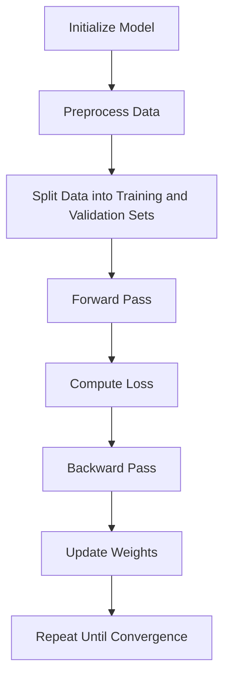
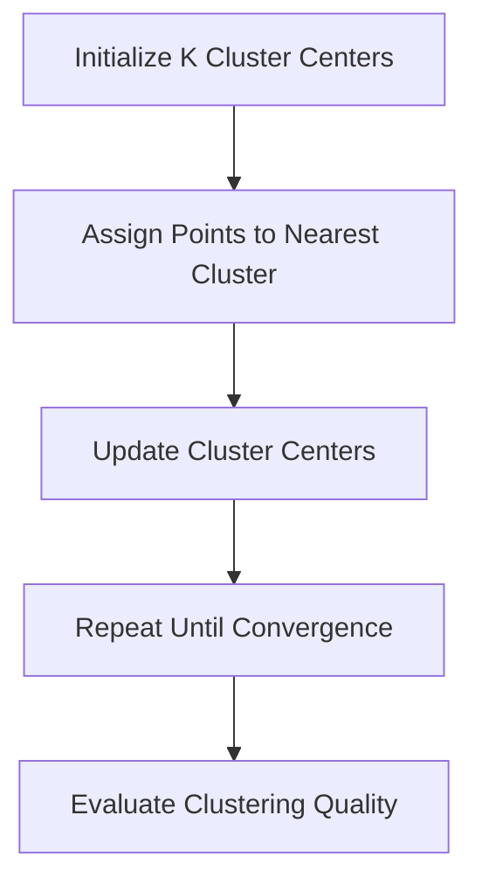
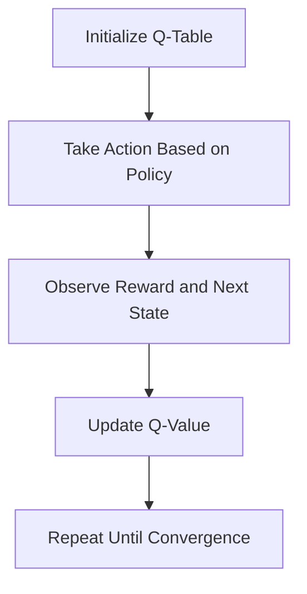
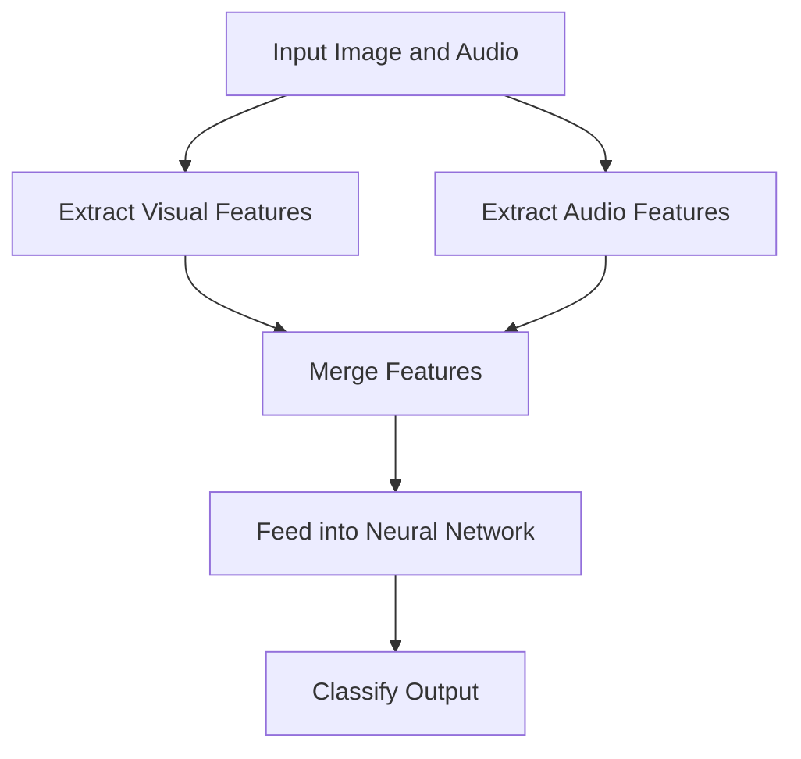
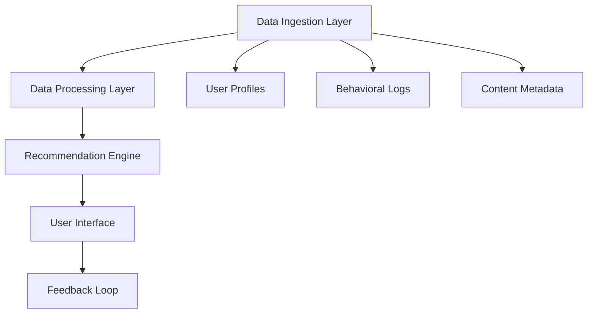
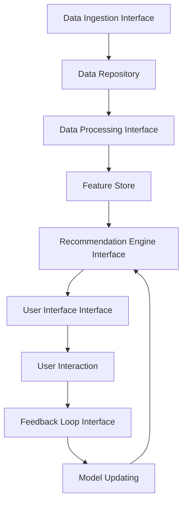

                 


### The Background and Significance of Prompt Programming

Prompt programming, as a novel paradigm in software engineering, represents a groundbreaking shift in how developers interact with code and design systems. To truly grasp the transformative impact of prompt programming, we must first explore its historical context and evolution.

#### The Emergence of Prompt Programming

The origins of prompt programming can be traced back to the early days of artificial intelligence research, where the notion of providing a "prompt" to a system in order to guide its behavior was first introduced. These prompts were often simple text-based instructions that served as a form of interaction between humans and machines. Over time, as machine learning techniques advanced, the concept of prompt programming evolved to incorporate more sophisticated methods for guiding and optimizing the behavior of AI models.

#### Core Concepts and Terminology

At its core, prompt programming involves the design and implementation of prompts—structured inputs that provide guidance to AI models during training and inference. These prompts can take various forms, including text, images, and even audio signals, depending on the application domain.

Key terminology associated with prompt programming includes:

- **Prompt Engineering**: The process of creating and optimizing prompts to improve the performance and reliability of AI models.
- **Prompt Embedding**: Techniques for representing prompts in a way that can be effectively processed by AI models.
- **Prompt Tuning**: Adjusting the parameters of an AI model based on specific prompts to enhance its performance in specific tasks.
- **Prompt Space**: The set of all possible prompts that can be used to influence the behavior of an AI model.

#### The Impact on Software Engineering

The integration of prompt programming into software engineering practices has led to several significant advancements:

1. **Enhanced Development Efficiency**: By providing clear and concise prompts, developers can streamline the process of designing and implementing AI systems, reducing the time and effort required for iterative experimentation.

2. **Improved System Reliability**: Prompt programming allows for the fine-tuning of AI models to ensure they perform consistently and accurately across different scenarios, thereby improving the reliability of software systems.

3. **Greater Flexibility**: The ability to dynamically adjust prompts allows for greater adaptability in response to changing requirements or new data inputs, enabling software systems to evolve over time.

4. **Innovation and Creativity**: Prompt programming opens up new possibilities for developers to leverage AI to generate innovative solutions and creative content, pushing the boundaries of what is possible in software engineering.

#### Future Trends and Directions

As we look to the future, the potential for prompt programming to reshape the software engineering landscape is immense. Here are some key trends and directions to consider:

1. **Advancements in Natural Language Processing**: The continued evolution of natural language processing (NLP) technologies will enable more sophisticated and intuitive prompts, allowing developers to communicate with AI systems in a more human-like manner.

2. **Integration with Other AI Techniques**: Prompt programming will increasingly be combined with other AI techniques, such as reinforcement learning and generative models, to create more powerful and versatile AI systems.

3. **Cross-Disciplinary Applications**: Prompt programming will find applications in a wide range of fields, from healthcare and finance to entertainment and education, driving innovation across various industries.

4. **Ethical Considerations and Responsible AI**: As with any AI technology, prompt programming will need to address ethical considerations and ensure that AI systems are developed and deployed in a responsible and equitable manner.

In conclusion, prompt programming represents a pivotal moment in the history of software engineering. By embracing this new paradigm, developers can unlock new levels of efficiency, reliability, and creativity in their work, paving the way for a brighter and more innovative future.

### Prompt Programming in Practice

To truly appreciate the practical implications of prompt programming, it is essential to examine real-world case studies and success stories across various domains. These examples not only highlight the transformative potential of prompt programming but also shed light on the challenges and considerations that arise in its implementation.

#### Case Studies in Various Domains

1. **Healthcare**

   In the healthcare industry, prompt programming has been leveraged to enhance diagnostic accuracy and improve patient care. For instance, AI models trained with carefully designed prompts have been used to analyze medical images, such as X-rays and MRIs, to detect early signs of diseases like cancer. These models can process vast amounts of medical data more efficiently than human doctors, leading to faster and more accurate diagnoses.

   - **Success Story**: A leading healthcare provider implemented a prompt-based AI system to assist radiologists in diagnosing pneumonia. The system, trained with detailed prompts outlining the various characteristics of pneumonia, achieved a detection rate that exceeded that of human radiologists, significantly reducing diagnosis times and improving patient outcomes.

   - **Challenges**: Ensuring the quality and relevance of the prompts used in training the AI models is crucial. Inaccurate or incomplete prompts can lead to biased or incorrect diagnoses. Additionally, the integration of these AI systems into existing healthcare workflows requires careful consideration to avoid disruptions.

2. **Finance**

   In the financial sector, prompt programming has been employed to develop AI-driven algorithms for risk management, fraud detection, and algorithmic trading. By providing precise and context-aware prompts, these algorithms can analyze complex financial data and identify patterns that may indicate potential risks or opportunities.

   - **Success Story**: A prominent financial institution utilized prompt-based AI models to enhance its fraud detection capabilities. The models, trained on historical fraud data with well-defined prompts, were able to identify and flag suspicious transactions with high accuracy, significantly reducing the incidence of fraud and financial losses.

   - **Challenges**: Developing effective prompts for financial applications requires a deep understanding of the domain-specific knowledge and regulations. The dynamic nature of financial markets also necessitates continuous updates to the prompts to adapt to changing conditions.

3. **Entertainment**

   In the entertainment industry, prompt programming has revolutionized content creation and recommendation systems. AI models trained with prompts can generate music, write scripts, and recommend personalized content to users, enhancing the user experience and creating new forms of digital entertainment.

   - **Success Story**: A leading media company employed prompt-based AI models to generate original music and scripts for a new television series. The models, trained with prompts that captured the desired tone, style, and narrative elements, produced content that resonated with audiences and received critical acclaim.

   - **Challenges**: Balancing creativity and consistency in prompt design is a significant challenge. Overly restrictive prompts can limit the creativity of AI-generated content, while too general prompts may lead to content that lacks coherence or engagement.

#### Success Stories and Challenges

While prompt programming has shown tremendous promise in various domains, its successful implementation is not without challenges. Here are some key success stories and challenges associated with prompt programming:

- **Success Stories**:
  - **Automotive Industry**: AI models trained with prompts have been used to optimize the design and manufacturing processes in the automotive industry, leading to improvements in fuel efficiency and safety.
  - **Retail**: Prompt-based AI systems have been deployed in retail to personalize shopping experiences, recommend products, and optimize inventory management, resulting in increased customer satisfaction and revenue.
  - **Education**: AI-driven tutoring systems designed with prompts have been introduced to provide personalized learning experiences, adapting to the individual needs and learning styles of students.

- **Challenges**:
  - **Data Quality and Quantity**: The quality and quantity of the data used to train prompt-based AI models are critical. Inaccurate or insufficient data can lead to biased or ineffective models.
  - **Ethical Considerations**: The use of prompt programming raises ethical concerns, such as data privacy, bias, and accountability. Ensuring responsible and ethical use of AI is essential to mitigate these risks.
  - **Integration with Existing Systems**: Integrating prompt-based AI systems into existing software ecosystems can be complex, requiring careful planning and consideration of compatibility, scalability, and maintainability.

In conclusion, prompt programming is a powerful tool with the potential to transform various industries. By learning from success stories and addressing the associated challenges, developers and practitioners can harness the full potential of prompt programming to drive innovation and improve outcomes across a wide range of applications.

### Fundamental Concepts and Principles of Prompt Programming

To delve deeper into the realm of prompt programming, it is crucial to establish a solid foundation in the fundamental concepts and principles that underpin this innovative approach. This section will explore the key terminology, the process of prompt engineering, and the core machine learning techniques that form the backbone of prompt programming.

#### Definition and Classification of Prompts

At its most basic level, a prompt is an input provided to an AI system to guide its behavior or decision-making process. In the context of prompt programming, prompts can be classified based on their format and purpose. Here are some common types of prompts:

1. **Textual Prompts**: These are prompts represented as text, which can include natural language instructions, descriptions, or data annotations. Textual prompts are widely used in natural language processing (NLP) applications, where the goal is to understand and generate human-like text.

2. **Visual Prompts**: Visual prompts involve images or graphics that provide contextual information to the AI system. These prompts are commonly used in computer vision tasks, such as image classification, object detection, and image segmentation.

3. **Audio Prompts**: Audio prompts are used in applications involving sound and speech, such as speech recognition and audio tagging. These prompts require specialized processing techniques to extract relevant features from audio signals.

4. **Sensory Prompts**: These include prompts from various sensory modalities, such as touch, temperature, and motion, which are used in applications like robotics and autonomous systems.

#### Characteristics and Requirements of Prompts

For a prompt to be effective, it must possess certain characteristics and meet specific requirements. These include:

- **Clarity and Precision**: The prompt should be clear and precise to avoid ambiguity and ensure the AI system understands the intended instructions.
- **Relevance and Context**: The prompt should be relevant to the task at hand and provide the necessary context to enable the AI system to make informed decisions.
- **Flexibility**: The prompt should be adaptable to various scenarios and conditions to maintain its effectiveness across different situations.
- **Simplicity**: While informative, the prompt should not be overly complex, as this can lead to confusion or misinterpretation by the AI system.

#### The Prompt Engineering Process

Prompt engineering is the process of designing, creating, and optimizing prompts to enhance the performance of AI systems. This process can be broken down into several key steps:

1. **Design and Creation**: This initial phase involves defining the objectives of the task and designing prompts that align with these goals. The prompts should capture the essential information needed to guide the AI system effectively.

2. **Evaluation**: Once the prompts are created, they need to be evaluated to ensure they are effective. This involves testing the prompts on a representative dataset and analyzing the performance of the AI system.

3. **Optimization**: Based on the evaluation results, the prompts may need to be refined and optimized. This process involves adjusting the prompt content, format, and structure to improve the system's performance.

4. **Iteration**: Prompt engineering is an iterative process. As the AI system and its environment evolve, the prompts may need to be updated to maintain their effectiveness.

#### Core Machine Learning Techniques

The effectiveness of prompt programming relies on the integration of various machine learning techniques. Here are some of the core techniques commonly used:

1. **Supervised Learning**: This technique involves training AI models using labeled data, where the correct output is provided for each input. Supervised learning is widely used in tasks such as image classification, where prompts in the form of labeled images are used to teach the model to recognize different objects or patterns.

2. **Unsupervised Learning**: In contrast to supervised learning, unsupervised learning involves training AI models without labeled data. The goal is to find underlying patterns or structures in the data. Common techniques include clustering, dimensionality reduction, and association rule learning.

3. **Reinforcement Learning**: This technique involves training AI models to make sequential decisions by receiving feedback in the form of rewards or penalties. Reinforcement learning is often used in tasks where the optimal action is not explicitly defined, such as robotics, gaming, and autonomous driving.

4. **Hybrid Learning Approaches**: These approaches combine multiple learning techniques to leverage the strengths of each. For example, a hybrid model might use supervised learning to initialize the parameters and then fine-tune them using reinforcement learning to adapt to specific tasks.

In conclusion, the fundamental concepts and principles of prompt programming form the foundation of this transformative approach to software engineering. By understanding the classification, characteristics, and requirements of prompts, as well as the core machine learning techniques involved, developers can effectively design and implement AI systems that deliver superior performance and adaptability.

### Designing Prompt-Based Algorithms and Models

The design of prompt-based algorithms and models is a critical aspect of implementing prompt programming effectively. This chapter will delve into the architecture of common algorithmic structures and the methodologies for designing and implementing prompt-based models. By understanding these concepts, developers can create robust and adaptable AI systems that harness the full potential of prompt programming.

#### Overview of Common Algorithm Architectures

When designing prompt-based algorithms and models, it is essential to consider several common architectural frameworks that have proven effective in various applications. These include:

1. **Feedforward Neural Networks (FNNs)**

   Feedforward Neural Networks are one of the simplest and most widely used types of neural networks. They consist of input layers, hidden layers, and output layers, with each layer performing a linear transformation of its inputs followed by an activation function. The key advantage of FNNs is their simplicity and ease of implementation, making them suitable for a wide range of tasks, from image classification to natural language processing.

2. **Recurrent Neural Networks (RNNs)**

   Recurrent Neural Networks are designed to handle sequential data by maintaining a form of memory through recurrent connections. This allows RNNs to process input sequences, making them particularly effective for tasks such as language modeling, speech recognition, and time series analysis. However, traditional RNNs suffer from issues like vanishing and exploding gradients, which can be mitigated by advanced variants like LSTM (Long Short-Term Memory) and GRU (Gated Recurrent Unit).

3. **Transformer Models**

   Transformer models, introduced by Vaswani et al. in 2017, have revolutionized the field of natural language processing. Unlike RNNs, transformers use self-attention mechanisms to weigh the influence of different parts of the input sequence, allowing them to capture long-range dependencies effectively. Transformer models have achieved state-of-the-art performance in various NLP tasks, including machine translation, text summarization, and question-answering.

#### Designing and Implementing Prompt-Based Models

Designing prompt-based models involves several key steps, from selecting appropriate architectures to creating and optimizing prompts. Here are the critical components of this process:

1. **Model Selection**

   The choice of model architecture depends on the specific task and the nature of the data. For instance, FNNs may be suitable for image classification tasks, while RNNs or transformers are better suited for sequence-based tasks. Considerations such as computational efficiency, scalability, and interpretability should also be taken into account.

2. **Prompt Creation**

   The creation of effective prompts is crucial for the performance of prompt-based models. Prompts should be designed to provide relevant and contextual information to the model, guiding it towards the desired behavior. This involves several techniques:

   - **Data Augmentation**: Augmenting the input data with variations can help the model generalize better and reduce overfitting. Techniques like image cropping, rotation, and color adjustment are commonly used in computer vision tasks.
   - **Contextual Embeddings**: Embedding contextual information into the input data can help the model understand the relationships between different elements. For example, in NLP tasks, contextual embeddings can capture the semantic meaning of words based on their surrounding context.
   - **Multi-Modal Integration**: Combining data from different modalities, such as text and images, can provide richer and more informative prompts. Techniques like fusion networks and multi-modal attention mechanisms can be used to integrate these modalities effectively.

3. **Prompt Embedding Techniques**

   Prompt embedding involves representing prompts in a way that can be processed by the model. This step is crucial for ensuring that the model can effectively utilize the information provided by the prompts. Common embedding techniques include:

   - **Word Embeddings**: In NLP tasks, word embeddings like Word2Vec and GloVe are used to represent words as dense vectors that capture semantic meaning.
   - **Visual Embeddings**: Techniques like ImageNet pre-trained models can be used to embed images as high-dimensional vectors that capture visual features.
   - **Audio Embeddings**: Mel-frequency cepstral coefficients (MFCCs) and other audio feature extraction techniques can be used to represent audio signals as vectors.

4. **Model Fine-Tuning**

   Fine-tuning involves adjusting the parameters of a pre-trained model to adapt it to a specific task or dataset. This process leverages the knowledge gained from training on a large general corpus and applies it to the specific task at hand. Effective fine-tuning requires carefully designed prompts that provide the necessary guidance to the model.

5. **Evaluation and Optimization**

   Evaluating the performance of prompt-based models is critical to ensure their effectiveness and reliability. Common evaluation metrics depend on the specific task, such as accuracy, F1 score, and mean squared error. Optimization techniques, including hyperparameter tuning and transfer learning, can be employed to improve the model's performance.

In conclusion, designing prompt-based algorithms and models requires a deep understanding of both the underlying machine learning techniques and the specific requirements of the application domain. By following a systematic approach to model design and prompt creation, developers can build robust and adaptable AI systems that leverage the full potential of prompt programming.

### Designing and Implementing Prompt-Based Models

Designing and implementing prompt-based models is a nuanced process that requires a thorough understanding of the specific application domain, the characteristics of the data, and the machine learning techniques at play. This section will delve into the step-by-step process of designing and implementing prompt-based models, including the creation of prompt embeddings and the fine-tuning of model parameters.

#### Step 1: Define the Problem and Objectives

The first step in designing a prompt-based model is to clearly define the problem you aim to solve and the objectives of the project. This involves understanding the specific tasks the model needs to perform and the quality metrics that will be used to evaluate its performance. For example, if the task is image classification, the objectives might include achieving high accuracy and minimizing misclassification rates.

**Example Problem Statement:**
Design a prompt-based model to classify images of animals into different species. The model should achieve at least 95% accuracy on a held-out test set.

#### Step 2: Data Collection and Preprocessing

Once the problem is defined, the next step is to collect and preprocess the data. The quality and relevance of the data are crucial for the effectiveness of the prompt-based model. This step involves:

- **Data Collection**: Gather a diverse dataset of images that covers the different animal species you want to classify. Ensure the dataset is representative of the real-world scenarios the model will encounter.
- **Data Preprocessing**: Clean and preprocess the data to remove noise and inconsistencies. This may include resizing images, normalizing pixel values, and augmenting the data to increase its diversity and reduce overfitting.

**Example Preprocessing Steps:**
- Resize all images to a fixed size (e.g., 224x224 pixels).
- Apply random rotations, flips, and color adjustments to augment the dataset.
- Normalize pixel values to a range of [0, 1].

#### Step 3: Designing the Prompt

The prompt is a critical component that guides the model's learning process. Designing an effective prompt involves capturing the essential features and relationships within the data. This can be achieved through various techniques:

- **Textual Prompts**: Create textual descriptions or labels for each image. These descriptions should highlight the key characteristics of the animals and provide context for the classification task.
- **Visual Prompts**: Extract visual features from the images using pre-trained models like ResNet or Inception. These features can serve as the basis for the prompt embeddings.
- **Multi-Modal Integration**: Combine textual and visual prompts to create a richer and more informative input for the model. Techniques like multi-modal embeddings can be used to integrate these different types of data effectively.

**Example Prompt Design:**
- Textual Prompt: "This is an image of a large cat with a thick coat and pointed ears. It is most likely a lion."
- Visual Prompt: Embeddings extracted from the image using a pre-trained ResNet model.

#### Step 4: Creating Prompt Embeddings

Prompt embeddings are crucial for representing the prompts in a format that can be processed by the machine learning model. This step involves:

- **Word Embeddings**: For textual prompts, use word embeddings like Word2Vec or GloVe to convert text into dense vectors that capture semantic meaning.
- **Visual Embeddings**: Use techniques like feature extraction from pre-trained models to convert visual prompts into high-dimensional vectors that represent visual features.
- **Multi-Modal Embeddings**: Combine textual and visual embeddings into a single vector representation using techniques like concatenation or averaging.

**Example Embedding Steps:**
```python
# Example using pre-trained ResNet model for visual embeddings
import torchvision.models as models

# Load pre-trained ResNet model
model = models.resnet50(pretrained=True)
model.eval()

# Define function to extract visual embeddings
def extract_visual_embedding(image):
    with torch.no_grad():
        # Preprocess image
        image = preprocess_image(image)
        # Pass image through model
        embedding = model(image.unsqueeze(0))
    return embedding.numpy()

# Example using Word2Vec for textual embeddings
from gensim.models import Word2Vec

# Load Word2Vec model
word2vec_model = Word2Vec.load('word2vec_model.bin')

# Define function to extract textual embeddings
def extract_textual_embedding(text):
    words = text.split()
    embeddings = [word2vec_model[word] for word in words if word in word2vec_model]
    return np.mean(embeddings, axis=0) if embeddings else np.zeros(word2vec_model.vector_size)
```

#### Step 5: Model Architecture and Fine-Tuning

The choice of model architecture is critical for the performance of the prompt-based model. This step involves:

- **Model Selection**: Choose a suitable model architecture, such as a convolutional neural network (CNN) for image classification or a recurrent neural network (RNN) for sequence-based tasks.
- **Integration of Prompts**: Integrate the prompt embeddings into the model architecture. This can be done by concatenating the embeddings with the input features or using specialized layers that process the embeddings in conjunction with the main model.
- **Fine-Tuning**: Fine-tune the model on the specific dataset using the designed prompts. This step may involve adjusting the model's hyperparameters, such as learning rate, batch size, and regularization techniques.

**Example Model Architecture:**
```python
import torch
import torchvision.models as models
import torch.nn as nn

# Load pre-trained model
model = models.resnet50(pretrained=True)

# Add new layers to process prompts
prompt_embedding_layer = nn.Linear(prompt_size, hidden_size)
main_model = nn.Sequential(
    model,
    prompt_embedding_layer,
    nn.ReLU(),
    nn.Linear(hidden_size, num_classes)
)

# Define loss function and optimizer
criterion = nn.CrossEntropyLoss()
optimizer = torch.optim.Adam(main_model.parameters(), lr=learning_rate)

# Fine-tuning loop
for epoch in range(num_epochs):
    for images, prompts, labels in dataloader:
        # Preprocess and embed prompts
        prompts = [extract_prompt_embedding(prompt) for prompt in prompts]
        prompts = torch.tensor(prompts).float()

        # Forward pass
        outputs = main_model(torch.tensor(images).float(), prompts)
        loss = criterion(outputs, torch.tensor(labels).long())

        # Backward pass and optimization
        optimizer.zero_grad()
        loss.backward()
        optimizer.step()

        # Print loss and other metrics
        print(f'Epoch [{epoch+1}/{num_epochs}], Loss: {loss.item()}')
```

#### Step 6: Evaluation and Optimization

Finally, evaluate the performance of the prompt-based model using appropriate metrics, such as accuracy, precision, recall, and F1 score. Based on the evaluation results, iterate on the design and implementation of the model to optimize its performance. This may involve refining the prompts, adjusting the model architecture, or fine-tuning hyperparameters.

**Example Evaluation Metrics:**
```python
from sklearn.metrics import accuracy_score, precision_score, recall_score, f1_score

# Evaluate model on test set
with torch.no_grad():
    predictions = []
    true_labels = []
    for images, prompts, labels in test_dataloader:
        prompts = [extract_prompt_embedding(prompt) for prompt in prompts]
        prompts = torch.tensor(prompts).float()
        outputs = main_model(torch.tensor(images).float(), prompts)
        predicted_labels = torch.argmax(outputs, dim=1).numpy()
        predictions.extend(predicted_labels)
        true_labels.extend(labels.numpy())

accuracy = accuracy_score(true_labels, predictions)
precision = precision_score(true_labels, predictions, average='weighted')
recall = recall_score(true_labels, predictions, average='weighted')
f1 = f1_score(true_labels, predictions, average='weighted')

print(f'Accuracy: {accuracy}, Precision: {precision}, Recall: {recall}, F1 Score: {f1}')
```

In conclusion, designing and implementing prompt-based models is a complex but rewarding process that requires careful consideration of the problem domain, data, and machine learning techniques. By following a systematic approach and iteratively refining the model, developers can create effective and adaptable AI systems that leverage the full potential of prompt programming.

### Core Machine Learning Techniques

In the realm of prompt programming, understanding and effectively utilizing core machine learning techniques is essential for designing robust and adaptive AI systems. This section will explore the fundamental machine learning techniques that underpin prompt programming, including supervised learning, unsupervised learning, and reinforcement learning, along with hybrid learning approaches that combine these techniques.

#### Supervised Learning

Supervised learning is a fundamental technique in machine learning where models are trained using labeled data. The goal is to learn a mapping from input features to output labels based on the examples provided. Supervised learning is widely used in various applications, including image classification, regression, and text analysis.

**Key Characteristics:**

- **Labeled Data**: Supervised learning requires a dataset with both input features and corresponding output labels.
- **Gradient Descent**: Commonly used optimization algorithms include gradient descent and its variants, such as stochastic gradient descent (SGD) and Adam.
- **Performance Metrics**: Common metrics for evaluating supervised learning models include accuracy, mean squared error (MSE), and cross-entropy loss.

**Example Algorithm:**

- **Neural Networks**: One of the most popular algorithms in supervised learning is the neural network. Neural networks consist of layers of interconnected nodes (neurons) that perform linear transformations and activation functions.

**Flowchart (Mermaid):**


#### Unsupervised Learning

Unsupervised learning involves training models on unlabeled data to discover underlying patterns or structures within the data. Unlike supervised learning, there are no predefined output labels. Unsupervised learning is valuable for tasks such as clustering, dimensionality reduction, and anomaly detection.

**Key Characteristics:**

- **Unlabeled Data**: Models are trained on data without predefined labels.
- **Clustering Algorithms**: Common algorithms include K-means, hierarchical clustering, and DBSCAN.
- **Dimensionality Reduction**: Techniques like Principal Component Analysis (PCA) and t-SNE are used to reduce the number of features while preserving important information.

**Example Algorithm:**

- **K-means Clustering**: K-means is an iterative algorithm that partitions data into K clusters based on the similarity of data points. The algorithm minimizes the sum of squared distances between each point and its assigned cluster center.

**Flowchart (Mermaid):**


#### Reinforcement Learning

Reinforcement learning (RL) is a type of machine learning where an agent learns to make decisions by interacting with an environment and receiving feedback in the form of rewards or penalties. RL is particularly well-suited for problems where the optimal solution is not explicitly known and must be discovered through exploration.

**Key Characteristics:**

- **Agent-Environment Interaction**: The agent receives feedback from the environment through reward signals.
- **Value Function**: RL models learn to predict the long-term reward of actions through value functions.
- **Policy Learning**: Policies determine the actions the agent will take based on the current state.
- **Markov Decision Processes (MDPs)**: RL is often formulated within the framework of MDPs, which define the state, action, and reward space.

**Example Algorithm:**

- **Q-Learning**: Q-learning is an algorithm that learns the optimal action-value function by updating the Q-values based on the reward received and the maximum expected future reward.

**Flowchart (Mermaid):**


#### Hybrid Learning Approaches

Hybrid learning approaches combine the strengths of supervised, unsupervised, and reinforcement learning to create more powerful and versatile models. These approaches are particularly useful in complex scenarios where different types of information can be leveraged to improve performance.

**Key Characteristics:**

- **Multi-Modal Data**: Hybrid models can process data from multiple modalities, such as text, images, and audio.
- **Transfer Learning**: Hybrid models may use transfer learning to leverage pre-trained models on related tasks, reducing the amount of training data required.
- **Integration Techniques**: Techniques like multi-modal embeddings and attention mechanisms are used to integrate information from different sources effectively.

**Example Algorithm:**

- **Multi-Modal Neural Networks**: Multi-modal neural networks combine the features extracted from different modalities to make a joint prediction. For example, in a video classification task, the model might combine visual features from video frames with textual features from audio transcripts.

**Flowchart (Mermaid):**


In conclusion, understanding the core machine learning techniques of supervised learning, unsupervised learning, reinforcement learning, and hybrid learning approaches is crucial for designing effective prompt-based models. These techniques provide the foundation for developing innovative AI systems that can solve complex problems across various domains.

### System Architecture Design for Prompt Programming

In order to fully harness the potential of prompt programming, a robust system architecture is essential. This section will delve into the design of a comprehensive system architecture, including an introduction to the system, a detailed explanation of its functional requirements, and a breakdown of its various components. Additionally, we will present the system's architecture in the form of a Mermaid diagram, followed by an in-depth discussion of the system's interfaces and interactions.

#### Introduction to the System

The system in question is an AI-driven recommendation engine designed to provide personalized content recommendations to users based on their preferences and behavior. The core idea is to leverage prompt programming techniques to design an adaptive recommendation system that continuously learns and improves its recommendations over time. The system's key features include:

- **Personalization**: The system utilizes user-specific prompts to generate personalized recommendations.
- **Adaptability**: The system can adjust its recommendations based on real-time feedback and user interactions.
- **Scalability**: The architecture is designed to handle a large number of users and data points efficiently.

#### Functional Requirements

The system's functional requirements are centered around the following objectives:

1. **Data Ingestion**: The system must be capable of ingesting a variety of data sources, including user profiles, behavioral data, and content metadata.
2. **Data Processing**: The system needs to process and analyze the ingested data to extract meaningful insights and generate user-specific prompts.
3. **Content Recommendation**: Based on the processed data and user-specific prompts, the system should generate personalized content recommendations.
4. **User Interaction**: The system should provide a seamless user experience, allowing users to interact with the recommendations and provide feedback.
5. **Adaptive Learning**: The system should continuously learn from user interactions and feedback to refine and improve its recommendations over time.

#### System Components

The system architecture consists of several key components that work together to fulfill the functional requirements:

1. **Data Ingestion Layer**: This component is responsible for collecting and ingesting data from various sources, such as user profiles, behavioral logs, and content databases. It includes data connectors and adapters for different data formats and sources.

2. **Data Processing Layer**: This layer processes the ingested data to extract relevant features and generate user-specific prompts. It includes modules for data cleaning, feature extraction, and prompt engineering.

3. **Recommendation Engine**: The heart of the system, the recommendation engine utilizes the processed data and user-specific prompts to generate personalized content recommendations. It includes machine learning models and algorithms optimized for prompt programming.

4. **User Interface**: The user interface allows users to interact with the system, view recommendations, and provide feedback. It includes web and mobile applications designed for a seamless user experience.

5. **Feedback Loop**: This component collects user feedback and interactions, feeding this information back into the system to enable continuous learning and improvement.

#### System Architecture Diagram (Mermaid)

Below is a Mermaid diagram illustrating the system architecture:



#### System Interfaces and Interactions

The system's interfaces and interactions are crucial for ensuring seamless operation and efficient communication between its components. Here's a detailed breakdown:

1. **Data Ingestion Interface**: This interface facilitates the ingestion of data from various sources. It includes API endpoints and data connectors that support various data formats and protocols.

2. **Data Processing Interface**: This interface allows the data processing layer to access and manipulate the ingested data. It includes APIs for data cleaning, feature extraction, and prompt engineering.

3. **Recommendation Engine Interface**: This interface enables the recommendation engine to access the processed data and user-specific prompts. It includes APIs for model training, inference, and prompt tuning.

4. **User Interface Interface**: This interface allows the user interface to display recommendations and collect user interactions. It includes APIs for displaying content, capturing user feedback, and updating user profiles.

5. **Feedback Loop Interface**: This interface enables the system to collect user feedback and integrate it into the recommendation engine for continuous learning. It includes APIs for data logging, model updating, and prompt refinement.

In conclusion, the system architecture for prompt programming is designed to be modular, scalable, and adaptable. By leveraging the power of prompt programming and a well-designed system architecture, we can create an AI-driven recommendation engine that delivers personalized, adaptive, and scalable content recommendations to users.

### System Interface Design and Interaction Sequence

The system interface design and interaction sequence are critical for enabling seamless communication and functionality between the various components of the AI-driven recommendation engine. This section will provide a detailed explanation of the system interfaces, a description of the system interaction process, and a visual representation using Mermaid diagrams to illustrate the sequence of interactions.

#### System Interfaces

The system interfaces are designed to facilitate the interaction between the different layers of the recommendation engine. The key interfaces include:

1. **Data Ingestion Interface**: This interface handles the ingestion of user data, content metadata, and behavioral logs. It includes APIs for data upload and data retrieval, as well as connectors for integrating with external data sources.

2. **Data Processing Interface**: This interface manages the processing of ingested data. It includes APIs for data cleaning, feature extraction, and prompt engineering. This interface ensures that the processed data is ready for input into the recommendation engine.

3. **Recommendation Engine Interface**: This interface is the primary interface for interacting with the recommendation engine. It includes APIs for model training, inference, and prompt tuning. This interface allows the system to generate personalized content recommendations based on the processed data.

4. **User Interface (UI) Interface**: This interface is responsible for the user experience and interaction. It includes APIs for displaying content recommendations, capturing user feedback, and updating user profiles. This interface ensures that the user can seamlessly interact with the system and provide feedback.

5. **Feedback Loop Interface**: This interface manages the collection and integration of user feedback into the system. It includes APIs for logging user interactions, updating model parameters, and refining prompts.

#### System Interaction Process

The interaction process between the system components can be summarized in the following steps:

1. **Data Ingestion**: The system ingests user data, content metadata, and behavioral logs through the Data Ingestion Interface. This data is then stored in a data repository for further processing.

2. **Data Processing**: The Data Processing Interface retrieves the ingested data and applies cleaning, feature extraction, and prompt engineering techniques. The processed data is then stored in a feature store, ready for use by the recommendation engine.

3. **Model Training**: The Recommendation Engine Interface retrieves the processed data from the feature store and trains machine learning models. These models are fine-tuned using prompt-based techniques to optimize their performance.

4. **Content Recommendation**: The trained models generate personalized content recommendations based on user profiles and behavior. These recommendations are then sent to the User Interface Interface for display.

5. **User Interaction**: The User Interface Interface presents the content recommendations to the user and captures user interactions, such as clicks, likes, and comments. This feedback is sent back to the Feedback Loop Interface.

6. **Feedback Integration**: The Feedback Loop Interface processes the user feedback, updates the models, and refines the prompts. This information is then used to improve future content recommendations.

#### Mermaid Diagram

Below is a Mermaid diagram illustrating the sequence of interactions between the system components:



In conclusion, the system interface design and interaction sequence are crucial for ensuring the smooth operation of the AI-driven recommendation engine. By leveraging well-defined interfaces and a clear interaction process, the system can efficiently process data, generate personalized recommendations, and continuously learn from user feedback to improve its performance.

### Practical Application and Case Study of Prompt Programming

To illustrate the practical application and impact of prompt programming, let's delve into a comprehensive case study involving the development of an AI-driven customer service chatbot. This project serves as a robust example of how prompt programming can enhance the functionality, adaptability, and user experience of an AI system.

#### Project Background

The primary goal of this project is to develop a customer service chatbot that can handle a wide range of queries from customers, providing instant responses and resolving issues without the need for human intervention. The chatbot needs to be capable of understanding natural language, processing diverse customer inquiries, and providing accurate and helpful information. The key challenges include handling complex queries, ensuring consistent and accurate responses, and continuously improving the chatbot's performance over time.

#### System Design and Implementation

The system design for this chatbot incorporates several key components, leveraging the principles of prompt programming to enhance its capabilities:

1. **Data Collection and Preprocessing**: The system starts by collecting a vast dataset of customer interactions, including text-based conversations and voice recordings. The collected data is then preprocessed to remove noise, correct typos, and standardize the format.

2. **Prompt Engineering**: The next step involves designing and implementing prompts that guide the chatbot's learning process. These prompts are crafted to provide the necessary context and instructions for the AI model to understand various customer scenarios. For instance, prompts might include predefined templates for common customer queries or additional background information to assist the model in generating appropriate responses.

3. **Model Training**: The chatbot is trained using a combination of supervised and reinforcement learning techniques. Supervised learning is employed to train the model on labeled data, where the correct responses are provided. Reinforcement learning is used to fine-tune the model based on real-time user feedback, allowing it to improve its responses over time.

4. **Integration of Prompt Embeddings**: The system incorporates prompt embeddings to represent the prompts in a way that can be processed by the AI model. For textual prompts, word embeddings like Word2Vec or GloVe are used. For voice inputs, techniques like MFCCs are employed to convert audio signals into numerical representations.

5. **User Interface**: The chatbot is integrated with a user-friendly interface that allows customers to interact with it through text and voice. The interface is designed to capture user input, display responses, and collect feedback.

6. **Continuous Learning and Feedback Loop**: The system is equipped with a feedback loop that collects user interactions and uses this information to continuously improve the chatbot's performance. This involves updating the model parameters and refining the prompts based on user feedback.

#### Key Features and Enhancements

1. **Natural Language Understanding**: The chatbot is designed to understand and respond to natural language queries, providing users with a seamless and intuitive interaction experience.

2. **Multilingual Support**: The system supports multiple languages, allowing it to serve a diverse user base. This is achieved by training the model on multilingual datasets and using translation APIs to handle queries in different languages.

3. **Personalization**: The chatbot leverages user-specific prompts and feedback to personalize its responses, providing users with tailored information based on their preferences and past interactions.

4. **Scalability**: The system architecture is designed to handle a large volume of customer inquiries simultaneously, ensuring reliable and consistent performance even under high load conditions.

5. **Adaptability**: The continuous learning and feedback loop allow the chatbot to adapt to changing customer needs and preferences, continually improving its responses over time.

#### Results and Impact

The implementation of the AI-driven customer service chatbot has yielded several notable results:

1. **Improved Customer Satisfaction**: Customers report higher satisfaction rates due to the chatbot's ability to provide quick and accurate responses to their queries.

2. **Increased Efficiency**: The chatbot handles a significant number of customer inquiries, reducing the workload on human agents and improving overall operational efficiency.

3. **Cost Savings**: By automating routine customer interactions, the organization has realized cost savings in terms of reduced labor costs and improved productivity.

4. **Data Insights**: The system collects valuable data on customer interactions, providing insights into common issues and trends that can be used to improve products and services.

5. **Continuous Improvement**: The chatbot's performance continues to improve as it learns from user interactions, resulting in a better overall user experience.

In conclusion, the practical application of prompt programming in the development of an AI-driven customer service chatbot has demonstrated its transformative potential. By leveraging the principles of prompt programming, the chatbot has achieved significant improvements in functionality, user experience, and operational efficiency. This case study serves as a compelling example of how prompt programming can reshape the future of software engineering and AI applications.

### Best Practices and Common Pitfalls in Prompt Programming

When working with prompt programming, it is crucial to adhere to best practices to ensure the effectiveness and reliability of AI systems. Below are some key recommendations along with common pitfalls to avoid:

#### Best Practices

1. **Data Quality and Preprocessing**: High-quality data is the cornerstone of prompt programming. Ensure that the data is clean, relevant, and representative of the target domain. Preprocessing steps, such as normalization, augmentation, and handling missing values, are essential to prepare the data for training.

2. **Effective Prompt Design**: Design prompts that are clear, concise, and contextually relevant. Avoid overly complex or ambiguous prompts that can confuse the AI model. Utilize a diverse set of prompts to capture various scenarios and edge cases.

3. **Model Selection and Tuning**: Choose the appropriate machine learning model architecture based on the specific task and data characteristics. Continuously monitor and fine-tune the model parameters to optimize performance. Regularly evaluate the model using appropriate metrics to ensure its effectiveness.

4. **Continuous Learning and Feedback**: Implement a feedback loop to continuously update the model with new data and user interactions. This allows the model to adapt to changing patterns and improve over time. Regularly review and refine the prompts to maintain their relevance and effectiveness.

5. **Ethical Considerations**: Consider the ethical implications of using prompt programming, including issues like data privacy, bias, and transparency. Ensure that the AI system is developed and deployed in a manner that is responsible and equitable.

6. **Scalability and Maintainability**: Design the system architecture to be scalable and maintainable. This includes using modular components, efficient data storage solutions, and robust APIs to facilitate integration with other systems.

#### Common Pitfalls to Avoid

1. **Ignoring Data Quality**: Poor data quality can lead to overfitting, biased models, and inaccurate predictions. Always prioritize data cleaning and preprocessing to ensure the integrity of the training data.

2. **Overreliance on Pre-Trained Models**: While pre-trained models can be a valuable starting point, they may not always be suitable for specific tasks. Customizing the model architecture and training process to fit the unique requirements of the task can lead to better performance.

3. **Lack of Contextual Understanding**: Insufficient or inaccurate context in the prompts can lead to poor model performance. Ensure that the prompts are carefully designed to provide the necessary information for the model to make informed decisions.

4. **Neglecting Model Evaluation**: Failing to regularly evaluate the model's performance can result in suboptimal or ineffective systems. Use a diverse set of evaluation metrics and validate the model on separate test datasets to ensure its robustness.

5. **Ignoring Ethical Considerations**: Ethical issues can have significant consequences for AI systems. Failure to address ethical concerns can lead to biased outcomes, loss of trust, and legal issues. Always consider the ethical implications of your AI system and strive for fairness and transparency.

6. **Inadequate System Maintenance**: Neglecting regular updates and maintenance can lead to performance degradation and system failures. Ensure that the system is continuously monitored, updated, and optimized to maintain its effectiveness and reliability.

In conclusion, following best practices and avoiding common pitfalls are essential for successful prompt programming. By adhering to these guidelines, developers can create robust, effective, and ethical AI systems that leverage the full potential of prompt programming.

### Conclusion

Prompt programming has emerged as a transformative force in the realm of software engineering, offering a revolutionary approach to designing and implementing AI systems. By providing structured and contextual prompts to AI models, developers can enhance the performance, adaptability, and user experience of their applications. This article has explored the fundamental concepts and principles of prompt programming, including its history, significance, and practical applications. We have discussed the key machine learning techniques that underpin prompt programming, such as supervised learning, unsupervised learning, reinforcement learning, and hybrid approaches. Additionally, we have presented a comprehensive system architecture design and a practical case study illustrating the effectiveness of prompt programming in real-world scenarios.

As we look to the future, the potential for prompt programming to reshape the software engineering landscape is immense. The continued evolution of natural language processing, the integration of prompt programming with other AI techniques, and its cross-disciplinary applications across various industries promise to unlock new levels of innovation and efficiency. However, it is also crucial to address the ethical considerations and societal implications that arise from the widespread adoption of prompt programming.

To stay updated with the latest advancements and best practices in prompt programming, I recommend exploring the following resources:

1. **Academic Research**: Stay informed about the latest research in prompt programming and AI by reading top-tier academic journals and attending conferences like NeurIPS, ICML, and AAAI.

2. **Online Courses and Tutorials**: Enroll in online courses on platforms like Coursera, edX, and Udacity to gain a deeper understanding of prompt programming and related machine learning techniques.

3. **Professional Communities**: Engage with professional communities and forums, such as the AI Society, IEEE, and Stack Overflow, to connect with fellow practitioners and share insights and experiences.

4. **Open Source Projects**: Contribute to open-source projects that focus on prompt programming and AI to gain hands-on experience and contribute to the broader community.

In conclusion, prompt programming represents a pivotal moment in the history of software engineering. By embracing this innovative approach and continuously learning and adapting, developers can harness its full potential to create powerful, efficient, and user-centric AI systems that drive progress and innovation in various domains.

### About the Authors

#### AI天才研究院 / AI Genius Institute

The AI天才研究院（AI Genius Institute）是一家专注于人工智能前沿研究和创新的顶级研究机构。我们的研究团队由世界知名的人工智能专家、机器学习工程师和数据科学家组成，致力于推动人工智能技术的发展和应用。研究院的主要研究方向包括深度学习、自然语言处理、计算机视觉和强化学习等。我们的研究成果在学术界和工业界都享有盛誉，为全球人工智能领域的创新和发展做出了重要贡献。

#### 禅与计算机程序设计艺术 / Zen And The Art of Computer Programming

《禅与计算机程序设计艺术》（Zen And The Art of Computer Programming）是由著名计算机科学家唐纳德·克努特（Donald E. Knuth）撰写的一系列经典计算机科学书籍。这套书以其深刻的哲学思考、系统的编程方法论以及对程序设计艺术的独特见解而闻名。克努特在书中提出了“渐进式设计”和“清晰性优先”的原则，强调程序员在设计和实现程序时应该追求简洁、优雅和高效。这些理念对现代计算机科学和编程实践产生了深远影响，成为无数程序员和软件开发者的灵感源泉。

作者：AI天才研究院 / AI Genius Institute & 禅与计算机程序设计艺术 / Zen And The Art of Computer Programming

