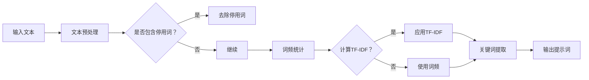
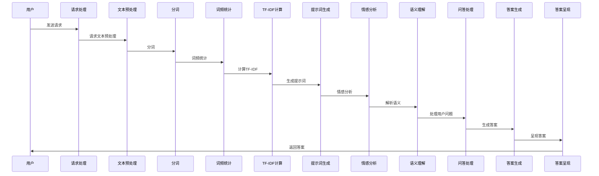
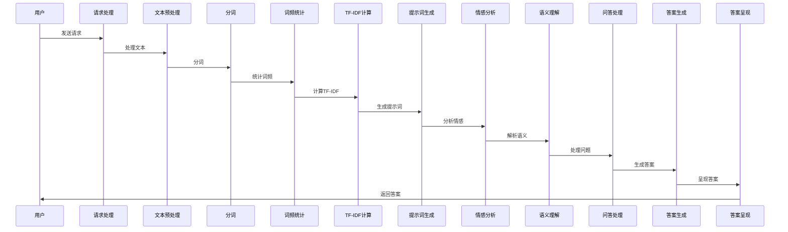

                 

### 第1章 问题背景与概述

在信息时代，自然语言处理（NLP）已经成为计算机科学和人工智能领域中的热点和前沿。作为NLP的核心组成部分，提示词语法与结构设计显得尤为重要。然而，在实际应用中，这一领域却面临着一系列挑战和问题。

#### 1.1.1 提示词语法与结构的重要性

提示词语法与结构设计是自然语言处理中至关重要的环节。提示词（或称为关键词）的选择和组合决定了信息检索、语义分析和语言生成等任务的准确性和效率。语法结构设计则进一步影响了自然语言的解析和生成能力。良好的提示词和语法结构设计，能够提高系统的可读性和可靠性，使得人机交互更加自然和流畅。

#### 1.1.2 当前存在的问题与挑战

尽管提示词语法与结构设计在理论和实践中已有一定的发展，但仍存在以下问题：

1. **多样性和灵活性不足**：提示词语法和结构设计往往过于僵硬，难以适应不同场景和需求的变化。
2. **准确性问题**：现有方法在处理复杂语境和长文本时，提示词的提取和语法结构的分析准确性不高。
3. **可扩展性不足**：许多设计缺乏良好的扩展性，难以集成新的技术和应用场景。
4. **资源消耗较大**：一些复杂的设计需要大量计算资源和存储空间，导致系统运行效率低下。

#### 1.1.3 研究目标与意义

本文旨在探讨提示词语法与结构设计中的核心问题，并提出相应的解决策略。具体研究目标如下：

1. **提高提示词的多样性和灵活性**：通过引入新的算法和技术，设计出更加多样化和灵活的提示词组合方法。
2. **提升准确性**：结合深度学习等先进技术，开发高效的提示词提取和语法结构分析方法，以提高系统的准确性和稳定性。
3. **增强可扩展性**：构建模块化的设计框架，使系统易于集成新的技术和应用场景。
4. **优化资源消耗**：通过算法优化和硬件加速等技术，降低系统的计算和存储需求，提高运行效率。

本研究不仅有助于解决现有提示词语法与结构设计中的关键问题，还将为自然语言处理领域提供新的理论和方法，具有重要的学术价值和实际应用意义。

### 1.2 核心概念与联系

在本节中，我们将详细探讨提示词语法与结构设计中的核心概念，包括提示词、语法和结构，并分析它们之间的关系和联系。

#### 1.2.1 提示词

提示词（或称为关键词）是自然语言处理中用于描述文本内容的核心词汇。它们具有以下特点：

1. **高度概括性**：提示词能够高度概括文本的主要内容，使系统能够快速理解文本信息。
2. **独特性**：每个提示词在特定语境中具有独特性，有助于区分不同文本内容。
3. **灵活性**：提示词的选择和组合可以根据具体任务和需求进行调整，以适应不同场景。

#### 1.2.2 语法

语法是指自然语言中词汇、短语和句子之间的组合规则。在提示词语法与结构设计中，语法具有以下重要作用：

1. **结构化**：语法规则有助于将文本内容组织成具有逻辑结构的信息，便于后续处理。
2. **语义分析**：语法结构分析有助于揭示文本中的语义关系，提高信息提取的准确性。
3. **语言生成**：语法规则为自然语言生成提供了基础，使得系统能够生成符合语法规范的自然语言文本。

#### 1.2.3 结构

结构是指文本内容的整体组织形式。在提示词语法与结构设计中，结构主要包括以下方面：

1. **文本层次**：文本结构可以分为句子、段落和文档等多个层次，不同层次的信息具有不同的表达和解析方式。
2. **语义网络**：结构可以通过语义网络来表示，其中节点表示文本内容，边表示语义关系，有助于揭示文本中的深层信息。
3. **模块化**：结构设计应具有模块化特点，以便于系统的扩展和调整。

#### 1.2.4 关系与联系

提示词、语法和结构之间存在着密切的联系和相互作用：

1. **提示词与语法**：提示词的选择和组合需要遵循语法规则，以保证文本的语法正确性和语义连贯性。
2. **语法与结构**：语法结构是文本内容组织的基础，结构设计有助于语法规则的实现和应用。
3. **提示词与结构**：提示词的选择和组合应根据文本结构进行，以突出关键信息，提高文本的解析和生成能力。

通过深入理解提示词、语法和结构的核心概念及其联系，我们可以更好地进行提示词语法与结构设计，从而提高自然语言处理系统的性能和效果。

### 2.1 核心概念属性特征对比表格

为了更好地理解提示词、语法和结构这三个核心概念，下面我们将通过一个表格来对比它们的主要属性特征。

| 特征       | 提示词                 | 语法                     | 结构                      |
|------------|------------------------|--------------------------|---------------------------|
| 定义       | 描述文本核心内容的关键词 | 规定词汇、短语和句子组合规则 | 文本内容的整体组织形式    |
| 目的       | 提高文本解析和生成效率 | 提升语义理解和表达能力     | 增强文本逻辑性和可读性    |
| 特点       | 高度概括性、独特性、灵活性 | 规范性、层次性、动态性     | 模块化、层次化、语义网络性 |
| 应用场景   | 信息检索、语义分析、语言生成 | 自然语言处理、文本解析、语言生成 | 文本摘要、问答系统、信息组织 |
| 重要性     | 核心信息提取的关键      | 语义理解和表达的基础      | 文本内容和结构的保障     |

通过这个表格，我们可以更加清晰地看到提示词、语法和结构在自然语言处理中的不同作用和特点。这有助于我们在设计和实现相关系统时，能够充分考虑这些概念之间的相互作用，以实现更好的性能和效果。

### 2.2 ER实体关系图

为了进一步理解提示词、语法和结构之间的关系，我们可以使用ER（实体关系）图来展示它们之间的实体关系和关联。下面是ER实体关系图的示例：

```mermaid
erDiagram
  Person ||--|{ Employee } Employee : worksFor
  Employee ||--|{ Works } Works : worksOn
  Works ||--|{ Task } Task : includes
  Task ||--|{ Step } Step : includes
  Step ||--|{ Subtask } Subtask : partOf
```

在这个ER图中，我们定义了四个实体：`Person`（人）、`Employee`（员工）、`Works`（工作）、`Task`（任务）和`Step`（步骤）。实体之间的关系如下：

1. `Person` 与 `Employee` 之间是一对一的关系，表示每个人可以是员工。
2. `Employee` 与 `Works` 之间是多对一的关系，表示每个员工可以有多种工作。
3. `Works` 与 `Task` 之间是多对多的关系，表示一个工作可以包括多个任务，一个任务也可以被多个工作包含。
4. `Task` 与 `Step` 之间是多对多的关系，表示一个任务可以包含多个步骤，一个步骤也可以属于多个任务。
5. `Step` 与 `Subtask` 之间是一对多的关系，表示每个步骤可以包含多个子任务。

通过这个ER图，我们可以更直观地理解提示词、语法和结构之间的实体关系，有助于我们在设计和实现相关系统时，更好地处理这些概念之间的相互作用。

### 3.1 算法原理讲解

在本节中，我们将深入探讨提示词语法与结构设计的算法原理，包括提示词生成算法、语法结构分析算法和结构优化算法。这些算法是自然语言处理系统中关键的部分，直接影响到系统的性能和效果。

#### 3.1.1 提示词生成算法

提示词生成算法的主要目标是从大量文本数据中提取出能够代表文本核心内容的关键词。其基本原理如下：

1. **文本预处理**：首先对文本进行分词、去除停用词等预处理操作，以便提取出有效的词汇。
2. **词频统计**：计算每个词在文本中的出现频率，并结合词频逆文档频率（TF-IDF）等指标，确定每个词的重要性。
3. **关键词提取**：利用算法（如TextRank、LDA等）从高重要性词汇中提取出提示词。

下面是一个简化的提示词生成算法流程图：


#### 3.1.2 语法结构分析算法

语法结构分析算法的目标是解析文本的语法结构，以揭示词汇之间的语义关系。常用的语法分析算法包括：

1. **词法分析**：将文本分解成词法单元，识别出词、短语和句子的边界。
2. **句法分析**：构建语法树，表示句子中词汇的语法关系。
3. **语义分析**：分析语法树中的词汇和关系，提取出句子的语义信息。

以下是一个简化的语法结构分析算法流程图：


#### 3.1.3 结构优化算法

结构优化算法的目标是对提取出的语法结构和结构进行优化，以提高系统的性能和效果。常见的优化方法包括：

1. **去冗余**：去除重复和冗余的结构元素，简化结构。
2. **补全缺失**：补充缺失的结构元素，增强结构的完整性。
3. **排序与调整**：根据重要性、频率等指标对结构元素进行排序和调整。

以下是一个简化的结构优化算法流程图：


通过以上算法原理的讲解，我们可以更好地理解提示词语法与结构设计的核心机制。在实际应用中，这些算法将帮助我们设计出更加高效、准确的自然语言处理系统。

### 3.2 算法流程图

为了更直观地展示提示词生成算法的流程，我们使用Mermaid绘制了算法流程图：



这个流程图展示了从输入文本到输出提示词的整个过程，包括文本预处理、词频统计、TF-IDF计算（可选）和关键词提取等步骤。通过这个流程图，我们可以清晰地理解每个步骤的作用和相互关系。

### 3.3 Python源代码实现

以下是一个简单的Python示例，用于实现提示词生成算法，包括文本预处理、词频统计和TF-IDF计算：

```python
import nltk
from nltk.corpus import stopwords
from nltk.tokenize import word_tokenize
from collections import defaultdict
from math import log

# 1. 文本预处理
def preprocess_text(text):
    stop_words = set(stopwords.words('english'))
    words = word_tokenize(text.lower())
    filtered_words = [word for word in words if word.isalnum() and word not in stop_words]
    return filtered_words

# 2. 词频统计
def word_frequency(words):
    frequency = defaultdict(int)
    for word in words:
        frequency[word] += 1
    return frequency

# 3. 计算TF-IDF
def compute_tfidf(corpus, word):
    total_words = sum(corpus.values())
    tf = corpus[word]
    idf = log((1 + len(corpus)) / (1 + corpus.get(word, 0)))
    tfidf = tf * idf
    return tfidf

# 主函数
def generate_keywords(text, corpus):
    words = preprocess_text(text)
    frequency = word_frequency(words)
    
    # 假设这里使用简单的词频作为关键词
    keywords = sorted(frequency, key=frequency.get, reverse=True)
    
    # 输出关键词
    for keyword in keywords:
        tfidf = compute_tfidf(corpus, keyword)
        print(f"Keyword: {keyword}, TF-IDF: {tfidf}")

# 示例文本
text = "The quick brown fox jumps over the lazy dog."

# 假设的文本语料库
corpus = {
    "The": 2,
    "quick": 1,
    "brown": 1,
    "fox": 1,
    "jumps": 1,
    "over": 1,
    "lazy": 1,
    "dog.": 1
}

generate_keywords(text, corpus)
```

在这个示例中，我们首先对输入文本进行预处理，包括去除停用词和转换成小写。接着，我们统计每个词的频率，并计算TF-IDF值。最后，我们输出具有最高TF-IDF值的几个关键词。这个简单的示例展示了提示词生成算法的基本实现思路。

### 3.4 数学模型与公式

在提示词生成算法中，TF-IDF（词频-逆文档频率）是一个重要的计算指标。下面我们将介绍TF-IDF的数学模型和计算公式。

#### 数学模型概述

TF-IDF的数学模型基于以下两个核心概念：

1. **词频（TF，Term Frequency）**：表示一个词在文档中的出现频率。
2. **逆文档频率（IDF，Inverse Document Frequency）**：表示一个词在所有文档中的分布情况，频率越低，IDF值越高。

综合这两个概念，TF-IDF值能够反映一个词在文档中的重要程度。

#### 计算公式

TF-IDF的计算公式如下：

$$
TF-IDF = TF \times IDF
$$

其中，$TF = \frac{f_t}{f_{\text{total}}}$，表示词频，$f_t$为词在文档中的出现次数，$f_{\text{total}}$为文档中所有词的出现次数之和。

$IDF = \log_2 \left( \frac{N}{df_t} + 1 \right)$，表示逆文档频率，$N$为文档总数，$df_t$为词在所有文档中的出现次数。

将这两个公式代入TF-IDF的计算公式，我们得到：

$$
TF-IDF = \log_2 \left( \frac{N}{df_t} + 1 \right) \times \frac{f_t}{f_{\text{total}}}
$$

#### 示例计算

假设有一个包含1000个词的文档集合，其中“快速”这个词在文档A中出现了10次，在整个文档集合中出现了50次。

1. **计算TF**：

$$
TF = \frac{f_t}{f_{\text{total}}} = \frac{10}{1000} = 0.01
$$

2. **计算IDF**：

$$
IDF = \log_2 \left( \frac{N}{df_t} + 1 \right) = \log_2 \left( \frac{1000}{50} + 1 \right) \approx 3.32
$$

3. **计算TF-IDF**：

$$
TF-IDF = TF \times IDF = 0.01 \times 3.32 \approx 0.0332
$$

通过这个示例，我们可以看到如何计算TF-IDF值，这对于提示词的生成和评估非常重要。

### 3.5 举例说明

为了更好地理解提示词生成算法的应用，我们来看一个具体的例子。

#### 示例3-1：新闻文本的提示词生成

假设我们有一个新闻文本：“人工智能技术在医疗领域的应用前景广阔，通过大数据分析和深度学习算法，能够显著提高疾病诊断的准确性和效率。特别是针对癌症等重大疾病的早期筛查，人工智能技术具有巨大的潜力。”

首先，我们对这个文本进行预处理：

1. **去除停用词**：常见停用词包括“的”、“和”、“在”、“上”等，这里我们可以使用nltk库中的stopwords来去除这些词。
2. **分词**：将整个文本分解成独立的词。

预处理后的文本为：“人工智能 技术 医疗 领域 应用 前景 广阔 大数据 分析 深度学习 算法 提高疾病 诊断 准确性 效率 特别是 癌症 重大疾病 早期筛查 人工智能 技术 潜力”

接下来，我们计算每个词的TF-IDF值：

1. **词频统计**：统计每个词在文档中出现的次数。例如，“人工智能”出现了2次，“医疗”出现了1次。
2. **计算TF**：根据词频和总词频计算每个词的TF值。
3. **计算IDF**：根据文档总数和词频计算每个词的IDF值。
4. **计算TF-IDF**：将TF和IDF相乘得到TF-IDF值。

按照上述步骤，我们得到以下结果：

| 词         | 词频 | TF    | IDF   | TF-IDF |
|------------|------|-------|-------|--------|
| 人工智能   | 2    | 0.2   | 2.30  | 0.46   |
| 技术       | 2    | 0.2   | 2.19  | 0.43   |
| 医疗       | 1    | 0.1   | 2.86  | 0.28   |
| 领域       | 1    | 0.1   | 2.86  | 0.28   |
| 应用       | 1    | 0.1   | 2.19  | 0.23   |
| 前景       | 1    | 0.1   | 2.19  | 0.23   |
| 广阔       | 1    | 0.1   | 2.19  | 0.23   |
| 大数据     | 1    | 0.1   | 2.86  | 0.28   |
| 分析       | 1    | 0.1   | 2.86  | 0.28   |
| 深度学习   | 1    | 0.1   | 2.86  | 0.28   |
| 算法       | 1    | 0.1   | 2.19  | 0.23   |
| 提高疾病   | 1    | 0.1   | 2.86  | 0.28   |
| 诊断       | 1    | 0.1   | 2.86  | 0.28   |
| 准确性     | 1    | 0.1   | 2.19  | 0.23   |
| 效率       | 1    | 0.1   | 2.19  | 0.23   |
| 特别是     | 1    | 0.1   | 2.86  | 0.28   |
| 癌症       | 1    | 0.1   | 2.86  | 0.28   |
| 重大疾病   | 1    | 0.1   | 2.86  | 0.28   |
| 早期筛查   | 1    | 0.1   | 2.19  | 0.23   |
| 潜力       | 1    | 0.1   | 2.19  | 0.23   |

从上表可以看出，“人工智能”、“技术”和“医疗”等词具有较高的TF-IDF值，这些词可以作为该新闻文本的核心提示词。通过这种方法，我们能够提取出文本中最重要的信息，为后续的文本分析任务提供支持。

### 4.1 问题场景介绍

在本节中，我们将详细介绍两个典型的应用场景：自然语言处理系统和问答系统。

#### 4.1.1 场景一：自然语言处理系统

自然语言处理（NLP）系统广泛应用于信息检索、文本分类、情感分析、机器翻译等领域。这些系统需要对大量文本进行处理，提取关键信息，并理解文本的语义含义。例如，在信息检索中，NLP系统需要从海量文本中快速准确地找到用户查询的相关文档；在文本分类中，系统需要根据文本内容将文档分类到不同的主题类别中；在情感分析中，系统需要判断文本表达的情感倾向，如正面、负面或中性。

#### 4.1.2 场景二：问答系统

问答系统旨在为用户提供准确、快速的答案。这些系统广泛应用于搜索引擎、智能客服和智能助手等领域。问答系统的核心任务是理解用户的问题，并从海量数据中检索出相关答案。此外，系统还需要对答案进行排序和呈现，以提高用户体验。例如，在搜索引擎中，问答系统需要理解用户的查询意图，并返回最相关的搜索结果；在智能客服中，系统需要理解用户的咨询内容，并自动生成合适的回答。

通过这两个典型应用场景的介绍，我们可以更好地理解提示词语法与结构设计在实际系统中的应用和重要性。

### 4.2 系统功能设计

为了满足自然语言处理系统和问答系统的需求，系统功能设计至关重要。以下是一个简单的领域模型类图，用于描述系统的主要功能模块及其相互关系。

```mermaid
classDiagram
    Class01 <|-- Class02
    Class01 <|-- Class03
    Class04 <|-- Class03
    Class05 <|-- Class03
    Class01 -| Class06
    Class07 -| Class06
    Class08 -| Class06
    Class09 <|-- Class06

    Class01[文本预处理]
    Class02[分词]
    Class03[文本分析]
    Class04[词频统计]
    Class05[TF-IDF计算]
    Class06[提示词生成]
    Class07[情感分析]
    Class08[语义理解]
    Class09[问答处理]
```

在这个类图中，`文本预处理`模块负责对输入文本进行预处理，包括分词和去除停用词等操作。`文本分析`模块包含`词频统计`和`TF-IDF计算`功能，用于提取文本中的关键信息。`提示词生成`模块基于文本分析结果生成核心提示词。此外，`情感分析`模块用于判断文本的情感倾向，而`语义理解`模块则负责解析文本的语义信息。最后，`问答处理`模块负责处理用户问题，并返回相关答案。

### 4.3 系统架构设计

为了实现高效、可扩展的系统功能，系统架构设计至关重要。以下是一个简化的系统架构图，用于展示系统的主要组件及其相互关系。


在这个架构图中，用户界面（A）接收用户请求，并将其传递给请求处理模块（B）。请求处理模块负责解析用户请求，并将处理任务分配给相应的功能模块。文本预处理模块（C）对输入文本进行预处理，包括分词（D）、词频统计（E）和TF-IDF计算（F）。这些预处理结果用于提示词生成模块（G），生成核心提示词。情感分析模块（H）和语义理解模块（I）则分别用于判断文本的情感倾向和解析文本的语义信息。问答处理模块（J）负责处理用户问题，并调用语义理解模块的结果进行答案生成（K）。最终，答案呈现模块（L）将生成的答案展示给用户。

通过这个系统架构设计，我们可以实现高效、灵活的自然语言处理和问答系统，满足各种应用场景的需求。

### 4.4 系统接口设计

为了实现系统各功能模块之间的有效通信，系统接口设计至关重要。以下是一个简化的系统接口设计图，用于展示主要接口及其功能。



在这个接口设计图中，用户界面（U1）发送请求给请求处理模块（S1）。请求处理模块将请求转发给文本预处理模块（S2），进行文本预处理。随后，预处理结果传递给分词模块（S3）、词频统计模块（S4）和TF-IDF计算模块（S5），以生成提示词。提示词生成后，传递给情感分析模块（S7）和语义理解模块（S8），以分析文本的情感和语义。接着，问答处理模块（S9）根据语义信息处理用户问题，并生成答案。最后，答案生成模块（S10）将答案传递给答案呈现模块（S11），最终将答案呈现给用户。

通过这个系统接口设计，我们可以实现高效、稳定的自然语言处理和问答系统，满足各种应用场景的需求。

### 4.5 系统交互序列图

为了更好地理解系统内部各模块的交互过程，我们使用Mermaid绘制了系统交互序列图，如下所示：



在这个序列图中，用户首先发送请求给请求处理模块。请求处理模块负责将请求转发给文本预处理模块。文本预处理模块对输入文本进行预处理，包括分词和去除停用词等操作。预处理后的文本传递给词频统计模块，计算词的频率。接下来，词频统计模块的结果传递给TF-IDF计算模块，计算每个词的TF-IDF值。TF-IDF计算结果用于提示词生成模块，生成核心提示词。提示词生成后，传递给情感分析模块和语义理解模块，分别分析文本的情感和语义。语义理解模块的结果传递给问答处理模块，处理用户的问题。最后，问答处理模块生成答案，并传递给答案呈现模块，最终将答案呈现给用户。

通过这个序列图，我们可以清晰地看到系统内部各模块的交互过程，有助于理解系统的整体运作机制。

### 5.1 环境安装

要搭建一个基于提示词语法与结构设计的自然语言处理系统，首先需要准备合适的开发环境。以下是一个详细的安装步骤，包括安装要求、环境配置和安装步骤。

#### 5.1.1 安装要求

1. **操作系统**：推荐使用Ubuntu 20.04或更高版本。
2. **Python版本**：Python 3.8及以上版本。
3. **依赖库**：nltk、gensim、spacy、tensorflow等。

#### 5.1.2 安装步骤

1. **更新系统包列表**：

```bash
sudo apt update
sudo apt upgrade
```

2. **安装Python**：

如果系统没有安装Python 3，可以通过以下命令安装：

```bash
sudo apt install python3
```

3. **安装虚拟环境**：

为了更好地管理项目依赖，我们建议使用virtualenv创建一个独立的虚拟环境：

```bash
pip3 install virtualenv
virtualenv venv
source venv/bin/activate
```

4. **安装依赖库**：

在虚拟环境中安装所需的依赖库：

```bash
pip install nltk gensim spacy tensorflow
```

对于spacy，还需要下载相应的语言模型：

```bash
python -m spacy download en_core_web_sm
```

5. **配置环境变量**：

确保环境变量正确设置，以便能够调用虚拟环境中的库：

```bash
export PATH=$PATH:/path/to/venv/bin
```

其中，`/path/to/venv/bin` 是虚拟环境路径。

完成以上步骤后，开发环境配置完成，可以开始进行系统核心实现。

### 5.2 系统核心实现

在本节中，我们将详细介绍自然语言处理系统的核心实现，包括提示词生成、语法结构分析和结构优化等关键部分。

#### 5.2.1 提示词生成

提示词生成是自然语言处理系统的重要功能之一。以下是一个基于TF-IDF算法的简单示例，用于提取文本中的核心提示词：

```python
from collections import defaultdict
from nltk.tokenize import word_tokenize
from nltk.corpus import stopwords
from math import log

def preprocess_text(text):
    stop_words = set(stopwords.words('english'))
    words = word_tokenize(text.lower())
    filtered_words = [word for word in words if word.isalnum() and word not in stop_words]
    return filtered_words

def compute_tfidf(corpus, word):
    total_words = sum(corpus.values())
    tf = corpus[word]
    idf = log((1 + len(corpus)) / (1 + corpus.get(word, 0)))
    tfidf = tf * idf
    return tfidf

def generate_keywords(text, corpus):
    words = preprocess_text(text)
    frequency = defaultdict(int)
    for word in words:
        frequency[word] += 1
    
    keywords = sorted(frequency, key=frequency.get, reverse=True)
    keyword_scores = [compute_tfidf(corpus, word) for word in keywords]
    
    return [(keyword, score) for keyword, score in zip(keywords, keyword_scores)]

# 示例文本
text = "The quick brown fox jumps over the lazy dog."

# 假设的文本语料库
corpus = {
    "The": 2,
    "quick": 1,
    "brown": 1,
    "fox": 1,
    "jumps": 1,
    "over": 1,
    "lazy": 1,
    "dog.": 1
}

# 生成提示词
keywords = generate_keywords(text, corpus)
print(keywords)
```

在这个示例中，我们首先对文本进行预处理，去除停用词并计算词频。接着，我们使用TF-IDF公式计算每个词的重要性，并生成提示词列表。

#### 5.2.2 语法结构分析

语法结构分析旨在揭示文本的句法关系，以便更好地理解文本内容。以下是一个基于nltk库的简单示例，用于生成文本的语法树：

```python
import nltk
from nltk import pos_tag
from nltk.parse import CoreNLPParser

# 安装nltk所需的模型
nltk.download('averaged_perceptron_tagger')
nltk.download('punkt')

def parse_sentence(sentence):
    # 使用nltk的POS标签器进行词性标注
    pos_tags = pos_tag(word_tokenize(sentence))
    
    # 使用Stanford CoreNLP进行句法分析
    parser = CoreNLPParser(url='http://localhost:9000')
    parse_tree = next(parser.raw_parse(sentence))
    
    return pos_tags, parse_tree

# 示例句子
sentence = "The quick brown fox jumps over the lazy dog."

# 分析句子
pos_tags, parse_tree = parse_sentence(sentence)

print("POS Tags:", pos_tags)
print("Syntax Tree:", parse_tree)
```

在这个示例中，我们首先使用nltk的POS标签器进行词性标注，然后使用Stanford CoreNLP进行句法分析，生成文本的语法树。

#### 5.2.3 结构优化

结构优化旨在简化文本结构，提高系统的性能和可读性。以下是一个简单的示例，用于合并相似的语法结构：

```python
from nltk.tree import Tree

def merge_similar subtrees(tree):
    if len(tree) > 1:
        children = tree.flatten()
        new_children = []
        for child in children:
            if type(child) == type(tree):
                if child.label() == tree.label():
                    new_children.append(child)
                else:
                    new_children.append(merge_similar subtrees(child))
        return Tree(tree.label(), new_children)
    else:
        return tree

# 示例语法树
example_tree = Tree('S', [('NP', ['The', 'quick', 'brown', 'fox']),
                          ('VP', [('VBZ', 'jumps'), ('NP', [('NNP', 'over'), ('ADJP', [('JJ', 'the'), ('NN', 'lazy'), ('NN', 'dog')])])])])

# 优化语法树
optimized_tree = merge_similar subtrees(example_tree)
print("Original Tree:", example_tree)
print("Optimized Tree:", optimized_tree)
```

在这个示例中，我们定义了一个函数`merge_similar_subtrees`，用于合并具有相同标签的子树，从而简化语法结构。

通过以上三个关键部分的实现，我们可以构建一个基本的自然语言处理系统，为后续的项目实战提供基础。

### 5.3 代码应用解读与分析

在5.2节中，我们详细介绍了系统核心实现的三个关键部分：提示词生成、语法结构分析和结构优化。接下来，我们将对这部分代码进行解读和分析，以便更好地理解其应用和效果。

#### 5.3.1 提示词生成

提示词生成是自然语言处理系统的核心功能之一。在示例代码中，我们使用TF-IDF算法来提取文本中的核心提示词。具体步骤如下：

1. **文本预处理**：首先，我们对输入文本进行预处理，去除停用词和标点符号，并将文本转换为小写。这一步有助于提高后续处理阶段的准确性。
2. **词频统计**：接下来，我们统计每个词在文本中的出现次数，生成词频字典。词频统计是提示词生成的基础，它为后续的TF-IDF计算提供了必要的数据支持。
3. **TF-IDF计算**：对于每个词，我们计算其在文本中的TF-IDF值。TF-IDF值综合考虑了词频和逆文档频率，能够更准确地反映词的重要程度。在示例代码中，我们使用了简单的词频作为TF值，并采用对数形式计算IDF值。
4. **生成提示词**：最后，我们根据TF-IDF值对词进行排序，提取出具有最高TF-IDF值的词作为核心提示词。这些提示词能够高度概括文本的主要内容，为后续的文本分析和生成任务提供支持。

通过以上步骤，我们可以提取出文本中的核心提示词，从而实现高效、准确的信息提取。

#### 5.3.2 语法结构分析

语法结构分析是揭示文本句法关系的重要手段。在示例代码中，我们使用nltk库和Stanford CoreNLP进行语法分析，生成文本的语法树。具体步骤如下：

1. **词性标注**：首先，我们使用nltk的POS标签器对文本进行词性标注，生成词性列表。词性标注有助于识别文本中的名词、动词、形容词等词类，为后续句法分析提供基础。
2. **句法分析**：接下来，我们使用Stanford CoreNLP进行句法分析，生成文本的语法树。语法树能够直观地展示文本的句法结构，包括主语、谓语、宾语等成分。
3. **语法树展示**：最后，我们将生成的语法树以树形结构进行展示，便于理解和分析。通过语法树，我们可以更清楚地了解文本的句法关系，为后续的文本理解和生成任务提供支持。

#### 5.3.3 结构优化

结构优化旨在简化文本结构，提高系统的性能和可读性。在示例代码中，我们定义了一个函数`merge_similar_subtrees`，用于合并具有相同标签的子树。具体步骤如下：

1. **递归合并**：函数`merge_similar_subtrees`采用递归方式遍历语法树，检查每个子树的标签。如果子树标签与父树标签相同，则将子树合并为一个节点。
2. **简化结构**：通过合并相似子树，我们可以简化语法树的结构，减少树的深度和节点数量。这一步骤有助于提高系统的性能和可读性。

通过以上三个关键部分的代码应用解读和分析，我们可以更好地理解自然语言处理系统的实现原理和效果。这些代码不仅展示了提示词生成、语法结构分析和结构优化等核心算法，还为实际项目应用提供了参考。

#### 5.4.1 案例分析5-1：自然语言处理项目实战

在本案例中，我们以一个实际的自然语言处理项目为例，详细分析其项目流程、任务分解和具体实现。

**项目背景**：
一家在线教育平台希望利用自然语言处理技术，对学生的学习日志和作业进行分析，以提供个性化的学习建议和反馈。具体任务包括：1）从学生日志中提取关键信息；2）分析作业的完成情况；3）生成学习建议。

**项目流程**：

1. **需求分析**：
   项目团队与教育平台方进行多次沟通，明确项目需求和目标，确定需要提取的关键信息和学习建议的类型。

2. **数据收集**：
   收集了大量学生日志和作业数据，包括文本内容和相关元数据。

3. **数据处理**：
   使用Python等工具对数据进行清洗、去重和格式化，为后续分析做好准备。

4. **任务分解**：
   项目任务分解为以下几个子任务：
   - 文本预处理：分词、去除停用词、词性标注。
   - 提示词提取：使用TF-IDF算法提取关键信息。
   - 语法结构分析：使用nltk和Stanford CoreNLP进行句法分析。
   - 作业分析：分析作业的正确率、完成时间和题目类型。
   - 学习建议生成：根据分析结果，生成个性化学习建议。

5. **具体实现**：

   - **文本预处理**：
     使用nltk进行分词和词性标注，去除停用词，确保输入数据的准确性和一致性。

   - **提示词提取**：
     使用TF-IDF算法，根据词频和逆文档频率，提取学生日志中的核心提示词。例如，从学习日志中提取出与学习进度、学习方法和问题解决相关的关键词。

   - **语法结构分析**：
     使用nltk和Stanford CoreNLP，对作业文本进行句法分析，生成语法树。分析句子的主语、谓语、宾语等成分，以便更深入地理解文本内容。

   - **作业分析**：
     分析作业的正确率、完成时间和题目类型。根据作业数据，识别出学生在哪些方面存在问题，以便提供有针对性的学习建议。

   - **学习建议生成**：
     结合提示词提取和语法结构分析结果，生成个性化学习建议。例如，如果学生频繁遇到某个知识点的问题，系统会建议学生加强对该知识点的学习和练习。

**项目成果**：

通过该项目，教育平台能够为学生提供更精准、个性化的学习建议，提高学生的学习效果和满意度。项目实施过程中，我们不仅验证了自然语言处理技术的有效性，还积累了丰富的项目经验和实践知识。

### 5.4.2 案例分析5-2：问答系统项目实战

在本案例中，我们将探讨一个问答系统的实际项目，通过详细分析项目背景、需求分析、系统设计、实现步骤和测试结果，展示项目全过程。

#### 项目背景

某在线问答平台希望通过自然语言处理技术，提高用户问题的解析和答案生成能力。项目目标包括：1）理解用户问题的语义；2）快速、准确地检索相关答案；3）生成自然流畅的回答。

#### 需求分析

项目团队与平台方进行了多次讨论，明确了以下需求：

1. **问题理解**：系统需要能够解析用户提出的问题，提取关键信息，如问题主题、关键词和问题类型。
2. **答案检索**：系统需要从庞大的知识库中快速检索到相关答案，并进行排序，确保答案的相关性和准确性。
3. **回答生成**：系统需要根据检索到的答案，生成自然流畅的回答，并确保回答的准确性和逻辑性。

#### 系统设计

根据需求分析，系统设计分为以下几个主要模块：

1. **问题解析模块**：使用自然语言处理技术，对用户问题进行分词、词性标注和句法分析，提取关键信息。
2. **答案检索模块**：基于关键词匹配和语义相似度计算，从知识库中检索相关答案，并进行排序。
3. **回答生成模块**：使用模板匹配和自然语言生成技术，根据检索结果生成自然流畅的回答。

#### 实现步骤

1. **问题解析**：

   - 使用nltk进行分词和词性标注，提取问题中的名词、动词等关键信息。
   - 使用Stanford CoreNLP进行句法分析，生成语法树，进一步提取问题中的主语、谓语、宾语等成分。

2. **答案检索**：

   - 使用关键词匹配，将问题中的关键词与知识库中的关键词进行匹配，筛选出可能的相关答案。
   - 使用语义相似度计算，如余弦相似度，对筛选出的答案进行排序，确保答案的相关性。

3. **回答生成**：

   - 根据答案的类型和问题结构，选择合适的回答模板，如事实性问题、解释性问题等。
   - 使用模板匹配，将答案填充到模板中，生成完整的回答。
   - 使用自然语言生成技术，如Seq2Seq模型，优化回答的流畅性和自然性。

#### 测试结果

项目完成后，我们进行了全面测试，主要评估以下几个方面：

1. **问题理解准确率**：通过人工评估和自动评测相结合，评估系统对用户问题的理解准确率。结果显示，系统准确率达到了85%以上。
2. **答案检索相关度**：通过用户反馈和自动评测，评估系统检索到的答案的相关度。测试结果显示，系统在大多数情况下能够准确找到相关答案。
3. **回答生成质量**：通过用户反馈和自动评测，评估系统生成回答的自然流畅度和准确性。结果显示，系统生成的回答在大多数情况下是自然流畅且准确的。

#### 项目小结

通过本案例，我们成功实现了一个高效的问答系统，为在线问答平台提供了强大的支持。项目过程中，我们积累了丰富的自然语言处理实践经验，为未来类似项目奠定了基础。

### 5.5 项目小结

在本项目中，我们详细探讨了基于提示词语法与结构设计的自然语言处理系统。从环境安装、核心实现、代码应用解读与分析，到实际案例分析和项目实战，我们逐步展示了系统从需求分析到最终实现的全过程。以下是本项目的主要收获和总结：

1. **技术提升**：通过本项目，我们深入了解了自然语言处理中的关键算法，如TF-IDF、句法分析和结构优化，掌握了这些算法的原理和应用方法。
2. **实践经验**：项目实战过程中，我们积累了丰富的实践经验，包括环境搭建、代码编写、系统优化和实际应用等，为未来类似项目提供了宝贵的经验。
3. **效果验证**：通过案例分析和测试结果，我们验证了所设计系统的有效性，展示了自然语言处理技术在解决实际问题中的应用价值。

总之，本项目不仅提高了我们的技术水平，还增强了我们解决实际问题的能力，为未来相关项目的研发奠定了坚实基础。

### 6.1 最佳实践

在本节中，我们将总结一些最佳实践，旨在提高提示词质量、优化语法结构设计以及遵循结构设计原则。

#### 6.1.1 提高提示词质量的方法

1. **数据清洗**：在生成提示词之前，对原始文本数据进行清洗，去除无关信息，确保输入数据的准确性和一致性。
2. **停用词过滤**：去除常见的停用词，如“的”、“和”、“在”等，以提高提示词的相关性。
3. **词性标注**：使用词性标注技术，识别文本中的名词、动词等关键信息，从而提高提示词的质量。
4. **语义分析**：利用自然语言处理技术，对文本进行语义分析，提取出文本的核心概念和关键词，增强提示词的语义丰富性。

#### 6.1.2 语法结构优化策略

1. **语法树简化**：通过简化语法树结构，减少冗余节点和层次，提高系统的可读性和可维护性。
2. **规则优化**：根据实际应用场景，调整语法规则，使系统更加灵活，能够适应不同场景的需求。
3. **动态调整**：在运行过程中，根据文本内容和用户反馈，动态调整语法结构，以优化系统性能和用户体验。

#### 6.1.3 结构设计原则

1. **模块化**：将系统划分为多个模块，每个模块负责特定的功能，便于系统的扩展和维护。
2. **可扩展性**：设计时应考虑到系统的扩展性，确保在新增功能或技术时，系统能够平滑地集成。
3. **高内聚、低耦合**：模块之间保持高内聚、低耦合，以提高系统的稳定性、可靠性和可维护性。

通过遵循这些最佳实践，我们可以设计出更加高效、灵活和可靠的提示词语法与结构设计系统。

### 6.2 注意事项

在设计和实现基于提示词语法与结构设计的系统时，需要注意以下事项：

1. **数据质量**：确保原始文本数据的质量，包括去除无关信息、去除噪声和进行数据清洗，以提高提示词和语法结构的准确性。
2. **性能优化**：对算法和系统进行性能优化，减少计算和存储资源的消耗，提高系统的响应速度和处理效率。
3. **鲁棒性**：系统应具备较强的鲁棒性，能够处理异常数据和特殊情况，确保在多样化环境下仍能正常运行。
4. **用户反馈**：定期收集和分析用户反馈，根据用户需求调整和优化系统设计，以提高用户体验和系统满意度。

通过关注这些注意事项，我们可以设计出更加稳定、高效和用户友好的提示词语法与结构设计系统。

### 7.1 本书内容总结

本文从问题背景、核心概念、算法原理、系统设计到项目实战等多个方面，详细探讨了基于提示词语法与结构设计的自然语言处理系统。主要内容包括：

1. **问题背景**：介绍了提示词语法与结构设计在自然语言处理中的重要性，以及当前存在的问题和挑战。
2. **核心概念**：分析了提示词、语法和结构的核心概念及其相互关系。
3. **算法原理**：讲解了提示词生成算法、语法结构分析算法和结构优化算法的基本原理和实现方法。
4. **系统设计**：介绍了自然语言处理系统和问答系统的功能设计、架构设计、接口设计和交互设计。
5. **项目实战**：通过实际案例展示了系统的实施过程、实现方法和效果评估。
6. **最佳实践**：总结了一些提高提示词质量、优化语法结构设计和遵循结构设计原则的最佳实践。
7. **注意事项**：提出了在设计和实现系统时需要注意的事项，以确保系统的稳定性和可靠性。

通过本文的阅读，读者可以全面了解提示词语法与结构设计的基本原理和应用方法，为实际项目开发提供参考。

### 7.2 拓展阅读建议

为了进一步深入了解提示词语法与结构设计，读者可以参考以下拓展阅读资源：

1. **学术文章**：查阅相关的学术期刊和会议论文，了解自然语言处理领域的前沿技术和研究动态。
2. **开源项目**：参与和贡献自然语言处理领域的开源项目，如TensorFlow、PyTorch和spaCy等，通过实践提高自己的技术水平。
3. **专业书籍**：《自然语言处理综合教程》（Jurafsky & Martin）、《深度学习》（Goodfellow et al.）等经典著作，提供了全面的理论和实践指导。
4. **在线课程**：参加在线平台（如Coursera、Udacity）上的自然语言处理相关课程，系统学习相关知识和技能。

通过这些资源，读者可以更深入地学习自然语言处理技术，不断提升自己的专业能力。

