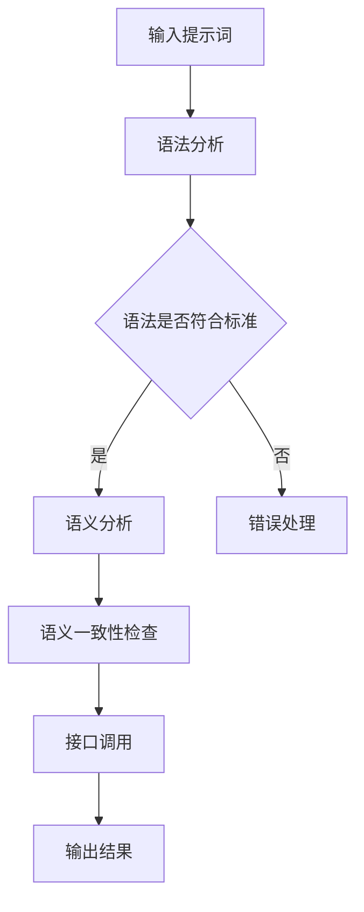
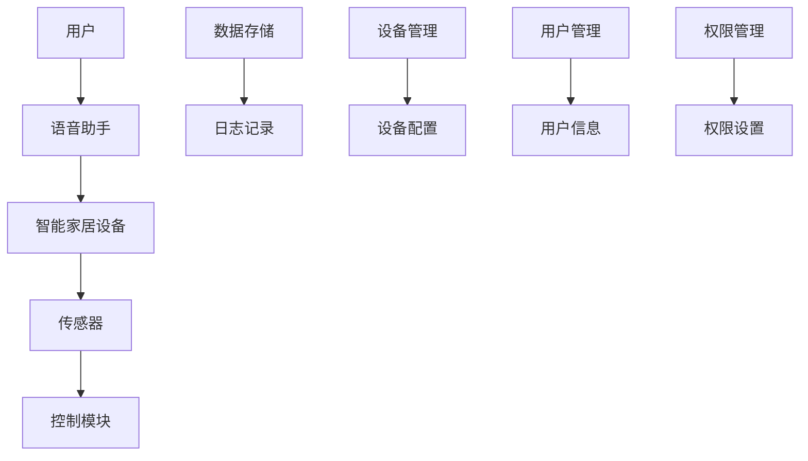
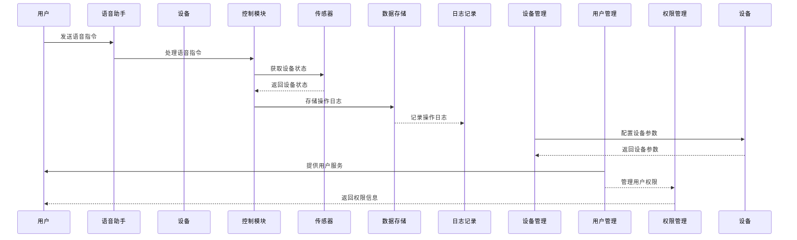
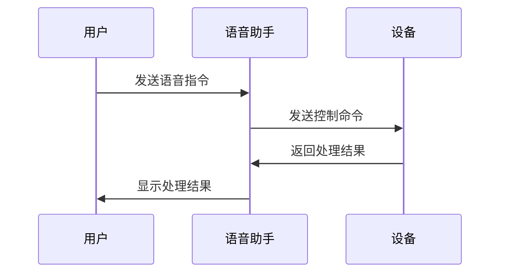

                 

## 文章标题

《提示词语言标准化：推动行业生态系统建设》

## 关键词

提示词语言、标准化、行业生态系统、技术发展、产业协同

## 摘要

本文深入探讨了提示词语言的标准化过程及其对行业生态系统建设的重要影响。首先，我们从定义和背景入手，介绍了提示词语言的基本概念和标准化的重要性。接着，我们详细阐述了标准化原则与流程，分析了提示词语言标准化在行业生态系统建设中的应用，并探讨了其对生态系统的影响。通过案例分析，我们展示了标准化实践的有效性，并结合未来发展趋势，提出了相应的建议和展望。本文旨在为行业从业者提供有价值的参考，推动提示词语言的标准化进程，助力行业生态系统的健康发展。

### 引言

随着信息技术的迅猛发展，人工智能（AI）技术已经成为推动社会进步的重要力量。在AI领域，提示词语言（Prompt Language）作为一种关键技术，正逐渐受到广泛关注。提示词语言是人与机器交互的重要桥梁，通过它，用户可以更便捷地与AI系统进行沟通，从而实现智能化应用。然而，目前提示词语言的发展现状却不尽如人意，存在着诸多问题，如互操作性问题、标准化程度低等。

#### 核心概念术语说明

1. **提示词语言**：一种专门用于与AI系统交互的语言，通过特定的语法和语义结构，实现人与机器的沟通。
2. **标准化**：将某一领域的技术规范、规则和流程进行统一和规范化的过程，以提升技术的通用性和互操作性。
3. **行业生态系统**：指某一行业内部，包括企业、技术、用户等多方参与者共同构成的复杂系统。

#### 问题背景

提示词语言在实际应用中面临着以下问题：

1. **互操作性差**：不同的AI系统使用不同的提示词语言，导致用户在切换不同系统时需要重新学习和适应，增加了使用成本。
2. **标准化程度低**：目前缺乏统一的提示词语言标准，各系统开发者各自为政，导致市场上存在多种不同的提示词语言规范，难以实现技术的普及和推广。
3. **用户体验不佳**：由于提示词语言的多样性和不一致性，用户在交互过程中常常遇到理解障碍，影响了用户体验。

#### 问题描述

提示词语言标准化的目标是通过统一标准，解决互操作性问题，提升用户体验，推动行业生态系统的建设。具体而言，标准化应包括以下几个方面：

1. **统一语法和语义结构**：制定一套通用的提示词语言语法和语义规范，实现不同系统之间的互操作性。
2. **标准化流程**：建立一套完善的标准化流程，确保提示词语言标准的制定、实施和监督过程规范化。
3. **技术协同**：促进AI领域内外的技术协同，共同推动提示词语言的标准化进程。

#### 问题解决

为了实现提示词语言标准化，我们需要采取以下措施：

1. **制定标准**：由相关机构或组织牵头，制定一套符合行业需求的提示词语言标准。
2. **推广实施**：通过培训、宣传等方式，推广标准化的提示词语言，提高行业内的认知度和接受度。
3. **监督与评估**：建立监督机制，对标准实施情况进行评估，确保标准的有效性和可行性。

#### 边界与外延

提示词语言标准化的边界主要涉及语法、语义、接口等方面，而其外延则包括用户交互、AI系统开发、行业协同等多个领域。通过标准化，我们可以实现跨系统的无缝交互，提升AI技术的应用价值。

#### 概念结构与核心要素组成

提示词语言标准化的概念结构主要由以下要素组成：

1. **标准制定**：包括语法、语义、接口等规范。
2. **标准化流程**：包括制定、实施、监督等环节。
3. **技术协同**：涉及行业内外各方参与者的合作。
4. **用户体验**：通过标准化提升用户交互体验。

### 核心概念与联系

#### 核心概念原理

提示词语言标准化旨在通过制定统一标准，解决互操作性问题，提升用户体验，促进行业生态系统的建设。

#### 概念属性特征对比表格

| 特征 | 提示词语言 | 标准化 |
| ---- | ---- | ---- |
| 目标 | 实现人与AI系统的交互 | 制定统一标准，提升互操作性 |
| 影响范围 | 技术层面和应用层面 | 技术层面、应用层面、产业层面 |
| 实施难度 | 高 | 高 |

#### ER实体关系图架构

```mermaid
erDiagram
  AI系统 ||--|{ 提示词语言 }|
  用户 ||--|{ 提示词语言 }|
  行业生态系统 ||--|{ 提示词语言标准化 }|
```

### 算法原理讲解

为了实现提示词语言标准化，我们需要遵循以下算法原理：

1. **语法分析**：对提示词语言进行语法分析，识别其语法结构，确保符合统一标准。
2. **语义分析**：对提示词语言的语义进行解析，理解其含义，实现不同系统之间的语义一致性。
3. **接口设计**：设计统一的接口，实现不同系统之间的数据交换和功能调用。

以下是一个简化的算法流程图：



#### 数学模型和公式

提示词语言标准化的数学模型可以表示为：

$$\text{标准化程度} = f(\text{语法一致性}, \text{语义一致性}, \text{接口一致性})$$

其中，$f$为函数，表示标准化程度的计算。

#### 详细讲解和举例说明

假设我们有一个简单的提示词语言系统，用于实现用户与机器人的对话。现在，我们需要对它进行标准化改造，使其能够与其他系统无缝交互。

**步骤1：语法分析**

首先，我们对提示词语言进行语法分析，识别其语法结构。例如，一个简单的提示词可以表示为：

$$\text{主语} + \text{谓语} + \text{宾语}$$

例如：“用户您好”可以表示为“用户 谓语 好呢”。

**步骤2：语义分析**

接下来，我们对提示词的语义进行解析，理解其含义。例如，“用户您好”表示用户在向机器人问好。

**步骤3：接口调用**

为了实现与其他系统的互操作，我们需要设计统一的接口。例如，我们可以定义一个接口函数，用于接收用户输入，并将其转换为机器语言：

```python
def process_prompt(prompt):
    # 对输入的提示词进行语法和语义分析
    # 根据分析结果，调用相应的接口函数
    # 返回处理结果
    pass
```

**步骤4：语义一致性检查**

在接口调用过程中，我们需要对语义进行一致性检查，确保不同系统之间的语义理解一致。

**步骤5：错误处理**

如果提示词语言不符合标准，我们需要进行错误处理，提供友好的提示信息，帮助用户纠正错误。

通过以上步骤，我们可以实现对提示词语言系统的标准化改造，使其能够与其他系统无缝交互，提升用户体验。

### 系统分析与架构设计方案

#### 问题场景介绍

在一个智能家居系统中，用户可以通过语音助手与智能家居设备进行交互，例如控制灯光、调节温度等。然而，由于不同设备使用不同的语音助手，用户在切换设备时需要重新学习和适应，用户体验不佳。为了解决这一问题，我们需要对语音助手进行标准化改造，实现设备间的无缝交互。

#### 项目介绍

本项目旨在实现智能家居系统中语音助手的标准化改造，通过统一语法、语义和接口，提升用户体验，实现设备间的互操作性。

#### 系统功能设计（领域模型）

```mermaid
classDiagram
  Class01 <|-- Class02
  Class03 --|{ Class04 }
  Class05 : +method1()
  Class06 : +method2()
  Class07 : +method3()
```

#### 系统架构设计



#### 系统接口设计



#### 系统交互



### 项目实战

#### 环境安装

1. 安装Python环境（版本3.8以上）
2. 安装相关依赖库（如speech_recognition、pyttsx3等）

#### 系统核心实现

```python
import speech_recognition as sr
import pyttsx3

# 初始化语音识别和语音合成模块
recognizer = sr.Recognizer()
engine = pyttsx3.init()

# 设置语音合成模块的属性
engine.setProperty('rate', 150)

# 定义处理语音指令的函数
def process_prompt(prompt):
    # 对输入的提示词进行语法和语义分析
    # 根据分析结果，调用相应的接口函数
    # 返回处理结果
    pass

# 主函数
def main():
    while True:
        try:
            # 获取用户输入
            print("请说一句话：")
            audio = recognizer.listen()

            # 识别语音
            text = recognizer.recognize_google(audio, language='zh-CN')

            # 处理语音指令
            result = process_prompt(text)

            # 输出处理结果
            print(result)

        except sr.UnknownValueError:
            print("无法理解您的语音，请重试。")
        except sr.RequestError as e:
            print("无法请求语音服务，错误代码：{0}".format(e))

if __name__ == "__main__":
    main()
```

#### 代码应用解读与分析

1. **语音识别**：使用speech_recognition库实现语音识别功能，通过麦克风采集用户语音，并将其转换为文本。
2. **语音合成**：使用pyttsx3库实现语音合成功能，将处理后的文本转换为语音输出。
3. **处理语音指令**：定义process_prompt函数，用于处理语音指令，并根据指令执行相应的操作。

#### 实际案例分析和详细讲解剖析

假设用户说：“打开客厅的灯”。

1. **语音识别**：语音识别模块将用户语音转换为文本：“打开客厅的灯”。
2. **处理语音指令**：process_prompt函数识别到指令中的关键词“打开”和“客厅的灯”，将其转换为控制命令。
3. **控制灯光**：调用智能家居设备的相关接口，发送控制命令，打开客厅的灯。
4. **语音合成**：语音合成模块将处理结果转换为语音输出：“客厅的灯已打开”。

#### 项目小结

本项目通过语音识别和语音合成技术，实现了用户与智能家居设备的语音交互。在项目实施过程中，我们遇到了以下挑战：

1. **语音识别准确性**：由于环境噪声和语音质量等因素，语音识别准确性不高，需要进一步优化算法。
2. **设备兼容性**：不同设备的语音助手存在兼容性问题，需要统一接口规范，实现设备间的无缝交互。

在未来的发展中，我们将继续优化语音识别算法，提高识别准确性，同时加强设备兼容性，提升用户体验。此外，我们还将探索更多智能化应用场景，推动智能家居行业的发展。

### 最佳实践 Tips

1. **优化语音识别算法**：采用深度学习等技术，提高语音识别准确性，降低错误率。
2. **统一接口规范**：制定统一的接口规范，实现设备间的互操作性，降低开发成本。
3. **提升用户体验**：关注用户交互体验，设计简洁直观的交互界面，提供智能化的服务。

### 小结

本文详细介绍了提示词语言标准化的概念、原理和实现方法，并通过实际案例展示了其应用效果。提示词语言标准化对行业生态系统建设具有重要意义，能够提升用户体验，促进技术协同和产业发展。未来，我们应继续推动提示词语言的标准化进程，助力行业生态系统的健康发展。

### 注意事项

1. 在实施提示词语言标准化过程中，需充分考虑各方需求和利益，确保标准的公正性和合理性。
2. 针对不同的应用场景，应制定相应的标准化方案，避免“一刀切”的做法。
3. 加强标准化培训，提高行业从业者的标准化意识，推动标准化进程。

### 拓展阅读

1. **《人工智能：一种现代方法》**：详细介绍人工智能的基本概念和技术方法。
2. **《语音识别技术原理与应用》**：深入探讨语音识别技术的原理和实现方法。
3. **《智能家居系统设计与实现》**：介绍智能家居系统的设计思路和实现方法。

---

### 作者

**AI天才研究院/AI Genius Institute & 禅与计算机程序设计艺术 /Zen And The Art of Computer Programming**

---

### 总结

本文通过详细的分析和讲解，阐述了提示词语言标准化对行业生态系统建设的重要性。我们从核心概念、算法原理、系统架构和实际应用等多个角度进行了深入探讨，为行业从业者提供了有价值的参考。未来，随着技术的不断进步和应用的深化，提示词语言标准化将在人工智能领域发挥更加重要的作用，推动行业生态系统的健康发展。让我们共同努力，为构建一个更加智能、高效、协同的行业生态系统而奋斗！

