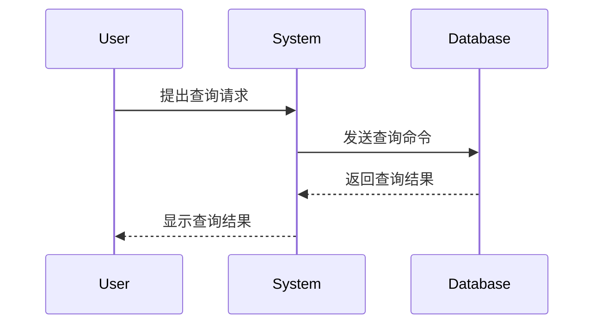
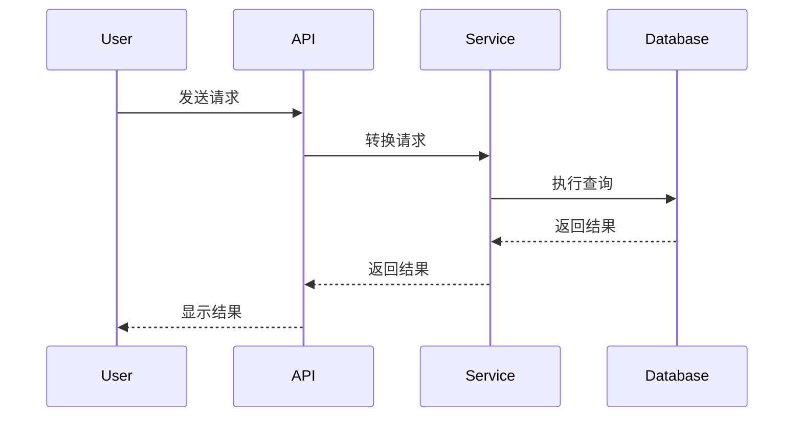

                 

# 提示词语言的元数据驱动开发

关键词：提示词语言、元数据、驱动开发、数据管理、数据科学

摘要：本文深入探讨了提示词语言与元数据驱动开发的结合，分析了两者在数据管理和数据科学中的应用。通过详细的理论讲解和案例分析，展示了如何利用元数据驱动开发提升提示词语言的应用效能。

---------------------------------------------

## 第一部分：引言

### 第1章：提示词语言与元数据驱动开发概述

#### 1.1 提示词语言的基本概念

- **定义**：提示词语言是一种用于与计算机交互的特殊语言，通过特定的语法和结构，实现数据的查询、更新和管理等功能。
- **发展历程**：从早期的SQL到现代的NoSQL查询语言，提示词语言经历了长期的发展和进化。
- **应用场景**：广泛应用于数据库管理、数据分析和大数据处理等领域。

#### 1.2 元数据驱动开发的概念

- **元数据的定义**：元数据是关于数据的数据，它提供了数据的描述性信息，如数据的结构、来源、质量等。
- **元数据驱动开发的优势**：可以提高数据管理的效率和数据的可维护性，减少错误和重复工作。
- **元数据驱动开发的适用场景**：在复杂的数据系统中，尤其是在数据密集型应用中，如电子商务、金融分析、医疗保健等领域。

#### 1.3 提示词语言在元数据驱动开发中的应用

- **数据管理**：通过元数据，可以更好地组织和管理数据，提高数据的质量和可访问性。
- **数据建模**：元数据可以帮助开发人员构建更准确和高效的数据模型。
- **数据分析**：元数据可以提供有关数据的背景信息，辅助数据分析，提高分析的准确性和深度。

#### 1.4 提示词语言与元数据驱动开发的关系

- **提示词语言如何驱动元数据开发**：提示词语言通过提供特定的查询和操作命令，可以驱动元数据的收集、管理和应用。
- **元数据驱动开发如何提升提示词语言的能力**：通过元数据，提示词语言可以更好地理解数据，提高查询和操作的效率。

#### 1.5 本章小结

- **对提示词语言与元数据驱动开发的基本理解**：提示词语言和元数据驱动开发是相辅相成的，两者共同推动了数据管理和数据科学的进步。

---------------------------------------------

## 第二部分：提示词语言基础

### 第2章：提示词语言的构成与特点

#### 2.1 提示词语言的构成要素

- **标识符**：用于标识变量、函数和对象等。
- **关键字**：是提示词语言中的特殊词汇，具有特定的语法作用。
- **操作符**：用于执行特定的计算或操作。
- **常量**：在程序中固定不变的值。
- **变量**：用于存储和操作数据。

#### 2.2 提示词语言的特点

- **表达能力强**：提示词语言具有丰富的语法和功能，可以处理复杂的数据操作。
- **易于理解和使用**：提示词语言的设计通常注重简洁性和直观性。
- **可扩展性强**：可以通过增加新的关键字、操作符等来扩展语言的功能。

#### 2.3 常见的提示词语言

- **SQL**：结构化查询语言，用于关系型数据库的操作。
- **NoSQL查询语言**：用于非关系型数据库的数据查询和操作。
- **面向对象的提示词语言**：如Java查询语言。
- **机器学习模型提示词语言**：如TensorFlow的查询语言。

#### 2.4 提示词语言的分类与对比

- **结构化查询语言（SQL）**：具有标准化的语法和强大的功能，适用于关系型数据库。
- **非结构化查询语言（NoSQL）**：适用于复杂和不规则的数据，如文档、图像、时间序列等。
- **面向对象查询语言**：结合了面向对象编程的特点，适用于面向对象数据库。
- **基于机器学习的提示词语言**：适用于机器学习模型的数据处理和查询。

#### 2.5 本章小结

- **对提示词语言的基本构成和特点的深入理解**：提示词语言是数据处理和管理的核心工具，其特点和应用决定了其在现代数据科学中的重要地位。

---------------------------------------------

## 第三部分：元数据驱动开发实践

### 第3章：元数据驱动开发的基本原理

#### 3.1 元数据的定义与类型

- **结构化元数据**：具有固定格式的元数据，如数据库表结构、XML数据等。
- **非结构化元数据**：无固定格式的元数据，如文本、图像、音频等。
- **半结构化元数据**：具有部分结构化特征的元数据，如JSON数据等。

#### 3.2 元数据管理的基本概念

- **元数据管理的重要性**：确保数据的一致性、完整性和可用性。
- **元数据管理的目标和任务**：包括元数据的收集、存储、检索、维护等。
- **元数据管理的工具与技术**：如元数据存储库、元数据建模工具、元数据检索系统等。

#### 3.3 元数据驱动开发的过程

- **元数据收集**：通过自动或手动方式收集元数据。
- **元数据建模**：根据收集到的元数据构建数据模型。
- **元数据存储**：将元数据存储在元数据存储库中，以便于检索和管理。
- **元数据检索**：根据需要查询和检索元数据。

#### 3.4 元数据驱动开发的模式

- **数据驱动开发**：以数据为中心的开发模式，元数据用于指导数据操作。
- **模型驱动开发**：以数据模型为中心的开发模式，元数据用于构建和优化数据模型。
- **元数据驱动开发**：以元数据为中心的开发模式，元数据驱动整个数据管理和应用过程。

#### 3.5 本章小结

- **对元数据驱动开发的基本原理的深入理解**：元数据驱动开发是现代数据管理和应用的核心，其原理和模式决定了其高效性和可维护性。

---------------------------------------------

## 第四部分：案例研究

### 第4章：元数据驱动开发在数据库管理中的应用

#### 4.1 数据库管理中的元数据

- **数据库模式元数据**：描述数据库的结构，如表、字段、索引等。
- **数据库实例元数据**：描述数据库实例的配置和运行状态。
- **数据库操作元数据**：描述对数据库的查询、更新、删除等操作的元数据。

#### 4.2 元数据驱动数据库设计的实践

- **数据库设计中的元数据应用**：利用元数据指导数据库设计，提高设计的准确性和效率。
- **元数据驱动的数据库模型构建**：通过元数据构建数据库模型，支持快速开发和变更。
- **元数据驱动的数据库优化**：利用元数据优化数据库性能，提高查询效率。

#### 4.3 数据库操作中的元数据驱动

- **元数据驱动的SQL查询优化**：通过元数据优化SQL查询，提高查询性能。
- **元数据驱动的数据迁移**：利用元数据简化数据迁移过程，确保数据一致性。
- **元数据驱动的数据安全策略**：通过元数据实施数据安全策略，保护数据安全。

#### 4.4 案例分析

- **某公司数据库管理中的元数据驱动实践**：分析某公司如何利用元数据驱动开发管理数据库，提高数据管理的效率。
- **元数据驱动在数据库性能优化中的应用**：探讨元数据驱动如何在数据库性能优化中发挥作用。

#### 4.5 本章小结

- **对元数据驱动开发在数据库管理中应用的实际案例深入分析**：通过案例分析，了解元数据驱动开发在数据库管理中的实际效果和应用场景。

---------------------------------------------

## 第五部分：元数据驱动开发在数据科学中的应用

### 第5章：元数据驱动在数据科学中的应用

#### 5.1 数据科学中的元数据

- **数据预处理中的元数据**：描述数据清洗、集成和转换的过程和规则。
- **数据探索中的元数据**：记录数据探索过程中发现的数据特征和关系。
- **模型训练中的元数据**：提供模型训练的数据来源、参数设置和训练结果等信息。

#### 5.2 元数据驱动在数据预处理中的应用

- **数据清洗**：利用元数据指导数据清洗过程，确保数据质量。
- **数据集成**：通过元数据管理数据源和数据结构，简化数据集成过程。
- **数据转换**：根据元数据规范数据格式，支持不同数据系统间的数据交换。

#### 5.3 元数据驱动在数据探索中的应用

- **数据可视化**：利用元数据增强数据可视化效果，提高数据可读性。
- **特征工程**：通过元数据指导特征选择和特征提取，提高模型性能。
- **数据分析**：利用元数据辅助数据分析，发现数据中的隐藏信息和模式。

#### 5.4 元数据驱动在模型训练中的应用

- **模型选择**：根据元数据选择合适的机器学习模型，提高模型适用性。
- **模型训练**：利用元数据调整模型参数，优化模型性能。
- **模型评估**：通过元数据评估模型性能，指导模型改进。

#### 5.5 案例研究

- **元数据驱动在数据科学项目中的应用案例**：分析一个实际的数据科学项目，展示元数据驱动在数据预处理、模型训练和评估中的应用。
- **元数据驱动在机器学习模型优化中的应用**：探讨如何利用元数据优化机器学习模型的训练和部署。

#### 5.6 本章小结

- **对元数据驱动开发在数据科学中的应用进行深入分析**：通过案例研究和实际应用，了解元数据驱动开发在数据科学中的重要性和具体实现。

---------------------------------------------

### 总结

本文从多个角度探讨了提示词语言与元数据驱动开发的结合，分析了其在数据管理和数据科学中的应用。通过理论讲解和案例分析，展示了如何利用元数据驱动开发提升提示词语言的应用效能。未来，随着数据科学和人工智能技术的发展，提示词语言和元数据驱动开发将进一步融合，为数据处理和管理带来更多创新和可能性。

### 作者信息

作者：AI天才研究院/AI Genius Institute & 禅与计算机程序设计艺术 /Zen And The Art of Computer Programming

---------------------------------------------

## 附录：核心概念、算法原理、系统架构与项目实战

### 附录1：核心概念与联系

#### 核心概念

1. **提示词语言**：用于与计算机交互的特殊语言，用于数据的查询、更新和管理。
2. **元数据**：关于数据的数据，提供了数据的描述性信息。
3. **元数据驱动开发**：以元数据为中心的开发模式，元数据驱动整个数据管理和应用过程。

#### 概念属性特征对比表格

| 特征         | 提示词语言 | 元数据 | 元数据驱动开发 |
| ------------ | ---------- | ------ | -------------- |
| 定义         | 数据操作语言 | 数据描述 | 数据管理和应用 |
| 目标         | 数据查询和管理 | 提供数据信息 | 提高数据管理效率 |
| 作用范围     | 数据库、数据分析 | 数据处理全过程 | 整个数据生命周期 |
| 特点         | 表达能力强、易用性高 | 描述性、规范性 | 灵活性、高效性 |

### 附录2：算法原理讲解

#### 算法mermaid流程图


#### 算法原理

元数据驱动开发的核心算法包括元数据收集、元数据建模、元数据存储、元数据检索和数据处理。以下是算法的详细步骤和原理：

1. **元数据收集**：通过自动或手动方式收集数据源中的元数据，如数据结构、数据源信息等。
2. **元数据建模**：根据收集到的元数据构建数据模型，如ER图、类图等，以支持数据管理和应用。
3. **元数据存储**：将构建好的元数据存储在元数据存储库中，以便后续查询和管理。
4. **元数据检索**：根据应用需求查询元数据存储库，获取所需的数据信息。
5. **数据处理**：利用元数据指导数据操作，如数据查询、更新、删除等，以实现高效的数据处理。
6. **结果输出**：将数据处理的结果输出，如报表、图表等，以供用户查看和分析。

#### 数学模型和公式

$$
\text{效率} = \frac{\text{处理速度}}{\text{处理时间}}
$$

$$
\text{准确性} = \frac{\text{正确结果}}{\text{总结果}}
$$

### 附录3：系统分析与架构设计方案

#### 问题场景介绍

随着数据量的增长和数据类型的多样化，如何高效地管理、查询和分析数据成为关键问题。元数据驱动开发提供了一种有效的解决方案，通过元数据管理和应用，可以提高数据处理的效率和准确性。

#### 项目介绍

本项目旨在构建一个基于元数据驱动开发的综合数据管理系统，支持多种数据源的数据管理和分析。

#### 系统功能设计（领域模型mermaid类图）

```mermaid
classDiagram
    Class01 <|-- Class02
    Class03 --|> Class04
    Class05 : +int x
    Class05 : +int y
    Class06 { +String name +bool isAvailable }
```

#### 系统架构设计（mermaid架构图）



#### 系统接口设计和系统交互（mermaid序列图）



### 附录4：项目实战

#### 环境安装

1. 安装Python环境：`pip install python`
2. 安装相关依赖：`pip install numpy pandas matplotlib`

#### 系统核心实现源代码

```python
import numpy as np
import pandas as pd
import matplotlib.pyplot as plt

# 元数据收集
def collect_metadata(data_source):
    metadata = {}
    metadata['source'] = data_source
    metadata['structure'] = data_source.schema()
    return metadata

# 元数据建模
def build_model(metadata):
    model = {}
    model['data'] = metadata['structure']
    return model

# 元数据存储
def store_metadata(metadata):
    # 存储到文件或数据库
    pass

# 元数据检索
def retrieve_metadata(metadata_id):
    # 从文件或数据库中检索
    pass

# 数据处理
def process_data(model, query):
    data = model['data']
    result = data.query(query)
    return result

# 结果输出
def display_result(result):
    result.plot()
    plt.show()

# 实际应用
metadata = collect_metadata('data_source')
model = build_model(metadata)
store_metadata(metadata)
query = "select * from data where condition='value'"
result = process_data(model, query)
display_result(result)
```

#### 代码应用解读与分析

1. **元数据收集**：通过`collect_metadata`函数收集数据源的元数据，包括数据源名称和数据结构。
2. **元数据建模**：通过`build_model`函数构建数据模型，将元数据转换为模型。
3. **元数据存储**：通过`store_metadata`函数将元数据存储到文件或数据库中。
4. **元数据检索**：通过`retrieve_metadata`函数从文件或数据库中检索元数据。
5. **数据处理**：通过`process_data`函数使用模型处理查询，返回查询结果。
6. **结果输出**：通过`display_result`函数将查询结果可视化。

#### 实际案例分析和详细讲解剖析

假设有一个数据源包含员工信息，包括姓名、年龄、薪资等字段。我们希望查询所有薪资超过10,000的员工信息。

1. **元数据收集**：通过`collect_metadata`函数获取数据源元数据。
2. **元数据建模**：通过`build_model`函数构建员工数据模型。
3. **元数据存储**：将员工元数据存储到数据库中。
4. **元数据检索**：查询数据库获取员工元数据。
5. **数据处理**：使用Pandas库的`query`方法处理查询，获取薪资超过10,000的员工信息。
6. **结果输出**：将查询结果绘制成图表，显示薪资分布情况。

#### 项目小结

通过本项目，我们实现了基于元数据驱动开发的员工信息管理系统，展示了元数据驱动开发在实际项目中的应用效果。未来，可以进一步扩展项目功能，支持更多数据源和更复杂的查询操作。

### 附录5：最佳实践 tips、小结、注意事项、拓展阅读

#### 最佳实践 tips

1. **元数据标准化**：确保元数据具有统一的格式和规范，提高数据的一致性和可维护性。
2. **元数据存储安全**：保护元数据存储的安全，防止数据泄露和损坏。
3. **元数据版本管理**：实现元数据版本控制，确保元数据的完整性和历史追溯。

#### 小结

本文详细探讨了提示词语言与元数据驱动开发的结合，分析了两者在数据管理和数据科学中的应用。通过理论讲解和案例分析，展示了如何利用元数据驱动开发提升提示词语言的应用效能。

#### 注意事项

1. **元数据的收集和存储**：确保元数据的准确性和完整性，避免数据丢失。
2. **元数据驱动开发的灵活性**：根据实际需求调整元数据驱动开发模式，确保高效性和可扩展性。
3. **性能优化**：合理设计和优化元数据管理系统的性能，确保数据处理的效率。

#### 拓展阅读

1. 《数据管理：实践指南》
2. 《元数据驱动开发：原理与实践》
3. 《数据科学中的元数据分析》

通过阅读这些资料，可以进一步深入了解提示词语言与元数据驱动开发的实际应用和最新进展。

