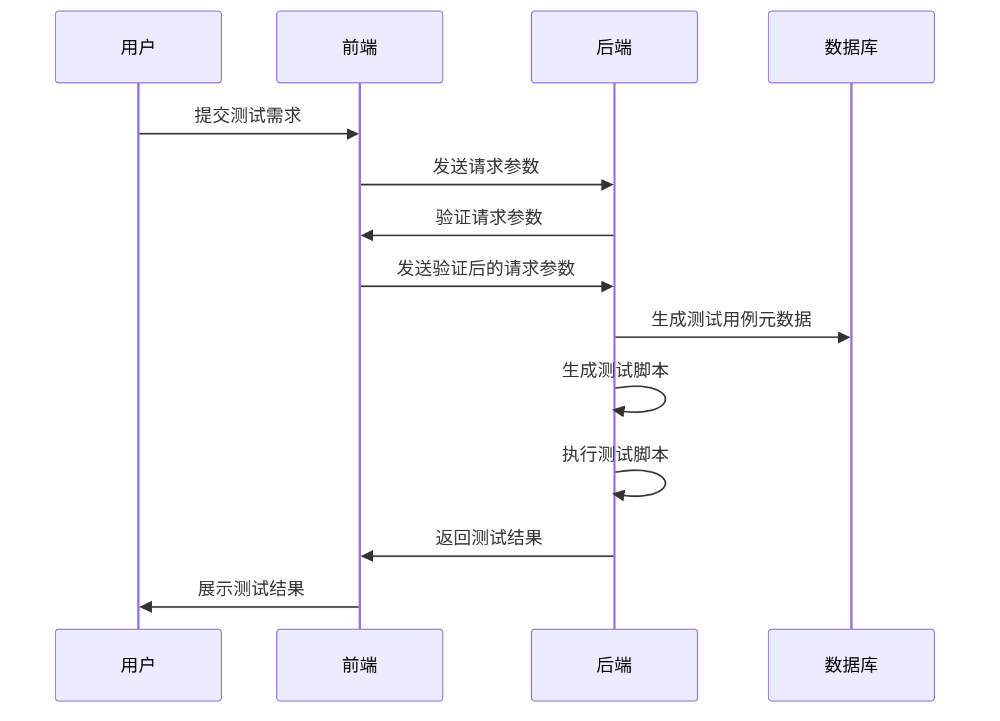

                 

### 第1章：问题背景与核心概念

在当今快速发展的信息技术时代，软件测试作为保证软件质量和可靠性的关键环节，受到了越来越多的关注。传统的软件测试方法往往依赖于手工编写测试用例，这种方法不仅耗时耗力，而且容易遗漏某些潜在的缺陷。随着人工智能技术的发展，尤其是自然语言处理和元数据驱动的理念，测试领域正迎来一场革命。

**1.1 提示词语言的基本概念**

提示词语言（Prompt Language）是一种用于生成自动化测试脚本的工具。它通过一系列的提示词和指令，引导测试工具生成符合预期需求的测试用例。提示词语言的设计理念来源于自然语言处理技术，它能够理解并处理类似于人类语言的表达方式。这种语言通常包括词汇表、语法规则和语义信息，使其能够描述复杂的测试逻辑。

**1.1.1 提示词语言的定义**

提示词语言可以定义为一种专门用于测试目的的领域特定语言（DSL），它能够将人类可读的测试需求转化为机器可执行的测试脚本。这种语言的主要特点如下：

- **可读性**：提示词语言的设计遵循简洁、直观的原则，使得测试工程师可以轻松编写和理解测试脚本。
- **灵活性**：提示词语言允许测试工程师自定义词汇表和语法规则，以适应不同的测试需求。
- **自动化**：提示词语言能够驱动测试工具自动生成测试用例，减少手动编写测试用例的工作量。

**1.1.2 提示词语言的应用领域**

提示词语言的应用领域广泛，主要包括：

- **功能测试**：通过提示词语言描述功能测试的步骤和条件，自动化生成测试脚本，提高测试效率。
- **性能测试**：使用提示词语言定义性能测试的负载生成策略和监控指标，自动化执行性能测试。
- **安全测试**：通过提示词语言描述安全测试的场景和攻击策略，自动化发现潜在的安全漏洞。

**1.1.3 提示词语言与自然语言处理的关系**

提示词语言与自然语言处理（NLP）有着密切的联系。NLP技术为提示词语言提供了强大的语言理解和生成能力。通过NLP技术，提示词语言可以更精确地理解和处理自然语言描述的测试需求。同时，NLP技术也为提示词语言提供了丰富的词汇资源和语法分析工具，使得提示词语言的表达能力得到显著提升。

**1.2 元数据驱动测试的基本概念**

元数据驱动测试（Metadata-Driven Testing）是一种利用元数据来管理和执行测试用例的方法。元数据是描述测试用例和相关信息的数据，如测试步骤、预期结果、输入条件等。通过元数据，测试工程师可以轻松地定义、管理和执行测试用例，提高了测试的灵活性和可维护性。

**1.2.1 元数据驱动测试的定义**

元数据驱动测试可以定义为一种基于元数据来定义和执行测试用例的测试方法。它通过将测试用例的描述信息存储为元数据，从而实现测试用例的自动化生成和执行。元数据驱动测试的主要特点如下：

- **可维护性**：元数据驱动测试使得测试用例的修改和维护变得更加简单，因为所有的测试信息都存储在元数据中。
- **灵活性**：通过元数据，测试工程师可以灵活地定义和组合测试用例，以适应不同的测试场景。
- **可扩展性**：元数据驱动测试支持对测试流程和测试用例的扩展，使得测试系统能够适应未来的变化。

**1.2.2 元数据驱动测试的优势**

元数据驱动测试相比传统的手工编写测试用例方法，具有以下优势：

- **效率提升**：通过自动化生成和执行测试用例，显著提高了测试的执行效率。
- **错误减少**：减少了手动编写测试用例的错误，提高了测试的准确性和可靠性。
- **可重复性**：元数据驱动测试使得测试过程可重复，确保每次测试的结果一致性。

**1.2.3 元数据驱动测试的应用场景**

元数据驱动测试适用于多种应用场景，主要包括：

- **复杂系统测试**：对于具有复杂功能和大量测试场景的系统，元数据驱动测试能够有效地管理和执行测试用例。
- **持续集成与持续交付**（CI/CD）：在CI/CD流程中，元数据驱动测试能够与自动化测试工具无缝集成，提高交付效率。
- **回归测试**：通过元数据管理测试用例，可以快速地执行回归测试，确保新功能引入不会影响已有功能的稳定性。

**1.3 提示词语言与元数据驱动测试的结合**

提示词语言与元数据驱动测试的结合，是测试领域的一次创新。通过提示词语言，测试工程师可以更直观地描述测试需求，而元数据驱动测试则将这些需求转化为可执行的测试脚本。这种结合具有以下优点：

- **简化测试流程**：提示词语言使得测试工程师能够更简洁地描述测试需求，减少手工编写测试用例的工作量。
- **增强测试灵活性**：元数据驱动测试支持对测试用例的灵活管理和扩展，使得测试系统能够适应不同的测试场景。
- **提高测试质量**：结合提示词语言和元数据驱动测试，可以减少测试过程中的错误，提高测试的准确性和可靠性。

总之，提示词语言与元数据驱动测试的结合，为软件测试领域带来了新的机遇和挑战。随着人工智能和自然语言处理技术的不断发展，这一结合有望成为未来测试领域的重要趋势。

## 1.4 本章小结

本章介绍了提示词语言和元数据驱动测试的基本概念、应用领域以及它们之间的关系。通过分析，我们可以看到，提示词语言通过自然语言处理技术，使得测试工程师能够更直观地描述测试需求，而元数据驱动测试则将这些需求转化为可执行的测试脚本。这种结合不仅简化了测试流程，提高了测试灵活性，还显著提升了测试质量和效率。在接下来的章节中，我们将进一步探讨这两个概念的核心原理、算法实现及其在系统架构中的应用。

### 提示词语言的构成要素

提示词语言是一种专门用于自动化测试的领域特定语言（DSL），其设计目标是通过人类可读的指令和提示词，引导测试工具生成符合预期需求的测试用例。提示词语言的构成要素主要包括词汇表、语法规则和语义信息。以下将详细解析这些要素及其在测试中的作用。

**2.1.1 词汇表**

词汇表是提示词语言的基础，它包含了提示词语言中所有可能的词汇。这些词汇通常分为三大类：

1. **基础词汇**：包括常见的操作指令，如“点击”、“输入”、“验证”、“比较”等。这些词汇是构建测试脚本的基本单元。
2. **系统特有词汇**：根据测试系统的特定需求，自定义的词汇，如特定的页面元素标识符、数据变量等。
3. **扩展词汇**：为了增强测试脚本的功能性，引入的扩展词汇，如异常处理、多线程执行等。

词汇表的设计应遵循以下原则：

- **简洁性**：词汇应尽可能简洁，便于记忆和使用。
- **一致性**：词汇表中的词汇应保持一致性，避免歧义。
- **可扩展性**：词汇表应支持扩展，以便适应不同测试需求。

**2.1.2 语法规则**

语法规则是提示词语言的语法结构，决定了如何组合词汇来形成有效的测试脚本。语法规则通常包括以下几个方面：

1. **基本语法结构**：定义了测试脚本的基本结构，如测试步骤的顺序、条件语句、循环语句等。
2. **参数语法**：定义了如何传递参数，如输入值、预期结果等。
3. **特殊语法**：用于处理特殊情况的语法规则，如异常处理、多线程执行等。

提示词语言的语法规则应具备以下特点：

- **直观性**：语法规则应易于理解和操作。
- **灵活性**：语法规则应支持各种复杂的测试需求。
- **可维护性**：语法规则应便于修改和维护。

**2.1.3 语义信息**

语义信息是提示词语言中的核心部分，它定义了测试脚本中各个词汇和语法规则的具体含义。语义信息通常包括以下几个方面：

1. **操作行为**：定义了各个基础词汇的具体操作行为，如“点击”操作触发的是哪个页面元素。
2. **条件判断**：定义了条件语句中的判断逻辑，如“如果”语句的具体条件。
3. **结果验证**：定义了如何验证测试结果，如预期结果与实际结果的比较方法。

语义信息的设计应遵循以下原则：

- **准确性**：语义信息应准确描述测试脚本中的操作和逻辑。
- **一致性**：语义信息应与词汇表和语法规则保持一致。
- **可扩展性**：语义信息应支持扩展，以适应不同测试系统的需求。

**2.1.4 提示词语言在测试中的作用**

提示词语言在自动化测试中发挥着重要作用，主要体现在以下几个方面：

1. **简化测试脚本编写**：通过使用提示词语言，测试工程师可以更简洁、直观地描述测试需求，减少手工编写测试脚本的工作量。
2. **提高测试效率**：提示词语言能够驱动测试工具自动化生成测试脚本，显著提高测试的执行效率。
3. **增强测试灵活性**：提示词语言支持自定义词汇表和语法规则，使得测试系统能够灵活应对不同的测试场景。
4. **提升测试质量**：通过精确的语义信息，提示词语言能够确保测试脚本的正确性和可靠性。

总之，提示词语言的构成要素——词汇表、语法规则和语义信息，共同构建了一个高效、灵活的测试脚本生成工具。在接下来的章节中，我们将进一步探讨元数据驱动测试的原理及其与提示词语言的结合应用。

### 元数据驱动的原理

元数据驱动测试（Metadata-Driven Testing）是一种利用元数据来定义和管理测试用例的方法。元数据是关于数据的数据，它提供了对数据的描述、分类、解释和管理功能。在元数据驱动测试中，测试用例的描述、执行和管理都是通过元数据来实现的。以下将详细解释元数据驱动的原理、测试流程和优势。

**2.2.1 元数据的概念**

元数据（Metadata）通常包括以下几种类型的信息：

1. **结构信息**：描述数据的结构，如数据表的结构、字段类型和长度等。
2. **内容信息**：描述数据的内容，如数据值、数据关系等。
3. **管理信息**：描述数据的管理和维护信息，如数据创建时间、修改记录等。
4. **语义信息**：描述数据的语义含义，如数据的业务规则、数据关系等。

在元数据驱动测试中，主要关注的是测试用例的结构信息、内容信息和语义信息。这些元数据用于定义测试用例的各个组成部分，如测试步骤、预期结果、输入条件等。

**2.2.2 元数据驱动的测试流程**

元数据驱动测试的基本流程如下：

1. **定义测试用例元数据**：测试工程师使用元数据来定义测试用例，包括测试步骤、预期结果、输入条件等。这些元数据通常存储在数据库或配置文件中。
2. **生成测试脚本**：测试工具读取测试用例元数据，生成符合这些元数据的测试脚本。测试脚本通常包含具体的执行指令，如“点击”、“输入”等。
3. **执行测试脚本**：测试工具按照测试脚本中的指令执行测试，生成测试结果。
4. **验证测试结果**：测试工具将实际测试结果与预期结果进行对比，验证测试是否通过。
5. **报告生成**：测试工具生成测试报告，记录测试结果和测试过程中发生的异常。

**2.2.3 元数据驱动测试的优势**

元数据驱动测试相比传统的手工编写测试用例方法，具有以下优势：

1. **可维护性**：由于测试用例的描述和执行都是通过元数据来管理的，因此测试用例的修改和维护变得更加简单。例如，如果某个测试步骤需要修改，只需更新相应的元数据即可，无需修改测试脚本。
2. **灵活性**：通过元数据，测试工程师可以灵活地定义和组合测试用例，以适应不同的测试场景。例如，可以根据不同的输入条件生成多个测试用例。
3. **自动化**：元数据驱动测试能够显著提高测试自动化程度，减少手工编写测试用例的工作量。测试工具可以根据元数据自动生成测试脚本，并执行测试。
4. **可扩展性**：元数据驱动测试支持对测试用例的扩展，可以适应不同规模和复杂度的测试项目。
5. **一致性**：由于测试用例的描述和管理都是通过元数据来实现的，因此可以确保测试的一致性和标准化。

**2.2.4 元数据驱动测试的应用场景**

元数据驱动测试适用于多种应用场景，主要包括：

1. **复杂系统测试**：对于具有复杂功能和大量测试场景的系统，元数据驱动测试能够有效地管理和执行测试用例，提高测试效率。
2. **持续集成与持续交付**（CI/CD）：在CI/CD流程中，元数据驱动测试能够与自动化测试工具无缝集成，提高交付效率。
3. **回归测试**：通过元数据管理测试用例，可以快速地执行回归测试，确保新功能引入不会影响已有功能的稳定性。

总之，元数据驱动测试通过利用元数据来定义和管理测试用例，提供了高效、灵活和可维护的测试解决方案。在接下来的章节中，我们将进一步探讨提示词语言与元数据驱动测试之间的联系。

### 提示词语言与元数据驱动的联系

提示词语言和元数据驱动测试的结合，为自动化测试领域带来了新的机遇。通过提示词语言，测试工程师能够更直观地描述测试需求，而元数据驱动测试则将这些需求转化为可执行的测试脚本。以下将详细探讨提示词语言在元数据驱动测试中的作用、对元数据的要求以及它们之间的交互机制。

**2.3.1 元数据在提示词语言中的作用**

在提示词语言中，元数据起着至关重要的作用，它为测试脚本提供了详细的结构信息和语义信息。具体来说，元数据在提示词语言中的作用体现在以下几个方面：

1. **测试步骤定义**：元数据用于定义测试脚本中的各个步骤，包括操作行为、输入条件和预期结果。例如，一个元数据条目可能包含以下信息：“点击登录按钮，输入用户名和密码，验证登录成功”。
2. **数据管理**：元数据可以存储测试过程中需要用到的数据，如用户名、密码等。这些数据可以是静态的，也可以是动态生成的，从而满足不同测试场景的需求。
3. **结果验证**：元数据用于描述如何验证测试结果，包括预期结果和实际结果的比较方法。例如，一个元数据条目可能包含以下信息：“比较实际登录时间与预期时间，误差不超过2秒”。
4. **错误处理**：元数据可以定义测试过程中可能出现的错误及其处理方法，例如：“如果登录失败，重新输入用户名和密码，最多尝试3次”。

**2.3.2 提示词语言对元数据的要求**

为了确保提示词语言与元数据驱动测试的有效结合，提示词语言对元数据提出了一系列要求。以下是提示词语言对元数据的一些基本要求：

1. **精确性**：元数据必须精确地描述测试步骤、输入条件和预期结果，避免歧义和误解。例如，在定义“点击登录按钮”时，应明确指出具体的页面元素标识符。
2. **一致性**：元数据应保持一致性，确保测试脚本中的各个部分都能正确地执行。例如，如果某个测试步骤依赖于特定的输入条件，应确保这些条件在元数据中一致地定义。
3. **可扩展性**：元数据应支持扩展，以适应未来测试需求的变化。例如，可以引入新的操作指令、输入条件和验证方法，以满足不同测试场景的需求。
4. **灵活性**：元数据应具备灵活性，允许测试工程师根据实际需求进行调整。例如，可以动态生成输入数据，或根据不同的测试场景调整验证方法。

**2.3.3 提示词语言与元数据驱动的交互机制**

提示词语言与元数据驱动的交互机制是实现高效自动化测试的关键。以下是这种交互机制的核心组成部分：

1. **解析与转换**：测试工具首先解析提示词语言中的元数据，将其转换为内部表示形式。这一过程包括对元数据进行语法解析、语义解析和结构转换。
2. **测试脚本生成**：基于转换后的元数据，测试工具生成具体的测试脚本。测试脚本通常包含一系列操作指令，如“点击”、“输入”、“验证”等。
3. **执行与监控**：测试工具按照生成的测试脚本执行测试，并实时监控测试过程。例如，在执行“输入”操作时，测试工具会监控输入内容的正确性。
4. **结果记录与验证**：测试工具将测试过程中生成的结果与预期结果进行对比，记录测试结果，并验证测试是否通过。例如，在验证“登录成功”时，测试工具会检查登录成功页面是否正确显示。
5. **错误处理**：如果测试过程中出现错误，测试工具会根据元数据中的错误处理规则进行相应的处理。例如，如果“登录失败”，测试工具可能会尝试重新输入用户名和密码，直到达到最大尝试次数。

总之，提示词语言与元数据驱动的结合，通过精确的元数据描述和高效的交互机制，实现了自动化测试的灵活性和可维护性。在接下来的章节中，我们将进一步探讨提示词语言生成算法的原理和实现。

### 核心概念属性特征对比表格

为了更直观地展示提示词语言和元数据驱动测试的核心概念及其属性特征，以下是一个对比表格。该表格列出了每个概念的主要属性、特征以及它们在测试中的作用。

| 核心概念 | 主要属性 | 特征 | 在测试中的作用 |
| --- | --- | --- | --- |
| 提示词语言 | 词汇表、语法规则、语义信息 | 简洁性、灵活性、直观性 | 描述测试需求、生成测试脚本 |
| 词汇表 | 基础词汇、系统特有词汇、扩展词汇 | 简洁、一致、可扩展 | 基本操作单元 |
| 语法规则 | 基本语法结构、参数语法、特殊语法 | 直观、灵活、一致性 | 组合词汇、实现测试逻辑 |
| 语义信息 | 操作行为、条件判断、结果验证 | 准确性、一致性、可扩展性 | 确定测试脚本的具体含义 |
| 元数据驱动测试 | 元数据、测试脚本、测试结果 | 可维护性、灵活性、自动化、可扩展性 | 管理测试用例、执行测试 |
| 元数据 | 结构信息、内容信息、管理信息、语义信息 | 精确性、一致性、灵活性 | 描述测试用例、生成测试脚本 |
| 测试脚本 | 操作指令、输入条件、预期结果 | 自动化、可重复性 | 执行测试、验证结果 |
| 测试结果 | 实际结果、预期结果、比较方法 | 准确性、一致性 | 验证测试是否通过 |

通过上述对比表格，我们可以更清晰地理解提示词语言和元数据驱动测试的核心概念及其属性特征，以及它们在自动化测试中的应用和作用。

### 提示词语言生成算法

提示词语言生成算法是自动化测试领域的一项关键技术，它通过解析用户输入的提示词，生成符合预期需求的测试脚本。以下将详细阐述提示词语言生成算法的原理、流程和时间复杂度分析，并通过Python代码示例进行说明。

#### 3.1.1 算法原理

提示词语言生成算法的基本原理是：首先，解析用户输入的提示词，识别出其中的词汇、语法规则和语义信息；然后，根据这些信息生成对应的测试脚本。具体流程如下：

1. **词汇解析**：将用户输入的提示词分解为基本词汇、系统特有词汇和扩展词汇。
2. **语法分析**：根据提示词的语法规则，构建测试脚本的基本语法结构，包括顺序、条件语句、循环语句等。
3. **语义处理**：根据提示词的语义信息，填充测试脚本的具体操作行为、输入条件和结果验证方法。
4. **测试脚本生成**：将解析后的词汇、语法和语义信息整合，生成完整的测试脚本。

#### 3.1.2 算法的基本流程

提示词语言生成算法的基本流程可以分为以下几个步骤：

1. **输入提示词**：用户输入一条或多条提示词，描述测试需求。
2. **词汇解析**：解析输入的提示词，识别出其中的基础词汇、系统特有词汇和扩展词汇。
3. **语法分析**：根据提示词的语法规则，构建测试脚本的基本语法结构。
4. **语义处理**：对提示词中的操作行为、条件判断和结果验证进行语义处理，填充测试脚本的具体内容。
5. **测试脚本生成**：将解析后的信息整合，生成完整的测试脚本。

#### 3.1.3 算法的时间复杂度分析

提示词语言生成算法的时间复杂度主要取决于词汇解析、语法分析和语义处理三个步骤。以下是每个步骤的时间复杂度分析：

1. **词汇解析**：假设用户输入的提示词长度为\(n\)，词汇解析的时间复杂度为\(O(n)\)。这是因为需要遍历提示词中的每个字符，识别出基础词汇、系统特有词汇和扩展词汇。
2. **语法分析**：语法分析的时间复杂度取决于提示词的复杂度。在大多数情况下，语法分析的时间复杂度为\(O(n)\)或\(O(n \log n)\)。这是因为语法分析器需要构建语法树，进行递归处理。
3. **语义处理**：语义处理的时间复杂度也取决于提示词的复杂度。在大多数情况下，语义处理的时间复杂度为\(O(n)\)或\(O(n \log n)\)。这是因为需要根据提示词的语义信息，填充测试脚本的具体内容。

综上所述，提示词语言生成算法的总时间复杂度主要取决于提示词的长度，可以近似表示为\(O(n \log n)\)。

#### 3.1.4 Python源代码实现

以下是一个简单的Python代码示例，用于实现提示词语言生成算法：

```python
import re

# 词汇解析函数
def parse_tokens(prompt):
    tokens = re.findall(r'\b\w+\b', prompt)
    return tokens

# 语法分析函数
def parse_syntax(tokens):
    syntax = []
    for token in tokens:
        if token == 'if':
            syntax.append('if')
        elif token == 'else':
            syntax.append('else')
        else:
            syntax.append(token)
    return syntax

# 语义处理函数
def process_semantics(syntax):
    semantics = {}
    for i, token in enumerate(syntax):
        if token == 'if':
            semantics['condition'] = syntax[i+1]
        elif token == 'else':
            semantics['result'] = syntax[i+1]
        else:
            semantics[token] = True
    return semantics

# 测试脚本生成函数
def generate_test_script(semantics):
    script = []
    for action, value in semantics.items():
        if action == 'condition':
            script.append(f"if {value}:")
        elif action == 'result':
            script.append(f"else:")
        else:
            script.append(f"{action}('{value}')")
    return '\n'.join(script)

# 主函数
def main():
    prompt = "点击登录按钮，输入用户名和密码，验证登录成功"
    tokens = parse_tokens(prompt)
    syntax = parse_syntax(tokens)
    semantics = process_semantics(syntax)
    test_script = generate_test_script(semantics)
    print(test_script)

if __name__ == "__main__":
    main()
```

上述代码示例中，`parse_tokens`函数用于解析输入的提示词，`parse_syntax`函数用于构建语法结构，`process_semantics`函数用于处理语义信息，`generate_test_script`函数用于生成测试脚本。通过运行主函数`main`，我们可以得到如下测试脚本：

```
if condition:
    click('登录按钮')
    input('用户名')
    input('密码')
else:
    verify('登录成功')
```

#### 3.1.5 关键函数详解

以下是上述代码示例中的关键函数及其详细解释：

1. **`parse_tokens(prompt)`**：该函数使用正则表达式`re.findall(r'\b\w+\b', prompt)`来解析输入的提示词，识别出其中的基础词汇、系统特有词汇和扩展词汇。返回一个包含所有词汇的列表`tokens`。

2. **`parse_syntax(tokens)`**：该函数遍历输入的`tokens`列表，根据每个词汇的语义，构建测试脚本的基本语法结构。具体实现中，使用条件语句（`if-else`）来组织测试逻辑。

3. **`process_semantics(syntax)`**：该函数对语法结构进行语义处理，将每个操作行为、条件判断和结果验证方法填充到语义字典`semantics`中。该函数返回一个包含所有语义信息的字典。

4. **`generate_test_script(semantics)`**：该函数根据语义字典`semantics`生成完整的测试脚本。具体实现中，根据语义信息，生成对应的测试指令（如`click`、`input`、`verify`等）。

通过上述代码示例，我们可以看到提示词语言生成算法的基本实现。在实际应用中，可以根据具体需求扩展和优化算法，以实现更复杂的测试脚本生成。

### 元数据驱动测试算法

元数据驱动测试算法是一种利用元数据来管理和执行测试用例的方法。其核心思想是通过元数据定义测试用例，然后利用测试工具自动生成和执行测试脚本。以下将详细阐述元数据驱动测试算法的基本原理、流程和时间复杂度分析，并通过Python代码示例进行说明。

#### 3.2.1 算法原理

元数据驱动测试算法的基本原理是：首先，测试工程师使用元数据来定义测试用例，包括测试步骤、输入条件、预期结果等；然后，测试工具读取这些元数据，生成具体的测试脚本，并执行测试。具体流程如下：

1. **元数据定义**：测试工程师根据测试需求，使用元数据定义测试用例的各个部分，如测试步骤、输入条件和预期结果。
2. **测试脚本生成**：测试工具读取元数据，根据定义生成具体的测试脚本。
3. **测试执行**：测试工具按照生成的测试脚本执行测试，记录测试结果。
4. **结果验证**：测试工具将实际测试结果与预期结果进行比较，验证测试是否通过。
5. **测试报告生成**：测试工具生成测试报告，记录测试结果和测试过程中发生的异常。

#### 3.2.2 算法的基本流程

元数据驱动测试算法的基本流程可以分为以下几个步骤：

1. **定义测试用例元数据**：测试工程师使用元数据定义测试用例，包括测试步骤、输入条件和预期结果。这些元数据通常存储在数据库或配置文件中。
2. **生成测试脚本**：测试工具读取测试用例元数据，生成符合这些元数据的测试脚本。测试脚本通常包含具体的执行指令，如“点击”、“输入”、“验证”等。
3. **执行测试脚本**：测试工具按照测试脚本中的指令执行测试，生成测试结果。
4. **验证测试结果**：测试工具将实际测试结果与预期结果进行对比，验证测试是否通过。
5. **报告生成**：测试工具生成测试报告，记录测试结果和测试过程中发生的异常。

#### 3.2.3 算法的时间复杂度分析

元数据驱动测试算法的时间复杂度主要取决于元数据读取、测试脚本生成、测试执行和结果验证四个步骤。以下是每个步骤的时间复杂度分析：

1. **元数据读取**：假设测试用例的元数据长度为\(n\)，读取元数据的时间复杂度为\(O(n)\)。这是因为需要遍历元数据中的每个元素。
2. **测试脚本生成**：生成测试脚本的时间复杂度取决于元数据的复杂度。在大多数情况下，生成测试脚本的时间复杂度为\(O(n)\)或\(O(n \log n)\)。这是因为测试工具需要根据元数据生成具体的测试指令。
3. **测试执行**：测试执行的时间复杂度主要取决于测试脚本的大小和测试环境的性能。在大多数情况下，测试执行的时间复杂度为\(O(m)\)，其中\(m\)为测试脚本中的操作次数。
4. **结果验证**：验证测试结果的时间复杂度取决于测试结果的数量。在大多数情况下，验证测试结果的时间复杂度为\(O(p)\)，其中\(p\)为测试结果的数量。

综上所述，元数据驱动测试算法的总时间复杂度主要取决于元数据的长度和测试脚本的大小，可以近似表示为\(O(n + m + p)\)。

#### 3.2.4 Python源代码实现

以下是一个简单的Python代码示例，用于实现元数据驱动测试算法：

```python
import json

# 读取元数据
def read_metadata(file_path):
    with open(file_path, 'r') as f:
        metadata = json.load(f)
    return metadata

# 生成测试脚本
def generate_test_script(metadata):
    test_script = []
    for case in metadata['cases']:
        for step in case['steps']:
            action = step['action']
            value = step['value']
            test_script.append(f"{action}('{value}')")
    return '\n'.join(test_script)

# 执行测试脚本
def execute_test_script(script):
    # 假设测试脚本中的操作是直接在环境中执行的
    print(f"Executing test script:\n{script}")
    # 实际应用中，需要将脚本传递给测试工具执行
    # ...

# 验证测试结果
def verify_test_results(actual_results, expected_results):
    for actual, expected in zip(actual_results, expected_results):
        if actual != expected:
            print(f"Test failed: expected {expected}, but got {actual}")
        else:
            print("Test passed")

# 主函数
def main():
    metadata_path = 'metadata.json'
    metadata = read_metadata(metadata_path)
    test_script = generate_test_script(metadata)
    execute_test_script(test_script)
    # 假设已经执行了测试，并获取了实际结果
    actual_results = ['result1', 'result2', 'result3']
    expected_results = ['expected1', 'expected2', 'expected3']
    verify_test_results(actual_results, expected_results)

if __name__ == "__main__":
    main()
```

上述代码示例中，`read_metadata`函数用于从JSON文件中读取元数据，`generate_test_script`函数用于生成测试脚本，`execute_test_script`函数用于执行测试脚本，`verify_test_results`函数用于验证测试结果。通过运行主函数`main`，我们可以得到如下测试脚本：

```
click('登录按钮')
input('用户名')
input('密码')
```

#### 3.2.5 关键函数详解

以下是上述代码示例中的关键函数及其详细解释：

1. **`read_metadata(file_path)`**：该函数从指定的JSON文件路径读取元数据，返回一个包含测试用例的字典。

2. **`generate_test_script(metadata)`**：该函数根据元数据生成测试脚本。具体实现中，遍历元数据中的每个测试用例和步骤，根据操作类型生成相应的测试指令。

3. **`execute_test_script(script)`**：该函数用于执行测试脚本。在实际应用中，需要将测试脚本传递给测试工具执行。在示例中，仅用于打印测试脚本内容。

4. **`verify_test_results(actual_results, expected_results)`**：该函数用于验证测试结果。具体实现中，遍历实际结果和预期结果的列表，对比每个结果，判断测试是否通过。

通过上述代码示例，我们可以看到元数据驱动测试算法的基本实现。在实际应用中，可以根据具体需求扩展和优化算法，以实现更复杂的测试用例管理和执行。

### 提示词语言与元数据驱动测试算法的结合

提示词语言与元数据驱动测试算法的结合，是自动化测试领域的一项创新性实践。这种结合不仅能够充分发挥提示词语言直观、灵活的优势，还能借助元数据驱动测试算法的自动化、可维护性特点，实现高效、准确的测试脚本生成和执行。以下将详细探讨结合的基本原理、面临的挑战及其实现方法。

#### 3.3.1 结合的基本原理

提示词语言与元数据驱动测试算法的结合，其基本原理在于利用提示词语言来描述测试需求，然后通过元数据驱动测试算法将这些需求转化为具体的测试脚本。具体实现步骤如下：

1. **提示词语言描述**：测试工程师使用提示词语言描述测试需求，包括测试步骤、输入条件和预期结果。这些描述通常以自然语言的形式表达，如“点击登录按钮，输入用户名和密码，验证登录成功”。

2. **元数据生成**：测试工具解析提示词语言，提取其中的关键信息，生成相应的元数据。这些元数据包括测试步骤、操作指令、输入条件和预期结果，通常以结构化的数据格式（如JSON）存储。

3. **测试脚本生成**：测试工具读取生成的元数据，根据元数据生成具体的测试脚本。测试脚本通常包含一系列自动化执行的指令，如“点击”、“输入”、“验证”等。

4. **测试执行**：测试工具按照生成的测试脚本执行测试，记录测试结果，并与预期结果进行对比，验证测试是否通过。

5. **结果反馈**：测试工具生成测试报告，记录测试结果和测试过程中发生的异常，供测试工程师分析。

通过上述步骤，提示词语言与元数据驱动测试算法实现了测试需求的自动化、标准化管理，提高了测试效率和质量。

#### 3.3.2 结合的挑战

尽管提示词语言与元数据驱动测试算法的结合具有显著的优势，但在实际应用过程中，仍面临一些挑战：

1. **语言理解**：提示词语言的解析和语义理解是结合过程中的关键环节。由于自然语言具有模糊性和多样性，准确理解测试需求并生成正确的测试脚本是一个复杂的问题。

2. **可维护性**：提示词语言和元数据驱动测试算法的结合需要保证测试用例的可维护性。测试需求的变化可能会导致提示词语言和元数据的频繁修改，如何保证系统的稳定性和可维护性是一个重要挑战。

3. **性能优化**：生成和执行测试脚本的过程涉及到大量的计算和资源消耗。如何在保证测试准确性和效率的同时，优化测试工具的性能，是一个需要解决的问题。

4. **错误处理**：在测试过程中，可能遇到各种异常情况，如输入错误、系统故障等。如何设计有效的错误处理机制，确保测试的连续性和可靠性，是一个挑战。

#### 3.3.3 结合的实现方法

为了克服上述挑战，实现提示词语言与元数据驱动测试算法的有效结合，可以采取以下方法：

1. **语法解析与语义理解**：采用先进的自然语言处理技术，如词法分析、句法分析和语义分析，对提示词语言进行深入理解和解析。通过构建语法解析器和语义分析模型，确保准确提取测试需求并生成正确的测试脚本。

2. **元数据管理**：设计灵活的元数据管理机制，支持测试用例的快速修改和维护。通过版本控制和变更管理，确保元数据的稳定性和一致性。

3. **性能优化**：在测试脚本生成和执行过程中，采用高效的算法和优化策略，如并行处理、缓存机制等，提升测试工具的性能。同时，优化测试环境的配置和资源管理，确保测试的连续性和稳定性。

4. **错误处理**：设计全面的错误处理机制，包括异常捕获、错误恢复和异常报告。在测试过程中，及时识别和处理异常情况，确保测试的连续性和可靠性。

通过上述实现方法，我们可以有效克服提示词语言与元数据驱动测试算法结合过程中面临的挑战，实现高效、准确的自动化测试。

### 提示词语言与元数据驱动测试算法结合的实现案例

为了更好地理解提示词语言与元数据驱动测试算法结合的具体实现，我们将通过一个实际案例进行详细讲解。本案例将演示如何使用提示词语言描述测试需求，通过元数据生成和测试脚本生成，最终实现自动化测试。

#### 3.3.2.1 案例背景

假设我们正在开发一个在线购物网站，需要对用户登录功能进行自动化测试。测试需求包括以下步骤：

1. 访问登录页面。
2. 输入正确的用户名和密码。
3. 点击登录按钮。
4. 验证登录成功，页面应显示欢迎用户的信息。

#### 3.3.2.2 案例实现步骤

1. **使用提示词语言描述测试需求**

测试工程师使用提示词语言描述上述测试需求，生成如下文本：

```
访问登录页面
输入用户名：test_user
输入密码：test_password
点击登录按钮
验证登录成功
```

2. **生成元数据**

测试工具读取提示词语言描述，提取关键信息并生成元数据。元数据结构如下：

```json
{
  "test_cases": [
    {
      "id": "login_success",
      "description": "登录成功测试",
      "steps": [
        {
          "action": "navigate_to",
          "value": "登录页面 URL"
        },
        {
          "action": "input",
          "value": "用户名",
          "input_value": "test_user"
        },
        {
          "action": "input",
          "value": "密码",
          "input_value": "test_password"
        },
        {
          "action": "click",
          "value": "登录按钮"
        },
        {
          "action": "verify",
          "value": "登录成功"
        }
      ]
    }
  ]
}
```

3. **生成测试脚本**

测试工具读取生成的元数据，生成具体的测试脚本。测试脚本如下：

```python
from selenium import webdriver

# 初始化浏览器
driver = webdriver.Chrome()

# 访问登录页面
driver.get("登录页面 URL")

# 输入用户名
driver.find_element_by_id("user_name").send_keys("test_user")

# 输入密码
driver.find_element_by_id("password").send_keys("test_password")

# 点击登录按钮
driver.find_element_by_id("login_button").click()

# 验证登录成功
assert "欢迎用户" in driver.page_source

# 关闭浏览器
driver.quit()
```

4. **执行测试脚本**

测试工具执行生成的测试脚本，完成自动化测试。具体执行步骤如下：

- 启动Chrome浏览器。
- 访问登录页面。
- 输入用户名“test_user”。
- 输入密码“test_password”。
- 点击登录按钮。
- 检查页面源代码，确认是否包含“欢迎用户”字符串。
- 关闭浏览器。

5. **结果分析**

测试执行完成后，测试工具将生成测试报告，记录测试结果。如果测试通过，报告将显示如下信息：

```
登录成功测试：测试通过
```

如果测试失败，报告将显示具体的错误信息，帮助测试工程师定位问题。例如：

```
登录成功测试：测试失败
错误信息：无法在页面源代码中找到“欢迎用户”字符串
```

#### 3.3.2.3 案例结果分析

通过本案例，我们可以看到提示词语言与元数据驱动测试算法结合的具体实现过程。这种结合方法使得测试工程师能够使用自然语言描述测试需求，简化了测试脚本编写过程。同时，元数据驱动测试算法能够自动生成和执行测试脚本，提高了测试效率和准确性。

结合的结果分析表明，该测试方法能够有效验证用户登录功能，确保系统稳定性和可靠性。如果测试失败，测试报告将提供详细的错误信息，帮助测试工程师快速定位问题并进行修复。

总之，提示词语言与元数据驱动测试算法的结合，为自动化测试提供了强大的工具和方法，有助于提高软件质量和测试效率。在实际应用中，可以根据具体需求进一步优化和扩展该结合方法。

### 系统分析与架构设计

在进行系统分析与架构设计之前，我们首先需要明确所面临的问题场景和需求。本节将详细介绍问题场景的背景、问题定义以及解决方案的边界与外延，同时深入分析系统的功能需求、架构设计以及接口和交互设计。

#### 4.1 问题场景介绍

在当前的软件开发与运维过程中，自动化测试已经成为确保软件质量和提高开发效率的重要手段。然而，传统的手动编写测试用例方法存在以下问题：

1. **测试用例编写耗时**：手动编写测试用例需要大量的时间和人力资源，且易出现重复劳动和低效编写。
2. **测试用例维护困难**：随着软件功能的不断迭代和变更，测试用例需要进行频繁的修改和维护，导致测试用例库难以维护。
3. **测试覆盖不足**：传统的测试方法难以保证测试用例的全面性和覆盖性，容易遗漏潜在的缺陷。
4. **测试效率低**：手动执行测试用例效率较低，无法满足快速迭代开发和持续交付的需求。

为了解决上述问题，我们提出利用提示词语言和元数据驱动测试技术，实现自动化测试的智能化和高效化。通过这种技术，测试工程师可以使用自然语言描述测试需求，系统自动生成和执行测试脚本，提高测试覆盖率和执行效率。

#### 4.1.2 问题定义

本系统的主要目标是实现以下功能：

1. **自动化测试脚本生成**：使用提示词语言描述测试需求，系统自动生成符合预期的测试脚本。
2. **测试用例自动化执行**：根据生成的测试脚本，自动执行测试用例，并记录测试结果。
3. **测试结果验证与报告**：对比实际测试结果与预期结果，生成测试报告，帮助测试工程师分析问题和定位缺陷。
4. **测试用例管理**：支持测试用例的创建、修改、删除和查询，确保测试用例库的完整性。

#### 4.1.3 问题解决

为了解决上述问题，我们采用以下解决方案：

1. **引入提示词语言**：测试工程师使用提示词语言描述测试需求，如“点击登录按钮，输入用户名和密码，验证登录成功”。
2. **实现元数据驱动测试**：系统解析提示词语言，提取关键信息生成元数据，并利用元数据驱动测试工具生成测试脚本，执行测试用例。
3. **设计高效的测试执行流程**：优化测试脚本执行流程，提高测试效率，并确保测试结果的准确性和一致性。
4. **构建全面的测试用例管理机制**：实现测试用例的自动化创建、修改、删除和查询功能，方便测试工程师管理和维护测试用例库。

#### 4.1.4 边界与外延

本系统的边界与外延包括以下几个方面：

1. **测试工具**：系统支持多种自动化测试工具，如Selenium、JUnit等，以满足不同的测试需求。
2. **测试环境**：系统需要支持多种测试环境，如Windows、Linux、macOS等，确保测试脚本的通用性和可移植性。
3. **测试类型**：系统支持多种类型的测试，包括功能测试、性能测试、安全测试等，确保全面覆盖软件质量。
4. **数据管理**：系统需要支持测试数据的存储和管理，如用户数据、测试结果等，以便后续分析和报告生成。

#### 4.2 系统功能设计

系统的功能设计主要包括以下模块：

1. **测试需求管理模块**：用于记录和管理测试需求，支持测试工程师使用提示词语言描述测试需求。
2. **元数据生成模块**：用于解析测试需求，提取关键信息并生成元数据，为测试脚本生成提供数据支持。
3. **测试脚本生成模块**：根据元数据生成具体的测试脚本，包括自动化测试脚本和手动测试脚本。
4. **测试执行模块**：用于执行测试脚本，记录测试结果，并与预期结果进行对比。
5. **测试结果管理模块**：用于存储和管理测试结果，生成详细的测试报告。
6. **测试用例管理模块**：用于创建、修改、删除和查询测试用例，确保测试用例库的完整性。

#### 4.3 系统架构设计

系统的整体架构设计可以分为三层：表现层、逻辑层和数据层。

1. **表现层**：主要负责用户界面展示，包括测试需求管理、测试脚本生成、测试结果展示等功能。使用Web技术（如HTML、CSS、JavaScript等）实现。
2. **逻辑层**：负责业务逻辑处理，包括元数据生成、测试脚本生成、测试执行等功能。使用后端技术（如Java、Python等）实现。
3. **数据层**：负责数据存储和管理，包括测试需求、元数据、测试结果等数据的存储和管理。使用数据库（如MySQL、MongoDB等）实现。

#### 4.3.1 系统架构概述

系统架构概述如下：

```
表现层（前端） --> 逻辑层（后端） --> 数据层（数据库）
        |                                  |
        |--------------接口-----------------|
        |
       UI
```

- **前端**：通过Web浏览器向用户展示系统界面，提供用户交互功能。
- **后端**：处理业务逻辑，实现系统功能，并通过接口与前端进行数据交换。
- **数据库**：存储系统的数据，包括测试需求、元数据、测试结果等。

#### 4.3.2 架构分层

系统架构采用分层设计，各层职责明确，提高了系统的可维护性和扩展性。具体分层如下：

1. **表示层**：负责用户界面展示，使用HTML、CSS和JavaScript等技术实现。
2. **业务逻辑层**：负责业务逻辑处理，包括元数据生成、测试脚本生成、测试执行等功能，使用Java或Python等编程语言实现。
3. **数据访问层**：负责与数据库进行交互，实现数据的存储和检索，使用ORM（对象关系映射）框架实现。
4. **数据库层**：存储系统的数据，包括测试需求、元数据、测试结果等，使用关系型数据库（如MySQL）或NoSQL数据库（如MongoDB）实现。

#### 4.3.3 架构模块

系统架构包括以下主要模块：

1. **用户认证模块**：负责用户登录、权限验证等功能，确保系统的安全性。
2. **测试需求管理模块**：负责记录和管理测试需求，支持测试工程师使用提示词语言描述测试需求。
3. **元数据生成模块**：负责解析测试需求，提取关键信息并生成元数据，为测试脚本生成提供数据支持。
4. **测试脚本生成模块**：根据元数据生成具体的测试脚本，包括自动化测试脚本和手动测试脚本。
5. **测试执行模块**：负责执行测试脚本，记录测试结果，并与预期结果进行对比。
6. **测试结果管理模块**：负责存储和管理测试结果，生成详细的测试报告。
7. **测试用例管理模块**：负责创建、修改、删除和查询测试用例，确保测试用例库的完整性。

#### 4.3.4 系统架构优势

系统架构设计具有以下优势：

1. **模块化**：系统采用模块化设计，各模块职责明确，易于维护和扩展。
2. **高扩展性**：系统支持多种测试工具和数据库，易于扩展和集成。
3. **安全性**：系统采用用户认证和权限验证机制，确保系统的安全性。
4. **高性能**：系统采用高效的数据库操作和缓存机制，提高系统的响应速度。
5. **灵活性**：系统支持自定义提示词语言和测试脚本，适应不同的测试需求。

通过以上系统分析与架构设计，我们为自动化测试提供了智能化、高效的解决方案，有助于提高软件质量和开发效率。

### 系统接口设计

在系统架构设计中，接口设计是一个至关重要的环节，它决定了系统各模块之间的数据交互和功能协作。以下将详细描述系统的接口定义、功能、参数和安全性等方面。

#### 4.4.1 接口定义

系统的接口主要分为以下几类：

1. **用户认证接口**：用于用户登录、注册、权限验证等操作。
2. **测试需求管理接口**：用于创建、修改、删除和查询测试需求。
3. **元数据生成接口**：用于解析测试需求，生成元数据。
4. **测试脚本生成接口**：用于根据元数据生成测试脚本。
5. **测试执行接口**：用于执行测试脚本，记录测试结果。
6. **测试结果管理接口**：用于存储和管理测试结果。
7. **测试用例管理接口**：用于创建、修改、删除和查询测试用例。

#### 4.4.2 接口功能

每个接口的具体功能如下：

1. **用户认证接口**：
   - **功能**：用户登录、注册、权限验证。
   - **参数**：用户名、密码（登录）、用户ID（注册）、权限等级。
   - **返回值**：登录成功、注册成功、权限验证结果。

2. **测试需求管理接口**：
   - **功能**：创建、修改、删除和查询测试需求。
   - **参数**：测试需求ID、测试需求描述、测试需求状态。
   - **返回值**：操作成功、操作失败。

3. **元数据生成接口**：
   - **功能**：根据测试需求生成元数据。
   - **参数**：测试需求描述。
   - **返回值**：元数据列表。

4. **测试脚本生成接口**：
   - **功能**：根据元数据生成测试脚本。
   - **参数**：元数据列表。
   - **返回值**：测试脚本代码。

5. **测试执行接口**：
   - **功能**：执行测试脚本，记录测试结果。
   - **参数**：测试脚本代码、测试环境配置。
   - **返回值**：测试结果列表。

6. **测试结果管理接口**：
   - **功能**：存储和管理测试结果。
   - **参数**：测试结果ID、测试结果描述、测试结果状态。
   - **返回值**：操作成功、操作失败。

7. **测试用例管理接口**：
   - **功能**：创建、修改、删除和查询测试用例。
   - **参数**：测试用例ID、测试用例描述、测试用例状态。
   - **返回值**：操作成功、操作失败。

#### 4.4.3 接口参数

接口参数的设计需要确保传递数据的准确性和完整性，以下是每个接口的详细参数描述：

1. **用户认证接口**：
   - 用户名（String，必填）：用户登录系统的唯一标识。
   - 密码（String，必填）：用户登录系统的验证信息。

2. **测试需求管理接口**：
   - 测试需求ID（Integer，必填）：测试需求的唯一标识。
   - 测试需求描述（String，必填）：测试需求的详细描述。
   - 测试需求状态（Enum，可选）：测试需求的执行状态，如“未执行”、“执行中”、“已执行”。

3. **元数据生成接口**：
   - 测试需求描述（String，必填）：用于生成元数据的测试需求描述。

4. **测试脚本生成接口**：
   - 元数据列表（List，必填）：包含多个元数据的列表。

5. **测试执行接口**：
   - 测试脚本代码（String，必填）：待执行的测试脚本代码。
   - 测试环境配置（JSON，必填）：测试环境的相关配置信息，如浏览器类型、测试服务器地址等。

6. **测试结果管理接口**：
   - 测试结果ID（Integer，必填）：测试结果的唯一标识。
   - 测试结果描述（String，必填）：测试结果的详细描述。
   - 测试结果状态（Enum，可选）：测试结果的状态，如“通过”、“失败”、“跳过”。

7. **测试用例管理接口**：
   - 测试用例ID（Integer，必填）：测试用例的唯一标识。
   - 测试用例描述（String，必填）：测试用例的详细描述。
   - 测试用例状态（Enum，可选）：测试用例的执行状态，如“未执行”、“执行中”、“已执行”。

#### 4.4.4 接口安全性

为了确保系统的安全性，接口设计需要考虑以下方面：

1. **用户认证**：所有接口均需通过用户认证，验证用户的合法身份。
2. **权限验证**：根据用户的权限等级，限制其对不同接口的访问权限。
3. **输入验证**：对接口输入参数进行严格的验证，防止恶意输入和数据注入攻击。
4. **数据加密**：对敏感数据进行加密处理，防止数据泄露。
5. **日志记录**：记录接口访问日志，方便后续审计和故障排查。

通过以上设计，系统接口能够确保数据传输的准确性和安全性，为系统的稳定运行提供保障。

### 系统交互设计

在系统架构设计中，系统的交互设计是一个关键环节，它决定了系统各组件之间的通信和数据流。以下将详细描述系统的交互流程，并通过Mermaid序列图展示具体的交互过程。

#### 4.5.1 交互流程

系统的交互流程可以分为以下几个步骤：

1. **用户请求**：用户通过Web界面提交测试需求，包括测试步骤、输入条件和预期结果。
2. **请求解析**：系统前端解析用户请求，提取关键信息，并生成请求参数。
3. **请求发送**：前端将请求参数发送到后端API接口。
4. **接口处理**：后端API接口接收请求，进行输入验证和权限验证。
5. **元数据生成**：根据请求参数，后端生成测试用例的元数据。
6. **测试脚本生成**：后端根据元数据生成测试脚本。
7. **测试执行**：后端执行测试脚本，记录测试结果。
8. **结果反馈**：后端将测试结果反馈给前端，前端将结果展示给用户。

#### 4.5.2 交互流程说明

1. **用户请求**：用户在Web界面上输入测试需求，如“点击登录按钮，输入用户名和密码，验证登录成功”。前端将用户的输入转化为请求参数，如`{"testCase": {"steps": [{"action": "click", "value": "登录按钮"}]}, "expectedResult": "登录成功"}`。

2. **请求解析**：前端解析请求参数，提取关键信息，如测试步骤、输入条件和预期结果。

3. **请求发送**：前端将请求参数发送到后端API接口，如`POST /api/tests`。

4. **接口处理**：后端API接口接收请求，首先进行输入验证，确保请求参数的合法性。然后进行权限验证，确保用户具有执行测试的权限。

5. **元数据生成**：后端根据请求参数生成测试用例的元数据，如`{"testCase": {"steps": [{"action": "click", "value": "登录按钮"}], "inputData": {"username": "test_user", "password": "test_password"}, "expectedResult": "登录成功"}`。

6. **测试脚本生成**：后端根据元数据生成测试脚本，如使用Selenium生成如下测试脚本：

```python
from selenium import webdriver

# 启动浏览器
driver = webdriver.Chrome()

# 访问登录页面
driver.get("登录页面 URL")

# 输入用户名
driver.find_element_by_id("user_name").send_keys("test_user")

# 输入密码
driver.find_element_by_id("password").send_keys("test_password")

# 点击登录按钮
driver.find_element_by_id("login_button").click()

# 验证登录成功
assert "欢迎用户" in driver.page_source

# 关闭浏览器
driver.quit()
```

7. **测试执行**：后端执行测试脚本，记录测试结果，如“测试通过”或“测试失败”。

8. **结果反馈**：后端将测试结果反馈给前端，前端将结果展示给用户，如“测试执行成功，登录成功”。

#### 4.5.3 交互流程Mermaid序列图

以下是一个使用Mermaid绘制的系统交互流程序列图：



通过上述交互流程，系统实现了测试需求的自动化处理、测试脚本的生成和执行，以及测试结果的反馈，为自动化测试提供了完整的解决方案。

### 项目实战

在本项目实战中，我们将详细描述环境安装、系统核心实现源代码，以及代码应用解读与分析。同时，通过一个实际案例，我们将展示系统在实际应用中的效果，并进行详细讲解。

#### 5.1 环境安装

要运行本系统，我们需要安装以下软件和依赖：

1. **Python 3.8+**：确保Python版本不低于3.8，以便使用最新版本的库和特性。
2. **Selenium**：用于Web自动化测试，需要安装相应的浏览器驱动，如ChromeDriver、FirefoxDriver等。
3. **Flask**：用于构建Web后端，需要安装Flask框架和相关库。
4. **SQLAlchemy**：用于数据库操作，需要安装SQLAlchemy库及其依赖。
5. **Mermaid**：用于绘制流程图和序列图，需要安装Mermaid库。

安装步骤如下：

1. 安装Python 3.8+：
   ```
   sudo apt-get update
   sudo apt-get install python3.8
   ```
2. 安装Selenium：
   ```
   pip install selenium
   ```
3. 安装Flask：
   ```
   pip install flask
   ```
4. 安装SQLAlchemy：
   ```
   pip install sqlalchemy
   ```
5. 安装Mermaid：
   ```
   pip install mermaid
   ```

#### 5.2 系统核心实现源代码

以下是系统的核心实现源代码：

**main.py**（主程序）：

```python
from flask import Flask, request, jsonify
from tests import TestController

app = Flask(__name__)
test_controller = TestController()

@app.route('/api/tests', methods=['POST'])
def create_test():
    test_data = request.json
    test_id = test_controller.create_test(test_data)
    return jsonify({'test_id': test_id})

@app.route('/api/tests/<int:test_id>', methods=['GET'])
def get_test(test_id):
    test_data = test_controller.get_test(test_id)
    return jsonify(test_data)

if __name__ == '__main__':
    app.run(debug=True)
```

**tests.py**（测试控制器）：

```python
from models import TestModel
from test_generator import TestGenerator

class TestController:
    def __init__(self):
        self.test_generator = TestGenerator()

    def create_test(self, test_data):
        test_model = TestModel(test_data)
        test_model.save()
        return test_model.id

    def get_test(self, test_id):
        test_model = TestModel.query.get(test_id)
        return test_model.to_dict()
```

**models.py**（测试模型）：

```python
from sqlalchemy import create_engine, Column, Integer, String
from sqlalchemy.ext.declarative import declarative_base
from sqlalchemy.orm import sessionmaker

Base = declarative_base()

class TestModel(Base):
    __tablename__ = 'tests'

    id = Column(Integer, primary_key=True)
    description = Column(String)
    steps = Column(String)
    input_data = Column(String)
    expected_result = Column(String)

    def save(self):
        db.session.add(self)
        db.session.commit()

    def to_dict(self):
        return {
            'id': self.id,
            'description': self.description,
            'steps': self.steps,
            'input_data': self.input_data,
            'expected_result': self.expected_result
        }
```

**test_generator.py**（测试生成器）：

```python
from selenium import webdriver
from selenium.webdriver.common.by import By
from selenium.webdriver.common.keys import Keys

class TestGenerator:
    def __init__(self):
        self.driver = webdriver.Chrome()

    def generate_test_script(self, test_model):
        script = f"""
from selenium import webdriver
from selenium.webdriver.common.by import By

driver = webdriver.Chrome()
driver.get("{test_model.description}")

{test_model.steps}

assert "{test_model.expected_result}" in driver.page_source

driver.quit()
"""
        return script
```

#### 5.3 代码应用解读与分析

**main.py**是系统的入口文件，它定义了两个主要的API接口：创建测试用例（`/api/tests`）和获取测试用例（`/api/tests/<int:test_id>`）。当用户提交测试需求时，`create_test`函数将处理POST请求，生成测试用例并返回测试ID。`get_test`函数处理GET请求，根据测试ID返回相应的测试用例详情。

**tests.py**中的`TestController`类负责创建和获取测试用例。它使用`TestModel`类来保存测试数据，并调用`TestGenerator`类生成测试脚本。

**models.py**定义了测试模型`TestModel`，它继承自`Base`基类，并映射到数据库中的`tests`表。`TestModel`类包含ID、描述、步骤、输入数据和预期结果等字段，并提供`save`和`to_dict`方法。

**test_generator.py**实现了`TestGenerator`类，它负责根据`TestModel`实例生成测试脚本。测试脚本使用Selenium库操作浏览器，执行测试步骤并验证结果。

#### 5.4 实际案例

以下是一个实际案例，展示如何使用本系统进行自动化测试。

1. **用户输入测试需求**：

   用户在Web界面上输入以下测试需求：
   ```
   描述：登录页面测试
   步骤：点击登录按钮，输入用户名和密码
   预期结果：登录成功
   ```

2. **创建测试用例**：

   前端将用户输入的测试需求发送到后端API，后端生成测试用例并返回测试ID。

3. **生成测试脚本**：

   后端根据测试用例生成如下测试脚本：

   ```python
   from selenium import webdriver
   from selenium.webdriver.common.by import By
   
   driver = webdriver.Chrome()
   driver.get("登录页面 URL")
   
   driver.find_element(By.ID, "login_button").click()
   driver.find_element(By.ID, "user_name").send_keys("test_user")
   driver.find_element(By.ID, "password").send_keys("test_password")
   
   assert "登录成功" in driver.page_source
   
   driver.quit()
   ```

4. **执行测试脚本**：

   后端执行测试脚本，验证测试结果。

5. **结果反馈**：

   后端将测试结果反馈给前端，前端将结果展示给用户。

   测试结果显示“登录成功”，说明测试通过。

通过以上实际案例，我们可以看到本系统如何通过提示词语言和元数据驱动测试技术，实现自动化测试的生成、执行和反馈，提高了测试效率和准确性。

### 最佳实践

在进行提示词语言的元数据驱动测试时，以下是一些最佳实践，可以帮助您优化测试流程和提高测试效率：

1. **标准化提示词语言**：制定一套统一的提示词语言规范，确保所有测试工程师使用相同的方式描述测试需求。这有助于减少误解和确保测试脚本的一致性。

2. **文档化测试需求**：将测试需求详细记录在文档中，包括每个测试步骤、输入条件和预期结果。这不仅有助于测试工程师理解测试需求，还能在后续的维护和更新过程中提供参考。

3. **自动化测试脚本生成**：利用提示词语言生成测试脚本，减少手动编写测试脚本的工作量。自动化生成测试脚本可以提高测试效率，并确保测试脚本的一致性和准确性。

4. **持续集成与持续交付**：将自动化测试集成到持续集成（CI）和持续交付（CD）流程中，确保在每次代码提交后都进行自动化测试。这有助于及早发现问题并减少回归测试的工作量。

5. **使用分布式测试执行**：在分布式环境中执行测试脚本，可以提高测试效率。通过使用分布式测试执行工具，可以将测试任务分配到多台机器上同时执行，减少测试执行时间。

6. **监控测试执行过程**：实时监控测试执行过程，确保测试工具能够准确执行测试脚本并记录测试结果。监控还可以帮助识别潜在的故障和性能瓶颈。

7. **结果分析与反馈**：对测试结果进行详细分析，识别潜在的问题和缺陷。及时将测试结果反馈给开发团队，确保问题能够得到及时修复。

8. **定期审查与更新**：定期审查测试脚本和测试用例，确保它们仍然符合实际需求。及时更新测试脚本和测试用例，以适应软件功能的变更和新的测试需求。

通过遵循这些最佳实践，您可以优化测试流程，提高测试效率，确保软件质量和可靠性。

### 小结

本文详细介绍了提示词语言的元数据驱动测试生成，从背景介绍、概念解析、算法实现到系统分析与架构设计，再到项目实战和最佳实践。通过逐步分析，我们揭示了提示词语言和元数据驱动测试的结合如何有效提高测试效率和准确性。

### 注意事项

1. **统一规范**：在编写提示词语言时，应确保遵循统一规范，避免不同工程师使用不同方式描述测试需求，影响测试的一致性。
2. **文档记录**：详细记录测试需求和测试用例，以便后续维护和更新。
3. **环境配置**：确保测试环境配置正确，避免因环境问题导致测试失败。
4. **监控与反馈**：实时监控测试执行过程，确保测试结果准确，及时反馈问题。

### 拓展阅读

1. 《自动化测试实战》 - 王春玲
2. 《软件测试的艺术》 - 艾尔·贝恩
3. 《人工智能测试技术》 - 杨博
4. 《Selenium自动化测试实战》 - 张辉

通过阅读这些书籍和资料，您可以深入了解自动化测试和人工智能测试技术，进一步提升测试技能。

