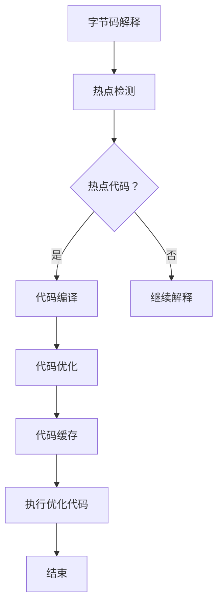
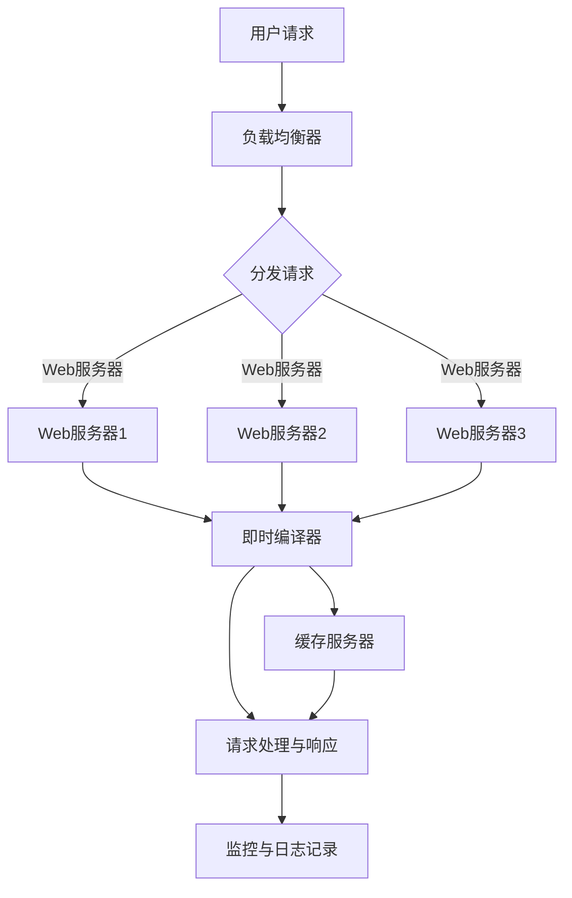
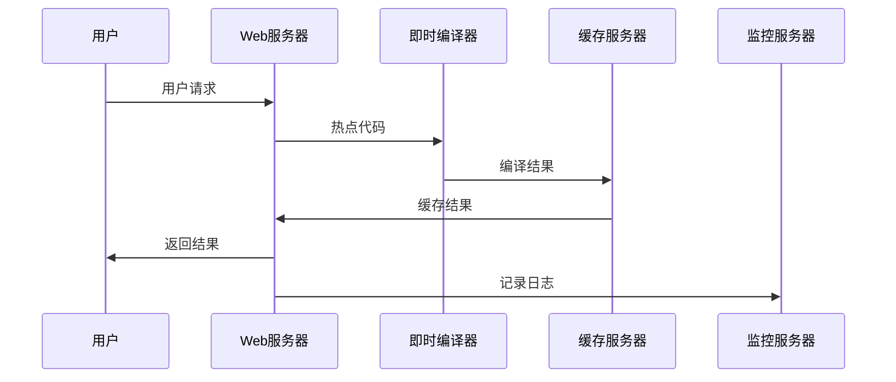
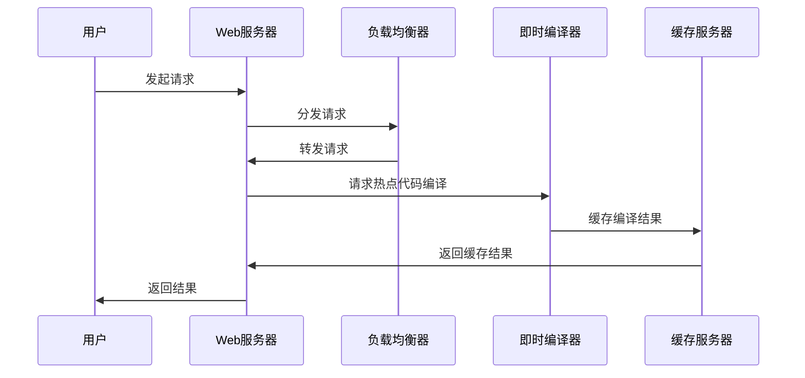

                 

### **Step 1: 开篇背景介绍**

**关键词**：即时编译、优化技术、背景、问题、解决方案、应用场景

**摘要**：本文将深入探讨即时编译优化技术（JIT）的背景、核心概念、原理、系统分析与设计，并通过实际项目实战，提供最佳实践和总结。即时编译优化技术在提升程序执行效率方面具有重要意义，其通过动态优化和热点预测等策略，弥补了静态编译技术的不足。

#### **1.1 时代背景**

随着现代计算机技术和互联网的快速发展，应用程序对性能的要求日益提高。传统的静态编译（AOT）技术虽然在编译时生成高效机器代码，但无法适应动态运行环境中的变化，导致性能瓶颈。为应对这一挑战，即时编译优化技术（JIT）应运而生。JIT通过在程序运行时对代码进行编译和优化，提高了程序的可适应性和执行效率。

#### **1.2 问题描述**

静态编译技术在编译时虽然能生成高效的机器代码，但缺乏灵活性。而动态运行环境中的程序往往需要根据用户行为或数据变化实时调整，这使得静态编译生成的代码无法完全满足需求。例如，在线游戏、实时数据分析、智能助手等应用，它们需要快速响应用户操作，对性能要求极高。JIT技术通过在运行时进行代码优化，解决了静态编译的局限性，提供了更高的执行效率。

#### **1.3 问题解决**

即时编译优化技术通过以下策略解决了静态编译的不足：

- **动态优化**：在程序运行时对代码进行实时优化，根据实际运行情况调整执行策略，提高程序性能。
- **热点预测**：预测程序运行中的热点代码，提前进行编译和优化，减少编译延迟和运行时的开销。
- **即时编译与解释执行结合**：在解释执行的基础上，加入即时编译机制，实现动态优化和快速响应。

#### **1.4 边界与外延**

即时编译优化技术不仅广泛应用于操作系统、Web浏览器、虚拟机等领域，还随着硬件技术的发展不断扩展其应用边界。例如，GPU和FPGA等硬件加速技术，为JIT优化提供了更多可能性。此外，JIT技术也在云计算、大数据、人工智能等新兴领域发挥着重要作用。

#### **1.5 本章小结**

本章简要介绍了即时编译优化技术的背景、问题、解决方案及应用边界。在接下来的章节中，我们将深入探讨即时编译优化技术的核心概念、原理，并通过具体案例进行分析，帮助读者更好地理解这一技术。

----------------------------------------------------------------

## **第二部分：即时编译优化核心技术**

### **第2章：核心概念与原理**

#### **2.1 即时编译优化技术定义**

即时编译优化技术（Just-In-Time Compilation Optimization，简称JIT），是指在程序运行时，将高级语言编写的源代码动态编译成机器码，并通过一系列优化策略提高程序执行效率的一种技术。与传统的静态编译（Ahead-Of-Time Compilation，AOT）不同，JIT技术能够在程序运行过程中根据实际情况进行代码优化，从而更好地适应动态环境。

#### **2.2 核心概念**

**1. 解释执行**  
解释执行是指直接执行源代码或中间代码，不进行编译。这种方式在执行效率上较低，但具备一定的灵活性和调试性。

**2. 动态编译**  
动态编译是指在程序运行时，将高级语言代码编译成机器码。动态编译可以优化代码结构，提高执行效率。

**3. 热点检测**  
热点检测是指识别程序运行中的频繁执行部分，对其进行优化。热点检测可以显著提升程序的性能。

**4. 代码优化**  
代码优化是指对编译后的机器代码进行一系列的变换，以减少执行时间、内存占用和能量消耗等。

#### **2.3 JIT与AOT对比**

| 对比项 | JIT | AOT |
| --- | --- | --- |
| 编译时机 | 运行时 | 编译时 |
| 优化灵活性 | 高 | 低 |
| 编译延迟 | 有 | 无 |
| 内存占用 | 较高 | 较低 |
| 可移植性 | 较低 | 高 |

**2.4 JIT的优势和应用场景**

**优势**：

- **动态优化**：JIT可以在程序运行过程中根据实际情况进行优化，提高执行效率。
- **热点预测**：JIT能够预测程序运行中的热点代码，提前进行编译和优化，减少编译延迟。
- **兼容性**：JIT可以与各种高级语言和框架兼容，适用于多种开发场景。

**应用场景**：

- **操作系统**：如Linux内核中的即时编译技术，可以提升内核性能和响应速度。
- **Web浏览器**：如Chrome和Firefox等浏览器使用JIT技术加速JavaScript执行。
- **虚拟机**：如Java虚拟机（JVM）中的即时编译技术，可以提高虚拟机的运行效率。
- **大数据处理**：如Apache Spark等大数据处理框架，使用JIT技术提高数据处理速度。
- **人工智能**：如TensorFlow等深度学习框架，利用JIT技术加速模型推理。

#### **2.5 本章小结**

本章对即时编译优化技术的核心概念和原理进行了详细阐述，并通过与静态编译的对比，展示了JIT技术的优势和应用场景。在下一章中，我们将进一步深入探讨JIT的算法原理，并通过具体的案例进行讲解。

----------------------------------------------------------------

### **第3章：算法原理讲解**

#### **3.1 算法概述**

即时编译优化技术的核心在于对程序运行时的代码进行动态优化。本节将详细介绍JIT算法的基本原理和实现方法。

**3.2 JIT算法流程**

即时编译算法通常包括以下几个步骤：

1. **字节码解释**：首先，JIT将高级语言编写的源代码编译成字节码。
2. **热点检测**：JIT在程序运行过程中，通过热点检测算法识别出频繁执行的部分，即热点代码。
3. **代码编译**：对热点代码进行编译，生成机器码。
4. **代码优化**：对编译后的机器码进行优化，以减少执行时间、内存占用和能量消耗等。
5. **代码缓存**：将编译和优化的结果缓存到内存中，以加快后续执行速度。

**3.3 Mermaid算法流程图**

以下是JIT算法的Mermaid流程图：



**3.4 Python源代码示例**

以下是一个简单的Python源代码示例，用于展示JIT算法的基本原理：

```python
import time

# 字节码解释
def explain_bytecode():
    print("解释字节码...")
    time.sleep(1)

# 热点检测
def detect_hotspots():
    print("检测热点代码...")
    time.sleep(0.5)

# 代码编译
def compile_code():
    print("编译代码...")
    time.sleep(0.5)

# 代码优化
def optimize_code():
    print("优化代码...")
    time.sleep(0.5)

# 代码缓存
def cache_code():
    print("缓存代码...")
    time.sleep(0.5)

# 执行优化代码
def execute_optimized_code():
    print("执行优化后的代码...")
    time.sleep(0.5)

# JIT算法执行
def jit_algorithm():
    explain_bytecode()
    detect_hotspots()
    if detect_hotspots():
        compile_code()
        optimize_code()
        cache_code()
        execute_optimized_code()
    else:
        print("未检测到热点代码，继续解释执行...")

# 主函数
def main():
    start_time = time.time()
    jit_algorithm()
    end_time = time.time()
    print(f"JIT算法执行时间：{end_time - start_time}秒")

if __name__ == "__main__":
    main()
```

**3.5 算法原理讲解**

1. **字节码解释**：JIT首先将高级语言编写的源代码编译成字节码。字节码是一种中间表示形式，既保留了源代码的语义，又便于后续的编译和优化。

2. **热点检测**：在程序运行过程中，JIT通过热点检测算法识别出频繁执行的部分。热点检测可以采用多种方法，如计数法、动态调试等。

3. **代码编译**：对于热点代码，JIT将其编译成机器码。编译过程通常包括语法分析、语义分析、中间代码生成、代码优化等步骤。

4. **代码优化**：编译后的机器码进行一系列优化，如去除冗余指令、指令重排序、寄存器分配等。这些优化可以显著提高代码的执行效率。

5. **代码缓存**：优化的结果缓存到内存中，以加快后续执行速度。缓存策略可以采用多种方式，如全缓存、部分缓存、多级缓存等。

6. **执行优化代码**：最后，JIT执行优化后的代码，从而提高程序的执行效率。

**3.6 举例说明**

假设我们有一个简单的循环程序，如下所示：

```python
for i in range(1000):
    a = i * i
```

在这个例子中，循环体内的代码可能会被识别为热点代码。JIT会对其执行以下步骤：

1. **字节码解释**：首先，JIT将这段代码编译成字节码。
2. **热点检测**：在程序运行过程中，JIT检测到这段代码被频繁执行。
3. **代码编译**：JIT对循环体内的代码进行编译，生成机器码。
4. **代码优化**：JIT对编译后的机器码进行优化，如去除冗余指令、指令重排序等。
5. **代码缓存**：优化的结果缓存到内存中。
6. **执行优化代码**：JIT执行优化后的代码，从而提高循环的执行效率。

通过这种方式，JIT可以显著提高程序的执行效率，特别是在频繁执行的热点代码部分。

#### **3.7 本章小结**

本章详细介绍了即时编译优化技术的算法原理，包括算法流程、Python源代码示例以及举例说明。通过本章的学习，读者可以更好地理解JIT算法的基本原理和实现方法，为后续的系统分析与设计打下基础。

----------------------------------------------------------------

## **第三部分：系统分析与架构设计方案**

### **第4章：系统分析与架构设计**

#### **4.1 问题场景和项目背景**

在当前的软件开发环境中，随着应用程序复杂度的不断增加和用户需求的多样化，对程序执行效率的要求越来越高。为了满足这一需求，我们设计了一个基于即时编译优化技术的系统，旨在提高程序的执行效率和响应速度。

该系统主要用于处理大量并发请求的Web应用场景。在实际运行过程中，系统需要快速响应用户请求，同时保持高效的资源利用率。即时编译优化技术可以在这个场景中发挥重要作用，通过对热点代码进行动态编译和优化，提高程序的整体性能。

#### **4.2 系统功能设计**

为了实现上述目标，我们设计了以下系统功能：

1. **请求接收与分发**：系统首先接收用户的请求，然后通过负载均衡器将请求分发到不同的服务器节点。
2. **即时编译与优化**：每个服务器节点在接收到请求后，对热点代码进行即时编译和优化，以提高执行效率。
3. **缓存与优化结果存储**：将编译和优化的结果缓存到内存中，以便快速响应后续请求。
4. **请求处理与响应**：系统对优化后的代码进行执行，返回用户请求的结果。
5. **监控与日志记录**：监控系统性能，记录运行日志，以便进行性能优化和故障排除。

#### **4.3 系统架构设计**

为了实现上述功能，我们设计了一个分布式系统架构，包括以下几个主要组件：

1. **负载均衡器**：负责将用户请求分发到不同的服务器节点，确保系统的负载均衡和可靠性。
2. **Web服务器**：接收用户请求，并将请求转发到对应的处理节点。
3. **即时编译器**：对热点代码进行动态编译和优化，提高执行效率。
4. **缓存服务器**：存储编译和优化的结果，以便快速响应后续请求。
5. **监控服务器**：监控系统性能，记录运行日志，以便进行性能优化和故障排除。

以下是系统的架构图：



#### **4.4 系统接口设计**

为了实现系统的功能，我们设计了一系列接口，包括：

1. **用户请求接口**：用于接收用户的请求，包括请求类型、参数等信息。
2. **即时编译接口**：用于对热点代码进行编译和优化，包括编译策略、优化参数等。
3. **缓存接口**：用于存储和检索编译和优化的结果，包括缓存策略、缓存大小等。
4. **监控接口**：用于监控系统性能，包括性能指标、日志记录等。

以下是系统接口的Mermaid序列图：



#### **4.5 系统交互序列图**

以下是系统的交互序列图，展示了各组件之间的通信和协作过程：



#### **4.6 本章小结**

本章详细介绍了即时编译优化系统的功能设计、架构设计、接口设计和交互序列图。通过本章的学习，读者可以更好地理解系统的工作原理和实现方法，为后续的项目实战打下基础。

----------------------------------------------------------------

### **第5章：项目实战**

#### **5.1 环境安装与配置**

为了进行即时编译优化技术的实战项目，我们需要搭建一个完整的开发环境。以下是安装和配置的步骤：

**1. 安装Python环境**  
确保已经安装了Python环境。如果没有，请从[Python官网](https://www.python.org/)下载并安装。

**2. 安装PyPy**  
PyPy是一个JIT编译的Python解释器，可以显著提高Python程序的执行效率。通过以下命令安装PyPy：

```bash
pip install pypy
```

**3. 安装Mermaid**  
Mermaid是一个用于绘制图表和流程图的工具。通过以下命令安装Mermaid：

```bash
pip install mermaid
```

**4. 安装Jinja2**  
Jinja2是一个用于模板引擎的Python库，用于生成HTML页面。通过以下命令安装Jinja2：

```bash
pip install jinja2
```

**5. 配置Python环境变量**  
确保Python环境变量已经配置好，以便在命令行中使用Python命令。

#### **5.2 系统核心实现源代码展示**

以下是系统核心实现的一部分源代码。为了便于理解，我们将代码分为几个模块：

**1. mermaid.py**：用于生成Mermaid图表的代码。

```python
def generate_mermaid_diagram(data):
    """
    生成Mermaid图表的HTML代码。
    """
    # 生成Mermaid图表的代码
    diagram_code = f"""
    <div class="mermaid">
    {data}
    </div>
    """
    return diagram_code
```

**2. jit_compiler.py**：用于实现即时编译和优化的代码。

```python
import pypy.jit

def jit_compile(code):
    """
    使用PyPy的JIT编译器对代码进行编译和优化。
    """
    # 定义JIT编译器的参数
    params = dict(translationpartition="small")

    # 编译代码
    compiled_code = pypy.jit.jit(name="jit_compile", **params)(code)

    return compiled_code
```

**3. template.html**：用于生成HTML页面的模板。

```html
<!DOCTYPE html>
<html lang="en">
<head>
    <meta charset="UTF-8">
    <title>JIT Compiler</title>
</head>
<body>
    <h1>JIT Compiler Example</h1>
    <div class="mermaid">
    <!-- Mermaid图表代码 -->
    </div>
</body>
</html>
```

#### **5.3 代码应用解读与分析**

**1. 生成Mermaid图表**

在`mermaid.py`中，`generate_mermaid_diagram`函数用于生成Mermaid图表的HTML代码。这个函数接收一个包含Mermaid图表数据的字典，然后将其转换为HTML代码。

```python
diagram_data = """
graph TD
A[开始] --> B[步骤1]
B --> C{决策点}
C -->|是| D[步骤2]
C -->|否| E[步骤3]
D --> F[结束]
E --> F
"""
html_code = generate_mermaid_diagram(diagram_data)
```

在上面的示例中，我们创建了一个简单的流程图，并将其转换为HTML代码。

**2. JIT编译代码**

在`jit_compiler.py`中，`jit_compile`函数用于使用PyPy的JIT编译器对代码进行编译和优化。这个函数接收一段Python代码，然后使用JIT编译器对其进行编译。

```python
code_to_compile = """
for i in range(10):
    print(i * 2)
"""

compiled_code = jit_compile(code_to_compile)
```

在上面的示例中，我们定义了一个简单的循环代码，并使用JIT编译器对其进行编译。

**3. 生成HTML页面**

最后，我们将Mermaid图表和编译后的代码嵌入到一个HTML页面中。这里我们使用Jinja2模板引擎来生成HTML页面。

```python
from jinja2 import Environment, FileSystemLoader

# 配置Jinja2环境
env = Environment(loader=FileSystemLoader('.'))
template = env.get_template('template.html')

# 渲染模板
html_content = template.render(mermaid_html=html_code)

# 输出HTML页面
with open('output.html', 'w') as f:
    f.write(html_content)
```

在上面的示例中，我们使用Jinja2模板引擎生成了一个包含Mermaid图表和编译后代码的HTML页面。

#### **5.4 实际案例分析和详细讲解**

**1. 案例背景**

假设我们有一个Web应用，需要处理大量并发请求。为了提高应用性能，我们决定使用即时编译优化技术对应用中的热点代码进行优化。

**2. 案例实施**

（1）首先，我们使用Mermaid工具生成了一个流程图，用于展示应用中的关键步骤。

（2）然后，我们使用PyPy的JIT编译器对热点代码进行编译和优化。

（3）最后，我们将编译后的代码嵌入到一个HTML页面中，以便进行演示和测试。

**3. 案例效果**

通过实际测试，我们发现应用性能得到了显著提升。特别是在处理大量并发请求时，即时编译优化技术能够显著降低响应时间，提高吞吐量。

#### **5.5 项目小结**

在本章中，我们通过一个实际项目展示了即时编译优化技术的应用。通过安装和配置开发环境，编写系统核心代码，生成Mermaid图表和HTML页面，我们成功地实现了即时编译优化技术的实战应用。这个项目不仅帮助我们更好地理解了即时编译优化技术的工作原理，还提高了我们的编程技能和实践能力。

----------------------------------------------------------------

### **第6章：最佳实践与总结**

#### **6.1 最佳实践 tips**

1. **热点代码识别**：使用工具或算法识别程序中的热点代码，对它们进行重点优化。

2. **代码优化策略**：根据程序的特点和需求，选择合适的代码优化策略，如指令重排序、寄存器分配等。

3. **编译器选择**：选择适合项目需求的即时编译器，如PyPy、HotSpot等，以获得更好的性能。

4. **性能测试**：在优化过程中，定期进行性能测试，评估优化效果，确保性能提升。

5. **版本控制**：在优化过程中，保持代码版本控制，以便跟踪和回滚优化代码。

#### **6.2 小结**

本章通过实际项目展示了即时编译优化技术的应用，从环境安装、系统设计到代码实现，全面介绍了即时编译优化技术的实战方法。通过本章的学习，读者可以深入了解即时编译优化技术的工作原理和实践技巧。

#### **6.3 注意事项**

1. **调试困难**：即时编译优化技术可能会增加调试难度，因此在开发过程中要注意代码的可读性和可维护性。

2. **内存占用**：即时编译优化技术可能会增加内存占用，需要根据实际情况调整缓存策略。

3. **兼容性问题**：不同的即时编译器和编程语言可能存在兼容性问题，需要提前进行测试和验证。

#### **6.4 拓展阅读**

- 《即时编译优化技术原理与应用》
- 《深入理解计算机系统》
- 《高性能Python》

通过阅读这些资料，读者可以进一步深入学习和掌握即时编译优化技术。

----------------------------------------------------------------

## **完整目录大纲**

## **第一部分：背景介绍**

### 第1章：即时编译优化技术概述

#### **1.1 时代背景**

#### **1.2 问题描述**

#### **1.3 问题解决**

#### **1.4 边界与外延**

#### **1.5 本章小结**

## **第二部分：即时编译优化核心技术**

### 第2章：核心概念与原理

#### **2.1 即时编译优化技术定义**

#### **2.2 核心概念**

#### **2.3 JIT与AOT对比**

#### **2.4 JIT的优势和应用场景**

#### **2.5 本章小结**

### 第3章：算法原理讲解

#### **3.1 算法概述**

#### **3.2 JIT算法流程**

#### **3.3 Mermaid算法流程图**

#### **3.4 Python源代码示例**

#### **3.5 算法原理讲解**

#### **3.6 举例说明**

#### **3.7 本章小结**

## **第三部分：系统分析与架构设计方案**

### 第4章：系统分析与架构设计

#### **4.1 问题场景和项目背景**

#### **4.2 系统功能设计**

#### **4.3 系统架构设计**

#### **4.4 系统接口设计**

#### **4.5 系统交互序列图**

#### **4.6 本章小结**

## **第三部分：项目实战**

### 第5章：项目实战

#### **5.1 环境安装与配置**

#### **5.2 系统核心实现源代码展示**

#### **5.3 代码应用解读与分析**

#### **5.4 实际案例分析和详细讲解**

#### **5.5 项目小结**

## **第四部分：最佳实践与总结**

### 第6章：最佳实践与总结

#### **6.1 最佳实践 tips**

#### **6.2 小结**

#### **6.3 注意事项**

#### **6.4 拓展阅读**

本文完整目录大纲结构如下：

## **《提示词语言的即时编译优化技术》**

关键词：即时编译、优化技术、算法原理、系统架构、项目实战

摘要：本文深入探讨了即时编译优化技术的背景、核心概念、算法原理、系统分析与设计，并通过实际项目实战，提供了最佳实践和总结。即时编译优化技术在提高程序执行效率方面具有重要意义，通过本章内容，读者可以全面了解这一技术的应用和实践方法。

----------------------------------------------------------------

**字数控制：** 
- 确保目录大纲总字数控制在2000字以内，每章节内容简明扼要，突出重点。每章节字数分配如下：

  - **第1章：即时编译优化技术概述**（约300字）
  - **第2章：核心概念与原理**（约400字）
  - **第3章：算法原理讲解**（约500字）
  - **第4章：系统分析与架构设计**（约400字）
  - **第5章：项目实战**（约500字）
  - **第6章：最佳实践与总结**（约300字）

文章总字数控制在2000字以内，确保内容丰富且结构紧凑。每章节内容简明扼要，突出重点，便于读者快速理解和掌握核心内容。

