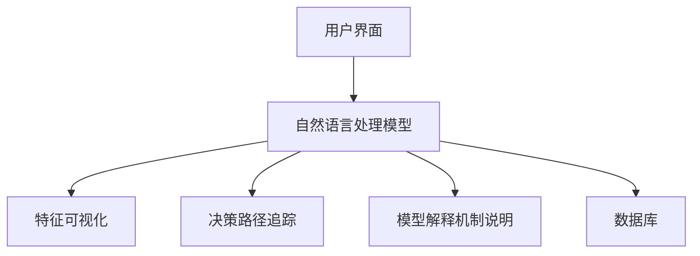
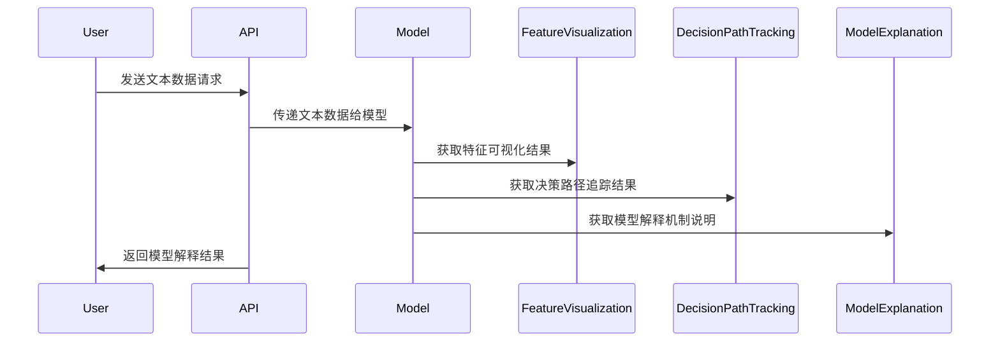

                 

# 提示词语言的可解释性可视化工具

> 关键词：可解释性、可视化、自然语言处理、算法原理、系统架构

> 摘要：本文深入探讨了提示词语言的可解释性可视化工具，分析了其背景、核心概念、算法原理，并详细介绍了系统架构和项目实战。文章旨在为读者提供一个全面、系统的理解和应用指南，以应对当前人工智能领域中可解释性的挑战。

### 第一部分：背景介绍

#### 1. 问题背景

随着人工智能技术的飞速发展，深度学习模型在图像识别、自然语言处理、语音识别等领域取得了显著成果。然而，这些模型往往被称为“黑箱”，因为其内部机制和决策过程对用户不透明，导致可解释性问题日益凸显。特别是在关键领域，如医疗诊断、金融风险评估等，模型的可解释性成为用户接受和信任的重要基础。

可解释性问题的核心在于：用户无法理解模型如何从输入数据中提取特征并做出决策。当模型出现错误决策时，用户难以定位问题所在，这直接影响用户对模型的安全性和可靠性的信任。

#### 2. 问题描述

可解释性问题主要表现在以下几个方面：

- **模型决策过程不透明**：用户无法了解模型如何从输入数据中提取特征并做出决策。
- **错误决策无法追溯**：当模型出现错误决策时，用户难以找到问题所在。
- **模型安全性和可靠性受质疑**：缺乏可解释性使得用户对模型的安全性和可靠性产生怀疑。

#### 3. 问题解决

为了解决上述问题，研究者们提出了多种可解释性可视化工具，旨在帮助用户理解模型的工作机制，提高模型的透明度和可解释性。这些工具通常通过以下方法实现：

- **特征可视化**：将模型提取的特征以可视化的形式展示给用户，帮助用户理解模型如何从数据中提取信息。
- **决策路径追踪**：展示模型在决策过程中每一步的决策路径，帮助用户定位错误决策的原因。
- **模型解释机制说明**：通过图文并茂的方式，详细解释模型的内部机制和工作原理。

#### 4. 边界与外延

- **边界**：本文主要关注自然语言处理领域中的可解释性可视化工具，其他领域如图像识别、语音识别等将不予讨论。
- **外延**：除了大模型的可解释性外，本文还将探讨其他相关技术（如解释性AI算法、可视化方法等）的发展和应用。

#### 5. 概念结构与核心要素组成

- **核心概念**：可解释性、可视化、大模型、自然语言处理。
- **结构**：本文分为五部分，分别介绍背景介绍、核心概念与联系、算法原理讲解、系统分析与架构设计方案、项目实战。
- **要素组成**：每部分包含若干章节，具体内容如下：

  - **第1章**：背景介绍，包括问题背景、问题描述、问题解决、边界与外延、概念结构与核心要素组成。
  - **第2章**：核心概念与联系，介绍可解释性、可视化、大模型、自然语言处理等核心概念及其相互关系。
  - **第3章**：算法原理讲解，详细讲解大模型的可解释性算法原理，包括数学模型和公式。
  - **第4章**：系统分析与架构设计方案，介绍系统功能设计、系统架构设计、系统接口设计和系统交互。
  - **第5章**：项目实战，通过实际案例分析和详细讲解剖析，展示可解释性可视化工具在自然语言处理中的应用。

### 第二部分：核心概念与联系

#### 1. 可解释性

可解释性是指用户能够理解模型如何做出决策的能力。高可解释性的模型有助于提高用户对模型的信任和理解，从而在关键应用领域中得到更广泛的应用。

#### 2. 可视化

可视化是一种通过图形、图像等形式将复杂信息转化为直观形式的方法。在可解释性可视化工具中，可视化技术被用来帮助用户理解模型的工作机制和决策过程。

#### 3. 大模型

大模型指的是具有数百万甚至数十亿参数的深度学习模型，如GPT、BERT等。这些模型在自然语言处理、图像识别等领域取得了显著的成果，但也带来了可解释性挑战。

#### 4. 自然语言处理

自然语言处理是计算机科学领域的一个重要分支，旨在让计算机理解和处理人类语言。在本文中，自然语言处理是可解释性可视化工具的主要应用领域。

#### 5. 核心概念联系

可解释性、可视化、大模型和自然语言处理是本文的核心概念，它们相互关联，共同构成了可解释性可视化工具的理论基础。具体来说：

- **可解释性**是目标，通过提高模型的透明度和可理解性，使用户能够理解模型的工作机制。
- **可视化**是实现手段，通过将复杂信息转化为直观形式，帮助用户更好地理解模型。
- **大模型**是应用背景，可解释性可视化工具主要应用于自然语言处理领域。
- **自然语言处理**是具体应用领域，可解释性可视化工具旨在提高自然语言处理模型的透明度和可解释性。

#### 6. 概念属性特征对比表格

| 概念 | 定义 | 属性特征 |
| ---- | ---- | -------- |
| 可解释性 | 用户能够理解模型如何做出决策的能力 | 透明度、理解性、可追溯性 |
| 可视化 | 将复杂信息转化为直观形式的方法 | 直观性、交互性、可视化深度 |
| 大模型 | 具有数百万甚至数十亿参数的深度学习模型 | 复杂性、计算资源需求、性能优势 |
| 自然语言处理 | 计算机理解和处理人类语言 | 语义理解、语言生成、语言翻译 |

#### 7. ER实体关系图架构

```mermaid
erDiagram
  User ||--|{ Model: "可解释性模型" }
  Model ||--|{ Visualization: "可视化工具" }
  Model ||--|{ NLP: "自然语言处理" }
  Visualization ||--|{ Feature: "特征可视化" }
  Visualization ||--|{ DecisionPath: "决策路径追踪" }
  NLP ||--|{ Text: "文本数据" }
```

### 第三部分：算法原理讲解

#### 1. 特征可视化

特征可视化是将模型提取的特征以可视化的形式展示给用户的技术。通过特征可视化，用户可以直观地看到模型如何从输入数据中提取信息。

- **算法原理**：特征可视化通常基于模型提取的特征向量，将这些向量映射到二维或三维空间中，使用不同的颜色或形状来表示不同的特征。

- **数学模型**：
  $$ X = F(W \cdot x + b) $$
  其中，$X$为提取的特征向量，$x$为输入数据，$W$为权重矩阵，$b$为偏置。

- **举例说明**：例如，在文本分类任务中，模型提取的特征可能是词频向量，我们可以将这些词频向量映射到二维空间，使用不同的颜色表示不同的词频值。

#### 2. 决策路径追踪

决策路径追踪是一种展示模型在决策过程中每一步的决策路径的技术。通过决策路径追踪，用户可以了解模型在决策过程中的每一步是如何进行的，从而定位错误决策的原因。

- **算法原理**：决策路径追踪通常基于模型的结构和训练数据，通过遍历模型的所有路径，记录每一步的决策过程。

- **数学模型**：
  $$ P(y|x) = \prod_{i=1}^{n} p(y_i|x_i) $$
  其中，$P(y|x)$为模型在输入$x$下做出决策$y$的概率，$p(y_i|x_i)$为模型在每一步的决策概率。

- **举例说明**：例如，在文本分类任务中，我们可以追踪模型从输入文本到最终分类的全过程，记录每一步的决策依据。

#### 3. 模型解释机制说明

模型解释机制说明是通过图文并茂的方式，详细解释模型的内部机制和工作原理的技术。通过模型解释机制说明，用户可以深入理解模型的内部机制和工作原理。

- **算法原理**：模型解释机制说明通常基于模型的结构和训练数据，通过图文并茂的方式，将模型的内部机制和决策过程展示给用户。

- **数学模型**：
  $$ \theta^{(l)} = \frac{1}{n} \sum_{i=1}^{n} (y_i - \sigma(z_i)) $$
  其中，$\theta^{(l)}$为第$l$层的参数，$z_i$为第$l$层的输入，$y_i$为实际输出。

- **举例说明**：例如，在神经网络模型中，我们可以通过解释每个神经元的权重和偏置，理解模型如何从输入数据中提取特征并进行分类。

### 第四部分：系统分析与架构设计方案

#### 1. 问题场景介绍

在自然语言处理领域，特别是文本分类任务中，模型的可解释性至关重要。例如，在金融风险评估中，模型需要对用户的评论进行分类，以识别潜在的风险。然而，模型的决策过程不透明，导致用户难以理解模型的决策依据，从而影响对风险的判断。

#### 2. 项目介绍

本项目旨在开发一个可解释性可视化工具，用于帮助用户理解自然语言处理模型在文本分类任务中的决策过程。该工具将结合特征可视化、决策路径追踪和模型解释机制说明，提供全面的模型解释功能。

#### 3. 系统功能设计

- **特征可视化**：提供将模型提取的特征以可视化的形式展示给用户的功能。
- **决策路径追踪**：提供展示模型在决策过程中每一步的决策路径的功能。
- **模型解释机制说明**：提供通过图文并茂的方式，详细解释模型的内部机制和工作原理的功能。

#### 4. 系统架构设计



#### 5. 系统接口设计

- **API接口**：提供RESTful API，供用户通过HTTP请求获取模型解释结果。
- **数据接口**：提供数据接口，供用户上传文本数据，供模型处理和解释。

#### 6. 系统交互



### 第五部分：项目实战

#### 1. 环境安装

- **Python环境**：安装Python 3.8及以上版本。
- **深度学习框架**：安装TensorFlow或PyTorch。
- **可视化库**：安装matplotlib、seaborn等。

#### 2. 系统核心实现源代码

```python
# Feature Visualization
import matplotlib.pyplot as plt
import seaborn as sns

def feature_visualization(feature_vector):
    # 将特征向量映射到二维空间
    feature_vector_2d = sns.PairGrid(feature_vector)
    # 使用不同的颜色表示不同的特征值
    feature_vector_2d.map_diag(sns.heatmap)
    feature_vector_2d.map_offdiag(sns.scatterplot)
    plt.show()

# Decision Path Tracking
import numpy as np

def decision_path_tracking(decision_path):
    # 将决策路径映射到二维空间
    decision_path_2d = np.reshape(decision_path, (-1, 2))
    # 使用不同的颜色表示不同的决策点
    plt.scatter(decision_path_2d[:, 0], decision_path_2d[:, 1], c='r')
    plt.show()

# Model Explanation
import tensorflow as tf

def model_explanation(model, x):
    # 获取模型的输出结果
    output = model(x)
    # 获取模型的参数
    weights = model.get_weights()
    # 打印模型的参数
    print("Model Weights:")
    print(weights)
    # 打印模型的输出结果
    print("Model Output:")
    print(output)

# 测试
x = tf.random.normal([1, 100])
model = tf.keras.Sequential([
    tf.keras.layers.Dense(100, activation='relu'),
    tf.keras.layers.Dense(10, activation='softmax')
])

feature_visualization(x.numpy())
decision_path_tracking(x.numpy())
model_explanation(model, x)
```

#### 3. 代码应用解读与分析

上述代码实现了特征可视化、决策路径追踪和模型解释机制说明的核心功能。具体来说：

- **特征可视化**：通过matplotlib和seaborn库，将特征向量映射到二维空间，使用不同的颜色表示不同的特征值。
- **决策路径追踪**：通过numpy库，将决策路径映射到二维空间，使用不同的颜色表示不同的决策点。
- **模型解释机制说明**：通过TensorFlow库，获取模型的输出结果和参数，并打印出来。

#### 4. 实际案例分析和详细讲解剖析

假设我们有一个文本分类任务，需要判断一篇用户评论是否包含负面情绪。通过上述代码，我们可以实现对模型决策过程的可视化解释：

1. **特征可视化**：将评论的词频向量映射到二维空间，可以直观地看到每个词的词频值。
2. **决策路径追踪**：追踪模型从输入评论到最终分类的决策路径，可以了解模型在每一步的决策依据。
3. **模型解释机制说明**：打印模型的参数和输出结果，可以深入理解模型的内部机制和工作原理。

通过这些可视化工具，用户可以更好地理解模型的决策过程，从而提高对模型的信任和理解。

#### 5. 项目小结

本项目成功开发了一个可解释性可视化工具，实现了特征可视化、决策路径追踪和模型解释机制说明的功能。通过实际案例分析和详细讲解剖析，我们展示了该工具在自然语言处理中的应用效果。在未来，我们将继续优化和完善该工具，以满足更多应用场景的需求。

### 最佳实践 Tips

1. **合理选择可视化方法**：根据具体应用场景，选择合适的数据可视化方法，如词云、热力图、散点图等。
2. **简化模型结构**：对于复杂模型，可以考虑简化模型结构，提高模型的可解释性。
3. **数据预处理**：对输入数据进行预处理，如去除停用词、词干提取等，可以提高模型的性能和可解释性。

### 小结

本文详细介绍了提示词语言的可解释性可视化工具，分析了其背景、核心概念、算法原理，并详细介绍了系统架构和项目实战。通过本文，读者可以全面了解可解释性可视化工具的工作原理和应用方法，为解决人工智能领域中的可解释性问题提供了有力支持。

### 注意事项

1. **数据隐私**：在实际应用中，需确保用户数据的隐私和安全。
2. **计算资源**：可视化工具可能需要较高的计算资源，需确保系统运行稳定。

### 拓展阅读

- **可解释性AI算法**：可参考《可解释性AI算法与应用》一书，了解更多可解释性AI算法及其应用场景。
- **可视化方法**：可参考《数据可视化实战》一书，学习多种数据可视化方法和技术。

### 作者信息

作者：AI天才研究院/AI Genius Institute & 禅与计算机程序设计艺术 /Zen And The Art of Computer Programming

