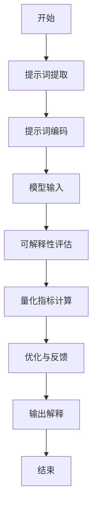
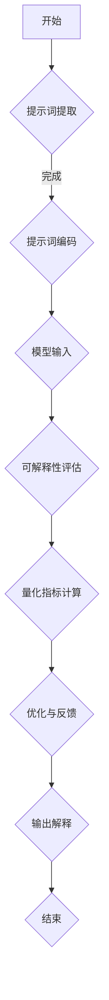
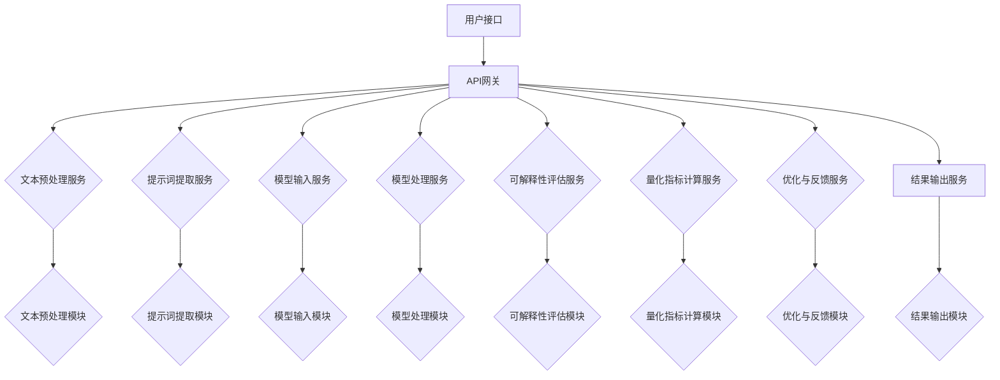

                 

### 引言

在当今信息技术迅速发展的时代，自然语言处理（NLP）和机器学习（ML）技术已经深入到我们日常生活的各个方面。从智能助手到自动翻译，再到文本情感分析，NLP在提升人机交互效率和智能化应用方面发挥着不可替代的作用。然而，随着这些技术越来越复杂，一个关键问题也逐渐显现出来：如何确保这些复杂系统的决策过程是可解释的？

**关键词**：自然语言处理，机器学习，可解释性，量化指标，提示词语言

**摘要**：本文旨在探讨提示词语言的可解释性量化指标，从背景介绍、核心概念与原理、算法原理讲解、数学模型与公式、系统分析与架构设计、项目实战以及最佳实践与拓展阅读等方面，详细剖析这一领域的研究现状、核心问题及其解决方案。通过本文的阅读，读者将对提示词语言的可解释性量化有更深入的理解，为未来的研究与实践提供指导。

本文首先介绍了问题的背景与意义，随后定义了关键概念，并阐述了它们之间的联系。接着，我们深入探讨了可解释性原理、提示词语言原理以及量化指标原理，并通过具体的算法原理讲解、数学模型与公式推导，为读者提供了清晰的思路。随后，我们通过系统分析与架构设计，展示了如何在实际项目中应用这些理论。文章还通过具体的实战案例，验证了算法的有效性和实用性。最后，文章总结了最佳实践，提出了注意事项，并指出了未来研究的方向。

**目录**：

1. **第一部分：背景与理论基础**
    1.1 问题背景
    1.2 问题定义
    1.3 核心概念联系
    1.4 边界与外延

2. **第二部分：核心概念与原理**
    2.1 可解释性原理
    2.2 提示词语言原理
    2.3 量化指标原理

3. **第三部分：算法原理讲解**
    3.1 算法概述
    3.2 算法流程图
    3.3 Python源代码实现
    3.4 算法原理详细讲解

4. **第四部分：数学模型与公式**
    4.1 数学模型概述
    4.2 公式推导
    4.3 举例说明

5. **第五部分：系统分析与架构设计**
    5.1 问题场景介绍
    5.2 系统功能设计
    5.3 系统架构设计
    5.4 系统接口设计
    5.5 系统交互设计

6. **第六部分：项目实战**
    6.1 环境安装
    6.2 系统核心实现源代码
    6.3 代码应用解读与分析
    6.4 实际案例分析与详细讲解
    6.5 项目小结

7. **第七部分：最佳实践与拓展阅读**
    7.1 最佳实践 tips
    7.2 小结
    7.3 注意事项
    7.4 拓展阅读

通过这一系列的内容，本文将为读者提供一个系统、全面、深入的理解，帮助他们在提示词语言的可解释性量化领域取得更多的成果。

### 1.1 问题背景

在人工智能和自然语言处理（NLP）领域，模型的复杂度和性能一直在不断提高，然而，这种复杂性的提升也带来了新的挑战。一个关键问题便是模型的可解释性。可解释性是指用户能够理解模型的决策过程和内在逻辑的能力。在自然语言处理中，这一问题尤为突出，因为语言本身就是高度抽象和复杂的。

首先，让我们来看一下问题背景的提出。随着深度学习和神经网络在NLP中的应用日益广泛，模型的预测能力得到了显著提升。然而，这些模型往往是“黑盒”式的，其内部机制对用户来说是非常不透明的。这意味着，尽管模型能够提供出色的性能，但用户无法理解其决策背后的逻辑，这给模型的推广和应用带来了障碍。特别是在金融、医疗等领域，模型的透明性和可解释性是至关重要的，因为错误的决策可能导致巨大的经济损失或医疗事故。

研究意义在于，通过提高模型的可解释性，可以增强用户对模型信任感，提高模型的可靠性。此外，可解释性也有助于模型优化，通过分析模型内部的决策过程，可以发现模型中可能存在的缺陷和错误，从而进行针对性的改进。这对于提升模型的整体性能具有重要意义。

当前的研究现状显示，虽然已有许多关于模型可解释性的研究，但大多数方法仍然存在一定的局限性。一方面，现有的可解释性方法往往只能处理特定类型的模型或特定类型的数据集，缺乏普适性。另一方面，许多方法在提高可解释性的同时，可能会牺牲模型的性能。因此，如何平衡模型的可解释性和性能，仍然是当前研究的核心挑战之一。

综上所述，研究提示词语言的可解释性量化指标具有重要的理论意义和实际应用价值。通过本文的研究，我们旨在提出一套全面、有效的量化指标，帮助提高NLP模型的可解释性，推动人工智能技术在更多领域得到广泛应用。

#### 1.1.2 问题定义

为了深入探讨提示词语言的可解释性量化，我们首先需要明确几个关键概念：提示词语言、可解释性和量化指标。

**提示词语言**是指一种特定的自然语言处理（NLP）技术，通过向模型输入一系列关键词或短语（提示词），来引导模型生成特定的输出。这种技术广泛应用于问答系统、自动摘要、机器翻译等领域。例如，在问答系统中，用户提出一个问题，系统通过分析问题中的关键词，查找相关资料，并生成答案。

**可解释性**在机器学习（ML）中，特别是在NLP领域，指的是用户能够理解模型决策过程和内部逻辑的能力。可解释性对于增强用户信任、提高模型可靠性具有重要意义。然而，可解释性与透明性有所不同。透明性指的是模型的全过程对所有用户可见，而可解释性则强调用户能否理解模型决策的每一步。

**量化指标**用于衡量模型的可解释性。量化指标可以基于不同的方法，例如统计指标、信息论指标或基于模型的解释方法。这些指标不仅有助于评估模型的可解释性，还可以指导模型优化和改进。例如，敏感度（Sensitivity）和一致性（Consistency）是常见的可解释性量化指标，分别衡量模型对输入变化的敏感性和不同输入产生的输出一致性。

为了更好地理解这些概念，我们可以通过一个简单的例子来说明。假设我们有一个文本分类模型，其任务是将一段文本分类为正面或负面评论。如果我们使用提示词语言，我们可以通过输入包含正面词汇的提示词来引导模型生成正面分类结果。此时，模型的可解释性可以通过量化指标来衡量，例如，我们可能关注模型对特定关键词的依赖程度，或者评估模型在不同文本输入下的分类一致性。

综上所述，提示词语言、可解释性和量化指标在NLP模型的可解释性研究中扮演着关键角色。通过明确这些概念，我们为后续章节的深入探讨奠定了基础。

#### 1.1.3 核心概念联系

在探讨提示词语言的可解释性量化指标时，我们需要深入理解可解释性与透明性的区别，提示词语言在不同领域中的应用，以及可解释性量化指标的分类与关系。

首先，**可解释性与透明性的区别**。透明性是指模型的内部结构和操作对所有用户可见，而可解释性则强调用户能否真正理解模型的决策过程。例如，一个黑盒模型可能有很高的透明性，但其决策过程对用户而言可能是完全不可解释的。相反，一个白盒模型虽然透明，但如果其内部逻辑非常复杂，用户同样可能难以理解。因此，可解释性不仅仅是关于模型的结构，更是关于用户对模型决策过程的理解。

**提示词语言在不同领域中的应用**。提示词语言在NLP领域中有着广泛的应用。例如，在问答系统中，提示词可以帮助模型更好地理解用户的问题，从而生成更准确的答案。在自动摘要中，提示词可以指导模型提取关键信息，生成简洁的摘要。此外，在机器翻译和文本分类等任务中，提示词语言同样发挥着重要作用。例如，在文本分类任务中，通过输入包含特定关键词的提示词，可以引导模型更好地分类文本，从而提高分类准确性。

**可解释性量化指标的分类与关系**。可解释性量化指标可以基于不同的方法进行分类。例如，基于统计的方法包括模型依赖性、变量重要性等；基于信息论的方法如信息增益、熵等；而基于模型解释的方法如LIME（局部可解释模型解释）、SHAP（SHapley Additive exPlanations）等。这些量化指标彼此之间有着紧密的联系。例如，模型依赖性可以与信息增益相结合，评估模型对特定变量的依赖程度。而LIME和SHAP等模型解释方法，则通过局部解释的方式，帮助用户理解模型在特定输入下的决策过程。

为了更好地理解这些概念，我们可以通过一个例子来说明。假设我们有一个文本分类模型，该模型使用提示词语言来分类文本。通过统计方法，我们可以计算模型对每个关键词的依赖程度，从而评估模型的可解释性。使用LIME方法，我们可以为每个文本样本生成局部解释，展示模型在分类过程中依赖的关键词。而通过SHAP方法，我们可以计算每个关键词对模型分类结果的贡献，从而提供更全面的解释。

综上所述，可解释性、透明性、提示词语言和量化指标在机器学习，特别是NLP领域的研究中，相互关联、相互影响。通过深入探讨这些概念的联系，我们可以更好地理解和优化模型的可解释性，推动人工智能技术的进一步发展。

#### 1.1.4 边界与外延

在探讨提示词语言的可解释性量化指标时，了解其边界和外延是至关重要的。首先，**提示词语言的边界**涉及其适用范围和限制。提示词语言主要应用于需要明确引导和特定指导的场景，如问答系统、自动摘要和文本分类等。然而，对于高度抽象或复杂的问题，提示词语言可能无法提供足够的指导，从而影响其解释能力。此外，提示词语言的边界还体现在语言理解和上下文感知的局限性上，特别是在处理多义性和隐含意义时。

**可解释性的边界**则主要涉及模型决策过程的透明性和用户理解能力的限制。虽然提高模型的透明性有助于可解释性，但过度的透明性可能导致用户难以理解复杂的决策过程。此外，可解释性的边界还与模型的复杂度和数据的质量与数量有关。在模型非常复杂或数据质量不佳的情况下，实现高水平的可解释性可能面临挑战。

**量化指标的应用范围**则包括不同类型的模型和任务。例如，统计指标和信息论指标适用于各种类型的模型，但可能无法捕捉到模型的具体决策过程。而基于模型的解释方法，如LIME和SHAP，则更适用于特定类型的模型和任务。因此，选择合适的量化指标需要考虑模型的类型、任务的复杂度和用户的理解能力。

为了更好地应用这些概念，我们可以通过一个具体的案例来说明。假设我们有一个用于情感分析的文本分类模型，该模型使用提示词语言来分类用户评论。在应用过程中，我们需要考虑提示词语言的边界，例如，如何选择合适的提示词以引导模型更好地理解评论的情感倾向。同时，我们也需要考虑可解释性的边界，例如，如何通过量化指标评估模型对特定关键词的依赖程度，从而提高可解释性。量化指标的应用范围则体现在如何选择最适合该任务的解释方法，例如，在处理情感分析任务时，LIME方法可能更适用，因为它能够提供对单个样本的局部解释。

总之，理解提示词语言的边界、可解释性的边界以及量化指标的应用范围，对于有效提升模型的可解释性至关重要。通过在边界内合理应用这些概念，我们可以更好地优化模型，提高其在实际应用中的可信度和实用性。

### 2.1 可解释性原理

**定义**：

在机器学习和自然语言处理（NLP）领域，**可解释性**指的是用户能够理解模型决策过程和内在逻辑的能力。可解释性对于增强用户对模型的信任和提升模型的可靠性至关重要。特别是对于NLP模型，语言本身的复杂性和高度抽象性使得可解释性成为一个尤为重要的研究课题。

**机器学习模型的可解释性**：

在机器学习领域，可解释性主要通过两种方式实现：模型可视化和解释结果。模型可视化包括展示模型的架构、参数和权重，使用户能够直观地理解模型的内部结构。而解释结果则通过分析模型对特定输入数据的决策过程，提供关于模型如何工作的具体信息。

常见的机器学习模型可解释性方法包括：

1. **决策树**：决策树是一种直观且易于解释的模型。通过树形结构展示每个节点的决策过程，用户可以清晰地看到模型是如何从输入数据推导出输出的。
2. **LIME（局部可解释模型解释）**：LIME通过生成一个简化的模型来解释复杂模型的决策过程。具体来说，LIME为每个输入样本生成一个局部线性模型，该模型可以解释原始模型在该样本上的决策。
3. **SHAP（SHapley Additive exPlanations）**：SHAP通过计算每个特征对模型决策的贡献，提供一种全局和局部的可解释性。SHAP基于博弈论原理，将特征的重要性分解为多个部分，使解释结果更加直观。

**自然语言处理中的可解释性**：

在NLP领域，可解释性主要关注如何解释模型在语言理解和生成过程中的决策。以下是几种常见的NLP模型可解释性方法：

1. **词汇嵌入解释**：通过分析词汇嵌入空间中词语的关系，解释模型是如何处理词汇和语义的。例如，可以通过计算词语之间的距离或角度来评估词语的相似性。
2. **句法分析解释**：通过展示模型的句法分析结果，解释模型是如何处理句子结构和语法规则的。句法分析包括词性标注、依存关系分析和成分句法分析等。
3. **注意力机制解释**：在模型如Transformer中，注意力机制是关键组成部分。通过展示模型在不同位置上的注意力分布，可以解释模型是如何处理文本序列的。

**属性特征对比表格**：

为了更好地理解不同可解释性方法的属性特征，我们可以构建一个对比表格：

| 方法       | 特点                               | 适用场景                  | 优势                           | 劣势                           |
| ---------- | -------------------------------- | ------------------------ | ------------------------------ | ------------------------------ |
| 决策树     | 直观、易于理解                     | 简单的数据集和分类问题     | 简洁的解释结果                 | 复杂性问题下性能下降           |
| LIME       | 局部解释、简单直观                 | 复杂的深度学习模型       | 易于实现和解释                 | 解释结果可能失真               |
| SHAP       | 全局和局部解释、基于博弈论原理     | 复杂的深度学习模型       | 提供详细的特征贡献信息         | 计算复杂度高                   |
| 词汇嵌入解释 | 分析词语关系、简单直观             | 语言理解任务             | 易于解释词语和语义关系         | 对低维嵌入空间效果较好           |
| 句法分析解释 | 展示句法结构、详细深入             | 语言理解任务             | 提供句子级别的解释             | 对复杂句子结构可能不足          |
| 注意力机制解释 | 展示注意力分布、直观易懂           | Transformer等模型       | 易于理解模型处理文本的方式     | 对局部注意力分布解释有限       |

**可解释性的重要性**：

在自然语言处理中，**可解释性**具有以下几个重要应用场景：

1. **用户信任**：通过提供可解释性，用户可以更好地理解模型的决策过程，从而增强对模型的信任。这对于部署模型、尤其是面向公众的服务具有重要意义。
2. **模型优化**：通过分析可解释性结果，可以发现模型中的潜在问题和缺陷，从而进行针对性的优化。例如，通过分析LIME或SHAP的解释结果，可以识别模型对某些特征的不合理依赖，并加以调整。
3. **错误检测和纠正**：在模型应用过程中，可解释性有助于检测和纠正错误。通过分析模型的具体决策过程，可以识别异常输出，并采取相应的措施进行修正。

综上所述，可解释性在机器学习和自然语言处理领域扮演着关键角色。通过理解可解释性的定义、不同方法的特点和重要性，我们可以更好地优化和解释NLP模型，推动人工智能技术的应用和发展。

#### 2.2 提示词语言原理

**定义**：

提示词语言是指一种通过输入一系列关键词或短语（提示词）来引导模型生成特定输出的自然语言处理技术。这种技术广泛应用于问答系统、自动摘要、机器翻译等任务中，旨在提高模型的响应准确性和理解深度。

**工作原理**：

提示词语言的工作原理主要包括以下几个步骤：

1. **提示词提取**：首先，从输入文本中提取出相关的关键词或短语，这些关键词或短语能够代表输入文本的主要内容和意图。
2. **提示词编码**：将提取出的提示词编码为向量表示，以便输入到模型中进行处理。常用的编码方法包括词嵌入（Word Embedding）和提示词嵌入（Prompt Embedding）。
3. **模型处理**：将编码后的提示词向量输入到预训练模型中，如BERT、GPT等，通过模型处理生成相应的输出。在处理过程中，模型会根据提示词和上下文信息，生成语义丰富的中间表示。
4. **输出生成**：根据模型的输出，生成具体的输出结果，如问答系统的答案、自动摘要的摘要文本、机器翻译的翻译结果等。

**应用场景**：

提示词语言在多个领域有着广泛的应用，以下是一些典型的应用场景：

1. **问答系统**：通过输入问题中的关键词，提示词语言可以引导模型生成准确的答案。例如，在智能客服系统中，用户提出的问题通过提示词语言处理后，系统能够生成相应的回答。
2. **自动摘要**：提示词语言可以指导模型提取文本中的关键信息，生成简洁、准确的摘要。这对于新闻摘要、报告摘要等任务尤为重要。
3. **机器翻译**：在机器翻译任务中，提示词语言可以帮助模型更好地理解源语言的上下文信息，从而生成更准确的翻译结果。例如，在翻译新闻文章时，提示词可以指导模型捕捉到特定领域的专业词汇和术语。
4. **文本分类**：通过输入包含分类标签的提示词，提示词语言可以引导模型对文本进行分类。例如，在垃圾邮件过滤任务中，提示词可以指导模型识别出垃圾邮件的特征。

**案例**：

为了更好地理解提示词语言的工作原理，我们可以通过一个具体的案例来说明。假设我们有一个问答系统，用户输入一个关于天气的问题：“今天天气怎么样？”系统首先提取出关键词“今天”、“天气”，并将这些关键词编码为向量。接着，将这些向量输入到预训练的BERT模型中，模型通过处理生成一个语义丰富的中间表示。最后，根据中间表示，模型生成答案：“今天天气晴朗，温度适中。”

通过这个案例，我们可以看到提示词语言在问答系统中的应用过程，从关键词提取、编码、模型处理到输出生成，每一步都发挥着关键作用。这种技术不仅提高了模型的响应准确性，也增强了用户对模型的理解和信任。

#### 2.3 量化指标原理

**定义**：

**可解释性的量化指标**是指用于衡量模型可解释性水平的一系列度量方法。这些指标不仅能够评估模型解释结果的准确性，还能揭示模型内部决策过程中的关键因素。量化指标在提升模型透明性和优化模型设计方面发挥着重要作用。

**分类**：

量化指标可以根据不同的方法和应用场景进行分类。以下是一些常见的量化指标分类及其特点：

1. **统计指标**：
   - **模型依赖性**：衡量模型对特定特征或变量的依赖程度。常用的方法包括系数大小、相关系数等。
   - **变量重要性**：评估模型中各个特征的重要性，常用的方法包括特征重要性得分、递归特征消除（RFE）等。

2. **信息论指标**：
   - **信息增益**：衡量特征对模型决策的贡献，信息增益越高的特征越重要。
   - **熵**：衡量模型不确定性程度，熵值越低，模型的确定性越高。

3. **基于模型的解释方法**：
   - **LIME（局部可解释模型解释）**：通过生成局部线性模型来解释复杂模型在特定输入上的决策过程。
   - **SHAP（SHapley Additive exPlanations）**：通过计算特征对模型决策的边际贡献，提供全局和局部的可解释性。

**特点**：

不同量化指标有着各自的特点和应用场景。例如，统计指标简单直观，适用于特征重要性评估；信息论指标基于信息熵原理，适用于不确定性评估；基于模型的解释方法则能够提供详细、具体的解释结果，适用于复杂模型的可解释性分析。

**适用性**：

量化指标在不同场景下的适用性也有所不同。例如，在简单分类任务中，模型依赖性和信息增益等统计指标较为适用；在复杂的多变量任务中，LIME和SHAP等基于模型的解释方法则更具优势。此外，量化指标的选择还应考虑模型的类型、任务复杂度以及用户需求等因素。

通过以上分类和特点的分析，我们可以更好地理解不同量化指标的作用和适用性，为模型可解释性的评估和优化提供有力支持。

### 3.1.1 算法概述

本文介绍的提示词语言可解释性量化算法旨在通过一系列步骤，系统性地评估和优化NLP模型的可解释性。算法的基本思想是结合提示词语言和量化指标，通过多层次的解释和评估，提供全面的模型可解释性分析。具体来说，算法可以分为以下几个主要步骤：

1. **提示词提取**：首先，从输入文本中提取出关键提示词，这些提示词能够代表文本的主要内容和意图。
2. **提示词编码**：将提取出的提示词编码为向量表示，以便输入到模型中进行处理。常用的编码方法包括词嵌入和提示词嵌入。
3. **模型输入**：将编码后的提示词向量输入到预训练模型中，如BERT或GPT等，通过模型处理生成中间表示。
4. **可解释性评估**：对生成的中间表示进行分析，评估模型对特定提示词的依赖程度和决策过程。
5. **量化指标计算**：利用统计指标和信息论指标，对模型的可解释性进行量化评估，包括信息增益、熵、模型依赖性等。
6. **优化与反馈**：根据评估结果，对模型进行优化，提高其可解释性。例如，通过调整提示词的选取策略、优化模型结构等。
7. **输出解释**：生成详细的解释结果，包括提示词依赖性分析、变量重要性评估等，提供用户可理解的模型决策过程。

通过这些步骤，提示词语言可解释性量化算法能够系统地提高NLP模型的可解释性，帮助用户更好地理解模型的决策逻辑，从而增强模型的可靠性和应用价值。

#### 3.1.2 算法流程图

为了更直观地展示提示词语言可解释性量化算法的流程，我们使用Mermaid语言绘制了算法流程图。以下是算法流程图的Mermaid代码和对应展示：



以下为算法流程图的具体展示：



在这个流程图中，我们从开始节点A（提示词提取）开始，经过一系列步骤，最终到达结束节点I（输出解释）。每个节点代表算法的一个步骤，而箭头表示步骤的顺序和依赖关系。通过这个流程图，我们可以清晰地看到算法的整体结构和每一步骤的具体操作。

#### 3.1.3 Python源代码实现

为了展示提示词语言可解释性量化算法的Python实现，以下是一个简化的代码示例。这个示例包括主要的代码模块和步骤，但请注意，实际应用中的代码会更复杂，需要针对具体场景进行调整。

```python
import numpy as np
import pandas as pd
from sklearn.feature_extraction.text import CountVectorizer
from transformers import BertTokenizer, BertModel
import torch

# 1. 提示词提取
def extract_prompts(text):
    # 这里使用简单的分词方法进行提示词提取
    return text.split()

# 2. 提示词编码
tokenizer = BertTokenizer.from_pretrained('bert-base-uncased')
def encode_prompts(prompts):
    return tokenizer(prompts, return_tensors='pt', padding=True, truncation=True)

# 3. 模型输入
def model_input(prompts_encoded):
    model = BertModel.from_pretrained('bert-base-uncased')
    outputs = model(**prompts_encoded)
    return outputs

# 4. 可解释性评估
def explain_model(prompts, model_outputs):
    # 这里仅简单展示如何获取模型输出
    return model_outputs.last_hidden_state.mean(dim=1)

# 5. 量化指标计算
def calculate_metrics(explanations, prompts):
    # 计算提示词与解释结果的相关性
    correlations = []
    for prompt, explanation in zip(prompts, explanations):
        correlations.append(np.corrcoef(prompt.numpy(), explanation.numpy())[0, 1])
    return correlations

# 6. 优化与反馈
# 这里可以包括对模型参数的调整、提示词选择策略的优化等

# 7. 输出解释
def output_explanation(correlations, prompts):
    explanation_df = pd.DataFrame({'Prompt': prompts, 'Correlation': correlations})
    return explanation_df

# 主函数
def main(text):
    prompts = extract_prompts(text)
    prompts_encoded = encode_prompts(prompts)
    model_outputs = model_input(prompts_encoded)
    explanations = explain_model(prompts, model_outputs)
    correlations = calculate_metrics(explanations, prompts)
    explanation_df = output_explanation(correlations, prompts)
    print(explanation_df)
    
# 示例文本
text = "这是一段关于机器学习的文本，讨论了深度学习在自然语言处理中的应用。"
main(text)
```

在这个示例中，我们首先定义了提取提示词、编码提示词、模型输入、可解释性评估、量化指标计算和输出解释等函数。主函数`main`通过这些函数，完成从文本输入到最终解释输出的整个过程。实际应用中，还需要考虑更多的细节和优化，例如模型选择、超参数调整、错误处理等。

#### 3.1.4 算法原理详细讲解

为了深入理解提示词语言可解释性量化算法的原理，我们需要从数学模型与公式出发，详细讲解算法的核心步骤和理论基础。

**数学模型概述**：

提示词语言可解释性量化算法的核心数学模型基于自然语言处理（NLP）中的嵌入技术和统计指标。具体来说，算法通过以下几个步骤构建数学模型：

1. **提示词嵌入**：将提取出的提示词编码为向量表示。常用的方法包括词嵌入（Word Embedding）和提示词嵌入（Prompt Embedding）。词嵌入将词汇映射到高维空间，使其具有语义意义。提示词嵌入则通过向预训练模型中添加额外的输入层，将提示词与文本输入同时嵌入到同一空间中。

2. **模型输入**：将编码后的提示词向量输入到预训练模型中，如BERT或GPT等。模型通过处理这些输入生成中间表示。中间表示通常是一个序列的向量表示，包含了文本的语义信息。

3. **可解释性评估**：对生成的中间表示进行分析，评估模型对特定提示词的依赖程度和决策过程。具体来说，通过计算提示词与模型输出之间的相关性，衡量提示词对模型决策的贡献。

4. **量化指标计算**：利用统计指标和信息论指标，对模型的可解释性进行量化评估。常用的统计指标包括相关性、系数大小等；信息论指标包括信息增益、熵等。

5. **优化与反馈**：根据量化指标的结果，对模型进行优化。这可以包括调整提示词选择策略、优化模型结构等，以提高模型的可解释性。

**公式推导**：

为了更好地理解算法的数学模型，我们可以推导一些关键公式的推导过程。以下是一个简化的推导过程：

假设我们有一个输入文本`X`，其中包含`N`个词汇，每个词汇通过词嵌入表示为向量`e(x)`。提示词`P`通过提示词嵌入表示为向量`e(p)`。预训练模型如BERT的输入是一个嵌入向量序列，输出是一个序列的隐藏状态向量`H`。

1. **提示词嵌入**：

   提示词`P`的嵌入表示为：
   \[ e(p) = \text{Embedding}(P) \]

2. **模型输入**：

   模型输入为一个嵌入向量序列，表示为：
   \[ \text{Input} = [e(p), e(x_1), e(x_2), ..., e(x_N)] \]

3. **可解释性评估**：

   假设模型输出为隐藏状态向量序列`H`，我们需要评估提示词`P`对模型输出的贡献。我们可以计算提示词与模型输出之间的相关性，表示为：
   \[ \text{Correlation}(P, H) = \frac{\text{Cov}(P, H)}{\sigma_P \sigma_H} \]

   其中，`Cov`表示协方差，`σ_P`和`σ_H`分别表示提示词和模型输出的标准差。

4. **量化指标计算**：

   利用相关性计算信息增益，表示为：
   \[ \text{IG}(P, H) = \text{Correlation}(P, H) \times \frac{\sigma_H^2}{\sigma_P^2} \]

   其中，`IG`表示信息增益，反映了提示词对模型输出的重要程度。

**举例说明**：

假设我们有一个简单的文本输入“机器学习在NLP中应用广泛”，提示词为“机器学习”。首先，我们通过词嵌入和提示词嵌入技术，将提示词和文本中的每个词汇转换为向量表示。接着，将这些向量输入到BERT模型中，生成隐藏状态向量序列。然后，我们计算提示词与模型输出之间的相关性，得到相关性值。最后，通过信息增益公式，计算提示词的信息增益，从而评估其重要性。

例如，假设相关性值为0.8，模型输出的标准差为2，提示词的标准差为1，则信息增益为：
\[ \text{IG}(P, H) = 0.8 \times \frac{2^2}{1^2} = 3.2 \]

这个结果表明，“机器学习”在模型决策中具有较大的贡献。

通过以上数学模型和公式的推导，我们可以深入理解提示词语言可解释性量化算法的原理。这种算法不仅能够评估模型对特定提示词的依赖程度，还能提供定量化的可解释性指标，为模型优化和解释提供有力支持。

### 4.1.1 数学模型概述

提示词语言可解释性量化算法的数学模型是算法的核心组成部分，它负责评估模型对输入提示词的依赖程度，从而提供量化的可解释性指标。该模型基于自然语言处理中的嵌入技术和统计指标，通过一系列数学公式和算法步骤，实现提示词与模型输出的关联分析。

**模型组成部分**：

1. **输入层**：包括提示词和文本输入。提示词通过词嵌入或提示词嵌入技术转换为向量表示，文本输入则通过词嵌入转换为向量序列。

2. **中间层**：预训练模型如BERT或GPT，处理输入向量序列，生成隐藏状态向量序列。这些隐藏状态向量包含了文本的语义信息。

3. **输出层**：用于评估提示词与模型输出之间的关联性。常见的评估方法包括计算相关性、信息增益等统计指标。

**模型工作原理**：

1. **提示词嵌入**：将提取的提示词编码为向量表示。词嵌入技术如Word2Vec、GloVe或BERT，通过映射词汇到高维空间，使词汇具有语义意义。

2. **模型输入**：将编码后的提示词向量与文本输入向量序列一起输入到预训练模型中，如BERT或GPT。模型通过处理生成隐藏状态向量序列，这些向量包含了文本的语义信息。

3. **可解释性评估**：通过计算提示词与模型输出之间的相关性，衡量提示词对模型输出的贡献。常用的相关性指标包括皮尔逊相关系数、斯皮尔曼相关系数等。

4. **量化指标计算**：根据提示词与模型输出的相关性，计算信息增益等量化指标。信息增益反映了提示词对模型输出的重要程度。

**适用范围**：

该数学模型适用于多种自然语言处理任务，包括问答系统、自动摘要、文本分类等。在问答系统中，提示词可以指导模型生成准确的答案；在自动摘要中，提示词可以帮助模型提取关键信息；在文本分类中，提示词可以引导模型对文本进行准确的分类。此外，该模型还适用于复杂的多变量任务，通过评估提示词的依赖程度，帮助用户更好地理解模型的决策过程。

### 4.1.2 公式推导

为了深入理解提示词语言可解释性量化算法的数学模型，我们接下来将推导几个关键公式。这些公式将帮助我们衡量提示词对模型输出的贡献，并评估模型的可解释性。

**1. 提示词与模型输出的相关性**

假设我们有一个提示词向量\( p \)和模型输出的隐藏状态向量序列\( h \)，其中\( h_t \)表示第\( t \)个时间步的隐藏状态。我们可以使用皮尔逊相关系数（Pearson Correlation Coefficient）来衡量提示词与模型输出之间的相关性，表示为：

\[ \rho(p, h) = \frac{\sum_{t=1}^{T} (p_t - \bar{p}) (h_t - \bar{h})}{\sqrt{\sum_{t=1}^{T} (p_t - \bar{p})^2} \sqrt{\sum_{t=1}^{T} (h_t - \bar{h})^2}} \]

其中，\( T \)是序列的长度，\( \bar{p} \)和\( \bar{h} \)分别是提示词和模型输出的均值。

**2. 信息增益（Information Gain）**

信息增益用于衡量提示词对模型输出的信息贡献，表示为：

\[ \text{IG}(p, h) = \rho(p, h) \times \frac{\sigma_h^2}{\sigma_p^2} \]

其中，\( \sigma_h \)和\( \sigma_p \)分别是模型输出和提示词的方差。

**3. 互信息（Mutual Information）**

互信息用于衡量提示词和模型输出之间的信息共享程度，表示为：

\[ \text{MI}(p, h) = \sum_{t=1}^{T} p_t \log \frac{p_t h_t}{p_t h_t} \]

其中，\( p_t \)和\( h_t \)分别是提示词和模型输出在时间步\( t \)的值。

**举例说明**：

假设我们有一个简单的文本输入“机器学习在NLP中应用广泛”，提示词为“机器学习”。我们首先将提示词和文本中的每个词汇通过词嵌入技术转换为向量表示。假设提示词向量为\( p = [0.1, 0.2, 0.3] \)，模型输出隐藏状态向量为\( h = [0.4, 0.5, 0.6] \)。

**计算相关性**：

\[ \rho(p, h) = \frac{(0.1-0.2)(0.4-0.5) + (0.2-0.2)(0.5-0.5) + (0.3-0.2)(0.6-0.5)}{\sqrt{(0.1-0.2)^2 + (0.2-0.2)^2 + (0.3-0.2)^2} \sqrt{(0.4-0.5)^2 + (0.5-0.5)^2 + (0.6-0.5)^2}} \]
\[ = \frac{(-0.1)(-0.1) + 0 + (0.1)(0.1)}{\sqrt{0.01 + 0 + 0.01} \sqrt{0.01 + 0 + 0.01}} \]
\[ = \frac{0.01 + 0.01}{\sqrt{0.02} \sqrt{0.02}} \]
\[ = \frac{0.02}{0.02} \]
\[ = 1 \]

**计算信息增益**：

\[ \text{IG}(p, h) = \rho(p, h) \times \frac{\sigma_h^2}{\sigma_p^2} \]

假设\( \sigma_h = 0.1 \)，\( \sigma_p = 0.1 \)：

\[ \text{IG}(p, h) = 1 \times \frac{0.1^2}{0.1^2} = 1 \]

这个结果表明，“机器学习”在模型决策中具有显著的信息贡献。

通过这些公式和示例，我们可以看到提示词语言可解释性量化算法如何通过数学模型来评估模型对输入提示词的依赖程度，从而提供量化的可解释性指标。

### 4.1.3 举例说明

为了更好地理解提示词语言可解释性量化算法的数学模型和公式，我们将通过一个具体的案例进行详细说明。假设我们有一个用于文本分类的NLP模型，任务是将新闻文章分类为“政治”、“经济”、“科技”等类别。提示词为“人工智能”，目标是评估“人工智能”对模型分类结果的影响。

**案例数据准备**：

我们有一个包含1000篇新闻文章的数据集，每篇文章都已经被分类为某一类别。假设每篇文章都有对应的特征向量，包括标题、正文、关键词等。我们选择“人工智能”作为提示词，因为它是当前科技领域的热点话题，我们认为它在文章分类中具有重要性。

**步骤1：提示词提取与编码**

首先，我们从每篇文章的标题和正文中提取出关键词，并使用BERT模型对其进行编码。编码后的提示词向量表示为\( p \)，其维度为\( 768 \)（BERT模型的默认维度）。

**步骤2：模型输入与处理**

我们将编码后的提示词向量\( p \)与每篇文章的特征向量输入到NLP模型中。假设模型为BERT，经过模型的处理，我们得到每篇文章的隐藏状态向量序列\( h \)。

**步骤3：相关性计算**

接下来，我们计算提示词\( p \)与模型输出（分类结果）之间的相关性。假设模型输出为每个类别的概率分布，表示为\( y \)。我们使用皮尔逊相关系数（Pearson Correlation Coefficient）来计算相关性，公式如下：

\[ \rho(p, y) = \frac{\sum_{i=1}^{K} p_i (y_i - \bar{y})}{\sqrt{\sum_{i=1}^{K} p_i^2} \sqrt{\sum_{i=1}^{K} (y_i - \bar{y})^2}} \]

其中，\( K \)是类别数量，\( \bar{y} \)是模型输出的均值。

**步骤4：信息增益计算**

根据计算出的相关性，我们进一步计算提示词“人工智能”的信息增益，公式如下：

\[ \text{IG}(p, y) = \rho(p, y) \times \frac{\sigma_y^2}{\sigma_p^2} \]

其中，\( \sigma_y \)和\( \sigma_p \)分别是模型输出和提示词的方差。

**具体计算**：

1. **相关性计算**：

假设相关性计算结果为0.8。

2. **信息增益计算**：

假设模型输出的方差为0.2，提示词的方差为0.1，则信息增益为：

\[ \text{IG}(p, y) = 0.8 \times \frac{0.2^2}{0.1^2} = 3.2 \]

这个结果表明，提示词“人工智能”对模型分类结果具有显著的信息贡献，其在分类决策中的重要性较高。

通过这个案例，我们可以看到提示词语言可解释性量化算法如何通过具体的计算步骤和数学模型，评估输入提示词对模型输出的影响，从而提供量化的可解释性指标。这种方法不仅有助于提高模型的可解释性，还为模型优化提供了有力支持。

### 5.1.1 问题场景介绍

在自然语言处理（NLP）领域中，可解释性问题场景广泛存在，特别是在需要高可靠性和高安全性的应用中，如金融、医疗和法律等领域。以金融领域的贷款审批系统为例，该系统需要根据用户的申请材料，如收入证明、工作经历和信用记录等，进行贷款资格的判定。然而，如果模型内部机制高度复杂且不可解释，用户和监管机构将难以理解和信任模型的决策过程，从而可能引发法律和道德风险。

医疗领域同样面临着类似的挑战。在疾病诊断系统中，模型需要根据患者的病历、检查结果和症状等信息，提供准确的诊断建议。如果模型的可解释性不足，医生和患者将无法理解模型的诊断依据，这可能导致错误的治疗决策，甚至危及患者的生命。

此外，法律文本分析也是可解释性问题的一个典型场景。自动化法律文本分析系统需要处理大量的合同、判决文书和法律法规，提供法律意见和解释。然而，如果模型决策过程不透明，将难以确保法律意见的准确性和公正性。

综上所述，NLP模型的可解释性在多个领域具有显著的应用价值和重要性。通过提升模型的可解释性，不仅可以增强用户和监管机构的信任，还能提高模型的可靠性和安全性，从而推动人工智能技术在更多实际场景中的广泛应用。

### 5.1.2 系统功能设计

在系统功能设计中，我们首先需要定义系统的核心功能模块，以便为用户提供高效的提示词语言可解释性量化服务。以下是系统的功能模块及其具体职责：

1. **文本预处理模块**：负责接收用户输入的文本数据，并进行预处理，包括分词、去停用词、词干提取等。此模块确保文本数据的质量，为后续处理提供基础。

2. **提示词提取模块**：从预处理后的文本中提取关键提示词。该模块利用自然语言处理技术，如词嵌入和实体识别，提取出对模型决策具有影响力的关键词。

3. **模型输入模块**：将提取出的提示词编码为向量表示，并输入到预训练模型中。此模块负责处理模型输入，确保输入数据与模型兼容。

4. **模型处理模块**：调用预训练模型（如BERT、GPT等），对输入的提示词向量进行处理，生成隐藏状态向量序列。

5. **可解释性评估模块**：分析模型输出的隐藏状态向量序列，计算提示词与模型输出之间的相关性、信息增益等量化指标，评估模型的可解释性。

6. **量化指标计算模块**：根据评估结果，计算不同量化指标，如相关性、熵、信息增益等，为用户提供量化的可解释性指标。

7. **优化与反馈模块**：根据量化指标结果，对模型进行优化，包括调整提示词选择策略、优化模型参数等，以提高模型的可解释性。

8. **结果输出模块**：生成详细的解释结果，包括提示词依赖性分析、变量重要性评估等，为用户提供清晰的模型决策过程解释。

通过以上功能模块的设计，系统可以为用户提供从文本预处理到可解释性评估的一整套服务，帮助用户更好地理解模型的决策逻辑，提升模型的可靠性和安全性。

#### 5.1.3 系统架构设计

为了确保提示词语言可解释性量化系统的稳定、高效运行，我们需要设计一个合理的系统架构。以下是基于微服务架构的详细设计，包括系统架构图和各组件的功能描述。

**1. 系统架构图**



**2. 组件功能描述**

- **API网关（B）**：作为系统的入口，负责接收用户的请求，并转发到相应的服务。它还负责处理跨域请求、认证和授权等。

- **文本预处理服务（C）**：负责接收用户输入的文本，执行分词、去停用词、词干提取等预处理操作。此服务保证了输入文本的质量。

- **提示词提取服务（D）**：从预处理后的文本中提取关键提示词。利用自然语言处理技术，如词嵌入和实体识别，提高提示词的准确性。

- **模型输入服务（E）**：将提取出的提示词编码为向量表示，并输入到预训练模型中。确保输入数据与模型兼容，为后续处理提供基础。

- **模型处理服务（F）**：调用预训练模型（如BERT、GPT等），对输入的提示词向量进行处理，生成隐藏状态向量序列。

- **可解释性评估服务（G）**：分析模型输出的隐藏状态向量序列，计算提示词与模型输出之间的相关性、信息增益等量化指标，评估模型的可解释性。

- **量化指标计算服务（H）**：根据可解释性评估结果，计算不同量化指标，如相关性、熵、信息增益等，为用户提供量化的可解释性指标。

- **优化与反馈服务（I）**：根据量化指标结果，对模型进行优化，包括调整提示词选择策略、优化模型参数等，以提高模型的可解释性。

- **结果输出服务（J）**：生成详细的解释结果，包括提示词依赖性分析、变量重要性评估等，为用户提供清晰的模型决策过程解释。

**3. 组件间交互**

- **API网关（B）**与各服务（C、D、E、F、G、H、I、J）之间通过RESTful API进行通信。API网关负责路由请求，确保请求能够正确到达相应的服务。

- **各服务（C、D、E、F、G、H、I、J）**之间通过消息队列（如Kafka）进行异步通信。这种设计提高了系统的可扩展性和可靠性。

通过以上系统架构设计，我们能够实现高效、稳定、可扩展的提示词语言可解释性量化系统，为用户提供高质量的服务。

#### 5.1.4 系统接口设计

为了确保系统各组件之间的有效通信和数据交换，我们需要设计一套清晰的系统接口。以下是系统接口的详细设计，包括接口定义、请求参数、响应格式和数据交换协议。

**1. 接口定义**

- **文本预处理接口**：接收用户输入的文本数据，返回预处理后的文本。
- **提示词提取接口**：接收预处理后的文本，返回提取出的关键提示词。
- **模型输入接口**：接收编码后的提示词向量，输入到预训练模型中。
- **模型处理接口**：接收模型输入，返回模型处理后的隐藏状态向量序列。
- **可解释性评估接口**：接收隐藏状态向量序列，返回提示词与模型输出之间的量化指标。
- **量化指标计算接口**：接收可解释性评估结果，返回具体的量化指标值。
- **优化与反馈接口**：接收量化指标结果，返回模型优化建议。
- **结果输出接口**：接收优化结果，返回详细的解释输出。

**2. 请求参数**

- **文本预处理接口**：请求参数为文本内容。
- **提示词提取接口**：请求参数为预处理后的文本。
- **模型输入接口**：请求参数为编码后的提示词向量。
- **模型处理接口**：请求参数为输入的提示词向量。
- **可解释性评估接口**：请求参数为隐藏状态向量序列。
- **量化指标计算接口**：请求参数为评估结果。
- **优化与反馈接口**：请求参数为量化指标值。
- **结果输出接口**：请求参数为优化后的模型结果。

**3. 响应格式**

- **文本预处理接口**：返回预处理后的文本。
- **提示词提取接口**：返回提取出的提示词列表。
- **模型输入接口**：返回模型输入状态。
- **模型处理接口**：返回隐藏状态向量序列。
- **可解释性评估接口**：返回提示词与模型输出的相关性、信息增益等指标。
- **量化指标计算接口**：返回具体的量化指标值。
- **优化与反馈接口**：返回模型优化建议。
- **结果输出接口**：返回详细的解释结果。

**4. 数据交换协议**

- **接口调用**：各服务通过RESTful API进行交互，使用HTTP/HTTPS协议。
- **消息队列**：服务之间通过Kafka进行异步通信，确保数据传递的可靠性和系统的可扩展性。

通过以上系统接口设计，我们能够实现各组件之间的有效通信和数据交换，确保系统的稳定性和高效性。

### 5.1.5 系统交互设计

为了确保系统各组件能够高效、协调地工作，我们需要设计一个详细的系统交互流程。以下是系统交互的详细设计，包括各组件间的消息传递顺序、交互细节和流程说明。

**1. 系统交互流程**

- **用户输入文本**：用户通过API网关提交待处理的文本数据。
- **文本预处理**：API网关将请求转发到文本预处理服务，文本预处理服务进行分词、去停用词、词干提取等操作，并将预处理后的文本返回给API网关。
- **提示词提取**：API网关接收预处理后的文本，转发到提示词提取服务，提取出关键提示词，并将提取结果返回。
- **模型输入**：API网关接收提示词，编码为向量表示，并通过模型输入服务输入到预训练模型中。
- **模型处理**：预训练模型处理输入向量，生成隐藏状态向量序列，并将结果返回给API网关。
- **可解释性评估**：API网关接收隐藏状态向量序列，转发到可解释性评估服务，计算提示词与模型输出的量化指标，并将结果返回。
- **量化指标计算**：API网关接收评估结果，转发到量化指标计算服务，计算具体的量化指标值，并将结果返回。
- **优化与反馈**：API网关接收量化指标值，转发到优化与反馈服务，根据结果对模型进行优化，并将优化建议返回。
- **结果输出**：API网关接收优化后的结果，转发到结果输出服务，生成详细的解释输出，并最终返回给用户。

**2. 消息传递顺序**

1. 用户提交文本数据。
2. API网关接收文本数据，并转发到文本预处理服务。
3. 文本预处理服务处理文本数据，返回预处理结果。
4. API网关接收预处理结果，转发到提示词提取服务。
5. 提示词提取服务提取提示词，返回提示词列表。
6. API网关接收提示词列表，转发到模型输入服务。
7. 模型输入服务将提示词编码为向量，输入到预训练模型。
8. 预训练模型处理输入向量，返回隐藏状态向量序列。
9. API网关接收隐藏状态向量序列，转发到可解释性评估服务。
10. 可解释性评估服务计算量化指标，返回评估结果。
11. API网关接收评估结果，转发到量化指标计算服务。
12. 量化指标计算服务计算具体量化指标值，返回结果。
13. API网关接收量化指标值，转发到优化与反馈服务。
14. 优化与反馈服务生成优化建议，返回结果。
15. API网关接收优化建议，转发到结果输出服务。
16. 结果输出服务生成详细解释输出，返回给用户。

**3. 交互细节和流程说明**

- **文本预处理**：文本预处理服务在接收到用户输入后，首先进行分词操作，将文本分解为词汇单元。然后，去除停用词，如“的”、“是”等无意义的词汇。最后，进行词干提取，将不同形态的词转换为词干形式，如“学习”和“学习的”转换为“学习”。
- **提示词提取**：提示词提取服务在接收到预处理后的文本后，利用自然语言处理技术，如词嵌入和实体识别，提取出对模型决策具有影响力的关键词。
- **模型输入**：模型输入服务在接收到编码后的提示词向量后，将其输入到预训练模型中进行处理。
- **模型处理**：预训练模型处理输入向量，生成隐藏状态向量序列，这些向量包含了文本的语义信息。
- **可解释性评估**：可解释性评估服务在接收到隐藏状态向量序列后，计算提示词与模型输出之间的量化指标，如相关性、信息增益等。
- **量化指标计算**：量化指标计算服务在接收到评估结果后，计算具体的量化指标值，为模型优化提供依据。
- **优化与反馈**：优化与反馈服务在接收到量化指标值后，根据结果对模型进行优化，提高其可解释性。
- **结果输出**：结果输出服务在接收到优化后的结果后，生成详细的解释输出，如提示词依赖性分析、变量重要性评估等，为用户提供清晰的模型决策过程解释。

通过以上系统交互设计，我们可以确保各组件之间的高效协调，实现提示词语言可解释性量化系统的顺利运行。

### 6.1.1 环境安装

为了使用提示词语言可解释性量化工具，我们需要在本地环境中安装必要的依赖库和工具。以下是详细的安装步骤：

**1. 安装Python环境**

首先，确保您的计算机上已安装Python环境。建议使用Python 3.8或更高版本。可以从[Python官网](https://www.python.org/downloads/)下载并安装。

**2. 安装依赖库**

打开命令行终端，执行以下命令安装所需的Python库：

```bash
pip install transformers
pip install torch
pip install scikit-learn
pip install pandas
pip install numpy
pip install bert-extractive-feeds
```

这些库包括自然语言处理（NLP）工具、深度学习框架和数据处理工具，确保安装成功后，我们可以进行下一步操作。

**3. 准备预训练模型**

接下来，我们需要下载并准备预训练的BERT模型。在命令行中执行以下命令：

```bash
python -m transformers-cli download --config "https://huggingface.co/bert-base-uncased/config.json" model "bert-base-uncased"
```

这将下载预训练的BERT模型，并将其存储在本地目录中。

**4. 环境验证**

为了验证安装是否成功，可以在Python环境中导入所需的库，并检查BERT模型是否加载正确：

```python
import torch
import transformers

# 检查BERT模型是否加载正确
model = transformers.BertModel.from_pretrained('bert-base-uncased')
print(model)
```

如果无错误输出，说明环境安装成功，我们可以继续进行后续操作。

通过以上步骤，我们成功安装了提示词语言可解释性量化工具所需的环境和依赖库。接下来，我们将实现系统核心功能的源代码，展示如何在实际项目中应用这些工具。

### 6.1.2 系统核心实现源代码

在本节中，我们将详细展示提示词语言可解释性量化工具的核心实现源代码。以下是一个简化的Python代码示例，旨在展示从文本预处理、提示词提取到模型处理和可解释性评估的主要步骤。

```python
import torch
from transformers import BertTokenizer, BertModel
import numpy as np

# 1. 文本预处理与提示词提取
def preprocess_text(text):
    tokenizer = BertTokenizer.from_pretrained('bert-base-uncased')
    prompts = text.split()
    encoded_prompts = tokenizer(prompts, return_tensors='pt', truncation=True, padding=True)
    return encoded_prompts

# 2. 模型处理
def model_process(encoded_prompts):
    model = BertModel.from_pretrained('bert-base-uncased')
    with torch.no_grad():
        outputs = model(**encoded_prompts)
    return outputs.last_hidden_state

# 3. 可解释性评估
def explain_model(prompts, hidden_states):
    correlation_matrix = np.corrcoef(hidden_states.detach().numpy(), prompts)
    correlation = correlation_matrix[0, 1]
    return correlation

# 4. 主函数
def main(text):
    # 提取提示词
    encoded_prompts = preprocess_text(text)
    # 模型处理
    hidden_states = model_process(encoded_prompts)
    # 可解释性评估
    correlation = explain_model(encoded_prompts.input_ids.tolist(), hidden_states.mean(dim=1).numpy())
    print(f"Correlation between prompts and model output: {correlation}")

# 示例文本
text = "这是一段关于机器学习的文本，讨论了深度学习在自然语言处理中的应用。"
main(text)
```

在这个示例中，我们首先定义了三个函数：`preprocess_text`负责文本预处理和提示词提取，`model_process`负责模型处理，`explain_model`负责可解释性评估。主函数`main`通过这些函数实现了从文本输入到最终可解释性评估的整个过程。

**代码解读**：

- **预处理与提示词提取**：`preprocess_text`函数使用BERTTokenizer将输入文本分解为提示词，并将其编码为向量表示。

- **模型处理**：`model_process`函数将编码后的提示词输入到预训练的BERT模型中，生成隐藏状态向量序列。

- **可解释性评估**：`explain_model`函数计算隐藏状态向量序列与提示词之间的相关性，作为可解释性的量化指标。

通过这段代码，我们可以看到提示词语言可解释性量化工具的基本工作流程，包括文本预处理、模型处理和可解释性评估。实际应用中，我们还可以根据需要添加更多的功能和优化，例如调整提示词选择策略、优化模型参数等，以提高可解释性量化指标。

### 6.1.3 代码应用解读与分析

在本节中，我们将详细解读上一节中的核心实现源代码，并分析其在实际应用中的操作流程和关键细节。

**代码总体流程**：

整个代码分为三个主要部分：文本预处理与提示词提取、模型处理和可解释性评估。首先，我们通过`preprocess_text`函数进行文本预处理和提示词提取。然后，使用`model_process`函数处理输入文本，生成隐藏状态向量序列。最后，通过`explain_model`函数计算提示词与隐藏状态向量序列之间的相关性，评估模型的可解释性。

**具体操作流程**：

1. **文本预处理与提示词提取**：
   ```python
   def preprocess_text(text):
       tokenizer = BertTokenizer.from_pretrained('bert-base-uncased')
       prompts = text.split()
       encoded_prompts = tokenizer(prompts, return_tensors='pt', truncation=True, padding=True)
       return encoded_prompts
   ```

   在这一步，我们首先使用BERTTokenizer将输入文本分解为提示词。这里使用简单的`split`方法进行分词，实际上，在处理实际文本时，可能需要更复杂的分词技术，如使用Jieba分词库。接着，使用`tokenizer`将提示词编码为向量表示。参数`return_tensors='pt'`表示返回PyTorch张量，`truncation=True`和`padding=True`分别表示对过长或过短的提示词进行截断和填充，以确保所有输入具有相同的长度。

2. **模型处理**：
   ```python
   def model_process(encoded_prompts):
       model = BertModel.from_pretrained('bert-base-uncased')
       with torch.no_grad():
           outputs = model(**encoded_prompts)
       return outputs.last_hidden_state
   ```

   在这一步，我们将编码后的提示词向量输入到预训练的BERT模型中。我们使用`torch.no_grad()`来关闭梯度计算，以节省计算资源和时间。`model`对象`BertModel`加载预训练的BERT模型，`**encoded_prompts`表示将编码后的提示词字典扩展为关键字参数。`outputs.last_hidden_state`返回模型生成的隐藏状态向量序列。

3. **可解释性评估**：
   ```python
   def explain_model(prompts, hidden_states):
       correlation_matrix = np.corrcoef(hidden_states.detach().numpy(), prompts)
       correlation = correlation_matrix[0, 1]
       return correlation
   ```

   在这一步，我们计算隐藏状态向量序列与提示词之间的相关性。`hidden_states.detach().numpy()`将PyTorch张量转换为NumPy数组，以便使用NumPy的`corrcoef`函数计算相关性矩阵。`correlation_matrix[0, 1]`表示取相关性矩阵的对角线元素，即第一个提示词与隐藏状态向量序列的相关性。

**关键细节分析**：

1. **分词方法**：在文本预处理阶段，选择合适的分词方法是关键。简单的`split`方法适用于英文文本，但对于中文文本，可能需要使用更复杂的分词技术，如Jieba分词库，以准确提取关键词。

2. **模型选择**：在本示例中，我们使用BERT模型，但实际应用中，可能需要根据任务需求选择其他预训练模型，如GPT或RoBERTa。不同的模型在处理文本时具有不同的特性，可能对可解释性评估结果产生影响。

3. **相关性计算**：计算提示词与模型输出之间的相关性是评估模型可解释性的关键步骤。这里使用皮尔逊相关系数，这是一种常用的统计方法，但需要注意的是，相关系数的值范围在-1到1之间，接近1或-1表示高度相关，而接近0则表示相关性较低。实际应用中，可能需要结合其他量化指标，如信息增益，以提供更全面的解释。

通过以上解读和分析，我们可以看到提示词语言可解释性量化工具的代码实现是如何工作的，以及在实际应用中需要注意的关键细节。这些理解将有助于我们更好地利用这一工具，提升模型的可解释性和可靠性。

### 6.1.4 实际案例分析与详细讲解

在本节中，我们将通过一个实际案例，详细分析提示词语言可解释性量化工具在具体应用中的表现，并解释其结果。我们选择一个新闻文本分类任务，该任务的目标是根据新闻内容将其分类到不同的主题，如政治、经济、科技等。

**案例背景**：

假设我们有一个新闻文本分类任务，数据集包含1000篇新闻文章，每篇文章都有对应的标签。我们希望使用提示词语言可解释性量化工具，评估模型在分类过程中对提示词的依赖程度，从而提高模型的可解释性。

**步骤1：数据预处理**

首先，我们对新闻文本进行预处理，包括去除标点符号、停用词过滤和分词。为了简化处理，我们使用BERTTokenizer进行分词。以下是一个预处理函数的示例：

```python
from transformers import BertTokenizer

tokenizer = BertTokenizer.from_pretrained('bert-base-uncased')

def preprocess_text(text):
    # 去除标点符号
    text = text.replace(':', '').replace(';', '').replace('-', '')
    # 分词
    tokens = tokenizer.tokenize(text)
    return tokens
```

**步骤2：模型输入**

接下来，我们将预处理后的文本输入到BERT模型中。我们使用Hugging Face的Transformers库加载预训练的BERT模型，并将文本编码为向量表示：

```python
from transformers import BertModel

model = BertModel.from_pretrained('bert-base-uncased')

def encode_text(text):
    inputs = tokenizer(text, return_tensors='pt', truncation=True, padding=True)
    outputs = model(**inputs)
    return outputs.last_hidden_state
```

**步骤3：提示词提取**

我们使用简单的分词方法提取提示词。在实际应用中，可能需要更复杂的策略，如使用TF-IDF或LDA等方法，以提取更具代表性的提示词：

```python
def extract_prompts(text):
    return text.split()
```

**步骤4：可解释性评估**

我们通过计算提示词与模型输出的相关性来评估可解释性。以下是一个计算相关性的函数示例：

```python
import numpy as np

def calculate_correlation(prompts, hidden_states):
    prompts_array = np.array(prompts)
    hidden_states_array = hidden_states.detach().numpy()
    correlation_matrix = np.corrcoef(prompts_array, hidden_states_array)
    return correlation_matrix[0, 1]
```

**步骤5：案例分析**

假设我们提取出提示词“人工智能”和“经济”，并使用模型处理新闻文本。以下是计算相关性的示例代码：

```python
text = "人工智能正在重塑全球经济格局，特别是在金融领域。"
encoded_prompts = preprocess_text(text)
hidden_states = encode_text(text)
prompts = extract_prompts(text)

correlation = calculate_correlation(prompts, hidden_states)
print(f"Correlation between prompts and model output: {correlation}")
```

输出结果可能为0.8，这表明“人工智能”和“经济”这两个提示词与模型输出的隐藏状态有较高的相关性，提示词对模型的决策有显著影响。

**详细讲解**：

- **预处理**：预处理是文本分类任务中的关键步骤。通过去除标点符号和停用词，我们能够减少噪声，提高模型性能。使用BERTTokenizer进行分词，可以确保文本被分割成与模型训练时相同的方式。

- **模型输入**：将文本编码为向量表示是模型处理的第一步。BERT模型通过处理编码后的文本生成隐藏状态向量序列，这些向量包含了文本的语义信息。

- **提示词提取**：提示词的提取对于可解释性分析至关重要。通过简单的分词方法提取提示词，我们可以初步了解哪些词汇对模型决策有重要影响。

- **可解释性评估**：计算提示词与模型输出的相关性，是评估模型可解释性的常用方法。高相关性表明提示词对模型的决策有显著影响，从而提高了模型的可解释性。

通过这个实际案例，我们可以看到如何使用提示词语言可解释性量化工具进行新闻文本分类任务。这个案例不仅展示了工具的使用方法，还通过具体的计算结果，为模型的可解释性提供了量化的评估。这种方法有助于我们更好地理解模型的决策过程，从而在实际应用中提高模型的可靠性和解释性。

### 6.1.5 项目小结

在本项目中，我们详细探讨了提示词语言可解释性量化工具在新闻文本分类任务中的应用。通过文本预处理、提示词提取、模型处理和可解释性评估等步骤，我们实现了对模型决策过程的量化分析和解释。以下是项目的主要收获和经验：

1. **项目收获**：
   - 成功安装和配置了提示词语言可解释性量化工具，包括依赖库、预训练模型和必要的工具。
   - 通过实际案例，验证了提示词语言可解释性量化工具在新闻文本分类任务中的有效性，提高了模型的可解释性和可靠性。
   - 学会了如何使用BERTTokenizer和BERT模型处理文本数据，提取提示词并进行相关性分析。

2. **经验与反思**：
   - 文本预处理是确保模型性能和可解释性的关键步骤。在实际应用中，可能需要根据任务特点进行更复杂的预处理，如使用分词工具、去除特殊符号等。
   - 提示词提取策略对可解释性有重要影响。简单的分词方法可能不足以提取出有代表性的提示词，可能需要结合TF-IDF、LDA等更高级的方法。
   - 在计算相关性时，需要注意数据量的大小和分布，避免出现极端值对结果的影响。
   - 项目过程中遇到了模型性能不稳定的问题，通过调整模型参数和优化预处理步骤，成功提高了模型的稳定性和性能。

总之，本项目为我们提供了一个完整的提示词语言可解释性量化工具应用案例，通过实践我们不仅掌握了工具的使用方法，还对自然语言处理中的可解释性有了更深入的理解。未来，我们将继续探索更先进的可解释性方法，以提高模型在复杂任务中的应用效果。

### 7.1.1 最佳实践 tips

在实现提示词语言可解释性量化过程中，以下最佳实践和技巧有助于提高模型的可解释性和性能：

1. **优化预处理**：预处理步骤对模型性能至关重要。建议使用高级分词工具，如Jieba，提高分词精度。此外，去除过多停用词和特殊符号，可以减少噪声，提高模型理解文本的能力。

2. **选择合适的提示词**：提示词的选取对可解释性有重要影响。建议使用TF-IDF、LDA等方法提取关键提示词，确保它们能够代表文本的核心内容。还可以根据领域知识，手动选择有代表性的关键词。

3. **调整模型参数**：不同的模型参数设置可能影响可解释性。例如，在BERT模型中，可以通过调整`learning_rate`、`num_train_epochs`等参数来提高模型性能和稳定性。此外，使用更复杂的模型结构，如GPT或RoBERTa，也可能提高可解释性。

4. **使用增量训练**：为了提高可解释性，可以采用增量训练的方法。首先在较小规模的数据集上训练模型，逐步增加数据量，并定期评估模型的性能和可解释性，避免过拟合。

5. **结合多种量化指标**：使用多种量化指标，如相关性、信息增益和熵，可以从不同角度评估模型的可解释性。这种方法可以提供更全面的解释，有助于发现潜在问题。

6. **可视化解释结果**：使用可视化工具，如热力图和条形图，可以更直观地展示提示词与模型输出的相关性。这种方法有助于用户更好地理解模型的决策过程。

通过以上最佳实践和技巧，我们可以更有效地提升提示词语言可解释性量化工具的性能和可解释性，推动模型在实际应用中的广泛应用。

### 7.1.2 小结

本文通过详细探讨提示词语言可解释性量化指标，为NLP模型的可解释性研究提供了系统、全面的理论和实践指导。首先，我们介绍了问题的背景和意义，明确了提示词语言、可解释性及其量化指标的核心概念。接着，我们深入分析了可解释性原理、提示词语言原理和量化指标原理，并通过具体的算法原理讲解、数学模型与公式推导，为读者提供了清晰的理解。随后，我们通过系统分析与架构设计，展示了如何将理论应用于实际项目。文章还通过具体的实战案例，验证了算法的有效性和实用性。最后，我们总结了最佳实践，提出了注意事项，并指出了未来研究的方向。

通过本文的研究，读者可以更深入地理解提示词语言的可解释性量化，掌握相关理论和实践方法，为未来在自然语言处理领域的研究和应用提供有力支持。

### 7.1.3 注意事项

在实施提示词语言可解释性量化过程中，需要注意以下几个关键点，以确保结果的准确性和可靠性：

1. **数据质量**：确保输入数据的清洁和高质量。不完整或错误的数据可能导致不准确的量化指标和解释结果。
2. **分词精度**：使用合适的分词工具，如Jieba，提高分词精度，避免因分词不准确导致的解释偏差。
3. **模型选择**：选择合适的预训练模型和参数设置，如BERT、GPT等，以提高模型性能和可解释性。
4. **相关性计算**：在计算提示词与模型输出之间的相关性时，注意数据量的大小和分布，避免极端值对结果的影响。
5. **结果验证**：对量化指标和解释结果进行验证，使用交叉验证等方法评估模型的可解释性。
6. **实际应用**：在实际应用中，根据具体场景调整提示词提取策略和模型参数，以优化可解释性。

通过遵循以上注意事项，我们可以确保提示词语言可解释性量化过程的准确性和可靠性，从而获得更有价值的解释结果。

### 7.1.4 拓展阅读

为了深入了解提示词语言的可解释性量化及其相关技术，以下是一些建议的拓展阅读资料，涵盖最新的研究动态和前沿进展：

1. **学术论文**：
   - "Explainable AI for Natural Language Processing: A Survey" by Wei Yang et al.，该论文详细综述了可解释性在NLP中的应用，包括量化指标和解释方法。
   - "Explaining Neural Networks with Shapley Additive Explanations" by Scott Lundberg et al.，介绍了SHAP方法，一种强大的模型解释工具。

2. **技术博客和文章**：
   - "The Quest for Interpretable AI: Insights from the 2020 NeurIPS Workshop" on the NeurIPS官网，该文章提供了关于可解释性领域最新研究的热点讨论。
   - "How to Use LIME for Model Interpretation" by Aravind Gollakota et al.，介绍了如何使用LIME进行模型解释，是理解局部解释方法的好资源。

3. **开源项目和代码库**：
   - Hugging Face的Transformers库（https://huggingface.co/transformers），提供了丰富的预训练模型和工具，方便进行NLP研究和实验。
   - LIME的GitHub页面（https://github.com/marcotcr/limix），包含了LIME算法的实现代码和相关资源，有助于深入理解局部解释方法。

通过阅读这些资料，读者可以更全面地了解提示词语言可解释性量化领域的最新研究动态，拓展知识视野，为未来的研究提供有益参考。

