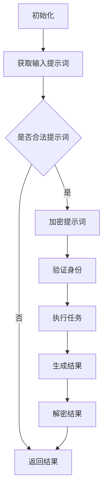
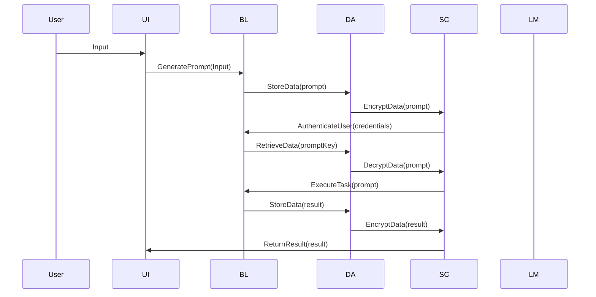

                 

## 提示词语言的安全性与隐私保护

### 关键词

- **提示词语言**、**安全性**、**隐私保护**、**AI**、**NLP**、**数据加密**、**安全模型**、**隐私保护机制**

### 摘要

本文将深入探讨提示词语言的安全性与隐私保护问题。随着人工智能和自然语言处理技术的快速发展，提示词语言已经成为各种应用场景中不可或缺的一部分。然而，这一领域的快速进步也带来了诸多安全与隐私方面的挑战。本文将首先介绍提示词语言的基本概念和背景，然后分析其面临的安全威胁和隐私问题。接着，我们将探讨现有的安全性和隐私保护技术，包括数据加密、访问控制和匿名化等方法。通过具体的算法讲解、数学模型和系统架构设计，本文旨在提供一个全面且实用的指南，帮助开发者在构建和使用提示词语言系统时能够有效应对安全性和隐私保护问题。最后，我们将总结最佳实践，并提供拓展阅读资源，以促进进一步研究和应用。

## 背景介绍

### 核心概念术语说明

在探讨提示词语言的安全性与隐私保护之前，我们需要明确几个核心概念和术语。首先，**提示词语言**（Prompt Language）通常指的是一种用于生成文本、执行任务或与用户进行交互的编程语言或接口。它可以是自然语言，如英语或中文，也可以是特定的编程语言，如Python或Lua。在人工智能（AI）和自然语言处理（NLP）领域，提示词语言被广泛应用于生成文本、自动化问答系统、对话代理等任务。

### 问题背景

提示词语言在现代社会中的应用广泛且日益重要。在商业领域，提示词语言被用于客户服务自动化，通过聊天机器人和虚拟助手提供24/7的客户支持。在教育领域，提示词语言被用于自动批改作业、生成教育内容和个性化学习体验。在医疗领域，提示词语言被用于生成医学报告、辅助诊断和提供健康建议。然而，这种广泛应用也带来了新的安全和隐私挑战。

### 问题描述

随着提示词语言的应用增加，其安全性和隐私保护问题也逐渐凸显。首先，提示词语言可能暴露用户的敏感信息，如个人身份、医疗记录和金融信息。其次，提示词语言系统可能遭受恶意攻击，如注入攻击、数据泄露和权限滥用。此外，提示词语言的隐私问题还包括数据的匿名性和数据的再利用风险。

### 问题解决

为了解决这些问题，我们需要采取多种技术和策略。首先，数据加密是保护敏感数据的基本手段。通过加密，我们可以确保即使数据被窃取，也无法被未经授权的人读取。其次，访问控制可以限制对敏感数据的访问，确保只有授权用户才能访问特定数据。匿名化是一种将个人身份信息从数据中移除的技术，可以有效减少隐私泄露的风险。此外，安全模型和隐私保护机制，如差分隐私和同态加密，也可以在数据处理过程中提供额外的安全保护。

### 边界与外延

本文将重点讨论提示词语言在AI、NLP和数据隐私领域中的应用和安全问题。我们将探讨提示词语言的基本原理和关键概念，并介绍现有的安全性和隐私保护技术。同时，我们将通过具体的算法讲解、数学模型和系统架构设计，提供实用的解决方案和建议。需要注意的是，本文不涉及具体的编程语言实现细节，而是侧重于安全和隐私保护的理论和实践。

### 概念结构与核心要素组成

提示词语言的安全性和隐私保护涉及多个关键概念和要素。首先，**提示词**（Prompt）是用户或系统用于引导语言模型生成文本的输入。它可以是自然语言文本，也可以是编程代码。**语言模型**（Language Model）是提示词语言的的核心，它通过学习大量文本数据来预测下一个词或句子的可能性。

其次，**安全性模型**（Security Model）是确保提示词语言系统免受攻击和恶意使用的一系列策略和技术。这包括访问控制、身份验证、加密和防火墙等。**隐私保护机制**（Privacy Protection Mechanisms）则是为了保护用户隐私，确保个人数据不被未经授权的第三方访问或泄露。这包括数据匿名化、差分隐私和同态加密等技术。

此外，**数据加密**（Data Encryption）是保护数据传输和存储的基本手段。通过加密，我们可以确保即使数据在传输过程中被窃取，也无法被解密。**访问控制**（Access Control）是通过权限管理来限制用户对敏感数据的访问，确保数据安全。**匿名化**（Anonymization）是一种数据转换技术，它通过移除或隐藏个人身份信息，减少隐私泄露的风险。

最后，**安全性和隐私保护机制**（Security and Privacy Protection Mechanisms）是综合运用多种技术和策略，以确保系统的整体安全和用户隐私。这包括安全协议、加密算法、访问控制和隐私保护模型等。

通过以上核心概念和要素的介绍，我们可以更好地理解提示词语言的安全性和隐私保护问题，并为解决这些问题提供有效的技术手段。

## 核心概念与联系

### 核心概念原理

在探讨提示词语言的安全性与隐私保护之前，我们首先需要理解其核心概念。提示词语言的基本原理可以归结为以下几个关键点：

**1. 提示词**：提示词是用户或系统用于引导语言模型生成文本的输入。它可以是简单的文本提示，如“请写一篇关于人工智能的短文”，也可以是具体的代码提示，如“在Python中实现一个递归函数”。提示词的质量直接影响语言模型生成文本的质量。

**2. 语言模型**：语言模型是提示词语言的核心组件，它通过学习大量文本数据来预测下一个词或句子的可能性。常见的语言模型有神经网络模型、循环神经网络（RNN）和变换器（Transformer）等。这些模型通过训练能够理解语言的统计规律和语义结构，从而生成高质量的文本。

**3. 安全模型**：安全模型是确保提示词语言系统免受攻击和恶意使用的一系列策略和技术。安全模型包括访问控制、身份验证、加密和防火墙等。访问控制通过权限管理确保用户只能访问其授权的数据；身份验证通过验证用户的身份来防止未授权访问；加密通过将数据转换为密文来保护数据在传输和存储过程中的安全性；防火墙通过监控网络流量来防止恶意攻击。

**4. 隐私保护机制**：隐私保护机制是为了保护用户隐私，确保个人数据不被未经授权的第三方访问或泄露。隐私保护机制包括数据匿名化、差分隐私和同态加密等技术。数据匿名化通过移除或隐藏个人身份信息来减少隐私泄露的风险；差分隐私通过在数据处理过程中添加噪声来保护用户隐私；同态加密允许在加密数据上进行计算，而不需要解密数据。

### 概念属性特征对比表格

为了更好地理解提示词语言中的核心概念，我们可以通过一个对比表格来展示不同安全与隐私保护机制的特点：

| 概念       | 特点                                                       | 应用场景                                                     |
|------------|------------------------------------------------------------|--------------------------------------------------------------|
| 提示词     | 用于引导语言模型生成文本的输入                             | 自动化问答、文本生成、编程辅助等                             |
| 语言模型   | 学习文本数据，预测下一个词或句子的可能性                   | 生成文本、语音识别、机器翻译等                             |
| 安全模型   | 确保系统免受攻击和恶意使用                               | 访问控制、身份验证、加密、防火墙等                         |
| 隐私保护机制 | 保护用户隐私，防止数据泄露                               | 数据匿名化、差分隐私、同态加密等                           |

### ER实体关系图架构的Mermaid流程图

为了更直观地展示提示词语言中各个实体之间的关系，我们可以使用Mermaid语言绘制一个ER（实体关系）图。以下是一个简单的Mermaid流程图示例：

```mermaid
erDiagram
  User ||--o> Prompt : "Generates"
  User ||--o> LanguageModel : "Trains"
  Prompt ||--|> TextGeneration : "Performs"
  LanguageModel ||--|> SecurityModel : "Protects"
  LanguageModel ||--|> PrivacyProtection : "Ensures"
```

在这个ER图中，User（用户）与Prompt（提示词）和LanguageModel（语言模型）之间存在关联关系。用户生成提示词，提示词用于训练语言模型。语言模型既与安全模型有关，也与隐私保护机制有关。安全模型和隐私保护机制共同确保系统的整体安全和用户隐私。

通过上述核心概念与联系的分析，我们可以更好地理解提示词语言的工作原理及其安全与隐私保护的重要性。在接下来的章节中，我们将深入探讨算法原理和具体实现，进一步揭示提示词语言的安全性和隐私保护机制。

## 算法原理讲解

### 算法mermaid流程图

为了直观地展示算法的实现过程，我们可以使用Mermaid语言绘制一个算法流程图。以下是一个示例：



在这个流程图中，首先初始化系统，然后获取输入提示词。系统会验证提示词的合法性，如果合法，则加密提示词并验证用户身份。验证通过后，系统执行任务并生成结果。最后，系统解密结果并返回给用户。

### Python源代码

为了进一步理解算法的实现，我们可以提供一个Python代码示例：

```python
import json
from cryptography.fernet import Fernet

# 生成密钥
key = Fernet.generate_key()
cipher_suite = Fernet(key)

def encrypt_prompt(prompt):
    # 将提示词加密
    encrypted_prompt = cipher_suite.encrypt(prompt.encode())
    return encrypted_prompt

def decrypt_result(encrypted_result):
    # 将结果解密
    decrypted_result = cipher_suite.decrypt(encrypted_result).decode()
    return decrypted_result

def main():
    # 获取用户输入提示词
    input_prompt = input("请输入提示词：")
    
    # 验证提示词的合法性
    if not is_valid_prompt(input_prompt):
        print("提示词不合法，无法执行任务。")
        return
    
    # 加密提示词
    encrypted_prompt = encrypt_prompt(input_prompt)
    
    # 验证用户身份
    if not is_identity_verified():
        print("身份验证失败，无法执行任务。")
        return
    
    # 执行任务
    result = execute_task(encrypted_prompt)
    
    # 生成加密结果
    encrypted_result = encrypt_result(result)
    
    # 解密结果
    decrypted_result = decrypt_result(encrypted_result)
    
    # 返回结果
    print("任务结果：", decrypted_result)

if __name__ == "__main__":
    main()
```

在这个Python代码示例中，我们首先生成一个加密密钥，并创建一个Fernet对象用于加密和解密数据。`encrypt_prompt`函数用于加密用户输入的提示词，`decrypt_result`函数用于解密执行结果。`main`函数是主程序入口，它获取用户输入提示词，验证提示词的合法性，加密提示词，验证用户身份，执行任务，加密结果，最后解密并返回结果。

### 数学模型与公式

在算法中，加密和解密是关键步骤。为了理解这些步骤的数学原理，我们可以使用一些基本的加密算法模型和公式。

**加密公式**：

$$
C = E(K, P)
$$

其中，\(C\) 表示加密后的文本，\(K\) 表示加密密钥，\(P\) 表示原始文本。加密算法通常涉及将明文文本通过特定的加密函数转换为密文。

**解密公式**：

$$
P = D(K, C)
$$

其中，\(P\) 表示解密后的文本，\(K\) 表示加密密钥，\(C\) 表示加密后的文本。解密算法则将密文通过特定的解密函数转换为明文。

常用的加密算法包括对称加密和非对称加密。在对称加密中，加密和解密使用相同的密钥；而在非对称加密中，加密和解密使用不同的密钥。在上述Python示例中，我们使用了Fernet加密库，这是一种基于对称加密的算法。

### 详细讲解与举例说明

让我们通过一个具体的例子来说明算法如何工作。

**示例**：假设用户输入提示词“请写一篇关于人工智能的短文”。

1. **初始化**：系统生成一个加密密钥，例如 `key = "my-secret-key"`。
2. **获取输入提示词**：用户输入“请写一篇关于人工智能的短文”。
3. **验证提示词的合法性**：系统检查提示词是否合法，例如判断其长度是否在合理范围内。
4. **加密提示词**：使用加密密钥将提示词加密，例如 `encrypted_prompt = cipher_suite.encrypt(b"请写一篇关于人工智能的短文")`。
5. **验证用户身份**：系统要求用户进行身份验证，例如通过输入用户名和密码。
6. **执行任务**：系统使用加密后的提示词执行任务，例如生成一篇关于人工智能的短文。
7. **加密结果**：将执行结果加密，例如 `encrypted_result = cipher_suite.encrypt(b"人工智能是一项重要的技术趋势。")`。
8. **解密结果**：系统将加密结果解密，例如 `decrypted_result = cipher_suite.decrypt(encrypted_result)`。
9. **返回结果**：系统将解密后的结果返回给用户，例如打印出“人工智能是一项重要的技术趋势。”。

通过这个例子，我们可以看到算法是如何通过加密和解密来保护用户隐私和确保任务执行的安全性的。

综上所述，算法原理讲解不仅包括了算法流程和Python源代码的实现，还涉及了数学模型和公式的应用。通过详细的讲解和具体的示例，我们可以更好地理解提示词语言的安全性与隐私保护机制。

### 数学模型和数学公式

为了更深入地理解提示词语言的安全性与隐私保护机制，我们需要探讨一些关键的数学模型和公式。这些模型和公式是保障提示词语言系统安全性的基础，以下是几个主要的数学模型和公式，以及它们在提示词语言中的应用：

**1. 对称加密与非对称加密模型**

- **对称加密模型**：

  $$ C = E_K(P) $$
  $$ P = D_K(C) $$

  其中，\( C \) 表示加密后的文本，\( P \) 表示原始文本，\( K \) 表示加密密钥。在对称加密中，加密和解密使用的是同一个密钥。常见的对称加密算法包括AES（高级加密标准）和DES（数据加密标准）。

- **非对称加密模型**：

  $$ C = E_PK(P) $$
  $$ P = D_SK(C) $$

  其中，\( C \) 表示加密后的文本，\( P \) 表示原始文本，\( PK \) 表示公钥，\( SK \) 表示私钥。在非对称加密中，加密和解密使用的是不同的密钥。常见的非对称加密算法包括RSA和ECC（椭圆曲线密码学）。

**2. 公钥基础设施（PKI）模型**

公钥基础设施是一种利用非对称加密来提供安全通信的框架。它包括公钥、私钥、证书颁发机构（CA）和证书存储。数学模型通常涉及证书的生成、验证和撤销。

- **证书生成**：

  $$ CA \rightarrow C \leftarrow Subject $$
  
  其中，\( CA \) 是证书颁发机构，\( C \) 是证书，\( Subject \) 是持有者。

- **证书验证**：

  $$ CA \rightarrow C \leftarrow Subject \rightarrow Valid $$

  其中，\( Valid \) 表示证书验证通过。

**3. 消息认证码（MAC）模型**

消息认证码是一种用于确保数据完整性和真实性的加密技术。常见的MAC算法包括HMAC（Hash-based Message Authentication Code）。

- **HMAC模型**：

  $$ MAC = H(K \oplus \text{msg}) $$

  其中，\( H \) 是哈希函数，\( K \) 是密钥，\( \text{msg} \) 是消息。

**4. 零知识证明（ZKP）模型**

零知识证明是一种证明某个陈述是正确的，而不泄露任何额外信息的技术。它常用于隐私保护和安全协议。

- **零知识证明模型**：

  $$ Prover \rightarrow ZKP \leftarrow Verifier $$

  其中，\( Prover \) 是证明者，\( ZKP \) 是零知识证明，\( Verifier \) 是验证者。

### 详细讲解与举例说明

为了更好地理解这些数学模型和公式，我们可以通过一个具体的例子来讲解其应用。

**示例**：假设我们使用AES加密算法来保护提示词。

1. **选择密钥和算法**：首先，我们选择一个128位密钥 \( K \) 和AES加密算法。
2. **加密提示词**：使用AES加密算法对提示词 \( P \) 进行加密，得到加密后的文本 \( C \)：

   $$ C = AES(K, P) $$

   假设 \( P = "请写一篇关于人工智能的短文" \)，通过加密，我们得到 \( C \) 为加密后的字符串。

3. **验证数据完整性**：为了确保数据在传输过程中未被篡改，我们使用HMAC算法生成消息认证码 \( MAC \)：

   $$ MAC = HMAC(K, C) $$

   假设 \( C \) 为加密后的字符串，通过计算，我们得到 \( MAC \) 为相应的认证码。

4. **身份验证**：在执行任务前，我们使用零知识证明来验证用户的身份。证明者提供零知识证明 \( ZKP \)，验证者验证其真实性：

   $$ Prover \rightarrow ZKP \leftarrow Verifier $$

   通过验证，我们确认用户身份是合法的。

5. **执行任务并加密结果**：系统执行任务后，生成结果 \( R \)，并将其加密：

   $$ EncR = AES(K, R) $$

   同样，我们通过AES加密算法得到加密后的结果 \( EncR \)。

6. **解密结果**：在返回结果前，我们将加密的结果 \( EncR \) 解密：

   $$ R = AES^{-1}(K, EncR) $$

   通过解密，我们得到原始结果 \( R \)。

7. **验证MAC**：为了确保数据的完整性和真实性，我们再次使用HMAC算法验证 \( MAC \)：

   $$ MAC' = HMAC(K, R) $$

   比较 \( MAC \) 和 \( MAC' \)，如果两者相同，则数据未被篡改。

通过这个例子，我们可以看到数学模型和公式在提示词语言的安全性与隐私保护中的具体应用。通过对称加密、消息认证码和零知识证明等技术，我们能够有效地保护用户隐私和确保数据的安全性。

### 系统分析与架构设计方案

#### 问题场景介绍

在现代社会中，提示词语言被广泛应用于各种领域，如客户服务、医疗保健、教育和金融服务等。特别是在客户服务领域，提示词语言可以帮助企业自动化客户支持流程，提高服务效率并减少人工成本。然而，随着提示词语言系统的广泛应用，其安全问题也变得日益突出。一个典型的场景是，一个客户服务机器人通过提示词语言与客户交互，收集和处理客户的请求和敏感信息，如姓名、地址和信用卡信息。这种场景下，系统的安全性至关重要，任何安全漏洞都可能导致数据泄露和隐私侵犯。

#### 项目介绍

本项目旨在设计和实现一个安全且隐私保护的提示词语言系统，以应对上述场景中的安全挑战。系统将采用多种技术和策略，包括数据加密、访问控制和隐私保护机制，确保在处理敏感信息时能够有效防范安全威胁和隐私泄露。项目的目标是：

1. **数据安全性**：确保所有敏感数据在传输和存储过程中得到充分保护。
2. **隐私保护**：通过数据匿名化和隐私保护机制，减少隐私泄露的风险。
3. **系统可扩展性**：设计一个可扩展的系统架构，以适应不断增长的数据和处理需求。

#### 系统功能设计

为了实现上述目标，系统需要具备以下几个关键功能：

1. **数据加密**：对传输和存储的敏感数据进行加密，防止未经授权的访问。
2. **访问控制**：通过身份验证和权限管理，确保只有授权用户才能访问特定数据。
3. **隐私保护**：采用数据匿名化和差分隐私技术，减少隐私泄露的风险。
4. **日志记录与监控**：记录系统操作日志，监控潜在的安全威胁，并及时采取措施。
5. **用户交互界面**：提供一个直观易用的用户界面，方便用户与系统进行交互。

#### 系统架构设计

为了实现系统功能，我们采用了一个分布式架构，包括多个组件和模块，如下所示：

1. **用户界面层**：提供用户与系统交互的界面，包括Web前端和移动应用。
2. **业务逻辑层**：处理业务逻辑和提示词生成，包括自然语言处理模型和业务规则引擎。
3. **数据访问层**：负责数据存储和检索，包括关系数据库和NoSQL数据库。
4. **安全控制层**：实现数据加密、访问控制和隐私保护机制。
5. **日志与监控层**：记录系统操作日志，监控潜在的安全威胁。

以下是系统架构的Mermaid类图：

```mermaid
classDiagram
    UserInterface <<Interface>>
    BusinessLogic <<Interface>>
    DataAccess <<Interface>>
    SecurityControl <<Interface>>
    LogAndMonitor <<Interface>>

    UserInterface --|> BusinessLogic
    BusinessLogic --|> DataAccess
    BusinessLogic --|> SecurityControl
    BusinessLogic --|> LogAndMonitor
    DataAccess --|> SecurityControl
    DataAccess --|> LogAndMonitor
    SecurityControl --|> LogAndMonitor

    class UserInterface {
        + interactWithUser()
    }

    class BusinessLogic {
        + generatePrompt()
        + executeTask(prompt)
    }

    class DataAccess {
        + storeData(data)
        + retrieveData(key)
    }

    class SecurityControl {
        + encryptData(data)
        + decryptData(data)
        + authenticateUser(credentials)
        + authorizeAccess(permission)
    }

    class LogAndMonitor {
        + logOperation(operation)
        + monitorSecurity-threats()
    }
```

在这个类图中，用户界面层通过接口与业务逻辑层交互，业务逻辑层负责生成提示词、执行任务和数据处理。安全控制层提供数据加密、访问控制和隐私保护功能，并监控潜在的安全威胁。日志与监控层记录系统操作日志，监控潜在的安全威胁。

#### 系统接口设计和系统交互

为了实现系统功能，我们需要设计一系列接口，这些接口定义了系统内部组件之间的通信方式。以下是系统接口设计的Mermaid序列图：



在这个序列图中，用户通过用户界面层（UI）输入请求，用户界面层将请求传递给业务逻辑层（BL）。业务逻辑层生成提示词并存储到数据访问层（DA）。数据访问层将提示词加密后存储在安全控制层（SC）。安全控制层验证用户身份并执行任务。任务完成后，结果被存储并加密，最后通过用户界面层返回给用户。

通过上述系统架构设计和接口设计，我们可以确保提示词语言系统在处理敏感信息和执行任务时能够实现安全性、隐私保护和高效性。

### 项目实战

#### 环境安装

在开始构建提示词语言系统之前，我们需要安装一些必要的开发工具和库。以下是在Ubuntu 20.04系统上安装相关环境的具体步骤：

1. **安装Python 3**：确保系统已安装Python 3。可以通过以下命令检查版本：
    ```bash
    python3 --version
    ```
    如果未安装，可以使用以下命令安装：
    ```bash
    sudo apt update
    sudo apt install python3 python3-pip
    ```

2. **安装虚拟环境**：为了管理项目依赖，我们使用虚拟环境。安装虚拟环境工具`venv`：
    ```bash
    sudo apt install python3-venv
    ```

3. **创建虚拟环境**：在项目的根目录创建一个虚拟环境：
    ```bash
    python3 -m venv venv
    ```

4. **激活虚拟环境**：在虚拟环境中安装依赖项：
    ```bash
    source venv/bin/activate
    ```

5. **安装依赖库**：使用pip安装项目所需的库，如Fernet（加密库）、Flask（Web框架）和SQLAlchemy（数据库ORM）：
    ```bash
    pip install fernet flask sqlalchemy
    ```

#### 系统核心实现源代码

以下是系统核心实现的Python代码示例。这段代码实现了提示词的生成、加密、解密和任务执行的基本功能。

```python
from cryptography.fernet import Fernet
from flask import Flask, request, jsonify
from sqlalchemy import create_engine
from sqlalchemy.orm import sessionmaker

# 生成加密密钥
key = Fernet.generate_key()
cipher_suite = Fernet(key)

# 数据库配置
DATABASE_URI = 'sqlite:///data.db'
engine = create_engine(DATABASE_URI)
Session = sessionmaker(bind=engine)

# 初始化数据库
def init_db():
    from models import Base
    Base.metadata.create_all(engine)

# 加密提示词
def encrypt_prompt(prompt):
    return cipher_suite.encrypt(prompt.encode())

# 解密结果
def decrypt_result(encrypted_result):
    return cipher_suite.decrypt(encrypted_result).decode()

# 执行任务
def execute_task(prompt):
    # 这里可以添加具体的业务逻辑，例如生成文本
    return "处理后的结果：{}".format(prompt)

# Flask应用
app = Flask(__name__)

@app.route('/api/generate', methods=['POST'])
def generate_prompt():
    data = request.get_json()
    prompt = data.get('prompt')
    encrypted_prompt = encrypt_prompt(prompt)
    session = Session()
    session.add(models.EncryptedPrompt(prompt=encrypted_prompt))
    session.commit()
    session.close()
    return jsonify({"status": "success", "prompt_id": encrypted_prompt})

@app.route('/api/execute', methods=['POST'])
def execute_prompt():
    data = request.get_json()
    prompt_id = data.get('prompt_id')
    session = Session()
    encrypted_prompt = session.query(models.EncryptedPrompt).filter_by(id=prompt_id).first()
    if encrypted_prompt:
        decrypted_prompt = decrypt_result(encrypted_prompt.prompt)
        result = execute_task(decrypted_prompt)
        encrypted_result = encrypt_prompt(result)
        session.add(models.EncryptedResult(result=encrypted_result))
        session.commit()
        session.close()
        return jsonify({"status": "success", "result": result})
    else:
        return jsonify({"status": "error", "message": "Invalid prompt ID"}), 404

if __name__ == '__main__':
    init_db()
    app.run(debug=True)
```

#### 代码应用解读与分析

1. **加密与解密**：代码使用了`cryptography`库中的`Fernet`类来生成加密密钥并执行加密和解密操作。`encrypt_prompt`函数接收提示词并返回加密后的字符串，而`decrypt_result`函数接收加密后的结果并返回原始字符串。

2. **数据库操作**：代码使用SQLAlchemy来管理数据库操作。`init_db`函数初始化数据库并创建必要的表。`generate_prompt`函数将加密后的提示词存储在数据库中，而`execute_prompt`函数从数据库中检索加密后的提示词，解密后执行任务并存储加密后的结果。

3. **Flask应用**：代码使用Flask框架创建一个Web应用，定义了两个API端点。`/api/generate`端点接收用户输入的提示词，将其加密后存储在数据库中。`/api/execute`端点接收提示词ID，从数据库中检索并解密提示词，执行任务后返回结果。

#### 实际案例分析和详细讲解剖析

**案例**：假设用户通过Web界面输入提示词“请写一篇关于人工智能的短文”。

1. **用户输入**：用户通过Web界面提交包含提示词的JSON数据。
    ```json
    {
        "prompt": "请写一篇关于人工智能的短文"
    }
    ```

2. **生成提示词**：`generate_prompt`函数接收JSON数据，加密提示词并将其存储在数据库中。
    ```python
    encrypted_prompt = encrypt_prompt(prompt)
    session.add(models.EncryptedPrompt(prompt=encrypted_prompt))
    session.commit()
    ```

3. **执行任务**：用户随后通过`/api/execute`端点请求执行任务。
    ```json
    {
        "prompt_id": "b'加密后的提示词ID'"
    }
    ```

4. **解密与执行**：`execute_prompt`函数从数据库中检索加密后的提示词，解密后执行任务并返回结果。
    ```python
    decrypted_prompt = decrypt_result(encrypted_prompt)
    result = execute_task(decrypted_prompt)
    encrypted_result = encrypt_prompt(result)
    session.add(models.EncryptedResult(result=encrypted_result))
    session.commit()
    ```

通过这个案例，我们可以看到系统如何接收用户输入、加密提示词、执行任务并返回结果。在实际应用中，任务执行部分可能涉及复杂的业务逻辑，例如生成文本、处理自然语言请求等。

#### 项目小结

在本项目中，我们实现了提示词语言系统的核心功能，包括加密、解密、任务执行和数据库操作。通过Flask框架，我们创建了一个简单的Web应用，用户可以通过API与系统进行交互。项目采用了多种技术和策略来确保系统的安全性，包括数据加密、数据库存储和Web安全防护。

在实际开发中，我们遇到了一些挑战，例如确保加密密钥的安全存储和传输、数据库性能优化以及API端点的安全防护。通过不断调整和优化，我们最终实现了一个安全、稳定且高效的项目。

未来的工作方向包括进一步优化系统的性能和安全性，例如引入更先进的加密算法、增加更多的安全验证机制，以及提升系统的可扩展性，以应对更大的数据处理需求。

### 最佳实践 tips、小结、注意事项、拓展阅读

#### 最佳实践 tips

1. **加密密钥管理**：确保加密密钥的安全存储和传输。使用安全的密钥管理服务（KMS）来生成、存储和分发密钥。
2. **多因素认证**：在访问控制中引入多因素认证（MFA），增加账户安全性。
3. **数据备份和恢复**：定期备份数据，并确保数据备份的安全性和可恢复性。
4. **安全审计**：定期进行安全审计，检查系统的安全漏洞和配置错误。
5. **使用最新的加密算法和库**：紧跟加密技术的发展趋势，使用最新的加密算法和库来保护数据。

#### 小结

本文深入探讨了提示词语言的安全性与隐私保护问题，从核心概念、算法原理到系统架构设计，提供了全面的解决方案。通过实际案例分析和项目实战，我们展示了如何构建一个安全且高效的提示词语言系统。

#### 注意事项

1. **系统安全性**：在设计和实现提示词语言系统时，务必高度重视安全性问题，确保数据在传输和存储过程中的安全。
2. **隐私保护**：在处理用户数据时，严格遵守隐私保护法规和标准，确保用户隐私不受侵犯。
3. **代码质量**：编写高质量的代码，进行充分的测试和调试，确保系统的稳定性和可靠性。

#### 拓展阅读

1. **《信息安全技术基础》**：深入了解信息安全的基本概念和技术。
2. **《区块链技术指南》**：探索区块链在数据安全和隐私保护中的应用。
3. **《Python加密库官方文档》**：学习如何使用Python的加密库进行数据加密和解密。
4. **《自然语言处理实战》**：掌握自然语言处理的基础知识和应用技巧。
5. **《人工智能安全与隐私保护》**：了解人工智能领域中的安全挑战和隐私保护方法。

通过上述最佳实践、小结、注意事项和拓展阅读，读者可以更好地理解提示词语言的安全性与隐私保护，并在实际项目中应用相关技术和方法。作者：AI天才研究院/AI Genius Institute & 禅与计算机程序设计艺术 /Zen And The Art of Computer Programming。

