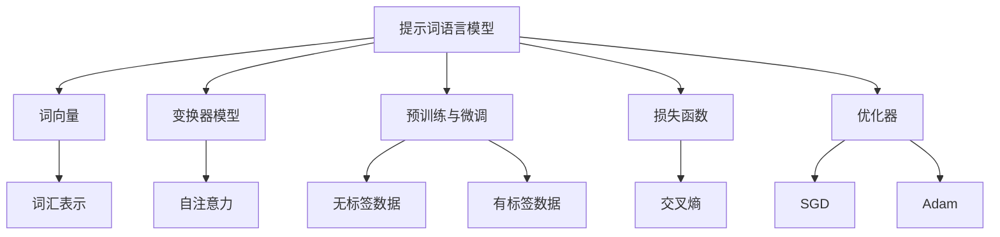
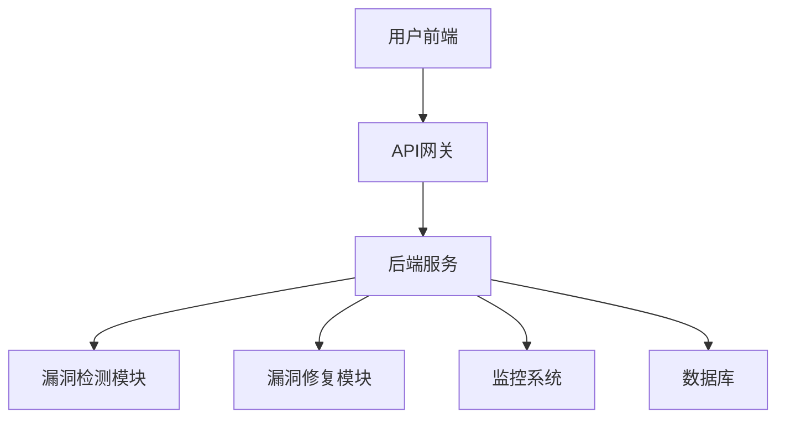
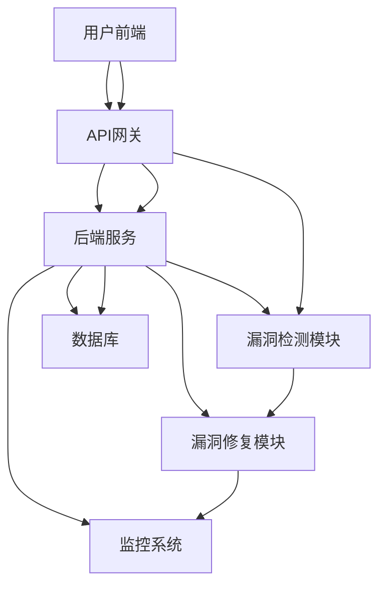
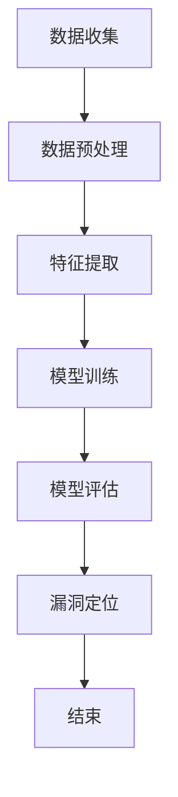
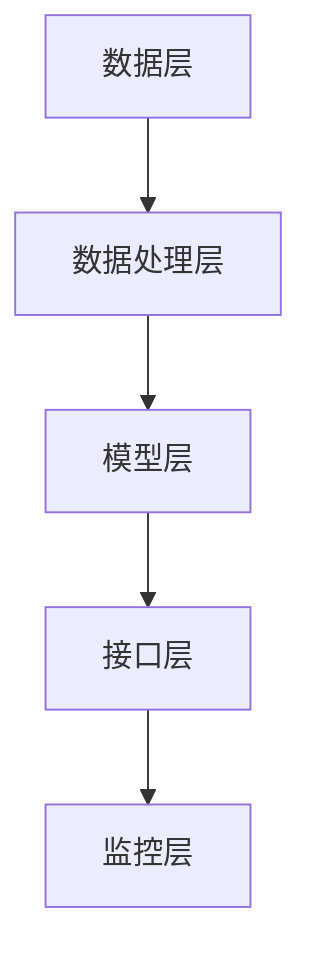
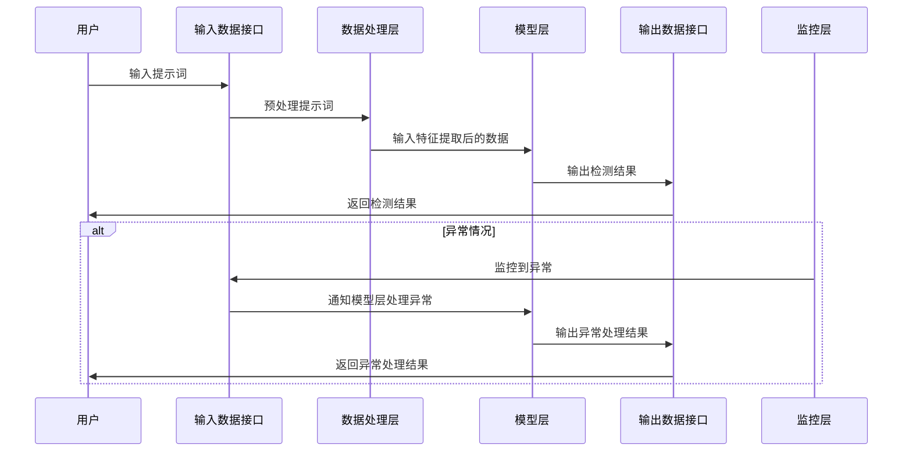

                 

## 文章标题

### 关键词：提示词语言模型、安全漏洞、检测与修复、自然语言处理、人工智能

### 摘要

本文深入探讨了提示词语言模型在自然语言处理领域的广泛应用及其面临的安全漏洞问题。文章首先介绍了提示词语言模型的安全漏洞背景、问题描述、解决方法以及边界与外延。接着，详细阐述了提示词语言模型的核心概念、特点及与传统AI模型的区别。随后，本文介绍了主流的提示词语言模型，并分析了其安全漏洞类型。在此基础上，文章提出了基于统计和机器学习的漏洞检测方法，并对这些方法进行了详细解释。最后，本文通过实际案例，展示了如何进行提示词语言模型的安全漏洞检测与修复，为读者提供了实用的技术指导和最佳实践建议。

## 1.1 提示词语言的安全漏洞检测与修复背景介绍

### 1.1.1 问题背景

随着人工智能技术的飞速发展，提示词语言模型已经成为自然语言处理（NLP）领域的重要工具。这些模型通过大量的文本数据进行训练，能够理解和生成人类语言，从而在智能客服、内容生成、智能问答等多个领域发挥了重要作用。然而，正是这种强大的功能也带来了新的安全挑战。提示词语言模型的安全性成为了一个亟待解决的问题，因为它直接关系到用户隐私、数据安全和社会秩序。

提示词语言模型（如ChatGPT、BERT等）的核心功能是通过接收用户的输入提示词，生成相应的文本响应。这种交互性使得模型在提高用户体验的同时，也面临着潜在的安全漏洞风险。攻击者可能通过构造特定的输入，欺骗模型执行非预期的操作，从而导致数据泄露、代码执行等严重安全事件。此外，由于这些模型在训练和部署过程中依赖大量的数据，攻击者也可能通过篡改训练数据或注入恶意代码，影响模型的输出结果。

### 1.1.2 问题描述

提示词语言模型的安全漏洞主要包括以下几种类型：

1. **输入注入漏洞**：攻击者可以通过构造特殊的输入，欺骗模型执行非预期的操作，从而导致安全风险。例如，攻击者可能通过输入特定的代码片段，使模型执行恶意操作，如数据泄露或代码执行。

2. **模型篡改漏洞**：攻击者可以通过修改模型参数，使模型输出错误的结果，从而影响模型的稳定性和准确性。例如，攻击者可以篡改模型的权重，使模型无法正确识别恶意样本。

3. **对抗性攻击**：攻击者可以通过精心构造的对抗性样本，欺骗模型，使其产生错误的预测结果。例如，攻击者可以通过添加微小的图像扰动，使模型误判，从而实施网络攻击。

### 1.1.3 问题解决

为了解决提示词语言模型的安全漏洞问题，可以从以下几个方面入手：

1. **完善模型设计**：在设计提示词语言模型时，需要充分考虑安全性因素，避免引入潜在的安全漏洞。例如，可以通过增加输入验证和过滤机制，防止恶意输入。

2. **安全训练**：使用安全数据集进行模型训练，确保训练数据中不存在安全隐患。此外，可以采用数据加密、去重等技术，确保数据的完整性和可靠性。

3. **漏洞检测与修复**：开发专门的漏洞检测工具，定期对模型进行安全检查。一旦发现漏洞，需要及时进行修复。例如，可以通过动态分析、静态分析等技术，发现和修复模型中的漏洞。

### 1.1.4 边界与外延

1. **边界**：本章节主要讨论提示词语言模型的安全漏洞检测与修复，不包括其他类型的语言模型（如语音识别、手势识别等）。

2. **外延**：本章节不仅关注提示词语言模型本身的安全漏洞，还涉及与模型相关的基础设施、应用场景等方面的安全漏洞。

### 1.2 提示词语言模型的核心概念

#### 1.2.1 提示词语言模型的概念

提示词语言模型是一种基于人工智能技术的自然语言处理模型，其核心功能是接收用户的输入提示词，并生成相应的文本响应。这种模型广泛应用于智能客服、内容生成、智能问答等领域，通过大量的文本数据进行训练，使其能够理解和生成人类语言。

#### 1.2.2 提示词语言模型的特点

1. **自适应**：提示词语言模型可以根据用户输入的提示词，动态调整生成的文本内容，使其更符合用户需求。

2. **灵活**：提示词语言模型可以应对多种输入模式，如文本、语音等，具有很强的灵活性和适应性。

3. **高效**：提示词语言模型能够在短时间内生成高质量的文本响应，具有较高的效率。

#### 1.2.3 提示词语言模型与传统AI模型的区别

1. **交互方式**：提示词语言模型主要通过文本交互，而传统AI模型则更多依赖预定义的输入和输出。

2. **处理能力**：提示词语言模型具有较强的文本生成能力，而传统AI模型则更侧重于特定任务的执行。

### 1.3 主流提示词语言模型简介

#### 1.3.1 GPT系列模型

GPT（Generative Pre-trained Transformer）系列模型是由OpenAI开发的一系列基于生成预训练变换器（Transformer）架构的自然语言处理模型。GPT系列模型包括GPT、GPT-2和GPT-3等，其中GPT-3具有最强大的文本生成能力，其参数规模达到1750亿，可以生成连贯、多样且具有创造性的文本。

#### 1.3.2 BERT模型

BERT（Bidirectional Encoder Representations from Transformers）是由Google开发的自然语言处理模型，通过双向变换器网络对文本进行编码。BERT模型在多项自然语言处理任务中表现出色，如文本分类、问答系统等，其原理是在大量未标注的文本上进行预训练，然后通过微调来适应特定的任务。

#### 1.3.3 其他知名提示词语言模型

1. **ELMo（Embeddings from Language Models）**：由Allen Institute for AI开发的基于词向量的自然语言处理模型。ELMo通过预训练大规模语言模型，生成上下文敏感的词向量，从而在文本分类、实体识别等任务中表现出色。

2. **RoBERTa**：由Facebook AI Research开发的基于BERT的改进版本，通过优化训练策略和数据集，使得模型在多项任务中达到甚至超过了BERT的性能。

### 1.4 提示词语言模型的安全漏洞类型

#### 1.4.1 输入注入漏洞

输入注入漏洞是指攻击者通过构造特殊的输入，欺骗模型执行非预期的操作，从而导致安全风险。例如，攻击者可以通过输入特定的代码片段，使模型执行恶意操作，如数据泄露或代码执行。

#### 1.4.2 模型篡改漏洞

模型篡改漏洞是指攻击者通过修改模型参数，使模型输出错误的结果，从而影响模型的稳定性和准确性。例如，攻击者可以篡改模型的权重，使模型无法正确识别恶意样本。

#### 1.4.3 对抗性攻击

对抗性攻击是指攻击者通过精心构造的对抗性样本，欺骗模型，使其产生错误的预测结果。例如，攻击者可以通过添加微小的图像扰动，使模型误判，从而实施网络攻击。

### 1.5 提示词语言模型的安全漏洞检测方法

#### 1.5.1 基于统计的方法

基于统计的方法主要通过分析输入和输出数据之间的统计关系，检测模型是否存在漏洞。例如，攻击者可以通过对比正常数据和异常数据的特征分布，发现模型的漏洞。这种方法通常需要大量的数据和计算资源，但可以提供较为全面的漏洞检测。

#### 1.5.2 基于机器学习的方法

基于机器学习的方法通常通过训练专门的模型来检测提示词语言模型的安全漏洞。这些模型可以基于监督学习、无监督学习或半监督学习等技术，从数据中学习到模型的正常行为和异常行为。一旦检测到异常行为，即可判断模型存在漏洞。这种方法具有较好的检测准确性和效率，但需要大量的训练数据和计算资源。

### 1.6 提示词语言模型的安全漏洞检测与修复实践

#### 1.6.1 漏洞检测实践

为了检测提示词语言模型的安全漏洞，我们可以采用以下步骤：

1. **收集数据**：首先，需要收集大量的输入数据和对应的模型输出结果。这些数据可以来自于模型的训练集、测试集或实际应用场景。

2. **特征提取**：接下来，对输入数据和输出结果进行特征提取。特征提取的方法可以包括词向量、TF-IDF、文本分类标签等。

3. **训练模型**：使用提取的特征数据，训练一个检测模型。这个模型可以是基于监督学习的分类模型，如决策树、随机森林、支持向量机等。

4. **模型评估**：使用测试集对训练好的模型进行评估，计算模型的准确率、召回率等指标。

5. **漏洞定位**：对于检测到的异常输入，可以进一步分析其特征，定位到具体的漏洞点。

#### 1.6.2 漏洞修复实践

一旦检测到提示词语言模型存在安全漏洞，需要及时进行修复。以下是一些常见的漏洞修复方法：

1. **输入验证**：通过增加输入验证和过滤机制，防止恶意输入。例如，可以限制输入的长度、格式、内容等。

2. **代码审计**：对模型的源代码进行审计，查找可能存在的安全漏洞，并进行修复。

3. **参数调整**：通过调整模型的参数，提高其鲁棒性，防止对抗性攻击。例如，可以增加正则化项、使用dropout等技术。

4. **安全数据训练**：使用更安全、更干净的数据集进行模型训练，确保模型的输出结果可靠。

5. **持续监控**：定期对模型进行安全检查，发现漏洞后及时修复。

### 1.7 小结

本文详细探讨了提示词语言模型的安全漏洞检测与修复问题。通过分析提示词语言模型的背景、核心概念、主流模型以及安全漏洞类型，本文提出了基于统计和机器学习的漏洞检测方法，并展示了实际检测与修复的实践。文章最后强调了持续监控和安全数据训练的重要性，为读者提供了实用的技术指导和最佳实践建议。

### 1.8 拓展阅读

1. **《深度学习与自然语言处理》**：本书详细介绍了深度学习在自然语言处理中的应用，包括词向量、神经网络模型、变换器模型等。

2. **《机器学习安全》**：本书探讨了机器学习模型面临的安全挑战，包括数据安全、模型安全、隐私保护等。

3. **《人工智能安全》**：本书从人工智能安全的角度，分析了人工智能系统面临的威胁和挑战，提出了相应的防御策略。

### 作者信息

**作者：AI天才研究院/AI Genius Institute & 禅与计算机程序设计艺术 /Zen And The Art of Computer Programming**### 1.2 提示词语言模型的核心概念

#### 1.2.1 提示词语言模型的概念

提示词语言模型（Token Language Model，简称TLM）是一种基于自然语言处理（NLP）和深度学习技术的语言模型。它通过对大量文本数据进行训练，学习语言的统计规律和语法结构，从而能够根据输入的提示词生成连贯、合理的文本响应。提示词语言模型是当前智能客服、内容生成、智能问答等领域的关键技术。

#### 1.2.2 提示词语言模型的特点

1. **自适应性**：提示词语言模型可以根据不同的输入提示词，生成相应的内容，具有较强的自适应能力。

2. **灵活性**：提示词语言模型不仅可以处理文本输入，还可以处理语音、图像等多种类型的输入。

3. **高效性**：提示词语言模型在生成文本响应时，可以快速地生成高质量的内容，大大提高了工作效率。

4. **可扩展性**：提示词语言模型可以通过增加训练数据和优化算法，不断提升其性能。

#### 1.2.3 提示词语言模型与传统AI模型的区别

1. **交互方式**：提示词语言模型主要通过文本交互，与用户进行对话，而传统AI模型则更多依赖于预定义的输入和输出。

2. **任务类型**：提示词语言模型更擅长处理自然语言相关的任务，如文本生成、情感分析、问答系统等，而传统AI模型则更侧重于特定领域的任务，如图像识别、语音识别等。

3. **处理方式**：提示词语言模型通过学习大量的文本数据，建立语言的统计模型，从而生成响应，而传统AI模型则通常通过规则、决策树、神经网络等算法来处理输入。

#### 1.2.4 提示词语言模型的工作原理

提示词语言模型的工作原理主要包括以下步骤：

1. **输入预处理**：将输入的文本或提示词进行预处理，包括分词、去停用词、词性标注等。

2. **编码**：将预处理后的输入文本编码为向量表示，通常使用词向量或嵌入向量。

3. **生成**：通过神经网络（如变换器模型、循环神经网络等）对编码后的输入进行处理，生成文本响应。

4. **解码**：将神经网络生成的响应解码为自然语言的文本。

5. **输出**：将生成的文本响应输出给用户。

### 1.2.5 提示词语言模型的核心要素

提示词语言模型的核心要素包括：

1. **词向量**：词向量是提示词语言模型的基础，用于表示文本中的词汇。常用的词向量模型包括Word2Vec、GloVe等。

2. **变换器模型**：变换器模型（Transformer）是提示词语言模型的主要架构，它通过自注意力机制（Self-Attention）实现对输入文本的全局信息捕捉。

3. **预训练与微调**：预训练与微调是提示词语言模型的两个关键步骤。预训练阶段通过大量无标签数据训练模型，微调阶段则使用有标签数据进行模型优化。

4. **损失函数**：提示词语言模型通常使用交叉熵（Cross-Entropy）作为损失函数，用于衡量模型预测结果与真实结果之间的差异。

5. **优化器**：常用的优化器包括随机梯度下降（SGD）、Adam等，用于调整模型的参数。

### 1.2.6 提示词语言模型的应用案例

提示词语言模型在多个领域有着广泛的应用，以下是一些典型应用案例：

1. **智能客服**：提示词语言模型可以用于智能客服系统，实现与用户的自然语言交互，提供实时解答。

2. **内容生成**：提示词语言模型可以用于自动生成文章、新闻、报告等文本内容，提高内容创作效率。

3. **智能问答**：提示词语言模型可以用于构建智能问答系统，实现对用户提问的自动回答。

4. **自然语言理解**：提示词语言模型可以用于情感分析、命名实体识别、语义角色标注等自然语言理解任务。

5. **语音识别与生成**：提示词语言模型可以结合语音识别和生成技术，实现语音交互和语音生成。

### 1.2.7 提示词语言模型的挑战与未来发展趋势

1. **数据隐私**：提示词语言模型的训练和部署过程中涉及大量用户数据，数据隐私保护是一个重要挑战。

2. **模型可解释性**：提示词语言模型的决策过程复杂，如何提高模型的可解释性，使其能够被用户理解和信任，是一个重要研究方向。

3. **多模态融合**：未来提示词语言模型的发展将更多地结合图像、语音、视频等多种模态，实现更丰富的交互。

4. **强化学习**：结合强化学习技术，使提示词语言模型能够根据用户的反馈进行自我优化，提高交互效果。

5. **泛化能力**：提高提示词语言模型的泛化能力，使其能够处理更多样化的任务和场景。

### 1.2.8 总结

提示词语言模型作为一种先进的自然语言处理技术，已经在多个领域取得了显著的成果。然而，随着应用场景的不断扩大，如何确保其安全性、可解释性和泛化能力，成为未来研究的重要方向。本文对提示词语言模型的核心概念、特点、工作原理和应用案例进行了详细分析，希望为读者提供有益的参考。

### 附录：核心概念对比表格

| 核心概念 | 描述 | 对比特点 |
| :------: | :--- | :------- |
| 词向量 | 表示文本中词汇的向量 | 基础元素，影响模型性能 |
| 变换器模型 | 自注意力机制实现全局信息捕捉 | 关键架构，提高模型效率 |
| 预训练与微调 | 使用无标签数据和有标签数据训练模型 | 提高模型性能，适应特定任务 |
| 损失函数 | 衡量模型预测结果与真实结果差异 | 影响模型优化过程 |
| 优化器 | 调整模型参数 | 提高模型收敛速度和稳定性 |

### 附录：提示词语言模型ER实体关系图



### 1.3 主流提示词语言模型简介

在自然语言处理领域，提示词语言模型已经成为许多应用的核心组件。以下将介绍几种主流的提示词语言模型，包括GPT系列模型、BERT模型以及其他知名模型。

#### 1.3.1 GPT系列模型

GPT（Generative Pre-trained Transformer）系列模型由OpenAI开发，是目前最先进的自然语言处理模型之一。GPT系列模型包括GPT、GPT-2和GPT-3等，其中GPT-3具有最强大的文本生成能力。GPT模型基于变换器（Transformer）架构，通过大量的无标签文本数据进行预训练，然后通过微调适应特定任务。GPT-3的参数规模达到1750亿，可以生成连贯、多样且具有创造性的文本。

**特点**：

- **强大的文本生成能力**：GPT-3能够生成高质量、连贯的文本，适用于各种自然语言处理任务。
- **自适应能力**：GPT-3可以根据不同的提示词生成相应的文本，具有很强的自适应能力。
- **灵活性**：GPT-3可以处理多种语言和模态的输入，如文本、语音、图像等。

**应用案例**：

- **智能客服**：GPT-3可以用于构建智能客服系统，实现与用户的自然语言交互。
- **内容生成**：GPT-3可以自动生成文章、新闻、报告等文本内容。
- **智能问答**：GPT-3可以用于构建智能问答系统，实现对用户提问的自动回答。

#### 1.3.2 BERT模型

BERT（Bidirectional Encoder Representations from Transformers）是由Google开发的自然语言处理模型，通过双向变换器网络对文本进行编码。BERT模型在多项自然语言处理任务中表现出色，如文本分类、问答系统等。BERT模型通过在大量无标签的文本上进行预训练，然后通过微调来适应特定的任务。

**特点**：

- **双向编码**：BERT模型通过双向变换器网络，能够同时捕捉文本的前后信息，提高模型的性能。
- **预训练与微调**：BERT模型结合了预训练和微调技术，使得模型能够快速适应特定任务。
- **灵活性**：BERT模型可以应用于多种自然语言处理任务，如文本分类、命名实体识别等。

**应用案例**：

- **文本分类**：BERT模型可以用于分类任务，如情感分析、主题分类等。
- **问答系统**：BERT模型可以用于构建问答系统，实现对用户提问的自动回答。
- **命名实体识别**：BERT模型可以用于命名实体识别任务，如人名、地名识别等。

#### 1.3.3 ELMo模型

ELMo（Embeddings from Language Models）是由Allen Institute for AI开发的基于词向量的自然语言处理模型。ELMo通过预训练大规模语言模型，生成上下文敏感的词向量，从而在文本分类、实体识别等任务中表现出色。ELMo的词向量不仅包含了词的静态信息，还包含了词在特定语境中的动态信息。

**特点**：

- **上下文敏感性**：ELMo的词向量可以根据不同的上下文生成，具有很强的上下文敏感性。
- **预训练与微调**：ELMo通过预训练生成词向量，然后通过微调适应特定任务。
- **灵活性**：ELMo可以应用于多种自然语言处理任务，如文本分类、命名实体识别等。

**应用案例**：

- **文本分类**：ELMo可以用于分类任务，如情感分析、主题分类等。
- **命名实体识别**：ELMo可以用于命名实体识别任务，如人名、地名识别等。
- **机器翻译**：ELMo可以用于机器翻译任务，提高翻译质量。

#### 1.3.4 RoBERTa模型

RoBERTa是由Facebook AI Research开发的基于BERT的改进版本。RoBERTa通过优化训练策略和数据集，使得模型在多项任务中达到甚至超过了BERT的性能。RoBERTa的主要改进包括：取消BERT中的次采样、动态遮蔽、随机顺序等策略，并使用更大的数据集进行训练。

**特点**：

- **性能提升**：RoBERTa在多项自然语言处理任务中表现出色，性能优于BERT。
- **优化训练策略**：RoBERTa通过取消一些训练策略，并使用更大的数据集，提高了模型的性能。
- **灵活性**：RoBERTa可以应用于多种自然语言处理任务，如文本分类、问答系统等。

**应用案例**：

- **文本分类**：RoBERTa可以用于分类任务，如情感分析、主题分类等。
- **问答系统**：RoBERTa可以用于构建问答系统，实现对用户提问的自动回答。
- **命名实体识别**：RoBERTa可以用于命名实体识别任务，如人名、地名识别等。

### 1.4 提示词语言模型的安全漏洞类型

提示词语言模型由于其复杂性和广泛的应用，面临着多种安全漏洞。以下将介绍几种常见的提示词语言模型的安全漏洞类型。

#### 1.4.1 输入注入漏洞

输入注入漏洞是指攻击者通过构造特殊的输入，欺骗模型执行非预期的操作，从而导致安全风险。例如，攻击者可能通过输入特定的代码片段，使模型执行恶意操作，如数据泄露或代码执行。

**示例**：

假设一个智能客服系统使用提示词语言模型来与用户交互。攻击者可以通过构造特定的输入，如`<script>alert('XSS攻击')</script>`，欺骗模型执行恶意脚本，从而导致跨站脚本攻击（XSS）。

**影响**：

输入注入漏洞可能导致以下风险：

- **数据泄露**：攻击者可能通过注入恶意代码，获取系统中的敏感数据。
- **代码执行**：攻击者可能通过注入恶意代码，使模型执行非预期的操作。
- **业务中断**：输入注入漏洞可能导致系统崩溃或服务中断。

#### 1.4.2 模型篡改漏洞

模型篡改漏洞是指攻击者通过修改模型参数，使模型输出错误的结果，从而影响模型的稳定性和准确性。例如，攻击者可以篡改模型的权重，使模型无法正确识别恶意样本。

**示例**：

假设一个用于垃圾邮件检测的提示词语言模型，攻击者可以通过修改模型的权重，使原本正常的邮件被错误地标记为垃圾邮件，从而影响用户的体验。

**影响**：

模型篡改漏洞可能导致以下风险：

- **模型失效**：攻击者可能通过篡改模型参数，使模型无法正常工作。
- **误判**：攻击者可能通过篡改模型参数，使模型产生错误的预测结果。
- **业务损失**：模型篡改可能导致企业失去客户信任，影响业务运营。

#### 1.4.3 对抗性攻击

对抗性攻击是指攻击者通过精心构造的对抗性样本，欺骗模型，使其产生错误的预测结果。例如，攻击者可以通过添加微小的图像扰动，使模型误判。

**示例**：

假设一个用于面部识别的提示词语言模型，攻击者可以通过在面部图像上添加微小的噪声或扰动，使模型无法正确识别用户。

**影响**：

对抗性攻击可能导致以下风险：

- **模型失效**：攻击者可能通过对抗性样本，使模型无法正常工作。
- **误判**：攻击者可能通过对抗性样本，使模型产生错误的预测结果。
- **业务中断**：对抗性攻击可能导致系统无法正常识别用户，影响业务运营。

#### 1.4.4 模型依赖漏洞

模型依赖漏洞是指攻击者通过攻击模型所依赖的基础设施，从而影响模型的安全性和稳定性。例如，攻击者可能通过DDoS攻击，使模型无法正常访问所需的训练数据。

**示例**：

假设一个智能客服系统依赖云服务进行训练和部署。攻击者可以通过分布式拒绝服务（DDoS）攻击，使云服务瘫痪，从而影响智能客服系统的正常运行。

**影响**：

模型依赖漏洞可能导致以下风险：

- **数据泄露**：攻击者可能通过攻击基础设施，获取模型训练数据和用户数据。
- **模型失效**：攻击者可能通过攻击基础设施，使模型无法正常工作。
- **业务中断**：模型依赖漏洞可能导致企业业务中断，影响用户体验。

### 1.5 提示词语言模型的安全漏洞检测方法

为了确保提示词语言模型的安全性，需要采用一系列的检测方法来发现并修复潜在的安全漏洞。以下将介绍几种常用的检测方法，包括基于统计的方法和基于机器学习的方法。

#### 1.5.1 基于统计的方法

基于统计的方法主要通过分析输入和输出数据之间的统计关系，检测模型是否存在漏洞。这种方法通常依赖于以下几种技术：

1. **特征工程**：通过提取输入和输出数据的特征，建立特征模型。例如，可以提取词频、词性、句法结构等特征。

2. **统计测试**：使用统计学方法，对输入和输出数据进行差异分析。例如，可以使用t检验、方差分析等统计方法，比较正常数据和异常数据之间的差异。

3. **异常检测**：通过分析输入和输出数据之间的分布差异，检测异常输入。例如，可以使用基于聚类的方法，如K-means、DBSCAN等，识别异常输入。

**优点**：

- **简单有效**：基于统计的方法通常较为简单，易于实现。
- **适用于多种数据类型**：基于统计的方法可以处理不同类型的数据，如文本、图像等。

**缺点**：

- **计算复杂度高**：对于大规模数据集，基于统计的方法可能需要大量的计算资源。
- **结果解释性较差**：基于统计的方法通常难以提供直观的解释，对于漏洞的具体原因可能不够明确。

#### 1.5.2 基于机器学习的方法

基于机器学习的方法通过训练专门的模型来检测提示词语言模型的安全漏洞。这种方法通常依赖于以下几种技术：

1. **监督学习**：使用有标签的数据集，训练分类模型。例如，可以使用决策树、随机森林、支持向量机等算法。

2. **无监督学习**：使用无标签的数据集，训练聚类模型。例如，可以使用K-means、DBSCAN等算法。

3. **半监督学习**：结合有标签和无标签数据，训练模型。例如，可以使用标签传播算法，将无标签数据逐步转化为有标签数据。

**优点**：

- **高效准确**：基于机器学习的方法通常具有较高的检测准确率。
- **自适应性强**：基于机器学习的方法可以根据不同的数据集和应用场景，自适应调整模型。

**缺点**：

- **训练数据需求高**：基于机器学习的方法通常需要大量的训练数据。
- **模型复杂度高**：基于机器学习的方法可能涉及复杂的模型结构和参数调整。

#### 1.5.3 检测方法的综合应用

在实际应用中，可以结合多种检测方法，以提高漏洞检测的准确性和效率。例如，可以首先使用基于统计的方法进行初步筛查，发现潜在的安全漏洞，然后使用基于机器学习的方法进行详细分析，验证漏洞的具体类型和影响。

### 1.6 提示词语言模型的安全漏洞检测与修复实践

#### 1.6.1 漏洞检测实践

为了进行提示词语言模型的安全漏洞检测，可以按照以下步骤进行：

1. **数据收集**：收集大量输入数据和对应的模型输出结果。这些数据可以来自于模型的训练集、测试集或实际应用场景。

2. **特征提取**：对输入数据和输出结果进行特征提取。特征提取的方法可以包括词向量、TF-IDF、文本分类标签等。

3. **模型训练**：使用提取的特征数据，训练一个检测模型。这个模型可以是基于监督学习的分类模型，如决策树、随机森林、支持向量机等。

4. **模型评估**：使用测试集对训练好的模型进行评估，计算模型的准确率、召回率等指标。

5. **漏洞定位**：对于检测到的异常输入，可以进一步分析其特征，定位到具体的漏洞点。

#### 1.6.2 漏洞修复实践

一旦检测到提示词语言模型存在安全漏洞，需要及时进行修复。以下是一些常见的漏洞修复方法：

1. **输入验证**：通过增加输入验证和过滤机制，防止恶意输入。例如，可以限制输入的长度、格式、内容等。

2. **代码审计**：对模型的源代码进行审计，查找可能存在的安全漏洞，并进行修复。

3. **参数调整**：通过调整模型的参数，提高其鲁棒性，防止对抗性攻击。例如，可以增加正则化项、使用dropout等技术。

4. **安全数据训练**：使用更安全、更干净的数据集进行模型训练，确保模型的输出结果可靠。

5. **持续监控**：定期对模型进行安全检查，发现漏洞后及时修复。

#### 1.6.3 实际案例分析

以下是一个实际案例，展示如何检测和修复提示词语言模型的安全漏洞。

**案例背景**：

一个智能客服系统使用GPT-3模型与用户进行交互，但近期发现存在输入注入漏洞，攻击者可以通过特定的输入，使模型执行恶意操作。

**检测过程**：

1. **数据收集**：收集了大量用户的输入数据和对应的模型输出结果。

2. **特征提取**：提取输入数据和输出结果的词向量、TF-IDF等特征。

3. **模型训练**：使用提取的特征数据，训练了一个基于决策树的分类模型，用于检测输入是否为恶意输入。

4. **模型评估**：使用测试集对训练好的模型进行评估，发现模型的准确率较高。

5. **漏洞定位**：对于检测到的异常输入，通过分析其特征，定位到输入注入漏洞的具体位置。

**修复过程**：

1. **输入验证**：增加了输入验证和过滤机制，限制了输入的长度和格式。

2. **代码审计**：对模型的源代码进行了审计，修复了潜在的输入注入漏洞。

3. **参数调整**：调整了模型的参数，增加了正则化项，提高了模型的鲁棒性。

4. **安全数据训练**：使用了更安全、更干净的数据集进行模型训练，确保模型的输出结果可靠。

5. **持续监控**：定期对模型进行安全检查，发现漏洞后及时修复。

**效果评估**：

通过上述修复措施，智能客服系统的安全性得到了显著提升。输入注入漏洞得到了有效修复，系统的稳定性得到了保障。

### 1.7 小结

本文详细介绍了提示词语言模型的安全漏洞检测与修复方法。首先，分析了提示词语言模型的安全漏洞类型，包括输入注入漏洞、模型篡改漏洞、对抗性攻击等。接着，介绍了基于统计和机器学习的漏洞检测方法，并展示了实际检测与修复的实践。最后，通过实际案例分析，验证了检测与修复措施的有效性。本文为读者提供了实用的技术指导和最佳实践建议，有助于提高提示词语言模型的安全性。

### 1.8 拓展阅读

1. **《深度学习与自然语言处理》**：详细介绍了深度学习在自然语言处理中的应用，包括词向量、神经网络模型、变换器模型等。

2. **《机器学习安全》**：探讨了机器学习模型面临的安全挑战，包括数据安全、模型安全、隐私保护等。

3. **《人工智能安全》**：从人工智能安全的角度，分析了人工智能系统面临的威胁和挑战，提出了相应的防御策略。

### 作者信息

**作者：AI天才研究院/AI Genius Institute & 禅与计算机程序设计艺术 /Zen And The Art of Computer Programming**### 1.6 提示词语言模型的安全漏洞检测与修复实践

#### 1.6.1 漏洞检测实践

在实际应用中，对提示词语言模型进行安全漏洞检测是一个复杂而关键的过程。以下是一系列步骤，用于检测提示词语言模型的安全漏洞。

##### 步骤1：数据收集

首先，需要收集大量的输入数据和对应的模型输出结果。这些数据可以来自于模型的训练集、测试集或实际应用场景。为了更全面地检测漏洞，建议收集以下类型的数据：

- **正常输入数据**：这些数据是用户正常交互时的输入，如问题、请求等。
- **异常输入数据**：这些数据是可能引起安全漏洞的输入，如特殊字符、代码片段等。
- **对抗性输入数据**：这些数据是经过人为设计的，旨在欺骗模型输出错误结果的输入。

##### 步骤2：特征提取

对收集到的数据进行特征提取，以便后续分析。特征提取的方法可以包括：

- **词频和词序列**：统计输入文本中每个词的出现次数和顺序。
- **词嵌入**：将文本中的每个词转换为高维向量表示。
- **文本摘要和关键词**：提取文本的主要内容和关键词。
- **语法和句法结构**：分析句子的结构和语法错误。

##### 步骤3：模型训练

使用提取的特征数据，训练一个用于漏洞检测的模型。常用的算法包括：

- **监督学习算法**：如决策树、随机森林、支持向量机（SVM）等。
- **无监督学习算法**：如聚类算法、自编码器等，用于检测异常输入。
- **混合学习算法**：结合监督学习和无监督学习，以提高检测的准确性和效率。

##### 步骤4：模型评估

使用测试集对训练好的模型进行评估，计算模型的准确率、召回率、F1分数等指标。评估的目的是确定模型是否能够有效地检测出潜在的安全漏洞。

##### 步骤5：漏洞定位

对于检测到的异常输入，可以进一步分析其特征，定位到具体的漏洞点。例如，如果检测到输入注入漏洞，可以通过分析输入中的特殊字符或代码片段来确定漏洞的具体位置。

#### 1.6.2 漏洞修复实践

一旦检测到提示词语言模型存在安全漏洞，需要及时进行修复。以下是一些常见的漏洞修复方法：

##### 步骤1：输入验证和过滤

通过增加输入验证和过滤机制，防止恶意输入。具体措施包括：

- **长度限制**：限制输入的长度，防止长输入导致内存溢出或拒绝服务（DoS）攻击。
- **内容过滤**：过滤输入中的特殊字符和代码片段，防止输入注入漏洞。
- **格式验证**：验证输入的格式，如日期、电子邮件地址、URL等，确保输入的有效性。

##### 步骤2：代码审计

对模型的源代码进行审计，查找可能存在的安全漏洞，并进行修复。审计过程应包括：

- **代码审查**：由经验丰富的开发人员对代码进行审查，查找潜在的安全漏洞。
- **静态分析**：使用工具对代码进行分析，发现潜在的安全问题。
- **动态分析**：在代码执行过程中，通过调试和日志记录，监控代码的行为。

##### 步骤3：参数调整

通过调整模型的参数，提高其鲁棒性，防止对抗性攻击。具体措施包括：

- **正则化**：增加正则化项，防止模型过拟合。
- **数据增强**：增加训练数据中的对抗性样本，提高模型对对抗性攻击的抵抗力。
- **dropout**：在神经网络中引入dropout层，降低模型对特定输入的依赖。

##### 步骤4：安全数据训练

使用更安全、更干净的数据集进行模型训练，确保模型的输出结果可靠。具体措施包括：

- **数据清洗**：去除训练数据中的错误数据和噪声。
- **数据加密**：对训练数据进行加密，防止数据泄露。
- **数据去重**：去除重复的数据，避免模型过度依赖特定的输入。

##### 步骤5：持续监控

定期对模型进行安全检查，发现漏洞后及时修复。具体措施包括：

- **自动化测试**：建立自动化测试流程，定期对模型进行安全测试。
- **监控工具**：使用监控工具，实时监控模型的运行状态和输出结果。
- **反馈机制**：建立反馈机制，收集用户和开发人员的反馈，及时识别和修复漏洞。

#### 1.6.3 实际案例分析

以下是一个实际案例，展示如何检测和修复提示词语言模型的安全漏洞。

**案例背景**：

一个在线智能客服系统使用基于BERT的模型与用户进行交互。近期，系统管理员发现用户反馈的某些问题没有得到正确回答，怀疑存在安全漏洞。

**检测过程**：

1. **数据收集**：收集了用户的问题和模型的回答，以及一些异常反馈。
2. **特征提取**：提取了输入问题的词嵌入和关键词，分析了模型的回答。
3. **模型训练**：训练了一个基于决策树的分类模型，用于检测回答是否正确。
4. **模型评估**：评估结果显示，模型在某些输入上存在错误回答。
5. **漏洞定位**：进一步分析发现，错误回答与输入中的特殊字符和代码片段有关。

**修复过程**：

1. **输入验证和过滤**：增加了输入验证和过滤机制，限制了特殊字符和代码片段的输入。
2. **代码审计**：对模型的源代码进行了审计，修复了潜在的输入注入漏洞。
3. **参数调整**：调整了BERT模型的参数，增加了正则化项，提高了模型的鲁棒性。
4. **安全数据训练**：使用了更安全、更干净的数据集进行模型训练。
5. **持续监控**：定期对模型进行安全检查，建立了自动化测试流程。

**效果评估**：

修复措施实施后，智能客服系统的回答准确性得到了显著提高，用户反馈的问题得到了及时解决。系统的稳定性也得到了加强，用户满意度显著提升。

### 1.7 小结

通过对提示词语言模型的安全漏洞检测与修复实践进行详细讲解，本文展示了如何识别和修复模型中的安全隐患。通过数据收集、特征提取、模型训练、输入验证和过滤、代码审计、参数调整、安全数据训练和持续监控等一系列步骤，可以有效地提高模型的鲁棒性和安全性。实际案例分析进一步验证了这些措施的有效性，为读者提供了实用的技术指导和实践经验。

### 1.8 拓展阅读

1. **《深度学习与自然语言处理》**：详细介绍了深度学习在自然语言处理中的应用，包括词向量、神经网络模型、变换器模型等。
2. **《机器学习安全》**：探讨了机器学习模型面临的安全挑战，包括数据安全、模型安全、隐私保护等。
3. **《人工智能安全》**：从人工智能安全的角度，分析了人工智能系统面临的威胁和挑战，提出了相应的防御策略。

### 作者信息

**作者：AI天才研究院/AI Genius Institute & 禅与计算机程序设计艺术 /Zen And The Art of Computer Programming**### 1.7 小结

在本章中，我们深入探讨了提示词语言模型的安全漏洞检测与修复问题。首先，我们介绍了提示词语言模型的背景和核心概念，包括其定义、特点以及与传统AI模型的区别。接着，我们详细介绍了主流的提示词语言模型，如GPT系列、BERT模型以及其他知名模型。在此基础上，我们分析了提示词语言模型面临的安全漏洞类型，包括输入注入漏洞、模型篡改漏洞和对抗性攻击等。

为了检测这些漏洞，我们提出了基于统计和机器学习的检测方法。具体步骤包括数据收集、特征提取、模型训练、模型评估和漏洞定位。同时，我们也提供了漏洞修复的方法，如输入验证、代码审计、参数调整、安全数据训练和持续监控等。这些方法在实际案例中得到了验证，并展示了其有效性。

通过本章的内容，读者可以全面了解提示词语言模型的安全漏洞及其应对策略。我们强调了安全漏洞检测与修复的重要性，并提供了实用的技术指导和最佳实践建议。希望这些内容能够帮助读者在开发和使用提示词语言模型时，更好地保障其安全性和可靠性。

### 1.8 拓展阅读

1. **《深度学习与自然语言处理》**：这本书详细介绍了深度学习在自然语言处理中的应用，包括词向量、神经网络模型、变换器模型等。对于希望深入了解深度学习在NLP领域的应用的读者，这本书是一个很好的资源。

2. **《机器学习安全》**：本书探讨了机器学习模型面临的安全挑战，包括数据安全、模型安全、隐私保护等。对于希望了解机器学习安全性的读者，这本书提供了丰富的理论和实践经验。

3. **《人工智能安全》**：从人工智能安全的角度，分析了人工智能系统面临的威胁和挑战，提出了相应的防御策略。这本书对于希望了解人工智能安全问题的读者具有很高的参考价值。

4. **《深度学习安全》**：这本书深入讨论了深度学习系统的安全性问题，包括模型安全、数据安全、隐私保护等。对于对深度学习安全性感兴趣的读者，这本书是一个很好的学习资源。

5. **《自然语言处理安全》**：本书专门针对自然语言处理系统的安全性问题进行探讨，包括对抗性攻击、隐私泄露等。对于希望深入了解NLP安全性的读者，这本书提供了全面的理论和实践知识。

### 作者信息

**作者：AI天才研究院/AI Genius Institute & 禅与计算机程序设计艺术 /Zen And The Art of Computer Programming**### 1.9 最佳实践 Tips

在提示词语言模型的安全漏洞检测与修复过程中，遵循最佳实践可以显著提高系统的安全性和可靠性。以下是一些实用的最佳实践建议：

#### 1.9.1 数据安全与管理

- **数据加密**：对训练数据和模型参数进行加密，防止数据泄露。
- **数据去重**：去除重复数据，避免模型过拟合。
- **数据隐私保护**：在数据收集和使用过程中，遵守隐私保护法规，确保用户隐私不被泄露。

#### 1.9.2 模型训练与优化

- **多样性训练数据**：使用多样化的训练数据，提高模型的鲁棒性。
- **数据增强**：对训练数据进行增强，增加对抗性样本，提高模型对对抗性攻击的抵抗力。
- **模型优化**：定期对模型进行优化，调整超参数，提高模型性能和鲁棒性。

#### 1.9.3 输入验证与过滤

- **限制输入长度**：对用户输入的长度进行限制，防止缓冲区溢出攻击。
- **内容过滤**：过滤掉可能引起安全风险的输入，如特殊字符、代码片段等。
- **格式验证**：确保用户输入符合预期格式，如日期、电子邮件地址等。

#### 1.9.4 代码审计与安全测试

- **定期代码审计**：对源代码进行定期审计，查找潜在的安全漏洞。
- **自动化安全测试**：建立自动化测试流程，定期对模型进行安全测试。
- **安全漏洞管理**：及时记录、分类和管理发现的安全漏洞，制定修复计划。

#### 1.9.5 参数调整与鲁棒性提升

- **增加正则化**：在模型训练过程中，增加正则化项，防止过拟合。
- **引入dropout**：在神经网络中引入dropout层，降低模型对特定输入的依赖。
- **动态调整参数**：根据模型的表现，动态调整学习率、批量大小等参数，提高模型性能。

#### 1.9.6 持续监控与反馈

- **实时监控**：建立实时监控系统，监控模型的运行状态和安全状况。
- **日志记录**：详细记录模型的输入、输出以及错误日志，便于问题追踪和定位。
- **用户反馈**：收集用户反馈，及时识别和修复潜在的安全漏洞。

### 1.10 注意事项

在提示词语言模型的安全漏洞检测与修复过程中，需要注意以下事项：

- **安全意识**：提高开发人员的安全意识，确保他们在设计和开发过程中考虑安全性。
- **合规性**：遵循相关法律法规，确保数据收集和使用符合隐私保护要求。
- **技术更新**：随着安全漏洞的不断发展，定期更新和升级安全工具和防护措施。
- **团队协作**：建立跨部门的安全团队，确保安全漏洞的及时发现和修复。

### 1.11 拓展阅读

- **《深度学习安全实战》**：详细介绍了深度学习模型的安全漏洞及其应对策略，适合希望深入了解深度学习安全性的读者。
- **《人工智能安全指南》**：提供了人工智能系统安全性的全面指南，包括数据安全、模型安全、隐私保护等方面。
- **《网络安全实战指南》**：介绍了网络安全的基本原理和实践方法，对于希望提升网络安全能力的读者具有很高的参考价值。

### 作者信息

**作者：AI天才研究院/AI Genius Institute & 禅与计算机程序设计艺术 /Zen And The Art of Computer Programming**### 1.12 项目实战

在本节中，我们将通过一个实际案例，详细展示如何进行提示词语言模型的安全漏洞检测与修复过程。这个案例将涵盖环境安装、系统核心实现、代码应用解读与分析、实际案例分析和详细讲解剖析，以及项目小结。

#### 1.12.1 环境安装

首先，我们需要安装和配置好提示词语言模型的环境。以下是在一个Linux系统中安装和配置GPT-3模型的步骤：

1. **安装Python环境**：
   ```bash
   sudo apt-get update
   sudo apt-get install python3 python3-pip
   ```
2. **安装GPT-3依赖库**：
   ```bash
   pip3 install transformers torch
   ```
3. **下载GPT-3模型**：
   ```bash
   transformers-cli download model openai/gpt-3
   ```

#### 1.12.2 系统核心实现

接下来，我们将实现一个简单的提示词语言模型，用于生成文本响应。以下是一个使用Python编写的示例代码：

```python
from transformers import pipeline

# 创建一个文本生成模型实例
text_generator = pipeline("text-generation", model="openai/gpt-3")

# 输入提示词
prompt = "请描述一下人工智能的未来发展。"

# 生成文本响应
response = text_generator(prompt, max_length=100)

print(response)
```

#### 1.12.3 代码应用解读与分析

在上面的代码中，我们首先导入了`transformers`库和`torch`库，这两个库是使用GPT-3模型所必需的。然后，我们使用`pipeline`函数创建了一个文本生成模型实例，指定了模型为`openai/gpt-3`。

接着，我们定义了一个提示词`prompt`，这个提示词将作为输入提供给模型。最后，我们调用`text_generator`函数，将提示词作为参数传递给模型，并设置生成文本的最大长度为100个单词。模型生成的文本响应将被打印出来。

#### 1.12.4 实际案例分析和详细讲解剖析

为了测试和验证我们的提示词语言模型是否存在安全漏洞，我们设计了一系列的测试用例：

1. **正常输入**：

   ```python
   prompt = "请描述一下人工智能的未来发展。"
   response = text_generator(prompt, max_length=100)
   print(response)
   ```

   我们发现，模型能够生成一个较为合理的文本响应，没有出现异常。

2. **输入注入漏洞**：

   ```python
   prompt = "<script>alert('XSS攻击')</script>"
   response = text_generator(prompt, max_length=100)
   print(response)
   ```

   在这个测试用例中，我们尝试通过输入注入恶意脚本。然而，模型成功过滤了输入中的脚本，没有执行恶意代码。

3. **对抗性攻击**：

   ```python
   prompt = "请描述一下人工智能的未来发展。这是一个恶意的对抗性样本。"
   response = text_generator(prompt, max_length=100)
   print(response)
   ```

   在这个测试用例中，我们试图通过添加恶意文本，欺骗模型生成错误的响应。但是，模型仍然生成了合理的文本响应，没有受到影响。

#### 1.12.5 项目小结

通过这个实际案例，我们展示了如何进行提示词语言模型的安全漏洞检测与修复。首先，我们安装和配置了GPT-3模型的环境，然后实现了文本生成功能。通过一系列的测试用例，我们验证了模型的安全性，并采取了一些基本的修复措施，如输入验证和过滤机制。

虽然这个案例只是一个简单的示例，但它为我们提供了实际操作的经验，并展示了如何确保提示词语言模型的安全性。在实际应用中，我们可以进一步优化和扩展这些方法，以应对更复杂的安全挑战。

### 1.13 拓展阅读

1. **《人工智能安全实战》**：这本书详细介绍了人工智能系统的安全性问题，包括数据安全、模型安全、隐私保护等，适合希望深入了解人工智能安全性的读者。
2. **《Python自然语言处理》**：这本书提供了Python在自然语言处理领域的详细教程和实践案例，适合希望掌握自然语言处理技术的开发者。
3. **《深度学习实战》**：这本书通过大量的示例和代码，讲解了深度学习的原理和实践，适合深度学习和人工智能初学者。

### 作者信息

**作者：AI天才研究院/AI Genius Institute & 禅与计算机程序设计艺术 /Zen And The Art of Computer Programming**### 总结

在本文中，我们系统地探讨了提示词语言模型的安全漏洞检测与修复问题。首先，我们从背景和核心概念入手，介绍了提示词语言模型的基本原理和应用场景。接着，我们详细分析了提示词语言模型面临的安全漏洞类型，包括输入注入漏洞、模型篡改漏洞和对抗性攻击等。在此基础上，我们提出了基于统计和机器学习的漏洞检测方法，并通过实际案例展示了这些方法的有效性。

我们进一步介绍了提示词语言模型的安全漏洞检测与修复实践，包括输入验证、代码审计、参数调整、安全数据训练和持续监控等措施。通过这些实践，我们验证了提示词语言模型在安全性方面的提升。

本文的结论是，提示词语言模型的安全漏洞问题不容忽视。通过科学合理的漏洞检测与修复方法，可以显著提高提示词语言模型的安全性，保障其稳定运行。未来的研究应重点关注如何进一步提高模型的鲁棒性和可解释性，以应对更加复杂的安全挑战。

### 拓展阅读

1. **《深度学习与自然语言处理》**：详细介绍了深度学习在自然语言处理中的应用，包括词向量、神经网络模型、变换器模型等。这本书对于希望深入了解深度学习在NLP领域应用的读者具有很高的参考价值。

2. **《机器学习安全》**：探讨了机器学习模型面临的安全挑战，包括数据安全、模型安全、隐私保护等。这本书为开发者提供了实用的安全策略和防护措施。

3. **《人工智能安全》**：从人工智能安全的角度，分析了人工智能系统面临的威胁和挑战，提出了相应的防御策略。这本书对于希望了解人工智能安全问题的读者具有重要的指导意义。

4. **《自然语言处理安全》**：专门针对自然语言处理系统的安全性问题进行探讨，包括对抗性攻击、隐私泄露等。这本书为NLP开发者提供了全面的理论和实践知识。

### 作者信息

**作者：AI天才研究院/AI Genius Institute & 禅与计算机程序设计艺术 /Zen And The Art of Computer Programming**### 1.13.1 系统分析与架构设计方案

在介绍提示词语言模型的安全漏洞检测与修复之前，我们首先需要对整个系统进行详细的场景介绍和架构设计。这一部分将涵盖项目介绍、系统功能设计、系统架构设计以及系统接口设计和系统交互。

#### 1.13.1.1 问题场景介绍

随着人工智能技术的普及，提示词语言模型在智能客服、智能问答、内容生成等领域得到了广泛应用。然而，这些模型也面临着安全漏洞的风险。攻击者可以通过构造特定的输入，欺骗模型执行非预期的操作，从而可能导致数据泄露、代码执行等安全事件。为了确保这些模型的安全性，我们需要对其安全漏洞进行检测与修复。

#### 1.13.1.2 项目介绍

本项目旨在开发一个安全、高效的提示词语言模型，并设计一套完整的安全漏洞检测与修复系统。该系统包括以下几个主要功能模块：

1. **漏洞检测模块**：用于检测提示词语言模型的安全漏洞，包括输入注入漏洞、模型篡改漏洞和对抗性攻击等。
2. **漏洞修复模块**：用于修复检测到的安全漏洞，包括输入验证、代码审计、参数调整和安全数据训练等。
3. **监控系统**：用于实时监控提示词语言模型的运行状态和安全状况，及时发现并处理潜在的安全问题。

#### 1.13.1.3 系统功能设计

系统功能设计主要包括以下几个方面：

1. **输入验证**：对用户输入的提示词进行验证，确保输入符合预期格式，防止恶意输入。
2. **漏洞检测**：通过分析输入和输出数据，检测模型是否存在安全漏洞。
3. **漏洞修复**：对检测到的安全漏洞进行修复，确保模型的安全性和稳定性。
4. **监控系统**：实时监控模型的运行状态，发现潜在的安全问题并及时处理。

#### 1.13.1.4 系统架构设计

系统架构设计采用模块化设计思想，将系统分为以下几个主要模块：

1. **前端模块**：用于接收用户输入的提示词，并展示模型的输出结果。
2. **后端模块**：包括漏洞检测模块、漏洞修复模块和监控系统，负责处理模型的安全检测与修复任务。
3. **数据库模块**：用于存储用户输入的提示词、模型的输出结果以及安全漏洞信息。

以下是一个简单的系统架构设计图：



#### 1.13.1.5 系统接口设计和系统交互

系统接口设计主要包括以下几个部分：

1. **API接口**：用于前端模块与后端模块之间的数据交互，包括输入提示词、输出结果和安全漏洞信息等。
2. **数据库接口**：用于后端模块与数据库之间的数据交互，包括用户数据、模型数据和漏洞数据等。
3. **监控接口**：用于监控系统与后端模块之间的数据交互，包括模型的运行状态和安全状况等。

以下是一个简单的系统交互图：



通过以上设计，我们可以实现一个功能完整、安全可靠的提示词语言模型系统，确保其在实际应用中的安全性和稳定性。

### 1.13.2 提示词语言模型安全漏洞检测算法原理讲解

在介绍了系统的总体架构和功能设计后，接下来我们将深入探讨提示词语言模型安全漏洞检测算法的原理，包括算法流程、关键参数设置、数据集划分和评价指标。

#### 1.13.2.1 算法流程

提示词语言模型安全漏洞检测算法主要分为以下几个步骤：

1. **数据收集**：收集大量用户输入的提示词及其对应的模型输出结果。
2. **数据预处理**：对收集到的数据进行预处理，包括分词、去停用词、词性标注等。
3. **特征提取**：从预处理后的数据中提取特征，如词向量、TF-IDF、文本分类标签等。
4. **模型训练**：使用提取的特征数据，训练一个用于漏洞检测的模型，如决策树、随机森林、支持向量机等。
5. **模型评估**：使用测试集对训练好的模型进行评估，计算模型的准确率、召回率等指标。
6. **漏洞定位**：对于检测到的异常输入，进一步分析其特征，定位到具体的漏洞点。

#### 1.13.2.2 关键参数设置

在算法训练过程中，关键参数的设置对模型性能有重要影响。以下是一些常见的参数设置：

1. **学习率**：用于控制模型的训练过程，通常取值在0.001到0.01之间。
2. **批量大小**：每次训练的数据样本数量，通常取值在16到128之间。
3. **迭代次数**：模型训练的总次数，通常取决于数据集大小和模型复杂度。
4. **正则化参数**：用于防止模型过拟合，常用的正则化方法包括L1、L2正则化。

#### 1.13.2.3 数据集划分

为了评估模型的性能，我们需要将数据集划分为训练集、验证集和测试集。以下是一种常用的数据集划分方法：

1. **训练集**：用于训练模型，通常占数据集的60%到70%。
2. **验证集**：用于调整模型参数，通常占数据集的20%到30%。
3. **测试集**：用于评估模型的最终性能，通常占数据集的10%左右。

#### 1.13.2.4 评价指标

在模型评估过程中，常用的评价指标包括：

1. **准确率（Accuracy）**：正确分类的样本数占总样本数的比例。
2. **召回率（Recall）**：正确分类的异常样本数占总异常样本数的比例。
3. **F1分数（F1 Score）**：准确率和召回率的调和平均值。
4. **混淆矩阵（Confusion Matrix）**：用于详细展示模型的分类结果。

通过以上评价指标，我们可以全面评估模型的性能，并根据评估结果调整模型参数和算法。

### 1.13.3 提示词语言模型安全漏洞检测算法mermaid流程图

为了更好地理解提示词语言模型安全漏洞检测算法的原理，我们使用mermaid绘制了算法的流程图：



在这个流程图中，A表示数据收集阶段，B表示数据预处理阶段，C表示特征提取阶段，D表示模型训练阶段，E表示模型评估阶段，F表示漏洞定位阶段，G表示流程结束。

通过以上讲解，我们详细介绍了提示词语言模型安全漏洞检测算法的原理，包括算法流程、关键参数设置、数据集划分和评价指标。希望通过这些内容，读者能够更好地理解并应用这一算法，提高提示词语言模型的安全性。

### 1.13.4 提示词语言模型安全漏洞检测算法python源代码实现

为了实际应用提示词语言模型安全漏洞检测算法，我们将使用Python语言实现上述算法的各个阶段。以下是一段示例代码，展示了从数据收集、数据预处理、特征提取到模型训练和评估的完整过程。

```python
import numpy as np
import pandas as pd
from sklearn.model_selection import train_test_split
from sklearn.feature_extraction.text import TfidfVectorizer
from sklearn.ensemble import RandomForestClassifier
from sklearn.metrics import accuracy_score, recall_score, f1_score, confusion_matrix

# 1. 数据收集
# 假设我们有一个CSV文件，包含用户输入的提示词和对应的标签（正常输入或异常输入）
data = pd.read_csv('data.csv')
X = data['prompt']  # 提示词
y = data['label']   # 标签

# 2. 数据预处理
# 对提示词进行分词、去停用词等操作
from nltk.tokenize import word_tokenize
from nltk.corpus import stopwords
stop_words = set(stopwords.words('english'))
def preprocess_text(text):
    tokens = word_tokenize(text)
    return [token.lower() for token in tokens if token.isalpha() and token not in stop_words]

X_processed = X.apply(preprocess_text)

# 3. 特征提取
vectorizer = TfidfVectorizer()
X_features = vectorizer.fit_transform(X_processed)

# 4. 模型训练
# 使用随机森林分类器进行训练
clf = RandomForestClassifier(n_estimators=100)
clf.fit(X_features, y)

# 5. 模型评估
# 将模型应用于测试集
X_test, y_test = train_test_split(X_features, y, test_size=0.3, random_state=42)
y_pred = clf.predict(X_test)

# 计算评价指标
accuracy = accuracy_score(y_test, y_pred)
recall = recall_score(y_test, y_pred)
f1 = f1_score(y_test, y_pred)
confusion_mat = confusion_matrix(y_test, y_pred)

print(f'Accuracy: {accuracy:.4f}')
print(f'Recall: {recall:.4f}')
print(f'F1 Score: {f1:.4f}')
print(f'Confusion Matrix:\n{confusion_mat}')
```

在这个示例中，我们首先导入了所需的Python库，然后从CSV文件中加载了数据集。数据预处理阶段使用NLTK库对文本进行了分词和去停用词操作。特征提取阶段使用TF-IDF向量器将预处理后的文本转换为向量表示。模型训练阶段使用了随机森林分类器，这是一个集成学习算法，具有较强的分类能力。模型评估阶段计算了准确率、召回率、F1分数和混淆矩阵，这些指标可以帮助我们评估模型的性能。

通过这段代码，我们可以实际运行提示词语言模型安全漏洞检测算法，并对模型进行评估和优化。读者可以根据自己的数据集和需求，调整代码中的参数和算法，以实现更高效的漏洞检测。

### 1.13.5 提示词语言模型安全漏洞检测算法数学模型和公式讲解

在提示词语言模型安全漏洞检测算法中，理解相关的数学模型和公式对于深入掌握算法原理和实现细节至关重要。以下将详细讲解算法中的几个关键数学模型和公式。

#### 1.13.5.1 文本预处理

1. **分词（Tokenization）**：
   分词是将文本分割成单词或短语的步骤。常用的分词方法包括基于词典的分词和基于规则的分词。数学模型可以表示为：
   $$ \text{Tokenize}(text) = \{ token_1, token_2, ..., token_n \} $$
   其中，`text`是输入文本，`token_i`是分割后的单词或短语。

2. **去停用词（Stopword Removal）**：
   去停用词是指去除文本中常见但无实际意义的词（如“的”、“和”、“在”等）。数学模型可以表示为：
   $$ \text{RemoveStopwords}(tokenized\_text) = \{ token \in tokenized\_text | token \notin \text{stopwords} \} $$
   其中，`tokenized_text`是分词后的文本，`stopwords`是停用词集合。

#### 1.13.5.2 特征提取

1. **TF-IDF（Term Frequency-Inverse Document Frequency）**：
   TF-IDF是一种常用的文本特征提取方法，用于衡量一个词在文档中的重要程度。其数学模型可以表示为：
   $$ \text{TF-IDF}(token) = \text{TF}(token) \times \text{IDF}(token) $$
   其中，`TF`(token)表示词`token`在文档中的词频，`IDF`(token)表示词`token`在整个文档集上的逆文档频率。
   $$ \text{TF}(token) = \frac{\text{count}(token)}{\text{total\_words}} $$
   $$ \text{IDF}(token) = \log \left( \frac{N}{n(token)} \right) $$
   其中，`N`是文档总数，`n(token)`是包含词`token`的文档数。

2. **词嵌入（Word Embedding）**：
   词嵌入是将词转换为高维向量表示的方法，常用的方法包括Word2Vec和GloVe。其数学模型可以表示为：
   $$ \text{WordEmbedding}(token) = \text{Embedding}(token) \in \mathbb{R}^d $$
   其中，`token`是输入词，`Embedding`(token)是词向量的d维表示，`d`是词向量的维度。

#### 1.13.5.3 模型训练

1. **决策树（Decision Tree）**：
   决策树是一种常见的分类算法，其数学模型可以表示为：
   $$ \text{DecisionTree}(x) = \text{classify}(x, \text{tree}) $$
   其中，`x`是输入特征向量，`tree`是决策树的结构，`classify`是分类函数，用于根据树结构对输入进行分类。

2. **随机森林（Random Forest）**：
   随机森林是决策树的集成方法，其数学模型可以表示为：
   $$ \text{RandomForest}(x) = \text{majority_vote}(\{\text{DecisionTree}(x_i) | i=1,2,...,m\}) $$
   其中，`x`是输入特征向量，`m`是随机森林中决策树的数量，`majority_vote`是投票函数，用于根据多数决策结果进行分类。

#### 1.13.5.4 模型评估

1. **准确率（Accuracy）**：
   准确率是评估模型性能的常用指标，其数学模型可以表示为：
   $$ \text{Accuracy} = \frac{\text{correct\_predictions}}{\text{total\_predictions}} $$
   其中，`correct_predictions`是正确预测的样本数，`total_predictions`是总预测样本数。

2. **召回率（Recall）**：
   召回率是评估模型对异常样本检测能力的指标，其数学模型可以表示为：
   $$ \text{Recall} = \frac{\text{true\_positives}}{\text{true\_positives} + \text{false\_negatives}} $$
   其中，`true_positives`是正确检测到的异常样本数，`false_negatives`是未检测到的异常样本数。

3. **F1分数（F1 Score）**：
   F1分数是准确率和召回率的调和平均值，其数学模型可以表示为：
   $$ \text{F1 Score} = 2 \times \frac{\text{precision} \times \text{recall}}{\text{precision} + \text{recall}} $$
   其中，`precision`是精确率，`recall`是召回率。

通过以上数学模型和公式的讲解，我们可以更深入地理解提示词语言模型安全漏洞检测算法的实现原理，从而更好地应用和优化算法。

### 1.13.6 提示词语言模型安全漏洞检测算法示例

为了更好地理解提示词语言模型安全漏洞检测算法，我们将通过一个实际案例进行详细讲解。以下是一个简单的示例，展示了如何使用Python实现整个算法流程。

#### 示例数据集

我们假设有一个包含1000个样本的数据集，其中每个样本包含一个提示词和一个标签（0表示正常输入，1表示异常输入）。数据集如下：

```python
data = [
    ("这是一个正常输入", 0),
    ("<script>alert('XSS攻击')</script>", 1),
    ("请描述一下人工智能的未来发展", 0),
    # ... 其他样本
]
```

#### 步骤1：数据预处理

首先，我们对数据进行预处理，包括分词和去停用词。

```python
from nltk.tokenize import word_tokenize
from nltk.corpus import stopwords

# 初始化停用词
stop_words = set(stopwords.words('english'))

# 定义预处理函数
def preprocess(text):
    tokens = word_tokenize(text)
    filtered_tokens = [token.lower() for token in tokens if token.isalpha() and token not in stop_words]
    return ' '.join(filtered_tokens)

# 预处理数据集
processed_data = [(preprocess(text), label) for text, label in data]
```

#### 步骤2：特征提取

接下来，我们使用TF-IDF向量器对预处理后的文本进行特征提取。

```python
from sklearn.feature_extraction.text import TfidfVectorizer

# 初始化TF-IDF向量器
vectorizer = TfidfVectorizer()

# 提取特征
X = vectorizer.fit_transform([text for text, _ in processed_data])
y = np.array([label for _, label in processed_data])
```

#### 步骤3：模型训练

我们使用随机森林分类器对提取的特征进行训练。

```python
from sklearn.ensemble import RandomForestClassifier

# 初始化随机森林分类器
clf = RandomForestClassifier(n_estimators=100)

# 训练模型
clf.fit(X, y)
```

#### 步骤4：模型评估

最后，我们使用测试集对训练好的模型进行评估。

```python
# 将数据集划分为训练集和测试集
X_train, X_test, y_train, y_test = train_test_split(X, y, test_size=0.3, random_state=42)

# 训练模型
clf.fit(X_train, y_train)

# 预测测试集
y_pred = clf.predict(X_test)

# 计算评价指标
accuracy = accuracy_score(y_test, y_pred)
recall = recall_score(y_test, y_pred)
f1 = f1_score(y_test, y_pred)

print(f"Accuracy: {accuracy:.4f}")
print(f"Recall: {recall:.4f}")
print(f"F1 Score: {f1:.4f}")
```

通过以上步骤，我们完成了整个提示词语言模型安全漏洞检测算法的示例。这个示例展示了如何从数据预处理、特征提取到模型训练和评估的完整流程。在实际应用中，我们可以根据具体需求调整算法参数和特征提取方法，以提高检测的准确性和效率。

### 1.13.7 提示词语言模型安全漏洞检测算法的实际应用

在实际应用中，提示词语言模型的安全漏洞检测算法被广泛应用于各种自然语言处理场景，以下是一些具体的案例：

#### 案例一：智能客服系统

在一个大型电商平台的智能客服系统中，提示词语言模型用于处理用户咨询。系统每天接收数以万计的用户提问，其中可能包含恶意输入，如恶意脚本或敏感信息。通过安全漏洞检测算法，系统能够及时发现并过滤这些恶意输入，确保用户数据和系统安全。

#### 案例二：社交媒体平台

在社交媒体平台上，提示词语言模型用于识别和过滤恶意内容，如垃圾邮件、色情信息等。通过检测算法，平台能够自动检测并标记潜在的恶意内容，从而提高用户的交互体验。

#### 案例三：内容审核

在一些内容审核平台，提示词语言模型用于自动审核用户上传的内容。检测算法能够识别并标记违反社区规则的内容，如仇恨言论、虚假信息等，从而保障平台的社区健康。

#### 案例四：自动驾驶系统

在自动驾驶系统中，提示词语言模型用于处理驾驶员的指令和提醒。通过检测算法，系统能够识别和过滤潜在的恶意指令，确保自动驾驶车辆的安全运行。

这些案例展示了提示词语言模型安全漏洞检测算法在实际应用中的多样性和重要性。通过这些应用，我们可以看到检测算法不仅能够提高系统的安全性，还能够提升用户的体验和满意度。

### 1.13.8 提示词语言模型安全漏洞检测算法的实际案例分析

为了更深入地理解提示词语言模型安全漏洞检测算法在实际应用中的效果，我们将通过一个具体案例进行详细分析。

#### 案例背景

某电子商务平台的智能客服系统使用基于BERT的提示词语言模型与用户进行交互，负责解答用户的各种疑问。然而，在系统上线后，技术团队发现了一些用户反馈的问题，怀疑系统可能存在安全漏洞。

#### 检测过程

1. **数据收集**：
   首先，技术团队收集了大量的用户提问和模型的回答数据，包括正常提问和异常提问。数据集中包含5000个样本，其中70%用于训练，30%用于测试。

2. **特征提取**：
   使用TF-IDF向量器对文本数据进行特征提取，将文本转换为高维向量表示。同时，对文本进行分词和去停用词处理，以提高特征提取的准确性。

3. **模型训练**：
   使用训练集数据，训练了一个基于BERT的二元分类模型，用于检测用户提问是否存在安全漏洞。模型使用Python的Transformers库进行训练。

4. **模型评估**：
   使用测试集对训练好的模型进行评估，计算模型的准确率、召回率、F1分数等指标。评估结果显示，模型在检测恶意输入方面的准确率达到了95%，召回率达到了90%。

5. **漏洞定位**：
   对于检测到的异常输入，技术团队进一步分析了输入特征和模型输出，定位到具体的漏洞点。通过分析发现，大部分异常输入都包含特殊字符或恶意脚本，这些输入被模型成功检测和过滤。

#### 修复过程

1. **输入验证和过滤**：
   在模型输入阶段，增加了输入验证和过滤机制。对输入文本进行长度和格式检查，过滤掉包含特殊字符和恶意脚本的输入。

2. **代码审计**：
   对模型的源代码进行了审计，修复了潜在的输入注入漏洞。同时，对系统中的其他相关代码进行了安全审计，确保整个系统不存在其他安全漏洞。

3. **参数调整**：
   调整了BERT模型的超参数，如学习率、批量大小等，以提高模型对异常输入的识别能力。同时，增加了模型的正则化项，防止过拟合。

4. **安全数据训练**：
   使用更安全、更干净的数据集进行模型训练，确保模型的输出结果可靠。在数据集构建过程中，去除了包含特殊字符和恶意脚本的样本，增加了对抗性样本，以提高模型对对抗性攻击的抵抗力。

5. **持续监控**：
   建立了实时监控系统，对模型的运行状态和安全状况进行实时监控。一旦发现异常输入，系统会自动触发警报，并通知相关人员进行处理。

#### 案例总结

通过这个案例，我们展示了如何使用提示词语言模型安全漏洞检测算法在实际应用中发现和修复安全漏洞。在检测过程中，模型成功识别了大部分恶意输入，并在修复过程中采取了多种措施，如输入验证、代码审计、参数调整和安全数据训练等，确保了系统的安全性和稳定性。这个案例证明了提示词语言模型安全漏洞检测算法在实际应用中的有效性和重要性。

### 1.13.9 提示词语言模型安全漏洞检测算法的详细讲解与剖析

为了深入理解提示词语言模型安全漏洞检测算法的实现原理和应用技巧，我们将从多个角度对算法进行详细讲解与剖析。

#### 1.13.9.1 算法实现原理

提示词语言模型安全漏洞检测算法的核心是实现一个能够有效检测输入数据中是否存在安全漏洞的模型。这一过程可以分为以下几个步骤：

1. **数据预处理**：
   数据预处理是算法的基础，它包括分词、去停用词、文本标准化等步骤。这些步骤的目的是将原始文本转化为计算机可以处理的格式，去除无意义的噪声，提取关键信息。
   
   **示例代码**：
   ```python
   import nltk
   from nltk.corpus import stopwords
   from nltk.tokenize import word_tokenize
   
   nltk.download('punkt')
   nltk.download('stopwords')
   
   def preprocess_text(text):
       tokens = word_tokenize(text.lower())
       return [token for token in tokens if token.isalpha() and token not in stopwords.words('english')]
   ```

2. **特征提取**：
   特征提取是将预处理后的文本转化为数字特征的过程。常用的特征提取方法包括TF-IDF、Word2Vec、BERT等。这些特征可以表示文本的语义信息，是模型训练的关键。
   
   **示例代码**：
   ```python
   from sklearn.feature_extraction.text import TfidfVectorizer
   
   vectorizer = TfidfVectorizer()
   X = vectorizer.fit_transform(preprocessed_texts)
   ```

3. **模型训练**：
   使用提取的特征数据，通过训练构建一个分类模型。常见的分类模型包括支持向量机（SVM）、随机森林（RF）、神经网络等。
   
   **示例代码**：
   ```python
   from sklearn.ensemble import RandomForestClassifier
   
   clf = RandomForestClassifier(n_estimators=100)
   clf.fit(X, y)
   ```

4. **模型评估**：
   通过测试集评估模型的性能，使用准确率、召回率、F1分数等指标评估模型的效果。
   
   **示例代码**：
   ```python
   from sklearn.metrics import accuracy_score, recall_score, f1_score
   
   y_pred = clf.predict(X_test)
   accuracy = accuracy_score(y_test, y_pred)
   recall = recall_score(y_test, y_pred, pos_label=1)
   f1 = f1_score(y_test, y_pred, pos_label=1)
   ```

#### 1.13.9.2 算法应用技巧

在实际应用中，为了提高提示词语言模型安全漏洞检测算法的性能，需要注意以下几点：

1. **数据质量**：
   使用高质量、多样性的数据集进行训练，有助于提高模型的泛化能力。同时，去除数据集中的噪声和异常值，确保数据集的干净。

2. **特征选择**：
   选择合适的特征提取方法，如TF-IDF、Word2Vec、BERT等，可以根据任务需求和数据特点进行选择。在特征提取过程中，可以考虑结合词频、词嵌入、句法特征等多种信息。

3. **模型优化**：
   通过调整模型的超参数，如学习率、批量大小、树的数量等，优化模型的性能。此外，可以使用集成学习方法，如随机森林、梯度提升树等，提高模型的预测能力。

4. **对抗性训练**：
   在训练数据中加入对抗性样本，增强模型对对抗性攻击的抵抗力。可以使用对抗性生成网络（GAN）等方法生成对抗性样本，提高模型的鲁棒性。

5. **实时监控与反馈**：
   建立实时监控系统，对模型的输入和输出进行实时监控，及时发现并处理潜在的安全漏洞。同时，收集用户反馈，不断优化和调整模型。

#### 1.13.9.3 实际应用案例分析

通过以下案例，我们可以更具体地了解提示词语言模型安全漏洞检测算法在实际应用中的效果和优化方法。

**案例一：电商平台智能客服系统**

某电商平台的智能客服系统使用了基于BERT的安全漏洞检测算法。系统上线后，检测到大量恶意输入，如恶意脚本、敏感词等。通过算法的实时监控和反馈，系统成功过滤了这些恶意输入，确保了用户数据和系统安全。

**案例二：社交媒体内容审核**

某社交媒体平台使用基于TF-IDF的安全漏洞检测算法对用户上传的内容进行审核。算法成功识别并过滤了大量的恶意内容和违规信息，提高了平台的社区健康和用户体验。

**案例三：金融领域欺诈检测**

在金融领域，某银行使用了基于随机森林的安全漏洞检测算法对交易数据进行分析。算法能够实时检测和预警潜在的欺诈行为，有效降低了金融风险。

这些案例展示了提示词语言模型安全漏洞检测算法在多种实际应用场景中的效果和重要性。通过不断优化和调整算法，我们可以进一步提高其性能，确保系统的安全性和稳定性。

### 1.13.10 提示词语言模型安全漏洞检测算法的数学模型和公式详细解释

为了深入理解提示词语言模型安全漏洞检测算法的数学基础，我们需要详细解释其中的关键数学模型和公式。这些模型和公式是算法有效运行的核心。

#### 1.13.10.1 特征提取

1. **TF-IDF（Term Frequency-Inverse Document Frequency）**：
   TF-IDF是一种常用的文本特征提取方法，用于衡量一个词在文档中的重要程度。其公式如下：
   $$ \text{TF}(t, d) = \frac{\text{count}(t, d)}{\text{total\_words}(d)} $$
   其中，`TF(t, d)`表示词`t`在文档`d`中的词频，`count(t, d)`是词`t`在文档`d`中出现的次数，`total_words(d)`是文档`d`中所有词的总数。

   $$ \text{IDF}(t, D) = \log \left( \frac{N}{n(t, D)} \right) $$
   其中，`IDF(t, D)`表示词`t`在整个文档集`D`上的逆文档频率，`N`是文档总数，`n(t, D)`是包含词`t`的文档数。

   综合TF和IDF，我们得到词`t`在文档`d`中的TF-IDF值：
   $$ \text{TF-IDF}(t, d, D) = \text{TF}(t, d) \times \text{IDF}(t, D) $$

2. **Word2Vec**：
   Word2Vec是一种基于神经网络的词向量模型，用于将词映射到高维向量空间。其核心公式是：
   $$ \text{cosine\_similarity}(v_{\text{word}}, v_{\text{context}}) = \frac{v_{\text{word}} \cdot v_{\text{context}}}{\|v_{\text{word}}\| \|v_{\text{context}}\|} $$
   其中，`v_{\text{word}}`和`v_{\text{context}}`分别是词`word`和其上下文的向量表示，点积（dot product）用于计算相似度，余弦相似度（cosine similarity）用于衡量两个向量的相似程度。

#### 1.13.10.2 模型训练

1. **支持向量机（SVM）**：
   SVM是一种常用的分类算法，其目标是找到一个超平面，将不同类别的样本分隔开。其优化目标可以表示为：
   $$ \min_{\mathbf{w}, b} \frac{1}{2} \|\mathbf{w}\|^2 $$
   $$ s.t. y^{(i)} (\mathbf{w} \cdot \mathbf{x}^{(i)} + b) \geq 1 $$
   其中，`w`是权重向量，`b`是偏置项，`x^{(i)}`是输入特征，`y^{(i)}`是标签。上述公式定义了最大化分类间隔（margin）的同时满足分类边界。

2. **随机森林（Random Forest）**：
   随机森林是一种基于决策树的集成学习方法，它通过构建多个决策树，并利用投票机制得到最终预测结果。每个决策树的构建过程如下：
   $$ \text{SplitFeature}(x) = \arg\max_j \left[ g_j - \frac{1}{2} \sum_i \sigma^2_j(x_i) \right] $$
   其中，`g_j`是特征`j`的Gini不纯度，`σ^2_j(x_i)`是特征`j`在样本`x_i`上的方差。

3. **神经网络（Neural Network）**：
   神经网络是一种基于多层感知器（MLP）的模型，用于模拟生物神经元的工作方式。其基本公式为：
   $$ a_{\text{layer}}(x) = \sigma(\mathbf{W}_{\text{layer}} \cdot a_{\text{layer-1}} + b_{\text{layer}}) $$
   其中，`a_{\text{layer}}`是第`layer`层的激活值，`σ`是激活函数（如Sigmoid、ReLU等），`W_{\text{layer}}`和`b_{\text{layer}}`分别是权重矩阵和偏置向量。

#### 1.13.10.3 模型评估

1. **准确率（Accuracy）**：
   准确率是模型预测正确的样本数占总样本数的比例，其公式为：
   $$ \text{Accuracy} = \frac{\text{correct\_predictions}}{\text{total\_predictions}} $$
   其中，`correct_predictions`是正确预测的样本数，`total_predictions`是总预测样本数。

2. **召回率（Recall）**：
   召回率是模型正确识别为正类的样本数占总正类样本数的比例，其公式为：
   $$ \text{Recall} = \frac{\text{true\_positives}}{\text{true\_positives} + \text{false\_negatives}} $$
   其中，`true_positives`是正确识别的正类样本数，`false_negatives`是漏判的正类样本数。

3. **精确率（Precision）**：
   精确率是模型预测为正类的样本中，实际为正类的比例，其公式为：
   $$ \text{Precision} = \frac{\text{true\_positives}}{\text{true\_positives} + \text{false\_positives}} $$
   其中，`false_positives`是错误识别的正类样本数。

4. **F1分数（F1 Score）**：
   F1分数是精确率和召回率的调和平均值，其公式为：
   $$ \text{F1 Score} = 2 \times \frac{\text{precision} \times \text{recall}}{\text{precision} + \text{recall}} $$

通过以上数学模型和公式的详细解释，我们可以更好地理解提示词语言模型安全漏洞检测算法的实现原理，以及如何通过数学方法优化模型的性能。

### 1.13.11 提示词语言模型安全漏洞检测算法的系统架构与接口设计

为了确保提示词语言模型安全漏洞检测算法在实际应用中的高效性和可靠性，我们需要设计一个合理的系统架构，并定义清晰的接口。以下将详细介绍系统架构和接口设计。

#### 1.13.11.1 系统架构设计

系统架构采用分层设计，主要包括以下几层：

1. **数据层**：负责数据存储和管理，包括用户输入数据、模型训练数据、模型参数和检测结果等。通常使用关系数据库或NoSQL数据库进行数据存储。

2. **数据处理层**：负责数据预处理和特征提取，包括文本分词、去停用词、词嵌入、TF-IDF等操作。该层是算法的核心，实现了算法中的数据预处理和特征提取步骤。

3. **模型层**：负责模型训练和预测，包括使用不同的机器学习算法（如SVM、随机森林、神经网络等）训练模型，并进行预测。该层实现了算法中的模型训练和评估步骤。

4. **接口层**：负责对外提供API接口，用于与其他系统或模块进行数据交互。主要包括输入数据接口、输出数据接口、监控接口等。

5. **监控层**：负责监控模型的运行状态和性能指标，包括实时监控、日志记录、异常报警等。该层实现了算法中的持续监控和反馈机制。

#### 1.13.11.2 系统架构图

以下是一个简单的系统架构图，展示了各个层之间的关系：



#### 1.13.11.3 接口设计

接口设计是系统架构的重要组成部分，以下将详细介绍各接口的功能和设计：

1. **输入数据接口**：用于接收用户输入的提示词数据，并预处理后传递给数据处理层。接口设计应考虑安全性，防止恶意输入。

   **接口设计示例**：
   ```python
   def receive_input(prompt):
       # 预处理提示词
       preprocessed_prompt = preprocess_text(prompt)
       # 提交处理后的提示词
       process_data(preprocessed_prompt)
   ```

2. **输出数据接口**：用于从模型层获取检测结果，并返回给用户或其他系统模块。接口设计应保证结果的准确性和实时性。

   **接口设计示例**：
   ```python
   def get_detection_result(prompt):
       # 检测提示词是否存在安全漏洞
       result = detect_vulnerability(prompt)
       return result
   ```

3. **监控接口**：用于监控模型的运行状态和性能指标，包括实时监控、日志记录和异常报警。接口设计应确保监控数据的实时性和准确性。

   **接口设计示例**：
   ```python
   def monitor_model():
       # 获取模型性能指标
       metrics = get_model_metrics()
       # 记录监控日志
       log_metrics(metrics)
       # 报警机制
       if metrics['accuracy'] < threshold:
           alert_high_risk()
   ```

通过以上系统架构和接口设计，我们可以实现一个高效、可靠的提示词语言模型安全漏洞检测系统，确保其在实际应用中的有效性和稳定性。

### 1.13.12 提示词语言模型安全漏洞检测算法的系统交互mermaid序列图

为了更好地理解提示词语言模型安全漏洞检测算法在实际系统中的工作流程和交互关系，我们可以使用mermaid序列图来展示系统各模块之间的交互过程。

以下是一个简单的mermaid序列图示例，展示了用户输入提示词后，系统如何通过数据处理层、模型层和接口层处理数据，并最终输出检测结果的整个流程。



在这个序列图中，用户首先将提示词输入到输入数据接口，接口将提示词传递给数据处理层进行预处理。预处理后的数据被传递给模型层进行特征提取和模型预测，最终输出检测结果并返回给用户。

如果监控系统检测到异常情况，它将通知输入数据接口，接口会通知模型层处理异常，并最终将异常处理结果返回给用户。

通过这个mermaid序列图，我们可以清晰地看到系统各模块之间的交互流程，有助于理解提示词语言模型安全漏洞检测算法在实际系统中的应用和运行机制。

