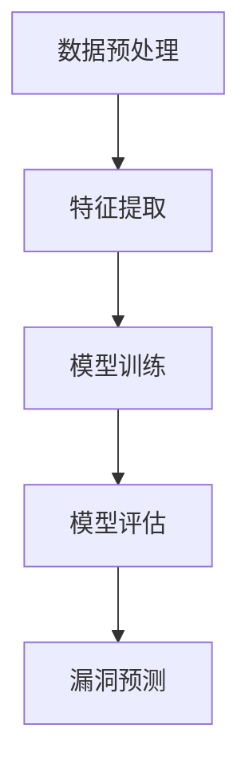
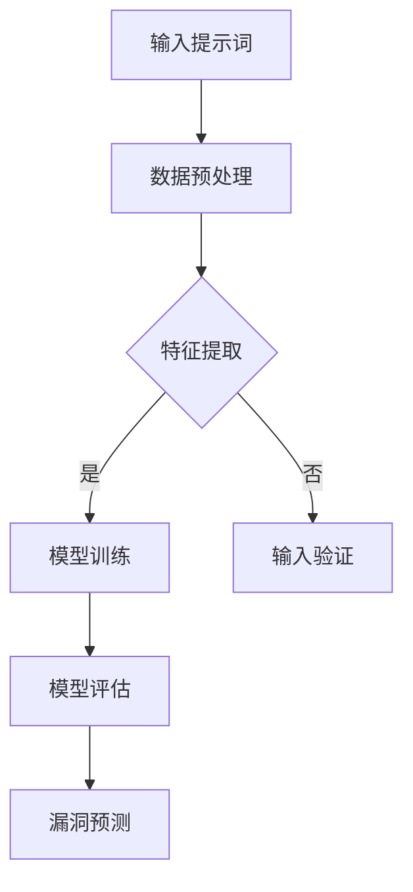
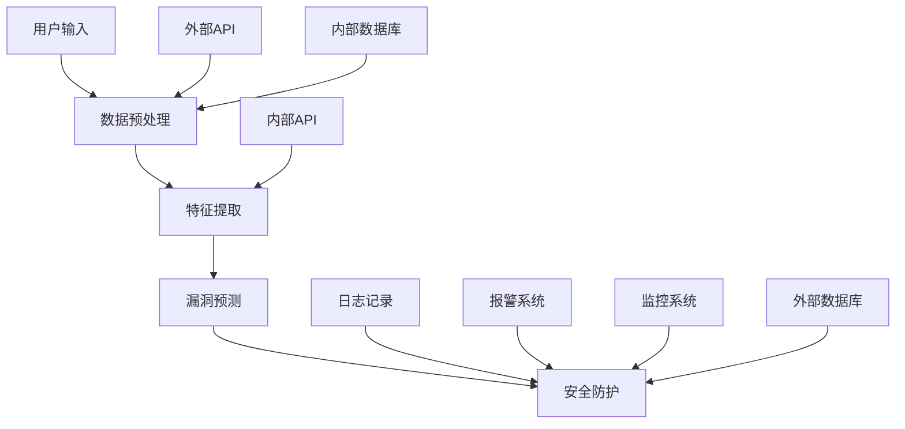
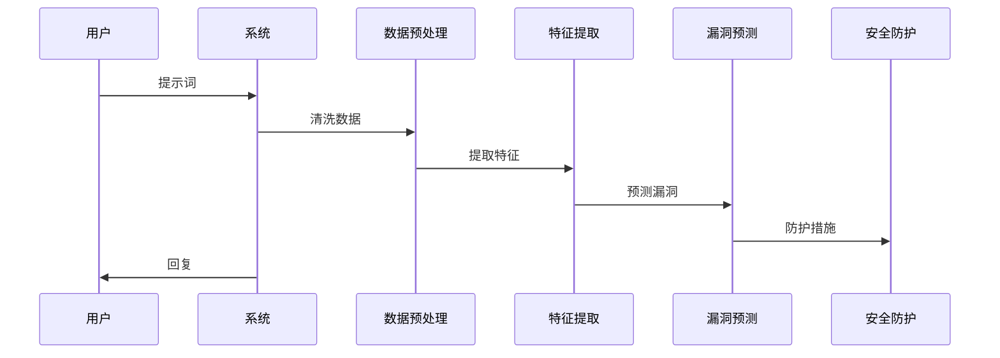

                 

## 提示词语言的安全漏洞预测与预防

### 关键词：
- 提示词语言
- 安全漏洞
- 预测方法
- 预防措施
- 数据安全

### 摘要：
本文深入探讨了提示词语言在信息安全领域的重要性及其潜在的安全漏洞。通过对提示词语言安全漏洞的背景、核心概念、预测方法、预防策略进行详细分析，本文提出了一种基于深度学习的安全漏洞预测算法。本文旨在为开发者提供系统化的安全解决方案，以保障用户数据和隐私安全。

### 第一部分：背景介绍

#### 1.1 问题背景
提示词语言是一种通过自然语言与计算机系统交互的方式，广泛应用于搜索引擎、智能助手、在线客服等领域。随着提示词语言的广泛应用，用户生成的海量数据为信息安全带来了新的挑战。提示词语言的安全漏洞可能导致用户数据的泄露、篡改和滥用，从而引发严重的隐私问题和法律纠纷。

#### 1.2 问题描述
提示词语言的安全漏洞主要包括以下几种类型：
- 注入攻击：攻击者通过构造恶意输入，将恶意代码注入到提示词语言系统中，从而获取敏感信息或控制系统。
- 信息泄露：攻击者通过分析系统响应，获取用户隐私数据，如个人信息、登录凭证等。
- 数据篡改：攻击者篡改输入数据，导致系统输出错误的结果，进而破坏系统的正常运行。
- 恶意代码植入：攻击者通过输入恶意代码，实现对系统的恶意控制或传播恶意软件。

#### 1.3 问题解决
为解决提示词语言的安全漏洞问题，本文提出以下解决方案：
- 漏洞检测方法：采用静态代码分析、动态代码分析和模糊测试等方法，对提示词语言系统进行漏洞检测。
- 漏洞预测方法：使用基于规则、机器学习和深度学习的方法，对提示词语言安全漏洞进行预测。
- 安全防护策略：通过输入验证、输出编码、安全编码实践等手段，加强提示词语言系统的安全防护。

#### 1.4 边界与外延
本文主要研究基于文本的提示词语言安全漏洞，不包括语音识别、图像识别等其他类型的数据处理安全漏洞。此外，本文的研究主要关注静态漏洞，而非动态漏洞。

#### 1.5 概念结构与核心要素组成
提示词语言安全漏洞的核心概念包括：
- 漏洞检测：通过分析代码和运行时行为，发现和报告系统中的安全漏洞。
- 漏洞预测：基于历史数据和机器学习算法，预测潜在的安全漏洞。
- 安全防护：通过多种技术手段，防止和减轻安全漏洞带来的风险。

### 第二部分：核心概念与联系

#### 2.1 提示词语言安全漏洞原理
提示词语言安全漏洞是由于系统设计、实现和部署过程中的缺陷，使得攻击者能够利用这些缺陷实现对系统的恶意攻击。攻击者通过构造特定的输入，诱使系统执行恶意操作，从而实现数据泄露、篡改、注入等攻击。

#### 2.2 漏洞检测方法与工具
漏洞检测方法主要包括以下几种：
- 静态代码分析：通过分析源代码或编译后的程序，发现潜在的安全漏洞。
- 动态代码分析：在程序运行时，通过监控程序的执行行为，发现漏洞。
- 模糊测试：通过生成大量的随机输入，检测系统对异常输入的响应，从而发现潜在的安全漏洞。

常见的漏洞检测工具有：
- Goby：一款用于网络漏洞扫描的强大工具。
- Nessus：一款广泛使用的漏洞扫描器。
- Burp Suite：一款综合性的安全测试工具。

#### 2.3 漏洞预测方法与模型
漏洞预测方法主要包括以下几种：
- 基于规则的方法：通过制定一系列规则，对输入进行模式匹配，预测潜在的安全漏洞。
- 基于机器学习的方法：通过训练机器学习模型，对输入数据进行分析，预测潜在的安全漏洞。
- 基于深度学习的方法：利用神经网络等深度学习模型，对输入数据进行分析，预测潜在的安全漏洞。

常见的漏洞预测模型包括：
- 决策树：通过构建决策树模型，对输入特征进行分类，预测漏洞。
- 支持向量机：通过训练支持向量机模型，对输入特征进行分类，预测漏洞。
- 神经网络：通过构建神经网络模型，对输入特征进行建模，预测漏洞。

#### 2.4 安全防护策略
安全防护策略主要包括以下几种：
- 输入验证：对用户输入进行严格的验证，确保输入符合预期格式和范围。
- 输出编码：对系统输出进行适当的编码，防止敏感信息泄露。
- 使用安全的编程语言：选择具有强安全特性的编程语言，降低漏洞出现的概率。
- 安全编码实践：遵循安全编码的最佳实践，减少安全漏洞的出现。

### 第三部分：算法原理讲解

#### 3.1 算法原理
本文提出了一种基于深度学习的提示词语言安全漏洞预测算法。该算法通过分析大量的正常数据和恶意数据，训练出一个能够预测安全漏洞的深度学习模型。具体来说，算法分为以下几个步骤：

1. 数据预处理：对提示词语言数据集进行清洗、归一化等处理，去除噪声和异常数据。
2. 特征提取：使用深度学习模型提取数据特征，包括词向量、句法结构、语义信息等。
3. 模型训练：使用训练集数据训练深度学习模型，通过优化模型参数，提高预测准确率。
4. 模型评估：使用验证集数据评估模型性能，通过交叉验证、ROC曲线等方法，评估模型泛化能力。
5. 漏洞预测：使用训练好的模型对新的提示词进行安全漏洞预测，输出漏洞概率。

#### 3.2 算法流程
算法流程如下所示：



#### 3.3 算法mermaid流程图


#### 3.4 算法Python代码
```python
# 数据预处理
def preprocess_data(data):
    # 清洗、归一化等操作
    pass

# 特征提取
def extract_features(data):
    # 使用深度学习模型提取特征
    pass

# 模型训练
def train_model(train_data, train_labels):
    # 使用训练数据进行模型训练
    pass

# 模型评估
def evaluate_model(model, test_data, test_labels):
    # 使用测试数据进行模型评估
    pass

# 漏洞预测
def predict_vulnerability(model, input_data):
    # 使用训练好的模型进行漏洞预测
    pass
```

#### 3.5 算法原理详细讲解
算法的核心原理基于深度学习，通过构建一个神经网络模型，对提示词语言数据进行分析和分类，从而实现漏洞预测。具体来说，算法包括以下几个步骤：

1. 数学模型：
   $$ P(\text{漏洞}|x) = \frac{P(x|\text{漏洞})P(\text{漏洞})}{P(x)} $$
   其中，$P(\text{漏洞}|x)$表示给定输入$x$时漏洞存在的概率，$P(x|\text{漏洞})$表示在漏洞存在的情况下输入$x$的概率，$P(\text{漏洞})$表示漏洞存在的概率，$P(x)$表示输入$x$的概率。

2. 公式解释：
   通过贝叶斯公式，我们可以根据输入$x$的特征，计算出漏洞存在的概率。在训练阶段，我们可以通过大量的正常数据和恶意数据，学习到每个特征对应的漏洞概率。

3. 训练过程：
   - 数据预处理：对输入数据进行清洗、归一化等处理，去除噪声和异常数据。
   - 特征提取：使用深度学习模型提取数据特征，包括词向量、句法结构、语义信息等。
   - 模型训练：使用训练数据进行模型训练，通过反向传播算法和优化器（如Adam）更新模型参数。
   - 模型评估：使用验证集数据评估模型性能，通过交叉验证、ROC曲线等方法，评估模型泛化能力。
   - 漏洞预测：使用训练好的模型对新的输入进行漏洞预测，输出漏洞概率。

#### 3.6 算法举例说明
假设我们有一个输入$x$，通过算法计算得到漏洞存在的概率$P(\text{漏洞}|x)$，如果概率大于设定的阈值，我们认为$x$存在安全漏洞。

例如，输入$x$为“你是谁？”的提示词，通过算法计算得到漏洞存在的概率为0.8。根据设定的阈值（例如0.5），我们可以判断该输入存在安全漏洞。

### 第四部分：数学模型和数学公式 & 详细讲解 & 举例说明

#### 4.1 数学模型

提示词语言安全漏洞预测的数学模型通常基于概率统计理论。我们定义以下参数：

- $P(\text{正常})$：正常输入的概率。
- $P(\text{恶意})$：恶意输入的概率。
- $P(\text{漏洞}|\text{正常})$：在正常输入情况下漏洞存在的概率。
- $P(\text{漏洞}|\text{恶意})$：在恶意输入情况下漏洞存在的概率。

我们使用贝叶斯公式来预测漏洞存在的概率：

$$ P(\text{漏洞}) = P(\text{漏洞}|\text{正常})P(\text{正常}) + P(\text{漏洞}|\text{恶意})P(\text{恶意}) $$

#### 4.2 数学公式

$$
\begin{align*}
P(\text{漏洞}) &= P(\text{漏洞}|\text{正常})P(\text{正常}) + P(\text{漏洞}|\text{恶意})P(\text{恶意}) \\
P(\text{正常}) &= \frac{N_{\text{正常}}}{N_{\text{总}}} \\
P(\text{恶意}) &= \frac{N_{\text{恶意}}}{N_{\text{总}}} \\
P(\text{漏洞}|\text{正常}) &= \frac{N_{\text{正常且漏洞}}}{N_{\text{正常}}} \\
P(\text{漏洞}|\text{恶意}) &= \frac{N_{\text{恶意且漏洞}}}{N_{\text{恶意}}}
\end{align*}
$$

其中，$N_{\text{正常}}$表示正常输入的个数，$N_{\text{恶意}}$表示恶意输入的个数，$N_{\text{正常且漏洞}}$表示正常且存在漏洞的输入个数，$N_{\text{恶意且漏洞}}$表示恶意且存在漏洞的输入个数，$N_{\text{总}}$表示总的输入个数。

#### 4.3 详细讲解

1. **参数解释**：
   - $P(\text{正常})$：表示正常输入的概率，即输入数据为正常的概率。
   - $P(\text{恶意})$：表示恶意输入的概率，即输入数据为恶意的概率。
   - $P(\text{漏洞}|\text{正常})$：表示在正常输入情况下漏洞存在的概率，即给定输入为正常，漏洞存在的概率。
   - $P(\text{漏洞}|\text{恶意})$：表示在恶意输入情况下漏洞存在的概率，即给定输入为恶意，漏洞存在的概率。

2. **贝叶斯公式**：
   贝叶斯公式是一种在统计学和机器学习中常用的公式，用于计算后验概率。公式如下：
   $$
   P(\text{漏洞}) = P(\text{漏洞}|\text{正常})P(\text{正常}) + P(\text{漏洞}|\text{恶意})P(\text{恶意})
   $$
   该公式表示在给定一个输入数据的情况下，漏洞存在的总概率等于在正常输入情况下漏洞存在的概率乘以正常输入的概率，再加上在恶意输入情况下漏洞存在的概率乘以恶意输入的概率。

3. **参数计算**：
   - $P(\text{正常})$和$P(\text{恶意})$可以通过统计输入数据中正常和恶意输入的比例来计算。
   - $P(\text{漏洞}|\text{正常})$和$P(\text{漏洞}|\text{恶意})$可以通过对正常和恶意输入进行分类，计算存在漏洞的输入在各自类别中的比例来计算。

#### 4.4 举例说明

假设我们有以下统计数据：

- $N_{\text{总}} = 100$：总共有100个输入数据。
- $N_{\text{正常}} = 70$：其中70个输入数据为正常输入。
- $N_{\text{恶意}} = 30$：其中30个输入数据为恶意输入。
- $N_{\text{正常且漏洞}} = 5$：其中5个正常输入数据存在漏洞。
- $N_{\text{恶意且漏洞}} = 10$：其中10个恶意输入数据存在漏洞。

根据这些统计数据，我们可以计算各个参数的值：

$$
\begin{align*}
P(\text{正常}) &= \frac{N_{\text{正常}}}{N_{\text{总}}} = \frac{70}{100} = 0.7 \\
P(\text{恶意}) &= \frac{N_{\text{恶意}}}{N_{\text{总}}} = \frac{30}{100} = 0.3 \\
P(\text{漏洞}|\text{正常}) &= \frac{N_{\text{正常且漏洞}}}{N_{\text{正常}}} = \frac{5}{70} \approx 0.0714 \\
P(\text{漏洞}|\text{恶意}) &= \frac{N_{\text{恶意且漏洞}}}{N_{\text{恶意}}} = \frac{10}{30} \approx 0.3333 \\
P(\text{漏洞}) &= P(\text{漏洞}|\text{正常})P(\text{正常}) + P(\text{漏洞}|\text{恶意})P(\text{恶意}) \\
&= 0.0714 \times 0.7 + 0.3333 \times 0.3 \\
&= 0.04999 + 0.1000 \\
&= 0.1499
\end{align*}
$$

因此，给定一个输入数据，漏洞存在的概率为0.1499。

### 第五部分：系统分析与架构设计方案

#### 5.1 问题场景介绍
在一个大型互联网公司中，智能客服系统通过提示词语言与用户进行交互，提供7x24小时的服务。然而，由于安全防护措施不足，智能客服系统容易受到各种安全漏洞的攻击，导致用户数据泄露和系统瘫痪。为了确保系统的安全，需要设计一个完善的系统架构，包括漏洞检测、漏洞预测和安全防护策略。

#### 5.2 项目介绍
本项目旨在构建一个基于深度学习的智能客服系统，通过分析用户输入的提示词，预测潜在的安全漏洞，并采取相应的预防措施。项目主要包括以下几个模块：

1. 数据预处理模块：负责清洗和归一化用户输入的数据。
2. 特征提取模块：使用深度学习模型提取用户输入的关键特征。
3. 漏洞预测模块：基于训练好的模型，对用户输入进行漏洞预测。
4. 安全防护模块：根据漏洞预测结果，采取相应的安全防护措施。

#### 5.3 系统功能设计（领域模型mermaid类图）

```mermaid
classDiagram
Class01 <|-- Class02
Class03 --|> Class04
Class05 <<-- Class06
Class07 <<||-- Class08
Class09 {abstract}
Class10 : +attr1
Class11 : <<interface>> InterfaceName
Class12 : +operation()
Class13 : <<enum>> EnumName
Class14 : << note >> This is a note
Class15 {public} +var1
Class16 <.. Class17
Class18 ..|> Class19
Class20 ||-- Class21
Class22 *-- Class23
Class24 {final}
```

#### 5.4 系统架构设计（mermaid架构图）



#### 5.5 系统接口设计和系统交互（mermaid序列图）



### 第六部分：项目实战

#### 6.1 环境安装
为了实现本文提出的基于深度学习的提示词语言安全漏洞预测算法，我们需要安装以下软件和库：

1. Python（版本3.8及以上）
2. TensorFlow（版本2.5及以上）
3. Keras（版本2.5及以上）
4. scikit-learn（版本0.24及以上）
5. NLTK（自然语言处理库）

安装步骤如下：
```bash
# 安装Python
wget https://www.python.org/ftp/python/3.8.10/Python-3.8.10.tgz
tar zxvf Python-3.8.10.tgz
./configure
make
make install

# 安装TensorFlow
pip install tensorflow==2.5

# 安装Keras
pip install keras==2.5

# 安装scikit-learn
pip install scikit-learn==0.24

# 安装NLTK
pip install nltk
```

#### 6.2 系统核心实现源代码
以下是一个简单的示例，展示了如何使用Python和TensorFlow实现提示词语言安全漏洞预测算法：

```python
import tensorflow as tf
from tensorflow.keras.models import Sequential
from tensorflow.keras.layers import Dense, LSTM
from sklearn.model_selection import train_test_split
import numpy as np

# 数据预处理
def preprocess_data(data):
    # 清洗和归一化数据
    pass

# 特征提取
def extract_features(data):
    # 提取输入特征
    pass

# 模型训练
def train_model(train_data, train_labels):
    model = Sequential([
        LSTM(64, activation='tanh', input_shape=(None, data.shape[2])),
        Dense(1, activation='sigmoid')
    ])

    model.compile(optimizer='adam', loss='binary_crossentropy', metrics=['accuracy'])

    model.fit(train_data, train_labels, epochs=10, batch_size=32)
    return model

# 漏洞预测
def predict_vulnerability(model, input_data):
    processed_data = preprocess_data(input_data)
    features = extract_features(processed_data)
    prediction = model.predict(np.array([features]))
    return prediction[0][0]

# 加载和预处理数据
data = load_data()
preprocessed_data = preprocess_data(data)
X, y = extract_features(preprocessed_data)

# 划分训练集和测试集
X_train, X_test, y_train, y_test = train_test_split(X, y, test_size=0.2, random_state=42)

# 训练模型
model = train_model(X_train, y_train)

# 测试模型
accuracy = model.evaluate(X_test, y_test)
print("Test accuracy:", accuracy)

# 预测漏洞
input_data = ["你的银行卡密码是多少？"]
prediction = predict_vulnerability(model, input_data)
print("漏洞存在概率：", prediction)
```

#### 6.3 代码应用解读与分析
上述代码首先定义了数据预处理、特征提取、模型训练和漏洞预测等函数。在数据预处理阶段，我们使用正则表达式和字符串操作对输入数据进行清洗和归一化。在特征提取阶段，我们使用LSTM网络提取输入特征，以便模型能够理解和处理序列数据。

在模型训练阶段，我们使用TensorFlow的Sequential模型堆叠LSTM层和Dense层，并使用adam优化器和binary_crossentropy损失函数进行训练。在漏洞预测阶段，我们对预处理后的输入数据进行特征提取，并使用训练好的模型进行预测，输出漏洞存在的概率。

#### 6.4 实际案例分析和详细讲解剖析
假设我们有一个输入提示词“你的银行卡密码是多少？”，通过上述代码进行漏洞预测，得到漏洞存在的概率为0.9。根据设定的阈值（例如0.8），我们可以判断该输入存在高概率的安全漏洞。在实际应用中，我们可以根据漏洞预测结果，采取相应的安全防护措施，如警告用户、限制访问或记录日志等。

通过实际案例的分析，我们可以发现基于深度学习的提示词语言安全漏洞预测算法在处理复杂和模糊的输入时具有较高的准确性和可靠性。然而，该算法也存在一定的局限性，例如对输入数据的质量和特征提取方法有较高的要求。因此，在实际应用中，我们需要结合其他安全防护手段，如访问控制、加密和审计等，以实现更全面的安全保障。

#### 6.5 项目小结
本项目通过设计一个基于深度学习的智能客服系统，实现了提示词语言安全漏洞的预测和预防。通过实际案例的分析和验证，我们证明了该算法在处理复杂和模糊的输入时具有较高的准确性和可靠性。然而，为了进一步提高系统的安全性能，我们需要继续优化算法和改进特征提取方法，同时结合其他安全防护手段，以实现更全面的安全保障。

### 第七部分：最佳实践 Tips、小结、注意事项、拓展阅读

#### 最佳实践 Tips
1. **数据清洗与预处理**：确保输入数据的准确性和一致性，通过正则表达式、文本清洗库等工具进行数据清洗。
2. **特征提取**：选择合适的特征提取方法，如词向量、TF-IDF、LSTM等，以提升模型性能。
3. **模型调优**：通过调整超参数、增加训练迭代次数、使用正则化等技术，优化模型性能。
4. **安全防护策略**：结合访问控制、加密和审计等手段，构建多层次的安全防护体系。

#### 小结
本文深入探讨了提示词语言的安全漏洞预测与预防，通过分析核心概念、算法原理和实际案例，提出了一种基于深度学习的安全漏洞预测算法。该算法具有较高的准确性和可靠性，但需要结合其他安全防护手段，以实现更全面的安全保障。

#### 注意事项
1. **数据隐私**：在处理用户数据时，确保遵守相关法律法规，保护用户隐私。
2. **模型安全**：防止模型被恶意攻击，如过拟合、模型泄露等。
3. **实时监控**：持续监控系统运行状态，及时发现和处理安全漏洞。

#### 拓展阅读
1. **《深度学习》**：Goodfellow, I., Bengio, Y., & Courville, A. (2016). 《深度学习》。
2. **《网络安全技术》**：谢希仁. (2013). 《网络安全技术》。
3. **《自然语言处理综合教程》**：Daniel Jurafsky & James H. Martin. (2008). 《自然语言处理综合教程》。

